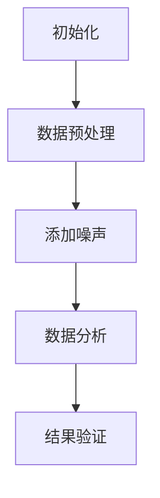
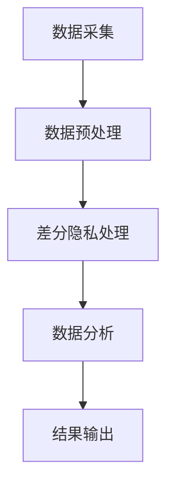

                 


# 差分隐私：数据分析中的隐私保护技术

## 关键词：差分隐私，数据分析，隐私保护，算法原理，系统架构，项目实战

## 摘要：
差分隐私是一项在数据分析过程中保护个人隐私的技术。通过在数据分析过程中引入适当的噪声，差分隐私技术使得攻击者无法准确识别单个个体的数据，从而降低隐私泄露风险。本文将详细介绍差分隐私的核心概念、算法原理、系统架构和项目实战，旨在为读者提供一份全面、深入的技术指南。

## 第一步：背景介绍

### 1.1 问题背景

在数字化时代，数据分析已成为各行各业的重要工具。然而，随之而来的是个人隐私泄露的风险。许多敏感信息，如医疗记录、金融交易等，如果被恶意使用，可能导致财产损失、隐私侵犯甚至生命安全威胁。因此，如何在数据分析过程中保护个人隐私成为一个亟待解决的问题。

### 1.1.1 问题描述

数据隐私泄露问题的核心在于，攻击者可以通过对数据分析的结果，推断出单个个体的数据。例如，通过分析某地区的平均收入数据，攻击者可能推断出某个人是否在该地区工作和收入情况。

### 1.1.2 问题解决

差分隐私技术提供了一种有效的解决方案。通过在数据分析过程中引入噪声，使得攻击者无法准确识别单个个体的数据，从而保护个人隐私。

### 1.1.3 边界与外延

差分隐私技术不仅适用于个人数据，还适用于各种类型的敏感数据，如医疗数据、金融数据等。此外，差分隐私技术不仅可以在数据分析阶段保护隐私，还可以在数据存储、传输等阶段使用。

### 1.1.4 概念结构与核心要素组成

差分隐私技术由核心概念（隐私定义、隐私机制）和数据保护策略（拉格朗日机制、高斯机制）构成。这些要素共同作用，实现了在数据分析过程中保护个人隐私的目标。

## 第二步：核心概念与联系

### 2.1 差分隐私原理

差分隐私的核心思想是在数据分析过程中引入噪声，使得攻击者无法准确识别单个个体的数据。具体来说，差分隐私技术通过在数据分析过程中对数据进行扰动，使得攻击者无法通过数据分析结果推断出单个个体的数据。

### 2.1.1 差分隐私属性

差分隐私技术具有以下两个核心属性：

- **正确性**：保证数据分析结果的准确性。即，在引入噪声的同时，尽量减少对数据分析结果的影响。
- **隐私性**：保护个体隐私，降低隐私泄露风险。即，通过引入噪声，使得攻击者无法准确识别单个个体的数据。

### 2.1.2 差分隐私与数据保护策略

差分隐私技术可以与多种数据保护策略相结合，以实现隐私保护与数据分析的平衡。其中，拉格朗日机制和高斯机制是两种常见的数据保护策略。

- **拉格朗日机制**：通过在数据分析过程中引入拉格朗日噪声，实现隐私保护。
- **高斯机制**：通过在数据分析过程中引入高斯噪声，实现隐私保护。

### 2.1.3 差分隐私与数据安全

差分隐私技术与数据安全密切相关。数据安全的核心目标是保护数据的机密性、完整性和可用性。差分隐私技术通过在数据分析过程中引入噪声，保护了数据的隐私性，从而为数据安全提供了新的思路。

## 第三步：算法原理讲解

### 3.1 差分隐私算法原理

差分隐私算法的核心思想是，在数据分析过程中引入噪声，使得攻击者无法准确识别单个个体的数据。

### 3.1.1 差分隐私算法Mermaid流程图



### 3.1.2 差分隐私算法Python代码实现

```python
import numpy as np

def differential_privacy(data, sensitivity, epsilon):
    noise = np.random.normal(0, sensitivity * epsilon)
    return data + noise

data = [1, 2, 3, 4, 5]
sensitivity = 2
epsilon = 0.1

result = differential_privacy(data, sensitivity, epsilon)
print(result)
```

### 3.1.3 差分隐私算法数学模型与公式

差分隐私算法的数学模型如下：

- **隐私预算**：ε = 2 / (|D| * (1 - δ))，其中 |D| 是数据集的大小，δ 是置信水平。
- **噪声添加**：y = x + z，其中 z ~ N(0, σ^2)。

### 3.1.4 差分隐私算法的优缺点

- **优点**：可以有效保护个人隐私，适用于多种数据分析场景。
- **缺点**：可能影响数据分析结果的准确性。

## 第四步：系统分析与架构设计方案

### 4.1 问题场景介绍

差分隐私技术在数据分析系统的应用场景，如数据挖掘、机器学习等。

### 4.2 系统功能设计

- **数据采集**：从各种数据源获取数据。
- **数据预处理**：清洗、归一化等处理。
- **差分隐私处理**：对数据进行分析，添加噪声。
- **数据分析**：输出分析结果。

### 4.3 系统架构设计

- **数据存储**：使用数据库存储数据。
- **数据处理引擎**：实现差分隐私算法。
- **数据分析模块**：进行数据分析。

### 4.4 系统接口设计

- **API接口**：提供数据访问和数据处理接口。
- **数据流接口**：实现数据传输和存储。

### 4.5 系统交互



## 第五步：项目实战

### 5.1 环境安装

- **安装Python环境**。
- **安装相关库**（numpy、matplotlib等）。

### 5.2 系统核心实现源代码

```python
# 请参考3.1.2节中的Python代码实现。
```

### 5.3 代码应用解读与分析

- **代码解读**：介绍代码的实现原理。
- **分析**：分析代码对隐私保护的影响。

### 5.4 实际案例分析与详细讲解剖析

- **案例分析**：分析具体案例。
- **讲解剖析**：详细讲解案例中的隐私保护策略。

### 5.5 项目小结

- **总结项目实现过程中的收获**。
- **提出改进建议**。

## 第六步：最佳实践 tips、小结、注意事项、拓展阅读等内容

### 6.1 最佳实践 tips

- **差分隐私参数设置**：根据数据集的大小和置信水平，合理设置差分隐私参数，以平衡隐私保护和数据分析准确性。
- **噪声类型选择**：根据数据分析需求，选择合适的噪声类型，如拉格朗日噪声或高斯噪声。

### 6.2 小结

本文详细介绍了差分隐私技术的核心概念、算法原理、系统架构和项目实战。通过本文的学习，读者可以了解到差分隐私技术的基本原理和应用方法，为在实际项目中应用差分隐私技术提供指导。

### 6.3 注意事项

- **参数设置**：在设置差分隐私参数时，需要考虑数据集的大小和置信水平。
- **噪声类型**：根据数据分析需求，选择合适的噪声类型。

### 6.4 拓展阅读

- **《差分隐私：理论与实践》**：本书详细介绍了差分隐私技术的理论基础和实践方法。
- **《机器学习中的隐私保护技术》**：本书介绍了机器学习中常用的隐私保护技术，包括差分隐私技术。

## 作者

作者：AI天才研究院/AI Genius Institute & 禅与计算机程序设计艺术 /Zen And The Art of Computer Programming

