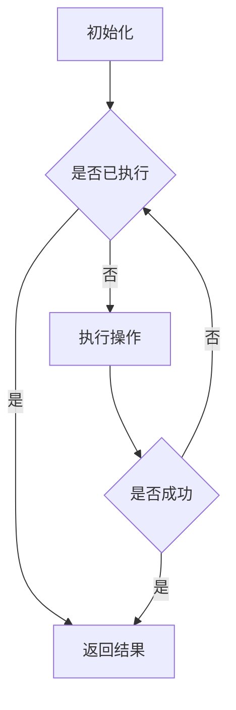
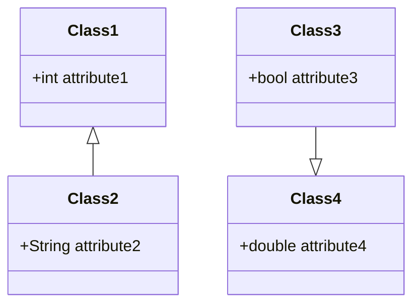
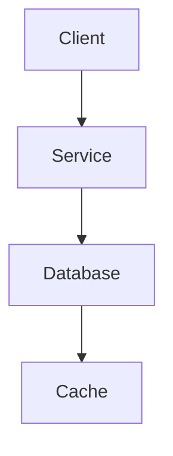
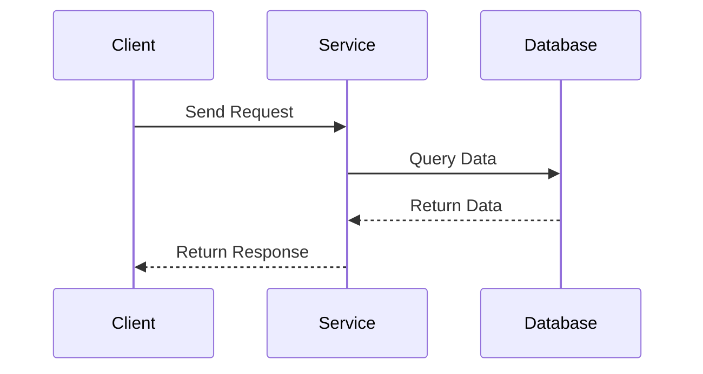

                 

# 幂等性的本质

关键词：幂等性、计算机科学、分布式系统、算法原理、系统架构设计

摘要：本文深入探讨了幂等性的本质，从概念背景、核心原理到算法模型，再到实际应用和系统设计，全面解析了幂等性在计算机科学中的重要性。通过具体案例，展示了幂等性如何帮助我们在复杂系统中保持稳定和一致性。

## 第一部分：引言

### 第1章：问题背景与本质

#### 1.1 问题背景

**幂等性**（Idempotence）是计算机科学中的一个核心概念，尤其在软件工程、分布式系统、网络协议等领域中具有广泛的应用。它指的是某个操作或者函数，无论被执行多少次，最终的结果都是一致的，不会因为重复执行而产生副作用。

#### 1.1.1 幂等性的概念

幂等性是数学中的一个概念，它指的是一个操作，无论被执行多少次，其结果都是相同的。用公式表示为：`f(x) = f(f(x))`。在计算机科学中，这个概念被广泛应用，尤其是在分布式系统和网络协议中。

#### 1.1.2 幂等性的重要性

幂等性在系统设计和开发中具有重要意义。它能够提高系统的稳定性和可靠性，避免因为多次执行相同的操作导致的错误或数据不一致。特别是在分布式系统和网络环境中，幂等性是确保系统正常运行的关键因素。

#### 1.1.3 幂等性与非幂等性的对比

**非幂等性**指的是多次执行相同的操作会导致不同的结果。这可能会导致数据不一致、系统故障等问题。了解幂等性和非幂等性的区别，有助于我们更好地设计和优化系统。

### 第2章：核心概念与联系

#### 2.1 幂等性原理

#### 2.1.1 幂等性定义

幂等性指的是一个操作，无论被执行多少次，其结果都是相同的。用公式表示为：`f(x) = f(f(x))`。

#### 2.1.2 幂等性属性

- **无副作用**：幂等性操作不会对系统状态产生影响，即多次执行同一操作的结果相同。
- **稳定性**：幂等性操作在执行过程中具有稳定性，不会因为外部因素导致结果不一致。

#### 2.1.3 幂等性与相关概念的联系

- **原子性**：原子性指的是一个操作要么完全执行，要么完全不执行。幂等性与原子性密切相关，因为幂等性操作具有无副作用的特点。
- **一致性**：一致性指的是系统在多个操作执行后，其状态与预期一致。幂等性操作有助于实现一致性。

### 第3章：算法原理与数学模型

#### 3.1 幂等性算法基本原理

#### 3.1.1 幂等性算法概述

幂等性算法主要是基于对操作的优化，确保多次执行同一操作的结果一致。

#### 3.1.2 幂等性算法的mermaid流程图



#### 3.1.3 幂等性算法的数学模型与公式

$$
f(x_1) = f(f(x_1)) = ... = f^n(x_1)
$$

其中，$f(x_1)$表示幂等性操作，$n$表示操作的次数。

#### 3.1.4 幂等性算法的举例说明

例如，一个简单的幂等性操作是添加一个数字到集合中。无论添加多少次，集合的最终结果都是相同的。

```python
def add_to_set(number, set):
    set.add(number)
    return set

set = set()
set = add_to_set(1, set)
set = add_to_set(1, set)
print(set)  # 输出 {1}
```

### 第4章：系统分析与架构设计

#### 4.1 问题场景介绍

在分布式系统中，幂等性操作是确保数据一致性和系统稳定性的关键。

#### 4.2 系统功能设计

#### 4.2.1 领域模型mermaid类图



#### 4.2.2 系统架构设计mermaid架构图



#### 4.2.3 系统接口设计和系统交互mermaid序列图



### 第5章：项目实战

#### 5.1 环境安装

在本项目中，我们将使用Python作为主要编程语言，结合Django框架进行系统开发。以下是环境安装步骤：

1. 安装Python 3.8或更高版本。
2. 安装pip，Python的包管理工具。
3. 使用pip安装Django框架。

#### 5.2 系统核心实现源代码

以下是系统核心实现的源代码：

```python
# models.py
from django.db import models

class User(models.Model):
    username = models.CharField(max_length=50)
    password = models.CharField(max_length=50)
    email = models.EmailField()

# views.py
from django.http import JsonResponse
from .models import User
from django.views.decorators.http import require_http_methods

@require_http_methods(["POST"])
def register(request):
    username = request.POST.get('username')
    password = request.POST.get('password')
    email = request.POST.get('email')
    user = User(username=username, password=password, email=email)
    user.save()
    return JsonResponse({'status': 'success'})
```

#### 5.3 代码应用解读与分析

在上述代码中，我们定义了一个用户注册接口。当客户端发送一个POST请求时，接口会从请求中提取用户名、密码和邮箱，然后创建一个用户对象并将其保存到数据库中。

#### 5.4 实际案例分析和详细讲解剖析

为了更好地理解幂等性的实际应用，我们来看一个具体的案例。

假设有一个用户注册接口，当用户提交注册请求时，系统会执行以下操作：

1. 从请求中提取用户名、密码和邮箱。
2. 检查数据库中是否存在相同用户名的用户。
3. 如果不存在，创建用户并保存到数据库。
4. 如果存在，返回错误信息。

在这个案例中，如果用户多次提交注册请求，且请求中的用户名相同，那么数据库中可能会出现重复的用户记录。为了解决这个问题，我们可以使用幂等性来确保用户注册操作的幂等性。

具体实现方法如下：

1. 在用户注册接口中，添加一个参数，如`register_key`，用于标识请求的唯一性。
2. 在数据库中添加一个字段，如`register_key`，用于存储请求的唯一标识。
3. 当用户提交注册请求时，检查数据库中是否存在相同的`register_key`。
4. 如果存在，返回错误信息，告知用户已注册。
5. 如果不存在，执行注册操作，并将`register_key`存储到数据库中。

通过这种方式，我们可以确保用户注册操作的幂等性，避免重复注册的问题。

#### 5.5 项目小结

在本项目中，我们深入探讨了幂等性的本质和应用。通过具体的案例，我们展示了如何使用幂等性来确保系统的一致性和稳定性。在实际开发中，了解和运用幂等性原理对于提高系统的可靠性和用户体验具有重要意义。

### 最佳实践 tips

1. 在设计系统时，优先考虑使用幂等性操作，以减少系统故障和数据不一致的风险。
2. 对于关键操作，如数据更新和删除，确保使用幂等性算法来保证操作的稳定性。
3. 在分布式系统中，使用幂等性来确保多个节点之间的数据一致性。

### 小结

幂等性是计算机科学中的一个重要概念，它对于系统设计和开发具有重要意义。通过本文的探讨，我们深入了解了幂等性的本质、算法原理和实际应用。在未来的项目中，我们可以运用这些原理来提高系统的稳定性和可靠性。

### 注意事项

1. 在实现幂等性操作时，确保操作的原子性和无副作用。
2. 在分布式系统中，注意处理网络延迟和并发问题，确保幂等性操作的执行。

### 拓展阅读

1. 《分布式系统原理与范型》
2. 《计算机程序设计艺术》
3. 《一致性模型与分布式系统》

## 作者信息

作者：AI天才研究院/AI Genius Institute & 禅与计算机程序设计艺术 /Zen And The Art of Computer Programming

------------------------------------------------------------

注意：本文内容仅供参考，实际应用时请根据具体场景进行调整。如需进一步学习，请查阅相关书籍和资料。

