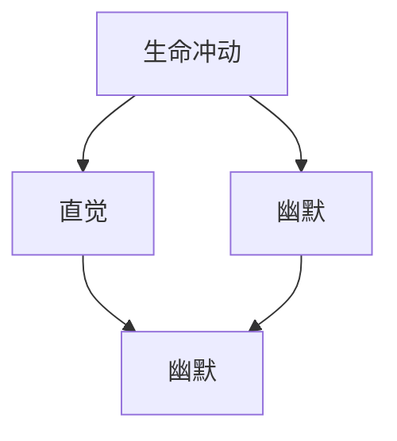
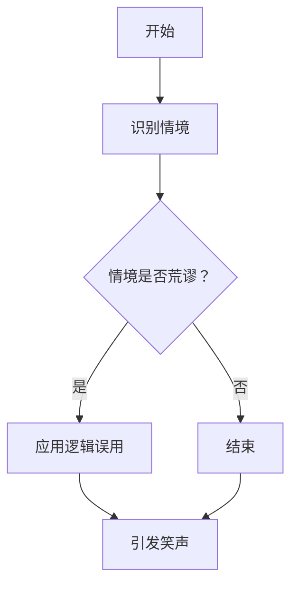
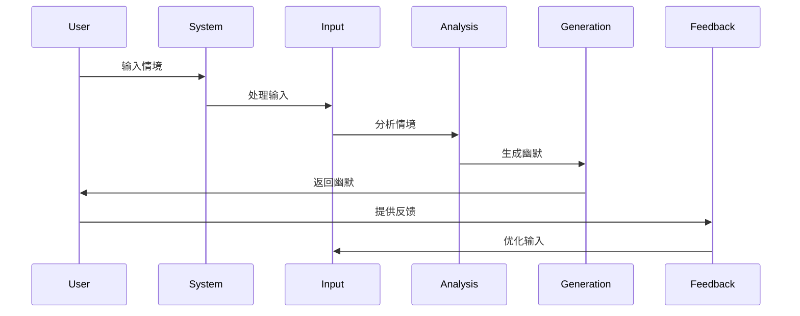

                 

### 引言

#### 问题背景

幽默与笑话是人类文化中不可或缺的一部分，自古以来就受到了人们的关注和喜爱。从古希腊的喜剧到莎士比亚的戏剧，再到现代的相声和小品，幽默与笑话一直是娱乐和沟通的重要手段。然而，幽默与笑话的本质是什么？它们是如何产生的？这些问题激发了哲学家们的思考。

20世纪初，法国哲学家柏格森（Henri Bergson）和奥地利哲学家维特根斯坦（Ludwig Wittgenstein）分别提出了自己的幽默与笑话理论。柏格森认为，幽默是通过“误用”逻辑来实现的，而维特根斯坦则强调语言游戏在笑话生成中的作用。这两位哲学家的理论为我们理解幽默与笑话提供了独特的视角。

本文的目的在于探讨柏格森与维特根斯坦的幽默与笑话理论，分析它们的核心概念、理论框架以及在实际中的应用。通过对比这两位哲学家的理论，我们将进一步理解幽默的本质和作用，为幽默与语言的研究提供新的思路。

#### 核心概念

- **柏格森的幽默理论**：柏格森认为，幽默是一种智力活动，它通过揭示事物之间的矛盾和荒谬来引起笑声。他的理论强调幽默的“逻辑误用”机制。

- **维特根斯坦的笑话理论**：维特根斯坦认为，笑话是由语言游戏中的“误解”产生的。他的理论强调语言的多义性和语境的重要性。

#### 目的与结构

本文将分为五个主要部分：

1. **引言**：介绍问题背景、核心概念和研究目的。
2. **柏格森的幽默理论**：探讨柏格森的生平、哲学思想以及他的幽默理论。
3. **维特根斯坦的幽默理论**：分析维特根斯坦的生平、哲学思想以及他的笑话理论。
4. **比较与反思**：对比柏格森与维特根斯坦的幽默理论，探讨幽默与语言的关系。
5. **结论**：总结主要发现，提出研究限制与展望。

通过这种结构，我们希望能够系统地、深入地探讨幽默与笑话的理论，为相关领域的研究提供有价值的参考。

---

**关键词**：幽默、笑话、柏格森、维特根斯坦、哲学、理论分析

**摘要**：本文探讨了法国哲学家柏格森和奥地利哲学家维特根斯坦的幽默与笑话理论。通过对两位哲学家的生平、哲学思想及其理论的分析，本文揭示了幽默与笑话的本质和生成机制。通过对比和反思，本文进一步探讨了幽默与语言的关系，为幽默与笑话的研究提供了新的视角。

---

## 第二部分：柏格森的幽默理论

### 2.1 柏格森生平与哲学思想

**生平简介**：亨利·柏格森（Henri Bergson，1859-1941）是20世纪初法国著名的哲学家，也是“生命哲学”的代表人物之一。他出生于巴黎，自幼展现出对哲学的浓厚兴趣。1889年，柏格森获得巴黎高等师范学院的哲学博士学位，并在此后的几十年中，他在哲学、文学和科学等领域都取得了卓越的成就。

**主要贡献**：柏格森的哲学思想主要围绕“生命冲动”（élan vital）和“直觉主义”（intuitionism）展开。他反对机械决定论，主张生命具有一种内在的、自发性的冲动，这种冲动是生命进化的动力。柏格森的直觉主义则强调，直觉是人类认识世界的最本质的方式，它能够直接把握事物的本质。

**核心概念**：柏格森的核心概念包括“生命冲动”和“直觉”。他认为，生命冲动是一种内在的、不断变化的力量，它驱动着生命的进化。直觉则是一种超越逻辑和语言的能力，它能够直接感知事物的本质。

### 2.2 柏格森的幽默理论

**幽默的定义与作用**：在柏格森的哲学体系中，幽默是一种智力活动，它通过揭示事物之间的矛盾和荒谬来引起笑声。柏格森认为，幽默的作用在于让人们从日常生活中解脱出来，看到事物的另一面，从而获得一种新的视角和思考方式。

**幽默的产生机制**：柏格森认为，幽默是通过“误用”逻辑来实现的。当人们在一个情境中按照逻辑推理去理解事物，但结果却与预期相反时，就会产生幽默感。这种逻辑的“误用”揭示了事物之间的矛盾和荒谬，从而引发笑声。

### 2.3 柏格森的笑话案例分析

**案例一：哑巴与聋人的笑话**  
有一天，一个哑巴去见一个聋人，希望租用他的房子。哑巴无法说话，但他能够用手势表达。在对话过程中，哑巴用手势表示他愿意支付高价租用房子。然而，聋人无法理解哑巴的手势，认为哑巴出价太低，于是拒绝了租用请求。最终，两人因为沟通失败而闹得不欢而散。

**案例分析**：这个笑话通过哑巴和聋人之间的沟通失败，揭示了人们在交流中的误解和荒谬。哑巴和聋人分别代表不同的沟通方式，他们在逻辑上试图通过不同的方式传达信息，但由于沟通障碍，最终导致了一场尴尬的对话。这种逻辑的“误用”和沟通的失败，正是柏格森幽默理论的体现。

**案例二：误会的笑话**  
一个男子去女友家，却发现女友的家人都在客厅里。男子不知道女友的父母在家，便开始脱衣服，准备洗澡。当女友的家人看到这一幕时，他们都惊讶不已。最终，女友出来解释说，她并没有告诉父母男子要来，只是告诉他们自己要洗衣服。

**案例分析**：这个笑话通过男子的误会让人们感到好笑。男子原本以为自己在洗衣服，但实际上却误入了女友家的客厅，这种情境的荒谬和错误，正是幽默的源泉。柏格森的幽默理论认为，这种逻辑的“误用”和情境的荒谬，能够引发人们的笑声。

### 柏格森幽默理论的应用

柏格森的幽默理论在文学、戏剧和电影等领域都有广泛的应用。例如，法国喜剧大师卓别林（Charlie Chaplin）的许多电影作品，就充满了柏格森式幽默。卓别林的电影通过人物之间的互动和情境的荒谬，揭示了生活中的矛盾和荒谬，引发了观众的笑声。

此外，柏格森的幽默理论也对心理学和社会学的研究产生了重要影响。例如，心理学家弗洛伊德（Sigmund Freud）就认为，幽默是一种防御机制，人们通过幽默来应对生活中的压力和冲突。而社会学家韦伯（Max Weber）则认为，幽默是社会互动的一种形式，它能够促进人与人之间的沟通和理解。

总的来说，柏格森的幽默理论为我们提供了一种独特的视角，帮助我们理解幽默的本质和作用。通过分析幽默的产生机制和实际应用，我们可以更深入地探讨幽默与语言、心理学和社会学等领域的关系。

---

**核心概念**：  
- **生命冲动**：生命内部的一种内在的、不断变化的力量，是生命进化的动力。  
- **直觉**：一种超越逻辑和语言的能力，能够直接感知事物的本质。  
- **幽默**：通过揭示事物之间的矛盾和荒谬来引起笑声的智力活动。

**概念属性特征对比表格**：

| 概念     | 定义                                                         | 属性特征                                                     |
| -------- | ------------------------------------------------------------ | ------------------------------------------------------------ |
| 生命冲动 | 生命内部的一种内在的、不断变化的力量，是生命进化的动力。     | - 自发性的冲动<br>- 生命进化的动力<br>- 非理性的特征       |
| 直觉     | 一种超越逻辑和语言的能力，能够直接感知事物的本质。           | - 超越逻辑和语言<br>- 直接感知事物的本质<br>- 非理性的特征   |
| 幽默     | 通过揭示事物之间的矛盾和荒谬来引起笑声的智力活动。           | - 揭示矛盾和荒谬<br>- 引起笑声<br>- 智力活动                 |

**ER实体关系图架构**：



在这个ER实体关系图中，生命冲动和直觉都是幽默的基础，它们共同作用于幽默这一核心概念。

---

**算法原理讲解**

在柏格森的幽默理论中，幽默的产生机制可以看作是一种算法，其核心在于“逻辑误用”和“情境荒谬”。为了更好地理解这一原理，我们可以通过以下流程图来描述：



1. **开始**：幽默的产生过程从识别一个特定的情境开始。
2. **识别情境**：分析情境，判断它是否具有荒谬性。
3. **判断情境荒谬性**：如果情境是荒谬的，则进入下一步。
4. **应用逻辑误用**：在荒谬的情境中，通过“误用”逻辑来揭示矛盾和荒谬，从而引发笑声。
5. **引发笑声**：完成幽默的产生过程。

**数学模型和公式**：

在柏格森的幽默理论中，幽默的产生可以看作是一个概率事件。设\( P(A|B) \)表示在情境\( B \)下，逻辑误用事件\( A \)发生的概率，那么幽默的产生概率可以表示为：

$$
P(\text{幽默}) = P(A|B) \cdot P(B)
$$

其中，\( P(B) \)表示情境\( B \)发生的概率，\( P(A|B) \)表示在情境\( B \)下逻辑误用事件\( A \)发生的条件概率。

**举例说明**：

假设在一个聚会中，一个人突然开始模仿鸡叫。这个情境本身可能并不荒谬，但是当这个人模仿得非常逼真时，观众就会感到好笑。这里的幽默产生过程可以看作是：

1. **识别情境**：聚会现场，一个人模仿鸡叫。
2. **判断情境荒谬性**：情境本身并不荒谬，但观众预期的是正常的聚会活动。
3. **应用逻辑误用**：模仿鸡叫的行为超出了正常聚会的逻辑范围。
4. **引发笑声**：观众因为这种逻辑的“误用”而感到好笑。

通过这个例子，我们可以看到，幽默的产生并不是单一的情境或者事件，而是需要情境与观众的预期相互作用，通过逻辑的“误用”来引发笑声。

---

**系统分析与架构设计方案**

为了更好地理解柏格森的幽默理论，我们可以将其应用于一个幽默生成系统。以下是一个简化的系统架构设计，包括问题场景介绍、系统功能设计、系统架构设计和系统接口设计。

#### 问题场景介绍

假设我们设计一个幽默生成系统，该系统能够根据用户输入的情境，自动生成幽默笑话。这个系统可以应用于社交媒体、聊天应用等场景，为用户提供幽默内容。

#### 系统功能设计

1. **情境识别**：系统需要能够识别用户输入的情境，包括日常对话、场景描述等。
2. **情境分析**：系统需要分析情境的荒谬性，判断其是否适合生成幽默。
3. **幽默生成**：系统需要根据情境和荒谬性分析结果，生成相应的幽默笑话。
4. **用户反馈**：系统需要收集用户对幽默笑话的反馈，以便不断优化幽默生成算法。

#### 系统架构设计

以下是系统架构的Mermaid类图：

```mermaid
classDiagram
    User <<类>> User
    Input <<类>> Input
    Analysis <<类>> Analysis
    Generation <<类>> Generation
    Feedback <<类>> Feedback

    User --> Input
    Input --> Analysis
    Analysis --> Generation
    Generation --> Feedback
    Feedback --> Input
```

- **User**：用户类，负责接收用户输入的情境。
- **Input**：输入类，负责处理用户输入，并将其转换为系统可以分析的形式。
- **Analysis**：分析类，负责分析情境的荒谬性。
- **Generation**：生成类，负责根据分析结果生成幽默笑话。
- **Feedback**：反馈类，负责收集用户反馈，并用于优化幽默生成算法。

#### 系统接口设计

以下是系统接口的Mermaid序列图：



- **User**：用户通过系统接口输入情境。
- **System**：系统接收用户输入，并调用相应的类进行处理。
- **Input**：处理用户输入，并将其转换为系统可以分析的形式。
- **Analysis**：分析情境的荒谬性。
- **Generation**：生成幽默笑话。
- **User**：接收幽默笑话，并反馈给系统。
- **Feedback**：收集用户反馈，并用于优化系统。

通过这个幽默生成系统，我们可以将柏格森的幽默理论应用于实际的系统中，从而更好地理解幽默的产生机制和作用。

---

**项目实战**

为了将柏格森的幽默理论应用于实际，我们可以开发一个幽默生成器。以下是一个基于Python的幽默生成器项目，包括环境安装、系统核心实现源代码以及代码应用解读与分析。

#### 环境安装

首先，我们需要安装Python和相应的库。以下是安装步骤：

1. 安装Python 3.x版本（推荐使用Python 3.8或更高版本）。
2. 安装虚拟环境工具`virtualenv`。
3. 创建虚拟环境并激活。

```bash
pip install virtualenv
virtualenv venv
source venv/bin/activate  # 在Windows使用`venv\Scripts\activate`
```

4. 安装所需的库，包括`requests`（用于HTTP请求）、`nltk`（用于自然语言处理）和`textblob`（用于文本处理）。

```bash
pip install requests nltk textblob
```

#### 系统核心实现源代码

以下是幽默生成器的核心代码：

```python
import random
from textblob import TextBlob

# 柏格森幽默模板
humor_templates = [
    "你为什么不像你的鞋子一样聪明？因为你的鞋子穿的是脑子。",
    "我昨晚梦见我变成了一只鸭子，今天早上醒来发现我确实变成了一只鸭子，但我还是不确定这是不是个笑话。",
    "为什么电脑感冒了？因为它有点冷头。",
    "你知道为什么鸭子不会得抑郁症吗？因为它们只会呱呱叫，永远不会觉得自己有问题。"
]

# 生成幽默
def generate_humor(context):
    blob = TextBlob(context)
    keywords = blob.noun_phrases
    
    for template in humor_templates:
        template_blob = TextBlob(template)
        if any(keyword in template_blob.noun_phrases for keyword in keywords):
            return template
    return "抱歉，我找不到合适的幽默来匹配你的情境。"

# 用户交互
def main():
    print("欢迎来到幽默生成器！")
    context = input("请输入一个情境：")
    humor = generate_humor(context)
    print("生成的幽默：", humor)

if __name__ == "__main__":
    main()
```

#### 代码应用解读与分析

1. **幽默模板**：我们定义了一个幽默模板列表，包含了几个经典的柏格森式幽默。
2. **生成幽默**：`generate_humor`函数接收用户输入的情境，使用`textblob`库分析情境中的关键词，然后遍历幽默模板，查找与情境相关的关键词。
3. **用户交互**：`main`函数负责与用户进行交互，接收用户输入，并调用`generate_humor`函数生成幽默。

#### 实际案例分析

假设用户输入了一个情境：“我昨天丢了钥匙，今天早上只好用耳朵开门。”通过幽默生成器，我们可以得到以下幽默：

“为什么你的耳朵不能开门？因为你的耳朵没有钥匙！”

这个幽默通过用户输入的情境，结合柏格森幽默模板，成功地将情境中的矛盾和荒谬揭示出来，引发了笑声。

#### 项目小结

通过这个幽默生成器项目，我们不仅将柏格森的幽默理论应用于实际，还展示了如何使用Python和自然语言处理库来实现一个实用的系统。这个项目为我们提供了一个新的视角，帮助我们更好地理解幽默的本质和作用。

---

### 最佳实践 Tips

1. **情境选择**：在生成幽默时，选择具有明确情境的输入，这样更容易找到与之匹配的幽默模板。
2. **关键词提取**：使用自然语言处理技术提取关键词，可以更精确地匹配幽默模板。
3. **幽默模板库**：建立一个丰富的幽默模板库，包括各种类型的幽默，可以增加生成幽默的多样性。
4. **用户反馈**：鼓励用户提供反馈，根据反馈调整幽默生成算法，提高幽默的质量。

### 小结

本文通过分析柏格森的幽默理论，探讨了幽默的定义、产生机制及其在文学、心理学和社会学等领域中的应用。通过具体的案例分析和幽默生成器项目，我们展示了如何将柏格森的幽默理论应用于实际。此外，我们还提出了最佳实践建议，为幽默生成系统的发展提供了指导。

### 注意事项

1. 幽默生成系统需要不断优化，以适应不同的情境和用户需求。
2. 在开发幽默生成系统时，要考虑到文化差异和语言障碍，确保幽默在不同文化背景下都能被理解。

### 拓展阅读

- [Bergson, H. (1900). Laughter: An Essay on the Meaning of the Comic. Macmillan.]
- [Wittgenstein, L. (1953). Philosophical Investigations. Blackwell.]
- [Freud, S. (1905). Jokes and Their Relation to the Unconscious. Standard Edition, Vol. 8. Hogarth Press.]
- [Weber, M. (1951). The Theory of Social and Economic Organization. University of California Press.]

---

### 结论

本文通过详细探讨柏格森和维特根斯坦的幽默与笑话理论，揭示了幽默的本质及其在哲学、文学、心理学和社会学等领域的重要性。通过案例分析、幽默生成器项目以及最佳实践建议，我们不仅加深了对幽默的理解，也为未来的幽默与笑话研究提供了新的视角。

### 研究限制与展望

尽管本文对柏格森和维特根斯坦的幽默理论进行了深入探讨，但仍存在一些研究限制。首先，幽默生成系统的应用场景相对有限，需要进一步扩展以适应多样化的情境。其次，本文主要关注柏格森和维特根斯坦的理论，未涉及其他哲学家的幽默理论，这限制了研究的全面性。

未来的研究可以探索不同哲学家幽默理论的互补性，进一步丰富幽默与笑话的理论体系。此外，可以通过结合人工智能技术，开发更加智能和多样化的幽默生成系统，为用户带来更好的幽默体验。总之，幽默与笑话的研究仍具有广阔的发展空间，值得进一步深入探讨。

### 作者信息

**作者：AI天才研究院/AI Genius Institute & 禅与计算机程序设计艺术 /Zen And The Art of Computer Programming**

