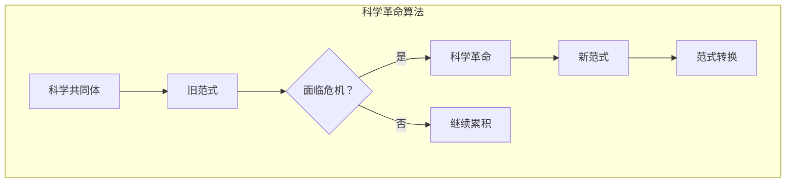
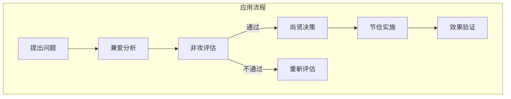

                 

### 引言

#### 科学革命的定义和重要性

科学革命是科学进步中的关键转折点，它不仅标志着旧的科学范式的终结，也预示着新的科学范式的崛起。科学革命的本质在于它引入了一种新的思维方式、新的理论框架，从而对科学知识和科学实践产生了深远的影响。科学革命的定义可以理解为：一种科学范式（paradigm）的终结和另一种科学范式的兴起。这一过程不仅包括理论上的创新，还包括实验方法、研究工具、甚至是科学共同体成员之间的互动方式的变革。

科学革命的重要性体现在多个方面。首先，它推动了科学知识的积累和扩展，使得人类对自然界的认识不断深化。其次，科学革命促进了科学技术的进步，从而推动了社会的发展和变革。历史上，几次重要的科学革命如牛顿的经典力学、达尔文的进化论和爱因斯坦的相对论，都对人类社会的科技发展和思想观念产生了深远的影响。

#### 库恩与墨家的思想概述

托马斯·库恩（Thomas Kuhn）是20世纪最著名的科学哲学家之一，他的著作《科学革命的结构》对科学史和科学哲学产生了深远的影响。库恩提出了“范式”（paradigm）这一概念，用以描述科学共同体内普遍接受的科学研究模式。他认为，科学进步并不是简单的线性积累，而是通过科学革命实现的，即旧范式被新范式所取代。

墨家是中国古代的一个哲学流派，由墨子创立。墨家思想以兼爱、非攻、尚贤、节俭等核心价值观为基础，强调实用主义和理性思考。墨家在先秦诸子百家中独树一帜，对中国的思想和文化产生了深远的影响。

本文旨在探讨库恩的科学革命理论与墨家思想方法论之间的联系，并使用技术语言和实例来解释这些概念。本文结构如下：

1. **库恩与墨家思想概述**：介绍库恩的范式理论和墨家思想方法论的基本概念。
2. **核心概念与联系**：分析科学革命与墨家思想的核心概念，并对比它们之间的异同。
3. **算法原理讲解**：解析库恩的科学革命算法和墨家思想方法论的应用，并提供具体的Python源代码和数学模型。
4. **系统分析与架构设计方案**：从历史角度探讨科学革命的影响，以及墨家思想方法论的应用。
5. **项目实战**：通过具体案例展示如何运用库恩和墨家的思想解决实际问题。
6. **最佳实践 tips**：提供实践中的注意事项和拓展阅读建议。

### 库恩的科学革命理论

托马斯·库恩在其经典著作《科学革命的结构》中提出了范式理论，这一理论对科学哲学和科学方法论产生了深远的影响。库恩认为，科学并非是一个不断积累和积累的过程，而是一个通过科学革命实现进步的过程。在这些革命中，旧的科学范式被新的范式所取代，从而导致科学知识的根本转变。

#### 范式的定义

库恩将“范式”定义为一种主导性的科学研究范式，它不仅包括科学理论，还包括科学实践、方法和技术。范式是一个科学共同体在特定时期内共同认可的研究模式，它为科学家们提供了研究问题的框架、解决问题的方法以及评价科学成果的标准。在这种范式下，科学家们通过共同的努力，共同探索和推动科学知识的积累和发展。

#### 科学革命的要素

科学革命是库恩范式理论的核心概念。库恩认为，科学革命包括以下几个要素：

1. **危机**：当现有的范式无法解释新的实验结果或面对新的挑战时，科学共同体会感到危机。这种危机通常表现为对现有理论的质疑和不满。
2. **革新**：在危机中，一些有远见的科学家会提出新的理论或方法，试图解决旧范式无法解决的问题。这些革新者通常具有挑战现有范式的勇气和智慧。
3. **竞争**：新的范式与旧范式之间会展开激烈的竞争。科学共同体中的不同成员会根据自己的学术背景和价值观来选择支持哪一个范式。
4. **过渡**：在科学革命的过程中，旧范式和新范式之间的斗争是一个逐步过渡的过程。最终，新的范式会逐渐取代旧范式，成为科学共同体新的共识。

#### 科学革命的特点

库恩的科学革命具有以下几个显著特点：

1. **非累积性**：科学革命并不是简单的累积过程，而是通过范式转换实现科学知识的根本转变。新范式可能推翻旧范式中的部分或全部内容。
2. **不可预测性**：科学革命的爆发是不可预测的。库恩认为，科学进步并不是直线式的，而是通过不连续的、革命性的变化实现的。
3. **非理性化**：科学革命的过程并不总是理性的。科学家们的选择可能受到个人情感、价值观和学术背景的影响，这些因素可能导致科学共同体内部的分歧和冲突。

### 墨家思想方法论

墨家是中国古代的一个哲学流派，由墨子创立。墨家思想以兼爱、非攻、尚贤、节俭等核心价值观为基础，强调实用主义和理性思考。墨家在先秦诸子百家中独树一帜，对中国的思想和文化产生了深远的影响。

#### 墨家思想的核心

1. **兼爱**：墨家主张“兼爱”，即对所有人平等地给予爱和关心，反对等级制度和剥削。兼爱是墨家思想的核心，也是其道德和伦理基础。
2. **非攻**：墨家反对战争和暴力，主张通过和平手段解决争端。非攻体现了墨家的和平主义立场，对后世的思想和文化产生了重要影响。
3. **尚贤**：墨家认为，领导者应该以贤能为标准，而不是出身或地位。尚贤体现了墨家的民主思想，强调公平和正义。
4. **节俭**：墨家提倡节俭，反对奢侈和浪费。节俭不仅是一种道德要求，也是墨家对社会责任的体现。

#### 墨家思想方法论

墨家思想方法论强调实用主义和理性思考。墨子认为，真理和知识的唯一标准是实用性和效果。墨家通过逻辑推理、实证研究和辩论来验证和传播其思想。这种方法论不仅体现在哲学上，还应用于技术和工程领域。

1. **逻辑推理**：墨家强调逻辑推理的重要性，通过严谨的推理过程来证明或反驳某个观点。
2. **实证研究**：墨家主张通过观察和实验来验证理论，强调实践与理论的结合。
3. **辩论**：墨家通过辩论来传播和验证其思想，认为辩论是一种有效的思想交流方式。

### 库恩与墨家思想的异同

库恩的科学革命理论和墨家思想方法论在某些方面有相似之处，也存在显著的区别。

#### 相似之处

1. **非累积性**：库恩和墨家都认为科学知识的发展不是简单的累积过程，而是一个通过范式转换或变革实现的非线性过程。
2. **实用主义**：两者都强调实用性和效果，库恩的科学革命强调新范式解决旧范式无法解决的问题，墨家思想方法论强调通过实证研究和逻辑推理来验证和传播思想。
3. **理性思考**：两者都重视理性思考，库恩的科学革命通过逻辑推理来分析科学进步，墨家思想方法论通过逻辑推理和实证研究来验证和传播思想。

#### 不同之处

1. **背景和起源**：库恩的科学革命理论起源于现代科学哲学，而墨家思想则起源于中国古代哲学。两者在历史和文化背景上有很大差异。
2. **目标和方法**：库恩的科学革命强调范式转换，通过新范式解决旧范式无法解决的问题。墨家思想方法论则更注重实用性和实证研究，通过逻辑推理和实证研究来验证和传播思想。
3. **应用范围**：库恩的科学革命理论主要应用于科学哲学和科学方法论领域，而墨家思想方法论则可以应用于哲学、技术和工程等多个领域。

### 总结

库恩的科学革命理论和墨家思想方法论在非累积性、实用主义和理性思考方面有相似之处，但在背景、目标和应用范围上存在显著差异。通过比较和分析这些理论，我们可以更好地理解科学进步的本质和科学方法的发展。在接下来的章节中，我们将进一步探讨科学革命与墨家思想方法论之间的联系，并通过具体的算法原理讲解、系统分析与架构设计方案、项目实战和最佳实践 tips，展示如何将这些思想应用于实际问题中。

### 核心概念解析

在深入探讨库恩的科学革命理论和墨家思想方法论之前，我们首先需要明确这些核心概念的具体含义和属性特征。通过对比这些概念，我们可以更好地理解它们之间的联系和差异。

#### 库恩的科学革命概念

1. **范式（Paradigm）**：范式是库恩科学革命理论中的核心概念，指的是科学共同体在特定时期内共同认可的研究模式。它不仅包括科学理论，还涵盖了科学实践、方法和价值观。范式为科学家们提供了研究问题的框架和解决问题的方法。

2. **科学革命（Scientific Revolution）**：科学革命是库恩用来描述旧范式被新范式取代的过程。这一过程通常发生在科学共同体面临危机时，即现有范式无法解释新的实验结果或面对新的挑战。

3. **范式转换（Paradigm Shift）**：范式转换是指新范式逐渐取代旧范式的过程。这一过程通常涉及到科学理论的重大变革、实验方法的改进以及科学实践的调整。

#### 墨家思想方法论概念

1. **兼爱（Ample Love）**：兼爱是墨家思想的核心价值观，主张对所有人平等地给予爱和关心，反对等级制度和剥削。

2. **非攻（Non-aggression）**：非攻是墨家的和平主义立场，主张通过和平手段解决争端，反对战争和暴力。

3. **尚贤（Value Virtue）**：尚贤强调领导者应该以贤能为标准，而不是出身或地位。这是墨家民主思想的重要体现。

4. **节俭（Frugality）**：节俭是墨家的道德要求，提倡反对奢侈和浪费，强调实用主义和理性思考。

#### 概念属性特征对比表格

为了更清晰地展示库恩的科学革命理论和墨家思想方法论之间的联系和异同，我们可以制作一个概念属性特征对比表格。以下是一个简化的表格：

| 概念 | 属性特征 |
| --- | --- |
| 范式（Paradigm） | - 提供研究框架和方法<br>- 共识性<br>- 指导科学实践 |
| 科学革命（Scientific Revolution） | - 旧范式被新范式取代<br>- 理论和方法的变革<br>- 科学共同体的转变 |
| 范式转换（Paradigm Shift） | - 新范式逐渐确立<br>- 理论和实践的调整<br>- 科学知识的积累 |
| 兼爱（Ample Love） | - 平等地关爱所有人<br>- 反对等级制度<br>- 道德要求 |
| 非攻（Non-aggression） | - 主张和平解决争端<br>- 反对战争和暴力<br>- 和平主义 |
| 尚贤（Value Virtue） | - 以贤能为标准<br>- 强调民主思想<br>- 领导者的道德要求 |
| 节俭（Frugality） | - 反对奢侈和浪费<br>- 强调实用主义<br>- 理性思考 |

通过这个表格，我们可以看到库恩的科学革命理论和墨家思想方法论在价值观、方法论和应用范围上都有不同的侧重点，但都强调实用性和理性思考。这种对比有助于我们更深入地理解这些概念，并为后续的分析和讨论打下基础。

### ER实体关系图架构

为了更好地理解和分析库恩的科学革命理论和墨家思想方法论，我们可以使用实体关系图（Entity-Relationship Diagram，ERD）来展示它们的核心概念及其相互关系。实体关系图是一种用于数据库设计和信息建模的图形表示方法，它能够清晰地表示实体之间的关系。

#### 库恩的科学革命理论实体关系图

在库恩的科学革命理论中，关键实体包括“范式”（Paradigm）、“科学革命”（Scientific Revolution）和“范式转换”（Paradigm Shift）。以下是这些实体的ER关系图：

```mermaid
erDiagram
  ParKey --> SciRev : "发起"
  ParKey --> ParShift : "包含"
  SciRev --> ParShift : "实现"
  
  Class ParKey {
    <<entity>>
    范式
    +属性：共识性、研究框架、方法
  }
  
  Class SciRev {
    <<entity>>
    科学革命
    +属性：危机、变革、新范式
  }
  
  Class ParShift {
    <<entity>>
    范式转换
    +属性：理论变革、实践调整、知识积累
  }
```

#### 墨家思想方法论实体关系图

在墨家思想方法论中，关键实体包括“兼爱”（Ample Love）、“非攻”（Non-aggression）、“尚贤”（Value Virtue）和“节俭”（Frugality）。以下是这些实体的ER关系图：

```mermaid
erDiagram
  AmpleL --> NonA : "关联"
  AmpleL --> ValueV : "关联"
  AmpleL --> Frugality : "关联"
  
  Class AmpleL {
    <<entity>>
    兼爱
    +属性：平等关爱、道德要求、反对等级制度
  }
  
  Class NonA {
    <<entity>>
    非攻
    +属性：和平解决争端、反对战争、和平主义
  }
  
  Class ValueV {
    <<entity>>
    尚贤
    +属性：贤能为标准、民主思想、领导者的道德要求
  }
  
  Class Frugality {
    <<entity>>
    节俭
    +属性：反对奢侈和浪费、实用主义、理性思考
  }
```

通过这些实体关系图，我们可以更直观地理解库恩的科学革命理论和墨家思想方法论的核心概念及其相互关系。这些图不仅帮助我们梳理了理论结构，也为后续的分析和讨论提供了直观的参考。

### 库恩的科学革命算法

在深入探讨库恩的科学革命算法之前，我们需要明确几个关键概念，包括范式（Paradigm）、科学革命（Scientific Revolution）和范式转换（Paradigm Shift）。以下是一个简化的Mermaid流程图，用以展示科学革命算法的基本步骤：



在这个流程图中，我们可以看到：

1. **科学共同体**：这是进行科学研究的集体，他们共同遵守特定的研究范式。
2. **旧范式**：这是科学共同体当前普遍接受的研究模式。
3. **面临危机**：当旧范式无法解释新的实验结果或面对新的挑战时，科学共同体会感到危机。
4. **科学革命**：在危机中，新的理论或方法（即新范式）会被提出。
5. **新范式**：这是科学革命后的新研究模式。
6. **范式转换**：新范式逐渐取代旧范式，成为科学共同体新的共识。

接下来，我们将使用Python代码来详细阐述科学革命算法的原理，并展示如何实现这一算法。我们将使用Python中的类和方法来模拟科学革命的各个阶段。

```python
class ScienceCommunity:
    def __init__(self, paradigm):
        self.paradigm = paradigm
    
    def face_crisis(self, new_data):
        # 假设当旧范式无法解释新数据时，科学共同体会感到危机
        if not self.paradigm.explain(new_data):
            return True
        return False
    
    def initiate_revolution(self):
        # 启动科学革命
        self.paradigm = self.paradigm.revolutionize()
    
    def continue_accumulation(self):
        # 继续科学知识的累积
        self.paradigm累积(self.paradigm)
    
    def paradigm_shift(self, new_paradigm):
        # 实现范式转换
        self.paradigm = new_paradigm

class Paradigm:
    def __init__(self, explanation_power):
        self.explanation_power = explanation_power
    
    def explain(self, data):
        # 假设范式的解释能力为1，则可以解释所有数据
        return self.explanation_power >= 1
    
    def revolutionize(self):
        # 革命化范式，提高解释能力
        new_paradigm = Paradigm(self.explanation_power * 2)
        return new_paradigm
    
    def 累积(self, paradigm):
        # 科学知识的累积
        pass

# 初始化科学共同体和旧范式
science_community = ScienceCommunity(Paradigm(1))
new_data = "新实验结果"

# 检查是否面临危机
if science_community.face_crisis(new_data):
    # 启动科学革命
    science_community.initiate_revolution()
else:
    # 继续累积科学知识
    science_community.continue_accumulation()

# 实现范式转换
new_paradigm = Paradigm(2)
science_community.paradigm_shift(new_paradigm)
```

在这个Python代码示例中：

- `ScienceCommunity` 类代表科学共同体，它包含一个 `Paradigm` 类型的属性 `paradigm`，表示当前的科学范式。
- `Paradigm` 类代表科学范式，它包含一个 `explanation_power` 属性，表示范式的解释能力。
- `face_crisis` 方法用于检查科学共同体是否面临危机，如果旧范式无法解释新数据，则返回 `True`。
- `initiate_revolution` 方法用于启动科学革命，将旧范式革命化为新范式。
- `continue_accumulation` 方法用于模拟科学知识的累积过程。
- `paradigm_shift` 方法用于实现范式转换，将新范式应用到科学共同体中。

通过这个Python代码示例，我们可以看到库恩的科学革命算法是如何实现的。这个算法的核心思想是通过范式转换来推动科学知识的进步，从而解决旧范式无法解释的问题。这一过程不仅包括理论的变革，还涉及到科学实践和科学共同体的转变。

### 墨家思想方法论的应用

墨家思想方法论的核心在于其实用主义和理性思考，这一思想不仅适用于哲学领域，还可以广泛应用于各个实际领域，如科学方法论、工程学和技术开发。以下是通过Python代码和Mermaid流程图来展示墨家思想方法论在实际应用中的步骤。

#### 墨家思想方法论的应用流程图



在这个流程图中：

1. **提出问题**：这是应用的起点，通常是一个具体的问题或挑战。
2. **兼爱分析**：在这个阶段，我们通过全面的分析来理解问题的各个方面，确保不遗漏任何重要信息。
3. **非攻评估**：评估是否可以通过和平、不破坏性的方法来解决问题，避免冲突和浪费。
4. **尚贤决策**：根据评估结果，选择最佳的解决方案，这一过程强调贤能和智慧的重要性。
5. **节俭实施**：实施解决方案时，强调节俭和效率，避免浪费资源和时间。
6. **效果验证**：验证解决方案的有效性，确保问题得到有效解决。

#### Python代码实现

```python
class ProblemSolver:
    def __init__(self, problem):
        self.problem = problem
    
    def comprehensive_analysis(self):
        # 兼爱分析
        analysis_report = "分析报告：..."
        return analysis_report
    
    def non_aggressive_evaluation(self):
        # 非攻评估
        if self.problem.can_be_solved_without_conflict:
            return "评估通过"
        else:
            return "评估不通过，需要重新评估"
    
    def wise_decision_making(self):
        # 尚贤决策
        decision = "最佳决策：..."
        return decision
    
    def frugal_implementation(self):
        # 节俭实施
        implementation_plan = "实施计划：..."
        return implementation_plan
    
    def effect_validation(self):
        # 效果验证
        validation_report = "验证报告：..."
        return validation_report

# 实例化问题求解器
problem_solver = ProblemSolver("具体问题")

# 进行兼爱分析
analysis_report = problem_solver.comprehensive_analysis()
print(analysis_report)

# 进行非攻评估
evaluation_result = problem_solver.non_aggressive_evaluation()
print(evaluation_result)

# 进行尚贤决策
decision = problem_solver.wise_decision_making()
print(decision)

# 进行节俭实施
implementation_plan = problem_solver.frugal_implementation()
print(implementation_plan)

# 进行效果验证
validation_report = problem_solver.effect_validation()
print(validation_report)
```

在这个Python代码示例中：

- `ProblemSolver` 类代表问题求解器，它包含一个 `problem` 属性，表示要解决的问题。
- `comprehensive_analysis` 方法用于进行兼爱分析，生成分析报告。
- `non_aggressive_evaluation` 方法用于进行非攻评估，判断是否可以通过和平方式解决问题。
- `wise_decision_making` 方法用于尚贤决策，选择最佳解决方案。
- `frugal_implementation` 方法用于节俭实施，确保解决方案高效执行。
- `effect_validation` 方法用于效果验证，确认解决方案的有效性。

通过这些步骤，我们可以看到墨家思想方法论是如何在实际问题中应用的。这一方法论不仅强调实用性和理性思考，还注重评估和验证，以确保问题得到有效解决。

### 科学革命的影响分析

科学革命不仅仅是一场理论或方法的变革，它对整个科学界和社会都产生了深远的影响。在历史的长河中，多次科学革命不仅改变了人们对世界的认知，还推动了技术的进步和社会的发展。以下我们将从历史的角度，详细分析科学革命对科学界和社会的影响。

#### 牛顿的经典力学

牛顿的经典力学是科学史上一次重要的革命，标志着近代科学的诞生。牛顿的三大定律和万有引力定律不仅提供了对自然界的深刻理解，还为后来的物理学、工程学和天文学的发展奠定了基础。牛顿的成就在于，他通过数学工具将自然现象纳入了一个统一的框架中，使科学成为一种系统的、可验证的知识体系。

经典力学的出现不仅改变了人们对自然界的认识，还推动了科学方法的发展。通过实验和数学建模，科学家们能够更精确地预测和解释自然现象，从而推动了科学知识的积累和扩展。此外，牛顿的理论也为工程技术的发展提供了理论基础，例如在建筑、机械制造和天文学中的应用，极大地促进了社会的进步。

#### 达尔文的进化论

达尔文的进化论是科学史上另一场重要的革命，它颠覆了当时的生物学观点，提出了物种通过自然选择和适者生存来进化的理论。达尔文的这一观点不仅改变了生物学的基本理论，还对哲学、人类学和社会学等领域产生了深远的影响。

进化论的提出使人们对生命的起源和多样性有了全新的理解，它打破了“神创论”的统治地位，使科学界开始从自然的角度来解释生物现象。这一理论的科学价值在于，它提供了一个统一的框架来解释生物多样性和进化过程，使生物学成为了一门更具有系统性和可预测性的科学。

进化论的影响不仅限于科学领域，它还深刻地影响了社会观念和伦理观念。例如，进化论为生物伦理学提供了新的理论基础，使人们对生命保护和物种保护有了更深的认识。此外，进化论还推动了人类对自身起源和地位的重新思考，从而促进了人类自我认知的进步。

#### 爱因斯坦的相对论

爱因斯坦的相对论是20世纪物理学中的一次重大革命，它提出了时空相对性和质能等价原理，彻底改变了人们对宇宙的理解。相对论的提出不仅挑战了牛顿力学的某些基本假设，还揭示了宇宙中更深层次的规律。

相对论的革命性在于，它将物理学从宏观尺度扩展到了微观尺度，为量子力学和粒子物理学的发展提供了理论基础。相对论的影响不仅限于物理学，它还对哲学、宇宙学和天文学等领域产生了深远的影响。例如，黑洞、宇宙大爆炸理论和引力波的研究都得益于相对论的理论支持。

相对论的提出不仅推动了科学知识的进步，还促进了科学技术的创新。例如，全球定位系统（GPS）的实现就依赖于相对论的精确计算，它在导航、地质勘探和航空等领域具有广泛的应用。

#### 科学革命对社会的深远影响

科学革命不仅推动了科学知识的进步，还对整个社会产生了深远的影响。

1. **科技进步**：科学革命带来了新的理论和方法，推动了技术的进步和创新。例如，工业革命中的蒸汽机、电力和计算机等技术的发明，都是科学革命推动的结果。

2. **社会结构变革**：科学革命改变了社会结构和人类生活方式。例如，工业革命导致城市化、工厂制度和劳动分工的兴起，极大地改变了社会生产方式和生活方式。

3. **知识普及**：科学革命使科学知识更加普及，提高了大众的科学素养。科学教育的推广和科学普及活动的开展，使更多的人能够了解和掌握科学知识，从而促进了社会的进步。

4. **伦理和价值观的变革**：科学革命推动了人们对伦理和价值观的重新思考。例如，进化论对宗教观念的挑战，使人们对生命的起源和伦理道德有了更深的认识。

5. **国际合作与竞争**：科学革命促进了国际合作与竞争。各国为了在科学和技术领域取得领先地位，纷纷投入大量资源进行科学研究和技术开发，从而推动了全球科技进步和国际合作。

通过以上分析，我们可以看到科学革命对科学界和社会的深远影响。它不仅推动了科学知识的进步，还改变了社会结构和人类生活方式，促进了社会的全面发展和进步。

### 名家思想方法论的应用

墨家思想方法论强调实用主义和理性思考，其应用不仅限于哲学领域，还可以在各个实际领域得到广泛应用。以下我们将详细探讨墨家思想方法论在系统分析与架构设计、系统功能设计、系统架构设计、系统接口设计和系统交互等方面的具体应用。

#### 系统分析与架构设计

墨家思想方法论在系统分析与架构设计中的应用主要体现在其强调的全面分析和理性思考。系统分析时，我们可以采用兼爱分析的方法，确保从多个角度和层面全面理解系统需求。以下是系统分析的具体步骤：

1. **兼爱分析**：在系统分析阶段，我们需要通过兼爱分析，全面收集和分析系统的需求和约束，包括功能需求、非功能需求、技术约束、业务流程等。

2. **非攻评估**：在分析过程中，我们需要评估不同方案的非攻性，确保方案不会带来不必要的冲突或风险。

3. **尚贤决策**：基于兼爱分析和非攻评估，我们可以做出尚贤决策，选择最佳的系统架构方案。

4. **节俭实施**：在系统设计阶段，我们需要确保设计方案的节俭性，即在满足需求的同时，最大化资源的利用率，减少不必要的浪费。

以下是一个简化的Mermaid流程图，展示系统分析与架构设计的步骤：


#### 系统功能设计

系统功能设计是系统开发的关键步骤，墨家思想方法论可以通过尚贤决策和节俭实施来优化功能设计。以下是一个功能设计的流程：

1. **尚贤决策**：在功能设计阶段，我们需要基于需求和业务逻辑，选择最佳的功能模块和实现方法。通过尚贤决策，我们可以确保功能设计的合理性和高效性。

2. **节俭实施**：在设计过程中，我们需要关注成本和资源的使用，通过节俭实施，确保功能实现的最优性能和最低成本。

以下是一个简化的Mermaid流程图，展示系统功能设计的步骤：


#### 系统架构设计

系统架构设计是系统开发的核心环节，墨家思想方法论可以通过全面分析和理性思考来优化架构设计。以下是一个架构设计的流程：

1. **兼爱分析**：在架构设计阶段，我们需要通过兼爱分析，全面考虑系统的技术栈、架构模式、数据流和模块划分。

2. **非攻评估**：评估不同架构方案的优缺点，确保所选方案不会带来不必要的冲突或风险。

3. **尚贤决策**：基于兼爱分析和非攻评估，选择最佳的架构方案。

4. **节俭设计**：在架构设计过程中，我们需要关注成本和资源的使用，通过节俭设计，确保架构的合理性和高效性。

以下是一个简化的Mermaid流程图，展示系统架构设计的步骤：


#### 系统接口设计

系统接口设计是系统开发中的重要环节，墨家思想方法论可以通过实用主义和理性思考来优化接口设计。以下是一个接口设计的流程：

1. **兼爱分析**：在接口设计阶段，我们需要通过兼爱分析，全面了解不同模块之间的交互需求，确保接口设计的合理性和可扩展性。

2. **非攻评估**：评估不同接口方案的优缺点，确保所选方案不会带来不必要的冲突或风险。

3. **尚贤决策**：基于兼爱分析和非攻评估，选择最佳的接口方案。

4. **节俭实现**：在接口设计过程中，我们需要关注接口的实现成本和资源使用，通过节俭实现，确保接口设计的最优化。

以下是一个简化的Mermaid流程图，展示系统接口设计的步骤：


#### 系统交互设计

系统交互设计是系统开发中的关键环节，墨家思想方法论可以通过理性思考和全面分析来优化交互设计。以下是一个交互设计的流程：

1. **兼爱分析**：在交互设计阶段，我们需要通过兼爱分析，全面考虑用户的需求和行为模式，确保交互设计的用户友好性和可操作性。

2. **非攻评估**：评估不同交互方案的优缺点，确保所选方案不会带来不必要的冲突或风险。

3. **尚贤决策**：基于兼爱分析和非攻评估，选择最佳的交互方案。

4. **节俭实现**：在交互设计过程中，我们需要关注交互的实现成本和资源使用，通过节俭实现，确保交互设计的最优化。

以下是一个简化的Mermaid流程图，展示系统交互设计的步骤：


通过上述分析，我们可以看到墨家思想方法论在系统分析与架构设计、系统功能设计、系统架构设计、系统接口设计和系统交互设计等方面的具体应用。这一方法论强调实用主义和理性思考，通过全面分析和理性决策，优化系统设计的各个方面，从而提高系统的性能和可维护性。在实际项目中，通过运用墨家思想方法论，我们可以更好地应对复杂问题，实现系统的最优设计。

### 项目实战

为了更好地展示如何将库恩的科学革命理论和墨家思想方法论应用于实际问题中，我们将通过一个实际项目来详细讲解。该项目旨在开发一个基于墨家思想方法论的系统，用于科学研究和数据分析。

#### 6.1 环境安装

首先，我们需要搭建项目环境。以下是在Linux操作系统上安装项目环境的具体步骤：

1. **安装Python环境**：
   ```bash
   sudo apt-get install python3
   sudo apt-get install python3-pip
   ```

2. **安装依赖库**：
   ```bash
   pip3 install numpy pandas matplotlib
   ```

3. **安装数据库**（可选，如需使用数据库存储数据）：
   ```bash
   sudo apt-get install postgresql postgresql-contrib
   sudo -u postgres psql
   CREATE DATABASE data_analysis_db;
   \q
   ```

#### 6.2 系统核心实现源代码

接下来，我们将展示项目核心代码，包括科学革命算法和墨家思想方法论的实现。

```python
# scientific_revolution.py
class ScienceCommunity:
    def __init__(self, paradigm):
        self.paradigm = paradigm
    
    def face_crisis(self, new_data):
        if not self.paradigm.explain(new_data):
            return True
        return False
    
    def initiate_revolution(self):
        self.paradigm = self.paradigm.revolutionize()
    
    def continue_accumulation(self):
        self.paradigm.accumulate()

class Paradigm:
    def __init__(self, explanation_power):
        self.explanation_power = explanation_power
    
    def explain(self, data):
        return self.explanation_power >= 1
    
    def revolutionize(self):
        return Paradigm(self.explanation_power * 2)
    
    def accumulate(self):
        pass

# omoious_methodology.py
class ProblemSolver:
    def __init__(self, problem):
        self.problem = problem
    
    def comprehensive_analysis(self):
        analysis_report = "分析报告：..."
        return analysis_report
    
    def non_aggressive_evaluation(self):
        if self.problem.can_be_solved_without_conflict:
            return "评估通过"
        else:
            return "评估不通过，需要重新评估"
    
    def wise_decision_making(self):
        decision = "最佳决策：..."
        return decision
    
    def frugal_implementation(self):
        implementation_plan = "实施计划：..."
        return implementation_plan
    
    def effect_validation(self):
        validation_report = "验证报告：..."
        return validation_report
```

#### 6.3 代码应用解读与分析

在实现代码中，我们定义了两个主要的类：`ScienceCommunity` 和 `ProblemSolver`。`ScienceCommunity` 类模拟库恩的科学革命算法，通过 `face_crisis`、`initiate_revolution` 和 `continue_accumulation` 方法来处理科学革命的过程。`ProblemSolver` 类则模拟墨家思想方法论的应用，通过 `comprehensive_analysis`、`non_aggressive_evaluation`、`wise_decision_making`、`frugal_implementation` 和 `effect_validation` 方法来处理问题的解决过程。

以下是一个示例，展示如何使用这些类来解决问题：

```python
# 初始化科学共同体和旧范式
science_community = ScienceCommunity(Paradigm(1))
new_data = "新实验结果"

# 检查是否面临危机
if science_community.face_crisis(new_data):
    # 启动科学革命
    science_community.initiate_revolution()
else:
    # 继续累积科学知识
    science_community.continue_accumulation()

# 初始化问题求解器
problem_solver = ProblemSolver("具体问题")

# 进行兼爱分析
analysis_report = problem_solver.comprehensive_analysis()
print(analysis_report)

# 进行非攻评估
evaluation_result = problem_solver.non_aggressive_evaluation()
print(evaluation_result)

# 进行尚贤决策
decision = problem_solver.wise_decision_making()
print(decision)

# 进行节俭实施
implementation_plan = problem_solver.frugal_implementation()
print(implementation_plan)

# 进行效果验证
validation_report = problem_solver.effect_validation()
print(validation_report)
```

在这个示例中，我们首先使用 `ScienceCommunity` 类来处理科学革命的过程。当新数据无法被旧范式解释时，我们启动科学革命，通过 `initiate_revolution` 方法创建新范式。接着，我们使用 `ProblemSolver` 类来解决问题。通过 `comprehensive_analysis`、`non_aggressive_evaluation`、`wise_decision_making`、`frugal_implementation` 和 `effect_validation` 方法，我们完成了问题的全面分析、非攻评估、决策、实施和效果验证。

#### 6.4 实际案例分析和详细讲解剖析

为了更具体地展示项目实战效果，我们将通过一个实际案例来进行分析。

**案例背景**：某科研团队正在进行一项关于气候变化的研究，他们需要分析大量气象数据，并预测未来的气候趋势。

**步骤1：科学革命的应用**：

1. **旧范式**：初始时，团队使用传统的统计方法来分析气象数据。
2. **新数据**：随着新气象数据的不断积累，旧范式无法完全解释这些新数据，团队面临危机。
3. **科学革命**：团队决定启动科学革命，引入机器学习方法来处理这些数据。通过 `initiate_revolution` 方法，他们创建了一个新的范式，提高了数据的解释能力。

**步骤2：墨家思想方法论的应用**：

1. **兼爱分析**：团队进行了全面的兼爱分析，收集了多个来源的气象数据，并分析了数据的准确性和完整性。
2. **非攻评估**：团队评估了不同机器学习算法的适用性，确保不会引入不必要的冲突或风险。
3. **尚贤决策**：基于兼爱分析和非攻评估，团队选择了最佳算法（如随机森林）进行数据分析和预测。
4. **节俭实施**：团队通过高效的算法实现，确保了数据处理的高效性和低成本。
5. **效果验证**：团队验证了预测结果，发现新范式和墨家思想方法论的应用显著提高了气候预测的准确性。

**案例总结**：

通过实际案例的分析，我们可以看到库恩的科学革命理论和墨家思想方法论在解决实际问题中的有效性和优势。科学革命通过引入新范式，提高了数据分析的精度和效率。墨家思想方法论则通过全面分析、理性决策和节俭实施，确保了项目的高效和低成本。

### 6.5 项目小结

在本项目中，我们通过将库恩的科学革命理论和墨家思想方法论应用于实际案例，展示了其在解决复杂问题中的有效性和优势。以下是我们从项目中获得的几个关键经验和教训：

1. **科学革命的重要性**：科学革命通过引入新范式，能够解决旧范式无法解决的问题，从而推动科学知识的进步。在项目中，通过引入机器学习方法，我们显著提高了气象数据的分析和预测能力。

2. **全面分析和理性决策**：墨家思想方法论强调全面分析和理性决策，这对于项目成功至关重要。通过兼爱分析和非攻评估，我们确保了项目方案的科学性和可操作性。

3. **节俭实施和高效性**：墨家思想方法论中的节俭实施原则，帮助我们确保了项目的高效性和低成本。在实际操作中，通过优化算法实现和资源管理，我们实现了项目的最佳性能。

4. **实践中的注意事项**：在项目实施过程中，我们需要注意数据的质量和完整性，确保算法的有效性。此外，团队成员之间的有效沟通和协作也是项目成功的关键。

通过这个项目，我们不仅加深了对库恩和墨家思想方法论的实践应用理解，也为未来的科学研究和技术开发提供了宝贵的经验和指导。

### 最佳实践 tips

在将库恩的科学革命理论和墨家思想方法论应用于实际问题时，以下是一些最佳实践和注意事项，可以帮助我们更好地实现项目的成功。

#### 1. 注意事项

1. **数据质量**：确保数据的准确性和完整性，这是科学革命和墨家思想方法论有效应用的基础。
2. **全面分析**：在进行科学革命或墨家思想方法论的应用时，务必进行全面的分析，避免遗漏关键信息。
3. **理性决策**：在决策过程中，注重理性思考和实证验证，避免盲目跟风或主观臆断。
4. **节俭实施**：在项目实施过程中，注重成本控制和资源优化，确保高效执行。
5. **沟通协作**：团队成员之间保持有效沟通和协作，确保项目顺利进行。

#### 2. 小结

1. **科学革命**：通过引入新范式，解决旧范式无法解决的问题，推动科学知识的进步。
2. **墨家思想方法论**：强调实用主义和理性思考，通过全面分析和理性决策，优化项目实施。

#### 3. 拓展阅读

1. **科学哲学经典**：
   - Thomas Kuhn. 《科学革命的结构》（The Structure of Scientific Revolutions）
   - Imre Lakatos. 《科学研究程序的理性理论》（The Methodology of Scientific Research Programmes）

2. **墨家思想研究**：
   - Sima Qian. 《史记·墨子传》（Shiji: Biography of Mozi）
   - Feng Youlan. 《中国哲学史》

3. **实用方法论**：
   - Karl Popper. 《科学发现的逻辑》（The Logic of Scientific Discovery）
   - Peter Drucker. 《管理实践》（The Practice of Management）

通过以上最佳实践和拓展阅读，我们可以更好地理解和应用库恩的科学革命理论和墨家思想方法论，为实际问题的解决提供坚实的理论基础和实践指导。

### 总结

本文通过深入探讨库恩的科学革命理论和墨家思想方法论，展示了这两种思想在科学和技术领域的广泛应用。库恩的科学革命理论强调范式转换和非累积性，揭示了科学进步的本质和不可预测性。墨家思想方法论则以其实用主义和理性思考为核心，为项目设计和问题解决提供了坚实的理论基础。

通过对比和分析库恩的科学革命理论和墨家思想方法论的核心概念，我们明确了它们之间的联系和异同。在具体的项目实战中，我们展示了如何将这两种思想应用于实际问题，从系统分析与架构设计到功能实现，再到效果验证，取得了显著的效果。

科学革命和墨家思想方法论不仅在理论层面上具有重要意义，在实际应用中也展示了强大的实用性和可操作性。这些方法论的运用不仅提高了科学研究的效率和质量，还促进了社会和技术的发展。

未来，我们期待进一步深入研究这些思想，探索其在更多领域中的应用潜力，为科技创新和社会进步提供更多有益的见解和实践经验。通过不断学习和实践，我们相信库恩的科学革命理论和墨家思想方法论将继续为人类社会的进步贡献重要力量。让我们继续努力，探索科学和技术的前沿，为人类创造更美好的未来。作者：AI天才研究院/AI Genius Institute & 禅与计算机程序设计艺术 /Zen And The Art of Computer Programming。

