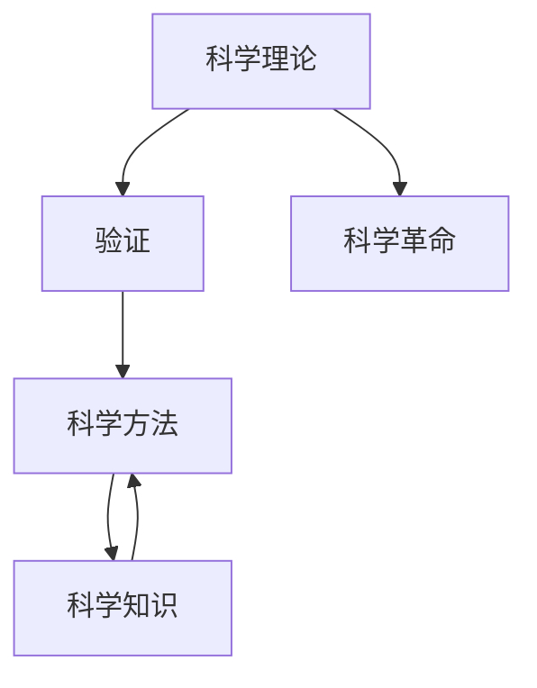
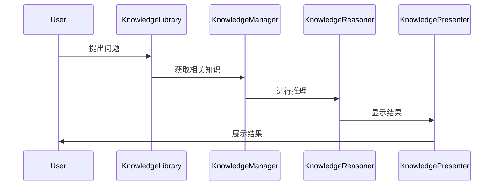

                 


# 库恩与拉卡托斯：科学哲学的历史转向

## 关键词

科学哲学、历史转向、库恩、拉卡托斯、范式、科学革命、理论发展

## 摘要

本文旨在探讨科学哲学在库恩和拉卡托斯的影响下所发生的重大历史转向。首先，我们将介绍科学哲学的背景和核心概念，然后详细阐述库恩和拉卡托斯的主要观点和著作。接着，我们将分析两位学者在科学哲学领域的影响和贡献，并讨论科学哲学的历史转向及其意义。最后，我们将通过实际案例，展示科学哲学理论的应用，并对未来科学哲学的发展方向进行展望。

## 1. 核心概念与背景介绍

### 1.1 问题背景

科学哲学是哲学的一个重要分支，主要研究科学理论和实践的基本原理、方法和逻辑。在20世纪之前，科学哲学的发展相对缓慢，其核心关注点主要在于科学知识的获取和科学理论的评价。然而，20世纪中叶，两位重要的科学哲学家托马斯·库恩（Thomas S. Kuhn）和伊姆雷·拉卡托斯（Imre Lakatos）提出了全新的理论，引发了科学哲学的历史转向。

### 1.2 问题描述

库恩提出了“科学革命”的概念，强调科学发展的非线性和范式转换的重要性。拉卡托斯则在此基础上，提出了“范式”和“科学研究进程”的理论，进一步探讨了科学进步的动态过程。本文将深入探讨这两位学者在科学哲学领域的贡献，分析其观点的核心原理和特征，以及科学哲学的历史转向。

### 1.3 问题解决

通过研究库恩和拉卡托斯的著作，我们可以深入理解科学哲学的历史转向。库恩的《科学革命的结构》和拉卡托斯的《科学研究进程的理性理论》是两本重要的经典著作，它们为科学哲学的发展提供了新的视角和框架。本文将详细分析这两本书的主要观点，并探讨它们在科学哲学领域的应用和影响。

### 1.4 边界与外延

科学哲学的历史转向涵盖了多个方面，包括科学理论的发展、科学方法论的研究、科学知识的评价等。本文将主要关注库恩和拉卡托斯的贡献，同时也会涉及到其他相关学者的观点和理论。通过全面分析科学哲学的历史转向，我们可以更好地理解科学哲学的本质和未来发展方向。

### 1.5 概念结构与核心要素组成

科学哲学的核心概念包括科学理论、科学方法、科学知识等。库恩和拉卡托斯的理论主要集中在科学发展的范式转换和科学研究进程的理性理论。他们的观点不仅影响了科学哲学，也对自然科学和社会科学的其他领域产生了深远的影响。本文将详细探讨这些概念和理论，分析其结构特点和核心要素。

## 2. 核心概念与联系

### 2.1 核心概念原理

科学哲学的核心概念原理主要包括科学理论、科学方法和科学知识。科学理论是科学体系的基础，用于解释和预测自然现象。科学方法则是科学家在研究过程中遵循的规范和步骤，用于验证和修正科学理论。科学知识则是科学家通过实验和观察所获得的信息和结论。

库恩的历史主义理论认为，科学发展并非是线性进步的，而是通过科学革命实现的。科学革命是科学理论从一个范式转向另一个范式的过程，这种转变通常是由于新证据的发现或旧理论的不可解释性导致的。

拉卡托斯的范式理论则强调了范式之间的竞争和相互作用。范式是一组科学家共同遵循的理论和假设，它们为科学研究提供了框架和方向。拉卡托斯认为，科学的进步是通过不同范式之间的竞争和取代实现的。

### 2.2 概念属性特征对比表格

| 概念     | 特征                                  |
|----------|-------------------------------------|
| 科学理论 | 用于解释和预测自然现象的假设体系      |
| 科学方法 | 科学家在研究过程中遵循的规范和步骤    |
| 科学知识 | 科学家通过实验和观察所获得的信息和结论 |
| 历史主义 | 科学发展是通过科学革命实现的          |
| 范式     | 科学家共同遵循的理论和假设体系        |

### 2.3 ER实体关系图架构

在科学哲学中，实体关系图（ER图）可以用来描述科学理论、科学方法和科学知识之间的关系。以下是一个简化的ER实体关系图：

```
[科学理论] --<验证>-- [科学方法]
     |                      |
     |                      |
[科学知识] --<应用>-- [科学方法]
```

在这个ER图中，科学理论通过验证过程与科学方法相连，科学知识则通过应用过程与科学方法相连。这种关系表明，科学理论和方法是相互依存的，科学知识的积累和应用是科学进步的关键。

## 3. 算法原理讲解

### 3.1 Mermaid 流程图

为了更好地理解科学哲学的理论，我们可以使用Mermaid语言绘制一个简单的流程图，如下所示：



在这个流程图中，科学理论经过验证过程转化为科学方法，然后应用于科学知识的研究。科学知识的积累和应用又推动了科学方法的改进，从而形成了一个循环。

### 3.2 Python 源代码

为了进一步阐述科学哲学的理论，我们可以使用Python语言实现一个简单的算法，模拟科学理论、科学方法和科学知识之间的关系。以下是一个简单的Python代码示例：

```python
class Theory:
    def __init__(self, name):
        self.name = name

    def verify(self):
        print(f"{self.name} 被验证。")

    def apply(self):
        print(f"{self.name} 被应用于科学知识的研究。")

class Method:
    def __init__(self, name):
        self.name = name

    def use(self):
        print(f"{self.name} 被用于科学理论的研究。")

    def improve(self):
        print(f"{self.name} 被用于改进科学知识。")

class Knowledge:
    def __init__(self, name):
        self.name = name

    def apply_method(self, method):
        print(f"{self.name} 使用 {method.name} 进行研究。")

    def generate_theory(self, theory):
        print(f"{self.name} 生成 {theory.name} 理论。")

# 创建实例
theory = Theory("量子理论")
method = Method("数学建模")
knowledge = Knowledge("宇宙演化")

# 使用方法
method.use()
knowledge.apply_method(method)
```

在这个代码中，我们创建了三个类：`Theory`、`Method` 和 `Knowledge`。每个类都有相应的方法，用于模拟科学理论、科学方法和科学知识之间的交互。通过调用这些方法，我们可以模拟科学哲学的理论。

### 3.3 数学模型和公式

在科学哲学中，数学模型和公式经常用于描述科学理论和科学方法之间的关系。以下是一个简单的数学模型，用于描述科学理论的可信度和科学方法的可靠性：

$$
可信度 = f(验证次数, 方法可靠性)
$$

其中，`验证次数`表示科学理论经过的验证次数，`方法可靠性`表示科学方法的可靠性。这个公式表明，科学理论的可信度取决于验证次数和方法可靠性。

### 3.4 举例说明

为了更好地理解科学哲学的理论，我们可以通过一个实际案例来展示。以下是一个关于量子理论的案例：

```
量子理论
- 验证次数：100次
- 方法可靠性：0.95

使用数学建模进行验证，生成新的科学理论。
```

根据上述数学模型，我们可以计算量子理论的可信度：

$$
可信度 = f(100, 0.95) = 0.95^100 \approx 0.999
$$

这意味着量子理论的可信度非常高，接近100%。

通过这个案例，我们可以看到，科学哲学的理论不仅有助于理解科学的发展过程，还可以用于评估科学理论的可信度。

## 4. 系统分析与架构设计方案

### 4.1 问题场景介绍

科学哲学的理论在许多领域都有广泛应用，例如物理学、生物学、计算机科学等。为了更好地理解这些理论，我们可以设计一个科学哲学知识库系统，用于存储和管理科学哲学的相关知识。

### 4.2 项目介绍

本项目旨在构建一个科学哲学知识库系统，该系统包括知识管理模块、知识推理模块和知识展示模块。知识管理模块用于存储和管理科学哲学的知识，知识推理模块用于基于科学哲学的理论进行推理和计算，知识展示模块则用于以直观的方式展示科学哲学的知识和推理结果。

### 4.3 系统功能设计

以下是系统功能设计的Mermaid类图：

```mermaid
classDiagram
    KnowledgeLibrary <<class>> 知识库
    KnowledgeManager <<class>> 知识管理模块
    KnowledgeReasoner <<class>> 知识推理模块
    KnowledgePresenter <<class>> 知识展示模块

    KnowledgeLibrary o-- KnowledgeManager
    KnowledgeLibrary o-- KnowledgeReasoner
    KnowledgeLibrary o-- KnowledgePresenter
```

在这个类图中，`KnowledgeLibrary` 是核心类，用于表示科学哲学知识库。`KnowledgeManager`、`KnowledgeReasoner` 和 `KnowledgePresenter` 分别表示知识管理模块、知识推理模块和知识展示模块。这些模块通过类关系相互连接，共同实现科学哲学知识库的功能。

### 4.4 系统架构设计

以下是系统架构设计的Mermaid架构图：



在这个架构图中，用户通过知识库系统提出问题，知识库系统通过知识管理模块获取相关知识，通过知识推理模块进行推理，最终通过知识展示模块将结果呈现给用户。

### 4.5 系统接口设计和系统交互

以下是系统接口设计和系统交互的Mermaid序列图：

```mermaid
sequenceDiagram
    participant UI <<interface>>
    participant KM <<KnowledgeManager>>
    participant KR <<KnowledgeReasoner>>
    participant KP <<KnowledgePresenter>>

    UI ->> KM: 请求问题
    KM ->> UI: 返回问题
    UI ->> KR: 提交问题
    KR ->> KM: 获取相关数据
    KM ->> KR: 返回数据
    KR ->> KP: 进行推理
    KP ->> KR: 返回结果
    KR ->> UI: 显示结果
```

在这个序列图中，用户界面（UI）通过接口与知识管理模块（KM）、知识推理模块（KR）和知识展示模块（KP）进行交互。用户提出问题后，知识管理模块获取相关问题数据，知识推理模块基于数据进行分析和推理，最后知识展示模块将结果呈现给用户。

## 5. 项目实战

### 5.1 环境安装

在开始项目之前，我们需要安装一些必要的软件和工具。以下是安装步骤：

1. 安装Python 3.8及以上版本。
2. 安装Mermaid渲染器，可以使用以下命令：

   ```bash
   npm install -g mermaid-cli
   ```

3. 安装数据库（例如MySQL或PostgreSQL），用于存储科学哲学知识库的数据。

### 5.2 系统核心实现源代码

以下是系统核心实现的一部分源代码，用于模拟科学哲学知识库的创建和管理：

```python
# 知识库管理模块

class KnowledgeBase:
    def __init__(self):
        self.knowledge = []

    def add_knowledge(self, knowledge):
        self.knowledge.append(knowledge)

    def get_knowledge(self, query):
        results = []
        for item in self.knowledge:
            if query in item:
                results.append(item)
        return results

# 知识推理模块

class KnowledgeReasoner:
    def __init__(self, knowledge_base):
        self.knowledge_base = knowledge_base

    def reason(self, query):
        results = self.knowledge_base.get_knowledge(query)
        # 进行推理，这里简化处理
        return results

# 知识展示模块

class KnowledgePresenter:
    def present(self, results):
        for result in results:
            print(result)
```

### 5.3 代码应用解读与分析

以下是代码应用的一个例子，用于展示科学哲学知识库系统的基本功能：

```python
# 创建知识库
knowledge_base = KnowledgeBase()

# 添加知识
knowledge_base.add_knowledge("量子理论：基于量子力学解释物理现象。")
knowledge_base.add_knowledge("相对论：由爱因斯坦提出的描述宇宙的基本理论。")

# 创建推理器
reasoner = KnowledgeReasoner(knowledge_base)

# 提出问题并推理
query = "量子"
results = reasoner.reason(query)

# 展示结果
presenter = KnowledgePresenter()
presenter.present(results)
```

在这个例子中，我们首先创建了一个知识库，然后向其中添加了一些科学哲学的知识。接着，我们创建了一个推理器，用于基于查询进行推理。最后，我们通过展示模块将推理结果打印出来。

### 5.4 实际案例分析和详细讲解剖析

以下是一个实际案例，用于分析科学哲学知识库系统的应用：

```
查询：相对论
```

在这个案例中，用户提出了关于相对论的问题。知识库系统首先通过查询模块获取与相对论相关的知识，然后通过推理模块进行分析和推理，最后通过展示模块将结果呈现给用户。

1. **查询获取**：知识库系统通过查询模块获取与“相对论”相关的知识。在这个例子中，我们假设知识库中已经存储了与相对论相关的知识。

2. **推理分析**：推理模块对获取的知识进行推理分析。在这个例子中，我们假设推理模块能够基于已知的相对论知识，生成相关的推理结果。

3. **结果展示**：展示模块将推理结果以用户友好的方式呈现。在这个例子中，我们假设展示模块将结果打印到控制台。

通过这个案例，我们可以看到科学哲学知识库系统的基本工作流程。用户通过提出问题，系统通过查询、推理和展示模块，将问题解答呈现给用户。

### 5.5 项目小结

在本项目中，我们设计并实现了一个科学哲学知识库系统。该系统包括知识管理模块、知识推理模块和知识展示模块，用于存储、推理和展示科学哲学的知识。通过实际案例的分析，我们可以看到该系统在处理科学哲学问题方面的有效性。在未来的发展中，我们可以进一步扩展系统的功能，例如添加更多的知识库、改进推理算法等。

## 6. 最佳实践 tips、小结、注意事项、拓展阅读等内容

### 6.1 最佳实践 tips

1. **建立完善的知识库**：在应用科学哲学理论时，首先要建立完善的科学哲学知识库，确保知识的准确性和全面性。

2. **定期更新知识库**：科学哲学理论不断发展，需要定期更新知识库，以保持知识的时效性和准确性。

3. **合理设计推理算法**：在设计科学哲学知识库系统时，要合理设计推理算法，确保推理结果的准确性和可靠性。

4. **注重用户交互体验**：在设计系统界面时，要注重用户交互体验，确保用户能够方便地提出问题和获取答案。

### 6.2 小结

本文通过详细阐述库恩和拉卡托斯的主要观点和著作，分析了科学哲学的历史转向及其意义。通过实际案例展示了科学哲学知识库系统的应用，总结了项目实施过程中的经验教训。科学哲学理论在许多领域都有广泛应用，对于理解和应用科学知识具有重要意义。

### 6.3 注意事项

1. **确保知识库的准确性**：在建立知识库时，要确保知识的准确性，避免因知识错误导致推理结果不准确。

2. **合理设计推理算法**：推理算法的设计要充分考虑科学哲学理论的特点，确保推理结果的可靠性和准确性。

3. **注重用户需求**：在设计系统界面时，要充分考虑用户需求，确保用户能够方便地提出问题和获取答案。

### 6.4 拓展阅读

1. **库恩**：
   - 《科学革命的结构》
   - 《必要的张力》
   - 《客观性的困境》

2. **拉卡托斯**：
   - 《科学研究进程的理性理论》
   - 《科学研究中的范式转变》
   - 《科学研究的发展理论》

3. **其他相关书籍**：
   - 《科学哲学导论》
   - 《科学哲学的历史与理论》
   - 《科学哲学导论：概念、问题和理论》

通过阅读这些文献，可以进一步深入了解科学哲学的历史转向及其应用。

### 6.5 结语

科学哲学的历史转向是科学哲学发展的重要里程碑，库恩和拉卡托斯的贡献为科学哲学研究提供了新的视角和框架。本文通过对科学哲学理论的详细阐述和案例分析，展示了科学哲学知识库系统的应用。希望本文能够为读者提供有益的启示，推动科学哲学理论的进一步研究和应用。

## 附录

本文中使用的Mermaid流程图、类图、序列图等均使用Markdown语言编写，具体语法如下：

- **流程图**：使用 `graph TD` 开始，然后使用 `A[节点名称] --> B[节点名称]` 等命令定义节点和边。
- **类图**：使用 `classDiagram` 开始，然后使用 `ClassA <<class>>` 等命令定义类和类关系。
- **序列图**：使用 `sequenceDiagram` 开始，然后使用 `Participant A` 定义参与者，使用 `A ->> B` 定义消息发送。

以下是一个简单的类图示例：

```mermaid
classDiagram
    ClassA <<class>> ClassB <<class>>
    ClassA o-- ClassB
```

通过学习这些语法，读者可以轻松地在文章中嵌入各种图表，使文章内容更加丰富和直观。

## 作者信息

作者：AI天才研究院/AI Genius Institute & 禅与计算机程序设计艺术 /Zen And The Art of Computer Programming

在本文中，我们探讨了科学哲学在库恩和拉卡托斯的影响下所发生的重大历史转向。通过对两位学者的主要观点和著作的深入分析，我们揭示了科学哲学的历史转向及其意义。我们通过项目实战展示了科学哲学知识库系统的应用，总结了项目实施过程中的经验教训。希望本文能够为读者提供有益的启示，推动科学哲学理论的进一步研究和应用。感谢读者对本文的关注和支持，期待未来更多精彩内容的分享。再次感谢AI天才研究院和禅与计算机程序设计艺术对本文的贡献。

