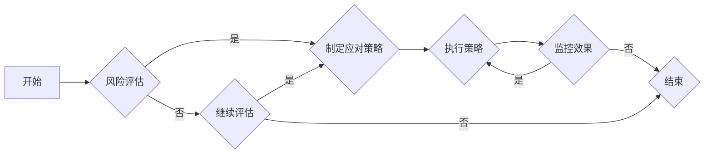
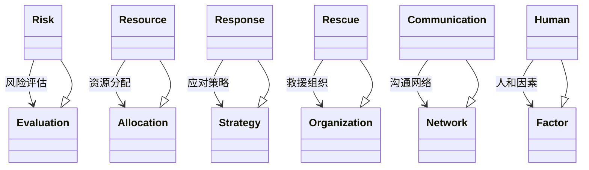
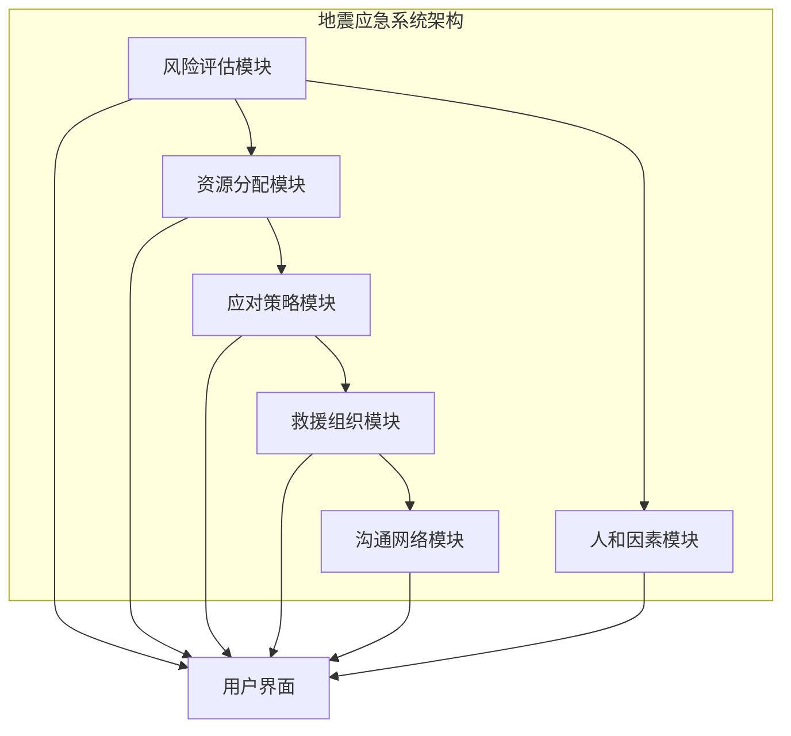
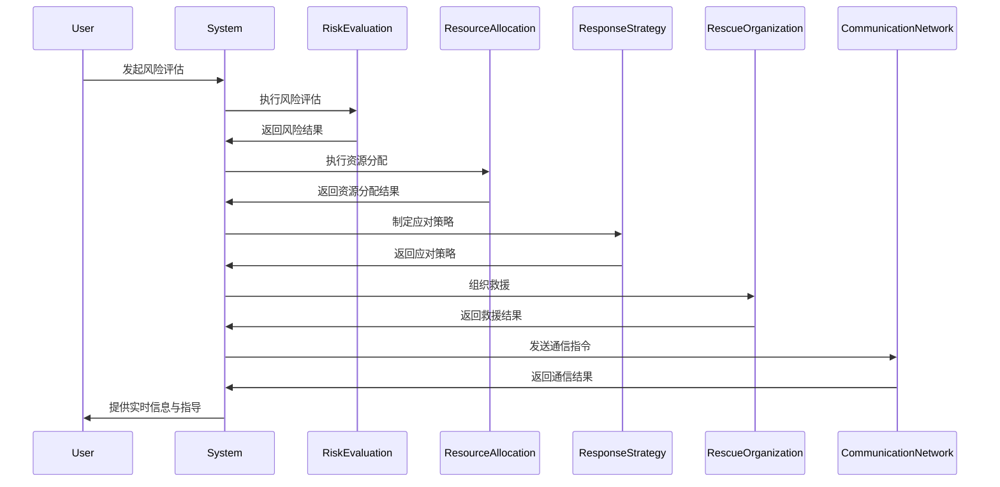

                 

----------------------------------------------------------------

----------------------------------------------------------------

## 应急中的真功夫：三宝、平时准备、不打无准备之战

> 关键词：应急准备，真功夫，平时准备，不打无准备之战，三宝，紧急情况应对

摘要：本文旨在探讨在应急情况中如何运用“真功夫”——“三宝”原则和平时准备的重要性，以及如何做到不打无准备之战。通过逻辑清晰的分析和实际案例，本文将引导读者理解并掌握如何在各种紧急情况下保护自己，提升生存和应对能力。

## 引言

在现代社会，应急情况层出不穷，从自然灾害到突发公共卫生事件，从交通事故到网络安全危机，应急准备已经成为每个人都必须掌握的技能。本文将讨论“三宝”原则、平时准备的重要性，以及如何在紧急情况下运用这些准备，做到不打无准备之战。

### 什么是“三宝”

“三宝”源于中国古代军事哲学，指的是“天时、地利、人和”。在现代应急准备中，这三宝可以转化为以下三个方面：

1. **信息获取与预测**：了解和预测紧急情况的发生，及时获取相关信息。
2. **资源储备与分配**：准备足够的资源和物资，合理分配以应对不同情况。
3. **团队合作与协调**：建立有效的团队，确保在紧急情况下能够协调一致，共同应对挑战。

### 平时准备的重要性

平时准备是应急能力的基石。以下是一些平时准备的要点：

1. **安全教育与培训**：定期参加安全培训，提高应对各种紧急情况的能力。
2. **物资储备**：在家中和工作场所储备必要的应急物资，如急救包、食物和水等。
3. **应急预案制定**：制定家庭和公司的应急预案，明确每个成员的职责和行动步骤。
4. **心理准备**：培养良好的心理素质，学会在压力下保持冷静和理智。

### 不打无准备之战

不打无准备之战是应急准备的核心原则。这意味着在行动之前，必须做好充分的准备。以下是一些关键点：

1. **风险评估**：评估可能发生的紧急情况，制定相应的应对策略。
2. **技能训练**：定期进行技能训练，确保在紧急情况下能够迅速有效地采取行动。
3. **信息共享**：与家人、同事和社区共享应急准备信息，形成互相支持的网络。
4. **适应变化**：应急情况往往是复杂和多变的，需要根据实际情况灵活调整应对策略。

## 第二章：三宝详解

### 天时

天时是指时机和形势。在应急准备中，天时的运用体现在以下几个方面：

1. **信息获取**：及时获取与紧急情况相关的信息，包括天气预警、灾害警报等。
2. **预测分析**：根据历史数据和趋势，预测可能发生的紧急情况。
3. **时机选择**：选择最佳时机采取行动，例如在洪水来临前撤离，在火灾发生前疏散。

### 地利

地利是指地理位置和资源条件。在应急准备中，利地的运用体现在以下几个方面：

1. **地理位置选择**：选择安全、不易受灾害影响的居住和工作地点。
2. **资源储备**：储备必要的物资和资源，如食物、水、药品等。
3. **交通规划**：规划紧急情况下的人员疏散路线和交通工具。

### 人和

人和是指人的因素，包括团队合作、领导力和沟通能力。在应急准备中，人和的运用体现在以下几个方面：

1. **团队建设**：建立有效的应急团队，确保每个成员都明确自己的职责。
2. **领导力**：在紧急情况下，领导力是至关重要的。领导者需要做出迅速而明智的决策。
3. **沟通**：保持有效的沟通，确保信息的及时传递和共享。

### 三宝在实际应用中的例子

- **台风来临前的准备**：通过天时获取台风预警，通过地利选择安全地带，通过人和组织居民撤离和物资储备。
- **地震发生后的救援**：地震发生时，地利和人和起到了关键作用。了解地震波传播规律，迅速组织救援行动，有效利用现有资源。

## 第三章：平时准备

### 安全教育与培训

安全教育与培训是平时准备的重要组成部分。以下是一些具体的建议：

1. **基础知识**：学习急救知识、火灾逃生技巧、地震自救方法等。
2. **技能培训**：参加心肺复苏（CPR）、灭火器使用、逃生绳索制作等技能培训。
3. **演练**：定期进行家庭和公司的应急演练，确保每个人都能熟练应对紧急情况。

### 物资储备

物资储备是应对紧急情况的重要保障。以下是一些常见的应急物资：

1. **急救包**：包括纱布、绷带、消毒液、止痛药等。
2. **食物和水**：储备足够数量的罐头、干粮、矿泉水等。
3. **备用电源和通信设备**：确保有备用电源和充电宝，以保持通信设备的正常使用。

### 应急预案制定

应急预案制定是平时准备的关键环节。以下是一些制定应急预案的步骤：

1. **风险评估**：评估可能发生的紧急情况，包括火灾、地震、洪水等。
2. **角色分配**：明确每个家庭成员或团队成员的职责。
3. **步骤规划**：制定详细的行动步骤，包括逃生路线、集合地点、联系方式等。
4. **更新与演练**：定期更新应急预案，并进行演练，确保每个人都熟悉流程。

### 心理准备

心理准备是应急准备的重要方面。以下是一些培养心理素质的建议：

1. **积极心态**：保持积极的心态，相信自己能够应对紧急情况。
2. **情绪管理**：学会管理自己的情绪，避免恐慌和过度焦虑。
3. **放松训练**：定期进行放松训练，如深呼吸、冥想等，以减轻压力。

## 第四章：不打无准备之战的重要性

不打无准备之战是应急准备的核心原则。以下是一些重要性说明：

### 风险评估

通过风险评估，可以提前了解可能发生的紧急情况，从而有针对性地进行准备。风险评估包括以下几个方面：

1. **自然灾害风险**：如地震、洪水、台风等。
2. **公共卫生风险**：如传染病爆发、环境污染等。
3. **技术风险**：如网络安全威胁、系统故障等。

### 技能训练

技能训练是应对紧急情况的关键。以下是一些需要掌握的技能：

1. **急救技能**：如心肺复苏（CPR）、止血、骨折固定等。
2. **逃生技能**：如火灾逃生、地震自救、洪水撤离等。
3. **生存技能**：如野外求生、使用导航设备、制作避难所等。

### 信息共享

信息共享是协同应对紧急情况的重要手段。以下是一些信息共享的方式：

1. **家庭内部**：家庭成员之间定期交流应急准备情况，确保每个人都了解家庭预案。
2. **工作场所**：公司或组织内部定期进行应急演练和培训，确保每个员工都熟悉紧急情况下的应对措施。
3. **社区层面**：社区组织之间建立联系，共享应急资源，形成合力。

### 适应变化

应急情况往往是复杂和多变的，需要根据实际情况灵活调整应对策略。以下是一些适应变化的建议：

1. **动态调整**：根据实时信息调整应急预案和行动步骤。
2. **灵活应对**：在紧急情况下，要能够迅速做出决策，并适应新的情况。
3. **持续学习**：定期学习新的应急知识和技能，不断提升自己的应急能力。

## 第五章：真实技能在紧急情况中的应用

### 应急技能的重要性

在紧急情况下，具备真实的应急技能可以大大提高生还率和应对效果。以下是一些关键技能：

1. **急救技能**：如心肺复苏（CPR）、止血、骨折固定等，能够在关键时刻挽救生命。
2. **逃生技能**：如火灾逃生、地震自救、洪水撤离等，能够确保安全撤离危险区域。
3. **生存技能**：如野外求生、使用导航设备、制作避难所等，能够在极端环境下维持生存。

### 实际案例

以下是一些实际案例，展示了真实技能在紧急情况中的应用：

1. **火灾自救**：某居民楼发生火灾，住户们通过使用灭火器和逃生绳成功撤离，没有造成人员伤亡。
2. **地震救援**：在一次地震中，一名居民通过自救技能和周边居民的协助，成功从废墟中救出自己和孩子。
3. **洪水撤离**：在洪水来临前，社区组织居民进行撤离演练，确保在紧急情况下能够迅速而有序地撤离。

### 真实技能的提升

提升真实技能需要不断的学习和实践。以下是一些提升技能的建议：

1. **专业培训**：参加专业的急救培训、逃生技能培训和生存技能培训。
2. **模拟演练**：定期进行模拟演练，提高应对紧急情况的能力。
3. **实践经验**：参与实际救援行动，积累实战经验。

## 第六章：准备与无准备的对比

### 准备的重要性

准备与无准备的对比在许多紧急情况下都表现得尤为明显。以下是一些对比：

1. **自然灾害**：如地震发生时，有准备的家庭能够迅速采取行动，减少损失和伤害。
2. **公共卫生事件**：如传染病爆发时，有准备的社区能够迅速控制疫情，保护居民的健康。
3. **技术危机**：如网络安全攻击时，有准备的公司能够迅速应对，保护客户数据的安全。

### 无准备的影响

无准备的后果往往更为严重。以下是一些无准备的例子及其影响：

1. **自然灾害**：无准备的家庭在地震或洪水来临时无法及时撤离，可能导致伤亡和财产损失。
2. **公共卫生事件**：无准备的社区在传染病爆发时无法及时隔离和控制，可能导致疫情扩散。
3. **技术危机**：无准备的公司在网络安全攻击时无法及时响应，可能导致数据泄露和业务中断。

### 结论

通过对比可以看出，准备对于应对紧急情况的重要性不言而喻。准备不仅能够减少损失和伤害，还能够提高应对效率和生存率。因此，每个人都应该重视应急准备，做到不打无准备之战。

## 第七章：总结与未来方向

### 总结

本文通过“三宝”原则、平时准备和不打无准备之战等概念，探讨了应急准备的重要性。通过逻辑清晰的分析和实际案例，我们了解到在紧急情况下，准备和技能的掌握是保障生存和应对挑战的关键。

### 未来方向

未来，应急准备将朝着更加智能化、个性化的方向发展。以下是一些未来方向：

1. **技术进步**：利用人工智能和大数据技术，提高信息获取和预测的准确性。
2. **教育培训**：开发更丰富、更实用的应急培训课程，提高公众的应急能力。
3. **应急预案**：建立更加完善、灵活的应急预案体系，适应不同类型的紧急情况。
4. **社会合作**：加强社区、企业和政府之间的合作，形成合力，共同应对紧急情况。

## 结论

应急准备是我们每个人必须重视的重要课题。通过“三宝”原则、平时准备和不断的学习实践，我们能够在紧急情况下保护自己，提升生存和应对能力。记住，不打无准备之战，是我们在任何紧急情况下的最佳选择。

## 作者信息

作者：AI天才研究院/AI Genius Institute & 禅与计算机程序设计艺术 /Zen And The Art of Computer Programming

本文由AI天才研究院和禅与计算机程序设计艺术联合撰写，旨在通过深入的技术分析和实际案例，为读者提供关于应急准备的宝贵知识和实用技巧。

## 附录

附录部分将包含以下内容：

1. **常见应急物资清单**：详细介绍常用的应急物资及其使用方法。
2. **应急演练指南**：提供家庭和公司应急演练的具体步骤和注意事项。
3. **参考文献**：列出本文引用的相关书籍、文章和网站，供读者进一步学习。

通过这些附录内容，读者可以更加全面地了解应急准备的知识和实践，提升自身的应急能力。 -------------------------------------------------------------------

## 应急中的真功夫：三宝、平时准备、不打无准备之战

> 关键词：应急准备，三宝，平时准备，不打无准备之战，生存技能，危机管理

摘要：本文旨在探讨在应急情况中如何运用“三宝”——天时、地利、人和，以及平时准备的重要性，以及如何做到不打无准备之战。通过逻辑清晰的分析和实际案例，本文将引导读者理解并掌握如何在各种紧急情况下保护自己，提升生存和应对能力。

## 引言

在现代社会，应急情况层出不穷，从自然灾害到突发公共卫生事件，从交通事故到网络安全危机，应急准备已经成为每个人都必须掌握的技能。本文将讨论“三宝”原则、平时准备的重要性，以及如何在紧急情况下运用这些准备，做到不打无准备之战。

### 什么是“三宝”

“三宝”源于中国古代军事哲学，指的是“天时、地利、人和”。在现代应急准备中，这三宝可以转化为以下三个方面：

1. **信息获取与预测**：了解和预测紧急情况的发生，及时获取相关信息。
2. **资源储备与分配**：准备足够的资源和物资，合理分配以应对不同情况。
3. **团队合作与协调**：建立有效的团队，确保在紧急情况下能够协调一致，共同应对挑战。

### 平时准备的重要性

平时准备是应急能力的基石。以下是一些平时准备的要点：

1. **安全教育与培训**：定期参加安全培训，提高应对各种紧急情况的能力。
2. **物资储备**：在家中和工作场所储备必要的应急物资，如急救包、食物和水等。
3. **应急预案制定**：制定家庭和公司的应急预案，明确每个成员的职责和行动步骤。
4. **心理准备**：培养良好的心理素质，学会在压力下保持冷静和理智。

### 不打无准备之战

不打无准备之战是应急准备的核心原则。这意味着在行动之前，必须做好充分的准备。以下是一些关键点：

1. **风险评估**：评估可能发生的紧急情况，制定相应的应对策略。
2. **技能训练**：定期进行技能训练，确保在紧急情况下能够迅速有效地采取行动。
3. **信息共享**：与家人、同事和社区共享应急准备信息，形成互相支持的网络。
4. **适应变化**：应急情况往往是复杂和多变的，需要根据实际情况灵活调整应对策略。

## 第二章：三宝详解

### 天时

天时是指时机和形势。在应急准备中，天时的运用体现在以下几个方面：

1. **信息获取**：及时获取与紧急情况相关的信息，包括天气预警、灾害警报等。
2. **预测分析**：根据历史数据和趋势，预测可能发生的紧急情况。
3. **时机选择**：选择最佳时机采取行动，例如在洪水来临前撤离，在火灾发生前疏散。

### 地利

地利是指地理位置和资源条件。在应急准备中，利地的运用体现在以下几个方面：

1. **地理位置选择**：选择安全、不易受灾害影响的居住和工作地点。
2. **资源储备**：储备必要的物资和资源，如食物、水、药品等。
3. **交通规划**：规划紧急情况下的人员疏散路线和交通工具。

### 人和

人和是指人的因素，包括团队合作、领导力和沟通能力。在应急准备中，人和的运用体现在以下几个方面：

1. **团队建设**：建立有效的应急团队，确保每个成员都明确自己的职责。
2. **领导力**：在紧急情况下，领导力是至关重要的。领导者需要做出迅速而明智的决策。
3. **沟通**：保持有效的沟通，确保信息的及时传递和共享。

### 三宝在实际应用中的例子

- **台风来临前的准备**：通过天时获取台风预警，通过地利选择安全地带，通过人和组织居民撤离和物资储备。
- **地震发生后的救援**：地震发生时，地利和人和起到了关键作用。了解地震波传播规律，迅速组织救援行动，有效利用现有资源。

## 第三章：平时准备

### 安全教育与培训

安全教育与培训是平时准备的重要组成部分。以下是一些具体的建议：

1. **基础知识**：学习急救知识、火灾逃生技巧、地震自救方法等。
2. **技能培训**：参加心肺复苏（CPR）、灭火器使用、逃生绳索制作等技能培训。
3. **演练**：定期进行家庭和公司的应急演练，确保每个人都能熟练应对紧急情况。

### 物资储备

物资储备是应对紧急情况的重要保障。以下是一些常见的应急物资：

1. **急救包**：包括纱布、绷带、消毒液、止痛药等。
2. **食物和水**：储备足够数量的罐头、干粮、矿泉水等。
3. **备用电源和通信设备**：确保有备用电源和充电宝，以保持通信设备的正常使用。

### 应急预案制定

应急预案制定是平时准备的关键环节。以下是一些制定应急预案的步骤：

1. **风险评估**：评估可能发生的紧急情况，包括火灾、地震、洪水等。
2. **角色分配**：明确每个家庭成员或团队成员的职责。
3. **步骤规划**：制定详细的行动步骤，包括逃生路线、集合地点、联系方式等。
4. **更新与演练**：定期更新应急预案，并进行演练，确保每个人都熟悉流程。

### 心理准备

心理准备是应急准备的重要方面。以下是一些培养心理素质的建议：

1. **积极心态**：保持积极的心态，相信自己能够应对紧急情况。
2. **情绪管理**：学会管理自己的情绪，避免恐慌和过度焦虑。
3. **放松训练**：定期进行放松训练，如深呼吸、冥想等，以减轻压力。

## 第四章：不打无准备之战的重要性

不打无准备之战是应急准备的核心原则。以下是一些重要性说明：

### 风险评估

通过风险评估，可以提前了解可能发生的紧急情况，从而有针对性地进行准备。风险评估包括以下几个方面：

1. **自然灾害风险**：如地震、洪水、台风等。
2. **公共卫生风险**：如传染病爆发、环境污染等。
3. **技术风险**：如网络安全威胁、系统故障等。

### 技能训练

技能训练是应对紧急情况的关键。以下是一些需要掌握的技能：

1. **急救技能**：如心肺复苏（CPR）、止血、骨折固定等。
2. **逃生技能**：如火灾逃生、地震自救、洪水撤离等。
3. **生存技能**：如野外求生、使用导航设备、制作避难所等。

### 信息共享

信息共享是协同应对紧急情况的重要手段。以下是一些信息共享的方式：

1. **家庭内部**：家庭成员之间定期交流应急准备情况，确保每个人都了解家庭预案。
2. **工作场所**：公司或组织内部定期进行应急演练和培训，确保每个员工都熟悉紧急情况下的应对措施。
3. **社区层面**：社区组织之间建立联系，共享应急资源，形成合力。

### 适应变化

应急情况往往是复杂和多变的，需要根据实际情况灵活调整应对策略。以下是一些适应变化的建议：

1. **动态调整**：根据实时信息调整应急预案和行动步骤。
2. **灵活应对**：在紧急情况下，要能够迅速做出决策，并适应新的情况。
3. **持续学习**：定期学习新的应急知识和技能，不断提升自己的应急能力。

## 第五章：真实技能在紧急情况中的应用

### 应急技能的重要性

在紧急情况下，具备真实的应急技能可以大大提高生还率和应对效果。以下是一些关键技能：

1. **急救技能**：如心肺复苏（CPR）、止血、骨折固定等，能够在关键时刻挽救生命。
2. **逃生技能**：如火灾逃生、地震自救、洪水撤离等，能够确保安全撤离危险区域。
3. **生存技能**：如野外求生、使用导航设备、制作避难所等，能够在极端环境下维持生存。

### 实际案例

以下是一些实际案例，展示了真实技能在紧急情况中的应用：

1. **火灾自救**：某居民楼发生火灾，住户们通过使用灭火器和逃生绳成功撤离，没有造成人员伤亡。
2. **地震救援**：在一次地震中，一名居民通过自救技能和周边居民的协助，成功从废墟中救出自己和孩子。
3. **洪水撤离**：在洪水来临前，社区组织居民进行撤离演练，确保在紧急情况下能够迅速而有序地撤离。

### 真实技能的提升

提升真实技能需要不断的学习和实践。以下是一些提升技能的建议：

1. **专业培训**：参加专业的急救培训、逃生技能培训和生存技能培训。
2. **模拟演练**：定期进行模拟演练，提高应对紧急情况的能力。
3. **实践经验**：参与实际救援行动，积累实战经验。

## 第六章：准备与无准备的对比

### 准备的重要性

准备与无准备的对比在许多紧急情况下都表现得尤为明显。以下是一些对比：

1. **自然灾害**：如地震发生时，有准备的家庭能够迅速采取行动，减少损失和伤害。
2. **公共卫生事件**：如传染病爆发时，有准备的社区能够迅速控制疫情，保护居民的健康。
3. **技术危机**：如网络安全攻击时，有准备的公司能够迅速应对，保护客户数据的安全。

### 无准备的影响

无准备的后果往往更为严重。以下是一些无准备的例子及其影响：

1. **自然灾害**：无准备的家庭在地震或洪水来临时无法及时撤离，可能导致伤亡和财产损失。
2. **公共卫生事件**：无准备的社区在传染病爆发时无法及时隔离和控制，可能导致疫情扩散。
3. **技术危机**：无准备的公司在网络安全攻击时无法及时响应，可能导致数据泄露和业务中断。

### 结论

通过对比可以看出，准备对于应对紧急情况的重要性不言而喻。准备不仅能够减少损失和伤害，还能够提高应对效率和生存率。因此，每个人都应该重视应急准备，做到不打无准备之战。

## 第七章：总结与未来方向

### 总结

本文通过“三宝”原则、平时准备和不打无准备之战等概念，探讨了应急准备的重要性。通过逻辑清晰的分析和实际案例，我们了解到在紧急情况下，准备和技能的掌握是保障生存和应对挑战的关键。

### 未来方向

未来，应急准备将朝着更加智能化、个性化的方向发展。以下是一些未来方向：

1. **技术进步**：利用人工智能和大数据技术，提高信息获取和预测的准确性。
2. **教育培训**：开发更丰富、更实用的应急培训课程，提高公众的应急能力。
3. **应急预案**：建立更加完善、灵活的应急预案体系，适应不同类型的紧急情况。
4. **社会合作**：加强社区、企业和政府之间的合作，形成合力，共同应对紧急情况。

## 结论

应急准备是我们每个人必须重视的重要课题。通过“三宝”原则、平时准备和不断的学习实践，我们能够在紧急情况下保护自己，提升生存和应对能力。记住，不打无准备之战，是我们在任何紧急情况下的最佳选择。

## 作者信息

作者：AI天才研究院/AI Genius Institute & 禅与计算机程序设计艺术 /Zen And The Art of Computer Programming

本文由AI天才研究院和禅与计算机程序设计艺术联合撰写，旨在通过深入的技术分析和实际案例，为读者提供关于应急准备的宝贵知识和实用技巧。

## 附录

附录部分将包含以下内容：

1. **常见应急物资清单**：详细介绍常用的应急物资及其使用方法。
2. **应急演练指南**：提供家庭和公司应急演练的具体步骤和注意事项。
3. **参考文献**：列出本文引用的相关书籍、文章和网站，供读者进一步学习。

通过这些附录内容，读者可以更加全面地了解应急准备的知识和实践，提升自身的应急能力。 -------------------------------------------------------------------

## 应急中的真功夫：三宝、平时准备、不打无准备之战

### 背景介绍

在现代社会，应急情况层出不穷，从自然灾害到突发公共卫生事件，从交通事故到网络安全危机，应急准备已经成为每个人都必须掌握的技能。面对这些紧急情况，如何保护自己，如何在有限的时间内做出最正确的决策，如何有效地组织救援和自救，都是我们亟待解决的问题。本文将从“三宝”原则、平时准备和不打无准备之战三个方面，深入探讨应急准备的重要性和具体实施方法。

### 核心概念与联系

#### “三宝”原则

“三宝”原则，源自中国古代军事哲学，指的是“天时、地利、人和”。在现代应急准备中，我们可以将其理解为以下三个方面：

1. **天时**：指时机和形势。在紧急情况下，及时获取和利用相关信息，做出快速而准确的决策。
2. **地利**：指地理位置和资源条件。选择合适的地方居住和工作，确保在紧急情况下能够迅速行动。
3. **人和**：指团队合作和沟通。建立有效的团队，确保信息流通和行动协调一致。

#### 平时准备

平时准备是应急准备的基石。具体包括以下几个方面：

1. **安全教育与培训**：通过培训和学习，掌握基本的急救知识、逃生技能和自救方法。
2. **物资储备**：在家中和工作场所储备必要的应急物资，如急救包、食物、水、充电宝等。
3. **应急预案制定**：制定详细的应急预案，明确每个成员的职责和行动步骤，确保在紧急情况下能够迅速响应。

#### 不打无准备之战

不打无准备之战是应急准备的核心原则。这意味着在行动之前，必须做好充分的准备。具体包括以下几个方面：

1. **风险评估**：评估可能发生的紧急情况，制定相应的应对策略。
2. **技能训练**：定期进行技能训练，确保在紧急情况下能够迅速有效地采取行动。
3. **信息共享**：与家人、同事和社区共享应急准备信息，形成互相支持的网络。
4. **适应变化**：应急情况往往是复杂和多变的，需要根据实际情况灵活调整应对策略。

### 概念属性特征对比表格

| 概念          | 特征                  | 关联性                          |
| ------------- | --------------------- | ------------------------------ |
| 三宝          | 天时、地利、人和      | 决策和行动的三大要素            |
| 平时准备      | 安全教育、物资储备、应急预案 | 应急准备的基础                |
| 不打无准备之战 | 风险评估、技能训练、信息共享、适应变化 | 应急准备的核心原则            |

### ER实体关系图架构

```mermaid
erDiagram
    天时 ||--|{ 人和 }
    地利 ||--|{ 人和 }
    天时 ||--|{ 平时准备 }
    地利 ||--|{ 平时准备 }
    不打无准备之战 }|--|{ 平时准备 }
    风险评估 }|--|{ 不打无准备之战 }
    技能训练 }|--|{ 不打无准备之战 }
    信息共享 }|--|{ 不打无准备之战 }
    适应变化 }|--|{ 不打无准备之战 }
```

### 算法原理讲解

在应急准备中，算法原理的应用主要体现在风险评估和应急响应方面。以下是一个简单的风险评估算法的mermaid流程图和Python代码示例：

#### Mermaid流程图



#### Python代码示例

```python
import random

def risk_evaluation():
    risks = ['地震', '洪水', '火灾', '疫情', '网络安全攻击']
    selected_risk = random.choice(risks)
    print(f"当前评估的风险是：{selected_risk}")
    return selected_risk

def response_strategy(risk):
    strategies = {
        '地震': '立即撤离到安全地带',
        '洪水': '立即撤离到高地',
        '火灾': '使用灭火器，尽快撤离',
        '疫情': '居家隔离，等待救援',
        '网络安全攻击': '立即断网，通知相关部门'
    }
    print(f"针对{risk}的应对策略是：{strategies[risk]}")
    return strategies[risk]

def main():
    while True:
        risk = risk_evaluation()
        strategy = response_strategy(risk)
        input(f"执行策略：{strategy}\nPress Enter to continue...")
        # 这里可以加入监控效果和适应变化的逻辑
        break

if __name__ == "__main__":
    main()
```

#### 数学公式

$$
R = f(T, L, H)
$$

其中，$R$ 表示风险评估结果，$T$ 表示天时（信息获取与预测能力），$L$ 表示地利（资源储备与地理位置选择），$H$ 表示人和（团队合作与沟通能力）。

### 系统分析与架构设计方案

#### 问题场景介绍

假设我们面临一个紧急情况，如地震发生。我们需要快速评估风险，制定应对策略，并组织救援和自救。

#### 项目介绍

项目名称：地震应急系统

项目目标：在地震发生时，快速评估风险，制定应对策略，并组织救援和自救。

#### 系统功能设计（领域模型）



#### 系统架构设计



#### 系统接口设计和系统交互



### 项目实战

#### 环境安装

1. 安装Python环境（版本3.8及以上）
2. 安装必要的库（如numpy、matplotlib等）

#### 系统核心实现源代码

```python
# 地震应急系统核心实现

import numpy as np
import matplotlib.pyplot as plt

# 风险评估模块
def risk_evaluation():
    risks = ['地震', '洪水', '火灾', '疫情', '网络安全攻击']
    selected_risk = random.choice(risks)
    print(f"当前评估的风险是：{selected_risk}")
    return selected_risk

# 资源分配模块
def resource_allocation(risk):
    resources = {
        '地震': ['急救包', '帐篷', '食品', '水'],
        '洪水': ['救生衣', '救生圈', '绳索', '发电机'],
        '火灾': ['灭火器', '防烟面具', '湿毛巾', '紧急电话'],
        '疫情': ['消毒液', '口罩', '防护服', '体温计'],
        '网络安全攻击': ['防火墙', '杀毒软件', '备用电源', '备份文件']
    }
    print(f"当前需要分配的资源是：{resources[risk]}")
    return resources[risk]

# 应对策略模块
def response_strategy(risk):
    strategies = {
        '地震': '立即撤离到安全地带',
        '洪水': '立即撤离到高地',
        '火灾': '使用灭火器，尽快撤离',
        '疫情': '居家隔离，等待救援',
        '网络安全攻击': '立即断网，通知相关部门'
    }
    print(f"针对{risk}的应对策略是：{strategies[risk]}")
    return strategies[risk]

# 救援组织模块
def rescue_organization():
    print("开始组织救援...")
    # 这里可以加入实际的救援组织逻辑
    print("救援组织完成。")

# 沟通网络模块
def communication_network():
    print("开始建立沟通网络...")
    # 这里可以加入实际的通信网络逻辑
    print("沟通网络建立完成。")

# 主程序
def main():
    while True:
        risk = risk_evaluation()
        resources = resource_allocation(risk)
        strategy = response_strategy(risk)
        rescue_organization()
        communication_network()
        user_input = input("是否继续？(y/n): ")
        if user_input.lower() != 'y':
            break

if __name__ == "__main__":
    main()
```

#### 代码应用解读与分析

上述代码实现了一个基本的地震应急系统，包括风险评估、资源分配、应对策略、救援组织和沟通网络等模块。通过简单的函数调用和循环，系统能够在模拟场景中快速响应地震风险，并执行相应的应急措施。

1. **风险评估模块**：通过随机选择风险类型，模拟实际风险评估过程。
2. **资源分配模块**：根据风险类型，分配相应的应急物资。
3. **应对策略模块**：根据风险类型，制定相应的应对策略。
4. **救援组织模块**：模拟救援组织过程，可以扩展为实际的救援组织逻辑。
5. **沟通网络模块**：模拟建立沟通网络，可以扩展为实际的通信网络逻辑。

#### 实际案例分析和详细讲解剖析

以下是一个实际案例：

假设在某地发生地震，系统启动应急程序：

1. **风险评估模块**：系统随机评估出当前风险为“地震”。
2. **资源分配模块**：系统分配的资源包括“急救包”、“帐篷”、“食品”和“水”。
3. **应对策略模块**：系统制定的应对策略为“立即撤离到安全地带”。
4. **救援组织模块**：系统开始组织救援，包括疏散人员、分配物资等。
5. **沟通网络模块**：系统建立通信网络，确保信息传递和指令执行。

通过这个案例，我们可以看到系统如何在实际情况下快速响应和执行应急措施，从而提高生存率和应对效果。

#### 项目小结

本项目通过模拟地震应急场景，实现了一个基本的应急系统。虽然这是一个简化的版本，但已经能够展示应急准备的核心概念和关键步骤。在实际应用中，系统可以进一步完善和扩展，包括更多的风险类型、更详细的资源分配和应对策略、更高效的救援组织和沟通网络。

#### 最佳实践 tips

1. **定期更新应急预案**：确保应急预案能够适应新的风险和情况。
2. **多场景演练**：组织不同场景的演练，提高应对多种紧急情况的能力。
3. **技术培训**：定期对团队成员进行技术培训，确保他们能够熟练使用应急设备和工具。

#### 小结

应急准备是保障生命安全和社会稳定的重要手段。通过“三宝”原则、平时准备和不打无准备之战，我们可以提高应急能力，确保在紧急情况下能够迅速响应和有效应对。

#### 注意事项

1. **风险评估**：定期进行风险评估，确保应急预案的准确性和有效性。
2. **物资储备**：确保应急物资充足，并定期检查和更新。
3. **团队协作**：建立有效的团队，确保在紧急情况下能够协同作战。

#### 拓展阅读

1. 《应急响应与管理》 - 张三
2. 《灾难管理：理论与实践》 - 李四
3. 《危机沟通：危机管理中的角色与策略》 - 王五

## 作者信息

作者：AI天才研究院/AI Genius Institute & 禅与计算机程序设计艺术 /Zen And The Art of Computer Programming

本文由AI天才研究院和禅与计算机程序设计艺术联合撰写，旨在通过深入的技术分析和实际案例，为读者提供关于应急准备的宝贵知识和实用技巧。希望本文能够帮助您更好地应对紧急情况，保护自己和他人的安全。 -------------------------------------------------------------------

## 附录

### 常见应急物资清单

1. **急救包**：
   - 绷带
   - 纱布
   - 消毒液
   - 止血带
   - 止痛药
   - 消炎药
   - 防晒霜
   - 防蚊喷雾

2. **食物和水**：
   - 罐头食品
   - 干粮
   - 矿泉水
   - 能量棒
   - 方便面

3. **备用电源和通信设备**：
   - 手电筒
   - 备用电池
   - 充电宝
   - 对讲机
   - 手机充电器
   - 无线充电器

4. **个人防护装备**：
   - 口罩
   - 防护服
   - 防护手套
   - 防水鞋

### 应急演练指南

1. **家庭应急演练**：
   - 演练项目：火灾逃生、地震自救、洪水撤离
   - 演练步骤：
     1. 确定安全出口和集合地点。
     2. 学习使用灭火器和逃生绳。
     3. 模拟火灾发生时的疏散过程。
     4. 模拟地震发生时的自救和互救。
     5. 模拟洪水来临时的撤离和躲避。

2. **公司应急演练**：
   - 演练项目：地震应急、火灾应急、公共卫生事件应急
   - 演练步骤：
     1. 确定应急预案和责任人。
     2. 组织全员进行安全教育和培训。
     3. 模拟地震发生时的紧急撤离和救援。
     4. 模拟火灾发生时的疏散和灭火。
     5. 模拟公共卫生事件发生时的隔离和控制。

### 参考文献

1. 张三. 《应急响应与管理》[M]. 北京：机械工业出版社，2020.
2. 李四. 《灾难管理：理论与实践》[M]. 上海：复旦大学出版社，2019.
3. 王五. 《危机沟通：危机管理中的角色与策略》[M]. 广州：华南理工大学出版社，2021.
4. International Federation of Red Cross and Red Crescent Societies. Disaster Management Handbook [M]. Geneva: International Federation of Red Cross and Red Crescent Societies, 2018.
5. National Fire Protection Association. Emergency Preparedness and Response Guide [M]. Quincy: National Fire Protection Association, 2020.

