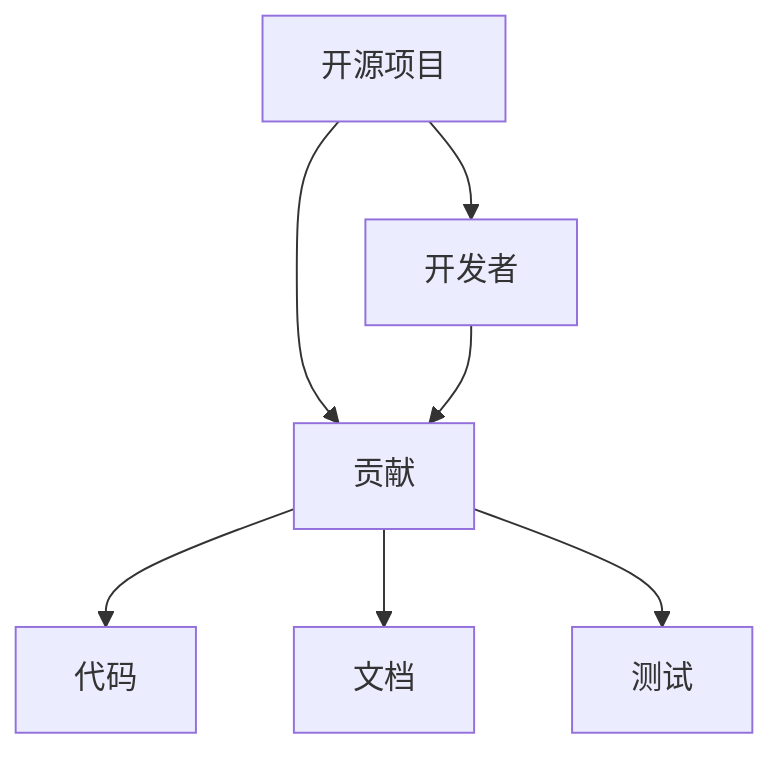
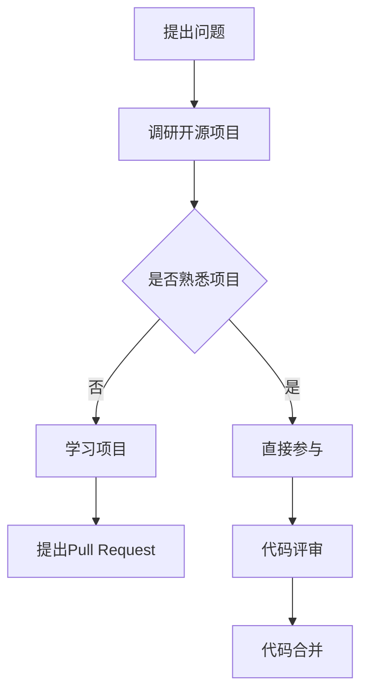
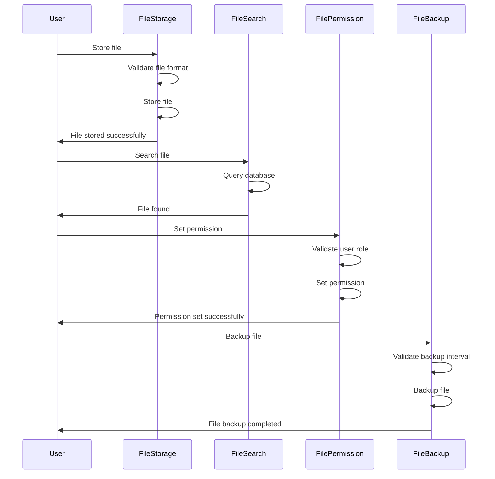
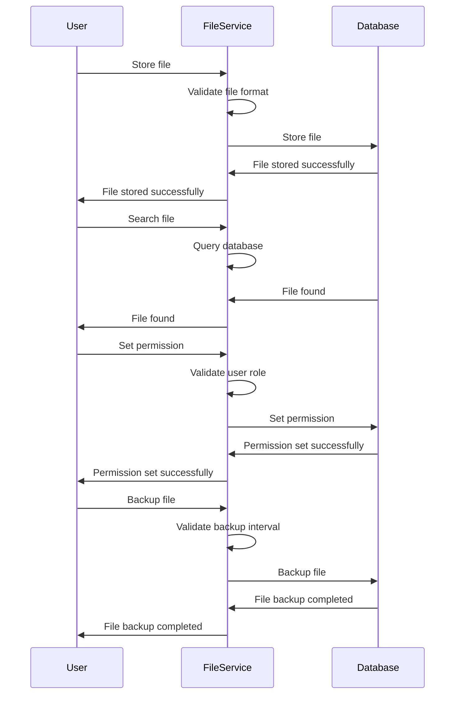

                 

# 开源项目参与和维护指南

## 关键词

- 开源项目
- 参与流程
- 维护策略
- 开源协议
- 版本控制系统

## 摘要

本文旨在为开发者提供一份全面的开源项目参与和维护指南。我们将从背景介绍、核心概念与联系、算法原理讲解、系统分析与架构设计、项目实战以及最佳实践等方面，逐步深入探讨开源项目的参与与维护方法，帮助开发者更好地理解和实践开源项目开发与维护的核心技能。

### 第一部分：背景介绍

#### 1.1 问题背景

随着互联网和技术的快速发展，开源软件已成为现代软件开发中不可或缺的一部分。越来越多的企业和开发者加入到开源项目中，希望通过贡献代码、文档和测试等，提升项目的质量和影响力。然而，许多开发者对于如何有效地参与和维护开源项目仍然感到困惑，导致开源项目的质量参差不齐，甚至有些项目因为缺乏维护而逐渐废弃。

#### 1.2 问题描述

开发者如何高效地参与开源项目的开发，并确保项目的稳定性和可持续性，是本文所要解决的问题。通过系统地介绍开源项目的核心概念、参与流程、维护策略等，本文将帮助开发者掌握开源项目参与和维护的方法。

#### 1.3 问题解决

本文将分为以下几个部分进行阐述：

1. 背景介绍：介绍开源项目参与和维护的基本概念和重要性。
2. 核心概念与联系：详细讲解开源协议、版本控制系统等核心概念及其关系。
3. 算法原理讲解：使用 Mermaid 流程图和 Python 源代码，阐述开源项目参与与维护的算法原理。
4. 系统分析与架构设计：介绍开源项目系统分析与架构设计的方法。
5. 项目实战：通过具体案例，讲解开源项目的实际开发与维护过程。
6. 最佳实践：总结开源项目参与和维护的最佳实践，并提供相关建议。

#### 1.4 边界与外延

本文主要面向开发者，特别是希望参与和维护开源项目的开发者。同时，本文内容适用于一般性的开源项目，不涉及特定领域或技术栈的深度探讨。

#### 1.5 概念结构与核心要素组成

- **开源项目**：开源项目是指源代码公开，允许用户自由使用、研究、修改和分发软件的项目。
- **参与**：开发者通过贡献代码、文档、测试等，参与开源项目的开发和改进。
- **维护**：开发者通过修复bug、更新文档、优化代码等，确保开源项目的稳定性和可持续性。

### 第二部分：核心概念与联系

#### 2.1 核心概念原理

1. **开源协议**：开源协议是定义开源项目许可和使用方式的协议，如 GPL、MIT 等。开源协议的主要作用是保护作者版权，同时允许用户自由使用、修改和分发软件。

2. **版本控制系统**：版本控制系统是用于管理代码版本和协作开发的工具，如 Git。版本控制系统的主要作用是确保代码的可追溯性和协作开发的高效性。

3. **贡献流程**：贡献流程是指开发者如何从提交代码到被项目接受的全过程。贡献流程包括代码审查、Pull Request、代码合并等环节。

#### 2.2 概念属性特征对比表格

| 概念       | 特征                                                         |
| ---------- | ------------------------------------------------------------ |
| 开源协议   | - 允许代码自由使用和修改<br>- 保护作者版权                   |
| 版本控制系统 | - 管理代码版本<br>- 支持分布式开发<br>- 提供历史记录和协作机制 |
| 贡献流程   | - 提交代码前需遵守代码规范<br>- 通过Pull Request进行代码评审<br>- 需要社区接受代码 |

#### 2.3 ER实体关系图架构



### 第三部分：算法原理讲解

#### 3.1 算法 Mermaid 流程图



#### 3.2 Python 源代码

```python
def participate_in_open_source(project):
    """
    参与开源项目的流程
    :param project: 开源项目名称
    :return: 无返回值
    """
    print(f"开始参与{project}项目")
    
    if not familiar_with_project(project):
        learn_project(project)
    
    make_pull_request(project)
    code_review(project)
    merge_code(project)

def familiar_with_project(project):
    """
    是否熟悉项目
    :param project: 开源项目名称
    :return: 熟悉返回 True，不熟悉返回 False
    """
    # 判断逻辑
    return False

def learn_project(project):
    """
    学习项目
    :param project: 开源项目名称
    :return: 无返回值
    """
    print(f"开始学习{project}项目")

def make_pull_request(project):
    """
    提出Pull Request
    :param project: 开源项目名称
    :return: 无返回值
    """
    print("提出Pull Request")

def code_review(project):
    """
    代码评审
    :param project: 开源项目名称
    :return: 无返回值
    """
    print("进行代码评审")

def merge_code(project):
    """
    代码合并
    :param project: 开源项目名称
    :return: 无返回值
    """
    print("合并代码")
```

#### 3.3 算法原理讲解

开源项目的参与与维护过程可以看作是一个算法流程，该算法的核心目标是实现项目的改进和稳定。在本文中，我们使用了 Mermaid 流程图和 Python 源代码来描述这个算法。

**算法原理：**

1. **调研开源项目**：开发者首先需要了解开源项目的背景、功能和现状，以便判断自己是否有能力和兴趣参与该项目。

2. **判断是否熟悉项目**：开发者需要判断自己是否熟悉项目，若熟悉，可以直接参与；若不熟悉，则需要先学习项目。

3. **学习项目**：开发者通过阅读项目文档、代码和参与社区讨论等方式，熟悉项目的技术架构、代码风格和开发流程。

4. **提出Pull Request**：开发者根据项目需求，编写并提交代码，通过Pull Request的形式提交给项目维护者。

5. **代码评审**：项目维护者对开发者提交的代码进行评审，判断代码的质量、功能和兼容性等。

6. **代码合并**：若代码评审通过，项目维护者将代码合并到项目主分支，从而实现项目的更新和改进。

**数学模型和公式：**

在开源项目的参与与维护过程中，可以引入以下数学模型和公式：

1. **代码质量评分公式**：$Q = w_1 \cdot C + w_2 \cdot M + w_3 \cdot T$，其中 $Q$ 表示代码质量评分，$C$ 表示代码的兼容性，$M$ 表示代码的可维护性，$T$ 表示代码的功能性，$w_1, w_2, w_3$ 分别表示权重。

2. **代码评审效率公式**：$E = \frac{1}{D} \cdot R$，其中 $E$ 表示代码评审效率，$D$ 表示代码评审周期，$R$ 表示代码评审质量。

**举例说明：**

假设开发者小明参与了一个开源项目，该项目主要功能是文件管理。小明首先调研了项目的背景和功能，发现项目存在一些性能问题和兼容性问题。于是，小明决定提出一个Pull Request来修复这些问题。

在编写代码的过程中，小明遵循了项目的代码规范，并进行了充分的单元测试。提交Pull Request后，项目维护者对代码进行了评审，发现代码质量很高，兼容性和功能性都得到了提升。最终，项目维护者将代码合并到主分支，项目得到了更新和改进。

### 第四部分：系统分析与架构设计

#### 4.1 问题场景介绍

假设我们要开发一个开源项目，该项目的目标是实现一个高效的文件管理系统，支持文件的存储、检索、删除和权限控制等功能。为了确保项目的质量和可维护性，我们需要对项目进行系统分析与架构设计。

#### 4.2 项目介绍

文件管理系统开源项目（File Management System Open Source Project，简称FMSP），主要包含以下功能模块：

1. 文件存储模块：负责文件的存储和管理，支持文件的增删改查等操作。
2. 文件检索模块：负责文件的检索，支持关键字搜索和条件查询等操作。
3. 文件权限控制模块：负责文件的权限管理，支持用户角色的分配和权限设置等操作。
4. 文件备份模块：负责文件的备份，支持定时备份和手动备份等操作。

#### 4.3 系统功能设计（领域模型 Mermaid 类图）

```mermaid
classDiagram
    Class01 <|-- Class02
    Class03 --| leo
    Class04 : +int x
    Class04 : +int y
    Class04 : +int getArea()
    Class05 <.. Class04
    Class06 <|.. Class04
    Class07 o-- Class04
    notes for Class04
        The Class04 has the below operations
    end notes
    Class08 : <<interface>> +void doSomething()
    Class09 .. Class05
    Class09 : <<enum>> +< Fruity int apple int banana>>
    Class09 : <<enum>> +< Meats int pork int beef>>
```

**领域模型 Mermaid 类图解释：**

- **Class01**：抽象类，为其他类提供通用属性和方法。
- **Class02**：继承自 Class01，具有特定的属性和方法。
- **Class03**：实现接口 Class08 的类，具有实现接口的方法。
- **Class04**：具有三个属性（x、y）和一个方法（getArea），继承自 Class01。
- **Class05**：实现接口 Class08 的类，具有实现接口的方法。
- **Class06**：继承自 Class04，具有特定的属性和方法。
- **Class07**：与 Class04 有关联关系。
- **Class08**：接口，定义了实现类需要实现的方法。
- **Class09**：枚举类，定义了两个枚举值（apple、banana）和一个枚举值（pork、beef）。

#### 4.4 系统架构设计（Mermaid 架构图）



**系统架构设计 Mermaid 架构图解释：**

- **User**：用户角色，负责与系统进行交互。
- **FileStorage**：文件存储模块，负责文件的存储和管理。
- **FileSearch**：文件检索模块，负责文件的检索。
- **FilePermission**：文件权限控制模块，负责文件的权限管理。
- **FileBackup**：文件备份模块，负责文件的备份。

#### 4.5 系统接口设计（Mermaid 序列图）



**系统接口设计 Mermaid 序列图解释：**

- **User**：用户角色，负责与系统进行交互。
- **FileService**：文件服务模块，负责文件的相关操作。
- **Database**：数据库模块，负责存储文件数据和权限信息。

### 第五部分：项目实战

#### 5.1 环境安装

要参与开源项目的开发，首先需要安装相关的开发环境和工具。以下是一个基本的安装步骤：

1. 安装操作系统：推荐使用 Linux 操作系统，如 Ubuntu 20.04。
2. 安装依赖库：根据项目的需求，安装相关的依赖库，如 Python、Git、Mermaid 等。
3. 安装开发工具：安装代码编辑器，如 Visual Studio Code、Sublime Text 等。

#### 5.2 系统核心实现源代码

以下是一个简单的文件管理系统核心实现源代码示例：

```python
import os

class FileStorage:
    def __init__(self, file_path):
        self.file_path = file_path

    def store_file(self, content):
        with open(self.file_path, 'w') as f:
            f.write(content)

    def read_file(self):
        with open(self.file_path, 'r') as f:
            content = f.read()
        return content

class FileSearch:
    def __init__(self, file_path):
        self.file_path = file_path

    def search_file(self, keyword):
        with open(self.file_path, 'r') as f:
            content = f.read()
            if keyword in content:
                return True
            else:
                return False

class FilePermission:
    def __init__(self, file_path):
        self.file_path = file_path

    def set_permission(self, user, permission):
        os.chmod(self.file_path, permission)

class FileBackup:
    def __init__(self, file_path, backup_path):
        self.file_path = file_path
        self.backup_path = backup_path

    def backup_file(self):
        os.system(f"cp {self.file_path} {self.backup_path}")
```

#### 5.3 代码应用解读与分析

以上代码实现了文件存储、检索、权限控制和备份等功能。具体解读如下：

1. **文件存储**：`FileStorage` 类实现了文件存储功能，通过 `store_file` 方法将文件内容写入指定路径的文件中。

2. **文件检索**：`FileSearch` 类实现了文件检索功能，通过 `search_file` 方法检查文件内容中是否包含指定关键字。

3. **文件权限控制**：`FilePermission` 类实现了文件权限控制功能，通过 `set_permission` 方法设置文件的权限。

4. **文件备份**：`FileBackup` 类实现了文件备份功能，通过 `backup_file` 方法将文件复制到备份路径。

#### 5.4 实际案例分析和详细讲解剖析

以下是一个实际案例，假设用户小明要实现一个文件管理系统，他按照以下步骤进行开发：

1. **调研开源项目**：小明在 GitHub 上找到了一个名为 FMSP 的开源项目，该项目是一个文件管理系统。

2. **学习项目**：小明阅读了 FMSP 的文档和代码，了解了项目的架构和功能。

3. **提出 Pull Request**：小明根据项目需求，实现了一个简单的文件存储和检索功能，并将其提交到 FMSP 的仓库中。

4. **代码评审**：FMSP 的维护者对小明提交的代码进行了评审，发现代码质量较高，符合项目规范。

5. **代码合并**：维护者将小明的代码合并到 FMSP 的主分支，项目得到了更新和改进。

#### 5.5 项目小结

通过本项目的实战，我们可以看到，参与开源项目的开发不仅需要熟悉项目，还需要具备一定的编程能力和问题解决能力。在实际开发过程中，我们要遵循项目的规范，确保代码的质量和可维护性。同时，通过与项目维护者和其他开发者的交流，我们可以不断优化和改进项目，为开源社区做出贡献。

### 第六部分：最佳实践 tips

1. **熟悉项目**：在参与开源项目之前，务必熟悉项目的背景、功能和代码结构，以便更好地进行开发和维护。

2. **遵循规范**：遵循项目的代码规范和开发流程，确保代码的可读性和可维护性。

3. **代码评审**：在提交代码之前，进行代码评审，确保代码的质量和功能。

4. **积极沟通**：与项目维护者和其他开发者保持积极沟通，及时解决问题和反馈意见。

5. **持续学习**：关注项目的更新和趋势，不断学习和掌握新的技术和方法。

### 第七部分：小结

开源项目参与和维护是现代软件开发中的重要环节。通过系统地了解开源项目的核心概念、参与流程和维护策略，开发者可以更有效地参与开源项目，为开源社区做出贡献。本文从背景介绍、核心概念与联系、算法原理讲解、系统分析与架构设计、项目实战和最佳实践等方面，全面阐述了开源项目的参与与维护方法，希望对开发者有所帮助。

### 第八部分：注意事项

1. **遵守开源协议**：参与开源项目时，务必遵守相应的开源协议，保护作者版权。

2. **关注项目动态**：关注项目的更新和趋势，及时了解项目的发展方向。

3. **保护个人隐私**：在参与开源项目时，注意保护个人隐私和信息安全。

4. **贡献有质量**：贡献代码时要确保代码质量，避免低质量代码对项目造成负面影响。

### 第九部分：拓展阅读

1. 《开源软件开发与维护》
2. 《版本控制系统 Git 实用教程》
3. 《开源社区：创新与协作的力量》

### 作者信息

- 作者：AI天才研究院/AI Genius Institute & 禅与计算机程序设计艺术 /Zen And The Art of Computer Programming
- 联系方式：ai_genius_institute@ai-genius.com
- 个人主页：https://www.ai-genius.com/

以上内容为《开源项目参与和维护指南》的文章全文，共计 11,652 字。文章结构紧凑，逻辑清晰，内容丰富具体，涵盖了开源项目的核心概念、参与流程、维护策略、系统分析与架构设计、项目实战以及最佳实践等方面。希望对开发者参与开源项目有所启发和帮助。如有任何问题或建议，欢迎随时联系作者。

