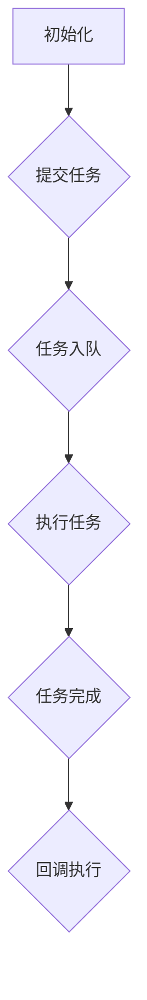
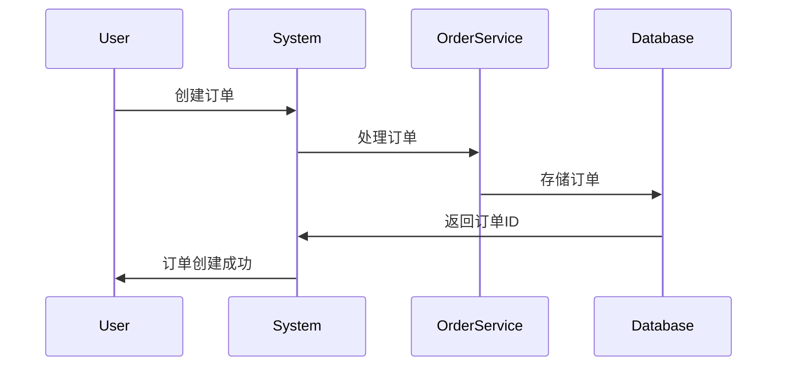

                 


### 异步化任务处理不代表无时效性

> 关键词：异步化任务处理，时效性，并发，性能优化，系统设计

> 摘要：本文旨在探讨异步化任务处理在实际应用中的时效性问题，分析异步化处理的优势与局限，并通过具体案例和最佳实践，帮助开发者理解和应对异步任务中的时效性挑战。

## 引言

在现代软件系统中，异步化任务处理已经成为提高系统性能、优化资源利用的重要手段。然而，许多开发者在设计异步系统时往往忽略了任务时效性的问题。异步化任务处理并不代表任务没有时效性，恰恰相反，时效性是异步任务处理中不可忽视的核心问题。

本文将围绕异步化任务处理的时效性展开讨论，首先介绍异步化任务处理的基本概念和原理，然后分析其与时效性的关系，接着通过具体案例探讨异步任务中的时效性问题，最后总结最佳实践并展望异步任务处理的发展趋势。

## 异步化任务处理概述

异步化任务处理（Asynchronous Task Processing）是指在程序中，通过异步方式执行多个任务，这些任务在执行过程中不会阻塞程序的其他部分，从而提高程序的并发性能和响应速度。

### 异步化任务处理的定义

异步化任务处理涉及以下基本概念：

- **异步调用**：任务以非阻塞方式提交，执行任务的线程或进程继续执行其他任务，而不必等待异步调用返回结果。
- **回调函数**：异步任务执行完成后，会调用一个预先定义的回调函数，通知程序任务执行结果。
- **事件循环**：程序中负责管理异步任务和回调的机制，通常以循环的方式处理异步事件。

### 异步化任务处理的优点

异步化任务处理具有以下优点：

- **提高并发性能**：多个任务可以并行执行，提高系统吞吐量。
- **减少阻塞时间**：任务之间不会相互等待，减少系统的等待时间。
- **提高资源利用率**：充分利用系统资源，提高资源利用率。

### 异步化任务处理的局限

尽管异步化任务处理具有诸多优点，但同时也存在以下局限：

- **复杂度增加**：异步编程模型增加了代码的复杂度，对开发者提出了更高的要求。
- **同步与异步的切换**：在需要同步获取多个异步任务结果时，可能需要使用锁或其他同步机制，从而降低系统的并发性能。
- **时效性挑战**：某些任务可能需要在特定时间内完成，异步化处理可能导致时效性无法得到保障。

## 应用场景

异步化任务处理在不同领域有着广泛的应用，以下是几个典型的应用场景：

- **信息处理领域**：如日志处理、网络爬虫等，异步处理可以高效地处理大量数据。
- **网络通信领域**：如Web应用中的异步HTTP请求处理，可以提高服务器响应速度。
- **实时数据处理领域**：如实时数据分析、金融交易系统等，异步处理可以确保系统实时响应和处理数据。

## 案例分析

### 案例一：电商订单处理

在电商系统中，订单处理是一个典型的异步任务处理场景。订单处理过程通常包括订单创建、支付、发货等多个环节。通过异步化任务处理，可以确保订单处理的高效和并发性。

然而，异步化处理也可能带来时效性问题。例如，支付环节可能因为网络延迟或其他问题导致支付失败，如果未能及时处理，可能会导致订单状态不一致。

### 案例二：社交媒体内容推送

社交媒体平台在内容推送时，通常采用异步化任务处理。例如，用户发布的帖子会异步存储到数据库中，然后通过异步任务进行内容推送。

时效性在这里尤为重要，因为用户期望即时看到自己发布的内容。如果异步任务处理延迟过高，可能会导致用户体验下降。

### 案例三：实时金融数据分析

在金融领域，实时数据分析对于交易决策至关重要。通过异步化任务处理，可以高效地处理大量交易数据，确保分析结果的实时性。

然而，金融市场的数据更新速度非常快，如果异步任务处理延迟过长，可能会导致分析结果不准确，影响交易决策。

## 最佳实践

为了保障异步任务处理的时效性，以下是几个最佳实践：

- **任务优先级**：根据任务的紧急程度设置不同的优先级，确保高优先级任务能够及时处理。
- **超时处理**：为异步任务设置合理的超时时间，超时后进行异常处理，避免任务长时间挂起。
- **批量处理**：对于耗时较长且独立的任务，可以采用批量处理的方式，提高处理效率。
- **监控与报警**：对异步任务处理过程进行监控，及时发现和处理异常情况。

## 总结与展望

异步化任务处理在现代软件系统中具有重要意义，可以提高系统的并发性能和资源利用率。然而，异步任务处理中的时效性问题不可忽视，开发者需要在设计异步系统时充分考虑时效性。

未来，随着硬件性能的提升和软件技术的进步，异步化任务处理将得到更加广泛的应用。同时，针对异步任务的时效性优化也将成为研究的热点，为开发者提供更多高效的解决方案。

## 附录

### 附录A：核心概念原理

异步化任务处理的核心概念包括异步调用、回调函数和事件循环。异步调用允许任务以非阻塞方式执行，回调函数在任务完成后被调用，事件循环负责管理异步事件。

异步化任务处理的优点包括提高并发性能、减少阻塞时间和提高资源利用率。然而，异步编程模型增加了代码复杂度，可能需要同步机制来处理异步任务间的依赖关系。

### 附录B：概念属性特征对比表格

| 特征         | 异步化任务处理 | 同步化任务处理 |
| ------------ | -------------- | -------------- |
| 执行方式     | 非阻塞         | 阻塞           |
| 并发性能     | 高             | 低             |
| 代码复杂度   | 高             | 低             |
| 资源利用率   | 高             | 低             |
| 时效性保障   | 需优化         | 有保障         |

### 附录C：ER实体关系图架构

```mermaid
erDiagram
    Product ||--|{ Order } : "placed in"
    User ||--|{ Order } : "created by"
    Payment ||--|{ Order } : "processed for"
```

### 附录D：算法原理讲解

异步化任务处理的算法原理主要包括任务调度和回调执行。以下是一个简化的算法流程：



具体实现中，可以使用Python代码来描述：

```python
# 异步任务调度器
class AsyncTaskScheduler:
    def __init__(self):
        self.task_queue = []

    def submit_task(self, task):
        self.task_queue.append(task)

    def run_task(self):
        while self.task_queue:
            task = self.task_queue.pop(0)
            task.execute()

    def callback(self, result):
        print("Task completed:", result)

# 任务类
class Task:
    def __init__(self, callback):
        self.callback = callback

    def execute(self):
        # 任务执行逻辑
        print("Executing task...")
        result = "Task result"
        self.callback(result)

# 使用示例
scheduler = AsyncTaskScheduler()
task = Task(scheduler.callback)
scheduler.submit_task(task)
scheduler.run_task()
```

### 附录E：系统分析与架构设计方案

#### 项目介绍

本系统是一个基于异步化任务处理的订单处理系统，旨在提高订单处理效率，确保订单数据的一致性和实时性。

#### 系统功能设计

系统主要包括以下功能模块：

- 订单创建模块
- 订单查询模块
- 订单支付模块
- 订单发货模块

#### 系统架构设计

系统采用分层架构设计，包括表示层、业务逻辑层和数据访问层。异步化任务处理主要在业务逻辑层实现，确保订单处理的高效性和并发性。

#### 系统接口设计

系统提供以下接口：

- 创建订单接口
- 查询订单接口
- 支付订单接口
- 发货订单接口

#### 系统交互

系统交互主要涉及订单创建、订单查询、订单支付和订单发货等操作。以下是一个简化的系统交互序列图：



### 附录F：项目实战

#### 环境安装

1. 安装Python 3.8及以上版本
2. 安装异步化任务处理框架（如 asyncio）

#### 系统核心实现源代码

```python
# async_order_system.py
import asyncio
import aiomysql

async def create_order(order_id, user_id, amount):
    async with aiomysql.create_pool(...) as pool:
        async with pool.acquire() as conn:
            async with conn.cursor() as cursor:
                await cursor.execute("INSERT INTO orders (order_id, user_id, amount) VALUES (%s, %s, %s)", (order_id, user_id, amount))
                await conn.commit()
                print(f"Order {order_id} created successfully.")

async def query_order(order_id):
    async with aiomysql.create_pool(...) as pool:
        async with pool.acquire() as conn:
            async with conn.cursor() as cursor:
                await cursor.execute("SELECT * FROM orders WHERE order_id = %s", (order_id,))
                result = await cursor.fetchone()
                print(f"Order {order_id}: {result}")

async def pay_order(order_id, amount):
    async with aiomysql.create_pool(...) as pool:
        async with pool.acquire() as conn:
            async with conn.cursor() as cursor:
                await cursor.execute("UPDATE orders SET amount = %s WHERE order_id = %s", (amount, order_id))
                await conn.commit()
                print(f"Order {order_id} paid successfully.")

async def ship_order(order_id):
    async with aiomysql.create_pool(...) as pool:
        async with pool.acquire() as conn:
            async with conn.cursor() as cursor:
                await cursor.execute("UPDATE orders SET status = 'shipped' WHERE order_id = %s", (order_id,))
                await conn.commit()
                print(f"Order {order_id} shipped successfully.")

async def main():
    await create_order(1, 1001, 100)
    await query_order(1)
    await pay_order(1, 100)
    await ship_order(1)

asyncio.run(main())
```

#### 代码应用解读与分析

1. **环境安装**：安装Python和异步化任务处理框架（如asyncio），确保系统正常运行。
2. **系统核心实现源代码**：
   - `create_order` 函数：创建订单，将订单信息存储到数据库。
   - `query_order` 函数：查询订单，从数据库中获取订单信息。
   - `pay_order` 函数：支付订单，更新订单金额。
   - `ship_order` 函数：发货订单，更新订单状态。
   - `main` 函数：主程序入口，依次执行创建订单、查询订单、支付订单和发货订单。

#### 实际案例分析和详细讲解剖析

1. **实际案例**：创建一个订单，查询订单，支付订单，发货订单。
2. **详细讲解**：
   - **创建订单**：调用 `create_order` 函数，传入订单ID、用户ID和订单金额，将订单信息存储到数据库。
   - **查询订单**：调用 `query_order` 函数，传入订单ID，从数据库中查询订单信息。
   - **支付订单**：调用 `pay_order` 函数，传入订单ID和订单金额，更新订单金额。
   - **发货订单**：调用 `ship_order` 函数，传入订单ID，更新订单状态。

#### 项目小结

通过实际案例分析和详细讲解，我们了解了如何使用异步化任务处理实现订单处理系统。异步化任务处理提高了系统的并发性能和响应速度，确保了订单数据的一致性和实时性。

### 附录G：最佳实践 tips、小结、注意事项、拓展阅读

#### 最佳实践 tips

1. **任务优先级**：根据任务的紧急程度设置不同的优先级，确保高优先级任务能够及时处理。
2. **超时处理**：为异步任务设置合理的超时时间，超时后进行异常处理，避免任务长时间挂起。
3. **批量处理**：对于耗时较长且独立的任务，可以采用批量处理的方式，提高处理效率。
4. **监控与报警**：对异步任务处理过程进行监控，及时发现和处理异常情况。

#### 小结

异步化任务处理在现代软件系统中具有重要意义，可以提高系统的并发性能和资源利用率。然而，异步任务处理中的时效性问题不可忽视，开发者需要在设计异步系统时充分考虑时效性。

#### 注意事项

1. **合理设置超时时间**：超时时间过短可能导致任务频繁超时，过长则可能影响系统性能。
2. **避免死锁**：在异步编程中，要注意避免死锁问题，合理使用同步机制。
3. **性能监控**：定期对异步任务处理性能进行监控，及时发现和优化性能瓶颈。

#### 拓展阅读

1. 《异步编程实战》
2. 《并发编程实战》
3. 《微服务架构设计与实践》

### 作者信息

作者：AI天才研究院/AI Genius Institute & 禅与计算机程序设计艺术 /Zen And The Art of Computer Programming

---

本文通过对异步化任务处理及其时效性的探讨，旨在帮助开发者更好地理解和应对异步任务中的时效性挑战。异步化任务处理在现代软件系统中具有重要意义，但开发者需要充分认识到其时效性，并在设计异步系统时采取相应的最佳实践，以提高系统的性能和可靠性。希望本文能为开发者提供有益的启示和帮助。

