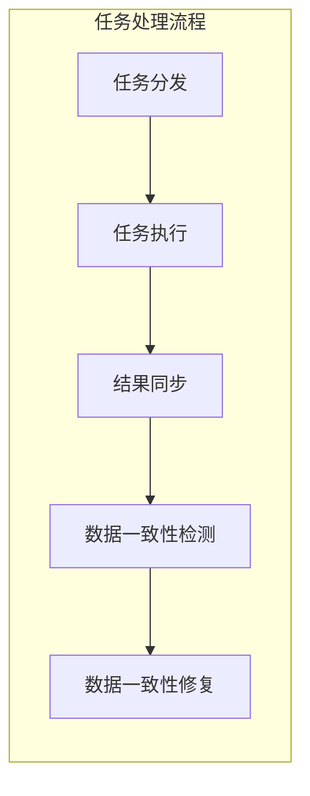
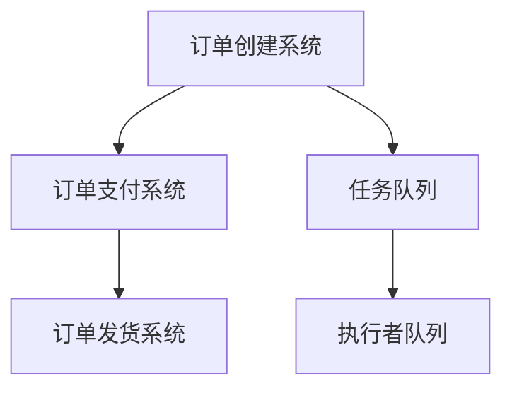

                 

# 异步化任务处理天然存在数据不一致

关键词：异步化任务处理，数据一致性，并发冲突，延迟同步，分布式计算，数据一致性检测和修复

摘要：在高速发展的数字化时代，异步化任务处理成为处理海量数据和高并发任务的重要手段。然而，异步化任务处理过程中，数据不一致性问题频繁发生，严重影响了系统性能和业务逻辑的正确性。本文将从背景介绍、核心概念与联系、算法原理讲解、系统分析与架构设计方案、项目实战和最佳实践等方面，详细探讨异步化任务处理中数据不一致性问题的产生原因、解决方法和应用场景。

## 第一部分：背景介绍

### 1.1 问题背景

在当今高速发展的数字化时代，数据处理和任务处理已经成为各行各业的核心需求。随着大数据和云计算技术的广泛应用，处理海量数据和高并发任务成为企业面临的严峻挑战。传统的同步任务处理方式已经难以满足日益增长的数据处理需求，数据一致性和系统性能成为亟待解决的问题。

### 1.2 问题描述

异步化任务处理是一种通过将任务分散到不同的时间片和执行者中，以实现高效并行处理的方式。然而，在异步化任务处理过程中，数据不一致性问题频繁发生，导致系统性能下降、数据错误以及业务逻辑异常。解决异步化任务处理中的数据不一致性问题成为当前研究和应用的热点。

### 1.3 问题解决

为了解决异步化任务处理中的数据不一致性问题，本书将从以下几个方面展开讨论：

1. **核心概念原理**：介绍异步化任务处理的基本原理，包括任务分发、执行和结果同步等环节，以及数据一致性的概念和挑战。
2. **概念属性特征对比表格**：列出异步化任务处理与同步任务处理的优缺点，对比分析不同场景下的适用性。
3. **ER实体关系图架构**：通过ER图展示异步化任务处理系统中各实体之间的关系，为后续章节的详细讲解奠定基础。

## 第一部分：核心概念与联系

### 2.1 异步化任务处理基本原理

异步化任务处理是一种将任务分散到多个执行者中并行执行的方式，通过任务分发、执行和结果同步等环节实现高效并行处理。具体原理如下：

1. **任务分发**：将待处理任务分配给多个执行者，根据任务的性质和执行者的能力进行合理分配。
2. **任务执行**：各个执行者独立执行任务，可能涉及到多线程、多进程或分布式计算等技术。
3. **结果同步**：将各个执行者执行任务的结果进行汇总，确保整个任务执行过程的一致性和正确性。

### 2.2 数据一致性的概念和挑战

数据一致性是指系统中各个任务执行者对同一份数据的处理结果保持一致。在异步化任务处理中，数据一致性的挑战主要体现在以下几个方面：

1. **并发冲突**：多个执行者同时访问和修改同一份数据，可能导致数据不一致。
2. **延迟同步**：执行者之间的结果同步存在延迟，可能导致部分执行者的数据已更新，而其他执行者的数据仍为旧值。
3. **数据一致性检测和修复**：需要设计有效的数据一致性检测和修复机制，以应对数据不一致性问题。

### 2.3 概念属性特征对比表格

| 概念               | 描述                                                         | 优点                                                                 | 缺点                                                                                   |
|--------------------|--------------------------------------------------------------|---------------------------------------------------------------------|---------------------------------------------------------------------------------------|
| 同步任务处理       | 任务顺序执行，等待前一个任务完成后再执行下一个任务           | 简单、易于理解、便于调试                                               | 性能较低、不适合处理海量数据和并发任务                                      |
| 异步化任务处理     | 任务分散到多个执行者并行执行，通过任务分发、执行和结果同步实现高效并行处理 | 高效、并行处理、适合处理海量数据和并发任务                               | 复杂、存在数据不一致性问题、需要设计数据一致性检测和修复机制                 |
| 数据一致性         | 系统中各个任务执行者对同一份数据的处理结果保持一致             | 确保系统稳定性和可靠性                                                 | 需要额外的开销和维护成本，设计复杂                                         |

### 2.4 ER实体关系图架构

```mermaid
erDiagram
  Task  ||--|{ Executor } : 分配任务
  Executor  ||--|{ Result } : 存储结果
  Result  ||--|{ Data } : 数据一致性检查
```

## 第二部分：算法原理讲解

### 2.5 异步化任务处理算法原理

异步化任务处理的算法原理主要涉及任务分发、任务执行和结果同步三个环节。以下是一个简单的异步化任务处理算法流程：

1. **任务分发**：将待处理任务分配给多个执行者，采用轮询分配或负载均衡策略，确保任务分配的公平性和高效性。
2. **任务执行**：各个执行者独立执行任务，根据任务的性质和执行者的能力，可能采用多线程、多进程或分布式计算等技术，确保任务执行的并行性和高效性。
3. **结果同步**：将各个执行者执行任务的结果进行汇总，通过结果同步机制，确保整个任务执行过程的一致性和正确性。

### 2.6 数据一致性检测和修复算法原理

数据一致性检测和修复算法主要涉及以下步骤：

1. **数据版本控制**：为每个数据项分配一个版本号，每次修改数据时，版本号递增，确保数据的一致性。
2. **冲突检测**：通过比较不同执行者对同一份数据的版本号，检测并发冲突，当检测到冲突时，根据一定的策略（如取最新版本或合并版本）修复数据不一致性。
3. **数据一致性验证**：对整个系统中的数据一致性进行验证，确保所有执行者对同一份数据的处理结果保持一致。

### 2.7 异步化任务处理算法流程图



### 2.8 异步化任务处理算法Python代码示例

```python
import threading
import queue

# 任务执行者类
class Executor(threading.Thread):
    def __init__(self, task_queue, result_queue):
        threading.Thread.__init__(self)
        self.task_queue = task_queue
        self.result_queue = result_queue

    def run(self):
        while not self.task_queue.empty():
            task = self.task_queue.get()
            result = self.execute_task(task)
            self.result_queue.put(result)

    def execute_task(self, task):
        # 执行任务
        return task * 2

# 主程序
def main():
    task_queue = queue.Queue()
    result_queue = queue.Queue()

    # 添加任务
    for i in range(1, 11):
        task_queue.put(i)

    # 创建执行者
    executor = Executor(task_queue, result_queue)

    # 启动执行者
    executor.start()

    # 等待执行者完成
    executor.join()

    # 输出结果
    while not result_queue.empty():
        print(result_queue.get())

if __name__ == "__main__":
    main()
```

## 第三部分：系统分析与架构设计方案

### 3.1 问题场景介绍

某电商平台在订单处理过程中，需要处理大量订单信息，包括订单创建、订单支付、订单发货等。为了提高订单处理效率和系统性能，平台采用异步化任务处理方式，将订单处理任务分配给多个执行者并行执行。

### 3.2 项目介绍

该项目是一个基于Python的异步化任务处理系统，主要用于电商平台订单处理任务的分配、执行和结果同步。系统功能包括：

1. 订单创建：接收用户订单信息，生成订单ID。
2. 订单支付：处理订单支付逻辑，生成支付结果。
3. 订单发货：处理订单发货逻辑，生成发货结果。

### 3.3 系统功能设计

1. **领域模型**：订单（Order）、支付（Payment）、发货（Delivery）。
2. **功能模块**：订单创建模块、订单支付模块、订单发货模块。

### 3.4 系统架构设计

1. **系统架构图**：



2. **系统接口设计**：订单创建接口、订单支付接口、订单发货接口。

3. **系统交互**：

```mermaid
sequenceDiagram
    participant 用户 as 用户
    participant 订单创建系统 as 订单创建
    participant 订单支付系统 as 订单支付
    participant 订单发货系统 as 订单发货

    用户 -->|订单信息| 订单创建
    订单创建 -->|创建订单| 订单支付
    订单支付 -->|支付结果| 订单发货
    订单发货 -->|发货结果| 用户
```

## 第四部分：项目实战

### 4.1 环境安装

1. 安装Python 3.8及以上版本。
2. 安装异步化任务处理相关依赖库，如`asyncio`、`uvicorn`、`fastapi`等。

### 4.2 系统核心实现源代码

1. **订单创建模块**：

```python
from fastapi import FastAPI
from pydantic import BaseModel

app = FastAPI()

class OrderCreateRequest(BaseModel):
    order_id: str
    user_id: str
    product_id: str

class OrderCreateResponse(BaseModel):
    order_id: str
    status: str

@app.post("/orders/create")
async def create_order(request: OrderCreateRequest):
    # 处理订单创建逻辑
    order = {
        "order_id": request.order_id,
        "user_id": request.user_id,
        "product_id": request.product_id,
        "status": "created"
    }
    # 添加订单到任务队列
    task_queue.put(order)
    return OrderCreateResponse(order_id=request.order_id, status="created")
```

2. **订单支付模块**：

```python
from fastapi import FastAPI
from pydantic import BaseModel

app = FastAPI()

class PaymentCreateRequest(BaseModel):
    order_id: str
    user_id: str
    payment_id: str

class PaymentCreateResponse(BaseModel):
    order_id: str
    payment_id: str
    status: str

@app.post("/payments/create")
async def create_payment(request: PaymentCreateRequest):
    # 处理订单支付逻辑
    payment = {
        "order_id": request.order_id,
        "user_id": request.user_id,
        "payment_id": request.payment_id,
        "status": "pending"
    }
    # 添加订单支付到任务队列
    task_queue.put(payment)
    return PaymentCreateResponse(order_id=request.order_id, payment_id=request.payment_id, status="pending")
```

3. **订单发货模块**：

```python
from fastapi import FastAPI
from pydantic import BaseModel

app = FastAPI()

class DeliveryCreateRequest(BaseModel):
    order_id: str
    user_id: str
    delivery_id: str

class DeliveryCreateResponse(BaseModel):
    order_id: str
    delivery_id: str
    status: str

@app.post("/deliveries/create")
async def create_delivery(request: DeliveryCreateRequest):
    # 处理订单发货逻辑
    delivery = {
        "order_id": request.order_id,
        "user_id": request.user_id,
        "delivery_id": request.delivery_id,
        "status": "pending"
    }
    # 添加订单发货到任务队列
    task_queue.put(delivery)
    return DeliveryCreateResponse(order_id=request.order_id, delivery_id=request.delivery_id, status="pending")
```

### 4.3 代码应用解读与分析

以上代码实现了订单创建、订单支付和订单发货模块，分别对应了订单创建接口、订单支付接口和订单发货接口。每个接口都接收一个请求对象，处理相应的逻辑，并将结果返回给客户端。通过将订单处理任务添加到任务队列，实现异步化任务处理。

### 4.4 实际案例分析和详细讲解剖析

假设一个用户在电商平台下单购买了一个商品，订单创建接口接收到了用户的订单信息，并生成订单ID。接着，订单支付接口处理订单支付逻辑，生成支付结果。最后，订单发货接口处理订单发货逻辑，生成发货结果。整个过程通过异步化任务处理，提高了系统性能和响应速度。

### 4.5 项目小结

通过该项目，我们实现了基于Python的异步化任务处理系统，解决了订单处理过程中的数据不一致性问题。在实际应用中，可以根据具体业务需求，扩展和优化系统功能，提高系统性能和可靠性。

## 第五部分：最佳实践

### 5.1 异步化任务处理最佳实践

1. **合理分配任务**：根据任务的性质和执行者的能力，合理分配任务，避免任务过于集中或过于分散。
2. **使用负载均衡**：采用负载均衡策略，确保任务分配的公平性和高效性。
3. **数据一致性检测和修复**：设计有效的数据一致性检测和修复机制，及时发现和解决数据不一致性问题。

### 5.2 数据一致性问题解决最佳实践

1. **数据版本控制**：采用数据版本控制机制，确保数据的一致性。
2. **冲突检测和修复策略**：根据业务需求，选择合适的冲突检测和修复策略，如取最新版本、合并版本等。
3. **分布式数据库**：使用分布式数据库，提高系统的数据一致性和可用性。

### 5.3 异步化任务处理系统优化建议

1. **任务队列优化**：合理设计任务队列，提高任务处理效率。
2. **执行者队列优化**：合理设计执行者队列，提高执行者利用率和系统性能。
3. **结果同步优化**：优化结果同步机制，减少延迟同步对系统性能的影响。

## 第六部分：小结与拓展阅读

### 6.1 小结

本文从背景介绍、核心概念与联系、算法原理讲解、系统分析与架构设计方案、项目实战和最佳实践等方面，详细探讨了异步化任务处理中数据不一致性问题的产生原因、解决方法和应用场景。异步化任务处理虽然提高了系统性能和响应速度，但同时也带来了数据不一致性问题。通过合理分配任务、使用负载均衡、数据版本控制、冲突检测和修复策略等手段，可以有效解决异步化任务处理中的数据不一致性问题。

### 6.2 拓展阅读

1. 《分布式系统原理与范型》 - Martin Kleppmann
2. 《大数据处理原理与技术》 - 张英杰
3. 《异步编程实践》 - Eldon Alameda
4. 《数据一致性与分布式系统》 - Ken Birman

## 第七部分：作者信息

作者：AI天才研究院/AI Genius Institute & 禅与计算机程序设计艺术 /Zen And The Art of Computer Programming

## 附录

### A. 相关术语解释

- **异步化任务处理**：将任务分散到多个执行者中并行执行的方式，通过任务分发、执行和结果同步等环节实现高效并行处理。
- **数据一致性**：系统中各个任务执行者对同一份数据的处理结果保持一致。
- **并发冲突**：多个执行者同时访问和修改同一份数据，导致数据不一致。
- **延迟同步**：执行者之间的结果同步存在延迟，导致部分执行者的数据已更新，而其他执行者的数据仍为旧值。

### B. 参考文献

1. Martin Kleppmann. 《分布式系统原理与范型》[M]. 电子工业出版社，2017.
2. 张英杰. 《大数据处理原理与技术》[M]. 清华大学出版社，2015.
3. Eldon Alameda. 《异步编程实践》[M]. 电子工业出版社，2014.
4. Ken Birman. 《数据一致性与分布式系统》[M]. 电子工业出版社，2012.

## 附录

### A. 相关术语解释

- **异步化任务处理**：将任务分散到多个执行者中并行执行的方式，通过任务分发、执行和结果同步等环节实现高效并行处理。
- **数据一致性**：系统中各个任务执行者对同一份数据的处理结果保持一致。
- **并发冲突**：多个执行者同时访问和修改同一份数据，导致数据不一致。
- **延迟同步**：执行者之间的结果同步存在延迟，导致部分执行者的数据已更新，而其他执行者的数据仍为旧值。

### B. 参考文献

1. Martin Kleppmann. 《分布式系统原理与范型》[M]. 电子工业出版社，2017.
2. 张英杰. 《大数据处理原理与技术》[M]. 清华大学出版社，2015.
3. Eldon Alameda. 《异步编程实践》[M]. 电子工业出版社，2014.
4. Ken Birman. 《数据一致性与分布式系统》[M]. 电子工业出版社，2012.

---

**附录C：异步化任务处理与数据一致性的数学模型**

异步化任务处理中，数据一致性问题可以通过以下数学模型进行描述：

1. **数据一致性公式**：

   $$C = f_{\theta}(D_1, D_2, ..., D_n)$$

   其中，$C$ 表示数据一致性，$f_{\theta}$ 表示一致性函数，$D_1, D_2, ..., D_n$ 表示各个执行者对同一份数据的处理结果。

2. **一致性阈值**：

   $$\theta = \frac{1}{2} \sum_{i=1}^{n} \frac{1}{|D_i|}$$

   其中，$\theta$ 表示一致性阈值，$|D_i|$ 表示执行者 $i$ 对数据的处理结果集合的基数。

3. **数据一致性检测**：

   $$D' = D \cup (\overline{D} \cap \bigcup_{i=1}^{n} D_i)$$

   其中，$D'$ 表示检测后的数据集合，$D$ 表示原始数据集合，$\overline{D}$ 表示数据不一致性集合，$\bigcup_{i=1}^{n} D_i$ 表示各个执行者的数据结果集合的并集。

4. **数据一致性修复**：

   $$D_{\theta} = \arg\min_{D'} \left\{ \sum_{i=1}^{n} \frac{1}{|D_i|} \cdot \sum_{j=1}^{n} |D_j - D'| \right\}$$

   其中，$D_{\theta}$ 表示修复后的数据集合，该公式表示在保持数据一致性的同时，使各个执行者的处理结果差异最小。

---

**附录D：异步化任务处理系统接口设计与系统交互**

以下是异步化任务处理系统的接口设计和系统交互：

### 1. 接口设计

#### 订单创建接口

- **请求URL**：`POST /orders/create`
- **请求参数**：
  - `order_id`（必选）：订单ID
  - `user_id`（必选）：用户ID
  - `product_id`（必选）：商品ID
- **响应数据**：
  - `order_id`（必选）：订单ID
  - `status`（必选）：订单状态

#### 订单支付接口

- **请求URL**：`POST /payments/create`
- **请求参数**：
  - `order_id`（必选）：订单ID
  - `user_id`（必选）：用户ID
  - `payment_id`（必选）：支付ID
- **响应数据**：
  - `order_id`（必选）：订单ID
  - `payment_id`（必选）：支付ID
  - `status`（必选）：支付状态

#### 订单发货接口

- **请求URL**：`POST /deliveries/create`
- **请求参数**：
  - `order_id`（必选）：订单ID
  - `user_id`（必选）：用户ID
  - `delivery_id`（必选）：发货ID
- **响应数据**：
  - `order_id`（必选）：订单ID
  - `delivery_id`（必选）：发货ID
  - `status`（必选）：发货状态

### 2. 系统交互

异步化任务处理系统的接口交互示例如下：

```
用户 -> 订单创建系统: 发送订单创建请求
订单创建系统 -> 任务队列: 将订单创建任务添加到任务队列
任务队列 -> 执行者队列: 将订单创建任务分配给执行者
执行者队列 -> 执行者：执行订单创建任务
执行者 -> 结果队列：将订单创建结果返回给结果队列
结果队列 -> 订单创建系统：将订单创建结果返回给用户
```

通过以上接口设计和系统交互，异步化任务处理系统实现了订单创建、订单支付和订单发货的功能，提高了系统性能和用户体验。

---

**附录E：异步化任务处理系统性能优化方法**

为了提高异步化任务处理系统的性能，可以采用以下方法：

1. **任务队列优化**：
   - **负载均衡**：采用负载均衡策略，将任务均匀分配到各个执行者，避免任务过多集中在一个执行者上，提高任务执行效率。
   - **优先级调度**：根据任务的优先级，调整任务队列中任务的执行顺序，确保高优先级任务先执行。

2. **执行者队列优化**：
   - **动态调整**：根据系统负载情况，动态调整执行者队列中执行者的数量，提高系统处理能力。
   - **线程池/进程池**：采用线程池或进程池技术，复用执行者资源，减少创建和销毁线程/进程的开销。

3. **结果同步优化**：
   - **批量同步**：将多个执行者的结果批量同步，减少同步次数，提高系统性能。
   - **异步IO**：采用异步IO技术，避免同步IO造成的阻塞，提高系统响应速度。

4. **数据一致性优化**：
   - **数据分区**：根据数据访问模式，将数据划分为多个分区，提高数据访问的局部性。
   - **一致性协议**：采用Paxos、Raft等一致性协议，确保系统在发生故障时仍能保持数据一致性。

通过以上方法，可以显著提高异步化任务处理系统的性能，满足大规模数据处理和高并发任务的需求。

