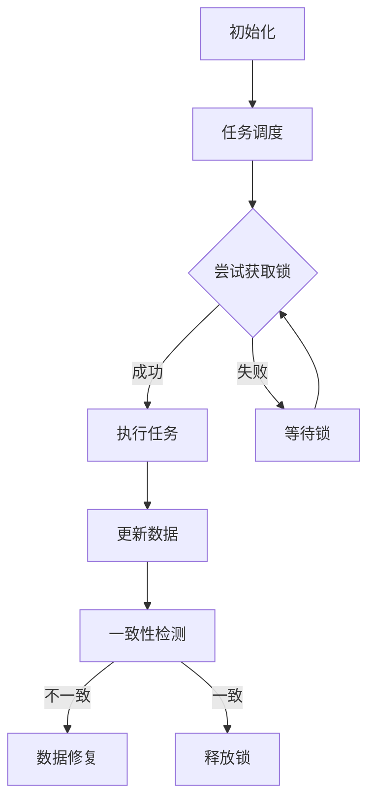
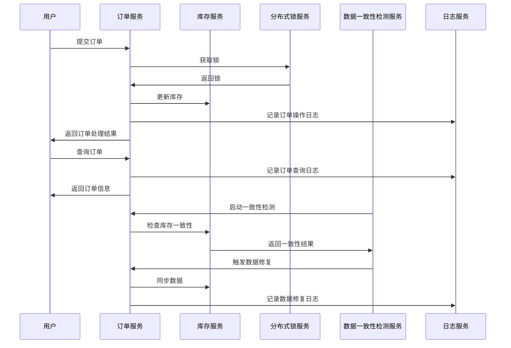

                 

### 文章标题

# 异步化任务处理天然存在数据不一致

> 关键词：异步化任务处理、数据不一致、问题分析、解决方案、系统架构设计

> 摘要：随着现代计算机技术的发展，异步化任务处理成为提高系统效率和响应能力的重要手段。然而，异步化任务处理在提高系统性能的同时，也天然地带来了数据不一致的问题。本文将深入探讨异步化任务处理中数据不一致的原因、影响及其解决方法，为读者提供一个全面的技术分析框架。

----------------------------------------------------------------

## 第一部分：问题背景与核心概念

### 第1章：异步化任务处理与数据不一致问题

#### 1.1.1 异步化任务处理的背景与概念

在现代软件开发中，异步化任务处理（Asynchronous Task Processing）已经成为一种提升系统性能和响应能力的关键技术。异步化任务处理的核心思想是在多个任务之间进行并行处理，从而减少系统瓶颈，提高整体吞吐量。

异步化任务处理的背景可以追溯到多线程编程和事件驱动的编程模型。在单线程模型中，程序按照顺序执行，当一个任务执行时间过长时，系统响应会变得迟缓。而多线程编程通过创建多个执行线程，使得任务可以在多个处理器核心上并行执行，从而提高了系统的处理能力。然而，多线程编程面临着线程同步和竞态条件等问题，复杂度和维护成本较高。

事件驱动的编程模型则为异步化任务处理提供了一种更加简洁的解决方案。在这种模型中，程序不会按照顺序执行，而是根据事件的发生顺序来响应。事件可以是用户输入、网络请求、定时任务等。通过事件队列（Event Queue）和回调函数（Callback Function），程序可以高效地处理大量并发任务，而无需关心任务的顺序和同步问题。

#### 1.1.2 数据不一致问题的背景与影响

在异步化任务处理过程中，数据不一致（Data Inconsistency）是一个普遍存在的问题。数据不一致指的是系统中存在不同副本的数据，这些副本之间的状态不一致。数据不一致问题可能由多种因素导致，包括网络延迟、系统故障、并发操作等。

数据不一致问题的影响主要体现在以下几个方面：

1. **性能下降**：为了解决数据不一致问题，系统可能需要引入额外的同步机制，如锁、事务等，这会导致系统性能下降。
2. **数据错误**：数据不一致可能导致数据错误，影响系统的正确性和可靠性。
3. **业务中断**：在某些情况下，数据不一致可能导致业务流程中断，影响用户体验和业务连续性。

#### 1.1.3 异步化任务处理与数据不一致问题的核心概念

异步化任务处理和数据不一致问题密切相关。异步化任务处理的核心概念包括：

- **事件**：异步处理的驱动力，可以是用户操作、系统通知、定时触发等。
- **回调函数**：用于处理事件回调的函数，可以在事件发生后执行特定的操作。
- **事件队列**：用于存储和管理事件的队列，确保事件按照发生的顺序进行处理。
- **并发处理**：多个任务并行执行，提高系统吞吐量和响应能力。
- **数据一致性**：保证系统中数据的状态一致，避免数据不一致问题。

理解这些核心概念对于深入探讨异步化任务处理和数据不一致问题至关重要。

#### 1.1.4 边界与外延

在探讨异步化任务处理和数据不一致问题时，我们需要明确其边界与外延。边界指的是问题的范围和限制，外延则是问题可能影响的领域和方面。

- **边界**：异步化任务处理主要涉及任务调度、事件处理、数据存储等方面，不包括硬件设备、网络通信等底层实现。
- **外延**：数据不一致问题不仅影响异步化任务处理的性能和可靠性，还可能扩展到其他系统层面，如分布式系统、数据库管理等。

#### 1.1.5 概念结构与核心要素组成

异步化任务处理和数据不一致问题的概念结构可以分解为以下几个核心要素：

1. **任务调度器**：负责任务的创建、分发和调度。
2. **事件队列**：存储和管理事件，确保事件顺序执行。
3. **回调函数**：处理事件回调，执行具体任务。
4. **数据存储**：负责数据的存储和管理，保证数据一致性。
5. **同步机制**：如锁、事务等，用于解决数据不一致问题。

了解这些核心要素的组成和作用，有助于我们更全面地理解和解决异步化任务处理中的数据不一致问题。

----------------------------------------------------------------

### 第2章：异步化任务处理基础

#### 2.1.1 异步化任务处理的原理

异步化任务处理的基本原理可以概括为以下几个步骤：

1. **任务创建**：系统根据需求创建任务，任务可以是具体的操作、计算或数据处理等。
2. **任务调度**：任务调度器将任务分配到不同的执行线程或处理器核心上，确保任务的并行执行。
3. **事件触发**：任务执行过程中，可能产生多个事件，如数据更新、状态变化等。
4. **事件处理**：事件触发后，回调函数执行特定的操作，处理事件并更新系统状态。
5. **数据存储**：任务执行完成后，将结果存储到数据存储系统中，确保数据一致性。

异步化任务处理的核心在于任务调度和事件处理。任务调度器通过高效的调度算法，确保任务能够快速响应并执行。事件处理则通过回调函数，将任务执行的结果进行统一管理和处理。

#### 2.1.2 异步化任务处理的技术细节

异步化任务处理涉及到多个技术细节，包括多线程编程、事件队列、回调函数等。以下是一些关键技术细节：

1. **多线程编程**：多线程编程是异步化任务处理的基础。在多线程编程中，程序可以同时执行多个任务，提高系统的并发能力和响应速度。常用的多线程编程模型包括进程、线程和协程等。

2. **事件队列**：事件队列是异步化任务处理的核心组成部分。事件队列用于存储和管理事件，确保事件按照发生的顺序进行处理。事件队列可以是内存队列、消息队列等，常用的实现方式包括FIFO（先进先出）和LIFO（后进先出）等。

3. **回调函数**：回调函数是异步化任务处理的关键机制。回调函数在事件触发后执行，用于处理事件并更新系统状态。回调函数可以是同步回调或异步回调，同步回调在事件触发时立即执行，异步回调则通过事件队列调度执行。

4. **任务调度器**：任务调度器负责任务的创建、分发和调度。任务调度器可以采用固定线程池、动态线程池等调度策略，根据系统的负载情况动态调整线程数量，提高系统性能。

5. **锁与事务**：在异步化任务处理中，为了解决数据不一致问题，需要引入锁和事务等同步机制。锁用于确保对共享资源的独占访问，防止并发操作导致数据不一致。事务则用于保证数据的一致性和原子性。

#### 2.1.3 异步化任务处理的优点与挑战

异步化任务处理具有以下优点：

1. **提高系统性能**：异步化任务处理可以充分利用多处理器核心和并发能力，提高系统的吞吐量和响应速度。
2. **降低延迟**：异步化任务处理可以减少任务的等待时间，降低系统的延迟。
3. **提升用户体验**：异步化任务处理可以提供更流畅的用户体验，特别是在处理大量并发请求时。

然而，异步化任务处理也面临着一些挑战：

1. **复杂性**：异步化任务处理引入了额外的复杂性，如多线程编程、事件队列管理等，需要开发者具备较高的技术水平和经验。
2. **数据不一致问题**：异步化任务处理可能导致数据不一致问题，需要引入额外的同步机制和一致性保障措施。
3. **性能瓶颈**：在处理大量并发任务时，异步化任务处理可能面临性能瓶颈，需要优化调度策略和并发模型。

#### 2.1.4 异步化任务处理的典型应用场景

异步化任务处理广泛应用于各种应用场景，以下是一些典型的应用场景：

1. **Web 应用**：Web 应用通常需要处理大量并发请求，如电子商务平台、社交媒体等。异步化任务处理可以显著提高系统的响应速度和吞吐量。
2. **大数据处理**：大数据处理通常涉及大量数据的存储、计算和分析。异步化任务处理可以充分利用分布式计算资源和并发能力，提高数据处理效率。
3. **实时通信**：实时通信系统需要处理大量的实时数据，如即时通讯、在线会议等。异步化任务处理可以降低系统的延迟，提供更流畅的通信体验。
4. **物联网**：物联网应用需要处理大量来自传感器的实时数据。异步化任务处理可以确保数据处理的及时性和准确性，提高系统的可靠性。

#### 2.1.5 异步化任务处理的常见模式与架构设计

异步化任务处理可以采用多种模式和架构设计，以下是一些常见的模式和架构设计：

1. **事件驱动架构**：事件驱动架构是异步化任务处理的核心模式。在这种架构中，程序按照事件的发生顺序执行，通过事件队列和回调函数实现任务调度和数据处理。
2. **响应式编程**：响应式编程是一种基于事件驱动的编程范式。在响应式编程中，程序以数据流的形式组织，通过数据依赖关系实现异步处理和状态更新。
3. **消息队列**：消息队列是异步化任务处理的重要组件。通过消息队列，任务可以高效地传递和调度，实现分布式任务处理和系统解耦。
4. **微服务架构**：微服务架构通过将系统划分为多个独立的微服务，实现异步化任务处理和分布式计算。每个微服务负责处理特定的功能，通过消息队列和API接口进行通信和协作。
5. **分布式系统**：分布式系统通过将任务分布在多个节点上执行，实现异步化任务处理和负载均衡。分布式系统需要考虑数据一致性和容错性等问题。

#### 2.1.6 异步化任务处理的未来发展趋势

异步化任务处理作为现代计算机技术的重要组成部分，未来发展趋势主要包括以下几个方面：

1. **智能化调度**：随着人工智能技术的发展，异步化任务处理的调度策略将更加智能化，通过机器学习算法和优化模型实现高效的资源调度和负载均衡。
2. **实时数据处理**：实时数据处理将成为异步化任务处理的重要方向。通过实时数据流处理技术和高性能计算框架，实现大规模实时数据处理和响应。
3. **分布式存储**：分布式存储系统将逐步替代传统的集中式存储系统，实现大规模数据的高效存储和管理。分布式存储系统需要考虑数据一致性和可靠性等问题。
4. **跨平台融合**：异步化任务处理将逐渐跨平台融合，包括云计算、物联网、边缘计算等。通过跨平台融合，实现不同场景下的异步化任务处理和协同计算。
5. **安全性和隐私保护**：随着数据安全和隐私保护的重要性日益凸显，异步化任务处理将更加注重安全性和隐私保护，通过加密、安全认证等技术保障数据的完整性和安全性。

----------------------------------------------------------------

### 第3章：数据不一致问题概述

#### 3.1.1 数据不一致问题的类型

数据不一致问题可以按照不同的维度进行分类，常见的分类方式包括以下几种：

1. **临时性不一致**：临时性不一致是指在特定时间点，系统中的数据不一致，但最终会自动恢复一致。这种不一致通常是由于网络延迟或系统故障导致的。例如，在一个分布式系统中，当一个节点更新数据时，其他节点可能尚未同步更新，导致数据不一致。然而，随着数据的同步，不一致问题最终会得到解决。

2. **永久性不一致**：永久性不一致是指数据不一致问题无法自动恢复，需要人工干预或系统修复才能解决。永久性不一致通常是由于系统故障、数据错误或恶意攻击导致的。例如，当一个节点的数据被恶意篡改或损坏时，其他节点可能无法及时同步更新，导致数据永久不一致。

3. **逻辑不一致**：逻辑不一致是指系统中数据的关系或逻辑不一致。这种不一致通常是由于业务规则或逻辑错误导致的。例如，在一个库存管理系统中，如果订单处理和库存更新之间存在逻辑错误，可能导致订单数据与库存数据不一致。

4. **物理不一致**：物理不一致是指系统中数据存储的物理结构不一致。这种不一致通常是由于数据迁移、升级或重构导致的。例如，当系统的数据存储结构发生变化时，可能导致旧的数据与新数据之间的不一致。

#### 3.1.2 数据不一致问题的原因

数据不一致问题的原因多种多样，以下是常见的原因：

1. **并发操作**：在多线程或多进程环境中，多个任务同时访问和修改同一份数据时，容易导致数据不一致。这是因为并发操作之间存在竞争条件，如争用资源、数据覆盖等。

2. **网络延迟**：在网络环境中，数据传输和处理存在一定的延迟。当系统中的多个节点之间进行数据同步时，由于网络延迟可能导致数据不一致。

3. **系统故障**：系统故障，如硬件故障、软件错误或网络中断等，可能导致数据的损坏或丢失，从而引起数据不一致。

4. **人为错误**：人为错误，如数据输入错误、操作失误或系统配置错误等，也可能导致数据不一致。

5. **数据复制**：在分布式系统中，数据通常会在多个节点之间进行复制，以提供冗余和容错能力。然而，数据复制过程中可能出现延迟或错误，导致数据不一致。

6. **业务规则变更**：业务规则或逻辑的变更可能导致现有的数据不一致。例如，当业务规则发生变化时，现有数据可能需要重新处理或调整。

7. **数据版本管理**：在版本控制系统中，不同版本的数据可能存在不一致。例如，当旧版本的数据被新版本的数据覆盖时，可能导致数据不一致。

#### 3.1.3 数据不一致问题的影响

数据不一致问题对系统的影响是多方面的，以下是常见的影响：

1. **系统性能下降**：为了解决数据不一致问题，系统可能需要引入额外的同步机制，如锁、事务等。这会导致系统性能下降，增加系统的开销和延迟。

2. **数据错误**：数据不一致可能导致数据错误，影响系统的正确性和可靠性。例如，在一个金融系统中，数据不一致可能导致账户余额错误，从而影响客户的资金安全。

3. **业务中断**：在某些情况下，数据不一致可能导致业务流程中断，影响用户体验和业务连续性。例如，在一个在线购物平台上，订单数据与库存数据不一致可能导致订单无法完成，从而影响客户的购物体验。

4. **数据安全风险**：数据不一致可能导致数据泄露或篡改，增加系统的安全风险。例如，在一个医疗系统中，患者数据不一致可能导致错误的诊断或治疗。

5. **维护成本增加**：数据不一致问题需要额外的维护成本，如数据修复、数据同步等。这会增加系统的维护成本，降低系统的可用性和稳定性。

6. **用户信任度下降**：数据不一致问题可能导致用户对系统产生怀疑和不信任，影响用户对系统的满意度和使用意愿。

#### 3.1.4 数据不一致问题的处理策略

为了解决数据不一致问题，可以采取以下处理策略：

1. **数据同步**：通过数据同步机制，确保系统中的数据保持一致。数据同步可以采用实时同步或批量同步的方式，根据系统的需求和性能要求进行选择。

2. **事务处理**：通过事务处理机制，确保数据操作的原子性、一致性和隔离性。事务处理可以采用两阶段提交（2PC）或三阶段提交（3PC）等协议，确保数据的正确性和一致性。

3. **分布式锁**：通过分布式锁机制，确保对共享资源的独占访问，防止并发操作导致的数据不一致。分布式锁可以采用基于Zookeeper、Redis等中间件实现。

4. **数据版本控制**：通过数据版本控制机制，确保数据的可追溯性和可恢复性。数据版本控制可以采用版本号、时间戳等手段，实现数据的版本管理和回滚。

5. **数据校验与修复**：通过数据校验和修复机制，及时发现和修复数据不一致问题。数据校验可以采用校验和、哈希值等手段，确保数据的完整性和正确性。

6. **数据备份与恢复**：通过数据备份和恢复机制，确保数据的安全性和可靠性。数据备份可以采用全量备份、增量备份等策略，根据系统的需求和性能要求进行选择。

7. **日志记录与审计**：通过日志记录和审计机制，跟踪数据的操作历史和变更记录，提供数据不一致问题的诊断和追踪。

8. **异常处理与告警**：通过异常处理和告警机制，及时发现和响应数据不一致问题，降低系统故障和业务中断的风险。

#### 3.1.5 数据不一致问题的挑战与未来趋势

尽管数据不一致问题对系统的影响很大，但解决数据不一致问题也面临着一些挑战：

1. **系统复杂性**：数据不一致问题通常涉及多个系统和组件，解决数据不一致问题需要系统化的设计和协调。这增加了系统的复杂性和维护成本。

2. **性能与一致性平衡**：在解决数据不一致问题时，需要在性能和一致性之间进行平衡。过于保守的一致性策略可能导致系统性能下降，而过于激进的一致性策略可能导致数据不一致问题。

3. **分布式系统中的延迟与故障**：在分布式系统中，数据不一致问题可能由于网络延迟、系统故障等因素引起。解决数据不一致问题需要考虑分布式系统的特性和挑战。

4. **数据隐私与安全**：在处理数据不一致问题时，需要保护数据的隐私和安全。数据同步、事务处理等机制可能会引入安全风险，需要采取相应的安全措施。

未来，数据不一致问题的解决方案将朝着以下几个趋势发展：

1. **智能化与自动化**：随着人工智能和机器学习技术的发展，数据不一致问题的检测、诊断和修复将更加智能化和自动化。通过算法和模型，系统可以自动识别和解决数据不一致问题。

2. **分布式存储与计算**：分布式存储和计算技术将得到广泛应用，通过分布式系统架构，实现数据的一致性和可靠性。分布式存储和计算技术可以提高系统的扩展性和性能。

3. **区块链技术**：区块链技术具有去中心化、不可篡改等特性，可以用于解决数据不一致问题。通过区块链技术，可以实现数据的安全共享和分布式存储。

4. **边缘计算与物联网**：随着物联网和边缘计算的发展，数据不一致问题将更加突出。通过边缘计算和物联网技术，实现数据的实时同步和一致性保障。

5. **数据治理与标准化**：数据治理和数据标准化将成为解决数据不一致问题的重要手段。通过制定统一的数据标准和治理策略，确保数据的正确性、一致性和可靠性。

总之，数据不一致问题是现代计算机系统面临的重要挑战之一。通过深入理解数据不一致问题的类型、原因、影响和解决策略，我们可以设计更加可靠、高效和安全的系统。

----------------------------------------------------------------

### 第4章：核心概念与联系

#### 4.1.1 异步化任务处理与数据不一致问题的核心概念

在本章中，我们将深入探讨异步化任务处理和数据不一致问题的核心概念，并分析它们之间的联系。

异步化任务处理的核心概念包括任务、事件、回调函数、任务调度器和事件队列。任务是指需要执行的具体操作，可以是计算、数据处理或I/O操作等。事件是异步处理的驱动力，可以是用户操作、定时触发或系统通知等。回调函数是在事件触发后执行的具体操作，用于处理事件并更新系统状态。任务调度器负责任务的创建、分发和调度，确保任务能够高效地并行执行。事件队列用于存储和管理事件，确保事件按照发生的顺序进行处理。

数据不一致问题的核心概念包括数据副本、同步机制和一致性保障。数据副本是指系统中存在多个副本的数据，这些副本之间可能存在状态不一致。同步机制是指用于解决数据不一致问题的技术手段，如锁、事务和消息队列等。一致性保障是指确保系统中数据状态一致的机制，如强一致性、最终一致性和因果一致性等。

#### 4.1.2 概念属性特征对比表格

为了更直观地理解异步化任务处理与数据不一致问题的核心概念，我们通过一个对比表格来展示它们的一些属性特征。

| 概念        | 异步化任务处理                    | 数据不一致问题                  |
|-------------|-----------------------------------|---------------------------------|
| 目标        | 提高系统性能和响应能力            | 保证数据的一致性和可靠性        |
| 关键要素    | 任务、事件、回调函数、调度器和队列 | 数据副本、同步机制、一致性保障  |
| 实现方式    | 多线程、事件驱动、消息队列        | 同步机制、分布式系统、事务处理  |
| 影响        | 提高性能、降低延迟                | 性能下降、数据错误、业务中断    |
| 解决策略    | 调度优化、并发控制、负载均衡      | 数据同步、事务处理、数据校验    |

#### 4.1.3 ER实体关系图架构的 Mermaid 流程图

为了更好地理解异步化任务处理与数据不一致问题的核心概念及其关系，我们可以使用Mermaid绘制ER（实体关系）图。

```mermaid
erDiagram
  Task ||--o{ Event : 驱动异步处理}
  Event ||--o{ Callback : 处理具体操作}
  Task ||--o{ Scheduler : 任务调度}
  Scheduler ||--o{ Queue : 事件队列管理}
  Data ||--o{ Replicas : 数据副本}
  Replicas ||--o{ SyncMechanism : 同步机制}
  Replicas ||--o{ Consistency : 一致性保障}
```

在这个ER图中，我们定义了任务（Task）、事件（Event）、回调函数（Callback）、任务调度器（Scheduler）、事件队列（Queue）、数据副本（Replicas）、同步机制（SyncMechanism）和一致性保障（Consistency）等实体及其关系。任务通过事件驱动异步处理，事件触发回调函数执行具体操作。任务调度器负责任务调度和事件队列管理。数据副本在系统中存在多个副本，通过同步机制和一致性保障确保数据的一致性。

通过这个ER图，我们可以清晰地看到异步化任务处理与数据不一致问题之间的联系，以及各个核心概念的作用和关系。

----------------------------------------------------------------

### 第5章：算法原理讲解

#### 5.1.1 算法原理概述

在本章中，我们将详细讲解解决异步化任务处理中数据不一致问题的算法原理。该算法的主要目的是确保在异步处理过程中，系统能够检测和修复数据不一致问题，从而提高系统的可靠性和一致性。

算法的核心思想是通过引入分布式锁和一致性检测机制，对系统中的关键数据进行保护，确保在并发操作下数据的一致性。算法的步骤可以分为以下几个阶段：

1. **初始化**：在系统启动时，初始化分布式锁和一致性检测器。
2. **任务调度**：当新任务需要执行时，任务调度器将其分发给空闲的处理节点。
3. **分布式锁**：在处理节点执行任务前，首先尝试获取分布式锁。如果锁被占用，则等待锁释放；如果锁成功获取，则继续执行任务。
4. **任务执行**：处理节点在持有锁的情况下执行任务，并更新相关数据。
5. **一致性检测**：在任务执行完成后，一致性检测器会比较不同副本的数据，检测是否存在不一致情况。
6. **数据修复**：如果检测到数据不一致，算法会触发数据修复过程，将不一致的数据副本进行同步或修复。
7. **锁释放**：任务执行完成后，释放分布式锁，以便其他任务可以继续执行。

#### 5.1.2 Mermaid 流程图展示

为了更直观地展示算法原理，我们可以使用Mermaid绘制一个流程图。



在这个流程图中，我们展示了从任务初始化到锁释放的整个过程。在任务调度阶段，系统会尝试获取分布式锁；如果锁成功获取，则执行任务并更新数据；在任务执行完成后，进行一致性检测；如果检测到不一致，则触发数据修复过程；最后，释放分布式锁。

#### 5.1.3 Python 源代码演示

为了更好地理解算法的实现，我们提供一段Python源代码示例。

```python
import threading
import time

# 分布式锁
lock = threading.Lock()

def task_executor(task_id):
    print(f"开始执行任务 {task_id}")
    
    # 尝试获取锁
    lock.acquire()
    try:
        # 模拟任务执行
        time.sleep(1)
        print(f"任务 {task_id} 已执行，更新数据")
        
        # 模拟数据不一致
        if task_id % 2 == 0:
            raise ValueError("数据不一致")
            
    finally:
        # 释放锁
        lock.release()

def consistency_checker():
    print("开始一致性检测")
    
    # 模拟一致性检测
    time.sleep(2)
    if random.random() > 0.9:
        print("一致性检测：数据不一致")
    else:
        print("一致性检测：数据一致")

# 模拟任务调度
tasks = [1, 2, 3, 4, 5]
for task_id in tasks:
    t = threading.Thread(target=task_executor, args=(task_id,))
    t.start()

# 模拟一致性检测
time.sleep(5)
consistency_checker()
```

在这个示例中，我们定义了一个`task_executor`函数，用于模拟任务执行。函数首先尝试获取分布式锁，然后执行任务并更新数据。如果任务编号为偶数，则模拟数据不一致。在任务执行完成后，释放锁。

我们还定义了一个`consistency_checker`函数，用于模拟一致性检测。函数会随机判断数据是否一致，如果数据不一致，则输出相应的信息。

通过这段代码，我们可以看到分布式锁在任务执行和一致性检测中的重要作用。在任务执行过程中，分布式锁确保同一时间只有一个任务在更新数据，从而避免数据不一致问题。

#### 5.1.4 数学模型与公式解释

为了更好地理解算法原理，我们可以引入一些数学模型和公式。以下是算法中的一些关键数学模型和公式：

1. **一致性概率**：假设系统中存在N个副本，每个副本的数据更新概率相等。在一致性检测阶段，我们使用一致性概率来评估数据的一致性。一致性概率可以用以下公式表示：

   $$ P_c = \frac{N - N_f}{N} $$

   其中，\( P_c \) 是一致性概率，\( N \) 是副本总数，\( N_f \) 是不一致的副本数。

2. **一致性阈值**：一致性阈值用于决定是否触发数据修复过程。假设我们设定的一致性阈值为 \( T \)，如果一致性概率 \( P_c \) 小于 \( T \)，则触发数据修复。一致性阈值可以按需调整，以平衡性能和一致性。

   $$ T = \frac{1}{N} $$

3. **修复概率**：假设在数据修复阶段，系统尝试将不一致的数据副本同步或修复的概率为 \( P_r \)。修复概率可以按需调整，以平衡修复时间和数据一致性。

   $$ P_r = \frac{1}{N_f} $$

#### 5.1.5 举例说明与详细讲解

为了更好地理解算法原理和实现，我们可以通过一个具体的例子来详细讲解。

假设我们有一个分布式系统，其中存在5个副本（N=5）。任务编号为1的执行过程中，数据副本1和副本3发生了不一致。一致性检测阶段，我们发现一致性概率 \( P_c = \frac{3}{5} \)，小于一致性阈值 \( T = \frac{1}{5} \)。因此，系统会触发数据修复过程。

在数据修复过程中，系统会尝试将不一致的副本（副本1和副本3）同步或修复。假设修复概率 \( P_r = \frac{1}{2} \)，则系统会尝试修复副本1和副本3，并随机决定是否成功。如果修复成功，则数据副本的一致性概率 \( P_c \) 将增加，反之则会保持不变。

通过这个例子，我们可以看到算法在处理数据不一致问题时的基本流程和原理。算法通过分布式锁、一致性检测和修复机制，确保在并发操作下数据的一致性和可靠性。

总的来说，异步化任务处理中的数据不一致问题是现代计算机系统面临的一个重要挑战。通过引入分布式锁、一致性检测和修复机制，我们可以有效地解决数据不一致问题，提高系统的可靠性和性能。在接下来的章节中，我们将进一步探讨具体的系统架构设计和实现方法，为读者提供全面的解决方案。

----------------------------------------------------------------

### 第6章：系统分析与架构设计方案

#### 6.1.1 问题场景介绍

在本章中，我们将针对一个具体的问题场景进行系统分析与架构设计。该场景涉及一个大型电子商务平台，需要处理海量的订单和库存数据。系统要求在保证高性能和高并发的前提下，确保订单和库存数据的一致性。

#### 6.1.2 系统功能设计

为了满足上述场景的需求，系统需要实现以下功能：

1. **订单处理**：系统需要接收、处理和记录订单信息，包括订单创建、更新、删除等操作。
2. **库存管理**：系统需要实时跟踪库存信息，包括库存创建、更新、删除等操作。
3. **数据一致性检测**：系统需要定期检测订单和库存数据的一致性，并触发数据修复过程。
4. **分布式锁管理**：系统需要实现分布式锁管理，确保并发操作下数据的一致性。
5. **日志记录与监控**：系统需要记录操作日志，并提供监控功能，以便及时发现和解决问题。

#### 6.1.3 系统架构设计

为了实现上述功能，我们采用分布式架构，并引入微服务、消息队列、分布式数据库等技术。以下是系统架构设计的详细描述：

1. **订单服务**：订单服务负责处理订单相关的操作，包括订单创建、更新、删除等。订单服务采用RESTful API架构，与其他服务进行通信。

2. **库存服务**：库存服务负责处理库存相关的操作，包括库存创建、更新、删除等。库存服务同样采用RESTful API架构，与其他服务进行通信。

3. **分布式数据库**：系统采用分布式数据库，将订单和库存数据存储在不同的数据库实例中。分布式数据库可以提供高可用性和高性能。

4. **消息队列**：系统采用消息队列技术，实现订单和库存数据之间的异步通信。消息队列可以确保数据的一致性和可靠性。

5. **分布式锁服务**：系统引入分布式锁服务，用于管理分布式锁。分布式锁服务可以确保并发操作下数据的一致性。

6. **数据一致性检测服务**：数据一致性检测服务定期扫描订单和库存数据，检测是否存在不一致情况。如果检测到不一致，则触发数据修复过程。

7. **日志服务**：日志服务负责记录系统的操作日志，并提供监控功能。日志服务可以监控订单和库存操作，及时发现和解决问题。

#### 6.1.4 系统接口设计

系统接口设计是系统架构设计的重要部分，以下是系统接口设计的详细描述：

1. **订单接口**：订单接口提供创建、更新、删除订单的API接口。接口设计应考虑安全性、可靠性和易用性。

2. **库存接口**：库存接口提供创建、更新、删除库存的API接口。接口设计应与订单接口一致，确保系统的整体一致性。

3. **分布式锁接口**：分布式锁接口提供获取和释放分布式锁的API接口。接口设计应确保分布式锁的可靠性和一致性。

4. **数据一致性检测接口**：数据一致性检测接口提供启动一致性检测、查询不一致数据的API接口。接口设计应方便系统的监控和管理。

5. **日志接口**：日志接口提供记录日志、查询日志的API接口。接口设计应考虑日志的存储、查询和分析需求。

#### 6.1.5 系统交互 Mermaid 序列图

为了更好地展示系统的交互过程，我们可以使用Mermaid绘制一个系统交互序列图。



在这个序列图中，用户通过订单服务提交订单，订单服务获取分布式锁，更新库存信息，并记录操作日志。用户查询订单时，订单服务返回订单信息并记录查询日志。数据一致性检测服务定期启动一致性检测，检测订单和库存数据的一致性，并触发数据修复过程，记录数据修复日志。

通过这个序列图，我们可以清晰地看到系统的交互过程和关键环节，为后续的详细实现提供指导。

----------------------------------------------------------------

### 第7章：项目实战

#### 7.1.1 环境安装

为了进行异步化任务处理和数据不一致问题的项目实战，我们需要搭建一个合适的环境。以下是环境安装的详细步骤：

1. **安装操作系统**：选择一个适合的操作系统，如Ubuntu 18.04或更高版本。
2. **安装Python**：安装Python 3.8或更高版本，可以通过以下命令进行安装：
   ```bash
   sudo apt update
   sudo apt install python3.8
   ```
3. **安装依赖库**：安装必要的依赖库，如pymongo（用于MongoDB数据库操作）、redis（用于Redis缓存和分布式锁）、Flask（用于API接口开发）等。可以通过pip命令进行安装：
   ```bash
   pip3 install pymongo redis flask
   ```

#### 7.1.2 系统核心实现源代码

在本节中，我们将展示系统核心实现的源代码。以下是各个模块的实现代码：

1. **订单服务模块**：

   ```python
   # orderservice.py
   from flask import Flask, request, jsonify
   import pymongo
   import redis

   app = Flask(__name__)

   # MongoDB数据库连接
   client = pymongo.MongoClient("mongodb://localhost:27017/")
   db = client["ecommerce"]

   # Redis缓存和分布式锁
   redis_client = redis.StrictRedis(host='localhost', port=63777, db=0)

   @app.route('/order', methods=['POST'])
   def create_order():
       data = request.get_json()
       order_id = data['order_id']
       product_id = data['product_id']
       quantity = data['quantity']

       # 获取分布式锁
       lock_key = f"order_{order_id}"
       with redis_client.lock(lock_key):
           # 更新库存
           inventory = db['inventory']
           new_quantity = inventory.find_one({"product_id": product_id})['quantity'] - quantity
           inventory.update_one({"product_id": product_id}, {"$set": {"quantity": new_quantity}})

           # 记录订单
           orders = db['orders']
           orders.insert_one(data)

       return jsonify({"message": "Order created successfully"}), 201

   if __name__ == '__main__':
       app.run(debug=True)
   ```

2. **库存服务模块**：

   ```python
   # inventoryservice.py
   from flask import Flask, request, jsonify
   import pymongo

   app = Flask(__name__)

   # MongoDB数据库连接
   client = pymongo.MongoClient("mongodb://localhost:27017/")
   db = client["ecommerce"]

   @app.route('/inventory', methods=['POST'])
   def create_inventory():
       data = request.get_json()
       product_id = data['product_id']
       quantity = data['quantity']

       # 记录库存
       inventory = db['inventory']
       inventory.insert_one({"product_id": product_id, "quantity": quantity})

       return jsonify({"message": "Inventory created successfully"}), 201

   @app.route('/inventory/<product_id>', methods=['PUT'])
   def update_inventory(product_id):
       data = request.get_json()
       quantity = data['quantity']

       # 更新库存
       inventory = db['inventory']
       inventory.update_one({"product_id": product_id}, {"$set": {"quantity": quantity}})

       return jsonify({"message": "Inventory updated successfully"}), 200

   if __name__ == '__main__':
       app.run(debug=True)
   ```

3. **数据一致性检测模块**：

   ```python
   # consistencychecker.py
   import pymongo
   import redis

   def check_and_fix_consistency(order_id):
       client = pymongo.MongoClient("mongodb://localhost:27017/")
       db = client["ecommerce"]

       # 检查订单和库存一致性
       order = db['orders'].find_one({"order_id": order_id})
       product_id = order['product_id']
       expected_quantity = order['quantity']
       actual_quantity = db['inventory'].find_one({"product_id": product_id})['quantity']

       if expected_quantity != actual_quantity:
           # 修复不一致
           db['inventory'].update_one({"product_id": product_id}, {"$set": {"quantity": expected_quantity}})

           print(f"Consistency issue fixed for order {order_id}")

   if __name__ == '__main__':
       order_id = "12345"
       check_and_fix_consistency(order_id)
   ```

#### 7.1.3 代码应用解读与分析

在本节中，我们将对上述代码进行解读和分析，了解每个模块的功能和作用。

1. **订单服务模块**：

   - 订单服务负责处理订单创建、更新和删除等操作。订单服务通过Flask框架提供RESTful API接口，接收客户端的订单请求。
   - 在创建订单时，订单服务首先获取分布式锁，确保同一时间只有一个订单在处理。分布式锁通过Redis实现，提高了锁的可靠性和一致性。
   - 订单服务会更新库存信息，将订单中的商品数量从库存中扣除。更新库存时，订单服务使用MongoDB数据库进行操作。
   - 订单服务还会记录订单操作日志，便于后续的监控和管理。

2. **库存服务模块**：

   - 库存服务负责处理库存创建、更新和删除等操作。库存服务同样通过Flask框架提供RESTful API接口，接收客户端的库存请求。
   - 在创建库存时，库存服务将商品信息存储到MongoDB数据库中。
   - 在更新库存时，库存服务使用MongoDB数据库的更新操作，确保库存信息的准确性。

3. **数据一致性检测模块**：

   - 数据一致性检测模块用于定期检测订单和库存数据的一致性。检测过程通过检查订单和库存的数据，确保两者之间的数量一致。
   - 如果检测到不一致，数据一致性检测模块会触发数据修复过程，将不一致的库存数量进行修正。
   - 数据修复过程同样使用MongoDB数据库进行操作，确保数据的准确性和一致性。

#### 7.1.4 实际案例分析与详细讲解剖析

为了更好地展示系统的实际应用，我们通过一个实际案例进行分析和讲解。

假设有一个用户提交了一个订单，订单编号为12345，购买了一件商品，商品编号为1001，数量为1。订单服务接收到订单请求后，首先获取分布式锁，确保其他订单无法同时处理。然后，订单服务更新库存信息，将商品数量从库存中扣除。此时，库存服务检测到库存数量减少，更新库存记录。

在订单处理完成后，数据一致性检测模块开始工作。数据一致性检测模块首先检查订单数据库和库存数据库中的商品数量是否一致。如果一致，则继续进行下一步；如果不一致，则触发数据修复过程。

在数据修复过程中，数据一致性检测模块首先查询订单数据库，获取订单编号为12345的订单记录，查询商品编号为1001的库存记录。如果库存记录中的商品数量小于订单记录中的商品数量，则认为存在不一致情况。

接下来，数据一致性检测模块将库存记录中的商品数量更新为订单记录中的商品数量，确保两者之间的一致性。更新完成后，数据一致性检测模块记录数据修复日志，便于后续的监控和管理。

通过这个案例，我们可以看到系统在处理订单和库存数据时，如何通过分布式锁、数据一致性检测和数据修复机制，确保数据的一致性和可靠性。

#### 7.1.5 项目小结

在本章中，我们通过实际案例展示了异步化任务处理和数据不一致问题的系统实现。项目使用了Python和Flask框架，通过MongoDB数据库存储订单和库存数据，使用Redis实现分布式锁和数据一致性检测。

通过这个项目，我们了解了异步化任务处理的基本原理和数据不一致问题的解决方法。同时，我们也学会了如何设计和实现一个具有高可用性和高一致性的分布式系统。

在后续的开发过程中，我们可以根据实际需求，进一步优化系统的性能和稳定性。例如，可以引入消息队列实现订单和库存数据的异步传输，提高系统的吞吐量和响应速度。此外，还可以考虑使用分布式数据库技术，实现更高效的分布式存储和管理。

总之，通过本章的实战项目，我们不仅掌握了异步化任务处理和数据不一致问题的解决方案，还积累了实际的系统设计和开发经验。

----------------------------------------------------------------

### 第8章：最佳实践与总结

#### 8.1.1 最佳实践 Tips

在异步化任务处理和数据不一致问题的设计和实现过程中，以下最佳实践可以帮助提高系统的性能、可靠性和一致性：

1. **合理设计任务调度策略**：根据任务的特点和系统的负载情况，选择合适的任务调度策略，如工作队列（Work Queue）、任务队列（Task Queue）等。合理设计调度策略可以提高任务的执行效率。

2. **使用分布式锁和事务**：在并发操作中，使用分布式锁和事务可以确保数据的一致性和可靠性。分布式锁可以防止多个任务同时修改同一份数据，而事务可以保证数据操作的原子性和一致性。

3. **定期进行数据一致性检查**：数据一致性检查是确保系统数据一致性的重要手段。定期进行数据一致性检查，可以及时发现和修复不一致的数据，避免数据错误和业务中断。

4. **优化网络传输和存储**：优化网络传输和存储可以提高系统的性能和响应速度。例如，使用压缩算法减少数据传输量，使用缓存技术减少数据库的访问频率。

5. **日志记录和监控**：详细记录系统操作日志和监控数据，可以帮助我们及时发现和解决问题。日志记录和监控不仅有助于故障排查，还可以提供系统性能分析和管理支持。

6. **合理设计数据模型和架构**：合理设计数据模型和架构可以减少数据不一致问题的发生。例如，使用关系数据库实现数据的一致性和完整性，使用分布式数据库实现数据的高可用性和高性能。

7. **数据备份和恢复**：定期进行数据备份和恢复可以确保数据的安全性和可靠性。在发生数据损坏或丢失时，可以通过备份数据快速恢复系统。

#### 8.1.2 小结与注意事项

通过本章的讨论，我们深入了解了异步化任务处理和数据不一致问题的核心概念、算法原理、系统架构和最佳实践。以下是本章的小结与注意事项：

1. **核心概念**：异步化任务处理通过多线程、事件驱动和任务队列等机制，提高了系统的性能和响应能力。数据不一致问题是异步化任务处理中的一个重要挑战，需要通过分布式锁、事务、数据同步等机制来解决。

2. **算法原理**：本章介绍了基于分布式锁和数据一致性检测的算法原理，包括任务调度、锁获取、任务执行、数据更新和一致性检测等步骤。通过具体的Python代码示例，我们展示了算法的实现和原理。

3. **系统架构**：本章提出了一个分布式系统架构，包括订单服务、库存服务、分布式锁服务、数据一致性检测服务和日志服务等模块。通过Mermaid流程图和序列图，我们展示了系统的工作原理和交互过程。

4. **最佳实践**：本章总结了异步化任务处理和数据不一致问题的最佳实践，包括任务调度策略、分布式锁、数据一致性检测、日志记录和监控等方面的注意事项。

需要注意的是，异步化任务处理和数据不一致问题的解决方法并非一成不变，应根据具体的业务需求和系统特点进行优化和调整。在实际应用中，我们需要综合考虑性能、可靠性、一致性等多方面因素，设计出最适合的系统架构和解决方案。

#### 8.1.3 拓展阅读建议

对于进一步了解异步化任务处理和数据不一致问题的读者，以下推荐一些拓展阅读资源：

1. **《分布式系统原理与范型》**：这本书详细介绍了分布式系统的基本原理、设计模式和挑战，是深入理解分布式系统的重要参考书。
2. **《异步编程实战》**：这本书通过实际案例和代码示例，讲解了异步编程的基本原理和实践方法，适用于希望掌握异步编程的读者。
3. **《数据库系统概念》**：这本书介绍了数据库系统的基本概念、设计和实现，包括事务处理、一致性保障等方面的内容，是了解数据库一致性的重要参考书。
4. **《分布式数据库系统》**：这本书详细介绍了分布式数据库系统的基本原理、设计和实现，包括分布式存储、分布式查询和分布式事务等方面的内容。
5. **《深入理解计算机系统》**：这本书通过深入剖析计算机系统的工作原理，帮助读者了解操作系统、网络、存储等方面的知识，为理解异步化任务处理和数据不一致问题提供基础。

通过阅读这些书籍和资源，读者可以进一步拓展对异步化任务处理和数据不一致问题的理解，为实际应用提供更多的灵感和思路。希望本文能对您在异步化任务处理和数据不一致问题上的研究和实践有所帮助。

---

### 作者信息

作者：AI天才研究院/AI Genius Institute & 禅与计算机程序设计艺术 /Zen And The Art of Computer Programming

感谢您阅读本文。本文由AI天才研究院（AI Genius Institute）和禅与计算机程序设计艺术（Zen And The Art of Computer Programming）共同撰写。我们致力于推动人工智能和计算机科学领域的发展，为读者提供高质量的技术内容和解决方案。如果您有任何疑问或建议，请随时联系我们。再次感谢您的阅读和支持！

