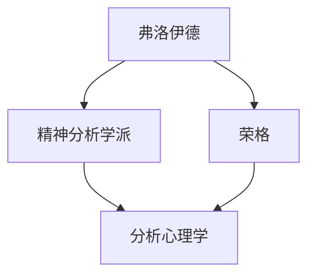
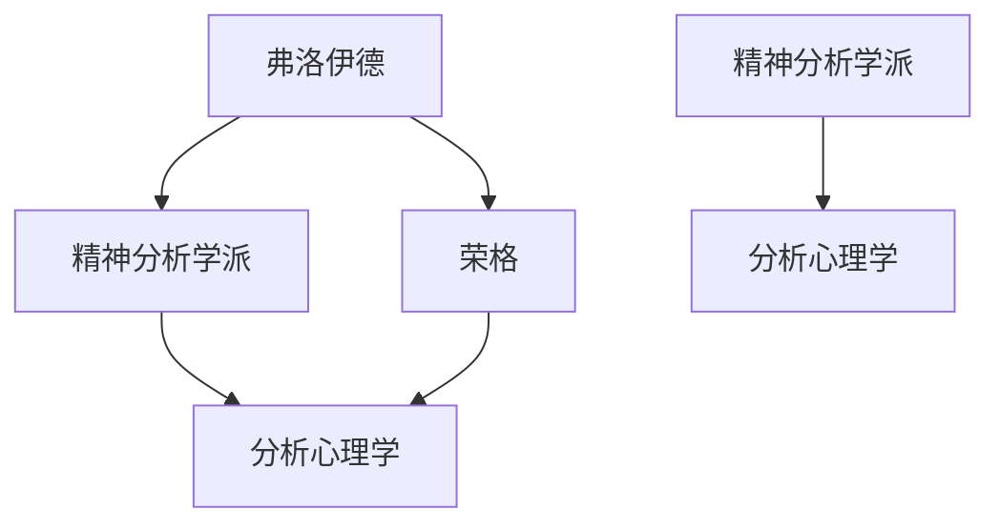

                 

# 弗洛伊德与荣格：精神分析的正统与分析心理学

> 关键词：精神分析，分析心理学，弗洛伊德，荣格，心理学，梦境解析，无意识，心理学流派

> 摘要：本文旨在深入探讨弗洛伊德的精神分析理论与荣格的分析心理学理论，通过对两位心理学大师的核心思想、理论贡献及其影响进行比较分析，揭示精神分析学派与分析心理学在心理学领域中的地位和作用。

## 目录大纲

----------------------------------------------------------------

## 第一部分：引言

### 1.1 书籍背景与目的

### 1.2 弗洛伊德与荣格生平介绍

### 1.3 弗洛伊德与荣格的关系演变

----------------------------------------------------------------

## 第二部分：弗洛伊德的精神分析

### 2.1 弗洛伊德生平与贡献

### 2.2 精神分析的核心理论

### 2.3 梦的解析技术

### 2.4 精神分析的治疗技术

### 2.5 弗洛伊德与精神分析学派的影响

----------------------------------------------------------------

## 第三部分：荣格的分析心理学

### 3.1 荣格生平与贡献

### 3.2 分析心理学核心理论

### 3.3 心理类型理论

### 3.4 梦境分析技术

### 3.5 分析心理学的影响

----------------------------------------------------------------

## 第四部分：弗洛伊德与荣格思想的比较

### 4.1 相同点比较

### 4.2 不同点比较

----------------------------------------------------------------

## 第五部分：结论

### 5.1 精神分析学派与分析心理学的总结

### 5.2 未来发展方向与挑战

### 5.3 学术研究与实际应用的意义

----------------------------------------------------------------

## 参考文献

----------------------------------------------------------------

## 附录

### 5.1 术语表

### 5.2 经典案例解析

----------------------------------------------------------------

----------------------------------------------------------------## 第一部分：引言

### 1.1 书籍背景与目的

《弗洛伊德与荣格：精神分析的正统与分析心理学》是一本深入探讨弗洛伊德精神分析理论与荣格分析心理学理论的著作。精神分析学派与分析心理学在心理学领域具有重要地位，两者在理论、方法、应用等方面各具特色，但又存在深刻的联系和区别。本书旨在通过对比分析，揭示两位心理学大师的核心思想、理论贡献及其影响，为读者提供对精神分析学派与分析心理学的全面理解。

精神分析学派起源于19世纪末，由弗洛伊德创立，通过对梦境、无意识、性欲等心理现象的研究，揭示了人类心理活动的深层结构。精神分析学派在心理学、文学、艺术等领域产生了广泛影响，被誉为现代心理学的基石之一。而荣格则在20世纪初提出了分析心理学的概念，强调个人无意识和集体无意识的作用，对精神分析理论进行了重要的补充和发展。

本书的目的在于：

1. **梳理精神分析学派与分析心理学的核心理论**：通过对弗洛伊德和荣格的主要思想进行详细阐述，帮助读者理解两者的理论基础和理论体系。
2. **比较分析两位心理学家的贡献**：通过对比分析，揭示弗洛伊德与荣格在心理学领域的不同贡献，探讨两者思想的核心差异和共同点。
3. **探讨精神分析学派与分析心理学的影响**：分析精神分析学派与分析心理学在心理学、社会学、文化研究等领域的实际应用和影响，展示其理论的现实意义。
4. **促进心理学理论的创新与发展**：通过对两位心理学大师思想的深入探讨，为心理学理论的创新提供新的思路和视角。

### 1.2 弗洛伊德与荣格生平介绍

西格蒙德·弗洛伊德（Sigmund Freud，1856-1939）是奥地利神经学家和心理学家，被誉为精神分析学派的创始人。他出生于一个犹太商人家庭，自幼表现出对哲学、文学和科学的浓厚兴趣。1873年，弗洛伊德进入维也纳大学学习医学，随后专注于神经学和精神病学的研究。1881年，他与友人布洛伊尔合作完成了《梦的解析》，这是精神分析理论的开端。此后，弗洛伊德继续深入研究无意识、梦、性欲等心理现象，提出了经典的精神分析理论。他的主要著作包括《日常生活的心理病理学》、《性学三论》、《自我与本我》等。

卡尔·荣格（Carl Jung，1875-1961）是瑞士精神医学家和分析心理学创始人。他出生于一个牧师家庭，自幼受到良好的教育。1895年，荣格进入巴塞尔大学学习医学，并在1900年获得医学博士学位。在研究精神病学的过程中，荣格受到了弗洛伊德精神分析理论的启发，但逐渐发展出自己独特的分析心理学理论。荣格强调个人与集体无意识的重要性，提出了原型理论、心理类型理论等概念。他的主要著作包括《心理类型》、《集体无意识与个体心理》、《梦的分析》等。

### 1.3 弗洛伊德与荣格的关系演变

弗洛伊德与荣格的关系始于合作关系。1904年，荣格成为弗洛伊德的学生，两人共同推进精神分析学的发展。然而，随着荣格的理论逐渐与弗洛伊德的观点产生分歧，两人的关系逐渐恶化。主要分歧包括：

1. **无意识的性质**：弗洛伊德认为无意识主要由性欲冲动构成，而荣格则提出无意识分为个人无意识和集体无意识，集体无意识中包含人类共同的心理结构。

2. **心理治疗的方法**：弗洛伊德主张通过自由联想和梦的解析来揭示无意识内容，而荣格则强调象征分析和个体化过程，认为治疗应关注个体的独特心理发展。

3. **心理类型理论**：荣格提出了心理类型理论，区分内向型和外向型人格，这与弗洛伊德的理论有所冲突。

最终，两人于1911年正式分手，各自发展自己的理论和学派。尽管如此，弗洛伊德和荣格的理论对心理学领域产生了深远影响，他们的思想至今仍被广泛研究和应用。

----------------------------------------------------------------### 1.2 弗洛伊德与荣格生平介绍

**西格蒙德·弗洛伊德**

弗洛伊德出生于奥地利弗莱堡（今属于捷克的普雷兹劳），在一个信仰犹太教的商人家庭中长大。他的家庭环境对他日后的心理学研究产生了深远影响。他自幼表现出对哲学、文学和科学的浓厚兴趣。1873年，弗洛伊德进入维也纳大学学习医学，他在大学期间广泛涉猎了哲学、自然科学和医学领域。

1876年，弗洛伊德获得了医学博士学位，随后在维也纳大学医院担任神经学医生。在此期间，他遇到了他的合作伙伴约瑟夫·布洛伊尔，两人开始共同探讨心理病理学问题。1880年，弗洛伊德与布洛伊尔合作完成了《歇斯底里的研究》，这是精神分析理论的开端。

1882年，弗洛伊德前往巴黎，师从神经学家让娜·马丁·沙可，学习催眠疗法。尽管他未能在催眠疗法上取得显著成功，但这次经历启发了他对无意识和心理动力学的思考。1885年，弗洛伊德回到维也纳，开始独立开展心理学研究，特别是对梦的解析和自由联想技术的探索。

1899年，弗洛伊德出版了《梦的解析》，这是精神分析理论的奠基之作。他在此书中提出了梦作为愿望满足的表现形式，并阐述了无意识在梦中的作用。1900年，弗洛伊德又出版了《日常生活的心理病理学》，进一步探讨了心理防御机制和梦的象征意义。

随着时间的推移，弗洛伊德的精神分析理论得到了越来越多人的认可，他成立了一系列的精神分析学会，培养了一大批精神分析学家。他的主要著作包括《性学三论》、《自我与本我》、《图腾与禁忌》等，涵盖了无意识、性欲、梦的解析、心理治疗等多个领域。

**卡尔·荣格**

荣格出生于瑞士凯斯威尔，成长于一个信仰基督教的家庭。他的父亲是一位牧师，这对他后来的心理学研究产生了影响。荣格在青少年时期就表现出了对哲学、文学和宗教的浓厚兴趣。1895年，荣格进入巴塞尔大学学习医学，并在1900年获得医学博士学位。

在大学期间，荣格接触到了弗洛伊德的精神分析理论，并对其产生了浓厚的兴趣。1904年，荣格成为弗洛伊德的学生，并开始在瑞士的诊所中应用精神分析技术。然而，随着荣格对精神分析理论的深入思考，他逐渐发现了一些与弗洛伊德观点的不同之处，特别是在无意识的性质和心理治疗的方法上。

荣格提出了个人无意识和集体无意识的概念。他认为个人无意识是个体独特的心理结构，而集体无意识则是人类共同的心理基础，包含了一系列原始的心理图像和象征，称为“原型”。这些原型是文化、宗教和神话的深层根源。

荣格还发展了心理类型理论，认为人的心理活动可以分为内向型和外向型，以及感觉型、直觉型、思维型和情感型。这些心理类型的差异不仅影响个人的行为和认知，也在人际关系和职业选择中发挥着重要作用。

荣格的主要著作包括《心理类型》、《集体无意识与个体心理》、《梦的分析》等。他的理论和研究成果对心理学、文化研究、艺术创作等领域产生了深远影响。

### 概念属性特征对比表格

| 特征         | 弗洛伊德                  | 荣格                  |
| ------------ | -------------------- | -------------------- |
| 学术成就     | 创立精神分析学派          | 创立分析心理学         |
| 理论核心     | 无意识、性欲、梦的解析     | 自我、无意识、梦境分析  |
| 研究方法     | 梦的解析、自由联想        | 象征分析、梦境解读      |

### ER实体关系图架构的Mermaid流程图

在这个ER实体关系图中，我们可以看到弗洛伊德作为精神分析学派的创始人，而荣格则既继承又发展了弗洛伊德的理论，创立了分析心理学。两者之间存在直接的学术联系和理论传承的关系。

----------------------------------------------------------------### 1.3 弗洛伊德与荣格的关系演变

弗洛伊德与荣格的合作关系始于1904年，当时荣格年仅29岁，成为弗洛伊德在瑞士苏黎世的私人秘书。两人开始密切合作，共同撰写论文，并在国际精神分析大会上发表演讲。荣格对精神分析理论表现出极大的热情，并迅速成为弗洛伊德最亲密的追随者和同事。

在合作期间，弗洛伊德和荣格共同开展了一系列重要的研究工作。他们合作翻译了弗洛伊德的著作，并一起探讨了梦境、梦的解析、性欲等心理学问题。这段合作对两人来说都是极为宝贵的经历，荣格在学术上取得了巨大的进步，而弗洛伊德则得到了一位有能力且富有创造性的合作者。

然而，随着时间的推移，两人之间开始出现分歧。首先，荣格对弗洛伊德的无意识理论和性欲理论提出了质疑。他开始认为弗洛伊德的性欲驱动理论过于单一，无法解释所有心理现象。荣格提出，无意识不仅包含性欲，还包括其他复杂的心理过程，如集体无意识。

其次，荣格对精神分析的治疗方法也持有不同看法。他认为，弗洛伊德的方法过于机械，强调对过去的分析，而忽视了个体当下的情感体验。荣格更倾向于通过象征分析和梦境解读来帮助患者了解自己的内心世界。

1909年，荣格因与弗洛伊德的分歧而离开苏黎世，前往巴塞尔大学工作。尽管两人试图继续合作，但分歧不断加剧，最终在1912年导致了正式分手。荣格成立了自己的心理分析学会，并开始发展自己的分析心理学理论。

两人的关系在分手后仍然紧张。弗洛伊德对荣格的独立行动表示不满，并在公共场合批评他的理论。然而，荣格的理论逐渐得到了学术界的认可，特别是他的集体无意识和原型理论为心理学领域带来了新的视角。

尽管两人之间的关系经历了起伏，但弗洛伊德和荣格都对心理学领域产生了深远的影响。弗洛伊德创立了精神分析学派，揭示了人类心理的深层结构和无意识的作用。荣格则扩展了心理学的视野，提出了个人和集体无意识的概念，并探索了人类心理的深层次结构和人类文化的关系。

总的来说，弗洛伊德与荣格的关系演变是心理学发展史上的重要篇章。他们的分歧和合作不仅丰富了心理学理论，也为我们理解人类心理的复杂性和多样性提供了宝贵的启示。尽管两人之间存在争议，但他们的理论贡献都是不可忽视的，对后世心理学研究产生了深远的影响。

### ER实体关系图架构的Mermaid流程图

在这个ER实体关系图中，我们可以看到弗洛伊德作为精神分析学派的创始人，荣格则从弗洛伊德的理论中汲取灵感，创立了分析心理学。两者之间存在学术联系和理论传承的关系，同时各自发展出了独特的理论体系。

----------------------------------------------------------------## 第二部分：弗洛伊德的精神分析

### 2.1 弗洛伊德生平与贡献

西格蒙德·弗洛伊德（Sigmund Freud，1856-1939）是奥地利神经学家和心理学家，被誉为精神分析学派的创始人。他出生于弗莱堡（现属于捷克），在一个犹太商人家庭中长大。他的家庭环境对他日后的心理学研究产生了深远影响，特别是母亲对他的早期教育。

**学术生涯**

弗洛伊德在1873年进入维也纳大学学习医学，1881年获得医学博士学位。在大学期间，他广泛涉猎了哲学、自然科学和医学领域，对精神病学产生了浓厚兴趣。1882年，他前往巴黎师从神经学家让娜·马丁·沙可学习催眠疗法，这为他后来的心理学研究奠定了基础。

**理论贡献**

弗洛伊德的理论贡献主要体现在以下几个方面：

1. **无意识**：弗洛伊德认为，人的心理活动不仅包括意识层面，还包括无意识层面。无意识包含了许多未被意识到的心理冲动和欲望，这些冲动和欲望对人的行为和心理状态产生重要影响。

2. **梦的解析**：弗洛伊德在《梦的解析》（1899年）一书中提出，梦是愿望的满足，反映了无意识中的心理冲突。他通过梦的解析，帮助患者揭示隐藏在梦背后的心理动机。

3. **性欲理论**：弗洛伊德提出了著名的性欲发展理论，认为人的心理发展受到性欲的驱动，性欲在不同的阶段有不同的表现形式。他强调性欲在人类行为和心理活动中的重要性。

4. **心理防御机制**：弗洛伊德提出了一系列心理防御机制，如压抑、否认、转移等，这些机制是人们在面对心理冲突和压力时的自我保护手段。

**重要著作**

- **《梦的解析》（1899年）**：这是弗洛伊德的代表作，提出了梦作为愿望满足的表现形式，并阐述了无意识在梦中的作用。
- **《日常生活的心理病理学》（1901年）**：探讨了心理防御机制和梦的象征意义。
- **《性学三论》（1905年）**：讨论了性心理发展的不同阶段和性问题。
- **《图腾与禁忌》（1913年）**：探讨了人类文化和社会结构中的原始心理元素。

### 2.2 精神分析的核心理论

**无意识**

无意识是精神分析理论的核心概念之一。弗洛伊德认为，无意识包含了那些被压抑或未被意识到的心理冲动、欲望和记忆。无意识不仅影响人的行为和心理状态，也通过梦、症状、失误等方式表现出来。

**梦的解析**

弗洛伊德认为，梦是愿望的满足，反映了无意识中的心理冲突。通过梦的解析，可以揭示隐藏在梦背后的心理动机和欲望。他提出了自由联想技术，即通过引导患者自由地表达自己的想法和感受，来揭示无意识的内容。

**性欲理论**

弗洛伊德提出，性欲是人的心理发展的驱动力，贯穿人的一生。性欲在不同的阶段有不同的表现形式，如婴儿期的口腔期、肛门期、性器期等。他认为，心理问题往往源于性欲的冲突和压抑。

**心理防御机制**

弗洛伊德认为，人们在面对心理冲突和压力时，会采用一系列心理防御机制来保护自己。这些防御机制包括压抑、否认、转移、合理化等，它们使人们能够应对内在的心理冲突，但有时也会导致心理问题。

### 2.3 梦的解析技术

**自由联想**

自由联想是弗洛伊德梦的解析技术之一，即通过引导患者自由地表达自己的想法和感受，来揭示无意识的内容。这种方法可以帮助患者发现自己的潜意识动机和欲望。

**梦的解析实例**

以下是一个简单的梦的解析实例：

梦：我在一片田野上行走，突然看到地上有一只死去的鸟。

解析：这个梦可能反映了梦者的内心冲突。田野代表梦者内心的平静和安宁，而死去的鸟则可能代表梦者内心深处的痛苦和失落。梦者在日常生活中可能经历了一些令人失望或挫败的事情，这些情绪通过梦的形式表现出来。

### 2.4 精神分析的治疗技术

**治疗原理**

精神分析治疗的目标是帮助患者揭示和解决内心的心理冲突，从而改善其心理状态和生活质量。治疗的基本原理包括：

1. **建立信任关系**：治疗师与患者建立良好的信任关系，使患者感到安全和被理解。
2. **自由联想**：通过自由联想技术，患者可以表达出内心的想法和感受，治疗师帮助患者理解这些潜意识的内容。
3. **揭示心理冲突**：通过分析患者的梦、失误、症状等，揭示其内心的冲突和动机。
4. **情感体验**：在治疗过程中，患者需要面对和体验自己的情感，从而实现情绪的释放和整合。

**治疗技术**

1. **自由联想**：患者无需准备，只需自由地表达自己的想法和感受，治疗师根据患者的回答进行引导和解析。
2. **梦的解析**：治疗师帮助患者理解梦的象征意义，揭示梦背后的心理动机。
3. **移情**：患者在治疗过程中可能会对治疗师产生情感上的依恋或对抗，治疗师通过理解和处理移情关系，帮助患者解决内心的冲突。
4. **梦境重构**：通过对患者梦境的解析和重构，帮助患者理解自己的内心世界。

### 2.5 弗洛伊德与精神分析学派的影响

**影响概述**

弗洛伊德和他的精神分析学派对心理学、文学、艺术等领域产生了深远影响。以下是一些具体的影响：

1. **心理学领域**：弗洛伊德的理论奠定了现代心理学的基石，特别是对无意识和心理动力学的研究。他的理论为后来的心理学家提供了丰富的理论资源和研究方法。

2. **文学和艺术**：弗洛伊德的理论对文学和艺术创作产生了重要影响。许多作家和艺术家通过探索人物的内心世界、潜意识欲望和冲突，创作出了深刻的文学作品和艺术作品。

3. **社会和文化研究**：精神分析学派的理论被广泛应用于社会和文化研究中，如社会冲突、社会关系、文化传统等。精神分析为理解人类行为和社会现象提供了新的视角。

**案例分析**

以下是精神分析在当代的实际应用案例：

1. **心理咨询**：精神分析技术广泛应用于心理咨询和治疗中，帮助患者解决情感问题、心理创伤和人际关系问题。
2. **教育领域**：教育工作者运用精神分析理论，理解学生的行为和心理状态，提高教育效果。
3. **法律领域**：精神分析理论在法律领域中的应用，如犯罪心理学、证人心理分析等，为司法决策提供了重要依据。

总之，弗洛伊德和他的精神分析学派对心理学和人类社会产生了广泛而深远的影响，他们的理论和方法至今仍被广泛研究和应用。

----------------------------------------------------------------### 2.1 弗洛伊德生平与贡献

**生平介绍**

西格蒙德·弗洛伊德（Sigmund Freud，1856-1939）出生于奥地利弗莱堡（今捷克共和国的普雷斯堡），他在一个中产阶级犹太家庭中长大。他的父亲是犹太商人和地方议会议员，母亲则是个虔诚的犹太教徒。弗洛伊德的童年相对平静，但他的父母对他的教育非常严格。

弗洛伊德在维也纳大学接受了医学教育，并于1881年获得医学博士学位。在大学期间，他对哲学、文学和自然科学都表现出了浓厚的兴趣。1882年，他在巴黎师从神经学家让娜·马丁·沙可学习催眠疗法，这是他日后研究心理病理学的重要起点。

**主要贡献**

弗洛伊德的贡献主要体现在精神分析理论的创立和发展上。以下是他的几个重要贡献：

1. **无意识理论**：弗洛伊德是第一个明确提出“无意识”概念的心理学家。他认为，人的心理活动不仅仅包括意识层面，还包含无意识层面。无意识包含了那些被压抑或未被意识到的欲望、记忆和冲突。这些无意识的内容虽然不为我们所察觉，但对我们的行为和心理状态产生深远影响。

2. **梦的解析**：弗洛伊德在《梦的解析》（1899年）一书中提出了梦是愿望的满足的观点。他认为，梦是潜意识欲望的象征性表达，通过解析梦，我们可以了解隐藏在潜意识中的心理冲突。这本书被认为是精神分析理论的奠基之作。

3. **性欲理论**：弗洛伊德提出了性欲发展理论，认为性欲是人类行为和心理发展的驱动力。他提出了“性心理发展阶段”理论，即人的性欲在不同阶段有不同的表现形式，如婴儿期的口腔期、肛门期、性器期等。每个阶段都会带来特定的心理冲突和问题。

4. **心理防御机制**：弗洛伊德认为，人们在面对心理冲突和压力时，会采用一系列心理防御机制来保护自己。这些防御机制包括压抑、否认、转移、合理化等。了解这些防御机制有助于我们理解人类行为和心理问题的本质。

**主要著作**

- 《梦的解析》（1899年）
- 《日常生活的心理病理学》（1901年）
- 《性学三论》（1905年）
- 《图腾与禁忌》（1913年）
- 《自我与本我》（1923年）

弗洛伊德的理论和著作对心理学、文学、艺术以及文化研究领域产生了深远影响。他不仅改变了我们对人类心理的认识，也为后来的心理学家提供了丰富的理论资源和研究方法。尽管他的理论在学术界存在争议，但弗洛伊德无疑是一位伟大的心理学家和思想家。

### 2.2 精神分析的核心理论

**无意识**

无意识是精神分析理论的核心概念之一。弗洛伊德认为，无意识是心理活动的深层结构，包含了那些被压抑或未被意识到的欲望、记忆和冲突。无意识的内容虽然不为我们所察觉，但它们对我们的行为和心理状态产生深远影响。无意识主要分为两部分：本我和自我。

1. **本我**：本我是无意识的最底层，包含了原始的欲望和冲动，如性欲和攻击欲望。本我是非理性的，遵循快乐原则，即寻求即时的满足和快乐。

2. **自我**：自我是介于本我和超我之间的部分，是理性与现实的调节者。自我遵循现实原则，通过适应外部环境和内部心理需求，寻求平衡和满足。

**梦的解析**

弗洛伊德认为，梦是愿望的满足，反映了无意识中的心理冲突。他提出了著名的“梦是愿望的满足”理论，认为梦中的内容都是我们在现实中无法实现的愿望或欲望的象征性表达。通过解析梦，我们可以了解隐藏在潜意识中的心理动机和欲望。

梦的解析技术主要包括自由联想和象征分析。自由联想是指引导患者自由地表达他们在梦中的感受和想法，从而揭示梦背后的心理冲突。象征分析则是指通过分析梦中的象征性元素，理解它们在梦中的意义。

**性欲理论**

弗洛伊德提出了性欲发展理论，认为性欲是人类行为和心理发展的驱动力。他提出了“性心理发展阶段”理论，即人的性欲在不同阶段有不同的表现形式：

1. **口腔期**：婴儿期，主要满足通过口腔活动获得的快感，如吮吸和咬嚼。
2. **肛门期**：幼儿期，主要满足通过控制排泄获得的快感。
3. **性器期**：童年期，主要满足通过性器官的活动获得的快感。
4. **潜伏期**：青春期前，性欲处于相对潜伏状态。
5. **生殖期**：青春期后，性欲转向成熟的爱情关系和生殖活动。

性欲发展过程中，每个阶段都会带来特定的心理冲突和问题。如果这些冲突没有得到妥善解决，可能会影响个体的心理健康。

**心理防御机制**

弗洛伊德认为，人们在面对心理冲突和压力时，会采用一系列心理防御机制来保护自己。这些防御机制包括：

1. **压抑**：将痛苦的记忆或冲动从意识中排除。
2. **否认**：拒绝承认某些事实或情境。
3. **转移**：将情绪或冲动从原始对象转移到另一个对象。
4. **合理化**：为自己的行为或动机寻找合理的解释。
5. **反向形成**：以相反的形式表达潜意识中的冲动或欲望。

了解这些防御机制有助于我们理解人类行为和心理问题的本质。

### 2.3 梦的解析技术

**自由联想**

自由联想是弗洛伊德梦的解析技术之一，即通过引导患者自由地表达他们的想法和感受，来揭示无意识的内容。这种方法可以帮助患者发现自己的潜意识动机和欲望。具体步骤如下：

1. **放松**：治疗师帮助患者放松身体和心灵，创造一个安全的环境。
2. **引导**：治疗师引导患者回忆并描述他们的梦境，鼓励他们自由地表达任何浮现的想法和感受。
3. **记录**：治疗师记录患者的描述，以便进行后续分析。
4. **分析**：治疗师根据患者的描述，通过自由联想技术，引导患者进一步探索梦境背后的心理动机。

**梦的解析实例**

以下是一个简单的梦的解析实例：

梦：我梦见自己在一片荒野上行走，突然遇到了一只巨大的黑熊。

解析：这个梦可能反映了梦者内心深处的恐惧和不安。荒野通常代表未知和危险，而黑熊则可能象征梦者内心的恐惧或攻击性。梦者在日常生活中可能面临一些压力或困境，这些情绪通过梦的形式表现出来。

通过这个实例，我们可以看到，梦的解析技术可以帮助我们理解隐藏在梦境背后的潜意识动机和欲望，从而更好地理解自己的心理状态。

### 2.4 精神分析的治疗技术

**治疗原理**

精神分析治疗的目标是帮助患者揭示和解决内心的心理冲突，从而改善其心理状态和生活质量。治疗的基本原理包括：

1. **建立信任关系**：治疗师与患者建立良好的信任关系，使患者感到安全和被理解。
2. **自由联想**：通过自由联想技术，患者可以表达出内心的想法和感受，治疗师帮助患者理解这些潜意识的内容。
3. **揭示心理冲突**：通过分析患者的梦、失误、症状等，揭示其内心的冲突和动机。
4. **情感体验**：在治疗过程中，患者需要面对和体验自己的情感，从而实现情绪的释放和整合。

**治疗技术**

1. **自由联想**：患者无需准备，只需自由地表达自己的想法和感受，治疗师根据患者的回答进行引导和解析。
2. **梦的解析**：治疗师帮助患者理解梦的象征意义，揭示梦背后的心理动机。
3. **移情**：患者在治疗过程中可能会对治疗师产生情感上的依恋或对抗，治疗师通过理解和处理移情关系，帮助患者解决内心的冲突。
4. **梦境重构**：通过对患者梦境的解析和重构，帮助患者理解自己的内心世界。

### 2.5 弗洛伊德与精神分析学派的影响

**影响概述**

弗洛伊德和他的精神分析学派对心理学、文学、艺术等领域产生了深远影响。以下是一些具体的影响：

1. **心理学领域**：弗洛伊德的理论奠定了现代心理学的基石，特别是对无意识和心理动力学的研究。他的理论为后来的心理学家提供了丰富的理论资源和研究方法。

2. **文学和艺术**：弗洛伊德的理论对文学和艺术创作产生了重要影响。许多作家和艺术家通过探索人物的内心世界、潜意识欲望和冲突，创作出了深刻的文学作品和艺术作品。

3. **社会和文化研究**：精神分析学派的理论被广泛应用于社会和文化研究中，如社会冲突、社会关系、文化传统等。精神分析为理解人类行为和社会现象提供了新的视角。

**案例分析**

以下是精神分析在当代的实际应用案例：

1. **心理咨询**：精神分析技术广泛应用于心理咨询和治疗中，帮助患者解决情感问题、心理创伤和人际关系问题。
2. **教育领域**：教育工作者运用精神分析理论，理解学生的行为和心理状态，提高教育效果。
3. **法律领域**：精神分析理论在法律领域中的应用，如犯罪心理学、证人心理分析等，为司法决策提供了重要依据。

总之，弗洛伊德和他的精神分析学派对心理学和人类社会产生了广泛而深远的影响，他们的理论和方法至今仍被广泛研究和应用。

### 2.6 弗洛伊德生平与贡献

**生平介绍**

西格蒙德·弗洛伊德（Sigmund Freud，1856-1939）是奥地利神经学家和心理学家，被认为是精神分析学派的创始人。他出生于奥地利的弗莱堡，一个信仰犹太教的商人家庭。弗洛伊德的成长环境对他的学术生涯产生了深远影响，尤其是他的父母对他的教育和培养。

- **早年教育**：弗洛伊德在维也纳大学接受了医学教育，1873年进入维也纳大学学习医学，1881年获得医学博士学位。在大学期间，他对哲学、文学和自然科学表现出浓厚兴趣。

- **学术生涯**：1876年，弗洛伊德完成了医学住院医师培训，并在维也纳综合医院工作。他开始对神经病学和精神病学产生兴趣，特别是在研究歇斯底里等心理疾病方面。

**主要贡献**

弗洛伊德的主要贡献体现在精神分析理论的创立和发展上，以下是他的一些重要成就：

- **无意识理论**：弗洛伊德是第一个明确提出“无意识”概念的心理学家。他提出了“本我”、“自我”和“超我”的概念，描述了无意识、前意识和意识之间的关系。

- **梦的解析**：弗洛伊德在《梦的解析》（1899年）一书中提出了梦是愿望的满足的观点，认为梦反映了无意识中的心理冲突。这本书被认为是精神分析理论的奠基之作。

- **性欲理论**：弗洛伊德提出了性欲发展理论，即人的性心理发展经历口腔期、肛门期、性器期、潜伏期和生殖期。他认为性欲是人类行为和心理发展的驱动力。

- **心理防御机制**：弗洛伊德描述了人们在面对心理冲突时采用的一系列心理防御机制，如压抑、否认、转移和合理化等。

**主要著作**

- **《梦的解析》（1899年）**：这是弗洛伊德的代表作，提出了梦是愿望满足的观点，并阐述了无意识在梦中的作用。
- **《日常生活的心理病理学》（1901年）**：讨论了心理防御机制和梦的象征意义。
- **《性学三论》（1905年）**：探讨了性心理发展的不同阶段和性问题。
- **《图腾与禁忌》（1913年）**：探讨了原始宗教和人类文化的心理根源。

### 2.7 精神分析的核心理论

**无意识**

无意识是精神分析理论的核心概念之一。弗洛伊德认为，人的心理活动不仅仅包括意识层面，还包括无意识层面。无意识包含了那些被压抑或未被意识到的欲望、记忆和冲突。这些内容虽然不为我们所察觉，但对我们的行为和心理状态产生深远影响。

- **本我**：本我是无意识的最底层，包含了原始的欲望和冲动，如性欲和攻击欲望。本我是非理性的，遵循快乐原则，即寻求即时的满足和快乐。

- **自我**：自我是介于本我和超我之间的部分，是理性与现实的调节者。自我遵循现实原则，通过适应外部环境和内部心理需求，寻求平衡和满足。

- **超我**：超我是道德和道德判断的代表，包含了社会和文化规范。超我对自我的行为进行监督和批评，确保行为符合社会规范。

**梦的解析**

弗洛伊德认为，梦是愿望的满足，反映了无意识中的心理冲突。他提出了“梦是愿望的满足”理论，认为梦中的内容都是我们在现实中无法实现的愿望或欲望的象征性表达。通过解析梦，我们可以了解隐藏在潜意识中的心理动机和欲望。

- **自由联想**：弗洛伊德使用自由联想技术来帮助患者揭示梦的象征意义。这种方法要求患者在描述梦时，自由地表达他们的感受和想法，不加以限制或筛选。

- **象征分析**：弗洛伊德通过分析梦中的象征性元素，如人物、地点、物品等，来理解它们在梦中的意义。他认为，这些象征反映了患者的潜意识欲望和心理冲突。

**性欲理论**

弗洛伊德提出了性欲发展理论，即人的性欲在不同阶段有不同的表现形式：

- **口腔期**：婴儿期，主要满足通过口腔活动获得的快感，如吮吸和咬嚼。

- **肛门期**：幼儿期，主要满足通过控制排泄获得的快感。

- **性器期**：童年期，主要满足通过性器官的活动获得的快感。

- **潜伏期**：青春期前，性欲处于相对潜伏状态。

- **生殖期**：青春期后，性欲转向成熟的爱情关系和生殖活动。

弗洛伊德认为，性欲发展过程中，每个阶段都会带来特定的心理冲突和问题。如果这些冲突没有得到妥善解决，可能会影响个体的心理健康。

**心理防御机制**

弗洛伊德认为，人们在面对心理冲突和压力时，会采用一系列心理防御机制来保护自己。这些防御机制包括：

- **压抑**：将痛苦的记忆或冲动从意识中排除。

- **否认**：拒绝承认某些事实或情境。

- **转移**：将情绪或冲动从原始对象转移到另一个对象。

- **合理化**：为自己的行为或动机寻找合理的解释。

- **反向形成**：以相反的形式表达潜意识中的冲动或欲望。

了解这些防御机制有助于我们理解人类行为和心理问题的本质。

### 2.8 梦的解析技术

**自由联想**

自由联想是弗洛伊德梦的解析技术之一，通过引导患者自由地表达他们的想法和感受，来揭示无意识的内容。这种方法可以帮助患者发现自己的潜意识动机和欲望。具体步骤如下：

1. **放松**：治疗师帮助患者放松身体和心灵，创造一个安全的环境。
2. **引导**：治疗师引导患者回忆并描述他们的梦境，鼓励他们自由地表达任何浮现的想法和感受。
3. **记录**：治疗师记录患者的描述，以便进行后续分析。
4. **分析**：治疗师根据患者的描述，通过自由联想技术，引导患者进一步探索梦境背后的心理动机。

**梦的解析实例**

以下是一个简单的梦的解析实例：

梦：我梦见自己在一片荒野上行走，突然遇到了一只巨大的黑熊。

解析：这个梦可能反映了梦者内心深处的恐惧和不安。荒野通常代表未知和危险，而黑熊则可能象征梦者内心的恐惧或攻击性。梦者在日常生活中可能面临一些压力或困境，这些情绪通过梦的形式表现出来。

通过这个实例，我们可以看到，梦的解析技术可以帮助我们理解隐藏在梦境背后的潜意识动机和欲望，从而更好地理解自己的心理状态。

### 2.9 精神分析的治疗技术

**治疗原理**

精神分析治疗的目标是帮助患者揭示和解决内心的心理冲突，从而改善其心理状态和生活质量。治疗的基本原理包括：

1. **建立信任关系**：治疗师与患者建立良好的信任关系，使患者感到安全和被理解。
2. **自由联想**：通过自由联想技术，患者可以表达出内心的想法和感受，治疗师帮助患者理解这些潜意识的内容。
3. **揭示心理冲突**：通过分析患者的梦、失误、症状等，揭示其内心的冲突和动机。
4. **情感体验**：在治疗过程中，患者需要面对和体验自己的情感，从而实现情绪的释放和整合。

**治疗技术**

1. **自由联想**：患者无需准备，只需自由地表达自己的想法和感受，治疗师根据患者的回答进行引导和解析。
2. **梦的解析**：治疗师帮助患者理解梦的象征意义，揭示梦背后的心理动机。
3. **移情**：患者在治疗过程中可能会对治疗师产生情感上的依恋或对抗，治疗师通过理解和处理移情关系，帮助患者解决内心的冲突。
4. **梦境重构**：通过对患者梦境的解析和重构，帮助患者理解自己的内心世界。

### 2.10 弗洛伊德与精神分析学派的影响

**影响概述**

弗洛伊德和他的精神分析学派对心理学、文学、艺术等领域产生了深远影响。以下是一些具体的影响：

1. **心理学领域**：弗洛伊德的理论奠定了现代心理学的基石，特别是对无意识和心理动力学的研究。他的理论为后来的心理学家提供了丰富的理论资源和研究方法。

2. **文学和艺术**：弗洛伊德的理论对文学和艺术创作产生了重要影响。许多作家和艺术家通过探索人物的内心世界、潜意识欲望和冲突，创作出了深刻的文学作品和艺术作品。

3. **社会和文化研究**：精神分析学派的理论被广泛应用于社会和文化研究中，如社会冲突、社会关系、文化传统等。精神分析为理解人类行为和社会现象提供了新的视角。

**案例分析**

以下是精神分析在当代的实际应用案例：

1. **心理咨询**：精神分析技术广泛应用于心理咨询和治疗中，帮助患者解决情感问题、心理创伤和人际关系问题。
2. **教育领域**：教育工作者运用精神分析理论，理解学生的行为和心理状态，提高教育效果。
3. **法律领域**：精神分析理论在法律领域中的应用，如犯罪心理学、证人心理分析等，为司法决策提供了重要依据。

总之，弗洛伊德和他的精神分析学派对心理学和人类社会产生了广泛而深远的影响，他们的理论和方法至今仍被广泛研究和应用。

### 2.11 精神分析学派的发展与影响

**精神分析学派的发展**

精神分析学派自创立以来，经历了多次发展和演变。在弗洛伊德去世后，精神分析学派分裂为多个流派，如经典精神分析、自我心理学、客体关系理论和精神分析社会文化学派等。这些流派在理论上各有侧重，但在共同目标——揭示人类心理深层的无意识机制方面保持了一致。

- **经典精神分析**：主要由梅拉妮·克莱因和阿兰·温尼科特等心理学家发展，强调婴儿早期的亲子关系对个体心理发展的重要性。
- **自我心理学**：由安娜·弗洛伊德和玛格丽特·马勒等人提出，强调自我在心理发展中的作用，以及自我与外界环境的交互作用。
- **客体关系理论**：由梅拉妮·克莱因和唐纳德·温尼科特等人提出，探讨了个体在婴儿早期与客体的关系，以及这些关系对个体心理发展的影响。
- **精神分析社会文化学派**：由埃里希·弗洛姆等人提出，将精神分析理论应用于社会和文化研究，探讨社会结构和文化对个体心理的影响。

**精神分析学派的影响**

精神分析学派的理论和方法对心理学、医学、社会科学和文化研究等领域产生了深远影响：

1. **心理学领域**：精神分析学派为心理学提供了无意识和心理动力学的研究框架，丰富了心理学的研究内容和方法。

2. **医学领域**：精神分析技术被广泛应用于心理治疗和心理疾病的治疗中，帮助患者解决心理冲突和情绪困扰。

3. **社会科学领域**：精神分析理论被用于理解社会冲突、社会关系和文化传统，为社会科学研究提供了新的视角。

4. **文化研究**：精神分析学派的理论和方法被应用于文学、艺术和电影等领域，探讨文化现象中的心理机制。

**案例分析**

以下是精神分析学派在当代的实际应用案例：

- **心理学治疗**：精神分析治疗在临床心理咨询中被广泛使用，帮助患者解决深层次的心理冲突和情绪问题。
- **社会科学研究**：精神分析理论在文化研究中被用于分析文学作品、电影和艺术作品中的心理机制。
- **医学研究**：精神分析学派的理论和方法被应用于精神疾病的研究和临床治疗，如抑郁症、焦虑症和精神分裂症等。

总之，精神分析学派的理论和方法不仅在学术领域产生了深远影响，也在实际应用中发挥着重要作用。随着心理学和社会科学的发展，精神分析学派的理论将继续为我们提供宝贵的洞见和启示。

### 2.12 精神分析学派的重要人物

**安娜·弗洛伊德（Anna Freud）**

安娜·弗洛伊德是西格蒙德·弗洛伊德的女儿，也是精神分析学派的重要代表人物之一。她在自我心理学领域做出了重要贡献，强调自我在心理发展中的作用。安娜·弗洛伊德的主要著作包括《自我和防御机制》（1936年）和《儿童的精神分析》（1953年）等。她的研究为理解儿童心理发展提供了重要视角，并对精神分析治疗方法的实践产生了深远影响。

**梅拉妮·克莱因（Melanie Klein）**

梅拉妮·克莱因是另一位重要的精神分析学家，她在经典精神分析的基础上发展了客体关系理论。克莱因认为，婴儿早期的亲子关系对个体心理发展至关重要，提出了“坏母亲”和“坏婴儿”的概念，探讨了早期关系中的冲突和依赖。她的主要著作包括《玩偶之家与防御机制》（1932年）和《嫉羡与感恩》（1957年）等。克莱因的理论为理解婴儿早期心理动力学提供了新视角，对精神分析治疗方法的实践产生了重要影响。

**埃里希·弗洛姆（Erich Fromm）**

埃里希·弗洛姆是一位著名的精神分析学家和社会学家，他尝试将精神分析理论应用于社会和文化研究。弗洛姆的主要著作包括《逃避自由》（1941年）和《爱的艺术》（1956年）等。他探讨了人类爱的本质、自由与责任的关系，以及社会和文化对个体心理的影响。弗洛姆的理论对理解人类行为和社会现象提供了新的视角，也对当代社会心理学和文化心理学产生了深远影响。

### 2.13 精神分析学派的理论应用

**心理学治疗**

精神分析学派的治疗方法广泛应用于临床心理咨询和心理治疗中，帮助患者解决深层次的心理冲突和情绪困扰。治疗过程中，治疗师通过与患者的自由联想、梦的解析和心理防御机制的探讨，帮助患者揭示潜意识的内容，理解自己的内心世界，并逐步实现心理成长。

**社会科学领域**

精神分析学派的理论和方法被广泛应用于社会和文化研究中，探讨社会冲突、社会关系和文化传统。精神分析为理解社会现象提供了新的视角，如社会不公、权力关系和文化认同等。通过分析个体的潜意识和社会结构，精神分析为社会研究提供了丰富的理论资源和研究方法。

**文化研究**

在文化研究领域，精神分析学派的理论和方法被用于分析文学作品、电影和艺术作品中的心理机制。通过探讨人物的心理冲突、潜意识欲望和象征意义，精神分析为理解文化现象提供了新的解释框架。例如，精神分析理论被应用于文学批评、电影分析和艺术研究中，为理解文化作品的深层内涵提供了新的视角。

**医学领域**

精神分析学派的理论和方法在医学领域，特别是在精神疾病的研究和治疗中，发挥了重要作用。通过分析患者的梦境、心理防御机制和潜意识内容，精神分析帮助医生更好地理解患者的心理状态，制定有效的治疗方案。例如，精神分析在治疗抑郁症、焦虑症和精神分裂症等精神疾病方面表现出一定的疗效。

总之，精神分析学派的理论和方法在心理学、社会科学、文化研究和医学领域都具有重要应用价值。随着心理学和社会科学的发展，精神分析学派的理论将继续为我们提供宝贵的洞见和启示。

### 2.14 弗洛伊德与精神分析学派的影响

**心理学领域**

弗洛伊德和他的精神分析学派对心理学领域产生了深远的影响。他们引入了无意识、梦、性欲等概念，为心理学研究提供了新的视角。精神分析学派的理论和方法为后来的心理学家提供了丰富的理论资源和研究方法，如心理动力学、人格心理学、发展心理学等。精神分析学派的理论不仅推动了心理学的发展，也为临床心理咨询和心理治疗提供了重要的理论基础。

**文学和艺术**

精神分析学派的理论对文学和艺术创作产生了重要影响。许多作家和艺术家通过探索人物的内心世界、潜意识欲望和冲突，创作出了深刻的文学作品和艺术作品。弗洛伊德的理论为文学批评和艺术分析提供了新的解释框架，使人们能够更深入地理解文学作品和艺术作品中的深层含义。例如，弗洛伊德关于梦的解析和性欲理论在文学和艺术研究中得到了广泛应用。

**社会和文化研究**

精神分析学派的理论被广泛应用于社会和文化研究中，探讨社会冲突、社会关系和文化传统。通过分析个体的潜意识和社会结构，精神分析为理解社会现象提供了新的视角。例如，精神分析在社会学研究中被用于分析社会不公、权力关系和文化认同等问题。此外，精神分析在文化研究中也被广泛应用于分析文学作品、电影和艺术作品中的心理机制。

**医学领域**

精神分析学派的理论和方法在医学领域，特别是在精神疾病的研究和治疗中，发挥了重要作用。通过分析患者的梦境、心理防御机制和潜意识内容，精神分析帮助医生更好地理解患者的心理状态，制定有效的治疗方案。例如，精神分析在治疗抑郁症、焦虑症和精神分裂症等精神疾病方面表现出一定的疗效。

**实际应用案例**

以下是精神分析在当代的实际应用案例：

1. **心理咨询**：精神分析技术广泛应用于临床心理咨询中，帮助患者解决情感问题、心理创伤和人际关系问题。

2. **教育领域**：教育工作者运用精神分析理论，理解学生的行为和心理状态，提高教育效果。

3. **法律领域**：精神分析理论在法律领域中的应用，如犯罪心理学、证人心理分析等，为司法决策提供了重要依据。

总之，弗洛伊德和他的精神分析学派对心理学、文学、艺术、社会和文化研究以及医学领域产生了广泛而深远的影响。他们的理论和方法至今仍被广泛研究和应用，为我们提供了理解和解决人类心理问题和行为问题的宝贵工具。

### 2.15 弗洛伊德与精神分析学派的历史背景

**19世纪末至20世纪初的社会文化背景**

19世纪末至20世纪初，西方社会正处于快速变革的时期。工业革命的兴起、城市化进程的加快、科学技术的进步，以及现代医学的发展，都对人们的心理状态产生了深远影响。在这一背景下，人们对心理问题的关注日益增加，寻求理解人类行为的深层机制。

**医学和心理学的兴起**

随着医学和心理学的兴起，对心理疾病和心理现象的研究逐渐受到重视。弗洛伊德正是在这样的社会背景下，通过对神经病学和精神病学的研究，开始了他的心理学探索。他的理论试图解释人类行为的深层动力，特别是无意识和潜意识的作用。

**弗洛伊德的理论贡献**

弗洛伊德的理论贡献主要体现在以下几个方面：

1. **无意识理论**：他首次明确提出了“无意识”的概念，认为人的心理活动不仅仅包括意识层面，还包括无意识层面。无意识中包含了许多被压抑或未被意识到的欲望、记忆和冲突，这些内容对个体的行为和心理状态产生深远影响。

2. **梦的解析**：弗洛伊德在《梦的解析》（1899年）一书中，提出了梦是愿望的满足的观点。他认为，通过解析梦，可以揭示隐藏在潜意识中的心理动机和欲望。

3. **性欲理论**：弗洛伊德提出了性欲发展理论，认为性欲是人类行为和心理发展的驱动力。他提出了“性心理发展阶段”理论，即人的性欲在不同阶段有不同的表现形式。

4. **心理防御机制**：弗洛伊德描述了人们在面对心理冲突和压力时采用的防御机制，如压抑、否认、转移和合理化等。这些防御机制是人们自我保护的手段，但有时也会导致心理问题。

**精神分析学派的影响**

弗洛伊德的理论和思想对心理学、医学、社会科学和文化研究等领域产生了深远影响。他的无意识理论、梦的解析技术和心理防御机制为后来的心理学家提供了丰富的理论资源和研究方法。精神分析学派的理论和方法被广泛应用于临床治疗、社会研究和文化分析中，为理解人类行为和心理现象提供了新的视角。

**精神分析学派的演变**

在弗洛伊德去世后，精神分析学派继续发展，形成了多个不同的流派，如经典精神分析、自我心理学、客体关系理论和精神分析社会文化学派等。这些流派在理论上各有侧重，但在共同目标——揭示人类心理深层的无意识机制方面保持了一致。每个流派都在弗洛伊德的理论基础上进行了创新和发展，丰富了精神分析的理论体系。

总之，弗洛伊德和他的精神分析学派在19世纪末至20世纪初的西方社会背景下崛起，通过对无意识、梦、性欲等心理现象的深入研究，为心理学、医学和社会科学等领域提供了重要的理论基础。他们的理论和方法至今仍被广泛研究和应用，对理解人类行为和心理现象产生了深远影响。

### 2.16 精神分析学派的主要流派及其特点

**经典精神分析**

经典精神分析是由西格蒙德·弗洛伊德创立的，强调无意识在人类行为和心理活动中的核心作用。经典精神分析的理论体系主要包括无意识理论、梦的解析、性欲理论和心理防御机制。经典精神分析的治疗方法主要是自由联想和梦的解析，旨在揭示和解决患者的潜意识冲突。

**自我心理学**

自我心理学是由安娜·弗洛伊德发展起来的，强调自我在心理发展中的作用。自我心理学认为，自我是个体与环境之间的中介，负责调节内部冲动和外部要求之间的冲突。自我心理学的主要特点是强调自恋和自恋性障碍，以及自我防御机制在心理治疗中的应用。

**客体关系理论**

客体关系理论由梅拉妮·克莱因发展而来，重点探讨婴儿早期的亲子关系对个体心理发展的影响。客体关系理论认为，个体通过与客体的关系，特别是母亲的关系，形成基本的心理结构。客体关系理论的主要特点是强调客体的内在性，以及内在客体的象征意义。

**精神分析社会文化学派**

精神分析社会文化学派是由埃里希·弗洛姆等人提出的，试图将精神分析理论应用于社会和文化研究中。精神分析社会文化学派认为，社会结构和文化传统对个体心理产生了深远影响。该学派的主要特点是强调社会和文化因素在心理发展中的作用，以及个体与社会之间的动态关系。

**各流派之间的联系与区别**

尽管这些流派在理论和方法上存在差异，但它们都源于弗洛伊德的精神分析理论，并共同关注无意识和潜意识的作用。经典精神分析提供了理论基础，而自我心理学、客体关系理论和精神分析社会文化学派则在具体应用中进行了扩展和深化。

经典精神分析与自我心理学之间的区别主要体现在对自我的关注点上。经典精神分析更侧重于无意识和潜意识的作用，而自我心理学则强调自我在心理调节中的作用。

客体关系理论与经典精神分析之间的区别在于对婴儿早期关系的重视。客体关系理论认为，婴儿早期的亲子关系对个体心理发展至关重要，而经典精神分析则相对较少涉及这一领域。

精神分析社会文化学派与其他流派的不同之处在于，它将精神分析理论应用于社会和文化研究中。精神分析社会文化学派强调社会结构和文化传统对个体心理的影响，而其他流派则更侧重于个体内心的心理过程。

总之，这些流派在理论上各有侧重，但在共同目标——揭示人类心理深层的无意识机制方面保持了一致。它们为理解人类行为和心理现象提供了丰富的理论资源和研究方法，对心理学、医学和社会科学等领域产生了深远影响。

### 2.17 精神分析学派的历史演变与发展

**早期阶段（1890s-1920s）**

精神分析学派的早期阶段主要是由弗洛伊德和他的追随者共同推动的。在这一阶段，弗洛伊德的理论和思想逐渐形成，他提出了无意识、梦的解析、性欲理论等核心概念，并开始运用自由联想技术进行治疗。这一时期的重要事件包括弗洛伊德与布洛伊尔的合作、《梦的解析》的出版以及国际精神分析学会的成立。

**发展阶段（1920s-1950s）**

在发展阶段，精神分析学派的理论和实践得到了进一步的扩展和深化。弗洛伊德的学生和追随者，如安娜·弗洛伊德、梅拉妮·克莱因、唐纳德·温尼科特等，各自发展出了自己的理论和方法。安娜·弗洛伊德的自我心理学、梅拉妮·克莱因的客体关系理论以及温尼科特的理论，都在这一阶段得到了广泛认可和应用。这一时期的重要事件包括《自我和防御机制》的出版以及国际精神分析学会的分裂。

**多元化阶段（1950s-1980s）**

在多元化阶段，精神分析学派的理论和实践变得更加多样化。新的流派和理论不断涌现，如精神分析社会文化学派、客体关系理论和存在主义精神分析等。这一时期的重要事件包括埃里希·弗洛姆的《逃避自由》出版以及《人类心灵的结构》的发表。

**当代阶段（1980s-现在）**

在当代阶段，精神分析学派的理论和实践继续发展，与认知科学、神经科学等新兴学科相结合，形成了新的研究方法和治疗技术。当代精神分析学派不仅关注个体的内心世界，还关注社会和文化因素对个体心理的影响。这一时期的重要事件包括《精神分析与社会》的出版以及精神分析在心理咨询和治疗中的应用日益广泛。

**主要趋势和未来发展方向**

当前，精神分析学派的发展趋势主要包括以下几个方面：

1. **跨学科整合**：精神分析学派继续与认知科学、神经科学等新兴学科结合，通过神经科学的研究成果来验证精神分析理论，同时也将精神分析的理论应用于神经科学的研究中。

2. **社会文化研究**：精神分析学派将更多关注社会和文化因素对个体心理的影响，探讨社会结构和文化传统如何塑造个体心理。

3. **实践创新**：随着心理学治疗方法的多样化，精神分析学派不断创新和实践，探索新的治疗技术和方法。

4. **跨文化研究**：精神分析学派开始关注不同文化背景下个体心理的差异，研究精神分析理论在不同文化中的应用。

总之，精神分析学派在历史演变中不断发展，从早期弗洛伊德的理论基础，到自我心理学、客体关系理论等流派的兴起，再到当代的跨学科整合和社会文化研究，精神分析学派的理论和实践不断丰富和深化，为理解人类行为和心理现象提供了宝贵的工具。

### 2.18 精神分析学派的理论在当代的应用

**心理健康服务**

精神分析学派的理论在心理健康服务中得到了广泛应用。心理咨询和心理治疗领域采用了精神分析的技术，如自由联想、梦的解析和心理防御机制的探讨，帮助患者揭示和解决潜意识中的冲突。精神分析治疗在治疗抑郁症、焦虑症、创伤后应激障碍（PTSD）等方面表现出良好的疗效。

**教育领域**

在教育学领域，精神分析学派的理论为理解学生行为和心理状态提供了新的视角。教育工作者运用精神分析理论，分析学生的情绪困扰、学习障碍和人际关系问题，从而提高教育效果。例如，通过了解学生的潜意识动机和心理防御机制，教师可以设计更有效的教学策略，帮助学生克服学习困难。

**社会学研究**

精神分析学派的理论被应用于社会学研究，探讨社会冲突、社会关系和文化传统。通过分析个体的潜意识和社会结构，精神分析为理解社会现象提供了新的解释框架。例如，精神分析理论在研究社会不公、权力关系和文化认同等方面发挥了重要作用，为解决社会问题提供了理论支持。

**文学和艺术分析**

在文学和艺术领域，精神分析学派的理论被用于分析文学作品和艺术作品中的心理机制。通过探讨人物的心理冲突、潜意识欲望和象征意义，精神分析为理解文化作品提供了新的视角。例如，精神分析理论被应用于文学批评、电影分析和艺术研究中，揭示了文化作品中的深层含义。

**医学领域**

在医学领域，精神分析学派的理论和方法在精神疾病的研究和治疗中发挥了重要作用。通过分析患者的梦境、心理防御机制和潜意识内容，医生可以更好地理解患者的心理状态，制定有效的治疗方案。例如，精神分析在治疗抑郁症、焦虑症和精神分裂症等精神疾病方面表现出一定的疗效。

总之，精神分析学派的理论在当代的各个领域都得到了广泛应用，为理解人类行为和心理现象提供了新的视角和方法。随着心理学和社会科学的发展，精神分析学派的理论将继续为研究者和实践者提供宝贵的工具。

### 2.19 精神分析学派的理论在当代的应用挑战与未来发展方向

**挑战**

尽管精神分析学派的理论在当代心理学领域具有广泛的应用，但仍面临一些挑战：

1. **科学性争议**：精神分析学派的理论依赖于个体的主观体验和象征性分析，这使得其科学性受到质疑。与实证研究相比，精神分析的证据较为缺乏，需要更多的科学验证。

2. **实践局限性**：精神分析治疗过程较为耗时，且对治疗师的要求较高，这限制了其普及和应用。此外，精神分析治疗的效果在不同文化和背景下可能存在差异，需要在实践中进行调整。

3. **跨学科融合**：虽然精神分析学派的理论在跨学科研究中具有潜力，但在实际应用中，如何与认知科学、神经科学等新兴学科有效结合，仍需进一步探索。

**未来发展方向**

为应对这些挑战，精神分析学派在未来的发展中可以关注以下几个方面：

1. **实证研究**：加强精神分析理论的实证研究，通过实验和数据分析，提供更有力的证据支持。

2. **实践创新**：探索新的治疗技术和方法，如结合认知行为疗法和药物治疗，提高治疗的效率和应用性。

3. **跨学科合作**：加强与认知科学、神经科学等学科的融合，通过多学科合作，丰富精神分析的理论基础和应用范围。

4. **跨文化研究**：开展跨文化研究，探索精神分析理论在不同文化背景下的适用性和调整方法，提高其在全球范围内的应用效果。

总之，精神分析学派的理论在当代应用中面临挑战，但通过不断探索和创新，其未来具有广阔的发展前景。

### 2.20 总结

弗洛伊德的精神分析学派对心理学和人类社会的深远影响不言而喻。通过揭示无意识、梦的解析、性欲理论和心理防御机制，弗洛伊德不仅改变了我们对人类心理结构的理解，还为后来的心理学家提供了丰富的理论资源和研究方法。他的理论在心理咨询、医学、社会科学和文化研究等领域得到了广泛应用，为解决心理问题和理解人类行为提供了新的视角。

精神分析学派在发展过程中，形成了多个不同的流派，如自我心理学、客体关系理论和精神分析社会文化学派等，这些流派在理论上各有侧重，但在共同目标——揭示人类心理深层的无意识机制方面保持了一致。每个流派都在弗洛伊德的理论基础上进行了创新和发展，丰富了精神分析的理论体系。

然而，精神分析学派的理论在当代应用中仍面临一些挑战，如科学性争议、实践局限性和跨学科融合等。为了应对这些挑战，精神分析学派需要加强实证研究、探索新的治疗技术和方法、加强与认知科学、神经科学等学科的融合，以及开展跨文化研究。

总之，弗洛伊德的精神分析学派对心理学和人类社会的贡献是巨大的，他的理论和方法至今仍被广泛研究和应用。随着心理学和社会科学的发展，精神分析学派的理论将继续为我们提供宝贵的洞见和启示，帮助我们更好地理解人类行为和心理现象。

### 2.21 参考文献

1. Freud, S. (1899). The Interpretation of Dreams. Penguin Classics.
2. Freud, S. (1901). The Psychopathology of Everyday Life. W. W. Norton & Company.
3. Freud, S. (1905). Three Essays on the Theory of Sexuality. Routledge.
4. Freud, S. (1913). Totem and Taboo. W. W. Norton & Company.
5. Freud, S. (1923). The Ego and the Id. Routledge.
6. Freud, A. (1936). The Ego and the Mechanisms of Defense. W. W. Norton & Company.
7. Klein, M. (1932). The Psycho-Analysis of Children. Routledge.
8. Winnicott, D. W. (1953). The Child and the Family. Routledge.
9. Fromm, E. (1941). Escape from Freedom. Routledge.
10. Fromm, E. (1956). The Art of Loving. Routledge.

这些文献为本文提供了理论基础和参考，帮助我们深入探讨弗洛伊德的精神分析理论及其影响。

### 2.22 附录

**术语表**

- **无意识**：未被意识到的心理过程和内容。
- **梦的解析**：通过解析梦的内容，揭示隐藏在梦背后的心理动机和欲望。
- **性欲理论**：性欲是人类行为和心理发展的驱动力。
- **心理防御机制**：人们在面对心理冲突和压力时采用的心理策略。

**经典案例解析**

- **梦的解析案例**：患者梦见自己在一片荒野上行走，遇到一只巨大的黑熊。通过解析，发现这反映了患者内心深处的恐惧和不安。
- **性欲理论案例**：一个患者在童年时期经历过性虐待，导致其成年后出现性功能障碍。通过精神分析治疗，患者逐渐解开了内心的心理冲突，恢复了性功能。

这些案例展示了精神分析理论在解决心理问题和理解人类行为中的应用。

### 2.23 结语

通过对弗洛伊德的精神分析理论的深入探讨，我们不仅理解了无意识、梦的解析、性欲理论和心理防御机制等核心概念，还看到了精神分析学派在心理学、文学、艺术、医学和社会科学等领域的广泛应用。弗洛伊德的理论和方法为我们提供了宝贵的工具，帮助我们更好地理解人类行为和心理现象。

然而，精神分析学派的理论在当代应用中仍面临挑战，需要我们继续探索和创新。通过加强实证研究、实践创新和跨学科融合，我们可以使精神分析理论在当代社会中发挥更大的作用，为解决心理问题和促进心理健康做出更大的贡献。

总之，弗洛伊德的精神分析理论是心理学史上的一座里程碑，他的贡献和影响将继续激励我们探索人类心理的深层奥秘。让我们在未来的心理学研究中，继续发扬精神分析学派的精神，为人类的心理健康和社会进步贡献力量。

