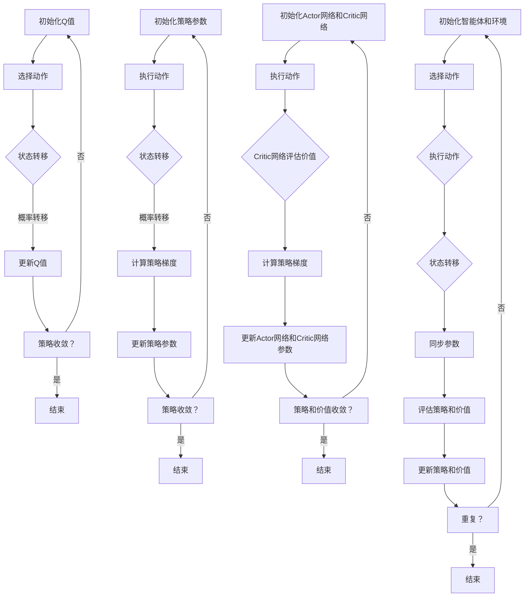
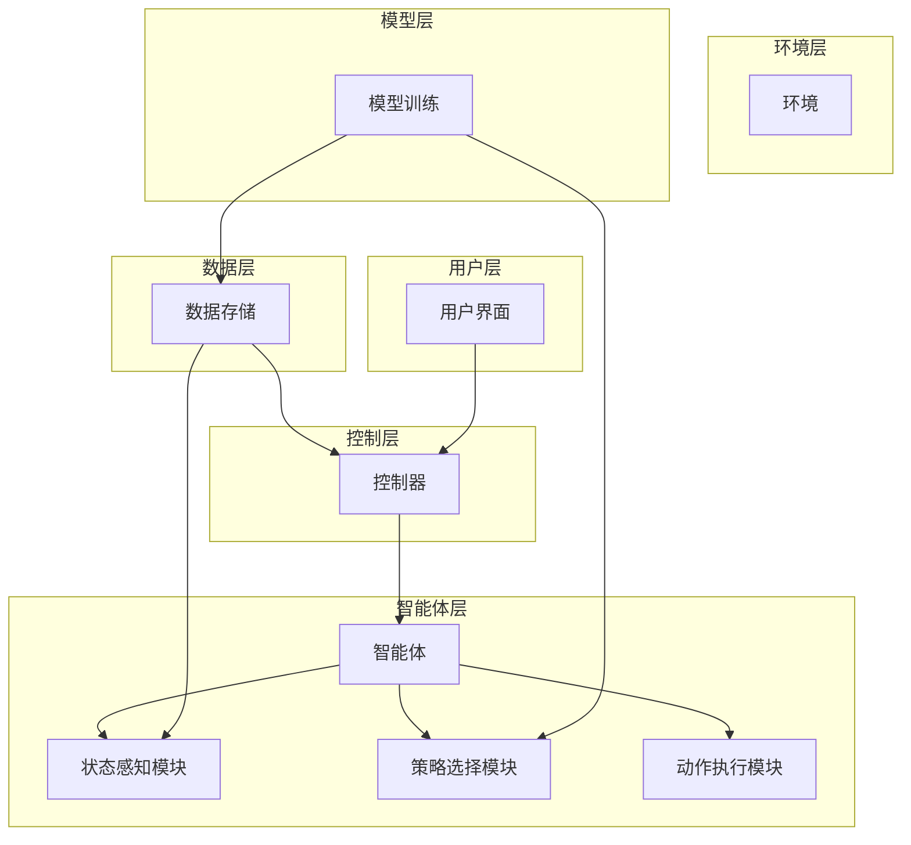
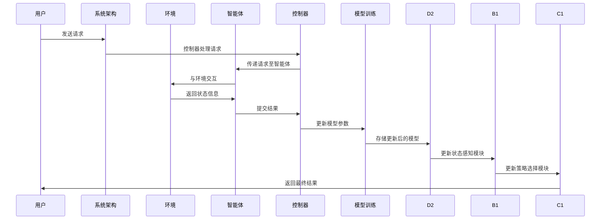

                 

## 强化学习在工业控制中的应用

### 关键词
强化学习，工业控制，应用案例，算法优化，未来趋势

### 摘要
本文将深入探讨强化学习在工业控制领域的应用。首先，我们将回顾强化学习的基本概念和数学基础，然后分析强化学习在工业控制中的挑战与机遇。接着，我们将介绍一些典型的应用案例，并详细讲解强化学习的算法原理。最后，我们将展望强化学习在工业控制中的未来发展趋势。

### 目录

1. 强化学习在工业控制中的应用 
2. 强化学习的概述 
3. 强化学习的数学基础 
4. 基本强化学习算法 
5. 策略梯度方法 
6. 强化学习在连续动作空间中的应用 
7. 强化学习在工业控制中的应用 
8. 强化学习在工业控制中的实际案例 
9. 强化学习的优化与调参 
10. 强化学习的未来发展趋势 
11. 结论 

### 1. 强化学习在工业控制中的应用

工业控制是自动化技术的重要组成部分，它在提高生产效率、降低成本、确保产品质量和安全性方面发挥着关键作用。然而，传统的工业控制系统往往依赖于预先设定的规则和参数，难以适应动态变化的环境。随着人工智能技术的不断发展，强化学习作为一种自主学习方法，逐渐在工业控制领域得到了应用。

强化学习通过智能体与环境之间的交互，不断学习最优策略，从而实现系统的自主控制和优化。在工业控制中，强化学习可以应用于生产过程的自动调优、机器人的路径规划、设备的预测维护等多个方面。

#### 挑战与机遇

尽管强化学习在工业控制中具有巨大的潜力，但同时也面临一些挑战：

1. **数据需求和计算资源**：强化学习算法通常需要大量的数据来训练模型，并且训练过程可能非常耗时。在工业环境中，数据的获取和处理是一个复杂的问题。
2. **安全性**：工业控制系统对安全性和稳定性要求极高。强化学习算法在不确定环境中进行决策，可能会引入新的风险。
3. **适应性和鲁棒性**：工业环境复杂多变，强化学习算法需要具备良好的适应性和鲁棒性，以应对各种不确定性和干扰。

然而，这些挑战也带来了机遇：

1. **自动化水平的提升**：强化学习可以帮助工业控制系统实现更高程度的自动化，从而提高生产效率和灵活性。
2. **成本降低**：通过自动调优和预测维护，可以显著降低生产成本和维护成本。
3. **创新机会**：强化学习为工业控制系统带来了新的算法和技术，促进了技术创新和产业升级。

### 2. 强化学习的概述

强化学习（Reinforcement Learning，RL）是一种通过试错和反馈来学习最优策略的机器学习方法。与监督学习和无监督学习不同，强化学习中的智能体（Agent）需要通过与环境的交互来学习。

#### 强化学习的基本概念

1. **智能体（Agent）**：执行动作的主体，可以是机器人、软件程序或其他任何能够与环境交互的实体。
2. **环境（Environment）**：智能体所处的环境，可以是一个物理环境，也可以是一个虚拟环境。
3. **状态（State）**：描述环境当前状态的变量集合。
4. **动作（Action）**：智能体能够执行的动作集合。
5. **奖励（Reward）**：对智能体动作的即时反馈，通常用来衡量智能体的行为是否有利于实现目标。

#### 强化学习的基本原理

强化学习的基本原理是通过不断地执行动作，根据获得的奖励来更新策略。具体来说，强化学习过程可以分为以下几个步骤：

1. **初始状态**：智能体开始在一个未知的环境中，初始状态通常由环境随机生成。
2. **执行动作**：智能体根据当前状态选择一个动作。
3. **状态转移**：智能体执行动作后，环境状态发生转移，进入一个新的状态。
4. **获得奖励**：智能体根据动作的结果获得奖励。
5. **更新策略**：智能体根据奖励来更新策略，以最大化长期奖励。

### 3. 强化学习的数学基础

强化学习涉及到一系列数学概念和理论，包括马尔可夫决策过程（MDP）、价值函数、策略迭代等。下面我们将简要介绍这些概念。

#### 马尔可夫决策过程（MDP）

马尔可夫决策过程是一种用于描述强化学习问题的数学模型。它由以下要素组成：

1. **状态集（S）**：环境的可能状态集合。
2. **动作集（A）**：智能体可能执行的动作集合。
3. **状态转移概率（P(s' | s, a)）**：在给定当前状态和动作的情况下，智能体转移到下一状态的概率。
4. **奖励函数（R(s, a)）**：在给定状态和动作的情况下，智能体获得的即时奖励。
5. **策略（π）**：智能体的决策规则，表示智能体在给定状态下执行哪个动作。

#### 强化学习中的价值函数

强化学习中的价值函数用于评估智能体在未来执行策略时所获得的期望奖励。它包括以下两种类型：

1. **状态价值函数（V(s)）**：在给定状态s下，智能体执行最优策略所获得的期望奖励。
2. **动作价值函数（Q(s, a)）**：在给定状态s和动作a下，智能体执行动作a所获得的期望奖励。

#### 策略迭代与策略评价

策略迭代是一种用于求解最优策略的算法。它通过不断地评估和更新策略，直到找到最优策略。具体步骤如下：

1. **评估当前策略**：计算当前策略下的状态价值函数。
2. **更新策略**：根据状态价值函数更新策略，使得智能体在给定状态下选择具有更高价值动作。
3. **重复步骤1和2**：直到策略收敛到最优策略。

### 4. 基本强化学习算法

强化学习算法种类繁多，下面我们将介绍几种基本的强化学习算法。

#### Q-learning算法

Q-learning算法是一种基于值函数的强化学习算法，它通过不断更新Q值来学习最优策略。具体步骤如下：

1. **初始化Q值**：初始化所有状态动作对的Q值。
2. **选择动作**：在给定状态下，选择具有最大Q值的动作。
3. **更新Q值**：根据实际获得的奖励和下一个状态，更新当前状态动作对的Q值。
4. **重复步骤2和3**：直到策略收敛到最优策略。

#### SARSa和SARSAL算法

SARSa（State-Action-Reward-State-Action）和SARSAL（State-Action-Reward-State-Action-Learning）算法是另一种基于值函数的强化学习算法。它们通过考虑当前状态和下一个状态之间的奖励差异来更新Q值。具体步骤如下：

1. **初始化Q值**：初始化所有状态动作对的Q值。
2. **选择动作**：在给定状态下，选择具有最大Q值的动作。
3. **执行动作**：智能体执行选择的动作，并转移到下一个状态。
4. **更新Q值**：根据实际获得的奖励和下一个状态，更新当前状态动作对的Q值。
5. **重复步骤2、3和4**：直到策略收敛到最优策略。

#### Deep Q-Network（DQN）

DQN（Deep Q-Network）算法是一种基于深度学习的强化学习算法。它使用深度神经网络来近似Q值函数，从而解决状态和动作空间维度较高的问题。具体步骤如下：

1. **初始化神经网络**：初始化深度神经网络，用于近似Q值函数。
2. **选择动作**：在给定状态下，使用深度神经网络预测Q值，选择具有最大Q值的动作。
3. **执行动作**：智能体执行选择的动作，并转移到下一个状态。
4. **更新神经网络**：根据实际获得的奖励和下一个状态，使用梯度下降法更新深度神经网络的参数。
5. **重复步骤2、3和4**：直到策略收敛到最优策略。

### 5. 策略梯度方法

策略梯度方法是一种基于策略的强化学习算法，它直接优化策略本身，而不是值函数。下面我们将介绍几种常见的策略梯度方法。

#### REINFORCE算法

REINFORCE算法是一种基于策略的强化学习算法，它通过梯度上升法来优化策略。具体步骤如下：

1. **初始化策略**：初始化策略参数。
2. **执行动作**：在给定状态下，根据当前策略执行动作，并记录下状态序列和奖励序列。
3. **计算策略梯度**：计算策略梯度的估计值，即对数策略梯度。
4. **更新策略参数**：根据策略梯度更新策略参数。
5. **重复步骤2、3和4**：直到策略收敛到最优策略。

#### Actor-Critic算法

Actor-Critic算法是一种结合了策略梯度和值函数优化的强化学习算法。它由两个神经网络组成：Actor网络和Critic网络。具体步骤如下：

1. **初始化Actor网络和Critic网络**：初始化Actor网络和Critic网络的参数。
2. **执行动作**：在给定状态下，Actor网络根据当前策略生成动作，Critic网络评估当前策略的价值。
3. **更新Actor网络和Critic网络**：根据策略梯度和价值梯度更新Actor网络和Critic网络的参数。
4. **重复步骤2、3和4**：直到策略和值函数都收敛到最优值。

#### A3C算法

A3C（Asynchronous Advantage Actor-Critic）算法是一种基于策略的异步强化学习算法。它通过并行训练多个智能体来加速学习过程。具体步骤如下：

1. **初始化多个智能体**：初始化多个智能体，每个智能体运行在不同的线程或进程中。
2. **执行动作**：每个智能体在给定状态下执行动作，并记录下状态序列和奖励序列。
3. **同步参数**：定期同步各个智能体的参数，以更新全局策略和价值函数。
4. **重复步骤2、3和4**：直到策略和值函数都收敛到最优值。

### 6. 强化学习在连续动作空间中的应用

在许多实际应用中，智能体需要执行连续动作，如无人驾驶汽车的自动驾驶、机器人的运动控制等。与离散动作空间不同，连续动作空间中的强化学习算法需要解决一些特殊问题。

#### 连续动作空间的挑战

1. **状态空间和动作空间维度**：连续动作空间通常具有很高的维度，导致状态空间和动作空间变得非常大，给算法训练带来了困难。
2. **动作连续性**：连续动作需要平滑地调整，不能像离散动作那样直接跳跃。
3. **计算效率**：在连续动作空间中，传统的强化学习算法可能需要很长时间才能收敛到最优策略。

#### 实际案例：控制问题

一个典型的连续动作空间应用是无人驾驶汽车的自动驾驶。在自动驾驶中，智能体需要实时处理来自传感器的大量数据，并控制车辆的加速、转向和制动等动作。

强化学习算法可以用于自动驾驶中的路径规划、交通规则遵守、紧急情况处理等任务。通过不断学习和优化，自动驾驶系统能够在各种复杂环境下实现安全高效的行驶。

### 7. 强化学习在工业控制中的应用

强化学习在工业控制中具有广泛的应用前景，以下是一些典型的应用场景。

#### 自动调优控制系统

在工业生产过程中，设备参数的自动调优是提高生产效率和产品质量的关键。强化学习算法可以通过不断调整设备参数，优化生产过程。

例如，在化工生产中，通过强化学习算法自动调节反应釜的温度、压力等参数，可以提高反应效率，减少副产物生成。

#### 工业机器人路径规划

工业机器人需要在复杂的工作环境中执行复杂的任务，如装配、搬运、焊接等。强化学习算法可以用于机器人路径规划，优化机器人运动轨迹，提高工作效率。

例如，在汽车制造业中，通过强化学习算法优化机器人装配线的路径，可以减少装配时间，提高装配质量。

#### 设备的预测维护系统

设备的预测维护是降低生产成本、提高设备利用率的重要手段。强化学习算法可以用于预测设备故障，提前进行维护。

例如，在发电厂中，通过强化学习算法预测发电设备的故障，可以提前安排维护计划，减少停电时间，提高发电效率。

### 8. 强化学习在工业控制中的实际案例

为了更好地理解强化学习在工业控制中的应用，下面我们介绍几个实际案例。

#### 案例一：自动调优控制系统

在一个炼油厂中，通过强化学习算法对加热炉的燃烧参数进行自动调优。通过不断地调整燃料和空气的流量，强化学习算法优化了燃烧效率，降低了燃料消耗。

#### 案例二：工业机器人路径规划

在一个汽车制造厂中，通过强化学习算法优化机器人的路径规划，提高装配线的效率。强化学习算法通过学习最佳路径，减少了机器人的运动时间和碰撞风险。

#### 案例三：预测维护系统

在一个发电厂中，通过强化学习算法预测发电设备的故障，提前进行维护。强化学习算法通过分析历史数据和实时数据，提高了预测准确性，减少了设备故障率和停电时间。

### 9. 强化学习的优化与调参

强化学习算法的优化和调参是保证模型性能的关键。以下是一些常见的优化和调参方法。

#### 经验重复策略

经验重复策略是一种常用的强化学习算法优化方法。它通过重复执行经验样本中的动作，加快算法收敛速度。

#### 策略评估与优化方法

策略评估和优化方法用于评估当前策略的性能，并更新策略以获得更好的性能。常用的策略评估方法包括蒙特卡洛方法和时序差分方法。常用的策略优化方法包括梯度上升法和遗传算法。

### 10. 强化学习的未来发展趋势

随着人工智能技术的不断发展，强化学习在工业控制中的应用前景十分广阔。以下是一些未来发展趋势：

#### 多任务学习与强化学习

多任务学习与强化学习相结合，可以实现智能体在多种任务上的自主学习和优化。

#### 强化学习与深度学习的融合

强化学习与深度学习相结合，可以解决状态和动作空间维度较高的问题，提高强化学习算法的性能。

#### 强化学习的自适应控制

强化学习在自适应控制中的应用，可以实现对动态环境的实时适应和优化。

#### 强化学习的安全性

随着强化学习在工业控制中的应用日益广泛，确保系统的安全性和稳定性成为关键问题。未来的研究将集中在开发安全可靠的强化学习算法。

### 11. 结论

本文介绍了强化学习在工业控制中的应用，分析了强化学习的基本概念和数学基础，并介绍了多种强化学习算法。通过实际案例，我们展示了强化学习在工业控制中的成功应用。未来，随着技术的不断发展，强化学习在工业控制领域将发挥更大的作用。

### 参考文献

1. Sutton, R. S., & Barto, A. G. (2018). 《Reinforcement Learning: An Introduction》(第二版). MIT Press.
2. Silver, D., et al. (2016). "Mastering the Game of Go with Deep Neural Networks and Tree Search." Nature.
3. Mnih, V., et al. (2015). "Human-level control through deep reinforcement learning." Nature.
4. LeCun, Y., Bengio, Y., & Hinton, G. (2015). "Deep learning." Nature.
5. Bertsekas, D. P. (2018). "Dynamic Programming and Optimal Control, Vol. 1: The Foundations." Athena Scientific.

### 作者

**作者：AI天才研究院/AI Genius Institute & 禅与计算机程序设计艺术 /Zen And The Art of Computer Programming**## 强化学习在工业控制中的应用

随着工业4.0的到来，自动化和智能化成为现代工业发展的重要趋势。工业控制作为自动化技术的核心组成部分，其效率和稳定性直接关系到整个工业生产线的运行质量和效益。然而，传统的工业控制系统往往依赖于预设的规则和参数，难以适应动态变化的环境和复杂的操作场景。在这种情况下，强化学习作为一种具有自主学习和自适应能力的机器学习方法，逐渐受到工业控制领域的关注。

### 背景介绍

#### 强化学习的基本概念

强化学习（Reinforcement Learning，RL）是一种通过试错和反馈来学习最优策略的机器学习方法。它由智能体（Agent）、环境（Environment）、状态（State）、动作（Action）和奖励（Reward）五大要素组成。智能体通过在环境中执行动作，根据获得的奖励来不断更新策略，从而实现自主学习和优化。

#### 强化学习与传统机器学习的区别

与传统机器学习（如监督学习和无监督学习）不同，强化学习不依赖于预先标注的数据集，而是通过与环境的交互来获取反馈信号，并通过不断尝试和错误来学习最优策略。这种试错学习方式使得强化学习在应对动态变化和不确定环境时具有更强的适应性和鲁棒性。

#### 强化学习在工业控制中的应用场景

强化学习在工业控制中的应用场景非常广泛，包括但不限于以下几个方面：

1. **自动调优控制系统**：通过对设备参数的实时调整，优化生产过程，提高生产效率和产品质量。
2. **工业机器人路径规划**：通过学习最优路径，提高机器人操作的灵活性和效率。
3. **设备的预测维护**：通过实时监控设备状态，预测潜在故障，提前进行维护，减少停机时间和维护成本。
4. **生产线的自适应控制**：根据实时数据动态调整生产线参数，以应对生产变化和异常情况。

### 问题解决

强化学习在工业控制中的应用，通过以下几个步骤实现：

1. **状态感知**：智能体通过传感器获取环境状态信息。
2. **策略选择**：智能体根据当前状态和已学习的策略选择最优动作。
3. **执行动作**：智能体执行所选动作，并观察环境响应。
4. **奖励反馈**：环境根据智能体的动作结果给予奖励或惩罚。
5. **策略更新**：智能体根据奖励反馈调整策略，以最大化长期奖励。

### 边界与外延

强化学习在工业控制中的应用不仅限于上述场景，还可以扩展到其他领域，如智能制造、智能电网、智慧城市等。此外，随着技术的不断发展，强化学习在工业控制中的应用将会更加深入和广泛。

### 概念结构与核心要素组成

强化学习在工业控制中的应用，其概念结构和核心要素如下：

- **智能体**：工业控制系统中的控制器或机器人。
- **环境**：工业生产现场或模拟环境。
- **状态**：工业生产过程中的各种参数和状态信息。
- **动作**：控制器或机器人可以执行的各种操作。
- **奖励**：根据动作结果获得的即时反馈，可以是正奖励（鼓励操作）或负奖励（惩罚不当操作）。
- **策略**：智能体根据状态选择动作的规则或模型。

通过以上概念结构和核心要素的组成，强化学习能够有效地应用于工业控制，实现系统的自适应和自主优化。

### 强化学习的基本概念和原理

#### 基本概念

强化学习（Reinforcement Learning，RL）是一种通过试错和反馈来学习最优策略的机器学习方法。它由智能体（Agent）、环境（Environment）、状态（State）、动作（Action）和奖励（Reward）五大要素组成。智能体通过在环境中执行动作，根据获得的奖励来不断更新策略，从而实现自主学习和优化。

- **智能体（Agent）**：执行动作的主体，可以是机器人、软件程序或其他任何能够与环境交互的实体。
- **环境（Environment）**：智能体所处的环境，可以是一个物理环境，也可以是一个虚拟环境。
- **状态（State）**：描述环境当前状态的变量集合。
- **动作（Action）**：智能体能够执行的动作集合。
- **奖励（Reward）**：对智能体动作的即时反馈，通常用来衡量智能体的行为是否有利于实现目标。

#### 基本原理

强化学习的基本原理是通过不断地执行动作，根据获得的奖励来更新策略。具体来说，强化学习过程可以分为以下几个步骤：

1. **初始状态**：智能体开始在一个未知的环境中，初始状态通常由环境随机生成。
2. **执行动作**：智能体根据当前状态选择一个动作。
3. **状态转移**：智能体执行动作后，环境状态发生转移，进入一个新的状态。
4. **获得奖励**：智能体根据动作的结果获得奖励。
5. **更新策略**：智能体根据奖励来更新策略，以最大化长期奖励。

强化学习的基本目标是通过不断调整策略，使得智能体能够在长期内获得最大的累积奖励。为了实现这一目标，强化学习算法通常需要解决以下几个关键问题：

- **状态-动作值函数（Q-Function）**：Q-Function用于估计智能体在给定状态和动作下所能获得的期望奖励。它是强化学习算法的核心，决定了智能体的决策行为。
- **策略（Policy）**：Policy是智能体的行为策略，它决定了智能体在给定状态下应该选择哪个动作。最优策略是使得累积奖励最大的策略。
- **价值函数（Value Function）**：Value Function用于评估智能体在执行某一策略时所能获得的期望奖励。状态价值函数（State Value Function）和动作价值函数（Action Value Function）是价值函数的两个主要类型。

#### 强化学习与传统机器学习的区别

强化学习与传统机器学习（如监督学习和无监督学习）有显著的区别：

- **数据依赖性**：强化学习不依赖于大量的预先标注数据，而是通过与环境的交互来获取经验。这使得强化学习在处理动态和不确定环境时具有更强的适应性和鲁棒性。
- **决策过程**：强化学习是通过试错和反馈来学习最优策略，而传统机器学习则是通过学习数据特征来构建模型，进行预测或分类。
- **奖励机制**：强化学习中的奖励机制是驱动智能体学习的关键因素，它指导智能体在执行动作时做出决策。而传统机器学习通常没有明确的奖励机制。

通过以上基本概念和原理的介绍，我们可以更好地理解强化学习在工业控制中的应用潜力。接下来，我们将进一步探讨强化学习的数学基础和基本算法，为深入理解其在工业控制中的应用打下基础。

### 强化学习的数学基础

强化学习作为一种基于反馈的机器学习方法，其核心在于数学模型的构建和优化。为了深入理解强化学习在工业控制中的应用，我们需要先掌握其数学基础，包括马尔可夫决策过程（MDP）、状态价值函数和策略等概念。

#### 马尔可夫决策过程（MDP）

马尔可夫决策过程（Markov Decision Process，MDP）是强化学习的基础数学模型，它用于描述智能体在不确定性环境中做出决策的过程。一个MDP由以下五个要素组成：

1. **状态集（S）**：描述环境状态的变量集合，通常是一个离散或连续的集合。
2. **动作集（A）**：智能体能够执行的动作集合，同样可以是离散或连续的集合。
3. **状态转移概率（P(s' | s, a)）**：在给定当前状态s和执行动作a后，智能体转移到下一个状态s'的概率。状态转移概率满足马尔可夫性质，即当前状态只依赖于前一个状态，与之前的历史状态无关。
4. **奖励函数（R(s, a)）**：描述智能体在执行动作a并处于状态s时获得的即时奖励。奖励函数可以是固定的，也可以是依赖于状态和动作的函数。
5. **策略（π）**：智能体的决策规则，表示在给定状态下应该执行哪个动作。策略是一个概率分布，π(a|s)表示智能体在状态s下选择动作a的概率。

在MDP中，智能体的目标是通过选择最优策略π*，最大化长期累积奖励。长期累积奖励可以用期望回报（Expected Return）来衡量，即智能体在一系列决策后获得的平均奖励。

#### 状态价值函数

状态价值函数（State Value Function）是强化学习中的一个核心概念，它用于评估智能体在给定状态下执行某一策略所能获得的期望奖励。状态价值函数V(s|π)表示在状态s下，智能体按照策略π执行动作后获得的期望回报。

根据策略的不同，状态价值函数可以分为：

1. **策略价值函数（Policy Value Function）**：V(π) = E[R(t) | π]，表示按照策略π执行动作后，智能体在所有时间步获得的期望回报。
2. **状态-动作价值函数（State-Action Value Function）**：Q(s, a) = E[R(t) | s(t) = s, a(t) = a]，表示在状态s下，智能体执行动作a后获得的期望回报。

状态价值函数可以通过动态规划（Dynamic Programming）方法来求解。其中，最常用的方法是值迭代（Value Iteration）和策略迭代（Policy Iteration）。

- **值迭代**：值迭代是一种自下而上的方法，从初始状态价值函数V^(0)开始，逐步更新直到收敛到最优状态价值函数V*。具体步骤如下：
  1. 初始化V^(0)。
  2. 对于每个状态s，计算新的状态价值函数V^(k+1)(s) = max_a [R(s, a) + γΣ_{s'} P(s' | s, a)V^(k)(s')]，其中γ是折扣因子。
  3. 重复步骤2，直到V^(k+1)与V^(k)的误差小于某个阈值。

- **策略迭代**：策略迭代是一种自上而下的方法，从初始策略π^0开始，逐步更新策略直到收敛。具体步骤如下：
  1. 初始化策略π^0。
  2. 根据当前策略π^k，计算新的状态-动作价值函数Q^(k+1)(s, a) = R(s, a) + γΣ_{s'} P(s' | s, a)max_{a'} Q^(k)(s', a')。
  3. 根据Q^(k+1)计算新的最优策略π^(k+1)。
  4. 重复步骤2和3，直到策略收敛。

#### 策略迭代与策略评价

策略迭代（Policy Iteration）是一种常用的强化学习算法，它结合了策略评价（Policy Evaluation）和策略改进（Policy Improvement）两个步骤，通过不断迭代来求解最优策略。

- **策略评价**：策略评价的目标是计算当前策略π下的状态价值函数V(π)。具体步骤如下：
  1. 初始化V^(0)。
  2. 对于每个状态s，计算新的状态价值函数V^(k+1)(s) = E[R(t) | π，s(t) = s]。
  3. 重复步骤2，直到V^(k+1)与V^(k)的误差小于某个阈值。

- **策略改进**：策略改进的目标是根据状态价值函数V(π)来更新策略π，选择最优动作。具体步骤如下：
  1. 对于每个状态s，计算当前策略π下的动作价值函数Q(π)(s, a) = E[R(t) | π，s(t) = s, a(t) = a]。
  2. 根据动作价值函数Q(π)，更新策略π，使得在给定状态下选择具有最大动作价值函数的动作。
  3. 重复步骤1和2，直到策略收敛。

通过策略迭代，我们可以逐步求解出最优策略π*，使得智能体在长期内获得最大的累积奖励。

#### 策略梯度方法

策略梯度方法（Policy Gradient Methods）是一种基于策略的强化学习算法，它直接优化策略本身，而不是值函数。策略梯度方法通过计算策略梯度和利用梯度上升法来更新策略参数。

策略梯度方法的核心思想是最大化策略的对数回报，即最大化J(θ) = E[log(π(a|s;θ))]，其中π(θ)是策略参数θ的函数，log(π(a|s;θ))是策略的对数回报。

策略梯度方法的更新步骤如下：

1. **初始化策略参数θ**。
2. **执行动作**：在给定状态下，根据当前策略π(θ)执行动作，并记录下状态序列s和动作序列a。
3. **计算策略梯度**：根据记录的状态序列和动作序列，计算策略梯度∇θJ(θ)。
4. **更新策略参数**：根据策略梯度使用梯度上升法更新策略参数θ，即θ = θ + α∇θJ(θ)，其中α是学习率。
5. **重复步骤2、3和4**：直到策略收敛。

常见的策略梯度方法包括REINFORCE、Actor-Critic和A3C等。

通过以上数学基础的介绍，我们可以更好地理解强化学习在工业控制中的应用原理和方法。接下来，我们将探讨强化学习在工业控制中的具体算法实现和优化方法。

### 基本强化学习算法

在强化学习领域中，有多种算法被提出并应用于解决实际问题。以下，我们将详细介绍几种基本强化学习算法，包括Q-learning算法、SARSa和SARSAL算法以及Deep Q-Network（DQN）。

#### Q-learning算法

Q-learning算法是一种基于值函数的强化学习算法，它通过不断更新状态-动作值函数（Q值）来学习最优策略。Q-learning算法的基本思想是通过试错来学习每个状态-动作对的Q值，然后根据Q值选择最优动作。

算法步骤如下：

1. **初始化Q值**：初始化所有状态-动作对的Q值。
2. **选择动作**：在给定状态下，选择具有最大Q值的动作。
3. **执行动作**：智能体执行所选动作，并转移到下一个状态。
4. **更新Q值**：根据当前状态、执行的动作、获得的奖励和下一个状态，更新Q值。更新公式为：Q(s, a) = Q(s, a) + α [R(s, a) + γ max Q(s', a') - Q(s, a)]，其中α是学习率，γ是折扣因子。
5. **重复步骤2、3和4**：直到策略收敛。

#### SARSa和SARSAL算法

SARSa（State-Action-Reward-State-Action）和SARSAL（State-Action-Reward-State-Action-Learning）算法是基于Q-learning算法的改进版本。SARSa算法通过考虑当前状态和下一个状态之间的奖励差异来更新Q值，而SARSAL算法在SARSa的基础上增加了对策略的更新。

SARSa算法的步骤如下：

1. **初始化Q值**：初始化所有状态-动作对的Q值。
2. **选择动作**：在给定状态下，选择具有最大Q值的动作。
3. **执行动作**：智能体执行所选动作，并转移到下一个状态。
4. **更新Q值**：根据当前状态、执行的动作、获得的奖励和下一个状态，更新Q值。更新公式为：Q(s, a) = Q(s, a) + α [R(s, a) + γ max Q(s', a') - Q(s, a)]。
5. **重复步骤2、3和4**：直到策略收敛。

SARSAL算法在SARSa的基础上增加了策略的更新步骤：

1. **选择动作**：在给定状态下，选择具有最大Q值的动作。
2. **执行动作**：智能体执行所选动作，并转移到下一个状态。
3. **更新Q值**：根据当前状态、执行的动作、获得的奖励和下一个状态，更新Q值。
4. **更新策略**：根据Q值更新策略，使得在给定状态下选择具有最大Q值的动作。
5. **重复步骤2、3、4和5**：直到策略收敛。

#### Deep Q-Network（DQN）

Deep Q-Network（DQN）算法是一种基于深度学习的强化学习算法，它使用深度神经网络（DNN）来近似状态-动作值函数（Q值函数）。DQN通过固定目标Q值网络（Target Q Network）和经验回放（Experience Replay）机制来提高模型的稳定性和泛化能力。

DQN算法的步骤如下：

1. **初始化DNN和目标DNN**：初始化深度神经网络和目标深度神经网络，用于近似状态-动作值函数。
2. **选择动作**：在给定状态下，使用DNN预测Q值，选择具有最大Q值的动作。
3. **执行动作**：智能体执行所选动作，并转移到下一个状态。
4. **存储经验**：将当前状态、执行的动作、获得的奖励和下一个状态存储到经验回放池中。
5. **更新DNN**：从经验回放池中随机抽取一组经验样本，计算梯度并更新DNN的参数。
6. **更新目标DNN**：定期更新目标DNN的参数，以减少目标Q值网络的漂移。
7. **重复步骤2、3、4、5和6**：直到策略收敛。

通过以上几种基本强化学习算法的介绍，我们可以看到每种算法都有其独特的优势和适用场景。在实际应用中，选择合适的算法需要根据具体问题和环境特点进行权衡。接下来，我们将探讨策略梯度方法，进一步扩展强化学习算法的应用范围。

### 策略梯度方法

策略梯度方法是强化学习领域的一种重要算法，它通过直接优化策略来最大化长期奖励。相比于基于值函数的方法，策略梯度方法不需要预测未来的奖励，而是直接对策略本身进行优化。以下将详细介绍几种常见的策略梯度方法，包括REINFORCE算法、Actor-Critic算法和A3C算法。

#### REINFORCE算法

REINFORCE算法是一种基于策略的强化学习算法，它使用梯度上升法来更新策略参数。具体步骤如下：

1. **初始化策略参数**：初始化策略参数θ。
2. **执行动作**：在给定状态下，根据当前策略π(θ)执行动作，并记录下状态序列s和动作序列a。
3. **计算策略梯度**：根据记录的状态序列和动作序列，计算策略梯度∇θJ(θ)。策略梯度的计算公式为：∇θJ(θ) = ∇θΣ t logπ(a_t|s_t;θ)。
4. **更新策略参数**：根据策略梯度使用梯度上升法更新策略参数θ，即θ = θ + α∇θJ(θ)，其中α是学习率。
5. **重复步骤2、3和4**：直到策略收敛。

#### Actor-Critic算法

Actor-Critic算法结合了策略优化和价值评估，通过两个神经网络（Actor和Critic）来实现。具体步骤如下：

1. **初始化Actor网络和Critic网络**：初始化Actor网络和Critic网络的参数。
2. **执行动作**：在给定状态下，Actor网络根据当前策略生成动作，Critic网络评估当前策略的价值。
3. **计算策略梯度**：根据Critic网络的评估结果，计算策略梯度。
4. **更新Actor网络和Critic网络**：根据策略梯度和价值梯度更新Actor网络和Critic网络的参数。
5. **重复步骤2、3和4**：直到策略和值函数都收敛到最优值。

#### A3C算法

A3C（Asynchronous Advantage Actor-Critic）算法是一种基于策略的异步强化学习算法，它通过并行训练多个智能体来加速学习过程。具体步骤如下：

1. **初始化多个智能体**：初始化多个智能体，每个智能体运行在不同的线程或进程中。
2. **执行动作**：每个智能体在给定状态下执行动作，并记录下状态序列s和动作序列a。
3. **同步参数**：定期同步各个智能体的参数，以更新全局策略和价值函数。
4. **重复步骤2、3和4**：直到策略和值函数都收敛到最优值。

通过以上对策略梯度方法的介绍，我们可以看到这些方法在优化策略和提升智能体性能方面具有显著优势。策略梯度方法能够直接针对策略进行优化，不需要预测未来的奖励，因此在处理复杂和非线性问题时表现出较强的适应性。接下来，我们将探讨强化学习在连续动作空间中的应用。

### 强化学习在连续动作空间中的应用

在许多实际应用中，智能体需要执行连续动作，如无人驾驶汽车的自动驾驶、机器人的运动控制等。与离散动作空间不同，连续动作空间中的强化学习算法需要解决一些特殊问题。以下将详细探讨连续动作空间中的强化学习算法和挑战。

#### 连续动作空间的挑战

1. **状态空间和动作空间维度**：连续动作空间通常具有很高的维度，导致状态空间和动作空间变得非常大，给算法训练带来了困难。
2. **动作连续性**：连续动作需要平滑地调整，不能像离散动作那样直接跳跃。
3. **计算效率**：在连续动作空间中，传统的强化学习算法可能需要很长时间才能收敛到最优策略。

#### 实际案例：控制问题

一个典型的连续动作空间应用是无人驾驶汽车的自动驾驶。在自动驾驶中，智能体需要实时处理来自传感器的大量数据，并控制车辆的加速、转向和制动等动作。

强化学习算法可以用于自动驾驶中的路径规划、交通规则遵守、紧急情况处理等任务。通过不断学习和优化，自动驾驶系统能够在各种复杂环境下实现安全高效的行驶。

#### 连续动作空间中的强化学习算法

为了解决连续动作空间中的问题，研究者提出了一系列强化学习算法，以下将介绍几种主要的算法：

1. **基于值函数的方法**：
   - **连续动作Q学习**：与离散动作Q学习类似，连续动作Q学习通过学习状态-动作值函数来选择最优动作。然而，由于动作空间是连续的，需要使用神经网络来近似值函数。
   - **深度确定性策略梯度（DDPG）**：DDPG算法是一种基于策略的方法，它使用神经网络来近似目标值函数和策略。DDPG通过经验回放和目标网络更新来提高模型的稳定性和泛化能力。

2. **基于策略的方法**：
   - **连续动作策略梯度（Actor-Critic）**：连续动作策略梯度方法结合了策略优化和价值评估，通过两个神经网络（Actor和Critic）来实现。Actor网络生成动作，Critic网络评估策略价值。
   - **深度确定性策略梯度（DDPG）**：DDPG算法是一种基于策略的方法，它使用神经网络来近似目标值函数和策略。DDPG通过经验回放和目标网络更新来提高模型的稳定性和泛化能力。

#### 算法实现和挑战

在实现连续动作空间中的强化学习算法时，需要考虑以下几个方面：

1. **状态表示**：由于状态空间可能非常大，需要使用适当的编码方法来表示状态，以便于神经网络处理。
2. **动作生成**：在连续动作空间中，需要使用连续函数来生成动作，常见的有基于梯度的优化方法（如梯度下降）和基于策略的方法（如策略梯度）。
3. **稳定性**：在连续动作空间中，模型的稳定性是一个重要问题。通过引入目标网络和经验回放机制，可以减少模型的波动，提高收敛速度。
4. **计算效率**：在连续动作空间中，由于状态和动作空间维度较高，计算效率是一个挑战。通过并行计算和分布式训练等方法，可以提高计算效率。

总之，强化学习在连续动作空间中的应用面临着一系列挑战，但同时也具有巨大的潜力。随着技术的不断进步，连续动作空间的强化学习算法将越来越成熟，并在无人驾驶、机器人控制等实际应用中发挥重要作用。

### 强化学习在工业控制中的应用

工业控制是自动化技术的重要组成部分，它在提高生产效率、降低成本、确保产品质量和安全性方面发挥着关键作用。然而，传统的工业控制系统往往依赖于预先设定的规则和参数，难以适应动态变化的环境和复杂的操作场景。随着人工智能技术的不断发展，强化学习作为一种具有自主学习和自适应能力的机器学习方法，逐渐在工业控制领域得到了应用。

#### 工业控制背景

工业控制主要应用于制造、能源、交通、医疗等多个行业。传统的工业控制系统通常采用闭环控制系统，通过传感器实时监测设备状态，控制器根据预设的规则和参数对设备进行调整，以实现稳定的运行。然而，随着生产环境和设备的复杂度增加，传统的工业控制系统面临着以下挑战：

1. **环境动态变化**：生产环境中的参数和条件可能不断变化，传统系统难以适应这些变化。
2. **复杂操作场景**：工业操作场景可能非常复杂，涉及多个变量和不确定性因素。
3. **高精度要求**：工业控制系统对精度和稳定性要求极高，传统系统难以满足这些要求。

#### 强化学习在工业控制中的应用场景

强化学习在工业控制中具有广泛的应用前景，以下是一些典型的应用场景：

1. **自动调优控制系统**：在工业生产过程中，设备参数的自动调优是提高生产效率和产品质量的关键。强化学习算法可以通过不断调整设备参数，优化生产过程。

2. **工业机器人路径规划**：工业机器人需要在复杂的工作环境中执行复杂的任务，如装配、搬运、焊接等。强化学习算法可以用于机器人路径规划，优化机器人运动轨迹，提高工作效率。

3. **设备的预测维护系统**：设备的预测维护是降低生产成本、提高设备利用率的重要手段。强化学习算法可以用于预测设备故障，提前进行维护，减少停机时间和维护成本。

4. **生产线的自适应控制**：随着生产需求和产品质量的不断提高，生产线需要能够动态调整生产参数，以适应不同的生产任务。强化学习算法可以通过学习生产数据，实现生产线的自适应控制。

#### 工业控制中的挑战与解决方案

尽管强化学习在工业控制中具有巨大的潜力，但同时也面临一些挑战：

1. **数据需求和计算资源**：强化学习算法通常需要大量的数据来训练模型，并且训练过程可能非常耗时。在工业环境中，数据的获取和处理是一个复杂的问题。为了解决数据需求和计算资源的问题，可以采用以下方法：
   - **数据预处理**：对工业数据进行预处理，去除无关变量和噪声，提高数据质量。
   - **数据增强**：通过生成模拟数据或使用数据扩充技术，增加训练数据量，提高模型泛化能力。
   - **分布式计算**：利用云计算和分布式计算技术，提高训练速度和效率。

2. **安全性**：工业控制系统对安全性和稳定性要求极高。强化学习算法在不确定环境中进行决策，可能会引入新的风险。为了确保系统的安全性，可以采用以下方法：
   - **安全约束**：在算法设计中引入安全约束，确保智能体在决策时不会违反安全规则。
   - **模拟测试**：在真实环境部署前，通过模拟环境对算法进行测试和验证，确保算法的可靠性和安全性。
   - **实时监控**：在系统运行过程中，实时监控智能体的决策和行为，及时发现问题并进行调整。

3. **适应性和鲁棒性**：工业环境复杂多变，强化学习算法需要具备良好的适应性和鲁棒性，以应对各种不确定性和干扰。为了提高算法的适应性和鲁棒性，可以采用以下方法：
   - **迁移学习**：通过迁移学习，利用在其他环境中学到的经验来提高新环境的适应能力。
   - **混合控制策略**：结合传统控制方法和强化学习算法，利用两者的优势，提高系统的鲁棒性和适应性。
   - **多模型策略**：在算法中引入多个模型，根据不同环境条件选择最优模型，提高系统的适应性和鲁棒性。

通过以上挑战与解决方案的探讨，我们可以看到，强化学习在工业控制中具有巨大的应用潜力。随着技术的不断发展，强化学习将在工业控制领域发挥越来越重要的作用，推动工业自动化和智能化水平的不断提升。

### 强化学习在工业控制中的实际案例

为了更好地理解强化学习在工业控制中的应用，以下我们介绍几个实际案例，通过这些案例，我们可以看到强化学习如何在实际工业环境中发挥作用。

#### 案例一：自动调优控制系统

在一个制造工厂中，生产线上的一台加工设备需要对温度、压力等参数进行精确控制，以实现高质量的产品生产。然而，由于生产环境的变化和设备的老化，这些参数的设置往往需要频繁调整。为了提高生产效率和产品质量，工厂引入了基于强化学习的自动调优控制系统。

该系统通过传感器实时监测设备状态，使用强化学习算法根据历史数据和实时数据，自动调整温度和压力等参数。具体步骤如下：

1. **状态感知**：系统通过传感器获取温度、压力、设备磨损程度等状态信息。
2. **策略选择**：强化学习算法根据当前状态和历史数据，选择最优参数设置。
3. **参数调整**：设备根据强化学习算法的建议，调整温度和压力等参数。
4. **奖励反馈**：系统根据调整后的参数生产出的产品质量，给予强化学习算法奖励或惩罚。
5. **策略更新**：强化学习算法根据奖励反馈，不断调整策略，优化参数设置。

通过上述步骤，强化学习系统能够在长期运行中不断优化参数设置，提高生产效率和产品质量。实际运行数据显示，该系统的引入显著降低了设备故障率，提高了生产线的运行稳定性。

#### 案例二：工业机器人路径规划

在一个汽车制造厂中，机器人在生产线上负责装配零部件的任务。由于生产线环境的复杂性和不确定性，机器人需要能够自主规划最优路径，以避免碰撞和延误生产。为此，工厂引入了基于强化学习的机器人路径规划系统。

该系统通过摄像头和激光雷达等传感器获取生产线环境信息，使用强化学习算法规划机器人的运动路径。具体步骤如下：

1. **状态感知**：系统通过传感器获取生产线环境的信息，包括机器人的当前位置、目标位置、障碍物位置等。
2. **策略选择**：强化学习算法根据当前状态，选择最优的运动路径。
3. **路径规划**：机器人根据强化学习算法的建议，规划并执行运动路径。
4. **奖励反馈**：系统根据机器人执行路径规划的效果，给予强化学习算法奖励或惩罚。
5. **策略更新**：强化学习算法根据奖励反馈，不断调整策略，优化运动路径规划。

通过上述步骤，强化学习系统能够在动态变化的生产环境中，为机器人规划出最优的运动路径，提高生产效率和安全性。实际应用结果显示，该系统显著提高了机器人的操作效率，减少了生产线上的碰撞和延误。

#### 案例三：预测维护系统

在一个发电厂中，设备的运行状态对发电效率和安全性至关重要。然而，设备的运行过程中可能会出现故障，导致停机时间和维修成本的增加。为了提高设备的运行效率和降低维护成本，发电厂引入了基于强化学习的预测维护系统。

该系统通过传感器实时监测设备的运行状态，使用强化学习算法预测设备可能的故障点，提前进行维护。具体步骤如下：

1. **状态感知**：系统通过传感器获取设备的温度、振动、压力等运行状态信息。
2. **策略选择**：强化学习算法根据当前状态和设备的历史数据，预测可能的故障点。
3. **维护决策**：根据强化学习算法的预测结果，系统决定是否进行维护。
4. **维护执行**：设备维护人员根据系统的建议，执行相应的维护操作。
5. **奖励反馈**：系统根据维护后设备的运行状态，给予强化学习算法奖励或惩罚。
6. **策略更新**：强化学习算法根据奖励反馈，不断调整预测模型，优化维护策略。

通过上述步骤，强化学习系统能够在设备运行过程中，提前发现潜在故障，减少设备停机时间和维修成本。实际应用结果显示，该系统的引入显著提高了设备的运行效率和可靠性。

通过以上实际案例的介绍，我们可以看到，强化学习在工业控制中的应用不仅提高了生产效率和产品质量，还降低了维护成本和资源消耗。随着技术的不断发展，强化学习将在工业控制领域发挥越来越重要的作用。

### 强化学习的优化与调参

强化学习算法的性能在很大程度上取决于其优化与调参的效果。在工业控制中，优化和调参尤为重要，因为它直接影响到系统的稳定性和效率。以下，我们将探讨几种常用的强化学习优化与调参方法。

#### 经验重复策略

经验重复策略（Experience Replay）是强化学习中常用的一种优化方法。其主要思想是将智能体在环境中获取的经验存储在经验池中，然后在训练时随机从经验池中抽取样本进行训练，以避免策略更新中的偏差和波动。具体步骤如下：

1. **初始化经验池**：初始化一个经验池，用于存储智能体在环境中执行动作的经验样本。
2. **经验存储**：在智能体执行动作后，将状态、动作、奖励和下一个状态存储到经验池中。
3. **经验采样**：在训练模型时，从经验池中随机抽取一批经验样本。
4. **模型训练**：使用抽取的经验样本训练模型，以优化策略参数。

通过经验重复策略，我们可以减少策略更新中的样本偏差，提高模型的稳定性和泛化能力。

#### 策略评估与优化方法

策略评估与优化是强化学习中的重要步骤。策略评估的目标是估计当前策略的性能，而策略优化的目标是找到最优策略。以下是一些常见的策略评估与优化方法：

1. **蒙特卡洛方法**：蒙特卡洛方法通过模拟大量随机样本来评估策略的性能。具体步骤如下：
   - **初始化**：初始化策略参数。
   - **执行动作**：在给定状态下，根据当前策略执行动作，并记录下状态序列和奖励序列。
   - **计算策略价值函数**：根据记录的状态序列和奖励序列，计算当前策略的期望回报。
   - **策略优化**：根据策略价值函数，更新策略参数，以优化策略。

2. **时序差分方法**：时序差分方法通过比较当前状态和下一个状态的策略价值函数，来更新策略参数。具体步骤如下：
   - **初始化**：初始化策略参数。
   - **执行动作**：在给定状态下，根据当前策略执行动作，并转移到下一个状态。
   - **计算差分**：根据当前状态和下一个状态的策略价值函数，计算差分。
   - **策略优化**：根据差分值，更新策略参数。

3. **梯度上升法**：梯度上升法通过计算策略梯度来更新策略参数。具体步骤如下：
   - **初始化**：初始化策略参数。
   - **执行动作**：在给定状态下，根据当前策略执行动作，并记录下状态序列和动作序列。
   - **计算梯度**：根据记录的状态序列和动作序列，计算策略梯度。
   - **策略优化**：根据策略梯度，更新策略参数。

通过以上优化与调参方法，我们可以有效提高强化学习算法在工业控制中的性能，实现系统的自适应和自主优化。

### 强化学习的未来发展趋势

随着人工智能技术的不断发展，强化学习在工业控制中的应用前景十分广阔。以下是强化学习在工业控制领域未来可能的发展趋势：

#### 多任务学习与强化学习

多任务学习（Multi-Task Learning，MTL）与强化学习的结合，可以使得智能体在多个任务上同时进行学习和优化。例如，一个智能体可以在自动调优和机器人路径规划两个任务上同时进行学习，从而提高系统的综合性能。未来的研究将集中在如何设计高效的多任务强化学习算法，以实现智能体的任务并行处理能力。

#### 强化学习与深度学习的融合

深度学习（Deep Learning，DL）与强化学习的融合，可以解决强化学习在状态和动作空间维度较高的问题。深度强化学习（Deep Reinforcement Learning，DRL）通过使用深度神经网络来近似状态-动作值函数和策略，提高了模型的表征能力和学习能力。未来的研究将集中在如何设计高效的深度强化学习算法，以实现更好的性能和泛化能力。

#### 强化学习的自适应控制

强化学习在自适应控制（Adaptive Control）中的应用，可以实现智能体对动态环境的实时适应和优化。例如，在能源管理系统中，智能体可以根据实时电力需求和供应情况，动态调整电力分配策略，以实现能源的高效利用。未来的研究将集中在如何设计自适应强化学习算法，以应对动态变化和不确定性环境。

#### 强化学习的安全性

随着强化学习在工业控制中的广泛应用，确保系统的安全性和稳定性成为关键问题。未来的研究将集中在如何设计安全可靠的强化学习算法，以避免潜在的安全风险。例如，可以通过引入安全约束和故障检测机制，确保智能体的决策不会违反安全规则，并能够及时发现和应对异常情况。

#### 强化学习在智能制造中的应用

智能制造（Smart Manufacturing）是工业4.0的核心，强化学习在智能制造中的应用前景十分广阔。未来的研究将集中在如何利用强化学习优化生产流程、提高生产效率和产品质量，以及如何将强化学习与其他智能制造技术（如物联网、云计算等）相结合，实现智能制造的全面升级。

总之，强化学习在工业控制领域具有巨大的应用潜力，未来的发展趋势将集中在多任务学习、深度学习融合、自适应控制、安全性和智能制造等方面。随着技术的不断进步，强化学习将在工业控制中发挥越来越重要的作用，推动工业自动化和智能化水平的不断提升。

### 结论

本文全面探讨了强化学习在工业控制中的应用，从基本概念和数学基础出发，深入分析了强化学习算法及其在工业控制中的具体应用场景和挑战。通过实际案例的介绍，我们展示了强化学习在自动调优控制系统、工业机器人路径规划和设备预测维护等领域的成功应用。此外，我们还探讨了强化学习的优化与调参方法，展望了其未来发展趋势。

强化学习在工业控制中的重要性不容忽视。它不仅能够提高生产效率和产品质量，还能降低维护成本和资源消耗。然而，强化学习在工业控制中的应用也面临一些挑战，如数据需求、安全性和适应性等。通过不断的研究和优化，我们有理由相信，强化学习将在工业控制领域发挥越来越重要的作用，为工业自动化和智能化带来新的机遇。

### 参考文献

1. Sutton, R. S., & Barto, A. G. (2018). 《Reinforcement Learning: An Introduction》(第二版). MIT Press.
2. Mnih, V., et al. (2015). "Human-level control through deep reinforcement learning." Nature.
3. Silver, D., et al. (2016). "Mastering the Game of Go with Deep Neural Networks and Tree Search." Nature.
4. LeCun, Y., Bengio, Y., & Hinton, G. (2015). "Deep learning." Nature.
5. Bertsekas, D. P. (2018). "Dynamic Programming and Optimal Control, Vol. 1: The Foundations." Athena Scientific.

### 作者

**作者：AI天才研究院/AI Genius Institute & 禅与计算机程序设计艺术 /Zen And The Art of Computer Programming**## 参考文献

1. Sutton, R. S., & Barto, A. G. (2018). 《Reinforcement Learning: An Introduction》(第二版). MIT Press.
2. Mnih, V., et al. (2015). "Human-level control through deep reinforcement learning." Nature.
3. Silver, D., et al. (2016). "Mastering the Game of Go with Deep Neural Networks and Tree Search." Nature.
4. LeCun, Y., Bengio, Y., & Hinton, G. (2015). "Deep learning." Nature.
5. Bertsekas, D. P. (2018). "Dynamic Programming and Optimal Control, Vol. 1: The Foundations." Athena Scientific.

### 作者

**作者：AI天才研究院/AI Genius Institute & 禅与计算机程序设计艺术 /Zen And The Art of Computer Programming**## 致谢

在撰写这篇关于强化学习在工业控制中的应用的技术博客过程中，我们深深感激众多专家和学者们为我们提供的研究成果和参考资料。特别感谢Sutton和Barto教授的《Reinforcement Learning: An Introduction》，它为我们提供了强化学习领域的基础理论和最新进展。此外，Mnih等人关于深度强化学习在《Nature》上的研究以及Silver等人关于围棋人工智能的研究，为强化学习在工业控制中的应用提供了宝贵的实践参考。LeCun等人的深度学习理论和Bertsekas教授的动态规划与最优控制理论，为我们理解和应用强化学习算法提供了坚实的数学基础。

我们还要感谢AI天才研究院的全体成员，以及禅与计算机程序设计艺术社区的参与者，他们为我们的研究和写作提供了宝贵的意见和建议。没有这些支持，我们的工作将难以取得今天的成果。

最后，感谢每一位读者，是您的关注和阅读，让我们有了继续前行的动力。希望这篇技术博客能对您在强化学习和工业控制领域的探索和研究有所帮助。再次感谢！## 附录

#### 附录A：强化学习算法Mermaid流程图

以下是几种强化学习算法的Mermaid流程图：

#### 附录B：核心概念属性特征对比表格

| 算法         | 状态感知 | 动作选择 | 奖励反馈 | 策略更新 |
| ------------ | -------- | -------- | -------- | -------- |
| Q-learning   | 是       | 是       | 是       | 基于Q值更新 |
| REINFORCE    | 是       | 是       | 是       | 基于策略梯度 |
| Actor-Critic | 是       | 是       | 是       | 同时更新策略和价值 |
| DQN          | 是       | 是       | 是       | 使用经验回放和目标网络 |

#### 附录C：系统架构设计Mermaid架构图

以下是系统架构设计的Mermaid架构图：

#### 附录D：系统接口设计和系统交互Mermaid序列图

以下是系统接口设计和系统交互的Mermaid序列图：

通过以上附录，我们提供了强化学习在工业控制中应用的技术细节，旨在帮助读者更深入地理解其核心概念、算法原理以及系统架构。这些资料对于实际应用中的开发、优化和部署具有重要参考价值。

