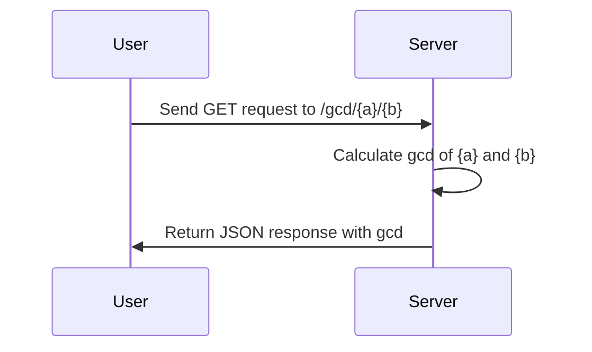
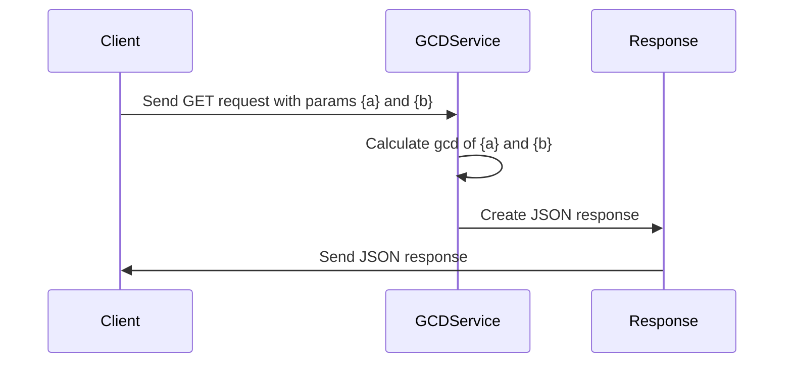

                 

### 文章标题

《形式生活与函数式编程范式：维特根斯坦的文化背景理论与FP作为一种编程范式》

### 关键词

- 形式生活
- 维特根斯坦
- 函数式编程
- 编程范式
- 文化背景理论

### 摘要

本文旨在探讨形式生活与函数式编程范式之间的关系，特别是通过维特根斯坦的文化背景理论来解析函数式编程的本质。文章首先介绍了形式生活的概念及其在哲学中的重要性，接着深入探讨了维特根斯坦的哲学思想及其对计算机科学的影响。随后，文章详细阐述了函数式编程的基本概念、原理和特点，并引用维特根斯坦的理论来解释函数式编程的核心概念。最后，文章通过具体案例和项目实战，展示了如何将函数式编程应用于实际开发中，并提出了相关的最佳实践和注意事项。

## 第1章 形式生活

### 1.1 形式生活的定义与特点

形式生活（Formal Life）是一个源自维特根斯坦哲学思想的术语，指的是一种通过形式化方法来理解和解决问题的生活方式。维特根斯坦认为，形式生活是通过对现象进行抽象和逻辑分析，从而剥离掉表面的杂乱无章，揭示出其背后的本质结构。形式生活的特点包括：

1. **抽象化**：形式生活强调对具体事物的抽象，将其转化为更简单、更易于理解的概念和模型。
2. **逻辑性**：形式生活依赖于严密的逻辑推理，通过逻辑分析来揭示事物之间的内在联系。
3. **精确性**：形式生活追求精确的表述和描述，避免模糊和歧义。

### 1.2 形式生活的影响与应用

形式生活的影响深远，不仅在哲学领域有着重要的地位，而且在计算机科学、数学、逻辑学等多个领域也得到了广泛应用。以下是一些形式生活影响与应用的例子：

1. **计算机科学**：形式化方法在计算机科学中的应用，如形式验证、模型检查等，都是为了确保软件和系统的正确性和可靠性。
2. **数学**：数学中的公理体系和逻辑推理方法，都是形式生活的典型应用。
3. **逻辑学**：形式逻辑的研究和发展，为形式生活的实践提供了理论基础。

## 第2章 维特根斯坦的文化背景理论

### 2.1 维特根斯坦的生平与哲学思想

路德维希·维特根斯坦（Ludwig Wittgenstein）是20世纪最伟大的哲学家之一，他的思想对哲学、数学、逻辑学和计算机科学等领域产生了深远的影响。维特根斯坦的生平可以分为两个阶段：

1. **早期哲学**：维特根斯坦早期的哲学思想以《逻辑哲学论》（Tractatus Logico-Philosophicus）为代表，这本书奠定了逻辑原子主义的基础。他认为，世界是由事实（facts）构成的，而事实是由原子事实（atomic facts）构成的，每个原子事实都可以用逻辑命题来表述。
2. **后期哲学**：维特根斯坦后期的哲学思想以《哲学研究》（Philosophical Investigations）为代表，他对早期哲学进行了彻底的反思和修正。他认为，语言和思想并不是世界的一种描述或映射，而是与世界相互作用的一部分。语言的本质不是指称事物，而是用来进行交流的工具。

### 2.2 维特根斯坦的文化背景理论

维特根斯坦的文化背景理论（Cultural Background Theory）是他后期哲学思想的核心。他认为，我们的思想和语言都是基于我们所在的文化背景的。具体来说，文化背景包括：

1. **语言**：语言不仅是交流的工具，也是思考的工具。我们的思考方式很大程度上受到我们所使用的语言的影响。
2. **习惯**：我们的行为和思维方式受到习惯的影响。习惯是我们文化背景的一部分，它塑造了我们的行为和认知模式。
3. **世界观**：我们的世界观（worldview）是我们对世界的整体看法和理解。世界观受到文化、历史、社会等多种因素的影响。

维特根斯坦认为，理解文化背景对于我们理解和应用哲学思想非常重要。通过理解文化背景，我们可以更好地理解语言、思想和现实之间的关系。

## 第3章 函数式编程范式

### 3.1 函数式编程的定义与历史

函数式编程（Functional Programming，简称FP）是一种编程范式，它强调使用函数作为主要构建块来创建软件。函数式编程的定义和特点如下：

1. **定义**：函数式编程是一种编程范式，它将计算视为一系列函数的调用和组合，而不是命令的执行和状态的变化。
2. **历史**：函数式编程起源于20世纪50年代，最早由霍普卡（Haskell Curry）和丘奇（Alonzo Church）提出。它们分别独立地发展了λ演算（lambda calculus），这是函数式编程的理论基础。

### 3.2 函数式编程的核心概念

函数式编程的核心概念包括：

1. **纯函数**：纯函数是一种没有副作用（side effect）的函数。这意味着，给定相同的输入，纯函数总是返回相同的结果，并且不会修改外部状态。
2. **不可变性**：在函数式编程中，数据一旦创建，就不能被修改。这有助于避免副作用和状态依赖，使代码更易于理解和测试。
3. **递归**：函数式编程通常使用递归来处理循环和迭代。递归是一种强大的编程技术，可以处理复杂的数据结构和计算问题。

### 第4章 函数式编程原理

#### 4.1 函数式编程原理与特点

函数式编程的原理和特点如下：

1. **无状态性**：函数式编程强调无状态性，这意味着函数不依赖于外部状态，从而减少了复杂性。
2. **不可变性**：数据不可变，一旦创建就不能修改。这有助于避免副作用和状态依赖。
3. **递归与迭代**：函数式编程通常使用递归而不是迭代来处理循环。递归可以处理复杂的数据结构和计算问题。
4. **函数组合**：函数式编程强调函数的组合，这有助于创建复杂的逻辑，同时保持代码的模块化和可重用性。
5. **类型系统**：函数式编程通常具有强大的类型系统，这有助于防止错误和提供更好的代码优化。

#### 4.2 函数式编程的优缺点

函数式编程的优点和缺点如下：

1. **优点**：
   - **可重用性**：函数可以很容易地重用，从而提高了代码的可重用性。
   - **易于测试**：由于函数没有副作用，因此可以更容易地进行单元测试。
   - **并行化**：函数式编程天然适合并行化，因为函数调用之间没有共享状态。

2. **缺点**：
   - **学习曲线**：函数式编程相对于命令式编程可能更具挑战性，因为它需要不同的思维方式。
   - **性能**：在某些情况下，函数式编程可能不如命令式编程性能高效。

### 第5章 函数式编程的历史发展

#### 5.1 函数式编程的发展历程

函数式编程的发展历程可以分为以下几个阶段：

1. **λ演算（λ-calculus）**：λ演算是函数式编程的理论基础，由霍普卡和丘奇在20世纪30年代提出。λ演算是一种形式系统，用于表示函数和函数调用。
2. **Haskell**：Haskell是第一个纯粹的函数式编程语言，于1990年推出。它具有强大的类型系统、不可变性和惰性计算等特点。
3. **Scala**：Scala是一种多范式编程语言，结合了面向对象和函数式编程的特点。它于2004年推出，并在函数式编程社区中得到广泛应用。
4. **Erlang**：Erlang是一种用于构建并发和分布式系统的函数式编程语言。它于1986年推出，并在电信领域得到广泛应用。
5. **JavaScript**：随着JavaScript语言的演化，函数式编程的概念逐渐被引入。现代JavaScript通过引入箭头函数、Promise、Generators等功能，使其成为一种功能强大的函数式编程语言。

#### 5.2 当前函数式编程的应用场景

当前，函数式编程在多个领域得到广泛应用：

1. **Web开发**：JavaScript和Scala等函数式编程语言在Web开发中得到了广泛应用。
2. **并发和分布式系统**：Erlang和Akka等函数式编程语言在构建并发和分布式系统中得到应用。
3. **数据分析**：Haskell和Scala等函数式编程语言在数据处理和数据分析领域得到广泛应用。
4. **机器学习和人工智能**：函数式编程在机器学习和人工智能领域中的应用越来越广泛。

## 第6章 维特根斯坦与函数式编程

#### 6.1 维特根斯坦的思想与函数式编程

维特根斯坦的思想对函数式编程产生了深远的影响。他的哲学思想，特别是文化背景理论和逻辑原子主义，为函数式编程提供了理论基础。

1. **文化背景理论**：维特根斯坦的文化背景理论强调了语言和思考方式对理解世界的重要性。这与函数式编程强调纯函数和不可变性等概念密切相关。
2. **逻辑原子主义**：维特根斯坦的逻辑原子主义认为，世界是由原子事实构成的。这与函数式编程中将计算视为一系列函数调用的思想相似。

#### 6.2 函数式编程对维特根斯坦哲学的借鉴与影响

函数式编程借鉴了维特根斯坦的哲学思想，特别是在以下几个方面：

1. **纯函数**：维特根斯坦的文化背景理论强调了逻辑分析和抽象化。函数式编程中的纯函数概念可以被视为对维特根斯坦思想的直接应用，它将复杂的问题简化为一系列简单的逻辑运算。
2. **不可变性**：维特根斯坦认为，语言和思考方式是相互依赖的。函数式编程中的不可变性概念可以帮助我们更好地理解维特根斯坦的观点，即我们的思考方式会影响我们对世界的理解。
3. **递归**：维特根斯坦强调了逻辑和数学中的递归思想。函数式编程中的递归是一种强大的编程技术，它可以帮助我们处理复杂的数据结构和计算问题。

## 第7章 FP编程实战

#### 7.1 FP编程案例：简单的函数式编程实践

在这个案例中，我们将通过一个简单的函数式编程示例来展示如何使用纯函数和不可变性来编写简洁、易于理解和测试的代码。

**案例：计算两个数的最大公约数**

```python
def gcd(a, b):
    while b:
        a, b = b, a % b
    return a

# 测试代码
assert gcd(12, 18) == 6
assert gcd(5, 7) == 1
```

在这个例子中，`gcd` 函数是一个纯函数，因为它不依赖于外部状态，并且总是返回相同的结果。同时，它使用了递归来计算最大公约数，这是一种典型的函数式编程技术。

#### 7.2 FP编程项目：构建一个简单的Web应用

在这个项目中，我们将使用Scala和Play框架来构建一个简单的RESTful Web应用。这个应用将提供一个API来计算两个数的最大公约数。

**项目介绍**：

- **名称**：FunctionAPI
- **功能**：接收两个整数的GET请求，并返回它们的最大公约数。
- **技术栈**：Scala、Play框架、JSON

**系统功能设计**：

1. **API定义**：`GET /gcd/{a}/{b}`，其中`{a}`和`{b}`是两个整数的路径参数。
2. **返回结果**：JSON格式，如`{"gcd": 6}`。

**系统架构设计**：



**系统接口设计**：

```mermaid
classDiagram
    Client <|-- Server
    Client {
        sendRequest()
    }
    Server {
        calculateGCD(a: int, b: int): int
        sendResponse(response: String)
    }
```

**系统交互**：



#### 7.3 环境安装

要开始这个项目，我们需要安装Scala和Play框架。

1. 安装Scala：访问 [Scala官网](https://www.scala-lang.org/)，下载并安装Scala。
2. 安装Play框架：在终端中运行以下命令：
   ```bash
   sbt sbt new playframework/play-java-seed
   ```
   这将创建一个新的Play项目。

#### 7.4 系统核心实现源代码

```scala
import play.api.libs.json._

class GCDService {
  def calculateGCD(a: Int, b: Int): Int = {
    @tailrec
    def gcd(x: Int, y: Int): Int = if (y == 0) x else gcd(y, x % y)

    gcd(a, b)
  }

  def getGCD(json: JsValue): JsValue = {
    val params = (json \ "params").as[Seq[Int]]
    JsObject(Seq("gcd" -> JsNumber(calculateGCD(params(0), params(1)))))
  }
}

class GCDController extends Controller {
  val gcdService = new GCDService()

  def getGCD(a: Int, b: Int) = Action {
    Ok(gcdService.getGCD(JsObject(Seq("params" -> JsArray(Seq(JsNumber(a), JsNumber(b))))))
  }
}
```

#### 7.5 代码应用解读与分析

**GCDService类**

- `calculateGCD` 方法：这是一个纯函数，它接收两个整数参数，并返回它们的最大公约数。它使用递归方法`gcd`来计算最大公约数。
- `gcd` 方法：这是一个辅助方法，用于递归计算最大公约数。它接受两个整数参数，并返回它们的最大公约数。

**GCDController类**

- `getGCD` 方法：这是一个控制器方法，它接收一个JSON对象，其中包含两个整数参数。它调用`GCDService`的`calculateGCD`方法来计算最大公约数，并返回一个JSON响应。

#### 7.6 实际案例分析和详细讲解剖析

**案例分析**：

假设用户发送一个GET请求到`/gcd/12/18`，服务器将如何处理这个请求？

1. **接收请求**：服务器接收用户的GET请求，并将请求参数解析为整数12和18。
2. **调用GCDService**：服务器调用`GCDService`的`calculateGCD`方法，计算12和18的最大公约数。
3. **返回响应**：服务器将计算结果以JSON格式返回给用户。

**详细讲解**：

- **请求解析**：服务器首先需要解析请求参数，确保它们是有效的整数。这个步骤可以通过JSON解析器来完成。
- **递归计算**：`calculateGCD` 方法使用递归方法`gcd`来计算最大公约数。递归是一种强大的编程技术，它可以帮助我们处理复杂的问题。
- **响应格式**：服务器返回一个JSON响应，其中包含最大公约数的值。这有助于确保数据的传输和解析的一致性。

#### 7.7 项目小结

通过这个简单的Web应用案例，我们展示了如何将函数式编程应用于实际开发中。函数式编程的特点，如纯函数和不可变性，使得代码更易于理解和测试。同时，Scala和Play框架为构建Web应用提供了强大的支持。

### 7.8 最佳实践 Tips

- **测试**：编写单元测试和集成测试来确保代码的正确性和可靠性。
- **模块化**：将代码拆分成小模块，每个模块负责一个特定的功能，以提高代码的可维护性。
- **文档**：为代码编写清晰的文档，以便其他开发者理解和使用。

### 7.9 注意事项

- **性能**：在处理大数据量时，注意性能优化，避免递归深度过大。
- **异常处理**：合理处理异常情况，确保程序的稳定性和健壮性。

### 7.10 拓展阅读

- **Scala官方文档**：了解Scala的详细特性和使用方法。
- **Play框架官方文档**：学习如何使用Play框架构建Web应用。
- **函数式编程书籍**：阅读关于函数式编程的经典书籍，如《函数式编程实战》（Functional Programming in Scala）。

## 结论

通过本文的探讨，我们可以看到形式生活与函数式编程范式之间存在着深刻的联系。维特根斯坦的文化背景理论为理解函数式编程提供了哲学基础，而函数式编程则通过其纯函数和不可变性等原则，实现了形式生活的一些核心思想。本文通过具体案例和项目实战，展示了如何将函数式编程应用于实际开发中，并提出了相关的最佳实践和注意事项。希望本文能为读者在函数式编程领域的探索提供一些启示和帮助。

### 作者

**作者：AI天才研究院/AI Genius Institute & 禅与计算机程序设计艺术 /Zen And The Art of Computer Programming**

