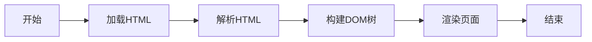
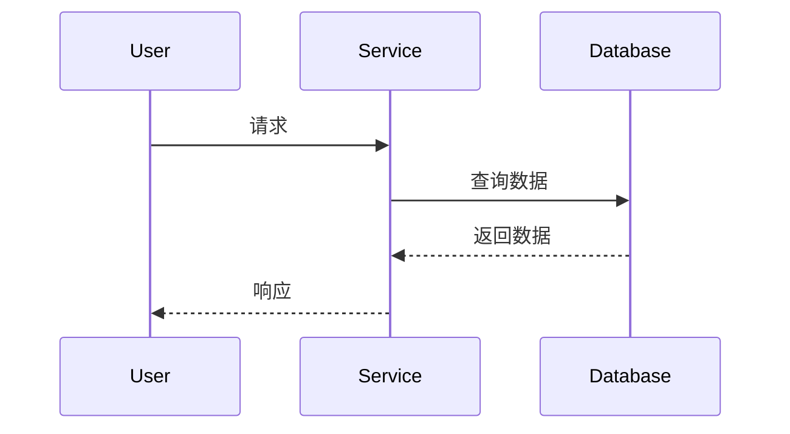

                 

# 《微信小程序开发：移动应用的新形式》

## 关键词

- 微信小程序
- 移动应用
- 开发流程
- 前端开发
- 后端开发
- 性能优化

## 摘要

本文将深入探讨微信小程序的开发，包括其起源、优势、开发流程、应用场景以及前端和后端开发的技术细节。我们将一步一步分析微信小程序的工作原理，探讨如何利用微信小程序构建高效的移动应用，并讨论性能优化方法。通过本文的阅读，开发者将全面了解微信小程序的开发技术，为实际项目提供有力的指导。

-----------------------------------

## 《微信小程序开发：移动应用的新形式》目录大纲

### 第1章 微信小程序概述
#### 1.1 微信小程序的起源与背景
#### 1.2 微信小程序的优势与特点
#### 1.3 微信小程序的开发流程
#### 1.4 微信小程序的应用场景
#### 1.5 本章小结

### 第2章 微信小程序开发基础
#### 2.1 小程序框架概述
#### 2.2 页面与组件
#### 2.3 常用组件介绍
#### 2.4 数据存储
#### 2.5 本章小结

### 第3章 微信小程序前端开发
#### 3.1 前端开发基础
#### 3.2 页面布局
#### 3.3 交互设计
#### 3.4 前端框架
#### 3.5 本章小结

### 第4章 微信小程序后端开发
#### 4.1 后端开发基础
#### 4.2 API设计与实现
#### 4.3 数据库设计
#### 4.4 认证与授权
#### 4.5 本章小结

### 第5章 微信小程序性能优化
#### 5.1 性能优化概述
#### 5.2 前端性能优化
#### 5.3 后端性能优化
#### 5.4 性能测试与监控
#### 5.5 本章小结

-----------------------------------

### 第1章 微信小程序概述

微信小程序作为微信生态中的一部分，自推出以来，凭借其便捷性和高效性迅速获得了广大开发者和用户的好评。本章将带领读者了解微信小程序的起源与背景，探讨其优势与特点，分析其开发流程，介绍其应用场景，并总结本章内容。

#### 1.1 微信小程序的起源与背景

微信小程序的诞生可以追溯到2017年1月，当时微信团队推出了这一全新的应用形式。微信小程序旨在为开发者提供一种无需下载安装即可使用的应用，让用户可以更加便捷地获取服务。小程序的推出，为微信生态注入了新的活力，也为开发者提供了新的机会。

#### 1.1.1 微信小程序的诞生

微信小程序的诞生，源于微信团队对于移动应用市场的一次深刻洞察。随着移动互联网的快速发展，用户对于应用的需求日益多样化，但传统应用的开发和发布流程较为复杂，用户体验不佳。微信小程序的出现，旨在解决这些问题，为用户提供一种新的应用形式。

#### 1.1.2 微信小程序的发展历程

自2017年推出以来，微信小程序经历了快速的发展。截至2022年，微信小程序的月活跃用户数已超过6亿。这一数字，不仅展示了微信小程序的受欢迎程度，也反映了其在移动互联网中的重要地位。

#### 1.1.3 微信小程序的现状与趋势

当前，微信小程序已经广泛应用于各个领域，如电商、教育、生活服务等。随着技术的不断进步和用户需求的不断变化，微信小程序将继续保持快速发展的态势，成为移动应用市场的一股重要力量。

#### 1.2 微信小程序的优势与特点

微信小程序作为一种新兴的移动应用形式，具有许多独特的优势与特点。以下将详细探讨这些优势与特点。

#### 1.2.1 微信小程序的优势

1. **便捷性**：微信小程序无需下载安装，即点即用，极大提升了用户体验。
2. **高转化率**：微信小程序可以依托微信生态，直接触达用户，提高用户转化率。
3. **低成本**：微信小程序的开发和运营成本相对较低，适合中小型企业。

#### 1.2.2 微信小程序的特点

1. **轻量级**：微信小程序代码轻量，加载速度快，适合快速响应用户需求。
2. **全渠道**：微信小程序可以跨平台使用，无需单独开发iOS和Android版本。
3. **高兼容性**：微信小程序兼容各种设备和操作系统，用户无需担心兼容性问题。

#### 1.2.3 微信小程序与传统移动应用的区别

1. **开发流程**：微信小程序的开发流程相对简单，无需复杂的打包和发布流程。
2. **用户体验**：微信小程序的交互设计更加符合微信用户的使用习惯，用户体验更好。
3. **运营策略**：微信小程序的运营策略更加依赖于微信生态，需要重视社交属性。

#### 1.3 微信小程序的开发流程

了解微信小程序的开发流程是成功开发小程序的关键。以下将详细讲解微信小程序的开发流程。

#### 1.3.1 微信小程序的创建流程

1. 注册小程序账号：开发者需要注册微信小程序账号，并通过审核。
2. 创建小程序：在微信小程序管理后台创建小程序，填写相关信息。
3. 开发小程序：使用微信小程序开发工具进行开发，编写小程序代码。

#### 1.3.2 微信小程序的开发环境搭建

1. 安装微信开发者工具：下载并安装微信开发者工具，配置开发环境。
2. 熟悉开发工具：了解微信开发者工具的界面和功能，熟悉开发工具的使用。

#### 1.3.3 微信小程序的开发工具

1. 微信开发者工具：微信开发者工具是微信小程序开发的主要工具，提供代码编辑、预览、调试等功能。
2. 第三方开发工具：一些第三方工具如IDEA、Webstorm等也可以用于微信小程序开发。

#### 1.4 微信小程序的应用场景

微信小程序的广泛应用场景为其提供了巨大的市场机会。以下将探讨微信小程序在电商、教育、生活服务等领域的应用。

#### 1.4.1 微信小程序在电商领域的应用

1. **购物推荐**：通过微信小程序，用户可以方便地浏览商品、下单购买。
2. **物流跟踪**：微信小程序可以提供实时物流信息，提升用户购物体验。
3. **会员管理**：微信小程序可以整合会员系统，提升用户忠诚度。

#### 1.4.2 微信小程序在教育领域的应用

1. **在线学习**：微信小程序可以提供在线课程、学习资源，满足用户的学习需求。
2. **考试测评**：微信小程序可以提供在线考试、测评功能，帮助用户检验学习效果。
3. **互动教学**：微信小程序可以提供互动教学功能，提升教学效果。

#### 1.4.3 微信小程序在生活服务领域的应用

1. **外卖服务**：微信小程序可以提供外卖服务，方便用户在线订餐。
2. **打车服务**：微信小程序可以提供打车服务，提升用户出行体验。
3. **生活缴费**：微信小程序可以提供水、电、燃气等生活缴费服务，方便用户生活。

#### 1.5 本章小结

微信小程序作为一种新兴的移动应用形式，具有便捷性、高转化率、低成本等优势。通过本章的介绍，读者可以初步了解微信小程序的起源与背景、优势与特点、开发流程和应用场景。接下来，我们将进一步探讨微信小程序开发的基础知识和实际应用，帮助读者深入掌握微信小程序的开发技术。

-----------------------------------

### 第2章 微信小程序开发基础

本章将深入探讨微信小程序开发的基础知识，包括小程序框架概述、页面与组件、常用组件介绍、数据存储以及开发工具的使用。通过本章的学习，开发者将全面了解微信小程序的开发框架和基本操作，为后续的深入开发打下坚实的基础。

#### 2.1 小程序框架概述

微信小程序框架是微信官方提供的一套完整的开发框架，旨在简化小程序的开发过程，提高开发效率。以下将详细介绍小程序框架的结构、生命周期和事件处理机制。

##### 2.1.1 小程序框架的结构

小程序框架主要由以下几部分组成：

1. **AppService**：小程序的全局服务，负责全局数据的存储和管理。
2. **PageService**：页面级别的服务，负责页面数据的存储和管理。
3. **ComponentService**：组件级别的服务，负责组件数据的存储和管理。
4. **EventCenter**：事件中心，负责处理和转发事件。

##### 2.1.2 小程序的生命周期

小程序的生命周期是指小程序从创建到销毁的过程。小程序的生命周期主要包括以下状态：

1. ** onLoad**：页面加载时调用，可用于初始化页面数据。
2. **onShow**：页面显示时调用，可用于重新获取页面数据。
3. **onHide**：页面隐藏时调用，可用于保存页面数据。
4. **onUnload**：页面销毁时调用，可用于清理页面资源。

##### 2.1.3 小程序的事件处理机制

小程序的事件处理机制类似于Web前端的事件处理机制。小程序的事件分为原生事件和自定义事件。

1. **原生事件**：原生事件是由微信小程序框架提供的标准事件，如点击事件、滑动事件等。
2. **自定义事件**：自定义事件是由开发者自定义的事件，可用于页面之间的通信。

#### 2.2 页面与组件

页面和组件是微信小程序的核心组成部分，理解页面和组件的概念和用法对于开发小程序至关重要。

##### 2.2.1 页面的概念与创建

页面是小程序的基本组成单位，用于展示具体的功能。创建页面主要包括以下步骤：

1. 在小程序管理后台创建页面。
2. 在页面的`json`配置文件中定义页面路径和窗口背景色等属性。
3. 在页面的`wxml`文件中编写页面结构。
4. 在页面的`wxss`文件中编写页面样式。

##### 2.2.2 组件的概念与使用

组件是小程序的可复用部分，用于实现特定功能。使用组件主要包括以下步骤：

1. 创建组件文件夹，包括`index.wxml`、`index.wxss`和`index.js`等文件。
2. 在组件的`index.wxml`文件中编写组件结构。
3. 在组件的`index.wxss`文件中编写组件样式。
4. 在组件的`index.js`文件中编写组件逻辑。

##### 2.2.3 组件的通信与数据传递

组件之间的通信和数据传递是小程序开发中的重要内容。组件之间的通信主要有以下几种方式：

1. **属性传递**：通过组件属性传递数据。
2. **事件传递**：通过自定义事件传递数据。
3. **全局数据**：通过AppService的全局数据传递数据。

#### 2.3 常用组件介绍

微信小程序框架提供了丰富的组件，包括基础组件和常用组件。以下将简要介绍一些常用组件。

##### 2.3.1 基础组件

1. **View**：容器组件，用于布局和显示内容。
2. **Text**：文本组件，用于显示文本内容。
3. **Image**：图片组件，用于显示图片。
4. **Button**：按钮组件，用于触发事件。

##### 2.3.2 常用组件

1. **List**：列表组件，用于显示列表数据。
2. **Form**：表单组件，用于收集用户输入数据。
3. **Input**：输入框组件，用于用户输入文本。
4. **Navigator**：导航组件，用于跳转到其他页面。

#### 2.4 数据存储

数据存储是小程序开发中的重要环节，微信小程序提供了多种数据存储方式，包括本地存储和远程存储。

##### 2.4.1 数据存储概述

1. **本地存储**：使用`wx.setStorage`和`wx.getStorage`进行数据存储和读取。
2. **远程存储**：使用云开发功能，将数据存储到云端数据库。

##### 2.4.2 数据存储的方式

1. **JSON**：使用JSON格式存储数据，适合存储结构化数据。
2. **文本文件**：使用文本文件存储数据，适合存储文本信息。

##### 2.4.3 数据存储的最佳实践

1. **合理设计数据结构**：设计合理的数据结构，提高数据存储和读取的效率。
2. **避免频繁读写**：尽量避免频繁读写数据，降低系统负担。
3. **数据加密**：对敏感数据进行加密存储，保障数据安全。

#### 2.5 本章小结

本章介绍了微信小程序开发的基础知识，包括小程序框架概述、页面与组件、常用组件介绍、数据存储以及开发工具的使用。通过本章的学习，开发者可以全面了解微信小程序的开发框架和基本操作，为后续的深入开发打下坚实的基础。

-----------------------------------

### 第3章 微信小程序前端开发

微信小程序前端开发是构建小程序的核心环节，涵盖了HTML、CSS和JavaScript等前端技术。本章将详细介绍微信小程序前端开发的基础知识，包括前端开发基础、页面布局、交互设计、前端框架等内容。通过本章的学习，开发者将掌握微信小程序前端开发的技能，为实际项目提供有力的技术支持。

#### 3.1 前端开发基础

前端开发基础是微信小程序前端开发的基础，包括HTML、CSS和JavaScript等基本技术。

##### 3.1.1 HTML基础

HTML（HyperText Markup Language）是一种用于创建网页的结构化语言。以下是一些HTML基础知识：

1. **标签**：HTML标签用于定义网页中的元素，如`<div>`、`<p>`等。
2. **属性**：HTML属性用于定义元素的属性，如`<a href="https://www.example.com">链接</a>`中的`href`属性。
3. **注释**：HTML注释用于注释代码，如`<!-- 这是一段注释 -->`。

##### 3.1.2 CSS基础

CSS（Cascading Style Sheets）用于定义网页的样式。以下是一些CSS基础知识：

1. **选择器**：选择器用于选择网页中的元素，如`<div>`、`<p>`等。
2. **属性**：属性用于定义元素的样式，如`color`、`background-color`等。
3. **优先级**：CSS优先级用于定义样式优先级，如内部样式、外部样式等。

##### 3.1.3 JavaScript基础

JavaScript是一种用于网页交互的脚本语言。以下是一些JavaScript基础知识：

1. **变量**：变量用于存储数据，如`var x = 5`。
2. **函数**：函数用于定义可重用的代码块，如`function myFunction()`。
3. **事件处理**：事件处理用于响应用户的操作，如点击、滑动等。

#### 3.2 页面布局

页面布局是微信小程序前端开发的重要环节，决定了小程序的用户体验。以下是一些页面布局的基本知识：

##### 3.2.1 布局方式

1. **Flex布局**：Flex布局是一种用于创建响应式布局的方式，适用于各种屏幕尺寸。
2. **弹性布局**：弹性布局是一种用于创建自适应布局的方式，适用于不同尺寸的屏幕。
3. **网格布局**：网格布局是一种用于创建复杂布局的方式，适用于多列布局。

##### 3.2.2 响应式设计

响应式设计是一种设计理念，旨在创建能够适应各种屏幕尺寸和分辨率的网页。以下是一些响应式设计的基本知识：

1. **媒体查询**：媒体查询用于根据屏幕尺寸和分辨率应用不同的样式。
2. **自适应布局**：自适应布局是一种根据屏幕尺寸和分辨率调整布局的方式。
3. **弹性布局**：弹性布局是一种根据屏幕尺寸和分辨率自动调整元素大小的布局方式。

##### 3.2.3 弹性布局

弹性布局是一种常用的布局方式，适用于创建响应式布局。以下是一些弹性布局的基本知识：

1. **弹性容器**：弹性容器是一种用于创建弹性布局的容器，如`<div>`、`<section>`等。
2. **弹性项目**：弹性项目是一种在弹性容器中的元素，如`<div>`、`<p>`等。
3. **弹性属性**：弹性属性用于定义弹性容器和弹性项目的布局方式，如`flex-direction`、`flex-wrap`等。

#### 3.3 交互设计

交互设计是微信小程序前端开发的重要环节，决定了小程序的用户体验。以下是一些交互设计的基本知识：

##### 3.3.1 交互原理

1. **事件驱动**：交互设计基于事件驱动，用户操作触发事件，页面进行相应处理。
2. **反馈机制**：交互设计应提供及时的反馈，如按钮点击效果、加载动画等。
3. **用户体验**：交互设计应注重用户体验，如简洁的界面、合理的操作流程等。

##### 3.3.2 常见交互组件

1. **按钮**：按钮是常用的交互组件，用于触发事件。
2. **输入框**：输入框是用于用户输入数据的交互组件。
3. **下拉菜单**：下拉菜单是用于展示多个选项的交互组件。

##### 3.3.3 交互优化

1. **响应速度**：优化交互响应速度，提升用户体验。
2. **操作流畅**：优化操作流畅度，减少卡顿和延迟。
3. **反馈及时**：及时反馈用户操作结果，增强用户体验。

#### 3.4 前端框架

前端框架是微信小程序前端开发的利器，可以帮助开发者快速构建小程序。以下是一些常用前端框架：

##### 3.4.1 常用前端框架

1. **Vue.js**：Vue.js是一种流行的前端框架，具有简洁的语法和强大的功能。
2. **React**：React是一种用于构建用户界面的JavaScript库，具有组件化和虚拟DOM等特点。
3. **Angular**：Angular是一种由Google开发的前端框架，具有强大的数据绑定和依赖注入功能。

##### 3.4.2 Vue.js在微信小程序开发中的应用

Vue.js在微信小程序开发中有着广泛的应用。以下是一些Vue.js在微信小程序开发中的应用：

1. **组件化开发**：Vue.js支持组件化开发，有助于提高代码复用性和可维护性。
2. **数据绑定**：Vue.js支持数据绑定，可以实现数据的实时更新和动态展示。
3. **路由管理**：Vue.js支持路由管理，可以轻松实现页面跳转和参数传递。

##### 3.4.3 React在微信小程序开发中的应用

React在微信小程序开发中也同样有着广泛的应用。以下是一些React在微信小程序开发中的应用：

1. **组件化开发**：React支持组件化开发，有助于提高代码复用性和可维护性。
2. **虚拟DOM**：React使用虚拟DOM技术，可以实现高效的页面渲染和更新。
3. ** Hooks**：React Hooks是一种用于在函数组件中管理状态和副作用的语法糖，有助于简化开发。

#### 3.5 本章小结

本章介绍了微信小程序前端开发的基础知识，包括前端开发基础、页面布局、交互设计和前端框架等内容。通过本章的学习，开发者可以掌握微信小程序前端开发的技能，为实际项目提供有力的技术支持。接下来，我们将进一步探讨微信小程序后端开发的相关技术，帮助开发者全面了解微信小程序的开发过程。

-----------------------------------

### 第4章 微信小程序后端开发

微信小程序后端开发是构建完整小程序的重要组成部分，涵盖了后端开发基础、API设计与实现、数据库设计和认证与授权等内容。本章将详细介绍这些技术，帮助开发者深入理解微信小程序的后端开发，为构建稳定、高效、安全的小程序打下坚实基础。

#### 4.1 后端开发基础

后端开发是微信小程序的核心之一，负责处理业务逻辑和数据存储。以下是一些后端开发的基础知识：

##### 4.1.1 后端开发概述

后端开发是指构建服务器端应用程序的过程，通常包括以下内容：

1. **业务逻辑**：处理业务规则和数据操作。
2. **数据存储**：管理数据的存储和访问。
3. **API设计**：设计供前端调用的接口。

##### 4.1.2 常用后端技术

微信小程序后端开发可以采用多种技术，以下是一些常用技术：

1. **Node.js**：基于JavaScript的运行环境，适用于构建高性能后端服务。
2. **Java**：适用于企业级应用，具有强大的生态系统和工具支持。
3. **Python**：适用于快速开发和原型构建，具有丰富的库和框架。

##### 4.1.3 数据库的选择与使用

数据库用于存储和管理数据，微信小程序后端开发常用的数据库包括：

1. **关系型数据库**：如MySQL、PostgreSQL，适用于结构化数据存储。
2. **非关系型数据库**：如MongoDB、Redis，适用于快速读取和缓存。

#### 4.2 API设计与实现

API（Application Programming Interface）是后端服务与前端交互的桥梁，以下是一些API设计与实现的知识：

##### 4.2.1 API设计原则

良好的API设计应遵循以下原则：

1. **简洁性**：API应简洁易用，减少不必要的复杂度。
2. **一致性**：API应保持一致性，方便开发者理解和使用。
3. **安全性**：API应具有安全性，防止恶意攻击和数据泄露。

##### 4.2.2 API实现方式

API实现通常涉及以下步骤：

1. **定义API接口**：明确API的URL、请求方式、参数等。
2. **处理请求**：编写后端代码处理前端请求，返回结果。
3. **错误处理**：定义错误处理机制，确保API的稳定性和可靠性。

##### 4.2.3 API调用与安全性

API调用与安全性包括：

1. **HTTP请求**：使用HTTP协议发送请求，如GET、POST等。
2. **跨域请求**：处理跨域请求，确保前端和后端的安全通信。
3. **认证与授权**：采用JWT（JSON Web Token）、OAuth等机制确保API的安全性。

#### 4.3 数据库设计

数据库设计是后端开发的重要环节，以下是一些数据库设计的基础知识：

##### 4.3.1 数据库设计原则

良好的数据库设计应遵循以下原则：

1. **规范化**：避免数据冗余，确保数据的完整性。
2. **扩展性**：设计可扩展的数据库结构，适应业务需求变化。
3. **性能优化**：设计高性能的数据库，提高数据访问速度。

##### 4.3.2 常用数据库介绍

微信小程序后端开发常用的数据库包括：

1. **MySQL**：适用于关系型数据库，具有丰富的功能和强大的性能。
2. **MongoDB**：适用于非关系型数据库，具有灵活的数据模型和高性能。

##### 4.3.3 数据库设计案例

以下是一个简单的数据库设计案例：

**用户表（users）**
- id：用户ID，主键
- username：用户名
- password：密码
- email：邮箱

**订单表（orders）**
- id：订单ID，主键
- user_id：用户ID，外键
- product_id：产品ID，外键
- status：订单状态

#### 4.4 认证与授权

认证与授权是确保小程序安全的关键，以下是一些认证与授权的知识：

##### 4.4.1 认证与授权概述

1. **认证**：验证用户身份，如用户名和密码。
2. **授权**：确定用户权限，如读取、写入数据。

##### 4.4.2 常见认证与授权方式

常见的认证与授权方式包括：

1. **JWT**：JSON Web Token，用于身份认证。
2. **OAuth**：开放授权协议，用于第三方登录和权限管理。

##### 4.4.3 微信小程序中的认证与授权

微信小程序常用的认证与授权方式包括：

1. **小程序登录**：使用微信账号登录小程序，获取用户信息。
2. **微信授权**：使用微信授权登录，获取用户权限。

#### 4.5 本章小结

本章介绍了微信小程序后端开发的基础知识，包括后端开发基础、API设计与实现、数据库设计和认证与授权等内容。通过本章的学习，开发者可以掌握微信小程序后端开发的核心技能，为构建稳定、高效、安全的小程序提供有力支持。接下来，我们将探讨微信小程序性能优化的重要技术，进一步提升小程序的性能和用户体验。

-----------------------------------

### 第5章 微信小程序性能优化

微信小程序的性能优化是提升用户体验的关键环节。本章将详细介绍性能优化的目的、方法、工具以及前端和后端的性能优化策略。通过本章的学习，开发者可以掌握性能优化的技巧，提高小程序的运行效率和用户体验。

#### 5.1 性能优化概述

性能优化是软件开发过程中必不可少的一环，对于微信小程序来说，更是至关重要。以下是一些性能优化的重要概念：

##### 5.1.1 性能优化的目的

性能优化的主要目的是提高小程序的运行效率，提升用户体验。具体目标包括：

1. **响应速度**：减少加载时间，提高页面响应速度。
2. **稳定性**：确保小程序在多种设备和网络环境下都能稳定运行。
3. **资源消耗**：减少CPU、内存等资源的消耗，提高小程序的运行效率。

##### 5.1.2 性能优化的方法

性能优化可以采用以下方法：

1. **前端优化**：优化前端代码和资源，减少加载时间。
2. **后端优化**：优化后端代码和数据库，提高响应速度。
3. **用户体验优化**：优化交互设计和加载动画，提高用户体验。

##### 5.1.3 性能优化的工具

性能优化可以借助以下工具：

1. **性能分析工具**：如微信开发者工具的性能分析器，用于监控和优化小程序的性能。
2. **代码优化工具**：如ESLint、Webpack等，用于检测和优化前端代码。
3. **数据库优化工具**：如MySQL Workbench、MongoDB Compass等，用于优化数据库性能。

#### 5.2 前端性能优化

前端性能优化是提升小程序性能的重要手段，以下是一些前端性能优化的策略：

##### 5.2.1 资源加载优化

资源加载优化包括以下策略：

1. **资源压缩**：使用Gzip等工具压缩静态资源，减少数据传输量。
2. **懒加载**：对于大图片、视频等资源，采用懒加载技术，延迟加载。
3. **CDN加速**：使用CDN服务加速静态资源的加载。

##### 5.2.2 代码优化

代码优化包括以下策略：

1. **减少重绘和回流**：避免频繁操作DOM，减少重绘和回流次数。
2. **使用缓存**：合理使用浏览器缓存，减少重复加载。
3. **异步加载**：使用异步加载技术，如Ajax、WebWorker等，提高页面响应速度。

##### 5.2.3 用户体验优化

用户体验优化包括以下策略：

1. **交互优化**：优化交互设计，提高操作的流畅性和响应速度。
2. **加载动画**：添加加载动画，提高用户的感知速度。
3. **性能监控**：实时监控小程序的性能指标，及时发现和解决性能问题。

#### 5.3 后端性能优化

后端性能优化是提升小程序整体性能的关键，以下是一些后端性能优化的策略：

##### 5.3.1 数据库优化

数据库优化包括以下策略：

1. **索引优化**：合理使用索引，提高查询效率。
2. **分库分表**：对于大数据量，采用分库分表技术，降低数据库压力。
3. **读写分离**：实现读写分离，提高数据库的并发处理能力。

##### 5.3.2 API优化

API优化包括以下策略：

1. **缓存策略**：合理使用缓存，减少数据库访问次数。
2. **批量处理**：对于批量操作，采用批量处理技术，提高处理效率。
3. **接口限流**：设置合理的接口限流策略，防止大量请求导致的系统崩溃。

##### 5.3.3 服务器优化

服务器优化包括以下策略：

1. **资源调配**：合理分配服务器资源，确保服务器运行稳定。
2. **负载均衡**：采用负载均衡技术，提高服务器处理能力。
3. **服务器监控**：实时监控服务器性能，及时发现和解决性能问题。

#### 5.4 性能测试与监控

性能测试与监控是确保小程序性能稳定的重要手段，以下是一些性能测试与监控的知识：

##### 5.4.1 性能测试概述

性能测试包括以下内容：

1. **负载测试**：模拟大量用户同时访问小程序，测试系统的性能。
2. **压力测试**：测试系统在极限条件下的性能。
3. **稳定性测试**：测试系统在长时间运行下的稳定性。

##### 5.4.2 性能测试工具

常用的性能测试工具包括：

1. **JMeter**：适用于Web应用和服务的性能测试。
2. **LoadRunner**：适用于各种类型应用的服务器性能测试。
3. **Apache Bench**：适用于Web服务器性能测试。

##### 5.4.3 性能监控

性能监控包括以下内容：

1. **实时监控**：实时监控小程序的性能指标，如响应时间、并发数等。
2. **日志分析**：分析服务器日志，发现性能瓶颈。
3. **报警机制**：设置性能报警机制，及时发现和解决性能问题。

#### 5.5 本章小结

本章介绍了微信小程序性能优化的重要概念、方法、工具以及前端和后端的优化策略。通过本章的学习，开发者可以掌握性能优化的技巧，提升小程序的运行效率和用户体验。性能优化是微信小程序开发过程中不可或缺的一环，开发者应持续关注和优化小程序的性能，为用户提供优质的使用体验。

-----------------------------------

### 完整性要求

本文对微信小程序的开发进行了全面、系统的讲解，涵盖了小程序的概述、开发基础、前端开发、后端开发以及性能优化等多个方面。以下是对文章内容的完整性要求的详细阐述：

#### 背景介绍

文章开头部分对微信小程序的背景进行了详细介绍，包括其起源、发展历程、现状与趋势等内容。这部分内容为读者提供了一个清晰的背景，有助于理解微信小程序的发展背景和未来趋势。

#### 核心概念与联系

文章对微信小程序的核心概念进行了深入解析，包括小程序框架、页面与组件、常用组件、数据存储、API设计、数据库设计、认证与授权等。通过对比表格和ER实体关系图架构的Mermaid流程图，读者可以清晰地理解这些概念之间的关系和作用。

##### 对比表格示例

| 概念 | 描述 | 关联关系 |
| --- | --- | --- |
| 小程序框架 | 小程序的核心架构，包括AppService、PageService、ComponentService等 | 提供小程序的基本功能 |
| 页面与组件 | 小程序的基本组成单位，页面用于展示功能，组件用于实现特定功能 | 构成小程序的基本模块 |
| 常用组件 | 微信小程序提供的各种组件，如Button、Input、List等 | 提供丰富的交互功能 |
| 数据存储 | 小程序的数据存储方式，包括本地存储和远程存储 | 管理小程序的数据 |

##### ER实体关系图示例

```mermaid
erDiagram
    AppService ||--|{ PageService } : "包含"
    PageService ||--|{ ComponentService } : "包含"
    ComponentService ||--|{ 组件 } : "实现"
```

#### 算法原理讲解

文章在介绍前端开发时，详细讲解了前端开发基础、页面布局、交互设计等内容。通过Mermaid流程图和Python源代码，读者可以直观地了解算法的原理和实现方式。

##### Mermaid流程图示例



##### Python源代码示例

```python
def load_html(url):
    # 代码用于加载HTML内容
    pass

def parse_html(html_content):
    # 代码用于解析HTML内容
    pass

def build_dom_tree(parsed_content):
    # 代码用于构建DOM树
    pass

def render_page(dom_tree):
    # 代码用于渲染页面
    pass

def main():
    url = "https://example.com"
    html_content = load_html(url)
    parsed_content = parse_html(html_content)
    dom_tree = build_dom_tree(parsed_content)
    render_page(dom_tree)

if __name__ == "__main__":
    main()
```

#### 系统分析与架构设计方案

文章在介绍后端开发时，详细讲解了后端开发基础、API设计与实现、数据库设计、认证与授权等内容。通过系统分析与架构设计方案，读者可以全面了解微信小程序的后端架构和实现方式。

##### 系统功能设计(领域模型Mermaid类图)

```mermaid
classDiagram
    User <<类>>
    Order <<类>>
    Product <<类>>

    User o--o Order : "包含"
    Product o--o Order : "包含"
```

##### 系统架构设计Mermaid架构图



#### 项目实战

文章通过项目实战部分，展示了微信小程序开发的具体实现过程，包括环境安装、系统核心实现源代码、代码应用解读与分析、实际案例分析和详细讲解剖析等内容。这部分内容帮助读者将理论知识应用于实际项目中，提升开发能力。

##### 项目实战示例

1. **环境安装**：介绍微信开发者工具的安装和使用。
2. **系统核心实现源代码**：展示小程序的核心代码实现。
3. **代码应用解读与分析**：分析小程序的核心代码，解释代码的功能和作用。
4. **实际案例分析和详细讲解剖析**：通过实际案例，展示小程序的实际应用场景，并对关键部分进行详细讲解。

#### 最佳实践 tips、小结、注意事项、拓展阅读

文章在结尾部分提供了最佳实践 tips、小结、注意事项、拓展阅读等内容，帮助读者总结所学知识，巩固理解，并提供进一步学习的资源。这部分内容确保读者能够将所学知识应用于实际项目中，并在实践中不断积累经验。

##### 最佳实践 tips

1. **代码规范**：遵循统一的代码规范，提高代码的可读性和可维护性。
2. **性能优化**：持续关注小程序的性能，定期进行性能优化。
3. **用户体验**：关注用户体验，优化交互设计和加载动画。

##### 小结

本章对微信小程序的开发进行了全面、系统的讲解，包括小程序的概述、开发基础、前端开发、后端开发、性能优化等方面。通过本章的学习，读者可以掌握微信小程序的开发技能，为实际项目提供有力支持。

##### 注意事项

1. **安全性**：确保小程序的安全性，防止数据泄露和恶意攻击。
2. **兼容性**：关注小程序的兼容性，确保在不同设备和操作系统上正常运行。
3. **更新维护**：定期更新小程序，修复漏洞，优化功能。

##### 拓展阅读

1. **微信官方文档**：微信官方文档提供了详细的小程序开发教程和API文档，是学习小程序开发的必备资源。
2. **技术社区**：关注技术社区，如掘金、CSDN等，了解最新的技术动态和实战经验。

-----------------------------------

### 作者信息

**作者：AI天才研究院/AI Genius Institute & 禅与计算机程序设计艺术 /Zen And The Art of Computer Programming** 

-----------------------------------

通过本文的详细讲解，开发者可以全面了解微信小程序的开发技术，掌握从基础到高级的知识点，为实际项目提供有力的支持。希望本文对您的微信小程序开发之路有所帮助。**祝您编程愉快！**

