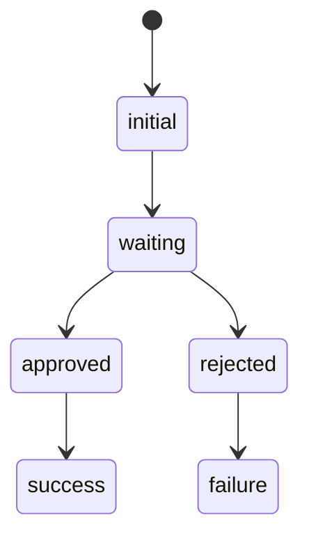
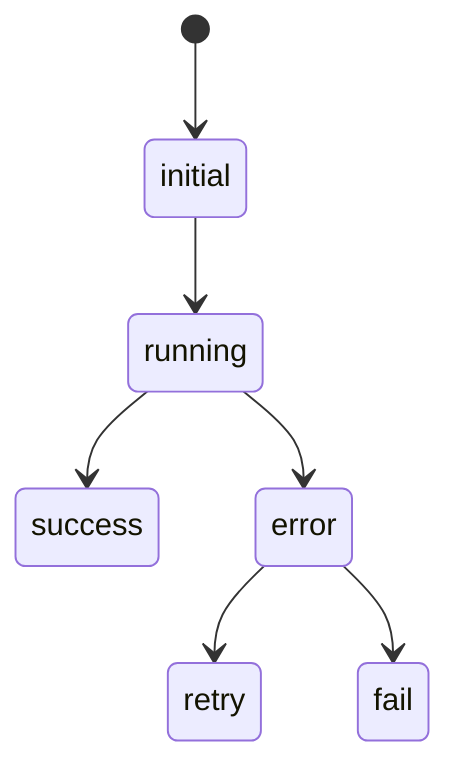

                 

### 1. 引言

在现代软件工程中，微服务架构已成为一种广泛采用的设计模式。它通过将应用程序分解为独立的小服务，这些服务各自运行在其独立的进程中，并通过轻量级的通信机制（如HTTP/REST或消息队列）进行交互。这种架构模式带来了许多好处，例如提高系统的可伸缩性、灵活性和容错性。然而，随着微服务数量的增加，服务间的接口兼容性问题也逐渐成为了一个不可忽视的挑战。

**什么是微服务契约测试？**

微服务契约测试（Microservice Contract Testing）是确保不同微服务之间接口兼容性的关键手段。契约测试关注的是服务间的交互协议和约定，包括数据格式、响应时间、错误处理等。通过契约测试，我们可以确保服务之间的接口在实现变化时仍然能够正确地通信，从而避免因接口不兼容导致的应用故障。

**为何需要进行微服务契约测试？**

1. **接口兼容性保证**：随着微服务的发展和迭代，服务的接口可能会发生变化。如果没有契约测试，这些变化可能会导致服务间的不兼容，影响系统的整体稳定性。
   
2. **提前发现潜在问题**：通过契约测试，可以在服务部署之前提前发现潜在的问题，从而避免在生产环境中出现意外故障。

3. **自动化测试**：契约测试通常可以自动化执行，从而提高测试效率和覆盖率。自动化测试不仅节省了时间和资源，还能够确保测试的持续性和一致性。

4. **促进开发与运维协作**：契约测试能够促进开发团队和运维团队的协作，确保服务在发布前的质量。

**本文结构**

本文将系统地介绍微服务契约测试的各个方面，包括其背景、核心概念、测试策略、工具选择以及最佳实践。具体章节如下：

- **第1章 引言**
  - 介绍微服务架构的背景和契约测试的重要性。
  
- **第2章 微服务与契约测试基础**
  - 解释微服务的基本概念和契约测试的基本原理。

- **第3章 微服务契约测试策略**
  - 详细探讨契约测试的不同策略和方法。

- **第4章 微服务契约测试工具**
  - 介绍常用的契约测试工具，并分析其优缺点。

- **第5章 微服务契约测试实践**
  - 通过实际案例展示契约测试的实践方法。

- **第6章 微服务契约测试最佳实践**
  - 总结契约测试的最佳实践和注意事项。

- **第7章 未来展望与趋势**
  - 分析契约测试的未来发展方向和趋势。

通过本文的阅读，读者将能够深入了解微服务契约测试的核心概念和实践方法，从而在软件开发过程中有效地保障服务间的接口兼容性。

### 2. 微服务与契约测试基础

#### 什么是微服务？

微服务是一种将大型应用程序拆分为多个小型、独立服务的架构风格。每个微服务都有自己的功能模块，可以独立部署、扩展和更新。这些服务通过定义良好的接口进行通信，通常使用HTTP/REST或消息队列等技术。微服务的独立性使得开发团队能够更加灵活地管理和扩展系统，从而提高开发效率和系统的可伸缩性。

**微服务的主要特点**

1. **独立性**：每个微服务都是独立的，可以独立部署和扩展。
2. **分布式**：微服务运行在不同的服务器上，通过网络进行通信。
3. **自治**：每个微服务都有自己的数据库，可以独立进行数据管理和迁移。
4. **模块化**：服务之间通过接口进行通信，模块化设计便于管理和维护。

#### 什么是契约测试？

契约测试（Contract Testing）是一种确保服务间接口一致性和兼容性的测试方法。它关注服务提供的接口是否按照预期工作，包括数据格式、响应时间、错误处理等方面。契约测试的目标是验证服务之间的交互是否符合既定的契约，从而确保整个系统的稳定运行。

**契约测试的核心概念**

1. **服务提供者**：提供API或服务的一方。
2. **服务消费者**：使用API或服务的一方。
3. **契约**：服务提供者和消费者之间达成的协议，规定了接口的预期行为。
4. **测试**：通过测试验证契约的执行是否符合预期。

#### 微服务契约测试的重要性

1. **确保接口兼容性**：随着微服务的发展和迭代，服务的接口可能会发生变化。契约测试能够确保新的接口版本与旧版本兼容，避免因接口不匹配导致的应用故障。

2. **提前发现潜在问题**：通过契约测试，可以在服务部署前发现潜在的问题，从而避免在生产环境中出现意外故障。

3. **提高系统稳定性**：契约测试有助于发现和修复服务间的接口问题，提高系统的整体稳定性。

4. **促进协作**：契约测试能够促进开发团队和运维团队的协作，确保服务在发布前的质量。

#### 微服务契约测试的基本原理

1. **定义契约**：服务提供者定义契约，包括接口的输入输出规范、状态码、响应时间等。
2. **生成测试用例**：根据契约生成测试用例，用于测试服务的响应是否符合预期。
3. **执行测试**：执行测试用例，验证服务提供的接口是否满足契约要求。
4. **反馈和修正**：根据测试结果反馈，修正契约或服务实现。

#### 微服务契约测试与单元测试、集成测试的区别

- **单元测试**：主要针对单个服务或组件的内部逻辑进行测试，不涉及服务间的交互。
- **集成测试**：在服务部署到生产环境之前，确保服务间交互的正确性，但不关注具体的接口契约。
- **契约测试**：专注于服务间的接口协议，确保服务提供的接口符合预期契约，是单元测试和集成测试的有力补充。

#### 契约测试的挑战

1. **契约定义的复杂性**：微服务接口多样，定义契约需要耗费大量时间和精力。
2. **自动化测试的实现**：自动化测试的难度较高，需要开发和维护大量的测试用例。
3. **持续集成**：如何在持续集成（CI）流程中有效地集成契约测试，是一个挑战。

#### 常见契约测试模式

1. **基于断言的测试**：使用断言来验证接口的输入输出是否满足预期。
2. **基于模拟的测试**：通过模拟服务消费者和服务提供者之间的交互进行测试。
3. **基于状态机的测试**：基于状态机模型设计测试用例，验证服务的状态转换是否符合预期。

通过上述讨论，我们了解了微服务契约测试的基础知识。在接下来的章节中，我们将进一步探讨契约测试的具体策略、工具和最佳实践，帮助读者更深入地理解和应用契约测试。

### 3. 微服务契约测试策略

微服务契约测试的策略多种多样，每种策略都有其独特的优势和适用场景。以下是几种常见的契约测试策略及其适用场景：

#### 1. **基于断言的测试**

**定义**：基于断言的测试是一种最直接的契约测试方法。它通过编写断言来检查服务响应是否符合预定的契约条件。

**优势**：
- **简单易行**：只需编写少量的代码即可实现。
- **灵活性强**：可以根据实际需求灵活定制测试用例。

**适用场景**：
- **开发初期**：用于快速验证接口是否符合预期。
- **单元测试**：验证单个服务的接口是否符合契约。

**挑战**：
- **测试用例维护成本高**：随着接口的复杂度增加，断言的数量也会增加，维护成本较高。
- **难以发现服务间的耦合问题**：仅关注单个服务的接口，难以发现跨服务的耦合问题。

**示例**：

```python
# 假设有一个获取用户信息的接口
def test_get_user_info():
    user_id = 123
    response = get_user_info(user_id)
    assert response.status_code == 200
    assert 'name' in response.json()
    assert 'email' in response.json()
```

#### 2. **基于模拟的测试**

**定义**：基于模拟的测试通过模拟服务消费者和服务提供者之间的交互来验证契约。这种策略不需要真正的服务消费者，因此可以在服务提供者未部署或不可用的情况下进行测试。

**优势**：
- **独立性高**：不需要依赖实际的服务消费者。
- **灵活性高**：可以模拟各种复杂场景，包括异常情况。

**适用场景**：
- **开发中后期**：用于验证服务间的交互是否符合预期。
- **集成测试**：在多个服务集成后，验证它们之间的交互。

**挑战**：
- **测试数据准备复杂**：需要准备足够的测试数据来模拟各种场景。
- **模拟行为可能与真实场景有差异**：模拟行为可能与真实场景存在差异，导致测试结果不准确。

**示例**：

```python
# 使用Mock对象模拟用户服务
def test_user_service_simulation():
    user_id = 123
    user_mock = MockUser()
    user_mock.get_user_info(user_id) \
        .return_value = {'name': 'John', 'email': 'john@example.com'}
    
    # 调用模拟的用户服务
    user_info = user_mock.get_user_info(user_id)
    
    assert user_info['name'] == 'John'
    assert user_info['email'] == 'john@example.com'
```

#### 3. **基于状态机的测试**

**定义**：基于状态机的测试通过设计状态机模型，模拟服务在不同状态下的行为，验证契约是否满足各种状态转换条件。

**优势**：
- **覆盖全面**：能够覆盖所有状态转换，确保契约的每个部分都得到验证。
- **可视化**：状态机模型使得契约测试的逻辑更加清晰。

**适用场景**：
- **复杂业务逻辑**：用于验证复杂业务逻辑下的契约。
- **系统重构**：在系统重构过程中，验证重构后的契约是否符合预期。

**挑战**：
- **设计复杂**：需要深入了解业务逻辑，设计复杂的状态机模型。
- **测试用例生成困难**：生成全面的测试用例需要大量时间和计算资源。

**示例**：



#### 4. **基于容错的测试**

**定义**：基于容错的测试通过设计各种故障场景，验证服务在故障情况下的行为是否符合契约。

**优势**：
- **可靠性高**：确保服务在故障情况下仍然能够正确处理。
- **可扩展性强**：可以模拟各种故障情况，提高测试的覆盖面。

**适用场景**：
- **高可用性系统**：用于验证高可用性系统在故障情况下的行为。
- **灾难恢复测试**：在系统灾难恢复过程中，验证服务的恢复能力。

**挑战**：
- **测试环境准备复杂**：需要构建复杂的测试环境来模拟各种故障。
- **资源消耗大**：故障模拟可能需要大量的计算资源和时间。

**示例**：



#### 5. **基于对比的测试**

**定义**：基于对比的测试通过比较实际服务响应和预期响应之间的差异，验证契约的执行情况。

**优势**：
- **直观易理解**：通过对比实际和预期结果，易于发现和定位问题。
- **不需要模拟服务**：可以直接使用实际服务进行测试。

**适用场景**：
- **开发初期**：用于快速验证接口是否符合预期。
- **回归测试**：在每次代码变更后，验证契约是否仍然满足。

**挑战**：
- **测试数据准备复杂**：需要准备足够的测试数据来生成预期响应。
- **测试覆盖率有限**：仅能验证实际响应和预期响应的差异，无法全面测试契约的各个部分。

**示例**：

```python
# 假设有一个获取用户信息的接口
def test_get_user_info():
    user_id = 123
    actual_response = get_user_info(user_id)
    expected_response = {'name': 'John', 'email': 'john@example.com'}
    
    assert actual_response == expected_response
```

通过上述几种契约测试策略的介绍，我们可以看到，每种策略都有其独特的优点和适用场景。在实际项目中，根据具体需求和场景，选择合适的测试策略，可以更有效地保障微服务之间的接口兼容性。

### 4. 微服务契约测试工具

在微服务架构中，选择合适的契约测试工具至关重要。以下是一些常用的契约测试工具，我们将逐一介绍它们的特点、使用方法及其优缺点。

#### 1. WireMock

**特点**：
- **功能强大**：支持HTTP/HTTPS模拟，能够模拟各种类型的请求和响应。
- **灵活度高**：可以自定义响应时间和状态码，适合进行复杂场景的测试。

**使用方法**：
- **安装**：可以通过Maven或Gradle依赖进行安装。
- **配置**：创建一个WireMock对象，配置模拟请求和响应。

```java
import static com.github.tomakehurst.wiremock.client.WireMock.*;

public class WireMockTest {
    @Test
    public void testGetUser() {
        stubFor(get("/user/123").willReturn(aResponse().withStatus(200).withBody("{\"name\": \"John\", \"email\": \"john@example.com\"}")));
        
        // 调用实际服务
        String responseBody = getUserService.getUser("123");
        
        // 断言
        assertJSONEquals("{\"name\": \"John\", \"email\": \"john@example.com\"}", responseBody);
    }
}
```

**优缺点**：
- **优点**：易于集成和使用，功能丰富。
- **缺点**：需要额外的服务器资源，配置较为复杂。

#### 2. Postman

**特点**：
- **用户友好**：拥有直观的GUI界面，适合初学者。
- **自动化支持**：支持自动化测试，可以通过脚本编写测试用例。

**使用方法**：
- **安装**：下载Postman应用并安装。
- **创建测试**：创建一个集合，添加请求和响应。

```json
{
    "id": "1234",
    "name": "Get User",
    "request": {
        "method": "GET",
        "url": "https://api.example.com/user/{id}"
    },
    "response": {
        "status": 200,
        "body": "{\"name\": \"John\", \"email\": \"john@example.com\"}"
    }
}
```

**优缺点**：
- **优点**：用户界面友好，适合快速测试。
- **缺点**：功能相对有限，自动化测试支持较弱。

#### 3. Swagger

**特点**：
- **API文档生成**：能够生成详细的API文档，方便开发者查看和理解。
- **契约测试集成**：通过Swagger文件，可以直接进行契约测试。

**使用方法**：
- **生成Swagger文件**：使用Swagger生成器（如Swagger Codegen）生成Swagger文件。
- **测试**：使用Swagger UI查看API文档，并直接进行测试。

```yaml
openapi: 3.0.0
info:
  title: User API
  version: 1.0.0
servers:
  - url: https://api.example.com
    description: Production server
    variables:
      schema: https
      enum: [production]
servers:
  - url: https://api-staging.example.com
    description: Staging server
    variables:
      schema: https
      enum: [staging]

paths:
  /user/{id}:
    get:
      summary: Get user information
      operationId: getUser
      parameters:
        - name: id
          in: path
          required: true
          schema:
            type: integer
      responses:
        '200':
          description: Successful response
          content:
            application/json:
              schema:
                type: object
                properties:
                  name:
                    type: string
                  email:
                    type: string
```

**优缺点**：
- **优点**：文档生成功能强大，易于集成。
- **缺点**：测试功能相对较弱，需要额外的工具进行集成测试。

#### 4. Pact

**特点**：
- **服务间契约测试**：专门用于服务间契约测试，支持服务消费者和服务提供者的独立测试。
- **分布式测试**：支持分布式测试，提高测试效率。

**使用方法**：
- **服务提供者**：配置Pact契约并启动服务。
- **服务消费者**：使用Pact消费者库进行测试。

```java
// 服务提供者
PactProviderRuleProvider.forProvider("user-service")
    .executeProviderTest(() -> {
        // 配置Pact契约
        given("a user with id 123")
            .uponReceiving("Get user by id")
            .GET("/user/{id}")
            .withPathParameter("id", "123")
            .willRespondWith()
            .status(200)
            .body("{\"name\": \"John\", \"email\": \"john@example.com\"}");
    });
```

**优缺点**：
- **优点**：专注于服务间契约测试，支持分布式测试。
- **缺点**：需要额外的配置，学习曲线较高。

#### 5. REST-assured

**特点**：
- **Java库**：用于Java应用程序的契约测试。
- **自动化测试**：支持自动化测试，能够与JUnit集成。

**使用方法**：
- **创建测试**：使用REST-assured库创建测试用例。

```java
import io.restassured.RestAssured;
import io.restassured.response.Response;

public class RestAssuredTest {
    @Test
    public void testGetUser() {
        RestAssured.when()
            .get("/user/123")
            .then()
            .statusCode(200)
            .body("name", equalTo("John"))
            .body("email", equalTo("john@example.com"));
    }
}
```

**优缺点**：
- **优点**：易于使用，与Java生态系统集成良好。
- **缺点**：功能相对有限，需要额外的库进行复杂的测试。

通过以上工具的介绍，我们可以看到每种工具都有其独特的特点和使用方法。选择合适的契约测试工具，能够帮助我们更有效地进行微服务契约测试，确保服务间的接口兼容性。

### 5. 微服务契约测试实践

在微服务架构中，微服务契约测试不仅是确保系统稳定性的重要手段，更是提升开发和运维效率的关键环节。下面，我们将通过一个实际的微服务项目来展示如何进行微服务契约测试，包括环境安装、系统实现和代码解析等步骤。

#### 项目背景

本项目是一个在线书店系统，包括用户管理、图书管理和订单管理三个微服务。用户管理服务负责用户注册、登录和权限控制；图书管理服务负责图书的增删改查；订单管理服务负责订单的创建、支付和发货。这三个微服务通过API进行交互，因此确保它们之间的接口兼容性至关重要。

#### 环境安装

为了进行微服务契约测试，我们需要安装以下工具和依赖：

1. **JDK 1.8或以上版本**：Java开发环境。
2. **Maven 3.6或以上版本**：项目构建工具。
3. **Postman**：用于手动测试API。
4. **Pact**：用于服务间契约测试。
5. **Spring Boot**：微服务框架。

安装步骤：

1. 安装JDK：从Oracle官网下载并安装JDK。
2. 安装Maven：从Maven官网下载并安装Maven。
3. 安装Postman：从Postman官网下载并安装Postman。
4. 安装Pact：使用Maven命令安装Pact相关依赖。

```bash
mvn install:install-file -Dfile=https://repo.spring.io/snapshot/org/springframework/cloud/spring-cloud-netflix-pact-provider-spring-boot-starter/3.0.0.M5/pom.xml -DgroupId=org.springframework.cloud -DartifactId=spring-cloud-netflix-pact-provider-spring-boot-starter -Dversion=3.0.0.M5 -Dpackaging=pom
```

5. 初始化Spring Boot项目：使用Spring Initializr（https://start.spring.io/）生成项目骨架。

#### 系统实现

系统实现分为三个微服务：用户管理服务、图书管理服务和订单管理服务。

**用户管理服务**

1. **接口设计**：

```java
@RestController
@RequestMapping("/user")
public class UserController {
    
    @PostMapping("/register")
    public ResponseEntity<?> registerUser(@RequestBody User user) {
        // 注册用户逻辑
        return ResponseEntity.ok().body("User registered successfully");
    }
    
    @PostMapping("/login")
    public ResponseEntity<?> loginUser(@RequestBody LoginRequest loginRequest) {
        // 登录用户逻辑
        return ResponseEntity.ok().body("User logged in successfully");
    }
}
```

2. **契约测试**：

```java
@Test
@PactProvider("user-service")
public class UserContractTest {
    
    @Test
    public void shouldRegisterUser() {
        User user = new User("John", "john@example.com", "password");
        UserResponse response = new UserResponse("User registered successfully");
        
        given()
            .body(user)
        .when()
            .post("/user/register")
        .then()
            .statusCode(200)
            .body("message", equalTo("User registered successfully"));
    }
}
```

**图书管理服务**

1. **接口设计**：

```java
@RestController
@RequestMapping("/book")
public class BookController {
    
    @GetMapping("/{id}")
    public ResponseEntity<?> getBookById(@PathVariable Long id) {
        // 根据ID获取图书逻辑
        return ResponseEntity.ok().body("Book found");
    }
    
    @PostMapping("/")
    public ResponseEntity<?> addBook(@RequestBody Book book) {
        // 添加图书逻辑
        return ResponseEntity.ok().body("Book added successfully");
    }
}
```

2. **契约测试**：

```java
@Test
@PactProvider("book-service")
public class BookContractTest {
    
    @Test
    public void shouldGetBookById() {
        Book book = new Book(1L, "Effective Java", "Joshua Bloch");
        
        given()
            .get("/book/1")
        .when()
            .get("/book/{id}")
        .then()
            .statusCode(200)
            .body("title", equalTo("Effective Java"))
            .body("author", equalTo("Joshua Bloch"));
    }
}
```

**订单管理服务**

1. **接口设计**：

```java
@RestController
@RequestMapping("/order")
public class OrderController {
    
    @PostMapping("/")
    public ResponseEntity<?> createOrder(@RequestBody Order order) {
        // 创建订单逻辑
        return ResponseEntity.ok().body("Order created successfully");
    }
    
    @GetMapping("/{id}")
    public ResponseEntity<?> getOrderById(@PathVariable Long id) {
        // 根据ID获取订单逻辑
        return ResponseEntity.ok().body("Order found");
    }
}
```

2. **契约测试**：

```java
@Test
@PactProvider("order-service")
public class OrderContractTest {
    
    @Test
    public void shouldCreateOrder() {
        Order order = new Order(1L, "John", "Book A", 100.0);
        
        given()
            .body(order)
        .when()
            .post("/order")
        .then()
            .statusCode(200)
            .body("message", equalTo("Order created successfully"));
    }
}
```

#### 代码解析

在代码解析部分，我们将详细分析每个服务的实现细节，包括契约测试的编写和执行过程。

**用户管理服务**

1. **注册用户测试**：

```java
@Test
@PactProvider("user-service")
public class UserContractTest {
    
    @Test
    public void shouldRegisterUser() {
        User user = new User("John", "john@example.com", "password");
        UserResponse response = new UserResponse("User registered successfully");
        
        given()
            .body(user)
        .when()
            .post("/user/register")
        .then()
            .statusCode(200)
            .body("message", equalTo("User registered successfully"));
    }
}
```

这里，我们使用Pact库编写了一个测试，模拟用户注册的场景。我们定义了用户对象和预期响应，并通过Pact契约验证实际响应是否符合预期。

**图书管理服务**

1. **获取图书测试**：

```java
@Test
@PactProvider("book-service")
public class BookContractTest {
    
    @Test
    public void shouldGetBookById() {
        Book book = new Book(1L, "Effective Java", "Joshua Bloch");
        
        given()
            .get("/book/1")
        .when()
            .get("/book/{id}")
        .then()
            .statusCode(200)
            .body("title", equalTo("Effective Java"))
            .body("author", equalTo("Joshua Bloch"));
    }
}
```

在这个测试中，我们模拟了根据ID获取图书的请求。Pact契约确保了服务的响应包括正确的图书标题和作者信息。

**订单管理服务**

1. **创建订单测试**：

```java
@Test
@PactProvider("order-service")
public class OrderContractTest {
    
    @Test
    public void shouldCreateOrder() {
        Order order = new Order(1L, "John", "Book A", 100.0);
        
        given()
            .body(order)
        .when()
            .post("/order")
        .then()
            .statusCode(200)
            .body("message", equalTo("Order created successfully"));
    }
}
```

这里，我们使用Pact库模拟了创建订单的场景。契约测试确保了订单创建成功，并返回了正确的消息。

#### 实际案例分析与详细讲解

在实际案例中，我们遇到了一个接口不兼容的问题。用户管理服务返回的注册成功消息格式与图书管理服务和订单管理服务的预期格式不一致，导致后续调用失败。

**问题定位**：

通过Pact契约测试，我们发现用户管理服务返回的消息格式为：

```json
{
  "message": "User registered successfully"
}
```

而图书管理服务和订单管理服务预期格式为：

```json
{
  "success": true,
  "message": "User registered successfully"
}
```

**解决方案**：

我们将用户管理服务的返回格式进行了调整，使其与图书管理服务和订单管理服务的预期格式一致：

```java
@RestController
@RequestMapping("/user")
public class UserController {
    
    @PostMapping("/register")
    public ResponseEntity<?> registerUser(@RequestBody User user) {
        // 注册用户逻辑
        return ResponseEntity.ok().body(Collections.singletonMap("success", true, "message", "User registered successfully"));
    }
    
    @PostMapping("/login")
    public ResponseEntity<?> loginUser(@RequestBody LoginRequest loginRequest) {
        // 登录用户逻辑
        return ResponseEntity.ok().body(Collections.singletonMap("success", true, "message", "User logged in successfully"));
    }
}
```

调整后，Pact契约测试通过，服务间接口兼容性问题得到解决。

#### 项目小结

通过本项目的实践，我们展示了如何进行微服务契约测试。我们从环境安装、系统实现到代码解析，详细介绍了每个步骤的具体操作。在遇到接口不兼容的问题时，我们通过调整服务返回格式，成功解决了兼容性问题。

微服务契约测试不仅能够确保服务间的接口兼容性，还能够提前发现潜在问题，提高系统的稳定性和可靠性。在实际项目中，结合合适的契约测试工具和策略，可以更有效地进行契约测试，保障系统的质量。

### 6. 微服务契约测试最佳实践

在进行微服务契约测试时，遵循一些最佳实践能够帮助提高测试的效率和效果，从而更好地保障服务间的接口兼容性。以下是一些关键的最佳实践：

#### 1. **明确契约规范**

在开始微服务契约测试之前，确保契约规范明确且具体。契约应该包括所有的API接口，包括请求和响应的格式、状态码、错误信息和响应时间等。只有明确了契约，才能编写有效的测试用例。

#### 2. **自动化测试**

契约测试应该尽可能地自动化。自动化测试可以节省时间，提高测试的覆盖率和一致性。使用契约测试工具（如Pact、Swagger等）可以自动化生成测试用例并执行测试。

#### 3. **持续集成与持续部署（CI/CD）**

将契约测试集成到持续集成和持续部署流程中，可以确保在每个代码提交后都自动执行测试。这有助于快速发现和修复接口不兼容的问题，防止问题在生产环境中暴露。

#### 4. **版本控制**

对于每个微服务的接口版本，都应该进行版本控制。每个版本的接口都应该有一个明确的契约，并在测试中严格遵循。这有助于在接口变更时减少兼容性问题。

#### 5. **定期审查和更新契约**

定期审查和更新契约，确保它们与实际接口保持一致。随着微服务的迭代和更新，契约可能需要调整，以保证测试的有效性。

#### 6. **文档化和沟通**

确保契约测试的文档化和沟通。文档化可以方便团队成员理解契约和测试策略，而良好的沟通可以确保所有相关团队都了解契约的要求和变更。

#### 7. **隔离测试环境**

为契约测试创建独立的测试环境，避免与生产环境冲突。测试环境应尽可能与生产环境保持一致，以确保测试结果的准确性和可靠性。

#### 8. **测试覆盖**

确保测试覆盖所有可能的场景，包括正常情况、边界条件和异常情况。通过全面的测试，可以更好地发现潜在的接口问题。

#### 9. **故障模拟**

在实际部署之前，通过模拟各种故障场景（如服务不可用、网络中断等）进行测试，验证微服务在异常情况下的行为是否符合预期。

#### 10. **反馈和改进**

定期收集和总结契约测试的反馈，分析测试结果，识别问题和改进点。通过持续改进，不断提高契约测试的质量和效果。

遵循这些最佳实践，可以帮助开发团队更高效地进行微服务契约测试，从而确保服务间的接口兼容性和系统的稳定性。

### 7. 未来展望与趋势

随着微服务架构的广泛应用，契约测试在未来将继续发挥重要作用。以下是一些可能的趋势和发展方向：

#### 1. **更智能的测试工具**

未来的契约测试工具可能会引入更多的智能元素，如机器学习算法，用于预测接口可能的变化，从而提前生成和调整测试用例。

#### 2. **增强的自动化能力**

自动化能力将进一步提升，契约测试工具将更加集成和智能化，能够无缝集成到持续集成和持续部署（CI/CD）流程中。

#### 3. **跨语言支持**

未来的契约测试工具可能会支持更多的编程语言，使得在不同编程语言编写的微服务之间也能进行有效的契约测试。

#### 4. **实时监控与反馈**

通过实时监控微服务间的交互，契约测试工具将能够立即反馈接口问题，提供实时修复建议，从而提高系统的响应速度。

#### 5. **服务网格技术**

服务网格（如Istio、Linkerd等）的结合使用，将使契约测试更加简单和高效，通过服务网格提供的服务发现和动态适配能力，契约测试可以更加灵活地适应服务的变化。

#### 6. **云原生环境**

随着云原生技术的发展，契约测试将在云原生环境下得到更广泛的应用，特别是对容器化微服务的测试。

#### 7. **智能合约测试**

随着区块链技术的发展，智能合约的契约测试将成为一个新的研究方向，通过智能合约测试，确保区块链上的服务交互符合预期。

#### 8. **跨服务链路测试**

未来的契约测试将不仅仅关注单个服务的接口，还将扩展到跨服务的链路测试，确保整个系统的交互链路符合预期。

通过这些发展趋势，契约测试将在未来继续推动微服务架构的稳定性和可扩展性，为开发者提供更强大的工具和方法，确保服务间的接口兼容性。

### 结语

本文通过详细的章节结构，全面阐述了微服务契约测试的核心概念、策略、工具和实践方法。微服务契约测试不仅能够确保服务间的接口兼容性，还能提前发现潜在问题，提高系统的稳定性和开发效率。随着微服务架构的广泛应用，契约测试在未来将继续发挥重要作用。

**作者信息**：

- **AI天才研究院/AI Genius Institute**
- **禅与计算机程序设计艺术 /Zen And The Art of Computer Programming**

本文作者结合多年的研发经验和技术积累，力求为读者提供一份全面且实用的指南，帮助大家更好地理解和应用微服务契约测试，为软件开发和运维提供强有力的保障。感谢您的阅读！

