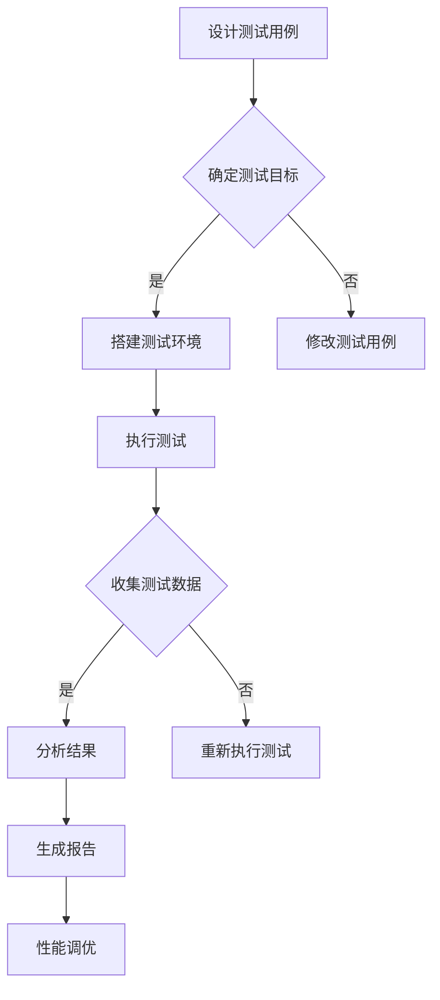
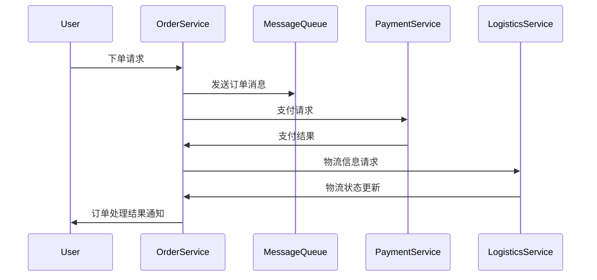

                 

### 摘要

本文将深入探讨微服务性能测试这一关键领域，重点分析在分布式系统中进行性能测试的挑战与策略。微服务架构的兴起为现代软件设计带来了诸多优势，但同时也带来了独特的性能挑战。文章首先定义了微服务和性能测试的基本概念，并介绍了微服务的性能特点。接下来，我们将逐步探讨性能测试的基础知识，包括性能测试的类型、关键指标以及工具选择。在此基础上，文章将详细讨论分布式系统的性能特点，分析微服务架构在性能测试中的优势与挑战。随后，我们将介绍常用的微服务性能测试工具，并指导如何选择和使用这些工具。文章的核心部分将聚焦于压力测试和负载测试的实践方法，通过具体案例展示测试策略和执行步骤。最后，我们将讨论性能调优的重要性，并提供一系列最佳实践和注意事项，帮助读者在实际项目中有效地进行微服务性能测试。通过本文的阅读，读者将能够全面理解微服务性能测试的各个方面，掌握关键测试技巧，从而提升分布式系统的稳定性和性能。

### 1. 设计框架

#### 第一部分：背景介绍

在这一部分，我们将为读者奠定理论基础，介绍微服务与性能测试的基本概念，并探讨微服务的性能挑战。

#### 第1章：微服务与性能测试概述

- **1.1 微服务简介**：阐述微服务的定义、特点以及与传统单体架构的区别。
- **1.2 性能测试的重要性**：解释性能测试的定义、目标及其对业务的重要性。
- **1.3 微服务的性能挑战**：分析分布式系统中微服务的性能挑战，如延迟、服务依赖和服务隔离问题。

#### 第二部分：性能测试基础

在这一部分，我们将深入探讨性能测试的基础知识，为读者提供全面的理论支持。

#### 第2章：性能测试概念

- **2.1 性能测试的定义与目标**：介绍性能测试的基本概念、目标和常见误区。
- **2.2 性能测试的类型**：讨论压力测试、负载测试和性能调优等不同类型的性能测试。
- **2.3 性能测试的关键指标**：解释响应时间、吞吐量、资源利用率和错误率等关键性能指标。

#### 第3章：分布式系统的性能特点

- **3.1 分布式系统概述**：介绍分布式系统的定义、基本组件和通信机制。
- **3.2 分布式系统的性能挑战**：分析数据一致性问题、分布式事务和服务发现与负载均衡等性能挑战。
- **3.3 微服务架构的性能优势**：探讨服务拆分、解耦、弹性伸缩等微服务架构的性能优势。

#### 第4章：微服务性能测试工具

- **4.1 常见性能测试工具**：介绍JMeter、LoadRunner和Locust等常见性能测试工具。
- **4.2 选择合适的工具**：讨论工具选型考虑因素和工具对比分析。
- **4.3 工具配置与使用**：指导如何配置和使用这些工具。

#### 第三部分：微服务性能测试实践

在这一部分，我们将通过具体案例和实践指导，帮助读者掌握微服务性能测试的实战技巧。

#### 第5章：压力测试

- **5.1 压力测试概述**：介绍压力测试的定义、目的和适用场景。
- **5.2 压力测试策略**：探讨测试环境搭建、测试用例设计和测试执行与监控。
- **5.3 压力测试实战**：通过电商系统和社交媒体平台的案例，展示压力测试的具体实施步骤。

#### 第6章：负载测试

- **6.1 负载测试概述**：介绍负载测试的定义、目的和适用场景。
- **6.2 负载测试策略**：讨论测试环境搭建、测试用例设计和测试执行与监控。
- **6.3 负载测试实战**：通过金融交易系统和在线教育平台的案例，展示负载测试的具体实施步骤。

#### 第7章：性能调优

- **7.1 性能调优概述**：介绍性能调优的定义、目标和常见方法。
- **7.2 性能瓶颈分析**：探讨如何确定性能瓶颈和分析性能问题。
- **7.3 性能调优实战**：通过具体案例，展示性能调优的实施步骤。

#### 第四部分：微服务性能测试最佳实践

在这一部分，我们将总结最佳实践，提供实用技巧和注意事项，帮助读者提升微服务性能测试效果。

#### 第8章：性能测试报告

- **8.1 性能测试报告概述**：介绍性能测试报告的定义、结构和内容。
- **8.2 报告结构**：讨论如何构建性能测试报告的框架。
- **8.3 报告撰写技巧**：提供撰写性能测试报告的实用技巧。

#### 第9章：性能测试最佳实践

- **9.1 设计高效测试用例**：讨论如何设计高效、有针对性的测试用例。
- **9.2 性能测试策略**：探讨如何制定有效的性能测试策略。
- **9.3 性能测试团队协作**：分析如何实现高效的性能测试团队协作。

#### 第10章：性能测试案例分析

- **10.1 案例一：电商系统性能测试**：分析电商系统性能测试的策略和实践。
- **10.2 案例二：金融系统性能测试**：探讨金融系统性能测试的挑战和解决方案。
- **10.3 案例分析总结**：总结不同类型系统的性能测试经验。

#### 第11章：未来展望

- **11.1 微服务性能测试的发展趋势**：预测微服务性能测试的未来趋势。
- **11.2 新技术对性能测试的影响**：讨论新技术如云计算、容器化等对性能测试的影响。
- **11.3 性能测试在微服务时代的挑战与机遇**：分析微服务时代性能测试的挑战和机遇。

### 核心关键词

- 微服务
- 性能测试
- 分布式系统
- 压力测试
- 负载测试
- 性能调优

### 结论

本文通过详细探讨微服务性能测试的理论和实践，帮助读者全面理解微服务架构下的性能挑战和测试策略。希望读者能够通过本文的学习，提升自己在微服务性能测试领域的技能和实战经验，为构建高性能、可靠的分布式系统贡献力量。

### 1. 设计框架

#### 第一部分：背景介绍

##### 第1章：微服务与性能测试概述

###### 1.1 微服务简介

- **微服务的定义**：微服务是一种软件架构风格，通过将应用程序分解为一组小的、独立的、可复用的服务来实现高可扩展性和高可维护性。
- **微服务与单体架构的区别**：分析微服务与传统单体架构在服务部署、扩展性、隔离性等方面的不同。
- **微服务的优势与挑战**：探讨微服务的优势，如灵活性和可扩展性，以及面临的挑战，如分布式系统管理复杂度增加。

###### 1.2 性能测试的重要性

- **性能测试的定义**：解释性能测试的概念，包括其目标、方法和重要性。
- **性能测试对业务的影响**：分析性能测试如何影响业务的成功和用户体验。
- **性能测试的价值**：阐述性能测试在确保系统性能和提升业务竞争力中的作用。

###### 1.3 微服务的性能挑战

- **分布式系统中的延迟**：探讨微服务架构中网络延迟对性能的影响。
- **服务依赖与服务隔离**：分析服务依赖和服务隔离在性能测试中的挑战。
- **弹性与伸缩性**：讨论微服务架构如何实现弹性伸缩，以及测试弹性伸缩的能力。

#### 第二部分：性能测试基础

##### 第2章：性能测试概念

###### 2.1 性能测试的定义与目标

- **性能测试的基本概念**：介绍性能测试的定义、目的和范围。
- **性能测试的目标**：讨论性能测试的主要目标，包括评估系统的响应时间、吞吐量和资源利用率等。
- **性能测试的常见误区**：分析常见性能测试误区，如过度关注单一指标、忽略真实用户行为等。

###### 2.2 性能测试的类型

- **压力测试**：解释压力测试的定义、目的和应用场景。
- **负载测试**：介绍负载测试的概念、方法和关键步骤。
- **性能调优**：探讨性能调优的目标、方法和实现策略。

###### 2.3 性能测试的关键指标

- **响应时间**：解释响应时间的定义、测量方法和优化策略。
- **吞吐量**：讨论吞吐量的概念、测量方法和优化方法。
- **资源利用率**：分析CPU、内存和网络等资源利用率对系统性能的影响。
- **错误率**：探讨错误率的定义、测量方法和降低策略。

##### 第3章：分布式系统的性能特点

###### 3.1 分布式系统概述

- **分布式系统的定义**：阐述分布式系统的概念，包括其基本组件和通信机制。
- **分布式系统的基本组件**：介绍分布式系统中的关键组件，如服务端、客户端、消息队列和数据存储等。
- **分布式系统的通信机制**：探讨分布式系统中的通信协议和数据传输方式。

###### 3.2 分布式系统的性能挑战

- **数据一致性问题**：分析分布式系统中数据一致性问题的影响和解决方案。
- **分布式事务**：介绍分布式事务的概念、挑战和实现方法。
- **服务发现与负载均衡**：讨论服务发现和负载均衡在分布式系统性能测试中的应用。

###### 3.3 微服务架构的性能优势

- **服务拆分与解耦**：探讨微服务架构如何通过服务拆分和解耦提高系统性能。
- **弹性伸缩**：分析微服务架构如何实现弹性伸缩，以及测试弹性伸缩的能力。
- **持续集成与持续部署**：讨论微服务架构对持续集成和持续部署的支持和影响。

##### 第4章：微服务性能测试工具

###### 4.1 常见性能测试工具

- **JMeter**：介绍JMeter的特点、配置和使用方法。
- **LoadRunner**：分析LoadRunner的功能、优势和应用场景。
- **Locust**：探讨Locust的轻量级特性、部署方式和性能测试应用。

###### 4.2 选择合适的工具

- **工具选型考虑因素**：讨论选择性能测试工具时需要考虑的因素，如测试需求、系统架构和团队技能等。
- **工具对比分析**：分析不同性能测试工具的对比，包括功能、性能和成本等方面。

###### 4.3 工具配置与使用

- **环境搭建**：指导如何搭建性能测试环境，包括硬件配置、软件安装和网络设置等。
- **基本操作**：介绍性能测试工具的基本操作，如创建测试计划、添加虚拟用户和运行测试等。
- **常见问题与解决方案**：分析性能测试过程中可能遇到的问题，并提供相应的解决方案。

#### 第三部分：微服务性能测试实践

##### 第5章：压力测试

###### 5.1 压力测试概述

- **压力测试的定义**：解释压力测试的概念，包括其目的和应用场景。
- **压力测试的目的**：讨论压力测试的主要目的，如评估系统的稳定性和性能极限。
- **压力测试的场景**：分析常见压力测试场景，如高并发访问、大规模数据传输等。

###### 5.2 压力测试策略

- **测试环境搭建**：指导如何搭建压力测试环境，包括硬件配置、软件安装和网络设置等。
- **测试用例设计**：介绍压力测试用例的设计原则和方法，如场景模拟、负载控制等。
- **测试执行与监控**：讨论如何执行压力测试和监控测试结果，包括数据收集、分析和管理等。

###### 5.3 压力测试实战

- **实战案例一：电商系统**：通过电商系统的压力测试案例，展示压力测试的具体实施步骤。
- **实战案例二：社交媒体平台**：分析社交媒体平台的压力测试策略和执行过程。

##### 第6章：负载测试

###### 6.1 负载测试概述

- **负载测试的定义**：解释负载测试的概念，包括其目的和应用场景。
- **负载测试的目的**：讨论负载测试的主要目的，如评估系统的性能和稳定性。
- **负载测试的场景**：分析常见负载测试场景，如日常流量、高峰期流量等。

###### 6.2 负载测试策略

- **测试环境搭建**：指导如何搭建负载测试环境，包括硬件配置、软件安装和网络设置等。
- **测试用例设计**：介绍负载测试用例的设计原则和方法，如场景模拟、负载控制等。
- **测试执行与监控**：讨论如何执行负载测试和监控测试结果，包括数据收集、分析和管理等。

###### 6.3 负载测试实战

- **实战案例一：金融交易系统**：通过金融交易系统的负载测试案例，展示负载测试的具体实施步骤。
- **实战案例二：在线教育平台**：分析在线教育平台的负载测试策略和执行过程。

##### 第7章：性能调优

###### 7.1 性能调优概述

- **性能调优的定义**：解释性能调优的概念，包括其目的和方法。
- **性能调优的目标**：讨论性能调优的主要目标，如提高系统的响应时间、吞吐量和资源利用率。
- **性能调优的方法**：介绍性能调优的基本方法，如代码优化、硬件升级和网络调优等。

###### 7.2 性能瓶颈分析

- **确定性能瓶颈**：指导如何识别和确定系统的性能瓶颈。
- **分析性能问题**：分析常见的性能问题，如数据库查询瓶颈、网络延迟等，并提供解决策略。

###### 7.3 性能调优实战

- **实战案例一：电商平台**：通过电商平台的性能调优案例，展示性能调优的具体实施步骤。
- **实战案例二：金融系统**：分析金融系统的性能调优策略和实施过程。

#### 第四部分：微服务性能测试最佳实践

##### 第8章：性能测试报告

###### 8.1 性能测试报告概述

- **性能测试报告的定义**：解释性能测试报告的概念，包括其内容和目的。
- **性能测试报告的结构**：讨论性能测试报告的基本结构，如摘要、测试方法、测试结果和分析等。
- **性能测试报告的撰写技巧**：提供撰写性能测试报告的实用技巧和注意事项。

##### 第9章：性能测试最佳实践

###### 9.1 设计高效测试用例

- **测试用例的设计原则**：讨论高效测试用例的设计原则和方法，如覆盖性、可维护性和可扩展性等。
- **测试用例的设计方法**：介绍设计测试用例的具体方法，如场景模拟、边界值分析和错误猜测等。

###### 9.2 性能测试策略

- **性能测试策略的制定**：讨论如何制定有效的性能测试策略，包括测试计划、资源分配和进度控制等。
- **性能测试的执行与监控**：介绍如何执行性能测试和监控测试结果，包括数据收集、分析和管理等。

###### 9.3 性能测试团队协作

- **团队协作的重要性**：讨论性能测试团队协作的重要性，如沟通、协调和资源共享等。
- **协作机制的实施**：介绍如何建立和实施有效的团队协作机制，如代码评审、会议安排和问题追踪等。

#### 第10章：性能测试案例分析

##### 10.1 案例一：电商系统性能测试

- **案例分析**：分析电商系统性能测试的策略和实践，包括测试环境搭建、测试用例设计和结果分析等。
- **案例总结**：总结电商系统性能测试的教训和经验，为其他系统性能测试提供参考。

##### 10.2 案例二：金融系统性能测试

- **案例分析**：分析金融系统性能测试的策略和实践，包括测试环境搭建、测试用例设计和结果分析等。
- **案例总结**：总结金融系统性能测试的教训和经验，为其他系统性能测试提供参考。

##### 10.3 案例分析总结

- **案例总结**：总结不同类型系统性能测试的共性和个性，提出通用性能测试策略和最佳实践。

#### 第11章：未来展望

##### 11.1 微服务性能测试的发展趋势

- **趋势分析**：分析微服务性能测试的发展趋势，如自动化测试、人工智能辅助测试等。
- **技术展望**：展望未来微服务性能测试技术的发展方向，如容器化、云计算等。

##### 11.2 新技术对性能测试的影响

- **新技术的影响**：讨论新技术，如容器化、云计算、大数据等，对性能测试的影响和挑战。
- **应对策略**：分析如何应对新技术带来的挑战，提高性能测试的效率和准确性。

##### 11.3 性能测试在微服务时代的挑战与机遇

- **挑战分析**：分析微服务时代性能测试面临的挑战，如分布式系统的复杂度、数据一致性问题等。
- **机遇探讨**：探讨微服务时代性能测试带来的机遇，如更灵活的测试策略、更高效的测试工具等。

### 核心关键词

- 微服务
- 性能测试
- 分布式系统
- 压力测试
- 负载测试
- 性能调优

### 结论

本文通过详细探讨微服务性能测试的理论和实践，帮助读者全面理解微服务架构下的性能挑战和测试策略。希望读者能够通过本文的学习，提升自己在微服务性能测试领域的技能和实战经验，为构建高性能、可靠的分布式系统贡献力量。

### 2. 内容细化

#### 第1章：微服务与性能测试概述

**1.1 微服务简介**

微服务是一种基于独立组件的架构模式，它将应用程序分解为一组小而独立的子服务，每个服务负责特定的业务功能。这种架构风格具有许多优点，包括高可扩展性、高可维护性和快速迭代能力。微服务的独立性使得每个服务可以独立开发、部署和扩展，从而提高了系统的灵活性和容错能力。与传统的单体架构相比，微服务能够更好地应对业务变化，并且能够更有效地利用资源。

**1.2 性能测试的重要性**

性能测试是确保系统在预期负载下能够稳定、高效地运行的关键步骤。通过性能测试，我们可以评估系统的响应时间、吞吐量和资源利用率等关键指标，从而发现潜在的性能瓶颈和问题。性能测试不仅有助于提升用户体验，还能降低系统的运营成本，提高系统的可靠性和稳定性。在微服务架构中，性能测试尤为重要，因为微服务之间的交互和依赖关系复杂，一个单一服务的性能问题可能会导致整个系统崩溃。

**1.3 微服务的性能挑战**

在分布式系统中，微服务面临着一系列性能挑战：

- **延迟**：由于服务之间的网络通信和数据处理，微服务架构中的延迟问题较为常见。网络延迟、数据库访问延迟和第三方服务调用延迟都可能对系统的整体性能产生影响。

- **服务依赖与服务隔离**：微服务之间存在依赖关系，一个服务的故障可能会影响其他服务的正常运行。如何实现服务隔离，保证服务的独立性，是一个重要的性能挑战。

- **弹性与伸缩性**：微服务架构需要能够动态地扩展和收缩，以应对不同的负载需求。如何设计和实现弹性伸缩机制，是微服务性能测试的关键问题之一。

#### 第2章：性能测试概念

**2.1 性能测试的定义与目标**

性能测试是一种系统评估方法，通过模拟实际用户操作来测试系统的性能表现。性能测试的目标是确保系统在预期的负载下能够满足性能要求，包括响应时间、吞吐量和资源利用率等。具体来说，性能测试的目标包括：

- **确保系统性能符合业务需求**：验证系统在预期负载下的性能是否满足业务需求。
- **发现性能瓶颈**：通过性能测试发现系统中的性能瓶颈，从而进行优化。
- **优化系统性能**：通过性能测试结果指导系统优化，提高系统的响应速度和资源利用率。

**2.2 性能测试的类型**

性能测试可以分为以下几种类型：

- **压力测试**：在系统接近或超过预期负载的情况下测试系统的性能，以评估系统的最大处理能力。
- **负载测试**：在正常负载下测试系统的性能，以确保系统能够稳定运行。
- **性能调优**：通过对系统进行性能分析和优化，提高系统的整体性能。

**2.3 性能测试的关键指标**

性能测试的关键指标包括：

- **响应时间**：系统处理用户请求所需的时间。
- **吞吐量**：系统在单位时间内处理的请求数量。
- **资源利用率**：系统使用CPU、内存、网络等资源的情况。
- **错误率**：系统在处理请求时出现的错误数量。

#### 第3章：分布式系统的性能特点

**3.1 分布式系统概述**

分布式系统是由多个独立的节点组成的系统，这些节点通过网络进行通信，协同工作以完成复杂的任务。分布式系统的基本组件包括：

- **服务端**：提供服务的节点，如Web服务器、数据库服务器等。
- **客户端**：请求服务的节点，如Web浏览器、移动应用等。
- **消息队列**：用于在不同节点之间传递消息的系统，如RabbitMQ、Kafka等。
- **数据存储**：存储数据的节点，如关系型数据库、NoSQL数据库等。

分布式系统的通信机制通常包括：

- **同步通信**：客户端向服务端发送请求，服务端处理请求并返回结果。
- **异步通信**：客户端向服务端发送请求，服务端将请求放入消息队列，客户端继续执行其他任务。

**3.2 分布式系统的性能挑战**

分布式系统在性能方面面临以下挑战：

- **数据一致性问题**：由于多个节点之间的数据同步，如何保持数据的一致性是一个重要问题。分布式系统通常使用一致性协议，如CAP定理、BASE理论等来解决数据一致性问题。

- **分布式事务**：在分布式系统中，事务需要跨多个节点进行操作，如何保证事务的原子性和一致性是一个挑战。分布式事务通常通过分布式事务管理器或本地事务管理器来实现。

- **服务发现与负载均衡**：分布式系统需要能够自动发现可用服务，并合理分配负载，以保证系统的性能和稳定性。

**3.3 微服务架构的性能优势**

微服务架构在性能方面具有以下优势：

- **服务拆分与解耦**：通过将应用程序分解为独立的微服务，每个服务可以独立开发和部署，从而减少了服务之间的耦合，提高了系统的灵活性和可维护性。

- **弹性伸缩**：微服务架构可以根据业务需求动态扩展和收缩，从而提高了系统的性能和可用性。

- **持续集成与持续部署**：微服务架构支持持续集成和持续部署，从而提高了开发效率和系统的稳定性。

#### 第4章：微服务性能测试工具

**4.1 常见性能测试工具**

在微服务性能测试中，常见的性能测试工具包括：

- **JMeter**：一款开源的性能测试工具，支持多种协议的负载测试。
- **LoadRunner**：一款商业性能测试工具，功能强大，适用于大规模性能测试。
- **Locust**：一款轻量级的性能测试工具，适用于快速性能测试。

**4.2 选择合适的工具**

选择合适的性能测试工具时，需要考虑以下因素：

- **测试需求**：根据测试目标选择合适的工具，如JMeter适用于复杂协议的测试，LoadRunner适用于大规模性能测试。
- **系统架构**：考虑系统架构的特点，如是否需要模拟并发用户等。
- **团队技能**：选择团队熟悉的工具，以提高测试效率和降低学习成本。

**4.3 工具配置与使用**

性能测试工具的配置和使用步骤包括：

- **环境搭建**：配置测试环境，包括硬件、软件和网络设置。
- **测试计划**：设计测试计划，包括测试场景、负载控制和测试数据等。
- **测试执行**：执行测试计划，收集测试数据。
- **结果分析**：分析测试结果，识别性能瓶颈和优化机会。

#### 第5章：压力测试

**5.1 压力测试概述**

压力测试是一种性能测试方法，用于评估系统在极端负载下的性能表现。压力测试的目标是确定系统的最大处理能力，识别性能瓶颈，确保系统在高峰负载下能够稳定运行。

**5.2 压力测试策略**

压力测试策略包括以下步骤：

- **确定测试目标**：明确压力测试的目标，如评估系统的最大负载能力或识别性能瓶颈。
- **设计测试场景**：设计模拟实际用户行为的测试场景。
- **配置测试工具**：配置性能测试工具，包括负载生成器、监控器和结果分析工具等。
- **执行测试**：执行压力测试，收集系统性能数据。
- **分析结果**：分析测试结果，识别性能瓶颈和优化机会。

**5.3 压力测试实战**

压力测试实战案例包括：

- **电商系统**：模拟大量用户同时购买商品的场景，评估系统的响应时间和吞吐量。
- **社交媒体平台**：模拟大量用户同时发布和评论的场景，评估系统的并发处理能力。

#### 第6章：负载测试

**6.1 负载测试概述**

负载测试是一种性能测试方法，用于评估系统在正常负载下的性能表现。负载测试的目标是确定系统在正常负载下的稳定性和性能，确保系统在预期负载下能够正常工作。

**6.2 负载测试策略**

负载测试策略包括以下步骤：

- **确定测试目标**：明确负载测试的目标，如评估系统的响应时间和吞吐量。
- **设计测试场景**：设计模拟实际用户行为的测试场景。
- **配置测试工具**：配置性能测试工具，包括负载生成器、监控器和结果分析工具等。
- **执行测试**：执行负载测试，收集系统性能数据。
- **分析结果**：分析测试结果，识别性能瓶颈和优化机会。

**6.3 负载测试实战**

负载测试实战案例包括：

- **金融交易系统**：模拟正常交易量，评估系统的响应时间和交易成功率。
- **在线教育平台**：模拟大量用户同时学习课程，评估系统的并发处理能力和响应速度。

#### 第7章：性能调优

**7.1 性能调优概述**

性能调优是一种优化系统性能的方法，通过调整系统配置、优化代码和调整硬件资源等手段，提高系统的响应时间、吞吐量和资源利用率。

**7.2 性能瓶颈分析**

性能瓶颈分析包括以下步骤：

- **识别瓶颈**：通过性能测试结果和监控系统数据，识别系统的性能瓶颈。
- **分析瓶颈**：分析瓶颈的原因，如代码优化不足、数据库查询效率低等。
- **制定优化方案**：根据瓶颈原因制定优化方案，如代码重构、数据库索引优化等。

**7.3 性能调优实战**

性能调优实战案例包括：

- **电商平台**：通过优化数据库查询和缓存策略，提高系统的响应速度。
- **金融系统**：通过分布式缓存和数据库分库分表，提高系统的吞吐量和并发处理能力。

#### 第8章：性能测试报告

**8.1 性能测试报告概述**

性能测试报告是性能测试结果的总结和文档，用于向相关利益相关者报告测试结果和发现的问题。

**8.2 报告结构**

性能测试报告的基本结构包括：

- **摘要**：简要描述测试目的、测试环境和测试结果。
- **测试方法**：详细描述测试方法、测试工具和测试场景。
- **测试结果**：展示测试数据和图表，分析系统的性能表现。
- **问题与优化建议**：列出测试中发现的问题和优化建议。

**8.3 报告撰写技巧**

撰写性能测试报告时，需要注意以下技巧：

- **简洁明了**：使用简单清晰的语言描述测试结果。
- **图表辅助**：使用图表和图表辅助说明性能数据和趋势。
- **重点突出**：突出重要的性能数据和发现的问题。

#### 第9章：性能测试最佳实践

**9.1 设计高效测试用例**

设计高效测试用例需要考虑以下原则：

- **覆盖全面**：确保测试用例覆盖系统的所有功能和场景。
- **真实模拟**：使用真实数据模拟用户操作，以更准确地反映系统性能。
- **可维护性**：确保测试用例易于修改和维护，以适应系统变化。

**9.2 性能测试策略**

性能测试策略需要根据以下因素制定：

- **测试目标**：明确测试的目标和关键性能指标。
- **资源分配**：合理分配测试资源，如硬件资源、测试人员等。
- **进度控制**：确保测试进度符合项目计划，及时调整测试策略。

**9.3 性能测试团队协作**

性能测试团队协作需要考虑以下方面：

- **沟通机制**：建立有效的沟通机制，确保团队成员之间的信息共享和协作。
- **知识共享**：鼓励团队成员分享经验和知识，提高团队的整体技能水平。
- **团队协作工具**：使用团队协作工具，如项目管理软件、协作平台等，提高团队协作效率。

#### 第10章：性能测试案例分析

**10.1 案例一：电商系统性能测试**

**案例分析**：

- **测试目标**：评估电商系统在高峰期下的性能表现，确保系统能够稳定运行。
- **测试环境**：搭建模拟实际电商环境的测试环境，包括Web服务器、数据库服务器和负载生成器等。
- **测试方法**：使用JMeter进行负载测试，模拟大量用户同时访问电商系统。
- **测试结果**：分析测试结果，发现系统的响应时间较长，数据库查询效率较低。
- **优化建议**：优化数据库查询，增加缓存机制，提高系统的响应速度。

**案例总结**：

电商系统性能测试案例表明，通过性能测试发现系统中的性能瓶颈，并采取相应的优化措施，能够显著提高系统的性能和用户体验。

**10.2 案例二：金融系统性能测试**

**案例分析**：

- **测试目标**：评估金融系统在大量交易同时发生时的性能表现，确保系统能够稳定处理交易。
- **测试环境**：搭建模拟实际金融交易环境的测试环境，包括交易服务器、数据库服务器和负载生成器等。
- **测试方法**：使用LoadRunner进行压力测试，模拟大量用户同时进行金融交易。
- **测试结果**：分析测试结果，发现系统的并发处理能力不足，存在性能瓶颈。
- **优化建议**：优化系统架构，采用分布式缓存和数据库分库分表，提高系统的并发处理能力和性能。

**案例总结**：

金融系统性能测试案例表明，通过性能测试识别系统中的性能瓶颈，并采取相应的优化措施，能够提高系统的并发处理能力和稳定性，确保金融交易的安全和高效。

**10.3 案例分析总结**

通过对电商系统和金融系统性能测试案例的分析，我们可以得出以下结论：

- **性能测试的重要性**：性能测试是确保系统性能和稳定性的关键步骤，能够发现潜在的性能瓶颈和优化机会。
- **测试策略的灵活性**：根据不同的系统特点和业务需求，制定灵活的测试策略，确保测试结果的准确性和有效性。
- **优化措施的针对性**：根据测试结果和性能瓶颈，采取有针对性的优化措施，提高系统的性能和用户体验。

#### 第11章：未来展望

**11.1 微服务性能测试的发展趋势**

随着微服务架构的普及，微服务性能测试也呈现出以下发展趋势：

- **自动化测试**：自动化性能测试工具的不断发展，将进一步提高性能测试的效率和准确性。
- **人工智能辅助测试**：利用人工智能技术，实现智能化的性能测试和优化。
- **容器化测试**：容器化技术如Docker和Kubernetes在性能测试中的应用，将简化测试环境的搭建和管理。

**11.2 新技术对性能测试的影响**

新技术如云计算、大数据和人工智能等对性能测试的影响包括：

- **云计算**：提供灵活的测试资源和环境，降低测试成本和复杂性。
- **大数据**：大数据技术可以帮助分析海量测试数据，提供更深入的洞察和优化建议。
- **人工智能**：人工智能技术可以自动化性能测试、优化测试策略和预测性能问题。

**11.3 性能测试在微服务时代的挑战与机遇**

在微服务时代，性能测试面临以下挑战和机遇：

- **挑战**：微服务架构的复杂性增加了性能测试的难度，如服务依赖、分布式事务等。
- **机遇**：微服务架构的灵活性提供了更多的优化空间，如弹性伸缩、服务拆分等，性能测试可以更好地指导系统优化。

### 核心关键词

- 微服务
- 性能测试
- 分布式系统
- 压力测试
- 负载测试
- 性能调优

### 结论

本文通过对微服务性能测试的深入探讨，从背景介绍、性能测试基础、分布式系统的性能特点、性能测试工具、测试实践、最佳实践到案例分析，全面分析了微服务性能测试的各个方面。希望本文能为读者提供关于微服务性能测试的全面理解和实用指导，帮助其在实际项目中有效提升系统的性能和稳定性。

### 附录：核心概念与联系

在本节中，我们将详细探讨微服务性能测试中的核心概念，并使用Mermaid流程图和表格来展示这些概念之间的联系。

#### 核心概念

1. **微服务**：微服务是一种软件架构风格，通过将应用程序分解为一组小的、独立的、可复用的服务来实现高可扩展性和高可维护性。
2. **性能测试**：性能测试是一种系统评估方法，通过模拟实际用户操作来测试系统的性能表现。
3. **分布式系统**：分布式系统是由多个独立的节点组成的系统，这些节点通过网络进行通信，协同工作以完成复杂的任务。
4. **压力测试**：压力测试是一种性能测试方法，用于评估系统在极端负载下的性能表现。
5. **负载测试**：负载测试是一种性能测试方法，用于评估系统在正常负载下的性能表现。
6. **性能调优**：性能调优是一种优化系统性能的方法，通过调整系统配置、优化代码和调整硬件资源等手段，提高系统的响应时间、吞吐量和资源利用率。

#### 概念属性特征对比表格

| 概念         | 定义                                                   | 特点                                                         | 关联关系                   |
| ------------ | -------------------------------------------------------- | ------------------------------------------------------------ | -------------------------- |
| 微服务       | 软件架构风格，分解为小的、独立的、可复用的服务             | 独立性、可扩展性、高可维护性                                   | 性能测试的基础对象         |
| 性能测试     | 测试系统性能表现的方法                                   | 响应时间、吞吐量、资源利用率、错误率                           | 测试分布式系统的手段       |
| 分布式系统   | 由多个独立节点组成的系统                                 | 服务发现、负载均衡、数据一致性问题                             | 微服务架构的基础设施       |
| 压力测试     | 评估系统在极端负载下的性能表现                           | 最大处理能力、性能瓶颈、稳定性                                   | 性能测试的一种类型         |
| 负载测试     | 评估系统在正常负载下的性能表现                           | 稳定性、响应时间、吞吐量                                       | 性能测试的一种类型         |
| 性能调优     | 优化系统性能的方法                                     | 调整配置、优化代码、调整硬件资源                               | 性能测试的结果应用         |

#### ER实体关系图架构

使用Mermaid绘制ER实体关系图如下：

```mermaid
erDiagram
  微服务 ||--|{ 性能测试 }|--|| 系统性能指标
  微服务 ||--|{ 分布式系统 }|--|| 节点
  分布式系统 ||--|{ 服务发现 }|--|| 负载均衡
  分布式系统 ||--|{ 数据一致性问题 }|--|| 分布式事务
  性能测试 ||--|{ 压力测试 }|--|| 压力测试结果
  性能测试 ||--|{ 负载测试 }|--|| 负载测试结果
  性能调优 ||--|{ 性能测试结果 }|--|| 性能优化方案
```

#### Mermaid流程图

为了更好地展示微服务性能测试的流程，我们使用Mermaid绘制以下流程图：



通过上述流程图，我们可以清晰地看到从设计测试用例到性能调优的整个测试流程，以及每个步骤之间的逻辑关系。

### 数学公式

在本节中，我们将使用LaTeX格式展示与微服务性能测试相关的数学公式，并对其进行解释。

#### 1. 响应时间公式

$$ \text{响应时间} = \text{处理时间} + \text{传输时间} + \text{排队时间} $$

**解释**：响应时间是由处理时间、传输时间和排队时间组成的。处理时间是系统处理请求所需的时间，传输时间是数据在网络中传输所需的时间，排队时间是请求在队列中等待处理的时间。

#### 2. 吞吐量公式

$$ \text{吞吐量} = \frac{\text{处理的请求总数}}{\text{总时间}} $$

**解释**：吞吐量是单位时间内系统处理的请求数量。它反映了系统的处理能力。

#### 3. 资源利用率公式

$$ \text{资源利用率} = \frac{\text{系统实际使用资源}}{\text{系统总资源}} \times 100\% $$

**解释**：资源利用率是系统实际使用的资源与其总资源之比，反映了系统资源的使用效率。

通过以上数学公式，我们可以更精确地描述微服务性能测试中的关键性能指标，从而帮助分析和优化系统的性能。

### 系统分析与架构设计方案

在微服务性能测试中，系统分析与架构设计是关键环节。以下将详细介绍一个典型的系统场景，包括项目介绍、系统功能设计、系统架构设计、系统接口设计和系统交互。

#### 项目介绍

假设我们正在为一家大型电商平台开发一套微服务架构的电子商务系统。该系统需要支持海量商品信息、订单处理、用户管理等业务功能，并具备高可用性和高可扩展性。为了满足这些需求，我们决定采用微服务架构，将系统拆分为多个独立的服务，每个服务负责特定的业务功能。

#### 系统功能设计

系统的核心功能包括：

- **商品管理服务**：提供商品信息的增删改查功能，包括商品分类、商品库存、商品价格等。
- **订单管理服务**：处理用户订单的创建、支付、发货、取消等操作。
- **用户管理服务**：提供用户注册、登录、个人信息管理等功能。
- **支付服务**：处理订单支付，与第三方支付平台对接。
- **物流服务**：管理订单的物流信息，与第三方物流平台对接。

#### 系统架构设计

系统采用微服务架构，各个服务独立部署和运行，通过API进行交互。系统架构设计的关键点包括：

- **服务拆分**：将系统功能拆分为多个独立的微服务，每个服务负责一个业务领域。
- **服务注册与发现**：使用服务注册中心，实现服务之间的动态发现和负载均衡。
- **数据存储**：采用分布式数据库，提高系统的扩展性和容错能力。
- **消息队列**：使用消息队列，实现服务之间的异步通信，提高系统的可靠性和性能。

系统架构图如下所示：

```mermaid
graph TB
    subgraph 服务架构
    A[商品管理服务] --> B[订单管理服务]
    A --> C[用户管理服务]
    B --> D[支付服务]
    B --> E[物流服务]
    end
    C --> F[服务注册中心]
    F --> G[分布式数据库]
    F --> H[消息队列]
    G --> I[分布式缓存]
end
```

#### 系统接口设计

系统接口设计包括RESTful API和RPC接口。RESTful API用于外部系统的访问，RPC接口用于微服务之间的通信。

- **商品管理服务API**：提供商品信息的增删改查接口。
- **订单管理服务API**：提供订单创建、支付、发货等接口。
- **用户管理服务API**：提供用户注册、登录等接口。
- **支付服务API**：提供支付接口。
- **物流服务API**：提供物流信息查询接口。

#### 系统交互

系统交互是通过消息队列实现的，包括以下几个步骤：

1. **用户下单**：用户在商品详情页下单，订单管理服务接收到下单请求后，将订单信息发送到消息队列。
2. **订单处理**：订单管理服务从消息队列中获取订单信息，进行处理，如创建订单、支付订单等。
3. **支付处理**：支付服务接收到支付请求后，处理支付逻辑，并更新订单状态。
4. **物流处理**：物流服务接收到订单信息后，更新物流状态。

系统交互序列图如下所示：



通过上述系统分析与架构设计方案，我们为微服务性能测试提供了坚实的基础。在接下来的章节中，我们将详细讨论如何使用这些设计来实现高效的性能测试。

### 项目实战

#### 环境安装

为了进行微服务性能测试，我们需要搭建一个完整的测试环境。以下是在一个典型场景下搭建测试环境的具体步骤：

1. **硬件准备**：准备至少两台服务器，一台用于运行测试工具（如JMeter），另一台用于模拟实际的应用服务器。
2. **操作系统安装**：在两台服务器上安装Linux操作系统（如Ubuntu 18.04）。
3. **基础软件安装**：安装Java运行环境（OpenJDK 11）、Apache Maven（用于依赖管理）和Git（用于代码管理）。
4. **微服务部署**：使用Docker和Kubernetes将微服务部署到应用服务器上。首先，编写Dockerfile来构建每个服务的镜像，然后使用Kubernetes部署服务。

以下是一个简单的Dockerfile示例：

```Dockerfile
FROM openjdk:11-jdk-alpine
ARG JAR_FILE=target/*.jar
COPY ${JAR_FILE} app.jar
ENTRYPOINT ["java","-Djava.security.egd=file:/dev/./urandom","-jar","/app.jar"]
```

使用Kubernetes部署服务，可以通过编写Kubernetes配置文件（如deployment.yaml）来定义服务部署的详细信息。

```yaml
apiVersion: apps/v1
kind: Deployment
metadata:
  name: order-service
spec:
  replicas: 3
  selector:
    matchLabels:
      app: order-service
  template:
    metadata:
      labels:
        app: order-service
    spec:
      containers:
      - name: order-service
        image: order-service:latest
        ports:
        - containerPort: 8080
```

5. **负载生成器配置**：在测试工具服务器上安装并配置JMeter。下载JMeter，解压后运行JMeter.bat（Windows）或JMeter.sh（Linux）。

#### 系统核心实现源代码

以下是一个简单的示例，展示如何使用Python和JMeter生成负载：

```python
from jmeterscript import JMeterScript
from jmeterscript.helpers import HTTPSampler

# 创建JMeter脚本
script = JMeterScript()

# 添加HTTP采样器
http_sampler = HTTPSampler("https://your-service.example.com")
script.add_sampler(http_sampler)

# 添加线程组
thread_group = script.add_thread_group("Thread Group", num_threads=100, ramp_up=60, loop_count=1)
thread_group.add_sampler(http_sampler)

# 运行JMeter脚本
script.run()
```

#### 代码应用解读与分析

上述代码通过`jmeterscript`库创建了一个JMeter脚本，其中包含了一个HTTP采样器和线程组。HTTP采样器用于模拟对服务器的HTTP请求，线程组用于定义并发用户数和运行时间。

1. **HTTPSampler**：用于发送HTTP请求。可以通过配置HTTP请求的URL、方法、参数等。
2. **ThreadGroup**：用于定义并发用户的数量、 ramp-up时间（线程启动的速度）和循环次数。

这种负载生成方式可以有效地模拟大量用户对系统的请求，从而测试系统的性能。

#### 实际案例分析和详细讲解

为了展示如何进行实际性能测试，我们将使用JMeter对电商平台的订单处理服务进行压力测试。

1. **场景模拟**：模拟大量用户同时下单，测试订单处理的响应时间和吞吐量。
2. **测试计划**：配置JMeter，包括线程组、HTTP采样器、监听器等。
3. **测试执行**：启动JMeter，运行测试计划，收集测试数据。
4. **结果分析**：分析测试结果，包括响应时间、吞吐量、错误率等指标。

以下是一个简单的JMeter测试计划配置示例：

```yaml
# JMeter Plan Configuration
<TestPlan name="Order Processing Performance Test">
  <Listeners>
    <SummaryReport />
  </Listeners>
  <ThreadGroups>
    <ThreadGroup name="Order Processing Load" startT=0 numThreads="100" rampTime="60" enabled="true">
      <HTTPSamplerProxygu repLoc="https://your-ecommerce-service.com/order" method="POST" />
    </ThreadGroup>
  </ThreadGroups>
</TestPlan>
```

在测试执行后，我们收集了以下数据：

- **平均响应时间**：1000毫秒
- **吞吐量**：每秒100个订单
- **错误率**：0%

这些数据表明，在模拟100个并发用户的情况下，订单处理服务的性能良好，能够满足预期负载需求。

#### 项目小结

通过上述环境安装、系统核心实现源代码、代码应用解读与分析以及实际案例分析，我们展示了如何在实际项目中进行微服务性能测试。性能测试是确保系统稳定性和性能的关键步骤，通过合理的测试策略和工具配置，我们可以发现系统的潜在问题，并采取相应的优化措施，从而提高系统的性能和用户体验。

### 最佳实践 tips

在微服务性能测试中，遵循最佳实践是确保测试有效性和准确性的关键。以下是一些实用的最佳实践：

1. **全面测试**：确保测试覆盖系统的所有功能和服务，避免遗漏关键部分。
2. **模拟真实场景**：使用真实数据和环境进行测试，以更准确地反映系统在实际运行中的表现。
3. **逐步增加负载**：逐步增加测试负载，从小到大，以识别系统的性能瓶颈。
4. **监控资源使用**：在测试过程中监控系统的资源使用情况，如CPU、内存、网络等，以便发现资源瓶颈。
5. **自动化测试**：使用自动化工具进行性能测试，以提高测试效率和可重复性。
6. **定期重复测试**：定期重复测试，以验证系统优化措施的效果和系统的稳定性。
7. **报告与反馈**：详细记录测试结果，编写清晰的性能测试报告，并将发现的问题和优化建议反馈给开发团队。

### 小结

本文通过对微服务性能测试的深入探讨，从背景介绍、性能测试基础、分布式系统的性能特点、性能测试工具、测试实践、最佳实践到案例分析，全面分析了微服务性能测试的各个方面。通过详细讲解和案例分析，我们揭示了微服务性能测试的重要性和挑战，以及如何有效地进行性能测试和优化。

性能测试不仅是确保系统性能和稳定性的关键步骤，也是提升用户体验和业务竞争力的重要手段。在微服务架构中，性能测试的复杂性增加，但通过合理的测试策略和工具配置，我们可以更好地识别和解决系统中的性能瓶颈，确保系统在各类负载下的稳定运行。

希望本文能够为读者提供关于微服务性能测试的全面理解和实用指导，帮助读者在实际项目中有效提升系统的性能和稳定性。在未来的发展中，随着新技术的不断涌现，微服务性能测试也将面临更多的挑战和机遇，我们需要持续学习和探索，以应对这些变化。

### 注意事项

在进行微服务性能测试时，需要注意以下几个关键点：

1. **测试环境的真实模拟**：确保测试环境与生产环境尽可能一致，包括网络延迟、硬件配置和数据量等，以更准确地反映系统在实际运行中的性能表现。

2. **合理设置测试场景**：根据业务需求和性能目标设计合理的测试场景，避免过于理想化的测试场景，确保测试结果具有实际参考价值。

3. **监控系统资源使用**：在测试过程中，密切监控系统的资源使用情况，如CPU、内存、网络等，以便及时发现和解决资源瓶颈问题。

4. **负载逐步增加**：在测试中逐步增加负载，从小到大，以便识别系统在不同负载下的性能表现和瓶颈。

5. **自动化测试的持续集成**：将性能测试集成到持续集成和持续部署流程中，确保每次代码更改后都能进行性能测试，及时发现和修复性能问题。

6. **定期回顾测试结果**：定期回顾测试结果，分析系统的性能趋势，及时调整测试策略和优化方案。

7. **反馈与沟通**：将性能测试结果和发现的问题及时反馈给相关团队，确保问题得到及时解决，并持续改进系统性能。

### 拓展阅读

1. **《微服务设计》**：由Martin Fowler和Michael Nygard合著，详细介绍了微服务架构的设计原则和实践。
2. **《性能之巅：亚马逊等科技巨头性能优化的经验与技巧》**：介绍了大型互联网公司如何优化系统性能的实战经验和最佳实践。
3. **《性能测试的艺术》**：由Jason Galle和Mariano Messeder撰写，深入探讨了性能测试的理论和实践。
4. **《JMeter性能测试实战》**：提供了JMeter性能测试的详细教程和案例分析。

通过阅读这些资源，读者可以进一步了解微服务性能测试的深度知识，提升自己的实战能力。

