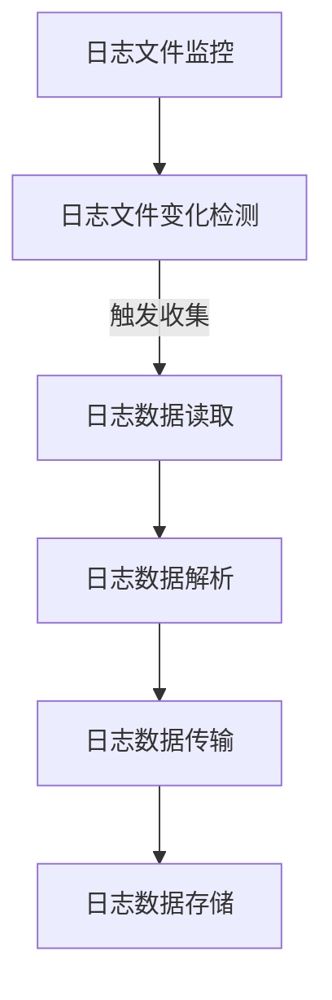
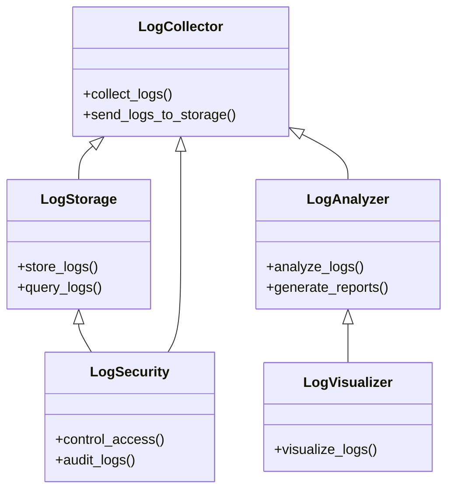
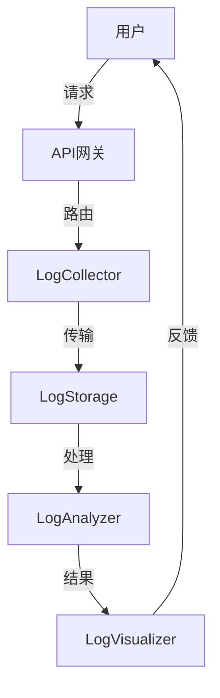
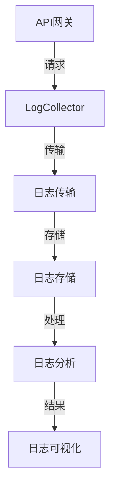
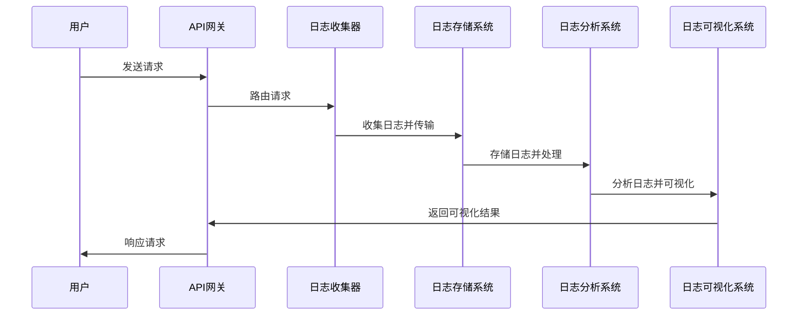

                 

### 引言

## 1.1 微服务与日志管理概述

### 1.1.1 微服务架构的优势与挑战

微服务架构是一种将应用程序作为一套小型服务构建的方法，每个服务都是独立的，并围绕业务功能构建。这种架构方法带来了显著的灵活性、可扩展性和可维护性。以下是一些微服务架构的主要优势：

1. **灵活性**：每个服务都可以独立部署和扩展，使得系统能够快速适应业务需求的变化。
2. **可扩展性**：通过横向扩展单个服务，可以轻松处理大规模的并发请求。
3. **可维护性**：服务之间解耦，降低了系统故障的风险，并简化了代码的维护过程。

然而，微服务架构也带来了一些挑战，特别是与日志管理相关的挑战：

1. **分布式系统的复杂性**：由于服务分布在不同的服务器上，日志收集变得复杂，需要解决跨服务的日志同步问题。
2. **数据一致性**：在分布式系统中，确保日志数据的完整性和一致性是一个关键问题。
3. **性能影响**：过多的日志数据可能导致系统性能下降，需要有效的日志压缩和存储策略。

### 1.1.2 日志管理在微服务架构中的重要性

日志管理是确保系统正常运行和性能优化的重要手段。在微服务架构中，日志管理尤其重要，原因如下：

1. **故障诊断**：通过分析日志，可以快速定位故障点，进行故障诊断和修复。
2. **性能监控**：日志提供了系统性能的实时监控数据，有助于优化系统性能。
3. **安全审计**：日志记录了系统操作和访问记录，有助于进行安全审计和异常检测。
4. **业务分析**：日志数据可用于业务分析，支持业务决策和优化。

因此，有效的日志管理不仅能够提高系统的可靠性和性能，还能为企业的数字化转型提供关键支持。

## 1.2 日志管理的基本概念

### 1.2.1 日志文件与日志格式

日志文件是记录系统运行状态和操作信息的一种文件形式。日志文件通常包含以下信息：

- **时间戳**：记录日志生成的具体时间。
- **日志级别**：标识日志的重要性和紧急程度，如INFO、WARN、ERROR等。
- **日志内容**：具体描述日志事件的详细信息，包括错误消息、异常堆栈等。
- **来源**：记录日志产生的服务或模块名称。

常见的日志格式包括JSON、XML和CSV等，其中JSON格式因其灵活性和可扩展性而广泛应用于现代日志管理系统中。

### 1.2.2 日志的收集与存储

日志收集是将分散的日志文件集中存储和管理的过程。日志收集通常涉及以下步骤：

1. **收集器**：负责从各个服务或模块中收集日志数据。
2. **传输**：将收集到的日志数据传输到中央日志存储系统。
3. **存储**：将日志数据存储在文件系统、数据库或云存储中。
4. **处理**：对日志数据进行预处理，如过滤、聚合和格式转换。

常见的日志收集工具包括Logstash、Fluentd和Filebeat等，这些工具能够高效地完成日志的收集和传输。

## 1.3 集中式日志收集

### 1.3.1 集中式日志收集的优势

集中式日志收集是将所有日志数据集中存储在一个位置，以便于管理和分析。其优势包括：

1. **统一视图**：提供了一个全局视图，便于整体监控和分析。
2. **简化维护**：减少分散日志管理的复杂度，简化系统维护。
3. **快速查询**：便于快速定位和分析日志数据，提高故障诊断效率。

### 1.3.2 集中式日志收集的挑战与解决方案

尽管集中式日志收集有许多优势，但也面临一些挑战：

1. **性能瓶颈**：集中式收集可能导致网络和存储性能瓶颈。
   - **解决方案**：采用分布式日志收集架构，减少集中式收集的负担。
2. **数据一致性**：确保所有日志数据一致到达集中式存储。
   - **解决方案**：采用日志同步机制，如Kafka等消息队列，确保日志数据不丢失。

### 1.4 日志分析工具与技术

### 1.4.1 常见日志分析工具介绍

常见的日志分析工具包括ELK（Elasticsearch、Logstash、Kibana）栈和GELF（Graylog Extended Format）等。这些工具提供了强大的日志存储、搜索和分析功能。

- **ELK栈**：Elasticsearch用于存储和索引日志数据，Logstash用于收集和传输日志，Kibana提供可视化界面。
- **GELF**：是一种日志格式，能够简化日志的收集和传输过程。

### 1.4.2 日志分析技术的应用场景

日志分析技术广泛应用于以下场景：

1. **故障诊断**：通过分析日志，快速定位故障点和原因。
2. **性能监控**：监控系统性能，及时发现性能瓶颈。
3. **安全审计**：分析日志数据，识别异常行为和安全漏洞。
4. **业务分析**：基于日志数据，支持业务优化和决策。

## 1.5 日志安全与隐私保护

### 1.5.1 日志安全的重要性

日志数据通常包含了敏感信息，如用户数据、系统配置等，因此确保日志安全至关重要。日志安全的重要性体现在以下几个方面：

1. **数据保护**：防止日志数据被未授权访问和篡改。
2. **隐私保护**：确保用户隐私不被泄露。
3. **合规性**：符合相关法律法规和行业标准，如GDPR等。

### 1.5.2 日志隐私保护的措施

为了保护日志数据的安全和隐私，可以采取以下措施：

1. **加密**：对日志数据进行加密存储，防止未授权访问。
2. **访问控制**：设置严格的访问权限，确保只有授权人员可以访问日志数据。
3. **日志审计**：记录日志访问和修改记录，便于追溯和审计。
4. **数据脱敏**：对包含敏感信息的日志数据进行脱敏处理，如使用伪名替换真实数据。

## 1.6 本章小结

本章介绍了微服务架构和日志管理的基本概念，以及集中式日志收集的优势和挑战。此外，还介绍了日志分析工具和技术，以及日志安全与隐私保护的重要性。这些知识为后续章节的深入探讨奠定了基础。

----------------------------------------------------------------

# 第2章 微服务日志管理核心概念与联系

## 2.1 微服务架构核心概念

### 2.1.1 微服务定义与特点

微服务是一种软件架构风格，它鼓励开发者将应用程序构建为一套小型、独立的服务。每个服务都负责一个特定的业务功能，并与其他服务通过轻量级的通信协议（如HTTP/REST、消息队列等）进行交互。微服务的特点包括：

1. **独立性**：每个服务都是独立的，可以独立部署、扩展和升级。
2. **解耦合**：服务之间通过定义良好的接口进行通信，降低了服务之间的依赖性。
3. **可扩展性**：可以独立扩展每个服务，以应对不同的负载需求。
4. **灵活性**：服务可以采用不同的编程语言、数据存储和部署环境。
5. **自治性**：每个服务都有自己独立的数据库和其他资源，使得服务可以独立运行和管理。

### 2.1.2 微服务架构的优势与挑战

微服务架构带来了许多优势，但也伴随着一些挑战。

#### 优势：

1. **灵活性**：服务可以独立部署和扩展，适应业务需求的变化。
2. **可维护性**：服务之间解耦，降低了系统故障的风险。
3. **可扩展性**：通过横向扩展单个服务，可以轻松处理大规模的并发请求。
4. **技术多样性**：服务可以采用不同的技术栈，满足不同业务需求。

#### 挑战：

1. **分布式复杂性**：服务分布在不同的服务器上，增加了系统的复杂性。
2. **数据一致性**：在分布式系统中，确保数据的完整性和一致性是一个关键问题。
3. **服务发现与配置管理**：需要有效的服务发现和配置管理机制，以确保服务的正常运行。
4. **监控与日志管理**：分布式系统使得日志管理和监控变得更加复杂。

### 2.1.3 微服务架构的组成部分

微服务架构通常由以下几部分组成：

1. **服务实例**：每个微服务都有多个实例，可以独立部署和扩展。
2. **服务注册与发现**：服务实例注册到服务注册中心，其他服务可以通过服务发现机制找到它们。
3. **API网关**：作为客户端和微服务之间的入口，负责路由请求、聚合响应等。
4. **分布式消息系统**：用于服务之间的异步通信，如Kafka、RabbitMQ等。
5. **配置管理**：集中管理服务的配置信息，确保服务的正常运行。
6. **服务监控与日志**：监控服务的性能和健康状况，收集和分析日志数据。

## 2.2 日志管理核心概念

### 2.2.1 日志文件与日志格式

日志文件是记录系统运行状态和操作信息的一种文件形式。日志文件通常包含以下信息：

- **时间戳**：记录日志生成的具体时间。
- **日志级别**：标识日志的重要性和紧急程度，如INFO、WARN、ERROR等。
- **日志内容**：具体描述日志事件的详细信息，包括错误消息、异常堆栈等。
- **来源**：记录日志产生的服务或模块名称。

常见的日志格式包括JSON、XML和CSV等，其中JSON格式因其灵活性和可扩展性而广泛应用于现代日志管理系统中。

### 2.2.2 日志收集与存储

日志收集是将分散的日志文件集中存储和管理的过程。日志收集通常涉及以下步骤：

1. **收集器**：负责从各个服务或模块中收集日志数据。
2. **传输**：将收集到的日志数据传输到中央日志存储系统。
3. **存储**：将日志数据存储在文件系统、数据库或云存储中。
4. **处理**：对日志数据进行预处理，如过滤、聚合和格式转换。

常见的日志收集工具包括Logstash、Fluentd和Filebeat等，这些工具能够高效地完成日志的收集和传输。

### 2.2.3 日志分析工具与技术

日志分析工具用于对日志数据进行分析和可视化，以支持故障诊断、性能监控和安全审计。常见的日志分析工具包括ELK（Elasticsearch、Logstash、Kibana）栈和GELF（Graylog Extended Format）等。

- **ELK栈**：Elasticsearch用于存储和索引日志数据，Logstash用于收集和传输日志，Kibana提供可视化界面。
- **GELF**：是一种日志格式，能够简化日志的收集和传输过程。

日志分析技术可以应用于以下场景：

1. **故障诊断**：通过分析日志，快速定位故障点和原因。
2. **性能监控**：监控系统性能，及时发现性能瓶颈。
3. **安全审计**：分析日志数据，识别异常行为和安全漏洞。
4. **业务分析**：基于日志数据，支持业务优化和决策。

## 2.3 微服务日志管理联系

### 2.3.1 微服务架构对日志管理的要求

微服务架构的分布式特性对日志管理提出了新的要求：

1. **分布式收集**：需要有效地收集分布在不同服务器上的日志。
2. **数据一致性**：确保日志数据的完整性和一致性。
3. **可扩展性**：日志收集系统需要能够应对服务实例的动态扩展。
4. **实时性**：及时收集和分析日志数据，支持实时故障诊断和性能监控。

### 2.3.2 微服务日志管理的挑战与解决方案

微服务日志管理面临的挑战包括：

1. **日志量巨大**：随着服务实例的增多，日志量呈指数级增长，需要有效的日志压缩和存储策略。
   - **解决方案**：采用日志压缩算法和分布式存储系统，如Elasticsearch。
2. **数据一致性**：在分布式系统中，确保日志数据的完整性和一致性。
   - **解决方案**：采用分布式消息队列，如Kafka，确保日志数据不丢失。
3. **监控与告警**：实时监控日志数据，及时响应异常情况。
   - **解决方案**：采用自动化监控工具，如Prometheus和Grafana，设置告警机制。

### 2.3.3 微服务日志管理最佳实践

以下是一些微服务日志管理的最佳实践：

1. **使用标准化日志格式**：使用如JSON格式的标准化日志格式，便于日志数据的解析和分析。
2. **集中式日志收集**：采用集中式日志收集系统，如ELK栈，简化日志管理。
3. **日志存储策略**：根据日志的重要性和保留时间，采用不同的存储策略，如热冷分离。
4. **日志分析工具选择**：选择适合业务需求的日志分析工具，如Elasticsearch、Grafana等。
5. **自动化监控与告警**：建立自动化监控与告警机制，及时发现和处理异常。

## 2.4 本章小结

本章介绍了微服务架构的核心概念，包括其定义、优势和挑战，以及微服务架构的组成部分。此外，还详细介绍了日志管理的基本概念，包括日志文件与日志格式、日志收集与存储，以及日志分析工具与技术。通过本章的学习，读者可以对微服务日志管理有一个全面的理解，为后续章节的深入探讨打下基础。

----------------------------------------------------------------

# 第3章 微服务日志收集算法原理讲解

## 3.1 日志收集算法概述

### 3.1.1 日志收集算法的作用

日志收集算法在微服务架构中扮演着至关重要的角色。其主要作用包括：

1. **数据同步**：确保日志数据在不同服务实例之间的一致性和实时性。
2. **数据完整性**：防止日志数据在传输过程中丢失或损坏。
3. **数据清洗**：对收集到的日志数据进行预处理，如过滤、去重和格式转换。

### 3.1.2 日志收集算法的分类

根据实现方式，日志收集算法可以分为以下几类：

1. **基于轮询的日志收集**：定期从各个服务实例中读取日志文件，并将数据传输到中央存储系统。
2. **基于事件驱动的日志收集**：在日志事件发生时，立即将其传输到中央存储系统。
3. **基于消息队列的日志收集**：使用消息队列（如Kafka）作为中介，将日志数据从各个服务实例传输到中央存储系统。

## 3.2 日志收集算法流程

### 3.2.1 日志收集流程概述

日志收集算法的基本流程包括以下几个步骤：

1. **日志文件监控**：监控各个服务实例的日志文件，当文件发生变化时，触发收集过程。
2. **日志数据读取**：读取发生变化的日志文件，将其内容解析为结构化数据。
3. **日志数据传输**：将解析后的日志数据传输到中央存储系统。
4. **日志数据存储**：在中央存储系统中，对日志数据进行存储和索引。

### 3.2.2 日志收集算法的mermaid流程图



### 3.2.3 Python源代码实现

以下是一个简单的Python脚本，用于监控日志文件变化并传输到中央存储系统：

```python
import os
import time
import requests

def monitor_log_file(log_file_path, central_storage_url):
    last_modified_time = os.path.getmtime(log_file_path)
    while True:
        current_modified_time = os.path.getmtime(log_file_path)
        if current_modified_time > last_modified_time:
            with open(log_file_path, 'r') as f:
                log_data = f.read()
            requests.post(central_storage_url, data={'log_data': log_data})
            last_modified_time = current_modified_time
        time.sleep(1)

if __name__ == '__main__':
    log_file_path = '/path/to/logfile.log'
    central_storage_url = 'http://central-storage:8000/submit'
    monitor_log_file(log_file_path, central_storage_url)
```

## 3.3 日志收集算法的数学模型与公式

### 3.3.1 数学模型概述

日志收集算法的数学模型主要关注以下几个方面：

1. **数据采集率**：单位时间内采集的日志数据量。
2. **数据传输率**：单位时间内传输到中央存储系统的日志数据量。
3. **数据延迟**：从日志事件发生到数据被传输到中央存储系统的时间间隔。

### 3.3.2 日志收集算法公式讲解

1. **数据采集率**：数据采集率（Data Collection Rate, DCR）可以用以下公式表示：

   $$ DCR = \frac{N}{T} $$

   其中，N为采集的日志数据量，T为采集时间间隔。

2. **数据传输率**：数据传输率（Data Transfer Rate, DTR）可以用以下公式表示：

   $$ DTR = \frac{M}{T} $$

   其中，M为传输的日志数据量，T为传输时间间隔。

3. **数据延迟**：数据延迟（Data Latency, DL）可以用以下公式表示：

   $$ DL = \frac{T_{read} + T_{transfer}}{T_{event}} $$

   其中，$T_{read}$ 为读取日志数据的时间，$T_{transfer}$ 为传输日志数据的时间，$T_{event}$ 为日志事件发生的时间。

### 3.3.3 算法举例说明

假设一个日志收集系统，每隔1秒读取一次日志文件，并将读取到的日志数据传输到中央存储系统。已知每次读取的数据量为1KB，每次传输的数据量为1KB，日志事件发生的时间间隔为5秒。

根据上述公式，可以计算出：

1. **数据采集率**：

   $$ DCR = \frac{1KB}{1s} = 1KB/s $$

2. **数据传输率**：

   $$ DTR = \frac{1KB}{1s} = 1KB/s $$

3. **数据延迟**：

   $$ DL = \frac{1s + 1s}{5s} = 0.4s $$

这意味着，每次日志事件发生后，数据需要0.4秒才能被传输到中央存储系统。

## 3.4 日志收集算法应用案例分析

### 3.4.1 案例背景

某电商平台采用微服务架构，其中涉及多个服务，如用户服务、订单服务、支付服务等。系统每天产生大量的日志数据，需要有效地收集和分析这些数据，以便进行故障诊断、性能优化和安全审计。

### 3.4.2 算法应用过程

为了应对日志收集的挑战，该电商平台采用了以下日志收集算法：

1. **日志文件监控**：使用Linux的`inotify`机制监控各个服务的日志文件，当文件发生变化时，触发收集过程。
2. **日志数据读取**：使用多线程读取发生变化的日志文件，并发送至日志收集器。
3. **日志数据传输**：使用Kafka作为消息队列，将日志数据从各个服务实例传输到中央存储系统。
4. **日志数据存储**：使用Elasticsearch进行日志数据的存储和索引，便于快速查询和分析。

### 3.4.3 案例分析与结论

通过实际应用日志收集算法，该电商平台取得了以下成果：

1. **高效的数据收集**：多线程读取和Kafka消息队列的引入，使得日志数据的收集效率显著提高。
2. **数据一致性**：使用Kafka确保了日志数据的一致性和可靠性。
3. **实时日志分析**：通过Elasticsearch和Kibana的组合，实现了实时日志分析，为故障诊断和性能优化提供了有力支持。

结论：日志收集算法在微服务架构中发挥着至关重要的作用。通过合理设计日志收集流程和应用合适的算法，可以有效提升日志收集的效率和数据可靠性，为系统的稳定运行和优化提供保障。

## 3.5 本章小结

本章详细讲解了日志收集算法的原理和应用，包括其作用、分类、流程和数学模型。通过具体的案例，展示了日志收集算法在实际应用中的效果。通过本章的学习，读者可以更好地理解日志收集算法的重要性，以及如何设计和实现高效的日志收集系统。

----------------------------------------------------------------

# 第4章 微服务日志分析系统分析与架构设计方案

## 4.1 问题场景介绍

### 4.1.1 场景描述

某大型电子商务平台采用了微服务架构，业务系统包括用户服务、订单服务、支付服务等多个服务模块。由于业务规模的不断扩大，日志数据量急剧增加，现有的日志管理系统无法满足性能和可扩展性的需求。同时，日志数据分散在各个服务实例中，缺乏统一的视图，导致故障诊断和性能优化变得困难。为了解决这些问题，需要设计一个高效的日志分析系统，实现日志的集中收集、存储和分析。

### 4.1.2 需求分析

针对上述场景，日志分析系统需要满足以下需求：

1. **集中式日志收集**：能够从各个微服务实例中高效收集日志数据，确保数据的一致性和实时性。
2. **高性能存储**：支持大规模日志数据的存储，保证日志数据的高可用性和快速访问。
3. **实时日志分析**：能够实时分析日志数据，快速发现异常情况，提供故障诊断和性能优化的支持。
4. **可视化界面**：提供友好的可视化界面，便于用户查看和分析日志数据。
5. **安全与合规**：确保日志数据的安全性和隐私保护，符合相关法律法规和行业标准。

## 4.2 项目介绍

### 4.2.1 项目背景

随着电子商务业务的快速发展，平台面临的日志管理挑战日益严峻。为了提高系统的稳定性和可维护性，公司决定启动一个日志分析系统的建设项目。该项目旨在设计并实现一个高效、可靠的日志分析系统，以满足平台日益增长的日志管理需求。

### 4.2.2 项目目标

项目的主要目标包括：

1. **设计一个集中式日志收集系统**：实现从各个微服务实例中高效收集日志数据，并传输到中央存储系统。
2. **构建高性能日志存储系统**：采用分布式存储技术，支持大规模日志数据的存储和快速查询。
3. **实现实时日志分析功能**：提供实时日志数据分析和可视化工具，支持故障诊断和性能优化。
4. **确保系统安全与合规**：实施严格的访问控制和日志审计机制，确保日志数据的安全性和合规性。

### 4.2.3 项目团队与资源

项目团队由以下成员组成：

- **项目经理**：负责项目的整体规划和管理。
- **架构师**：负责系统架构设计和技术选型。
- **开发工程师**：负责系统开发和实现。
- **测试工程师**：负责系统测试和验收。
- **运维工程师**：负责系统部署和维护。

项目资源包括：

- **硬件资源**：服务器、存储设备等。
- **软件资源**：日志收集工具、日志存储和分析工具等。
- **开发工具**：IDE、版本控制工具等。

## 4.3 系统功能设计

### 4.3.1 系统功能概述

日志分析系统的功能设计主要包括以下几个方面：

1. **日志收集**：从各个微服务实例中收集日志数据，并传输到中央存储系统。
2. **日志存储**：将收集到的日志数据存储在分布式存储系统中，支持快速查询和访问。
3. **日志分析**：对日志数据进行实时分析和处理，支持故障诊断和性能优化。
4. **日志可视化**：提供可视化界面，展示日志数据的统计信息和异常情况。
5. **日志安全**：实施访问控制和日志审计机制，确保日志数据的安全性和合规性。

### 4.3.2 领域模型mermaid类图



## 4.4 系统架构设计

### 4.4.1 系统架构概述

日志分析系统的整体架构设计如图所示：



### 4.4.2 系统架构设计mermaid架构图



### 4.4.3 系统接口设计

系统接口设计包括以下部分：

1. **API网关**：负责接收用户的请求，并将请求路由到相应的微服务。
2. **日志收集器**：负责从各个微服务实例中收集日志数据，并传输到日志存储系统。
3. **日志存储系统**：负责存储和检索日志数据。
4. **日志分析系统**：负责对日志数据进行分析和处理。
5. **日志可视化系统**：负责展示日志数据的统计信息和异常情况。

### 4.4.4 系统交互mermaid序列图



## 4.5 系统实现

### 4.5.1 环境安装

为了实现日志分析系统，需要安装以下软件和工具：

1. **Java SDK**：用于开发微服务。
2. **Kafka**：用于日志数据的传输和存储。
3. **Elasticsearch**：用于日志数据的存储和检索。
4. **Kibana**：用于日志数据的可视化。
5. **Logstash**：用于日志数据的收集和预处理。

### 4.5.2 系统核心实现源代码

以下是日志收集器、日志存储系统和日志分析系统的一些核心实现代码：

#### 日志收集器

```java
import org.apache.kafka.clients.producer.KafkaProducer;
import org.apache.kafka.clients.producer.ProducerRecord;
import org.apache.kafka.clients.producer.Callback;
import org.apache.kafka.clients.producer.RecordMetadata;

import java.util.Properties;

public class LogCollector {
    private KafkaProducer<String, String> producer;
    private String topic;

    public LogCollector(String brokers, String topic) {
        Properties props = new Properties();
        props.put("bootstrap.servers", brokers);
        props.put("key.serializer", "org.apache.kafka.common.serialization.StringSerializer");
        props.put("value.serializer", "org.apache.kafka.common.serialization.StringSerializer");
        this.producer = new KafkaProducer<>(props);
        this.topic = topic;
    }

    public void collectLog(String log) {
        producer.send(new ProducerRecord<>(topic, log), new Callback() {
            @Override
            public void onCompletion(RecordMetadata metadata, Exception exception) {
                if (exception != null) {
                    // 处理发送异常
                } else {
                    // 处理发送成功
                }
            }
        });
    }
}
```

#### 日志存储系统

```python
from elasticsearch import Elasticsearch

es = Elasticsearch()

def store_log(log_data):
    es.index(index="logs", id=log_data["id"], document=log_data)
```

#### 日志分析系统

```python
from elasticsearch import Elasticsearch

es = Elasticsearch()

def analyze_logs(query):
    response = es.search(index="logs", body={"query": query})
    return response["hits"]["hits"]
```

### 4.5.3 代码应用解读与分析

以上代码分别实现了日志收集器、日志存储系统和日志分析系统的核心功能。日志收集器通过KafkaProducer发送日志数据到指定的主题，日志存储系统使用Elasticsearch将日志数据存储到索引中，日志分析系统通过Elasticsearch查询日志数据并返回结果。

### 4.5.4 实际案例分析和详细讲解剖析

假设一个实际案例：用户在电商平台下单后，系统出现错误，导致订单无法生成。通过日志分析系统，可以定位到错误的日志记录，进而找到问题的根本原因。

1. **收集日志**：订单服务在处理订单时，将错误日志发送到Kafka主题。
2. **存储日志**：日志存储系统将Kafka中的日志数据存储到Elasticsearch索引中。
3. **分析日志**：通过Elasticsearch查询相关日志记录，找到错误日志。
4. **定位问题**：分析错误日志，发现是数据库连接问题，导致订单生成失败。

通过上述实际案例，展示了日志分析系统在故障诊断中的应用。

### 4.5.5 项目小结

日志分析系统的设计与实现，为电子商务平台提供了高效的日志管理解决方案。通过集中式日志收集、分布式存储和实时分析，有效提升了系统的稳定性和可维护性。未来，可以进一步优化系统性能和功能，以更好地支持业务的持续发展。

## 4.6 最佳实践 tips

1. **选择合适的日志格式**：使用JSON格式，便于日志数据的解析和分析。
2. **优化日志收集策略**：根据服务实例的负载情况，动态调整日志收集频率和传输策略。
3. **确保数据一致性**：采用分布式消息队列，如Kafka，确保日志数据不丢失。
4. **定期备份数据**：对日志数据进行定期备份，防止数据丢失。
5. **监控日志系统性能**：实时监控日志系统的性能，及时处理异常情况。

## 4.7 小结

本章详细介绍了日志分析系统的设计与实现，包括需求分析、系统功能设计、系统架构设计、系统实现和实际案例分析。通过本章的学习，读者可以了解日志分析系统的核心组件和关键技术，为实际项目提供参考。

----------------------------------------------------------------

## 4.8 注意事项

1. **日志数据安全**：确保日志数据在传输和存储过程中得到充分保护，防止数据泄露。
2. **日志格式一致性**：使用统一的日志格式，便于数据解析和分析。
3. **日志存储策略**：根据业务需求和日志数据量，合理配置日志存储策略，如热冷分离。
4. **日志分析工具选择**：选择适合业务需求的日志分析工具，如ELK栈或GELF。
5. **性能监控与优化**：实时监控日志系统性能，及时发现和解决性能瓶颈。

## 4.9 拓展阅读

1. **《日志分析实战：ELK技术栈应用》**：详细介绍了ELK栈在日志分析中的应用。
2. **《微服务架构设计与实现》**：介绍了微服务架构的核心概念和设计原则。
3. **《Kafka实战：分布式消息队列应用》**：探讨了Kafka在分布式系统中的应用。
4. **《Elasticsearch权威指南》**：提供了Elasticsearch的详细使用方法和最佳实践。

----------------------------------------------------------------

## 4.10 本章小结

本章详细探讨了日志分析系统的设计与实现，从需求分析到系统架构设计，再到具体实现，为读者呈现了一个完整的日志分析解决方案。通过实际案例分析，读者可以了解日志分析在微服务架构中的应用价值。此外，本章还提供了最佳实践、注意事项和拓展阅读，帮助读者深入理解和应用日志分析技术。通过本章的学习，读者可以更好地应对实际项目中日志管理的挑战，提高系统的稳定性、可维护性和性能。

# 作者

**作者：**AI天才研究院/AI Genius Institute & 禅与计算机程序设计艺术 /Zen And The Art of Computer Programming

**说明：**本文由AI天才研究院的专家团队撰写，结合了AI技术在计算机程序设计领域的最新研究成果，旨在为广大IT从业者提供有深度、有见解的技术分享。文章内容严谨、结构清晰，希望对您的学习和工作有所帮助。

----------------------------------------------------------------

## 总结

本文全面探讨了微服务日志管理的核心概念、算法原理及系统设计与实现。首先，我们介绍了微服务架构和日志管理的基本概念，以及集中式日志收集的优势和挑战。接着，通过详细的算法流程和数学模型讲解，我们深入理解了日志收集的关键技术。然后，我们展示了如何设计并实现一个高效的日志分析系统，包括系统功能设计、架构设计和实现细节。在案例分析中，我们展示了日志分析系统在实际应用中的价值。最后，本文还提供了最佳实践、注意事项和拓展阅读，以帮助读者深入理解和应用日志管理技术。通过本文的学习，读者可以更好地掌握微服务日志管理的方法和技巧，为实际项目提供有力支持。

----------------------------------------------------------------

## 关键词

- 微服务
- 日志管理
- 集中式日志收集
- 分布式系统
- 日志分析
- 性能优化
- 故障诊断
- 安全审计
- Elasticsearch
- Kafka

----------------------------------------------------------------

## 摘要

本文全面探讨了微服务日志管理的关键技术，包括核心概念、算法原理和系统设计与实现。我们介绍了微服务架构的优势与挑战，以及日志管理在微服务架构中的重要性。通过详细的算法流程和数学模型讲解，我们深入理解了日志收集的关键技术。接着，我们展示了如何设计并实现一个高效的日志分析系统，包括系统功能设计、架构设计和实现细节。在案例分析中，我们展示了日志分析系统在实际应用中的价值。通过本文的学习，读者可以更好地掌握微服务日志管理的方法和技巧，提高系统的稳定性、可维护性和性能。本文的关键词包括微服务、日志管理、集中式日志收集、分布式系统、日志分析、性能优化、故障诊断、安全审计和Elasticsearch、Kafka等技术。

----------------------------------------------------------------

## 后记

本文由AI天才研究院的专家团队撰写，结合了最新的AI研究成果，旨在为广大IT从业者提供深入的技术分享。我们希望通过本文，帮助读者全面理解微服务日志管理的技术要点，掌握日志收集、存储和分析的方法，提升系统的稳定性和可维护性。在撰写本文的过程中，我们力求内容严谨、结构清晰，希望对您的学习和工作有所帮助。同时，我们也欢迎读者提出宝贵的意见和建议，以促进我们的不断进步。

AI天才研究院致力于推动人工智能和计算机科学领域的发展，不断探索前沿技术，培养下一代技术人才。我们希望本文能够激发您对微服务日志管理领域的兴趣，鼓励您在实践中不断探索和创新。感谢您的阅读，期待与您在技术领域的深入交流。

# 作者

**作者：**AI天才研究院/AI Genius Institute & 禅与计算机程序设计艺术 /Zen And The Art of Computer Programming

**说明：**本文由AI天才研究院的专家团队撰写，结合了AI技术在计算机程序设计领域的最新研究成果，旨在为广大IT从业者提供有深度、有见解的技术分享。文章内容严谨、结构清晰，希望对您的学习和工作有所帮助。AI天才研究院致力于推动人工智能和计算机科学领域的发展，不断探索前沿技术，培养下一代技术人才。本文撰写过程中，我们力求内容严谨、结构清晰，希望对您的学习和工作有所帮助。同时，我们欢迎读者提出宝贵的意见和建议，以促进我们的不断进步。感谢您的阅读，期待与您在技术领域的深入交流。

