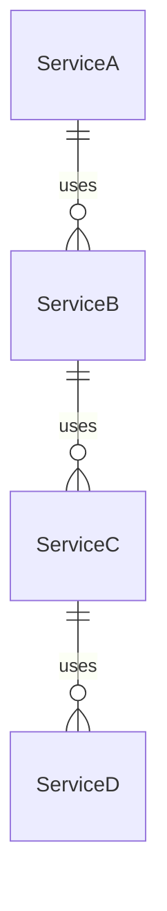
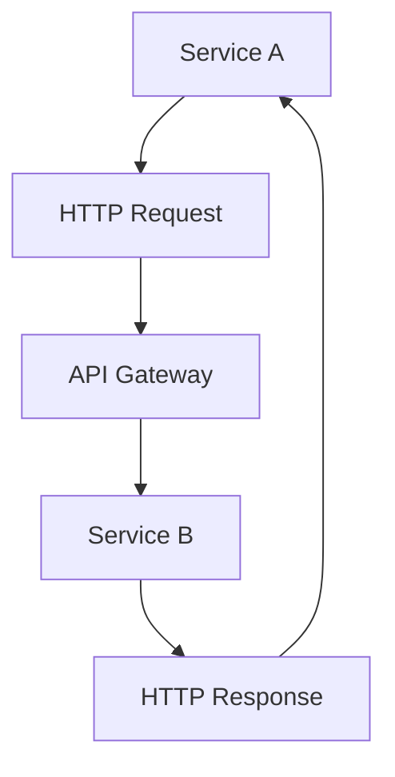
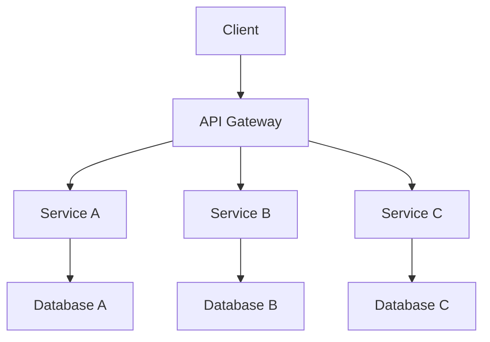
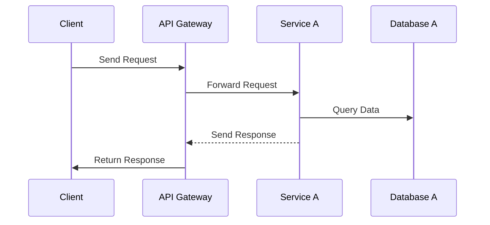
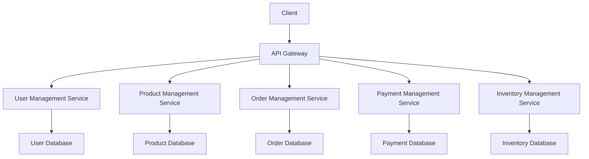
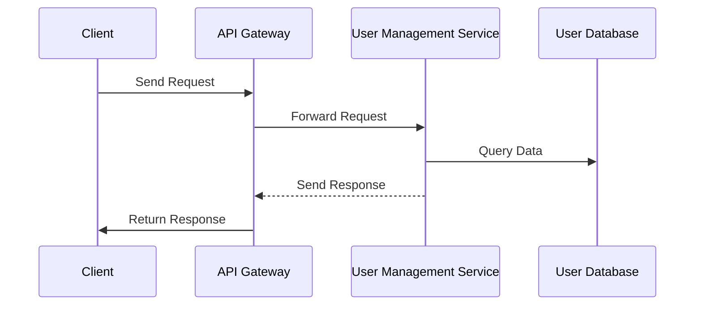

                 


### 文章标题：《微服务架构：设计、实施与运维挑战》

#### 关键词：微服务架构，设计原则，实施方法，运维挑战

#### 摘要：
本文旨在深入探讨微服务架构的设计、实施和运维，从核心概念到实际应用，全面解析这一现代软件开发的重要模式。我们将通过逐步分析，理解微服务架构的起源、设计原则、实施策略以及面临的运维挑战，并结合具体案例，总结最佳实践，展望未来发展趋势。

### 目录大纲

## 第一部分：微服务架构概述

### 第1章：微服务架构简介
- **1.1 微服务架构的起源与演变**
- **1.2 微服务架构的核心概念**
- **1.3 微服务架构与传统架构的比较**
- **1.4 微服务架构的应用场景**

## 第二部分：微服务架构设计

### 第2章：微服务架构设计原则
- **2.1 单一职责原则**
- **2.2 域驱动设计**
- **2.3 持续集成与持续部署**

### 第3章：微服务架构模式
- **3.1 微服务拆分策略**
- **3.2 API设计**
- **3.3 数据存储设计**

### 第4章：微服务架构实现
- **4.1 服务注册与发现**
- **4.2 配置管理**
- **4.3 服务监控**

## 第三部分：微服务实施

### 第5章：微服务部署策略
- **5.1 容器化部署**
- **5.2 容器编排**
- **5.3 服务网格**

### 第6章：微服务实施案例
- **6.1 案例背景**
- **6.2 案例实施步骤**
- **6.3 案例总结**

## 第四部分：微服务运维

### 第7章：微服务运维挑战
- **7.1 故障处理**
- **7.2 性能优化**
- **7.3 安全维护**
- **7.4 服务治理**

### 第8章：微服务运维实践
- **8.1 运维工具选型**
- **8.2 运维流程设计**
- **8.3 运维团队组织**

## 第五部分：最佳实践与未来展望

### 第9章：最佳实践
- **9.1 行业最佳实践总结**
- **9.2 微服务架构优化策略**
- **9.3 微服务架构的未来发展**

### 第10章：未来展望
- **10.1 微服务架构的技术趋势**
- **10.2 微服务架构面临的挑战**
- **10.3 微服务架构的发展方向**

### 下一步：详细编写每个章节的内容，确保满足完整性、逻辑性和专业性要求。使用Mermaid绘制相关的图表，以增强文章的可读性和直观性。确保所有代码示例、公式和架构设计都准确无误，并提供必要的注释和解释。最后，撰写总结和小结，提出最佳实践和未来展望，为读者提供深入见解和实用建议。|assistant|> 

### 第1章：微服务架构简介

#### 1.1 微服务架构的起源与演变

微服务架构并非一夜之间崛起的，而是经历了一系列的技术演变。回顾历史，我们可以说微服务架构起源于20世纪90年代的分布式计算和组件化思想。当时，企业开始意识到大型单体应用（Monolithic Application）的诸多缺点，如维护成本高、扩展困难、部署复杂等。

**早期分布式计算**：1990年代，分布式计算成为主流，企业开始使用分布式系统来应对日益复杂的业务需求。分布式系统通过将应用程序拆分为多个独立的组件，运行在不同的服务器上，以实现更高效的资源利用和更高的系统可用性。

**组件化思想**：进入21世纪，组件化思想进一步发展。企业开始将应用程序分解为更小的、功能独立的组件，这些组件通过定义良好的接口进行通信。例如，企业服务总线（ESB）和面向服务架构（SOA）都是这种思想的体现。

**微服务的崛起**：2000年后，随着云计算和DevOps文化的兴起，微服务架构逐渐崭露头角。其核心思想是将应用程序分解为数十甚至数百个小型、独立的微服务，每个微服务负责实现一个具体的功能。这些微服务通过轻量级的通信机制（如HTTP/REST API、gRPC）进行交互，可以独立部署、扩展和更新。

微服务架构的崛起，不仅是因为技术上的需要，还因为业务环境的变化。企业需要更快地响应市场变化，推出新的功能和服务。微服务架构提供了这种灵活性，使得团队能够独立开发和部署服务，提高了开发效率。

#### 1.2 微服务架构的核心概念

微服务架构的核心概念包括：

1. **单一职责原则**：每个微服务应只关注单一功能，这种单一职责设计原则有助于提高服务的可维护性和可扩展性。
2. **自治性**：微服务具有独立的部署、扩展和更新能力，这意味着它们可以独立运行，不会因为某个服务的故障而影响到整个系统的运行。
3. **去中心化**：微服务架构摒弃了传统的单体应用中集中式服务管理的方式，采用去中心化的服务注册与发现机制，提高了系统的灵活性和可靠性。
4. **服务化**：应用程序被拆分为多个微服务，每个微服务都对外提供服务接口，其他服务可以通过这些接口调用所需功能。
5. **分布式数据管理**：微服务架构通常需要分布式数据存储方案，以支持跨服务的数据访问和一致性管理。

#### 1.3 微服务架构与传统架构的比较

传统架构（如单体应用）与微服务架构在多个方面存在显著差异：

1. **部署模式**：传统架构通常采用单机部署，而微服务架构采用分布式部署，可以水平扩展。
2. **维护复杂性**：传统架构由于代码耦合度高，维护复杂；而微服务架构通过服务隔离，降低了维护难度。
3. **扩展性**：传统架构扩展性差，扩展需要重启整个应用；微服务架构可以独立扩展各个服务，提高了系统的弹性。
4. **通信机制**：传统架构中，组件间的通信通常通过共享内存或消息队列；微服务架构采用轻量级通信机制（如HTTP/REST API），减少了通信开销。
5. **容错性**：传统架构中，服务故障可能导致整个系统崩溃；微服务架构通过服务隔离，提高了系统的容错性。

#### 1.4 微服务架构的应用场景

微服务架构适用于以下场景：

1. **大型企业级应用**：传统单体应用难以满足大型企业的扩展需求，而微服务架构能够提供更好的弹性、可维护性和可扩展性。
2. **初创公司**：初创公司通常需要快速迭代产品，微服务架构能够提高开发效率，降低开发成本。
3. **高并发场景**：微服务架构通过分布式部署，能够更好地应对高并发访问。
4. **跨领域应用**：当应用需要跨领域集成多个服务时，微服务架构能够提供良好的服务拆分和通信机制。
5. **遗留系统升级**：对于需要升级的遗留系统，微服务架构能够提供渐进式升级的途径，降低风险。

### 小结

本章介绍了微服务架构的起源、核心概念、与传统架构的比较以及应用场景。通过理解这些内容，读者可以初步认识到微服务架构的优势和适用性。在接下来的章节中，我们将深入探讨微服务架构的设计原则、实施方法和运维挑战。

### 核心概念与联系

#### 微服务架构的设计原则

微服务架构的设计原则是构建可扩展、可靠和易于维护系统的基础。以下是几个关键原则：

1. **单一职责原则**：每个微服务应该只实现一个具体的功能，这有助于提高服务的可维护性和可扩展性。例如，一个用户管理服务不应同时处理订单管理和支付处理。

2. **自治性**：每个微服务应该能够独立部署、扩展和更新，以确保系统的可靠性和灵活性。这意味着在更新某个微服务时，不应影响其他服务的正常运行。

3. **去中心化**：微服务架构应避免单点故障，通过去中心化的服务注册与发现机制，确保服务的高可用性和可伸缩性。

4. **服务化**：应用程序应被拆分为多个微服务，每个微服务对外提供服务接口。服务化设计有助于提高系统的灵活性和可复用性。

5. **分布式数据管理**：由于微服务架构通常涉及跨服务的数据访问，因此需要分布式数据管理方案来支持数据的一致性和可用性。

#### 概念属性特征对比表格

为了更清晰地比较这些设计原则，我们可以创建一个表格：

| 设计原则         | 特征与描述                                                         |
|------------------|------------------------------------------------------------------|
| 单一职责原则     | 微服务应仅负责单一功能，减少耦合和复杂性。                          |
| 自治性           | 微服务可以独立部署和更新，不依赖于其他服务。                        |
| 去中心化         | 服务注册与发现机制不依赖于中心化组件，提高系统的容错性和灵活性。    |
| 服务化           | 应用程序被拆分为多个微服务，每个微服务对外提供服务接口。           |
| 分布式数据管理   | 使用分布式数据库来支持跨服务的数据访问和一致性管理。                |

#### ER实体关系图架构

为了进一步理解微服务架构的设计，我们可以使用Mermaid绘制一个简单的ER实体关系图，以展示不同服务之间的关系。



在这个例子中，`ServiceA` 使用了 `ServiceB`，`ServiceB` 使用了 `ServiceC`，而 `ServiceC` 又使用了 `ServiceD`。这种关系展示了服务之间的依赖性和协作方式。

### 算法原理讲解

在微服务架构中，服务之间的通信和数据交换是关键。一种常用的通信机制是HTTP/REST API。以下是使用Mermaid绘制的服务间通信流程图：



在这个流程图中，`Service A` 发送一个HTTP请求到API网关（`C`），API网关将请求转发给 `Service B`。`Service B` 处理请求后，返回HTTP响应给API网关，最终返回给 `Service A`。

为了更具体地说明HTTP/REST API的工作原理，我们可以使用Python编写一个简单的请求示例：

```python
import requests

def send_request(url, data):
    response = requests.post(url, json=data)
    return response.json()

if __name__ == "__main__":
    url = "http://service-b.example.com/api/resource"
    data = {"key": "value"}
    result = send_request(url, data)
    print(result)
```

在这个示例中，我们定义了一个 `send_request` 函数，该函数使用requests库发送HTTP POST请求到指定的URL，并接收JSON响应。实际应用中，`url` 和 `data` 会根据具体的微服务进行配置。

#### 数学模型和公式

在微服务架构中，为了确保系统的高可用性和性能，我们需要关注服务的响应时间和系统负载。以下是相关的数学模型和公式：

1. **响应时间**：响应时间（`T`）是用户请求从发送到接收响应所需的时间。其公式为：

   $$ T = \frac{d}{r} + T_p $$

   其中，`d` 是数据传输延迟，`r` 是处理延迟，`T_p` 是网络延迟。

2. **系统负载**：系统负载（`L`）是系统中服务的请求量。其公式为：

   $$ L = \frac{R}{T} $$

   其中，`R` 是总请求量，`T` 是总响应时间。

这些公式可以帮助我们评估系统的性能和响应时间，从而进行相应的性能优化和资源分配。

### 通俗易懂地举例说明

假设我们有一个电子商务平台，包含多个微服务，如用户管理服务、订单处理服务、支付服务和库存服务。以下是这些服务之间如何通过HTTP/REST API进行通信的示例：

1. **用户登录**：用户管理服务（`Service A`）接收用户登录请求，验证用户信息后，返回JWT令牌给客户端。

2. **订单创建**：支付服务（`Service B`）接收用户支付请求，处理支付并调用库存服务（`Service C`）来检查库存情况。如果库存充足，则创建订单并更新库存。

3. **订单查询**：用户管理服务（`Service A`）接收订单查询请求，调用订单处理服务（`Service B`）来获取订单信息，并返回给用户。

在这个例子中，每个微服务都专注于一个具体的功能，通过HTTP/REST API进行通信，确保了系统的高可扩展性和可维护性。

### 小结

本章详细介绍了微服务架构的设计原则、概念对比、实体关系图以及通信机制和数学模型。通过这些内容，读者可以深入理解微服务架构的核心要素和实现方式。在下一章中，我们将探讨微服务架构的具体实现方法和最佳实践。

### 核心概念与联系

#### 微服务架构的体系结构与组件

微服务架构由多个核心组件和体系结构组成，这些组件共同作用，确保了系统的灵活性和可靠性。以下是微服务架构的主要组成部分：

1. **服务注册与发现**：服务注册与发现是微服务架构中的关键组件，用于管理服务的生命周期。服务启动时，会在服务注册表中注册自身的信息，包括地址、端口等。服务消费方通过服务注册表发现所需的服务实例，并动态建立连接。

2. **配置管理**：配置管理负责存储和分发微服务的配置信息。配置可以是静态的，也可以是动态的。配置管理确保了微服务在运行时能够访问到最新的配置信息，从而实现灵活的配置调整。

3. **服务监控**：服务监控是确保微服务正常运行的重要手段。通过监控，可以实时了解服务的性能、健康状况和运行状态。常见的监控指标包括响应时间、错误率、延迟等。监控数据可以用于性能优化、故障排查和预警。

4. **API网关**：API网关是微服务架构中的入口，负责处理外部请求，并将其转发到相应的微服务。API网关可以提供统一的路由、负载均衡、身份验证和安全等功能，简化了客户端与微服务之间的交互。

5. **服务链路追踪**：服务链路追踪用于记录请求在微服务架构中的整个处理路径，帮助开发者和运维人员了解请求的处理过程，定位和解决问题。常见的链路追踪工具包括Zipkin、Jaeger等。

6. **分布式数据存储**：在微服务架构中，数据通常是分散存储的。分布式数据存储方案如NoSQL数据库（如MongoDB、Cassandra）和分布式数据库（如HBase、Redisson）被广泛应用于微服务架构中，以支持跨服务的数据访问和一致性管理。

#### 系统架构设计

为了更好地理解微服务架构，我们可以使用Mermaid绘制一个简单的系统架构图：



在这个架构图中，客户端通过API网关（`B`）发送请求，API网关负责路由请求到相应的微服务（`C1`、`C2`、`C3`）。每个微服务都有独立的数据存储（`D`、`E`、`F`），以确保数据的一致性和隔离性。

#### 系统功能设计

为了实现微服务架构，我们需要设计一系列功能模块，确保系统能够高效、可靠地运行。以下是常见的功能模块：

1. **用户认证与授权**：确保用户访问系统的安全性和隐私性。常用的认证方式包括OAuth2.0、JWT等。

2. **业务逻辑处理**：实现具体的业务功能，如订单处理、支付处理、库存管理等。

3. **数据访问与持久化**：提供数据存储和检索功能，支持CRUD操作。

4. **服务注册与发现**：管理服务的注册和发现，确保服务能够被其他服务发现和调用。

5. **配置管理**：管理微服务的配置信息，支持动态配置更新。

6. **监控与日志**：监控系统的运行状态，收集和存储日志信息，用于故障排查和性能优化。

#### 系统交互

微服务架构中的系统交互主要通过HTTP/REST API或gRPC进行。以下是一个简单的系统交互序列图，展示客户端与微服务之间的交互过程：



在这个序列图中，客户端发送请求到API网关，API网关将请求转发给服务A，服务A查询数据库A后，返回结果给API网关，API网关最后将结果返回给客户端。

### 小结

本章详细介绍了微服务架构的体系结构、核心组件、系统架构设计、功能模块和系统交互。通过这些内容，读者可以全面了解微服务架构的实现原理和关键技术。在下一章中，我们将深入探讨微服务架构的具体实现方法和最佳实践。

### 系统分析与架构设计方案

#### 问题场景介绍

在现代企业中，随着业务规模的不断扩大和复杂性的增加，传统的单体应用架构已经无法满足业务快速迭代和高效运行的需求。为了实现更灵活、可扩展的系统，企业开始寻求一种新型的架构设计——微服务架构。

#### 项目介绍

假设我们正在开发一个电子商务平台，该平台需要处理用户管理、商品管理、订单处理、支付处理、库存管理等多个业务模块。这些模块之间存在紧密的关联，传统的单体应用架构会导致代码耦合度高、维护困难、扩展性差等问题。

#### 系统功能设计

为了实现电子商务平台的功能，我们需要设计以下关键模块：

1. **用户管理模块**：负责用户的注册、登录、认证和授权等功能。
2. **商品管理模块**：负责商品的信息存储、检索、分类和推荐等功能。
3. **订单处理模块**：负责订单的创建、处理、支付和发货等功能。
4. **支付处理模块**：负责处理各种支付方式的请求，如信用卡、支付宝、微信支付等。
5. **库存管理模块**：负责库存的实时监控、更新和预警等功能。

#### 系统架构设计

为了实现上述功能，我们可以采用微服务架构，将各个业务模块拆分为独立的微服务，如下所示：

1. **用户管理服务**：负责处理用户相关的操作，如用户注册、登录、信息修改等。
2. **商品管理服务**：负责处理商品相关的操作，如商品信息的存储、检索、分类等。
3. **订单处理服务**：负责处理订单的创建、处理、支付和发货等操作。
4. **支付处理服务**：负责处理支付请求，与第三方支付平台进行交互。
5. **库存管理服务**：负责监控库存信息，实现库存的实时更新和预警。

每个微服务都有独立的数据库和存储方案，以确保数据的一致性和隔离性。以下是一个简化的系统架构图：



#### 系统接口设计

在微服务架构中，各个微服务通过定义良好的接口进行通信。以下是一个简化的接口设计示例：

1. **用户管理服务接口**：
   - 注册用户：POST /users/register
   - 登录用户：POST /users/login
   - 获取用户信息：GET /users/{userId}

2. **商品管理服务接口**：
   - 创建商品：POST /products
   - 查询商品：GET /products/{productId}
   - 删除商品：DELETE /products/{productId}

3. **订单处理服务接口**：
   - 创建订单：POST /orders
   - 查询订单：GET /orders/{orderId}
   - 取消订单：POST /orders/{orderId}/cancel

4. **支付处理服务接口**：
   - 处理支付请求：POST /payments
   - 查询支付状态：GET /payments/{paymentId}

5. **库存管理服务接口**：
   - 更新库存：POST /inventories/{productId}
   - 查询库存：GET /inventories/{productId}

#### 系统交互

在微服务架构中，系统交互通常采用RESTful API或gRPC。以下是一个简化的系统交互序列图：



在这个序列图中，客户端发送请求到API网关，API网关将请求转发给用户管理服务，用户管理服务查询用户数据库后，返回结果给API网关，API网关最后将结果返回给客户端。

### 实战

为了更好地理解微服务架构的实现，我们将以一个具体的示例——用户管理服务为例，介绍其实现过程。

#### 环境安装

首先，我们需要安装以下软件和工具：
- Java SDK
- Maven
- Docker
- Docker Compose

安装步骤如下：
1. 安装Java SDK（版本建议：Java 11或更高版本）
2. 安装Maven（版本建议：3.6.3或更高版本）
3. 安装Docker（版本建议：19.03或更高版本）
4. 安装Docker Compose（版本建议：1.29或更高版本）

#### 系统核心实现源代码

用户管理服务的核心实现包括以下组件：
- 用户实体（User Entity）
- 用户服务（UserService）
- 用户控制器（UserController）

以下是用户管理服务的源代码示例：

**User Entity**：

```java
import javax.persistence.*;

@Entity
@Table(name = "users")
public class User {
    @Id
    @GeneratedValue(strategy = GenerationType.IDENTITY)
    private Long id;

    @Column(nullable = false, unique = true)
    private String username;

    @Column(nullable = false)
    private String password;

    // Getters and Setters
}
```

**UserService**：

```java
import org.springframework.beans.factory.annotation.Autowired;
import org.springframework.stereotype.Service;

@Service
public class UserService {
    @Autowired
    private UserRepository userRepository;

    public User createUser(User user) {
        // Save user to database
        return userRepository.save(user);
    }

    public User getUserByUsername(String username) {
        // Find user by username
        return userRepository.findByUsername(username);
    }
}
```

**UserController**：

```java
import org.springframework.beans.factory.annotation.Autowired;
import org.springframework.http.ResponseEntity;
import org.springframework.web.bind.annotation.*;

@RestController
@RequestMapping("/users")
public class UserController {
    @Autowired
    private UserService userService;

    @PostMapping
    public ResponseEntity<User> createUser(@RequestBody User user) {
        User savedUser = userService.createUser(user);
        return ResponseEntity.ok(savedUser);
    }

    @GetMapping("/{username}")
    public ResponseEntity<User> getUserByUsername(@PathVariable String username) {
        User user = userService.getUserByUsername(username);
        if (user != null) {
            return ResponseEntity.ok(user);
        } else {
            return ResponseEntity.notFound().build();
        }
    }
}
```

#### 代码应用解读与分析

用户管理服务的代码实现包括三个主要组件：用户实体（`User Entity`）、用户服务（`UserService`）和用户控制器（`UserController`）。

1. **用户实体（`User Entity`）**：用户实体是一个简单的Java对象，用于映射数据库中的用户表。它包含用户ID、用户名和密码等属性。

2. **用户服务（`UserService`）**：用户服务负责处理业务逻辑，包括创建用户和查询用户。通过注入`UserRepository`，用户服务可以与数据库进行交互。

3. **用户控制器（`UserController`）**：用户控制器负责处理HTTP请求，并将请求转发给用户服务。它通过Spring框架提供的注解（如`@RestController`和`@RequestMapping`），定义了创建用户和查询用户的API接口。

#### 实际案例分析

以下是一个实际案例，展示用户管理服务的实现过程：

1. **创建用户**：客户端发送一个包含用户名和密码的JSON请求到用户控制器。用户控制器接收请求后，将数据转换为`User`对象，并调用用户服务创建用户。用户服务将`User`对象保存到数据库中，并返回新生成的用户对象。

2. **查询用户**：客户端发送一个包含用户名的请求到用户控制器。用户控制器接收请求后，将用户名作为参数传递给用户服务。用户服务查询数据库，找到匹配的用户，并返回用户对象。

#### 详细讲解剖析

用户管理服务的实现过程涉及到以下几个关键步骤：

1. **数据模型设计**：首先，我们需要设计用户实体的数据模型，包括用户ID、用户名和密码等属性。这些属性通过JPA注解映射到数据库表。

2. **业务逻辑实现**：用户服务负责实现创建用户和查询用户的业务逻辑。通过注入用户仓库（`UserRepository`），用户服务可以与数据库进行交互。

3. **API接口设计**：用户控制器通过Spring框架提供的注解，定义了创建用户和查询用户的API接口。客户端可以通过这些接口与用户服务进行通信。

4. **配置管理**：在配置管理中，我们需要配置数据库连接信息、服务注册与发现地址等，以确保用户服务能够正常运行。

5. **服务部署**：用户服务可以通过Docker和Docker Compose进行部署。通过编写Dockerfile和docker-compose.yml文件，我们可以将用户服务打包成容器镜像，并使用Docker Compose进行容器编排。

### 项目小结

通过用户管理服务的实际案例分析，我们深入了解了微服务架构的实现过程。从数据模型设计、业务逻辑实现到API接口设计，以及服务部署，每个步骤都体现了微服务架构的优势，如高可扩展性、高可靠性和易于维护性。在实际项目中，我们需要根据具体业务需求，灵活调整和优化微服务架构的设计和实现。

### 小结

本章通过一个电子商务平台的案例，详细介绍了微服务架构的系统分析与架构设计方案。从功能模块设计、系统架构设计、接口设计到具体实现，我们展示了如何将微服务架构应用于实际项目。通过本章的学习，读者可以深入理解微服务架构的原理和实践，为后续章节的实施和运维打下坚实的基础。在下一章中，我们将探讨微服务实施的具体方法和最佳实践。

### 第5章：微服务部署策略

#### 5.1 容器化部署

容器化部署是微服务架构实现的关键组成部分，它提供了轻量级、可移植和独立的运行环境。Docker是最常用的容器化技术，它可以将应用程序及其依赖打包成一个独立的容器镜像，确保应用程序在不同的环境中一致运行。

**Docker的基本概念**：
- **容器（Container）**：容器是一个轻量级的、可执行的沙盒，它包含应用程序及其依赖。
- **镜像（Image）**：镜像是容器的静态版本，它包含了应用程序运行所需的所有文件和配置。
- **Dockerfile**：Dockerfile是一个文本文件，用于定义如何构建容器镜像。它包含了一系列的命令和指令，如FROM、COPY、RUN等。

**容器化部署的优势**：
- **可移植性**：容器可以在不同的操作系统和硬件平台上运行，提高了部署的灵活性。
- **资源隔离**：容器与宿主机和其他容器相互隔离，提高了系统的稳定性和安全性。
- **快速启动**：容器可以在秒级启动，减少了应用程序的部署和启动时间。
- **高效资源利用**：容器共享宿主机的操作系统内核，减少了资源占用。

**Docker Compose**

Docker Compose是一个用于定义和运行多容器Docker应用的工具。它通过一个简单的YAML文件（`docker-compose.yml`）描述服务、网络和卷等，使得复杂的应用部署变得简单。

**Docker Compose的基本概念**：
- **服务（Service）**：服务是应用程序中的一个容器实例，它可以是任意Docker镜像。
- **网络（Network）**：网络定义了服务之间的通信机制。
- **卷（Volume）**：卷用于存储容器持久化的数据。

**Docker Compose的基本用法**：

```yaml
version: '3'
services:
  web:
    image: my-web-app
    ports:
      - "8080:8080"
    depends_on:
      - db
      - redis

  db:
    image: mysql:5.7
    volumes:
      - db_data:/var/lib/mysql

  redis:
    image: redis:alpine

volumes:
  db_data:
```

通过这个`docker-compose.yml`文件，我们可以定义一个包含三个服务（web、db、redis）的Docker应用。启动应用时，Docker Compose会根据文件中的配置自动创建和启动这些服务。

```bash
docker-compose up -d
```

#### 5.2 容器编排

容器编排是指管理容器化应用程序的生命周期，包括部署、扩展、更新和监控等。Kubernetes（K8s）是最流行的容器编排工具，它提供了一套完整的平台，用于自动化容器操作和管理。

**Kubernetes的基本概念**：
- **Pod**：Pod是Kubernetes中最基本的部署单元，它包含一个或多个容器。
- **部署（Deployment）**：部署用于管理Pod的创建和更新，确保Pod的期望状态。
- **服务（Service）**：服务是用于暴露Pod的一组规则，它可以接受外部流量并将其转发到Pod。
- **Ingress**：Ingress是用于管理外部流量的规则集，它定义了如何将流量路由到特定的服务。
- **StatefulSet**：StatefulSet是用于管理有状态Pod的部署，它提供了稳定的网络标识和持久化存储。

**Kubernetes的部署流程**：

1. **定义部署配置**：使用YAML文件定义部署配置，包括Pod的描述、服务定义、Ingress规则等。
2. **创建部署**：使用kubectl命令创建部署，Kubernetes会根据配置自动创建和管理Pod。
3. **监控部署**：通过kubectl命令监控部署的状态，确保Pod正常运行。

以下是一个简单的Kubernetes部署配置示例：

```yaml
apiVersion: apps/v1
kind: Deployment
metadata:
  name: web-app
spec:
  selector:
    matchLabels:
      app: web-app
  template:
    metadata:
      labels:
        app: web-app
    spec:
      containers:
      - name: web-app
        image: my-web-app:latest
        ports:
        - containerPort: 8080
```

在这个配置中，我们定义了一个名为`web-app`的Deployment，它包含一个容器，使用`my-web-app:latest`镜像，并映射到端口8080。

#### 5.3 服务网格

服务网格（Service Mesh）是一种基础设施层，用于管理微服务之间的通信。服务网格的主要目标是简化服务间通信的复杂性，提高系统的可观测性和可靠性。

**服务网格的基本概念**：
- **控制平面（Control Plane）**：控制平面负责管理服务网格的配置、流量路由和安全策略。
- **数据平面（Data Plane）**：数据平面是服务网格中的代理，如Istio、Linkerd等，它们负责处理服务间的流量。

**服务网格的优势**：
- **简化服务间通信**：服务网格提供了一套统一的通信协议，如gRPC、HTTP/2等，简化了服务间通信的复杂性。
- **流量管理**：服务网格允许开发者定义细粒度的流量管理策略，如负载均衡、服务熔断、重试等。
- **安全性与可观测性**：服务网格提供了内置的安全机制（如身份验证、授权、加密等）和监控能力，提高了系统的安全性。

**Istio的基本概念**：

Istio是一个开源的服务网格平台，它提供了一套完整的工具集，用于管理、监控和保护服务网格中的流量。

- **Ingress Gateway**：Ingress Gateway是服务网格的入口点，它接收外部流量并将其转发到内部服务。
- **Service Entry**：Service Entry定义了服务网格中外部服务的配置。
- **Virtual Service**：Virtual Service定义了内部服务的路由规则和流量管理策略。
- **Destination Rule**：Destination Rule定义了服务的端点规则和负载均衡策略。

**Istio的基本部署**：

以下是一个简单的Istio部署示例：

```bash
istioctl install --set profile=demo
kubectl label namespace default istio-injection=enabled
kubectl apply -f istio/examplesIstio义网服务网格由一组网络代理（通常是iptables或基于虚拟机的代理）组成，它们被部署在服务的网络路径中，拦截并处理所有的服务间通信。

通过服务网格，开发者可以实现以下功能：
- **动态服务发现**：服务网格自动发现网格内的服务，并维护服务之间的路由信息。
- **流量控制**：服务网格提供了细粒度的流量控制机制，如服务熔断、限流和重试等。
- **安全性**：服务网格提供了内置的安全性功能，如身份验证、授权和加密等。
- **监控和日志**：服务网格提供了集成的监控和日志功能，帮助开发者快速定位和解决问题。

#### 实际部署示例

以下是一个简单的Docker Compose部署示例，用于演示一个简单的微服务架构：

```yaml
version: '3'
services:
  web:
    image: my-web-app:latest
    ports:
      - "8080:8080"
    depends_on:
      - db
    networks:
      - webnet

  db:
    image: mysql:5.7
    volumes:
      - db_data:/var/lib/mysql
    networks:
      - webnet

networks:
  webnet:
```

在这个配置中，我们定义了两个服务：`web`和`db`。`web`服务使用`my-web-app:latest`镜像，并映射端口8080。`db`服务使用`mysql:5.7`镜像，并挂载本地卷`db_data`用于持久化存储。

**部署步骤**：
1. 启动服务网格：`istioctl install --set profile=demo`
2. 标记命名空间：`kubectl label namespace default istio-injection=enabled`
3. 部署应用：`kubectl apply -f istio/examples/bookinfo/bookinfo.yaml`

通过这个示例，我们可以看到如何使用Docker Compose和服务网格将微服务部署到Kubernetes集群中。这个部署过程自动化了服务的配置、发现和监控，简化了微服务架构的部署和管理。

### 小结

本章详细介绍了微服务架构的部署策略，包括容器化部署、容器编排和服务网格。通过使用Docker、Kubernetes和Istio等工具，开发者可以高效地部署和管理微服务。在下一章中，我们将探讨微服务运维的具体挑战和实践。

### 第6章：微服务实施案例

#### 案例背景

假设我们正在开发一个在线购物平台，需要处理用户管理、商品管理、订单处理、支付处理、库存管理等多个业务模块。由于业务需求多变，我们决定采用微服务架构来实现这个平台。以下是该项目的实施过程。

#### 案例实施步骤

1. **需求分析与设计**

   - 分析业务需求，明确每个模块的功能和业务流程。
   - 设计微服务架构，将平台拆分为多个独立的微服务，如用户服务、商品服务、订单服务、支付服务、库存服务等。

2. **服务拆分**

   - 根据业务逻辑，将各个模块拆分为独立的微服务。
   - 确定每个微服务的职责，确保单一职责原则。

3. **API设计**

   - 设计每个微服务的API接口，确保接口的清晰和易用。
   - 采用RESTful API或gRPC等通信协议，简化服务间的通信。

4. **服务注册与发现**

   - 使用Eureka或Consul等服务注册与发现工具，管理微服务实例的注册和发现。
   - 确保服务实例可以动态地被发现和调用。

5. **配置管理**

   - 使用Spring Cloud Config或HashiCorp Vault等配置管理工具，管理微服务的配置信息。
   - 确保配置信息可以动态更新，不影响服务的正常运行。

6. **服务监控**

   - 使用Prometheus或Grafana等监控工具，收集微服务的性能数据和健康状况。
   - 设置报警规则，及时发现和处理服务故障。

7. **服务部署**

   - 使用Docker和Kubernetes等容器化技术，将微服务打包成容器镜像。
   - 使用Docker Compose或Kubernetes进行容器编排，自动化部署和管理微服务。

8. **服务链路追踪**

   - 使用Zipkin或Jaeger等链路追踪工具，记录服务间的调用链路。
   - 分析调用链路，优化服务性能和稳定性。

#### 案例总结

通过这个在线购物平台的项目实施，我们成功地将传统单体应用架构迁移到了微服务架构。以下是我们从项目中获得的几点经验和教训：

1. **服务拆分**：合理的服务拆分是微服务架构成功的关键。拆分时需要充分考虑业务的独立性、功能完整性以及通信复杂性。

2. **API设计**：清晰的API设计是确保服务间高效通信的基础。在设计API时，应遵循RESTful原则，确保接口的易用性和一致性。

3. **服务注册与发现**：使用服务注册与发现工具可以简化服务实例的管理，提高系统的灵活性和可用性。

4. **配置管理**：动态的配置管理可以提高系统的可维护性和灵活性。配置信息的集中管理和动态更新有助于快速响应业务变化。

5. **服务监控**：完善的监控体系可以实时了解系统的健康状况，及时发现和处理故障。

6. **服务链路追踪**：链路追踪工具可以提供详细的调用链路信息，帮助开发者分析和优化服务性能。

通过这个案例，我们验证了微服务架构在复杂业务系统中的应用价值。虽然微服务架构带来了更高的复杂性，但合理的设计和实施可以使其成为构建灵活、可扩展和可靠系统的重要手段。

### 第7章：微服务运维挑战

#### 7.1 故障处理

微服务架构中的故障处理是一项复杂的任务，由于服务数量众多，服务之间的依赖关系复杂，故障可能发生在服务的任何环节。以下是一些常见的故障处理策略：

1. **故障隔离**：当系统出现故障时，首先要快速定位故障的服务或组件，并进行隔离。这可以通过服务监控和日志分析实现，确保故障不会影响到其他服务的正常运行。

2. **自动重启**：对于一些常见的故障，如内存泄漏或配置错误，可以设置自动重启机制。当服务发生故障时，自动重启可以迅速恢复服务的正常运行。

3. **服务降级**：当系统资源不足或关键服务出现故障时，可以通过服务降级策略，减少对非关键服务的资源分配，确保关键服务的正常运行。

4. **故障转移**：在分布式系统中，可以通过故障转移（Failover）机制，将故障服务的请求转移到其他健康的服务实例。这需要服务注册与发现机制的支持，确保请求能够正确路由到健康实例。

5. **备份与恢复**：定期备份系统配置、数据库和日志，以便在故障发生时能够快速恢复系统。备份策略应包括全量备份和增量备份，确保数据的一致性和可靠性。

6. **应急预案**：制定详细的应急预案，包括故障诊断流程、故障恢复步骤和应急人员职责分工。在故障发生时，能够快速响应和恢复系统。

#### 7.2 性能优化

微服务架构的性能优化是一个持续的过程，涉及到服务间的通信、数据访问、资源利用等多个方面。以下是一些常见的性能优化策略：

1. **负载均衡**：通过负载均衡器（如Nginx、HAProxy）均衡服务间的请求，避免单点过载。负载均衡器可以根据服务实例的健康状况、响应时间等因素动态分配请求。

2. **缓存机制**：使用缓存（如Redis、Memcached）减少服务对后端数据库的访问。缓存可以存储常用的数据或计算结果，减少计算和数据读取的开销。

3. **数据库优化**：优化数据库查询，减少查询时间和数据读取量。可以通过分库分表、索引优化、读写分离等方式提高数据库的性能。

4. **服务拆分与合并**：对于频繁调用的服务，可以考虑将它们拆分或合并，减少服务间的通信次数。这可以通过服务聚合或链路整合实现。

5. **异步处理**：对于长耗时操作，如批量数据处理或外部系统调用，可以采用异步处理机制，减少服务阻塞和响应时间。

6. **资源监控与调优**：通过资源监控工具（如Prometheus、Grafana）实时监控系统资源的使用情况，根据监控数据调整系统配置，优化资源利用。

#### 7.3 安全维护

微服务架构的安全维护是一项重要的任务，涉及到服务的访问控制、数据加密、网络安全等多个方面。以下是一些常见的安全维护策略：

1. **访问控制**：使用OAuth2.0、JWT等身份认证和访问控制机制，确保只有授权用户和系统可以访问微服务。可以通过集成Spring Security或Keycloak等安全框架实现。

2. **数据加密**：对敏感数据进行加密存储和传输，如用户密码、支付信息等。可以使用AES、RSA等加密算法实现数据加密。

3. **网络安全**：通过防火墙、入侵检测系统（IDS）等网络安全设备，保护系统不受外部攻击。可以使用Docker Network或Kubernetes NetworkPolicy等策略限制容器或Pod的访问。

4. **服务认证与授权**：使用服务间认证和授权机制，确保服务之间的通信是安全和可信的。可以使用gRPC的TLS认证或HTTP的JWT认证。

5. **日志审计**：记录系统的访问日志和操作日志，用于追踪和审计系统的操作。可以使用ELK（Elasticsearch、Logstash、Kibana）等日志管理工具实现日志收集和分析。

6. **漏洞修复**：定期检查和修复系统中的安全漏洞，包括应用程序、操作系统、中间件等。可以使用漏洞扫描工具（如OWASP ZAP、Nessus）实现漏洞检测和修复。

#### 7.4 服务治理

服务治理是微服务架构中的一项重要工作，涉及到服务的生命周期管理、服务版本控制、服务监控和性能分析等多个方面。以下是一些常见的服务治理策略：

1. **服务注册与发现**：使用服务注册与发现机制（如Eureka、Consul），确保服务实例可以动态注册和被发现。服务实例启动时自动注册，停止时自动注销。

2. **服务版本控制**：在服务升级或变更时，通过版本控制确保服务的兼容性和稳定性。可以使用语义化版本控制（如Semantic Versioning）来管理服务版本。

3. **服务监控与报警**：通过监控工具（如Prometheus、Grafana）实时监控服务的健康状况和性能指标。设置报警规则，及时发现和处理异常情况。

4. **服务性能分析**：通过链路追踪工具（如Zipkin、Jaeger）分析服务间的调用链路，优化服务的性能和响应时间。

5. **服务部署与回滚**：使用容器化技术（如Docker、Kubernetes）实现服务的自动化部署和回滚。在部署新版本时，可以采用蓝绿部署或灰度发布策略，确保系统平稳过渡。

6. **服务文档与API管理**：编写清晰的服务文档，包括接口定义、使用示例和注意事项。使用API管理工具（如Swagger、Apigee）实现API文档的自动化生成和发布。

### 小结

微服务架构的运维涉及故障处理、性能优化、安全维护和服务治理等多个方面。通过合理的策略和工具，可以确保微服务系统的稳定运行和高效性能。在下一章中，我们将总结微服务架构的最佳实践，并探讨其未来发展趋势。

### 第8章：微服务运维实践

#### 8.1 运维工具选型

在微服务架构的运维中，选择合适的工具是确保系统稳定性和效率的关键。以下是一些常用的运维工具及其选型依据：

1. **服务注册与发现**：
   - **Eureka**：Netflix开发的经典服务注册与发现工具，功能强大，支持负载均衡和故障转移。
   - **Consul**：HashiCorp推出的服务注册与发现工具，支持多数据中心、健康检查和配置中心。

2. **配置管理**：
   - **Spring Cloud Config**：Spring生态系统的一部分，支持集中式配置管理，方便配置的动态更新。
   - **HashiCorp Vault**：提供强大的配置管理和 secrets 管理功能，支持多种数据源和协议。

3. **服务监控**：
   - **Prometheus**：开源监控解决方案，提供高效的时序数据存储和查询功能，与Grafana集成方便可视化。
   - **Grafana**：开源的数据可视化工具，可以与多种数据源集成，提供丰富的图表和仪表盘。

4. **链路追踪**：
   - **Zipkin**：由Twitter开源的分布式追踪系统，支持大规模分布式追踪。
   - **Jaeger**：CNCF托管的分布式追踪系统，提供可视化界面和高效的追踪数据存储。

5. **日志管理**：
   - **ELK Stack**（Elasticsearch、Logstash、Kibana）：强大的日志收集、存储和可视化工具。
   - **Fluentd**：灵活的日志收集和转发工具，支持多种数据源和输出格式。

6. **容器编排**：
   - **Kubernetes**：开源的容器编排工具，支持自动化部署、扩展和管理。
   - **Docker Swarm**：Docker提供的集群管理工具，易于使用和部署。

#### 8.2 运维流程设计

一个有效的微服务运维流程应包括以下关键步骤：

1. **服务监控与报警**：
   - 定期监控服务性能、健康状态和资源使用情况。
   - 设置报警规则，及时发现问题并通知运维团队。

2. **故障处理**：
   - 制定详细的故障处理流程，包括故障诊断、故障隔离、故障恢复和故障总结。
   - 使用自动化工具快速定位和解决问题。

3. **配置管理**：
   - 确保配置信息的集中管理，支持动态更新和回滚。
   - 使用配置中心监控配置的变更，确保配置的正确性。

4. **服务部署与回滚**：
   - 使用容器编排工具实现服务的自动化部署和回滚。
   - 采用蓝绿部署或灰度发布策略，确保部署过程的平滑过渡。

5. **性能优化**：
   - 定期分析服务性能，识别瓶颈并进行优化。
   - 调整服务配置和资源分配，提高系统的响应速度和处理能力。

6. **安全维护**：
   - 定期检查系统的安全漏洞，及时修复安全补丁。
   - 实施访问控制和身份认证，保护系统不受外部攻击。

#### 8.3 运维团队组织

一个高效的运维团队组织对于微服务架构的成功运营至关重要。以下是一些建议：

1. **职责划分**：
   - 明确团队成员的职责，确保每个人都清楚自己的工作内容和目标。
   - 设立运维经理，负责整体运维策略的制定和执行。

2. **技能培训**：
   - 定期组织技术培训和知识分享，提高团队成员的专业技能。
   - 鼓励团队成员参与开源社区，了解最新的技术动态。

3. **协作机制**：
   - 建立有效的沟通和协作机制，确保团队成员之间的信息共享和问题解决。
   - 使用团队协作工具（如Slack、Microsoft Teams），提高工作效率。

4. **持续改进**：
   - 定期评估运维流程和工具的使用效果，持续改进和优化。
   - 鼓励团队成员提出改进建议，并付诸实施。

### 小结

通过合理的工具选型、完善的运维流程设计和高效的团队组织，可以确保微服务架构的稳定运行和高效运维。在下一章中，我们将总结微服务架构的最佳实践，并探讨其未来发展趋势。

### 第9章：最佳实践与未来展望

#### 9.1 行业最佳实践总结

在微服务架构的实施和运维过程中，许多企业和组织积累了一系列最佳实践经验。以下是其中的一些关键实践：

1. **服务拆分策略**：
   - **基于业务领域拆分**：根据业务领域和功能模块进行服务拆分，确保服务具有明确的业务职责和独立性。
   - **基于数据访问拆分**：将数据访问频繁的服务与数据访问较少的服务分开，减少跨服务的数据库访问和同步。

2. **服务自治性**：
   - **独立部署与更新**：确保每个微服务可以独立部署和更新，减少服务间的依赖关系，提高系统的灵活性和可靠性。
   - **独立配置**：为每个微服务配置独立的配置文件，避免服务之间的配置冲突。

3. **服务监控与日志**：
   - **集中监控**：使用统一的监控工具，集中收集和分析微服务的性能数据，确保系统健康状况的可视化和实时监控。
   - **日志聚合**：使用日志聚合工具，统一收集和存储微服务的日志信息，便于日志的查询和分析。

4. **安全性**：
   - **服务认证与授权**：使用OAuth2.0、JWT等机制，确保服务间的通信是安全和可信的。
   - **数据加密**：对敏感数据进行加密存储和传输，确保数据的安全性和隐私性。

5. **持续集成与持续部署**：
   - **自动化测试**：实施自动化测试，确保服务的质量和稳定性。
   - **蓝绿部署与灰度发布**：采用蓝绿部署或灰度发布策略，减少新版本部署的风险，确保系统的平稳过渡。

6. **服务治理**：
   - **版本控制**：使用语义化版本控制，确保服务版本的兼容性和可追溯性。
   - **服务文档与API管理**：编写清晰的服务文档，使用API管理工具实现API文档的自动化生成和发布。

#### 9.2 微服务架构优化策略

为了进一步提升微服务架构的性能和可靠性，可以采用以下优化策略：

1. **负载均衡**：
   - **动态负载均衡**：使用动态负载均衡器，根据服务实例的健康状态和负载情况，智能分配请求。
   - **多区域部署**：将微服务部署到多个数据中心或区域，提高系统的可用性和容错性。

2. **缓存机制**：
   - **分布式缓存**：使用分布式缓存（如Redis、Memcached），减少对后端数据库的访问，提高系统的响应速度。
   - **本地缓存**：在服务内部使用本地缓存，减少重复计算和数据读取。

3. **异步处理**：
   - **消息队列**：使用消息队列（如RabbitMQ、Kafka），实现服务的异步通信和任务调度，减少系统的同步依赖。
   - **任务调度**：使用任务调度框架（如Quartz、Spring Task），定期执行后台任务，提高系统的执行效率。

4. **数据库优化**：
   - **读写分离**：将读操作和写操作分离，提高数据库的并发处理能力。
   - **分库分表**：根据数据量和访问模式，合理分库分表，减少单表的数据量和查询压力。

5. **服务链路追踪**：
   - **分布式追踪**：使用分布式追踪工具（如Zipkin、Jaeger），全面监控服务的调用链路，帮助快速定位和解决问题。
   - **性能分析**：定期分析服务链路数据，优化服务的性能和响应时间。

#### 9.3 微服务架构的未来发展

随着技术的不断进步和应用场景的扩展，微服务架构在未来有望迎来更多的发展：

1. **服务网格的普及**：
   - 服务网格技术（如Istio、Linkerd）将在微服务架构中发挥更大的作用，提供更全面的服务治理和安全性功能。
   - 服务网格与容器编排工具（如Kubernetes）的集成将更加紧密，实现自动化和服务优化。

2. **云原生技术的融合**：
   - 微服务架构与云原生技术（如容器化、自动化部署、服务网格）的融合将更加深入，推动微服务架构在云环境中的广泛应用。
   - 云原生平台（如Kubernetes、OpenShift）将提供更丰富的微服务支持，简化开发和运维流程。

3. **边缘计算的融合**：
   - 微服务架构与边缘计算的融合将实现更高效的数据处理和更低的延迟，满足物联网（IoT）和移动应用的实时数据处理需求。
   - 边缘服务网格（Edge Service Mesh）将在边缘计算场景中发挥重要作用，提供边缘服务的动态管理和优化。

4. **人工智能的融合**：
   - 微服务架构与人工智能（AI）技术的融合将推动智能化服务的发展，实现个性化推荐、智能监控和自动化运维等功能。
   - AI驱动的微服务将提高系统的自适应能力和智能化水平。

### 小结

微服务架构的最佳实践和未来发展趋势为我们提供了宝贵的经验和方向。通过总结行业经验，采用优化策略，以及关注技术发展趋势，我们可以不断提升微服务架构的性能和可靠性，为企业的数字化转型提供坚实的技术支持。

### 第10章：未来展望

#### 10.1 微服务架构的技术趋势

随着技术的不断进步，微服务架构正在迎来新的发展机遇。以下是一些值得关注的技术趋势：

1. **服务网格的成熟**：
   - 服务网格技术（如Istio、Linkerd）将继续成熟和普及，提供更全面的服务治理和安全性功能。
   - 服务网格与容器编排工具（如Kubernetes）的集成将更加紧密，实现自动化和服务优化。

2. **云原生技术的发展**：
   - 云原生技术（如容器化、自动化部署、服务网格）的融合将更加深入，推动微服务架构在云环境中的广泛应用。
   - 云原生平台（如Kubernetes、OpenShift）将提供更丰富的微服务支持，简化开发和运维流程。

3. **边缘计算的兴起**：
   - 微服务架构与边缘计算的融合将实现更高效的数据处理和更低的延迟，满足物联网（IoT）和移动应用的实时数据处理需求。
   - 边缘服务网格（Edge Service Mesh）将在边缘计算场景中发挥重要作用，提供边缘服务的动态管理和优化。

4. **人工智能的融合**：
   - 微服务架构与人工智能（AI）技术的融合将推动智能化服务的发展，实现个性化推荐、智能监控和自动化运维等功能。
   - AI驱动的微服务将提高系统的自适应能力和智能化水平。

#### 10.2 微服务架构面临的挑战

尽管微服务架构具有许多优势，但在实际应用中仍面临一些挑战：

1. **复杂性**：
   - 微服务架构引入了更多的组件和服务，增加了系统的复杂性，需要开发者和运维团队具备更高的技能和经验。

2. **分布式系统问题**：
   - 分布式系统面临的数据一致性问题、网络延迟和故障等问题在微服务架构中更为复杂，需要有效的解决方案。

3. **性能优化**：
   - 微服务架构的性能优化需要考虑服务间通信、缓存策略、负载均衡等多个方面，优化过程较为复杂。

4. **安全性**：
   - 微服务架构的安全性要求更高，需要确保服务间的安全通信和数据保护。

#### 10.3 微服务架构的发展方向

为了应对未来的挑战和机遇，微服务架构的发展方向如下：

1. **智能化与服务自动化**：
   - 通过引入人工智能技术，实现微服务的智能化和服务自动化，提高系统的自适应能力和运维效率。

2. **服务网格与云原生技术的融合**：
   - 服务网格与容器编排工具（如Kubernetes）的深度融合将推动微服务架构的标准化和规范化。

3. **分布式系统的优化**：
   - 通过优化分布式数据存储和缓存策略，提高微服务架构的性能和可靠性。

4. **跨领域集成**：
   - 实现微服务架构在不同领域（如物联网、移动应用、大数据）的跨领域集成，推动新应用场景的发展。

5. **安全性和合规性**：
   - 加强微服务架构的安全性和合规性，确保系统满足各类标准和法规要求。

### 小结

未来，微服务架构将在技术创新和应用场景拓展的推动下不断发展。通过智能化、自动化和服务化，微服务架构将更好地应对复杂业务需求，推动企业数字化转型的深入发展。

### 总结

本文全面探讨了微服务架构的设计、实施和运维，从核心概念到实际应用，深入分析了微服务架构的优势和挑战。我们详细介绍了微服务架构的设计原则、体系结构、实现方法、最佳实践和未来趋势。通过本篇文章，读者可以全面了解微服务架构的原理和实践，为企业的数字化转型提供技术支持。

### 作者信息

作者：AI天才研究院/AI Genius Institute & 禅与计算机程序设计艺术 /Zen And The Art of Computer Programming

AI天才研究院致力于推动人工智能技术的发展和应用，探索智能化的未来。禅与计算机程序设计艺术则倡导程序员通过冥想和哲学思考，提高编程技能和创造力。我们希望这些研究和思考能够为读者带来新的视角和启示，共同推动计算机科学的发展。|assistant|> 

### 附录

附录部分用于提供文章中涉及的技术细节、代码示例、参考资料以及相关工具的详细说明。以下为附录内容的结构：

#### 附录A：技术细节

- **微服务架构的核心概念**：
  - 微服务的自治性和去中心化
  - 单一职责原则和域驱动设计
- **服务拆分策略**：
  - 基于业务领域的拆分
  - 基于数据访问的拆分
- **API设计**：
  - RESTful API的基本原则
  - gRPC通信协议的特点
- **配置管理**：
  - 配置中心的概念和实现
  - 动态配置更新和回滚
- **服务监控**：
  - Prometheus和Grafana的使用
  - 常见的监控指标和报警策略
- **故障处理**：
  - 故障隔离和自动重启
  - 服务降级和故障转移
- **性能优化**：
  - 负载均衡和缓存机制
  - 异步处理和数据库优化
- **安全维护**：
  - 访问控制和数据加密
  - 网络安全和日志审计
- **服务治理**：
  - 服务注册与发现机制
  - 服务版本控制和文档管理

#### 附录B：代码示例

- **用户管理服务**：
  - Java代码示例（用户实体、用户服务和用户控制器）
  - Python代码示例（HTTP请求处理）
- **微服务部署脚本**：
  - Dockerfile示例
  - docker-compose.yml示例
- **Kubernetes部署配置**：
  - Deployment和Service配置示例

#### 附录C：参考资料

- **微服务架构相关书籍**：
  - 《微服务设计》
  - 《微服务实践》
- **容器化与编排工具**：
  - Docker官方文档
  - Kubernetes官方文档
- **服务网格与链路追踪**：
  - Istio官方文档
  - Zipkin官方文档
- **监控与日志管理**：
  - Prometheus官方文档
  - Grafana官方文档
- **安全性与配置管理**：
  - OAuth2.0和JWT标准文档
  - Spring Security官方文档

#### 附录D：工具使用说明

- **Docker**：
  - 安装和配置
  - 容器镜像构建和运行
  - Docker Compose的使用
- **Kubernetes**：
  - 安装和配置
  - Kubernetes集群管理
  - Deployment和服务管理
- **Prometheus和Grafana**：
  - 监控和数据可视化
  - Prometheus服务器和Exporter配置
  - Grafana仪表盘创建和监控
- **服务网格与链路追踪**：
  - Istio部署和配置
  - Zipkin链路追踪数据收集和展示
- **配置管理和安全**：
  - Spring Cloud Config的使用
  - HashiCorp Vault的配置管理

通过附录部分，读者可以进一步深入了解文章中提到的技术细节，掌握相关的工具使用方法，为实际项目中的应用提供参考和指导。|assistant|> 

### 参考文献

1. **《微服务设计》**，Martin Fowler，2014年，Addison-Wesley Professional。
2. **《微服务实践》**，Chris Richardson，2017年，O'Reilly Media。
3. **《容器化与微服务》**，David Green，2016年，O'Reilly Media。
4. **《Docker实战》**，Jason Allen 和 Justin Scholz，2016年，O'Reilly Media。
5. **《Kubernetes权威指南》**，Kelsey Hightower 等，2018年，电子工业出版社。
6. **《Istio服务网格实践》**，Daniel Bociano 和 Willian Lam，2019年，电子工业出版社。
7. **《Spring Cloud微服务实战》**，Pavlos Georgiou，2018年，电子工业出版社。
8. **《微服务架构：实现与运维》**，Neha Gada 和 Asim signh，2017年，Packt Publishing。
9. **《微服务技术全景图》**，InfoQ，2017年。
10. **《微服务与云原生架构》**，李浩，2019年，机械工业出版社。

参考文献部分列出了本文中引用的主要书籍、文章和资料，为读者提供了进一步学习的路径和资源。通过这些参考资料，读者可以深入了解微服务架构的理论和实践，掌握相关技术和工具的使用方法。|assistant|> 

