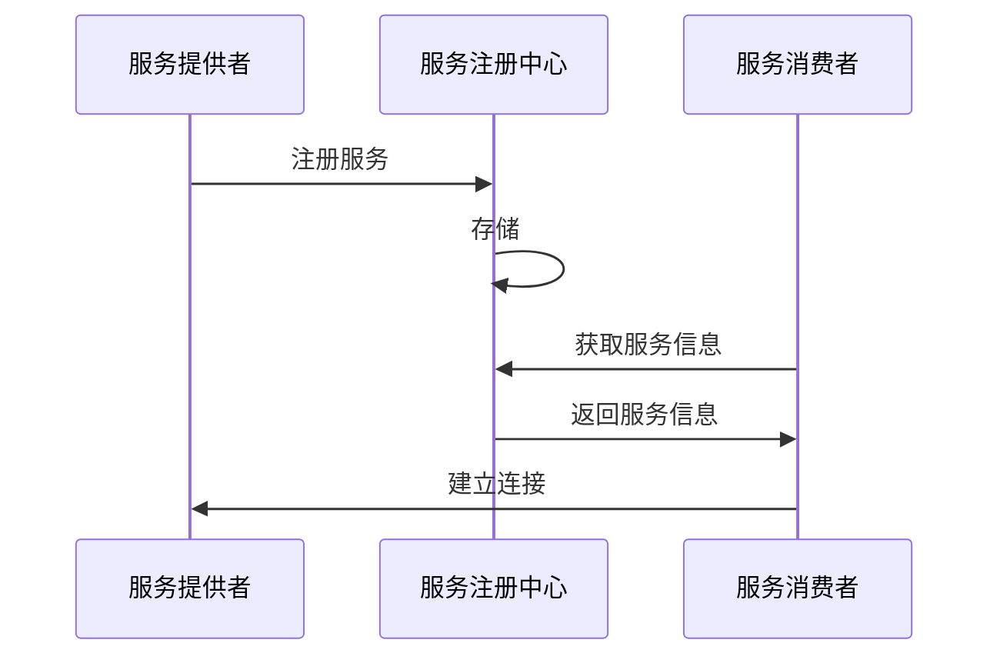
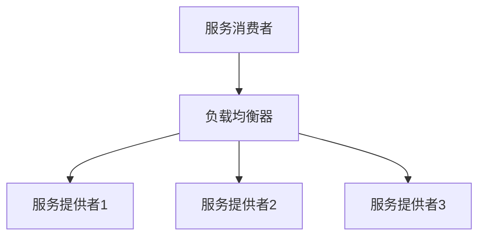
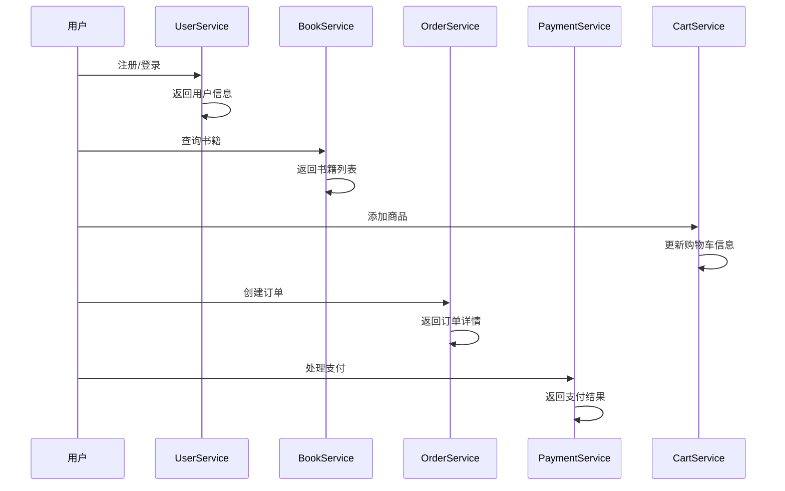

                 

### 微服务架构概述

> 关键词：微服务、架构设计、分布式系统、SOA、RESTful API、DevOps

微服务架构是一种基于分布式系统的服务架构模式，它将应用程序划分为一组小型、独立和相互解耦的服务单元。微服务架构的核心思想是将复杂的大型应用程序拆分成多个小型、单一职责的服务，每个服务负责实现特定的业务功能。这种设计模式不仅提高了系统的可维护性、灵活性和可扩展性，还为快速迭代开发和部署提供了便利。

#### 微服务架构的概念

微服务（Microservices）是一种软件架构风格，旨在通过将应用程序构建为一组小型服务来实现敏捷、弹性、可扩展的系统。每个服务都是独立部署和管理的，通过轻量级通信机制（如HTTP/REST或消息队列）进行交互。

#### 微服务架构的优势

1. **可扩展性**：通过水平扩展单个服务实例来提高系统的整体性能，而不是整个应用程序。
2. **灵活性**：允许团队独立开发和部署服务，提高了开发效率。
3. **故障隔离**：单个服务的故障不会影响整个系统的稳定性。
4. **技术多样性**：服务可以使用不同的编程语言、数据库和数据存储方案。
5. **持续集成与部署**：微服务架构支持频繁的迭代和部署，降低了风险。

#### 微服务架构与传统架构的比较

传统架构（如单体架构）将所有功能集中在一个庞大的应用程序中，而微服务架构则采用分布式服务的方式。以下是比较表格：

| 特性         | 单体架构                     | 微服务架构                   |
| ------------ | --------------------------- | ---------------------------- |
| 组成部分     | 单个应用程序               | 多个独立服务               |
| 通信机制     | 函数调用、共享库、全局变量 | HTTP/REST、消息队列、RPC等 |
| 扩展性       | 纵向扩展                   | 横向扩展                   |
| 维护与部署   | 整体部署                   | 单一服务部署               |
| 技术一致性   | 高                        | 低                        |
| 故障隔离     | 整体故障                   | 单一服务故障               |
| 依赖管理     | 复杂依赖                  | 独立依赖                  |

#### 微服务架构的核心原则

1. **独立部署**：每个服务都可以独立部署和升级，不影响其他服务。
2. **自治**：服务拥有自己的数据库和数据模型，减少服务间的依赖。
3. **去中心化**：无需中心化控制组件（如Eureka、Zookeeper），服务通过注册表和服务发现机制相互定位。
4. **解耦合**：通过轻量级通信机制（如HTTP/REST或消息队列）实现服务间的解耦合。
5. **可复用性**：服务可被多个应用程序复用。

#### 微服务的边界和拆分策略

确定服务边界是微服务架构设计的关键。以下是一些常见的拆分策略：

1. **业务能力**：根据业务功能划分服务。
2. **用户界面与后端逻辑分离**：将用户界面与业务逻辑分离，提高系统的可维护性。
3. **资源访问**：根据资源访问需求划分服务，如数据库服务、缓存服务、消息队列服务。
4. **数据一致性**：根据数据一致性需求划分服务，如订单服务、库存服务。

#### 综述

微服务架构通过将大型应用程序拆分为多个小型、自治的服务，实现了系统的弹性、可扩展性和灵活性。然而，这种架构模式也带来了新的挑战，如服务治理、数据一致性和安全性等问题。在接下来的章节中，我们将深入探讨微服务架构的核心概念、设计原则、服务治理、数据存储、安全性以及实施和部署策略。

### 微服务的核心概念与设计原则

微服务架构的核心在于其分解方式，即将应用程序分解为多个小型、自治的服务，这些服务可以通过轻量级通信机制进行交互。在深入探讨微服务的核心概念和设计原则之前，我们先来定义几个关键术语。

#### 微服务的核心概念

1. **服务**：微服务是应用程序中的一个功能模块，具有自己的逻辑和数据库。每个服务都可以独立部署、扩展和管理。
2. **自治**：服务是自治的，即每个服务可以独立运行和更新，不依赖于其他服务。
3. **解耦合**：服务通过轻量级通信机制（如HTTP/REST或消息队列）进行交互，解耦了服务的依赖。
4. **独立部署**：每个服务都可以独立部署，无需重启整个应用程序。
5. **可扩展性**：通过水平扩展单个服务实例，提高系统的整体性能。
6. **跨语言和跨平台**：服务可以使用不同的编程语言和技术栈，可以在不同的环境中运行。

#### 微服务的设计原则

1. **单一职责原则**：每个服务应只实现一个明确的功能，以保持服务的简洁和可维护性。
2. **自治原则**：服务应独立运行，无需依赖其他服务，减少服务间的耦合。
3. **独立性原则**：服务应具有独立的数据库和数据模型，降低服务间的数据依赖。
4. **独立性原则**：服务应具有独立的部署和监控机制，便于管理和维护。
5. **可扩展性原则**：服务应设计为可扩展的，以便在需要时可以水平扩展。
6. **松耦合原则**：服务间通过轻量级通信机制进行交互，降低服务间的耦合。

#### 微服务的边界和拆分策略

确定服务的边界是微服务架构设计的关键。以下是一些常见的拆分策略：

1. **基于业务能力的拆分**：根据业务功能将应用程序拆分为多个服务，每个服务负责实现一个具体的业务功能。
2. **用户界面与后端逻辑分离**：将用户界面与业务逻辑分离，提高系统的可维护性。
3. **基于资源访问的拆分**：根据资源访问需求将应用程序拆分为多个服务，如数据库服务、缓存服务、消息队列服务。
4. **基于数据一致性的拆分**：根据数据一致性需求将应用程序拆分为多个服务，如订单服务、库存服务。

#### 微服务的边界

1. **接口定义**：服务之间通过定义明确的API进行交互，通常使用RESTful API。
2. **数据传输**：服务间通过轻量级通信机制（如HTTP/REST或消息队列）进行数据传输。
3. **数据存储**：服务可以使用自己的数据库和数据模型，减少服务间的数据依赖。
4. **服务实例**：服务可以在不同的服务器或容器中运行，通过服务发现机制相互定位。

#### 设计原则的实践

在微服务架构设计中，以下原则可以帮助我们构建高质量的服务：

1. **模块化设计**：将应用程序分解为多个模块，每个模块对应一个服务。
2. **服务自治**：确保每个服务可以独立运行、扩展和监控。
3. **解耦合**：通过轻量级通信机制和服务注册表实现服务间的解耦合。
4. **可持续性**：设计可扩展的服务，以适应未来业务需求的变化。
5. **测试性**：为每个服务编写单元测试和集成测试，确保服务的可靠性。

#### 综述

微服务的核心概念和设计原则为构建灵活、可扩展和易于管理的分布式系统提供了指导。通过遵循单一职责、自治、独立性、独立部署和松耦合等原则，我们可以构建出具有高可维护性和可扩展性的微服务架构。在下一章中，我们将深入探讨微服务架构中的服务治理，包括服务注册与发现、服务路由与负载均衡，以及服务监控与故障恢复机制。

### 微服务架构中的服务治理

在微服务架构中，服务治理是一个至关重要的环节，它涵盖了服务注册与发现、服务路由与负载均衡、服务监控与故障恢复等多个方面。通过有效的服务治理，可以确保微服务架构的高可用性、可靠性和可扩展性。

#### 服务注册与发现

服务注册与发现是微服务架构的核心机制之一。服务注册是指服务启动时向服务注册中心注册自身的信息，如服务名称、地址、端口等。服务发现是指服务消费者通过服务注册中心获取服务提供者的信息，并建立与服务提供者的连接。

服务注册与发现机制的关键组件包括：

1. **服务注册中心**：负责存储和管理服务注册信息，如Consul、Zookeeper、Eureka等。
2. **服务提供者**：在启动时将自身信息注册到服务注册中心。
3. **服务消费者**：从服务注册中心获取服务提供者的信息，并建立连接。

以下是服务注册与发现流程的Mermaid流程图：



#### 服务路由与负载均衡

服务路由与负载均衡是微服务架构中实现高可用性和可扩展性的关键技术。服务路由是指将服务消费者的请求转发到适当的服务提供者。负载均衡则是指将请求分布到多个服务实例上，以避免单点瓶颈。

常见的负载均衡算法包括：

1. **轮询（Round Robin）**：将请求依次分配给各个服务实例。
2. **最少连接（Least Connections）**：将请求分配给连接数最少的服务实例。
3. **哈希（Hash）**：根据请求的特征（如IP地址、请求URL）进行哈希计算，将请求分配给相应的服务实例。

以下是服务路由与负载均衡的Mermaid架构图：



#### 服务监控与故障恢复

服务监控与故障恢复是确保微服务架构高可用性的关键。通过监控服务实例的健康状态，可以及时发现故障并进行恢复。常见的故障恢复策略包括：

1. **健康检查**：定期对服务实例进行健康检查，以确保其正常运行。
2. **故障转移**：当某个服务实例故障时，自动将其流量转移到健康的服务实例。
3. **故障恢复**：当故障服务实例恢复正常后，自动将其流量重新分配。

以下是服务监控与故障恢复的Mermaid流程图：

```mermaid
sequenceDiagram
    participant 服务提供者
    participant 服务监控
    participant 服务消费者

    服务提供者->>服务监控: 健康检查
    服务监控->>服务监控: 记录状态
    服务消费者->>服务监控: 请求转发
    alt 健康状态
        服务监控->>服务提供者: 转发请求
    else 故障状态
        服务监控->>服务监控: 故障转移
        服务监控->>服务消费者: 转发请求至健康实例
```

#### 综述

服务治理是微服务架构中不可或缺的一环，涵盖了服务注册与发现、服务路由与负载均衡、服务监控与故障恢复等多个方面。通过有效的服务治理，可以确保微服务架构的高可用性、可靠性和可扩展性。在下一章中，我们将探讨微服务架构中的数据存储与一致性挑战，以及分布式事务管理的解决方案。

### 微服务架构中的数据存储与一致性

在微服务架构中，数据存储与一致性是一个复杂且关键的问题。由于每个微服务都可以独立部署和管理，因此它们通常拥有自己的数据存储解决方案。这种分布式数据存储方式带来了数据一致性的挑战。本节将探讨微服务架构中常见的数据存储方案、数据一致性的挑战以及分布式事务管理的解决方案。

#### 常见的数据存储方案

1. **关系型数据库**：如MySQL、PostgreSQL等。关系型数据库提供了强大的数据一致性和事务管理能力，但可能在扩展性和灵活性方面受到限制。
2. **非关系型数据库**：如MongoDB、Cassandra等。非关系型数据库具有更好的可扩展性和灵活性，但可能牺牲部分数据一致性。
3. **分布式缓存**：如Redis、Memcached等。分布式缓存可以提高数据访问速度，但通常不用于存储永久数据。
4. **消息队列**：如Kafka、RabbitMQ等。消息队列用于异步处理和任务调度，不是永久存储解决方案。

#### 数据一致性的挑战

在微服务架构中，数据一致性的挑战主要来自以下几个方面：

1. **分布式事务**：由于每个微服务都有自己的数据存储，分布式事务管理变得更加复杂。在分布式系统中，保证所有服务在同一时刻看到一致的数据状态是一项挑战。
2. **网络分区**：在分布式系统中，网络分区可能导致部分服务不可达，从而影响数据一致性。
3. **数据副本同步**：在分布式数据存储中，数据副本的同步可能会导致数据延迟和冲突。
4. **服务故障**：服务故障可能导致数据不可用或数据丢失。

#### 分布式事务管理解决方案

1. **最终一致性**：最终一致性是一种允许系统在一定时间后达到一致状态的数据一致性模型。常见的技术包括CQRS（Command Query Responsibility Segregation）和事件溯源。
2. **两阶段提交（2PC）**：两阶段提交是一种分布式事务管理协议，用于确保分布式系统中的一致性。它通过两个阶段（投票阶段和提交阶段）来协调分布式事务。
3. **补偿事务**：当无法在分布式事务中保证一致性时，可以使用补偿事务来恢复一致性。补偿事务在事务失败后执行，以纠正错误。
4. **分布式锁**：分布式锁用于在分布式系统中同步访问共享资源，防止数据冲突。常见的技术包括基于Zookeeper、Redis等实现的分布式锁。
5. **本地事务**：通过将分布式事务拆分为多个本地事务，然后在每个服务中独立执行，可以简化分布式事务管理。

#### 实践案例

以一个在线书店为例，微服务架构可能包括用户服务、订单服务、库存服务、支付服务等。以下是数据存储与一致性解决方案的实践案例：

1. **用户服务**：使用关系型数据库（如MySQL）存储用户信息。
2. **订单服务**：使用关系型数据库（如PostgreSQL）存储订单信息，并使用最终一致性模型处理订单状态变化。
3. **库存服务**：使用非关系型数据库（如MongoDB）存储库存信息，并使用最终一致性模型与订单服务同步库存状态。
4. **支付服务**：使用消息队列（如Kafka）处理支付请求，并在支付成功后触发库存更新和订单状态更新。

#### 综述

在微服务架构中，数据存储与一致性是一个复杂但关键的问题。通过选择合适的数据存储方案和分布式事务管理策略，可以解决数据一致性的挑战。在下一章中，我们将探讨微服务架构的安全性，包括安全设计最佳实践、安全防护技术和常见的安全漏洞及其防范措施。

### 微服务架构的安全性

微服务架构的安全性是确保系统可靠运行的重要方面。由于微服务架构的分布式特性，安全性设计比传统的单体架构更为复杂。本节将探讨微服务架构中的安全性考虑、最佳实践和常见的安全漏洞及其防范措施。

#### 安全性考虑

在微服务架构中，安全性主要涉及以下几个方面：

1. **认证与授权**：确保只有授权用户可以访问服务，通过身份验证和授权机制（如OAuth2、JWT）来实现。
2. **数据保护**：保护传输中和存储中的敏感数据，使用加密技术（如SSL/TLS）确保数据传输的安全性，使用加密存储保护静态数据。
3. **访问控制**：限制对服务和数据的访问权限，通过角色和权限管理（如RBAC、ABAC）来控制访问。
4. **日志与监控**：记录系统操作日志，以便在发生安全事件时进行追踪和调查。实时监控系统状态，及时发现异常行为。

#### 安全设计最佳实践

以下是一些微服务架构中的安全设计最佳实践：

1. **使用安全协议**：在服务间通信中，使用HTTPS（SSL/TLS）确保数据传输的安全性。
2. **认证与授权**：使用OAuth2或JWT等认证和授权机制，确保每个请求都经过身份验证和授权。
3. **服务端点保护**：对服务端点（如RESTful API）进行访问控制，仅允许授权用户访问。
4. **输入验证**：对用户输入进行严格验证，防止SQL注入、跨站脚本（XSS）等攻击。
5. **数据加密**：对敏感数据进行加密存储，使用哈希算法（如SHA-256）对密码进行存储。
6. **日志记录**：记录所有系统操作和错误，以便进行审计和故障排查。
7. **安全测试**：定期进行安全测试（如渗透测试、漏洞扫描），及时修复安全问题。

#### 安全防护技术

以下是微服务架构中常用的安全防护技术：

1. **网络隔离**：通过防火墙和虚拟专用网络（VPN）等技术实现网络隔离，防止外部攻击。
2. **入侵检测系统（IDS）和入侵防御系统（IPS）**：监控网络流量，检测和阻止恶意活动。
3. **安全信息和事件管理（SIEM）**：收集和监控安全日志，实时分析并响应安全事件。
4. **安全容器化**：使用安全容器技术（如Docker Security Scanning）来确保容器环境的安全性。

#### 常见的安全漏洞及其防范措施

以下是一些微服务架构中常见的安全漏洞及其防范措施：

1. **SQL注入**：防范措施包括使用预编译语句、参数化查询和输入验证。
2. **跨站脚本（XSS）**：防范措施包括对输入数据进行编码和过滤，使用CSP（内容安全策略）。
3. **跨站请求伪造（CSRF）**：防范措施包括使用CSRF令牌和双重提交Cookie。
4. **未授权访问**：防范措施包括使用强认证、严格的访问控制和身份验证。
5. **信息泄露**：防范措施包括加密敏感数据、使用匿名化技术和加强日志管理。

#### 综述

微服务架构的安全性是一个复杂但至关重要的方面。通过遵循最佳实践和安全防护技术，可以显著提高系统的安全性。在下一章中，我们将探讨微服务架构的实施与部署，包括容器化与编排、容器镜像与仓库管理，以及持续集成与持续部署。

### 微服务架构的实施与部署

在成功设计微服务架构后，其实施与部署过程同样至关重要。这不仅涉及到将服务运行在适当的环境中，还包括容器的使用、镜像的管理、持续集成和持续部署（CI/CD）的实践。以下是微服务架构实施与部署的关键步骤和最佳实践。

#### 容器化与编排

容器化是一种轻量级虚拟化技术，它允许我们将应用程序及其依赖环境打包成一个独立的运行时单元。Docker是当前最流行的容器化平台。

**容器化优势：**
- **环境一致性**：确保开发、测试和生产环境一致，减少环境差异导致的问题。
- **资源隔离**：容器提供进程级别的资源隔离，提高资源利用率。
- **快速启动**：容器可以在毫秒级启动，大幅缩短部署时间。

**容器编排：**
Kubernetes（K8s）是目前最流行的容器编排工具，它提供了自动部署、扩展和管理容器化应用程序的能力。

**Kubernetes组件：**
- **Master节点**：负责集群控制和管理。
- **Node节点**：运行容器化应用程序。
- **Pod**：Kubernetes的基本部署单元，包含一个或多个容器。
- **Service**：用于将集群内部网络中的Pod暴露为网络服务。

**Kubernetes部署流程：**
1. **部署Kubernetes集群**：使用工具如kubeadm或Helm初始化集群。
2. **配置集群资源**：定义Pod、Service、Ingress等资源清单。
3. **应用部署**：通过kubectl命令部署应用程序。

#### 容器镜像与仓库管理

**容器镜像：**
容器镜像是一个静态的文件系统，包含了应用程序及其运行环境。Dockerfile用于构建容器镜像。

**Dockerfile示例：**
```Dockerfile
FROM python:3.8-slim
WORKDIR /app
COPY requirements.txt .
RUN pip install -r requirements.txt
COPY . .
CMD ["python", "app.py"]
```

**容器仓库：**
容器仓库用于存储和管理容器镜像，如Docker Hub、Quay.io和Google Container Registry。

**容器仓库最佳实践：**
- **镜像分层**：利用分层镜像，减少重复数据并优化存储。
- **最小化基础镜像**：选择最小化基础镜像以减小镜像大小。
- **多阶段构建**：使用多阶段构建分离构建和运行时环境。

#### 持续集成与持续部署（CI/CD）

持续集成（CI）和持续部署（CD）是软件开发中用于自动化构建、测试和部署的过程。

**持续集成（CI）：**
- **代码仓库**：将代码推送到代码仓库，触发构建和测试。
- **构建工具**：使用Jenkins、Travis CI等工具自动化构建。
- **测试**：执行单元测试、集成测试和功能测试。

**持续部署（CD）：**
- **部署脚本**：编写部署脚本自动化部署流程。
- **自动化部署**：使用Kubernetes的Helm或Kubernetes Deployment资源管理器自动化部署。

**CI/CD流程：**
1. **代码提交**：开发人员将代码提交到代码仓库。
2. **构建**：构建系统拉取最新代码并构建容器镜像。
3. **测试**：执行测试以确保代码质量。
4. **部署**：将测试通过的应用程序部署到生产环境。

#### 实施与部署的最佳实践

1. **容器镜像管理**：定期更新镜像，使用多阶段构建，确保镜像安全和优化。
2. **自动化测试**：确保每个提交的代码都经过全面测试。
3. **环境分离**：开发、测试和生产环境分离，确保环境一致性。
4. **监控与日志**：部署监控工具和日志收集系统，实时监控系统状态和日志。
5. **备份与恢复**：定期备份生产环境，确保数据安全和系统恢复能力。

#### 综述

微服务架构的实施与部署是确保系统能够快速、可靠地运行的关键环节。通过容器化和Kubernetes编排、容器镜像和仓库管理、以及持续集成与持续部署的实践，可以大幅提高系统的灵活性和可扩展性。在下一章中，我们将通过一个实际项目案例，展示微服务架构的设计与实现，包括系统功能设计、系统架构设计、接口设计和核心实现。

### 微服务架构的项目实战

为了更好地理解微服务架构的实际应用，我们将通过一个在线书店项目来展示其设计、实现和部署过程。这个项目将包括用户管理、书籍管理、订单管理、支付管理等模块，每个模块作为独立的微服务。

#### 项目背景介绍

在线书店项目是一个典型的电子商务系统，用户可以在平台上浏览书籍、添加购物车、下单支付，并且管理员可以管理书籍信息、订单状态等。由于业务需求的多样性和变化性，传统的单体架构难以应对。因此，我们选择微服务架构来提高系统的灵活性和可维护性。

#### 系统功能设计

在线书店的主要功能模块如下：

1. **用户管理**：注册、登录、修改密码、个人信息管理。
2. **书籍管理**：书籍分类、书籍信息查询、书籍添加、书籍修改、书籍删除。
3. **订单管理**：添加订单、修改订单、取消订单、订单查询。
4. **支付管理**：支付方式选择、支付处理、支付结果查询。
5. **购物车管理**：添加商品、删除商品、更新商品数量、结算。

#### 系统架构设计

在线书店的微服务架构设计如下：

1. **用户服务**：处理用户相关的所有功能，如注册、登录、个人信息管理等。
2. **书籍服务**：处理书籍相关的所有功能，如书籍查询、书籍管理、分类等。
3. **订单服务**：处理订单相关的所有功能，如订单创建、订单修改、订单查询等。
4. **支付服务**：处理支付相关的所有功能，如支付请求、支付处理、支付查询等。
5. **购物车服务**：处理购物车相关的所有功能，如添加商品、删除商品、更新商品数量等。

以下是系统架构的Mermaid类图：

```mermaid
classDiagram
    User <<class>> UserService
    Book <<class>> BookService
    Order <<class>> OrderService
    Payment <<class>> PaymentService
    Cart <<class>> CartService

    User o--<<uses>> BookService
    User o--<<uses>> OrderService
    User o--<<uses>> PaymentService
    User o--<<uses>> CartService

    Book o--<<uses>> OrderService
    Order o--<<uses>> PaymentService
    Cart o--<<uses>> OrderService
```

#### 系统接口设计和系统交互

在线书店的各个微服务通过RESTful API进行通信。以下是一个典型的接口设计和系统交互示例：

1. **用户服务API**：提供用户注册、登录、个人信息管理等接口。
2. **书籍服务API**：提供书籍查询、添加、修改、删除等接口。
3. **订单服务API**：提供订单创建、修改、查询、取消等接口。
4. **支付服务API**：提供支付处理、支付查询等接口。
5. **购物车服务API**：提供商品添加、删除、更新数量等接口。

以下是系统交互的Mermaid序列图：



#### 系统核心实现源代码解析

以下是用户服务的一个核心接口实现示例，使用Python和Flask框架：

```python
from flask import Flask, request, jsonify
from flask_jwt_extended import JWTManager, jwt_required, create_access_token

app = Flask(__name__)
app.config['JWT_SECRET_KEY'] = 'your_jwt_secret_key'
jwt = JWTManager(app)

# 用户注册接口
@app.route('/register', methods=['POST'])
def register():
    username = request.json.get('username', '')
    password = request.json.get('password', '')
    # 在此处添加用户注册的业务逻辑，如验证用户名是否已存在等
    # 存储用户信息到数据库
    # ...
    return jsonify({'message': '注册成功'})

# 用户登录接口
@app.route('/login', methods=['POST'])
def login():
    username = request.json.get('username', '')
    password = request.json.get('password', '')
    # 在此处添加用户登录的业务逻辑，如验证用户名和密码是否正确等
    # ...
    access_token = create_access_token(identity=username)
    return jsonify(access_token=access_token)

# 用户个人信息管理接口
@app.route('/me', methods=['GET'])
@jwt_required()
def me():
    current_user = get_jwt_identity()
    # 在此处添加获取用户个人信息的业务逻辑
    # ...
    return jsonify({'username': current_user})

if __name__ == '__main__':
    app.run(debug=True)
```

此代码示例展示了用户服务的注册、登录和个人信息管理接口的实现，通过JWT进行身份验证和访问控制。

#### 实际案例分析

在实际项目中，我们遇到了以下一些挑战和解决方案：

1. **跨服务调用**：由于各个服务独立部署，如何实现跨服务的调用成为关键问题。我们使用了API网关（如Kong）来统一管理服务路由和调用，简化了跨服务调用的复杂性。
2. **数据一致性**：由于各个服务使用独立的数据库，如何保证数据一致性是一个挑战。我们采用了最终一致性模型，并使用消息队列（如Kafka）进行异步消息传递，确保数据最终一致。
3. **性能优化**：在系统上线初期，我们遇到了性能瓶颈，通过数据库优化、缓存策略（如Redis）和负载均衡技术（如Nginx）进行了优化。

#### 项目小结与总结

通过在线书店项目，我们展示了如何设计、实现和部署微服务架构。项目实践表明，微服务架构具有高灵活性、可扩展性和可维护性。在未来的项目中，我们将继续优化系统架构，提升性能和安全性，以应对不断变化的业务需求。

### 微服务架构的展望与未来趋势

随着云计算、大数据和人工智能技术的快速发展，微服务架构在IT行业中的应用越来越广泛。尽管微服务架构已经取得了显著的成就，但未来的发展仍面临诸多挑战和机遇。以下是微服务架构的展望与未来趋势：

#### 挑战

1. **复杂性管理**：微服务架构的分布式特性带来了更高的复杂性，包括服务管理、监控和故障恢复等。未来需要更加智能和自动化的工具来简化微服务管理。
2. **数据一致性和事务管理**：在分布式环境中保证数据一致性和事务管理仍然是一个挑战。需要探索新的数据一致性模型和分布式事务解决方案。
3. **安全性**：随着攻击手段的多样化，微服务架构的安全性也需要不断提升。需要开发更加完善的安全框架和防护措施。

#### 机遇

1. **云原生技术**：云原生技术（如Kubernetes、Docker）的成熟为微服务架构提供了更好的基础设施支持。未来云原生技术将进一步推动微服务架构的发展。
2. **服务网格**：服务网格（如Istio、Linkerd）提供了服务间通信的安全、监控和流量管理功能，为微服务架构带来了更加精细化的控制。
3. **人工智能**：人工智能技术在微服务架构中的应用将进一步提高系统的智能化水平和自动化程度，如智能监控、故障预测和自动化部署。

#### 未来趋势

1. **服务自治与智能服务**：未来的微服务架构将更加注重服务的自治性，服务将具备自我监控、自我修复和自我优化的能力。
2. **混合云和多云**：随着企业业务需求的多样化，混合云和多云架构将成为主流。微服务架构将更好地适应这种多变的部署环境。
3. **服务治理与自动化**：未来的服务治理将更加智能化和自动化，通过人工智能和机器学习技术，实现对服务的全面管理和优化。

#### 综述

微服务架构在未来的发展中将继续发挥重要作用，为分布式系统的构建提供强有力的支持。通过应对挑战和把握机遇，微服务架构将不断演进，为企业和开发者带来更多的价值。

### 最佳实践与注意事项

在微服务架构设计和实践中，遵循最佳实践和注意事项对于确保系统的稳定性和高效性至关重要。以下是一些关键的最佳实践和注意事项：

#### 最佳实践

1. **服务自治**：确保每个服务具有独立的部署、监控和管理能力，降低服务间的依赖。
2. **最小化服务规模**：服务规模应适中，不宜过大，以减少复杂性和提高可维护性。
3. **API设计**：遵循RESTful API设计原则，确保接口简洁、易于理解。
4. **服务间通信**：使用轻量级通信机制（如HTTP/REST、消息队列）进行服务间通信，减少耦合。
5. **持续集成与部署**：实施CI/CD流程，确保代码质量和快速迭代。
6. **监控与日志**：部署监控和日志系统，实时监控系统性能和状态，及时发现并解决问题。

#### 注意事项

1. **数据一致性**：在分布式系统中，确保数据一致性是一个关键挑战。避免过度依赖强一致性模型，考虑最终一致性模型。
2. **服务隔离**：确保服务间具有良好的隔离性，避免服务故障影响整个系统。
3. **安全性**：加强安全性设计，包括认证、授权、数据加密和网络安全等。
4. **负载均衡**：合理配置负载均衡策略，避免单点瓶颈和性能瓶颈。
5. **测试与文档**：编写全面的功能测试和单元测试，并保持API文档的更新。
6. **团队协作**：加强团队协作，确保每个服务都有明确的负责人。

#### 拓展阅读

- **《微服务设计》**：由Martin Fowler和Mike Scott合著，是关于微服务架构的经典著作。
- **《微服务实战》**：由Sam Newman撰写，提供了微服务架构的详细实践指南。
- **《Kubernetes权威指南》**：由张磊撰写，涵盖了Kubernetes的深入理解和实践。
- **《云原生应用架构指南》**：由云原生计算基金会（CNCF）发布，介绍了云原生应用架构的原理和实践。

遵循这些最佳实践和注意事项，将有助于构建高效、稳定和可维护的微服务架构。通过不断学习和实践，我们可以更好地应对微服务架构带来的挑战，充分发挥其优势。作者：AI天才研究院/AI Genius Institute & 禅与计算机程序设计艺术 /Zen And The Art of Computer Programming。

