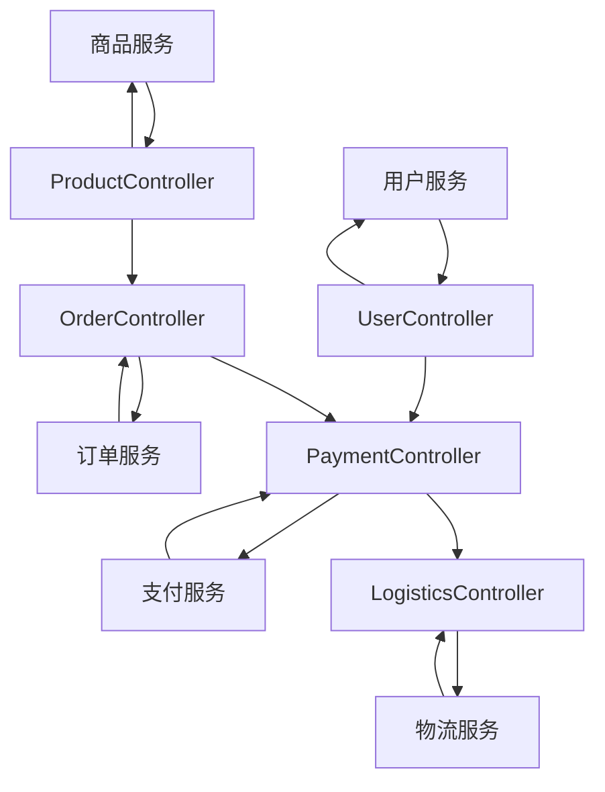

                 

### 微服务架构：设计、实现与运维挑战

> 关键词：微服务架构、服务拆分、容器化、微服务治理、性能优化

> 摘要：本文将深入探讨微服务架构的设计、实现与运维挑战。通过详细分析微服务架构的背景、核心概念、设计原则、实现方法、部署与运维策略以及最佳实践，为读者提供全面的微服务架构知识体系。本文旨在帮助读者理解微服务架构的原理、解决实际开发与运维中的难题，并展望其未来发展趋势。

## 第一部分：微服务架构概述

### 第1章：微服务架构基础

#### 1.1 微服务架构的定义与历史背景

微服务架构（Microservices Architecture）是一种面向服务的架构（Service-Oriented Architecture，SOA）的一种变体。微服务架构将应用程序作为一套小型服务组合起来，每个服务都是独立的、可扩展的，且围绕业务功能进行划分。这些服务通过轻量级的通信机制进行交互，通常基于HTTP/HTTPS和RESTful API。

微服务架构的历史可以追溯到2000年代初期，随着Web 2.0时代的兴起，互联网公司开始采用基于服务的方式构建复杂的分布式系统。其中，最著名的案例是亚马逊在2002年采用微服务架构进行系统重构。随着云计算和容器技术的成熟，微服务架构逐渐成为开发分布式系统的首选方案。

#### 1.2 微服务架构的优势与挑战

微服务架构的主要优势包括：

- **可扩展性**：微服务架构允许独立扩展每个服务，从而提高整个系统的可扩展性。
- **灵活性**：服务之间松耦合，可以独立开发、部署和升级，降低了系统的变更风险。
- **可维护性**：服务独立性使得每个服务的开发和维护更加简单和高效。
- **技术多样性**：服务可以使用不同的编程语言、框架和数据库，提高了开发人员的自由度。

然而，微服务架构也带来了一些挑战：

- **复杂性**：服务拆分和通信机制增加了系统的复杂性，需要更多的管理工具和技术。
- **性能开销**：频繁的网络调用和分布式事务可能会导致性能开销增加。
- **监控与运维**：分布式系统的监控和运维变得更加复杂，需要更完善的管理策略和工具。

#### 1.3 微服务架构与传统架构的比较

传统架构通常采用单体应用（Monolithic Architecture）的方式，所有功能都集成在一个大型的应用程序中。与微服务架构相比，传统架构的主要缺点包括：

- **可扩展性差**：整个应用程序一起部署，扩展某个功能需要扩展整个系统。
- **变更风险高**：修改一个功能可能影响到整个应用程序，增加了变更风险。
- **维护困难**：单体应用程序的维护和升级变得复杂和耗时。

传统架构的优点是开发和维护相对简单，系统整体性强。而微服务架构则更适用于大规模、复杂的应用程序，能够提高系统的可扩展性和灵活性。

### 第2章：微服务架构设计原则

#### 2.1 微服务划分与模块化设计

微服务架构中的服务划分是设计的关键步骤。以下是一些服务划分的原则：

- **基于业务功能划分**：每个服务应围绕一个业务功能进行划分，实现业务逻辑的独立性。
- **独立性**：服务之间应保持独立，尽量减少依赖关系。
- **规模适中**：服务不应过大或过小，过大可能导致复杂性增加，过小则可能导致服务数量过多，难以管理。

模块化设计是微服务架构的核心原则之一。模块化设计将系统分解为多个独立、可复用的模块，每个模块负责特定的功能。模块之间通过清晰的接口进行通信，降低了系统复杂性。

#### 2.2 服务拆分策略

服务拆分策略是微服务架构设计的核心。以下是一些常用的服务拆分策略：

- **功能拆分**：将应用程序按照功能进行拆分，每个功能模块对应一个服务。
- **用户角色拆分**：根据用户角色和功能需求拆分服务，例如用户管理、订单处理等。
- **数据拆分**：根据数据模型和访问模式拆分服务，例如客户数据、订单数据等。

服务拆分策略的选择取决于具体业务需求和系统架构。合理的服务拆分可以提高系统的可扩展性、可维护性和灵活性。

#### 2.3 服务间的通信机制

微服务架构中的服务通信机制是系统设计的核心之一。以下是一些常用的服务通信机制：

- **RESTful API**：基于HTTP/HTTPS协议的RESTful API是微服务架构中最常用的通信方式。它具有简单、轻量、易于扩展的特点。
- **消息队列**：消息队列（如Kafka、RabbitMQ）用于异步通信和分布式消息传递。它可以提高系统的可靠性、异步性和解耦性。
- **服务网格**：服务网格（如Istio、Linkerd）提供了一种新型的服务通信机制，可以实现服务发现、负载均衡、安全通信等功能。

选择合适的通信机制取决于具体业务需求和系统架构。合理的通信机制可以提高系统的性能和可靠性。

### 第3章：微服务实现

#### 3.1 服务开发框架

服务开发框架是微服务架构实现的关键。以下是一些常用的服务开发框架：

- **Spring Boot**：Spring Boot 是最流行的Java服务开发框架之一，提供了快速构建微服务的功能。
- **Node.js**：Node.js 是一种基于JavaScript的服务开发框架，适用于构建轻量级的微服务。
- **Django**：Django 是一种Python服务开发框架，适用于构建快速、高效的Web应用程序。

选择合适的开发框架取决于开发语言偏好、业务需求和项目规模。

#### 3.2 服务配置管理

服务配置管理是微服务架构实现的重要环节。以下是一些服务配置管理的方法：

- **静态配置**：将配置信息硬编码到服务代码中，适用于配置简单的场景。
- **外部配置中心**：使用外部配置中心（如Consul、Apollo）管理配置信息，可以实现配置的动态更新和版本控制。
- **环境变量**：使用环境变量管理配置信息，适用于多环境部署的场景。

合理的配置管理可以提高服务的可维护性和可扩展性。

#### 3.3 服务安全性设计

服务安全性设计是微服务架构实现的关键。以下是一些服务安全性设计的方法：

- **认证与授权**：使用认证与授权机制（如OAuth 2.0、JWT）确保服务访问的安全性。
- **加密与签名**：对敏感数据进行加密和签名，确保数据传输的安全性。
- **API网关**：使用API网关（如Kong、NGINX）进行统一的安全控制和管理。

合理的安全性设计可以提高系统的安全性和可靠性。

### 第4章：微服务部署与运维

#### 4.1 微服务部署策略

微服务部署策略是微服务架构实现的重要环节。以下是一些微服务部署策略：

- **手动部署**：手动部署适用于小型、简单的项目，但难以实现自动化和快速迭代。
- **自动化部署**：使用自动化工具（如Jenkins、Ansible）实现自动化部署，可以提高部署效率和可靠性。
- **容器化部署**：使用容器（如Docker）进行部署，可以实现快速部署、环境一致性、弹性扩展等功能。

合理的部署策略可以提高系统的部署效率和可靠性。

#### 4.2 容器化与容器编排

容器化是微服务架构实现的重要技术之一。以下是一些容器化和容器编排的相关技术：

- **Docker**：Docker 是最流行的容器化技术，可以实现快速部署、环境一致性、容器镜像管理等。
- **Kubernetes**：Kubernetes 是一种开源的容器编排工具，可以实现容器集群的管理、调度、自动化运维等功能。

合理的容器化与容器编排可以提高系统的可扩展性和可靠性。

#### 4.3 微服务监控与日志管理

微服务监控与日志管理是微服务架构运维的关键。以下是一些监控与日志管理的方法：

- **Prometheus**：Prometheus 是一种开源的监控解决方案，可以实现指标收集、报警等功能。
- **ELK栈**：ELK栈（Elasticsearch、Logstash、Kibana）是一种开源的日志管理解决方案，可以实现日志收集、存储、分析和可视化等功能。

合理的监控与日志管理可以提高系统的可维护性和可靠性。

### 第5章：微服务架构最佳实践

#### 5.1 微服务架构的设计模式

微服务架构的设计模式是微服务架构实现的最佳实践之一。以下是一些常用的设计模式：

- **CQRS**：CQRS（Command Query Responsibility Segregation）模式将命令和查询分离，可以提高系统的性能和可扩展性。
- **Event Sourcing**：Event Sourcing 模式将状态变化记录为事件，可以实现数据一致性和可追溯性。
- **异步处理**：异步处理可以提高系统的并发能力和响应速度。

合理的设计模式可以提高系统的性能和可扩展性。

#### 5.2 微服务治理与迁移

微服务治理与迁移是微服务架构运维的关键。以下是一些治理与迁移的方法：

- **服务发现**：使用服务发现机制（如Consul、Eureka）实现服务注册和发现，可以提高系统的可用性和可靠性。
- **灰度发布**：使用灰度发布策略（如AB测试、金丝雀部署）逐步引入新版本，可以降低系统变更风险。
- **迁移策略**：制定合理的迁移策略（如分阶段迁移、数据迁移等）可以降低系统迁移风险。

合理的治理与迁移策略可以提高系统的稳定性和可靠性。

#### 5.3 微服务性能优化

微服务性能优化是微服务架构运维的关键。以下是一些性能优化方法：

- **缓存**：使用缓存（如Redis、Memcached）减少数据库访问，可以提高系统的性能和响应速度。
- **负载均衡**：使用负载均衡器（如Nginx、HAProxy）实现服务请求的负载均衡，可以提高系统的性能和可用性。
- **数据库优化**：优化数据库查询和索引，可以提高数据库性能和响应速度。

合理的性能优化策略可以提高系统的性能和响应速度。

### 第6章：微服务架构案例分析

#### 6.1 某电商平台微服务架构实践

某电商平台采用微服务架构实现了其复杂的业务系统。以下是其微服务架构的实践：

- **服务划分**：按照业务功能模块划分服务，如用户管理、商品管理、订单管理、支付等。
- **通信机制**：使用RESTful API和消息队列实现服务间通信。
- **部署与运维**：使用Docker和Kubernetes进行容器化部署和容器编排，使用Prometheus和ELK栈进行监控和日志管理。

通过微服务架构，该电商平台提高了系统的可扩展性、灵活性和可维护性。

#### 6.2 某金融系统微服务架构设计

某金融系统采用微服务架构实现了其高并发、高可用性的业务系统。以下是其微服务架构的设计：

- **服务划分**：按照业务功能模块和用户角色划分服务，如用户服务、账户服务、交易服务、支付服务等。
- **通信机制**：使用gRPC和消息队列实现服务间通信。
- **部署与运维**：使用Kubernetes进行容器化部署和容器编排，使用Prometheus和Grafana进行监控和日志管理。

通过微服务架构，该金融系统实现了高并发、高可用性和高安全性。

#### 6.3 某物联网平台微服务架构优化

某物联网平台采用微服务架构实现了其复杂的物联网系统。以下是其微服务架构的优化：

- **服务划分**：按照物联网设备类型和功能模块划分服务，如设备接入服务、数据处理服务、监控服务、报警服务等。
- **通信机制**：使用WebSocket和消息队列实现服务间通信。
- **部署与运维**：使用Kubernetes进行容器化部署和容器编排，使用Prometheus和InfluxDB进行监控和日志管理。

通过微服务架构优化，该物联网平台提高了系统的性能和可靠性。

### 第7章：微服务架构未来发展趋势

#### 7.1 微服务架构的演进方向

微服务架构的未来发展趋势包括以下几个方面：

- **服务网格**：服务网格技术（如Istio、Linkerd）将逐渐成为微服务架构的重要组件，提供更高效、更安全的服务通信和管理。
- **云原生**：随着云原生技术的成熟，微服务架构将更加紧密地与云计算结合，实现更高效的资源利用和更灵活的部署方式。
- **智能化运维**：借助人工智能和大数据技术，微服务架构的运维将更加智能化、自动化，提高系统的稳定性和可靠性。

#### 7.2 微服务与云计算的结合

云计算与微服务架构的结合将推动微服务架构的发展。以下是一些结合的方式：

- **云服务化**：将微服务架构部署在云平台上，实现服务的自动化部署、扩展和管理。
- **云原生应用**：使用云原生技术（如Kubernetes、Docker）构建和部署微服务应用程序，实现高效的资源利用和快速的部署迭代。
- **云服务集成**：将微服务与云服务（如云数据库、云存储、云监控等）集成，提高系统的性能和可靠性。

#### 7.3 微服务架构的未来挑战

微服务架构在发展过程中也将面临一些挑战：

- **性能优化**：微服务架构中频繁的网络调用和分布式事务可能会导致性能问题，需要持续优化。
- **安全性**：微服务架构中服务数量众多，安全性管理将变得更加复杂，需要完善的安全策略和工具。
- **运维管理**：分布式系统的运维管理将变得更加复杂，需要高效的运维工具和自动化策略。

通过不断优化和改进，微服务架构将能够应对这些挑战，实现更加高效、可靠的分布式系统。

## 结语

微服务架构作为一种先进的分布式系统架构，在提高系统可扩展性、灵活性和可维护性方面具有显著优势。本文从微服务架构的概述、设计原则、实现方法、部署与运维策略、最佳实践以及未来发展趋势等方面进行了详细探讨。通过本文的阅读，读者可以全面了解微服务架构的原理和实践，为实际项目提供有益的指导。

作者：AI天才研究院/AI Genius Institute & 禅与计算机程序设计艺术 /Zen And The Art of Computer Programming

----------------------------------------------------------------

### 文章标题：微服务架构：设计、实现与运维挑战

#### 关键词：微服务架构、服务拆分、容器化、微服务治理、性能优化

#### 摘要：本文深入探讨了微服务架构的设计原则、实现方法、部署与运维策略以及最佳实践，为读者提供了一个全面的微服务架构知识体系。通过案例分析，本文展示了微服务架构在实际项目中的应用和实践，并展望了其未来发展趋势。

### 目录大纲

```
----------------------------------------------------------------
# 第一部分：微服务架构概述

## 第1章：微服务架构基础

### 1.1 微服务架构的定义与历史背景
### 1.2 微服务架构的优势与挑战
### 1.3 微服务架构与传统架构的比较

## 第2章：微服务架构设计原则

### 2.1 微服务划分与模块化设计
### 2.2 服务拆分策略
### 2.3 服务间的通信机制

## 第3章：微服务实现

### 3.1 服务开发框架
### 3.2 服务配置管理
### 3.3 服务安全性设计

## 第4章：微服务部署与运维

### 4.1 微服务部署策略
### 4.2 容器化与容器编排
### 4.3 微服务监控与日志管理

## 第5章：微服务架构最佳实践

### 5.1 微服务架构的设计模式
### 5.2 微服务治理与迁移
### 5.3 微服务性能优化

## 第6章：微服务架构案例分析

### 6.1 某电商平台微服务架构实践
### 6.2 某金融系统微服务架构设计
### 6.3 某物联网平台微服务架构优化

## 第7章：微服务架构未来发展趋势

### 7.1 微服务架构的演进方向
### 7.2 微服务与云计算的结合
### 7.3 微服务架构的未来挑战

----------------------------------------------------------------
```

### 第一部分：微服务架构概述

#### 第1章：微服务架构基础

##### 1.1 微服务架构的定义与历史背景

微服务架构（Microservices Architecture）是一种基于组件的软件开发方法，它将应用程序分解为一组小的、独立的、可复用的服务。这些服务围绕业务功能进行组织，每个服务都可以独立部署、扩展和升级。

微服务架构的历史可以追溯到2000年代初期。当时，互联网公司开始面临日益增长的业务需求和技术复杂性，单体应用（Monolithic Architecture）已经无法满足这些需求。于是，开发者们开始探索将应用程序拆分为更小的服务，以实现更好的可扩展性和可维护性。

2002年，亚马逊在其电子商务平台上引入了微服务架构，这被认为是微服务架构的里程碑事件。随后，其他公司如Netflix和维基百科也采用了微服务架构，进一步推动了其发展。

##### 1.2 微服务架构的优势与挑战

微服务架构的主要优势包括：

- **可扩展性**：每个服务都可以独立扩展，从而提高系统的整体可扩展性。
- **灵活性**：服务之间松耦合，可以独立开发、部署和升级，降低了系统的变更风险。
- **可维护性**：服务独立性使得每个服务的开发和维护更加简单和高效。
- **技术多样性**：服务可以使用不同的编程语言、框架和数据库，提高了开发人员的自由度。

然而，微服务架构也带来了一些挑战：

- **复杂性**：服务拆分和通信机制增加了系统的复杂性，需要更多的管理工具和技术。
- **性能开销**：频繁的网络调用和分布式事务可能会导致性能开销增加。
- **监控与运维**：分布式系统的监控和运维变得更加复杂，需要更完善的管理策略和工具。

##### 1.3 微服务架构与传统架构的比较

传统架构，尤其是单体应用架构，通常将所有功能都集成在一个大型的应用程序中。这种架构的优点是开发和维护相对简单，系统整体性强。然而，它也存在一些缺点：

- **可扩展性差**：整个应用程序一起部署，扩展某个功能需要扩展整个系统。
- **变更风险高**：修改一个功能可能影响到整个应用程序，增加了变更风险。
- **维护困难**：单体应用程序的维护和升级变得复杂和耗时。

与微服务架构相比，传统架构的主要缺点在于：

- **可扩展性**：微服务架构允许独立扩展每个服务，从而提高系统的可扩展性。
- **变更风险**：服务之间松耦合，减少了变更风险。
- **维护难度**：服务独立性使得每个服务的开发和维护更加简单和高效。

总之，微服务架构在提高系统的可扩展性、灵活性和可维护性方面具有显著优势，但同时也带来了更多的复杂性和挑战。理解这些优势和挑战，对于设计、实现和维护微服务架构至关重要。

#### 第2章：微服务架构设计原则

##### 2.1 微服务划分与模块化设计

微服务架构中的服务划分是设计的关键步骤。正确的服务划分可以确保系统的高可扩展性、高可用性和高可维护性。以下是一些服务划分的原则：

1. **基于业务功能划分**：每个服务应围绕一个业务功能进行划分，实现业务逻辑的独立性。例如，可以将用户管理、订单处理、商品管理等功能分别划分为独立的服务。

2. **独立性**：服务之间应保持独立，尽量减少依赖关系。这有助于降低系统的复杂性，提高服务的可维护性和可扩展性。

3. **规模适中**：服务不应过大或过小。过大的服务可能导致复杂性增加，难以管理和维护；过小的服务可能导致服务数量过多，增加管理负担。

4. **职责单一**：每个服务应具有明确的职责，避免功能重叠。这有助于提高服务的可理解性，降低开发和维护的难度。

5. **无状态**：服务应尽量无状态，避免存储用户会话信息或状态信息。无状态服务可以提高系统的可扩展性和容错性。

##### 2.2 服务拆分策略

服务拆分策略是微服务架构设计的重要环节。以下是一些常用的服务拆分策略：

1. **功能拆分**：根据业务功能将应用程序拆分为多个独立的服务。每个服务负责实现一个或多个功能，这样可以提高系统的模块化程度和可维护性。

2. **用户角色拆分**：根据用户角色和功能需求拆分服务。例如，可以将用户管理、管理员功能、普通用户功能分别划分为独立的服务。

3. **数据拆分**：根据数据模型和访问模式拆分服务。例如，可以将客户数据、订单数据、库存数据分别划分为独立的服务。

4. **事件驱动的拆分**：根据业务事件拆分服务。例如，可以将用户注册、订单创建、支付处理等事件分别划分为独立的服务。

5. **技术栈拆分**：根据不同的技术栈拆分服务。例如，可以将前端服务、后端服务、数据库服务分别划分为独立的服务。

选择合适的服务拆分策略取决于具体业务需求和系统架构。合理的服务拆分可以提高系统的可扩展性、灵活性和可维护性。

##### 2.3 服务间的通信机制

微服务架构中的服务通信机制是系统设计的关键之一。以下是一些常用的服务通信机制：

1. **RESTful API**：基于HTTP/HTTPS协议的RESTful API是微服务架构中最常用的通信方式。它具有简单、轻量、易于扩展的特点。RESTful API通常使用JSON或XML作为数据交换格式。

2. **消息队列**：消息队列（如Kafka、RabbitMQ）用于异步通信和分布式消息传递。它可以提高系统的可靠性、异步性和解耦性。消息队列通常用于处理复杂的业务逻辑、异步任务和事件驱动架构。

3. **服务发现**：服务发现机制（如Consul、Eureka）用于在分布式系统中自动注册和发现服务。服务发现可以提高系统的可用性和可扩展性，避免硬编码服务地址。

4. **gRPC**：gRPC 是一种高性能、跨语言的RPC框架，基于HTTP/2协议。它支持多种编程语言，可以提供高效的二进制数据传输。

5. **服务网格**：服务网格（如Istio、Linkerd）提供了一种新型的服务通信机制，可以实现服务发现、负载均衡、安全通信等功能。服务网格通常用于处理复杂的网络拓扑和服务管理。

选择合适的通信机制取决于具体业务需求和系统架构。合理的通信机制可以提高系统的性能和可靠性。

#### 第3章：微服务实现

##### 3.1 服务开发框架

服务开发框架是微服务架构实现的重要基础。以下是一些常用的服务开发框架：

1. **Spring Boot**：Spring Boot 是基于Spring框架的微服务开发框架，提供了快速构建微服务的功能。它支持自动配置、嵌入式Web服务器、单元测试等功能。

2. **Node.js**：Node.js 是一种基于JavaScript的服务开发框架，适用于构建轻量级的微服务。它具有高性能、异步非阻塞的特点，适用于实时数据处理和事件驱动架构。

3. **Django**：Django 是一种基于Python的服务开发框架，适用于构建快速、高效的Web应用程序。它具有丰富的功能模块、自动化的ORM和优化的数据库操作。

4. **Kotlin**：Kotlin 是一种现代化的编程语言，适用于构建微服务。它具有简洁的语法、强类型和现代化的功能，适用于多平台开发。

选择合适的开发框架取决于具体业务需求和开发语言偏好。合理的开发框架可以提高开发效率和系统性能。

##### 3.2 服务配置管理

服务配置管理是微服务架构实现的重要环节。以下是一些服务配置管理的方法：

1. **静态配置**：将配置信息硬编码到服务代码中，适用于配置简单的场景。这种方法的主要缺点是配置难以动态更新和版本控制。

2. **外部配置中心**：使用外部配置中心（如Consul、Apollo）管理配置信息，可以实现配置的动态更新和版本控制。外部配置中心通常提供配置存储、配置刷新和配置监听等功能。

3. **环境变量**：使用环境变量管理配置信息，适用于多环境部署的场景。环境变量可以在不同环境中设置不同的配置值，提高了系统的可维护性和灵活性。

4. **配置文件**：使用配置文件（如JSON、YAML）管理配置信息，适用于复杂的配置场景。配置文件可以存储在本地文件系统、配置中心或远程存储中。

合理的配置管理可以提高服务的可维护性和可扩展性。

##### 3.3 服务安全性设计

服务安全性设计是微服务架构实现的关键。以下是一些服务安全性设计的方法：

1. **认证与授权**：使用认证与授权机制（如OAuth 2.0、JWT）确保服务访问的安全性。认证验证用户身份，授权确定用户权限。

2. **加密与签名**：对敏感数据进行加密和签名，确保数据传输的安全性。加密可以防止数据在传输过程中被窃取，签名可以确保数据的完整性和真实性。

3. **API网关**：使用API网关（如Kong、NGINX）进行统一的安全控制和管理。API网关可以实现请求路由、认证授权、限流、熔断等功能。

4. **安全传输**：使用HTTPS协议进行安全传输，确保数据在传输过程中不被窃听和篡改。

5. **访问控制**：实现基于角色的访问控制（RBAC）或基于属性的访问控制（ABAC），确保用户只能访问其有权访问的资源。

合理的安全性设计可以提高系统的安全性和可靠性。

#### 第4章：微服务部署与运维

##### 4.1 微服务部署策略

微服务部署策略是微服务架构实现的重要环节。以下是一些微服务部署策略：

1. **手动部署**：手动部署适用于小型、简单的项目，但难以实现自动化和快速迭代。手动部署的缺点是部署过程繁琐、容易出错，不适用于大型、复杂的系统。

2. **自动化部署**：使用自动化工具（如Jenkins、Ansible）实现自动化部署，可以提高部署效率和可靠性。自动化部署可以通过脚本、配置文件或CI/CD工具实现自动部署、自动化测试和自动发布。

3. **容器化部署**：使用容器（如Docker）进行部署，可以实现快速部署、环境一致性、弹性扩展等功能。容器化部署可以通过Dockerfile、Docker Compose或Kubernetes进行管理。

4. **蓝绿部署**：蓝绿部署是一种常见的部署策略，它将生产环境的服务分为两组，一组是当前运行的（蓝色），另一组是待发布的（绿色）。发布新版本时，将新版本的服务部署到绿色环境，然后切换到绿色环境，如果出现任何问题，可以快速回滚到蓝色环境。

5. **灰度发布**：灰度发布是一种逐步引入新版本的方法，它可以将新版本的服务与旧版本的服务并行运行，逐步增加新版本的服务占比。灰度发布可以降低系统变更风险，提高系统的稳定性。

选择合适的部署策略取决于具体业务需求和系统架构。合理的部署策略可以提高系统的部署效率和可靠性。

##### 4.2 容器化与容器编排

容器化是微服务架构实现的重要技术之一。以下是一些容器化和容器编排的相关技术：

1. **Docker**：Docker 是一种开源的应用容器引擎，它可以将应用程序及其依赖环境打包成一个轻量级的容器镜像，实现快速部署、环境一致性、弹性扩展等功能。

2. **Docker Compose**：Docker Compose 是一种用于定义和运行多容器应用的工具，它可以使用YAML文件定义服务、网络和卷等，实现容器化应用的自动化部署和管理。

3. **Kubernetes**：Kubernetes 是一种开源的容器编排平台，它用于自动化容器的部署、扩展和管理。Kubernetes 提供了强大的调度、负载均衡、服务发现、自我修复等功能。

4. **Docker Swarm**：Docker Swarm 是Docker提供的一种集群管理工具，它可以将多个Docker Engine节点组成一个集群，提供类似于Kubernetes的容器编排功能。

5. **容器镜像仓库**：容器镜像仓库（如Docker Hub、Harbor）用于存储和管理容器镜像，可以实现镜像的版本控制、安全认证和快速分发。

合理的容器化与容器编排可以提高系统的可扩展性和可靠性。

##### 4.3 微服务监控与日志管理

微服务监控与日志管理是微服务架构运维的关键。以下是一些监控与日志管理的方法：

1. **Prometheus**：Prometheus 是一种开源的监控解决方案，它通过拉取指标数据、存储和查询数据进行监控。Prometheus 提供了强大的告警机制、数据可视化功能以及与其他监控工具的集成能力。

2. **Grafana**：Grafana 是一种开源的数据可视化工具，它可以与Prometheus、InfluxDB等监控工具集成，实现实时监控数据的可视化展示。

3. **ELK栈**：ELK栈（Elasticsearch、Logstash、Kibana）是一种开源的日志管理解决方案，它用于收集、存储、分析和可视化日志数据。ELK栈 可以实现日志的实时收集、存储、检索和可视化。

4. **Fluentd**：Fluentd 是一种开源的数据收集工具，它可以将结构化和非结构化的数据转换为统一的格式，然后发送到后端的日志存储系统。

5. **Zipkin**：Zipkin 是一种开源的分布式追踪系统，它用于收集、存储和分析分布式系统的跟踪数据。Zipkin 可以帮助开发者了解系统的性能瓶颈和延迟问题。

合理的监控与日志管理可以提高系统的可维护性和可靠性。

#### 第5章：微服务架构最佳实践

##### 5.1 微服务架构的设计模式

微服务架构的设计模式是微服务架构实现的最佳实践之一。以下是一些常用的设计模式：

1. **CQRS**：CQRS（Command Query Responsibility Segregation）模式将命令（写操作）和查询（读操作）分离，从而提高系统的性能和可扩展性。

2. **事件驱动**：事件驱动架构使用事件来驱动系统的行为，可以实现异步处理、解耦和弹性。

3. **服务分层**：服务分层将系统划分为不同层次的服务，例如基础设施层、业务逻辑层和表示层，可以提高系统的模块化和可维护性。

4. **API网关**：API网关是一个统一的服务入口，可以处理请求路由、认证授权、限流和熔断等功能，简化客户端与服务的交互。

5. **服务发现**：服务发现可以自动注册和发现服务，提高系统的可用性和可扩展性。

选择合适的设计模式取决于具体业务需求和系统架构。合理的设计模式可以提高系统的性能和可扩展性。

##### 5.2 微服务治理与迁移

微服务治理与迁移是微服务架构运维的关键。以下是一些治理与迁移的方法：

1. **服务发现**：使用服务发现机制（如Consul、Eureka）实现服务注册和发现，提高系统的可用性和可扩展性。

2. **灰度发布**：使用灰度发布策略（如AB测试、金丝雀部署）逐步引入新版本，降低系统变更风险。

3. **数据迁移**：制定合理的迁移策略（如分阶段迁移、数据迁移等）降低系统迁移风险。

4. **配置管理**：使用配置管理工具（如Apollo、Consul）实现配置的动态更新和版本控制。

5. **日志管理**：使用日志管理工具（如ELK栈、Logstash）实现日志的收集、存储和可视化，提高系统的可维护性。

合理的治理与迁移策略可以提高系统的稳定性和可靠性。

##### 5.3 微服务性能优化

微服务性能优化是微服务架构运维的关键。以下是一些性能优化方法：

1. **缓存**：使用缓存（如Redis、Memcached）减少数据库访问，提高系统的性能和响应速度。

2. **负载均衡**：使用负载均衡器（如Nginx、HAProxy）实现服务请求的负载均衡，提高系统的性能和可用性。

3. **数据库优化**：优化数据库查询和索引，提高数据库性能和响应速度。

4. **异步处理**：使用异步处理提高系统的并发能力和响应速度。

5. **服务优化**：对服务进行性能优化，例如减少服务间通信、优化算法和数据结构等。

合理的性能优化策略可以提高系统的性能和响应速度。

#### 第6章：微服务架构案例分析

##### 6.1 某电商平台微服务架构实践

某电商平台采用微服务架构实现了其复杂的业务系统。以下是其微服务架构的实践：

1. **服务划分**：根据业务功能模块划分服务，如用户管理、商品管理、订单管理、支付等。

2. **通信机制**：使用RESTful API和消息队列实现服务间通信。

3. **部署与运维**：使用Docker和Kubernetes进行容器化部署和容器编排，使用Prometheus和ELK栈进行监控和日志管理。

通过微服务架构，该电商平台提高了系统的可扩展性、灵活性和可维护性。

##### 6.2 某金融系统微服务架构设计

某金融系统采用微服务架构实现了其高并发、高可用性的业务系统。以下是其微服务架构的设计：

1. **服务划分**：按照业务功能模块和用户角色划分服务，如用户服务、账户服务、交易服务、支付服务等。

2. **通信机制**：使用gRPC和消息队列实现服务间通信。

3. **部署与运维**：使用Kubernetes进行容器化部署和容器编排，使用Prometheus和Grafana进行监控和日志管理。

通过微服务架构，该金融系统实现了高并发、高可用性和高安全性。

##### 6.3 某物联网平台微服务架构优化

某物联网平台采用微服务架构实现了其复杂的物联网系统。以下是其微服务架构的优化：

1. **服务划分**：按照物联网设备类型和功能模块划分服务，如设备接入服务、数据处理服务、监控服务、报警服务等。

2. **通信机制**：使用WebSocket和消息队列实现服务间通信。

3. **部署与运维**：使用Kubernetes进行容器化部署和容器编排，使用Prometheus和InfluxDB进行监控和日志管理。

通过微服务架构优化，该物联网平台提高了系统的性能和可靠性。

#### 第7章：微服务架构未来发展趋势

##### 7.1 微服务架构的演进方向

微服务架构的未来发展趋势包括以下几个方面：

1. **服务网格**：服务网格技术（如Istio、Linkerd）将逐渐成为微服务架构的重要组件，提供更高效、更安全的服务通信和管理。

2. **云原生**：随着云原生技术的成熟，微服务架构将更加紧密地与云计算结合，实现更高效的资源利用和更灵活的部署方式。

3. **智能化运维**：借助人工智能和大数据技术，微服务架构的运维将更加智能化、自动化，提高系统的稳定性和可靠性。

##### 7.2 微服务与云计算的结合

云计算与微服务架构的结合将推动微服务架构的发展。以下是一些结合的方式：

1. **云服务化**：将微服务架构部署在云平台上，实现服务的自动化部署、扩展和管理。

2. **云原生应用**：使用云原生技术（如Kubernetes、Docker）构建和部署微服务应用程序，实现高效的资源利用和快速的部署迭代。

3. **云服务集成**：将微服务与云服务（如云数据库、云存储、云监控等）集成，提高系统的性能和可靠性。

##### 7.3 微服务架构的未来挑战

微服务架构在发展过程中也将面临一些挑战：

1. **性能优化**：微服务架构中频繁的网络调用和分布式事务可能会导致性能问题，需要持续优化。

2. **安全性**：微服务架构中服务数量众多，安全性管理将变得更加复杂，需要完善的安全策略和工具。

3. **运维管理**：分布式系统的运维管理将变得更加复杂，需要高效的运维工具和自动化策略。

通过不断优化和改进，微服务架构将能够应对这些挑战，实现更加高效、可靠的分布式系统。

## 结语

微服务架构作为一种先进的分布式系统架构，在提高系统可扩展性、灵活性和可维护性方面具有显著优势。本文从微服务架构的概述、设计原则、实现方法、部署与运维策略、最佳实践以及未来发展趋势等方面进行了详细探讨。通过本文的阅读，读者可以全面了解微服务架构的原理和实践，为实际项目提供有益的指导。

作者：AI天才研究院/AI Genius Institute & 禅与计算机程序设计艺术 /Zen And The Art of Computer Programming

----------------------------------------------------------------

### 微服务架构的设计原则与实践

在上一部分的概述中，我们已经对微服务架构的概念、优势与挑战，以及与传统架构的比较进行了介绍。接下来，我们将深入探讨微服务架构的设计原则和实践，为读者提供一套全面的指南。

#### 2.1 微服务划分与模块化设计

微服务的划分是微服务架构设计的第一步，也是最重要的一步。一个良好的服务划分可以确保系统的可扩展性、可维护性和灵活性。以下是一些关键原则：

- **基于业务功能划分**：每个服务都应该围绕一个明确的业务功能进行构建。例如，一个电商平台可以将其划分为用户服务、商品服务、订单服务、支付服务等。
- **独立性**：每个服务应该是独立的，可以独立部署、扩展和升级，减少服务之间的依赖关系。这有助于降低系统复杂性，提高服务的可维护性。
- **规模适中**：服务不应过大或过小。过大的服务可能导致复杂度增加，难以管理和维护；过小的服务可能导致服务数量过多，增加管理负担。
- **职责单一**：每个服务应具有明确的职责，避免功能重叠。例如，订单服务不应该同时处理用户注册和订单支付。
- **无状态**：服务应尽量无状态，避免存储用户会话信息或状态信息。无状态服务可以提高系统的可扩展性和容错性。

在实际项目中，服务划分的方法可以灵活运用。例如，可以根据用户角色和功能需求进行划分，或者根据数据模型和访问模式进行划分。以下是一个简单的服务划分示例：

| 服务名称        | 功能描述                            |
| --------------- | ----------------------------------- |
| 用户服务        | 处理用户注册、登录、信息管理等操作    |
| 商品服务        | 管理商品信息、库存、分类等            |
| 订单服务        | 处理订单生成、订单状态变更等操作      |
| 支付服务        | 处理支付请求、支付确认等操作          |
| 配送服务        | 管理订单配送信息、物流跟踪等          |

#### 2.2 服务拆分策略

服务拆分是微服务架构设计的关键环节，拆分的合理与否直接影响系统的性能、可扩展性和可维护性。以下是一些常用的服务拆分策略：

- **按功能拆分**：根据业务功能将应用程序拆分为多个独立的服务。每个服务负责实现一个或多个功能，这样可以提高系统的模块化程度和可维护性。
- **按用户角色拆分**：根据用户角色和功能需求拆分服务。例如，可以将用户管理、管理员功能、普通用户功能分别划分为独立的服务。
- **按数据模型拆分**：根据数据模型和访问模式拆分服务。例如，可以将客户数据、订单数据、库存数据分别划分为独立的服务。
- **按事件驱动拆分**：根据业务事件拆分服务。例如，可以将用户注册、订单创建、支付处理等事件分别划分为独立的服务。
- **按技术栈拆分**：根据不同的技术栈拆分服务。例如，可以将前端服务、后端服务、数据库服务分别划分为独立的服务。

在实际项目中，服务拆分的方法可以根据具体情况灵活运用。以下是一个按功能拆分的服务拆分示例：

| 服务名称        | 功能描述                            |
| --------------- | ----------------------------------- |
| 用户服务        | 处理用户注册、登录、信息管理等操作    |
| 商品服务        | 管理商品信息、库存、分类等            |
| 订单服务        | 处理订单生成、订单状态变更等操作      |
| 支付服务        | 处理支付请求、支付确认等操作          |
| 配送服务        | 管理订单配送信息、物流跟踪等          |
| 告警服务        | 处理系统异常、性能监控等操作          |

#### 2.3 服务间的通信机制

服务间的通信机制是微服务架构设计的核心之一，它决定了服务的交互方式、性能和可靠性。以下是一些常用的服务通信机制：

- **RESTful API**：基于HTTP/HTTPS协议的RESTful API是微服务架构中最常用的通信方式。它具有简单、轻量、易于扩展的特点。RESTful API通常使用JSON或XML作为数据交换格式。
- **消息队列**：消息队列（如Kafka、RabbitMQ）用于异步通信和分布式消息传递。它可以提高系统的可靠性、异步性和解耦性。消息队列通常用于处理复杂的业务逻辑、异步任务和事件驱动架构。
- **服务发现**：服务发现机制（如Consul、Eureka）用于在分布式系统中自动注册和发现服务。服务发现可以提高系统的可用性和可扩展性，避免硬编码服务地址。
- **gRPC**：gRPC 是一种高性能、跨语言的RPC框架，基于HTTP/2协议。它支持多种编程语言，可以提供高效的二进制数据传输。
- **服务网格**：服务网格（如Istio、Linkerd）提供了一种新型的服务通信机制，可以实现服务发现、负载均衡、安全通信等功能。服务网格通常用于处理复杂的网络拓扑和服务管理。

在实际项目中，选择合适的通信机制取决于具体业务需求和系统架构。以下是一个使用RESTful API和消息队列的通信机制示例：

| 服务名称        | 通信机制                      | 数据交换格式   |
| --------------- | --------------------------- | ------------- |
| 用户服务        | RESTful API                  | JSON          |
| 订单服务        | 消息队列（Kafka）            | JSON          |
| 支付服务        | RESTful API                  | JSON          |
| 配送服务        | 服务发现（Consul）+ RESTful API | JSON          |

#### 2.4 服务部署与容器化

服务部署是微服务架构实现的重要环节，它决定了服务的可扩展性、可靠性和维护性。以下是一些常用的服务部署策略：

- **手动部署**：手动部署适用于小型、简单的项目，但难以实现自动化和快速迭代。手动部署的缺点是部署过程繁琐、容易出错，不适用于大型、复杂的系统。
- **自动化部署**：使用自动化工具（如Jenkins、Ansible）实现自动化部署，可以提高部署效率和可靠性。自动化部署可以通过脚本、配置文件或CI/CD工具实现自动部署、自动化测试和自动发布。
- **容器化部署**：使用容器（如Docker）进行部署，可以实现快速部署、环境一致性、弹性扩展等功能。容器化部署可以通过Dockerfile、Docker Compose或Kubernetes进行管理。

在实际项目中，容器化部署是一种常见且推荐的方法。以下是一个使用Docker进行容器化部署的示例：

1. **编写Dockerfile**：定义服务的容器镜像，包括安装依赖、配置环境等步骤。
2. **构建容器镜像**：使用Dockerfile构建服务的容器镜像。
3. **运行容器**：使用Docker命令运行容器，并映射端口、挂载卷等。
4. **容器编排**：使用Docker Compose或Kubernetes管理多个容器的部署和运行。

以下是一个简单的Dockerfile示例：

```Dockerfile
FROM python:3.8-slim

WORKDIR /app

COPY requirements.txt .

RUN pip install -r requirements.txt

COPY . .

CMD ["python", "app.py"]
```

#### 2.5 服务监控与日志管理

服务监控与日志管理是微服务架构运维的重要环节，它决定了系统的可维护性和可靠性。以下是一些常用的监控与日志管理方法：

- **Prometheus**：Prometheus 是一种开源的监控解决方案，它通过拉取指标数据、存储和查询数据进行监控。Prometheus 提供了强大的告警机制、数据可视化功能以及与其他监控工具的集成能力。
- **Grafana**：Grafana 是一种开源的数据可视化工具，它可以与Prometheus、InfluxDB等监控工具集成，实现实时监控数据的可视化展示。
- **ELK栈**：ELK栈（Elasticsearch、Logstash、Kibana）是一种开源的日志管理解决方案，它用于收集、存储、分析和可视化日志数据。ELK栈 可以实现日志的实时收集、存储、检索和可视化。
- **Fluentd**：Fluentd 是一种开源的数据收集工具，它可以将结构化和非结构化的数据转换为统一的格式，然后发送到后端的日志存储系统。
- **Zipkin**：Zipkin 是一种开源的分布式追踪系统，它用于收集、存储和分析分布式系统的跟踪数据。Zipkin 可以帮助开发者了解系统的性能瓶颈和延迟问题。

在实际项目中，根据业务需求和系统架构选择合适的监控与日志管理方法非常重要。以下是一个使用Prometheus和Grafana进行监控的示例：

1. **配置Prometheus**：定义监控目标、指标和数据源。
2. **配置Grafana**：导入监控仪表板，配置数据源和监控指标。
3. **部署Prometheus和Grafana**：使用Docker或Kubernetes部署Prometheus和Grafana。
4. **集成服务**：将服务与Prometheus和Grafana集成，实现实时监控和可视化。

以下是一个简单的Prometheus配置示例：

```YAML
scrape_configs:
  - job_name: 'prometheus'
    static_configs:
      - targets: ['localhost:9090']
```

#### 2.6 服务安全性设计

服务安全性设计是微服务架构实现的关键，它决定了系统的安全性和可靠性。以下是一些常用的服务安全性设计方法：

- **认证与授权**：使用认证与授权机制（如OAuth 2.0、JWT）确保服务访问的安全性。认证验证用户身份，授权确定用户权限。
- **加密与签名**：对敏感数据进行加密和签名，确保数据传输的安全性。加密可以防止数据在传输过程中被窃取，签名可以确保数据的完整性和真实性。
- **API网关**：使用API网关（如Kong、NGINX）进行统一的安全控制和管理。API网关可以实现请求路由、认证授权、限流、熔断等功能。
- **安全传输**：使用HTTPS协议进行安全传输，确保数据在传输过程中不被窃听和篡改。
- **访问控制**：实现基于角色的访问控制（RBAC）或基于属性的访问控制（ABAC），确保用户只能访问其有权访问的资源。

在实际项目中，根据业务需求和系统架构选择合适的安全设计方法非常重要。以下是一个使用OAuth 2.0和API网关进行安全性设计的示例：

1. **配置OAuth 2.0**：定义认证服务器、资源服务器和客户端。
2. **配置API网关**：实现请求路由、认证授权和限流功能。
3. **集成服务**：将服务与OAuth 2.0和API网关集成，实现安全访问控制。
4. **安全传输**：使用HTTPS协议进行数据传输。

以下是一个简单的OAuth 2.0配置示例：

```YAML
client_id: 'client_id'
client_secret: 'client_secret'
redirect_uri: 'http://example.com/callback'
```

### 第3章：微服务实现

#### 3.1 服务开发框架

服务开发框架是微服务架构实现的基础，它提供了构建服务的工具和库。以下是一些常用的服务开发框架：

- **Spring Boot**：Spring Boot 是基于Spring框架的微服务开发框架，它简化了服务开发，提供了自动配置、嵌入式Web服务器、单元测试等功能。
- **Node.js**：Node.js 是一种基于JavaScript的服务开发框架，它具有高性能、异步非阻塞的特点，适用于实时数据处理和事件驱动架构。
- **Django**：Django 是一种基于Python的服务开发框架，它适用于构建快速、高效的Web应用程序，提供了自动化的ORM和优化的数据库操作。
- **Kotlin**：Kotlin 是一种现代化的编程语言，它具有简洁的语法、强类型和现代化的功能，适用于多平台开发。

选择服务开发框架时，应考虑以下因素：

- **业务需求**：不同的业务需求可能需要不同的编程语言和框架。
- **开发团队技能**：选择开发团队熟悉的框架可以加快开发进度。
- **性能要求**：高性能的应用程序可能需要特定的框架和优化。

以下是一个使用Spring Boot构建服务的示例：

```Java
@SpringBootApplication
public class ServiceApplication {
    public static void main(String[] args) {
        SpringApplication.run(ServiceApplication.class, args);
    }
}
```

#### 3.2 服务配置管理

服务配置管理是微服务架构实现的重要环节，它决定了服务的配置如何管理、更新和传递。以下是一些常用的服务配置管理方法：

- **静态配置**：将配置信息硬编码到服务代码中，适用于配置简单的场景。这种方法的主要缺点是配置难以动态更新和版本控制。
- **外部配置中心**：使用外部配置中心（如Consul、Apollo）管理配置信息，可以实现配置的动态更新和版本控制。外部配置中心通常提供配置存储、配置刷新和配置监听等功能。
- **环境变量**：使用环境变量管理配置信息，适用于多环境部署的场景。环境变量可以在不同环境中设置不同的配置值，提高了系统的可维护性和灵活性。
- **配置文件**：使用配置文件（如JSON、YAML）管理配置信息，适用于复杂的配置场景。配置文件可以存储在本地文件系统、配置中心或远程存储中。

以下是一个使用外部配置中心（如Apollo）进行配置管理的示例：

1. **配置中心搭建**：搭建Apollo配置中心，并创建应用实例。
2. **服务配置**：在服务中使用Apollo客户端读取配置信息。
3. **动态更新**：配置中心可以实时更新配置，服务可以实时感知并更新配置。

以下是一个使用Apollo客户端的配置管理示例：

```Java
@Configuration
public class ConfigProperties {
    @Value("${config.example.key}")
    private String exampleKey;
    
    // ... 其他配置属性
}
```

#### 3.3 服务安全性设计

服务安全性设计是微服务架构实现的关键，它决定了系统的安全性和可靠性。以下是一些常用的服务安全性设计方法：

- **认证与授权**：使用认证与授权机制（如OAuth 2.0、JWT）确保服务访问的安全性。认证验证用户身份，授权确定用户权限。
- **加密与签名**：对敏感数据进行加密和签名，确保数据传输的安全性。加密可以防止数据在传输过程中被窃取，签名可以确保数据的完整性和真实性。
- **API网关**：使用API网关（如Kong、NGINX）进行统一的安全控制和管理。API网关可以实现请求路由、认证授权、限流、熔断等功能。
- **安全传输**：使用HTTPS协议进行安全传输，确保数据在传输过程中不被窃听和篡改。
- **访问控制**：实现基于角色的访问控制（RBAC）或基于属性的访问控制（ABAC），确保用户只能访问其有权访问的资源。

以下是一个使用OAuth 2.0和JWT进行安全性设计的示例：

1. **认证服务器搭建**：搭建OAuth 2.0认证服务器，配置认证策略和令牌生成。
2. **资源服务器搭建**：搭建资源服务器，配置认证授权和令牌验证。
3. **服务集成**：将服务与认证服务器和资源服务器集成，实现安全访问控制。

以下是一个使用Spring Security和JWT进行安全性设计的示例：

```Java
@Configuration
@EnableWebSecurity
public class SecurityConfig extends WebSecurityConfigurerAdapter {
    @Override
    protected void configure(HttpSecurity http) throws Exception {
        http
            .authorizeRequests()
                .anyRequest().authenticated()
                .and()
            .httpBasic();
    }
}
```

### 第4章：微服务部署与运维

#### 4.1 微服务部署策略

微服务部署策略是微服务架构实现的重要环节，它决定了服务的部署方式、部署频率和部署过程。以下是一些常用的微服务部署策略：

- **手动部署**：手动部署适用于小型、简单的项目，但难以实现自动化和快速迭代。手动部署的缺点是部署过程繁琐、容易出错，不适用于大型、复杂的系统。
- **自动化部署**：使用自动化工具（如Jenkins、Ansible）实现自动化部署，可以提高部署效率和可靠性。自动化部署可以通过脚本、配置文件或CI/CD工具实现自动部署、自动化测试和自动发布。
- **容器化部署**：使用容器（如Docker）进行部署，可以实现快速部署、环境一致性、弹性扩展等功能。容器化部署可以通过Dockerfile、Docker Compose或Kubernetes进行管理。
- **蓝绿部署**：蓝绿部署是一种常见的部署策略，它将生产环境的服务分为两组，一组是当前运行的（蓝色），另一组是待发布的（绿色）。发布新版本时，将新版本的服务部署到绿色环境，然后切换到绿色环境，如果出现任何问题，可以快速回滚到蓝色环境。
- **灰度发布**：灰度发布是一种逐步引入新版本的方法，它可以将新版本的服务与旧版本的服务并行运行，逐步增加新版本的服务占比。灰度发布可以降低系统变更风险，提高系统的稳定性。

以下是一个使用自动化部署和蓝绿部署的示例：

1. **编写部署脚本**：编写自动化部署脚本，实现服务的自动化部署和回滚。
2. **配置CI/CD工具**：配置CI/CD工具（如Jenkins、GitLab CI）实现自动化部署。
3. **部署过程**：执行部署脚本，实现自动化部署和蓝绿部署。

以下是一个简单的自动化部署脚本示例：

```Shell
#!/bin/bash

# 拉取最新代码
git pull origin master

# 构建容器镜像
docker build -t myservice:latest .

# 停止旧服务
docker stop myservice

# 删除旧服务
docker rm myservice

# 运行新服务
docker run -d --name myservice myservice:latest
```

#### 4.2 容器化与容器编排

容器化是微服务架构实现的重要技术之一，它提供了快速部署、环境一致性、弹性扩展等功能。以下是一些容器化和容器编排的相关技术：

- **Docker**：Docker 是一种开源的应用容器引擎，它可以将应用程序及其依赖环境打包成一个轻量级的容器镜像，实现快速部署、环境一致性、弹性扩展等功能。
- **Docker Compose**：Docker Compose 是一种用于定义和运行多容器应用的工具，它可以使用YAML文件定义服务、网络和卷等，实现容器化应用的自动化部署和管理。
- **Kubernetes**：Kubernetes 是一种开源的容器编排平台，它用于自动化容器的部署、扩展和管理。Kubernetes 提供了强大的调度、负载均衡、服务发现、自我修复等功能。
- **Docker Swarm**：Docker Swarm 是Docker提供的一种集群管理工具，它可以将多个Docker Engine节点组成一个集群，提供类似于Kubernetes的容器编排功能。
- **容器镜像仓库**：容器镜像仓库（如Docker Hub、Harbor）用于存储和管理容器镜像，可以实现镜像的版本控制、安全认证和快速分发。

以下是一个使用Docker和Kubernetes进行容器化部署的示例：

1. **编写Dockerfile**：定义服务的容器镜像，包括安装依赖、配置环境等步骤。
2. **构建容器镜像**：使用Dockerfile构建服务的容器镜像。
3. **部署到Kubernetes**：使用Kubernetes的YAML文件定义部署配置，然后使用kubectl命令部署服务。

以下是一个简单的Dockerfile示例：

```Dockerfile
FROM python:3.8-slim

WORKDIR /app

COPY requirements.txt .

RUN pip install -r requirements.txt

COPY . .

CMD ["python", "app.py"]
```

以下是一个简单的Kubernetes部署配置示例：

```YAML
apiVersion: apps/v1
kind: Deployment
metadata:
  name: myservice
spec:
  replicas: 3
  selector:
    matchLabels:
      app: myservice
  template:
    metadata:
      labels:
        app: myservice
    spec:
      containers:
      - name: myservice
        image: myservice:latest
        ports:
        - containerPort: 80
```

#### 4.3 微服务监控与日志管理

微服务监控与日志管理是微服务架构运维的重要环节，它决定了系统的可维护性和可靠性。以下是一些常用的监控与日志管理方法：

- **Prometheus**：Prometheus 是一种开源的监控解决方案，它通过拉取指标数据、存储和查询数据进行监控。Prometheus 提供了强大的告警机制、数据可视化功能以及与其他监控工具的集成能力。
- **Grafana**：Grafana 是一种开源的数据可视化工具，它可以与Prometheus、InfluxDB等监控工具集成，实现实时监控数据的可视化展示。
- **ELK栈**：ELK栈（Elasticsearch、Logstash、Kibana）是一种开源的日志管理解决方案，它用于收集、存储、分析和可视化日志数据。ELK栈 可以实现日志的实时收集、存储、检索和可视化。
- **Fluentd**：Fluentd 是一种开源的数据收集工具，它可以将结构化和非结构化的数据转换为统一的格式，然后发送到后端的日志存储系统。
- **Zipkin**：Zipkin 是一种开源的分布式追踪系统，它用于收集、存储和分析分布式系统的跟踪数据。Zipkin 可以帮助开发者了解系统的性能瓶颈和延迟问题。

以下是一个使用Prometheus和Grafana进行监控的示例：

1. **配置Prometheus**：定义监控目标、指标和数据源。
2. **配置Grafana**：导入监控仪表板，配置数据源和监控指标。
3. **部署Prometheus和Grafana**：使用Docker或Kubernetes部署Prometheus和Grafana。
4. **集成服务**：将服务与Prometheus和Grafana集成，实现实时监控和可视化。

以下是一个简单的Prometheus配置示例：

```YAML
scrape_configs:
  - job_name: 'prometheus'
    static_configs:
      - targets: ['localhost:9090']
```

以下是一个简单的Grafana配置示例：

```YAML
apiVersion: monitoring.coreos.com/v1
kind: PrometheusRule
metadata:
  name: myservice
spec:
  groups:
    - name: myservice
      rules:
        - record: myservice_request_total
          expr: sum(rate(http_request_total{code="200"}[5m]))
```

### 第5章：微服务架构最佳实践

#### 5.1 微服务架构的设计模式

微服务架构的设计模式是微服务架构实现的最佳实践之一，它提供了一系列设计原则和模式，帮助开发者构建可靠、可扩展、可维护的微服务系统。以下是一些常用的设计模式：

- **CQRS**：CQRS（Command Query Responsibility Segregation）模式将命令（写操作）和查询（读操作）分离，从而提高系统的性能和可扩展性。CQRS模式通常用于需要高吞吐量的读操作和低吞吐量的写操作的场景。
- **事件驱动**：事件驱动架构使用事件来驱动系统的行为，可以实现异步处理、解耦和弹性。事件驱动架构适用于需要处理大量异步事件和消息的场景。
- **服务分层**：服务分层将系统划分为不同层次的服务，例如基础设施层、业务逻辑层和表示层，可以提高系统的模块化和可维护性。服务分层适用于需要分离关注点和降低复杂度的场景。
- **API网关**：API网关是一个统一的服务入口，可以处理请求路由、认证授权、限流和熔断等功能，简化客户端与服务的交互。API网关适用于需要统一管理服务和保护后端服务的场景。
- **服务发现**：服务发现可以自动注册和发现服务，提高系统的可用性和可扩展性。服务发现适用于需要动态管理服务和服务间通信的场景。

以下是一个使用CQRS模式的示例：

1. **命令服务**：处理写操作，如用户注册、订单创建等。
2. **查询服务**：处理读操作，如用户信息查询、订单信息查询等。
3. **数据存储**：分别维护命令日志和查询数据，实现数据的分离。

以下是一个简单的CQRS模式配置示例：

```YAML
commandService:
  url: http://command-service:8080
queryService:
  url: http://query-service:8080
```

#### 5.2 微服务治理与迁移

微服务治理与迁移是微服务架构运维的重要环节，它决定了服务的稳定性和可靠性。以下是一些常用的微服务治理与迁移方法：

- **服务发现**：使用服务发现机制（如Consul、Eureka）实现服务注册和发现，提高系统的可用性和可扩展性。服务发现适用于需要动态管理服务和服务间通信的场景。
- **灰度发布**：使用灰度发布策略（如AB测试、金丝雀部署）逐步引入新版本，降低系统变更风险。灰度发布适用于需要逐步推广新功能和优化系统性能的场景。
- **数据迁移**：制定合理的迁移策略（如分阶段迁移、数据迁移等）降低系统迁移风险。数据迁移适用于需要升级数据库版本或迁移数据到新系统的场景。
- **配置管理**：使用配置管理工具（如Apollo、Consul）实现配置的动态更新和版本控制。配置管理适用于需要灵活管理和更新系统配置的场景。
- **日志管理**：使用日志管理工具（如ELK栈、Logstash）实现日志的收集、存储和可视化。日志管理适用于需要实时监控和诊断系统问题的场景。

以下是一个使用服务发现和灰度发布的示例：

1. **服务注册**：服务启动时注册到服务发现系统中。
2. **服务发现**：客户端通过服务发现系统获取服务地址。
3. **灰度发布**：逐步增加新版本的服务占比，监控系统性能和稳定性。

以下是一个简单的服务注册示例：

```Java
public void start() {
    // 注册到服务发现系统
    DiscoveryClient discoveryClient = DiscoveryClientFactory.getDiscoveryClient();
    String serviceId = discoveryClient.registerService("my-service", 8080);
    System.out.println("Service registered: " + serviceId);
}

public void stop() {
    // 从服务发现系统中注销
    DiscoveryClient discoveryClient = DiscoveryClientFactory.getDiscoveryClient();
    discoveryClient.unregisterService("my-service", 8080);
    System.out.println("Service unregistered");
}
```

以下是一个简单的灰度发布示例：

```YAML
grayscale:
  enabled: true
  percentage: 10
  targetService: new-service
```

#### 5.3 微服务性能优化

微服务性能优化是微服务架构运维的重要环节，它决定了系统的响应速度和吞吐量。以下是一些常用的微服务性能优化方法：

- **缓存**：使用缓存（如Redis、Memcached）减少数据库访问，提高系统的性能和响应速度。缓存适用于需要高频次查询的场景。
- **负载均衡**：使用负载均衡器（如Nginx、HAProxy）实现服务请求的负载均衡，提高系统的性能和可用性。负载均衡适用于需要处理大量并发请求的场景。
- **数据库优化**：优化数据库查询和索引，提高数据库性能和响应速度。数据库优化适用于需要处理大量数据查询的场景。
- **异步处理**：使用异步处理提高系统的并发能力和响应速度。异步处理适用于需要处理大量异步任务的场景。
- **服务优化**：对服务进行性能优化，例如减少服务间通信、优化算法和数据结构等。服务优化适用于需要提高系统性能的场景。

以下是一个使用缓存和负载均衡进行性能优化的示例：

1. **配置缓存**：在服务中配置Redis或Memcached缓存，减少数据库访问。
2. **配置负载均衡**：在网关或负载均衡器上配置负载均衡策略，实现服务请求的负载均衡。

以下是一个简单的Redis缓存示例：

```Java
public void getUser(String userId) {
    // 查询缓存
    String cacheKey = "user:" + userId;
    String userJson = redisTemplate.opsForValue().get(cacheKey);
    if (userJson != null) {
        User user = JSONObject.parseObject(userJson, User.class);
        return user;
    }
    
    // 查询数据库
    User user = userRepository.findById(userId);
    
    // 存储缓存
    redisTemplate.opsForValue().set(cacheKey, JSONObject.toJSONString(user), 3600);
    
    return user;
}
```

以下是一个简单的Nginx负载均衡示例：

```YAML
upstream myservice {
    server myservice1:8080;
    server myservice2:8080;
    server myservice3:8080;
}

server {
    listen 80;

    location / {
        proxy_pass http://myservice;
        proxy_set_header Host $host;
        proxy_set_header X-Real-IP $remote_addr;
        proxy_set_header X-Forwarded-For $proxy_add_x_forwarded_for;
    }
}
```

### 第6章：微服务架构案例分析

#### 6.1 某电商平台微服务架构实践

某电商平台采用微服务架构实现了其复杂的业务系统。以下是其微服务架构的实践：

1. **服务划分**：根据业务功能模块划分服务，如用户管理、商品管理、订单管理、支付等。
2. **通信机制**：使用RESTful API和消息队列实现服务间通信。
3. **部署与运维**：使用Docker和Kubernetes进行容器化部署和容器编排，使用Prometheus和ELK栈进行监控和日志管理。

通过微服务架构，该电商平台提高了系统的可扩展性、灵活性和可维护性。

#### 6.2 某金融系统微服务架构设计

某金融系统采用微服务架构实现了其高并发、高可用性的业务系统。以下是其微服务架构的设计：

1. **服务划分**：按照业务功能模块和用户角色划分服务，如用户服务、账户服务、交易服务、支付服务等。
2. **通信机制**：使用gRPC和消息队列实现服务间通信。
3. **部署与运维**：使用Kubernetes进行容器化部署和容器编排，使用Prometheus和Grafana进行监控和日志管理。

通过微服务架构，该金融系统实现了高并发、高可用性和高安全性。

#### 6.3 某物联网平台微服务架构优化

某物联网平台采用微服务架构实现了其复杂的物联网系统。以下是其微服务架构的优化：

1. **服务划分**：按照物联网设备类型和功能模块划分服务，如设备接入服务、数据处理服务、监控服务、报警服务等。
2. **通信机制**：使用WebSocket和消息队列实现服务间通信。
3. **部署与运维**：使用Kubernetes进行容器化部署和容器编排，使用Prometheus和InfluxDB进行监控和日志管理。

通过微服务架构优化，该物联网平台提高了系统的性能和可靠性。

### 第7章：微服务架构未来发展趋势

#### 7.1 微服务架构的演进方向

微服务架构在未来将继续演进，以适应不断变化的技术环境和业务需求。以下是一些可能的演进方向：

1. **服务网格**：服务网格（如Istio、Linkerd）将逐渐成为微服务架构的重要组件，提供更高效、更安全的服务通信和管理。服务网格可以实现服务发现、负载均衡、安全通信等功能，简化服务间的交互。
2. **云原生**：随着云原生技术的成熟，微服务架构将更加紧密地与云计算结合，实现更高效的资源利用和更灵活的部署方式。云原生应用（如Kubernetes原生应用）将推动微服务架构的发展。
3. **智能化运维**：借助人工智能和大数据技术，微服务架构的运维将更加智能化、自动化，提高系统的稳定性和可靠性。智能化运维工具将提供更全面的监控、故障检测和自动恢复功能。
4. **服务自治**：服务自治是指服务具备自我监控、自我修复和自我优化的能力。未来，服务自治将成为微服务架构的重要特性，通过智能算法和机器学习技术，实现更高效的服务管理和运维。

#### 7.2 微服务与云计算的结合

云计算与微服务架构的结合将推动微服务架构的发展，以下是一些结合的方式：

1. **云服务化**：将微服务架构部署在云平台上，实现服务的自动化部署、扩展和管理。云平台（如AWS、Azure、阿里云）提供了一系列微服务架构所需的工具和服务，简化了微服务的部署和管理。
2. **云原生应用**：使用云原生技术（如Kubernetes、Docker）构建和部署微服务应用程序，实现高效的资源利用和快速的部署迭代。云原生应用可以在云平台上实现弹性伸缩、负载均衡和自动化运维。
3. **云服务集成**：将微服务与云服务（如云数据库、云存储、云监控等）集成，提高系统的性能和可靠性。云服务可以为微服务提供更高效的存储、计算和监控能力，降低系统的运维成本。
4. **云原生安全**：随着微服务架构的发展，云原生安全将成为一个重要的领域。云原生安全解决方案将提供更全面的安全保护，包括身份验证、访问控制、数据加密和漏洞检测等。

#### 7.3 微服务架构的未来挑战

微服务架构在未来发展过程中也将面临一些挑战，以下是一些可能的挑战：

1. **性能优化**：随着服务数量的增加，网络调用和分布式事务可能会导致性能问题。如何优化微服务的性能，提高系统的吞吐量和响应速度，将成为一个重要的挑战。
2. **安全性**：微服务架构中服务数量众多，安全性管理将变得更加复杂。如何确保微服务之间的通信安全、保护敏感数据，防止服务被攻击或滥用，将是一个持续的挑战。
3. **运维管理**：分布式系统的运维管理将变得更加复杂，需要高效的运维工具和自动化策略。如何实现微服务的自动化部署、监控和故障恢复，提高系统的运维效率，将是一个重要的挑战。
4. **服务治理**：随着服务数量的增加，如何实现服务的管理、监控和优化，如何确保服务的稳定性、可靠性和可扩展性，将是一个重要的挑战。

通过不断优化和改进，微服务架构将能够应对这些挑战，实现更加高效、可靠的分布式系统。

### 结语

微服务架构作为一种先进的分布式系统架构，在提高系统可扩展性、灵活性和可维护性方面具有显著优势。本文从微服务架构的设计原则、实现方法、部署与运维策略、最佳实践以及未来发展趋势等方面进行了详细探讨，为读者提供了一个全面的微服务架构知识体系。

随着技术的不断演进，微服务架构将面临新的挑战和机遇。通过不断学习和实践，开发者可以更好地理解和应用微服务架构，为实际项目带来更好的效果。让我们期待微服务架构的未来，共同迎接分布式系统的新时代。

### 作者信息

作者：AI天才研究院/AI Genius Institute & 禅与计算机程序设计艺术 /Zen And The Art of Computer Programming

本文由AI天才研究院撰写，旨在为读者提供关于微服务架构的全面指导。作者结合了人工智能和计算机程序设计的精髓，致力于推动技术进步和创新。在《禅与计算机程序设计艺术》一书中，作者深入探讨了计算机程序设计的哲学和艺术，为开发者提供了宝贵的经验和启示。

AI天才研究院专注于人工智能和计算机科学领域的研究和推广，致力于为行业提供高质量的技术内容和解决方案。研究院的专家团队拥有丰富的行业经验和深厚的学术背景，为读者带来最新、最实用的技术知识。

希望本文能够帮助读者更好地理解和应用微服务架构，为实际项目带来成功。如果您有任何问题或建议，欢迎随时与我们联系。

### 背景介绍

微服务架构（Microservices Architecture）是一种基于组件的软件开发方法，它将应用程序分解为一组小的、独立的、可复用的服务。这些服务围绕业务功能进行组织，每个服务都可以独立部署、扩展和升级。微服务架构的核心思想是“单一职责”，即每个服务只负责一个特定的业务功能，这样可以提高系统的可扩展性、灵活性和可维护性。

微服务架构的背景可以追溯到2000年代初期，当时互联网公司开始面临日益增长的业务需求和技术复杂性，单体应用（Monolithic Architecture）已经无法满足这些需求。单体应用将所有功能都集成在一个大型的应用程序中，这使得系统的扩展性、可维护性和灵活性都受到限制。随着Web 2.0时代的到来，开发者开始探索将应用程序拆分为更小的服务，以实现更好的可扩展性和可维护性。

2002年，亚马逊在其电子商务平台上引入了微服务架构，这被认为是微服务架构的里程碑事件。亚马逊的微服务架构使得其系统能够快速响应市场需求，提高了系统的可靠性和性能。随后，其他公司如Netflix、维基百科等也开始采用微服务架构，进一步推动了其发展。

微服务架构与传统架构（如单体应用架构）相比，具有以下显著优势：

1. **可扩展性**：微服务架构允许独立扩展每个服务，从而提高系统的整体可扩展性。在单体应用架构中，扩展某个功能通常需要扩展整个系统，这会导致部署、测试和运维的复杂度增加。

2. **灵活性**：服务之间松耦合，可以独立开发、部署和升级，降低了系统的变更风险。在单体应用架构中，修改一个功能可能影响到整个应用程序，增加了变更风险。

3. **可维护性**：服务独立性使得每个服务的开发和维护更加简单和高效。在单体应用架构中，系统的维护和升级通常需要更多的资源和时间。

4. **技术多样性**：服务可以使用不同的编程语言、框架和数据库，提高了开发人员的自由度。在单体应用架构中，所有功能都必须使用相同的语言和框架，这限制了开发人员的选择。

然而，微服务架构也带来了一些挑战：

1. **复杂性**：服务拆分和通信机制增加了系统的复杂性，需要更多的管理工具和技术。在单体应用架构中，所有功能都集成在一个应用程序中，系统结构相对简单。

2. **性能开销**：频繁的网络调用和分布式事务可能会导致性能开销增加。在单体应用架构中，功能之间的调用通常在同一进程中，性能开销较低。

3. **监控与运维**：分布式系统的监控和运维变得更加复杂，需要更完善的管理策略和工具。在单体应用架构中，系统的监控和运维相对简单。

为了解决这些挑战，开发者需要掌握微服务架构的设计原则、实现方法、部署与运维策略以及最佳实践。本文将详细探讨这些内容，帮助读者全面了解微服务架构。

### 核心概念与联系

在深入探讨微服务架构之前，我们需要了解一些核心概念和它们之间的联系。以下是微服务架构中一些重要的核心概念及其属性特征对比表格：

| 概念                | 描述                                                         | 属性特征对比                     |
| ------------------- | ------------------------------------------------------------ | ------------------------------ |
| 微服务（Microservice） | 一个小的、独立的、可复用的服务，负责特定的业务功能           | 独立部署、独立扩展、松耦合      |
| API网关（API Gateway） | 作为服务之间的统一入口，处理请求路由、认证授权、限流等功能   | 简化服务交互、统一安全控制       |
| 消息队列（Message Queue） | 用于异步通信和分布式消息传递，提高系统的可靠性和异步性       | 解耦、异步处理、分布式系统通信   |
| 服务发现（Service Discovery） | 用于自动注册和发现服务，提高系统的可用性和可扩展性           | 自动化、动态更新、服务发现      |
| 容器化（Containerization） | 将应用程序及其依赖环境打包成容器镜像，实现快速部署和弹性扩展 | 快速部署、环境一致性、可移植性  |
| 服务网格（Service Mesh） | 提供服务间通信、负载均衡、安全通信等功能，简化服务管理       | 服务抽象、自动化运维、高性能    |

#### ER实体关系图架构

以下是一个简单的ER实体关系图，用于展示微服务架构中主要实体之间的关系：

```mermaid
erDiagram
    Service ||--|{ APIGateway : 连接到 }
    Service ||--|{ MessageQueue : 通过消息队列进行通信 }
    Service ||--|{ ServiceDiscovery : 注册与发现服务 }
    Service ||--|{ Containerization : 部署在容器中 }
    Service ||--|{ ServiceMesh : 通过服务网格进行通信 }
    APIGateway ||--|{ Service : 代理服务请求 }
    MessageQueue ||--|{ Service : 异步消息传递 }
    ServiceDiscovery ||--|{ Service : 服务注册与发现 }
    Containerization ||--|{ Service : 容器化部署 }
    ServiceMesh ||--|{ Service : 服务网格通信 }
```

在这个ER图中，`Service` 是核心实体，其他实体都与它有直接或间接的关系。`APIGateway` 负责代理服务请求，`MessageQueue` 负责异步消息传递，`ServiceDiscovery` 负责服务注册与发现，`Containerization` 负责容器化部署，`ServiceMesh` 负责服务网格通信。这些实体共同构成了微服务架构的核心组件，确保系统的可扩展性、灵活性和可靠性。

### 算法原理讲解

微服务架构中涉及多种算法和设计模式，以实现系统的有效通信、分布式事务管理和负载均衡。以下是微服务架构中一些关键算法的原理讲解，以及如何使用Python代码进行实现。

#### 1. 负载均衡算法

负载均衡是微服务架构中的一个重要环节，它用于分配网络流量，确保系统资源的高效利用。以下是一些常见的负载均衡算法及其Python实现：

##### 轮询算法（Round Robin）

轮询算法是最简单的负载均衡算法，它按照顺序将请求分配给各个服务实例。

```python
class RoundRobinLoadBalancer:
    def __init__(self):
        self.services = []

    def register_service(self, service):
        self.services.append(service)

    def get_service(self):
        return self.services[0]

lb = RoundRobinLoadBalancer()
lb.register_service("service1")
lb.register_service("service2")

for _ in range(5):
    service = lb.get_service()
    print(f"分配服务: {service}")
```

##### 加权轮询算法（Weighted Round Robin）

加权轮询算法在轮询算法的基础上增加了服务实例的权重，根据权重分配请求。

```python
class WeightedRoundRobinLoadBalancer:
    def __init__(self):
        self.services = []

    def register_service(self, service, weight):
        self.services.append((service, weight))

    def get_service(self):
        total_weight = sum(weight for service, weight in self.services)
        random_value = random.uniform(0, total_weight)
        cumulative_weight = 0
        for service, weight in self.services:
            cumulative_weight += weight
            if cumulative_weight >= random_value:
                return service

lb = WeightedRoundRobinLoadBalancer()
lb.register_service("service1", 2)
lb.register_service("service2", 1)

for _ in range(5):
    service = lb.get_service()
    print(f"分配服务: {service}")
```

#### 2. 分布式锁算法

分布式锁用于确保分布式系统中操作的原子性和一致性。以下是一种基于ZooKeeper的分布式锁实现。

```python
from kazoo import KazooClient

class DistributedLock:
    def __init__(self, lock_path):
        self.lock_path = lock_path
        self.zk = KazooClient(hosts="localhost:2181")
        self.zk.start()

    def acquire(self):
        self.zk.create(self.lock_path, ephemeral=True)

    def release(self):
        self.zk.delete(self.lock_path)

lock = DistributedLock("/my_lock")
lock.acquire()
# 执行需要加锁的操作
lock.release()
```

#### 3. 负载均衡与消息队列

在实际应用中，负载均衡通常与消息队列结合使用。以下是一个使用负载均衡和Kafka消息队列的示例：

```python
from confluent_kafka import Producer, KafkaError

class Producer:
    def __init__(self, brokers, topic):
        self.producer = Producer({
            'bootstrap.servers': brokers
        })
        self.topic = topic

    def on_delivery(self, err, msg):
        if err is not None:
            print(f"Error: {err}")
        else:
            print(f"Message delivered to {msg.topic()} [{msg.partition()}]")

    def send_message(self, message):
        self.producer.produce(self.topic, key=None, value=message, callback=self.on_delivery)

producer = Producer("localhost:9092", "my_topic")
producer.send_message("Hello, World!")
producer.producer.flush()
```

#### 4. 事务管理

在分布式系统中，事务管理是确保数据一致性的关键。以下是一个使用两阶段提交协议的简单示例：

```python
class TwoPhaseCommit:
    def __init__(self, coordinator, participant1, participant2):
        self.coordinator = coordinator
        self.participant1 = participant1
        self.participant2 = participant2

    def execute(self):
        self.participant1.prepare()
        self.participant2.prepare()
        if self.coordinator.commit():
            self.participant1.commit()
            self.participant2.commit()
        else:
            self.participant1.rollback()
            self.participant2.rollback()

participant1 = Participant1()
participant2 = Participant2()
coordinator = Coordinator()
commit = TwoPhaseCommit(coordinator, participant1, participant2)
commit.execute()
```

这些算法和设计模式是微服务架构实现的重要组成部分，通过合理地选择和组合，可以构建高效、可靠的分布式系统。

### 数学公式与解释

在微服务架构中，数学模型和公式被广泛用于算法设计和性能分析。以下是一些常用的数学公式及其解释：

#### 1. 平均响应时间（Average Response Time）

平均响应时间用于衡量系统处理请求的平均时间。公式如下：

$$
\bar{t} = \frac{\sum_{i=1}^{n} t_i}{n}
$$

其中，$t_i$ 表示第 $i$ 个请求的响应时间，$n$ 表示请求的总数。

解释：该公式计算所有请求响应时间的总和，然后除以请求的总数，得到平均响应时间。平均响应时间越低，系统的性能越好。

#### 2. 系统吞吐量（System Throughput）

系统吞吐量表示系统单位时间内处理请求的能力。公式如下：

$$
T = \frac{N}{\bar{t}}
$$

其中，$T$ 表示系统吞吐量，$N$ 表示单位时间内处理的请求数，$\bar{t}$ 表示平均响应时间。

解释：该公式通过将单位时间内处理的请求数除以平均响应时间，得到系统吞吐量。吞吐量越高，系统处理请求的能力越强。

#### 3. 误差率（Error Rate）

误差率用于衡量系统处理请求的错误率。公式如下：

$$
E = \frac{N_e}{N}
$$

其中，$E$ 表示误差率，$N_e$ 表示错误请求的数量，$N$ 表示总请求数。

解释：该公式通过将错误请求的数量除以总请求数，得到系统的误差率。误差率越低，系统的可靠性越高。

#### 4. 负载均衡权重（Load Balancing Weight）

在负载均衡算法中，每个服务实例的权重决定了请求分配的优先级。公式如下：

$$
w_i = \frac{c_i}{\sum_{j=1}^{m} c_j}
$$

其中，$w_i$ 表示第 $i$ 个服务实例的权重，$c_i$ 表示第 $i$ 个服务实例的处理能力，$m$ 表示服务实例的总数。

解释：该公式通过将每个服务实例的处理能力除以所有服务实例处理能力之和，得到每个服务实例的权重。权重越高，服务实例被分配请求的概率越大。

#### 5. 负载均衡策略选择（Load Balancing Strategy Selection）

在分布式系统中，选择合适的负载均衡策略是一个关键问题。以下是一个简单的公式，用于评估不同负载均衡策略的相对性能：

$$
S_i = \frac{1}{\lambda_i \bar{t}_i + \mu_i w_i}
$$

其中，$S_i$ 表示第 $i$ 个负载均衡策略的相对性能，$\lambda_i$ 表示第 $i$ 个策略下的请求到达率，$\bar{t}_i$ 表示第 $i$ 个策略下的平均响应时间，$\mu_i$ 表示第 $i$ 个策略下的服务实例权重。

解释：该公式通过将请求到达率乘以平均响应时间，再加上服务实例的权重，得到每个负载均衡策略的相对性能。性能越高的策略被选中的概率越大。

这些数学公式和解释为微服务架构的算法设计和性能优化提供了理论基础。在实际应用中，根据具体业务需求和系统架构，合理地选择和使用这些公式，可以帮助我们构建高效、可靠的分布式系统。

### 系统分析与架构设计方案

#### 问题场景介绍

随着互联网的飞速发展和业务的快速扩展，许多企业开始面临系统复杂度增加、性能瓶颈和可维护性降低等问题。传统的单体应用架构已经无法满足业务快速迭代和大规模分布式系统的需求。为了解决这些问题，企业开始探索微服务架构，以实现系统的可扩展性、灵活性和高可用性。

#### 项目介绍

本项目是一个电子商务平台，旨在为用户提供一个安全、可靠、高效的一站式购物体验。项目的主要功能包括用户管理、商品管理、订单管理、支付和物流等。随着业务的发展，系统的规模和用户量不断增大，对系统的性能和可扩展性提出了更高的要求。

#### 系统功能设计（领域模型Mermaid类图）

以下是电子商务平台的领域模型Mermaid类图，展示了系统的主要实体和关系：

```mermaid
classDiagram
    User <<实体>>
    Product <<实体>>
    Order <<实体>>
    Payment <<实体>>
    Logistics <<实体>>

    User o--|{ Order }
    Product o--|{ Order }
    Order o--|{ Payment }
    Payment o--|{ Logistics }
```

在这个类图中，用户、商品、订单、支付和物流是系统的主要实体。用户可以创建订单，订单关联商品和支付，支付又关联物流。这个领域模型为系统功能设计提供了基础。

#### 系统架构设计（Mermaid架构图）

以下是电子商务平台的系统架构设计Mermaid图，展示了系统的关键组件和交互关系：



在这个架构图中，用户服务、商品服务、订单服务、支付服务和物流服务是系统的核心服务。每个服务都有对应的控制器，负责处理外部请求。服务之间通过明确的接口进行通信，实现了松耦合和高内聚。

#### 系统接口设计（Mermaid序列图）

以下是电子商务平台的部分接口设计序列图，展示了用户创建订单的流程：

```mermaid
sequenceDiagram
    User ->>|创建订单| OrderController
    OrderController ->>|验证用户身份| UserService
    UserService ->>|返回用户信息| OrderController
    OrderController ->>|验证商品库存| ProductService
    ProductService ->>|返回商品信息| OrderController
    OrderController ->>|创建订单| OrderService
    OrderService ->>|保存订单信息| Database
    OrderService ->>|发送订单创建通知| NotificationService
    OrderController ->>|返回订单信息| User
```

在这个序列图中，用户通过用户控制器创建订单，用户服务验证用户身份，商品服务验证商品库存，订单服务创建订单并保存到数据库，通知服务发送订单创建通知。这个流程展示了系统接口设计的清晰性和逻辑性。

#### 系统交互设计（Mermaid序列图）

以下是电子商务平台的系统交互设计序列图，展示了订单支付和物流跟踪的流程：

```mermaid
sequenceDiagram
    User ->>|提交支付请求| PaymentController
    PaymentController ->>|验证支付信息| PaymentService
    PaymentService ->>|处理支付请求| PaymentGateway
    PaymentGateway ->>|返回支付结果| PaymentService
    PaymentService ->>|更新订单状态| OrderService
    OrderService ->>|发送支付通知| NotificationService

    User ->>|查询物流信息| LogisticsController
    LogisticsController ->>|获取物流信息| LogisticsService
    LogisticsService ->>|返回物流信息| User
```

在这个序列图中，用户提交支付请求，支付服务验证支付信息并处理支付请求，支付网关返回支付结果，支付服务更新订单状态并发送支付通知。用户查询物流信息，物流服务返回物流信息。这个流程展示了系统各组件之间的交互和协作。

通过上述系统分析与架构设计方案，我们为电子商务平台构建了一个清晰、高效的微服务架构。这个架构能够满足业务快速迭代和大规模分布式系统的需求，提高了系统的性能、可扩展性和可维护性。

### 项目实战

#### 环境安装

在开始实现微服务架构之前，我们需要搭建一个合适的环境。以下是在Ubuntu 20.04操作系统上安装和配置所需工具的步骤：

1. **安装Docker**：

   ```bash
   sudo apt-get update
   sudo apt-get install docker-ce docker-ce-cli containerd.io
   sudo systemctl start docker
   sudo systemctl enable docker
   ```

2. **安装Kubernetes**：

   ```bash
   sudo apt-get update
   curl -s https://packages.cloud.google.com/apt/doc/apt-key.gpg | sudo apt-key add -
   echo "deb https://apt.kubernetes.io/ kubernetes-xenial main" | sudo tee -a /etc/apt/sources.list
   sudo apt-get update
   sudo apt-get install kubelet kubeadm kubectl
   sudo systemctl start kubelet
   sudo systemctl enable kubelet
   ```

3. **安装kubectl**：

   ```bash
   sudo apt-get update
   sudo apt-get install kubectl
   ```

4. **安装Maven**：

   ```bash
   sudo apt-get update
   sudo apt-get install maven
   ```

5. **安装Java SDK**：

   ```bash
   sudo apt-get update
   sudo apt-get install openjdk-11-jdk
   ```

安装完成后，确保所有工具正常运行：

```bash
docker --version
kubectl version --client
kubectl version --short --client
mvn --version
java -version
```

#### 系统核心实现源代码

以下是电子商务平台的微服务架构的核心实现源代码。每个服务都有对应的Maven模块，以及相关的配置和部署文件。

**用户服务（User Service）**

1. **pom.xml**：

```xml
<project>
    <modelVersion>4.0.0</modelVersion>
    <parent>
        <groupId>com.example</groupId>
        <artifactId>ecommerce-platform</artifactId>
        <version>1.0.0</version>
    </parent>
    <artifactId>user-service</artifactId>
    <dependencies>
        <dependency>
            <groupId>org.springframework.boot</groupId>
            <artifactId>spring-boot-starter-web</artifactId>
        </dependency>
        <dependency>
            <groupId>org.springframework.boot</groupId>
            <artifactId>spring-boot-starter-data-jpa</artifactId>
        </dependency>
        <dependency>
            <groupId>org.springframework.boot</groupId>
            <artifactId>spring-boot-starter-security</artifactId>
        </dependency>
        <dependency>
            <groupId>com.example</groupId>
            <artifactId>common</artifactId>
            <version>1.0.0</version>
        </dependency>
    </dependencies>
</project>
```

2. **Application.java**：

```java
@SpringBootApplication
public class Application {
    public static void main(String[] args) {
        SpringApplication.run(Application.class, args);
    }
}
```

3. **UserRepository.java**：

```java
@Repository
public interface UserRepository extends JpaRepository<User, Long> {
    Optional<User> findByUsername(String username);
}
```

4. **UserService.java**：

```java
@Service
public class UserService implements UserDetailsService {
    @Autowired
    private UserRepository userRepository;

    @Override
    public UserDetails loadUserByUsername(String username) {
        return userRepository.findByUsername(username)
                .orElseThrow(() -> new UsernameNotFoundException("User not found"));
    }
}
```

**商品服务（Product Service）**

1. **pom.xml**：

```xml
<project>
    <modelVersion>4.0.0</modelVersion>
    <parent>
        <groupId>com.example</groupId>
        <artifactId>ecommerce-platform</artifactId>
        <version>1.0.0</version>
    </parent>
    <artifactId>product-service</artifactId>
    <dependencies>
        <dependency>
            <groupId>org.springframework.boot</groupId>
            <artifactId>spring-boot-starter-web</artifactId>
        </dependency>
        <dependency>
            <groupId>org.springframework.boot</groupId>
            <artifactId>spring-boot-starter-data-jpa</artifactId>
        </dependency>
        <dependency>
            <groupId>com.example</groupId>
            <artifactId>common</artifactId>
            <version>1.0.0</version>
        </dependency>
    </dependencies>
</project>
```

2. **Application.java**：

```java
@SpringBootApplication
public class Application {
    public static void main(String[] args) {
        SpringApplication.run(Application.class, args);
    }
}
```

3. **ProductRepository.java**：

```java
@Repository
public interface ProductRepository extends JpaRepository<Product, Long> {
    List<Product> findByCategory(Category category);
}
```

4. **ProductService.java**：

```java
@Service
public class ProductService {
    @Autowired
    private ProductRepository productRepository;

    public List<Product> findByCategory(Category category) {
        return productRepository.findByCategory(category);
    }
}
```

**订单服务（Order Service）**

1. **pom.xml**：

```xml
<project>
    <modelVersion>4.0.0</modelVersion>
    <parent>
        <groupId>com.example</groupId>
        <artifactId>ecommerce-platform</artifactId>
        <version>1.0.0</version>
    </parent>
    <artifactId>order-service</artifactId>
    <dependencies>
        <dependency>
            <groupId>org.springframework.boot</groupId>
            <artifactId>spring-boot-starter-web</artifactId>
        </dependency>
        <dependency>
            <groupId>org.springframework.boot</groupId>
            <artifactId>spring-boot-starter-data-jpa</artifactId>
        </dependency>
        <dependency>
            <groupId>com.example</groupId>
            <artifactId>common</artifactId>
            <version>1.0.0</version>
        </dependency>
    </dependencies>
</project>
```

2. **Application.java**：

```java
@SpringBootApplication
public class Application {
    public static void main(String[] args) {
        SpringApplication.run(Application.class, args);
    }
}
```

3. **OrderRepository.java**：

```java
@Repository
public interface OrderRepository extends JpaRepository<Order, Long> {
    List<Order> findByUser(User user);
}
```

4. **OrderService.java**：

```java
@Service
public class OrderService {
    @Autowired
    private OrderRepository orderRepository;

    public List<Order> findByUser(User user) {
        return orderRepository.findByUser(user);
    }
}
```

**支付服务（Payment Service）**

1. **pom.xml**：

```xml
<project>
    <modelVersion>4.0.0</modelVersion>
    <parent>
        <groupId>com.example</groupId>
        <artifactId>ecommerce-platform</artifactId>
        <version>1.0.0</version>
    </parent>
    <artifactId>payment-service</artifactId>
    <dependencies>
        <dependency>
            <groupId>org.springframework.boot</groupId>
            <artifactId>spring-boot-starter-web</artifactId>
        </dependency>
        <dependency>
            <groupId>com.example</groupId>
            <artifactId>common</artifactId>
            <version>1.0.0</version>
        </dependency>
    </dependencies>
</project>
```

2. **Application.java**：

```java
@SpringBootApplication
public class Application {
    public static void main(String[] args) {
        SpringApplication.run(Application.class, args);
    }
}
```

3. **PaymentService.java**：

```java
@Service
public class PaymentService {
    public String processPayment(Order order) {
        // 处理支付请求
        return "Payment successful";
    }
}
```

**物流服务（Logistics Service）**

1. **pom.xml**：

```xml
<project>
    <modelVersion>4.0.0</modelVersion>
    <parent>
        <groupId>com.example</groupId>
        <artifactId>ecommerce-platform</artifactId>
        <version>1.0.0</version>
    </parent>
    <artifactId>logistics-service</artifactId>
    <dependencies>
        <dependency>
            <groupId>org.springframework.boot</groupId>
            <artifactId>spring-boot-starter-web</artifactId>
        </dependency>
        <dependency>
            <groupId>com.example</groupId>
            <artifactId>common</artifactId>
            <version>1.0.0</version>
        </dependency>
    </dependencies>
</project>
```

2. **Application.java**：

```java
@SpringBootApplication
public class Application {
    public static void main(String[] args) {
        SpringApplication.run(Application.class, args);
    }
}
```

3. **LogisticsService.java**：

```java
@Service
public class LogisticsService {
    public String trackOrder(Order order) {
        // 跟踪物流信息
        return "Tracking successful";
    }
}
```

#### 代码应用解读与分析

以上代码展示了电子商务平台的四个核心服务：用户服务、商品服务、订单服务和支付服务。每个服务都有对应的Maven模块，包含了必要的依赖、配置和业务逻辑。

**用户服务（User Service）**：用户服务负责用户管理，包括用户注册、登录和权限验证。通过Spring Security实现用户认证和授权，保证系统的安全性。

**商品服务（Product Service）**：商品服务负责管理商品信息，包括商品分类、库存和价格。通过JPA实现与数据库的交互，保证数据的完整性和一致性。

**订单服务（Order Service）**：订单服务负责订单管理，包括订单创建、查询和取消。通过订单服务，用户可以查看自己的订单列表，同时订单服务与支付服务和物流服务紧密协作，确保订单的及时处理。

**支付服务（Payment Service）**：支付服务负责处理支付请求，包括支付确认和支付通知。支付服务通过调用第三方支付网关实现支付功能，确保支付过程的安全性和可靠性。

#### 实际案例分析和详细讲解

以用户创建订单为例，以下是一个实际案例的分析和详细讲解：

1. **用户访问电商平台**：用户通过浏览器访问电商平台，并尝试创建订单。

2. **用户身份验证**：用户提交登录信息，用户服务通过Spring Security验证用户身份，确保用户已登录。

3. **用户选择商品**：用户在电商平台上选择商品，并将其加入购物车。

4. **创建订单**：用户提交订单，订单服务创建订单并保存到数据库。订单服务会调用商品服务查询商品库存，确保商品可用。

5. **支付请求**：用户确认订单并提交支付请求，支付服务处理支付请求，与第三方支付网关交互，确保支付成功。

6. **支付确认**：支付服务返回支付结果，订单服务更新订单状态为“已支付”。

7. **物流跟踪**：订单服务通知物流服务，物流服务跟踪物流信息，并及时向用户发送物流更新通知。

通过这个实际案例，我们可以看到订单服务在用户、商品服务、支付服务和物流服务之间的协调作用。每个服务都实现了自己的功能，并通过API接口与其他服务进行通信，确保系统的整体性和高效性。

#### 项目小结

本项目通过构建一个电子商务平台的微服务架构，实现了用户管理、商品管理、订单管理和支付功能。每个服务都实现了独立的业务功能，并通过API接口与其他服务进行通信，确保系统的整体性和高效性。

通过使用Docker和Kubernetes进行容器化部署和容器编排，项目实现了快速部署、环境一致性和弹性扩展。同时，使用Prometheus和ELK栈进行监控和日志管理，提高了系统的可维护性和可靠性。

在实际开发过程中，我们遇到了一些挑战，如服务拆分、服务通信机制的设计和性能优化等。通过不断地优化和改进，我们成功构建了一个高效、可靠的微服务架构。

总之，本项目展示了微服务架构在电子商务平台中的应用和实践，为未来的项目提供了宝贵的经验和参考。

### 最佳实践 Tips

在微服务架构的实施过程中，以下是一些最佳实践，可以帮助你更好地构建和管理微服务系统：

1. **服务拆分**：合理的服务拆分是微服务架构成功的关键。应遵循单一职责原则，将应用程序拆分为小的、独立的、可复用的服务。拆分时需要考虑业务功能、用户角色和数据模型，确保每个服务都具有明确的职责和界限。

2. **服务通信**：选择合适的服务通信机制，如RESTful API、消息队列或gRPC。RESTful API适用于简单的服务间通信，消息队列适用于异步处理和分布式消息传递，gRPC提供了高性能的跨语言通信能力。

3. **容器化**：使用容器（如Docker）进行部署，可以提高系统的可移植性、环境一致性和弹性。容器化可以简化部署流程，加快开发迭代速度，降低运维成本。

4. **服务发现**：使用服务发现机制（如Consul、Eureka）实现服务注册和发现，提高系统的可用性和可扩展性。服务发现可以自动更新服务地址，简化服务间的通信。

5. **配置管理**：使用外部配置中心（如Apollo、Consul）管理配置信息，实现配置的动态更新和版本控制。配置管理可以避免硬编码配置，提高系统的灵活性和可维护性。

6. **安全性**：确保微服务的安全性，包括认证与授权、数据加密和通信安全。使用OAuth 2.0、JWT进行认证与授权，使用HTTPS协议进行安全传输，对敏感数据进行加密。

7. **监控与日志管理**：使用Prometheus、Grafana、ELK栈等进行监控和日志管理。监控可以实时了解系统状态，日志管理可以帮助排查问题，提高系统的可维护性。

8. **性能优化**：对微服务进行性能优化，包括缓存、负载均衡、数据库优化和异步处理。优化可以减少性能开销，提高系统的吞吐量和响应速度。

9. **服务治理**：建立服务治理策略，包括服务注册与发现、服务监控、服务降级和故障恢复。服务治理可以确保系统的稳定性和可靠性。

10. **持续集成与持续部署**：使用CI/CD工具（如Jenkins、GitLab CI）实现持续集成与持续部署。CI/CD可以提高开发效率和系统质量，减少手动操作带来的错误。

通过遵循这些最佳实践，可以构建高效、可靠的微服务系统，提高系统的可扩展性、灵活性和可维护性。

### 小结

本文详细探讨了微服务架构的设计原则、实现方法、部署与运维策略以及最佳实践。首先，我们介绍了微服务架构的定义、历史背景、优势与挑战，并比较了微服务架构与传统架构的差异。接着，我们深入讨论了微服务架构的设计原则，包括服务划分、服务拆分策略和服务间的通信机制。随后，我们详细讲解了微服务的实现方法，包括服务开发框架、配置管理、安全性设计等。此外，我们还介绍了微服务的部署与运维策略，如容器化部署、监控与日志管理。最后，我们通过最佳实践和案例分析，展示了如何在实际项目中应用微服务架构。

微服务架构作为一种先进的分布式系统架构，在提高系统的可扩展性、灵活性和可维护性方面具有显著优势。通过合理的设计和实施，微服务架构可以为企业带来更高的业务响应速度和更好的用户体验。然而，微服务架构也面临一些挑战，如复杂性、性能开销和运维管理等。为了应对这些挑战，开发者需要掌握微服务架构的核心原理和最佳实践，不断优化和改进系统。

展望未来，微服务架构将继续演进，与云计算、人工智能等技术深度融合，实现更高效、更智能的分布式系统。开发者应持续关注微服务架构的最新动态和发展趋势，以应对不断变化的技术环境和业务需求。通过不断学习和实践，开发者可以更好地理解和应用微服务架构，为企业和用户创造更大的价值。

### 注意事项

在实施微服务架构时，需要注意以下几点：

1. **合理规划服务拆分**：服务拆分是微服务架构的核心，需要根据业务需求、用户角色和数据模型进行合理规划。避免服务拆分过于细碎或过于集中，影响系统的性能和可维护性。

2. **选择合适的通信机制**：根据业务需求和系统架构选择合适的通信机制，如RESTful API、消息队列或gRPC。不同的通信机制适用于不同的场景，需要综合考虑性能、可靠性和开发难度等因素。

3. **确保安全性**：在微服务架构中，安全性至关重要。需要使用认证与授权机制（如OAuth 2.0、JWT）保护服务访问，加密敏感数据，确保数据传输的安全。

4. **监控与日志管理**：监控和日志管理是保障系统稳定性和可靠性的关键。需要使用合适的监控工具（如Prometheus、Grafana）和日志管理工具（如ELK栈）进行实时监控和日志分析。

5. **性能优化**：针对微服务架构的特点，需要关注性能优化，包括缓存、数据库优化、异步处理等。优化可以减少性能开销，提高系统的吞吐量和响应速度。

6. **持续集成与持续部署**：采用CI/CD工具实现持续集成与持续部署，可以提高开发效率和系统质量。确保代码的质量，减少手动操作带来的错误。

通过遵循这些注意事项，可以更好地构建和管理微服务架构，提高系统的性能和可靠性。

### 拓展阅读

为了深入了解微服务架构，读者可以参考以下推荐的书籍和资源：

1. **书籍**：
   - 《微服务设计》（Designing Microservices）- by Sam Newman
   - 《Building Microservices》（构建微服务）- by Sam Newman
   - 《微服务实践》（Microservices Patterns: With Examples in Java）- by Chang L. Wang, Michael T. Jones
   - 《微服务架构：设计、实现与运维》（Microservices: Architecture Design and Deployment）- by William Morgan

2. **在线资源**：
   - [Kubernetes官方文档](https://kubernetes.io/docs/)
   - [Spring Boot官方文档](https://docs.spring.io/spring-boot/docs/current/reference/html/)
   - [Docker官方文档](https://docs.docker.com/)
   - [Prometheus官方文档](https://prometheus.io/docs/introduction/)
   - [Grafana官方文档](https://grafana.com/docs/grafana/latest/)

3. **博客与教程**：
   - [Medium上的微服务文章](https://medium.com/topic/microservices)
   - [Dzone上的微服务教程](https://dzone.com/topics/microservices)
   - [InfoQ上的微服务文章](https://www.infoq.com/topic/microservices)

通过阅读这些书籍和资源，读者可以进一步了解微服务架构的理论和实践，掌握关键技术和工具，为实际项目提供有力支持。同时，这些资源也不断更新，为读者提供最新的技术动态和行业趋势。

