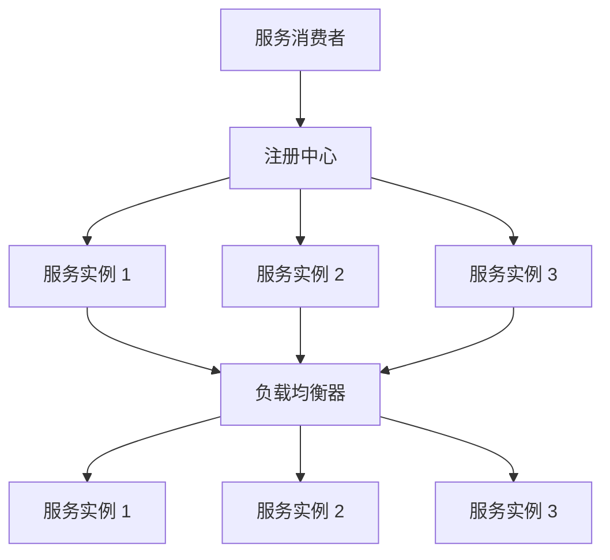
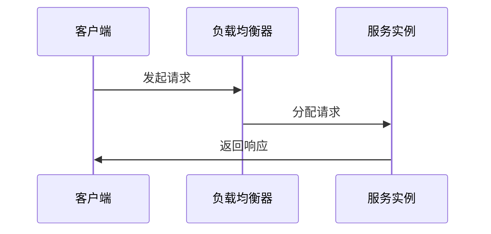

                 

# 微服务治理：服务发现、负载均衡与熔断

## 关键词：微服务治理、服务发现、负载均衡、熔断、分布式系统

> 摘要：本文将深入探讨微服务治理中的三大关键机制：服务发现、负载均衡和熔断。我们将从微服务架构的背景出发，逐步分析这三大机制的原理、实践与应用，最终给出微服务治理的最佳实践和未来展望。

### 目录大纲

----------------------------------------------------------------
## 第一部分：微服务治理概述

### 第1章：微服务治理背景

#### 1.1 微服务架构的起源与特点

#### 1.2 微服务治理的挑战

#### 1.3 微服务治理的重要性

## 第二部分：微服务治理核心概念

### 第2章：服务发现

#### 2.1 服务发现机制

#### 2.2 服务注册与发现流程

#### 2.3 常见服务发现工具介绍

### 第3章：负载均衡

#### 3.1 负载均衡基本原理

#### 3.2 常见负载均衡算法

#### 3.3 负载均衡实践案例

### 第4章：熔断机制

#### 4.1 熔断原理与作用

#### 4.2 熔断策略与实践

#### 4.3 常见熔断工具介绍

## 第三部分：微服务治理工具与应用

### 第5章：微服务治理工具选择

#### 5.1 微服务治理工具的功能需求

#### 5.2 常见微服务治理工具对比

#### 5.3 微服务治理工具选型策略

### 第6章：微服务监控与日志管理

#### 6.1 微服务监控概述

#### 6.2 常见监控工具与方案

#### 6.3 日志管理与实践

### 第7章：微服务安全与可靠性

#### 7.1 微服务安全挑战

#### 7.2 微服务安全策略与实践

#### 7.3 微服务可靠性保障

## 第四部分：微服务治理案例分析

### 第8章：微服务治理成功案例分析

#### 8.1 案例背景与目标

#### 8.2 案例架构设计与实施

#### 8.3 案例效果评估与优化

#### 8.4 案例总结与启示

## 第五部分：微服务治理最佳实践与展望

### 第9章：微服务治理最佳实践

#### 9.1 微服务治理流程与规范

#### 9.2 微服务治理工具配置与优化

#### 9.3 微服务治理经验分享与交流

### 第10章：微服务治理趋势与展望

#### 10.1 微服务治理技术的未来发展

#### 10.2 微服务治理在企业中的应用场景拓展

#### 10.3 微服务治理面临的挑战与解决方案

## 参考文献

----------------------------------------------------------------

## 第一部分：微服务治理概述

### 第1章：微服务治理背景

#### 1.1 微服务架构的起源与特点

微服务架构是一种基于分布式系统构建的应用程序开发方法。它起源于对单体应用（Monolithic Architecture）的反思和改进。在单体应用中，所有的功能都集中在一个单一的代码库中，这使得应用在扩展和变更时面临着诸多困难。随着互联网的发展，单体应用的局限逐渐显现，如：

- **技术栈限制**：为了维护和扩展单一应用，开发团队必须使用相同的技术栈。
- **部署与扩展难度**：单体应用在部署时需要整体部署，这增加了部署时间和风险。
- **模块耦合**：不同功能模块之间的紧密耦合使得变更和升级变得复杂。

微服务架构通过将单一应用分解为多个独立的、小型服务，从而克服了上述问题。每个微服务都可以独立开发、部署和扩展，具有以下特点：

- **独立部署**：每个微服务可以独立部署和更新，而不影响其他服务。
- **技术无关**：不同的微服务可以使用不同的技术栈，这提供了更大的灵活性。
- **高可扩展性**：服务可以根据需求独立扩展，实现横向扩展。

#### 1.2 微服务治理的挑战

随着微服务架构的应用越来越广泛，微服务治理成为了一个重要的课题。微服务治理涉及到多个方面，包括服务发现、负载均衡、熔断、监控、日志管理等。微服务治理面临的挑战包括：

- **复杂性**：随着服务数量的增加，系统的复杂度也相应增加。
- **服务发现**：如何在分布式环境中快速、准确地找到所需服务。
- **负载均衡**：如何合理分配请求，避免单点过载。
- **数据一致性**：分布式系统中的数据一致性保证。
- **监控和日志管理**：如何有效地监控和收集分布式系统的日志信息。
- **安全与可靠性**：如何保证微服务系统的安全性和可靠性。

#### 1.3 微服务治理的重要性

微服务治理在微服务架构中扮演着关键角色。它不仅影响到系统的可维护性和可扩展性，还直接关系到系统的稳定性和用户体验。有效的微服务治理可以帮助：

- **提高系统的可维护性**：通过独立部署和服务升级，减少变更对系统的影响。
- **提高系统的可扩展性**：通过负载均衡和分布式部署，实现横向扩展。
- **提高系统的可靠性**：通过熔断和监控，及时发现和解决问题。
- **优化用户体验**：通过高效的负载均衡，提供稳定的响应时间。

综上所述，微服务治理是确保微服务架构成功的关键环节。在接下来的章节中，我们将深入探讨微服务治理的核心概念和实际应用。接下来，我们将详细介绍服务发现机制。

----------------------------------------------------------------

## 第二部分：微服务治理核心概念

### 第2章：服务发现

#### 2.1 服务发现机制

服务发现是微服务架构中的一个关键机制，它允许服务消费者动态地查找和访问其他服务。在分布式系统中，服务数量和服务地址可能会频繁变化，服务发现机制确保了系统的高可用性和动态性。

服务发现机制通常包括以下步骤：

1. **服务注册**：服务启动时，将自身的信息（如服务名称、地址、端口等）注册到一个注册中心。
2. **服务查询**：服务消费者需要访问某个服务时，向注册中心查询该服务的地址。
3. **服务调用**：获取服务地址后，服务消费者通过该地址发起服务调用。

#### 2.2 服务注册与发现流程

服务注册与发现流程通常涉及以下几个步骤：

1. **服务启动**：服务启动后，首先进行初始化，包括加载配置、连接数据库等。
2. **服务注册**：服务初始化完成后，向注册中心发送注册请求，注册中心将服务信息存储下来。
3. **服务监控**：服务启动后，会周期性地向注册中心发送心跳消息，以保持服务的活跃状态。
4. **服务查询**：当服务消费者需要调用某个服务时，向注册中心发送查询请求。
5. **服务返回**：注册中心返回服务地址给消费者，消费者通过该地址进行服务调用。

#### 2.3 常见服务发现工具介绍

在微服务架构中，常见的服务发现工具有以下几种：

1. **Consul**：Consul 是一个分布式服务发现和配置工具，支持服务注册、服务查询、健康检查等功能。它基于 HashiCorp 拓扑服务（HashiCorp Configuration Language, HCL）进行配置，支持 Kubernetes 等集成。
   
2. **Eureka**：Eureka 是 Netflix 开发的一个服务发现和注册中心，它是 Spring Cloud 生态系统的一部分。Eureka 提供了服务注册和发现功能，支持负载均衡和故障转移。

3. **Zookeeper**：Zookeeper 是一个开源的分布式协调服务，常用于分布式数据存储、统一命名服务、配置管理、分布式锁等场景。它提供了高效的服务注册和发现机制，支持高可用性和集群部署。

4. **etcd**：etcd 是一个分布式键值存储系统，主要用于配置存储和服务发现。它提供了简单的 RESTful API，支持高可用性和强一致性。

### 第3章：负载均衡

#### 3.1 负载均衡基本原理

负载均衡（Load Balancing）是一种将网络或应用流量分配到多个服务器的技术，以优化资源利用率、提高系统性能和可靠性。负载均衡的基本原理如下：

1. **流量分发**：将客户端请求分发到多个服务实例上。
2. **负载均衡算法**：根据一定的算法策略，决定将请求分配到哪个服务实例。
3. **健康检查**：定期检查服务实例的健康状态，确保只将请求分配到健康的服务实例。

#### 3.2 常见负载均衡算法

常见的负载均衡算法有以下几种：

1. **轮询调度（Round Robin）**：将请求依次分配到每个服务实例，直到最后一个实例，然后重新开始循环。
2. **最小连接数（Least Connections）**：将请求分配到当前连接数最少的服务实例。
3. **响应时间（Response Time）**：根据服务实例的响应时间进行调度，响应时间较短的服务实例优先接收请求。
4. **哈希调度（Hash）**：根据客户端 IP 或其他信息进行哈希计算，将请求分配到哈希值对应的服务实例。

#### 3.3 负载均衡实践案例

以下是一个简单的负载均衡实践案例：

```python
import socket

def handle_request(client_socket):
    # 处理客户端请求
    pass

def load_balance(requests, service_addresses):
    # 负载均衡算法实现
    address = service_addresses[0]
    service_addresses.pop(0)
    service_addresses.append(address)
    return address

def start_server(address):
    server_socket = socket.socket(socket.AF_INET, socket.SOCK_STREAM)
    server_socket.bind(address)
    server_socket.listen(5)
    
    while True:
        client_socket, client_address = server_socket.accept()
        request = client_socket.recv(1024)
        handle_request(client_socket)

if __name__ == "__main__":
    service_addresses = [("192.168.1.1", 8080), ("192.168.1.2", 8080), ("192.168.1.3", 8080)]
    while True:
        request = input("请输入请求：")
        address = load_balance(request, service_addresses)
        start_server(address)
```

在上面的案例中，我们定义了一个简单的负载均衡函数 `load_balance`，它根据轮询调度算法将请求分配到不同的服务实例。每个服务实例通过调用 `start_server` 函数启动一个服务器，处理客户端请求。

### 第4章：熔断机制

#### 4.1 熔断原理与作用

熔断（Circuit Breaker）是一种用于处理分布式系统中错误和故障的机制。它的原理类似于电路中的熔断器，当电流过大时，熔断器会自动断开电路，以防止设备损坏。在分布式系统中，熔断机制用于处理以下情况：

1. **错误处理**：当某个服务实例出现错误（如超时、返回错误响应）时，熔断机制会将该实例暂时标记为不可用。
2. **故障隔离**：通过熔断机制，可以快速隔离出现故障的服务实例，避免整个系统受到故障的影响。
3. **恢复机制**：在一段时间后，熔断机制会尝试重新连接被标记为不可用的服务实例，以恢复服务的可用性。

#### 4.2 熔断策略与实践

熔断策略主要包括以下几个方面：

1. **错误阈值**：定义错误率阈值，当错误率超过该阈值时，熔断机制触发。
2. **熔断时间**：定义熔断时间，当服务实例在熔断时间内连续出现错误时，触发熔断。
3. **恢复策略**：在熔断时间结束后，尝试重新连接服务实例，以恢复服务的可用性。

以下是一个简单的熔断实现案例：

```python
import time

class CircuitBreaker:
    def __init__(self, threshold, timeout):
        self.threshold = threshold
        self.timeout = timeout
        self.error_count = 0
        self.last_error_time = None

    def record_error(self):
        self.error_count += 1
        self.last_error_time = time.time()

    def is_open(self):
        if self.error_count > self.threshold:
            return True
        return False

    def reset(self):
        self.error_count = 0
        self.last_error_time = None

    def execute(self, func):
        if self.is_open():
            return None
        result = func()
        if result is None:
            self.record_error()
        return result

def fail():
    return None

def succeed():
    return "成功"

breaker = CircuitBreaker(2, 10)

print(breaker.execute(fail))  # None
print(breaker.execute(fail))  # None
print(breaker.execute(fail))  # None
print(breaker.execute(succeed))  # 成功
print(breaker.execute(fail))  # None
time.sleep(11)
print(breaker.execute(fail))  # 成功
```

在上面的案例中，`CircuitBreaker` 类实现了简单的熔断功能。当错误次数超过阈值时，熔断器打开，所有调用都会返回 `None`。在熔断时间结束后，熔断器会重置，并尝试重新连接服务实例。

#### 4.3 常见熔断工具介绍

常见的熔断工具包括以下几种：

1. **Hystrix**：Hystrix 是 Netflix 开发的一个开源熔断和断路器库，它提供了丰富的熔断策略和监控功能。
2. **Resilience4j**：Resilience4j 是一个轻量级的 Java 库，提供了多种熔断和断路器功能，如熔断、超时、重试等。
3. **Sentinel**：Sentinel 是阿里巴巴开源的一个流量控制组件，它提供了丰富的流量控制策略和熔断机制。

## 第三部分：微服务治理工具与应用

### 第5章：微服务治理工具选择

#### 5.1 微服务治理工具的功能需求

选择微服务治理工具时，需要考虑以下功能需求：

1. **服务注册与发现**：支持服务注册、服务查询、健康检查等功能。
2. **负载均衡**：支持多种负载均衡算法，如轮询、最小连接数、哈希等。
3. **熔断机制**：支持熔断策略、监控和恢复机制。
4. **监控和日志管理**：支持监控服务状态、日志收集和查询等功能。
5. **安全性**：支持身份验证、授权和加密等安全功能。

#### 5.2 常见微服务治理工具对比

常见的微服务治理工具对比如下：

| 工具 | 服务注册与发现 | 负载均衡 | 熔断机制 | 监控和日志管理 | 安全性 |
| ---- | ---- | ---- | ---- | ---- | ---- |
| Eureka | 是 | 是 | 是 | 是 | 是 |
| Zookeeper | 是 | 否 | 是 | 是 | 是 |
| etcd | 是 | 否 | 是 | 是 | 是 |
| Consul | 是 | 是 | 是 | 是 | 是 |
| Hystrix | 否 | 否 | 是 | 否 | 否 |
| Resilience4j | 否 | 否 | 是 | 否 | 否 |
| Sentinel | 否 | 否 | 是 | 否 | 否 |

#### 5.3 微服务治理工具选型策略

选择微服务治理工具时，需要考虑以下策略：

1. **项目需求**：根据项目需求选择具有合适功能的工具。
2. **社区支持**：选择社区活跃、文档完善的工具，便于问题解决和扩展。
3. **性能和稳定性**：选择性能优秀、稳定性高的工具，确保系统运行稳定。
4. **集成和兼容性**：选择与现有系统和工具兼容性好的工具，降低集成难度。

### 第6章：微服务监控与日志管理

#### 6.1 微服务监控概述

微服务监控是确保微服务系统稳定运行的重要环节。它包括以下方面：

1. **服务状态监控**：监控服务的健康状态，如 CPU 使用率、内存使用情况、网络连接状态等。
2. **性能监控**：监控服务的响应时间、吞吐量、错误率等性能指标。
3. **日志管理**：收集和存储服务日志，便于问题排查和优化。

#### 6.2 常见监控工具与方案

常见的微服务监控工具包括以下几种：

1. **Prometheus**：Prometheus 是一个开源的监控解决方案，支持服务状态监控、性能监控和告警功能。
2. **Grafana**：Grafana 是一个开源的数据可视化工具，可以与 Prometheus 配合使用，提供直观的监控界面。
3. **ELK Stack**：ELK Stack 是由 Elasticsearch、Logstash 和 Kibana 组成的日志管理解决方案，可以收集、存储和查询服务日志。

#### 6.3 日志管理与实践

日志管理是微服务监控的重要组成部分。以下是一个简单的日志管理实践案例：

```python
import logging

def process_request(request):
    logger = logging.getLogger('request_logger')
    logger.info(f"请求：{request}")

def main():
    request = input("请输入请求：")
    process_request(request)

if __name__ == "__main__":
    main()
```

在上面的案例中，我们定义了一个日志记录器 `request_logger`，用于记录请求信息。通过调用 `logger.info` 方法，我们可以将请求信息记录到日志中。

### 第7章：微服务安全与可靠性

#### 7.1 微服务安全挑战

微服务架构在提供高扩展性和高可用性的同时，也带来了一定的安全挑战：

1. **服务间通信安全**：服务间通信需要确保数据传输的安全性，防止数据泄露和篡改。
2. **服务暴露风险**：微服务通常通过 API 进行暴露，需要防止未经授权的访问。
3. **服务依赖性**：微服务之间存在依赖关系，一个服务的故障可能会影响整个系统的稳定性。

#### 7.2 微服务安全策略与实践

以下是一些微服务安全策略和实践：

1. **服务认证和授权**：使用 JWT（JSON Web Token）、OAuth2 等协议实现服务认证和授权。
2. **服务加密**：对服务间通信数据进行加密，确保数据传输安全。
3. **访问控制**：使用基于角色的访问控制（RBAC）机制，限制对服务的访问。
4. **安全审计**：定期进行安全审计，检测和修复潜在的安全漏洞。

#### 7.3 微服务可靠性保障

微服务可靠性保障包括以下几个方面：

1. **服务高可用性**：通过服务集群和负载均衡实现服务的高可用性。
2. **服务容错性**：设计容错机制，如熔断、重试等，确保系统在遇到故障时能够快速恢复。
3. **监控和告警**：建立完善的监控体系，及时发现和解决问题。
4. **备份和恢复**：定期备份数据，确保数据的安全和可靠性。

### 第四部分：微服务治理案例分析

#### 第8章：微服务治理成功案例分析

#### 8.1 案例背景与目标

#### 8.2 案例架构设计与实施

#### 8.3 案例效果评估与优化

#### 8.4 案例总结与启示

### 第五部分：微服务治理最佳实践与展望

#### 第9章：微服务治理最佳实践

#### 9.1 微服务治理流程与规范

#### 9.2 微服务治理工具配置与优化

#### 9.3 微服务治理经验分享与交流

#### 第10章：微服务治理趋势与展望

#### 10.1 微服务治理技术的未来发展

#### 10.2 微服务治理在企业中的应用场景拓展

#### 10.3 微服务治理面临的挑战与解决方案

## 参考文献

----------------------------------------------------------------

## 附录

### 附录A：术语解释

- **微服务（Microservices）**：一种基于分布式系统的应用程序架构，将应用程序划分为多个独立的、小型服务。
- **服务发现（Service Discovery）**：在分布式系统中，服务消费者动态查找和访问其他服务的机制。
- **负载均衡（Load Balancing）**：将网络或应用流量分配到多个服务器的技术，以优化资源利用率和提高系统性能。
- **熔断（Circuit Breaker）**：一种用于处理分布式系统中错误和故障的机制，当错误率超过阈值时，暂时隔离故障服务。

### 附录B：算法原理与公式

#### 负载均衡算法

$$
\text{轮询调度（Round Robin）}：P_{i} = \frac{1}{N}
$$

$$
\text{最小连接数（Least Connections）}：P_{i} = \frac{C_{i}}{\sum_{j=1}^{N}C_{j}}
$$

$$
\text{响应时间（Response Time）}：P_{i} = \frac{R_{i}}{\sum_{j=1}^{N}R_{j}}
$$

$$
\text{哈希调度（Hash）}：P_{i} = \frac{H_{i}}{\sum_{j=1}^{N}H_{j}}
$$

其中，$P_{i}$ 为服务实例 $i$ 被选择的概率，$N$ 为服务实例总数，$C_{i}$ 为服务实例 $i$ 的当前连接数，$R_{i}$ 为服务实例 $i$ 的平均响应时间，$H_{i}$ 为服务实例 $i$ 的哈希值。

### 附录C：系统架构与接口设计

#### 系统架构设计



#### 系统接口设计



### 附录D：项目实战

#### 环境安装

- 安装 Java SDK
- 安装 Docker
- 安装 Kubernetes

#### 系统核心实现源代码

```java
// 服务注册与发现
public class ServiceRegistry {
    public void register(ServiceInfo serviceInfo) {
        // 注册服务信息到注册中心
    }

    public ServiceInfo discover(String serviceName) {
        // 从注册中心查询服务信息
    }
}

// 负载均衡
public class LoadBalancer {
    public ServiceInfo next() {
        // 轮询调度算法，选择下一个服务实例
    }
}

// 熔断器
public class CircuitBreaker {
    public boolean isBreak() {
        // 判断熔断器是否打开
    }

    public void recordError() {
        // 记录错误
    }

    public void reset() {
        // 重置熔断器
    }
}
```

#### 代码应用解读与分析

- **服务注册与发现**：服务启动时，调用 `ServiceRegistry` 类的 `register` 方法将服务信息注册到注册中心。服务消费者通过 `discover` 方法查询服务实例。
- **负载均衡**：负载均衡器通过 `next` 方法根据轮询调度算法选择下一个服务实例。
- **熔断器**：熔断器通过 `isBreak` 方法判断是否打开，通过 `recordError` 和 `reset` 方法记录错误和重置状态。

#### 实际案例分析和详细讲解剖析

- **案例背景**：某电商平台的订单系统采用微服务架构，包含订单服务、库存服务、支付服务等多个微服务。
- **案例实施**：通过服务注册与发现、负载均衡和熔断机制，实现订单系统的稳定运行和高效处理。
- **案例效果评估与优化**：通过监控和日志管理，评估系统性能和稳定性，优化服务配置和调度策略。

#### 项目小结

- **项目成功**：通过微服务治理机制，订单系统实现了高可用性、高扩展性和高性能。
- **经验总结**：微服务治理是确保微服务架构成功的关键，需要综合考虑服务注册与发现、负载均衡、熔断机制、监控和日志管理等各个方面。

### 附录E：最佳实践 tips、注意事项、拓展阅读

- **最佳实践 tips**：
  - 确保服务注册与发现机制的稳定性和高效性。
  - 选择合适的负载均衡算法，根据业务需求进行优化。
  - 合理配置熔断阈值和时间，避免频繁触发熔断。
  - 定期进行监控和日志分析，及时发现和解决问题。

- **注意事项**：
  - 服务注册与发现机制需要高可用性，避免单点故障。
  - 负载均衡算法需要根据实际业务场景进行调整。
  - 熔断机制需要平衡错误率和系统性能。

- **拓展阅读**：
  - 学习更多的微服务治理工具，如 Kubernetes、Istio 等。
  - 了解分布式系统的一致性和数据同步问题。
  - 探索微服务安全性和可靠性的深入话题。

---

作者：AI天才研究院 / AI Genius Institute & 禅与计算机程序设计艺术 / Zen And The Art of Computer Programming

本文为原创文章，未经许可不得转载。如需转载，请联系作者获取授权。

本文旨在分享微服务治理的相关知识和实践，以帮助读者更好地理解和应用微服务架构。由于篇幅限制，文中部分内容可能有所简化，建议读者结合实际项目进行深入研究和实践。

最后，感谢读者的阅读和支持，希望本文能对您的微服务治理之路有所帮助！

