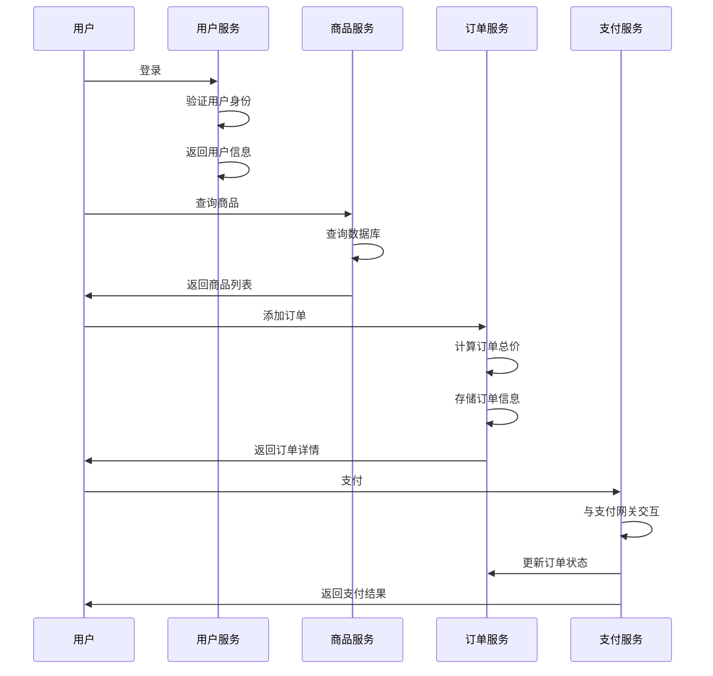

                 

### 1.4 安全性测试策略

#### 1.4.1 安全测试的重要性

在微服务架构中，安全性测试至关重要。由于微服务之间的松耦合特性，攻击者可以通过服务间的漏洞进入系统的核心部分，造成严重的后果。因此，安全性测试的主要目标是：

- **漏洞扫描**：发现系统中可能存在的安全漏洞。
- **认证与授权**：确保只有授权的用户和系统可以访问服务。
- **数据加密**：对敏感数据进行加密处理，防止数据泄露。
- **安全审计**：监控和记录系统中的安全事件，以便及时应对潜在威胁。

#### 1.4.2 安全测试的分类

安全测试可以分为以下几类：

- **静态代码安全分析**：通过分析源代码，发现潜在的安全漏洞。
- **动态应用程序安全测试（DAST）**：通过模拟攻击行为，检测正在运行的应用程序中的漏洞。
- **渗透测试**：模拟黑客攻击，测试系统的安全防御能力。
- **安全配置评估**：检查系统的配置是否符合安全最佳实践。

#### 1.4.3 安全测试的方法与工具

- **静态代码安全分析**：常用的工具包括SonarQube、Checkmarx等。
- **动态应用程序安全测试（DAST）**：常用的工具包括OWASP ZAP、Burp Suite等。
- **渗透测试**：常用的工具包括Metasploit、Nessus等。
- **安全配置评估**：可以使用自动化工具，如AWS Inspector、Azure Security Center等。

### 1.4.4 安全测试的最佳实践

为了提高微服务架构的安全性，可以遵循以下最佳实践：

- **安全编码实践**：在开发过程中，遵循安全编码准则，减少安全漏洞。
- **持续安全集成**：将安全测试集成到开发流程中，确保每个版本都经过安全测试。
- **定期安全审计**：定期对系统进行安全审计，及时发现并修复漏洞。
- **数据安全策略**：对敏感数据进行加密，并实施严格的数据访问控制。

### 1.4.5 安全测试案例分析

假设我们有一个包含用户管理、订单处理、支付服务等多个微服务的电商系统。在进行安全测试时，可以按照以下步骤进行：

1. **静态代码安全分析**：分析每个微服务的源代码，查找潜在的安全漏洞。
2. **动态应用程序安全测试（DAST）**：使用工具如OWASP ZAP对每个微服务进行扫描，发现潜在的安全漏洞。
3. **渗透测试**：模拟黑客攻击，尝试绕过认证机制、注入恶意代码等。
4. **安全配置评估**：检查系统配置是否符合安全最佳实践，如启用HTTPS、使用强密码等。

通过以上测试，可以确保电商系统的安全性，减少潜在的安全威胁。

## 1.5 集成测试策略

### 1.5.1 集成测试的重要性

集成测试在微服务架构中起着至关重要的作用。其主要目标是确保各个微服务之间能够正常交互，并保证整体系统的稳定性。集成测试的主要作用包括：

- **发现接口问题**：通过模拟微服务之间的交互，可以发现接口设计中的问题，如接口不一致、数据格式不匹配等。
- **验证业务逻辑**：集成测试可以验证各个微服务之间的业务逻辑是否正确，确保系统的功能完整性。
- **提高测试覆盖率**：集成测试可以覆盖各个微服务之间的交互，提高测试覆盖率。

### 1.5.2 集成测试的分类

集成测试可以分为以下几类：

- **功能集成测试**：验证各个微服务之间的功能是否正确。
- **性能集成测试**：评估微服务之间的交互性能，如响应时间、吞吐量等。
- **安全集成测试**：确保微服务之间的交互符合安全要求。

### 1.5.3 集成测试的方法

集成测试的方法包括：

- **灰盒测试**：通过部分了解微服务的内部实现，模拟微服务之间的交互。
- **黑盒测试**：完全不了解微服务的内部实现，仅通过接口进行测试。
- **模拟测试**：使用模拟器模拟微服务的交互，以便在微服务不可用时进行测试。

### 1.5.4 集成测试工具的选择

选择合适的集成测试工具可以提高测试效率。常见的集成测试工具有：

- **Postman**：用于API测试，可以模拟微服务之间的交互。
- **JUnit**：用于功能测试，可以验证各个微服务的功能。
- **JMeter**：用于性能测试，可以模拟大量用户对系统的访问。

### 1.5.5 集成测试的最佳实践

为了提高集成测试的效果，可以遵循以下最佳实践：

- **尽早开始**：在开发初期就开始进行集成测试，以便及早发现问题。
- **自动化**：将集成测试自动化，提高测试效率和覆盖率。
- **持续集成**：将集成测试集成到持续集成流程中，确保每次代码提交都经过测试。

## 1.6 回归测试策略

### 1.6.1 回归测试的定义与作用

回归测试是指在软件修改或更新后，重新运行之前已通过的测试，以确保修改没有引入新的错误。在微服务架构中，回归测试的主要作用包括：

- **确保修改的正确性**：验证修改是否解决了原有问题，且没有引入新的错误。
- **提高代码质量**：通过回归测试，可以发现代码中的潜在问题，促进代码质量的提高。
- **保证系统稳定性**：确保系统在修改后仍然保持稳定运行。

### 1.6.2 回归测试的分类

回归测试可以分为以下几类：

- **功能回归测试**：验证修改后的功能是否正确。
- **性能回归测试**：验证修改后的性能是否符合预期。
- **安全回归测试**：验证修改后的安全性能是否符合要求。

### 1.6.3 回归测试的策略

为了提高回归测试的效率，可以采用以下策略：

- **基于风险**：针对不同模块的风险程度，优先测试高风险模块。
- **自动化**：将回归测试自动化，提高测试效率和覆盖率。
- **持续回归**：在开发过程中，定期执行回归测试，确保每次代码提交都经过测试。

### 1.6.4 回归测试的工具

常用的回归测试工具有：

- **JUnit**：用于功能回归测试。
- **Selenium**：用于自动化回归测试。
- **JMeter**：用于性能回归测试。

### 1.6.5 回归测试的最佳实践

为了提高回归测试的效果，可以遵循以下最佳实践：

- **全面的测试覆盖**：确保覆盖所有关键功能和性能场景。
- **持续集成**：将回归测试集成到持续集成流程中，确保每次代码提交都经过测试。
- **定期审查**：定期审查回归测试结果，及时发现并解决问题。

## 1.7 微服务测试的总结与展望

### 1.7.1 微服务测试的挑战与机遇

尽管微服务测试面临许多挑战，如测试复杂性、服务间交互、自动化测试的维护等，但它也带来了许多机遇。通过有效的测试策略和方法，可以大幅提高系统的质量、可靠性和可维护性。

### 1.7.2 未来发展趋势

未来，微服务测试将朝着以下几个方面发展：

- **智能化**：利用人工智能和机器学习技术，提高测试的自动化和智能性。
- **云原生**：随着云原生技术的发展，微服务测试将更加适应云环境，提高测试效率和灵活性。
- **持续交付**：将微服务测试集成到持续交付流程中，实现更快、更可靠的软件发布。

### 1.7.3 总结

微服务测试是确保分布式系统质量的关键环节。通过合理的测试策略和方法，可以大幅提高系统的质量和可靠性。在未来的发展中，我们需要不断探索和创新，以应对微服务测试的挑战，为软件开发带来更多价值。<!--ElementType：Markdown -->## 1.8 实践案例：构建一个电商系统的微服务测试策略

为了更好地理解和应用微服务测试策略，以下我们将通过一个电商系统的案例，详细阐述其测试策略的构建过程。

### 1.8.1 案例背景

一个典型的电商系统通常包括用户管理、商品管理、订单管理、支付处理等多个模块。在微服务架构下，这些模块可以被拆分为独立的微服务，如图1-1所示。



### 1.8.2 测试策略构建

为了构建电商系统的微服务测试策略，我们可以按照以下步骤进行：

#### 1.8.2.1 单元测试

首先，对每个微服务进行单元测试，确保其功能正确。例如，对用户服务中的用户登录功能进行单元测试，测试用例如下：

```python
def test_login_success():
    # 构建请求参数
    params = {
        "username": "testuser",
        "password": "testpassword"
    }
    # 发送登录请求
    response = user_service.login(params)
    # 验证响应结果
    assert response.status_code == 200
    assert response.json()["message"] == "登录成功"

def test_login_failure():
    # 构建请求参数
    params = {
        "username": "testuser",
        "password": "wrongpassword"
    }
    # 发送登录请求
    response = user_service.login(params)
    # 验证响应结果
    assert response.status_code == 401
    assert response.json()["message"] == "用户名或密码错误"
```

#### 1.8.2.2 集成测试

接下来，进行集成测试，确保各个微服务之间的交互正常。使用Postman模拟用户服务与商品服务、订单服务、支付服务之间的交互，测试用例如下：

```mermaid
request
    title: 查询商品
    method: GET
    url: http://商品服务/api/v1/products
    headers:
        Content-Type: application/json

response
    status_code: 200
    body:
        application/json:
            id: 1
            name: iPhone 13
            price: 7999
```

#### 1.8.2.3 性能测试

进行性能测试，评估各个微服务的响应时间和吞吐量。使用JMeter模拟大量用户同时对电商系统进行访问，测试场景如下：

```mermaid
httpSampler
    name: 用户登录
    controller:
        loop_count: 100
    httpRequest:
        method: POST
        url: http://用户服务/api/v1/login
        headers:
            Content-Type: application/json
        body:
            mimeType: application/json
            encoding: utf-8
            asText:
                {
                    "username": "testuser",
                    "password": "testpassword"
                }
```

#### 1.8.2.4 安全测试

进行安全测试，确保电商系统的安全性。使用Burp Suite对系统进行漏洞扫描，测试场景如下：

```mermaid
intruder
    name: 用户登录注入
    target:
        http_service:
            host: 用户服务
            port: 8080
            url: /api/v1/login
    payloads:
        list:
            - "username=testuser&password=testpassword"
            - "username=testuser&password=wrongpassword"
    scanner:
        basic:
            method: POST
            payload: /api/v1/login
```

#### 1.8.2.5 回归测试

在每次代码提交后，执行回归测试，确保修改没有引入新的错误。使用JUnit对电商系统进行回归测试，测试用例如下：

```java
@Test
public void testUserLogin() {
    String username = "testuser";
    String password = "testpassword";
    ResponseEntity<Map<String, Object>> response = userController.login(username, password);
    assertEquals(HttpStatus.OK, response.getStatusCode());
    assertEquals("登录成功", response.getBody().get("message"));
}
```

### 1.8.3 测试结果分析与优化

在测试过程中，收集测试结果，进行分析和优化。例如，如果发现用户登录功能的响应时间较长，可以优化用户服务中的登录逻辑，提高响应速度。如果发现安全测试中存在漏洞，可以修复漏洞，并重新进行安全测试。

通过以上步骤，我们成功构建了一个电商系统的微服务测试策略，并进行了详细的测试实践。通过持续优化和改进，可以不断提高系统的质量和稳定性。

### 1.8.4 案例小结

本案例展示了如何构建一个电商系统的微服务测试策略，包括单元测试、集成测试、性能测试、安全测试和回归测试。通过详细的测试实践，我们验证了系统的功能、性能和安全，确保了系统的稳定性。同时，本案例也体现了微服务测试策略的灵活性和可扩展性，为实际项目提供了有益的参考。

## 1.9 最佳实践与注意事项

### 1.9.1 最佳实践

1. **尽早开始测试**：在开发初期就开始进行测试，以便及早发现问题并修复。
2. **自动化测试**：尽可能自动化测试，提高测试效率和覆盖率。
3. **持续集成**：将测试集成到持续集成流程中，确保每次代码提交都经过测试。
4. **安全测试**：定期进行安全测试，确保系统的安全性。
5. **文档化**：编写详细的测试文档，包括测试用例、测试报告等。

### 1.9.2 注意事项

1. **测试覆盖率**：确保测试覆盖率达到预期，避免遗漏关键功能。
2. **测试环境**：确保测试环境的配置与生产环境一致，避免环境差异带来的问题。
3. **测试数据**：使用真实的数据进行测试，以便更好地模拟实际场景。
4. **测试工具**：选择合适的测试工具，提高测试效率。
5. **测试团队协作**：加强测试团队的协作，确保测试工作的顺利进行。

## 1.10 拓展阅读

- 《微服务设计》
- 《持续集成：从理论到实践》
- 《安全编码标准：修复代码中的安全漏洞》
- 《软件测试的艺术》

作者：AI天才研究院/AI Genius Institute & 禅与计算机程序设计艺术 /Zen And The Art of Computer Programming

