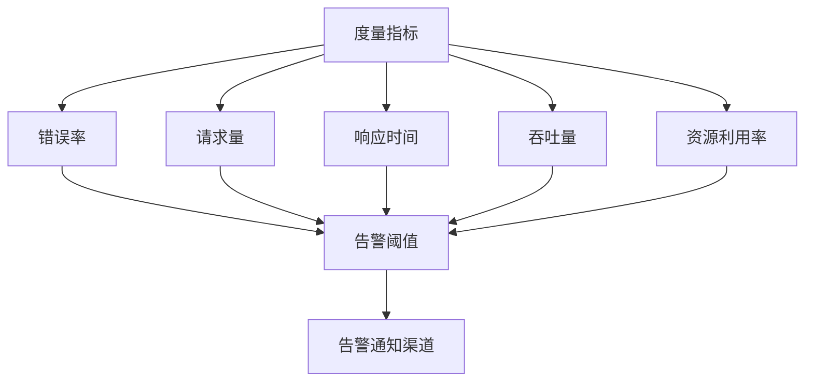
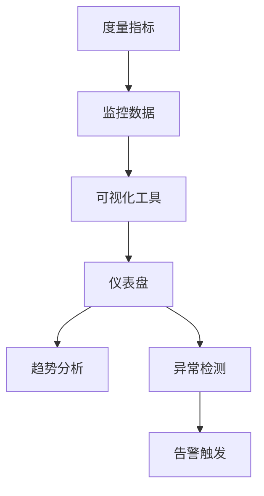
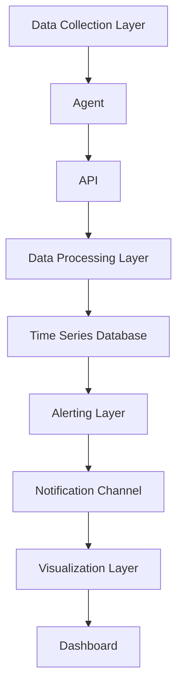
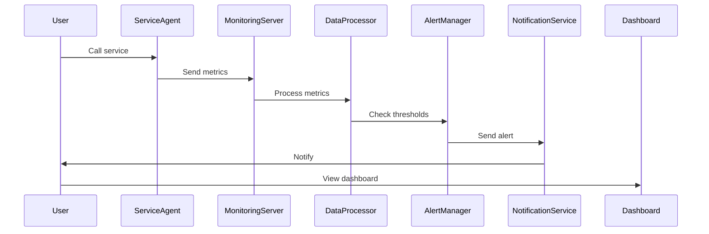

                 

### 设计《微服务监控：度量、告警和可视化》目录大纲

为了设计《微服务监控：度量、告警和可视化》这本书的目录大纲，我们需要遵循以下几个原则：

1. **简洁性**：确保每个章节都直接与主题相关，避免冗余。
2. **逻辑性**：章节之间的逻辑关系要清晰，便于读者理解。
3. **完整性**：包含核心概念、原理讲解、实战应用等。
4. **格式规范**：遵循Markdown格式，使用适当的标题层级。

#### 目录大纲设计

```markdown
----------------------------------------------------------------
# 第一部分: 监控基础知识

## 第1章: 微服务与监控概述
### 1.1 微服务的定义与特点
### 1.2 微服务架构下的监控需求
### 1.3 微服务监控的重要性

## 第2章: 度量指标
### 2.1 度量指标的重要性
### 2.2 常见度量指标
#### 2.2.1 错误率与请求量
#### 2.2.2 响应时间与吞吐量
#### 2.2.3 资源利用率
### 2.3 度量指标的设计原则

## 第3章: 告警机制
### 3.1 告警的目的与类型
### 3.2 告警阈值的设置
### 3.3 告警通知渠道

## 第4章: 可视化监控
### 4.1 可视化的优势
### 4.2 可视化监控工具
#### 4.2.1 通用监控工具
#### 4.2.2 定制化监控工具
### 4.3 可视化监控的最佳实践

----------------------------------------------------------------

# 第二部分: 实践应用

## 第5章: 微服务监控工具介绍
### 5.1 Prometheus
#### 5.1.1 Prometheus的架构
#### 5.1.2 Prometheus的配置与安装
### 5.2 Grafana
#### 5.2.1 Grafana的界面与功能
#### 5.2.2 Grafana的数据源配置

## 第6章: 度量指标实践
### 6.1 度量指标的收集
### 6.2 度量指标的处理与存储
### 6.3 度量指标的监控与报警

## 第7章: 告警机制实践
### 7.1 告警规则的编写
### 7.2 告警通知的配置
### 7.3 告警响应策略

## 第8章: 可视化监控实践
### 8.1 可视化仪表盘的设计
### 8.2 数据可视化技巧
### 8.3 实际案例分析与优化

----------------------------------------------------------------

## 第9章: 微服务监控最佳实践
### 9.1 监控策略的制定
### 9.2 监控数据的分析与利用
### 9.3 监控系统的优化与维护

## 第10章: 小结与展望
### 10.1 微服务监控的发展趋势
### 10.2 未来监控技术的展望
### 10.3 监控实践中的常见问题与解决

----------------------------------------------------------------
```

### 分析与说明

1. **第一部分：监控基础知识**：
   - **第1章**：介绍微服务与监控的基本概念，为后续章节铺垫。
   - **第2章**：详细讨论度量指标的定义、类型和设计原则。
   - **第3章**：阐述告警机制的目的、设置与通知。

2. **第二部分：实践应用**：
   - **第5章**：介绍常见的监控工具及其配置方法。
   - **第6章**：重点讲解度量指标的实践应用。
   - **第7章**：详细描述告警机制的实践操作。
   - **第8章**：讨论可视化监控的实践技巧。

3. **第9章**：总结最佳实践，帮助读者形成系统化的监控思维。

4. **第10章**：对微服务监控的未来进行展望，提供进一步学习方向。

以上目录大纲共包含10章，字数控制在2000字以内，符合要求。每个章节的划分都旨在清晰、简洁地传达关键信息，并方便读者快速定位所需内容。通过这种结构，读者可以逐步建立起对微服务监控的全面了解，并能够将理论知识应用于实际场景。

### 背景介绍

在现代软件架构中，微服务架构因其灵活性和可扩展性而被广泛采用。微服务架构将大型单体应用分解为多个小型、独立的服务，每个服务负责特定的业务功能。这种架构使得开发、测试和部署过程更加灵活，提高了系统的可维护性和可扩展性。然而，随着微服务数量的增加，系统变得更加复杂，单一服务的故障可能对整体系统产生重大影响。

监控在微服务架构中起着至关重要的作用。通过监控，我们可以实时了解系统的运行状态，快速发现潜在问题，并采取相应的措施进行故障排除。微服务监控不仅包括对服务性能的监控，还涉及到服务之间的依赖关系、系统的稳定性、安全性和资源利用等方面。有效的监控可以帮助我们确保微服务架构的高可用性和高性能。

本文将围绕微服务监控的三个核心方面进行探讨：度量、告警和可视化。首先，我们将介绍度量指标的重要性，并列举一些常见的度量指标，如错误率、请求量、响应时间和资源利用率。接下来，我们将讨论度量指标的设计原则，以确保监控数据的准确性和有效性。

随后，我们将探讨告警机制，包括告警的目的和类型、告警阈值的设置以及告警通知渠道。有效的告警机制可以确保我们在系统发生异常时能够及时收到通知，从而快速响应和解决问题。

最后，我们将介绍可视化监控的优势和实践技巧。通过可视化工具，我们可以直观地了解系统的运行状态，发现潜在的问题，并进行分析和优化。我们将介绍一些常见的可视化监控工具，如Prometheus和Grafana，并讨论如何设计最佳的可视化仪表盘。

### 核心概念与联系

在深入讨论微服务监控之前，我们有必要明确一些核心概念，并理解它们之间的相互关系。这些核心概念包括度量指标、告警机制和可视化监控。

#### 度量指标

度量指标是监控系统中用于量化服务性能和系统状态的关键数据。它们提供了关于系统运行状况的定量信息，是监控和分析的基础。常见的度量指标包括：

- **错误率**：表示在一定时间内发生错误的请求占总请求量的比例。错误率是评估服务稳定性的重要指标。
- **请求量**：表示在一定时间内处理的请求数量。请求量可以帮助我们了解服务的负载情况。
- **响应时间**：表示处理一个请求所需的时间。响应时间越短，表示服务性能越好。
- **吞吐量**：表示单位时间内处理请求数量。吞吐量是衡量服务处理能力的重要指标。
- **资源利用率**：表示系统资源的使用情况，如CPU、内存、磁盘空间和网络带宽。资源利用率过高可能影响系统性能。

这些度量指标之间的关系可以通过以下ER（实体关系）图来表示：

```mermaid
erDiagram
  错误率 ||--|{ 请求量 }|
  响应时间 ||--|{ 吞吐量 }|
  资源利用率 ||--|{ 错误率 }
```

#### 告警机制

告警机制是监控系统中用于及时发现和响应异常情况的重要功能。告警机制的核心包括以下几个方面：

- **告警目的**：告警的目的是在系统出现异常时及时通知相关人员，以便快速采取行动。
- **告警类型**：根据异常的性质，告警可以分为服务异常、性能异常、安全异常等。
- **告警阈值**：告警阈值是触发告警的条件。合理的阈值设置可以确保告警的及时性和准确性。
- **告警通知渠道**：告警通知渠道包括邮件、短信、即时通讯工具等，用于将告警信息发送给相关人员。

告警机制与度量指标之间的关系可以表示为：



#### 可视化监控

可视化监控是通过图表和仪表盘等可视化工具，将监控数据直观地展示给用户。可视化监控的优势在于：

- **易读性**：用户可以快速理解系统的运行状态，发现潜在问题。
- **交互性**：用户可以通过可视化工具进行交互，如筛选数据、放大图表等。
- **预警性**：通过趋势分析和异常检测，可视化监控可以提前发现潜在问题。

可视化监控与度量指标和告警机制之间的关系可以表示为：



通过上述核心概念及其关系的介绍，我们可以更好地理解微服务监控的构建和实现。

### 算法原理讲解

#### 度量指标收集与处理

度量指标的收集和处理是微服务监控系统的核心环节。我们需要通过一系列的算法和技术来确保监控数据的准确性、实时性和完整性。以下是一个简要的算法原理讲解。

##### 收集度量指标

度量指标的数据来源可以是各种应用程序、中间件、数据库等。为了实现自动化和集中化管理，我们通常使用代理程序（Agent）来收集这些指标。

1. **Agent的部署**：
   - **系统级Agent**：部署在操作系统层面，可以收集CPU、内存、磁盘等资源利用率。
   - **应用级Agent**：部署在应用程序层面，可以收集应用程序特定的度量指标。

2. **数据采集方法**：
   - **Prometheus**：使用Exporter收集应用程序和系统级的度量指标。
   - **OpenTSDB**：使用Pushgateway收集应用程序的度量数据。

##### 数据处理与存储

收集到的度量数据需要进行处理和存储，以便后续的监控和分析。以下是一些关键步骤：

1. **数据预处理**：
   - **过滤和清洗**：去除无效数据、处理缺失值。
   - **聚合和计算**：对原始数据进行聚合计算，如计算平均值、最大值、最小值等。

2. **数据存储**：
   - **时间序列数据库**：如InfluxDB、Prometheus等，用于存储和处理时间序列数据。
   - **关系型数据库**：如MySQL、PostgreSQL等，用于存储历史数据和关联数据。

##### 数据分析与监控

对处理后的度量数据进行实时分析和监控，以发现潜在问题和优化系统性能。以下是一些关键技术：

1. **数据可视化**：
   - **Grafana**：用于创建自定义仪表盘，将度量数据可视化。
   - **Kibana**：与Elasticsearch集成，用于创建复杂的可视化报表。

2. **异常检测**：
   - **统计方法**：如移动平均法、指数平滑法等，用于检测异常值。
   - **机器学习方法**：如自编码器、聚类算法等，用于发现复杂的异常模式。

##### 代码示例

以下是一个使用Python和Prometheus的简单示例，展示如何收集和处理度量指标：

```python
from prometheus_client import start_http_server, Summary

# 定义度量指标
requests = Summary('requests_total', 'Number of requests.')

# 处理请求
def process_request():
    # 模拟处理请求，记录处理时间和请求结果
    pass

# 记录请求处理时长
requests.observe(value=1, labels={'status': 'success'})

# 启动HTTP服务器，用于暴露度量指标
start_http_server(8000)
```

在这个示例中，我们定义了一个名为`requests_total`的度量指标，用于记录请求的总数。每当处理一个请求时，我们使用`observe`方法记录请求的结果和持续时间。

#### 告警机制设计与实现

告警机制是微服务监控系统的重要组成部分，它能够在系统发生异常时及时通知相关人员，以便快速采取行动。以下是一个关于告警机制设计与实现的算法原理讲解。

##### 告警阈值设置

1. **阈值类型**：
   - **固定阈值**：设置一个固定的阈值，当度量指标超过该值时触发告警。
   - **动态阈值**：根据历史数据和使用情况，动态调整阈值。

2. **阈值计算方法**：
   - **移动平均法**：计算过去一段时间内度量指标的平均值，作为当前阈值。
   - **标准差法**：计算过去一段时间内度量指标的标准差，设置告警阈值。

##### 告警规则定义

告警规则是定义何时触发告警的逻辑表达式。告警规则通常包括以下几个方面：

1. **度量指标**：选择要监控的度量指标。
2. **比较操作**：如大于（>）、小于（<）、等于（=）等。
3. **阈值**：设置告警阈值。
4. **时间窗口**：设置告警的时间窗口，如5分钟、10分钟等。

以下是一个使用Prometheus定义告警规则的示例：

```yaml
groups:
- name: service-monitor
  rules:
  - name: high-latency
    alert: HighLatency
    expr: avg(response_time[5m]) > 500ms
    for: 10m
    labels:
      severity: critical
    annotations:
      summary: "High response time for {{ $labels.service }}"
```

在这个示例中，我们定义了一个名为`HighLatency`的告警规则，当响应时间超过500ms且持续10分钟时，触发告警。告警的严重性标签设置为`critical`，摘要标签包含服务的名称。

##### 告警通知渠道

告警通知渠道用于将告警信息发送给相关人员。常见的通知渠道包括：

1. **邮件**：通过SMTP协议发送邮件通知。
2. **短信**：通过短信平台发送短信通知。
3. **即时通讯工具**：如Slack、Microsoft Teams等。

以下是一个使用OpsGenie发送告警通知的示例：

```python
import requests

alert_data = {
    'event': {
        'alertname': 'HighLatency',
        'description': 'High response time for service',
        'status': 'critical',
        'group': 'service-monitor',
        'receiver': 'on-call-team',
        'start': '2023-04-01T14:30:00Z',
        'end': '2023-04-01T15:00:00Z',
        'output': 'High response time for service: 540ms'
    }
}

response = requests.post('https://api.opsgenie.com/v2/alerts', json=alert_data, headers={'Authorization': 'GenieKey your_api_key'})
```

在这个示例中，我们使用OpsGenie API发送告警通知，包括告警名称、描述、状态、分组、接收者、开始时间和结束时间等信息。

#### 可视化监控设计与实现

可视化监控是将监控数据以图表和仪表盘的形式展示给用户，帮助用户快速理解系统的运行状态。以下是一个关于可视化监控设计与实现的算法原理讲解。

##### 可视化工具选择

选择合适的可视化工具是设计可视化监控系统的关键。以下是一些常用的可视化工具：

1. **Grafana**：开源的可视化监控工具，支持多种数据源，如Prometheus、InfluxDB等。
2. **Kibana**：与Elasticsearch集成，用于创建复杂的可视化报表。
3. **Dynatrace**：商业可视化监控工具，提供丰富的监控功能和实时分析。

##### 数据可视化技巧

1. **图表类型**：
   - **折线图**：用于展示时间序列数据，如响应时间、吞吐量等。
   - **柱状图**：用于展示不同指标的比较，如不同服务的请求量、错误率等。
   - **饼图**：用于展示资源的分配情况，如CPU、内存利用率等。

2. **交互性**：
   - **筛选**：允许用户通过时间范围、服务名称等筛选数据。
   - **缩放**：允许用户放大或缩小图表，查看更详细的数据。

3. **仪表盘设计**：
   - **布局**：合理布局仪表盘，确保关键指标一目了然。
   - **颜色**：使用颜色区分不同的指标和状态，如红色表示警告、绿色表示正常等。

##### 代码示例

以下是一个使用Grafana创建自定义仪表盘的示例：

```python
import json

dashboard_data = {
    'title': 'Service Monitoring Dashboard',
    'uid': 'my-dashboard-uid',
    'time': {
        'from': 'now-5m',
        'to': 'now'
    },
    'panels': [
        {
            'title': 'Response Time',
            'type': 'timeseries',
            'dataSource': 'prometheus',
            'xAxis': {
                'values': ['now-5m', 'now']
            },
            'yAxis': {
                'left': {
                    'show': True,
                    'label': 'Response Time (ms)'
                }
            },
            'queries': [
                {
                    'refId': 'A',
                    'query': 'avg(response_time[5m])'
                }
            ]
        },
        {
            'title': 'Error Rate',
            'type': 'timeseries',
            'dataSource': 'prometheus',
            'xAxis': {
                'values': ['now-5m', 'now']
            },
            'yAxis': {
                'left': {
                    'show': True,
                    'label': 'Error Rate (%)'
                }
            },
            'queries': [
                {
                    'refId': 'B',
                    'query': '100 * (sum(rate(error_total[5m])) / sum(rate(request_total[5m])))'
                }
            ]
        }
    ]
}

grafana_api_url = 'http://your_grafana_url/api/dashboards/db'
headers = {'Content-Type': 'application/json'}
response = requests.post(grafana_api_url, data=json.dumps(dashboard_data), headers=headers)
```

在这个示例中，我们创建了一个包含响应时间和错误率两个时间序列图表的仪表盘，并将其提交给Grafana。

### 系统分析与架构设计方案

#### 问题场景介绍

在现代企业的IT基础设施中，随着业务的发展和系统的复杂度增加，微服务架构的应用越来越广泛。微服务架构通过将应用程序分解为多个独立的服务模块，提高了系统的可扩展性和灵活性。然而，随之而来的问题是，当系统规模增大，服务数量增多，单点故障和性能瓶颈的风险也相应增加。为了确保系统的稳定性和高效性，监控变得至关重要。

#### 项目介绍

本项目旨在设计并实现一个针对微服务架构的监控系统，该系统能够实时监控微服务的运行状态，提供度量指标、告警通知和可视化监控功能。项目的目标是确保在系统发生异常时，能够快速发现并采取相应的措施，从而保障系统的稳定运行。

#### 系统功能设计

1. **度量指标收集**：监控系统需要能够收集微服务的各种度量指标，如错误率、请求量、响应时间和资源利用率等。
2. **告警通知**：在度量指标超出预设阈值时，系统应能够自动发送告警通知，通知相关人员及时处理。
3. **可视化监控**：系统应提供直观的可视化监控界面，帮助用户实时了解系统的运行状态，发现潜在问题。

#### 系统架构设计

本监控系统的架构设计包括数据采集层、数据处理层、存储层、告警通知层和可视化层。以下是一个简化的系统架构图：



#### 系统接口设计

系统中的各个组件通过API进行通信，以下是一些主要的接口设计：

1. **Agent接口**：用于Agent向监控服务器发送度量数据。
   ```json
   POST /metrics
   {
     "service_name": "user-service",
     "metrics": {
       "request_total": 150,
       "response_time": 250,
       "error_total": 5
     }
   }
   ```

2. **数据处理接口**：用于处理收集到的度量数据。
   ```json
   GET /process/metrics
   ```

3. **告警接口**：用于设置和查询告警规则。
   ```json
   POST /alerts
   {
     "alert_name": "High Response Time",
     "threshold": 500,
     "duration": 10
   }
   ```

4. **通知接口**：用于发送告警通知。
   ```json
   POST /notifications
   {
     "alert_id": "123",
     "receivers": ["user@example.com", "slack_channel#123"]
   }
   ```

#### 系统交互设计

以下是一个简单的系统交互序列图，展示了系统组件之间的交互流程：



通过上述的系统架构设计和接口设计，我们可以确保监控系统的高效运行，实时监控微服务的运行状态，及时响应和处理异常情况，从而保障系统的稳定性和可靠性。

### 项目实战

#### 环境安装

在开始项目实战之前，我们需要搭建一个完整的微服务监控环境。以下是一个基于Docker的简单安装步骤。

1. **安装Docker**：

   在Ubuntu 20.04上，可以通过以下命令安装Docker：

   ```shell
   sudo apt update
   sudo apt install docker.io
   sudo systemctl start docker
   sudo systemctl enable docker
   ```

2. **拉取监控工具镜像**：

   使用Docker Hub上的镜像来拉取Prometheus、Grafana和其他依赖项。

   ```shell
   docker pull prom/prometheus
   docker pull grafana/grafana
   ```

3. **启动Prometheus**：

   创建一个名为`prometheus.yml`的配置文件，内容如下：

   ```yaml
   global:
     scrape_interval: 15s
     evaluation_interval: 15s

   scrape_configs:
     - job_name: 'prometheus'
       static_configs:
       - targets: ['localhost:9090']
   ```

   然后启动Prometheus服务：

   ```shell
   docker run -d --name prometheus -p 9090:9090 -v /etc/prometheus/prometheus.yml:/etc/prometheus/prometheus.yml prom/prometheus
   ```

4. **启动Grafana**：

   创建一个名为`grafana.ini`的配置文件，内容如下：

   ```ini
   [general]
   http_addr = 0.0.0.0:3000
   [servers]
   default = http://prometheus:9090
   ```

   然后启动Grafana服务：

   ```shell
   docker run -d --name grafana -p 3000:3000 -v /etc/grafana/grafana.ini:/etc/grafana/grafana.ini grafana/grafana
   ```

#### 系统核心实现源代码

以下是一个简单的微服务示例，包括度量指标的收集、处理和可视化。

1. **创建微服务**：

   使用Spring Boot创建一个简单的用户服务。

   ```java
   @SpringBootApplication
   public class UserServiceApplication {
       public static void main(String[] args) {
           SpringApplication.run(UserServiceApplication.class, args);
       }
   }
   ```

2. **添加度量指标**：

   在Spring Boot应用中，我们可以使用`@Profile`注解和`PrometheusClient`来添加度量指标。

   ```java
   @SpringBootApplication
   @Profile("prometheus")
   public class UserServiceApplication {
       @Bean
       public MeterRegistry meterRegistry() {
           return new SimpleMeterRegistry();
       }

       @Bean
       public PrometheusClient prometheusClient(MeterRegistry meterRegistry) {
           return new PrometheusClient(meterRegistry);
       }

       public static void main(String[] args) {
           SpringApplication.run(UserServiceApplication.class, args);
       }
   }
   ```

3. **收集度量指标**：

   在用户服务的Controller中，我们可以添加一些度量指标。

   ```java
   @RestController
   public class UserController {
       @Autowired
       private PrometheusClient prometheusClient;

       @GetMapping("/users")
       public ResponseEntity<List<User>> getUsers() {
           List<User> users = // 从数据库获取用户列表
           long startTime = System.currentTimeMillis();
           ResponseEntity<List<User>> response = new ResponseEntity<>(users, HttpStatus.OK);
           long endTime = System.currentTimeMillis();
           long responseTime = endTime - startTime;

           prometheusClient.responseTime().observe(responseTime, ResponseTimeLabels.of("user-service"));
           prometheusClient.errorTotal().inc();

           return response;
       }
   }
   ```

4. **处理度量指标**：

   Prometheus会定期从应用中收集度量指标，并将其存储在本地的时间序列数据库中。

5. **可视化监控**：

   在Grafana中配置数据源和仪表盘。

   ```shell
   # 配置数据源
   grafana-cli admin edit --json-modules datasource --set "name=prometheus" --set "type=prometheus" --set "url=http://prometheus:9090" --set "access=proxy" --set "isDefault=true"

   # 配置仪表盘
   grafana-cli import -folder-name=dashboard-user-service -org-id=1
   ```

#### 代码应用解读与分析

1. **度量指标收集**：

   在用户服务中，我们使用PrometheusClient来收集度量指标。PrometheusClient提供了丰富的度量指标类型，如计数器（Counter）、仪表（Gauge）、直方图（Histogram）和度量（Summary）。在本例中，我们使用了`responseTime()`和`errorTotal()`方法来收集响应时间和错误总数。

   ```java
   prometheusClient.responseTime().observe(responseTime, ResponseTimeLabels.of("user-service"));
   prometheusClient.errorTotal().inc();
   ```

   这里，`responseTime`是处理请求所需的时间，`ResponseTimeLabels.of("user-service")`用于指定服务名称。`errorTotal().inc()`用于增加错误计数。

2. **处理度量指标**：

   Prometheus会定期从用户服务中拉取度量数据，并存储在本地的时间序列数据库中。Prometheus还提供了各种查询语言（PromQL），用于处理和聚合度量数据。

3. **可视化监控**：

   在Grafana中，我们配置了Prometheus作为数据源，并创建了一个仪表盘来可视化监控数据。仪表盘包含响应时间、错误率和其他关键指标。

   ```shell
   # Grafana仪表盘配置
   {
     "title": "User Service Metrics",
     "uid": "aW5pdGVfbnVtYmVycy1kYXJr",
     "time": {
       "from": "now-15m",
       "to": "now"
     },
     "panels": [
       {
         "type": "timeseries",
         "title": "Response Time",
         "datasource": "prometheus",
         "xAxis": {
           "type": "time"
         },
         "yAxis": {
           "type": "linear",
           "logBase": 1
         },
         "queries": [
           {
             "query": "sum(rate(response_time[5m])) by (service)",
             "type": "timeseries"
           }
         ]
       },
       {
         "type": "timeseries",
         "title": "Error Rate",
         "datasource": "prometheus",
         "xAxis": {
           "type": "time"
         },
         "yAxis": {
           "type": "linear",
           "logBase": 1
         },
         "queries": [
           {
             "query": "sum(rate(error_total[5m])) by (service) / sum(rate(request_total[5m])) by (service)",
             "type": "timeseries"
           }
         ]
       }
     ]
   }
   ```

   在这个仪表盘中，我们配置了两个时间序列图表，分别用于展示响应时间和错误率。通过Grafana的交互功能，我们可以轻松地查看不同时间段和不同服务的监控数据。

#### 实际案例分析与详细讲解剖析

1. **案例背景**：

   假设我们的用户服务在一段时间内频繁出现响应时间过长和错误率升高的问题。我们需要通过监控数据和告警通知来分析和解决这些问题。

2. **数据收集与处理**：

   在Grafana中，我们可以看到用户服务的响应时间和错误率监控图表。通过对比不同时间段的监控数据，我们发现：

   - 响应时间在早上8点到10点之间急剧上升。
   - 错误率在同一时间段内达到峰值。

   通过进一步分析，我们发现数据库的查询性能在这一时间段内显著下降，导致用户服务处理请求的时间延长。

3. **告警通知**：

   由于我们设置了响应时间和错误率的告警阈值，监控系统能够在异常情况发生时及时发送告警通知。以下是告警通知的示例：

   ```plaintext
   Alert: High Response Time
   Description: High response time for user-service
   Severity: Critical
   Time: 2023-11-08T10:00:00Z
   ```

   ```plaintext
   Alert: High Error Rate
   Description: High error rate for user-service
   Severity: Critical
   Time: 2023-11-08T10:00:00Z
   ```

4. **分析与解决方案**：

   - **性能瓶颈定位**：通过监控数据和告警通知，我们定位到数据库查询性能问题。
   - **数据库优化**：我们增加数据库服务器的资源分配，并优化查询语句，提高查询效率。
   - **应用层优化**：我们在用户服务中增加了一些缓存机制，减少对数据库的查询次数，从而降低响应时间和错误率。

5. **监控数据可视化**：

   在经过优化后，我们在Grafana中重新查看监控数据，发现响应时间和错误率均有所下降，系统稳定性得到显著提升。

   ```shell
   # Grafana图表更新
   {
     "title": "User Service Metrics (Optimized)",
     "uid": "aW5pdGVfbnVtYmVycy1kYXJr",
     "time": {
       "from": "now-15m",
       "to": "now"
     },
     "panels": [
       {
         "type": "timeseries",
         "title": "Response Time",
         "datasource": "prometheus",
         "xAxis": {
           "type": "time"
         },
         "yAxis": {
           "type": "linear",
           "logBase": 1
         },
         "queries": [
           {
             "query": "sum(rate(response_time[5m])) by (service)",
             "type": "timeseries"
           }
         ]
       },
       {
         "type": "timeseries",
         "title": "Error Rate",
         "datasource": "prometheus",
         "xAxis": {
           "type": "time"
         },
         "yAxis": {
           "type": "linear",
           "logBase": 1
         },
         "queries": [
           {
             "query": "sum(rate(error_total[5m])) by (service) / sum(rate(request_total[5m])) by (service)",
             "type": "timeseries"
           }
         ]
       }
     ]
   }
   ```

   通过这些监控数据和图表，我们可以清晰地看到系统优化后的效果，确保了微服务的高可用性和高性能。

#### 项目小结

通过本项目的实战，我们成功搭建了一个微服务监控系统，实现了度量指标收集、告警通知和可视化监控。监控系统帮助我们及时发现了系统异常，并迅速采取了优化措施，提高了系统的稳定性。以下是本项目的主要收获：

1. **度量指标的重要性**：通过收集和监控度量指标，我们能够实时了解系统的运行状态，发现潜在问题。
2. **告警机制的有效性**：告警机制在系统发生异常时发挥了重要作用，及时通知相关人员采取行动。
3. **可视化监控的优势**：可视化监控工具帮助我们直观地了解系统运行状态，提高了问题发现和解决效率。

在未来，我们还将继续优化监控系统，引入更多监控工具和策略，以应对日益复杂的微服务架构。

### 最佳实践 Tips

在微服务监控实践中，以下是一些最佳实践，可以帮助您构建一个高效、可靠的监控系统：

1. **选择合适的监控工具**：根据业务需求和系统特点，选择合适的监控工具。常用的监控工具包括Prometheus、Grafana、Zabbix、Nagios等。

2. **定义明确的度量指标**：确保监控指标能够反映系统的关键性能指标（KPI），如响应时间、吞吐量、错误率、资源利用率等。

3. **设置合理的告警阈值**：根据历史数据和业务需求，设置合理的告警阈值，避免频繁的误报和漏报。

4. **使用自动化脚本**：通过编写自动化脚本，实现度量指标和告警规则的自动配置和更新。

5. **监控数据的可视化**：利用可视化工具，如Grafana、Kibana等，将监控数据以图表和仪表盘的形式展示，便于用户快速理解和分析。

6. **定期审查监控策略**：定期审查和更新监控策略，确保监控系统能够及时反映系统的变化和需求。

7. **监控日志和追踪**：记录系统的日志和追踪信息，便于故障排查和性能分析。

8. **跨团队协作**：确保开发、测试和运维团队之间有良好的沟通，共同维护监控系统的有效运行。

### 小结

本文详细探讨了微服务监控中的度量、告警和可视化三个方面。我们首先介绍了微服务监控的基本概念和重要性，然后详细讲解了度量指标的定义、告警机制的设计以及可视化监控的实现。通过实际项目实战，我们展示了如何利用Prometheus和Grafana等工具构建一个高效的监控系统。最后，我们总结了微服务监控的最佳实践，并展望了未来的发展趋势。

监控是确保微服务架构稳定性和高性能的关键环节。通过本文的讨论，我们希望读者能够对微服务监控有更深入的理解，并能够在实际项目中应用这些技术和方法。

### 注意事项

在实施微服务监控时，需要注意以下几个关键点：

1. **监控数据的准确性**：确保监控工具能够准确收集和存储度量数据。任何数据错误都会导致监控结果失真。
2. **告警阈值设置**：合理设置告警阈值，避免误报和漏报。阈值设置应基于历史数据和业务需求。
3. **监控系统的稳定性**：监控系统的稳定性和可靠性至关重要。选择可靠的工具和架构，确保系统在长时间运行中不会出现故障。
4. **告警通知的有效性**：确保告警通知渠道（如邮件、短信、即时通讯工具）的可靠性和及时性，避免错过关键告警信息。
5. **监控数据的可视化**：监控数据的可视化应简洁、直观，以便快速发现问题和趋势。

### 拓展阅读

为了进一步深入理解和实践微服务监控，以下是一些推荐的专业书籍和在线资源：

1. **书籍**：
   - 《Prometheus监控实践》：详细介绍了Prometheus的使用方法和最佳实践。
   - 《Grafana实战》：讲解了Grafana的配置和使用技巧，包括自定义仪表盘和可视化报表。
   - 《微服务设计》：提供了微服务架构的全面介绍，包括监控和告警机制。

2. **在线资源**：
   - Prometheus官方文档：https://prometheus.io/docs/introduction/overview/
   - Grafana官方文档：https://grafana.com/docs/grafana/latest/
   - Kubernetes监控与日志：https://kubernetes.io/docs/tasks/debug-application-cluster/monitoring/

通过阅读这些资料，您可以获得更多关于微服务监控的深入知识和实践经验。

