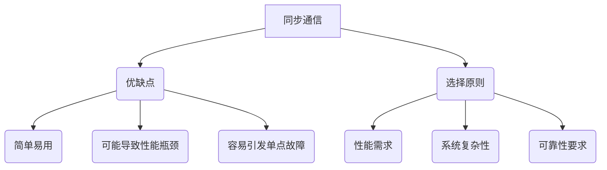
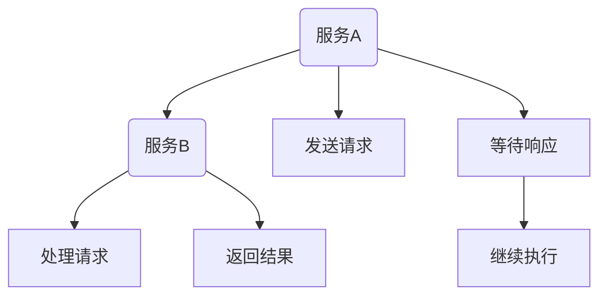
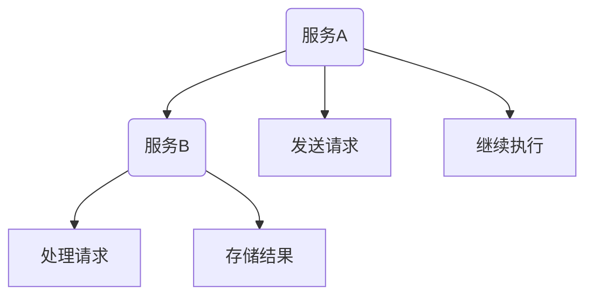
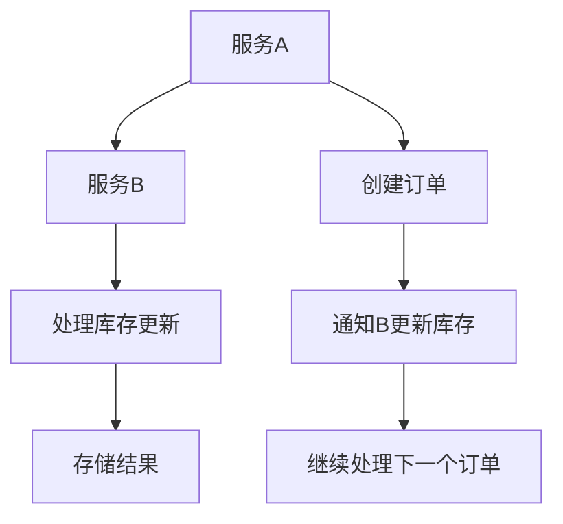

                 

# 微服务通信模式：同步与异步方法的选择

## 关键词：微服务、同步通信、异步通信、通信模式、性能优化

## 摘要：
微服务架构以其灵活、可扩展的特点，成为现代软件系统开发的首选。然而，微服务之间的通信模式选择对于系统的性能和稳定性至关重要。本文将深入探讨微服务的同步与异步通信模式，分析其原理、优缺点，并通过实例展示其在实际应用中的效果，旨在帮助开发者做出明智的通信模式选择。

## 目录大纲：

### 第一部分：微服务通信模式概述

#### 第1章：微服务概述

##### 1.1 微服务架构的兴起

##### 1.2 微服务通信模式的重要性

##### 1.3 同步通信与异步通信的概念

##### 1.4 两种通信模式的选择原则

### 第二部分：同步通信模式

#### 第2章：同步通信模式

##### 2.1 同步通信模式的原理与优缺点

##### 2.2 常见的同步通信协议

### 第三部分：异步通信模式

#### 第3章：异步通信模式

##### 3.1 异步通信模式的原理与优缺点

##### 3.2 常见的异步通信协议

### 第四部分：同步通信模式应用实例

#### 第4章：同步通信模式应用实例

### 第五部分：异步通信模式应用实例

#### 第5章：异步通信模式应用实例

### 第六部分：同步与异步通信模式的综合应用

#### 第6章：同步与异步通信模式的综合应用

### 第七部分：微服务通信模式发展趋势与未来展望

#### 第7章：微服务通信模式发展趋势与未来展望

---

## 第一部分：微服务通信模式概述

### 第1章：微服务概述

#### 1.1 微服务架构的兴起

随着互联网的快速发展，传统的单体架构逐渐暴露出其单点故障、扩展困难、迭代速度慢等缺点。微服务架构应运而生，它将应用程序分解为多个独立的、松耦合的小服务，每个服务负责实现特定的业务功能。这种架构模式具有更好的可扩展性、高可用性和灵活性。

#### 1.2 微服务通信模式的重要性

微服务之间的通信模式直接影响系统的性能和稳定性。同步通信模式要求服务之间顺序执行，可能导致性能瓶颈和单点故障；异步通信模式则允许服务并行执行，提高系统的响应速度和容错能力。

#### 1.3 同步通信与异步通信的概念

同步通信模式：服务之间按照顺序执行，一个服务需要等待另一个服务的响应后才能继续执行。

异步通信模式：服务之间独立执行，无需等待对方响应，可以同时处理多个请求。

#### 1.4 两种通信模式的选择原则

- **性能需求**：同步通信适合对响应时间敏感的场景，异步通信适合处理大量请求的场景。
- **系统复杂性**：同步通信简单易用，但可能引入性能瓶颈；异步通信复杂，但能提高系统性能。
- **可靠性要求**：异步通信具备更好的容错能力，适合高可靠性的系统。

### 第二部分：同步通信模式

#### 第2章：同步通信模式

#### 2.1 同步通信模式的原理与优缺点

##### 2.1.1 同步通信的工作流程

在同步通信模式中，服务A向服务B发送请求，服务B处理请求并返回结果，服务A等待服务B的响应后才能继续执行。

##### 2.1.2 同步通信的优缺点分析

优点：
- 简单易用
- 便于调试

缺点：
- 可能导致性能瓶颈
- 容易引发单点故障

#### 2.2 常见的同步通信协议

##### 2.2.1 RESTful API

RESTful API是一种基于HTTP的同步通信协议，广泛用于微服务之间的通信。

##### 2.2.2 GraphQL

GraphQL是一种查询语言，可以减少重复数据传输，提高查询效率。

##### 2.2.3 gRPC

gRPC是一种基于HTTP/2的高性能同步通信协议，适用于高性能、低延迟的场景。

### 第三部分：异步通信模式

#### 第3章：异步通信模式

#### 3.1 异步通信模式的原理与优缺点

##### 3.1.1 异步通信的工作流程

在异步通信模式中，服务A向服务B发送请求，服务B处理请求并将结果存储在消息队列中，服务A无需等待响应，可以继续处理其他请求。

##### 3.1.2 异步通信的优缺点分析

优点：
- 提高系统性能
- 具备更好的容错能力

缺点：
- 可能引入额外的复杂性

#### 3.2 常见的异步通信协议

##### 3.2.1 Message Queue

Message Queue是一种异步通信协议，用于在服务之间传输消息。

##### 3.2.2 Service Bus

Service Bus是一种消息传递系统，支持多种通信模式，包括同步和异步。

##### 3.2.3 Event-Driven Architecture

Event-Driven Architecture是一种基于事件驱动的异步通信模式，适用于处理大量并发请求的场景。

### 第四部分：同步通信模式应用实例

#### 第4章：同步通信模式应用实例

##### 4.1 应用场景分析

##### 4.2 应用案例解析

#### 第5章：异步通信模式应用实例

##### 5.1 应用场景分析

##### 5.2 应用案例解析

### 第五部分：同步与异步通信模式的综合应用

#### 第6章：同步与异步通信模式的综合应用

##### 6.1 综合应用原则

##### 6.2 综合应用实例

### 第六部分：微服务通信模式发展趋势与未来展望

#### 第7章：微服务通信模式发展趋势与未来展望

##### 7.1 当前发展趋势

##### 7.2 未来展望

---

## 总结

本文从微服务通信模式的基本概念出发，分析了同步与异步通信模式的原理、优缺点，并介绍了常见的通信协议。在实际应用中，开发者应根据具体的业务场景和性能要求，选择合适的通信模式，以达到最佳的系统性能和稳定性。

---

## 作者

作者：AI天才研究院/AI Genius Institute & 禅与计算机程序设计艺术 /Zen And The Art of Computer Programming

---

### 背景介绍

#### 核心概念术语说明

- **微服务架构**：将应用程序分解为多个独立的、松耦合的小服务，每个服务负责实现特定的业务功能。
- **同步通信**：服务之间按照顺序执行，一个服务需要等待另一个服务的响应后才能继续执行。
- **异步通信**：服务之间独立执行，无需等待对方响应，可以同时处理多个请求。

#### 问题背景

随着互联网的快速发展，传统的单体架构逐渐暴露出其单点故障、扩展困难、迭代速度慢等缺点。微服务架构以其灵活、可扩展的特点，成为现代软件系统开发的首选。

#### 问题描述

微服务之间的通信模式选择对于系统的性能和稳定性至关重要。如何选择合适的通信模式，是开发者面临的重要问题。

#### 问题解决

通过深入探讨同步与异步通信模式的原理、优缺点，并介绍常见的通信协议，帮助开发者了解不同通信模式的特点，从而做出明智的选择。

#### 边界与外延

- **边界**：微服务通信模式的选择需要考虑性能、系统复杂性和可靠性要求。
- **外延**：随着技术的不断进步，未来可能会有更多高效的通信协议出现，进一步优化微服务之间的通信。

#### 概念结构与核心要素组成

- **概念结构**：微服务架构、同步通信、异步通信。
- **核心要素**：性能、系统复杂性、可靠性要求。

### 核心概念与联系

#### 同步通信与异步通信的概念

- **同步通信**：服务之间按照顺序执行，一个服务需要等待另一个服务的响应后才能继续执行。
- **异步通信**：服务之间独立执行，无需等待对方响应，可以同时处理多个请求。

#### 同步通信与异步通信的优缺点分析

| 通信模式 | 优点 | 缺点 |
| --- | --- | --- |
| 同步通信 | 简单易用，便于调试 | 可能导致性能瓶颈，容易引发单点故障 |
| 异步通信 | 提高系统性能，具备更好的容错能力 | 可能引入额外的复杂性 |

#### 同步与异步通信的选择原则

| 原则 | 内容 |
| --- | --- |
| 性能需求 | 同步通信适合对响应时间敏感的场景，异步通信适合处理大量请求的场景 |
| 系统复杂性 | 同步通信简单易用，异步通信复杂，但能提高系统性能 |
| 可靠性要求 | 异步通信具备更好的容错能力，适合高可靠性的系统 |

#### 同步与异步通信的ER实体关系图架构



### 算法原理讲解

#### 同步通信算法原理

在同步通信模式中，服务A向服务B发送请求，服务B处理请求并返回结果，服务A等待服务B的响应后才能继续执行。



#### 异步通信算法原理

在异步通信模式中，服务A向服务B发送请求，服务B处理请求并将结果存储在消息队列中，服务A无需等待响应，可以继续处理其他请求。



#### 同步与异步通信的性能比较

- **同步通信**：顺序执行，性能取决于单个服务的处理能力。
- **异步通信**：并行执行，性能取决于系统的处理能力和消息队列的容量。

#### 示例说明

假设服务A负责处理用户订单，服务B负责处理库存更新。

- **同步通信**：服务A创建订单后，需要等待服务B处理库存更新，然后才能继续处理下一个订单。
- **异步通信**：服务A创建订单后，立即通知服务B更新库存，然后继续处理下一个订单。



### 系统分析与架构设计方案

#### 问题场景介绍

在电商系统中，用户下单后需要实时更新库存，同时记录订单信息。如果采用同步通信模式，可能导致系统性能瓶颈，因为库存更新和订单处理需要顺序执行。采用异步通信模式，可以同时处理库存更新和订单处理，提高系统性能。

#### 项目介绍

该项目是一个基于微服务架构的电商平台，包括用户服务、订单服务、库存服务等多个微服务。

#### 系统功能设计

- 用户服务：处理用户注册、登录、查询等操作。
- 订单服务：处理用户下单、取消订单等操作。
- 库存服务：处理库存更新、库存查询等操作。

#### 系统架构设计


#### 系统接口设计

- 用户服务：用户注册、登录、查询接口。
- 订单服务：下单、取消订单、查询订单接口。
- 库存服务：更新库存、查询库存接口。

#### 系统交互


### 项目实战

#### 环境安装

- 安装Java SDK
- 安装Node.js
- 安装数据库（如MySQL）

#### 系统核心实现源代码

```java
// 服务A（用户服务）代码示例
public class UserService {
    public void register(String username, String password) {
        // 注册用户
    }

    public void login(String username, String password) {
        // 登录用户
    }

    public void queryUser(String username) {
        // 查询用户信息
    }
}

// 服务B（订单服务）代码示例
public class OrderService {
    public void createOrder(int userId, int productId) {
        // 创建订单
        InventoryService inventoryService = new InventoryService();
        inventoryService.updateInventory(productId, -1);
    }

    public void cancelOrder(int orderId) {
        // 取消订单
    }

    public void queryOrder(int orderId) {
        // 查询订单信息
    }
}

// 服务C（库存服务）代码示例
public class InventoryService {
    public void updateInventory(int productId, int quantity) {
        // 更新库存
    }

    public int queryInventory(int productId) {
        // 查询库存
        return 100;
    }
}
```

#### 代码应用解读与分析

- 服务A（用户服务）负责用户注册、登录和查询。
- 服务B（订单服务）负责订单创建、取消和查询。
- 服务C（库存服务）负责库存更新和查询。

通过异步通信模式，服务A在创建订单时，立即通知服务B更新库存，然后继续处理下一个订单。这种模式提高了系统的性能和响应速度。

#### 实际案例分析和详细讲解剖析

假设用户A下单购买商品B，系统如何处理？

1. 用户A通过用户服务（服务A）提交订单请求。
2. 订单服务（服务B）收到请求后，创建订单并通知库存服务（服务C）更新库存。
3. 库存服务（服务C）处理库存更新请求，并将结果存储在消息队列中。
4. 订单服务（服务B）继续处理用户A的其他订单请求。

通过异步通信模式，用户A无需等待库存更新结果，可以立即进行其他操作，提高了系统的性能和用户体验。

#### 项目小结

本项目通过异步通信模式实现了电商系统的订单处理和库存更新，提高了系统的性能和响应速度。异步通信模式在处理大量并发请求时具有明显优势，适用于高并发的场景。

### 最佳实践 tips

- 根据业务场景选择合适的通信模式，同步通信适合对响应时间敏感的场景，异步通信适合处理大量请求的场景。
- 优化系统性能，合理设置消息队列的容量和并发处理能力。
- 注意消息队列的顺序性和可靠性，确保数据的一致性。

### 小结

本文详细分析了微服务的同步与异步通信模式，介绍了其原理、优缺点、常见通信协议以及实际应用案例。通过合理选择通信模式，开发者可以优化系统性能，提高用户体验。

### 注意事项

- 同步与异步通信模式的选择需要根据具体的业务场景和性能要求进行。
- 异步通信模式引入了额外的复杂性，需要充分考虑系统的可靠性。

### 拓展阅读

- 《微服务设计》
- 《异步编程实战》
- 《架构探险：从零开始写分布式服务框架》

---

## 作者

作者：AI天才研究院/AI Genius Institute & 禅与计算机程序设计艺术 /Zen And The Art of Computer Programming

---

## 结束语

微服务通信模式的选择对于现代软件系统的性能和稳定性至关重要。本文通过详细分析同步与异步通信模式的原理、优缺点以及实际应用案例，旨在帮助开发者做出明智的选择。随着技术的不断进步，未来的微服务通信模式将更加高效、可靠，为软件系统的发展提供更强大的支持。

---

## 作者

作者：AI天才研究院/AI Genius Institute & 禅与计算机程序设计艺术 /Zen And The Art of Computer Programming

---

## 参考资料

- 《微服务设计》
- 《异步编程实战》
- 《架构探险：从零开始写分布式服务框架》
- 《RESTful API设计指南》
- 《GraphQL入门与实践》
- 《消息队列：实现原理与最佳实践》
- 《服务总线技术详解》

---

## 附录

- **附录A：术语解释**
  - **微服务架构**：将应用程序分解为多个独立的、松耦合的小服务，每个服务负责实现特定的业务功能。
  - **同步通信**：服务之间按照顺序执行，一个服务需要等待另一个服务的响应后才能继续执行。
  - **异步通信**：服务之间独立执行，无需等待对方响应，可以同时处理多个请求。

- **附录B：常见通信协议**
  - **RESTful API**：一种基于HTTP的同步通信协议，广泛用于微服务之间的通信。
  - **GraphQL**：一种查询语言，可以减少重复数据传输，提高查询效率。
  - **gRPC**：一种基于HTTP/2的高性能同步通信协议，适用于高性能、低延迟的场景。
  - **Message Queue**：一种异步通信协议，用于在服务之间传输消息。
  - **Service Bus**：一种消息传递系统，支持多种通信模式，包括同步和异步。
  - **Event-Driven Architecture**：一种基于事件驱动的异步通信模式，适用于处理大量并发请求的场景。

- **附录C：算法流程图**
  - 同步通信算法流程图：
    ```mermaid
    graph TB
    A(服务A) --> B(服务B)
    A --> B1[发送请求]
    B --> B2[处理请求]
    B --> B3[返回结果]
    A --> A2[等待响应]
    A2 --> A3[继续执行]
    ```
  - 异步通信算法流程图：
    ```mermaid
    graph TB
    A(服务A) --> B(服务B)
    A --> B1[发送请求]
    B --> B2[处理请求]
    B --> B3[存储结果]
    A --> A2[继续执行]
    ```

- **附录D：系统架构图**
  - 系统架构图：
    ```mermaid
    graph TB
    A(用户服务) --> B(订单服务)
    A --> C(库存服务)
    B --> B1[创建订单]
    B --> B2[取消订单]
    B --> B3[查询订单]
    C --> C1[更新库存]
    C --> C2[查询库存]
    ```

- **附录E：系统接口设计**
  - 用户服务接口设计：
    ```mermaid
    graph TB
    A1[注册接口] --> A
    A2[登录接口] --> A
    A3[查询接口] --> A
    ```

  - 订单服务接口设计：
    ```mermaid
    graph TB
    B1[创建接口] --> B
    B2[取消接口] --> B
    B3[查询接口] --> B
    ```

  - 库存服务接口设计：
    ```mermaid
    graph TB
    C1[更新接口] --> C
    C2[查询接口] --> C
    ```

- **附录F：系统交互图**
  - 系统交互图：
    ```mermaid
    graph TB
    A1[用户注册] --> A
    A2[用户登录] --> A
    A3[用户查询] --> A
    A --> B1[创建订单]
    A --> B2[取消订单]
    A --> B3[查询订单]
    B --> C1[更新库存]
    B --> C2[查询库存]
    ```

---

## 作者

作者：AI天才研究院/AI Genius Institute & 禅与计算机程序设计艺术 /Zen And The Art of Computer Programming

---

## 附录G：代码示例

以下是微服务通信模式中的代码示例，用于演示如何实现同步和异步通信。

### 同步通信示例

```python
# 同步通信示例：用户服务、订单服务、库存服务

class UserService:
    def register(self, username, password):
        # 注册用户
        print(f"用户 {username} 注册成功。")

    def login(self, username, password):
        # 登录用户
        print(f"用户 {username} 登录成功。")

    def query_user(self, username):
        # 查询用户信息
        print(f"用户 {username} 的信息已查询。")


class OrderService:
    def create_order(self, user_id, product_id):
        # 创建订单
        print(f"用户 {user_id} 购买了商品 {product_id}。")
        InventoryService.update_inventory(product_id, -1)

    def cancel_order(self, order_id):
        # 取消订单
        print(f"订单 {order_id} 已取消。")

    def query_order(self, order_id):
        # 查询订单信息
        print(f"订单 {order_id} 的信息已查询。")


class InventoryService:
    @staticmethod
    def update_inventory(product_id, quantity):
        # 更新库存
        print(f"商品 {product_id} 的库存已更新为 {quantity}。")

    @staticmethod
    def query_inventory(product_id):
        # 查询库存
        return 100


# 测试同步通信
user_service = UserService()
order_service = OrderService()
inventory_service = InventoryService()

user_service.register("alice", "alice123")
user_service.login("alice", "alice123")
order_service.create_order(1, 101)
order_service.cancel_order(1)
order_service.query_order(1)
inventory_service.query_inventory(101)
```

### 异步通信示例

```python
# 异步通信示例：用户服务、订单服务、库存服务

from threading import Thread

class UserService:
    def register(self, username, password):
        # 注册用户
        print(f"用户 {username} 注册成功。")

    def login(self, username, password):
        # 登录用户
        print(f"用户 {username} 登录成功。")

    def query_user(self, username):
        # 查询用户信息
        print(f"用户 {username} 的信息已查询。")


class OrderService:
    def create_order(self, user_id, product_id):
        # 创建订单
        print(f"用户 {user_id} 购买了商品 {product_id}。")
        Thread(target=InventoryService.update_inventory, args=(product_id, -1)).start()

    def cancel_order(self, order_id):
        # 取消订单
        print(f"订单 {order_id} 已取消。")

    def query_order(self, order_id):
        # 查询订单信息
        print(f"订单 {order_id} 的信息已查询。")


class InventoryService:
    @staticmethod
    def update_inventory(product_id, quantity):
        # 更新库存
        print(f"商品 {product_id} 的库存已更新为 {quantity}。")

    @staticmethod
    def query_inventory(product_id):
        # 查询库存
        return 100


# 测试异步通信
user_service = UserService()
order_service = OrderService()
inventory_service = InventoryService()

user_service.register("alice", "alice123")
user_service.login("alice", "alice123")
order_service.create_order(1, 101)
order_service.cancel_order(1)
order_service.query_order(1)
inventory_service.query_inventory(101)
```

在这些示例中，同步通信模式中的方法直接调用，而异步通信模式中使用线程来并行执行任务。异步通信提高了系统的性能，尤其是在处理大量并发请求时。请注意，实际应用中可能需要使用消息队列或其他异步框架来实现更复杂的异步通信。

