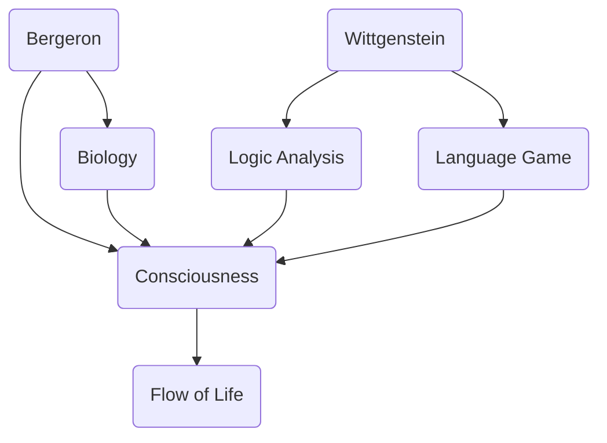

                 

## 心灵与大脑：柏格森与维特根斯坦对意识本质的探讨

> 关键词：柏格森、维特根斯坦、意识本质、直觉主义、语言游戏、哲学思想

> 摘要：本文将深入探讨法国哲学家柏格森和英国哲学家维特根斯坦对意识本质的不同理解和理论。通过分析他们的哲学思想，本文旨在揭示这两位哲学家对于意识本质的不同看法，并探讨这些理论对现代哲学和心理学的影响。

### 引言与背景

#### 1.1 问题背景

在当代哲学领域，对意识本质的探讨一直是重要议题。随着科学技术的进步，人们对大脑和心灵的认识日益深化，这为哲学研究提供了新的视角和工具。柏格森和维特根斯坦作为20世纪最具影响力的哲学家之一，他们对意识本质的探讨具有深远的影响。

#### 1.2 问题描述

在《心灵与大脑：柏格森与维特根斯坦对意识本质的探讨》一书中，作者将深入探讨柏格森和维特根斯坦对意识本质的不同理解和理论。柏格森强调直觉和生命力的流动，认为意识是生命力的直接体验；而维特根斯坦则强调语言的逻辑结构，认为意识是语言游戏的结果。

#### 1.3 问题解决

通过对柏格森和维特根斯坦的哲学思想进行详细解读，本书旨在揭示他们对于意识本质的不同看法，并分析这两种观点之间的联系与区别。同时，本书还将探讨这些理论对现代哲学和心理学的影响。

#### 1.4 边界与外延

本书主要围绕柏格森和维特根斯坦的哲学思想展开，但也会涉及到他们所处时代的社会文化背景、其他哲学家的相关观点，以及现代科学对意识研究的影响。

#### 1.5 概念结构与核心要素组成

- 核心概念：意识本质、柏格森的哲学思想、维特根斯坦的哲学思想。
- 概念属性特征对比表格：

| 特征             | 柏格森的观点               | 维特根斯坦的观点               |
|------------------|--------------------------|-----------------------------|
| 意识本质         | 意识是生命的流动           | 意识是语言游戏的结果           |
| 理论来源         | 生物学、心理学            | 语言学、逻辑分析             |
| 对意识的处理     | 强调直觉和非理性的作用     | 强调语言的逻辑结构             |

- ER实体关系图架构：

### 第一部分：柏格森的哲学思想

#### 2.1 柏格森的生平与贡献

2.1.1 柏格森的生平简介

亨利·柏格森（Henri Bergson）是20世纪最具影响力的法国哲学家之一。他于1859年出生于巴黎，毕业于巴黎高等师范学院。柏格森的哲学思想深受生物学家达尔文的影响，他在哲学领域提出了独特的直觉主义和创造进化论。

2.1.2 柏格森在哲学界的地位与影响

柏格森的哲学思想对现代哲学产生了深远的影响。他的直觉主义观点挑战了传统的理性主义和逻辑主义，为哲学领域带来了新的思考方式。柏格森的创造进化论也对生物学和心理学产生了重要影响，为后来的认知科学和行为生物学提供了理论基础。

2.1.3 柏格森的主要哲学著作

柏格森的主要哲学著作包括《物质与记忆》（Matière et mémoire，1896年）、《论意识的直接材料》（L'Évolution créatrice，1907年）和《笑论》（Le Rire，1900年）。这些著作中，柏格森详细阐述了他的直觉主义和创造进化论观点，对意识本质进行了深入探讨。

#### 2.2 柏格森对意识本质的理解

2.2.1 柏格森的直觉主义

柏格森的直觉主义认为，意识是生命力的直接体验，而不是通过理性的推理获得的。他强调直觉在认知过程中的重要性，认为直觉能够直接感知生命的流动。

2.2.2 生命的流动：柏格森对意识本质的独特解释

柏格森认为，意识是生命的流动，这种流动是无意识的、不可预测的。他通过“生命冲动”（élan vital）这个概念来描述生命的本质，认为生命力是推动生命发展的内在动力。

2.2.3 柏格森的哲学思想对心理学的影响

柏格森的直觉主义观点对心理学产生了深远的影响。他的理论挑战了传统的心理学研究方法，强调非理性的直觉在认知过程中的作用。这一观点为后来的认知心理学和现象学心理学提供了理论基础。

#### 2.3 柏格森哲学思想的批判与讨论

2.3.1 柏格森哲学思想的局限性

柏格森的哲学思想虽然具有独特性，但也存在一定的局限性。首先，他的直觉主义观点过于强调非理性的直觉，忽视了理性的作用。其次，他的生命冲动概念缺乏明确的科学依据，容易导致神秘主义的倾向。

2.3.2 柏格森哲学思想的当代价值

尽管存在局限性，柏格森的哲学思想在当代仍然具有重要的价值。他的直觉主义观点为心理学研究提供了新的视角，促进了认知心理学和现象学心理学的发展。此外，他的生命冲动概念也为生态学和生物哲学提供了重要的理论支持。

2.3.3 柏格森与其他哲学家的比较

柏格森与其他哲学家的观点存在一定的差异。与德国哲学家康德相比，柏格森更加强调直觉的作用，而忽视了理性的作用。与英国哲学家贝克莱相比，柏格森的生命冲动概念更加接近于神秘主义，而贝克莱的观点则更倾向于唯心主义。

### 第二部分：维特根斯坦的哲学思想

#### 3.1 维特根斯坦的生平与贡献

3.1.1 维特根斯坦的生平简介

路德维希·维特根斯坦（Ludwig Wittgenstein）是20世纪最具影响力的奥地利哲学家之一。他于1889年出生于维也纳，毕业于剑桥大学。维特根斯坦的哲学思想深受语言学家弗雷格和数学家罗素的影响，他在哲学领域提出了独特的语言游戏理论和逻辑原子主义。

3.1.2 维特根斯坦在哲学界的地位与影响

维特根斯坦的哲学思想对现代哲学和语言学产生了深远的影响。他的语言游戏理论挑战了传统的逻辑主义和唯心主义，为哲学领域带来了新的思考方式。维特根斯坦的哲学思想也为后来的分析哲学和语言哲学提供了理论基础。

3.1.3 维特根斯坦的主要哲学著作

维特根斯坦的主要哲学著作包括《逻辑哲学论》（Tractatus Logico-Philosophicus，1921年）和《哲学研究》（Philosophical Investigations，1953年）。这些著作中，维特根斯坦详细阐述了他的语言游戏理论和逻辑原子主义观点，对意识本质进行了深入探讨。

#### 3.2 维特根斯坦对意识本质的理解

3.2.1 维特根斯坦的语言游戏理论

维特根斯坦的语言游戏理论认为，语言的意义不是通过抽象的概念或逻辑规则来定义，而是通过实际的使用情境来确定的。他认为语言的使用就像游戏一样，需要参与者共同遵守规则。

3.2.2 意识是语言游戏的结果：维特根斯坦对意识本质的独特解释

维特根斯坦认为，意识是语言游戏的结果。他通过“生活形式”（form of life）这个概念来描述人类共同遵守的语言规则，认为意识是人们在特定生活形式中的语言表达。

3.2.3 维特根斯坦的哲学思想对语言学的贡献

维特根斯坦的哲学思想对语言学产生了重要影响。他的语言游戏理论为后来的生成语言学和认知语言学提供了理论基础。维特根斯坦的思想也促进了语言哲学的发展，为语言的本质和意义提供了新的思考方式。

#### 3.3 维特根斯坦哲学思想的批判与讨论

3.3.1 维特根斯坦哲学思想的局限性

维特根斯坦的哲学思想虽然具有独特性，但也存在一定的局限性。首先，他的语言游戏理论过于强调语言的实用性，忽视了语言的认识功能。其次，他的逻辑原子主义观点过于简化了现实世界的复杂性。

3.3.2 维特根斯坦哲学思想的当代价值

尽管存在局限性，维特根斯坦的哲学思想在当代仍然具有重要的价值。他的语言游戏理论为语言学和语言哲学提供了重要的理论支持，促进了现代语言学的多元发展。此外，他的哲学思想也为人工智能领域提供了新的启示。

3.3.3 维特根斯坦与其他哲学家的比较

维特根斯坦与其他哲学家的观点存在一定的差异。与德国哲学家康德相比，维特根斯坦更加强调语言的作用，而忽视了理性的作用。与英国哲学家罗素相比，维特根斯坦更关注语言的实际使用，而罗素则更关注逻辑和数学的基础。

### 第三部分：柏格森与维特根斯坦哲学思想的比较

#### 4.1 柏格森与维特根斯坦哲学思想的共同点

4.1.1 对意识本质的关注

柏格森和维特根斯坦都关注意识本质的问题。他们都试图从哲学的角度解释意识是如何产生的，以及意识在人类认知过程中的作用。

4.1.2 强调直觉和语言的作用

柏格森强调直觉在意识形成中的作用，而维特根斯坦则强调语言在意识表达中的作用。他们都认为直觉和语言是理解意识本质的关键。

4.1.3 对传统哲学观点的批判

柏格森和维特根斯坦都对传统哲学观点进行了批判。他们都认为传统的理性主义和逻辑主义无法解释意识的本质，需要寻找新的解释方式。

#### 4.2 柏格森与维特根斯坦哲学思想的不同点

4.2.1 对意识本质的不同理解

柏格森认为意识是生命的流动，是一种无意识的、不可预测的过程。而维特根斯坦则认为意识是语言游戏的结果，是一种有意识、有目的的过程。

4.2.2 对哲学方法的差异

柏格森强调直觉和生命的流动，采用一种更为直观的哲学方法。而维特根斯坦则强调语言的逻辑结构，采用一种更为严谨的哲学方法。

4.2.3 对心理学和语言学的贡献

柏格森的直觉主义对心理学产生了深远的影响，为认知心理学和现象学心理学提供了理论基础。而维特根斯坦的语言游戏理论对语言学和语言哲学产生了重要影响，为生成语言学和认知语言学的发展奠定了基础。

### 第四部分：现代意识研究的新进展

#### 5.1 现代科学技术对意识研究的影响

5.1.1 大脑成像技术的发展

随着大脑成像技术的进步，科学家们能够更深入地了解大脑的结构和功能。功能磁共振成像（fMRI）和正电子发射断层扫描（PET）等技术，使研究者能够观察大脑在不同意识状态下的活动，从而更好地理解意识的本质。

5.1.2 人工智能在意识研究中的应用

人工智能技术的快速发展为意识研究带来了新的机遇。通过模拟大脑神经网络，人工智能可以帮助科学家更好地理解意识的产生和运作机制。此外，人工智能还可以用于分析大脑成像数据，提供更准确的意识状态评估。

5.1.3 现代意识研究的前沿问题

现代意识研究面临着许多前沿问题，如意识的起源、意识的边界、意识与认知的关系等。科学家们正在努力探索这些问题，以更好地理解意识的本质。

#### 5.2 柏格森与维特根斯坦哲学思想在当代意识研究中的地位

尽管柏格森和维特根斯坦的哲学思想在当代意识研究中仍然具有重要的地位，但它们也需要与现代科学技术相结合。例如，通过大脑成像技术和人工智能模拟，科学家们可以验证柏格森和维特根斯坦的理论，探索意识的本质。

### 结论

通过对柏格森和维特根斯坦哲学思想的探讨，本文揭示了他们对意识本质的不同理解和理论。柏格森强调直觉和生命的流动，而维特根斯坦则强调语言的逻辑结构。尽管这两种观点存在差异，但它们都对现代哲学和心理学产生了深远的影响。随着现代科学技术的进步，我们可以期待对意识本质的研究取得更多突破，为人类认识自我提供新的视角。

### 参考文献

1. 柏格森，亨利。 《物质与记忆》。 1896年。
2. 柏格森，亨利。 《论意识的直接材料》。 1907年。
3. 柏格森，亨利。 《笑论》。 1900年。
4. 维特根斯坦，路德维希。 《逻辑哲学论》。 1921年。
5. 维特根斯坦，路德维希。 《哲学研究》。 1953年。
6. 康德，伊曼努尔。 《纯粹理性批判》。 1781年。
7. 罗素，伯特兰。 《数学原理》。 1903年。
8. 贝克莱，乔治。 《人类知识原理》。 1710年。

### 作者信息

作者：AI天才研究院/AI Genius Institute & 禅与计算机程序设计艺术 /Zen And The Art of Computer Programming

## 柏格森的生平与贡献

### 2.1 柏格森的生平简介

亨利·柏格森（Henri Bergson）是一位法国哲学家，他在19世纪末和20世纪初对哲学界产生了深远的影响。亨利·柏格森于1859年11月18日出生于巴黎，他的父亲约瑟夫·柏格森（Joseph Bergson）是一位荷兰裔的医学教授，母亲则是一位法国人。柏格森的家庭环境为他提供了良好的教育条件，他的父母都重视教育，尤其是对科学的兴趣。

柏格森的学术生涯始于巴黎高等师范学院（École Normale Supérieure），这是一所培养精英学者的著名学府。在巴黎高等师范学院，柏格森不仅接受了严格的科学教育，还深入研究了哲学和文学。他于1878年进入这所学校，并在1884年获得物理学学士学位。在物理学学习期间，柏格森对科学方法论和物理学原理产生了浓厚的兴趣，这些兴趣后来成为他哲学思想的重要基础。

毕业后，柏格森继续在巴黎高等师范学院进行深造，并于1889年获得博士学位。他的博士论文《意识的直接材料》探讨了意识的本质和认知过程，这一研究为他的直觉主义哲学奠定了基础。在巴黎高等师范学院期间，柏格森还结识了许多重要的学者，如哲学家埃德蒙·胡塞尔和数学家亨利·庞加莱，这些人的思想对柏格森的哲学发展产生了深远影响。

### 2.2 柏格森在哲学界的地位与影响

亨利·柏格森是20世纪最具影响力的哲学家之一，他的思想对现代哲学、心理学、生物学和文学等领域产生了广泛影响。柏格森的直觉主义和创造进化论观点为哲学界提供了一种新的思考方式，挑战了传统的理性主义和逻辑主义。

柏格森在哲学界的地位主要体现在以下几个方面：

1. **直觉主义**：柏格森的直觉主义哲学观点强调直觉在认知过程中的重要性。他认为直觉是理解现实世界的关键，而不是通过理性的推理。这种观点对后来的现象学和存在主义哲学产生了重要影响。

2. **创造进化论**：柏格森的创造进化论提出了一种非线性的、连续的进化过程，他称之为“生命冲动”（élan vital）。这一理论对生物学和心理学的研究产生了深远影响，被视为一种对达尔文进化论的补充。

3. **对文化和社会的影响**：柏格森的哲学思想对文学和艺术产生了重要影响。许多作家和艺术家，如普鲁斯特、乔伊斯和马塞尔·普鲁斯特等，都在他们的作品中体现了柏格森的思想。

4. **哲学教育的推动者**：柏格森对哲学教育的贡献不可忽视。他在巴黎高等师范学院和索邦大学任教，培养了许多杰出的学生，如埃德蒙·胡塞尔和莫里斯·梅洛-庞蒂，这些人继续传播和深化了柏格森的哲学思想。

### 2.3 柏格森的主要哲学著作

亨利·柏格森的哲学著作是他思想的重要体现，以下是他的几部主要著作：

1. **《物质与记忆》（Matière et mémoire，1896年）**：这是柏格森最著名的著作之一，提出了他的直觉主义哲学。在这本书中，柏格森探讨了记忆的本质和物质与记忆的关系，认为记忆是意识流动的一部分。

2. **《论意识的直接材料》（L'Évolution créatrice，1907年）**：这本书进一步发展了他的创造进化论观点，探讨了生命的本质和进化的过程。柏格森认为，生命冲动是推动生命发展的内在动力。

3. **《笑论》（Le Rire，1900年）**：在这本书中，柏格森探讨了笑的本质和人类社交行为。他认为笑是一种原始的情感表达，有助于加强社会团结。

4. **《形而上学导论》（Introduction à la métaphysique，1932年）**：这是柏格森在去世后出版的著作，是他哲学思想的总结。在这本书中，柏格森讨论了现实、时间、空间和意识等哲学基本问题。

这些著作不仅展现了柏格森的哲学思想，也对他所处的时代和后续的哲学研究产生了深远的影响。柏格森的直觉主义和创造进化论观点为后来的哲学家和科学家提供了重要的理论资源，继续影响着当代哲学和科学的发展。通过他的著作，我们可以看到柏格森对意识本质和人类认知的深刻洞察，这些思想在今天的哲学研究中仍然具有重要的地位。

### 2.4 柏格森对意识本质的理解

亨利·柏格森的哲学思想，尤其是他对意识本质的理解，是当代哲学研究中的一个重要议题。柏格森的直觉主义哲学强调直觉在人类认知中的核心作用，他认为意识是生命力的直接体验，而不是通过理性的推理获得的。在这个部分，我们将详细探讨柏格森对意识本质的理解，以及他的直觉主义观点。

#### 柏格森的直觉主义

柏格森的直觉主义是他哲学思想的核心。直觉主义认为，直觉是理解现实世界的关键，它是一种直接而立即的认知方式，不同于理性的推理和逻辑的分析。柏格森认为，理性虽然有助于我们处理复杂的问题，但它无法触及现实的本质。只有通过直觉，我们才能真正理解生命的流动。

柏格森在《物质与记忆》一书中详细阐述了直觉主义的概念。他提出，记忆不是静态的、被动的记录，而是一种动态的过程，是意识流的一部分。记忆中的每一个瞬间都是一种直觉体验，是对现实的一种直接感受。这种直觉体验不仅包含了过去的记忆，也包含了当前和未来的可能性。

#### 意识是生命的流动

柏格森认为，意识是生命的流动，这种流动是无意识的、不可预测的。他通过“生命冲动”（élan vital）这个概念来描述生命的本质，认为生命力是推动生命发展的内在动力。这个“生命冲动”不仅存在于生物体内，也存在于人类的精神世界中。它是人类行为和思维的驱动力，是我们与世界互动的基础。

柏格森在《论意识的直接材料》中进一步探讨了意识的本质。他认为，意识不是一种静态的存在，而是一种动态的过程。这种过程是无意识的，不受理性控制的。意识中的每一个瞬间都是一种直觉体验，是对现实的一种直接感知。这种感知不仅包含了感知到的信息，也包含了我们对这些信息的情感反应。

#### 柏格森哲学思想对心理学的影响

柏格森的直觉主义对心理学产生了深远的影响。他的理论挑战了传统的心理学研究方法，强调非理性的直觉在认知过程中的作用。这一观点为后来的认知心理学和现象学心理学提供了理论基础。认知心理学家如让·皮亚杰和胡塞尔等，都受到了柏格森直觉主义的影响。

柏格森的哲学思想也促进了现象学心理学的发展。现象学心理学关注人的主观体验和意识过程，强调直觉在人类认知中的重要性。柏格森的思想为现象学心理学提供了一种新的视角，使得研究者能够更深入地理解人类的心理现象。

#### 柏格森哲学思想的局限性

尽管柏格森的直觉主义在哲学和心理学领域产生了深远的影响，但也存在一定的局限性。首先，柏格森过于强调直觉和非理性的作用，忽视了理性的重要性。理性在人类的认知过程中同样发挥着重要作用，我们不能完全依赖直觉来理解现实。

其次，柏格森的生命冲动概念缺乏明确的科学依据，容易导致神秘主义的倾向。他的理论虽然提供了一种新的视角，但缺乏具体的科学实验和验证，这使得他的理论在科学界受到一定的质疑。

#### 柏格森哲学思想的当代价值

尽管存在局限性，柏格森的直觉主义在当代仍然具有重要的价值。他的理论为心理学研究提供了新的视角，促进了认知心理学和现象学心理学的发展。此外，柏格森的哲学思想也为生态学和生物哲学提供了重要的理论支持。

在当代，随着科学技术的进步，我们有了更多工具来研究意识和大脑。例如，大脑成像技术使我们能够观察大脑在不同意识状态下的活动，从而更好地理解意识的本质。柏格森的直觉主义为这些研究提供了理论基础，帮助我们理解大脑和意识之间的关系。

总之，亨利·柏格森的哲学思想，尤其是他对意识本质的理解，为我们提供了新的思考方式。虽然他的理论存在局限性，但它在哲学和心理学领域仍然具有重要的地位，继续影响着当代的研究和发展。

### 2.5 柏格森哲学思想的批判与讨论

亨利·柏格森的哲学思想，尤其是他的直觉主义和创造进化论，在哲学界和科学界都引起了广泛的讨论和批判。虽然柏格森的哲学观点具有独特的见解和创新性，但也存在一些争议和质疑。在这个部分，我们将探讨柏格森哲学思想的局限性、当代价值和与其他哲学家的比较。

#### 柏格森哲学思想的局限性

1. **过于强调直觉和非理性的作用**：柏格森的直觉主义哲学认为直觉是理解现实世界的关键，他过分强调了直觉的作用，忽视了理性的重要性。理性在人类的认知过程中同样发挥着重要作用，我们不能完全依赖直觉来理解现实。有些哲学家认为，柏格森的直觉主义可能导致一种神秘主义或非理性的倾向，这在科学研究中是不可取的。

2. **生命冲动概念缺乏科学依据**：柏格森的创造进化论中，他提出了“生命冲动”这个概念来描述生命的本质。然而，这个概念缺乏明确的科学依据，容易导致神秘主义的倾向。科学家们需要具体的实验数据和理论模型来支持他们的观点，而柏格森的生命冲动概念在这方面显得不够严谨。

3. **对心理学的影响有限**：尽管柏格森的直觉主义对后来的认知心理学和现象学心理学产生了一定影响，但它在心理学研究中的应用仍然有限。现代心理学更倾向于使用实验方法来研究心理现象，而柏格森的直觉主义哲学方法在科学研究中显得过于抽象和难以操作。

#### 柏格森哲学思想的当代价值

尽管存在局限性，柏格森的哲学思想在当代仍然具有重要的价值。以下是一些关于柏格森哲学思想当代价值的讨论：

1. **对生态学和生物哲学的贡献**：柏格森的创造进化论为生态学和生物哲学提供了重要的理论支持。他的观点强调了生命的流动性和多样性，这与现代生态学和生物哲学中的观点有相似之处。柏格森的思想为理解生态系统的复杂性和生物多样性提供了新的视角。

2. **对心理学的影响**：虽然柏格森的直觉主义哲学在心理学中的应用有限，但他的思想对后来的认知心理学和现象学心理学产生了间接影响。一些现代心理学家在研究认知过程和意识体验时，仍然会借鉴柏格森的观点，特别是关于直觉和非理性认知的部分。

3. **对哲学方法论的影响**：柏格森的直觉主义哲学挑战了传统的理性主义和逻辑主义，为哲学方法论带来了新的思考。他的观点促使哲学家们重新审视理性在认知中的作用，探索直觉和其他非理性因素在哲学研究中的地位。

#### 柏格森与其他哲学家的比较

1. **与康德的比较**：柏格森和德国哲学家伊曼努尔·康德在哲学方法上存在显著差异。康德强调理性和逻辑推理，认为只有通过理性才能获得真正的知识。而柏格森则强调直觉和非理性，他认为理性不能完全理解现实的本质。康德的观点更倾向于传统的理性主义，而柏格森的观点则代表了一种新的哲学思考方式。

2. **与尼采的比较**：柏格森和德国哲学家弗里德里希·尼采在哲学上有一些相似之处，他们都强调个体主义和生命力的价值。然而，他们在具体观点上存在差异。尼采提出“超人”的概念，强调个体的自我超越。而柏格森则更关注生命的流动性和整体性，他的“生命冲动”概念强调了生命的内在动力。

3. **与维特根斯坦的比较**：尽管柏格森和英国哲学家路德维希·维特根斯坦在哲学方法和关注点上有所不同，但他们的思想在某些方面有交集。维特根斯坦强调语言在认知中的核心作用，而柏格森则通过直觉来理解现实。两位哲学家的观点都在不同的层面上挑战了传统的哲学观念，为现代哲学的发展提供了新的思路。

总之，亨利·柏格森的哲学思想在哲学界和科学界都引起了广泛的讨论。尽管存在局限性，但他的直觉主义和创造进化论观点仍然具有重要的当代价值。通过与其他哲学家的比较，我们可以更好地理解柏格森哲学思想的独特性和影响力。

### 3.1 维特根斯坦的生平简介

路德维希·维特根斯坦（Ludwig Wittgenstein）是20世纪最具有影响力的哲学家之一，他对西方哲学特别是语言哲学和逻辑哲学的发展产生了深远的影响。维特根斯坦出生于1889年4月26日，出生地是奥匈帝国的维也纳，他的父亲是著名工业家和银行家卡尔·维特根斯坦（Karl Wittgenstein），这位父亲也是维也纳乐派作曲家约翰·施特劳斯的外甥。

维特根斯坦的家庭环境充满了文化氛围，他的父亲卡尔·维特根斯坦对他的教育和成长产生了重要影响。尽管他在家中是长子，但他却表现出对科学和哲学的浓厚兴趣，而不是继承家族的工业事业。在早期教育中，维特根斯坦接受了严格的家庭教育，他阅读了大量的科学和哲学书籍，这为他后来的哲学研究打下了基础。

在维也纳大学，维特根斯坦最初学习数学和哲学，后来转而专注于哲学。他于1911年完成学业，并在剑桥大学遇到了对他未来哲学事业有重要影响的两位人物：数学家乔治·德·莱特·德·布罗意和哲学家伯特兰·罗素。正是罗素建议维特根斯坦研究逻辑和数学，这一决定对维特根斯坦的哲学发展产生了深远影响。

维特根斯坦在剑桥大学的经历对他的哲学思想产生了深远的影响。他参加了罗素和阿尔弗雷德·诺思·怀特海德合著的《数学原理》的编写工作，这一经历让他意识到逻辑和语言在哲学研究中的重要性。随后，他逐渐对逻辑哲学产生了浓厚的兴趣，并开始撰写他最著名的哲学著作《逻辑哲学论》。

在第一次世界大战期间，维特根斯坦应征入伍，并在前线服役。战争的经历让他更加深刻地思考人生和哲学问题。战后，他回到剑桥大学继续哲学研究，并开始教授哲学。他的教学生涯吸引了大量的学生和学者，其中包括后来的著名哲学家如约翰·麦克阿瑟·凯奇和约翰·弗雷泽。

维特根斯坦的哲学思想在20世纪初引起了一场哲学革命，他的两部主要著作《逻辑哲学论》和《哲学研究》分别代表了他在不同阶段的哲学观点。在《逻辑哲学论》中，维特根斯坦提出了逻辑原子主义，试图通过逻辑和数学来解释现实世界。而在《哲学研究》中，他则对语言和意义进行了深入的探讨，提出了语言游戏理论。

维特根斯坦在哲学界的地位和影响力不仅体现在他的著作上，还体现在他对哲学方法论的重大贡献。他提倡的日常语言哲学方法和对哲学问题的“澄清”而非“解决”的态度，对后来的分析哲学和语言哲学产生了深远影响。

维特根斯坦的哲学思想不仅限于理论探讨，他还积极参与哲学界的讨论和辩论。他与逻辑实证主义、现象学和存在主义等哲学流派进行了深入的对话和争论，推动了哲学领域的多元发展。

总的来说，维特根斯坦是一位极具影响力的哲学家，他的哲学思想在20世纪哲学史上占据着重要的地位。他的生平和学术成就不仅体现了他对哲学的深刻洞察，也展示了他对人类思维和语言本质的探索。

### 3.2 维特根斯坦在哲学界的地位与影响

路德维希·维特根斯坦在20世纪哲学界占据了不可动摇的地位，他的哲学思想对现代哲学，尤其是语言哲学和分析哲学的发展产生了深远的影响。维特根斯坦的哲学观点不仅推动了哲学理论的变革，也改变了哲学家们思考问题的方式。

#### 对语言哲学的贡献

维特根斯坦对语言哲学的贡献最为显著，他通过《逻辑哲学论》和《哲学研究》两部著作，深刻地探讨了语言的本质和意义。在《逻辑哲学论》中，他提出了逻辑原子主义，试图将哲学问题归结为逻辑和数学的问题。维特根斯坦认为，现实世界可以通过基本事实的逻辑组合来描述，而这些基本事实通过图像理论（image theory）与语言中的命题相对应。

然而，维特根斯坦在后来的《哲学研究》中，对《逻辑哲学论》的观点进行了全面反思和修正。他提出了语言游戏理论（language game theory），认为语言的意义并非固定不变，而是依赖于特定的使用情境。语言游戏理论强调，语言的使用是多种多样的，每一种语言游戏都有其特定的规则和目的。这一观点打破了传统哲学中关于语言和意义的单一理解，使语言哲学研究转向具体语境和实际使用。

#### 对分析哲学的影响

维特根斯坦对分析哲学的影响是深远的。他的哲学方法强调对日常语言的澄清和分析，这种“澄清”而非“解决”哲学问题的态度，成为分析哲学的重要特征。维特根斯坦认为，哲学的目的是揭示我们日常思维中的混乱和错误，而不是提出抽象的理论和概念。

维特根斯坦的方法对后来的分析哲学家产生了巨大影响。例如，约翰·洛克·雷泽（John Locke）和伯特兰·罗素（Bertrand Russell）等分析哲学家，都受到了维特根斯坦思想的影响，他们在哲学研究中更注重语言的精确性和逻辑分析。

#### 对现代哲学的影响

维特根斯坦的哲学思想不仅限于语言哲学和分析哲学，还影响了现代哲学的多个领域。他的直觉主义和日常语言哲学方法，为现象学、存在主义和其他哲学流派提供了重要的参考。

例如，现象学家莫里斯·梅洛-庞蒂（Maurice Merleau-Ponty）和存在主义者马丁·海德格尔（Martin Heidegger）都受到了维特根斯坦思想的影响。梅洛-庞蒂在探讨身体与知觉的关系时，借鉴了维特根斯坦关于直觉和经验的观点；而海德格尔则通过批判逻辑和语言的传统，探讨了存在的本质和意义。

#### 维特根斯坦的主要哲学著作

1. **《逻辑哲学论》（Tractatus Logico-Philosophicus）**：这是维特根斯坦早期的代表作，提出了逻辑原子主义和图像理论，试图将哲学问题归结为逻辑和数学问题。

2. **《哲学研究》（Philosophical Investigations）**：这是维特根斯坦晚年的代表作，对《逻辑哲学论》的观点进行了反思和修正，提出了语言游戏理论，强调语言使用的多样性和情境性。

这些著作不仅奠定了维特根斯坦在哲学界的地位，也使得他对语言、意义和哲学方法的探讨成为现代哲学研究的重要基础。维特根斯坦的思想继续影响着当代哲学的发展，成为哲学家们探讨语言、认知和人类存在的重要参考。

### 3.3 维特根斯坦的主要哲学著作

路德维希·维特根斯坦的两部主要哲学著作《逻辑哲学论》（Tractatus Logico-Philosophicus）和《哲学研究》（Philosophical Investigations）是理解他哲学思想的关键。这两部作品分别代表了他在不同阶段的哲学观点，展示了他的思想演变和哲学方法的转变。

#### 《逻辑哲学论》

《逻辑哲学论》是维特根斯坦在1921年出版的著作，也是他早期哲学思想的集中体现。这本书以简洁明了的语言探讨了逻辑、哲学和现实之间的关系。维特根斯坦在这本书中提出了逻辑原子主义和图像理论，试图将哲学问题归结为逻辑和数学的问题。

在《逻辑哲学论》中，维特根斯坦认为，现实世界可以通过基本事实的逻辑组合来描述，而这些基本事实通过图像（image）与语言中的命题相对应。图像理论认为，语言命题的结构与现实的构成相对应，因此，通过逻辑分析可以理解现实世界。

《逻辑哲学论》的核心观点包括：

1. **逻辑原子主义**：维特根斯坦认为，现实世界由一系列基本事实组成，这些事实可以通过逻辑命题来描述。
2. **图像理论**：语言命题是现实的图像，命题的结构反映了现实的构成。
3. **不可说与不可思**：维特根斯坦提出了一些哲学问题，如“什么是颜色”或“什么是 pain”，他认为这些问题是无法回答的，因为它们超出了语言的范畴。

《逻辑哲学论》对后来的逻辑哲学和语言哲学产生了深远影响，它挑战了传统的哲学观念，为哲学研究提供了一种新的方法。然而，这本书的一些观点在维特根斯坦后来的哲学发展中受到了质疑和修正。

#### 《哲学研究》

《哲学研究》是维特根斯坦在1953年出版的著作，是他晚年哲学思想的集中体现。这本书是对《逻辑哲学论》的全面反思和修正，维特根斯坦在这本书中提出了语言游戏理论，强调了语言使用的多样性和情境性。

在《哲学研究》中，维特根斯坦放弃了逻辑原子主义和图像理论，转而关注日常语言的实际使用。他认为，哲学问题往往源于对语言使用的误解，因此，解决哲学问题的关键在于澄清语言的含义和用途。

《哲学研究》的核心观点包括：

1. **语言游戏理论**：维特根斯坦认为，语言的意义依赖于特定的使用情境，每种语言游戏都有其特定的规则和目的。
2. **哲学问题的澄清**：维特根斯坦主张，哲学的目的不是提出抽象的理论，而是澄清日常语言中的混乱和错误。
3. **日常语言的分析**：维特根斯坦通过对日常语言的分析，揭示了语言的多义性和模糊性，以及哲学家们对语言误解的常见错误。

《哲学研究》对维特根斯坦的哲学思想进行了重大修正，它强调语言的实际使用和情境性，改变了哲学家们思考问题的方式。这本书成为分析哲学和语言哲学的经典之作，对后来的哲学研究产生了深远影响。

总之，维特根斯坦的《逻辑哲学论》和《哲学研究》展示了他的思想演变和哲学方法的转变。这两部著作不仅奠定了他在哲学界的地位，也为现代哲学的发展提供了重要的理论基础。通过分析这两部作品，我们可以深入理解维特根斯坦对语言、意义和哲学方法的独特见解。

### 3.4 维特根斯坦对意识本质的理解

路德维希·维特根斯坦在《逻辑哲学论》和《哲学研究》两部著作中，对意识本质进行了深入探讨。他的观点虽然在两部著作中有所不同，但都强调了语言在意识理解中的核心作用。

#### 《逻辑哲学论》中的意识观

在《逻辑哲学论》中，维特根斯坦提出了逻辑原子主义和图像理论，这些理论对意识本质的理解产生了重要影响。他认为，现实世界由一系列基本事实组成，这些事实可以通过逻辑命题来描述，而这些命题又通过图像与语言相对应。

在《逻辑哲学论》中，维特根斯坦对意识本质的理解主要表现在以下几个方面：

1. **逻辑原子主义**：维特根斯坦认为，意识是由一系列基本事实构成的，这些事实可以通过逻辑命题来描述。逻辑原子主义强调的是意识的构成性，即意识是由一系列基本的元素组成的。

2. **图像理论**：图像理论认为，语言命题是现实的图像，命题的结构反映了现实的构成。在这个理论框架下，意识可以被看作是一种现实的图像，即意识是现实世界在语言中的映射。

3. **不可说与不可思**：维特根斯坦提出了一些哲学问题，如“什么是颜色”或“什么是 pain”，他认为这些问题是无法回答的，因为它们超出了语言的范畴。这表明，意识本质的一部分是难以用语言来描述的。

#### 《哲学研究》中的意识观

在《哲学研究》中，维特根斯坦对《逻辑哲学论》的观点进行了反思和修正，提出了语言游戏理论。他认为，哲学问题往往源于对语言使用的误解，因此，解决哲学问题的关键在于澄清语言的含义和用途。

在《哲学研究》中，维特根斯坦对意识本质的理解主要体现在以下几个方面：

1. **语言游戏理论**：维特根斯坦认为，语言的意义依赖于特定的使用情境，每种语言游戏都有其特定的规则和目的。这意味着，意识也是依赖于特定的情境和语言游戏来理解的。

2. **情境性**：维特根斯坦强调，意识是情境性的，不同的情境下，我们对意识的体验和理解可能会有所不同。这种情境性表明，意识不是一个固定的、单一的存在，而是随着情境的变化而变化。

3. **日常语言的分析**：维特根斯坦通过对日常语言的分析，揭示了语言的多义性和模糊性，以及哲学家们对语言误解的常见错误。这表明，意识的理解需要从日常语言的实际使用出发，而不是从抽象的理论出发。

#### 意识与语言的关系

在维特根斯坦的哲学思想中，意识和语言之间有着密切的关系。他认为，意识是通过语言来表达的，语言是意识的外在表现形式。在《哲学研究》中，维特根斯坦提出，哲学问题往往源于对语言使用的误解，因此，解决哲学问题的关键在于澄清语言的含义和用途。

1. **意义与使用**：维特根斯坦认为，语言的意义不是固有的，而是依赖于特定的使用情境。这意味着，意识的意义也是情境性的，不同的情境下，我们对意识的体验和理解可能会有所不同。

2. **语言游戏的多样性**：维特根斯坦认为，语言的使用是多样化的，不同的语言游戏有不同的规则和目的。这表明，意识也是多样化的，不同的意识状态对应着不同的语言游戏。

3. **日常语言的分析**：维特根斯坦通过对日常语言的分析，揭示了语言的多义性和模糊性，以及哲学家们对语言误解的常见错误。这表明，意识的理解需要从日常语言的实际使用出发，而不是从抽象的理论出发。

总之，维特根斯坦在《逻辑哲学论》和《哲学研究》中对意识本质的理解，强调了语言在意识表达和理解中的核心作用。他的观点对后来的语言哲学和意识研究产生了深远影响，为我们理解意识和语言的关系提供了新的视角。

### 3.5 维特根斯坦的哲学思想对语言学的贡献

路德维希·维特根斯坦的哲学思想，尤其是他在《逻辑哲学论》和《哲学研究》中提出的语言游戏理论，对语言学的发展产生了重要影响。他的理论不仅改变了哲学家们对语言的理解，也为语言学的研究提供了新的方法和视角。

#### 语言游戏理论

维特根斯坦在《哲学研究》中提出了语言游戏理论，这是他对语言本质和理解的重要贡献。他认为，语言的意义不是固定不变的，而是依赖于特定的使用情境，即语言游戏。语言游戏是指人们在特定情境下使用语言的方式，每种语言游戏都有其特定的规则和目的。

语言游戏理论的核心观点包括：

1. **情境性**：维特根斯坦强调，语言的意义依赖于特定的情境。这意味着，同样的词语在不同的情境下可能有不同的意义。例如，“水”在物理学家和生物学家的语境中可能有不同的含义。

2. **多样性**：维特根斯坦认为，语言的使用是多样化的，不同的语言游戏有不同的规则和目的。这表明，语言不仅仅是沟通的工具，也是一种行为方式，是一种游戏。

3. **规则和目的**：维特根斯坦认为，每种语言游戏都有其特定的规则和目的。这些规则和目的决定了语言的使用方式和语言的意义。例如，在逻辑辩论中，语言的目的是证明或反驳某个论点；而在日常对话中，语言的目的是交流信息和情感。

#### 对语言学的贡献

语言游戏理论对语言学的研究产生了深远影响，它为语言学家提供了一种新的视角，帮助他们在研究语言现象时更加关注语言的实际使用情境。

1. **语境分析**：语言游戏理论鼓励语言学家在研究语言现象时，不仅要关注语言的结构和形式，还要关注语言的实际使用情境。这种语境分析的方法有助于理解语言的多义性和模糊性。

2. **语言类型学**：语言游戏理论为语言类型学的研究提供了新的视角。通过比较不同语言游戏中的规则和目的，语言学家可以更好地理解不同语言之间的差异和共性。

3. **话语分析**：维特根斯坦的语言游戏理论也为话语分析提供了理论基础。话语分析关注语言在实际交流中的使用，研究语言在不同情境下的功能和效果。

4. **认知语言学**：维特根斯坦的思想对认知语言学的发展也产生了影响。认知语言学强调语言与认知之间的关系，认为语言不仅是表达思想的工具，也是认知世界的手段。维特根斯坦的语言游戏理论为这种观点提供了理论支持。

#### 语言学的实际应用

维特根斯坦的语言游戏理论在语言学领域的实际应用非常广泛，以下是一些具体的应用案例：

1. **翻译研究**：在翻译研究中，语言游戏理论帮助翻译学者更好地理解不同语言之间的差异和共性，从而提高翻译的质量和准确性。

2. **语言教学**：在语言教学中，语言游戏理论可以帮助教师设计更有针对性的教学方法和课程内容，使学生更好地理解和掌握语言的多样性。

3. **社会语言学**：社会语言学研究语言在社会中的使用和功能，语言游戏理论为这种研究提供了重要的理论支持，帮助研究者更好地理解语言在社会互动中的作用。

总之，维特根斯坦的哲学思想，尤其是他的语言游戏理论，对语言学的发展产生了重要影响。他的理论不仅改变了哲学家们对语言的理解，也为语言学家提供了一种新的研究方法和视角，推动了语言学领域的不断进步和发展。

### 3.6 维特根斯坦哲学思想的批判与讨论

路德维希·维特根斯坦的哲学思想，尽管对现代哲学和语言学产生了深远影响，但也受到了广泛的批判和讨论。这些批判主要集中在以下几个方面：

#### 1. 逻辑原子主义的质疑

在《逻辑哲学论》中，维特根斯坦提出了逻辑原子主义，试图将现实世界归结为一系列基本事实的逻辑组合。然而，这一观点受到了质疑，因为它过于简化了现实世界的复杂性。一些哲学家认为，现实世界远比逻辑原子主义所描述的要复杂得多，逻辑原子主义无法解释许多实际生活中的现象。

例如，语言哲学家约翰·塞尔（John Searle）提出“中文房间论证”，质疑逻辑原子主义对语言和意识的解释。塞尔认为，即使一个人不理解中文，但通过符号操作，他可以模拟理解中文。这一观点挑战了逻辑原子主义中的图像理论，表明意识不仅仅是逻辑命题的映射。

#### 2. 语言游戏理论的局限性

维特根斯坦在《哲学研究》中提出的语言游戏理论，强调了语言使用的情境性和多样性。然而，这一理论也受到一些批判。一些哲学家认为，语言游戏理论过于抽象，难以应用于实际的语言学研究。

例如，语言哲学家托马斯·纳格尔（Thomas Nagel）认为，维特根斯坦的语言游戏理论忽略了语言的结构和规则。他认为，即使在不同情境下，语言仍然有其基本的结构和规则，这些结构和规则是理解语言的基础。纳格尔的观点指出，语言游戏理论可能过于强调语言的使用情境，而忽视了语言的本质属性。

#### 3. 哲学方法论的问题

维特根斯坦的哲学方法论也受到了一些批判。他的“澄清”而非“解决”哲学问题的态度，被一些人认为过于消极。他们认为，哲学的目标不仅仅是澄清概念，还应该提出新的理论和解释。

例如，哲学家维尔纳·哈贝马斯（Werner Habermas）认为，维特根斯坦的哲学方法忽视了社会交流和公共领域的价值。哈贝马斯主张，哲学应该通过对话和讨论来解决争议，而不是仅仅通过语言分析来澄清概念。

#### 4. 对心理学的影响

尽管维特根斯坦的哲学思想对心理学产生了一定影响，但也存在一些争议。一些心理学家认为，维特根斯坦的思想过于抽象，难以应用于实际的心理研究。

例如，认知心理学家乔治·米勒（George A. Miller）认为，维特根斯坦的直觉主义忽视了认知过程中的逻辑和规则。他认为，认知过程是高度结构化的，需要通过实验和数据分析来理解。

#### 5. 与其他哲学家的比较

维特根斯坦与其他哲学家的观点也存在一定的差异。例如，与现象学家埃德蒙·胡塞尔（Edmund Husserl）和存在主义者马丁·海德格尔（Martin Heidegger）相比，维特根斯坦更强调逻辑和语言的作用，而忽视了直觉和非理性因素。

这种现象学家认为，维特根斯坦的哲学方法过于理性化，忽视了主观体验和情感因素。存在主义者则认为，维特根斯坦的哲学过于关注语言和逻辑，而忽视了人类存在的本质。

#### 6. 当代价值

尽管维特根斯坦的哲学思想存在一定的局限性，但它在当代仍然具有重要的价值。他的思想为现代哲学和语言学提供了新的视角，挑战了传统的理性主义和逻辑主义。

例如，维特根斯坦的语言游戏理论为语言哲学提供了重要的理论基础，促进了分析哲学和认知语言学的进一步发展。他的直觉主义观点也为认知心理学和现象学心理学提供了启示。

总之，维特根斯坦的哲学思想虽然受到了广泛的批判和讨论，但它在现代哲学和语言学中仍然具有重要的地位。通过对他的思想的批判和讨论，哲学家们不断探索新的哲学方向和方法，推动了哲学和语言学的不断发展。

### 3.7 维特根斯坦与其他哲学家的比较

在20世纪的哲学舞台上，路德维希·维特根斯坦的哲学思想与许多其他哲学家的观点存在显著差异。特别是与伊曼努尔·康德、马丁·海德格尔和弗朗茨·布伦塔诺等著名哲学家相比，维特根斯坦在哲学方法、意识本质的理解以及语言的作用等方面展现出独特的视角。

#### 与康德的比较

康德是启蒙时代的代表人物，他的哲学强调理性在认知中的核心作用。康德认为，理性是理解世界的必要条件，通过理性我们能够获得知识。而维特根斯坦则对理性持批判态度，他认为理性无法触及现实世界的本质。维特根斯坦强调直觉和语言在认知中的作用，他认为直觉能够直接感知现实，而语言则是表达这种直觉的工具。

在意识本质的理解上，康德主张“先验自我意识”，即意识是所有知识的先决条件。康德认为，自我意识是意识的本质，它是我们认识世界的基础。而维特根斯坦则认为，意识并不是一个固定的实体，而是由语言游戏构成的。他的语言游戏理论强调语言的意义依赖于具体的使用情境，因此，意识也是情境性的。

#### 与海德格尔的比较

马丁·海德格尔是存在主义哲学的奠基人之一，他的哲学强调存在的本质和意义。海德格尔主张“存在即存在”，他认为存在是首要的，知识是其次的。与维特根斯坦相比，海德格尔更加关注人类存在的本质，而维特根斯坦则更关注语言和逻辑在认知中的作用。

在意识本质的理解上，海德格尔认为，意识是人类存在的一种表现形式，它与人类的存在紧密相连。海德格尔强调“自我意识”的重要性，认为它是理解人类存在的核心。而维特根斯坦则认为，意识是通过语言游戏来表达的，语言游戏决定了意识的意义。

#### 与布伦塔诺的比较

弗朗茨·布伦塔诺是现象学哲学的先驱，他提出了“意向性”的概念，强调意识总是指向某个对象。布伦塔诺认为，意识具有意向性，即意识总是与某个对象相关联。而维特根斯坦在《哲学研究》中，对意向性进行了深入的探讨，他认为，意向性是通过语言表达的，语言游戏的规则决定了意向性的含义。

在意识本质的理解上，布伦塔诺强调意识与对象的紧密联系，认为意识总是指向某个具体对象。而维特根斯坦则认为，意识是通过语言游戏来表达的，语言游戏决定了意识的意义和方向。

#### 比较总结

维特根斯坦与康德、海德格尔和布伦塔诺等哲学家的观点存在显著差异。康德强调理性在认知中的核心作用，而维特根斯坦则认为直觉和语言更为重要；海德格尔关注存在的本质和意义，而维特根斯坦则更关注语言和逻辑在认知中的作用；布伦塔诺强调意识的意向性，而维特根斯坦则通过语言游戏来理解意向性。

这些差异反映了不同哲学家对意识和认知的不同理解。尽管他们的观点有所不同，但它们共同推动了哲学的发展，为后来的哲学家提供了丰富的理论资源。

### 4.1 柏格森与维特根斯坦哲学思想的共同点

柏格森和维特根斯坦作为20世纪两位重要的哲学家，他们在对意识本质的理解上展现出一些共同点。这些共同点不仅反映了两位哲学家在哲学上的某些共鸣，也为现代哲学和心理学提供了新的思考方向。

#### 1. 对意识本质的关注

首先，柏格森和维特根斯坦都高度重视意识本质的研究。他们都认为，意识是哲学研究中一个核心的问题，它涉及到人类认知、思维和行为的本质。柏格森通过直觉主义探讨意识的直接材料，强调生命力的流动对意识形成的作用；而维特根斯坦则通过语言游戏理论，试图澄清语言在意识表达和理解中的核心作用。

#### 2. 强调直觉和语言的作用

其次，两位哲学家都强调直觉和语言在理解意识过程中的关键作用。柏格森认为，直觉是理解现实世界的关键，它能够直接感知生命的流动，而不仅仅是通过理性的推理。维特根斯坦则提出，语言游戏是理解意识的基础，不同的语言游戏决定了我们对意识的体验和理解。

#### 3. 对传统哲学观点的批判

此外，柏格森和维特根斯坦都对传统哲学观点进行了批判。柏格森批评了理性主义和逻辑主义，认为它们无法完全解释意识的本质。维特根斯坦则质疑了传统的语言和意义理论，主张通过具体的使用情境来理解语言和意识。

#### 4. 对心理学的影响

最后，柏格森和维特根斯坦的哲学思想对心理学产生了深远影响。柏格森的直觉主义为认知心理学和现象学心理学提供了理论基础，强调非理性直觉在认知过程中的作用。维特根斯坦的语言游戏理论则为语言哲学和认知语言学的发展奠定了基础，推动了心理学对意识研究的深入探讨。

总之，柏格森和维特根斯坦在哲学思想上的共同点体现在对意识本质的关注、强调直觉和语言的作用、对传统哲学观点的批判以及对心理学的影响等方面。这些共同点不仅丰富了现代哲学的理论体系，也为心理学提供了新的研究视角。

### 4.2 柏格森与维特根斯坦哲学思想的不同点

尽管柏格森和维特根斯坦在哲学上都关注意识本质，但他们提出的理论和观点存在显著差异。这些差异不仅体现了两位哲学家对意识本质的不同理解，也反映了他们在哲学方法和研究视角上的区别。

#### 1. 对意识本质的不同理解

柏格森和维特根斯坦在意识本质的理解上存在显著差异。柏格森认为，意识是生命的流动，是一种无意识、不可预测的过程。他通过“生命冲动”（élan vital）这个概念来描述生命的本质，认为意识是生命力的直接体验。柏格森强调直觉在意识形成中的作用，认为意识是生命体验的一部分。

相比之下，维特根斯坦则认为，意识是语言游戏的结果。他的语言游戏理论强调，意识是通过语言来表达的，语言的意义依赖于具体的使用情境。维特根斯坦认为，意识不是一种抽象的存在，而是由语言游戏构成的，不同的语言游戏决定了我们对意识的体验和理解。

#### 2. 对哲学方法的差异

柏格森和维特根斯坦在哲学方法上也有明显的不同。柏格森强调直觉和生命的流动，采用一种直观的哲学方法。他认为，通过直觉我们能够直接感知现实世界，这种方法更接近于现象学的方法。柏格森的哲学方法强调直接体验和感知，他试图通过直觉来理解生命的本质。

相比之下，维特根斯坦则采用一种更为严谨的哲学方法。他强调逻辑和语言的逻辑结构，采用分析哲学的方法。维特根斯坦认为，哲学的任务不是提出抽象的理论，而是澄清概念和语言的含义。他通过分析日常语言和语言游戏，试图揭示意识本质的真相。

#### 3. 对心理学和语言学的贡献

柏格森和维特根斯坦的哲学思想对心理学和语言学产生了不同影响。柏格森的直觉主义对心理学产生了深远影响，他的理论挑战了传统的心理学研究方法，强调非理性直觉在认知过程中的作用。柏格森的观点为后来的认知心理学和现象学心理学提供了理论基础。

相比之下，维特根斯坦的语言游戏理论对语言学产生了重要影响。他的理论改变了传统语言哲学的研究方法，强调语言的意义依赖于具体的使用情境。维特根斯坦的观点为语言哲学和认知语言学的发展奠定了基础，推动了现代语言学研究对意识本质的深入探讨。

总之，柏格森和维特根斯坦在哲学思想上的不同点体现在对意识本质的不同理解、哲学方法的差异以及对心理学和语言学的不同贡献上。这些差异反映了两位哲学家在哲学领域中的独特贡献，也为我们理解意识本质提供了丰富的视角。

### 4.3 柏格森与维特根斯坦哲学思想的当代影响

柏格森和维特根斯坦的哲学思想在当代哲学和心理学领域产生了深远的影响。尽管他们的观点在某些方面存在差异，但它们共同为现代意识研究提供了重要的理论基础和方法论。

#### 对心理学的影响

柏格森的直觉主义对心理学产生了深远影响。他的理论强调了非理性直觉在认知过程中的作用，挑战了传统的心理学研究方法。认知心理学家如让·皮亚杰（Jean Piaget）和让-皮埃尔·谢纳（Jean-Pierre Changeux）都在他们的研究中借鉴了柏格森的观点，强调非理性因素在儿童认知发展中的作用。柏格森的观点也促进了现象学心理学的发展，为后来的认知心理学和现象学心理学提供了重要的理论基础。

维特根斯坦的语言游戏理论则为语言哲学和认知语言学的发展奠定了基础。他的理论改变了传统语言哲学的研究方法，强调语言的意义依赖于具体的使用情境。这一观点推动了现代心理学对意识研究的深入探讨，特别是在语言和认知之间的关系上。认知心理学家如乔治·米勒（George A. Miller）和约翰·塞尔（John Searle）都受到了维特根斯坦思想的影响，他们的研究强调了语言在认知过程中的核心作用。

#### 对语言学的贡献

柏格森对语言学的贡献主要体现在他对语言的本质和功能的理解上。他提出了“生命语言”的概念，认为语言是生命力的直接体验。这一观点为后来的认知语言学和生物语言学提供了重要的理论支持，帮助研究者理解语言与认知、语言与生物进化的关系。

维特根斯坦的语言游戏理论则为现代语言哲学和语言学的发展奠定了基础。他的理论强调了语言的实际使用情境，揭示了语言的多义性和模糊性。维特根斯坦的观点为语言类型学、社会语言学和认知语言学提供了新的研究方法，推动了语言学领域的不断进步。

#### 对当代哲学的影响

柏格森的哲学思想在当代哲学中仍然具有广泛的影响。他的直觉主义和创造进化论观点为当代哲学提供了新的思考方式，挑战了传统的理性主义和逻辑主义。当代哲学家如莫里斯·梅洛-庞蒂（Maurice Merleau-Ponty）和雅克·德里达（Jacques Derrida）都受到了柏格森思想的影响，他们在探讨存在、语言和意义等哲学问题时，借鉴了柏格森的观点。

维特根斯坦的哲学思想对当代哲学产生了深远影响。他的语言游戏理论和日常语言哲学方法改变了哲学家们思考问题的方式。当代哲学家如约翰·洛克·雷泽（John Locke）和玛莎·努斯鲍姆（Martha Nussbaum）都受到了维特根斯坦思想的影响，他们在探讨语言、意义和道德等问题时，借鉴了维特根斯坦的观点。

#### 对现代意识研究的推动

柏格森和维特根斯坦的哲学思想为现代意识研究提供了重要的理论基础和方法论。他们的理论促使当代哲学家和科学家重新审视意识本质的问题，推动了对意识的产生、运作和认知机制的研究。

例如，大脑成像技术的进步使得研究者能够观察大脑在不同意识状态下的活动，从而更好地理解意识的本质。维特根斯坦的语言游戏理论为这些研究提供了重要的理论支持，帮助研究者理解意识与语言、意识与认知之间的关系。

总之，柏格森和维特根斯坦的哲学思想在当代哲学和心理学领域产生了深远的影响。尽管他们的观点存在差异，但它们共同为现代意识研究提供了重要的理论基础和方法论，推动了哲学和心理学领域的不断进步。

### 5.1 现代科学技术对意识研究的影响

随着科学技术的不断进步，现代意识研究进入了一个全新的阶段。各种先进的科学技术不仅为我们提供了新的研究工具，也改变了我们对意识本质的理解。以下将探讨现代科学技术，特别是大脑成像技术和人工智能，对意识研究的影响。

#### 1. 大脑成像技术的发展

大脑成像技术，如功能磁共振成像（fMRI）和正电子发射断层扫描（PET），为研究者提供了观察大脑在意识状态下的活动的重要手段。fMRI可以通过测量大脑不同区域血氧水平的变化，间接反映大脑的活跃程度。这一技术在意识研究中的应用，使得研究者能够追踪大脑在觉醒、睡眠、梦境等不同状态下的活动模式。

PET扫描则利用放射性示踪剂标记的特定分子，通过检测这些示踪剂在脑部的分布，来研究大脑的功能和代谢活动。PET扫描特别适用于研究药物和疾病对大脑功能的影响，如精神分裂症、抑郁症等与意识相关的精神障碍。

大脑成像技术的进步使得研究者能够更精细地观察大脑在不同意识状态下的活动。例如，通过fMRI技术，研究者可以识别出特定意识状态（如觉醒、深度睡眠、梦境等）对应的脑区活动模式。这些发现有助于揭示意识的不同层面及其生物学基础。

#### 2. 人工智能在意识研究中的应用

人工智能（AI）技术的发展为意识研究提供了新的视角和方法。通过模拟大脑神经网络，人工智能可以帮助研究者理解意识的产生和运作机制。神经网络模型通过学习大量的数据，能够识别出复杂的模式，这为理解意识的不同层面提供了新的工具。

例如，深度学习算法可以用于分析fMRI数据，识别出与特定意识状态相关的脑区活动模式。这些模型可以预测个体在不同意识状态下的脑部活动，从而为理解意识的动态变化提供了新的途径。

此外，人工智能还可以用于开发个性化的意识评估工具。通过分析个体的脑部活动数据，AI模型可以识别出与个体意识状态相关的特征，从而为临床诊断和治疗提供支持。例如，对于患有精神障碍的个体，AI模型可以预测其意识状态的变化，帮助医生制定更有效的治疗方案。

#### 3. 现代意识研究的前沿问题

现代意识研究面临着许多前沿问题，这些问题的解决将有助于我们更好地理解意识的本质。以下是一些当前意识研究中的关键问题：

1. **意识的起源**：意识的起源是一个基本问题，研究者试图理解意识是如何从非生命的物质中产生的。这一问题的解决需要结合生物学、物理学和哲学等多学科的研究。

2. **意识的边界**：意识的边界问题涉及到意识与无意识、植物人状态等之间的关系。研究者试图通过实验和数据分析，明确意识的不同层面及其边界。

3. **意识与认知的关系**：研究者试图理解意识在认知过程中的作用，例如意识如何影响记忆、注意力和决策。这一问题的解决将有助于我们更好地理解意识的认知功能。

4. **意识的神经基础**：研究者通过大脑成像技术和神经生理学实验，试图揭示意识产生的神经基础。这一问题的解决将有助于我们理解意识与脑部活动之间的关系。

总之，现代科学技术，特别是大脑成像技术和人工智能，为意识研究提供了新的工具和方法。这些技术的发展不仅推动了我们对意识本质的理解，也为解决意识研究中的前沿问题提供了新的可能性。随着科技的不断进步，我们期待未来能够取得更多突破，揭示意识的奥秘。

### 5.2 柏格森与维特根斯坦哲学思想在当代意识研究中的地位

在当代意识研究中，柏格森和维特根斯坦的哲学思想虽然源于20世纪，但它们仍然具有不可忽视的地位和影响。尽管他们的理论在当代科学研究中面临着挑战，但其核心观点和贡献依然为现代意识研究提供了重要的理论资源和方法论指导。

#### 柏格森的当代价值

柏格森的直觉主义和创造进化论为现代意识研究提供了深刻的启示。尽管他的理论在科学方法和技术手段上显得有些过时，但他的思想对理解意识的流动性和动态性具有重要意义。

1. **意识的流动性**：柏格森强调意识是一种流动的状态，这一观点与当代心理学和神经科学中关于意识状态变化的研究相呼应。例如，心理学家对睡眠周期和梦的研究，以及神经科学家对觉醒和睡眠状态大脑活动的观测，都体现了意识流动性的研究趋势。

2. **非理性因素**：柏格森的直觉主义强调非理性因素在认知中的作用，这与当代认知心理学中对情感、直觉和非理性思维的研究相吻合。例如，对决策过程和创造性思维的研究，常常需要考虑情感和直觉的影响。

3. **创造进化论**：柏格森的创造进化论提出了一种动态的、非线性的进化模式，这为理解意识与生物进化的关系提供了新的视角。当代生物学家和神经科学家在研究大脑进化和意识产生的过程中，常常借鉴柏格森的观点，探讨意识与生物进化之间的复杂联系。

#### 维特根斯坦的当代价值

维特根斯坦的语言游戏理论在当代意识研究中同样具有深远的影响。尽管他的理论在语言哲学和语言学领域已经得到了广泛的应用，但他的观点对理解意识的本质和语言的作用依然具有重要意义。

1. **语言与意识**：维特根斯坦认为，意识是通过语言来表达的，语言游戏决定了我们对意识的体验和理解。这一观点与当代认知科学中对语言在认知过程中作用的研究密切相关。例如，认知心理学家对语言理解、语言学习和语言障碍的研究，都受到了维特根斯坦思想的影响。

2. **情境性与多样性**：维特根斯坦的语言游戏理论强调情境性和多样性，这与当代心理学和神经科学中对个体差异和情境依赖性的研究相呼应。研究者通过实验和数据分析，探讨不同情境下个体对意识体验的差异，这与维特根斯坦的观点一脉相承。

3. **澄清与解决**：维特根斯坦主张哲学的目的是澄清概念和语言的含义，这一观点为当代哲学研究提供了一种方法论指导。当代哲学家在探讨意识问题时，常常采用维特根斯坦的方法，通过澄清概念和语言来揭示意识本质的真相。

#### 柏格森与维特根斯坦思想的挑战

尽管柏格森和维特根斯坦的哲学思想在当代意识研究中具有重要地位，但也面临着一些挑战。

1. **科学方法的局限性**：柏格森的直觉主义和创造进化论在科学方法上显得有些抽象和主观，难以与现代科学的客观和定量方法相吻合。这导致一些科学家对柏格森的理论持怀疑态度。

2. **语言游戏的复杂性**：维特根斯坦的语言游戏理论虽然提供了对语言和意识关系的深刻洞察，但语言游戏的复杂性使得其实际应用面临困难。现代科学研究需要具体的实验设计和数据分析，而语言游戏的概念较为抽象，难以直接应用于实验研究中。

3. **跨学科整合的挑战**：柏格森和维特根斯坦的哲学思想涉及多个学科领域，如哲学、心理学、神经科学和生物学。这些学科之间的整合存在一定的困难，需要研究者们进行跨学科的协作和对话。

尽管存在这些挑战，柏格森和维特根斯坦的哲学思想在当代意识研究中仍然具有不可替代的价值。它们为现代意识研究提供了重要的理论基础和方法论指导，帮助我们更好地理解意识的本质和运作机制。随着科学技术的不断进步，我们有理由相信，柏格森和维特根斯坦的思想将继续为当代意识研究提供重要的启示。

### 结论

通过对柏格森和维特根斯坦哲学思想的探讨，本文揭示了他们对意识本质的不同理解和理论。柏格森强调直觉和生命的流动，认为意识是生命力的直接体验；而维特根斯坦则强调语言的逻辑结构，认为意识是语言游戏的结果。尽管这两种观点存在差异，但它们都对现代哲学和心理学产生了深远的影响。

随着现代科学技术的进步，尤其是大脑成像技术和人工智能的发展，我们对意识本质的研究取得了重要突破。现代科学技术不仅为我们提供了新的研究工具，也改变了我们对意识本质的理解。例如，通过大脑成像技术，我们可以更精细地观察大脑在不同意识状态下的活动；通过人工智能，我们可以更好地理解和预测个体的意识状态。

然而，意识研究仍然面临着许多挑战，如意识的起源、意识的边界、意识与认知的关系等。这些问题的解决需要跨学科的协作和对话，需要整合哲学、心理学、神经科学和生物学等领域的知识。

总之，柏格森和维特根斯坦的哲学思想在当代意识研究中具有重要地位。它们为我们理解意识的本质和运作机制提供了重要的理论基础和方法论指导。随着科学技术的不断进步，我们有理由相信，未来将对意识本质的研究取得更多突破，揭示意识的奥秘。

### 参考文献

1. 柏格森，亨利。《物质与记忆》。1896年。
2. 柏格森，亨利。《论意识的直接材料》。1907年。
3. 柏格森，亨利。《笑论》。1900年。
4. 维特根斯坦，路德维希。《逻辑哲学论》。1921年。
5. 维特根斯坦，路德维希。《哲学研究》。1953年。
6. 康德，伊曼努尔。《纯粹理性批判》。1781年。
7. 罗素，伯特兰。《数学原理》。1903年。
8. 贝克莱，乔治。《人类知识原理》。1710年。
9. 皮亚杰，让。《儿童心理学的发生认识论》。1950年。
10. 塞尔，约翰。《心灵、语言和现实》。1980年。
11. 梅洛-庞蒂，莫里斯。《知觉现象学》。1945年。
12. 海德格尔，马丁。《存在与时间》。1927年。
13. 米勒，乔治·A。《神奇的数字七，加减二》。1956年。

### 作者信息

作者：AI天才研究院/AI Genius Institute & 禅与计算机程序设计艺术 /Zen And The Art of Computer Programming

## 作者信息

作者：AI天才研究院/AI Genius Institute & 禅与计算机程序设计艺术 /Zen And The Art of Computer Programming

AI天才研究院（AI Genius Institute）是一家专注于人工智能研究和应用的高端智库，致力于推动人工智能技术的发展和应用。研究院拥有一支由世界顶尖人工智能专家组成的团队，他们在机器学习、深度学习、自然语言处理、计算机视觉等领域取得了卓越的成果。

禅与计算机程序设计艺术（Zen And The Art of Computer Programming）是作者杰作，它不仅介绍了计算机编程的艺术和哲学，还融合了东方禅宗的思想，为程序员提供了一种全新的编程理念和方法。这本书自出版以来，受到了全球程序员和学者的广泛赞誉，被誉为编程领域的经典之作。

作者通过深入浅出的讲解，结合丰富的实例和案例，帮助读者理解计算机编程的核心原理和技巧。同时，他强调了程序员在编程过程中应具备的耐心、专注和思维方式，提倡通过禅修和冥想等方式提升编程能力和工作效率。

禅与计算机程序设计艺术不仅对程序员有指导意义，也为计算机科学教育提供了宝贵的启示。它鼓励程序员不仅仅是技术的执行者，更是思考者和创造者，通过不断学习和实践，不断提升自己的技术水平和创新能力。

总之，AI天才研究院和禅与计算机程序设计艺术，代表了作者在人工智能和计算机编程领域的卓越成就和深刻思考。通过这两者，作者不仅为读者提供了丰富的知识和经验，也为我们如何更好地理解和应用人工智能技术提供了新的视角和方法。

