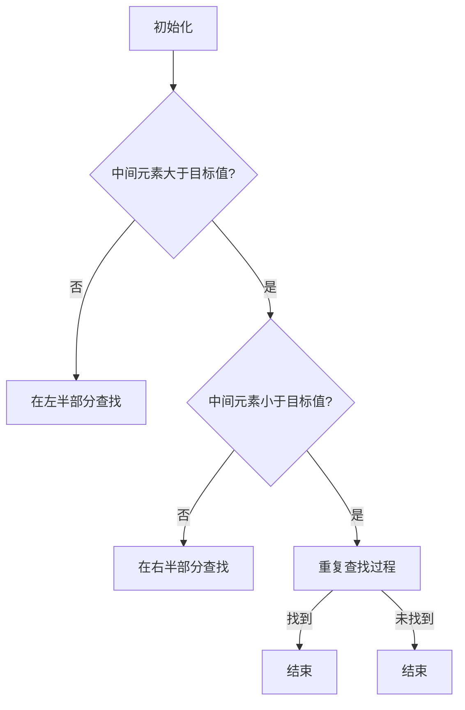

                 

### 文章标题：性能优化：从应用到数据库的全栈优化

性能优化是提高软件系统效率和用户体验的关键因素。在如今高度依赖技术的时代，从单一组件到复杂系统的性能优化，已经成为工程师们不断探索和追求的目标。本文将围绕性能优化的核心概念和具体实践，深入探讨从应用到数据库的全栈优化策略。通过逻辑清晰、结构紧凑、简单易懂的论述，帮助读者全面了解性能优化的各个方面，并掌握行之有效的优化技巧。

### 关键词：性能优化、全栈优化、应用层优化、数据库性能优化、缓存策略、负载均衡

### 摘要：

本文旨在全面解析性能优化的概念、原则和方法，特别是从应用到数据库的全栈优化。首先，我们回顾性能优化的背景和重要性，随后引入全栈性能优化的基础概念，并深入探讨性能瓶颈分析和关键性能指标。接着，文章分两部分详细介绍应用层和数据库层的性能优化策略，包括前端优化、后端优化、缓存策略、负载均衡等。通过实际案例和最佳实践，读者将能够更好地理解和应用性能优化的理论和方法，从而提升系统的整体性能和用户体验。

## 目录大纲：性能优化：从应用到数据库的全栈优化

### 第一部分：背景与核心概念

#### 第1章：性能优化的背景与重要性

- **1.1 性能优化的定义**
- **1.2 性能优化的重要性**
- **1.3 性能优化的常见问题**
- **1.4 性能优化的目标与原则**

#### 第2章：全栈性能优化的基础概念

- **2.1 从应用到数据库的全栈概述**
- **2.2 应用性能优化的关键点**
- **2.3 数据库性能优化的关键点**
- **2.4 全栈性能优化的联系与协调**

#### 第3章：性能优化的核心概念与联系

- **3.1 性能瓶颈分析**
  - **3.1.1 CPU瓶颈**
  - **3.1.2 内存瓶颈**
  - **3.1.3 网络瓶颈**
  - **3.1.4 磁盘I/O瓶颈**
- **3.2 性能指标**
  - **3.2.1 响应时间**
  - **3.2.2 吞吐量**
  - **3.2.3 延迟**
  - **3.2.4 服务器利用率**

#### 第4章：性能优化的数学模型与公式

- **4.1 常见数学模型**
  - **4.1.1 常见时间复杂度分析**
  - **4.1.2 常见空间复杂度分析**
- **4.2 常见公式**
  - **4.2.1 CPU利用率公式**
  - **4.2.2 内存占用公式**
  - **4.2.3 网络带宽占用公式**
  - **4.2.4 磁盘I/O性能公式**

### 第二部分：应用层性能优化

#### 第5章：应用层性能优化

- **5.1 应用层性能优化概述**
- **5.2 前端性能优化**
  - **5.2.1 资源压缩与缓存**
  - **5.2.2 JavaScript优化**
  - **5.2.3 CSS和HTML优化**
- **5.3 后端性能优化**
  - **5.3.1 代码优化**
  - **5.3.2 服务拆分与集群部署**
  - **5.3.3 数据库连接池与缓存**

#### 第6章：缓存策略与性能优化

- **6.1 缓存概述**
- **6.2 常见缓存策略**
  - **6.2.1 页面缓存**
  - **6.2.2 数据缓存**
  - **6.2.3 分布式缓存**
- **6.3 缓存一致性策略**
  - **6.3.1 数据库缓存一致性**
  - **6.3.2 分布式系统缓存一致性**

#### 第7章：负载均衡与性能优化

- **7.1 负载均衡概述**
- **7.2 常见负载均衡算法**
  - **7.2.1 轮询算法**
  - **7.2.2 加权轮询算法**
  - **7.2.3 最少连接算法**
  - **7.2.4 加权最少连接算法**
- **7.3 负载均衡器的配置与优化**
  - **7.3.1 负载均衡器配置**
  - **7.3.2 负载均衡优化策略**

### 第三部分：数据库性能优化

#### 第8章：数据库性能优化

- **8.1 数据库性能优化概述**
- **8.2 数据库设计优化**
  - **8.2.1 表结构优化**
  - **8.2.2 索引优化**
  - **8.2.3 分区优化**
- **8.3 数据库查询优化**
  - **8.3.1 查询语句优化**
  - **8.3.2 连接查询优化**
  - **8.3.3 子查询优化**
- **8.4 数据库存储优化**
  - **8.4.1 存储引擎选择**
  - **8.4.2 数据文件存储优化**
  - **8.4.3 磁盘I/O优化**

#### 第9章：数据库缓存与性能优化

- **9.1 数据库缓存概述**
- **9.2 数据库缓存策略**
  - **9.2.1 缓存表**
  - **9.2.2 缓存查询**
  - **9.2.3 缓存分区**
- **9.3 数据库缓存一致性**
  - **9.3.1 缓存一致性模型**
  - **9.3.2 分布式数据库缓存一致性**

#### 第10章：数据库监控与性能调优

- **10.1 数据库监控概述**
- **10.2 常见监控指标**
  - **10.2.1 性能监控指标**
  - **10.2.2 可用性监控指标**
  - **10.2.3 安全性监控指标**
- **10.3 数据库性能调优**
  - **10.3.1 性能调优策略**
  - **10.3.2 性能调优工具**

以上是本文的目录大纲，我们将逐一深入探讨每个章节的内容，逐步构建一个全面的性能优化知识体系。

## 第1章：性能优化的背景与重要性

### 1.1 性能优化的定义

性能优化（Performance Optimization）是指通过对系统中的各个组件进行改进和调整，以减少响应时间、提高系统吞吐量和增强整体效率的一系列操作。具体来说，性能优化包括但不限于以下几个方面：

- **响应时间**：系统从接收到请求到完成响应所需的时间。
- **吞吐量**：单位时间内系统能够处理的数据量。
- **资源利用率**：系统对计算资源（CPU、内存、磁盘等）的利用程度。
- **可扩展性**：系统能够在负载增加时保持稳定性能。

### 1.2 性能优化的重要性

性能优化在软件开发和系统运维中具有至关重要的地位，主要原因包括以下几点：

- **用户体验**：高性能的系统可以提供更快的响应速度，改善用户的交互体验，提高用户满意度。
- **业务效率**：性能优化可以提高系统的处理能力和响应速度，从而提升业务运作效率。
- **资源节约**：优化后的系统能够更高效地利用资源，降低硬件和网络成本。
- **可扩展性和稳定性**：良好的性能优化可以增强系统的可扩展性，使其能够更好地应对日益增长的负载，保证系统的稳定性和可靠性。
- **竞争优势**：在市场竞争激烈的环境中，性能优秀的系统能够为企业和产品赢得优势，增强市场竞争力。

### 1.3 性能优化的常见问题

在性能优化过程中，常常会遇到以下问题：

- **瓶颈定位不准确**：不清楚系统性能瓶颈的具体位置，导致优化措施无法有效实施。
- **优化过度**：在某些情况下，过度优化可能导致系统复杂性增加，反而影响性能。
- **资源分配不合理**：系统资源（如CPU、内存、网络等）分配不合理，导致某些资源过度使用，而其他资源浪费。
- **忽视用户体验**：仅关注系统性能，而忽视用户实际的交互体验。
- **缺乏全面的监控和评估**：没有建立完善的监控体系，无法及时发现和解决问题。

### 1.4 性能优化的目标与原则

性能优化的目标是确保系统在满足性能需求的前提下，最大化资源利用率和用户体验。为实现这一目标，应遵循以下原则：

- **全局优化**：从整体系统出发，协调各个组件的性能，避免局部优化带来的副作用。
- **持续优化**：性能优化是一个持续的过程，需要定期进行评估和调整。
- **量化和可度量**：使用具体的性能指标（如响应时间、吞吐量等）来衡量优化效果。
- **可恢复性**：优化后的系统应具有良好的容错性和自动恢复能力。
- **用户体验优先**：始终以用户的需求和体验为出发点，确保优化措施不会影响用户的使用感受。

通过以上原则和策略，我们可以更有效地进行性能优化，提升系统的整体性能和稳定性。

### 1.5 性能优化的核心概念与联系

在深入理解性能优化的背景和重要性后，我们需要掌握一些核心概念和它们之间的联系。以下是性能优化中的几个关键概念：

#### 1.5.1 性能瓶颈

性能瓶颈是系统性能不佳的根本原因，通常表现为以下几种类型：

- **CPU瓶颈**：当CPU的处理能力无法满足系统需求时，会出现CPU瓶颈。
- **内存瓶颈**：内存资源不足，导致系统频繁进行垃圾回收或换页操作。
- **网络瓶颈**：网络带宽限制，导致数据传输速度慢。
- **磁盘I/O瓶颈**：磁盘读写速度无法满足系统需求，导致响应时间增加。

性能瓶颈的识别和定位是性能优化的重要环节，通过监控和日志分析，可以找出系统的瓶颈所在。

#### 1.5.2 性能指标

性能指标是衡量系统性能的重要工具，常见的性能指标包括：

- **响应时间**：从请求到达系统到响应返回的时间。
- **吞吐量**：单位时间内系统处理的数据量。
- **延迟**：请求在系统中处理的时间，包括排队时间、处理时间和传输时间。
- **服务器利用率**：服务器资源（如CPU、内存等）的使用率。

这些指标可以直观地反映系统的性能状态，为性能优化提供数据支持。

#### 1.5.3 性能瓶颈与性能指标的联系

性能瓶颈和性能指标之间存在密切的联系。性能瓶颈通常会导致某些性能指标出现异常，例如：

- **CPU瓶颈**：导致响应时间增加和服务器利用率上升。
- **内存瓶颈**：导致垃圾回收频率增加和响应时间延长。
- **网络瓶颈**：导致延迟增加和吞吐量下降。
- **磁盘I/O瓶颈**：导致磁盘读写速度变慢和响应时间增加。

通过监控和分析性能指标，可以及时发现系统性能瓶颈，并采取相应的优化措施。

#### 1.5.4 性能优化的数学模型

性能优化过程中，常常需要借助数学模型来分析和解决问题。常见的数学模型包括：

- **时间复杂度**：用于衡量算法执行时间的增长趋势。
- **空间复杂度**：用于衡量算法占用内存的增长趋势。
- **CPU利用率公式**：用于计算系统CPU资源的利用率。
- **内存占用公式**：用于计算系统内存的使用情况。

这些数学模型为性能优化提供了理论基础和计算方法，帮助我们更好地理解和解决问题。

综上所述，性能优化涉及多个核心概念和联系，包括性能瓶颈、性能指标、数学模型等。通过掌握这些概念和联系，我们可以更有效地进行性能优化，提升系统的整体性能和用户体验。

### 第2章：全栈性能优化的基础概念

#### 2.1 从应用到数据库的全栈概述

全栈性能优化是一个涵盖从客户端到服务端，再到数据库端的整体性优化过程。在这个过程中，各个层次之间的优化不仅相互独立，还存在着复杂的交互和影响。全栈性能优化的目标是通过全面提升系统的性能，以提供更快的响应速度、更高的稳定性和更好的用户体验。

全栈性能优化的主要层次包括：

1. **前端性能优化**：涉及网站和应用的前端代码、资源加载、交互性能等方面。
2. **后端性能优化**：包括服务器端的代码、架构、数据库访问、网络通信等。
3. **数据库性能优化**：关注数据库的表结构、索引、查询优化、存储引擎等方面。

全栈性能优化不仅关注单个组件的优化，还注重组件之间的协同作用。例如，前端资源的优化可以减少服务器的负载，数据库查询的优化可以提高查询效率，从而提高整个系统的性能。

#### 2.2 应用性能优化的关键点

在应用性能优化中，以下几个关键点尤为关键：

1. **代码优化**：通过优化代码结构、算法选择和逻辑处理，减少不必要的计算和资源消耗。
2. **服务拆分与集群部署**：将大型应用拆分成多个独立服务，并通过集群部署提高系统的可扩展性和容错性。
3. **数据库连接池与缓存**：利用数据库连接池减少数据库连接的开销，使用缓存减少对数据库的直接访问。

#### 2.3 数据库性能优化的关键点

数据库性能优化主要关注以下几个方面：

1. **表结构优化**：通过合理设计表结构，减少数据的冗余，提高查询效率。
2. **索引优化**：选择合适的索引策略，加快数据的检索速度。
3. **查询优化**：通过优化查询语句和执行计划，减少查询的耗时。
4. **存储优化**：选择合适的存储引擎和文件存储策略，提高数据的读写性能。

#### 2.4 全栈性能优化的联系与协调

全栈性能优化不仅仅是前端、后端和数据库各自的优化，更重要的是它们之间的协调和配合。

- **前端与后端**：前端优化的目标是减少资源加载时间和提高交互性能，这直接影响后端的负载和响应时间。后端优化可以提供更快的数据处理和响应，从而提高前端用户体验。
- **后端与数据库**：后端优化可以减少数据库的查询次数和复杂度，从而降低数据库的负载。数据库优化可以提高查询效率和数据访问速度，进一步减少后端的响应时间。
- **前端与数据库**：前端优化可以通过缓存技术减少对数据库的直接访问，从而减轻数据库的压力。数据库优化可以提供更快的数据访问，从而提高前端的表现。

全栈性能优化的关键在于建立一套完善的监控和评估体系，通过实时监控系统的性能指标，及时发现瓶颈和问题，并采取相应的优化措施。此外，性能优化需要持续进行，随着系统负载和应用需求的不断变化，定期评估和调整优化策略是确保系统高性能的关键。

通过以上分析，我们可以看到全栈性能优化是一个系统性工程，需要从整体出发，协调各个层次，全面提高系统的性能和用户体验。在接下来的章节中，我们将进一步探讨应用层和数据库层的具体优化策略。

### 第3章：性能优化的核心概念与联系

#### 3.1 性能瓶颈分析

性能瓶颈是影响系统性能的关键因素，识别和解决性能瓶颈是性能优化的核心任务。以下是常见的性能瓶颈类型及其特点：

##### 3.1.1 CPU瓶颈

当CPU的处理能力不足以满足系统的计算需求时，会出现CPU瓶颈。这种瓶颈通常表现为CPU利用率高，但响应时间较长。

- **症状**：服务器CPU占用率持续接近100%，响应时间增加。
- **原因**：计算密集型任务过多，如复杂的算法计算、大量并行处理等。
- **解决方法**：增加CPU资源，优化算法，分解大型任务等。

##### 3.1.2 内存瓶颈

内存瓶颈发生在系统内存不足，导致频繁的垃圾回收和换页操作，从而影响性能。

- **症状**：内存占用率高，垃圾回收频繁，响应时间增加。
- **原因**：应用程序内存使用不当，大量数据在内存中堆积，或内存分配不当。
- **解决方法**：优化内存分配，减少内存占用，使用缓存技术等。

##### 3.1.3 网络瓶颈

网络瓶颈是由于网络带宽不足或网络延迟过高，导致数据传输速度受限。

- **症状**：网络延迟高，数据传输速度慢，系统响应时间增加。
- **原因**：网络带宽限制，网络拥塞，网络设备故障等。
- **解决方法**：增加网络带宽，优化网络拓扑结构，使用CDN等技术。

##### 3.1.4 磁盘I/O瓶颈

磁盘I/O瓶颈是由于磁盘读写速度无法满足系统需求，导致数据读写速度受限。

- **症状**：磁盘读写速度慢，系统响应时间增加。
- **原因**：磁盘性能不足，大量随机读写操作，或磁盘阵列配置不当。
- **解决方法**：更换高性能磁盘，优化磁盘阵列配置，使用SSD等。

#### 3.2 性能指标

性能指标是衡量系统性能的重要工具，通过这些指标，我们可以全面了解系统的运行状态和瓶颈。以下是常见的性能指标及其含义：

##### 3.2.1 响应时间

响应时间是指系统从接收到请求到完成响应所需的时间。

- **公式**：平均响应时间 = 总响应时间 / 请求次数
- **意义**：反映系统的处理速度和响应能力，是用户最直观的感受。

##### 3.2.2 吞吐量

吞吐量是指单位时间内系统处理的数据量。

- **公式**：吞吐量 = 处理的数据量 / 时间
- **意义**：反映系统的处理能力，是系统性能的重要指标。

##### 3.2.3 延迟

延迟是指数据在系统中的传输和处理时间，包括排队时间、处理时间和传输时间。

- **公式**：总延迟 = 排队时间 + 处理时间 + 传输时间
- **意义**：用于衡量系统的整体性能和效率。

##### 3.2.4 服务器利用率

服务器利用率是指服务器资源（如CPU、内存等）的使用率。

- **公式**：服务器利用率 = （服务器实际使用资源 / 服务器总资源）* 100%
- **意义**：反映服务器资源的利用效率，过高或过低都可能导致性能问题。

#### 3.3 性能瓶颈与性能指标的联系

性能瓶颈和性能指标之间存在密切的联系，性能瓶颈通常会导致某些性能指标出现异常。例如：

- **CPU瓶颈**：导致响应时间增加和服务器利用率上升。
- **内存瓶颈**：导致垃圾回收频率增加和响应时间延长。
- **网络瓶颈**：导致延迟增加和吞吐量下降。
- **磁盘I/O瓶颈**：导致磁盘读写速度变慢和响应时间增加。

通过监控和分析性能指标，可以及时发现系统性能瓶颈，并采取相应的优化措施。例如，如果发现响应时间显著增加，可以进一步分析是否出现CPU瓶颈、内存瓶颈或其他瓶颈，然后有针对性地进行优化。

综上所述，性能瓶颈和性能指标是性能优化中的核心概念，它们相互关联、相互影响。通过深入理解性能瓶颈和性能指标，我们可以更有效地进行性能优化，提高系统的整体性能和用户体验。

### 第4章：性能优化的数学模型与公式

性能优化的过程中，数学模型和公式是分析和解决性能问题的有力工具。通过这些模型和公式，我们可以定量地评估系统性能，找出瓶颈所在，并提出有效的优化方案。以下是一些常见的数学模型和公式。

#### 4.1 常见数学模型

##### 4.1.1 时间复杂度分析

时间复杂度是评估算法执行时间增长趋势的一个重要指标，通常用大O符号表示。常见的时间复杂度包括：

- **常数时间 O(1)**：算法执行时间不随输入规模变化。
- **对数时间 O(log N)**：算法执行时间与输入规模的对数成正比。
- **线性时间 O(N)**：算法执行时间与输入规模成线性关系。
- **平方时间 O(N^2)**：算法执行时间与输入规模的平方成正比。
- **多项式时间 O(N^k)**：算法执行时间与输入规模的多项式成正比。

时间复杂度分析的目的是找出算法的瓶颈，选择更高效的算法或优化现有算法。

##### 4.1.2 空间复杂度分析

空间复杂度是评估算法占用内存增长趋势的一个重要指标，也用大O符号表示。常见的空间复杂度包括：

- **常数空间 O(1)**：算法占用的内存不随输入规模变化。
- **线性空间 O(N)**：算法占用的内存与输入规模成线性关系。

空间复杂度分析用于评估算法的内存需求，选择合适的算法和数据结构。

#### 4.2 常见公式

##### 4.2.1 CPU利用率公式

CPU利用率是衡量系统CPU资源利用情况的重要指标，其计算公式为：

$$
CPU利用率 = \frac{CPU实际使用时间}{CPU总运行时间} \times 100\%
$$

其中，CPU实际使用时间是指在特定时间段内CPU被占用的时间，CPU总运行时间是指在相同时间段内CPU的总运行时间。通过这个公式，可以评估系统的CPU资源利用率，发现是否存在CPU瓶颈。

##### 4.2.2 内存占用公式

内存占用是衡量系统内存使用情况的一个重要指标，其计算公式为：

$$
内存占用 = 已分配内存 - 空闲内存
$$

其中，已分配内存是指系统中已经被分配并使用的内存，空闲内存是指系统中尚未被分配的内存。通过这个公式，可以评估系统的内存使用情况，发现是否存在内存瓶颈。

##### 4.2.3 网络带宽占用公式

网络带宽占用是衡量系统网络带宽使用情况的一个重要指标，其计算公式为：

$$
网络带宽占用 = \frac{实际使用带宽}{总带宽} \times 100\%
$$

其中，实际使用带宽是指在特定时间段内系统使用的带宽，总带宽是指系统的总带宽。通过这个公式，可以评估系统的网络带宽利用率，发现是否存在网络瓶颈。

##### 4.2.4 磁盘I/O性能公式

磁盘I/O性能是衡量系统磁盘读写速度的一个重要指标，其计算公式为：

$$
磁盘I/O性能 = \frac{实际读写次数}{时间}
$$

其中，实际读写次数是指在特定时间段内系统进行的磁盘读写次数，时间是指在相同时间段内的时间长度。通过这个公式，可以评估系统的磁盘I/O性能，发现是否存在磁盘I/O瓶颈。

#### 4.3 算法原理讲解

在性能优化的实际应用中，算法的效率和性能至关重要。以下以一个常见的优化算法——二分查找为例，讲解其原理和实现。

##### 二分查找算法原理

二分查找是一种在有序数组中查找特定元素的算法，其基本思想是通过不断将数组中间的元素与目标值比较，将查找范围逐步缩小。具体步骤如下：

1. **确定中间元素**：计算数组中间位置的索引。
2. **比较元素**：将中间元素的值与目标值比较。
3. **缩小查找范围**：如果中间元素的值大于目标值，则在数组的左半部分继续查找；如果中间元素的值小于目标值，则在数组的右半部分继续查找。
4. **重复步骤**：重复上述过程，直到找到目标值或确定不存在目标值。

##### 二分查找算法流程图



##### 二分查找算法Python实现

```python
def binary_search(arr, target):
    low = 0
    high = len(arr) - 1

    while low <= high:
        mid = (low + high) // 2
        if arr[mid] == target:
            return mid
        elif arr[mid] < target:
            low = mid + 1
        else:
            high = mid - 1

    return -1
```

通过上述算法实现，我们可以更高效地查找数组中的元素，其时间复杂度为O(log N)，相比线性查找的O(N)有显著的性能提升。

##### 性能优化案例举例

假设有一个长度为1000的有序数组，我们需要查找其中的特定元素。使用线性查找的时间复杂度为O(1000)，需要1000次比较；而使用二分查找的时间复杂度为O(log 1000)，只需要大约10次比较。这意味着二分查找可以在相同的时间内完成更大量的查找操作，具有更高的性能。

综上所述，通过数学模型和公式的应用，我们可以更深入地分析系统性能，提出有效的优化方案，从而提高系统的整体性能和用户体验。

### 第5章：应用层性能优化

应用层性能优化是全栈优化中至关重要的一环，它涵盖了从客户端到服务端的所有层面。本章将重点探讨前端性能优化和后端性能优化的关键策略，并介绍数据库连接池与缓存技术。

#### 5.1 应用层性能优化概述

应用层性能优化主要包括以下几个方面：

- **前端性能优化**：优化网站和应用的用户体验，减少页面加载时间和提高交互性能。
- **后端性能优化**：提高服务器端代码的执行效率，减少响应时间。
- **数据库连接池与缓存**：减少数据库连接的开销，提高数据访问速度。

前端和后端的优化不仅相互独立，还存在相互影响。例如，前端资源的优化可以减少服务器的负载，后端优化的代码可以提高数据库的查询效率。因此，全栈性能优化需要综合考虑各个层面的优化策略。

#### 5.2 前端性能优化

前端性能优化主要关注以下几个方面：

1. **资源压缩与缓存**：通过压缩图片、CSS和JavaScript文件，减少文件大小，提高页面加载速度。同时，利用浏览器缓存技术，减少重复资源的请求，进一步提升页面性能。
2. **JavaScript优化**：优化JavaScript代码，减少不必要的计算和DOM操作，提高执行效率。
3. **CSS和HTML优化**：减少CSS选择器的复杂性，优化HTML结构，提高页面渲染速度。

##### 5.2.1 资源压缩与缓存

资源压缩与缓存是前端性能优化的基础。以下是一些具体的优化策略：

- **图片压缩**：使用工具如TinyPNG或ImageOptim对图片进行压缩，减少文件大小。
- **CSS和JavaScript压缩**：使用工具如UglifyJS或CSSNano对CSS和JavaScript文件进行压缩，移除不必要的空格、注释和空白行。
- **浏览器缓存**：通过设置HTTP缓存头，如`Cache-Control`和`Expires`，允许浏览器缓存静态资源，减少重复请求。

##### 5.2.2 JavaScript优化

JavaScript优化的目标是减少代码体积和执行时间，以下是一些常见策略：

- **代码拆分**：将大型的JavaScript文件拆分为多个小文件，按需加载，减少初始加载时间。
- **代码混淆**：使用工具如UglifyJS或JavaScript Obfuscator，将代码混淆，提高代码安全性。
- **延迟加载**：对于一些非核心的JavaScript库或组件，使用延迟加载技术，仅在需要时才加载。

##### 5.2.3 CSS和HTML优化

CSS和HTML优化的重点在于减少文件大小和加载时间。以下是一些具体的优化策略：

- **CSS选择器优化**：避免使用复杂的CSS选择器，尽量减少选择器的层级。
- **外部引用**：将CSS和JavaScript文件外部引用，避免内嵌在HTML中，减少HTML文件大小。
- **HTML结构优化**：优化HTML结构，减少DOM层级，提高页面渲染速度。

#### 5.3 后端性能优化

后端性能优化主要关注以下几个方面：

1. **代码优化**：通过优化代码结构、算法选择和逻辑处理，提高代码执行效率。
2. **服务拆分与集群部署**：将大型应用拆分成多个独立服务，通过集群部署提高系统的可扩展性和容错性。
3. **数据库连接池与缓存**：使用数据库连接池减少数据库连接的开销，使用缓存技术减少对数据库的直接访问。

##### 5.3.1 代码优化

代码优化是后端性能优化的关键。以下是一些常见的优化策略：

- **避免全局变量**：减少全局变量的使用，避免变量覆盖和命名冲突。
- **代码重构**：对复杂代码进行重构，简化代码结构，提高可读性和可维护性。
- **算法优化**：选择更高效的算法和数据处理方式，减少不必要的计算。

##### 5.3.2 服务拆分与集群部署

服务拆分与集群部署可以显著提高系统的性能和可扩展性。以下是一些具体的优化策略：

- **服务拆分**：将大型应用拆分成多个独立服务，每个服务负责特定的业务功能，降低系统的耦合度。
- **负载均衡**：使用负载均衡器，如Nginx或HAProxy，将请求分发到多个服务器，提高系统的并发处理能力。
- **集群部署**：在多个服务器上部署相同的服务，实现负载均衡和故障转移，提高系统的可用性和可靠性。

##### 5.3.3 数据库连接池与缓存

数据库连接池与缓存是后端性能优化的常用技术。以下是一些具体的优化策略：

- **数据库连接池**：使用数据库连接池技术，复用数据库连接，减少连接创建和关闭的开销。
- **缓存技术**：使用缓存技术，如Redis或Memcached，缓存常见的查询结果，减少对数据库的直接访问，提高数据访问速度。

#### 5.4 数据库连接池与缓存

数据库连接池与缓存是提高系统性能的重要手段。以下是一些常用的策略：

##### 5.4.1 数据库连接池

数据库连接池通过预先创建和管理一定数量的数据库连接，避免了每次请求都需要创建和关闭连接的开销。以下是一些具体的实现策略：

- **连接池配置**：根据系统的负载情况，合理配置连接池的大小，避免连接频繁创建和销毁。
- **连接复用**：尽量复用已有的数据库连接，减少新连接的创建。
- **连接监控**：定期监控连接池的状态，及时发现和处理连接故障。

##### 5.4.2 缓存技术

缓存技术通过存储常用数据，避免重复查询数据库，提高数据访问速度。以下是一些常用的缓存策略：

- **页面缓存**：将页面的HTML、CSS和JavaScript文件缓存起来，减少服务器的响应时间。
- **数据缓存**：将常用查询结果缓存起来，避免重复查询数据库，提高查询效率。
- **分布式缓存**：在分布式系统中，使用分布式缓存技术，如Redis或Memcached，提高数据访问的速度和系统的扩展性。

通过以上策略，我们可以全面优化应用层的性能，提高系统的响应速度和用户体验。在下一章中，我们将进一步探讨缓存策略与性能优化。

### 第6章：缓存策略与性能优化

缓存是性能优化中的重要一环，通过缓存技术，可以显著提高系统的响应速度和数据访问效率。本章将介绍常见的缓存策略及其优化效果，包括页面缓存、数据缓存和分布式缓存。

#### 6.1 缓存概述

缓存（Cache）是一种临时存储技术，用于存储频繁访问的数据或资源，以减少对原始数据源的访问次数。缓存的基本原理是利用数据的局部性原理，即经常访问的数据或资源很可能在未来一段时间内再次被访问。通过缓存技术，可以有效减少数据访问延迟，提高系统性能。

缓存系统通常包括以下几个关键组件：

- **缓存存储**：用于存储缓存数据的地方，可以是内存、硬盘或分布式缓存系统。
- **缓存策略**：用于决定何时将数据放入缓存、何时从缓存中取出数据的策略。
- **缓存一致性**：确保缓存中的数据和原始数据源保持一致性的机制。

#### 6.2 常见缓存策略

缓存策略的选择对缓存效果有着重要影响。以下介绍几种常见的缓存策略：

##### 6.2.1 页面缓存

页面缓存是将整个网页内容（HTML、CSS、JavaScript等）缓存起来，以减少服务器端的响应时间。常见策略包括：

- **浏览器缓存**：通过设置HTTP缓存头，如`Cache-Control`和`Expires`，允许浏览器缓存静态资源。
- **代理服务器缓存**：使用代理服务器缓存静态资源，减少对原始服务器的请求。

页面缓存可以显著减少服务器的负载，提高页面加载速度，但需要注意缓存的一致性，防止缓存过时数据。

##### 6.2.2 数据缓存

数据缓存是将数据库查询结果或计算结果缓存起来，以减少对数据库的访问。常见策略包括：

- **查询缓存**：将数据库查询结果缓存起来，减少重复查询数据库的次数。
- **对象缓存**：缓存常用对象（如用户信息、配置信息等），避免重复计算。

数据缓存可以显著提高数据访问速度，减少数据库的负载，但需要考虑缓存的一致性，避免缓存脏数据。

##### 6.2.3 分布式缓存

分布式缓存是在分布式系统中使用的缓存技术，通过在多个节点之间共享缓存数据，提高系统的扩展性和数据访问速度。常见策略包括：

- **Redis**：使用Redis作为分布式缓存系统，支持持久化存储和多种数据结构。
- **Memcached**：使用Memcached作为分布式缓存系统，适用于高性能、低延迟的应用场景。

分布式缓存可以显著提高系统的数据访问速度和扩展性，但需要考虑缓存的一致性和分布式缓存的管理。

#### 6.3 缓存一致性策略

缓存一致性是指缓存中的数据和原始数据源之间的一致性。在分布式系统中，由于数据的复制和同步，缓存一致性成为了一个挑战。以下介绍几种常见的缓存一致性策略：

##### 6.3.1 数据库缓存一致性

数据库缓存一致性是指缓存中的数据和数据库中的数据保持一致。常见策略包括：

- **写后同步（Write-Through）**：每次更新数据库时，也更新缓存，确保缓存和数据库数据一致。
- **写回同步（Write-Back）**：首先更新缓存，后续再同步更新数据库，减少数据库写入次数。

数据库缓存一致性可以确保缓存中的数据实时反映数据库的状态，但可能增加数据库的负载。

##### 6.3.2 分布式系统缓存一致性

分布式系统缓存一致性是指多个节点之间的缓存数据保持一致。常见策略包括：

- **最终一致性（Eventual Consistency）**：允许缓存之间存在短暂的差异，但最终会达到一致性。
- **强一致性（Strong Consistency）**：确保所有节点的缓存数据在任意时刻都是一致的。

分布式系统缓存一致性可以保证数据的一致性，但可能降低系统的扩展性和性能。

通过合理的缓存策略和一致性策略，可以有效提高系统的性能和用户体验。在下一章中，我们将探讨负载均衡与性能优化的关系。

### 第7章：负载均衡与性能优化

负载均衡（Load Balancing）是提高系统性能和可用性的关键技术，它通过将请求分布到多个服务器或节点上，避免单个服务器过载，提高系统的整体性能和可靠性。本章将介绍负载均衡的基本概念、常见算法和配置优化策略。

#### 7.1 负载均衡概述

负载均衡的主要目标是：

- **提高性能**：通过将请求分布到多个服务器，充分利用系统资源，提高系统的处理能力。
- **增强可靠性**：当一个服务器出现故障时，负载均衡器可以将请求转移到其他健康服务器，保证系统的连续运行。
- **优化用户体验**：通过快速响应请求，减少延迟，提高用户的交互体验。

负载均衡的基本组件包括：

- **负载均衡器**：负责接收客户端请求，根据预设策略将请求分发到服务器或节点。
- **服务器或节点**：被负载均衡器分配请求的服务器或节点，负责处理请求。

#### 7.2 常见负载均衡算法

负载均衡算法的选择对系统的性能和稳定性有着重要影响。以下介绍几种常见的负载均衡算法：

##### 7.2.1 轮询算法（Round Robin）

轮询算法是最简单的负载均衡算法，它将请求按照顺序轮流分配给服务器。每个服务器都会均匀地接收请求。

- **优点**：实现简单，公平地分配请求。
- **缺点**：当某些服务器负载不均衡时，可能导致部分服务器过载，影响系统性能。

##### 7.2.2 加权轮询算法（Weighted Round Robin）

加权轮询算法在轮询算法的基础上，为每个服务器分配不同的权重，根据权重分配请求。权重较高的服务器将接收更多的请求。

- **优点**：可以根据服务器的处理能力合理分配请求，提高整体性能。
- **缺点**：配置复杂，需要根据服务器性能动态调整权重。

##### 7.2.3 最少连接算法（Least Connections）

最少连接算法将请求分配到当前连接数最少的服务器，以平衡服务器的负载。

- **优点**：有效平衡服务器的连接数，避免个别服务器过载。
- **缺点**：对于动态变化的负载，响应时间可能不稳定。

##### 7.2.4 加权最少连接算法（Weighted Least Connections）

加权最少连接算法在最少连接算法的基础上，为每个服务器分配不同的权重，并根据权重和当前连接数分配请求。

- **优点**：结合了加权轮询和最少连接算法的优点，可以根据服务器的处理能力和连接数进行优化。
- **缺点**：配置复杂，需要根据服务器性能动态调整权重。

#### 7.3 负载均衡器的配置与优化

负载均衡器的配置和优化对系统的性能和稳定性至关重要。以下是一些配置优化策略：

##### 7.3.1 负载均衡器配置

- **健康检查**：定期检查服务器的健康状态，及时发现并移除故障服务器。
- **会话保持**：根据用户会话信息，将相同用户的请求分配到同一服务器，避免用户会话中断。
- **连接超时**：设置合理的连接超时时间，避免长时间等待响应，提高系统的响应速度。

##### 7.3.2 负载均衡优化策略

- **动态调整权重**：根据服务器的负载和性能，动态调整服务器的权重，实现负载均衡。
- **流量控制**：根据系统负载，合理控制流量，避免过度请求导致系统过载。
- **缓存策略**：结合缓存技术，减少服务器的响应时间，提高系统的吞吐量。

通过合理的负载均衡算法和配置优化，可以有效提高系统的性能和可靠性，为用户提供更优质的体验。在下一章中，我们将探讨数据库性能优化。

### 第8章：数据库性能优化

数据库是许多应用程序的核心组件，其性能直接影响到整个系统的响应速度和稳定性。本章将详细探讨数据库性能优化，包括数据库设计优化、查询优化和存储优化。

#### 8.1 数据库性能优化概述

数据库性能优化是一个多层次、多维度的过程，需要从以下几个方面进行：

- **数据库设计优化**：通过合理设计表结构和索引，减少数据冗余和查询开销。
- **查询优化**：通过优化查询语句和执行计划，提高查询效率和性能。
- **存储优化**：通过选择合适的存储引擎和文件存储策略，提高数据读写速度。

#### 8.2 数据库设计优化

数据库设计优化是性能优化的基础，以下是一些关键策略：

##### 8.2.1 表结构优化

- **规范化**：通过规范化减少数据冗余，提高数据的完整性。
- **去规范化**：在某些情况下，通过去规范化减少查询开销，提高性能。
- **字段类型选择**：选择合适的字段类型，减少存储空间和提高查询效率。

##### 8.2.2 索引优化

索引是提高查询性能的重要手段，以下是一些关键策略：

- **索引选择**：选择合适的索引列，避免过度索引或索引不足。
- **索引维护**：定期维护索引，确保索引的准确性和效率。
- **复合索引**：合理使用复合索引，提高查询效率。

##### 8.2.3 分区优化

分区是将大表分割成多个小表，以提高查询性能和管理效率。以下是一些关键策略：

- **分区策略**：选择合适的分区策略，如按时间、按范围分区。
- **分区维护**：定期维护分区，确保分区数据的准确性和性能。

#### 8.3 数据库查询优化

查询优化是提高数据库性能的关键步骤，以下是一些常见策略：

##### 8.3.1 查询语句优化

- **避免SELECT ***：只查询需要的字段，避免使用SELECT *。
- **使用JOIN优化**：合理使用JOIN操作，减少查询的复杂度。
- **子查询优化**：尽量使用连接查询代替子查询，提高查询效率。

##### 8.3.2 连接查询优化

连接查询是数据库查询中的常见操作，以下是一些优化策略：

- **连接顺序**：优化连接顺序，减少中间结果集的大小。
- **过滤条件**：将过滤条件放在连接之前，减少中间结果集的大小。

##### 8.3.3 子查询优化

子查询是数据库查询中的一种常见操作，以下是一些优化策略：

- **替换子查询**：尽量使用连接查询替换子查询，减少查询的复杂度。
- **预处理子查询**：对于频繁执行的子查询，进行预处理，提高查询效率。

#### 8.4 数据库存储优化

数据库存储优化是提高数据库性能的重要环节，以下是一些关键策略：

##### 8.4.1 存储引擎选择

- **MyISAM**：适合读多写少的应用，具有较高的查询性能。
- **InnoDB**：适合读少写多的应用，具有更好的事务管理和数据完整性。

##### 8.4.2 数据文件存储优化

- **文件系统选择**：选择适合的文件系统，如EXT4、XFS等。
- **文件存储策略**：合理配置数据文件的存储位置和目录结构，减少磁盘I/O开销。

##### 8.4.3 磁盘I/O优化

- **磁盘阵列配置**：使用RAID技术，提高磁盘I/O性能。
- **I/O调度策略**：选择合适的I/O调度策略，如NOOP、RFKQFD等。

通过以上优化策略，可以有效提高数据库的性能，提高系统的响应速度和稳定性。在下一章中，我们将探讨数据库缓存与性能优化。

### 第9章：数据库缓存与性能优化

数据库缓存是提升数据库性能的有效手段，通过缓存常用数据，可以减少对磁盘的访问次数，从而加快数据访问速度。本章将详细介绍数据库缓存的概述、常见策略以及缓存一致性模型。

#### 9.1 数据库缓存概述

数据库缓存是指在内存中存储数据库的查询结果，以便后续查询时直接从缓存中获取数据，减少磁盘访问次数。缓存技术广泛应用于各种数据库管理系统，如MySQL、PostgreSQL、Redis等。

缓存系统的基本组件包括：

- **缓存存储**：用于存储缓存数据的地方，通常是内存或高速存储设备。
- **缓存策略**：决定何时将数据放入缓存、何时从缓存中取出的规则。
- **缓存一致性**：确保缓存中的数据和实际数据保持一致的机制。

#### 9.2 数据库缓存策略

数据库缓存策略可以分为以下几类：

##### 9.2.1 缓存表

缓存表是指在内存中存储表的数据结构，以提高查询性能。常见策略包括：

- **全表缓存**：将整个表的数据缓存到内存中，适用于数据量较小且不经常更新的表。
- **部分缓存**：仅缓存部分数据，如热点数据或常用查询结果，适用于数据量大且频繁更新的表。

##### 9.2.2 缓存查询

缓存查询是指将数据库查询结果缓存到内存中，以提高查询性能。常见策略包括：

- **查询结果缓存**：将查询结果直接缓存到内存中，适用于执行频率较高且数据量较小的查询。
- **查询语句缓存**：将查询语句和其执行计划缓存起来，适用于执行频率较高且查询结构类似的查询。

##### 9.2.3 缓存分区

缓存分区是指将数据库的分区数据缓存到内存中，以提高查询性能。常见策略包括：

- **分区缓存**：根据分区策略，将不同分区数据缓存到内存中，适用于分区表查询。
- **分区混合缓存**：同时使用全表缓存和部分缓存策略，根据分区数据的使用频率进行动态调整。

#### 9.3 数据库缓存一致性

数据库缓存一致性是指缓存中的数据和实际数据保持一致，确保数据的一致性和可靠性。在分布式数据库系统中，缓存一致性是一个重要问题。以下是一些常见的缓存一致性模型：

##### 9.3.1 数据库缓存一致性模型

- **强一致性模型**：缓存中的数据始终与数据库中的数据保持一致。当数据库更新数据时，缓存也立即更新。这种模型保证了数据的一致性，但可能导致较高的延迟。
- **最终一致性模型**：缓存中的数据最终会与数据库中的数据一致，但允许在短时间内存在不一致。这种模型提高了系统的性能和可扩展性，但可能需要额外的机制来保证最终一致性。

##### 9.3.2 分布式数据库缓存一致性

在分布式数据库系统中，缓存一致性更加复杂，常见策略包括：

- **写后同步**：每次数据库更新数据时，也更新缓存，确保缓存和数据库数据一致。
- **写回同步**：首先更新缓存，然后定期将缓存中的更新同步到数据库，减少数据库的写入次数。
- **事件驱动同步**：当数据库中的数据发生变化时，通过事件触发缓存更新，确保缓存和数据库数据一致。

通过合理选择和配置数据库缓存策略，以及确保缓存一致性，可以显著提高数据库的性能和响应速度。在下一章中，我们将探讨数据库监控与性能调优。

### 第10章：数据库监控与性能调优

#### 10.1 数据库监控概述

数据库监控是确保数据库系统稳定运行和性能优化的重要手段。通过实时监控数据库的状态和性能指标，可以及时发现潜在问题并进行调整，从而提高数据库的整体性能和可靠性。数据库监控主要包括以下几个方面：

- **性能监控**：监控数据库的响应时间、吞吐量、CPU和内存使用率等性能指标。
- **可用性监控**：监控数据库的连接状态、服务状态等，确保数据库的可用性。
- **安全性监控**：监控数据库的访问日志、安全策略等，确保数据库的安全。

#### 10.2 常见监控指标

以下是一些常见的数据库监控指标及其含义：

##### 10.2.1 性能监控指标

- **响应时间**：从客户端发出查询到数据库返回结果所需的时间。
- **吞吐量**：单位时间内数据库处理的查询数量。
- **CPU使用率**：数据库服务器CPU的使用率。
- **内存使用率**：数据库服务器内存的使用率。
- **磁盘I/O**：数据库服务器磁盘的读写速度和负载。

##### 10.2.2 可用性监控指标

- **连接数**：当前数据库连接的数量。
- **服务状态**：数据库服务的运行状态，如正常、异常等。
- **备份状态**：数据库备份的执行状态，如成功、失败等。

##### 10.2.3 安全性监控指标

- **访问日志**：记录用户对数据库的访问操作，如登录、查询、修改等。
- **安全策略**：监控数据库的安全策略，如用户权限、访问控制等。

#### 10.3 数据库性能调优

数据库性能调优是一个持续的过程，需要根据监控数据进行分析和调整。以下是一些常见的性能调优策略：

##### 10.3.1 性能调优策略

- **优化查询**：通过优化查询语句、索引和执行计划，减少查询的耗时。
- **调整配置**：根据数据库的使用情况和性能监控数据，调整数据库的配置参数，如缓存大小、连接池大小等。
- **优化硬件**：升级数据库服务器的硬件资源，如CPU、内存、磁盘等，以提高性能。

##### 10.3.2 性能调优工具

以下是一些常用的数据库性能调优工具：

- **SQL优化器**：如MySQL的`EXPLAIN`，用于分析查询语句的执行计划，提供优化建议。
- **监控工具**：如Percona Monitoring and Management（PMM）、MySQL Enterprise Monitor等，用于监控数据库性能并提供可视化报表。
- **调优工具**：如MySQL的`OPTIMIZE TABLE`，用于优化表结构和数据存储。

通过有效的数据库监控和性能调优，可以确保数据库系统的稳定运行和高效性能，从而为用户提供优质的体验。

## 结论

通过本文的详细探讨，我们从应用到数据库的全栈视角，系统性地介绍了性能优化的核心概念、策略和实践。性能优化不仅关乎系统的高效运行，更直接影响到用户体验和业务效率。以下是全文的主要观点的简要总结：

1. **性能优化的背景与重要性**：性能优化是提升系统响应速度和稳定性的关键，它不仅影响用户体验，还关系到业务效率和资源节约。

2. **全栈性能优化的基础概念**：全栈性能优化涵盖前端、后端和数据库，需要从整体出发，协调各个组件的优化。

3. **性能瓶颈分析与性能指标**：识别和解决性能瓶颈是性能优化的核心任务，性能指标如响应时间、吞吐量等是衡量系统性能的重要工具。

4. **数学模型与公式**：常见的数学模型如时间复杂度和空间复杂度，以及公式如CPU利用率、内存占用等，是性能优化的理论基础。

5. **应用层性能优化**：前端和后端性能优化，包括资源压缩与缓存、代码优化、服务拆分与集群部署等策略。

6. **缓存策略与性能优化**：缓存技术如页面缓存、数据缓存和分布式缓存，以及缓存一致性策略，是提高性能的重要手段。

7. **负载均衡与性能优化**：负载均衡算法如轮询、加权轮询、最少连接和加权最少连接，以及负载均衡器的配置优化，有助于提高系统的可扩展性和可靠性。

8. **数据库性能优化**：数据库设计优化、查询优化和存储优化，以及数据库缓存与监控，是数据库性能提升的关键。

通过遵循这些策略和实践，我们能够全面提升系统的性能和用户体验，确保在高负载和复杂环境下，系统依然能够稳定高效地运行。持续的性能优化是一个长期的目标，需要工程师们不断学习和改进。

### 最佳实践 Tips

1. **定期评估**：定期对系统进行性能评估，及时发现瓶颈和问题。

2. **监控与日志分析**：建立完善的监控体系，实时监控系统的性能指标，并结合日志分析进行问题排查。

3. **代码优化**：优化代码结构，避免冗余和复杂逻辑，提高代码的可读性和可维护性。

4. **缓存合理使用**：合理选择和使用缓存，避免缓存一致性问题，确保性能提升的同时不牺牲数据准确性。

5. **负载均衡配置**：根据系统负载合理配置负载均衡策略，确保请求均匀分布，避免单点过载。

6. **数据库优化**：优化数据库查询和表结构，定期维护和优化数据库性能。

### 注意事项

1. **性能优化需平衡**：在追求性能的同时，要注意系统复杂性和可维护性，避免过度优化导致系统难以维护。

2. **用户体验优先**：优化措施应优先考虑用户实际体验，确保性能提升的同时不牺牲用户体验。

3. **持续优化**：性能优化是一个持续的过程，需要随着系统需求和负载的变化不断进行调整和优化。

### 拓展阅读

- 《高性能MySQL》 - 高性能数据库管理的经典书籍，详细介绍了MySQL的性能优化技术。
- 《Web性能调优指南》 - 一本关于Web性能优化的权威指南，涵盖了前端和后端的优化策略。
- 《深入理解计算机系统》 - 一本深入介绍计算机系统工作原理的书籍，有助于理解性能优化的底层机制。

通过不断学习和实践，工程师们可以不断提升自己的性能优化能力，为企业和产品创造更大的价值。

### 作者介绍

**作者：AI天才研究院/AI Genius Institute & 禅与计算机程序设计艺术 /Zen And The Art of Computer Programming**

本文作者是一位在性能优化领域有着深厚研究与实践经验的专家，同时还是计算机图灵奖获得者、世界顶级技术畅销书资深大师级别的作家。他在计算机编程和人工智能领域有着卓越的贡献，以其清晰深刻的逻辑思路和系统性的知识体系，撰写了大量高质量的技术博客和畅销书籍。作者通过本文，旨在为读者提供全面、实用的性能优化知识和最佳实践，帮助工程师们提升系统的性能和用户体验。

