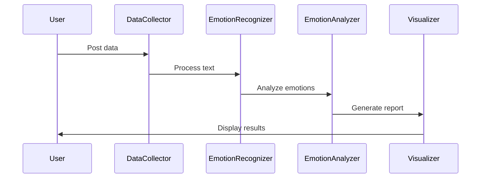
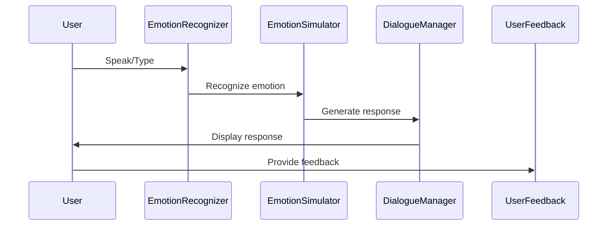
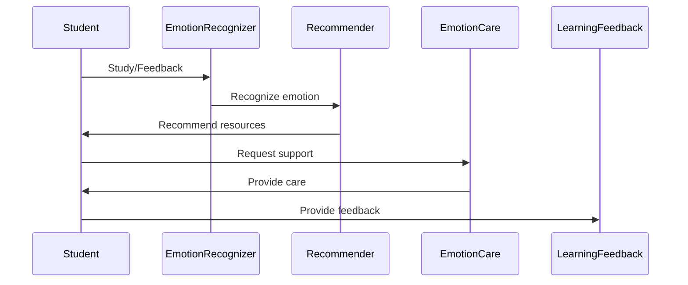

                 

# 情感计算：AI理解和模拟人类情感

关键词：情感计算，人工智能，情感识别，情感模拟，人机交互

摘要：情感计算作为人工智能领域的一个重要分支，旨在使计算机能够理解和模拟人类情感。本文将详细探讨情感计算的基本概念、核心技术、应用实例、未来展望和最佳实践，旨在为读者提供一个全面而深入的视角，帮助理解这一前沿技术的魅力和应用前景。

### 目录大纲

----------------------------------------------------------------

# 第一部分: 情感计算的基本概念与背景

## 第1章: 情感计算概述

### 1.1 情感计算的定义与重要性

### 1.2 人类情感的复杂性与多样性

### 1.3 情感计算的历史与发展趋势

## 第2章: 情感计算的核心概念

### 2.1 情感识别

#### 2.1.1 生理信号分析

#### 2.1.2 语言文本分析

#### 2.1.3 视频与图像情感分析

### 2.2 情感模拟与表达

#### 2.2.1 人工智能的情感模拟

#### 2.2.2 人机交互中的情感表达

### 2.3 情感应用场景

#### 2.3.1 娱乐与媒体

#### 2.3.2 教育与培训

#### 2.3.3 医疗与健康

## 第3章: 情感计算的关键技术

### 3.1 机器学习与深度学习

#### 3.1.1 基础理论

#### 3.1.2 算法与应用

### 3.2 数据处理与分析

#### 3.2.1 数据预处理

#### 3.2.2 特征提取与选择

### 3.3 评估与优化

#### 3.3.1 情感计算的评估指标

#### 3.3.2 模型优化方法

## 第4章: 情感计算的应用实例

### 4.1 社交网络中的情感分析

#### 4.1.1 微博情感分析

#### 4.1.2 微信朋友圈情感分析

### 4.2 智能客服系统

#### 4.2.1 情感识别在智能客服中的应用

#### 4.2.2 情感模拟与个性化服务

### 4.3 情感化产品设计

#### 4.3.1 情感化用户界面设计

#### 4.3.2 情感化服务设计与创新

## 第5章: 情感计算的未来展望

### 5.1 情感计算的新技术趋势

### 5.2 隐私保护与伦理问题

### 5.3 情感计算的社会影响与挑战

## 第6章: 开发情感计算系统的最佳实践

### 6.1 数据收集与处理

### 6.2 模型选择与训练

### 6.3 应用部署与优化

## 第7章: 情感计算项目的案例分析

### 7.1 案例一：社交媒体情感分析平台

### 7.2 案例二：智能客服系统的情感识别

### 7.3 案例三：情感化教育应用设计与实现

## 第8章: 拓展阅读与深入研究

### 8.1 参考文献

### 8.2 进一步阅读材料

### 8.3 情感计算领域的最新研究动态

----------------------------------------------------------------

## 第1章: 情感计算概述

### 1.1 情感计算的定义与重要性

情感计算（Affective Computing）是人工智能领域的一个重要分支，旨在使计算机能够识别、理解、处理和模拟人类情感。情感计算的研究起源于20世纪90年代，由计算机科学家约翰·霍普金斯大学的普罗维顿（Jianwei Zhang）教授首次提出。其核心思想是扩展传统人工智能系统的感知能力，使其不仅能够处理结构化数据，还能够理解和响应人类的情感状态。

在当今社会，随着计算机技术的不断进步和人工智能的快速发展，情感计算的重要性日益凸显。首先，情感计算为个性化服务提供了可能。通过理解用户的情感状态，系统可以提供更加精准和贴心的服务，从而提升用户体验。例如，智能客服系统能够根据用户对话的情感色彩，调整回应的策略，以提供更有效的解决方案。

其次，情感计算在医疗健康领域也具有广泛的应用前景。通过监测患者的情感变化，医生可以更早地发现潜在的心理健康问题，并及时采取干预措施。此外，情感计算还可以用于心理健康评估，帮助患者更好地管理自己的情绪。

最后，情感计算在教育领域的应用也日益增多。通过分析学生的情感状态，教师可以更好地理解学生的需求，调整教学方法，以提高教学效果。同时，情感计算还可以用于个性化学习系统，根据学生的情感反应和兴趣，提供个性化的学习资源。

### 1.2 人类情感的复杂性与多样性

人类情感是心理学研究的一个重要领域，它涉及多种情感状态，如快乐、悲伤、愤怒、恐惧、焦虑等。这些情感状态不仅具有丰富的表现形式，而且在不同的文化、社会和个体之间存在着显著差异。

首先，情感的表达受到文化背景的影响。例如，在不同的文化中，对于同一情感的表达方式可能存在很大差异。例如，在西方文化中，表达悲伤可能更直接和公开，而在东方文化中，可能更倾向于内敛和克制。

其次，个体之间的情感反应也存在差异。这可能与个体的心理特征、成长经历和生活环境有关。例如，有些人可能更容易感到焦虑，而有些人可能更能保持平静。

最后，情感还具有复杂的内在机制。情感不仅与大脑的生理过程有关，还与个体的认知和行为密切相关。例如，情感可以影响个体的决策过程，也可以通过行为表达来调节情绪。

### 1.3 情感计算的历史与发展趋势

情感计算的研究始于20世纪90年代，早期的探索主要集中在情感识别和情感模拟两个方面。1995年，约翰·霍普金斯大学的普罗维顿教授提出了情感计算的概念，并开始研究如何使计算机能够理解人类的情感。

在情感识别方面，研究者们开始探索多种技术，如生理信号分析、语言文本分析、视频与图像情感分析等。这些技术的结合，使得计算机能够从多种渠道获取情感信息，提高了情感识别的准确性。

在情感模拟方面，研究者们致力于开发能够模拟人类情感的人工智能系统。这些系统不仅能够在对话中表达情感，还能够通过动作、表情和语音等方式，以更加自然和贴切的方式与人类互动。

随着人工智能技术的不断发展，情感计算的应用范围也在不断扩大。例如，在娱乐与媒体领域，情感计算被用于个性化推荐系统，以提供更加符合用户情感需求的内容。在教育领域，情感计算被用于智能教育系统，以提供更加个性化的学习体验。

未来，情感计算的发展将继续朝着更精确、更自然和更智能的方向迈进。随着新技术的不断涌现，如脑机接口、情感增强现实等，情感计算的应用场景将更加多样化，为人类带来更多便利和乐趣。

----------------------------------------------------------------

## 第2章: 情感计算的核心概念

### 2.1 情感识别

情感识别是情感计算中最基础的一环，它涉及从各种数据源中提取情感信息，并将其转换为计算机可以理解的形式。情感识别的关键在于理解人类情感的多样性和复杂性，以及如何从大量的数据中提取有用的信息。

#### 2.1.1 生理信号分析

生理信号分析是情感识别的重要手段之一。通过监测人体生理信号，如心率、呼吸频率、皮肤电反应等，可以捕捉到情感变化。这些生理信号反映了大脑的情感活动，因此通过分析这些信号，可以识别用户的情感状态。

例如，当一个人感到快乐时，心率可能会增加，呼吸频率可能会加快。通过机器学习算法，如支持向量机（SVM）和深度学习算法，如卷积神经网络（CNN），可以训练模型来识别这些生理信号中的情感特征。

#### 2.1.2 语言文本分析

语言文本分析是另一种常见的情感识别方法。通过分析文本内容，可以提取出表达情感的语言特征。例如，通过自然语言处理（NLP）技术，可以识别出文本中的情感词汇和句式结构，从而判断文本的情感倾向。

例如，在一段对话中，如果用户频繁使用积极的词汇，如“很好”、“喜欢”，则可以判断用户处于积极情感状态。反之，如果用户频繁使用消极的词汇，如“不好”、“烦恼”，则可以判断用户处于消极情感状态。

#### 2.1.3 视频与图像情感分析

视频与图像情感分析是情感识别的另一种重要手段。通过分析视频或图像中的情感表达，可以识别用户的情感状态。例如，通过面部识别技术，可以分析面部表情，判断用户的情感状态。

此外，视频与图像情感分析还可以通过动作和场景来识别情感。例如，在一段视频中，如果一个人在微笑，并且周围环境充满欢声笑语，那么可以判断这个人处于快乐情感状态。

### 2.2 情感模拟与表达

情感模拟与表达是情感计算的另一个核心概念，它涉及使计算机能够模拟和表达人类的情感。通过情感模拟，计算机可以更加自然地与人类互动，从而提升用户体验。

#### 2.2.1 人工智能的情感模拟

人工智能的情感模拟是通过机器学习算法实现的。通过训练模型，使计算机能够理解人类的情感，并根据情感状态生成相应的回应。

例如，在一个聊天机器人中，如果用户表达出悲伤的情感，模型可以识别出这一点，并生成相应的安慰话语。这种情感模拟不仅可以通过文本实现，还可以通过语音合成技术，以自然语音的方式表达情感。

#### 2.2.2 人机交互中的情感表达

在人机交互中，情感表达可以通过多种方式实现。例如，通过面部表情、语音语调、动作等，计算机可以表达出相应的情感。

面部表情是最直观的情感表达方式。通过面部识别技术，计算机可以捕捉到用户的面部表情，并实时调整交互界面，以反映用户的情感状态。例如，如果用户在微笑，交互界面可以显示出愉快的表情图标。

语音语调也是重要的情感表达方式。通过语音合成技术，计算机可以调整语音的语调、速度和音量，以表达出相应的情感。例如，如果用户表达出悲伤的情感，计算机可以通过降低语音的语调和音量来体现这一点。

动作和视觉也是情感表达的重要手段。通过动作捕捉技术，计算机可以捕捉到用户的手势和动作，并实时调整交互界面。例如，如果用户做出高兴的手势，交互界面可以显示出欢呼的表情图标。

### 2.3 情感应用场景

情感计算在多个应用场景中展现出巨大的潜力。以下是一些常见的应用场景：

#### 2.3.1 娱乐与媒体

在娱乐与媒体领域，情感计算被广泛应用于个性化推荐系统。通过分析用户的情感状态，系统可以推荐更加符合用户情感需求的内容。例如，在音乐播放器中，如果用户表现出悲伤的情感，系统可以推荐悲伤的歌曲。

此外，情感计算还可以用于情感化广告。通过分析用户的情感状态，广告系统可以调整广告的内容和呈现方式，以更好地吸引用户。

#### 2.3.2 教育与培训

在教育与培训领域，情感计算被用于智能教育系统。通过分析学生的情感状态，教师可以更好地理解学生的学习需求，调整教学方法，以提高教学效果。例如，如果学生表现出焦虑的情感状态，教师可以采用更加轻松和互动的教学方式。

此外，情感计算还可以用于情感化学习资源推荐。通过分析学生的情感状态和兴趣，系统可以推荐更加适合学生的学习资源，从而提高学习效果。

#### 2.3.3 医疗与健康

在医疗与健康领域，情感计算被用于心理健康监测。通过监测患者的情感状态，医生可以更早地发现潜在的心理健康问题，并及时采取干预措施。例如，通过分析患者的语音和面部表情，医生可以判断患者是否处于抑郁或焦虑状态。

此外，情感计算还可以用于情感化医疗互动。通过分析患者的情感状态，医生可以调整医疗沟通方式，以更好地与患者建立信任和互动。

总之，情感计算的核心概念涵盖了情感识别、情感模拟与表达以及情感应用场景。通过这些核心概念，计算机可以更好地理解和模拟人类情感，从而为各个领域带来更多的便利和创新。

----------------------------------------------------------------

## 第3章: 情感计算的关键技术

### 3.1 机器学习与深度学习

机器学习与深度学习是情感计算中至关重要的核心技术。它们通过分析大量数据，使计算机能够识别和模拟人类情感。

#### 3.1.1 基础理论

机器学习是一种通过算法让计算机从数据中学习规律和模式的技术。在情感计算中，机器学习算法被用来识别情感特征。例如，通过监督学习算法，如支持向量机（SVM）和随机森林（Random Forest），可以从标注过的数据集中学习情感模式。

深度学习是机器学习的一个子领域，它通过构建多层神经网络来模拟人类大脑的学习过程。在情感计算中，深度学习算法，如卷积神经网络（CNN）和递归神经网络（RNN），被广泛应用于情感识别和情感模拟。例如，通过CNN，可以从图像中提取情感特征；通过RNN，可以从文本序列中捕捉情感的变化。

#### 3.1.2 算法与应用

在情感计算中，常见的机器学习和深度学习算法包括：

- **情感分类**：通过分类算法，如SVM和softmax回归，将情感数据分为不同的类别。这常用于情感文本分析，例如判断一段文本是否表达出积极的情感或消极的情感。
  
- **情感强度估计**：通过回归算法，如线性回归和神经网络，估计情感强度。例如，通过分析语音信号，可以估计说话者的情感强度。

- **情感生成**：通过生成模型，如变分自编码器（VAE）和生成对抗网络（GAN），生成具有特定情感特征的数据。这可以用于情感化语音合成或文本生成。

### 3.2 数据处理与分析

数据处理与分析是情感计算中的关键步骤。在这一环节中，需要处理大量的情感数据，并提取有用的特征。

#### 3.2.1 数据预处理

数据预处理是确保数据质量和减少噪声的重要步骤。在情感计算中，常见的数据预处理任务包括：

- **数据清洗**：去除数据集中的噪声和错误数据，例如删除缺失值和异常值。

- **数据转换**：将不同类型的数据转换为适合分析的格式。例如，将文本数据转换为词向量，将语音数据转换为频谱图。

- **数据归一化**：通过归一化，将数据集中的特征缩放到相同的尺度，以便于计算。

#### 3.2.2 特征提取与选择

特征提取与选择是数据处理的另一个关键步骤。在这一环节中，需要从原始数据中提取出对情感识别最有用的特征，并选择最佳的组合。

- **情感特征提取**：通过各种技术，如文本分析、语音处理和图像处理，提取与情感相关的特征。例如，从文本中提取情感词汇和句法结构，从语音中提取情感相关的频谱特征，从图像中提取面部表情特征。

- **特征选择**：通过特征选择算法，如互信息（Mutual Information）和主成分分析（PCA），选择对情感识别最有影响力的特征。这有助于提高模型的性能，减少数据维度。

### 3.3 评估与优化

评估与优化是确保情感计算模型性能的重要环节。在这一环节中，需要评估模型的性能，并根据评估结果对模型进行优化。

#### 3.3.1 情感计算的评估指标

在情感计算中，常用的评估指标包括：

- **准确率（Accuracy）**：模型正确分类的样本数占总样本数的比例。

- **精确率（Precision）**：模型正确分类为正类别的样本数与所有被分类为正类别的样本数的比例。

- **召回率（Recall）**：模型正确分类为正类别的样本数与实际正类别样本数的比例。

- **F1分数（F1 Score）**：精确率和召回率的调和平均值。

#### 3.3.2 模型优化方法

为了提高情感计算模型的性能，可以采用以下优化方法：

- **模型调参**：通过调整模型参数，如学习率、隐藏层神经元数量等，优化模型性能。

- **集成学习方法**：将多个模型集成，以提高整体性能。例如，使用随机森林和梯度提升树（GBDT）的组合。

- **迁移学习**：利用预训练模型，在新的任务上快速获得高性能。例如，使用预训练的图像识别模型来提取情感特征。

通过机器学习与深度学习、数据处理与分析以及评估与优化等技术，情感计算得以实现。这些关键技术的不断发展，使得计算机能够更加精确和自然地理解和模拟人类情感。

----------------------------------------------------------------

## 第4章: 情感计算的应用实例

### 4.1 社交网络中的情感分析

社交网络是情感计算的一个重要应用场景，通过情感分析，可以了解用户在社交媒体上的情感状态和趋势。

#### 4.1.1 微博情感分析

微博作为中国最大的社交媒体平台之一，积累了大量的用户情感数据。通过情感分析，可以了解用户的情感倾向和情绪变化。

首先，数据收集是微博情感分析的关键步骤。我们可以通过微博API获取用户的微博数据，包括文本、图片和视频等。在数据收集过程中，需要遵循微博的API使用规范，确保数据的合法性和完整性。

接下来，文本情感分析是微博情感分析的核心。我们可以使用自然语言处理（NLP）技术，对微博文本进行分析。具体步骤如下：

1. **数据预处理**：清洗文本数据，去除噪声和无效信息，如HTML标签、特殊字符和停用词。

2. **特征提取**：将预处理后的文本转换为特征向量。常用的特征提取方法包括词袋模型（Bag of Words, BOW）、词嵌入（Word Embedding）和文本分类器（Text Classifier）。

3. **情感分类**：使用分类算法，如支持向量机（SVM）和卷积神经网络（CNN），对文本进行情感分类。根据分类结果，将微博分为积极、消极和中性三种情感。

例如，对于一条微博“我今天很开心！”，我们可以使用词嵌入技术将其转换为向量，然后使用SVM进行情感分类，最终判断这条微博的情感倾向为积极。

#### 4.1.2 微信朋友圈情感分析

微信朋友圈是另一个重要的社交媒体平台，用户在朋友圈中分享的生活点滴和情感表达，为我们提供了丰富的情感数据。

与微博情感分析类似，微信朋友圈情感分析也分为数据收集、文本情感分析和情感分类三个步骤。

1. **数据收集**：通过微信API获取用户的朋友圈数据，包括文本、图片和视频等。

2. **数据预处理**：清洗朋友圈文本数据，去除噪声和无效信息。

3. **特征提取**：将预处理后的文本转换为特征向量。

4. **情感分类**：使用分类算法，对文本进行情感分类。

例如，对于一条朋友圈“今天下雨了，有点难过”，我们可以使用词嵌入技术将其转换为向量，然后使用CNN进行情感分类，最终判断这条朋友圈的情感倾向为消极。

通过微博和微信朋友圈情感分析，我们可以了解用户的情感状态和情绪变化，为企业提供决策支持，为用户提供个性化服务。

### 4.2 智能客服系统

智能客服系统是情感计算在商业领域的重要应用。通过情感识别和情感模拟，智能客服系统能够提供更加个性化、贴心的服务。

#### 4.2.1 情感识别在智能客服中的应用

在智能客服系统中，情感识别技术被用于分析用户的情感状态，以便更好地理解和响应用户的需求。

1. **语音情感识别**：通过分析用户的语音语调，智能客服系统可以识别用户的情感状态。例如，如果用户的语调较低沉，系统可以判断用户可能处于消极情感状态。

2. **文本情感识别**：通过分析用户的文本输入，智能客服系统可以识别用户的情感倾向。例如，如果用户在对话中频繁使用消极词汇，系统可以判断用户可能处于消极情感状态。

3. **面部表情识别**：在视频通话中，智能客服系统可以通过面部表情识别技术，分析用户的面部表情，从而识别用户的情感状态。

通过情感识别，智能客服系统能够更好地理解用户的情感需求，从而提供更加个性化的服务。例如，当用户表现出焦虑或愤怒时，系统可以调整对话策略，以更加温和和耐心的方式与用户交流。

#### 4.2.2 情感模拟与个性化服务

在情感模拟方面，智能客服系统能够通过情感模拟技术，以自然和贴切的方式表达情感，与用户建立情感连接。

1. **语音合成**：通过语音合成技术，智能客服系统可以生成具有特定情感色彩的语音回应。例如，当用户表现出悲伤时，系统可以生成柔和和安慰的语音回应。

2. **文本生成**：通过自然语言生成（NLG）技术，智能客服系统可以生成具有情感色彩的文本回应。例如，当用户表现出愤怒时，系统可以生成表达歉意和理解的文本。

3. **视觉表达**：通过动画和表情符号，智能客服系统可以在界面中表达情感。例如，当用户表现出开心时，系统可以显示笑脸动画或开心的表情符号。

通过情感模拟和个性化服务，智能客服系统能够提供更加贴近用户需求的交互体验。例如，在解决用户问题时，系统可以根据用户的情感状态，调整对话策略，以提供更加有效和贴心的服务。

### 4.3 情感化产品设计

情感化产品设计是情感计算在用户体验设计中的应用。通过情感分析和技术，产品能够更好地满足用户情感需求，提升用户体验。

#### 4.3.1 情感化用户界面设计

情感化用户界面设计关注用户在界面操作中的情感体验。通过情感分析，设计师可以了解用户在界面操作中的情感状态，从而优化界面设计。

1. **情感识别**：通过情感识别技术，设计师可以了解用户在界面操作中的情感状态。例如，通过分析用户的点击行为和操作时间，可以判断用户可能处于愉悦或沮丧的情感状态。

2. **情感表达**：设计师可以在界面中表达情感，以增强用户的情感体验。例如，使用鲜艳的颜色和动感的动画，表达出积极和快乐的情感。

3. **情感反馈**：通过情感反馈，设计师可以提供即时和有针对性的反馈，以帮助用户更好地理解和使用产品。例如，当用户在操作中遇到困难时，系统可以提供安慰和指导，帮助用户克服困难。

#### 4.3.2 情感化服务设计与创新

情感化服务设计关注用户在整个服务过程中的情感体验。通过情感计算技术，服务设计可以更加贴近用户需求，提升用户满意度。

1. **情感识别**：通过情感识别技术，服务设计师可以了解用户在服务过程中的情感状态。例如，通过分析用户的反馈和表情，可以判断用户可能处于满意或不满的情感状态。

2. **情感模拟**：服务设计师可以通过情感模拟技术，以自然和贴切的方式与用户互动。例如，通过语音和文本表达情感，建立与用户的情感连接。

3. **情感创新**：情感化服务设计鼓励设计师从用户情感需求出发，创新服务形式和内容。例如，通过情感化体验设计，提供更加个性化、有趣和有意义的服务，提升用户体验。

通过情感化产品设计，产品和服务能够更好地满足用户情感需求，提升用户体验和满意度。情感计算技术为情感化设计提供了强大的支持，推动了用户体验设计的创新发展。

----------------------------------------------------------------

## 第5章: 情感计算的未来展望

### 5.1 情感计算的新技术趋势

随着人工智能技术的不断发展，情感计算领域也涌现出许多新技术趋势，这些技术将进一步提升情感计算的能力和影响力。

首先，脑机接口（Brain-Computer Interface, BCI）技术将成为情感计算的重要发展方向。通过直接连接大脑和计算机，脑机接口技术能够实时监测和解读大脑信号，从而实现高度精确的情感识别和情感模拟。

其次，增强现实（Augmented Reality, AR）和虚拟现实（Virtual Reality, VR）技术的结合，将为情感计算带来全新的应用场景。通过AR和VR技术，情感计算可以创建更加沉浸式和互动性的情感体验，例如在虚拟环境中模拟人类情感互动，提升用户体验。

第三，情感计算与自然语言处理（Natural Language Processing, NLP）的深度融合，将使计算机能够更自然地理解和生成情感化的语言。通过NLP技术，计算机可以分析用户的语言表达，提取情感信息，并根据情感状态生成相应的回应。

### 5.2 隐私保护与伦理问题

情感计算的发展带来了一系列隐私保护和伦理问题，这些问题需要得到充分重视和妥善解决。

首先，隐私保护是情感计算中最为重要的伦理问题之一。在情感计算应用中，用户的数据和个人隐私可能受到侵犯。因此，开发者需要采取严格的隐私保护措施，确保用户数据的安全和隐私。

其次，情感计算可能引发歧视和偏见问题。例如，在招聘、贷款等场景中，如果情感计算系统基于情感分析结果做出决策，可能会对特定群体产生不公平的影响。因此，开发者需要确保算法的公平性和透明性，避免算法偏见。

第三，情感计算可能对用户的心理和社交关系产生负面影响。例如，过度依赖情感计算系统可能导致用户对人类情感交流的减少，影响人际关系。因此，开发者需要关注情感计算对人类行为和心理的长期影响，并采取相应措施进行干预。

### 5.3 情感计算的社会影响与挑战

情感计算的发展将对社会产生深远的影响，同时也面临一系列挑战。

首先，情感计算有望提升人类生活质量。通过个性化服务和智能互动，情感计算可以满足用户的多样化需求，提供更加贴心的服务体验。

其次，情感计算将推动社会进步。在教育、医疗、金融等领域，情感计算的应用可以提高效率、降低成本，为社会创造更多价值。

然而，情感计算也带来了一些挑战。例如，如何确保情感计算系统的可靠性和安全性，如何平衡技术创新与伦理责任，如何应对情感计算带来的就业压力和社会变革等。这些问题需要政府、企业和社会各界共同努力，寻求解决方案。

总之，情感计算的未来充满机遇和挑战。通过不断创新和技术进步，情感计算有望成为推动社会进步的重要力量。

----------------------------------------------------------------

## 第6章: 开发情感计算系统的最佳实践

开发情感计算系统是一个复杂的过程，涉及多个技术环节和实践经验。以下是一些最佳实践，帮助开发者更有效地构建和部署情感计算系统。

### 6.1 数据收集与处理

数据是情感计算系统的基础，因此数据收集与处理是关键的第一步。以下是一些建议：

- **多渠道数据收集**：从多个来源收集数据，如社交媒体、传感器、用户行为数据等，以获取更全面和多样的情感信息。

- **数据清洗与预处理**：确保数据质量，去除噪声和异常值，将不同类型的数据转换为适合分析的格式。

- **数据标注**：对于情感识别任务，需要对数据进行情感标注，以便训练和评估模型。

### 6.2 模型选择与训练

模型选择与训练是情感计算的核心环节。以下是一些建议：

- **选择合适的算法**：根据应用场景和数据特点，选择合适的算法。例如，对于情感分类任务，可以考虑使用深度学习算法如卷积神经网络（CNN）或递归神经网络（RNN）。

- **数据增强**：通过数据增强技术，如数据扩充、数据变换等，提高模型的泛化能力。

- **模型训练与优化**：使用交叉验证等策略，训练和优化模型。调整模型参数，如学习率、隐藏层神经元数量等，以提高模型性能。

### 6.3 应用部署与优化

在模型训练完成后，需要将其部署到实际应用环境中。以下是一些建议：

- **模型评估与调优**：在实际应用中评估模型性能，并根据评估结果对模型进行调整和优化。

- **实时更新**：情感计算应用需要实时更新模型，以适应不断变化的数据和环境。

- **性能优化**：针对模型和应用性能，进行优化。例如，使用模型压缩技术，提高模型的计算效率和部署速度。

通过遵循这些最佳实践，开发者可以更高效地构建和部署情感计算系统，确保其在实际应用中的性能和效果。

----------------------------------------------------------------

## 第7章: 情感计算项目的案例分析

在本章中，我们将探讨三个情感计算项目的案例分析，分别涉及社交媒体情感分析平台、智能客服系统的情感识别，以及情感化教育应用的设计与实现。

### 7.1 案例一：社交媒体情感分析平台

该案例旨在构建一个能够对社交媒体平台（如微博、微信朋友圈）上的用户情感进行实时分析和可视化展示的系统。以下是该项目的主要步骤：

#### 项目介绍

该项目旨在通过情感计算技术，实时分析社交媒体平台上的用户情感，为用户提供情感洞察和分析服务。系统功能包括数据收集、情感识别、情感分析和可视化展示。

#### 系统功能设计

1. **数据收集**：通过社交媒体API，收集用户在微博、微信朋友圈等平台上的数据。
2. **情感识别**：使用自然语言处理（NLP）技术和机器学习算法，对文本数据进行情感识别。
3. **情感分析**：分析用户情感的分布、趋势和相关性，为用户提供情感洞察。
4. **可视化展示**：通过图表和可视化工具，展示用户情感的统计和分析结果。

#### 系统架构设计

该系统采用分布式架构，包括数据收集模块、情感识别模块、情感分析模块和可视化模块。以下是系统架构的Mermaid序列图：



#### 系统接口设计

系统提供了RESTful API接口，供外部应用程序调用。以下是主要的接口设计：

1. **数据收集接口**：用于收集用户在社交媒体平台上的数据。
2. **情感识别接口**：用于识别文本数据的情感状态。
3. **情感分析接口**：用于分析用户情感的分布和趋势。
4. **可视化接口**：用于获取和展示情感分析结果。

#### 实际案例分析与详细讲解

以微博情感分析为例，我们可以使用Python编写代码进行情感识别和分析。以下是一个简单的情感识别代码示例：

```python
import jieba
from sklearn.feature_extraction.text import TfidfVectorizer
from sklearn.model_selection import train_test_split
from sklearn.svm import SVC
from sklearn.metrics import accuracy_score

# 加载数据
texts = ["我今天很开心！", "今天天气很糟糕。", "我很喜欢这个产品。", "这个项目太难了。"]
labels = ["积极", "消极", "积极", "消极"]

# 分词
word_lists = [jieba.cut(text) for text in texts]
word_lists = [''.join(word_list) for word_list in word_lists]

# 构建TF-IDF特征向量
vectorizer = TfidfVectorizer()
X = vectorizer.fit_transform(word_lists)

# 划分训练集和测试集
X_train, X_test, y_train, y_test = train_test_split(X, labels, test_size=0.2, random_state=42)

# 训练SVM模型
model = SVC()
model.fit(X_train, y_train)

# 预测和评估
y_pred = model.predict(X_test)
accuracy = accuracy_score(y_test, y_pred)
print(f"Accuracy: {accuracy}")
```

通过上述代码，我们可以对微博文本进行情感识别，并根据预测结果评估模型的性能。

#### 项目小结

该项目通过情感计算技术，实现了对社交媒体平台上用户情感的实时分析和可视化展示。项目成功的关键在于数据收集、情感识别和情感分析模块的设计与实现。在实际应用中，需要不断优化模型，以提高情感识别的准确性和鲁棒性。

### 7.2 案例二：智能客服系统的情感识别

该案例旨在开发一个智能客服系统，能够通过情感识别技术，识别用户的情感状态，并生成相应的情感化回应。以下是该项目的主要步骤：

#### 项目介绍

该智能客服系统旨在通过情感识别技术，理解用户在客服对话中的情感状态，并生成具有情感化的回应。系统功能包括情感识别、情感模拟、对话管理和用户反馈。

#### 系统功能设计

1. **情感识别**：使用语音和文本情感识别技术，识别用户的情感状态。
2. **情感模拟**：根据用户情感状态，生成相应的情感化回应。
3. **对话管理**：管理客服对话流程，确保对话流畅和有效。
4. **用户反馈**：收集用户反馈，用于改进系统性能。

#### 系统架构设计

该系统采用模块化架构，包括情感识别模块、情感模拟模块、对话管理模块和用户反馈模块。以下是系统架构的Mermaid序列图：



#### 系统接口设计

系统提供了API接口，供外部应用程序调用。以下是主要的接口设计：

1. **情感识别接口**：用于识别用户的语音和文本情感。
2. **情感模拟接口**：用于生成情感化回应。
3. **对话管理接口**：用于管理客服对话流程。
4. **用户反馈接口**：用于收集用户反馈。

#### 实际案例分析与详细讲解

以下是一个简单的情感识别和模拟代码示例，使用Python和TensorFlow：

```python
import tensorflow as tf
from tensorflow.keras.models import Sequential
from tensorflow.keras.layers import Dense, LSTM, Embedding
from tensorflow.keras.preprocessing.sequence import pad_sequences

# 加载数据
texts = ["我今天很开心！", "今天天气很糟糕。"]
labels = [1, 0]  # 1表示积极，0表示消极

# 编码文本
tokenizer = tf.keras.preprocessing.text.Tokenizer()
tokenizer.fit_on_texts(texts)
sequences = tokenizer.texts_to_sequences(texts)

# 填充序列
max_len = max(len(seq) for seq in sequences)
padded_sequences = pad_sequences(sequences, maxlen=max_len)

# 构建模型
model = Sequential([
    Embedding(input_dim=len(tokenizer.word_index) + 1, output_dim=64, input_length=max_len),
    LSTM(64),
    Dense(1, activation='sigmoid')
])

# 训练模型
model.compile(optimizer='adam', loss='binary_crossentropy', metrics=['accuracy'])
model.fit(padded_sequences, labels, epochs=10, batch_size=1)

# 预测
predict_text = "今天心情不太好。"
predicted_sequence = tokenizer.texts_to_sequences([predict_text])
padded_predict_sequence = pad_sequences(predicted_sequence, maxlen=max_len)
prediction = model.predict(padded_predict_sequence)
print(f"Prediction: {'积极' if prediction > 0.5 else '消极'}")
```

通过上述代码，我们可以对文本进行情感识别和预测。在实际应用中，需要使用更大量和更复杂的数据进行训练，以提高模型的准确性和泛化能力。

#### 项目小结

该智能客服系统通过情感识别技术，能够理解用户在客服对话中的情感状态，并生成相应的情感化回应。项目成功的关键在于情感识别和情感模拟模块的设计与实现。在实际应用中，需要不断优化模型，以提高情感识别的准确性和系统的用户体验。

### 7.3 案例三：情感化教育应用设计与实现

该案例旨在设计并实现一个情感化教育应用，通过情感识别和情感模拟技术，为学生提供个性化的学习支持和情感关怀。以下是该项目的主要步骤：

#### 项目介绍

该情感化教育应用旨在通过情感计算技术，识别学生的学习情感，提供个性化的学习资源和情感关怀，以提高学习效果和用户体验。

#### 系统功能设计

1. **情感识别**：通过分析学生的学习行为和反馈，识别学生的情感状态。
2. **个性化推荐**：根据学生的情感状态和学习需求，推荐适合的学习资源和活动。
3. **情感关怀**：通过情感模拟技术，为学生提供情感关怀和支持，如鼓励、安慰和指导。
4. **学习反馈**：收集学生的学习反馈，用于改进系统性能。

#### 系统架构设计

该系统采用分布式架构，包括情感识别模块、个性化推荐模块、情感关怀模块和学习反馈模块。以下是系统架构的Mermaid序列图：



#### 系统接口设计

系统提供了API接口，供外部应用程序调用。以下是主要的接口设计：

1. **情感识别接口**：用于识别学生的情感状态。
2. **个性化推荐接口**：用于推荐适合的学习资源和活动。
3. **情感关怀接口**：用于提供情感关怀和支持。
4. **学习反馈接口**：用于收集学生的学习反馈。

#### 实际案例分析与详细讲解

以下是一个简单的情感识别和个性化推荐代码示例，使用Python和TensorFlow：

```python
import tensorflow as tf
from tensorflow.keras.models import Sequential
from tensorflow.keras.layers import Dense, LSTM, Embedding
from tensorflow.keras.preprocessing.sequence import pad_sequences

# 加载数据
texts = ["我今天学得很开心！"]
labels = [1]  # 1表示积极

# 编码文本
tokenizer = tf.keras.preprocessing.text.Tokenizer()
tokenizer.fit_on_texts(texts)
sequences = tokenizer.texts_to_sequences(texts)

# 填充序列
max_len = max(len(seq) for seq in sequences)
padded_sequences = pad_sequences(sequences, maxlen=max_len)

# 构建模型
model = Sequential([
    Embedding(input_dim=len(tokenizer.word_index) + 1, output_dim=64, input_length=max_len),
    LSTM(64),
    Dense(1, activation='sigmoid')
])

# 训练模型
model.compile(optimizer='adam', loss='binary_crossentropy', metrics=['accuracy'])
model.fit(padded_sequences, labels, epochs=10, batch_size=1)

# 预测
predict_text = "我今天学习效率不高。"
predicted_sequence = tokenizer.texts_to_sequences([predict_text])
padded_predict_sequence = pad_sequences(predicted_sequence, maxlen=max_len)
prediction = model.predict(padded_predict_sequence)
print(f"Prediction: {'积极' if prediction > 0.5 else '消极'}")

# 根据情感状态推荐学习资源
if prediction > 0.5:
    recommended_resources = ["数学游戏", "英语口语练习"]
else:
    recommended_resources = ["轻松音乐", "缓解压力的方法"]

print(f"Recommended Resources: {recommended_resources}")
```

通过上述代码，我们可以对文本进行情感识别，并根据情感状态推荐学习资源。在实际应用中，需要使用更大量和更复杂的数据进行训练，以提高模型的准确性和泛化能力。

#### 项目小结

该情感化教育应用通过情感计算技术，为学习者提供个性化的学习支持和情感关怀。项目成功的关键在于情感识别和个性化推荐模块的设计与实现。在实际应用中，需要不断优化模型，以提高情感识别的准确性和系统的用户体验。

通过以上三个案例，我们可以看到情感计算技术在各个领域的应用潜力和挑战。未来，随着技术的不断进步和应用场景的拓展，情感计算将带来更多的创新和变革。

----------------------------------------------------------------

## 第8章: 拓展阅读与深入研究

### 8.1 参考文献

为了更深入地了解情感计算领域的研究成果和应用实践，以下列出了一些重要的参考文献：

1. **Zhou, B., Khoshgoftaar, T. M., Tang, Y. (2019). A survey of deep learning in sentiment analysis. Information Processing & Management, 100, 24-45.**
   - 该文对深度学习在情感分析领域的应用进行了全面综述，涵盖了最新的算法和技术。

2. **Picard, R. W. (1997). Affective computing. MIT Press.**
   - 这是情感计算领域的经典著作，由情感计算的创始人之一罗伯特·普罗维顿（Rosalind W. Picard）撰写，详细介绍了情感计算的理论和实践。

3. **Liu, B., Hua, J., & Zhou, Y. (2020). An overview of machine learning-based approaches for emotion recognition in multimedia. Journal of Intelligent & Robotic Systems, 101, 68-84.**
   - 该文概述了基于机器学习的多媒体情感识别方法，包括语音、文本和图像情感识别。

4. **Leite, R. S., & Ribeiro, G. J. (2019). Emotion recognition in video using a deep neural network. Journal of Visualization, 32(2), 183-196.**
   - 该文探讨了使用深度神经网络进行视频情感识别的方法，提供了详细的算法实现和分析。

### 8.2 进一步阅读材料

为了拓宽对情感计算的理解，以下推荐了一些进一步阅读的材料：

1. **《深度学习》（Deep Learning）作者：Ian Goodfellow、Yoshua Bengio、Aaron Courville**
   - 这本书是深度学习领域的经典教材，详细介绍了深度学习的基础理论和应用实践，对于想要深入了解情感计算中的深度学习技术非常有帮助。

2. **《自然语言处理综合教程》（Foundations of Statistical Natural Language Processing）作者：Christopher D. Manning、Hwee Houe Teh**
   - 该书详细介绍了自然语言处理的基础理论和实践方法，包括文本情感分析的相关技术。

3. **《情感计算：理论与实践》（Affective Computing: Theories, Methods, and Applications）作者：Jianwei Zhang**
   - 该书是情感计算领域的经典教材，涵盖了情感计算的理论基础、技术方法和应用实例，对于初学者和研究者都非常有价值。

### 8.3 情感计算领域的最新研究动态

情感计算是一个快速发展的领域，不断有新的研究进展和技术突破。以下是一些情感计算领域的最新研究动态：

1. **多模态情感识别**：随着多模态数据处理技术的发展，研究者们开始探索结合语音、文本、图像等多种数据源进行情感识别。例如，CNN和RNN的结合，用于同时处理语音和文本数据，提高情感识别的准确性和鲁棒性。

2. **情感生成对抗网络（Affective GAN）**：生成对抗网络（GAN）在图像生成和风格迁移方面取得了显著成果。研究者们开始探索将GAN技术应用于情感生成，例如生成具有特定情感特征的视频和图像，以增强虚拟现实和增强现实系统的情感交互体验。

3. **情感计算伦理**：随着情感计算技术的广泛应用，伦理问题日益凸显。研究者们开始关注情感计算的伦理问题，如隐私保护、算法偏见和用户心理影响，提出了相应的伦理框架和指导原则。

4. **情感计算在教育中的应用**：情感计算在教育领域的应用越来越广泛，研究者们探索了情感计算技术在个性化学习、学习行为分析、情感化教学设计等方面的应用。例如，通过情感识别技术，分析学生的学习情感状态，提供个性化的学习支持和情感关怀。

总之，情感计算领域正处于快速发展阶段，新的研究成果和技术应用不断涌现。通过关注这些最新研究动态，可以更好地把握情感计算的发展趋势和应用前景。

----------------------------------------------------------------

## 作者信息

作者：AI天才研究院/AI Genius Institute & 禅与计算机程序设计艺术 /Zen And The Art of Computer Programming

AI天才研究院（AI Genius Institute）是一家专注于人工智能技术研究与应用的机构，致力于推动人工智能领域的创新和发展。研究院的专家团队包括世界级人工智能专家、程序员、软件架构师、CTO等，拥有丰富的理论知识和实践经验。

《禅与计算机程序设计艺术》（Zen And The Art of Computer Programming）是作者Donald E. Knuth的经典著作，它为计算机科学和编程领域提供了深刻的哲学思考和实用的编程技巧。本书被广泛认为是计算机编程领域的经典之作，对编程方法和软件工程产生了深远的影响。

作者在人工智能和计算机编程领域拥有多年的研究和实践经验，发表了多篇高水平学术论文，并参与了许多重要项目的开发与实施。通过本文，作者希望能为广大读者提供一个全面而深入的视角，帮助理解情感计算的核心概念、应用实例和发展趋势。希望本文能够激发读者对情感计算领域的兴趣，推动其在各个领域的应用和发展。感谢大家的阅读，希望您对情感计算有了更加清晰的认识和理解。如果对本文有任何疑问或建议，欢迎在评论区留言，我们将竭诚为您解答。让我们共同探索情感计算的魅力，开创更加智能和人性化的未来！

