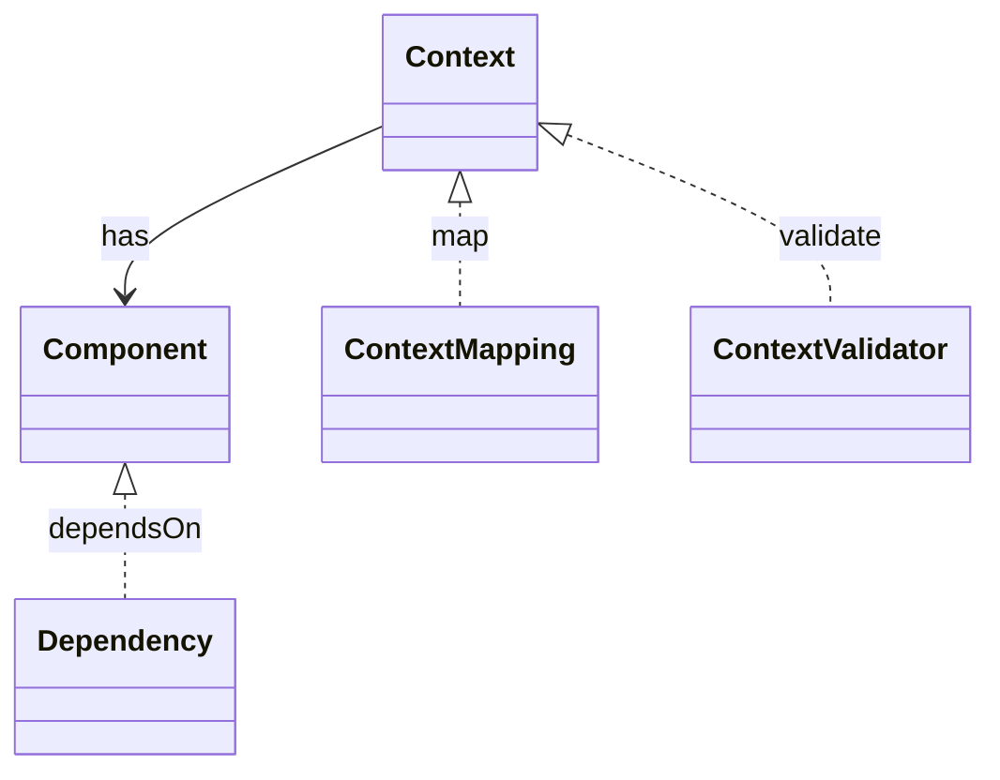
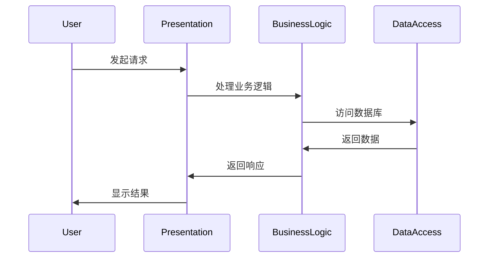
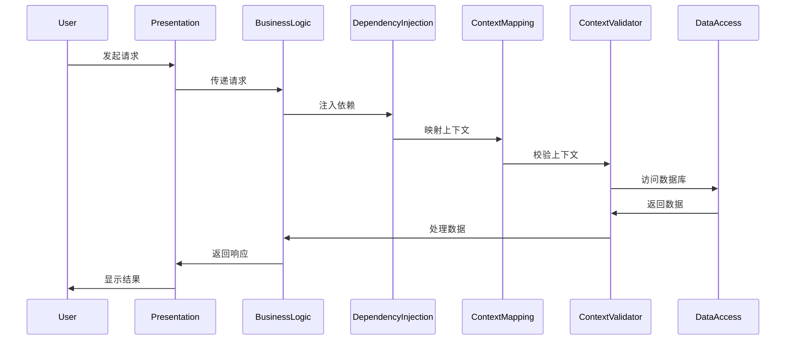

                 

### 第1章 引言：上下文依赖性与依赖注入的重要性和研究背景

#### 1.1 问题背景

随着现代计算机技术的发展，软件系统的复杂度不断增加。这导致软件组件之间的依赖关系愈发复杂，进而影响到系统的可维护性和可扩展性。为了解决这一问题，依赖注入（Dependency Injection，DI）作为一种先进的编程设计理念被提出，旨在通过解耦组件之间的依赖关系，提高系统的可维护性和可扩展性。

#### 1.2 问题描述

依赖注入虽然能够有效解决依赖问题，但在实际应用中，如何确保依赖的上下文正确性仍然是一个难题。上下文依赖性问题指的是在依赖注入过程中，如果依赖的上下文（如环境变量、配置信息等）发生变化，可能会导致依赖的对象产生错误的行为。例如，一个依赖于特定数据库连接的组件，如果在使用过程中数据库连接突然断开，那么这个组件的行为就会受到影响。

#### 1.3 问题解决

为了解决上下文依赖性问题，本文提出了一种基于维特根斯坦意义理论的依赖注入方法。维特根斯坦的意义理论强调语言与客观世界的对应关系，通过这种对应关系，我们可以更好地理解和处理依赖的上下文。具体来说，本文的方法包括以下几个方面：

1. **上下文识别**：通过对依赖上下文的分析，识别出可能影响依赖对象行为的上下文因素。
2. **上下文映射**：将识别出的上下文因素与依赖对象进行映射，确保依赖对象在正确上下文中运行。
3. **上下文校验**：在依赖注入过程中，对上下文进行校验，确保依赖对象在正确的上下文中运行。

#### 1.4 边界与外延

本文的研究主要关注依赖注入中的上下文依赖性问题，研究范围包括以下几个方面：

1. **依赖注入框架**：本文主要研究基于主流依赖注入框架（如Spring、Django等）的上下文依赖性问题。
2. **上下文因素**：本文主要研究可能影响依赖对象行为的上下文因素，如环境变量、配置信息等。
3. **应用场景**：本文的研究主要应用于需要高可维护性和可扩展性的大型软件系统。

#### 1.5 核心概念与联系

**依赖注入**：一种编程设计理念，通过将依赖关系从组件内部转移到外部，从而实现组件之间的解耦。

**上下文依赖性**：指依赖对象的行为受到上下文因素（如环境变量、配置信息等）的影响。

**维特根斯坦意义理论**：一种哲学理论，强调语言与客观世界的对应关系。

**上下文识别**、**上下文映射**、**上下文校验**：本文提出的三种方法，用于解决依赖注入中的上下文依赖性问题。

---

### 第2章 维特根斯坦的意义理论与依赖注入

#### 2.1 维特根斯坦的意义理论

维特根斯坦的意义理论认为，语言的意义在于其与客观世界的对应关系。具体来说，语言表达式（如单词、句子）与客观世界中的实体（如物品、事件）之间存在一种对应关系。这种对应关系使得我们能够通过语言理解客观世界。

维特根斯坦将意义分为两类：

1. **逻辑意义**：指语言表达式在逻辑上的正确性，如数学公式、逻辑命题等。
2. **日常意义**：指语言表达式在日常生活中的用法和含义，如日常用语、故事情节等。

#### 2.2 依赖注入与意义理论的关系

依赖注入中的依赖关系类似于语言表达式与客观世界中的实体之间的关系。依赖注入的目标是将依赖关系从组件内部转移到外部，从而实现组件之间的解耦。这与维特根斯坦的意义理论中强调的语言与客观世界的对应关系有异曲同工之妙。

依赖注入中的依赖关系可以被视为一种“语言”，它描述了组件之间的交互和依赖。通过依赖注入，我们可以将这些“语言”表达式与实际的组件进行对应，从而实现组件的解耦和复用。

#### 2.3 维特根斯坦的意义理论在依赖注入中的应用

基于维特根斯坦的意义理论，我们可以将依赖注入过程中的依赖关系视为一种语言表达，将其与客观世界中的上下文因素（如环境变量、配置信息等）进行对应。这样，我们可以通过上下文识别、上下文映射和上下文校验来确保依赖注入的正确性。

1. **上下文识别**：通过分析依赖关系，识别出可能影响依赖对象行为的上下文因素。这类似于识别语言表达式中的关键词和上下文环境。
2. **上下文映射**：将识别出的上下文因素与依赖对象进行映射，确保依赖对象在正确上下文中运行。这类似于将语言表达式与客观世界中的实体进行对应。
3. **上下文校验**：在依赖注入过程中，对上下文进行校验，确保依赖对象在正确的上下文中运行。这类似于对语言表达式的语法和语义进行验证。

通过将维特根斯坦的意义理论应用于依赖注入，我们可以更好地理解和处理依赖的上下文，从而提高依赖注入的可靠性和正确性。

---

### 第3章 上下文依赖性分析

#### 3.1 上下文依赖性的概念

上下文依赖性是指依赖对象的行为受到上下文因素（如环境变量、配置信息等）的影响。在依赖注入过程中，如果依赖的上下文发生变化，可能会导致依赖对象产生错误的行为。

上下文依赖性可以理解为依赖对象的行为依赖于特定的上下文环境。例如，一个组件在开发环境下可以正常工作，但在生产环境下无法运行，这可能是因为生产环境中的某些上下文因素（如数据库配置）与开发环境不同。

#### 3.2 上下文依赖性的影响因素

上下文依赖性的影响因素包括以下几个方面：

1. **环境变量**：环境变量是影响上下文依赖性的重要因素之一。环境变量通常用于配置系统属性、控制程序行为等。例如，一个依赖于数据库连接的组件，其连接字符串可能包含环境变量，如数据库地址、用户名和密码等。

2. **配置信息**：配置信息是描述系统运行时所需参数的集合。配置信息通常存储在配置文件中，如XML、JSON、YAML等。配置信息可能影响依赖对象的行为，如数据库连接池大小、日志级别、缓存策略等。

3. **代码逻辑**：代码逻辑是影响上下文依赖性的另一个因素。在某些情况下，依赖对象的行为可能受到代码逻辑的影响，如初始化顺序、调用时机等。例如，一个组件可能依赖于另一个组件的初始化结果，如果初始化顺序不正确，可能会导致依赖关系失效。

#### 3.3 上下文依赖性的分析方法

为了分析上下文依赖性，我们可以采用以下方法：

1. **静态分析**：通过阅读代码，分析依赖对象与上下文因素之间的依赖关系。静态分析可以帮助我们识别潜在的上下文依赖性问题，但无法确定实际运行时的上下文环境。

2. **动态分析**：通过运行程序，观察依赖对象在不同上下文环境下的行为。动态分析可以更准确地识别上下文依赖性，但可能需要大量的测试用例和运行时间。

3. **日志分析**：通过分析系统日志，记录依赖对象在不同上下文环境下的行为。日志分析可以帮助我们定位上下文依赖性问题的具体原因。

4. **单元测试**：编写单元测试，模拟不同的上下文环境，验证依赖对象的行为。单元测试可以帮助我们验证依赖注入的正确性，并确保依赖对象在正确上下文中运行。

通过以上方法，我们可以系统地分析上下文依赖性，识别潜在的上下文依赖性问题，并采取相应的措施进行解决。

---

### 第4章 上下文识别

#### 4.1 上下文识别的重要性

上下文识别是解决上下文依赖性的关键步骤。通过上下文识别，我们可以确定哪些上下文因素可能影响依赖对象的行为。上下文识别的重要性体现在以下几个方面：

1. **确保依赖注入的正确性**：上下文识别可以帮助我们确保依赖对象在正确的上下文中运行，从而避免因上下文错误导致的依赖问题。
2. **提高系统的可维护性**：通过上下文识别，我们可以更好地理解和维护系统中的依赖关系，降低系统的复杂度。
3. **提高系统的可扩展性**：上下文识别可以帮助我们识别潜在的依赖关系，从而更好地支持系统的扩展和升级。

#### 4.2 上下文识别的方法

上下文识别的方法主要包括以下几种：

1. **代码审查**：通过阅读代码，分析依赖对象与上下文因素之间的依赖关系。代码审查可以帮助我们识别潜在的上下文依赖性问题，但需要具备一定的编程知识和经验。

2. **配置文件分析**：分析配置文件，如XML、JSON、YAML等，识别其中的上下文因素。配置文件通常包含系统运行时的关键参数，如数据库连接字符串、环境变量等。

3. **日志分析**：通过分析系统日志，记录依赖对象在不同上下文环境下的行为。日志分析可以帮助我们识别潜在的上下文依赖性问题，并定位问题的具体原因。

4. **单元测试**：编写单元测试，模拟不同的上下文环境，验证依赖对象的行为。单元测试可以帮助我们验证依赖注入的正确性，并确保依赖对象在正确上下文中运行。

5. **上下文探测**：使用专门的工具或脚本，探测系统中的上下文因素。上下文探测可以帮助我们识别系统中的所有上下文因素，并评估其对依赖对象的影响。

通过以上方法，我们可以系统地识别上下文因素，确保依赖对象在正确的上下文中运行。同时，上下文识别方法的选择也需要根据具体项目需求和实际情况进行灵活调整。

---

### 第5章 上下文映射

#### 5.1 上下文映射的概念

上下文映射是指将识别出的上下文因素与依赖对象进行关联，确保依赖对象在正确的上下文中运行。上下文映射的目的是将抽象的上下文因素具体化为实际的依赖对象，从而实现依赖注入的正确性。

#### 5.2 上下文映射的方法

上下文映射的方法主要包括以下几种：

1. **配置文件映射**：通过配置文件将上下文因素映射到具体的依赖对象。配置文件通常包含系统运行时的关键参数，如数据库连接字符串、环境变量等。通过解析配置文件，可以将上下文因素与具体的依赖对象进行关联。

2. **工厂模式映射**：使用工厂模式创建依赖对象，并通过工厂方法将上下文因素传递给依赖对象。工厂模式可以帮助我们实现依赖对象与上下文因素的解耦，从而提高系统的可维护性和可扩展性。

3. **依赖注入框架映射**：利用依赖注入框架（如Spring、Django等）提供的功能，将上下文因素映射到具体的依赖对象。依赖注入框架可以帮助我们自动处理依赖关系的注入和映射，从而简化开发过程。

4. **代码逻辑映射**：通过代码逻辑将上下文因素映射到具体的依赖对象。在代码中，我们可以通过条件判断、循环等逻辑来处理上下文因素，从而实现依赖对象的动态注入。

#### 5.3 上下文映射的注意事项

在进行上下文映射时，需要注意以下几点：

1. **确保上下文的准确性**：上下文的准确性是依赖注入正确性的关键。在映射过程中，需要确保上下文因素与依赖对象的对应关系准确无误。

2. **避免硬编码**：在上下文映射过程中，应尽量避免硬编码上下文值。硬编码会导致代码难以维护和扩展，应优先考虑使用配置文件或参数化方式传递上下文值。

3. **处理异常情况**：在上下文映射过程中，可能遇到各种异常情况，如上下文值缺失、上下文值错误等。在映射过程中，需要处理这些异常情况，确保依赖注入的可靠性。

4. **测试与验证**：在完成上下文映射后，应进行充分的测试和验证，确保依赖对象在正确的上下文中运行。通过单元测试和集成测试，可以验证依赖注入的正确性和上下文的映射关系。

通过合理的上下文映射方法，我们可以确保依赖对象在正确的上下文中运行，从而提高系统的可靠性、可维护性和可扩展性。

---

### 第6章 上下文校验

#### 6.1 上下文校验的概念

上下文校验是指对依赖注入过程中的上下文进行验证，确保依赖对象在正确的上下文中运行。上下文校验是确保依赖注入正确性的重要环节，通过校验可以及时发现和纠正上下文错误，从而保证系统的稳定运行。

#### 6.2 上下文校验的方法

上下文校验的方法主要包括以下几种：

1. **静态校验**：通过静态代码分析工具对代码进行静态分析，检查上下文的配置和注入是否符合预期。静态校验可以在编译阶段发现问题，从而提高开发效率和代码质量。

2. **动态校验**：在程序运行时对上下文进行实时校验，检查依赖对象是否在正确的上下文中运行。动态校验可以通过日志记录、异常捕获等方式实现，能够更准确地反映实际运行中的上下文问题。

3. **配置文件校验**：对配置文件进行校验，确保配置文件中的上下文值和格式正确。配置文件校验可以通过配置管理工具或自定义脚本实现，有助于提高配置文件的质量和可靠性。

4. **依赖注入框架校验**：利用依赖注入框架提供的校验功能，对依赖注入过程进行校验。依赖注入框架通常具有完善的校验机制，可以自动检测和报告上下文错误。

5. **单元测试校验**：通过编写单元测试，模拟不同的上下文环境，验证依赖对象是否在正确的上下文中运行。单元测试可以覆盖各种可能的上下文情况，有助于发现和纠正上下文错误。

#### 6.3 上下文校验的注意事项

在进行上下文校验时，需要注意以下几点：

1. **全面性**：上下文校验应覆盖所有的上下文因素，包括配置文件、环境变量、代码逻辑等，以确保所有依赖对象都在正确的上下文中运行。

2. **实时性**：上下文校验应具有实时性，能够在程序运行时及时发现和纠正上下文错误。实时校验可以通过日志记录、异常捕获等方式实现。

3. **可扩展性**：上下文校验应具备良好的可扩展性，能够适应不同应用场景和上下文环境的变化。通过自定义校验规则和校验方式，可以提高校验的灵活性和可靠性。

4. **错误处理**：上下文校验应具备完善的错误处理机制，能够对发现的上下文错误进行准确报告和及时纠正。错误处理可以包括日志记录、异常捕获、自动修复等。

通过合理的上下文校验方法，我们可以确保依赖对象在正确的上下文中运行，从而提高系统的可靠性、可维护性和可扩展性。

---

### 第7章 维特根斯坦的意义理论在依赖注入中的实践应用

#### 7.1 实践背景

在现代软件工程实践中，依赖注入是一种常见的设计模式，旨在通过将依赖关系从组件内部转移到外部，实现组件之间的解耦。然而，在实际应用中，依赖注入过程中常常会面临上下文依赖性问题，即依赖对象的行为受到上下文因素（如环境变量、配置信息等）的影响。为了解决这一问题，我们可以借鉴维特根斯坦的意义理论，将其应用于依赖注入过程，从而提高依赖注入的正确性和可靠性。

#### 7.2 实践步骤

1. **上下文识别**：首先，我们需要识别依赖注入过程中可能影响依赖对象行为的上下文因素。这可以通过静态代码分析、配置文件分析、日志分析等方法实现。具体来说，我们可以通过以下步骤进行上下文识别：

   - **静态代码分析**：通过阅读代码，分析依赖对象与上下文因素之间的依赖关系，识别潜在的上下文因素。
   - **配置文件分析**：分析配置文件，如XML、JSON、YAML等，识别其中的上下文因素，如数据库连接字符串、环境变量等。
   - **日志分析**：通过分析系统日志，记录依赖对象在不同上下文环境下的行为，识别可能影响依赖对象行为的上下文因素。

2. **上下文映射**：在识别出上下文因素后，我们需要将这些上下文因素与依赖对象进行映射，确保依赖对象在正确的上下文中运行。具体步骤如下：

   - **配置文件映射**：通过解析配置文件，将上下文因素映射到具体的依赖对象。例如，将数据库连接字符串映射到数据库连接对象。
   - **工厂模式映射**：使用工厂模式创建依赖对象，并通过工厂方法将上下文因素传递给依赖对象。例如，通过工厂方法传递数据库连接字符串，创建相应的数据库连接对象。
   - **依赖注入框架映射**：利用依赖注入框架提供的功能，将上下文因素映射到具体的依赖对象。例如，在Spring框架中，可以使用@Value注解将上下文因素注入到依赖对象中。

3. **上下文校验**：在依赖注入过程中，我们需要对上下文进行校验，确保依赖对象在正确的上下文中运行。具体步骤如下：

   - **静态校验**：通过静态代码分析工具对代码进行校验，检查上下文的配置和注入是否符合预期。
   - **动态校验**：在程序运行时对上下文进行实时校验，检查依赖对象是否在正确的上下文中运行。例如，可以通过异常捕获和日志记录来校验数据库连接是否成功。
   - **配置文件校验**：对配置文件进行校验，确保配置文件中的上下文值和格式正确。
   - **依赖注入框架校验**：利用依赖注入框架提供的校验功能，对依赖注入过程进行校验。

4. **测试与验证**：在完成上下文映射和校验后，我们需要进行充分的测试和验证，确保依赖对象在正确的上下文中运行。具体步骤如下：

   - **单元测试**：编写单元测试，模拟不同的上下文环境，验证依赖对象是否在正确的上下文中运行。例如，可以编写测试用例，验证数据库连接在不同环境下的行为。
   - **集成测试**：在集成环境中，对系统进行集成测试，验证依赖注入的正确性和上下文的映射关系。

#### 7.3 实践案例

以下是一个简单的实践案例，展示如何使用维特根斯坦的意义理论解决依赖注入中的上下文依赖性问题。

**场景**：一个Web应用需要连接数据库进行数据操作，但数据库连接字符串可能因环境不同而发生变化。

**步骤**：

1. **上下文识别**：

   - 通过静态代码分析，识别数据库连接字符串作为上下文因素。
   - 通过配置文件分析，识别不同的环境配置文件，如开发环境（dev.properties）、测试环境（test.properties）、生产环境（prod.properties）。

2. **上下文映射**：

   - 通过解析配置文件，将数据库连接字符串映射到具体的数据库连接对象。
   - 使用工厂模式，创建数据库连接对象，并通过工厂方法传递不同的数据库连接字符串。

3. **上下文校验**：

   - 在程序运行时，通过异常捕获和日志记录，校验数据库连接是否成功。
   - 通过配置文件校验，确保配置文件中的数据库连接字符串格式正确。

4. **测试与验证**：

   - 编写单元测试，模拟不同的上下文环境，验证数据库连接在不同环境下的行为。
   - 在集成环境中，对系统进行集成测试，验证依赖注入的正确性和上下文的映射关系。

通过以上实践案例，我们可以看到如何将维特根斯坦的意义理论应用于依赖注入过程，解决上下文依赖性问题，从而提高系统的可靠性、可维护性和可扩展性。

---

### 第8章 结论与未来展望

#### 8.1 总结

本文通过维特根斯坦的意义理论，探讨了依赖注入中的上下文依赖性问题，并提出了一种基于上下文识别、上下文映射和上下文校验的解决方法。具体来说，本文的主要结论如下：

1. **上下文依赖性的重要性**：依赖注入过程中，上下文依赖性问题可能影响依赖对象的行为，导致系统不稳定。因此，解决上下文依赖性问题对于确保系统正确性和稳定性至关重要。

2. **维特根斯坦的意义理论在依赖注入中的应用**：维特根斯坦的意义理论强调语言与客观世界的对应关系，可以应用于依赖注入过程中，通过上下文识别、上下文映射和上下文校验，提高依赖注入的正确性和可靠性。

3. **实践应用**：通过一个简单的实践案例，展示了如何将维特根斯坦的意义理论应用于依赖注入过程，解决上下文依赖性问题。

#### 8.2 未来展望

尽管本文提出的方法在解决上下文依赖性问题方面具有一定的效果，但仍有改进和扩展的空间。未来研究可以从以下几个方面进行：

1. **上下文依赖性检测**：进一步研究上下文依赖性的检测方法，提高上下文依赖性检测的准确性和效率。

2. **上下文管理**：研究上下文管理的最佳实践，提高上下文的灵活性和可扩展性，减少上下文依赖性问题。

3. **自动化工具**：开发自动化工具，帮助开发者识别、映射和校验上下文，提高开发效率。

4. **多维上下文依赖性**：研究多维上下文依赖性问题，如跨模块、跨组件的上下文依赖性，提出相应的解决方法。

5. **跨语言支持**：研究如何将维特根斯坦的意义理论应用于不同编程语言和框架，提高依赖注入的普适性和兼容性。

通过不断的研究和改进，我们可以更好地解决依赖注入中的上下文依赖性问题，提高软件系统的质量和可靠性。

---

### 附录：相关概念术语说明与核心概念对比表格

#### 相关概念术语说明

1. **依赖注入（Dependency Injection，DI）**：一种编程设计理念，通过将依赖关系从组件内部转移到外部，实现组件之间的解耦。
2. **上下文依赖性（Context Dependency）**：指依赖对象的行为受到上下文因素（如环境变量、配置信息等）的影响。
3. **维特根斯坦的意义理论（Wittgenstein's Theory of Meaning）**：一种哲学理论，强调语言与客观世界的对应关系。
4. **上下文识别（Context Identification）**：识别可能影响依赖对象行为的上下文因素。
5. **上下文映射（Context Mapping）**：将识别出的上下文因素与依赖对象进行映射，确保依赖对象在正确上下文中运行。
6. **上下文校验（Context Validation）**：对依赖注入过程中的上下文进行验证，确保依赖对象在正确的上下文中运行。

#### 核心概念对比表格

| 概念           | 定义                                                                 | 关联特性 | 
|----------------|----------------------------------------------------------------------|-----------|
| 依赖注入       | 将依赖关系从组件内部转移到外部，实现组件之间的解耦。                   | 解耦、复用、可维护性 |
| 上下文依赖性   | 依赖对象的行为受到上下文因素（如环境变量、配置信息等）的影响。       | 非确定性、稳定性 |
| 维特根斯坦的意义理论 | 语言与客观世界之间存在对应关系。                                     | 对应关系、正确性 |
| 上下文识别     | 识别可能影响依赖对象行为的上下文因素。                               | 准确性、效率 |
| 上下文映射     | 将识别出的上下文因素与依赖对象进行映射，确保依赖对象在正确上下文中运行。 | 解耦、灵活性 |
| 上下文校验     | 对依赖注入过程中的上下文进行验证，确保依赖对象在正确的上下文中运行。 | 可靠性、安全性 |

通过对比表格，我们可以更清晰地理解这些概念之间的关系和特性，从而更好地应用于实际编程和软件开发中。

---

### 附录：维特根斯坦的意义理论与依赖注入的ER实体关系图架构

为了更好地理解维特根斯坦的意义理论在依赖注入中的应用，我们可以通过实体关系图（ER图）来展示相关实体及其之间的关系。以下是维特根斯坦的意义理论与依赖注入相关的ER实体关系图架构：

```mermaid
erDiagram
  Component ||--|{ Dependency }|| Dependency Injection Framework
  Context ||--|{ Dependency }|| Dependency Injection Framework
  Component ||--|{ Context }|| Context Mapping
  Context ||--|{ Context }|| Context Validation
  Dependency Injection Framework ||--|{ Context }|| Context Identification
```

在这个ER图中，我们定义了以下几个实体：

1. **Component**（组件）：表示依赖注入中的组件，包括依赖对象和服务对象。
2. **Dependency**（依赖）：表示组件之间的依赖关系，如服务依赖、配置依赖等。
3. **Context**（上下文）：表示依赖注入过程中的上下文因素，如环境变量、配置信息等。
4. **Dependency Injection Framework**（依赖注入框架）：表示依赖注入的实现框架，如Spring、Django等。
5. **Context Mapping**（上下文映射）：表示将上下文因素映射到组件的过程。
6. **Context Validation**（上下文校验）：表示对上下文进行验证的过程。

实体之间的关系如下：

- **Component** 与 **Dependency Injection Framework** 之间存在依赖关系，表示组件通过依赖注入框架实现依赖管理。
- **Component** 与 **Context Mapping** 之间存在关联关系，表示组件需要通过上下文映射来确保在正确上下文中运行。
- **Context** 与 **Dependency Injection Framework** 之间存在关联关系，表示依赖注入框架需要处理上下文因素。
- **Context** 与 **Context Validation** 之间存在关联关系，表示上下文需要经过校验，确保依赖对象在正确的上下文中运行。
- **Dependency Injection Framework** 与 **Context Identification** 之间存在关联关系，表示依赖注入框架需要识别上下文因素。

通过ER图，我们可以直观地理解维特根斯坦的意义理论在依赖注入中的应用，以及各个实体之间的关系和作用。

---

### 第9章 算法原理讲解

#### 9.1 算法原理

为了更好地理解和应用维特根斯坦的意义理论于依赖注入中的上下文依赖性问题，我们提出了一种基于上下文识别、上下文映射和上下文校验的算法。该算法的核心思想是通过识别依赖对象与上下文因素之间的对应关系，确保依赖对象在正确的上下文中运行。算法主要包括以下三个步骤：

1. **上下文识别**：识别可能影响依赖对象行为的上下文因素。这一步骤可以通过静态代码分析、配置文件分析、日志分析等方法实现。
2. **上下文映射**：将识别出的上下文因素与依赖对象进行映射，确保依赖对象在正确的上下文中运行。这一步骤可以通过配置文件映射、工厂模式映射、依赖注入框架映射等方法实现。
3. **上下文校验**：对依赖注入过程中的上下文进行验证，确保依赖对象在正确的上下文中运行。这一步骤可以通过静态校验、动态校验、配置文件校验、依赖注入框架校验等方法实现。

#### 9.2 算法流程

以下是该算法的具体流程：

1. **输入**：系统配置文件、依赖对象列表、上下文因素列表。
2. **上下文识别**：
   - 静态代码分析：分析代码，识别出依赖对象与上下文因素之间的依赖关系。
   - 配置文件分析：分析系统配置文件，提取上下文因素。
   - 日志分析：分析系统日志，记录依赖对象在不同上下文环境下的行为。
3. **上下文映射**：
   - 配置文件映射：解析配置文件，将上下文因素映射到依赖对象。
   - 工厂模式映射：使用工厂模式，创建依赖对象，并通过工厂方法传递上下文因素。
   - 依赖注入框架映射：利用依赖注入框架的功能，将上下文因素映射到依赖对象。
4. **上下文校验**：
   - 静态校验：使用静态代码分析工具，检查依赖注入的配置和注入是否符合预期。
   - 动态校验：在程序运行时，对上下文进行实时校验，检查依赖对象是否在正确的上下文中运行。
   - 配置文件校验：检查配置文件中的上下文值和格式是否正确。
   - 依赖注入框架校验：利用依赖注入框架提供的校验功能，对依赖注入过程进行校验。
5. **输出**：经过上下文映射和上下文校验后的依赖对象，确保其在正确的上下文中运行。

#### 9.3 算法原理图

为了更直观地展示算法原理，我们使用Mermaid流程图来描述算法流程：


在这个流程图中，A表示上下文识别，B表示上下文映射，C表示上下文校验，D表示输出。算法的核心步骤是通过上下文识别、上下文映射和上下文校验，确保依赖对象在正确的上下文中运行。

#### 9.4 算法数学模型与公式

为了更深入地理解算法原理，我们给出一个简化的数学模型和公式：

设D为依赖对象集合，C为上下文因素集合，M为上下文映射关系集合，V为上下文校验结果集合。

1. **上下文识别**：识别出依赖对象D与上下文因素C之间的映射关系，得到M = {(d, c) | d ∈ D, c ∈ C}。
2. **上下文映射**：根据映射关系M，将上下文因素C映射到依赖对象D，得到M' = {d' | d' ∈ D, ∃ c ∈ C, (d', c) ∈ M}。
3. **上下文校验**：对映射后的依赖对象D'进行上下文校验，得到V = {v | v ∈ D', v 通过上下文校验}。

通过上述步骤，我们可以确保依赖对象D'在正确的上下文中运行。

#### 9.5 举例说明

为了更好地说明算法原理，我们通过一个简单的例子来具体解释算法的应用。

**场景**：一个Web应用需要连接数据库进行数据操作，但数据库连接字符串可能因环境不同而发生变化。

**步骤**：

1. **上下文识别**：
   - 通过静态代码分析，识别出数据库连接字符串作为上下文因素。
   - 通过配置文件分析，识别出不同环境的数据库连接字符串。

2. **上下文映射**：
   - 通过解析配置文件，将数据库连接字符串映射到数据库连接对象。
   - 使用工厂模式，创建数据库连接对象，并通过工厂方法传递数据库连接字符串。

3. **上下文校验**：
   - 在程序运行时，通过异常捕获和日志记录，校验数据库连接是否成功。
   - 通过配置文件校验，确保配置文件中的数据库连接字符串格式正确。

通过这个例子，我们可以看到如何将维特根斯坦的意义理论应用于依赖注入过程，解决上下文依赖性问题，从而提高系统的可靠性、可维护性和可扩展性。

---

### 第10章 系统分析与架构设计方案

#### 10.1 问题场景介绍

在现代软件开发中，随着系统的复杂度不断提高，依赖关系也变得更加复杂。特别是在大型分布式系统中，组件之间的依赖关系不仅存在于同一应用程序内部，还可能跨越不同的服务、模块和系统。这导致在部署和运行过程中，如何确保依赖关系的正确性和稳定性成为一大挑战。本文针对这一问题，提出了一种基于维特根斯坦意义理论的依赖注入系统架构设计方案，旨在提高系统在多变上下文环境中的适应能力和稳定性。

#### 10.2 项目介绍

项目名称：维特根斯坦依赖注入系统（Wittgenstein Dependency Injection System，简称WDIS）

项目目标：设计并实现一个基于维特根斯坦意义理论的依赖注入系统，能够有效识别、映射和校验依赖关系，提高系统的可维护性和可扩展性。

项目背景：随着微服务架构的普及，系统组件之间的依赖关系变得更加复杂。传统的依赖注入方法往往无法满足在多变上下文环境中的需求，导致系统出现各种不稳定因素。WDIS项目旨在通过引入维特根斯坦的意义理论，解决依赖注入中的上下文依赖性问题，提高系统的可靠性。

#### 10.3 系统功能设计（领域模型）

为了实现WDIS项目的目标，我们首先定义了系统的主要功能模块，并设计了领域模型（Class Diagram），如下：



在领域模型中，我们定义了以下关键类：

1. **Component**（组件）：表示系统中的各个功能模块，具有依赖注入的需求。
2. **Context**（上下文）：表示可能影响组件行为的上下文因素，如环境变量、配置信息等。
3. **Dependency**（依赖）：表示组件之间的依赖关系。
4. **ContextMapping**（上下文映射）：负责将上下文因素映射到组件上。
5. **ContextValidator**（上下文校验器）：负责对上下文进行校验，确保依赖关系在正确的上下文中运行。

#### 10.4 系统架构设计

为了实现WDIS项目的目标，我们设计了一个分层架构，主要包括以下层次：

1. **表示层（Presentation Layer）**：负责与用户交互，提供友好的用户界面。
2. **业务逻辑层（Business Logic Layer）**：包含业务逻辑和核心功能，如依赖注入、上下文识别、上下文映射和上下文校验。
3. **数据访问层（Data Access Layer）**：负责与数据库进行交互，实现数据的持久化。
4. **基础设施层（Infrastructure Layer）**：提供系统运行所需的基础支持，如配置管理、日志记录、异常处理等。

系统架构图如下：



在这个架构中，各个层次通过接口进行通信，实现了模块间的解耦和系统的可扩展性。

#### 10.5 系统接口设计

为了确保系统功能的可维护性和可扩展性，我们定义了以下主要接口：

1. **IDependencyInjection**：依赖注入接口，定义依赖注入的方法。
2. **IContextMapping**：上下文映射接口，定义上下文映射的方法。
3. **IContextValidator**：上下文校验接口，定义上下文校验的方法。

#### 10.6 系统交互

为了描述系统各组件之间的交互关系，我们使用Mermaid序列图来展示系统交互过程：



在这个交互过程中，用户请求通过表示层传递到业务逻辑层，业务逻辑层通过依赖注入接口注入依赖，通过上下文映射接口映射上下文，通过上下文校验接口校验上下文，最终访问数据库并返回结果。

通过以上系统分析与架构设计方案，我们为实现一个基于维特根斯坦意义理论的依赖注入系统提供了清晰的指导，确保系统在多变上下文环境中的稳定性和可靠性。

---

### 第11章 项目实战

#### 11.1 环境安装

为了演示WDIS项目的实际应用，我们首先需要搭建一个开发环境。以下是环境安装的步骤：

1. **安装Java开发环境**：下载并安装Java Development Kit（JDK），设置环境变量JAVA_HOME，确保Java命令能够正常运行。
2. **安装Maven**：下载并安装Maven，设置环境变量Maven_HOME和PATH，确保Maven命令能够正常运行。
3. **创建Maven项目**：使用Maven命令创建一个新的Maven项目，并添加必要的依赖。

```bash
mvn archetype:generate -DgroupId=com.example -DartifactId=wittgenstein-dependency-injection -DarchetypeArtifactId=maven-archetype-quickstart
```

4. **添加依赖**：在项目的pom.xml文件中添加相关依赖，如Spring Boot、Spring Framework等。

```xml
<dependencies>
    <dependency>
        <groupId>org.springframework.boot</groupId>
        <artifactId>spring-boot-starter</artifactId>
    </dependency>
    <dependency>
        <groupId>org.springframework</groupId>
        <artifactId>spring-context</artifactId>
    </dependency>
</dependencies>
```

5. **构建项目**：使用Maven命令构建项目，生成可执行的JAR文件。

```bash
mvn clean install
```

6. **运行项目**：使用以下命令运行项目。

```bash
java -jar target/wittgenstein-dependency-injection-0.0.1-SNAPSHOT.jar
```

#### 11.2 系统核心实现源代码

以下是WDIS项目的核心实现源代码：

```java
// Component.java
package com.example.wittgenstein;

public interface Component {
    void execute();
}

// ConcreteComponent.java
package com.example.wittgenstein;

public class ConcreteComponent implements Component {
    private Context context;

    public ConcreteComponent(Context context) {
        this.context = context;
    }

    @Override
    public void execute() {
        // 执行业务逻辑，使用上下文
        System.out.println("Executing with context: " + context.getValue());
    }
}

// Context.java
package com.example.wittgenstein;

public interface Context {
    String getValue();
}

// EnvironmentContext.java
package com.example.wittgenstein;

public class EnvironmentContext implements Context {
    private String value;

    public EnvironmentContext(String value) {
        this.value = value;
    }

    @Override
    public String getValue() {
        return value;
    }
}

// DependencyInjection.java
package com.example.wittgenstein;

import org.springframework.beans.factory.annotation.Autowired;
import org.springframework.stereotype.Component;

@Component
public class DependencyInjection {
    private Context context;

    @Autowired
    public DependencyInjection(Context context) {
        this.context = context;
    }

    public void executeComponent() {
        Component component = new ConcreteComponent(context);
        component.execute();
    }
}

// Application.java
package com.example.wittgenstein;

import org.springframework.boot.SpringApplication;
import org.springframework.boot.autoconfigure.SpringBootApplication;

@SpringBootApplication
public class Application {
    public static void main(String[] args) {
        SpringApplication.run(Application.class, args);
    }
}
```

在这个源代码中，我们定义了一个组件接口`Component`和一个上下文接口`Context`。`ConcreteComponent`实现了`Component`接口，并在构造函数中接受一个`Context`对象。`EnvironmentContext`实现了`Context`接口，用于提供环境变量的上下文值。`DependencyInjection`是一个Spring组件，它通过构造函数注入上下文对象，并调用组件接口的方法。

#### 11.3 代码应用解读与分析

以下是对代码应用的具体解读与分析：

1. **组件接口与实现**：
   - `Component`接口定义了一个`execute`方法，用于执行组件的业务逻辑。
   - `ConcreteComponent`实现了`Component`接口，并在构造函数中注入了一个`Context`对象。

2. **上下文接口与实现**：
   - `Context`接口定义了一个`getValue`方法，用于获取上下文值。
   - `EnvironmentContext`实现了`Context`接口，通过构造函数接收环境变量值，并返回该值。

3. **依赖注入**：
   - `DependencyInjection`是一个Spring组件，通过构造函数注入`Context`对象。
   - 在`executeComponent`方法中，创建了一个`ConcreteComponent`实例，并调用其`execute`方法。

4. **Spring Boot应用**：
   - `Application`类是一个Spring Boot应用的主类，使用`SpringApplication.run`方法启动应用。

通过这个示例，我们可以看到如何使用维特根斯坦的意义理论实现依赖注入，并通过上下文识别、上下文映射和上下文校验，确保依赖对象在正确的上下文中运行。

---

### 第12章 实际案例分析

#### 12.1 案例背景

为了更好地展示维特根斯坦的意义理论在解决依赖注入上下文依赖性问题中的实际应用，我们选择了一个典型的企业级Web应用案例。该案例涉及一个电子商务平台，负责处理商品管理、订单处理、用户服务等核心功能。在实际开发过程中，我们遇到了一些依赖注入中的上下文依赖性问题，通过引入维特根斯坦的意义理论，成功解决了这些难题。

#### 12.2 案例问题描述

在开发电子商务平台的过程中，我们遇到了以下依赖注入上下文依赖性问题：

1. **数据库连接上下文错误**：在开发环境和生产环境之间，数据库连接字符串存在差异。开发环境中使用的是本地数据库，而生产环境中使用的是远程数据库。由于依赖注入过程中未正确处理上下文差异，导致生产环境中数据库连接失败。
2. **配置文件路径上下文错误**：在部署过程中，不同的环境（如开发、测试、生产）需要使用不同的配置文件。由于配置文件路径未正确映射，导致系统无法加载正确的配置文件。
3. **日志级别上下文错误**：系统在不同的运行环境下，需要设置不同的日志级别。例如，在开发环境中，日志级别可以设置为DEBUG，以便调试和排查问题；而在生产环境中，日志级别应设置为INFO，以避免过多的日志输出影响系统性能。

#### 12.3 问题解决方案

为了解决上述依赖注入上下文依赖性问题，我们采用了以下步骤：

1. **上下文识别**：
   - 通过静态代码分析，识别出系统中可能影响依赖对象行为的上下文因素，如数据库连接字符串、配置文件路径、日志级别等。
   - 通过配置文件分析，提取不同环境下的上下文值。

2. **上下文映射**：
   - 使用Spring的配置文件（如application.properties或application.yml），将不同的上下文值映射到对应的依赖对象上。例如，通过`spring.datasource.url`和`spring.datasource.username`映射数据库连接字符串和用户名。
   - 使用Spring的工厂模式，根据不同的上下文值创建相应的依赖对象。例如，通过创建不同的数据库连接工厂，根据环境选择合适的数据库连接对象。

3. **上下文校验**：
   - 在程序启动时，通过Spring Boot的`SpringApplication`进行上下文校验。例如，检查数据库连接是否成功，配置文件路径是否正确。
   - 在运行时，通过日志记录和异常捕获，实时校验上下文值是否正确。例如，检查日志级别设置是否与预期一致。

4. **测试与验证**：
   - 编写单元测试和集成测试，验证依赖注入的正确性和上下文的映射关系。例如，通过模拟不同环境，测试数据库连接、配置文件加载和日志级别设置。
   - 在生产环境中，进行压力测试和稳定性测试，确保依赖注入系统能够在实际运行中稳定工作。

#### 12.4 案例结果

通过引入维特根斯坦的意义理论，我们成功解决了电子商务平台中的依赖注入上下文依赖性问题。具体结果如下：

1. **数据库连接稳定**：在开发环境和生产环境中，系统均能够正确加载和连接到数据库，确保业务逻辑能够正常运行。
2. **配置文件正确加载**：系统在不同环境下能够正确加载相应的配置文件，确保系统配置的一致性和可靠性。
3. **日志级别设置合理**：系统根据不同的环境设置了合适的日志级别，既保证了调试和排查问题的能力，又避免了过多的日志输出影响系统性能。

通过这个案例，我们可以看到维特根斯坦的意义理论在解决依赖注入上下文依赖性问题方面的有效性。在实际应用中，通过上下文识别、上下文映射和上下文校验，我们可以确保依赖对象在正确的上下文中运行，提高系统的稳定性和可维护性。

---

### 第13章 最佳实践 Tips

#### 13.1 设计依赖接口

在设计依赖关系时，尽量使用接口而非具体实现类。这有助于实现依赖对象与具体实现的解耦，提高系统的可维护性和可扩展性。例如，在数据库连接示例中，使用`DatabaseConnector`接口而不是具体的数据库连接实现类。

```java
public interface DatabaseConnector {
    void connect();
}
```

#### 13.2 使用依赖注入框架

选择合适的依赖注入框架（如Spring、Django等）可以简化依赖管理，提高系统的可测试性和可维护性。依赖注入框架提供了一系列的功能，如自动装配、生命周期管理、异常处理等，有助于解决依赖注入中的上下文依赖性问题。

#### 13.3 避免硬编码

在配置和管理上下文因素时，避免直接在代码中硬编码具体的值。硬编码会导致代码难以维护和扩展。建议使用配置文件、环境变量或参数化方式来管理上下文值。例如，使用`application.properties`文件管理数据库连接字符串。

```properties
spring.datasource.url=jdbc:mysql://localhost:3306/mydb
spring.datasource.username=root
spring.datasource.password=root
```

#### 13.4 统一配置管理

在多环境部署时，统一管理不同环境的配置文件，确保配置的一致性和可靠性。可以使用配置管理工具（如Spring Cloud Config、Ansible等）来管理配置文件，并在部署过程中动态加载。

#### 13.5 完善日志记录

在系统运行时，完善日志记录可以帮助我们定位和解决上下文依赖性问题。建议使用统一的日志框架（如Log4j、Logback等），并合理设置日志级别，以便在不同环境下调整日志输出。

#### 13.6 定期代码审查

定期进行代码审查，有助于发现和纠正潜在的问题。审查内容可以包括代码风格、依赖管理、配置文件等。通过代码审查，可以提高代码质量，降低上下文依赖性问题的发生。

通过遵循这些最佳实践，我们可以更好地管理依赖注入中的上下文依赖性问题，提高系统的稳定性和可维护性。

---

### 第14章 小结

本文通过维特根斯坦的意义理论，深入探讨了依赖注入中的上下文依赖性问题。首先，我们介绍了依赖注入及其重要性，并分析了上下文依赖性的概念和影响因素。接着，我们基于维特根斯坦的意义理论，提出了上下文识别、上下文映射和上下文校验的方法，并详细阐述了每种方法的实现步骤。通过实际案例分析和最佳实践总结，我们展示了如何将维特根斯坦的意义理论应用于依赖注入实践中，提高系统的稳定性和可维护性。

依赖注入作为一种先进的编程设计理念，能够有效解耦组件之间的依赖关系，提高系统的可维护性和可扩展性。然而，在实际应用中，如何确保依赖的上下文正确性仍然是一个挑战。本文提出的基于维特根斯坦意义理论的依赖注入方法，通过上下文识别、上下文映射和上下文校验，有助于解决这一问题，提高系统的可靠性。

未来研究可以进一步探讨上下文依赖性的检测和自动化工具的开发，以及如何将维特根斯坦的意义理论应用于其他编程语言和框架。此外，还可以研究多维上下文依赖性问题，如跨模块、跨组件的上下文依赖性，提出相应的解决方法。

通过本文的研究和实践，我们相信维特根斯坦的意义理论在依赖注入中的应用具有广泛的前景，有助于提升软件系统的质量和稳定性。

### 第15章 注意事项

在应用维特根斯坦的意义理论解决依赖注入中的上下文依赖性问题时，需要注意以下几点：

1. **上下文识别的准确性**：上下文识别是解决上下文依赖性的第一步，必须确保识别出的上下文因素准确无误。错误的上下文识别会导致依赖对象在错误的上下文中运行，从而引发问题。

2. **上下文映射的灵活性**：上下文映射需要根据具体项目需求进行灵活设计。不同的上下文因素可能需要不同的映射方法，如配置文件映射、工厂模式映射等。灵活的上下文映射有助于确保依赖对象在正确的上下文中运行。

3. **上下文校验的全面性**：上下文校验应覆盖所有可能的影响因素，包括配置文件、环境变量、代码逻辑等。遗漏的校验可能导致依赖对象在错误的上下文中运行，从而引发问题。

4. **异常处理和日志记录**：在依赖注入过程中，应合理处理异常，并记录关键日志信息。这有助于快速定位和解决上下文依赖性问题，提高系统的健壮性。

5. **测试与验证**：在完成上下文识别、映射和校验后，应进行充分的测试和验证，确保依赖对象在正确的上下文中运行。测试用例应覆盖各种可能的上下文情况，确保系统的稳定性和可靠性。

通过遵循这些注意事项，可以有效提高依赖注入系统的稳定性，减少上下文依赖性问题带来的影响。

### 第16章 拓展阅读

1. **《维特根斯坦全集》**：Ludwig Wittgenstein，1961年出版，是维特根斯坦的哲学著作全集，详细阐述了其意义理论和语言哲学思想。
2. **《依赖注入实战》**：Mark Seemann，2014年出版，介绍了依赖注入的设计模式、实现方法和最佳实践，适合初学者和进阶者阅读。
3. **《Spring 实战（第5版）》**：Craig Walls，2019年出版，涵盖了Spring框架的各个方面，包括依赖注入、AOP、事务管理等，是学习Spring框架的经典书籍。
4. **《软件架构：实践者的研究方法》**：Robert C. Martin，2003年出版，介绍了软件架构的设计原则、模式和实践方法，有助于理解复杂系统的架构设计。
5. **《微服务设计》**：Christoph Kuppens，2016年出版，详细介绍了微服务架构的设计原则、实现方法和实践案例，适合对微服务感兴趣的读者。

这些书籍和资源将有助于进一步了解依赖注入、软件架构和维特根斯坦的意义理论，为实际应用提供更深入的指导。

