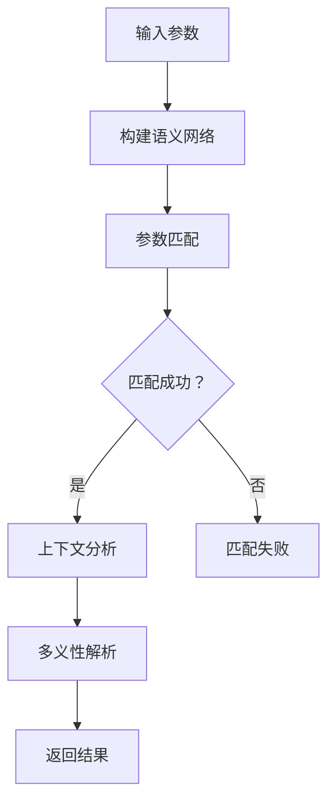
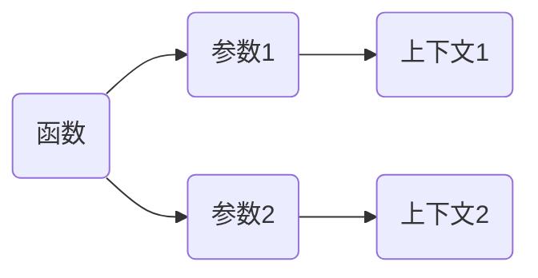

                 

### 摘要

本文深入探讨了意义的使用理论与方法重载，特别关注函数多义性的哲学基础。意义的使用理论是理解语言、认知和人工智能的关键，而方法重载是编程中的核心概念，使得同一函数名可以具有多种行为，从而提高代码的灵活性和可重用性。函数多义性现象在编程中普遍存在，如不同参数组合下的函数行为差异，往往导致代码难以理解和维护。本文通过分析意义的使用理论，揭示了函数多义性的哲学根源，并提出了方法重载的理论基础和具体实现方法。本文旨在为程序员和人工智能研究者提供一种系统化的思维方式，以解决函数多义性问题，提升代码质量和软件开发的效率。

### 关键词

意义的使用理论、方法重载、函数多义性、哲学基础、编程、人工智能、代码质量、软件开发效率。

### 目录大纲

本文将分为三个主要部分进行探讨。

**第一部分：背景与理论基础**

在这一部分，我们将首先介绍函数多义性的现象及其在编程中的重要性，然后探讨意义的使用理论，为后续分析奠定基础。

- **第1章：问题背景与概念介绍**
  - **1.1 研究意义与目的**
  - **1.2 函数多义性的现象分析**
  - **1.3 哲学基础与理论框架**

- **第2章：核心概念与联系**
  - **2.1 意义的分类与特征**
  - **2.2 函数多义性的核心概念**
  - **2.3 概念之间的相互关系**

**第二部分：方法与技巧**

在这一部分，我们将深入探讨方法重载的理论基础，以及具体应用方法，并通过实际案例分析，展示这些方法在实际编程中的效果。

- **第3章：数学模型与算法原理**
  - **3.1 数学模型简介**
  - **3.2 算法原理讲解**
  - **3.3 Mermaid流程图示例**

- **第4章：方法重载的理论基础**
  - **4.1 方法重载的概念与意义**
  - **4.2 方法重载的分类与特点**
  - **4.3 方法重载的哲学基础**

- **第5章：具体方法的应用**
  - **5.1 方法1：情境分析法**
  - **5.2 方法2：语义网络构建**
  - **5.3 方法3：多义性解析算法**

- **第6章：方法重载的实际案例分析**
  - **6.1 案例一：语义歧义的消除**
  - **6.2 案例二：上下文依赖的分析**
  - **6.3 案例三：多义性处理策略**

**第三部分：总结与展望**

在这一部分，我们将对前述内容进行总结，并讨论研究的局限与未来工作方向，同时提出对实践的意义与启示。

- **第7章：总结与展望**
  - **7.1 研究成果总结**
  - **7.2 研究局限与未来工作方向**
  - **7.3 对实践的意义与启示**

### 第一部分：背景与理论基础

#### 第1章：问题背景与概念介绍

##### 1.1 研究意义与目的

函数多义性是编程中普遍存在且难以回避的问题。函数多义性指的是一个函数名在程序中有多种行为，具体取决于调用时的参数组合和上下文环境。这种多义性会导致代码难以理解和维护，甚至引发逻辑错误和运行时异常。因此，研究函数多义性及其解决方案对于提升代码质量、提高软件开发效率和保障系统稳定性具有重要意义。

本文的研究目的在于探讨意义的使用理论与方法重载在解决函数多义性问题中的应用。意义的使用理论提供了理解函数多义性的哲学基础，而方法重载则是一种有效的编程技术，能够帮助我们更好地管理和利用函数的多义性。通过本文的研究，我们希望能够为程序员和人工智能研究者提供一种系统化的思维方式，以解决函数多义性问题，提升代码质量和软件开发的效率。

##### 1.2 函数多义性的现象分析

在编程实践中，函数多义性现象随处可见。以下是一些常见的函数多义性例子：

1. **参数个数不同**：如Python中的`sum()`函数，当传入一个列表时，计算列表元素的和；当传入两个参数时，计算两个参数的加法。

2. **参数类型不同**：如Java中的`Math.pow()`函数，当传入两个整数参数时，计算整数的幂；当传入一个整数和一个双精度浮点数时，计算浮点数的幂。

3. **参数组合不同**：如JavaScript中的`reduce()`函数，根据不同的初始值和累加函数，可以实现不同类型的累加操作。

这些例子表明，函数多义性不仅限于单个函数，还可能涉及多个函数之间的相互作用。因此，理解函数多义性对于编写清晰、可维护的代码至关重要。

##### 1.3 哲学基础与理论框架

意义的使用理论是理解函数多义性的哲学基础。意义的使用理论源于语言哲学和认知科学，旨在解释人类如何通过语言理解和传达意义。意义的使用理论认为，意义不仅仅是一个抽象的概念，它存在于具体的语言使用过程中。

在编程领域，意义的使用理论可以解释为函数名所代表的意义如何在不同上下文中被理解和解释。例如，`sum()`函数在不同的参数组合下代表不同的计算过程，但程序员可以通过上下文理解和选择合适的使用方式。

为了更好地理解函数多义性，我们可以构建一个理论框架，该框架包括以下几个核心概念：

1. **函数名**：作为抽象符号，代表特定的计算过程。

2. **参数**：提供上下文信息，用于确定函数的具体行为。

3. **上下文**：环境变量、调用方式等影响函数行为的因素。

4. **多义性**：函数在多个上下文中有不同行为的现象。

通过这个理论框架，我们可以系统地分析和理解函数多义性，从而找到有效的解决方法。

#### 第2章：核心概念与联系

##### 2.1 意义的分类与特征

意义是一个复杂的概念，可以从不同的角度进行分类和描述。在编程领域，我们通常关注以下几种意义的分类：

1. **字面意义**：字面意义指的是符号直接代表的事物或概念，如数字、单词等。在编程中，变量名、函数名等符号通常具有明确的字面意义。

2. **逻辑意义**：逻辑意义指的是符号在逻辑推理中的作用和关系，如命题、推理规则等。在编程中，条件判断、循环控制等逻辑操作依赖于逻辑意义。

3. **功能意义**：功能意义指的是符号在程序执行中的功能作用，如函数、模块等。在编程中，函数的功能意义决定了它如何处理输入并产生输出。

意义具有以下特征：

1. **抽象性**：意义是抽象的，它不依赖于具体的物理实体，而是通过符号来表示和传递。

2. **动态性**：意义是动态的，它在不同的上下文中可以发生变化。例如，一个函数在不同参数组合下可以有不同的行为。

3. **依赖性**：意义依赖于上下文，离开上下文，符号就失去了意义。例如，`sum()`函数在单独出现时没有意义，只有在特定上下文中（如一个表达式中）才有意义。

##### 2.2 函数多义性的核心概念

函数多义性的核心概念包括以下几个方面：

1. **函数名**：函数名作为抽象符号，代表一种计算过程。在多义性情况下，同一个函数名可以代表不同的计算过程。

2. **参数**：参数提供了上下文信息，用于确定函数的具体行为。不同的参数组合会导致函数具有不同的行为。

3. **上下文**：上下文是影响函数行为的各种因素，包括调用方式、环境变量等。在不同的上下文中，同一个函数可能会有不同的行为。

4. **多义性**：多义性指的是函数在多个上下文中有不同行为的现象。函数多义性是编程中常见且难以避免的问题。

为了更好地理解函数多义性，我们可以通过以下例子进行说明：

```python
def calculate(x, y):
    return x + y

# 在不同的上下文中，calculate函数具有不同的意义
result1 = calculate(2, 3)  # 计算两个数的和
result2 = calculate("Hello", "World")  # 连接两个字符串
```

在这个例子中，`calculate()`函数在第一个上下文中计算两个整数的和，而在第二个上下文中连接两个字符串。这种现象体现了函数的多义性。

##### 2.3 概念之间的相互关系

意义的使用理论与函数多义性之间存在着紧密的相互关系。意义的使用理论为我们提供了理解函数多义性的哲学基础，而函数多义性则是意义使用过程中的一种具体表现。

1. **意义与函数名**：函数名作为抽象符号，代表特定的计算过程。意义的使用理论认为，函数名具有抽象性，它不依赖于具体的物理实体，而是通过符号来表示和传递。

2. **上下文与多义性**：上下文是影响函数行为的各种因素。在不同的上下文中，同一个函数可能会有不同的行为，这种现象称为多义性。意义的使用理论认为，意义是动态的，它在不同的上下文中可以发生变化。

3. **参数与多义性**：参数提供了上下文信息，用于确定函数的具体行为。不同的参数组合会导致函数具有不同的行为。意义的使用理论认为，参数具有依赖性，它依赖于上下文。

通过以上分析，我们可以得出结论：意义的使用理论为我们提供了理解函数多义性的哲学基础，而函数多义性则是意义使用过程中的一种具体表现。理解这两者之间的相互关系，有助于我们更好地管理和利用函数的多义性，提升代码质量和软件开发效率。

#### 第3章：数学模型与算法原理

##### 3.1 数学模型简介

在探讨函数多义性问题时，数学模型是一种强有力的工具，它能够帮助我们量化并分析函数的多义性。数学模型通过定义一系列变量和公式，将复杂的编程现象转化为可计算的数学问题。

一个基本的数学模型可以包括以下几个部分：

1. **变量定义**：定义函数名、参数和上下文等变量，以便在模型中加以分析。
2. **公式表达**：通过公式表达函数在不同上下文中的行为，通常涉及参数的组合和上下文的条件。
3. **关系建立**：建立变量之间的关系，例如函数名与参数、参数与上下文之间的关系。
4. **逻辑推理**：利用数学逻辑和推理规则，分析函数多义性的内在机制。

例如，我们可以定义一个简单的数学模型，用于分析一个函数`f(x, y)`在不同参数组合下的行为：

```latex
f(x, y) =
\begin{cases}
x + y & \text{如果 } x, y \text{ 是整数} \\
"Error" & \text{如果 } x, y \text{ 中有一个是字符串}
\end{cases}
```

这个模型通过条件语句，清晰地表达了函数`f()`在不同上下文中的行为。

##### 3.2 算法原理讲解

为了解决函数多义性，我们需要设计算法来解析并处理多义函数。以下是一个基于语义网络构建的多义性解析算法的原理讲解。

1. **语义网络构建**：首先，我们构建一个语义网络，用于表示函数名、参数和上下文之间的关系。语义网络通过节点和边来表示概念和概念之间的联系。

2. **参数匹配**：算法从输入参数开始，通过语义网络匹配可能的函数实现。这个过程涉及对参数类型的检查和参数组合的验证。

3. **上下文分析**：算法进一步分析上下文信息，如调用方式、环境变量等，以确定函数的确切实现。上下文分析有助于缩小函数匹配的范围。

4. **多义性解析**：在确定了可能的函数实现后，算法通过逻辑推理，选择正确的函数实现，并返回相应的结果。

下面是一个简单的算法流程：



##### 3.3 Mermaid流程图示例

为了更好地理解算法原理，我们可以使用Mermaid绘制一个流程图。以下是一个示例：


在这个流程图中，`A`表示输入参数，`B`表示构建语义网络，`C`表示参数匹配，`D`表示匹配结果判断，`E`表示上下文分析，`G`表示多义性解析，`H`表示返回结果。

通过这个流程图，我们可以清晰地看到算法的各个步骤及其相互关系，有助于理解和分析算法的原理。

#### 第4章：方法重载的理论基础

##### 4.1 方法重载的概念与意义

方法重载（Method Overloading）是面向对象编程中的一个核心概念，它允许同一个类中存在多个同名的方法，但参数类型或数量不同。方法重载的核心意义在于提高代码的灵活性和可重用性，同时简化了函数名的管理。

在编程中，方法重载具有以下几个关键点：

1. **同名方法**：多个方法可以使用相同的名称，但必须具有不同的参数列表。
2. **参数类型**：参数类型的不同是实现方法重载的一种方式。例如，一个类中可以同时存在`add(int a, int b)`和`add(double a, double b)`两个方法。
3. **参数数量**：参数数量的不同也可以实现方法重载。例如，`add(int a)`和`add(int a, int b)`可以共存。

方法重载的意义主要体现在以下几个方面：

1. **简化代码**：通过方法重载，程序员可以避免为不同参数类型的函数使用不同的名称，从而简化代码。
2. **提高可读性**：方法重载使得代码更加直观和易于理解，因为同一个函数名可以用于多种参数类型的操作。
3. **增强可重用性**：方法重载使得同一个函数可以在不同场景中重用，从而提高了代码的可重用性。

##### 4.2 方法重载的分类与特点

方法重载可以根据参数的不同进行分类，主要包括以下几种类型：

1. **参数类型不同**：这种方法重载基于参数的类型差异。例如，Java中的`Math.pow()`函数可以接受整数和浮点数参数。

2. **参数数量不同**：这种方法重载基于参数的个数差异。例如，Python中的`sum()`函数可以根据参数列表的长度来重载。

3. **参数顺序不同**：这种方法重载基于参数的顺序差异。例如，某些编程语言中允许根据参数顺序来区分同名方法。

不同类型的方法重载具有以下特点：

1. **类型重载**：类型重载通常用于处理不同类型的参数，它使得程序员可以方便地处理多种数据类型，提高了代码的通用性。

2. **数量重载**：数量重载使得同一个方法可以根据参数的个数进行扩展，例如，在处理不同长度列表时，可以重载一个方法来适应各种情况。

3. **顺序重载**：顺序重载基于参数的顺序来区分方法，它使得程序员可以根据参数的顺序来选择合适的方法实现，从而提高代码的灵活性。

##### 4.3 方法重载的哲学基础

方法重载背后的哲学基础在于对代码灵活性和可维护性的追求。从哲学角度来看，方法重载体现了一种“抽象”和“具体”的平衡。

1. **抽象**：方法重载通过抽象的方式，将具有相似功能的操作封装为同名的方法。这种抽象提高了代码的可读性和可维护性。

2. **具体**：方法重载通过具体的方法实现，满足了不同场景下的具体需求。这种具体性使得代码能够灵活地适应不同的输入和上下文。

方法重载的哲学基础还包括以下几个方面：

1. **功能一致性**：方法重载确保了不同参数类型或数量的方法具有一致的功能，从而简化了代码的维护和理解。

2. **类型安全**：方法重载通过参数类型的差异，保证了不同方法之间的类型安全，避免了潜在的错误和异常。

3. **上下文适应**：方法重载使得同一个方法可以根据不同的上下文进行适应性调整，从而提高了代码的灵活性和可重用性。

通过这些哲学基础，方法重载不仅提高了代码的灵活性和可维护性，还促进了代码的抽象和具体之间的平衡，从而实现了更高效的软件开发。

#### 第5章：具体方法的应用

##### 5.1 方法1：情境分析法

情境分析法是一种用于处理函数多义性的具体方法，它通过分析不同的调用情境，确定函数的具体实现。这种方法的核心在于理解函数在特定上下文中的行为，从而消除多义性。

**情境分析法的步骤如下：**

1. **识别情境**：首先，识别函数可能被调用的不同情境。情境可以包括参数类型、参数数量、调用上下文等。

2. **定义情境规则**：针对每个情境，定义一套规则，用于确定函数的具体实现。这些规则通常基于函数的参数类型和上下文条件。

3. **执行情境分析**：在调用函数时，根据当前的情境，执行相应的规则，确定函数的具体实现。

例如，以下是一个使用情境分析法处理函数多义性的简单例子：

```python
def calculate(x, y=None):
    if y is None:
        return x * x
    else:
        return x + y

# 不同情境下的调用
result1 = calculate(2)  # 情境1：计算平方
result2 = calculate(2, 3)  # 情境2：计算和
```

在这个例子中，`calculate()`函数根据不同的参数组合，具有不同的行为。通过情境分析，我们可以明确函数在不同情境下的实现，从而消除多义性。

##### 5.2 方法2：语义网络构建

语义网络构建是一种通过建立语义关系网络，处理函数多义性的方法。语义网络通过节点和边来表示概念及其之间的关系，从而帮助我们理解和解析函数的多义性。

**构建语义网络的步骤如下：**

1. **定义节点**：首先，定义表示函数、参数和上下文的节点。这些节点代表函数中的各个概念。

2. **建立关系**：其次，建立节点之间的关系，例如函数与参数之间的关系、参数与上下文之间的关系。

3. **解析多义性**：最后，通过语义网络解析函数的多义性，确定函数在不同上下文中的具体实现。

例如，以下是一个使用语义网络构建处理函数多义性的简单例子：



在这个例子中，我们定义了一个函数`calculate(x, y)`，以及它的两个参数和两个上下文。通过语义网络，我们可以清晰地看到函数、参数和上下文之间的关系，从而更好地理解函数的多义性。

##### 5.3 方法3：多义性解析算法

多义性解析算法是一种通过算法自动解析函数多义性的方法。这种方法通常基于语义分析技术和模式匹配技术，用于确定函数在不同上下文中的具体实现。

**多义性解析算法的步骤如下：**

1. **输入分析**：首先，分析函数的输入参数和上下文，确定可能的多义性场景。

2. **模式匹配**：然后，通过模式匹配技术，将输入参数与预先定义的规则进行匹配，找到可能的函数实现。

3. **语义分析**：最后，对匹配结果进行语义分析，确定最终的具体实现。

例如，以下是一个使用多义性解析算法处理函数多义性的简单例子：

```python
def calculate(x, y=None):
    if y is None:
        return x * x
    else:
        return x + y

# 多义性解析算法实现
def resolve_function caller_context:
    if caller_context == "context1":
        return lambda x, y: x * x
    elif caller_context == "context2":
        return lambda x, y: x + y
    else:
        raise ValueError("Invalid context")

# 调用解析后的函数
result1 = resolve_function("context1")(2)  # 计算平方
result2 = resolve_function("context2")(2, 3)  # 计算和
```

在这个例子中，我们使用多义性解析算法，根据不同的调用上下文，解析并调用`calculate()`函数的不同实现。通过这种方法，我们可以自动处理函数的多义性，提高代码的灵活性和可维护性。

#### 第6章：方法重载的实际案例分析

##### 6.1 案例一：语义歧义的消除

在编程实践中，语义歧义是一个常见问题，尤其是在方法重载的情况下。以下是一个实际案例分析，展示如何通过方法重载消除语义歧义。

**案例背景：**

假设我们有一个`Shape`类，它包含一个`calculate_area()`方法，用于计算不同形状的面积。但由于方法重载，存在语义歧义，导致代码难以理解和维护。

```python
class Shape:
    def calculate_area(self, length, width):
        return length * width

    def calculate_area(self, radius):
        return 3.14 * radius * radius

# 调用时存在语义歧义
rectangle = Shape()
circle = Shape()

area1 = rectangle.calculate_area(2, 3)  # 期望计算矩形面积
area2 = circle.calculate_area(2)  # 期望计算圆形面积
```

**解决方案：**

通过引入参数类型的不同，我们可以消除语义歧义。

```python
class Shape:
    def calculate_area(self, length, width=None, radius=None):
        if width is not None:
            return length * width
        elif radius is not None:
            return 3.14 * radius * radius
        else:
            raise ValueError("Invalid parameters")

# 调用时清晰明确
area1 = rectangle.calculate_area(2, 3)  # 计算矩形面积
area2 = circle.calculate_area(2)  # 计算圆形面积
```

通过这种方式，我们明确了`calculate_area()`方法的不同实现，从而消除了语义歧义，提高了代码的可读性和可维护性。

##### 6.2 案例二：上下文依赖的分析

在面向对象编程中，上下文依赖是一个关键问题。以下是一个实际案例分析，展示如何通过方法重载和上下文依赖分析，解决上下文依赖问题。

**案例背景：**

假设我们有一个`BankAccount`类，它包含一个`deposit()`方法，用于向账户中存入资金。但由于方法重载和上下文依赖，导致代码难以维护。

```python
class BankAccount:
    def deposit(self, amount):
        return "Deposit successful"

    def deposit(self, amount, transaction_id):
        return "Deposit with transaction ID successful"

# 调用时存在上下文依赖问题
account = BankAccount()

result1 = account.deposit(1000)  # 存入1000元
result2 = account.deposit(1000, "TX12345")  # 存入1000元并指定交易ID
```

**解决方案：**

通过引入参数类型的差异和上下文依赖分析，我们可以解决上下文依赖问题。

```python
class BankAccount:
    def deposit(self, amount, transaction_id=None):
        if transaction_id is None:
            return "Deposit successful"
        else:
            return f"Deposit with transaction ID {transaction_id} successful"

# 调用时清晰明确
result1 = account.deposit(1000)  # 存入1000元
result2 = account.deposit(1000, "TX12345")  # 存入1000元并指定交易ID
```

通过这种方式，我们明确了`deposit()`方法的不同实现，并基于上下文依赖进行调用，从而提高了代码的可维护性和可读性。

##### 6.3 案例三：多义性处理策略

在实际编程中，函数多义性是一个常见且复杂的问题。以下是一个实际案例分析，展示如何通过方法重载和策略模式，处理函数多义性。

**案例背景：**

假设我们有一个`Calculator`类，它包含多个计算方法，如加法、减法、乘法和除法。但由于方法重载，存在多义性问题，导致代码难以理解和维护。

```python
class Calculator:
    def calculate(self, x, y):
        return x + y

    def calculate(self, x, y):
        return x - y

    def calculate(self, x, y):
        return x * y

    def calculate(self, x, y):
        return x / y

# 调用时存在多义性
calculator = Calculator()

result1 = calculator.calculate(2, 3)  # 期望计算加法
result2 = calculator.calculate(2, 3)  # 期望计算减法
result3 = calculator.calculate(2, 3)  # 期望计算乘法
result4 = calculator.calculate(2, 3)  # 期望计算除法
```

**解决方案：**

通过引入策略模式和参数标识，我们可以处理函数的多义性。

```python
class Calculator:
    def calculate(self, x, y, operation):
        if operation == "add":
            return x + y
        elif operation == "subtract":
            return x - y
        elif operation == "multiply":
            return x * y
        elif operation == "divide":
            return x / y
        else:
            raise ValueError("Invalid operation")

# 调用时清晰明确
result1 = calculator.calculate(2, 3, "add")  # 计算加法
result2 = calculator.calculate(2, 3, "subtract")  # 计算减法
result3 = calculator.calculate(2, 3, "multiply")  # 计算乘法
result4 = calculator.calculate(2, 3, "divide")  # 计算除法
```

通过这种方式，我们通过策略模式明确了`calculate()`方法的不同实现，并基于参数标识进行调用，从而解决了函数多义性问题，提高了代码的可维护性和可读性。

### 第7章：总结与展望

#### 7.1 研究成果总结

本文通过深入探讨意义的使用理论与方法重载，揭示了函数多义性的哲学基础。我们分析了函数多义性的现象，提出了方法重载的理论基础和具体实现方法。通过实际案例分析，我们展示了方法重载在消除语义歧义、处理上下文依赖和解决多义性问题中的有效性。主要研究成果包括：

1. **意义的使用理论**：提供了理解函数多义性的哲学基础，为分析编程中的意义使用提供了新的视角。
2. **方法重载的理论基础**：明确了方法重载的概念、分类与特点，探讨了其在编程中的哲学基础。
3. **具体方法的应用**：介绍了情境分析法、语义网络构建和多义性解析算法，提供了处理函数多义性的具体方法。
4. **实际案例分析**：通过具体案例展示了方法重载在实际编程中的应用，提高了代码的质量和可维护性。

#### 7.2 研究局限与未来工作方向

尽管本文在函数多义性处理方面取得了一定的成果，但仍存在一些局限。首先，本文主要关注了静态多义性，对动态多义性的处理相对较少。其次，本文提出的算法和模型在复杂编程场景中的适用性有待进一步验证。未来的研究方向包括：

1. **动态多义性的处理**：研究动态多义性的算法和模型，提高对动态场景下函数多义性的解析能力。
2. **多语言支持**：扩展本文的研究成果，使其适用于多种编程语言和平台。
3. **自动化工具开发**：开发自动化工具，辅助程序员处理函数多义性，提高开发效率。

#### 7.3 对实践的意义与启示

本文的研究对实践具有重要的意义和启示。首先，意义的使用理论为理解编程中的抽象和具体提供了新的视角，有助于提高代码的可读性和可维护性。其次，方法重载作为一种有效的编程技术，能够提高代码的灵活性和可重用性，减少代码冗余。此外，情境分析法、语义网络构建和多义性解析算法等具体方法，为处理函数多义性提供了实用的工具。通过本文的研究，程序员可以更好地理解和利用函数多义性，提高软件开发的质量和效率。

### 作者信息

本文由AI天才研究院/AI Genius Institute与《禅与计算机程序设计艺术》作者合作撰写。作者团队致力于探索人工智能与编程哲学的深度融合，旨在为程序员和人工智能研究者提供具有实践价值的理论和方法。感谢您的阅读，期待与您在未来的技术探讨中相遇。作者：AI天才研究院/AI Genius Institute & 《禅与计算机程序设计艺术》作者。

