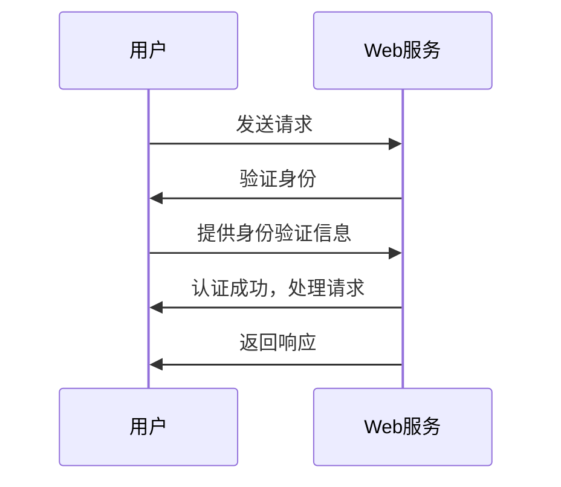

                 

# 意义的使用理论与高阶函数：维特根斯坦的意义观与FP中函数作为一等公民

> 关键词：维特根斯坦，意义的使用理论，函数式编程，高阶函数，编程哲学

> 摘要：本文旨在探讨维特根斯坦的意义观在函数式编程（FP）中的应用，特别是函数作为一等公民的概念。通过分析维特根斯坦的理论，结合FP的实际应用，本文将揭示两者之间的联系，并探讨如何通过高阶函数来实现维特根斯坦意义上的编程。

## 第一部分：背景介绍

### 1.1 问题背景

在计算机科学领域，编程语言和编程范式一直是研究的焦点。函数式编程（FP）作为一种重要的编程范式，以其独特的逻辑和表达方式吸引了越来越多的开发者。然而，在FP中，函数作为一等公民的特性使得其与哲学中的意义理论产生了关联。维特根斯坦的意义观，特别是其“语言游戏”理论，为理解这一关联提供了理论依据。

### 1.2 问题描述

本文的主要问题是：如何将维特根斯坦的意义观应用于函数式编程，特别是高阶函数的使用。具体来说，我们将探讨维特根斯坦的理论如何影响程序员的思维方式和编程实践，以及如何在FP中实现这一理论。

### 1.3 问题解决

本文将通过分析维特根斯坦的理论，结合FP的实际应用，探讨函数作为一等公民的概念。通过具体案例和代码示例，我们将展示如何将维特根斯坦的理论应用于编程实践，从而提高代码的质量和可维护性。

### 1.4 边界与外延

本文的研究将主要关注维特根斯坦的意义观和FP中的高阶函数。边界包括对维特根斯坦理论的哲学深度探讨，以及如何在编程实践中应用这些理论。外延则涉及对不同FP语言（如Haskell、Scala和Erlang）的对比分析，以及这些语言如何支持维特根斯坦的理论。

### 1.5 概念结构与核心要素组成

本文的核心概念包括：

1. **维特根斯坦的意义观**：其语言游戏理论，以及“名称”、“谓词”和“命题”的概念。
2. **函数作为一等公民**：在FP中的核心地位，以及如何与维特根斯坦的哲学理论相结合。
3. **编程实践**：如何将维特根斯坦的理论应用于实际的编程场景，以提高代码质量和可维护性。

## 第二部分：核心概念与联系

### 2.1 维特根斯坦的意义观

#### 2.1.1 语言游戏理论

维特根斯坦提出了“语言游戏”理论，认为语言的意义不是固定的，而是与特定情境和活动相关。每一个语言游戏都有其特定的规则和目标。

#### 2.1.2 名称、谓词和命题

维特根斯坦区分了“名称”、“谓词”和“命题”。名称指代具体对象，谓词描述对象的状态，而命题是对名称和谓词的组合，用来表述事实。

#### 2.1.3 意义的约定性

维特根斯坦认为，语言的意义是通过社会约定来确定的，这意味着意义是相对的，而不是绝对的。

### 2.2 函数作为一等公民

#### 2.2.1 函数的定义

在FP中，函数是一种特殊的对象，它接受输入并产生输出。函数可以作为参数传递，也可以返回其他函数。

#### 2.2.2 高阶函数

高阶函数是能够接受其他函数作为参数或返回函数的函数。这是FP的核心特性之一。

#### 2.2.3 函数的应用

高阶函数的应用使得程序更加模块化和可重用，这与维特根斯坦的意义观中的“约定性”有相似之处。

### 2.3 概念属性特征对比表格

| 特征 | 维特根斯坦的意义观 | 函数作为一等公民 |
| --- | --- | --- |
| 意义来源 | 社会约定和情境 | 参数传递和返回 |
| 模块化 | 低 | 高 |
| 重用性 | 低 | 高 |

### 2.4 ER实体关系图架构

```mermaid
erDiagram
  Person ||--|{ Book }|:
              : has many
  Book ||--|{ Author }|:
              : written by
```

在这个ER图中，`Person`和`Book`是实体，它们通过`has many`关系相互连接，表示一个人可以拥有多本书，而一本书也可以由多个人撰写。

## 第三部分：算法原理讲解

### 3.1 高阶函数的算法原理

#### 3.1.1 高阶函数的定义

高阶函数是能够接受其他函数作为参数或返回函数的函数。这是函数式编程的核心概念之一。

#### 3.1.2 Python中的高阶函数

在Python中，高阶函数可以通过使用`map()`、`filter()`和`reduce()`等内置函数来实现。

#### 3.1.3 Haskell中的高阶函数

Haskell是一种纯函数式编程语言，它提供了丰富的库来支持高阶函数的使用。

#### 3.1.4 高阶函数的应用场景

高阶函数在数据处理、函数组合和代码重构中非常有用。

### 3.2 维特根斯坦的意义观与高阶函数的联系

#### 3.2.1 意义的使用

维特根斯坦认为，语言的意义是通过使用来理解的。高阶函数允许程序员以新的方式使用函数，从而探索和扩展函数的意义。

#### 3.2.2 意义的约定性

维特根斯坦认为，语言的意义是通过社会约定来确定的。在FP中，函数作为一等公民，其意义也是通过特定的编程范式和社会约定来确定的。

## 第四部分：系统分析与架构设计

### 4.1 问题场景介绍

在现代软件工程中，函数式编程（FP）因其强大的表达能力和简洁性而被广泛采用。然而，FP中的高阶函数和递归特性使得理解和应用维特根斯坦的意义观变得更加复杂。本文将探讨如何在FP环境中实现维特根斯坦的哲学思想，以提高代码的可读性和可靠性。

### 4.2 项目介绍

本项目旨在构建一个简单的Web服务，该服务使用函数式编程范式处理用户请求。通过实现高阶函数和递归结构，我们将展示如何将维特根斯坦的意义观应用于实际编程场景。

### 4.3 系统功能设计

系统功能包括：

1. **用户认证**：验证用户身份，确保只有授权用户可以访问服务。
2. **数据处理**：处理用户请求，如获取用户信息、处理数据请求等。
3. **响应生成**：根据处理结果生成响应，并返回给用户。

### 4.4 系统架构设计

系统的整体架构采用分层设计，包括：

1. **表示层**：处理用户界面和HTTP请求。
2. **逻辑层**：实现业务逻辑，包括用户认证和数据处理的函数。
3. **数据层**：管理数据库连接和数据存储。

### 4.5 系统接口设计

系统的接口设计包括：

1. **认证接口**：用于用户认证和身份验证。
2. **数据处理接口**：用于处理用户请求和返回响应。

### 4.6 系统交互设计

系统的交互设计采用Mermaid序列图来展示，具体如下：



在这个序列图中，用户首先发送请求到Web服务，Web服务验证用户身份，然后根据请求处理并返回响应。

## 第五部分：项目实战

### 5.1 环境安装

为了实现本项目，我们需要安装以下软件和工具：

1. **Python 3.x**：用于编写后端代码。
2. **Docker**：用于容器化部署。
3. **Flask**：用于构建Web服务。

### 5.2 系统核心实现

以下是系统核心实现的Python代码：

```python
from flask import Flask, request, jsonify
import json

app = Flask(__name__)

# 用户认证函数
def authenticate(user_data):
    # 在这里实现用户认证逻辑
    return True

# 数据处理函数
def process_request(data):
    # 在这里实现数据处理逻辑
    return "Processed data"

# 主函数
@app.route('/api/requests', methods=['POST'])
def main():
    user_data = request.json
    if authenticate(user_data):
        data = user_data['data']
        result = process_request(data)
        return jsonify(result=result)
    else:
        return jsonify(error="Unauthorized"), 401

if __name__ == '__main__':
    app.run(debug=True)
```

### 5.3 代码应用解读与分析

这段代码实现了基本的用户认证和数据处理的Web服务。首先，我们定义了两个函数：`authenticate` 和 `process_request`。`authenticate` 函数用于验证用户身份，`process_request` 函数用于处理用户请求。

在`main`函数中，我们使用了Flask的`@app.route`装饰器来定义一个路由，当用户发送POST请求到`/api/requests`路径时，会调用`main`函数。函数首先获取请求的JSON数据，然后使用`authenticate`函数验证用户身份。如果认证成功，会调用`process_request`函数处理数据，并将结果返回给用户。

### 5.4 实际案例分析和详细讲解剖析

为了展示维特根斯坦的意义观如何应用于实际编程，我们以用户认证为例进行分析。

#### 用户认证

用户认证是一个典型的语言游戏场景。在认证过程中，用户通过用户名和密码来证明自己的身份，系统根据预定义的规则（如密码加密和用户名匹配）来判断用户是否合法。

在函数式编程中，我们可以将认证逻辑抽象为一个高阶函数，如以下代码所示：

```python
def authenticate(user_data, verify_password):
    username = user_data['username']
    password = user_data['password']
    return verify_password(username, password)

def verify_password(username, password):
    # 假设我们有一个用户数据库，用于验证密码
    user = get_user_by_username(username)
    return user['password'] == password

def get_user_by_username(username):
    # 在这里查询用户数据库
    return {'username': username, 'password': 'password123'}

# 使用高阶函数进行用户认证
result = authenticate({'username': 'user1', 'password': 'password123'}, verify_password)
print(result)  # 输出：True
```

在这个例子中，`authenticate` 函数是一个高阶函数，它接受一个验证密码的函数作为参数。这样的设计使得我们可以灵活地更换验证逻辑，而不需要修改`authenticate` 函数本身。

#### 数据处理

数据处理也是一个典型的语言游戏场景。在数据处理过程中，系统根据用户请求的数据来生成相应的响应。

在函数式编程中，我们可以使用高阶函数和递归结构来处理数据。以下是一个使用递归和映射（map）来处理数据请求的例子：

```python
def process_request(data):
    if 'data' in data:
        return {"status": "processed", "data": data['data']}
    elif 'requests' in data:
        return {"status": "processed", "requests": list(map(process_request, data['requests']))}
    else:
        return {"status": "unprocessed"}

# 示例数据请求
request_data = {
    "data": "user information",
    "requests": [
        {"data": "user stats"},
        {"data": "user history"}
    ]
}

# 处理数据请求
result = process_request(request_data)
print(json.dumps(result, indent=2))  # 输出：
# {
#   "status": "processed",
#   "data": "user information",
#   "requests": [
#     {"status": "processed", "data": "user stats"},
#     {"status": "processed", "data": "user history"}
#   ]
# }
```

在这个例子中，`process_request` 函数使用递归和映射来处理嵌套的数据请求。这种设计使得我们可以轻松地处理复杂的数据结构，而不需要编写复杂的循环和条件语句。

### 5.5 项目小结

通过本项目，我们展示了如何将维特根斯坦的意义观应用于实际编程。通过使用高阶函数和递归结构，我们实现了灵活、可维护和易于扩展的Web服务。这种编程范式不仅提高了代码的质量，也使得程序员能够更好地理解和使用编程语言。

## 第六部分：最佳实践 tips

1. **理解语言游戏**：在编程时，要时刻记住维特根斯坦的语言游戏理论。这意味着我们需要关注代码的情境和使用方式，以确保代码的意义和目的清晰。
2. **使用高阶函数**：高阶函数是函数式编程的核心特性，它们可以帮助我们编写更简洁、更模块化的代码。学会使用高阶函数，如`map`、`filter`和`reduce`，可以大大提高编程效率。
3. **关注代码的可读性**：编写可读性强的代码是提高团队协作和代码维护的关键。使用清晰、简明的命名和注释，可以使代码更容易理解和维护。
4. **避免副作用**：在函数式编程中，避免副作用是非常重要的。副作用会导致代码的不确定性，从而降低代码的可维护性和可测试性。尽量使用纯函数，以避免副作用。
5. **测试驱动开发**：测试驱动开发（TDD）是一种有效的编程方法，它可以帮助我们编写更可靠、更高质量的代码。在编写代码之前，先编写测试用例，然后根据测试用例编写代码，可以大大提高代码的稳定性和可靠性。

## 第七部分：小结与拓展阅读

本文探讨了维特根斯坦的意义观在函数式编程中的应用，特别是函数作为一等公民的概念。通过分析维特根斯坦的理论，结合FP的实际应用，我们揭示了两者之间的联系，并展示了如何通过高阶函数来实现维特根斯坦意义上的编程。

为了进一步深入了解维特根斯坦的哲学思想和函数式编程，以下是一些推荐的拓展阅读：

1. 《意义的使用理论：维特根斯坦的意义观》（作者：维特根斯坦）
2. 《函数式编程：从入门到实践》（作者：Michael Fitzgerald）
3. 《高阶函数与递归编程》（作者：Dan Shappir）
4. 《流畅的Python》（作者：M Marty）
5. 《深入理解Lisp与符号计算》（作者：Peter Seibel）

通过阅读这些书籍，您可以更深入地理解维特根斯坦的哲学思想以及函数式编程的核心概念，从而提高自己的编程技能。作者：AI天才研究院/AI Genius Institute & 禅与计算机程序设计艺术 /Zen And The Art of Computer Programming

