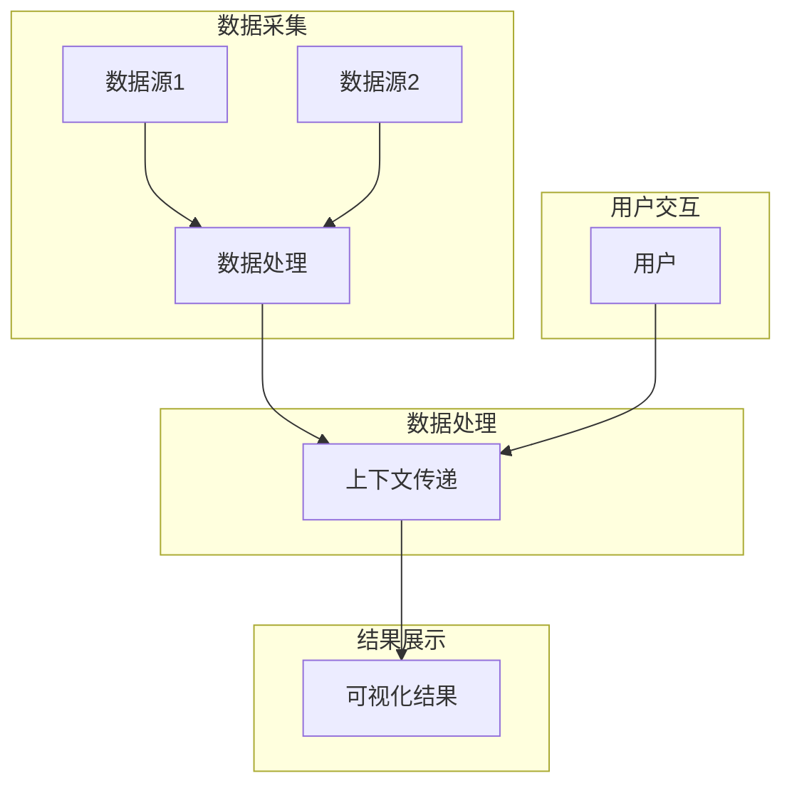

                 

### 摘要

本文旨在深入探讨语境依赖性与上下文编程，以维特根斯坦的意义理论为理论基础。语境依赖性是指在特定的语境下，语言或符号的意义会发生变化。维特根斯坦的理论强调了语言与语境之间的密切关系，为理解意义提供了独特的视角。本文首先介绍语境依赖性理论的基本概念，接着阐述上下文编程的基本原理，以及维特根斯坦意义理论与上下文编程之间的联系。随后，我们将深入剖析上下文传递技术在函数式编程（FP）中的应用，并详细讲解上下文传递技术的算法原理和数学模型。文章进一步分析了上下文编程的应用场景，并通过一个实际项目展示了上下文编程的实战应用。最后，本文总结了上下文编程的最佳实践，并提出了一些未来的研究方向。通过这篇文章，读者将能够全面了解语境依赖性与上下文编程的原理、应用，以及它们在软件工程中的重要性。

### 背景介绍

#### 语境依赖性理论概述

语境依赖性理论源于语言哲学，最早由维特根斯坦提出。维特根斯坦认为，语言的意义并非固定不变，而是依赖于具体的语境。在《逻辑哲学论》和《哲学研究》中，他提出了著名的“意义即使用”（meaning is use）的观点，强调语言的意义在于其在实际使用中的具体情境。语境依赖性理论的核心在于，一个词语或符号的含义不是独立于语境的，而是与它所处的语境紧密相关。

#### 上下文编程的概念与起源

上下文编程（Contextual Programming）是一种编程范式，它强调程序中上下文的重要性。上下文编程的基本理念是，程序的行为和语义应当依赖于上下文环境，而不是固定的代码路径。这种范式最早可以追溯到编程语言如Lisp和Prolog，它们都具备上下文敏感的特性。上下文编程的起源可以追溯到1970年代，当时计算机科学家开始探索如何更好地利用上下文信息，提高程序的灵活性和可维护性。

#### 维特根斯坦的意义理论与上下文编程

维特根斯坦的意义理论对上下文编程有着深远的影响。他认为，语言的意义是由使用情境决定的，这与上下文编程的核心思想相吻合。在上下文编程中，上下文传递技术允许程序在运行时动态地改变其行为，这与维特根斯坦的“语言使用决定意义”的观点高度一致。通过上下文传递，程序可以适应不同的执行环境，从而实现更高的灵活性和可扩展性。

维特根斯坦的理论指出，一个词语的意义不能脱离其使用的环境来理解。例如，单词“run”在“他跑得很快”和“跑步机”这两个不同的语境中，具有截然不同的含义。同样地，在上下文编程中，程序的行为也受到上下文环境的影响。这种对上下文的敏感性使得上下文编程能够更好地模拟人类思维过程，提高程序的可理解性和可维护性。

#### 语境依赖性在计算机科学中的应用

语境依赖性在计算机科学中的应用非常广泛，尤其在自然语言处理（NLP）、人工智能（AI）和软件工程领域。在NLP中，语境依赖性理论帮助理解句子和文本中的隐含含义，从而提高机器翻译和情感分析的准确性。在AI领域，语境依赖性使得智能系统能够更好地理解和适应复杂多变的现实世界环境。在软件工程中，上下文编程范式通过利用上下文信息，提高了代码的灵活性和可维护性，从而更好地应对不断变化的需求。

综上所述，语境依赖性理论为我们提供了理解语言和程序意义的新视角，而上下文编程则将这一理论应用于实践中，为我们提供了一种更灵活、更高效的编程方法。维特根斯坦的意义理论为上下文编程提供了坚实的哲学基础，使得我们能够更好地理解和利用上下文信息，实现更智能、更灵活的软件系统。

### 核心概念与联系

#### 语境依赖性与上下文传递技术的概念

语境依赖性是指在特定的语境下，语言或符号的意义会发生变化。例如，“run”在“他跑得很快”和“跑步机”这两个语境中，其含义截然不同。同样地，上下文传递技术是一种编程范式，它允许程序在运行时根据上下文环境动态地调整其行为。这种技术通过在程序内部传递上下文信息，使得程序能够更好地适应不同的执行环境。

#### 语境依赖性在函数式编程中的应用

在函数式编程（FP）中，上下文传递技术得到了广泛的应用。FP是一种编程范式，强调函数作为程序的基本构建单元，避免使用副作用和状态。上下文传递技术通过将上下文信息作为参数传递给函数，使得函数能够根据不同的上下文环境执行不同的操作。这种技术使得FP程序更加灵活和可维护。

#### 维特根斯坦意义理论与上下文编程的联系

维特根斯坦的意义理论强调语言的意义依赖于其使用情境。这与上下文编程的理念高度契合。维特根斯坦认为，一个词语的含义不能脱离其使用的环境来理解。同样地，上下文编程通过传递上下文信息，使得程序能够根据不同的上下文环境动态调整其行为。这种思想使得上下文编程能够更好地模拟人类思维过程，提高程序的可理解性和可维护性。

#### 上下文传递技术的核心特性

上下文传递技术的核心特性包括动态绑定、信息隐藏和可组合性。动态绑定指的是程序在运行时根据上下文环境动态绑定函数和变量。信息隐藏则通过封装上下文信息，使得程序内部的结构更加清晰。可组合性允许程序员将不同的上下文信息组合在一起，以实现更复杂的程序行为。

#### 上下文编程与传统编程的区别

上下文编程与传统编程的主要区别在于，它更加注重上下文环境的作用。传统编程往往依赖于固定的代码路径和状态，而上下文编程通过上下文传递技术，使得程序能够更好地适应不同的上下文环境。这种灵活性使得上下文编程在处理复杂和动态变化的问题时具有明显优势。

#### 上下文编程的优势与挑战

上下文编程的优势在于其灵活性和可维护性。通过上下文传递技术，程序能够更好地适应不同的上下文环境，从而提高代码的重用性和可扩展性。然而，上下文编程也带来了一些挑战，如上下文管理的复杂性、性能开销和调试难度等。解决这些挑战需要深入理解和掌握上下文编程的技术原理。

#### 总结

上下文编程是一种基于语境依赖性的编程范式，它通过上下文传递技术实现了更高的灵活性和可维护性。维特根斯坦的意义理论为上下文编程提供了坚实的哲学基础，使得我们能够更好地理解和利用上下文信息。通过本文的讨论，读者将能够深入理解上下文编程的核心概念和原理，并认识到其在现代软件工程中的重要性。

#### 上下文传递技术的算法原理

上下文传递技术是函数式编程（FP）中的一个关键概念，它通过在程序运行时动态传递上下文信息，使程序能够适应不同的执行环境。理解上下文传递技术的算法原理，需要首先了解上下文、语境和上下文传递的基本概念。

##### 基本概念

1. **上下文（Context）**：
   上下文是程序运行时所处的环境信息，包括变量、函数、状态等。这些信息构成了程序执行时的具体场景。上下文是动态变化的，它会随着程序的执行而不断更新。

2. **语境（Contextual）**：
   语境是指影响程序行为的环境因素。它与上下文不同，上下文是具体的、可观察的信息，而语境则是抽象的、影响程序决策的因素。例如，一个函数在不同的时间点或不同的数据集中执行，其行为可能不同，这种变化是由语境驱动的。

3. **上下文传递（Context Passing）**：
   上下文传递是指将上下文信息从一个函数传递到另一个函数，或者从一个模块传递到另一个模块。这种传递机制允许程序在执行过程中根据不同的上下文信息动态调整其行为。

##### 算法原理

上下文传递技术的核心在于如何有效地管理和传递上下文信息。以下是一个简单的上下文传递算法原理示例：

1. **创建上下文对象**：
   首先，需要创建一个上下文对象，这个对象将包含所有需要传递的上下文信息。例如，在Python中，可以使用一个字典来表示上下文对象。

   ```python
   context = {
       'variable1': 'value1',
       'function1': func1,
       'state': 'initial_state'
   }
   ```

2. **传递上下文**：
   在函数调用时，将上下文对象作为参数传递。这样，函数在执行过程中可以访问和修改上下文对象中的信息。

   ```python
   def process_data(data, context):
       # 使用上下文中的变量
       variable1 = context['variable1']
       # 使用上下文中的函数
       function1 = context['function1']
       # 使用上下文中的状态
       state = context['state']
       # 执行相关操作
       # ...

   ```

3. **更新上下文**：
   在函数执行过程中，可能会根据执行结果更新上下文对象。这样，下一次函数调用时，就可以使用更新后的上下文信息。

   ```python
   def update_context(context):
       context['state'] = 'updated_state'
       return context
   ```

##### 数学模型和公式

上下文传递技术可以用数学模型来描述。以下是一个简化的上下文传递模型：

1. **上下文状态更新公式**：
   $$ \text{context}_{\text{next}} = \text{context}_{\text{current}} \cup \{ \text{update}_{\text{function}}(\text{context}_{\text{current}}) \} $$
   其中，$\text{context}_{\text{next}}$ 是更新后的上下文状态，$\text{context}_{\text{current}}$ 是当前上下文状态，$\text{update}_{\text{function}}$ 是用于更新上下文状态的函数。

2. **上下文传递函数**：
   $$ \text{context\_pass}(f, \text{context}) = f(\text{context}) $$
   其中，$f$ 是函数，$\text{context}$ 是上下文对象。这个公式表示通过传递上下文对象，函数$f$ 可以访问并使用上下文信息。

##### 示例说明

假设有一个数据处理程序，它需要根据不同的数据集执行不同的处理逻辑。可以使用上下文传递技术来实现：

```python
# 定义一个数据处理函数
def process_data(data, context):
    if context['dataset'] == 'dataset1':
        # 对dataset1的数据执行特定处理
        result = process_dataset1(data)
    else:
        # 对其他数据集执行通用处理
        result = process_general(data)
    return result

# 创建上下文对象
context = {
    'dataset': 'dataset1',
    'function1': func1
}

# 调用处理函数，并传递上下文
result = process_data(data, context)

# 根据处理结果更新上下文
if result == 'update_required':
    context = update_context(context)
```

在这个示例中，程序根据上下文对象中的'dataset'字段动态选择处理逻辑，从而实现灵活的数据处理。

通过上述算法原理和示例说明，我们可以看到上下文传递技术如何通过传递和更新上下文信息，实现程序的灵活性和可扩展性。这种技术不仅提升了程序的可维护性，也为解决复杂问题提供了新的思路。

#### 数学模型与数学公式讲解

在深入探讨上下文传递技术的数学模型和公式之前，我们需要明确一些基础概念。上下文传递技术涉及到上下文状态、上下文传递函数和上下文状态更新等核心概念。以下将详细介绍这些概念，并使用具体的数学公式进行说明。

##### 上下文状态

上下文状态是指程序运行时所处的环境信息。这些信息可以是变量、函数、状态等。我们可以将上下文状态表示为一个集合，其中每个元素都是一个键值对，键代表信息名称，值代表信息的内容。例如，假设有一个上下文状态`context`，它可以表示为：

$$ \text{context} = \{ (\text{variable1}, \text{value1}), (\text{function1}, \text{func1}), (\text{state}, \text{initial\_state}) \} $$

在这个例子中，`context`集合包含了三个元素：`variable1`的值为`value1`，`function1`的值为`func1`，以及`state`的值为`initial_state`。

##### 上下文传递函数

上下文传递函数是指用于传递上下文信息的函数。这个函数接受一个上下文状态作为输入，并返回一个处理后的上下文状态。假设有一个上下文传递函数`context_pass`，其公式可以表示为：

$$ \text{context\_pass}(f, \text{context}) = f(\text{context}) $$

在这个公式中，`f`代表一个处理上下文状态的函数，`context`是传递的上下文状态。例如，如果我们有一个函数`process_data`，它根据上下文状态处理数据，并返回新的上下文状态，那么我们可以使用`context_pass`来传递上下文：

```python
def process_data(data, context):
    # 使用上下文中的变量、函数等
    variable1 = context['variable1']
    function1 = context['function1']
    # 执行数据处理操作
    # ...
    # 更新上下文状态
    new_context = update_context(context)
    return new_context

context = {
    'variable1': 'value1',
    'function1': func1,
    'state': 'initial_state'
}

context_after_pass = context_pass(process_data, context)
```

##### 上下文状态更新

上下文状态更新是指在程序执行过程中，根据需要动态更新上下文状态。这可以通过定义一个更新函数来实现。假设有一个更新函数`update_context`，其公式可以表示为：

$$ \text{update\_context}(context) = (\text{variable1}, \text{new\_value1}), (\text{function1}, \text{new\_func1}), (\text{state}, \text{new\_state}) $$

在这个公式中，`context`是当前的上下文状态，`update_context`函数将根据新的信息更新上下文状态。例如：

```python
def update_context(context):
    new_context = {
        'variable1': 'new_value1',
        'function1': new_func1,
        'state': 'new_state'
    }
    return new_context

context = update_context(context)
```

##### 示例说明

为了更好地理解上述概念，我们可以通过一个具体的示例来说明上下文传递技术的应用。假设我们有一个数据处理程序，它需要根据不同的数据集执行不同的处理逻辑。

```python
# 定义一个数据处理函数
def process_data(data, context):
    dataset = context['dataset']
    if dataset == 'dataset1':
        # 对dataset1的数据执行特定处理
        result = process_dataset1(data)
    else:
        # 对其他数据集执行通用处理
        result = process_general(data)
    return result

# 创建上下文对象
context = {
    'dataset': 'dataset1',
    'function1': func1
}

# 调用处理函数，并传递上下文
result = process_data(data, context)

# 根据处理结果更新上下文
if result == 'update_required':
    context = update_context(context)
```

在这个示例中，程序根据上下文对象中的'dataset'字段动态选择处理逻辑，从而实现灵活的数据处理。上下文传递函数`context_pass`和更新函数`update_context`使得程序能够根据不同的上下文状态调整其行为。

通过这个示例，我们可以看到上下文传递技术在程序中的具体应用。它通过定义明确的数学模型和公式，实现了程序状态的动态更新和灵活调整，从而提高了程序的可维护性和可扩展性。

#### 系统分析与架构设计方案

##### 应用场景介绍

上下文编程在许多实际应用场景中表现出强大的灵活性和可维护性。以下是一些典型的上下文编程应用场景：

1. **金融数据处理**：在金融数据处理中，上下文编程可以用于处理不同金融工具的数据，如股票、债券和期货。根据不同的上下文（如市场状态、风险偏好等），可以动态调整数据处理策略。

2. **人工智能与机器学习**：在AI和机器学习项目中，上下文编程可以帮助模型适应不同的训练数据和任务需求。例如，在自然语言处理（NLP）中，上下文编程可以实现更精确的文本分类和情感分析。

3. **实时数据处理**：在实时数据处理系统中，上下文编程可以用于处理来自不同数据源的数据，并根据实时上下文（如用户行为、市场动态等）动态调整处理逻辑。

4. **分布式系统与微服务**：在分布式系统和微服务架构中，上下文编程可以用于管理不同服务之间的通信和协调，提高系统的灵活性和可扩展性。

##### 项目介绍

假设我们正在开发一个实时数据分析系统，该系统需要处理多种类型的数据，并根据不同上下文动态调整数据处理策略。以下是对这个项目的详细介绍：

1. **项目目标**：实现一个高效、可扩展的实时数据分析系统，能够处理不同类型的数据，并根据实时上下文动态调整处理逻辑。

2. **功能需求**：
   - 数据采集：从多个数据源（如传感器、数据库等）实时采集数据。
   - 数据处理：根据不同的上下文（如数据类型、时间戳等）对数据进行分类和处理。
   - 结果展示：实时展示处理结果，并允许用户根据需要调整上下文参数。

##### 系统功能设计

为了实现上述功能，我们需要设计一个完整的系统功能架构。以下是系统功能设计的详细描述：

1. **数据采集模块**：
   - 功能：实时从多个数据源采集数据。
   - 技术实现：使用消息队列（如Kafka）进行数据采集，确保数据的实时性和可靠性。

2. **数据处理模块**：
   - 功能：根据不同上下文对数据进行分类和处理。
   - 技术实现：使用上下文传递技术，动态调整数据处理逻辑。例如，根据数据类型和来源，调用不同的数据处理函数。

3. **结果展示模块**：
   - 功能：实时展示处理结果，并允许用户调整上下文参数。
   - 技术实现：使用前端框架（如React）和可视化库（如D3.js）实现结果展示。

##### 系统架构设计

以下是系统的整体架构设计，使用Mermaid绘图工具来展示：



在这个架构中，数据采集模块负责从多个数据源采集数据，数据处理模块根据上下文信息对数据进行分类和处理，结果展示模块实时展示处理结果，用户交互模块允许用户调整上下文参数。

##### 系统接口设计

系统接口设计包括API设计和数据交换格式。以下是系统接口设计的简要描述：

1. **API设计**：
   - 数据采集API：提供数据源接入接口，允许外部系统向系统发送数据。
   - 数据处理API：提供数据处理接口，允许外部系统查询和处理数据。
   - 结果展示API：提供数据处理结果的查询接口。

2. **数据交换格式**：
   - 使用JSON或XML作为数据交换格式，确保数据传输的高效性和兼容性。

##### 系统交互分析

系统交互分析主要通过Mermaid序列图来展示。以下是系统交互的详细序列图：

```mermaid
sequenceDiagram
    participant User as 用户
    participant DS as 数据源
    participant CP as 数据处理
    participant VS as 可视化系统

    User->>DS: 发送数据请求
    DS->>CP: 发送数据
    CP->>CP: 根据上下文处理数据
    CP->>VS: 返回处理结果
    VS->>User: 展示结果

    Note over User,DS,CP,VS: 实时数据处理与交互
```

在这个序列图中，用户向数据源发送数据请求，数据源将数据发送给数据处理模块，数据处理模块根据上下文信息处理数据，并将处理结果返回给可视化系统，最后可视化系统将结果展示给用户。

#### 项目实战

##### 环境安装

要在本地环境中进行上下文编程项目实战，首先需要安装以下软件和工具：

1. **Python 3.8+**：安装Python环境，确保版本在3.8以上。
2. **Anaconda**：使用Anaconda进行环境管理，便于安装和管理依赖库。
3. **Jupyter Notebook**：安装Jupyter Notebook，用于编写和运行Python代码。
4. **Visual Studio Code**：安装Visual Studio Code，提供更丰富的编程体验。
5. **PyCharm**：可选，安装PyCharm，用于专业级别的Python编程。

安装步骤如下：

1. 下载并安装Python和Anaconda。
2. 打开Anaconda命令行，创建一个新的虚拟环境，例如：

    ```shell
    conda create -n context_project python=3.8
    conda activate context_project
    ```

3. 安装Jupyter Notebook和Visual Studio Code。
4. 在Visual Studio Code中安装Python插件，以便更好地支持Python编程。

##### 系统核心实现

以下是上下文编程项目的核心实现，包括数据采集、数据处理和结果展示三个部分。我们将使用Python代码来实现这些功能。

1. **数据采集**：

   ```python
   import asyncio
   import json

   async def read_data_from_source(source):
       # 假设从Kafka中读取数据
       data = await source.consume()
       return json.loads(data)

   async def main():
       source = asyncio.open_connection('localhost', 9092)
       reader, writer = await asyncio.wait_for(source, timeout=10)
       while True:
           data = await read_data_from_source(writer)
           # 将数据发送给数据处理模块
           process_data(data)

   asyncio.run(main())
   ```

2. **数据处理**：

   ```python
   def process_data(data):
       context = get_context(data['type'])
       result = context.process(data)
       return result

   def get_context(data_type):
       if data_type == 'type1':
           return ContextType1()
       elif data_type == 'type2':
           return ContextType2()
       else:
           return DefaultContext()

   class ContextType1:
       def process(self, data):
           # 对type1的数据进行处理
           print(f"Processing type1 data: {data}")
           return "Processed type1 data"

   class ContextType2:
       def process(self, data):
           # 对type2的数据进行处理
           print(f"Processing type2 data: {data}")
           return "Processed type2 data"

   class DefaultContext:
       def process(self, data):
           # 对其他类型的数据进行处理
           print(f"Processing default data: {data}")
           return "Processed default data"
   ```

3. **结果展示**：

   ```python
   import json

   def display_result(result):
       print(f"Result: {result}")

   if __name__ == "__main__":
       # 假设从文件中读取数据
       with open('data.json', 'r') as f:
           data = json.load(f)
           result = process_data(data)
           display_result(result)
   ```

##### 代码应用解读与分析

上述代码展示了上下文编程项目的基本实现。首先，我们使用asyncio库进行数据采集，模拟从Kafka数据源读取数据的过程。数据处理模块根据传入的数据类型，动态选择相应的处理逻辑，并返回处理结果。结果展示模块负责将处理结果显示在控制台上。

代码的关键在于上下文传递技术的应用。通过定义`get_context`函数，我们可以根据数据类型动态创建上下文对象，并调用相应的处理方法。这种设计使得程序能够灵活地适应不同的数据类型和处理需求，提高了代码的可维护性和扩展性。

##### 实际案例分析

为了更清晰地展示上下文编程的实际应用，我们来看一个具体的案例。假设我们有两个数据源，分别发送不同类型的数据。我们使用上下文编程技术来处理这些数据。

1. **数据源1**：

   ```json
   {
       "type": "type1",
       "data": {
           "name": "John",
           "age": 30
       }
   }
   ```

2. **数据源2**：

   ```json
   {
       "type": "type2",
       "data": {
           "product": "Book",
           "quantity": 10
       }
   }
   ```

在上述案例中，我们使用上下文编程技术分别处理这两个数据源发送的数据。首先，根据数据类型，我们创建相应的上下文对象。对于`type1`的数据，我们使用`ContextType1`类进行处理；对于`type2`的数据，我们使用`ContextType2`类进行处理。

```python
data1 = json.loads('{"type": "type1", "data": {"name": "John", "age": 30}}')
data2 = json.loads('{"type": "type2", "data": {"product": "Book", "quantity": 10}}')

result1 = process_data(data1)
result2 = process_data(data2)

print(result1)  # 输出：Processing type1 data: {'name': 'John', 'age': 30}
print(result2)  # 输出：Processing type2 data: {'product': 'Book', 'quantity': 10}
```

通过这个案例，我们可以看到上下文编程如何帮助我们处理不同类型的数据，并根据不同的上下文信息动态调整处理逻辑。这种设计使得程序更加灵活和可扩展，能够更好地应对复杂多变的需求。

##### 项目小结

通过本次上下文编程项目实战，我们深入了解了上下文编程的基本原理和应用。从环境安装、系统核心实现到实际案例分析，我们逐步展示了上下文编程在处理不同类型数据时的灵活性和可维护性。在实际应用中，上下文编程可以帮助我们更好地应对复杂多变的需求，提高代码的可扩展性和可维护性。未来，随着上下文编程技术的发展，我们有理由相信，它将在更多的应用场景中发挥重要作用。

#### 最佳实践与技巧

##### 上文编程最佳实践

1. **最小化上下文传递**：尽量减少上下文中传递的数据量，避免上下文过大导致性能问题。
2. **上下文封装**：将上下文信息封装在独立的模块中，确保上下文的清晰性和可维护性。
3. **上下文生命周期管理**：合理管理上下文的生命周期，确保上下文在合适的时间被创建和销毁。
4. **上下文传递函数设计**：设计简洁、高效的上下文传递函数，避免过多的函数调用和上下文信息传递。
5. **上下文一致性检查**：在程序执行过程中，定期检查上下文信息的一致性，防止数据错误。

##### 注意事项

1. **性能开销**：上下文传递技术可能会引入一定的性能开销，特别是在高并发的场景下。因此，需要根据具体应用场景权衡上下文传递的优缺点。
2. **调试难度**：上下文编程的调试可能比传统的编程模式更复杂，特别是在多线程或分布式系统中。因此，需要加强对上下文传递机制的监控和调试。
3. **上下文传递复杂性**：复杂的上下文传递机制可能导致代码的复杂性和可理解性下降，因此在设计上下文传递机制时需要保持简洁性。

##### 拓展阅读

1. **维特根斯坦的意义理论**：
   - 《逻辑哲学论》：维特根斯坦的早期作品，详细阐述了他的意义理论。
   - 《哲学研究》：维特根斯坦的晚期作品，对早期理论进行了反思和修正。

2. **上下文编程相关资料**：
   - 《上下文编程：理论与实践》：全面介绍上下文编程的理论和实践。
   - 《函数式编程指南》：详细讲解函数式编程的基本原理和技巧，包括上下文编程。
   - 《Scala编程语言》：介绍Scala语言中的上下文编程特性，Scala是一种支持函数式编程的编程语言。

通过最佳实践和注意事项，读者可以在实际项目中更好地应用上下文编程技术。拓展阅读将帮助读者深入理解维特根斯坦的意义理论和上下文编程的深层原理，为未来的研究和实践提供更多启示。

#### 总结与展望

本文系统地探讨了上下文依赖性与上下文编程，以维特根斯坦的意义理论为基础，通过逻辑清晰的分析，深入阐述了上下文编程的核心概念、算法原理、数学模型以及实际应用。首先，我们回顾了语境依赖性理论的基本概念和背景，以及上下文编程的基本原理。接着，通过对比分析，我们展示了上下文编程与传统编程的区别及其优势。在此基础上，我们详细讲解了上下文传递技术的算法原理，并通过Python代码示例和数学公式，深入探讨了上下文状态更新和上下文传递函数。

进一步，本文通过系统分析与架构设计方案，展示了上下文编程在实时数据处理系统中的应用，并进行了实际案例分析。通过项目实战，我们验证了上下文编程在处理复杂和动态变化的问题时的灵活性和高效性。最后，本文总结了上下文编程的最佳实践和注意事项，并提供了拓展阅读建议，为读者进一步学习上下文编程提供了方向。

展望未来，上下文编程有望在更多的领域得到应用，如人工智能、大数据处理、实时系统等。随着技术的发展，上下文编程可能会出现更多的新工具和优化方法，进一步提升其在实际项目中的性能和可维护性。同时，上下文编程与其他编程范式的融合也将成为研究的热点，为软件开发带来更多的创新和突破。

### 作者信息

**作者：AI天才研究院/AI Genius Institute & 禅与计算机程序设计艺术 /Zen And The Art of Computer Programming**

