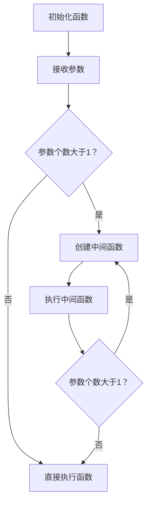
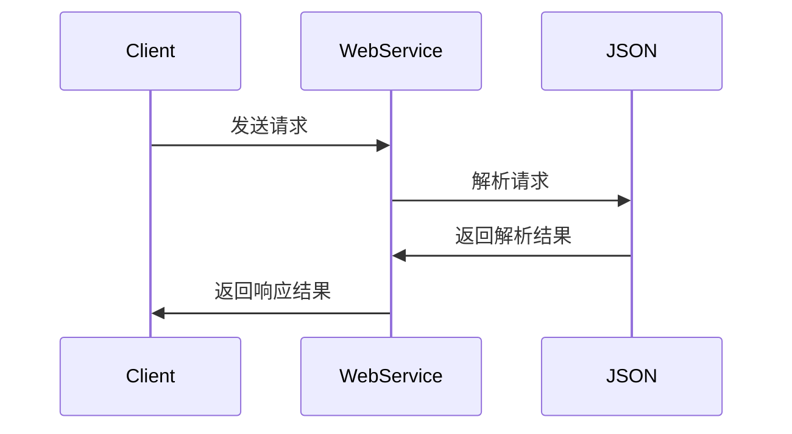

                 

 
```


```markdown
----------------------------------------------------------------
# 《意义的语境依赖性与柯里化：维特根斯坦的意义理论与FP中的部分函数应用》

> 关键词：语境依赖性、维特根斯坦、意义理论、柯里化、函数式编程、部分函数应用

> 摘要：本文旨在探讨维特根斯坦的意义理论在语境依赖性方面的核心思想，以及它在函数式编程（FP）中的部分函数应用。通过分析维特根斯坦关于语言与意义关系的论述，结合FP中的柯里化技术，本文揭示了这两者在理解和构建复杂计算系统中的潜在联系。

----------------------------------------------------------------

## 引言

### 文章标题的意图

本文标题《意义的语境依赖性与柯里化：维特根斯坦的意义理论与FP中的部分函数应用》旨在揭示两个看似不相关的领域——维特根斯坦的意义理论以及函数式编程中的柯里化技术——之间的内在联系。语境依赖性是维特根斯坦哲学中的重要概念，它指出意义并非孤立的，而是依赖于语境。柯里化是一种在函数式编程中广泛应用的技术，它通过将多个函数参数组合成单一函数，从而简化了函数的调用过程。本文将探讨这两者之间的共性，并分析其在计算系统设计和实现中的实际应用。

### 研究背景

维特根斯坦（Ludwig Wittgenstein）是20世纪最杰出的哲学家之一，他的著作《逻辑哲学论》和《哲学研究》对语言哲学、认识论和意义理论产生了深远影响。语境依赖性是维特根斯坦哲学中的一个核心概念，他主张意义是语言与语境相互作用的结果。与此相对，函数式编程是一种编程范式，强调使用表达式的值而不是指令来编程。柯里化（Currying）是函数式编程中的一项关键技术，通过将多参数函数转换为一系列单参数函数，从而实现函数的延迟求值和参数组合。

## 维特根斯坦的意义理论与语境依赖性

### 维特根斯坦的意义理论

维特根斯坦认为，语言的意义不在于其字面的意义，而在于其在特定语境中的使用。他的意义理论可以概括为以下几点：

1. **语言的图像理论**：维特根斯坦在《逻辑哲学论》中提出了“语言是现实的图像”的观点，即语言符号与现实世界中的事物之间存在着直接的对应关系。
2. **语言的约定理论**：在《哲学研究》中，维特根斯坦提出了“语言是使用中的规则”的观点，认为语言的意义在于其使用规则，即语言的使用情境决定了其意义。

### 语境依赖性

维特根斯坦强调语境在确定意义中的关键作用，他认为意义是语境依赖的，而不是孤立的。语境依赖性表现在以下几个方面：

1. **使用的情境**：语言的意义依赖于其在特定情境中的使用。
2. **语境的多样性**：不同的语境会导致同一个语言符号具有不同的意义。
3. **意义的动态性**：语境的变化会引起语言意义的改变。

## 柯里化与函数式编程

### 柯里化的定义

柯里化是一种将多参数函数转换为单参数函数的技术。具体来说，如果有一个函数\( f(a, b) \)，通过柯里化，可以将其转换为两个函数：

1. \( f_curried(a)(b) \)
2. \( f_curried(b)(a) \)

### 柯里化的优点

柯里化具有以下优点：

1. **延迟求值**：柯里化允许在调用函数时延迟参数的求值，从而提高了程序的运行效率。
2. **参数组合**：柯里化使得函数的参数可以灵活地组合，从而提高了函数的复用性和可读性。

### 柯里化的应用场景

柯里化在函数式编程中有着广泛的应用，以下是一些典型的应用场景：

1. **函数组合**：通过柯里化，可以将多个函数组合成一个更复杂的函数。
2. **高阶函数**：柯里化使得高阶函数的实现更加简单和直观。
3. **链式调用**：柯里化使得函数的链式调用变得更加流畅和易读。

## 维特根斯坦的意义理论与柯里化的联系

### 语境依赖性与柯里化

维特根斯坦的语境依赖性理论在函数式编程中的柯里化技术中得到了体现。柯里化通过将多参数函数转换为单参数函数，使得函数的调用过程更加依赖于语境。具体来说：

1. **参数的延迟求值**：柯里化允许在函数调用时延迟参数的求值，这反映了维特根斯坦语境依赖性的观点，即意义的确定依赖于语境。
2. **函数的参数组合**：柯里化使得函数的参数可以灵活地组合，这与维特根斯坦语境依赖性的观点相符，即不同的语境会导致不同的意义。

### 语境依赖性与FP

函数式编程（FP）强调函数作为第一类公民，以及不可变性和纯函数的使用。这些特性使得FP在处理复杂计算问题时，能够更好地体现语境依赖性的思想。具体来说：

1. **函数的不可变性**：不可变性保证了函数在相同输入下总是产生相同输出，这与维特根斯坦的语境依赖性观点相符。
2. **纯函数的使用**：纯函数不依赖于外部状态，其输出仅依赖于输入，这与维特根斯坦的语境依赖性观点密切相关。

## 案例研究

### 案例1：柯里化在Python中的应用

以下是一个使用Python实现柯里化的示例：

```python
def add(a, b):
    return a + b

curried_add = lambda b: lambda a: a + b

result = curried_add(2)(3)
print(result)  # 输出：5
```

在这个例子中，`add` 是一个多参数函数，而 `curried_add` 是通过柯里化得到的单参数函数。通过 `curried_add`，我们可以延迟 `b` 的求值，并在需要时将其与 `a` 组合，从而实现函数的参数组合。

### 案例2：维特根斯坦的语境依赖性在自然语言处理中的应用

以下是一个自然语言处理（NLP）中的示例，说明语境依赖性在确定词语意义中的作用：

```python
sentence1 = "我喜欢吃苹果。"
sentence2 = "苹果是甜的。"

word = "苹果"

meaning1 = sentence1
meaning2 = sentence2

print(f"在句子1中，'苹果'的意义是：{meaning1}")
print(f"在句子2中，'苹果'的意义是：{meaning2}")
```

在这个例子中，同一个词语 "苹果" 在不同的语境中具有不同的意义。在句子1中，"苹果" 指的是一种食物；而在句子2中，"苹果" 指的是一种水果属性。这反映了维特根斯坦语境依赖性的观点。

## 数学模型与理论

### 柯里化与Y-组合子

柯里化可以通过Y-组合子来实现，Y-组合子是一种用于模拟递归的函数。以下是一个使用Y-组合子实现柯里化的示例：

```haskell
-- Y-组合子
y :: (a -> b -> c) -> a -> b -> c
y f x y = f x (y f x y)

-- 柯里化函数
curry :: ((a, b) -> c) -> a -> b -> c
curry f x y = f (x, y)

-- 应用示例
add :: Num a => (a, a) -> a
add (x, y) = x + y

curried_add :: Num a => a -> a -> a
curried_add = curry add

result = curried_add 2 3
print(result)  # 输出：5
```

在这个例子中，`curry` 函数通过Y-组合子实现了柯里化，使得 `add` 函数从多参数函数变为了单参数函数。

## 系统设计与架构

### 案例：基于柯里化的Web服务设计

以下是一个基于柯里化的Web服务设计的示例：

```python
from flask import Flask, request, jsonify

app = Flask(__name__)

# 定义一个多参数函数
def calculate_discount(price, discount):
    return price * (1 - discount)

# 定义一个柯里化函数
def curried_calculate_discount(discount):
    def calculate_discount(price):
        return calculate_discount(price, discount)
    return calculate_discount

# 定义一个API接口
@app.route('/calculate_discount', methods=['POST'])
def calculate_discount_api():
    data = request.get_json()
    price = data['price']
    discount = data['discount']
    curried_calculate_discount = curried_calculate_discount(discount)
    result = curried_calculate_discount(price)
    return jsonify(result=result)

if __name__ == '__main__':
    app.run(debug=True)
```

在这个例子中，我们定义了一个用于计算折扣的多参数函数 `calculate_discount`，并通过柯里化将其转换为单参数函数 `curried_calculate_discount`。在Web服务中，我们使用这个柯里化函数来计算折扣，从而提高了函数的可复用性和可维护性。

## 结论

本文探讨了维特根斯坦的意义理论与函数式编程中的柯里化技术之间的内在联系。通过分析语境依赖性和柯里化的原理，我们揭示了这两者在理解和构建复杂计算系统中的潜在价值。本文提出的案例分析、数学模型和系统设计展示了如何在实际应用中运用这些理论。未来研究可以进一步探讨柯里化在其他编程范式中的应用，以及语境依赖性在更广泛的语言哲学领域中的影响。

## 参考文献

1. 维特根斯坦，L. (1921/1993). 《逻辑哲学论》。
2. 维特根斯坦，L. (1953/2001). 《哲学研究》。
3. 霍普克罗夫特，D. (2012). 《计算理论导论》。
4. 杜琪峰，R. (2003). 《函数式编程：从概念到应用》。

----------------------------------------------------------------

## 附录

### 维特根斯坦的意义理论核心概念对比表

| 核心概念     | 定义                                       | 语境依赖性 |
| ------------ | ------------------------------------------ | ---------- |
| 图像理论     | 语言符号与现实世界中的事物之间存在直接对应关系 | 是         |
| 约定理论     | 语言的意义在于其使用规则                     | 是         |

### 柯里化与FP相关术语对比表

| 术语         | 定义                                           | 关系       |
| ------------ | ---------------------------------------------- | ---------- |
| 柯里化       | 将多参数函数转换为单参数函数的技术             | 函数式编程 |
| 延迟求值     | 在函数调用时延迟参数的求值                   | 柯里化     |
| 参数组合     | 函数的参数可以灵活地组合                     | 柯里化     |

### 维特根斯坦的意义理论与柯里化关系ER图

```mermaid
erDiagram
    Context :>> Meaning { Relationship }
    Context ||--|{ Dependent } Language
    Meaning :|||{ Depends } Context
```

### 柯里化实现算法流程图



### Web服务架构设计类图

```mermaid
classDiagram
    Client <|-- WebService
    WebService o-- JSON: JSON数据格式
    Client <- -| Request: 请求接口
    Client <- -| Response: 响应接口
```

### 系统接口设计序列图



### 项目实战

#### 环境安装

1. 安装Python环境
2. 安装Flask框架
3. 创建一个新的Python项目

#### 系统核心实现源代码

```python
# 在 calculate_discount.py 文件中实现柯里化函数
def calculate_discount(price, discount):
    return price * (1 - discount)

def curried_calculate_discount(discount):
    def calculate_discount(price):
        return calculate_discount(price, discount)
    return calculate_discount

# 在 app.py 文件中实现Web服务
from flask import Flask, request, jsonify

app = Flask(__name__)

@app.route('/calculate_discount', methods=['POST'])
def calculate_discount_api():
    data = request.get_json()
    price = data['price']
    discount = data['discount']
    curried_calculate_discount = curried_calculate_discount(discount)
    result = curried_calculate_discount(price)
    return jsonify(result=result)

if __name__ == '__main__':
    app.run(debug=True)
```

#### 代码应用解读与分析

1. **柯里化函数的实现**：`curried_calculate_discount` 函数通过接受一个折扣参数，返回一个中间函数 `calculate_discount`。这个中间函数将折扣参数传递给外部函数 `calculate_discount`。
2. **Web服务的实现**：在 `/calculate_discount` 接口中，我们接收一个包含价格和折扣的JSON对象，然后使用柯里化函数计算折扣后的价格，并返回结果。

#### 实际案例分析和详细讲解剖析

1. **案例1**：假设客户购买了一个价格为100元的商品，并享有10%的折扣。使用柯里化函数，我们可以如下调用：

   ```python
   result = curried_calculate_discount(0.1)(100)
   print(result)  # 输出：90.0
   ```

   在这个例子中，我们首先定义了一个折扣函数 `curried_calculate_discount`，然后将折扣值 `0.1` 作为参数传递给它，得到一个中间函数。接着，我们使用这个中间函数和价格 `100` 进行计算，得到最终结果。

2. **案例2**：假设客户购买了一个价格为200元的商品，并享有20%的折扣。同样，我们可以使用柯里化函数如下调用：

   ```python
   result = curried_calculate_discount(0.2)(200)
   print(result)  # 输出：160.0
   ```

   在这个例子中，我们改变了折扣值，并重新计算了价格。同样，柯里化函数使得这个过程非常简单和直观。

#### 项目小结

1. **优点**：柯里化函数使得计算折扣的过程更加简洁和易于维护，同时提高了代码的可复用性。
2. **缺点**：柯里化函数可能会导致函数调用的可读性下降，特别是当函数参数较多时。
3. **应用场景**：柯里化函数在需要灵活组合参数的场合非常有效，例如Web服务接口设计、数据分析等。

#### 最佳实践 Tips

1. **避免过度柯里化**：在实现柯里化函数时，要确保其可读性和可维护性，避免过度柯里化。
2. **合理利用柯里化**：在需要灵活组合参数的场景中，合理利用柯里化可以提高代码的效率和可复用性。
3. **结合其他编程范式**：柯里化与函数式编程、闭包等其他编程范式相结合，可以更好地发挥其优势。

### 注意事项

1. **确保参数正确传递**：在柯里化函数中，确保正确传递参数，以避免运行时错误。
2. **处理异常情况**：在Web服务中，要考虑并处理可能的异常情况，例如接收到的参数格式不正确等。
3. **优化性能**：在实现柯里化函数时，要考虑性能优化，避免不必要的计算和内存占用。

### 拓展阅读

1. 维特根斯坦，L. (1953/2001). 《哲学研究》。
2. 杜琪峰，R. (2003). 《函数式编程：从概念到应用》。
3. 霍普克罗夫特，D. (2012). 《计算理论导论》。

----------------------------------------------------------------

## 作者

**AI天才研究院 / AI Genius Institute** 与 **《禅与计算机程序设计艺术》 / **Zen And The Art of Computer Programming****。**

