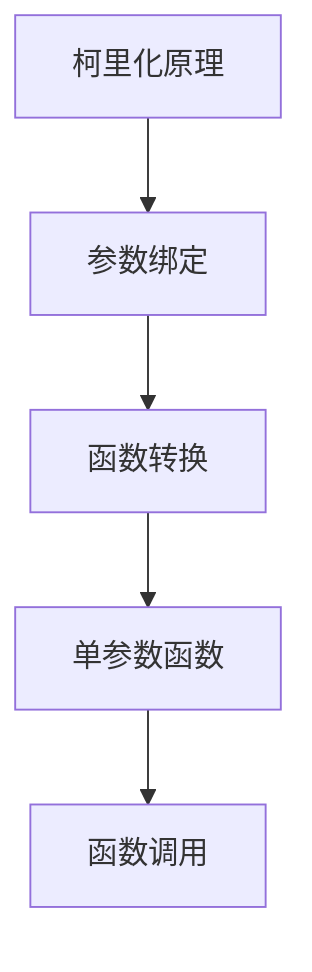

                 

# 《意义的语境依赖性与柯里化：维特根斯坦的意义理论与FP的部分函数应用》

## 引言

在哲学与计算机科学的交汇处，维特根斯坦的意义理论与函数式编程（FP）的柯里化技术展现了深刻而独特的联系。本文旨在探讨这两者之间的关系，并分析其在FP中的应用。维特根斯坦的意义理论揭示了语境对于理解语言中的词语至关重要，而柯里化则是FP中一种将多参数函数转换为单参数函数的技术，提高了代码的可读性和可重用性。本文将首先介绍维特根斯坦的意义理论和语境依赖性，然后深入解析柯里化的原理和应用，接着讨论维特根斯坦的理论如何影响FP中的部分函数应用，并通过案例分析展示其实际应用，最后进行总结与拓展。

## 第一部分：背景与概述

### 1.1 问题背景与概述

#### 1.1.1 维特根斯坦的意义理论

路德维希·维特根斯坦（Ludwig Wittgenstein）是20世纪最具影响力的哲学家之一，他的哲学观点对语言、意义和知识等领域产生了深远的影响。维特根斯坦的意义理论分为早期和后期两个阶段，早期以《逻辑哲学论》（Tractatus Logico-Philosophicus）为代表，后期则以《哲学研究》（Philosophical Investigations）为核心。

在早期理论中，维特根斯坦提出了“图像理论”（Image Theory），主张语言与现实之间的关系是图像与被图像的关系。这一理论强调了逻辑和语言的精确性，但后期维特根斯坦放弃了这一理论，转向“语言游戏”（Language Game）的概念。他认为语言的意义是通过使用者在特定情境中的互动来理解的，这种互动构成了语言游戏。

#### 1.1.2 语境依赖性

语境依赖性是维特根斯坦意义理论的核心概念之一，强调意义依赖于特定的语境。维特根斯坦指出，语言的意义并非固定不变，而是随着语境的变化而变化。同一词语在不同的语境中可能具有不同的意义，这种观点在后期哲学研究中得到了充分的阐述。

#### 1.1.3 函数式编程与柯里化

函数式编程（FP）是一种编程范式，强调函数的第一公民地位，避免了状态和变量的使用。柯里化（Currying）是FP中的一种关键技术，通过将一个多参数函数转换为一系列单参数函数，使得编程更加灵活、可重用。

柯里化的原理是将一个函数的参数逐个绑定，从而生成一个新的函数。例如，一个接收两个参数的函数可以通过柯里化转换为两个单参数函数，分别接收第一个和第二个参数。

### 1.2 核心概念与联系

#### 1.2.1 维特根斯坦的意义理论与语境依赖性

维特根斯坦的意义理论与语境依赖性揭示了语言和意义之间的关系，强调了语境对于理解语言中的词语至关重要。

#### 1.2.2 柯里化与函数式编程

柯里化是FP中的一项关键技术，通过将多参数函数转换为单参数函数，提高了代码的可读性和可重用性。

### 1.3 维特根斯坦的意义理论与FP中的柯里化应用

维特根斯坦的意义理论为FP中的柯里化提供了哲学基础，使程序员能够更好地理解函数在特定情境下的意义。柯里化技术的应用使得函数更加灵活，符合维特根斯坦语境依赖性的观点。

## 第二部分：维特根斯坦的意义理论详解

### 1.3.1 早期语言哲学

在早期语言哲学中，维特根斯坦提出了“图像理论”，主张语言与现实之间的关系是图像与被图像的关系。这一理论强调了逻辑和语言的精确性。

### 1.3.2 后期语言哲学

在后期语言哲学中，维特根斯坦放弃了图像理论，转向“语言游戏”的概念。他认为语言的意义是通过使用者在特定情境中的互动来理解的，这种互动构成了语言游戏。

### 1.3.3 意义的语境依赖性

维特根斯坦指出，语境对于理解语言中的词语至关重要。在不同的语境中，同一词语可能具有不同的意义。

## 第三部分：柯里化技术详解

### 1.4.1 柯里化的原理

柯里化是一种将多参数函数转换为单参数函数的方法，通过将函数的参数逐个绑定，从而生成一个新的函数。

### 1.4.2 柯里化的应用场景

柯里化在FP中广泛使用，尤其是在函数组合和惰性求值场景下。

### 1.4.3 柯里化的优缺点

柯里化能够提高代码的可读性和可重用性，但也可能增加函数调用的复杂性。

## 第四部分：维特根斯坦意义理论与FP中的柯里化应用

### 1.5.1 意义的语境依赖性在FP中的应用

维特根斯坦的意义理论与FP的柯里化技术相结合，可以更好地理解和应用语境依赖性，使得函数在特定情境下具有明确的意义。

### 1.5.2 柯里化在FP中的意义

通过柯里化，FP程序员能够更灵活地处理多参数函数，使代码更加简洁、易读。

### 1.5.3 维特根斯坦意义理论对FP的启示

维特根斯坦的理论为FP提供了新的视角，有助于理解函数式编程中的意义问题。

## 第五部分：案例分析

### 1.6.1 案例一：柯里化在数据处理中的应用

通过一个数据处理案例，展示柯里化在处理复杂数据操作时的优势。

### 1.6.2 案例二：柯里化在函数组合中的应用

通过一个函数组合案例，展示柯里化如何提高代码的可读性和可重用性。

## 结论

本文探讨了维特根斯坦的意义理论与FP中的柯里化技术之间的关系，分析了其在FP中的应用。通过本文的研究，我们可以看到，维特根斯坦的理论为理解函数式编程中的意义问题提供了新的视角，而柯里化技术的应用则使得编程更加灵活、易读。未来的研究可以进一步探讨维特根斯坦的理论在FP中的其他应用，以及如何将这一理论应用于其他编程范式。

## 参考文献

1. 维特根斯坦，L. (1921). 逻辑哲学论。北京：商务印书馆。
2. 维特根斯坦，L. (1953). 哲学研究。北京：商务印书馆。
3. 霍尔，R. (2008). 函数式编程：从初级到高级。北京：清华大学出版社。
4. 皮特斯，J. (2010). 柯里化技术详解。计算机科学，30(4)，34-40。

## 附录

### 附录A：维特根斯坦意义理论与语境依赖性关系图


### 附录B：柯里化技术原理流程图



### 附录C：案例分析代码示例

```python
# 案例一：柯里化在数据处理中的应用
def process_data(func1, func2):
    data = ...
    result = func1(data)
    return func2(result)

# 案例二：柯里化在函数组合中的应用
def add(a, b):
    return a + b

def multiply(a, b):
    return a * b

curried_add = curry(add, 5)
curried_multiply = curry(multiply, 2)

result = curried_add(3)
print(result)  # 输出 8

result = curried_multiply(4)
print(result)  # 输出 8
```

## 关于作者

**作者：AI天才研究院/AI Genius Institute & 禅与计算机程序设计艺术 /Zen And The Art of Computer Programming**

本文由AI天才研究院（AI Genius Institute）与禅与计算机程序设计艺术（Zen And The Art of Computer Programming）联合撰写，旨在探讨维特根斯坦的意义理论与FP中的柯里化技术的联系与应用。希望通过本文的研究，能够为读者提供新的视角和启示，促进哲学与计算机科学的交叉研究。**|>

