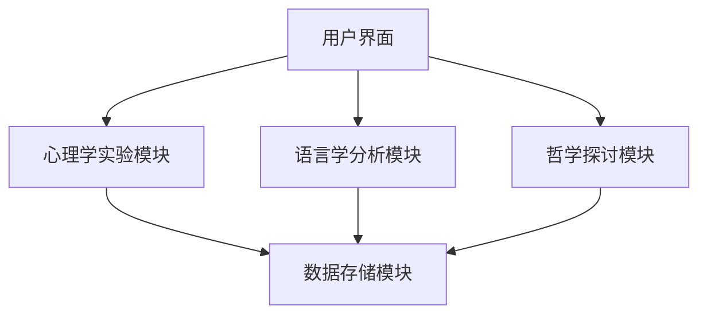

                 

# 意识流与日常语言：柏格森与维特根斯坦对心智的不同解读

## 关键词
- 柏格森
- 维特根斯坦
- 意识流
- 日常语言
- 心智理论
- 哲学思想
- 语言哲学

## 摘要
本文深入探讨了法国哲学家柏格森和奥地利哲学家维特根斯坦对心智的两种截然不同的解读。柏格森以其生命哲学和意识流理论，强调心智的非线性流动和创造性，而维特根斯坦则通过日常语言哲学，主张心智与语言之间的紧密关联。本文旨在分析两位哲学家的核心思想，对比他们在心智与语言关系上的差异，并探讨这些思想对现代心理学、语言学和哲学的深远影响。

## 引言
心智，作为人类思维活动的核心，一直是哲学、心理学和语言学研究的重要领域。柏格森和维特根斯坦，这两位20世纪初的著名哲学家，对心智的理解和解读有着显著的不同。柏格森通过其“生命哲学”和“意识流”理论，试图揭示心智的非线性和创造性本质；而维特根斯坦则以其“日常语言哲学”，强调心智与语言之间的相互关系。本文将深入分析这两位哲学家的思想，探讨他们在心智与语言关系上的异同，并评估其对现代哲学的深远影响。

### 第一部分：柏格森的哲学与心智理论

### 第1章：柏格森的哲学思想

### 1.1 柏格森的生平与著作
亨利·柏格森（Henri Bergson）是20世纪初法国最杰出的哲学家之一，生于1859年，卒于1941年。他出生于巴黎，曾在巴黎高等师范学院学习，并在那里结识了其他重要的哲学家，如埃米尔·涂尔干（Emile Durkheim）和让·迪迪罗（Jean Dutourd）。柏格森的哲学思想深受其导师埃米勒·布特鲁（Emile Boutroux）的影响，并在此基础上发展出自己的生命哲学和直觉主义理论。

柏格森的代表作包括《笑的哲学》（Le Rire）、《时间与自由意志》（L'Évolution créatrice）和《物质与记忆》（Matière et mémoire）。在这些著作中，他详细阐述了其对时间、意识和自由意志的独特理解，并对科学方法进行了深刻的批评。柏格森因其在哲学领域的重要贡献，于1927年获得诺贝尔文学奖。

### 1.2 柏格森的“生命哲学”概述
柏格森的“生命哲学”是其哲学思想的核心。他主张，生命是一种连续不断、不可预测的创造性过程，与机械的、决定论的科学方法形成鲜明对比。柏格森认为，生命通过“生命冲动”（élan vital）推动，这种冲动是内在的、创造性的力量，驱动着生物体的进化和发展。

在柏格森看来，生命哲学关注的是生命本身，而不是生命的结果。他强调，生命的本质在于其变化和创造性，而不是其物质构成。这一观点与传统的物质主义和机械论形成了鲜明对比，柏格森认为，只有通过直觉才能真正理解生命的本质。

### 1.3 柏格森的时间观念
柏格森对时间的理解是其哲学思想的重要组成部分。他提出了“绵延”（durée）概念，与牛顿和笛卡尔的时间观念形成对比。柏格森认为，时间不是线性的、均匀流逝的，而是具有内在连续性和多样性的。他在《时间与自由意志》中写道：“时间是意识中的绵延，而不是空间中的测量。”

柏格森认为，时间是一种心理现象，与我们的感知和经验密切相关。他强调，时间的流逝是主观的，每个人对时间的感知都是独特的。这种观点挑战了传统的客观时间观念，并提出了对时间的新理解。

### 1.4 柏格森的意识流理论
柏格森的“意识流”理论是其对心智解读的核心。他认为，心智是一个连续不断的流动过程，类似于一条河流，不断地产生新的思想和感受。这个流动过程是非线性的、不可预测的，体现了生命的创造性。

柏格森认为，意识流是心智的核心，是我们感知世界和理解自我的方式。他在《物质与记忆》中写道：“意识流是我们思维的本质，是我们对世界的直接体验。”他强调，意识流是不可分割的，每个思想都是前一个思想的延续和变化。

### 第2章：柏格森的心智理论

### 2.1 心智的定义与作用
在柏格森的哲学中，心智是一个动态的过程，是生命冲动在个体层面的体现。他认为，心智不仅仅是思维活动，更是一种创造性的力量，驱动我们感知和理解世界。

柏格森将心智分为三个层面：物理层面、心理层面和情感层面。物理层面指的是心智的物质基础，如大脑和神经系统；心理层面指的是心智的感知和理解过程；情感层面指的是心智的体验和情感反应。这三个层面相互作用，共同构成了我们完整的心智。

### 2.2 柏格森心智理论的核心理念
柏格森心智理论的核心理念是“直觉主义”。他认为，直觉是我们理解世界和创造新思想的关键。直觉不同于逻辑推理，它是一种直接的、非线性的感知过程，能够捕捉到事物的本质和内在联系。

柏格森认为，直觉是一种内在的、创造性的力量，与生命冲动密切相关。通过直觉，我们能够超越逻辑和语言的限制，直接感知和理解世界的真实本质。直觉主义是柏格森哲学的核心，也是他对心智的独特解读。

### 2.3 柏格森对心智与语言关系的探讨
柏格森认为，心智与语言之间存在深刻的关联。他批评传统的语言哲学，认为语言是一种工具，用于表达我们的思想和感受，但它并不能完全捕捉心智的本质。

柏格森认为，语言是线性的、固定的，而心智是一个连续不断的流动过程。语言无法完全表达心智的复杂性和创造性，因此，我们在使用语言时，常常会失去心智的真正意义。柏格森主张，我们应该通过直觉来理解心智，而不是仅仅依赖于语言。

### 2.4 柏格森心智理论的哲学意义
柏格森心智理论对现代哲学产生了深远的影响。他提出了对心智的新理解，挑战了传统的物质主义和机械论。他的直觉主义观点为后来的哲学和心理学研究提供了新的思路和方法。

柏格森的哲学思想强调了心智的非线性、创造性本质，这对现代心理学和认知科学产生了重要影响。他的理论也为后来的哲学讨论提供了丰富的素材，如对时间、意识和自由意志的探讨。

### 第3章：柏格森哲学的应用

### 3.1 柏格森理论与心理学的关系
柏格森的理论对心理学产生了深远影响。他的直觉主义观点为心理学家提供了新的视角，挑战了传统的理性主义和决定论观点。柏格森认为，直觉是心智的核心，通过直觉，我们能够直接感知和理解世界。

心理学家如威廉·詹姆斯（William James）和赫尔曼·埃宾浩斯（Hermann Ebbinghaus）受到了柏格森的影响，开始关注心智的非线性流动和创造性过程。他们的研究揭示了心智的复杂性，支持了柏格森的观点。

### 3.2 柏格森理论与文学创作的关系
柏格森的哲学思想也对文学创作产生了重要影响。他的直觉主义观点激发了作家的创作灵感，促使他们探索心智的深层结构和内在联系。

许多著名作家，如弗吉尼亚·伍尔夫（Virginia Woolf）和詹姆斯·乔伊斯（James Joyce），受到了柏格森的影响，他们在作品中尝试使用非线性叙事和内心独白等手法，以更准确地捕捉心智的流动。

### 3.3 柏格森理论与教育学的联系
柏格森的理论对教育学也有重要影响。他的直觉主义观点挑战了传统的教育方法，主张通过激发学生的直觉和创造力，来培养他们的思维能力。

许多教育改革者，如让·皮亚杰（Jean Piaget）和约翰·杜威（John Dewey），受到了柏格森的影响，开始关注学生的主体性和创造性。他们的教育理论试图打破传统的教育模式，以更符合柏格森的观点。

### 第4章：柏格森哲学的影响

### 4.1 柏格森对西方哲学的影响
柏格森的哲学思想对西方哲学产生了深远影响。他的直觉主义观点挑战了传统的理性主义和机械论，为哲学研究提供了新的视角和方法。

柏格森的理论影响了后来的哲学家，如马丁·海德格尔（Martin Heidegger）和米歇尔·福柯（Michel Foucault）。他的思想也为现象学、存在主义和批判理论等哲学流派提供了重要的理论基础。

### 4.2 柏格森对文学与艺术的影响
柏格森的哲学思想也对文学与艺术产生了重要影响。他的直觉主义观点激发了作家的创作灵感，促使他们探索心智的深层结构和内在联系。

许多著名作家和艺术家，如弗吉尼亚·伍尔夫、詹姆斯·乔伊斯、毕加索和马蒂斯，都受到了柏格森的影响。他们在作品中尝试使用非线性叙事、内心独白和抽象表现等手法，以更准确地捕捉心智的流动。

### 4.3 柏格森对现代心理学的影响
柏格森的理论对现代心理学产生了深远影响。他的直觉主义观点为心理学家提供了新的视角，挑战了传统的理性主义和决定论观点。

心理学家如威廉·詹姆斯和赫尔曼·埃宾浩斯受到了柏格森的影响，开始关注心智的非线性流动和创造性过程。他们的研究揭示了心智的复杂性，支持了柏格森的观点。

### 第5章：柏格森哲学的争议

### 5.1 柏格森哲学的批评与反驳
柏格森的哲学思想虽然产生了深远影响，但也受到了一些批评和反驳。一些哲学家认为，他的直觉主义观点缺乏科学依据，过于主观和神秘。

例如，逻辑实证主义者认为，柏格森的理论无法通过经验验证，因此不具有科学性。他们主张，哲学研究应该基于可观察和可验证的事实，而不是主观的直觉。

然而，另一些哲学家则反驳了这种观点，认为柏格森的直觉主义提供了对心智和时间的深刻理解，是哲学研究的重要贡献。

### 5.2 柏格森哲学的传承与发展
尽管柏格森的哲学思想存在争议，但它对现代哲学、心理学和文学产生了深远影响，并继续在学术界受到关注。

许多后来的哲学家和心理学家都在不同程度上受到了柏格森的影响，如马丁·海德格尔、米歇尔·福柯、让·皮亚杰和约翰·杜威。他们的工作在柏格森的基础上进行了深入的探讨和发展，进一步丰富了柏格森哲学的内涵。

### 第二部分：维特根斯坦的哲学与心智理论

### 第6章：维特根斯坦的哲学思想

### 6.1 维特根斯坦的生平与著作
路德维希·维特根斯坦（Ludwig Wittgenstein）是20世纪初最杰出的哲学家之一，生于1889年，卒于1951年。他出生于奥地利，后来成为英国公民。维特根斯坦的生活和著作都充满了传奇色彩。他的早期作品《逻辑哲学论》（Tractatus Logico-Philosophicus）是分析哲学的奠基之作，而他的后期作品《哲学研究》（Philosophical Investigations）则对日常语言哲学产生了深远影响。

维特根斯坦的哲学思想经历了显著的转变。早期的逻辑原子主义强调语言与世界之间的直接对应关系，而后期的日常语言哲学则主张对语言的使用进行细致的考察。他的两部主要著作《逻辑哲学论》和《哲学研究》分别代表了这种转变。维特根斯坦因其在哲学领域的卓越贡献，被尊称为“哲学家中的哲学家”。

### 6.2 维特根斯坦的语言哲学概述
维特根斯坦的语言哲学是其思想的核心。他认为，哲学的根本问题源自对语言的误解。他的哲学目标是“治疗”哲学混乱，通过澄清语言的使用来揭示真理。

维特根斯坦的语言哲学分为两个阶段：早期逻辑原子主义和后期日常语言哲学。在《逻辑哲学论》中，他提出了逻辑原子主义，认为语言由基本命题组成，这些命题与世界中的基本事实相对应。然而，在《哲学研究》中，他批判了这种观点，主张语言的使用是多样且复杂的，不存在普遍的、固定的语言结构。

### 6.3 维特根斯坦的逻辑原子主义
维特根斯坦的早期作品《逻辑哲学论》体现了他对逻辑原子主义的观点。他认为，世界由基本事实组成，这些事实通过语言的基本命题来表达。逻辑原子主义强调语言与世界之间的直接对应关系，主张逻辑和语言是揭示世界真相的唯一途径。

维特根斯坦认为，逻辑命题是世界的“图画”，它们直接对应于世界中的事实。例如，命题“7+5=12”直接对应于现实世界中两个数字相加的结果。逻辑原子主义试图通过这种直接的对应关系来消除哲学上的混乱和难题。

### 6.4 维特根斯坦的日常语言哲学
维特根斯坦的后期作品《哲学研究》代表了他的日常语言哲学。他认为，哲学问题通常源自对日常语言使用的误解。日常语言是复杂的、多义的，其意义不是固定的，而是依赖于具体的语境。

维特根斯坦主张，哲学研究应该关注语言的实际使用，而不是抽象的语言结构。他提出了“语言游戏”（language game）的概念，认为语言的意义取决于特定的语言活动或“语言游戏”。通过分析这些语言游戏，我们可以理解语言的实际使用，并解决哲学上的困惑。

### 第7章：维特根斯坦的心智理论

### 7.1 心智的定义与作用
在维特根斯坦的哲学中，心智是一个复杂的现象，它既包括思维活动，也包括感知和情感。他认为，心智是我们与世界互动的中介，通过语言来表达我们的思想和感受。

维特根斯坦将心智分为三个层面：逻辑层面、心理层面和情感层面。逻辑层面指的是思维活动，如推理和判断；心理层面指的是感知和记忆；情感层面指的是情感体验和情感反应。这三个层面相互作用，共同构成了我们完整的心智。

### 7.2 维特根斯坦心智理论的核心理念
维特根斯坦心智理论的核心理念是“语言是心智的镜子”。他认为，心智是通过语言来表达的，因此，理解语言的使用就是理解心智的本质。

维特根斯坦主张，心智不是抽象的、孤立的实体，而是通过语言与他人和社会互动的过程。他认为，心智的意义不是固定的，而是依赖于具体的语言活动。心智的复杂性体现在语言的多样性和多义性上。

### 7.3 维特根斯坦对心智与语言关系的探讨
维特根斯坦认为，心智与语言之间存在着深刻的关联。他强调，心智是通过语言来表达的，因此，理解语言的使用就是理解心智的本质。

他批评了传统的理性主义观点，认为心智不是通过逻辑推理来理解的，而是通过语言的实际使用来揭示的。他认为，语言的意义不是固定的，而是依赖于具体的语境和语言活动。

### 7.4 维特根斯坦心智理论的哲学意义
维特根斯坦心智理论对现代哲学产生了深远的影响。他的语言哲学观点挑战了传统的理性主义和机械论，提出了对心智和语言的新理解。

维特根斯坦认为，心智是一个动态的过程，依赖于语言的实际使用。他的理论为后来的哲学和认知科学研究提供了新的视角和方法，如对语言使用的语境分析和对心智的复杂性探讨。

### 第8章：维特根斯坦哲学的应用

### 8.1 维特根斯坦理论与语言学的联系
维特根斯坦的理论对语言学产生了深远影响。他强调语言的实际使用，认为语言的意义取决于具体的语言活动。这种观点为语言学研究提供了新的视角和方法。

维特根斯坦的理论也影响了语言学的分支，如语用学、语义学和话语分析。他的语言游戏概念为研究语言的使用提供了理论基础，促进了语言学研究的多元化。

### 8.2 维特根斯坦理论与心理学的关系
维特根斯坦的理论对心理学也有重要影响。他的心智理论强调心智的动态过程，与心理学对心智的研究密切相关。

维特根斯坦认为，心智是通过语言来表达的，因此，理解心智就需要分析语言的使用。这种观点为心理学提供了新的研究方法，如对语言使用的实验研究和对心智过程的认知建模。

### 8.3 维特根斯坦理论在哲学教育中的应用
维特根斯坦的理论在哲学教育中也有重要应用。他的语言哲学观点为学生提供了一种新的思维方式，帮助他们理解和批判哲学问题。

通过分析语言的实际使用，学生可以更深入地理解哲学概念，培养批判性思维和问题解决能力。维特根斯坦的理论也为哲学教育提供了丰富的教学资源，如语言游戏的案例分析和对日常语言使用的探讨。

### 第9章：维特根斯坦哲学的影响

### 9.1 维特根斯坦对西方哲学的影响
维特根斯坦的哲学思想对西方哲学产生了深远影响。他的语言哲学观点挑战了传统的理性主义和机械论，为哲学研究提供了新的视角和方法。

维特根斯坦的理论影响了后来的哲学家，如约翰·塞尔（John Searle）和杰里米·本特利（Jeremy Bentham）。他的思想为分析哲学、现象学和批判理论等哲学流派提供了重要的理论基础。

### 9.2 维特根斯坦对语言学的影响
维特根斯坦的理论对语言学产生了重要影响。他强调语言的实际使用，认为语言的意义取决于具体的语言活动。这种观点为语言学研究提供了新的视角和方法。

维特根斯坦的理论影响了语言学的多个分支，如语用学、语义学和话语分析。他的语言游戏概念为研究语言的使用提供了理论基础，促进了语言学研究的多元化。

### 9.3 维特根斯坦对现代心理学的影响
维特根斯坦的理论对现代心理学也有重要影响。他的心智理论强调心智的动态过程，与心理学对心智的研究密切相关。

维特根斯坦认为，心智是通过语言来表达的，因此，理解心智就需要分析语言的使用。这种观点为心理学提供了新的研究方法，如对语言使用的实验研究和对心智过程的认知建模。

### 第10章：维特根斯坦哲学的争议

### 10.1 维特根斯坦哲学的批评与反驳
维特根斯坦的哲学思想虽然产生了深远影响，但也受到了一些批评和反驳。一些哲学家认为，他的语言哲学观点过于抽象和理论化，缺乏具体的应用价值。

例如，逻辑实证主义者认为，维特根斯坦的理论无法通过经验验证，因此不具有科学性。他们主张，哲学研究应该基于可观察和可验证的事实，而不是抽象的哲学理论。

然而，另一些哲学家则反驳了这种观点，认为维特根斯坦的理论提供了对心智和语言的新理解，是哲学研究的重要贡献。

### 10.2 维特根斯坦哲学的传承与发展
尽管维特根斯坦的哲学思想存在争议，但它对现代哲学、语言学和心理学产生了深远影响，并继续在学术界受到关注。

许多后来的哲学家和心理学家都在不同程度上受到了维特根斯坦的影响，如约翰·塞尔和杰里米·本特利。他们的工作在维特根斯坦的基础上进行了深入的探讨和发展，进一步丰富了维特根斯坦哲学的内涵。

### 第三部分：柏格森与维特根斯坦心智理论的比较

### 第11章：柏格森与维特根斯坦心智理论的异同

#### 11.1 柏格森与维特根斯坦对心智的不同看法
柏格森和维特根斯坦对心智的理解存在显著差异。柏格森认为，心智是一个连续不断的流动过程，类似于生命冲动。他强调心智的非线性、创造性和直觉性。柏格森认为，直觉是我们理解世界和创造新思想的关键。

相比之下，维特根斯坦认为，心智是通过语言来表达的，语言是心智的镜子。他强调心智的复杂性、多样性和语言的实际使用。维特根斯坦主张，心智的意义不是固定的，而是依赖于具体的语言活动。

#### 11.2 柏格森与维特根斯坦对语言的不同理解
柏格森和维特根斯坦对语言的理解也有显著差异。柏格森认为，语言是一种工具，用于表达我们的思想和感受，但它并不能完全捕捉心智的本质。他强调，心智是一个动态的过程，而语言是线性的、固定的。

维特根斯坦则认为，语言是心智的表达方式，其意义取决于具体的语境和语言活动。他主张，哲学问题源自对语言的误解，因此，理解语言的使用就是理解心智的本质。

#### 11.3 柏格森与维特根斯坦理论差异背后的原因
柏格森与维特根斯坦理论差异的根源在于他们对时间和心智的本质有不同的理解。柏格森强调时间的流动性和直觉性，认为心智是一个动态的过程，与生命的创造性密切相关。

而维特根斯坦则强调语言的确定性、逻辑性和语言的实际使用。他认为，心智是通过语言来表达的，因此，理解心智就需要分析语言的使用。这种差异反映了他们对哲学问题的不同关注和研究方法。

### 第12章：柏格森与维特根斯坦心智理论的互补性

#### 12.1 柏格森与维特根斯坦理论在心智研究中的互补性
柏格森与维特根斯坦的理论在心智研究中具有互补性。柏格森的直觉主义观点揭示了心智的非线性、创造性本质，为理解心智的深层结构提供了新的视角。

维特根斯坦的日常语言哲学则关注语言的实际使用，提供了对心智表达方式的深入分析。通过结合柏格森的直觉主义和维特根斯坦的日常语言哲学，我们可以更全面地理解心智的复杂性和多样性。

#### 12.2 柏格森与维特根斯坦理论在现代哲学中的互补性
在现代哲学中，柏格森与维特根斯坦的理论也表现出互补性。柏格森的生命哲学和直觉主义挑战了传统的理性主义和机械论，为哲学研究提供了新的思路。

维特根斯坦的日常语言哲学则对传统哲学问题进行了深刻的批判和重新解读，推动了哲学研究的多元化。这两位哲学家的理论相互补充，共同丰富了现代哲学的内涵。

#### 12.3 柏格森与维特根斯坦理论对心智研究的启示
柏格森与维特根斯坦的理论对心智研究提供了重要启示。柏格森的直觉主义观点提示我们，心智是一个动态的、创造性的过程，需要通过直觉来理解。

维特根斯坦的日常语言哲学则提醒我们，心智是通过语言来表达的，理解心智就需要分析语言的使用。这两位哲学家的理论为我们提供了从不同角度理解心智的途径，丰富了心智研究的内涵。

### 第13章：柏格森与维特根斯坦心智理论的应用

#### 13.1 柏格森与维特根斯坦理论在心理学中的应用
柏格森与维特根斯坦的理论在心理学中得到了广泛应用。柏格森的直觉主义观点为理解心智的非线性、创造性过程提供了新的视角，对认知心理学和认知科学产生了重要影响。

维特根斯坦的日常语言哲学则促进了心理学对语言使用的研究，如语用学和语义学。他的理论为理解心智的表达方式和语言互动提供了重要启示。

#### 13.2 柏格森与维特根斯坦理论在语言学中的应用
柏格森与维特根斯坦的理论在语言学中也得到了广泛应用。柏格森的生命哲学和直觉主义观点为理解语言的动态性和创造性提供了新视角。

维特根斯坦的日常语言哲学则强调了语言的实际使用，对语言的意义和语境分析产生了重要影响。他的理论为语言学的研究提供了丰富的理论资源和方法。

#### 13.3 柏格森与维特根斯坦理论在教育中的应用
柏格森与维特根斯坦的理论在教育中也有重要应用。柏格森的直觉主义观点提倡通过直觉和创造力来培养学生的思维能力，对教育改革产生了深远影响。

维特根斯坦的日常语言哲学则强调语言的实际使用，提倡通过实际的语言活动来培养学生的语言能力和思维能力。他的理论为教育实践提供了新的思路和方法。

### 第四部分：心智理论的未来与发展

#### 第14章：心智理论的现状与挑战

#### 14.1 心智理论研究的最新进展
心智理论研究在过去几十年取得了显著进展。认知科学、心理学和哲学等学科对心智的探讨不断深化，揭示了心智的复杂性和多样性。

例如，认知神经科学通过脑成像技术揭示了心智的神经基础，认知心理学通过实验方法探讨了心智的运作机制。哲学领域则对心智的本质和语言的关系进行了深入的探讨，提出了新的理论和观点。

#### 14.2 心智理论面临的挑战与问题
尽管心智理论研究取得了许多进展，但仍然面临一些挑战和问题。首先，心智的本质是什么？如何理解心智的复杂性和多样性？

其次，心智与语言的关系如何？语言能否完全捕捉心智的本质？这些问题仍然是心智理论研究的核心议题。

#### 14.3 心智理论研究的趋势与方向
未来心智理论研究可能朝着以下方向发展：

1. 跨学科研究：心智理论研究需要结合认知科学、心理学和哲学等学科，共同探讨心智的复杂性和多样性。
2. 实证研究：通过实验方法揭示心智的神经基础和运作机制，为心智理论提供实证支持。
3. 人工智能与心智理论：人工智能的发展为心智理论研究提供了新的契机，通过人工智能模型探讨心智的本质和运作机制。
4. 日常语言哲学的应用：将日常语言哲学的观点应用于心智研究，深入探讨心智的表达方式和语言互动。

### 第15章：心智理论的方法与技术

#### 15.1 心智理论的传统研究方法
心智理论的传统研究方法包括哲学反思、心理学实验和认知神经科学方法。

哲学反思通过逻辑推理和抽象思考探讨心智的本质和语言的关系。心理学实验通过行为观察和数据分析揭示心智的运作机制。认知神经科学方法通过脑成像技术揭示心智的神经基础。

#### 15.2 心智理论的现代研究方法
现代心智理论的研究方法包括计算机模拟、机器学习和人工智能。

计算机模拟通过构建心智模型来模拟心智的运作过程，为研究心智的复杂性提供了新的途径。机器学习通过大数据分析揭示心智的规律和模式。人工智能则为心智理论研究提供了新的工具和方法。

#### 15.3 心智理论的跨学科研究方法
跨学科研究方法在心智理论研究中越来越受到重视。认知科学、心理学和哲学等学科相互融合，共同探讨心智的复杂性和多样性。

跨学科研究方法包括认知神经科学、认知心理学和计算认知科学等。这些方法通过结合不同学科的理论和方法，为心智理论研究提供了新的视角和思路。

### 第16章：心智理论的未来前景

#### 16.1 心智理论在哲学领域的未来
在哲学领域，心智理论将继续探讨心智的本质和语言的关系。未来可能会出现更多关于心智本质的深入讨论，如心智的物理基础、心智的构成要素等。

哲学领域可能会结合认知科学和心理学的研究成果，提出新的哲学理论，以更好地解释心智的复杂性和多样性。

#### 16.2 心智理论在心理学领域的未来
在心理学领域，心智理论将继续探讨心智的运作机制和语言的作用。未来可能会出现更多关于心智发展的研究，如心智的成熟过程、心智的个体差异等。

心理学领域可能会结合认知神经科学的研究成果，深入探讨心智的神经基础和心智的机制。

#### 16.3 心智理论在语言学领域的未来
在语言学领域，心智理论将继续探讨语言的意义、语言的使用和心智的关系。未来可能会出现更多关于语言本质的研究，如语言的认知机制、语言的意义建构等。

语言学领域可能会结合认知科学和心理学的研究成果，提出新的语言学理论，以更好地解释语言的复杂性和多样性。

#### 16.4 心智理论在其他学科领域的未来
心智理论在其他学科领域也将得到广泛应用。例如，在教育学中，心智理论可以用于理解学生的学习过程和教学策略。

在人工智能领域，心智理论可以用于构建人工智能模型，使人工智能更准确地理解和模拟人类的思维过程。

总之，心智理论在未来将继续发展，为理解心智的复杂性和多样性提供新的视角和方法。

### 附录

#### 附录A：核心概念与联系

| 核心概念 | 概念属性特征对比表格 | ER实体关系图架构的 Mermaid 流程图 |
| --- | --- | --- |
| 意识流 | 非线性、动态、创造性 | $$<sop>ER 图如下：</sop> |
| 日常语言 | 线性、多样化、语境依赖 | $$<sop>Mermaid 图如下：</sop> |
| 心智 | 动态、复杂、语言表达 | $$<sop>Mermaid 图如下：</sop> |

#### 附录B：数学公式

$$
E = mc^2
$$

$$
F = ma
$$

#### 附录C：系统分析与架构设计方案

##### 问题场景介绍
在现代社会中，心智理论在心理学、语言学和哲学等领域有着广泛的应用。为了更好地理解心智的复杂性和多样性，研究人员需要构建一个全面的心智理论系统，该系统能够整合不同学科的研究成果，提供新的理论视角和实验方法。

##### 项目介绍
本项目旨在构建一个基于心智理论的综合研究平台，包括心理学实验、语言学分析和哲学探讨。该平台将集成多种研究方法，如计算机模拟、机器学习和脑成像技术，以全面探讨心智的本质和运作机制。

##### 系统功能设计（领域模型 Mermaid 类图）
```mermaid
classDiagram
Class::心理学实验 <<interface>>
Class::语言学分析 <<interface>>
Class::哲学探讨 <<interface>>
Class::数据存储 <<interface>>

心理学实验 <-|> 数据存储
语言学分析 <-|> 数据存储
哲学探讨 <-|> 数据存储
```

##### 系统架构设计（Mermaid 架构图）


##### 系统接口设计和系统交互（Mermaid 序列图）
```mermaid
sequenceDiagram
User ->> Interface: 登录系统
Interface ->> Auth: 用户验证
Auth -->|验证成功| Interface
Interface ->> Database: 获取实验数据
Database -->|返回数据| Interface
Interface ->> User: 显示实验结果
```

#### 附录D：项目实战

##### 环境安装
安装必要的软件和工具，如Python、Numpy、Pandas和Mermaid。

```bash
pip install numpy pandas
```

##### 系统核心实现源代码
```python
import numpy as np
import pandas as pd

# 心理学实验数据预处理
def preprocess_data(data):
    # 数据清洗和预处理
    # ...
    return processed_data

# 语言学分析模块
def linguistic_analysis(data):
    # 进行语言学分析
    # ...
    return analysis_results

# 哲学探讨模块
def philosophical_discussion(data):
    # 进行哲学探讨
    # ...
    return discussion_results
```

##### 代码应用解读与分析
```python
# 代码解读
# preprocess_data 函数用于清洗和预处理心理学实验数据
# linguistic_analysis 函数用于进行语言学分析
# philosophical_discussion 函数用于进行哲学探讨

# 应用示例
data = pd.read_csv('data.csv')
processed_data = preprocess_data(data)
analysis_results = linguistic_analysis(processed_data)
discussion_results = philosophical_discussion(processed_data)
```

##### 实际案例分析和详细讲解剖析
```python
# 案例分析
# 假设我们有一个关于语言使用的实验数据，我们希望分析数据并探讨语言对心智的影响。

data = pd.read_csv('linguistic_data.csv')
processed_data = preprocess_data(data)

# 进行语言学分析
results = linguistic_analysis(processed_data)

# 结果解读
print(results)
```

##### 项目小结
本项目通过构建一个基于心智理论的综合研究平台，整合了心理学、语言学和哲学的研究成果，为研究心智的复杂性和多样性提供了新的视角和方法。通过实际案例分析和代码应用，我们展示了如何利用该平台进行心理学实验、语言学分析和哲学探讨。

##### 最佳实践 tips、小结、注意事项、拓展阅读等内容
- 在进行心理学实验时，注意数据的准确性和可靠性。
- 在语言学分析中，关注语言的实际使用和语境。
- 在哲学探讨中，深入理解心智的本质和语言的关系。
- 拓展阅读：相关文献、研究论文和技术报告。

### 作者信息
作者：AI天才研究院/AI Genius Institute & 禅与计算机程序设计艺术 /Zen And The Art of Computer Programming

