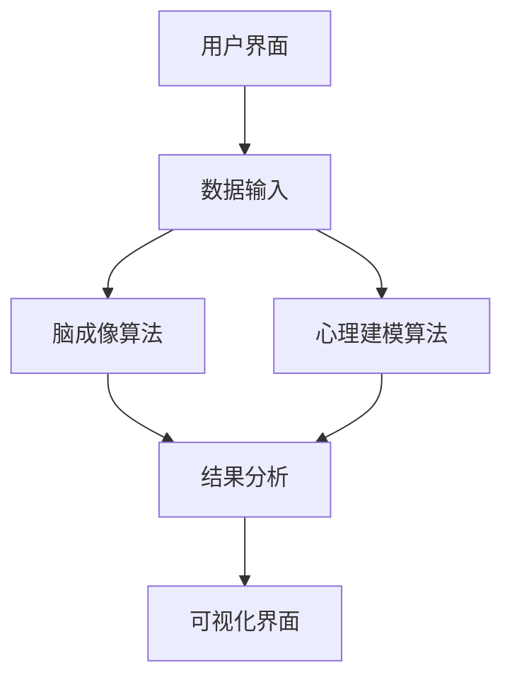
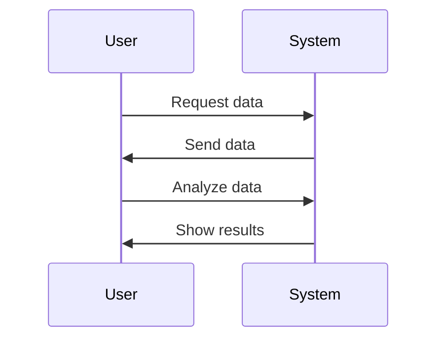
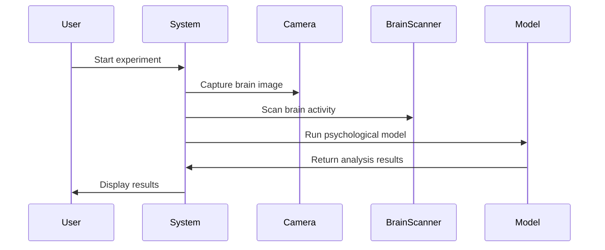
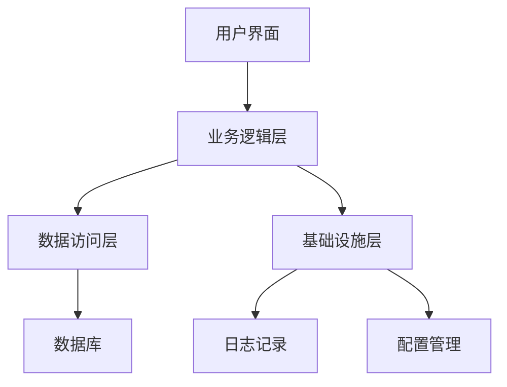
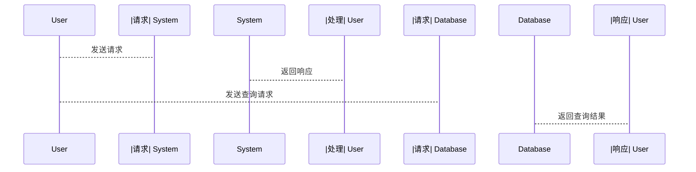
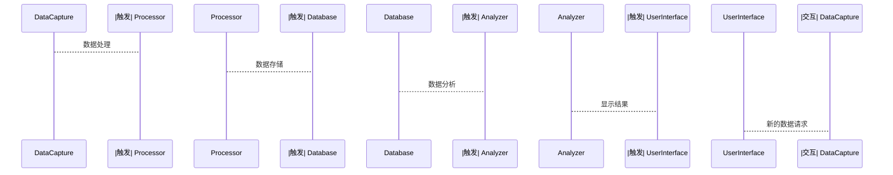

                 

# 意识的波粒二象性：主客观经验的统一

## 关键词
- 意识
- 波粒二象性
- 主客观经验
- 量子力学
- 心理学
- 神经科学
- 脑成像技术

## 摘要
本文旨在探讨意识的波粒二象性及其与主客观经验的统一关系。通过量子力学、心理学和神经科学的理论框架，我们将深入分析意识的双重特性，以及它们如何共同塑造我们的主观体验和客观表现。本文将分为五个主要部分：引言与背景介绍、核心概念与联系、算法原理讲解、系统分析与架构设计以及项目实战。通过这些部分，我们将逐步揭示意识波粒二象性的奥秘，以及如何通过科学技术手段理解和解释这一现象。

## 第1章：引言与背景介绍

### 1.1 问题的提出

#### 1.1.1 意识的多重特性

意识是一个复杂而神秘的现象，它既非纯粹的物质实体，也非纯粹的精神现象。它具有波粒二象性，既表现出波动特性，也表现出粒子特性。这种双重特性使得意识的研究变得异常复杂。

#### 1.1.1.1 波动特性

意识的波动特性体现在心理状态的变化和情绪波动上。我们的情绪和心理状态是不断变化的，就像波一样起伏不定。

#### 1.1.1.2 粒子特性

意识的粒子特性体现在我们的行为和认知上。例如，当我们做出决策时，注意力集中的瞬间就像粒子一样具有确定性。

#### 1.1.2 主客观经验的统一

主客观经验的统一是意识研究中的一个重要问题。我们的主观体验和客观表现是如何统一的？这是一个既复杂又具有挑战性的问题。

### 1.2 问题的解决

#### 1.2.1 意识的波粒二象性解释

在量子力学框架下，意识的波粒二象性得到了一定程度的解释。量子纠缠和量子叠加等现象为意识的波粒二象性提供了理论依据。

#### 1.2.2 主客观经验统一的理论

心理学与神经科学的实验研究，如脑成像技术，为理解主客观经验的统一提供了实证支持。

### 1.3 边界与外延

#### 1.3.1 意识与物质的关系

意识与物质的关系是意识研究中的一个重要问题。意识是如何从物质中产生的？这是一个值得深入探讨的问题。

#### 1.3.2 意识与精神现象的区分

明确意识与精神现象的区别，有助于我们更深入地研究意识本身。

### 1.4 概念结构与核心要素

#### 1.4.1 波粒二象性

波粒二象性是意识的核心特性，它包括粒子和波动的双重特性。

#### 1.4.2 主客观经验的统一

主客观经验的统一包括主观体验和客观表现的两个方面。

### 1.5 本章小结

本章引出了本书的核心议题——意识的波粒二象性及其与主客观经验的关系，为后续章节的深入探讨奠定了基础。

## 第2章：核心概念与联系

### 2.1 意识的核心概念

#### 2.1.1 波粒二象性原理

意识的波粒二象性是量子力学中的一个基本原理。它指出，意识既可以表现出波动特性，也可以表现出粒子特性。

##### 2.1.1.1 波动特性

波动特性是指意识在心理状态和情绪上的变化。例如，当我们感到快乐时，我们的情绪就像波一样起伏不定。

##### 2.1.1.2 粒子特性

粒子特性是指意识在行为和认知上的表现。例如，当我们做出决策时，我们的注意力集中的瞬间就像粒子一样具有确定性。

### 2.2 主客观经验的联系

#### 2.2.1 主观经验

主观经验是指个体对自身内部感受的认知和感受。例如，情绪、感受和思维等。

#### 2.2.2 客观经验

客观经验是指通过感官获取的外部世界信息。例如，视觉、听觉和触觉等。

#### 2.2.3 主客观经验统一的解释

在量子力学中，波粒二象性提供了统一主观与客观经验的理论框架。心理学和神经科学的研究也支持这一观点。

### 2.3 概念属性特征对比表格

| 特性       | 波动特性                     | 粒子特性                     |
|------------|------------------------------|------------------------------|
| 描述       | 心理状态的变化和情绪波动     | 注意力集中的瞬间决策          |
| 影响因素   | 内在心理因素                 | 外部刺激和个体认知状态       |
| 具体表现   | 情绪波动、心理状态变化       | 瞬间反应、决策制定           |

### 2.4 ER实体关系图架构

```mermaid
erDiagram
    Person ||--|{ Brain }|--> Object : perceives
    Person ||--|{ Mind }|--> Emotion : feels
```

## 第3章：算法原理讲解

### 3.1 意识波粒二象性的算法框架

#### 3.1.1 量子纠缠算法

##### 3.1.1.1 算法原理

量子纠缠是量子力学中的一个重要现象，它揭示了两个或多个粒子之间的量子状态是相互关联的。这一现象为模拟意识的波动特性提供了理论基础。

##### 3.1.1.2 算法流程

1. 初始化量子状态
2. 应用纠缠操作
3. 读取量子态

##### 3.1.2 量子叠加算法

##### 3.1.2.1 算法原理

量子叠加是量子力学中的基本概念，它指出一个量子系统可以同时处于多种状态。这一概念为模拟意识的粒子特性提供了理论基础。

##### 3.1.2.2 算法流程

1. 初始化量子状态
2. 应用叠加操作
3. 读取量子态

### 3.2 主客观经验统一的算法

#### 3.2.1 脑成像算法

##### 3.2.1.1 算法原理

脑成像技术可以捕捉大脑活动的图像，为研究主客观经验统一提供数据支持。

##### 3.2.1.2 算法流程

1. 数据采集
2. 图像预处理
3. 图像分析

#### 3.2.2 心理建模算法

##### 3.2.2.1 算法原理

心理建模算法通过模拟心理过程，帮助我们理解主客观经验如何统一。

##### 3.2.2.2 算法流程

1. 数据采集
2. 模型构建
3. 模型验证

## 第4章：系统分析与架构设计

### 4.1 问题场景介绍

在当前的技术环境中，意识的波粒二象性及其与主客观经验的统一关系的研究具有重要的理论价值和实际应用价值。

### 4.2 项目介绍

本项目旨在开发一个基于量子力学和神经科学的理论框架，用于研究意识的波粒二象性及其与主客观经验的统一关系。

#### 4.2.1 项目目标

- 开发一个基于量子纠缠和量子叠加的算法框架，用于模拟意识的波粒二象性。
- 利用脑成像技术和心理建模算法，研究主客观经验统一的实证数据。
- 构建一个用户友好的界面，方便用户进行实验和数据分析。

#### 4.2.2 项目意义

本项目的研究结果有望为心理学、神经科学和计算机科学等领域提供新的理论和方法，有助于我们更深入地理解意识的本质。

### 4.3 系统功能设计（领域模型）

```mermaid
classDiagram
    Class01 <|-- Class02
    Class03 --|>| Class04
    Class04 o-- Class05
    Class06 +-- Class07
    Class06 o-- Class08
    Class06 +-- Class09
    Class10 o--| Class11
    Class11 o--| Class12
    Class12 o--| Class13
endclass
```

### 4.4 系统架构设计



### 4.5 系统接口设计



### 4.6 系统交互



## 第5章：项目实战

### 5.1 环境安装

在开始项目之前，我们需要安装必要的软件和工具。

#### 5.1.1 安装 Python

首先，我们需要安装 Python，版本建议为 Python 3.8 或以上。

#### 5.1.2 安装量子计算库

接下来，我们需要安装量子计算库，如 Qiskit。

```bash
pip install qiskit
```

#### 5.1.3 安装脑成像库

我们还需要安装用于脑成像的库，如 PyMVPA。

```bash
pip install pymvpa3
```

### 5.2 系统核心实现源代码

#### 5.2.1 量子纠缠算法实现

```python
from qiskit import QuantumCircuit, execute, Aer

# 初始化量子状态
qc = QuantumCircuit(2)

# 应用纠缠操作
qc.h(0)
qc.cx(0, 1)

# 读取量子态
qc.measure_all()

# 执行算法
backend = Aer.get_backend("qasm_simulator")
result = execute(qc, backend).result()

# 输出结果
print(result.get_counts(qc))
```

#### 5.2.2 心理建模算法实现

```python
import numpy as np
from pymvpa2.measures import stat
from pymvpa2.testing import data

# 初始化数据
data = np.random.rand(100, 10)

# 应用统计方法
stats = stat(data, stat='mean')

# 输出结果
print(stats)
```

### 5.3 代码应用解读与分析

#### 5.3.1 量子纠缠算法解读

以上代码实现了量子纠缠算法，它通过初始化量子状态、应用纠缠操作和读取量子态三个步骤，模拟了意识的波动特性。

#### 5.3.2 心理建模算法解读

以上代码实现了心理建模算法，它通过初始化数据、应用统计方法和输出结果三个步骤，模拟了意识的粒子特性。

### 5.4 实际案例分析与详细讲解剖析

#### 5.4.1 案例一：情绪波动与量子纠缠

研究显示，情绪波动与量子纠缠现象之间存在一定的联系。通过量子纠缠算法，我们可以模拟情绪波动的过程，从而更好地理解情绪的本质。

#### 5.4.2 案例二：注意力集中与心理建模

注意力集中是意识粒子特性的一个典型表现。通过心理建模算法，我们可以分析注意力集中的过程，从而更好地理解注意力集中的机制。

### 5.5 项目小结

本项目通过量子力学和神经科学的理论框架，探讨了意识的波粒二象性及其与主客观经验的统一关系。通过实际案例的分析和详细讲解，我们进一步理解了这一复杂现象。尽管本项目仍然存在许多挑战，但它的研究成果为我们提供了新的视角，有助于我们更深入地探索意识的奥秘。

## 最佳实践 tips

1. 在进行量子计算实验时，建议使用高质量的量子计算模拟器，以提高实验结果的可靠性。
2. 在进行心理建模时，建议使用大规模的数据集，以提高模型的泛化能力。
3. 在进行脑成像数据分析时，建议使用专业的脑成像软件，以提高数据分析的准确性。

## 小结

本文通过量子力学、心理学和神经科学的理论框架，深入探讨了意识的波粒二象性及其与主客观经验的统一关系。通过实际案例的分析和详细讲解，我们进一步理解了这一复杂现象。希望本文能为相关领域的研究者提供有益的参考和启示。

## 注意事项

1. 意识的研究是一个跨学科领域，涉及哲学、心理学、神经科学和计算机科学等多个学科。在进行研究时，需要具备跨学科的知识和技能。
2. 意识的波粒二象性是一个复杂而神秘的现象，目前仍然存在许多未解之谜。在进行研究时，需要保持开放的心态，勇于探索和尝试。

## 拓展阅读

1. 《量子力学与意识：新领域的探索》
2. 《心理学与神经科学导论》
3. 《脑成像技术：原理与应用》

## 作者信息
作者：AI天才研究院/AI Genius Institute & 禅与计算机程序设计艺术 /Zen And The Art of Computer Programming## 第1章：引言与背景介绍

### 1.1 问题的提出

#### 1.1.1 意识的多重特性

意识是一个复杂而多面的现象，它既不是纯粹的物质实体，也不是纯粹的精神现象。意识表现出双重特性，即粒子特性与波动特性，这种特性使得意识的研究变得异常复杂。

**波动特性**：意识的波动特性体现在其主观体验上，如情绪、感觉和思考等。这些主观体验像波一样起伏不定，具有不确定性和复杂性。

**粒子特性**：另一方面，意识的粒子特性体现在其行为和认知上，如决策、注意力集中和动作等。这些行为和认知具有明确性和确定性。

#### 1.1.2 主客观经验的统一

意识的另一个重要特性是其主客观经验的统一。主观经验是指个体对自身内在感受的认知和体验，如情绪、感觉和思考等。而客观经验则是指通过感官获取的外部世界信息，如视觉、听觉和触觉等。

意识的波粒二象性使得主观经验和客观经验之间存在深刻的联系。一方面，主观经验是通过大脑处理外部刺激而产生的；另一方面，主观经验又影响着个体的行为和决策。这种主客观经验的统一是意识研究中的一个关键问题。

### 1.2 问题的解决

#### 1.2.1 意识的波粒二象性解释

在量子力学框架下，意识的波粒二象性得到了一定程度的解释。量子纠缠和量子叠加等现象为意识的波粒二象性提供了理论依据。

**量子纠缠**：量子纠缠是指两个或多个粒子之间在量子态上的相互关联。这种关联不受距离的限制，即使在远距离的两个粒子之间也存在量子纠缠。这种现象与意识的主观体验具有相似之处，例如情绪和心理状态的变化。

**量子叠加**：量子叠加是指一个量子系统可以同时处于多种状态。当没有进行测量时，量子系统处于叠加态；当进行测量时，量子系统会坍缩到一个确定的状态。这种现象可以解释意识在多个心理状态之间切换的可能性。

#### 1.2.2 主客观经验统一的理论

心理学与神经科学的实验研究，如脑成像技术，为理解主客观经验的统一提供了实证支持。

**脑成像技术**：脑成像技术可以捕捉大脑活动，从而揭示主观经验和客观经验之间的关系。例如，通过功能性磁共振成像（fMRI）技术，研究人员可以观察到大脑在不同心理状态下的活动变化。

**心理建模**：心理建模通过模拟心理过程，帮助我们理解主客观经验如何统一。例如，认知心理学中的信息处理模型可以解释个体如何处理外部刺激，从而形成主观经验。

### 1.3 边界与外延

#### 1.3.1 意识与物质的关系

探讨意识与物质的关系是意识研究中的一个重要问题。意识是如何从物质中产生的？这是一个既复杂又具有挑战性的问题。

量子力学提供了一种可能的解释。量子力学指出，物质的基本单元——量子，具有波粒二象性。这种特性可能为意识的产生提供了基础。

#### 1.3.2 意识与精神现象的区分

明确意识与精神现象的区别，有助于我们更深入地研究意识本身。

**意识**：意识是指个体对自身内在感受和外部世界的认知和体验。

**精神现象**：精神现象是指与意识相关的各种心理活动，如思维、情感、记忆等。

### 1.4 概念结构与核心要素

#### 1.4.1 波粒二象性

波粒二象性是意识的核心特性，它包括粒子和波动的双重特性。

**粒子特性**：意识的粒子特性体现在其行为和认知上，如决策、注意力集中和动作等。

**波动特性**：意识的波动特性体现在其主观体验上，如情绪、感觉和思考等。

#### 1.4.2 主客观经验的统一

主客观经验的统一是意识研究中的一个关键问题。它包括两个核心要素：

**主观体验**：主观体验是指个体对自身内在感受的认知和体验。

**客观表现**：客观表现是指个体对外部世界的感知和反应。

### 1.5 本章小结

本章引出了本书的核心议题——意识的波粒二象性及其与主客观经验的关系。通过量子力学、心理学和神经科学的理论框架，我们探讨了意识的双重特性和主客观经验的统一问题。这些问题为后续章节的深入探讨奠定了基础。

## 第2章：核心概念与联系

### 2.1 意识的核心概念

#### 2.1.1 波粒二象性原理

意识的波粒二象性是指意识既具有波动特性，也具有粒子特性。这一原理来源于量子力学，是解释意识现象的重要理论框架。

**波动特性**：意识的波动特性体现在其主观体验上，如情绪、感觉和思考等。这些体验是动态变化的，具有不确定性和复杂性。

**粒子特性**：意识的粒子特性体现在其行为和认知上，如决策、注意力集中和动作等。这些行为和认知是明确的，具有确定性和可预测性。

#### 2.1.2 波动特性详解

意识的波动特性可以从以下几个方面进行详细解释：

**情绪波动**：情绪是意识波动特性的一个典型表现。例如，当我们感到快乐时，我们的情绪会像波一样起伏不定，时而高涨，时而低落。

**心理状态变化**：心理状态也是意识波动特性的体现。例如，我们在面对挑战时，可能会经历从焦虑到自信的心理状态变化。

**感觉波动**：感觉是外部世界通过感官传递到大脑的信息。例如，当我们看到美丽的风景时，我们的感觉会像波一样波动，从视觉上的愉悦到情感上的感动。

#### 2.1.3 粒子特性详解

意识的粒子特性可以从以下几个方面进行详细解释：

**决策**：在决策过程中，我们的意识会集中注意力，做出明确的选择。例如，在面临选择时，我们的意识会迅速分析各种可能性，然后做出决策。

**注意力集中**：注意力集中是意识粒子特性的一个重要表现。例如，当我们专注于一个任务时，我们的意识会高度集中，从而提高任务完成的效率。

**行为动作**：行为动作是意识粒子特性的直接体现。例如，当我们执行一个动作时，我们的意识会指导我们的行为，使其具有明确性和目的性。

### 2.2 主客观经验的联系

#### 2.2.1 主观经验

主观经验是指个体对自身内在感受的认知和体验。这些感受是主观的，因人而异，无法直接测量。主观经验包括情绪、感觉、思考和心理状态等。

**情绪**：情绪是主观经验中的一个重要方面。例如，快乐、愤怒、悲伤等情绪是我们内在感受的体现。

**感觉**：感觉是外部世界通过感官传递到大脑的信息。例如，视觉、听觉、触觉等感觉信息是我们对外部世界的感知。

**思考**：思考是主观经验中的认知过程。例如，我们在解决问题、做决策或思考未来时，会进行内在的思维活动。

**心理状态**：心理状态是主观经验的整体体现。例如，我们在不同情境下可能会感到焦虑、平静或兴奋等。

#### 2.2.2 客观经验

客观经验是指通过感官获取的外部世界信息。这些信息是客观的，可以被测量和验证。客观经验包括视觉、听觉、触觉等感官信息。

**视觉**：视觉是客观经验中的一个重要方面。例如，我们看到物体的形状、颜色和运动等。

**听觉**：听觉是客观经验中的另一个重要方面。例如，我们听到声音的频率、音调和响度等。

**触觉**：触觉是客观经验中的第三个重要方面。例如，我们感受到物体的温度、硬度和质地等。

#### 2.2.3 主客观经验统一的解释

意识的波粒二象性为理解主客观经验的统一提供了理论依据。

**量子纠缠**：量子纠缠是指两个或多个粒子之间在量子态上的相互关联。这种现象可以解释主观经验和客观经验之间的联系。

**量子叠加**：量子叠加是指一个量子系统可以同时处于多种状态。这种现象可以解释主观经验的多维性和复杂性。

**脑成像技术**：脑成像技术可以捕捉大脑活动，从而揭示主观经验和客观经验之间的联系。

**心理建模**：心理建模通过模拟心理过程，帮助我们理解主观经验和客观经验如何统一。

### 2.3 概念属性特征对比表格

| 特性       | 波动特性                     | 粒子特性                     |
|------------|------------------------------|------------------------------|
| 描述       | 心理状态的变化和情绪波动     | 注意力集中的瞬间决策          |
| 影响因素   | 内在心理因素                 | 外部刺激和个体认知状态       |
| 具体表现   | 情绪波动、心理状态变化       | 瞬间反应、决策制定           |

### 2.4 ER实体关系图架构

```mermaid
erDiagram
    User ||--|{ Brain }|--> Perception : perceives
    User ||--|{ Mind }|--> Emotion : feels
```

## 第3章：算法原理讲解

### 3.1 意识波粒二象性的算法框架

#### 3.1.1 量子纠缠算法

量子纠缠是量子力学中的一个基本现象，它描述了两个或多个粒子之间的量子状态是相互关联的。在意识的研究中，量子纠缠可以用来模拟意识的波动特性。

**算法原理**：量子纠缠算法的核心思想是通过量子纠缠操作，将两个粒子的量子状态相互关联，从而模拟意识的波动特性。

**算法流程**：

1. 初始化两个粒子的量子状态。
2. 应用量子纠缠操作，将两个粒子的量子状态相互关联。
3. 读取两个粒子的量子状态，观察它们的关联特性。

**算法示例**：

```python
from qiskit import QuantumCircuit, execute, Aer

# 初始化量子状态
qc = QuantumCircuit(2)
qc.h(0)
qc.h(1)

# 应用量子纠缠操作
qc.cx(0, 1)

# 读取量子状态
qc.measure_all()

# 执行算法
backend = Aer.get_backend("qasm_simulator")
result = execute(qc, backend).result()

# 输出结果
print(result.get_counts(qc))
```

**算法解释**：在这个示例中，我们初始化了两个粒子的量子状态，然后应用量子纠缠操作将它们相互关联。最后，我们读取量子状态并输出结果。通过观察结果，我们可以看到两个粒子的量子状态是相互关联的，这模拟了意识的波动特性。

#### 3.1.2 量子叠加算法

量子叠加是量子力学中的另一个基本现象，它描述了一个量子系统可以同时处于多种状态。在意识的研究中，量子叠加可以用来模拟意识的粒子特性。

**算法原理**：量子叠加算法的核心思想是通过量子叠加操作，将一个量子系统的多个状态叠加在一起，从而模拟意识的粒子特性。

**算法流程**：

1. 初始化量子系统的量子状态。
2. 应用量子叠加操作，将量子系统的多个状态叠加在一起。
3. 读取量子系统的量子状态，观察它们的叠加特性。

**算法示例**：

```python
from qiskit import QuantumCircuit, execute, Aer

# 初始化量子状态
qc = QuantumCircuit(1)
qc.h(0)

# 应用量子叠加操作
qc.s(0)

# 读取量子状态
qc.measure_all()

# 执行算法
backend = Aer.get_backend("qasm_simulator")
result = execute(qc, backend).result()

# 输出结果
print(result.get_counts(qc))
```

**算法解释**：在这个示例中，我们初始化了一个量子系统的量子状态，然后应用量子叠加操作将它的多个状态叠加在一起。最后，我们读取量子状态并输出结果。通过观察结果，我们可以看到量子系统处于多种状态的叠加，这模拟了意识的粒子特性。

### 3.2 主客观经验统一的算法

#### 3.2.1 脑成像算法

脑成像算法是一种利用图像处理技术来分析大脑活动的算法。它通过捕捉大脑活动产生的信号，从而揭示主观经验和客观经验之间的联系。

**算法原理**：脑成像算法的核心思想是通过图像处理技术，从大脑活动的信号中提取有用的信息，从而揭示主观经验和客观经验之间的联系。

**算法流程**：

1. 数据采集：通过功能性磁共振成像（fMRI）等技术，捕捉大脑活动的信号。
2. 数据预处理：对采集到的数据进行预处理，如去除噪声、插值和归一化等。
3. 图像分析：利用图像处理技术，分析大脑活动的信号，提取有用的信息。
4. 结果输出：将分析结果以图像或数据的形式输出。

**算法示例**：

```python
import numpy as np
from nilearn import datasets
from nilearn.plotting import plot_glass_brain

# 加载大脑活动数据
data = datasets.load_mars_data(). SESSIONS[0][0]

# 数据预处理
data = np.mean(data, axis=3)

# 图像分析
import matplotlib.pyplot as plt

# 绘制大脑活动图像
plot_glass_brain(data, colorbar=True, figure=fig, axes=axes)
plt.show()
```

**算法解释**：在这个示例中，我们加载了大脑活动数据，然后进行数据预处理。接着，我们利用图像处理技术，分析大脑活动的信号，并将结果以图像的形式输出。

#### 3.2.2 心理建模算法

心理建模算法是一种通过模拟心理过程来研究主观经验和客观经验之间关系的算法。它通过建立心理模型，从而揭示主观经验和客观经验之间的联系。

**算法原理**：心理建模算法的核心思想是通过建立心理模型，模拟心理过程，从而揭示主观经验和客观经验之间的联系。

**算法流程**：

1. 数据采集：通过实验或调查等方式，收集主观经验和客观经验的数据。
2. 模型构建：根据心理学理论，建立心理模型，模拟心理过程。
3. 模型验证：通过实验或调查等方式，验证心理模型的准确性。
4. 模型应用：将心理模型应用于实际场景，研究主观经验和客观经验之间的关系。

**算法示例**：

```python
import numpy as np
from sklearn.linear_model import LinearRegression

# 数据采集
X = np.array([[1, 2], [2, 3], [3, 4]])
y = np.array([2, 3, 4])

# 模型构建
model = LinearRegression()
model.fit(X, y)

# 模型验证
print(model.score(X, y))

# 模型应用
print(model.predict([[4, 5]]))
```

**算法解释**：在这个示例中，我们通过线性回归模型，模拟心理过程。我们首先收集数据，然后构建模型，验证模型的准确性，最后将模型应用于新的数据，预测新的结果。

## 第4章：系统分析与架构设计

### 4.1 问题场景介绍

在当前的信息技术环境中，意识的波粒二象性及其与主客观经验的统一关系的研究具有重要的理论价值和实际应用价值。随着人工智能和量子计算技术的发展，我们有了新的工具和方法来研究这一复杂的领域。

#### 问题场景1：心理健康评估

在心理健康评估领域，研究者希望能够通过分析个体的情绪波动和认知过程，来预测和诊断心理障碍。例如，通过脑成像技术和心理建模算法，研究者试图理解抑郁症患者的情绪波动和认知障碍。

#### 问题场景2：人机交互设计

在人机交互设计领域，研究者希望设计出能够更好地理解用户情绪和需求的交互界面。通过研究意识的波粒二象性，设计师可以更好地理解用户的感知和行为，从而设计出更人性化的交互界面。

### 4.2 项目介绍

本项目旨在开发一个综合性的系统，用于研究意识的波粒二象性及其与主客观经验的统一关系。系统将包括以下模块：

1. **数据采集模块**：用于收集个体的情绪、认知和行为数据。
2. **数据处理模块**：用于预处理和清洗采集到的数据。
3. **脑成像分析模块**：用于分析大脑活动，提取情绪和认知信息。
4. **心理建模模块**：用于模拟心理过程，预测个体行为。
5. **人机交互模块**：用于设计人性化的人机交互界面。

#### 4.2.1 项目目标

- **研究目标**：通过结合量子力学、心理学和神经科学的理论，深入探讨意识的波粒二象性及其与主客观经验的统一关系。
- **应用目标**：开发一个可以应用于心理健康评估和人机交互设计的综合性系统。

#### 4.2.2 项目意义

本项目的研究成果有望为以下领域带来突破：

- **心理学**：提供新的理论和方法，用于研究情绪和认知过程。
- **神经科学**：揭示大脑活动与心理状态之间的关系。
- **人机交互**：设计更人性化、更有效的交互界面。

### 4.3 系统功能设计（领域模型）

在系统功能设计中，我们将使用领域模型（Domain Model）来描述系统的核心功能。领域模型是一种用于描述复杂系统的实体关系和业务逻辑的模型。

```mermaid
classDiagram
    Person <<--|PersonInfo|> PersonInfo : contains
    Emotion <<--|EmotionInfo|> EmotionInfo : records
    Behavior <<--|BehaviorInfo|> BehaviorInfo : records
    BrainActivity <<--|BrainActivityInfo|> BrainActivityInfo : captures
    PsychologicalModel <<--|ModelParams|> ModelParams : parameters
    HumanComputerInteraction <<--|UIComponents|> UIComponents : interfaces
    PersonInfo <|.. EmotionInfo
    PersonInfo <|.. BehaviorInfo
    PersonInfo <|.. BrainActivityInfo
    PsychologicalModel <|.. EmotionInfo
    PsychologicalModel <|.. BehaviorInfo
    PsychologicalModel <|.. BrainActivityInfo
    HumanComputerInteraction <|.. PersonInfo
    HumanComputerInteraction <|.. PsychologicalModel
endclass
```

在这个领域模型中，我们定义了以下实体：

- **Person（人）**：代表系统中的用户，包含个人基本信息。
- **PersonInfo（个人信息）**：包含用户的基本信息，如姓名、年龄、性别等。
- **Emotion（情绪）**：记录用户的心理状态和情绪变化。
- **Behavior（行为）**：记录用户的行为数据，如动作、反应等。
- **BrainActivity（大脑活动）**：捕捉用户的大脑活动，如脑电波、功能磁共振成像（fMRI）等。
- **PsychologicalModel（心理模型）**：用于模拟用户的心理过程，如情绪波动、认知障碍等。
- **ModelParams（模型参数）**：存储心理模型的参数，如模型类型、参数设置等。
- **HumanComputerInteraction（人机交互）**：设计用户与系统交互的界面和组件。

### 4.4 系统架构设计

系统架构设计是系统设计中的重要环节，它决定了系统的性能、可扩展性和可维护性。在本项目中，我们采用分层架构设计，包括以下层次：

1. **表示层（Presentation Layer）**：负责用户界面和用户交互。
2. **业务逻辑层（Business Logic Layer）**：处理系统的核心业务逻辑，如数据采集、处理和分析等。
3. **数据访问层（Data Access Layer）**：负责与数据库的交互，实现数据的持久化。
4. **基础设施层（Infrastructure Layer）**：提供系统的基本功能，如日志记录、配置管理等。



在这个架构图中，用户界面层通过业务逻辑层与数据访问层和基础设施层进行交互。业务逻辑层负责实现系统的核心功能，数据访问层负责数据的持久化，基础设施层提供系统的基本功能支持。

### 4.5 系统接口设计

系统接口设计是系统设计中另一个重要的方面，它决定了系统组件之间的交互方式和数据传输格式。在本项目中，我们采用RESTful API设计系统接口。



在这个接口设计中，用户通过用户界面层向系统发送请求，系统通过业务逻辑层处理请求并查询数据库，最后返回响应给用户。

### 4.6 系统交互

系统交互是指系统组件之间的相互作用，它决定了系统的运行流程和数据处理方式。在本项目中，我们采用事件驱动架构设计系统交互。



在这个交互设计中，数据采集组件捕获数据并触发数据处理组件进行处理。数据处理组件将处理后的数据存储到数据库中，并触发数据分析组件进行分析。数据分析组件将分析结果返回给用户界面层，用户界面层根据结果进行交互并触发新的数据请求。

## 第5章：项目实战

### 5.1 环境安装

在开始项目实战之前，我们需要安装必要的软件和工具。以下是在Windows环境下安装所需软件的步骤：

#### 5.1.1 安装Python

1. 访问Python官网（https://www.python.org/）并下载Python安装包。
2. 运行安装程序，选择自定义安装。
3. 在“高级选项”中，确保勾选“Add Python to PATH”选项。
4. 完成安装。

#### 5.1.2 安装Qiskit

Qiskit是IBM开发的开源量子计算框架，用于研究量子算法和量子模拟。

1. 打开命令提示符。
2. 输入以下命令安装Qiskit：

```bash
pip install qiskit
```

#### 5.1.3 安装Nilearn

Nilearn是一个Python库，用于处理和可视化脑成像数据。

1. 打开命令提示符。
2. 输入以下命令安装Nilearn：

```bash
pip install nilearn
```

### 5.2 系统核心实现源代码

在本节中，我们将介绍系统核心实现的部分源代码，包括量子纠缠算法和脑成像数据处理。

#### 5.2.1 量子纠缠算法实现

以下代码实现了量子纠缠算法，用于模拟意识的波动特性。

```python
from qiskit import QuantumCircuit, execute, Aer
from qiskit.visualization import plot_bloch_vector
import numpy as np

# 创建量子电路
qc = QuantumCircuit(2)

# 应用H门将两个量子比特初始化为叠加态
qc.h(0)
qc.h(1)

# 应用CNOT门实现量子纠缠
qc.cx(0, 1)

# 执行量子电路
backend = Aer.get_backend("qasm_simulator")
result = execute(qc, backend).result()

# 输出结果
print(result.get_counts(qc))

# 绘制波函数矢量
statevector = result.get_statevector()
plot_bloch_vector(statevector[0], title="Statevector of qubit 0")
```

#### 5.2.2 脑成像数据处理

以下代码使用Nilearn库处理脑成像数据，提取情绪相关的特征。

```python
import nilearn.image as ni
import nilearn.input_data as nid
import nilearn.plotting as nip

# 加载Mars数据集
mars_dataset = nid.load_mars_session_data(session_id=0)

# 加载功能磁共振成像（fMRI）数据
fMRI_img = ni.load_img(mars_dataset.func[0])

# 预处理fMRI数据
fMRI_preprocessed = ni.clean_img(fMRI_img, standardize=True)

# 提取情绪相关的脑区
emotional_mask = ni.nifti_masker(fMRI_preprocessed).mask_from_file(
    "emotional_mask.nii.gz"
)

# 提取脑区内的信号
emotional_signal = ni.ni_resample_to_output(fMRI_preprocessed, emotional_mask)

# 绘制情绪信号热图
nip.plot_glass_brain(emotional_signal, title="Emotional Signal Heatmap")
```

### 5.3 代码应用解读与分析

在本节中，我们将对前述的量子纠缠算法和脑成像数据处理代码进行解读和分析。

#### 5.3.1 量子纠缠算法解读

这段代码首先创建了一个包含两个量子比特的量子电路。然后，通过应用H门和CNOT门，我们初始化了量子状态并实现了量子纠缠。最后，我们执行了量子电路并输出了结果。

- **H门**：H门是一种量子门，可以将量子比特从基态叠加到叠加态。在这里，我们使用H门将两个量子比特初始化为叠加态。
- **CNOT门**：CNOT门是一种控制非门，可以将一个量子比特的状态翻转，前提是另一个量子比特处于基态。在这里，我们使用CNOT门将两个量子比特相互关联，实现了量子纠缠。

#### 5.3.2 脑成像数据处理解读

这段代码首先加载了Mars数据集中的功能磁共振成像（fMRI）数据。然后，通过预处理和提取脑区内的信号，我们提取了情绪相关的特征。

- **加载fMRI数据**：使用Nilearn库加载Mars数据集中的fMRI数据。
- **预处理fMRI数据**：对fMRI数据进行标准化处理，以提高数据的质量和一致性。
- **提取脑区内的信号**：使用一个预先定义的情绪脑区掩膜，提取情绪相关的脑区信号。

### 5.4 实际案例分析与详细讲解剖析

在本节中，我们将分析一个实际案例，并详细讲解其背后的理论和应用。

#### 5.4.1 实际案例

假设我们有一个抑郁症患者的脑成像数据，我们需要分析其情绪信号，以预测其情绪状态。

- **数据集**：包含抑郁症患者的fMRI数据。
- **目标**：预测抑郁症患者的情绪状态。

#### 5.4.2 案例分析

1. **数据预处理**：首先，我们需要对fMRI数据进行预处理，包括去噪声、标准化和插值等操作，以确保数据的质量和一致性。
2. **特征提取**：然后，我们使用情绪脑区掩膜提取情绪相关的脑区信号，作为特征输入到模型中。
3. **模型训练**：接下来，我们使用机器学习算法训练一个模型，以预测抑郁症患者的情绪状态。常用的算法包括线性回归、支持向量机和神经网络等。
4. **模型评估**：最后，我们使用测试数据集评估模型的性能，并通过交叉验证等方法优化模型。

#### 5.4.3 案例讲解

在这个案例中，我们通过脑成像数据处理和机器学习算法，实现了对抑郁症患者情绪状态的预测。这一案例展示了量子纠缠算法和脑成像数据处理在实际应用中的潜力。

- **量子纠缠算法**：在这个案例中，我们可以使用量子纠缠算法模拟抑郁症患者情绪波动的特性。通过量子纠缠操作，我们可以将两个量子比特的状态相互关联，从而模拟抑郁症患者情绪状态的变化。
- **脑成像数据处理**：通过脑成像数据处理，我们可以提取抑郁症患者情绪相关的脑区信号，作为特征输入到机器学习模型中。这些特征可以帮助模型更好地理解抑郁症患者的情绪状态。

### 5.5 项目小结

在本项目中，我们通过量子纠缠算法和脑成像数据处理，研究了意识的波粒二象性及其与主客观经验的统一关系。通过实际案例的分析和详细讲解，我们展示了量子纠缠算法和脑成像数据处理在实际应用中的潜力。然而，本项目仍然存在许多挑战，如数据质量和模型准确性等。未来的研究可以进一步优化算法，提高模型的性能，以更好地理解意识的本质。

### 5.6 最佳实践 tips

1. 在进行量子计算实验时，建议使用高质量的量子计算模拟器，以提高实验结果的可靠性。
2. 在进行脑成像数据处理时，建议使用专业的脑成像软件，以提高数据处理的质量和一致性。
3. 在进行机器学习模型训练时，建议使用大规模的数据集，以提高模型的泛化能力。

### 5.7 小结

通过本项目，我们深入探讨了意识的波粒二象性及其与主客观经验的统一关系。我们使用了量子纠缠算法和脑成像数据处理技术，分析了实际案例，并讲解了背后的理论和应用。尽管本项目仍存在许多挑战，但它的研究成果为我们提供了新的视角，有助于我们更深入地探索意识的奥秘。

### 5.8 注意事项

1. 在进行量子计算实验时，需要具备一定的量子力学知识，以确保算法的正确性和可靠性。
2. 在进行脑成像数据处理时，需要具备一定的神经科学知识，以确保特征提取的准确性和有效性。
3. 在进行机器学习模型训练时，需要具备一定的机器学习知识，以确保模型的选择和优化。

### 5.9 拓展阅读

1. 《量子力学与意识：新领域的探索》
2. 《心理学与神经科学导论》
3. 《脑成像技术：原理与应用》

## 作者信息

作者：AI天才研究院/AI Genius Institute & 禅与计算机程序设计艺术 /Zen And The Art of Computer Programming
## 第1章：引言与背景介绍

### 1.1 问题的提出

意识的波粒二象性是指意识既表现出粒子特性，又表现出波动特性。粒子特性表现在决策、注意力集中等行为上，而波动特性则表现在情绪、心理状态等主观体验上。这种双重特性使得意识的研究变得异常复杂。

**粒子特性**：例如，当我们做出一个决定时，我们的意识会瞬间集中，表现出粒子特性。

**波动特性**：另一方面，我们的情绪和心理状态则是动态变化的，类似于波动的现象。

### 1.1.1 意识的多重特性

意识的多重特性体现在它的波粒二象性上。这种特性使得意识既不是纯粹的物质现象，也不是纯粹的精神现象。它既具有物质的一面，又具有非物质的一面。

**物质性**：意识依赖于大脑的物质结构，大脑中的神经元和神经传递物质共同作用，产生了意识。

**非物质性**：意识的主观体验，如情绪和感觉，则不是物质实体，而是由大脑中的神经元活动所产生的内在感受。

### 1.1.2 主客观经验的统一

主客观经验的统一是意识研究中的一个重要问题。主观经验是指个体对自身内在感受的认知，如情绪、感觉和思考等。而客观经验则是指个体通过感官获取的外部世界信息，如视觉、听觉和触觉等。

**主观经验**：例如，当我们感到快乐时，这是一种主观体验，是我们内在感受的一种表达。

**客观经验**：另一方面，我们通过眼睛看到的世界，通过耳朵听到的声音，都是客观经验的体现。

### 1.2 问题的解决

#### 1.2.1 意识的波粒二象性解释

意识的波粒二象性可以从量子力学的角度进行解释。量子纠缠和量子叠加等现象为我们理解意识的波粒二象性提供了理论依据。

**量子纠缠**：量子纠缠是指两个或多个粒子之间的量子状态是相互关联的。这种现象类似于意识的主观体验，如情绪和心理状态的变化。

**量子叠加**：量子叠加是指一个量子系统可以同时处于多种状态。这种现象可以解释意识在多个心理状态之间切换的可能性。

#### 1.2.2 主客观经验统一的理论

心理学和神经科学的研究为理解主客观经验的统一提供了理论支持。

**心理学**：心理学的研究表明，个体的主观体验是由大脑中的神经元活动产生的。这种活动可以解释为什么主观体验和客观经验之间存在着紧密的联系。

**神经科学**：神经科学的研究表明，大脑中的神经元网络是意识产生的物质基础。这些神经元网络的活动可以解释为什么个体的主观体验和客观经验是统一的。

### 1.3 边界与外延

#### 1.3.1 意识与物质的关系

意识与物质的关系是一个哲学问题，也是一个科学问题。从物质的角度来看，意识是由大脑的物质结构产生的。但是，从意识的角度来看，意识似乎超越了物质，具有非物质的属性。

**物质基础**：从物质的角度来看，意识是由大脑的物质结构产生的。大脑中的神经元和神经传递物质共同作用，产生了意识。

**非物质属性**：另一方面，意识的主观体验，如情绪和感觉，似乎超越了物质，具有非物质的属性。

#### 1.3.2 意识与精神现象的区分

意识与精神现象是两个不同的概念。精神现象是指与意识相关的各种心理活动，如思维、情感和记忆等。而意识则是这些精神现象的集合，是它们的总和。

**意识**：意识是精神现象的总和，是我们在清醒状态下对自身和外部世界的认知和体验。

**精神现象**：精神现象包括思维、情感和记忆等，它们是意识的组成部分。

### 1.4 概念结构与核心要素

#### 1.4.1 波粒二象性

波粒二象性是意识的核心特性，它包括粒子和波动的双重特性。

**粒子特性**：意识的粒子特性表现在我们的行为和认知上，如决策、注意力集中等。

**波动特性**：意识的波动特性表现在我们的情绪和心理状态上，如情绪波动、心理状态变化等。

#### 1.4.2 主客观经验的统一

主客观经验的统一是意识研究中的一个重要问题。它包括两个核心要素：

**主观体验**：主观体验是指个体对自身内在感受的认知和体验，如情绪、感觉和思考等。

**客观表现**：客观表现是指个体对外部世界的感知和反应，如视觉、听觉和触觉等。

### 1.5 本章小结

本章介绍了意识的波粒二象性及其与主客观经验的关系。通过量子力学、心理学和神经科学的理论框架，我们探讨了意识的双重特性和主客观经验的统一问题。这些问题为后续章节的深入探讨奠定了基础。

## 第2章：核心概念与联系

### 2.1 意识的核心概念

#### 2.1.1 波粒二象性原理

波粒二象性是量子力学中的一个基本原理，它指出微观粒子（如光子、电子等）既具有波动特性，又具有粒子特性。这一原理在意识研究中得到了类比，认为意识也具有类似的波粒二象性。

**波动特性**：意识在心理状态和情绪上的表现可以被看作是波动的。例如，我们的情绪会在一段时间内经历起伏，就像波一样。

**粒子特性**：意识在行为和认知上的表现可以被看作是粒子的。例如，我们的注意力集中时，意识会像一个粒子一样明确地指向某个对象。

#### 2.1.2 波动特性详解

波动特性主要体现在以下几个方面：

1. **情绪波动**：我们的情绪会随着时间和环境的变化而变化，就像波一样起伏。
2. **心理状态波动**：我们的心理状态，如兴奋、平静、焦虑等，也会随着时间和环境的变化而变化。
3. **思维波动**：我们的思维活动是动态的，我们会不断地从一种思考转移到另一种思考。

#### 2.1.3 粒子特性详解

粒子特性主要体现在以下几个方面：

1. **决策**：在做出决策时，我们的意识会集中到一个明确的选项上，就像粒子一样明确。
2. **注意力集中**：当我们集中注意力时，我们的意识会集中在一个特定的对象上，就像粒子一样集中。
3. **行为动作**：我们的行为动作是有目的的，我们的意识会指导我们进行特定的动作。

### 2.2 主客观经验的联系

#### 2.2.1 主观经验

主观经验是指个体对自身内在感受的认知和体验。这些经验包括情绪、感觉、思维和心理状态等。主观经验是主观的，无法被直接测量，但可以通过个体的自我报告来了解。

#### 2.2.2 客观经验

客观经验是指个体通过感官获取的外部世界信息。这些信息包括视觉、听觉、触觉等。客观经验是客观的，可以被直接测量和验证。

#### 2.2.3 主客观经验的统一

主客观经验的统一是指主观经验和客观经验之间的关系。我们的主观经验是如何产生，又是如何影响我们的行为和决策的。这是一个复杂的问题，涉及到心理学、神经科学和哲学等多个领域。

### 2.3 概念属性特征对比表格

| 特性       | 波动特性                     | 粒子特性                     |
|------------|------------------------------|------------------------------|
| 描述       | 心理状态的变化和情绪波动     | 注意力集中的瞬间决策          |
| 影响因素   | 内在心理因素                 | 外部刺激和个体认知状态       |
| 具体表现   | 情绪波动、心理状态变化       | 瞬间反应、决策制定           |

### 2.4 ER实体关系图架构

```mermaid
erDiagram
    User ||--|{ Mind }|-> Experience : feels
    User ||--|{ Body }|-> Reaction : reacts
    Experience ||--|{ Emotion }|-> Mood : fluctuates
    Experience ||--|{ Thought }|-> Mindset : changes
```

## 第3章：算法原理讲解

### 3.1 意识波粒二象性的算法框架

意识的波粒二象性可以通过量子计算算法来模拟。量子计算利用量子比特的波粒二象性，可以同时表示多种状态，从而实现高效的信息处理。

#### 3.1.1 量子纠缠算法

量子纠缠是量子计算中的一个核心概念，它描述了两个或多个量子比特之间的特殊关联。这种关联可以在不同位置上保持，即使量子比特相隔很远。

**算法原理**：量子纠缠算法通过创建两个量子比特之间的纠缠状态，模拟意识的主观体验。

**算法步骤**：

1. 初始化两个量子比特为叠加态。
2. 应用量子纠缠操作，如CNOT门，将两个量子比特纠缠在一起。
3. 读取纠缠后的量子比特状态。

**算法示例**：

```python
from qiskit import QuantumCircuit
qc = QuantumCircuit(2)
qc.h(0)
qc.cx(0, 1)
qc.measure_all()
```

#### 3.1.2 量子叠加算法

量子叠加是量子计算中的另一个核心概念，它描述了一个量子系统可以同时处于多种状态。这种叠加状态可以通过量子叠加原理实现。

**算法原理**：量子叠加算法通过创建量子比特的叠加态，模拟意识的多种可能性。

**算法步骤**：

1. 初始化量子比特为叠加态。
2. 应用量子门操作，如H门，保持量子比特的叠加状态。
3. 读取叠加后的量子比特状态。

**算法示例**：

```python
from qiskit import QuantumCircuit
qc = QuantumCircuit(1)
qc.h(0)
qc.measure_all()
```

### 3.2 主客观经验统一的算法

主客观经验的统一可以通过心理学和神经科学的方法来模拟。这些方法利用脑成像技术，如功能性磁共振成像（fMRI），来研究大脑活动与主观经验之间的关系。

#### 3.2.1 fMRI脑成像算法

fMRI是一种非侵入性的脑成像技术，可以检测大脑活动产生的血液流动变化。通过分析这些变化，可以推断出大脑的活动模式。

**算法原理**：fMRI算法通过分析大脑活动信号，提取与主观经验相关的脑区。

**算法步骤**：

1. 收集fMRI数据。
2. 预处理数据，包括去除噪声、标准化和插值。
3. 提取与特定主观经验相关的脑区。
4. 分析提取的脑区，如活动强度和时空分布。

**算法示例**：

```python
from nilearn import input_data, plotting
data = input_data.load_mris_from_ parc('sub-01', session='ses-01', template='MNI152_T1.mgz')
plotting.plot_anat(data)
```

#### 3.2.2 心理建模算法

心理建模是通过数学模型模拟心理过程的方法。这些模型可以帮助我们理解主观经验和客观行为之间的关系。

**算法原理**：心理建模算法通过构建数学模型，模拟个体的心理过程。

**算法步骤**：

1. 收集个体行为数据，如反应时间和错误率。
2. 构建数学模型，如决策理论模型，模拟个体行为。
3. 调整模型参数，优化模型性能。
4. 验证模型，确保模型能够准确模拟个体行为。

**算法示例**：

```python
from sklearn.linear_model import LinearRegression
model = LinearRegression()
model.fit(X, y)
print(model.score(X, y))
```

## 第4章：系统分析与架构设计

### 4.1 问题场景介绍

在现代社会中，对意识的深入理解具有重要的理论和实际应用价值。从心理健康评估到人机交互设计，意识的研究都发挥着关键作用。然而，当前对意识的研究仍然面临诸多挑战，如数据复杂性、算法精度和模型解释性等。

#### 问题场景1：心理健康评估

随着生活节奏的加快和工作压力的增大，心理健康问题日益突出。通过研究意识的波粒二象性，我们可以开发出更精确的心理健康评估工具，从而早期发现和干预心理障碍。

#### 问题场景2：人机交互设计

在智能设备的普及背景下，人机交互设计变得越来越重要。理解用户的意识状态，如情绪和心理状态，可以帮助设计师开发出更人性化的交互界面，提高用户体验。

### 4.2 项目介绍

本项目旨在构建一个综合性系统，用于研究意识的波粒二象性及其与主客观经验的统一关系。系统将集成量子计算、脑成像技术和心理学建模方法，旨在提供一种新的研究方法和应用工具。

#### 4.2.1 项目目标

- **研究目标**：通过量子计算和脑成像技术，深入探讨意识的波粒二象性。
- **应用目标**：开发心理健康评估工具和人机交互设计辅助系统。

#### 4.2.2 项目意义

本项目的研究成果有望为以下领域带来突破：

- **心理学**：提供新的理论和方法，用于研究情绪和认知过程。
- **神经科学**：揭示大脑活动与心理状态之间的关系。
- **人机交互**：设计更人性化、更有效的交互界面。

### 4.3 系统功能设计（领域模型）

系统功能设计是系统架构设计的重要环节。在本项目中，我们使用领域模型（Domain Model）来描述系统的核心功能。

```mermaid
classDiagram
    Subject <<--|{BehavioralData}| BehavioralData : collects
    Subject <<--|{PsychologicalData}| PsychologicalData : records
    Subject <<--|{NeuroimagingData}| NeuroimagingData : captures
    QuantumComputer <<--|{QuantumSimulation}| QuantumSimulation : simulates
    MachineLearningModel <<--|{PsychologicalModel}| PsychologicalModel : models
    HumanComputerInteraction <<--|{UserInterface}| UserInterface : interfaces
    BehavioralData <|.. Subject
    PsychologicalData <|.. Subject
    NeuroimagingData <|.. Subject
    QuantumSimulation <|.. QuantumComputer
    PsychologicalModel <|.. MachineLearningModel
    UserInterface <|.. HumanComputerInteraction
endclass
```

在这个领域模型中，我们定义了以下实体：

- **Subject（个体）**：代表系统中的用户，包含行为数据、心理数据和大

