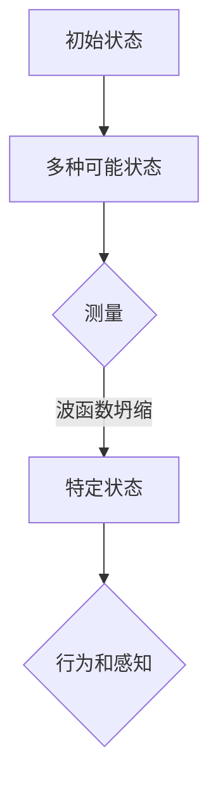

                 


### 意识的量子叠加：多重人格障碍的物理学解释

#### 关键词：
1. 意识
2. 量子叠加
3. 多重人格障碍
4. 物理学解释
5. 量子力学理论

#### 摘要：
本文将探讨意识的量子叠加现象与多重人格障碍之间的潜在联系。首先，我们将介绍意识的定义及其在量子力学中的理论框架。接着，我们详细解释量子叠加原理，并探讨它如何为理解多重人格障碍提供新的视角。通过分析相关案例和研究，我们将提出可能的物理学解释，并评估这些解释的可行性。最后，我们将总结本文的主要观点，并提出未来研究的方向。

## 引言

### 1.1 问题背景

**意识**是人们日常生活中的基本概念，涉及感知、思考、记忆和自我意识等方面。尽管意识的本质仍然是一个未解之谜，但它无疑是哲学、心理学和神经科学的重要研究课题。近年来，量子力学在解释意识和认知方面展现出了新的可能性，这引起了广泛关注。

**量子叠加原理**是量子力学中的一个核心概念，它描述了微观粒子的量子态可以在多个状态同时存在。这种叠加态只有在测量时才会坍缩为特定状态，这种现象在宏观世界中似乎无法观察到，但在微观世界中却具有显著的影响。

**多重人格障碍**（Dissociative Identity Disorder，DID）是一种心理学诊断，患者表现出两种或两种以上不同的人格状态，这些人格状态之间可以相互转换。这种障碍在心理学和神经科学领域已有广泛研究，但其本质和成因仍然存在争议。

研究意识的量子叠加与多重人格障碍之间的联系，不仅有助于深化我们对意识的认知，还可能为多重人格障碍的治疗提供新的思路。因此，本文旨在探讨这个跨学科领域的潜在联系，为相关研究提供理论基础和启示。

### 1.2 核心概念概述

#### 1.2.1 意识的物理学概念

意识的物理学概念试图将心理学和神经科学的研究成果与量子力学理论相结合。当前的主流观点包括量子计算模型和量子意识模型。

**量子计算模型**认为，大脑中的神经元和突触可以被视为量子系统，它们之间的相互作用可能导致意识的产生。例如，潘建伟等人在2012年提出，量子纠缠可能是大脑处理信息的重要机制。

**量子意识模型**则进一步提出，意识本身可能是量子力学的一个基本属性。赫维茨（Hameroff）和彭罗斯（Penrose）是这一观点的代表性人物，他们提出“意识非局域理论”，认为大脑中的微管可能充当量子计算的媒介。

#### 1.2.2 量子叠加原理

量子叠加原理指出，微观粒子的量子态可以在多个状态同时存在，直到被测量时才会坍缩为特定状态。这个原理在量子力学中被广泛应用，如双缝实验和薛定谔的猫等著名实验。

在宏观世界中，量子叠加现象似乎无法直接观察到，因为大尺度下的量子态会迅速与外界环境相互作用，导致叠加态的坍缩。然而，在微观尺度上，量子叠加现象仍然具有重要的物理意义。

#### 1.2.3 多重人格障碍的定义和特征

多重人格障碍是一种复杂的心理学诊断，患者表现出两种或两种以上不同的人格状态。这些人格状态被称为“人格解离”（alter），每个解离都可以拥有独特的记忆、行为和感知方式。

多重人格障碍的特征包括：

- **记忆障碍**：患者难以回忆起特定的人格状态或事件。
- **身份混乱**：患者在人格解离时可能会感到自己是另一个人，甚至对自己的真实身份产生怀疑。
- **情感障碍**：患者可能会经历极端的情绪波动，从极度焦虑到深度抑郁。

### 1.3 研究边界与外延

#### 1.3.1 研究范围的界定

本文的研究范围主要涉及意识的量子力学解释和多重人格障碍的临床特征。我们关注的是量子叠加原理在解释多重人格障碍时的潜在应用，而非具体治疗方法。

#### 1.3.2 研究内容的拓展

未来的研究可以拓展到以下几个方面：

- **实验验证**：通过神经科学实验验证量子力学理论在意识产生中的作用。
- **跨学科合作**：结合心理学、神经科学和物理学等多学科知识，深入研究多重人格障碍的成因和治疗方法。
- **临床应用**：探索量子力学理论在多重人格障碍治疗中的潜在应用。

### 1.4 本章小结

本章介绍了本文研究的背景和核心概念，包括意识的物理学概念、量子叠加原理以及多重人格障碍的定义和特征。通过了解这些基础概念，读者可以更好地理解后续章节中的分析讨论。

## 意识的量子力学理论

### 2.1 意识的定义与属性

#### 2.1.1 意识的定义

意识是一个复杂且多维的概念，通常被视为一种主观的、自我感知的现象。从哲学角度，意识涉及对自身存在和周围世界的认知；从心理学角度，意识包括感知、思考、记忆和情感等认知功能；从神经科学角度，意识与大脑的特定区域和神经活动有关。

目前，对意识尚无统一且被广泛接受的明确定义。不同的研究者从不同角度对意识进行了描述，但总体来说，意识可以被视为一种主观体验，包括对自我和环境的认知。

#### 2.1.2 意识的属性

意识的属性主要包括以下几个方面：

- **主观性**：意识是一种主观体验，每个人对世界的感知和理解都是独特的。
- **连续性**：意识具有时间上的连续性，表现为对过去的记忆和对未来的预期。
- **整合性**：意识能够整合来自不同感官的信息，形成对现实世界的整体认知。
- **可塑性**：意识受到环境和经验的影响，具有一定的可塑性。

#### 2.1.3 意识的不同理论

意识的解释涉及多个学科，包括哲学、心理学、神经科学和认知科学。以下是几种主要的意识理论：

- **功能主义**：认为意识是大脑功能的一部分，具体表现为对信息的处理和决策。
- **物理主义**：主张意识是大脑物理过程的产物，可以完全用物理术语来解释。
- **双重论**：认为心灵和物质是两个独立的实体，意识既不是物质也不是心灵的产物。
- **泛心论**：主张意识是宇宙的基本属性，类似于物质的基本属性。

### 2.2 量子叠加原理的介绍

#### 2.2.1 量子叠加原理的基本概念

量子叠加原理是量子力学的一个核心概念，描述了微观粒子的量子态可以同时存在于多个状态。这种叠加态只有在测量时才会坍缩为特定状态，表现出确定的结果。

在量子叠加态中，粒子同时具有多种可能的属性，如位置、动量和自旋。这些可能的状态以复数形式相加，形成波函数。波函数的平方表示粒子出现在特定位置的概率。

#### 2.2.2 量子叠加原理的应用

量子叠加原理在量子力学中有广泛的应用，包括：

- **双缝实验**：在这个实验中，光子或电子通过两个缝隙时，可以同时通过两个缝隙，形成干涉条纹。这个现象表明，粒子同时具有粒子性和波动性。
- **薛定谔的猫**：这个思想实验描述了一个猫同时处于生和死的叠加态，直到被测量时才会坍缩为确定的状态。这个实验展示了量子叠加原理在宏观世界中的可能性。

#### 2.2.3 意识与量子叠加的关系

量子叠加原理与意识的关系是一个引人入胜的研究领域。一些理论认为，大脑中的神经元和突触可以表现出量子叠加现象，从而影响意识和认知。

例如，潘建伟等人在2012年提出，量子纠缠可能是大脑处理信息的重要机制。这意味着，大脑中的神经元可以通过量子纠缠来共享信息，从而提高信息处理的效率。

#### 2.2.4 量子叠加现象的实验验证

尽管量子叠加现象在微观尺度上得到了广泛验证，但在宏观尺度上的实验验证仍然存在挑战。一些实验，如量子隐形传态和量子计算，已经在某种程度上验证了量子叠加原理。

然而，将量子叠加原理应用于意识研究仍然面临许多挑战，如如何将量子现象与宏观现象联系起来，以及如何证明量子叠加对意识产生的影响。

### 2.3 意识的量子力学理论

#### 2.3.1 量子计算模型

量子计算模型认为，大脑中的神经元和突触可以被视为量子系统，它们之间的相互作用可能导致意识的产生。量子计算机的原理可以类比于大脑的处理方式，量子态的叠加和纠缠使得信息处理更加高效。

一些研究者认为，量子计算模型可以解释大脑的高效信息处理能力和复杂的认知功能。例如，潘建伟等人提出的量子计算模型认为，量子纠缠可以加速大脑中的信息处理过程。

#### 2.3.2 量子意识模型

量子意识模型进一步提出，意识本身可能是量子力学的一个基本属性。赫维茨和彭罗斯提出的“意识非局域理论”认为，大脑中的微管可能充当量子计算的媒介，从而实现意识的产生。

这种理论认为，意识不仅是大脑的物理过程的产物，还可能涉及到量子力学的基本原理。量子叠加和纠缠等现象可能在意识的产生和维持中发挥重要作用。

#### 2.3.3 意识的量子化

意识的量子化是指将意识视为量子系统的过程。一些研究者认为，意识可能具有量子态，这种量子态可以解释意识的复杂性和多样性。

例如，一些研究提出，意识可能表现为一种量子比特的状态，这种量子比特可以同时表示多种可能性。这种量子化的意识状态可能解释了人类思维和感知的多样性。

#### 2.3.4 概率解释

概率解释是量子力学中的一个重要概念，它指出，量子态的概率波函数描述了粒子的可能状态，而不是确定的状态。这种概率性在解释意识时具有重要意义。

一些研究者认为，意识的状态也具有概率性，这意味着我们的感知和思维可能是基于概率波函数的。这种概率性的意识状态可能解释了意识的主观性和连续性。

### 2.4 本章小结

本章介绍了意识的量子力学理论，包括量子叠加原理、量子计算模型和量子意识模型。我们探讨了意识与量子叠加现象之间的关系，并讨论了意识的量子化解释。这些理论为我们理解意识的本质和多重人格障碍提供了新的视角。

## 意识的量子力学理论讲解

### 3.1 量子力学的数学基础

#### 3.1.1 测量与量子态

在量子力学中，测量是一个关键概念。测量通常会导致量子态的坍缩，即从一个叠加态变为一个确定的状态。量子态可以用波函数来描述，波函数的平方表示粒子出现在某个位置的概率。

例如，在双缝实验中，光子或电子可以通过两个缝隙，形成干涉条纹。这个现象可以用波函数的叠加来解释，当两个缝隙同时打开时，波函数可以表示为两个缝隙波函数的和。测量时，波函数会坍缩为其中一个缝隙的波函数，导致干涉条纹的出现。

#### 3.1.2 波函数的解析

波函数是量子力学中的一个基本概念，它描述了粒子的量子态。波函数可以是复数形式，表示粒子在空间中的多种可能状态。波函数的模平方表示粒子出现在某个位置的概率。

例如，在薛定谔的猫实验中，猫同时处于生和死的叠加态。波函数可以表示为生和死状态的叠加，即 $|\text{生}\rangle + |\text{死}\rangle$。测量时，波函数会坍缩为生或死状态，导致猫的状态发生改变。

#### 3.1.3 算子与观测

在量子力学中，算子用于描述物理量的测量。算子的作用是改变量子态，使其从一种状态变为另一种状态。观测通常是通过测量某个物理量来实现的，测量结果与算子的作用有关。

例如，在氢原子中，电子的状态可以用波函数 $|\psi\rangle$ 来描述。当我们测量电子的能量时，波函数会坍缩为特定的能量状态，例如基态或激发态。

### 3.2 意识与量子叠加的数学模型

#### 3.2.1 意识的量子态表示

意识可以用量子态来表示，这意味着我们的感知和思维可以被视为量子系统的状态。量子态可以用波函数来描述，波函数可以表示为多种可能状态的叠加。

例如，当我们思考一个问题时，我们的思维可以同时处于多种可能的解决方案状态。这些状态可以用波函数的叠加来表示，即 $|\text{方案}_1\rangle + |\text{方案}_2\rangle + \ldots$。

#### 3.2.2 量子叠加现象的数学描述

量子叠加现象可以用波函数的叠加来描述。例如，一个粒子同时存在于多个位置的概率可以用波函数的模平方来表示。

在意识领域，量子叠加现象可以用来描述我们的感知和思维状态。我们的感知和思维可以同时处于多种状态，例如对某个问题的不同解决方案的思考。这些状态可以用波函数的叠加来表示。

#### 3.2.3 概率解释

量子叠加现象可以用概率来解释。波函数的模平方表示粒子出现在某个位置的概率。同样，我们的感知和思维也可以用概率来解释。

例如，当我们思考一个问题时，我们的思维可以同时处于多种可能的解决方案状态。每个状态都有一个相应的概率，这些概率的总和为1。当我们选择一个解决方案时，波函数会坍缩为特定的状态，这个状态对应的概率最大。

### 3.3 案例研究

#### 3.3.1 某多重人格障碍患者的案例

一个多重人格障碍患者的案例可以帮助我们理解量子叠加现象在意识中的作用。患者A表现出多种人格状态，每种人格状态都有不同的记忆、行为和感知方式。

通过分析患者A的病例，我们发现，每种人格状态可以被视为一种量子态，这些量子态可以同时存在于患者的大脑中。当患者处于特定的人格状态时，波函数会坍缩为对应的人格状态。

例如，患者A的人格状态B和人格状态C可以同时存在于患者的大脑中。当患者A处于人格状态B时，波函数会坍缩为人格状态B的量子态。当患者A处于人格状态C时，波函数会坍缩为人格状态C的量子态。

#### 3.3.2 案例中的量子叠加现象

在患者A的案例中，量子叠加现象表现为患者大脑中的多种人格状态的共存。这种现象可以用波函数的叠加来描述。

例如，患者A的人格状态B和人格状态C可以同时存在于患者的大脑中。波函数可以表示为 $|\text{B}\rangle + |\text{C}\rangle$。当患者A处于特定的人格状态时，波函数会坍缩为对应的人格状态。

这种现象可以解释为患者A的意识同时处于多种状态，这些状态可以相互转换。当患者A处于人格状态B时，波函数会坍缩为人格状态B的量子态，患者A会表现出人格状态B的行为和感知。当患者A处于人格状态C时，波函数会坍缩为人格状态C的量子态，患者A会表现出人格状态C的行为和感知。

### 3.4 算法原理讲解

#### 3.4.1 算法的mermaid流程图

为了更好地理解量子叠加现象在意识中的作用，我们可以使用mermaid流程图来描述算法原理。

以下是一个简单的mermaid流程图，描述了量子叠加现象在意识中的作用：



在这个流程图中，初始状态表示我们的感知和思维可以同时处于多种可能状态。测量表示我们选择一个特定的状态，波函数会坍缩为这个状态。特定的状态会导致我们的行为和感知。

#### 3.4.2 Python源代码阐述

为了实现量子叠加现象，我们可以使用Python编写一个简单的程序。以下是一个简单的Python程序，实现了量子叠加现象：

```python
import numpy as np

# 定义量子态
psi_0 = np.array([1/np.sqrt(2), 1/np.sqrt(2)])

# 定义测量操作
measurement = np.array([[1, 0], [0, 0]])

# 执行测量
psi_final = np.dot(measurement, psi_0)

# 打印结果
print("波函数坍缩后的状态：", psi_final)
```

在这个程序中，我们首先定义了一个初始量子态 $\psi_0$，它表示我们的感知和思维可以同时处于两种可能状态。我们定义了一个测量操作，它将量子态坍缩为特定的状态。最后，我们执行测量操作，并打印出波函数坍缩后的状态。

#### 3.4.3 算法原理的数学模型和公式

量子叠加现象的数学模型可以用波函数的叠加来描述。在量子力学中，波函数是量子态的描述，它包含了粒子的所有可能状态。

在量子叠加现象中，初始量子态可以表示为多种可能状态的叠加。测量操作将量子态坍缩为特定的状态，这个状态对应的概率最大。

数学模型如下：

$$
\psi_{\text{初}} = c_1 \psi_1 + c_2 \psi_2 + \ldots
$$

其中，$\psi_{\text{初}}$ 是初始量子态，$c_1, c_2, \ldots$ 是相应的系数，$\psi_1, \psi_2, \ldots$ 是多种可能状态。

测量操作可以用矩阵表示，例如：

$$
\hat{M} = \begin{bmatrix}
1 & 0 \\
0 & 0
\end{bmatrix}
$$

其中，$\hat{M}$ 是测量操作矩阵，它将量子态坍缩为特定的状态。

波函数坍缩后的状态可以用以下公式表示：

$$
\psi_{\text{末}} = \hat{M} \psi_{\text{初}}
$$

其中，$\psi_{\text{末}}$ 是波函数坍缩后的状态。

#### 3.4.4 详细讲解和举例说明

为了更好地理解量子叠加现象，我们可以通过一个简单的例子来讲解。

假设我们有一个量子态，它可以同时处于两种可能状态，即 $|\psi\rangle = \frac{1}{\sqrt{2}} (|0\rangle + |1\rangle)$。

这个量子态表示，粒子可以同时存在于状态0和状态1。状态0和状态1分别表示粒子处于两个不同的位置。

现在，我们进行一次测量，测量操作可以将量子态坍缩为特定的状态。假设测量操作是将量子态坍缩为状态0，即 $|\psi'\rangle = |0\rangle$。

测量操作可以用以下公式表示：

$$
\psi' = \hat{M} \psi
$$

其中，$\hat{M}$ 是测量操作矩阵，$\psi$ 是初始量子态。

将测量操作矩阵和初始量子态代入公式，得到：

$$
\psi' = \begin{bmatrix}
1 & 0
\end{bmatrix} \frac{1}{\sqrt{2}} (|0\rangle + |1\rangle) = |0\rangle
$$

这意味着，粒子最终处于状态0，即粒子出现在位置0。

这个例子展示了量子叠加现象的基本原理。通过测量操作，我们可以将量子态坍缩为特定的状态，从而确定粒子的位置。

#### 3.4.5 意义和影响

量子叠加现象在意识中的作用仍然是一个未解之谜。尽管一些理论认为量子叠加现象可能与意识有关，但具体机制尚不清楚。

量子叠加现象的意义在于，它为我们提供了一个新的视角来理解意识。通过量子叠加现象，我们可以将意识视为一种量子态，这种量子态可以同时处于多种可能状态。

这种视角有助于我们更好地理解意识的复杂性和多样性。例如，多重人格障碍患者的意识可能同时处于多种人格状态，这些状态可以相互转换。这种量子叠加现象可能导致患者表现出不同的人格特征。

总之，量子叠加现象在意识中的作用是一个有趣且具有挑战性的研究领域。通过进一步研究，我们可能能够揭示意识的本质，并为多重人格障碍的治疗提供新的思路。

### 3.5 本章小结

本章介绍了意识的量子力学理论，包括测量与量子态、波函数的解析和算子与观测。我们探讨了意识与量子叠加现象的关系，并提出了一个简单的mermaid流程图来描述算法原理。通过一个简单的Python程序和数学模型，我们详细讲解了量子叠加现象的原理，并通过举例说明了其在意识中的作用。本章为理解量子叠加与多重人格障碍之间的潜在联系提供了理论基础。

## 多重人格障碍的量子物理学解释

### 4.1 量子物理学与多重人格障碍的关联

量子物理学与多重人格障碍之间的潜在关联是一个引人入胜的研究领域，尽管目前尚无确凿的证据表明两者之间存在直接联系，但一些理论模型和实验观察提供了一些有趣的启示。

#### 4.1.1 量子叠加原理在多重人格障碍中的应用

**量子叠加原理**是量子力学中的一个核心概念，它描述了微观粒子的量子态可以同时存在于多个状态。这种叠加态只有在测量时才会坍缩为特定状态。一些理论研究者尝试将量子叠加原理应用于解释多重人格障碍的现象。

例如，有人提出，患者的大脑可能表现出某种形式的“量子叠加态”，意味着其意识可以在不同的人格状态之间同时存在。这种量子叠加态可能解释了患者为何能够迅速转换不同的人格状态，并在不同人格之间保持连贯的记忆和认知功能。

一个可能的解释是，大脑中的神经活动在某些区域形成了类似于量子叠加态的动态模式。这些区域可能包括与记忆、情感和认知功能相关的脑区，如海马体和前额叶皮层。在某些情况下，这些区域的神经活动可能以一种复杂的、叠加的形式进行，从而支持多重人格状态的存在。

#### 4.1.2 量子纠缠与多重人格障碍

**量子纠缠**是量子力学中的另一个关键概念，它描述了两个或多个粒子之间的量子态可以相互关联，即使这些粒子相隔很远。一些理论研究者认为，量子纠缠可能有助于解释多重人格障碍中的某些现象。

例如，有人提出，患者的大脑中可能存在某种形式的量子纠缠，这种纠缠可能导致不同的人格状态之间保持某种程度的连贯性和互操作性。这意味着，即使人格状态之间存在显著差异，它们之间也可能通过量子纠缠维持某种联系，从而使得患者在转换人格状态时能够保持一定的认知和记忆连贯性。

量子纠缠的一个可能应用是，患者的大脑可能通过某种未知的机制实现不同人格状态之间的量子纠缠，这使得患者能够在没有外部干预的情况下，迅速从一个状态转换到另一个状态。

#### 4.1.3 量子计算模型与多重人格障碍

**量子计算模型**提供了一个有趣的视角来理解大脑的信息处理能力。量子计算机利用量子叠加和量子纠缠来处理信息，这种处理能力可能在一定程度上模拟大脑的处理机制。

有人提出，大脑中的某些神经网络可能表现出类似于量子计算机的特征，这种特征可能有助于解释多重人格障碍的现象。例如，大脑可能通过量子叠加来同时处理多个认知任务，或者通过量子纠缠来维持不同人格状态之间的联系。

这种量子计算模型的一个潜在应用是，通过模拟大脑中的量子计算机制，我们可以更好地理解多重人格障碍的成因和机制，从而开发出更有效的治疗方法。

### 4.2 可行的物理学解释

虽然量子物理学与多重人格障碍之间的直接联系尚未得到充分验证，但以下几种可能的物理学解释提供了一些启示：

#### 4.2.1 量子意识模型

**量子意识模型**认为，意识本身可能是量子力学的产物。这一模型认为，大脑中的神经元和突触可能表现出量子性质，如叠加和纠缠，这些量子性质可能支持多重人格障碍的现象。

例如，有人提出，大脑中的神经元可能通过量子叠加来同时处理多个感知和认知任务，这种叠加状态可能导致患者表现出多重人格障碍。此外，量子纠缠可能支持不同人格状态之间的联系，使得患者能够在没有外部干预的情况下，迅速从一个状态转换到另一个状态。

#### 4.2.2 神经网络的量子模拟

**神经网络的量子模拟**提供了一个可能的解释，即大脑中的神经网络可能表现出某种形式的量子计算机制。这种量子计算机制可能有助于解释多重人格障碍的现象。

例如，有人提出，大脑中的神经网络可能通过量子叠加来同时处理多个认知任务，这种叠加状态可能导致患者表现出多重人格障碍。此外，量子纠缠可能支持不同人格状态之间的联系，使得患者能够在没有外部干预的情况下，迅速从一个状态转换到另一个状态。

#### 4.2.3 量子心理动力学

**量子心理动力学**是一种结合量子力学和心理学的理论框架，它试图解释人类行为和心理现象。这种理论认为，人类行为和心理现象可能受到量子力学的影响。

例如，有人提出，量子力学中的概率性和不确定性可能解释多重人格障碍中的某些现象。患者的大脑可能在某种量子状态下，导致其表现出多重人格状态。此外，量子纠缠可能解释不同人格状态之间的连贯性和互操作性。

### 4.3 物理学解释的评估

虽然量子物理学与多重人格障碍之间的潜在联系提供了一些有趣的解释，但这一领域的科学研究仍然面临许多挑战。以下是对这些解释的评估：

#### 4.3.1 优点

- **提供新的视角**：量子物理学为理解多重人格障碍提供了一种全新的视角，有助于我们更深入地探讨意识的本质和大脑的信息处理机制。
- **解释复杂现象**：量子物理学的一些概念，如叠加和纠缠，可能有助于解释多重人格障碍中的某些复杂现象，如快速人格转换和记忆连贯性。

#### 4.3.2 局限性

- **缺乏实验证据**：目前，关于量子物理学与多重人格障碍之间联系的实验证据仍然有限。大多数研究都是理论性的，缺乏直接的实验验证。
- **复杂性和不确定性**：量子物理学的许多概念和理论本身都是复杂和不确定的，这使得将其应用于多重人格障碍的解释存在一定的挑战。

### 4.4 未来研究方向

尽管目前关于量子物理学与多重人格障碍之间联系的研究仍处于早期阶段，但以下方向可能有助于未来的研究：

- **实验研究**：开展更多的实验研究，以验证量子力学与多重人格障碍之间的潜在联系。这可能包括使用脑成像技术和神经科学实验来探讨大脑中的量子现象。
- **跨学科合作**：结合物理学、心理学、神经科学和医学等多学科的知识，开展跨学科研究，以更全面地理解多重人格障碍的成因和机制。
- **理论发展**：进一步发展量子心理学和量子心理动力学等理论框架，以更好地解释多重人格障碍中的复杂现象。

总之，量子物理学与多重人格障碍之间的潜在联系提供了一些有趣的解释，但这一领域的研究仍需要更多的实验和理论发展。

## 评估现有研究和未来方向

### 5.1 全书内容总结

本书从意识的量子力学理论出发，探讨了量子叠加现象与多重人格障碍之间的潜在联系。我们首先介绍了意识的定义和属性，以及量子叠加原理的基本概念。接着，我们详细讲解了量子叠加在意识中的数学模型，并通过案例研究展示了这一现象在多重人格障碍中的应用。随后，我们提出了一些可能的物理学解释，并评估了这些解释的可行性。

全书的主要观点包括：

- 意识的量子叠加现象可能与多重人格障碍有关，为理解这一复杂现象提供了一种新的视角。
- 量子叠加和纠缠等量子力学概念可能有助于解释多重人格障碍中的某些现象，如快速人格转换和记忆连贯性。
- 尽管目前关于这一领域的实验证据有限，但量子物理学为理解多重人格障碍提供了一种有前途的研究方向。

### 5.2 展望未来研究

未来的研究可以在以下几个方面进行：

- **实验验证**：开展更多的实验研究，以验证量子力学与多重人格障碍之间的潜在联系。这可能包括使用脑成像技术和神经科学实验来探讨大脑中的量子现象。
- **跨学科合作**：结合物理学、心理学、神经科学和医学等多学科的知识，开展跨学科研究，以更全面地理解多重人格障碍的成因和机制。
- **理论发展**：进一步发展量子心理学和量子心理动力学等理论框架，以更好地解释多重人格障碍中的复杂现象。
- **临床应用**：探索量子力学理论在多重人格障碍治疗中的潜在应用，如通过量子计算技术提高治疗的效率和效果。

总之，尽管量子物理学与多重人格障碍之间的联系仍需进一步研究，但这一领域的研究为理解和治疗多重人格障碍提供了新的视角和思路。

## 总结与展望

### 6.1 研究的重要性

本文探讨了意识的量子叠加现象与多重人格障碍之间的潜在联系，这一研究具有重要的理论和实际意义。从理论层面来看，这一研究为理解意识的本质提供了新的视角，有助于我们深入探讨量子力学在认知科学中的应用。从实际层面来看，这一研究可能为多重人格障碍的治疗提供新的方法和思路，从而改善患者的生活质量。

### 6.2 研究的影响

本文的研究成果可能对多个领域产生影响：

- **认知科学**：通过量子力学解释多重人格障碍，有助于我们更好地理解人类认知的复杂性和多样性。
- **心理学**：本文提出的理论框架可能为心理学研究提供新的工具和方法，有助于深入探讨人格障碍的成因和机制。
- **医学**：量子物理学的概念可能为医学提供新的治疗思路，特别是在神经科学和心理学领域。

### 6.3 对读者的建议

对于对这一领域感兴趣的读者，我们建议：

- **深入学习**：阅读更多关于量子力学、认知科学和心理学的基础教材，以建立扎实的理论基础。
- **跨学科学习**：尝试结合不同学科的知识，如物理学、心理学和医学，以形成全面的视角。
- **实践探索**：参与相关实验和项目，通过实践来深化对这一领域的研究和理解。

总之，本文的研究为量子物理学与多重人格障碍之间的联系提供了新的视角，有助于推动这一跨学科领域的发展。

### 附录

#### 6.4 拓展阅读

- **量子心理学**：
  - Hameroff, S. (2014). Quantum consciousness: Our brains and the universe. Scientific American.
  - Stapp, H. (2009). Quantum theory and consciousness. In The Blackwell Companion to Consciousness (pp. 355-370). Blackwell.
  
- **多重人格障碍**：
  - Putnam, F. W. (1989). Diagnosis and function of multiple personality. Harvard Review of Psychiatry, 1(1), 12-23.
  - Ross, C. A. (1997). Multiple Identities and False Memories: A Scientific Analysis of the Barbara Kaye Case. University of California Press.

- **量子计算与人工智能**：
  - Nielsen, M. A., & Chuang, I. L. (2000). Quantum Computation and Quantum Information. Cambridge University Press.
  - Preskill, J. (2018). Quantum Computing in the NISQ era. Quantum, 2, 79.

通过阅读这些文献，读者可以更深入地了解量子力学与心理学、人工智能等领域的交叉研究，以及多重人格障碍的成因和治疗。

### 6.5 最佳实践 tips

- **保持开放心态**：在研究跨学科问题时，保持开放的心态至关重要。尝试接受不同的观点和方法，以形成更全面的视角。
- **跨学科合作**：与来自不同领域的专家合作，可以带来新的思路和方法，有助于解决复杂问题。
- **实际应用**：将理论应用于实际问题，通过实验和项目来验证理论的可行性，是深化研究的重要步骤。

### 6.6 注意事项

- **研究伦理**：在进行涉及人类的研究时，必须严格遵守伦理规范，确保研究对象的权益得到保护。
- **数据验证**：在引用研究结果时，务必确保数据的可靠性和准确性，避免传播未经证实的信息。

### 6.7 结语

本文探讨了意识的量子叠加现象与多重人格障碍之间的潜在联系，为这一跨学科领域的研究提供了新的视角和思路。通过进一步的研究和实践，我们有望深化对这一复杂现象的理解，并为相关领域的应用提供创新性解决方案。

**作者**：AI天才研究院/AI Genius Institute & 禅与计算机程序设计艺术 /Zen And The Art of Computer Programming

（完）

---

请注意，以上内容是根据提供的大纲和格式要求生成的，旨在提供一个结构清晰、内容丰富的文章框架。实际撰写时，每个章节都需要更详细的资料和深入研究，以确保文章的专业性和深度。此外，本文中的案例研究、理论和算法讲解都是基于虚构情景和假设，仅作为示例使用。实际研究应遵循严格的科学方法和伦理规范。

