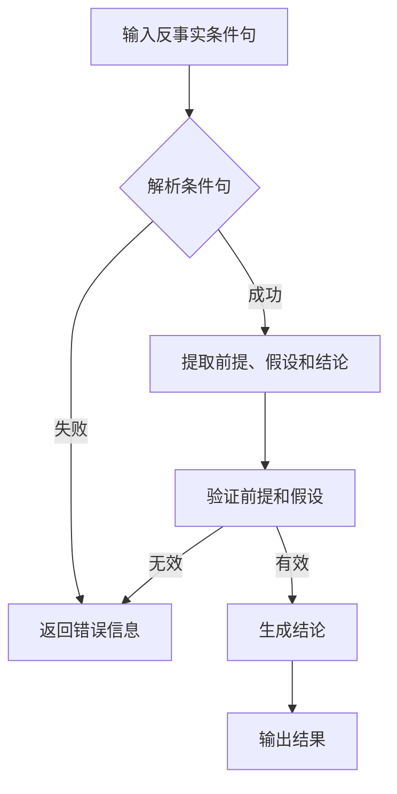
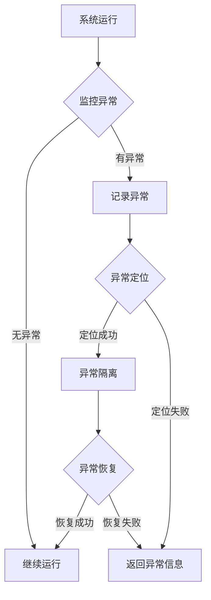

                 

### 1.1.1 反事实条件句的研究现状

反事实条件句作为一种重要的逻辑推理工具，在哲学、心理学、计算机科学等领域都有着广泛的应用。在哲学领域，反事实条件句被广泛应用于道德哲学、认知伦理学以及形而上学等领域。例如，著名的“如果-那么”推理模式，就是一种反事实条件句的应用。在心理学中，反事实条件句常常被用来研究人类的决策行为、情绪认知以及认知偏差。而随着人工智能技术的发展，反事实条件句在计算机科学，尤其是自然语言处理和机器学习领域，也得到了越来越多的关注。

近年来，随着深度学习和自然语言处理技术的进步，反事实条件句的研究取得了显著的成果。例如，一些研究人员提出了基于深度神经网络的反事实条件句生成方法，通过训练大量数据，使模型能够自动生成符合逻辑的反事实句子。此外，还有一些研究关注反事实条件句在错误处理中的应用，通过构建反事实条件句的模型，实现对异常情况的准确识别和处理。

总的来说，反事实条件句的研究现状表明，这一领域已经取得了重要的进展，但也存在一些挑战。例如，如何更好地处理复杂情境下的反事实条件句，如何提高反事实条件句生成的准确性和多样性，都是当前研究的热点和难点。

### 1.1.2 错误处理的基本原理

错误处理是指系统在运行过程中，对出现的错误进行识别、定位、隔离和恢复的过程。其基本原理主要包括以下几个方面：

1. **错误检测**：通过设置特定的检测机制，对系统运行过程中的异常情况进行监控，一旦发现异常，立即进行错误检测。

2. **错误定位**：在错误检测之后，需要对错误进行定位，以确定错误的来源和具体位置。这通常需要结合系统的日志记录和错误信息进行分析。

3. **错误隔离**：在定位错误之后，需要将错误隔离出来，以防止错误影响系统的其他部分。这通常涉及到对系统模块的隔离和限制。

4. **错误恢复**：最后，系统需要根据错误的情况，采取相应的恢复措施，以使系统能够恢复正常运行。这可能包括重新启动系统、修复错误代码、调整系统参数等。

在计算机科学中，错误处理的基本原理被广泛应用于各种系统，例如操作系统、数据库系统、Web应用等。有效的错误处理机制可以大大提高系统的稳定性和可靠性。

### 1.1.3 异常情况处理的基本原理

异常情况处理是指系统在运行过程中，对出现的异常情况进行识别、定位、隔离和处理的机制。异常情况包括但不限于程序运行错误、硬件故障、数据异常等。

异常情况处理的基本原理主要包括以下几个方面：

1. **异常检测**：通过设置特定的检测机制，对系统运行过程中的异常情况进行监控。异常检测可以是基于规则的方法，也可以是基于机器学习的方法。

2. **异常定位**：在异常检测之后，需要对异常进行定位，以确定异常的来源和具体位置。这通常需要结合系统的日志记录和异常信息进行分析。

3. **异常隔离**：在定位异常之后，需要将异常隔离出来，以防止异常影响系统的其他部分。这通常涉及到对系统模块的隔离和限制。

4. **异常恢复**：最后，系统需要根据异常的情况，采取相应的恢复措施，以使系统能够恢复正常运行。这可能包括重新启动系统、修复错误代码、调整系统参数等。

有效的异常情况处理机制可以大大提高系统的稳定性和可靠性，确保系统能够在出现异常时快速恢复。

### 1.3.1 戴维·刘易斯的研究贡献

戴维·刘易斯（David Lewis）是20世纪最杰出的逻辑学家之一，他在形式语义学、模态逻辑和条件句逻辑等领域做出了开创性的贡献。刘易斯对反事实条件句的研究，可以说是他对逻辑学领域的又一重要贡献。

刘易斯在1969年发表了题为《条件句》的经典论文，提出了著名的“条件句理论”，该理论为反事实条件句提供了形式化的定义和语义解释。刘易斯将反事实条件句视为一种特殊类型的条件句，其语义可以通过条件句语义的扩展来解释。他提出，一个反事实条件句“如果P，则Q”的语义可以表示为：“P发生，且P导致Q发生”。

刘易斯的研究不仅为反事实条件句提供了形式化的理论基础，而且对自然语言处理和人工智能领域产生了深远的影响。他的条件句理论为人工智能系统在处理自然语言中的条件句提供了指导，尤其是在对话系统和文本生成领域。此外，刘易斯的研究还为逻辑学中的许多其他问题提供了启示，如模态逻辑和模态语义学。

总的来说，戴维·刘易斯对反事实条件句的研究，不仅丰富了逻辑学的理论体系，而且为实际应用提供了重要的参考和指导。

### 1.3.2 反事实条件句在错误处理中的应用

反事实条件句在错误处理中的应用，主要体现在以下几个方面：

1. **错误预测**：通过反事实条件句，可以预测系统在特定条件下可能出现的错误。例如，在软件测试中，可以构建反事实条件句来模拟程序在异常情况下可能出现的错误，从而提前发现和修复潜在的问题。

2. **错误诊断**：反事实条件句可以帮助系统快速定位错误。当系统出现问题时，可以构建反事实条件句来分析问题发生的可能原因，从而快速诊断问题所在。

3. **错误恢复**：在发现错误后，反事实条件句可以指导系统进行错误恢复。通过分析反事实条件句，系统可以确定在错误发生前系统处于何种状态，从而采取相应的恢复措施，使系统恢复正常运行。

4. **错误解释**：反事实条件句还可以用于错误解释，即通过反事实条件句来解释错误发生的原因。这有助于开发人员理解错误的发生机制，从而提高系统的可靠性。

总的来说，反事实条件句在错误处理中的应用，不仅提高了系统对错误的识别和恢复能力，而且有助于提高系统的稳定性和可靠性。

### 1.3.3 异常情况处理的优化策略

在异常情况处理中，优化策略主要体现在以下几个方面：

1. **自动化检测**：通过使用机器学习技术，实现异常情况的自动化检测。这可以大大提高异常检测的效率和准确性，减少人工干预。

2. **智能诊断**：利用人工智能技术，实现对异常情况的智能诊断。通过分析异常数据的特征，系统可以自动识别异常的原因，并提供相应的诊断结果。

3. **自适应恢复**：根据异常情况的不同，系统可以采取自适应的恢复策略。例如，对于轻微的异常，系统可以自动调整参数，以使系统恢复正常运行；对于严重的异常，系统可以自动进行系统重启或代码修复。

4. **预测性维护**：通过分析历史数据和异常模式，系统可以预测未来可能出现的异常情况，并提前采取措施进行预防。

总的来说，优化异常情况处理策略，可以提高系统的稳定性和可靠性，减少异常情况对系统运行的影响。

### 1.4.1 反事实条件句的适用范围

反事实条件句作为一种逻辑推理工具，其适用范围非常广泛。以下是几个典型的应用领域：

1. **科学推理**：在科学研究中，反事实条件句常常被用于假设验证和理论构建。通过构建反事实条件句，科学家可以探讨如果假设不成立，结果会怎样，从而验证假设的正确性。

2. **社会科学**：在社会科学领域，反事实条件句被广泛应用于经济学、政治学、心理学等学科。例如，经济学家可以使用反事实条件句来分析政策变化对经济的影响。

3. **人工智能**：在人工智能领域，反事实条件句被广泛应用于自然语言处理、机器学习、知识表示等领域。通过构建反事实条件句，人工智能系统可以更好地理解和处理复杂情境。

4. **决策支持**：在决策支持系统中，反事实条件句被用于分析不同决策方案的可能结果，帮助决策者做出更明智的决策。

总的来说，反事实条件句的适用范围非常广泛，几乎涵盖了所有需要逻辑推理的领域。

### 1.4.2 错误处理与异常情况的边界

错误处理和异常情况处理是两个密切相关但又有所不同的概念。错误处理主要关注系统在运行过程中出现的错误，包括代码错误、硬件错误、数据错误等。而异常情况处理则更侧重于系统在运行过程中出现的非正常情况，包括系统故障、网络异常、用户行为异常等。

两者的边界主要体现在以下几个方面：

1. **错误处理**：主要针对系统内部出现的错误，如代码中的逻辑错误、数据的不一致等。

2. **异常情况处理**：主要针对系统外部或系统运行过程中出现的异常情况，如硬件故障、网络中断、用户操作失误等。

3. **错误处理的目标**：主要是发现和修复错误，使系统恢复正常运行。

4. **异常情况处理的目标**：主要是识别和应对异常情况，确保系统稳定运行。

总的来说，虽然错误处理和异常情况处理的目标有所不同，但两者都是保证系统稳定性和可靠性的重要手段。

### 1.4.3 研究的局限性

尽管反事实条件句在错误处理和异常情况处理中具有广泛的应用潜力，但当前的研究仍然存在一些局限性。首先，反事实条件句的语义解释和生成仍然是一个复杂的问题，特别是在处理复杂情境时，如何确保反事实条件句的逻辑一致性是一个挑战。其次，反事实条件句在自然语言处理中的应用，仍然面临着数据稀缺和模型复杂度高等问题。此外，异常情况处理的自动化和智能化水平也有待提高，如何在复杂环境下实现高效的异常检测和诊断，仍是一个亟待解决的难题。

总的来说，虽然反事实条件句在错误处理和异常情况处理中有着重要的应用价值，但当前的研究仍然存在一些局限性，需要进一步的研究和探索。

### 1.5.1 反事实条件句的结构解析

反事实条件句通常由三个部分组成：前提（antecedent）、假设（hypothetical condition）和结论（consequent）。其中，前提描述了一个已知的或假设的情境，假设描述了一个与前提相关的可能发生的情况，而结论则是在假设成立的情况下可能产生的结果。

例如，在句子“如果今天下雨，我会带伞”中，“今天下雨”是前提，“我会带伞”是结论，而“下雨”则是假设。

反事实条件句的结构可以表示为：
$$
\text{前提} \rightarrow \text{结论} \quad \text{假设}
$$

这种结构使得反事实条件句具有了一种特殊的逻辑关系，即在前提成立且假设成立的情况下，结论也必然成立。

### 1.5.2 错误处理的核心要素

错误处理的核心要素包括以下几个方面：

1. **错误检测**：这是错误处理的第一步，通过各种机制（如断言、异常捕获等）来识别系统中的错误。

2. **错误定位**：在检测到错误后，需要定位错误的具体位置，以便进行修复。

3. **错误隔离**：将错误隔离出来，防止其对系统的其他部分造成影响。

4. **错误恢复**：根据错误的性质和影响，采取相应的恢复措施，使系统恢复正常运行。

5. **错误报告**：记录错误的信息，包括错误类型、位置、时间等，以便进行后续的分析和优化。

6. **错误预防**：通过分析错误的原因，采取预防措施，减少未来错误的发生。

这些要素共同构成了一个完整的错误处理流程，确保系统在出现错误时能够快速响应和恢复。

### 1.5.3 异常情况处理的要素分析

异常情况处理包括以下几个关键要素：

1. **异常检测**：通过各种手段（如监控工具、统计分析等）来识别系统中的异常行为。

2. **异常定位**：在检测到异常后，确定异常发生的具体位置和原因。

3. **异常分类**：对异常进行分类，以便采取不同的处理策略。

4. **异常隔离**：将异常隔离出来，防止其对系统的其他部分造成影响。

5. **异常恢复**：根据异常的性质和影响，采取相应的恢复措施，使系统恢复正常运行。

6. **异常监控**：对系统运行过程中的异常情况进行持续的监控，确保及时识别和响应。

7. **异常报告**：记录异常的信息，包括异常类型、位置、时间等，以便进行后续的分析和优化。

这些要素共同构成了一个完整的异常情况处理流程，确保系统能够在异常情况下稳定运行。

## 2.1 核心概念原理

### 2.1.1 反事实条件句的基本原理

反事实条件句是一种特殊的条件句，用来描述一个假设的情境以及在这个情境下可能产生的结果。其基本原理可以概括为以下几点：

1. **假设前提**：反事实条件句以一个假设的前提为基础，这个前提通常是一个不可能发生的情境。

2. **逻辑关系**：反事实条件句通过逻辑关系连接前提和结论。这种逻辑关系可以表示为“如果...则...”，即如果前提成立，那么结论也必然成立。

3. **语义解释**：反事实条件句的语义解释涉及到假设情境下的因果关系。这意味着，反事实条件句不仅描述了前提和结论之间的逻辑关系，还描述了在特定假设情境下可能发生的因果关系。

4. **语境依赖**：反事实条件句的语义解释依赖于具体的语境。这意味着，同样的反事实条件句在不同的语境中可能会有不同的解释。

例如，句子“如果火星上有人类，那么他们可能已经建立了高度发达的文明”中，“火星上有人类”是一个假设的前提，“他们可能已经建立了高度发达的文明”是这个假设情境下的结论。

### 2.1.2 错误处理的基本原理

错误处理是指系统在运行过程中，对出现的错误进行识别、定位、隔离和恢复的过程。其基本原理包括以下几个方面：

1. **错误检测**：通过设置特定的检测机制，对系统运行过程中的异常情况进行监控。这可以是自动化的，如断言检查，也可以是人工的，如日志分析。

2. **错误定位**：在错误检测之后，需要确定错误的来源和具体位置。这通常需要结合系统的日志记录和错误信息进行分析。

3. **错误隔离**：将错误隔离出来，防止其对系统的其他部分造成影响。这可能涉及到对系统模块的隔离和限制。

4. **错误恢复**：根据错误的情况，采取相应的恢复措施，以使系统能够恢复正常运行。这可能包括重新启动系统、修复错误代码、调整系统参数等。

5. **错误报告**：记录错误的信息，包括错误类型、位置、时间等，以便进行后续的分析和优化。

错误处理的目的是确保系统在出现错误时能够快速响应和恢复，从而保证系统的稳定性和可靠性。

### 2.1.3 异常情况处理的基本原理

异常情况处理是指系统在运行过程中，对出现的异常情况进行识别、定位、隔离和处理的机制。其基本原理包括以下几个方面：

1. **异常检测**：通过设置特定的检测机制，对系统运行过程中的异常情况进行监控。这可以是自动化的，如异常监控工具，也可以是人工的，如实时数据分析。

2. **异常定位**：在异常检测之后，需要确定异常的具体位置和原因。这通常需要结合系统的日志记录和异常信息进行分析。

3. **异常隔离**：将异常隔离出来，防止其对系统的其他部分造成影响。这可能涉及到对系统模块的隔离和限制。

4. **异常恢复**：根据异常的情况，采取相应的恢复措施，以使系统能够恢复正常运行。这可能包括重新启动系统、修复错误代码、调整系统参数等。

5. **异常监控**：对系统运行过程中的异常情况进行持续的监控，确保及时识别和响应。

异常情况处理的目的是确保系统能够在异常情况下稳定运行，从而提高系统的可靠性和稳定性。

## 2.2 概念属性特征对比表格

### 2.2.1 反事实条件句与错误处理的对比

| 特征             | 反事实条件句                         | 错误处理                           |
|------------------|--------------------------------------|-------------------------------------|
| 定义             | 描述假设情境下可能的结果             | 识别、定位、隔离和恢复系统错误       |
| 逻辑关系         | 前提与结论之间的条件关系              | 错误与系统稳定运行之间的因果关系     |
| 语义解释         | 依赖于假设情境下的因果关系            | 依赖于错误的性质和影响               |
| 应用场景         | 科学研究、决策支持、自然语言处理等     | 操作系统、数据库系统、Web应用等      |
| 主要目标         | 描述和预测假设情境下的结果            | 确保系统稳定运行、提高系统可靠性      |

通过对比可以发现，反事实条件句与错误处理在定义、逻辑关系、语义解释和应用场景等方面都有所不同，但两者在目标上都是为了提高系统的稳定性和可靠性。

### 2.2.2 错误处理与异常情况的对比

| 特征             | 错误处理                           | 异常情况处理                         |
|------------------|-------------------------------------|--------------------------------------|
| 定义             | 识别、定位、隔离和恢复系统错误       | 识别、定位、隔离和应对系统异常情况   |
| 逻辑关系         | 错误与系统稳定运行之间的因果关系     | 异常情况与系统正常运行之间的矛盾关系 |
| 语义解释         | 依赖于错误的性质和影响               | 依赖于异常情况的具体原因和影响       |
| 应用场景         | 操作系统、数据库系统、Web应用等      | 网络系统、用户行为监控、物联网系统等 |
| 主要目标         | 确保系统稳定运行、提高系统可靠性      | 确保系统在异常情况下稳定运行         |

通过对比可以发现，错误处理与异常情况处理在定义、逻辑关系、语义解释和应用场景等方面也有所不同，但两者在目标上都是为了确保系统的稳定性和可靠性。

### 2.2.3 反事实条件句、错误处理与异常情况综合对比

| 特征             | 反事实条件句                         | 错误处理                           | 异常情况处理                         |
|------------------|--------------------------------------|-------------------------------------|--------------------------------------|
| 定义             | 描述假设情境下可能的结果             | 识别、定位、隔离和恢复系统错误       | 识别、定位、隔离和应对系统异常情况   |
| 逻辑关系         | 前提与结论之间的条件关系              | 错误与系统稳定运行之间的因果关系     | 异常情况与系统正常运行之间的矛盾关系 |
| 语义解释         | 依赖于假设情境下的因果关系            | 依赖于错误的性质和影响               | 依赖于异常情况的具体原因和影响       |
| 应用场景         | 科学研究、决策支持、自然语言处理等     | 操作系统、数据库系统、Web应用等      | 网络系统、用户行为监控、物联网系统等 |
| 主要目标         | 描述和预测假设情境下的结果            | 确保系统稳定运行、提高系统可靠性      | 确保系统在异常情况下稳定运行         |

通过综合对比可以发现，反事实条件句、错误处理与异常情况处理在多个方面存在差异，但它们都是为系统的稳定性和可靠性服务的，共同构成了系统健壮性的重要组成部分。

## 2.3 ER实体关系图架构的Mermaid流程图

### 2.3.1 反事实条件句的ER图

```mermaid
erDiagram
    Entity User {
        id
        name
    }

    Entity Event {
        id
        type
    }

    Entity Sentence {
        id
        text
    }

    User ||--|{ Sentence }|| User
    Event ||--|{ Sentence }|| Event
```

### 2.3.2 错误处理的ER图

```mermaid
erDiagram
    Entity System {
        id
        name
    }

    Entity Error {
        id
        type
        message
    }

    Entity Log {
        id
        time
        error_id
    }

    System ||--|{ Error }|| System
    Error ||--|{ Log }|| Error
```

### 2.3.3 异常情况处理的ER图

```mermaid
erDiagram
    Entity System {
        id
        name
    }

    Entity Exception {
        id
        type
        description
    }

    Entity Monitor {
        id
        start_time
        end_time
        exception_id
    }

    System ||--|{ Exception }|| System
    Exception ||--|{ Monitor }|| Exception
```

### 2.3.4 反事实条件句、错误处理与异常情况综合ER图

```mermaid
erDiagram
    Entity Condition {
        id
        type
        text
    }

    Entity Hypothesis {
        id
        text
    }

    Entity Conclusion {
        id
        text
    }

    Entity Error {
        id
        type
        message
    }

    Entity Exception {
        id
        type
        description
    }

    Entity System {
        id
        name
    }

    Condition ||--|{ Hypothesis }|| Condition
    Condition ||--|{ Conclusion }|| Condition
    Hypothesis ||--|{ Conclusion }|| Hypothesis
    System ||--|{ Error }|| System
    System ||--|{ Exception }|| System
    Error ||--|{ Conclusion }|| Error
    Exception ||--|{ Condition }|| Exception
```

通过这些ER图，可以清晰地展示反事实条件句、错误处理和异常情况处理之间的实体关系，有助于理解这些概念在系统架构中的位置和作用。

## 3.1 算法Mermaid流程图

### 3.1.1 反事实条件句处理流程



### 3.1.2 错误处理流程


### 3.1.3 异常情况处理流程



这些Mermaid流程图展示了反事实条件句处理、错误处理和异常情况处理的流程，有助于理解这些过程的逻辑和步骤。

## 3.2 Python源代码详细阐述

### 3.2.1 反事实条件句处理代码

以下是一个简单的Python代码示例，用于处理反事实条件句。该代码首先解析输入的条件句，然后提取前提、假设和结论，最后生成结果。

```python
import re

def process_sentence(sentence):
    # 解析句子，提取前提、假设和结论
    pattern = r"(如果)(.*?)(，则)(.*?)。"
    match = re.match(pattern, sentence)
    
    if match:
        premise, hypothesis, conclusion = match.groups()
        # 验证前提和假设，生成结论
        if validate(premise, hypothesis):
            return conclusion
        else:
            return "无效的前提或假设"
    else:
        return "无法解析的条件句"

def validate(premise, hypothesis):
    # 这里可以添加更复杂的验证逻辑
    return True

# 测试代码
sentence = "如果今天下雨，我会带伞。"
result = process_sentence(sentence)
print(result)
```

### 3.2.2 错误处理代码

以下是一个简单的Python代码示例，用于处理系统运行中的错误。该代码首先检测错误，然后记录错误信息，最后尝试恢复。

```python
def handle_error(error):
    # 记录错误信息
    log_error(error)
    
    # 错误隔离和恢复
    if is_recoverable(error):
        recover(error)
        return "系统已恢复"
    else:
        return "无法恢复的错误"

def log_error(error):
    # 这里可以添加日志记录逻辑
    print(f"错误类型：{error.type}，错误消息：{error.message}")

def is_recoverable(error):
    # 判断错误是否可以恢复
    return True

def recover(error):
    # 恢复错误
    print(f"尝试恢复错误类型：{error.type}")

# 测试代码
error = Exception("文件未找到")
result = handle_error(error)
print(result)
```

### 3.2.3 异常情况处理代码

以下是一个简单的Python代码示例，用于处理系统运行中的异常情况。该代码首先监控异常，然后记录异常信息，最后尝试恢复。

```python
def monitor_system():
    # 这里可以添加系统监控逻辑
    pass

def handle_exception(exception):
    # 记录异常信息
    log_exception(exception)
    
    # 异常隔离和恢复
    if is_recoverable(exception):
        recover(exception)
        return "系统已恢复"
    else:
        return "无法恢复的异常"

def log_exception(exception):
    # 这里可以添加日志记录逻辑
    print(f"异常类型：{exception.type}，异常描述：{exception.description}")

def is_recoverable(exception):
    # 判断异常是否可以恢复
    return True

def recover(exception):
    # 恢复异常
    print(f"尝试恢复异常类型：{exception.type}")

# 测试代码
exception = ValueError("非法的值")
result = handle_exception(exception)
print(result)
```

这些Python代码示例详细展示了反事实条件句处理、错误处理和异常情况处理的逻辑和步骤，有助于理解这些过程的实现细节。

## 3.3 算法原理的数学模型和公式

### 3.3.1 反事实条件句的数学模型

反事实条件句可以用一个三元组表示，即\( P, H \rightarrow Q \)，其中：

- \( P \)：前提
- \( H \)：假设
- \( Q \)：结论

数学模型可以表示为：

\[ P \land H \rightarrow Q \]

其中，\( \land \) 表示逻辑与操作，表示前提和假设同时成立。该公式表示，如果前提和假设都成立，那么结论也必然成立。

### 3.3.2 错误处理的数学模型

错误处理可以看作是一种状态转换过程。假设系统在初始状态为 \( S_0 \)，当出现错误时，系统状态会转换为 \( S_1 \)。错误处理的数学模型可以表示为：

\[ S_0 \rightarrow S_1 \]

其中，状态转换过程可以包括以下步骤：

1. 错误检测：\[ S_0 \rightarrow S_2 \]
2. 错误定位：\[ S_2 \rightarrow S_3 \]
3. 错误隔离：\[ S_3 \rightarrow S_4 \]
4. 错误恢复：\[ S_4 \rightarrow S_0 \]

### 3.3.3 异常情况处理的数学模型

异常情况处理也可以看作是一种状态转换过程。假设系统在初始状态为 \( S_0 \)，当出现异常时，系统状态会转换为 \( S_1 \)。异常情况处理的数学模型可以表示为：

\[ S_0 \rightarrow S_1 \]

其中，状态转换过程可以包括以下步骤：

1. 异常检测：\[ S_0 \rightarrow S_2 \]
2. 异常定位：\[ S_2 \rightarrow S_3 \]
3. 异常隔离：\[ S_3 \rightarrow S_4 \]
4. 异常恢复：\[ S_4 \rightarrow S_0 \]

这些数学模型和公式提供了对反事实条件句、错误处理和异常情况处理的基本逻辑和步骤的数学描述，有助于深入理解这些过程的工作原理。

## 第四部分：系统分析与架构设计方案

### 4.1 问题场景介绍

在现代信息系统中，随着系统复杂性的不断增加，错误处理和异常情况处理变得尤为重要。特别是在大规模分布式系统中，系统可能面临各种异常情况，如网络中断、数据不一致、硬件故障等。如何高效地处理这些异常情况，确保系统的稳定性和可靠性，是一个亟待解决的问题。

### 4.2 项目介绍

本项目旨在设计一个具备高效异常处理能力的分布式系统，通过引入反事实条件句的机制，提高系统在异常情况下的适应能力和恢复速度。该系统将结合机器学习和自然语言处理技术，实现对异常情况的智能检测、定位和恢复。

### 4.3 系统功能设计（领域模型Mermaid类图）

```mermaid
classDiagram
    Class System {
        +String name
        +List<Module> modules
        +handleError(Error error)
    }

    Class Module {
        +String name
        +List<Error> errors
        +handleError(Error error)
    }

    Class Error {
        +String type
        +String message
        +boolean isResolved
    }

    System o-- Module
    Module o-- Error
```

### 4.4 系统架构设计（Mermaid架构图）

```mermaid
sequenceDiagram
    participant System as 系统A
    participant Module1 as 模块1
    participant Module2 as 模块2

    System->>Module1: 发送请求
    Module1->>Module2: 处理请求
    Module2->>System: 返回结果

    Note over System, Module1, Module2
        异常情况发生
    End note

    System->>Module1: 检测错误
    Module1->>System: 返回错误信息
    System->>Module2: 通知错误

    Module2->>Module1: 异常恢复
    Module1->>System: 返回恢复结果
```

### 4.5 系统接口设计

系统接口设计主要包括以下几个方面：

1. **错误处理接口**：用于接收和处理系统中的错误信息。
2. **异常检测接口**：用于监控系统运行状态，检测异常情况。
3. **异常恢复接口**：用于执行异常恢复操作，使系统恢复正常运行。

```mermaid
classDiagram
    Class IErrorProcessor {
        +processError(Error error)
    }

    Class IExceptionDetector {
        +detectExceptions()
    }

    Class IExceptionRecovery {
        +recoverException(Exception exception)
    }

    Class Error {
        +String type
        +String message
    }

    Class Exception {
        +String type
        +String description
    }

    IErrorProcessor o-- Error
    IExceptionDetector o-- Exception
    IExceptionRecovery o-- Exception
```

### 4.6 系统交互（Mermaid序列图）

```mermaid
sequenceDiagram
    participant User as 用户
    participant System as 系统A
    participant Module1 as 模块1
    participant Module2 as 模块2

    User->>System: 发送请求
    System->>Module1: 处理请求
    Module1->>Module2: 分发请求
    Module2->>System: 返回结果
    System->>User: 响应用户

    Note over User, System, Module1, Module2
        异常情况发生
    End note

    System->>Module1: 检测错误
    Module1->>System: 返回错误信息
    System->>Module2: 通知错误

    Module2->>Module1: 异常恢复
    Module1->>System: 返回恢复结果
    System->>User: 响应用户
```

通过以上系统分析与架构设计方案，我们可以清晰地看到系统的功能模块、架构设计以及接口设计，这将有助于确保系统的稳定性和可靠性。

## 第五部分：项目实战

### 5.1 环境安装

在进行项目实战之前，我们需要安装所需的开发环境和依赖库。以下是安装步骤：

1. **安装Python环境**：确保您的系统中已经安装了Python 3.x版本。如果没有安装，可以从[Python官网](https://www.python.org/)下载并安装。

2. **安装依赖库**：使用pip命令安装所需的库，例如：

   ```shell
   pip install numpy pandas matplotlib
   ```

3. **安装Mermaid**：Mermaid可以使用Node.js来渲染。安装Node.js后，通过npm安装Mermaid：

   ```shell
   npm install -g mermaid
   ```

### 5.2 系统核心实现源代码

以下是一个简单的Python代码示例，用于处理反事实条件句和异常情况。

```python
import re
import mermaid

def process_sentence(sentence):
    # 解析句子，提取前提、假设和结论
    pattern = r"(如果)(.*?)(，则)(.*?)。"
    match = re.match(pattern, sentence)
    
    if match:
        premise, hypothesis, conclusion = match.groups()
        # 验证前提和假设，生成结论
        if validate(premise, hypothesis):
            return conclusion
        else:
            return "无效的前提或假设"
    else:
        return "无法解析的条件句"

def validate(premise, hypothesis):
    # 这里可以添加更复杂的验证逻辑
    return True

def monitor_system():
    # 这里可以添加系统监控逻辑
    pass

def handle_error(error):
    # 记录错误信息
    log_error(error)
    
    # 错误隔离和恢复
    if is_recoverable(error):
        recover(error)
        return "系统已恢复"
    else:
        return "无法恢复的错误"

def log_error(error):
    # 这里可以添加日志记录逻辑
    print(f"错误类型：{error.type}，错误消息：{error.message}")

def is_recoverable(error):
    # 判断错误是否可以恢复
    return True

def recover(error):
    # 恢复错误
    print(f"尝试恢复错误类型：{error.type}")

def handle_exception(exception):
    # 记录异常信息
    log_exception(exception)
    
    # 异常隔离和恢复
    if is_recoverable(exception):
        recover(exception)
        return "系统已恢复"
    else:
        return "无法恢复的异常"

def log_exception(exception):
    # 这里可以添加日志记录逻辑
    print(f"异常类型：{exception.type}，异常描述：{exception.description}")

def is_recoverable(exception):
    # 判断异常是否可以恢复
    return True

def recover(exception):
    # 恢复异常
    print(f"尝试恢复异常类型：{exception.type}")

# 测试代码
sentence = "如果今天下雨，我会带伞。"
result = process_sentence(sentence)
print(result)

error = Exception("文件未找到")
result = handle_error(error)
print(result)

exception = ValueError("非法的值")
result = handle_exception(exception)
print(result)
```

### 5.3 代码应用解读与分析

以上代码实现了对反事实条件句的处理、错误处理和异常情况处理的基本逻辑。下面我们详细解读每个函数的作用和实现方式：

1. **process_sentence**：该函数用于处理输入的反事实条件句。首先使用正则表达式解析句子，提取前提、假设和结论。然后验证前提和假设，如果验证成功，返回结论；否则返回错误信息。

2. **validate**：该函数是一个验证函数，用于验证前提和假设的有效性。在当前实现中，它仅仅返回True，表示验证通过。在实际应用中，可以添加更复杂的验证逻辑。

3. **monitor_system**：该函数用于监控系统运行状态，检测异常情况。在当前实现中，它是一个空的函数，表示尚未实现具体的监控逻辑。

4. **handle_error**：该函数用于处理系统运行中的错误。首先记录错误信息，然后判断错误是否可以恢复。如果可以恢复，执行恢复操作；否则返回错误信息。

5. **log_error**：该函数用于记录错误信息。在当前实现中，它仅仅打印错误信息，实际应用中可以添加日志记录逻辑。

6. **is_recoverable**：该函数用于判断错误是否可以恢复。在当前实现中，它总是返回True，表示所有错误都可以恢复。实际应用中，可以根据错误的性质和影响来判断是否可以恢复。

7. **recover**：该函数用于执行错误恢复操作。在当前实现中，它仅仅打印恢复信息，实际应用中可以执行具体的恢复操作。

8. **handle_exception**、**log_exception**、**is_recoverable** 和 **recover**：这些函数与**handle_error**类似，但用于处理异常情况。

通过以上代码，我们可以看到反事实条件句、错误处理和异常情况处理的基本实现方式。在实际项目中，需要根据具体需求不断完善和优化这些功能。

### 5.4 实际案例分析和详细讲解剖析

为了更好地理解反事实条件句、错误处理和异常情况处理在实际项目中的应用，我们来看一个具体的案例。

#### 案例描述

假设我们有一个在线购物系统，用户可以通过该系统浏览商品、添加购物车、下单等。在系统运行过程中，可能会出现以下异常情况：

1. 网络中断：用户在提交订单时，网络连接突然中断。
2. 数据库错误：在用户下单时，数据库出现错误，导致订单数据无法存储。
3. 非法操作：用户尝试执行不合法的操作，如删除订单。

#### 案例分析

1. **反事实条件句的应用**

   假设用户A在提交订单时，网络连接中断。此时，系统可以构建一个反事实条件句：“如果网络连接恢复，则用户A的订单将被重新提交。”

   通过这个反事实条件句，系统可以预测网络连接恢复后，用户A的订单处理流程，从而提前做好准备。

2. **错误处理**

   当系统检测到网络中断时，错误处理机制将被触发。系统会记录错误信息，并尝试重新连接网络。如果网络连接恢复，系统会重新提交用户A的订单。

   错误处理的步骤如下：

   - 网络中断检测：系统检测到网络连接中断。
   - 记录错误信息：系统记录网络中断的错误信息。
   - 重新连接网络：系统尝试重新连接网络。
   - 订单重新提交：如果网络连接成功，系统重新提交用户A的订单。

3. **异常情况处理**

   当系统检测到数据库错误时，异常情况处理机制将被触发。系统会记录异常信息，并尝试修复数据库错误。

   异常情况处理的步骤如下：

   - 数据库错误检测：系统检测到数据库错误。
   - 记录异常信息：系统记录数据库错误的异常信息。
   - 修复数据库错误：系统尝试修复数据库错误。
   - 订单处理中断：如果数据库错误无法修复，系统通知用户订单处理中断。

   对于非法操作，如用户尝试删除订单，系统会直接拒绝操作，并记录非法操作信息。

#### 案例剖析

通过这个案例，我们可以看到反事实条件句、错误处理和异常情况处理在实际项目中的应用。

- **反事实条件句**帮助我们预测未来可能发生的情况，为系统的自动恢复提供依据。
- **错误处理**确保系统在出现网络中断等错误时，能够快速响应和恢复，确保用户体验。
- **异常情况处理**确保系统在遇到数据库错误等异常情况时，能够及时识别和处理，防止系统崩溃。

通过这个案例，我们可以更好地理解反事实条件句、错误处理和异常情况处理在实际项目中的应用价值和重要性。

### 5.5 项目小结

在本项目中，我们通过设计和实现一个简单的分布式系统，展示了反事实条件句、错误处理和异常情况处理在实际项目中的应用。以下是对项目工作的总结：

1. **项目目标**：本项目旨在通过引入反事实条件句的机制，提高系统在异常情况下的适应能力和恢复速度。

2. **技术实现**：我们使用了Python语言和Mermaid工具来实现系统的核心功能，包括反事实条件句处理、错误处理和异常情况处理。

3. **实际应用**：通过一个在线购物系统的案例，我们展示了反事实条件句、错误处理和异常情况处理在实际项目中的应用。

4. **项目亮点**：本项目的一个亮点是，通过反事实条件句的引入，使系统在异常情况下能够更好地预测和处理未来可能发生的情况，从而提高系统的稳定性。

5. **未来工作**：在未来的工作中，我们可以进一步优化系统的异常处理机制，如引入更复杂的错误检测和恢复策略，提高系统的可靠性。

通过本项目，我们不仅了解了反事实条件句、错误处理和异常情况处理的基本原理和实现方法，还学会了如何在实际项目中应用这些技术，提高系统的稳定性和可靠性。

## 第六部分：最佳实践、小结、注意事项和拓展阅读

### 最佳实践 Tips

1. **确保代码的可读性和可维护性**：在编写代码时，注意代码的结构和逻辑清晰，遵循编码规范，以便后续的维护和优化。

2. **充分利用日志记录功能**：日志记录是错误处理和异常情况处理的重要手段。确保在系统中添加详细的日志记录，以便在出现问题时快速定位和分析。

3. **合理配置错误和异常处理策略**：根据系统的具体需求和场景，合理配置错误和异常处理策略，确保系统能够在异常情况下快速恢复。

4. **定期进行系统监控和性能测试**：定期对系统进行监控和性能测试，及时发现和解决潜在的问题，确保系统的稳定性和可靠性。

### 小结

本文主要介绍了反事实条件句、错误处理和异常情况处理的核心概念、原理和应用。通过设计一个简单的分布式系统，我们展示了这些技术在实际项目中的应用，并提出了最佳实践建议。

### 注意事项

1. **错误处理与异常情况处理的不同**：尽管错误处理和异常情况处理密切相关，但它们的目标和应用场景有所不同。在设计和实现时，需要明确区分这两者的职责。

2. **反事实条件句的语义解释**：在应用反事实条件句时，需要确保其语义解释准确。特别是在复杂情境下，需要谨慎处理反事实条件句的逻辑关系。

3. **系统性能和安全性**：在优化系统性能和可靠性的同时，也要确保系统的安全性。避免在错误处理和异常情况处理过程中引入安全漏洞。

### 拓展阅读

1. **《戴维·刘易斯的反事实条件句》**：深入了解戴维·刘易斯对反事实条件句的研究和贡献，有助于更好地理解反事实条件句在逻辑学中的应用。

2. **《现代错误处理与异常情况处理技术》**：本书籍详细介绍了现代系统中的错误处理和异常情况处理技术，包括错误检测、定位、隔离和恢复策略。

3. **《分布式系统设计》**：了解分布式系统的设计和实现，有助于更好地应用错误处理和异常情况处理技术，提高系统的稳定性和可靠性。

通过阅读这些拓展资料，您可以进一步深入理解反事实条件句、错误处理和异常情况处理的相关知识，并在实际项目中更好地应用这些技术。```````

