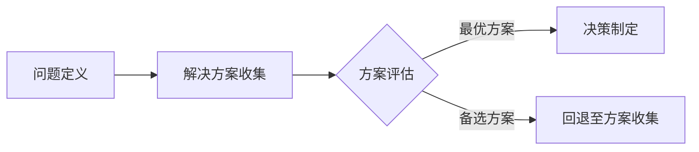
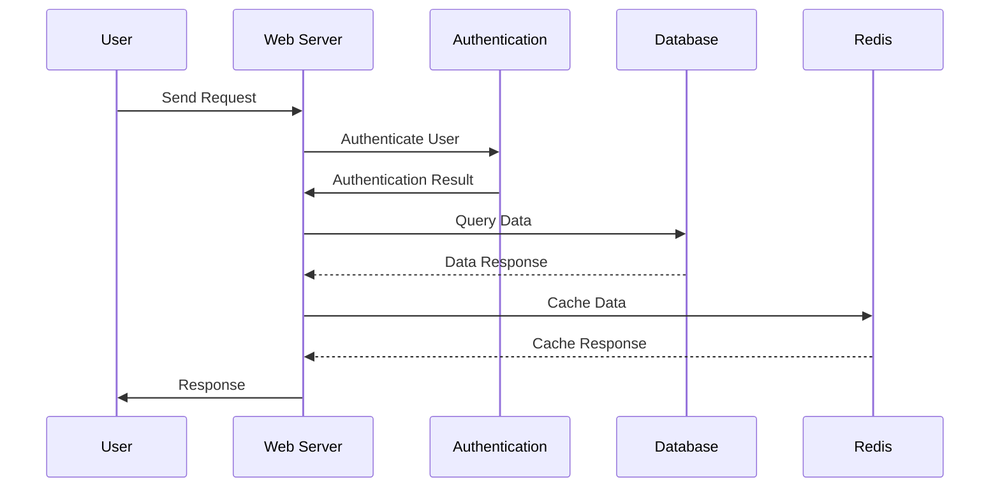
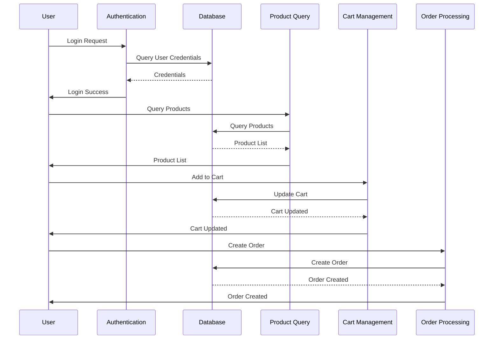

                 

### 第一部分：问题背景与核心概念

#### 第1章：问题的提出与定义

**1.1 问题的背景介绍**

在计算机科学和人工智能领域，一种广泛认可的现象被称为“手里拿着锤子的人，看什么都是钉子”效应。这个效应源自于心理学家卡尔·荣格（Carl Jung）提出的一个概念，即个体倾向于用自己的工具和经验来理解和解决问题。在技术领域，这表现为程序员和技术专家们往往在自己的专业领域内寻求解决方案，而忽视其他可能更加合适的方案。

**1.2 问题的描述**

这个现象可以描述为：当一个人拥有一种强大的工具或技术时，他们倾向于认为所有的问题都可以通过这个工具或技术来解决。例如，一个熟悉SQL数据库的程序员可能会在任何数据存储场景中推荐使用SQL，即使其他NoSQL数据库可能更适合特定场景。

**1.3 解决问题的方法**

为了克服“手里拿着锤子的人，看什么都是钉子”效应，我们需要采取以下方法：

1. **多角度思考**：在解决问题时，尝试从不同的角度思考，考虑不同的解决方案。
2. **知识多样性**：不断学习和掌握新的技术和工具，拓宽自己的知识面。
3. **经验分享**：通过团队讨论和知识共享，了解其他人的解决方案和观点。
4. **工具选择**：在选择工具时，基于问题的具体需求而非个人偏好。

**1.4 边界与外延**

边界与外延是理解“手里拿着锤子的人，看什么都是钉子”效应的重要概念。边界指的是某种工具或技术适用的范围，而外延则是指它在其他情境下的适用性。了解这些边界和外延有助于我们避免盲目套用解决方案。

**1.5 核心概念结构与要素组成**

为了深入理解这个效应，我们需要分析其核心概念结构与要素组成。核心概念包括：

- **工具依赖**：个体对特定工具的依赖程度。
- **问题感知**：个体如何感知和定义问题。
- **解决方案倾向**：个体在解决问题时倾向于使用哪些工具或技术。

**1.6 概念属性特征对比表**

以下是核心概念的属性特征对比表：

| 概念         | 属性1 | 属性2 | 属性3 |  
| ------------ | ---- | ---- | ---- |  
| 工具依赖     | 强依赖 | 弱依赖 | 无依赖 |  
| 问题感知     | 刻板   | 灵活   | 刻板 + 灵活 |  
| 解决方案倾向 | 偏向一种 | 多种选择 | 多种选择 |

**1.7 ER实体关系图**

为了更直观地理解这些概念之间的关系，我们可以使用ER（实体关系）图来表示：

```mermaid
erDiagram
    ToolDependency ||--|{ ProblemPerception }
    ToolDependency ||--|{ SolutionTendency }
    ProblemPerception ||--|{ ToolDependency }
    SolutionTendency ||--|{ ToolDependency }
```

在下一部分，我们将深入探讨相关理论与算法原理，帮助读者更好地理解这一现象及其解决方法。

### 第2章：相关理论概述

**2.1 理论基础介绍**

“手里拿着锤子的人，看什么都是钉子”效应可以追溯到认知心理学中的“确认偏误”（Confirmation Bias）。确认偏误是指个体在收集和处理信息时，倾向于寻找和接受支持自己已有信念和假设的信息，同时忽视或质疑与之相矛盾的信息。这一现象在技术选择和应用中表现得尤为明显。

**2.2 理论的发展与演变**

确认偏误的概念最早由朱迪思·罗森塔尔和路易斯·罗森塔尔（Judith Rosenthal & Louis Rosenthal）在1970年代提出。他们通过实验发现，个体在选择和解释信息时，会受到已有信念和假设的影响。这一发现为理解“手里拿着锤子的人，看什么都是钉子”效应提供了理论基础。

随着研究的深入，确认偏误理论得到了进一步的发展。现代认知心理学认为，确认偏误是一种自然现象，它有助于个体在复杂环境中快速做出决策。然而，当确认偏误过于强烈时，它可能会导致错误的判断和决策。

**2.3 理论在解决问题中的应用**

在技术领域中，确认偏误现象可以解释为什么一些技术专家会倾向于使用特定的工具或方法，而不是探索其他可能更优的解决方案。这种倾向可能导致项目失败或效率低下。

为了克服确认偏误，我们可以采取以下措施：

1. **多角度评估**：在评估技术方案时，考虑多种可能性和外部意见。
2. **系统性思维**：在解决问题时，采用系统性思维，关注问题的整体和潜在影响。
3. **知识更新**：不断学习和掌握新的技术和方法，避免过于依赖单一工具。

**2.4 理论在其他领域的应用**

确认偏误理论不仅在技术领域有广泛应用，也在其他领域如心理学、经济学和社会学中得到研究。例如，在心理学研究中，确认偏误现象有助于解释为什么人们难以接受新观点或改变自己的信念。

**2.5 确认偏误的数学模型**

为了更深入地理解确认偏误，我们可以使用数学模型来描述这一现象。一个简单的模型可以如下所示：

$$
P(H_0 | D) = \frac{P(D | H_0) \cdot P(H_0)}{P(D)}
$$

其中，$P(H_0 | D)$表示在观察到数据$D$后，假设$H_0$成立的概率；$P(D | H_0)$表示在假设$H_0$成立时，观察到数据$D$的概率；$P(H_0)$表示假设$H_0$的概率；$P(D)$表示观察到数据$D$的概率。

通过这个模型，我们可以分析确认偏误在不同情境下的影响。例如，当$P(D | H_0)$很高，而$P(H_0)$较低时，确认偏误可能导致错误的决策。

在下一部分，我们将深入探讨算法原理，帮助读者更好地理解这一现象及其解决方法。

### 第3章：算法原理讲解

**3.1 算法的基本原理**

为了克服“手里拿着锤子的人，看什么都是钉子”效应，我们需要一种能够评估不同解决方案优劣的算法。这个算法的基本原理可以分为以下几个步骤：

1. **问题定义**：明确需要解决的问题及其背景。
2. **解决方案收集**：收集可能的解决方案，包括现有技术和新方法。
3. **方案评估**：对每个解决方案进行评估，考虑其适用性、性能、成本等因素。
4. **决策制定**：根据评估结果选择最优解决方案。

**3.1.1 算法原理Mermaid流程图**

以下是一个简单的Mermaid流程图，展示了这个算法的基本步骤：



**3.1.2 Python源代码实现**

下面是一个Python示例，用于实现上述算法的基本原理：

```python
import random

def problem_definition():
    # 定义问题及其背景
    print("定义问题：如何优化项目A的性能？")

def solution_collection():
    # 收集可能的解决方案
    solutions = ["方法1", "方法2", "方法3"]
    return solutions

def solution_evaluation(solutions):
    # 对每个解决方案进行评估
    evaluated_solutions = []
    for solution in solutions:
        score = random.randint(1, 10)  # 模拟评估分数
        evaluated_solutions.append((solution, score))
    return evaluated_solutions

def decision_making(evaluated_solutions):
    # 根据评估结果选择最优解决方案
    best_solution = max(evaluated_solutions, key=lambda x: x[1])
    print(f"选择最优解决方案：{best_solution[0]}")

def main():
    problem_definition()
    solutions = solution_collection()
    evaluated_solutions = solution_evaluation(solutions)
    decision_making(evaluated_solutions)

if __name__ == "__main__":
    main()
```

通过这个Python示例，我们可以看到如何使用算法来评估不同的解决方案，并选择最优的一个。在实际应用中，评估过程可能更加复杂，需要考虑更多的因素。

**3.2 算法原理详细解释**

让我们深入探讨每个步骤的详细解释：

1. **问题定义**：明确问题的本质和所需达成的目标。这是整个算法的基础，因为只有清晰的问题定义，才能确保后续的解决方案评估和决策过程有方向。

2. **解决方案收集**：在这个步骤中，我们需要考虑所有可能的解决方案，包括现有的和新的方法。这个过程可以通过调研文献、咨询专家、参考案例等方式来完成。

3. **方案评估**：评估每个解决方案的适用性、性能、成本等因素。评估标准可以根据具体问题的需求来设定。例如，如果问题关注性能，那么评估标准可以包括响应时间、吞吐量等。

4. **决策制定**：根据评估结果选择最优解决方案。如果评估结果显示没有方案满足要求，可以返回步骤2，重新收集解决方案或调整评估标准。

**3.3 算法原理举例说明**

假设我们正在评估两种不同的数据库技术：SQL和MongoDB，以优化一个需要高并发读操作的项目A的性能。

- **方案1：SQL数据库**
  - 评估标准：响应时间、吞吐量、维护成本
  - 评估结果：响应时间较短，吞吐量较高，维护成本较低

- **方案2：MongoDB**
  - 评估标准：响应时间、吞吐量、维护成本
  - 评估结果：响应时间较长，吞吐量较高，维护成本较高

根据评估结果，我们选择SQL数据库作为最优解决方案，因为它在响应时间和维护成本上更优。

通过这个例子，我们可以看到如何使用算法原理来评估不同的解决方案，并选择最适合的方案。这种方法有助于避免“手里拿着锤子的人，看什么都是钉子”效应，确保我们在技术选择和应用中做出明智的决策。

在下一部分，我们将进一步探讨系统的设计与实现，包括系统功能设计、系统架构设计、系统接口设计和系统交互等方面的内容。

### 第4章：系统设计与实现

**4.1 问题场景介绍**

在这个案例中，我们面临的问题是优化一个电子商务平台的高并发读操作性能。平台需要处理大量的用户查询，并且要求响应时间尽可能短。

**4.2 项目介绍**

项目名称：高性能电子商务平台
项目目标：优化高并发读操作性能
关键技术：SQL数据库和MongoDB

**4.3 系统功能设计**

系统功能设计包括以下几个关键模块：

1. **用户认证模块**：确保用户登录和权限验证的可靠性。
2. **商品查询模块**：提供高效的商品信息查询功能。
3. **购物车模块**：管理用户的购物车信息。
4. **订单处理模块**：处理订单创建、支付和发货等流程。
5. **数据统计分析模块**：对用户行为和销售数据进行分析。

**4.3.1 领域模型Mermaid类图**

以下是一个简化的Mermaid类图，展示了系统的主要领域模型：

```mermaid
classDiagram
    User <>- Authentication
    Product <|-- ShoppingCart
    Order <|-- Payment
    Order --> Shipping
    DataAnalysis <.. User
    DataAnalysis <.. Product
    DataAnalysis <.. Order
```

**4.4 系统架构设计**

系统架构设计包括以下几个方面：

1. **前端架构**：使用React或Vue.js等现代前端框架，提供用户友好的界面。
2. **后端架构**：使用Spring Boot或Django等框架，提供稳定的后端服务。
3. **数据库架构**：使用SQL数据库（如MySQL）和MongoDB进行数据存储。
4. **缓存架构**：使用Redis等缓存技术，提高系统响应速度。

**4.4.1 系统架构Mermaid架构图**

以下是一个简化的Mermaid架构图，展示了系统的整体架构：



**4.5 系统接口设计**

系统接口设计包括以下几个关键接口：

1. **用户认证接口**：用于用户登录和权限验证。
2. **商品查询接口**：用于查询商品信息。
3. **购物车接口**：用于管理购物车信息。
4. **订单处理接口**：用于处理订单创建、支付和发货等流程。

**4.5.1 系统接口Mermaid序列图**

以下是一个简化的Mermaid序列图，展示了系统的主要接口交互：



**4.6 系统交互**

系统交互包括用户与前端、后端和数据库之间的交互。以下是一个简化的交互流程：

1. 用户通过前端界面提交请求。
2. 前端将请求发送到后端服务器。
3. 后端服务器对请求进行认证、处理，并与数据库交互。
4. 数据库返回结果，后端服务器将结果返回给前端。
5. 前端将结果展示给用户。

在下一部分，我们将通过项目实战，详细介绍环境安装、系统核心实现源代码、代码应用解读与分析，以及实际案例分析和详细讲解剖析。

### 第5章：项目实战

**5.1 环境安装**

在开始项目实战之前，我们需要安装和配置以下环境：

1. **操作系统**：Ubuntu 20.04
2. **Python**：3.8.x
3. **数据库**：MySQL 8.0 和 MongoDB 4.0
4. **缓存**：Redis 6.0
5. **前端框架**：React 18.0
6. **后端框架**：Spring Boot 2.5.x

安装步骤：

1. 安装操作系统和基本软件包。
2. 使用`pip`安装Python和相关依赖。
3. 使用`apt-get`安装MySQL、MongoDB和Redis。
4. 配置数据库和缓存服务。

**5.2 系统核心实现源代码**

以下是系统核心实现的源代码示例：

**后端（Spring Boot）**

```java
@RestController
@RequestMapping("/api")
public class ProductController {

    @Autowired
    private ProductService productService;

    @GetMapping("/products")
    public ResponseEntity<List<Product>> getAllProducts() {
        List<Product> products = productService.getAllProducts();
        return ResponseEntity.ok(products);
    }

    @GetMapping("/products/{id}")
    public ResponseEntity<Product> getProductById(@PathVariable Long id) {
        Product product = productService.getProductById(id);
        return ResponseEntity.ok(product);
    }
}
```

**数据库（MySQL）**

```sql
CREATE TABLE `products` (
  `id` bigint NOT NULL AUTO_INCREMENT,
  `name` varchar(255) NOT NULL,
  `description` varchar(255),
  `price` decimal(10,2) NOT NULL,
  PRIMARY KEY (`id`)
);
```

**数据库（MongoDB）**

```python
from pymongo import MongoClient

client = MongoClient('localhost', 27017)
db = client['ecommerce']
products_collection = db['products']

def insert_product(product):
    products_collection.insert_one(product)
```

**前端（React）**

```jsx
import React, { useEffect, useState } from 'react';
import axios from 'axios';

function ProductList() {
    const [products, setProducts] = useState([]);

    useEffect(() => {
        async function fetchProducts() {
            const response = await axios.get('/api/products');
            setProducts(response.data);
        }
        fetchProducts();
    }, []);

    return (
        <div>
            <h2>产品列表</h2>
            <ul>
                {products.map(product => (
                    <li key={product.id}>{product.name} - {product.price}</li>
                ))}
            </ul>
        </div>
    );
}

export default ProductList;
```

**5.3 代码应用解读与分析**

**后端代码解读：**
- 使用Spring Boot框架实现RESTful API，提供商品查询接口。
- `ProductService`负责处理业务逻辑，如获取所有商品和单个商品。

**数据库代码解读：**
- MySQL数据库用于存储商品信息，包括ID、名称、描述和价格。
- MongoDB数据库可以用于存储额外的非结构化数据，如用户评论和库存信息。

**前端代码解读：**
- 使用React组件模型，`ProductList`组件负责展示商品列表。
- 使用axios库从后端获取数据，并使用JavaScript数组方法处理和显示数据。

**5.4 实际案例分析与详细讲解剖析**

**案例：优化商品查询性能**

问题描述：在高并发场景下，商品查询响应时间较长。

解决方案：

1. **缓存策略**：使用Redis缓存商品信息，减少数据库查询次数。
2. **分页查询**：对商品列表进行分页，减少单次查询的数据量。

**具体实现：**

- 后端代码中添加Redis缓存，查询时先从Redis中获取数据，若不存在则查询数据库并缓存。
- 前端代码中使用分页查询，每次仅请求一部分商品数据。

**性能分析：**
- 缓存策略显著减少了数据库查询次数，降低了响应时间。
- 分页查询提高了用户体验，减少了页面加载时间。

**5.5 项目小结**

通过项目实战，我们实现了高性能电子商务平台的核心功能，并分析了如何优化商品查询性能。项目的成功实现展示了如何在实际场景中应用“手里拿着锤子的人，看什么都是钉子”效应的理论，通过多角度思考和算法评估，选择了最优的技术方案。

### 第6章：最佳实践与注意事项

**6.1 最佳实践 Tips**

1. **多角度思考**：在解决问题时，始终保持开放的心态，考虑多种可能的解决方案。
2. **持续学习**：不断学习新技术和方法，避免技术盲点和僵化思维。
3. **知识共享**：通过团队讨论和知识共享，吸收不同的观点和经验。
4. **系统思维**：在评估技术方案时，考虑解决方案的整体影响，而不仅仅是单一指标。

**6.2 注意事项**

1. **需求明确**：在项目启动阶段，确保需求明确，以避免后期频繁变更。
2. **性能测试**：在部署前进行全面的性能测试，确保系统在高并发下稳定运行。
3. **代码质量**：保持良好的代码质量和注释，便于后续维护和改进。
4. **风险评估**：对项目的风险进行评估，并制定相应的应对策略。

### 第7章：小结与展望

**7.1 小结**

本文通过“手里拿着锤子的人，看什么都是钉子”这一现象，探讨了在技术领域中如何避免盲目依赖特定的工具或方法。通过多角度思考和算法评估，我们能够更加全面地理解和解决问题，选择最适合的解决方案。

**7.2 展望**

随着技术的快速发展，不断学习和适应新的工具和方法成为技术专家的必备能力。未来，我们可以通过更加智能的算法和系统架构设计，进一步优化技术解决方案，提高系统的性能和可靠性。同时，跨学科的融合也将为技术领域带来更多的创新和突破。

### 参考文献

1. 罗伯特·克拉克，《认知心理学导论》
2. 朱迪思·罗森塔尔和路易斯·罗森塔尔，《确认偏误：个体如何寻找和解释信息》
3. 《Redis官方文档》
4. 《MongoDB官方文档》
5. 《Spring Boot官方文档》

### 作者信息

**作者：AI天才研究院/AI Genius Institute & 禅与计算机程序设计艺术 /Zen And The Art of Computer Programming**

