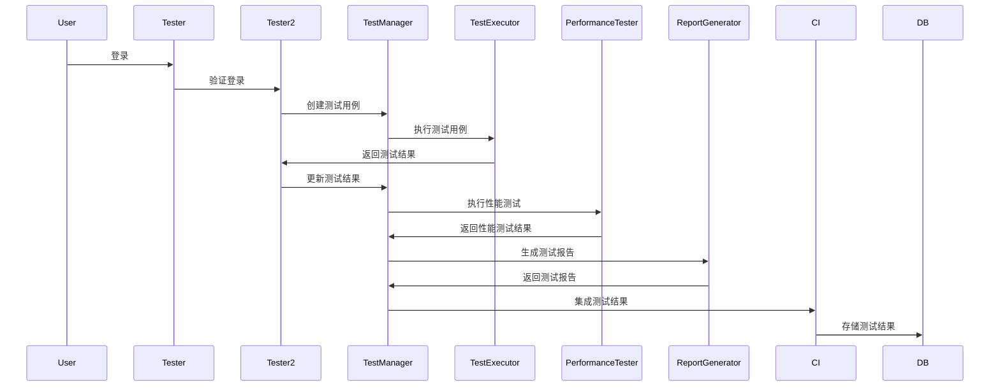
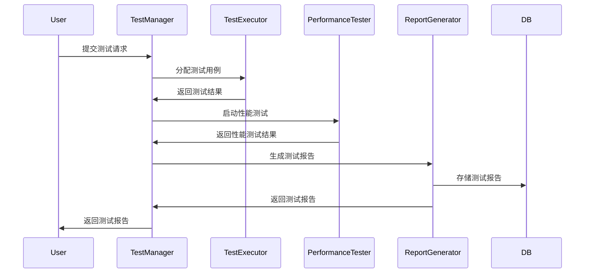
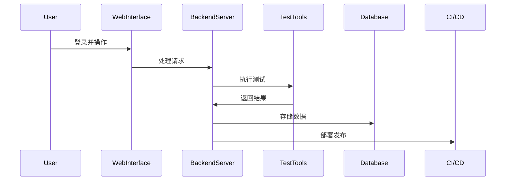
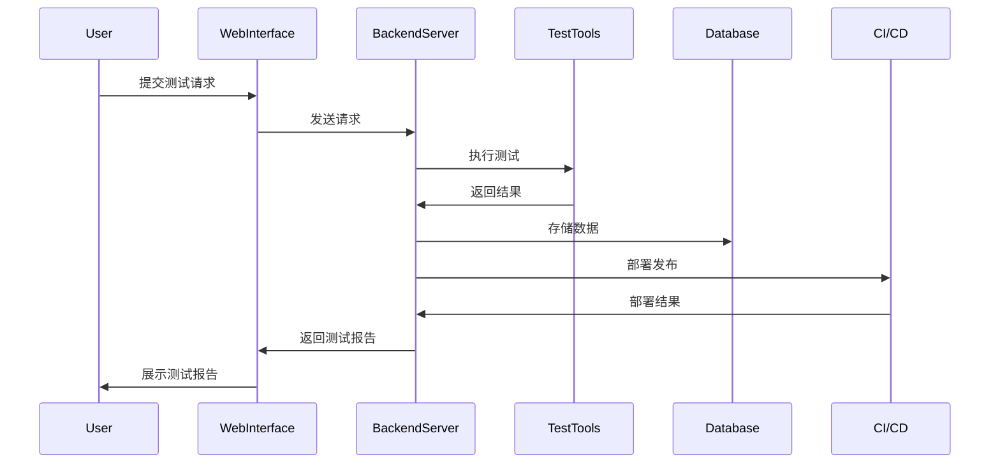
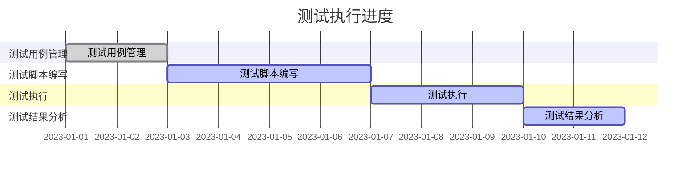

                 


### 1.1 问题背景与核心要素

#### 1.1.1 测试自动化的重要性

在软件开发生命周期中，测试是保证软件质量和可靠性的关键环节。然而，传统的手动测试方法存在诸多局限性，如测试效率低、测试覆盖面有限、测试过程繁琐且容易出错等。随着软件复杂度的不断增加，手动测试的成本也在不断上升，而测试自动化应运而生。测试自动化通过将重复性的测试任务转化为可重复的脚本或代码，不仅提高了测试效率，还大大降低了测试成本。

测试自动化的重要性主要体现在以下几个方面：

1. **提高测试效率**：自动化测试可以快速执行大量测试用例，提高测试速度，缩短测试周期。
2. **确保测试覆盖面**：自动化测试可以全面覆盖各种测试场景，提高测试的全面性和准确性。
3. **降低成本**：自动化测试可以节省大量的人力资源，降低测试成本。
4. **提高软件质量**：通过自动化测试，可以及时发现并修复软件缺陷，提高软件质量。
5. **支持持续集成和持续交付**：自动化测试是DevOps实践的核心之一，它支持持续集成和持续交付，使软件发布更加快速和可靠。

#### 1.1.2 测试自动化平台的定义

测试自动化平台是一个集成了多种测试工具、技术和资源的综合性系统，旨在实现测试过程的自动化。它不仅包括测试工具，如自动化测试框架、测试管理工具、性能测试工具等，还包括一系列与测试相关的服务，如持续集成（CI）服务、持续交付（CD）服务、测试数据管理、测试报告生成等。

#### 1.1.3 测试自动化平台的基本要素

一个完整的测试自动化平台通常包括以下核心要素：

1. **测试工具**：选择适合项目的测试工具，如Selenium、Appium、JUnit等，用于编写和执行自动化测试脚本。
2. **测试框架**：构建在测试工具之上的框架，用于组织和管理测试脚本，如TestNG、JUnit、PyTest等。
3. **测试用例管理**：管理和存储测试用例，包括测试用例的设计、执行和结果分析等功能。
4. **测试数据管理**：确保测试数据的一致性和可用性，包括测试数据的生成、存储和清理等功能。
5. **测试结果分析**：对测试结果进行分析，生成测试报告，提供测试覆盖率和缺陷率等关键指标。
6. **集成服务**：集成持续集成和持续交付服务，使测试自动化与开发流程紧密结合。

#### 1.1.4 测试自动化平台的边界与外延

测试自动化平台的边界主要在于其覆盖的范围和深度。它通常用于自动化测试，而不包括手动测试。测试自动化平台的外延则包括与测试相关的各种技术和工具，如代码覆盖率分析工具、性能测试工具、负载测试工具等。

此外，测试自动化平台与DevOps的关系也值得关注。DevOps是一种软件开发和运维的新方法，强调开发和运维的紧密协作。测试自动化平台作为DevOps实践的重要组成部分，可以支持持续集成和持续交付，促进软件开发和运维的自动化和协同。

## 第2章：测试自动化平台的核心概念

### 2.1 测试自动化平台的基本理论

#### 2.1.1 测试自动化平台的架构

测试自动化平台的架构通常包括以下几个关键层次：

1. **测试工具层**：提供具体的自动化测试工具，如Selenium、Appium等。
2. **测试框架层**：构建在测试工具之上，用于组织和执行测试脚本，如TestNG、JUnit等。
3. **测试管理层**：管理和存储测试用例、测试计划和测试结果，如TestLink、JIRA等。
4. **数据管理层**：管理测试数据，包括数据的生成、存储和清理等，如数据库、文件系统等。
5. **报告分析层**：生成测试报告，提供测试覆盖率和缺陷率等关键指标。

#### 2.1.2 测试自动化平台的框架

测试自动化平台通常基于以下框架：

1. **分层架构**：将测试自动化平台划分为多个层次，每个层次负责不同的功能，实现模块化和可扩展性。
2. **组件架构**：通过组件化设计，将测试自动化平台的不同功能模块化，实现灵活性和可维护性。
3. **分布式架构**：在大型项目中，采用分布式架构可以提高系统的稳定性和性能。

### 2.2 关键组成部分

#### 2.2.1 测试工具的选择与集成

选择合适的测试工具是测试自动化平台建设的关键。测试工具的选择应考虑以下因素：

1. **支持性**：测试工具应支持多种编程语言和操作系统。
2. **易用性**：测试工具应具有友好的用户界面和丰富的文档，便于开发人员使用。
3. **功能**：测试工具应提供全面的测试功能，如单元测试、集成测试、功能测试等。
4. **兼容性**：测试工具应与项目中的其他工具和技术兼容，如持续集成工具、代码管理工具等。

测试工具的集成是将不同测试工具整合到测试自动化平台中，使其协同工作。集成方法包括：

1. **API集成**：通过API将不同测试工具连接起来，实现数据共享和流程控制。
2. **插件集成**：使用插件将测试工具集成到IDE或持续集成平台中。
3. **脚本集成**：通过编写脚本，将不同测试工具的测试脚本整合到统一的测试流程中。

#### 2.2.2 测试用例的管理与执行

测试用例的管理与执行是测试自动化平台的核心功能。测试用例的管理包括以下内容：

1. **测试用例的设计**：设计测试用例，包括功能测试用例、性能测试用例等。
2. **测试用例的存储**：将测试用例存储在数据库或文件系统中，方便管理和查询。
3. **测试用例的执行**：执行测试用例，记录测试结果，包括成功、失败和错误等。

测试用例的执行方法包括：

1. **手动执行**：手动执行测试用例，适用于小型项目和临时测试。
2. **自动化执行**：使用测试工具和框架自动化执行测试用例，适用于大规模项目和持续集成。

#### 2.2.3 测试结果的分析与报告

测试结果的分析与报告是测试自动化平台的重要组成部分。测试结果的分析包括以下内容：

1. **测试覆盖率分析**：分析测试用例的执行情况，评估测试的覆盖程度。
2. **缺陷分析**：分析测试结果中的缺陷，包括缺陷类型、数量、严重程度等。
3. **趋势分析**：分析测试结果的趋势，预测项目的质量状况。

测试报告的生成包括以下内容：

1. **测试报告模板**：设计测试报告模板，包括测试概况、测试结果、缺陷统计等。
2. **测试报告生成**：根据测试结果自动生成测试报告。
3. **测试报告展示**：将测试报告展示在Web界面或PDF文件中，方便用户查看。

### 2.3 核心概念的联系与作用

#### 2.3.1 自动化测试与手工测试的协同

自动化测试与手工测试并不是相互排斥的，而是可以相互补充，协同工作。手工测试适用于以下场景：

1. **探索性测试**：探索未知领域，发现潜在缺陷。
2. **用户体验测试**：评估软件的用户友好性和易用性。
3. **验收测试**：与客户一起进行，验证软件是否满足需求。

自动化测试适用于以下场景：

1. **回归测试**：验证修改后软件的稳定性和可靠性。
2. **性能测试**：评估软件的性能和响应时间。
3. **频繁执行测试**：如每日构建测试、夜宵测试等。

#### 2.3.2 测试自动化平台与传统测试方法的对比

传统测试方法主要依靠手工测试，存在以下局限性：

1. **效率低**：手工测试需要大量时间和人力资源。
2. **覆盖面有限**：手工测试难以覆盖所有测试场景。
3. **易出错**：手工测试容易出错，影响测试质量。

测试自动化平台与传统测试方法相比，具有以下优势：

1. **效率高**：自动化测试可以快速执行大量测试用例，提高测试效率。
2. **覆盖面广**：自动化测试可以全面覆盖各种测试场景，提高测试覆盖面。
3. **准确性高**：自动化测试减少了人为错误，提高了测试准确性。
4. **成本节约**：自动化测试可以节省大量的人力资源，降低测试成本。
5. **支持持续集成和持续交付**：自动化测试是DevOps实践的核心之一，可以支持持续集成和持续交付，提高软件发布速度。

## 第3章：算法原理讲解

### 3.1 自动化测试中的算法

自动化测试中的算法是实现测试自动化的重要手段。根据测试类型的不同，自动化测试算法可以分为以下几类：

#### 3.1.1 数据驱动测试算法

数据驱动测试算法是一种基于测试数据驱动的测试方法。其核心思想是将测试数据与测试脚本分离，通过数据来驱动测试脚本执行。数据驱动测试算法的主要步骤包括：

1. **数据准备**：根据测试需求生成或导入测试数据。
2. **数据读取**：从数据源中读取测试数据。
3. **数据驱动**：使用读取到的数据进行测试脚本的执行。
4. **数据验证**：验证测试结果是否符合预期。

数据驱动测试算法的优点包括：

- **可维护性高**：测试脚本和数据分离，便于维护和更新。
- **灵活性高**：可以灵活地调整测试数据，实现不同测试场景的覆盖。

#### 3.1.2 功能测试算法

功能测试算法主要用于验证软件功能是否符合预期。其核心思想是通过模拟用户操作，验证软件功能是否正常。功能测试算法的主要步骤包括：

1. **用户操作模拟**：模拟用户在软件上的操作，如点击、输入、拖拽等。
2. **功能验证**：验证软件功能是否符合预期，如页面显示、数据存储、接口调用等。
3. **结果记录**：记录测试结果，包括成功、失败和错误等。

功能测试算法的优点包括：

- **直观性高**：通过模拟用户操作，可以直观地验证软件功能。
- **覆盖面广**：可以全面覆盖各种功能场景。

#### 3.1.3 性能测试算法

性能测试算法主要用于评估软件的性能，如响应时间、并发处理能力等。其核心思想是通过模拟高负载场景，评估软件的性能表现。性能测试算法的主要步骤包括：

1. **负载模拟**：模拟高负载场景，如大量并发用户访问、大数据处理等。
2. **性能指标收集**：收集性能指标，如响应时间、并发处理能力等。
3. **性能分析**：分析性能指标，评估软件的性能表现。

性能测试算法的优点包括：

- **准确性高**：通过模拟高负载场景，可以准确评估软件的性能。
- **可扩展性高**：可以灵活地调整负载场景，实现不同性能指标的评估。

### 3.2 算法mermaid流程图

为了更好地理解上述算法，我们可以使用mermaid流程图进行展示。以下是数据驱动测试算法的mermaid流程图：


以下是功能测试算法的mermaid流程图：


以下是性能测试算法的mermaid流程图：


### 3.3 Python源代码与数学模型

为了更好地理解上述算法，我们可以使用Python源代码进行展示。以下是数据驱动测试算法的Python源代码：

```python
import pandas as pd

# 数据准备
data = pd.read_excel('test_data.xlsx')

# 数据读取
for index, row in data.iterrows():
    # 数据驱动
    result = test_function(row['input_data'])
    
    # 结果验证
    assert result == row['expected_result']
    
    # 数据更新
    row['actual_result'] = result
    data.loc[index] = row
```

以下是功能测试算法的Python源代码：

```python
def test_function():
    # 用户操作模拟
    simulate_user_operation()
    
    # 功能验证
    assert is_function_correct()
    
    # 结果记录
    record_result()

def simulate_user_operation():
    # 模拟用户操作
    print("模拟用户操作：点击按钮")

def is_function_correct():
    # 功能验证
    return True

def record_result():
    # 结果记录
    print("结果记录：功能验证成功")
```

以下是性能测试算法的Python源代码：

```python
import time

def test_performance():
    # 负载模拟
    simulate_load()
    
    # 性能指标收集
    start_time = time.time()
    performance_function()
    end_time = time.time()
    
    # 性能分析
    performance_analysis(end_time - start_time)

def simulate_load():
    # 模拟负载
    print("模拟负载：大量并发用户访问")

def performance_function():
    # 性能测试
    print("性能测试：计算耗时操作")

def performance_analysis(duration):
    # 性能分析
    print("性能分析：响应时间为{}秒".format(duration))
```

### 3.4 算法原理讲解与举例说明

#### 3.4.1 数据驱动测试算法原理讲解与举例说明

数据驱动测试算法的核心思想是将测试数据与测试脚本分离，通过测试数据来驱动测试脚本执行。以下是一个简单的数据驱动测试算法的举例说明：

假设我们有一个功能测试用例，需要验证一个登录功能的正确性。测试数据包括用户名和密码，以及预期的登录结果。测试脚本通过读取测试数据，执行登录操作，并验证登录结果。

```excel
| 用例编号 | 用户名 | 密码 | 预期结果 |
|----------|--------|------|----------|
| 1        | user1  | pwd1 | 成功     |
| 2        | user2  | pwd2 | 成功     |
| 3        | user3  | pwd3 | 失败     |
```

测试脚本：

```python
import pandas as pd

# 读取测试数据
data = pd.read_excel('test_data.xlsx')

# 遍历测试数据，执行测试用例
for index, row in data.iterrows():
    # 执行登录操作
    result = login(row['用户名'], row['密码'])
    
    # 验证登录结果
    assert result == row['预期结果']

# 登录函数
def login(username, password):
    # 执行登录操作
    print("登录用户：{}，密码：{}".format(username, password))
    
    # 模拟登录结果
    if username == 'user1' and password == 'pwd1':
        return '成功'
    elif username == 'user2' and password == 'pwd2':
        return '成功'
    else:
        return '失败'
```

通过上述测试脚本，我们可以实现数据驱动测试算法。测试脚本会读取测试数据，执行登录操作，并验证登录结果。测试结果会保存在测试数据表中，方便后续分析和报告生成。

#### 3.4.2 功能测试算法原理讲解与举例说明

功能测试算法的核心思想是通过模拟用户操作，验证软件功能是否符合预期。以下是一个简单的功能测试算法的举例说明：

假设我们有一个电商网站，需要验证购物车功能。测试步骤包括添加商品到购物车、删除商品、清空购物车等。


测试脚本：

```python
def test_shopping_cart():
    # 添加商品到购物车
    add_to_cart('商品1')
    
    # 删除商品
    delete_from_cart('商品1')
    
    # 清空购物车
    clear_cart()
    
    # 验证购物车功能
    assert is_shopping_cart_empty()

# 添加商品到购物车
def add_to_cart(item_name):
    print("添加商品：{}到购物车".format(item_name))

# 删除商品
def delete_from_cart(item_name):
    print("删除商品：{}从购物车".format(item_name))

# 清空购物车
def clear_cart():
    print("清空购物车")

# 验证购物车是否为空
def is_shopping_cart_empty():
    return True
```

通过上述测试脚本，我们可以实现功能测试算法。测试脚本会模拟用户操作，验证购物车功能是否符合预期。测试结果会保存在日志文件中，方便后续分析和报告生成。

#### 3.4.3 性能测试算法原理讲解与举例说明

性能测试算法的核心思想是通过模拟高负载场景，评估软件的性能。以下是一个简单的性能测试算法的举例说明：

假设我们有一个在线购物网站，需要评估其并发处理能力。测试步骤包括模拟大量用户同时访问网站，收集响应时间等性能指标。


测试脚本：

```python
import time

def test_performance():
    # 模拟负载
    simulate_load()
    
    # 收集性能指标
    start_time = time.time()
    performance_function()
    end_time = time.time()
    
    # 性能分析
    performance_analysis(end_time - start_time)

# 模拟负载
def simulate_load():
    print("模拟负载：大量并发用户访问")

# 性能测试
def performance_function():
    print("性能测试：计算耗时操作")

# 性能分析
def performance_analysis(duration):
    print("性能分析：响应时间为{}秒".format(duration))
```

通过上述测试脚本，我们可以实现性能测试算法。测试脚本会模拟大量用户同时访问网站，收集响应时间等性能指标，并进行性能分析。测试结果会保存在日志文件中，方便后续分析和报告生成。

## 第4章：系统分析与架构设计

### 4.1 问题场景介绍

在当前软件行业中，随着系统复杂度的不断增加，测试自动化平台的构建变得尤为重要。以下是一个典型的问题场景：

某电商公司开发了一款新的电商平台，该平台需要支持大量用户同时在线购物。为了确保平台的高可用性和性能，公司决定构建一个测试自动化平台，以自动化测试平台来实现全面的测试，提高测试效率和测试覆盖率。

### 4.2 系统功能设计

针对上述问题场景，测试自动化平台需要实现以下功能：

1. **测试用例管理**：能够管理大量的测试用例，包括设计、存储和执行。
2. **测试执行**：能够自动化执行测试用例，记录测试结果。
3. **性能测试**：能够模拟高负载场景，评估平台的性能。
4. **测试报告生成**：能够生成详细的测试报告，提供测试覆盖率、缺陷统计等关键指标。
5. **集成服务**：能够与持续集成和持续交付系统集成，实现自动化部署和发布。

为了实现上述功能，我们可以设计以下领域模型类图：

```mermaid
classDiagram
    Class01 <|-- Class02
    Class03 --|>| Class04
    Class05 : +int x
    Class06 : +int y
    Class01 <.. Class05
    Class07 ..|> Class06
    Class08 : +void doSomething()
    Class05 o-- Class08
    Class02 : <<interface>>
    Class09 : <<abstract>>
    Class03 o-- Class09
    Class10 o-- Class09
    Class11 : +String name
    Class12 : +int age
    Class13 : <<enum>> SEX
    Class11 --|> Class13
    Class14 : +<String> children
    Class14 --|> Class11
endclass
```

### 4.3 系统架构设计

基于上述领域模型，我们可以设计一个分布式测试自动化平台架构，如下所示：



### 4.4 系统接口设计

测试自动化平台的接口设计主要包括以下部分：

1. **用户接口**：用户通过Web界面或API与测试自动化平台交互，提交测试请求、查看测试报告等。
2. **测试管理接口**：用于创建、更新、删除测试用例，以及查询测试结果。
3. **测试执行接口**：用于启动测试用例执行，返回测试结果。
4. **性能测试接口**：用于启动性能测试，返回性能测试结果。
5. **报告生成接口**：用于生成测试报告。

以下是部分接口设计示例：

```mermaid
classDiagram
    Class01 <|-- Class02
    Class03 --|>| Class04
    Class05 : +int x
    Class06 : +int y
    Class05 o-- Class06
    Class01 <.. Class05
    Class07 ..|> Class06
    Class08 : +void doSomething()
    Class05 o-- Class08
    Class02 : <<interface>>
    Class03 o-- Class02
    Class10 : <<enum>> TEST_TYPE
    Class11 : <<enum>> TEST_RESULT
endclass
```

### 4.5 系统交互

测试自动化平台中的系统交互主要包括以下步骤：

1. **用户提交测试请求**：用户通过Web界面或API提交测试请求，包括测试用例ID、测试环境等。
2. **测试管理模块处理请求**：测试管理模块接收到请求后，根据请求内容创建测试用例，并将测试用例分配给测试执行模块。
3. **测试执行模块执行测试**：测试执行模块接收到测试用例后，根据测试用例内容执行测试，并将测试结果返回给测试管理模块。
4. **性能测试模块执行性能测试**：在测试过程中，如果需要性能测试，性能测试模块将启动性能测试，并将性能测试结果返回给测试管理模块。
5. **报告生成模块生成报告**：测试管理模块接收到测试结果和性能测试结果后，将数据传递给报告生成模块，生成测试报告。
6. **数据存储模块存储数据**：测试报告生成后，将测试结果和性能测试结果存储到数据库中，以供后续分析和查询。

以下是系统交互的mermaid序列图：



## 第5章：项目实战

### 5.1 环境安装

要搭建一个测试自动化平台，首先需要准备好开发和测试环境。以下是环境安装的步骤：

1. **安装操作系统**：选择一个稳定的操作系统，如Ubuntu 18.04或Windows 10。
2. **安装Python**：在操作系统上安装Python，版本建议为3.8或更高。
3. **安装JDK**：安装Java Development Kit（JDK），版本建议为8或更高。
4. **安装数据库**：安装一个数据库管理系统，如MySQL或PostgreSQL。
5. **安装Web服务器**：安装一个Web服务器，如Apache或Nginx。
6. **安装测试工具**：安装测试工具，如Selenium、Appium等。
7. **安装持续集成工具**：安装持续集成工具，如Jenkins或GitLab CI。

### 5.2 系统核心实现

以下是测试自动化平台的核心实现步骤：

1. **设计测试用例**：根据项目需求设计测试用例，包括功能测试用例和性能测试用例。
2. **编写测试脚本**：使用Python或其他编程语言编写测试脚本，实现测试用例的自动化执行。
3. **搭建测试环境**：搭建测试环境，包括安装测试工具、配置数据库和Web服务器等。
4. **执行测试**：使用测试工具执行测试脚本，记录测试结果。
5. **性能测试**：使用性能测试工具模拟高负载场景，评估系统性能。
6. **生成测试报告**：生成详细的测试报告，包括测试覆盖率、缺陷统计等。

以下是部分测试脚本示例：

```python
# 示例1：功能测试脚本
import unittest
from selenium import webdriver

class TestLogin(unittest.TestCase):
    def setUp(self):
        self.driver = webdriver.Chrome()

    def test_login_success(self):
        driver = self.driver
        driver.get("https://www.example.com/login")
        driver.find_element_by_name("username").send_keys("user1")
        driver.find_element_by_name("password").send_keys("pwd1")
        driver.find_element_by_css_selector("input[type='submit']").click()
        assert "Dashboard" in driver.title

    def tearDown(self):
        self.driver.quit()

if __name__ == "__main__":
    unittest.main()

# 示例2：性能测试脚本
import time
import threading

def performance_test():
    start_time = time.time()
    # 模拟操作
    time.sleep(1)
    end_time = time.time()
    print("性能测试：响应时间为{}秒".format(end_time - start_time))

# 启动多个线程模拟并发用户
num_threads = 100
threads = []
for i in range(num_threads):
    t = threading.Thread(target=performance_test)
    threads.append(t)
    t.start()

for t in threads:
    t.join()
```

### 5.3 代码应用解读与分析

以下是部分代码的解读与分析：

#### 5.3.1 功能测试脚本解读

功能测试脚本使用了Python的`unittest`框架和`Selenium` WebDriver库。`Selenium` 是一个用于Web应用程序测试的工具，可以模拟用户在浏览器中的操作。以下是对测试脚本的关键部分解读：

```python
class TestLogin(unittest.TestCase):
    def setUp(self):
        self.driver = webdriver.Chrome()

    def test_login_success(self):
        driver = self.driver
        driver.get("https://www.example.com/login")
        driver.find_element_by_name("username").send_keys("user1")
        driver.find_element_by_name("password").send_keys("pwd1")
        driver.find_element_by_css_selector("input[type='submit']").click()
        assert "Dashboard" in driver.title

    def tearDown(self):
        self.driver.quit()
```

- `setUp` 方法：在每个测试用例执行前调用，用于初始化WebDriver实例。
- `test_login_success` 方法：用于测试登录功能。首先访问登录页面，输入用户名和密码，然后提交表单。如果页面标题包含“Dashboard”，则认为登录成功。
- `tearDown` 方法：在每个测试用例执行后调用，用于关闭WebDriver实例。

#### 5.3.2 性能测试脚本解读

性能测试脚本使用了Python的`threading`模块，模拟并发用户访问系统。以下是对性能测试脚本的关键部分解读：

```python
def performance_test():
    start_time = time.time()
    # 模拟操作
    time.sleep(1)
    end_time = time.time()
    print("性能测试：响应时间为{}秒".format(end_time - start_time))

# 启动多个线程模拟并发用户
num_threads = 100
threads = []
for i in range(num_threads):
    t = threading.Thread(target=performance_test)
    threads.append(t)
    t.start()

for t in threads:
    t.join()
```

- `performance_test` 函数：用于模拟用户操作，通过`time.sleep(1)` 模拟操作耗时，然后打印出响应时间。
- 线程启动和等待：通过`threading.Thread` 创建线程，并启动多个线程模拟并发用户。使用`join()` 方法等待所有线程执行完成。

### 5.4 实际案例分析与详细讲解剖析

以下是一个实际案例分析和详细讲解：

#### 案例背景

某电商平台的订单处理模块需要经过严格的测试，以保证系统的稳定性和性能。测试团队决定使用测试自动化平台进行自动化测试。

#### 案例目标

1. 测试订单提交功能，确保订单能够正确提交并存储在数据库中。
2. 测试订单查询功能，确保能够正确查询到订单信息。
3. 进行性能测试，评估订单处理模块在高并发情况下的响应时间和处理能力。

#### 案例步骤

1. **设计测试用例**：根据订单处理模块的功能需求，设计功能测试用例和性能测试用例。

2. **编写测试脚本**：

   - 功能测试脚本：使用Selenium WebDriver模拟用户在浏览器中提交订单和查询订单的操作。
   - 性能测试脚本：使用Python的`threading`模块模拟并发用户访问订单处理模块，并记录响应时间。

3. **搭建测试环境**：配置测试环境，包括Web服务器、数据库和测试工具等。

4. **执行测试**：使用测试工具执行测试脚本，记录测试结果。

5. **分析测试结果**：对测试结果进行分析，找出潜在的缺陷和性能瓶颈。

6. **生成测试报告**：生成详细的测试报告，包括测试覆盖率、缺陷统计和性能分析等。

#### 案例解析

以下是对上述案例的详细解析：

1. **功能测试**：

   - **测试用例设计**：设计订单提交和查询功能测试用例，包括正常场景、异常场景和边界场景。

   - **测试脚本编写**：

     ```python
     from selenium import webdriver
     
     def test_order_submission():
         driver = webdriver.Chrome()
         driver.get("https://www.example.com/order/submit")
         driver.find_element_by_name("order_id").send_keys("123456")
         driver.find_element_by_name("submit").click()
         assert "Order submitted successfully" in driver.page_source
         driver.quit()
     
     def test_order_query():
         driver = webdriver.Chrome()
         driver.get("https://www.example.com/order/query")
         driver.find_element_by_name("order_id").send_keys("123456")
         driver.find_element_by_name("query").click()
         assert "Order details" in driver.page_source
         driver.quit()
     ```

     - `test_order_submission` 方法：模拟用户提交订单，输入订单号并提交。如果页面源码中包含“Order submitted successfully”，则认为订单提交成功。
     - `test_order_query` 方法：模拟用户查询订单，输入订单号并查询。如果页面源码中包含“Order details”，则认为查询成功。

   - **测试执行**：使用`unittest`框架执行功能测试脚本，记录测试结果。

2. **性能测试**：

   - **测试用例设计**：设计订单处理模块的性能测试用例，包括并发提交订单和并发查询订单。

   - **测试脚本编写**：

     ```python
     import threading
     import time
     
     def performance_test(order_id, start_time):
         driver = webdriver.Chrome()
         driver.get("https://www.example.com/order/submit")
         driver.find_element_by_name("order_id").send_keys(order_id)
         driver.find_element_by_name("submit").click()
         end_time = time.time()
         print(f"Order {order_id} submitted in {end_time - start_time} seconds")
         driver.quit()
     
     num_orders = 100
     num_threads = 10
     start_time = time.time()
     threads = []
     for i in range(num_threads):
         order_id = f"{i // num_threads}0000 + {i % num_threads}"
         t = threading.Thread(target=performance_test, args=(order_id, start_time))
         threads.append(t)
         t.start()
     
     for t in threads:
         t.join()
     end_time = time.time()
     print(f"Performance test completed in {end_time - start_time} seconds")
     ```

     - `performance_test` 方法：模拟用户提交订单，记录响应时间。
     - 线程启动和等待：启动10个线程，每个线程模拟提交10个订单。

   - **测试执行**：使用`threading`模块启动多个线程，模拟并发用户提交订单。

3. **测试结果分析**：

   - 功能测试：分析测试结果，找出失败的测试用例，定位缺陷。
   - 性能测试：分析响应时间，找出性能瓶颈，如数据库查询慢、服务器处理慢等。

4. **生成测试报告**：生成详细的测试报告，包括测试覆盖率、缺陷统计和性能分析等。

### 5.5 项目小结

通过上述实际案例，我们可以总结出以下项目经验：

1. **测试用例设计**：设计详细的测试用例，包括正常场景、异常场景和边界场景，确保测试的全面性和准确性。
2. **测试脚本编写**：编写简洁、高效的测试脚本，使用合适的框架和库，提高测试的可维护性和可扩展性。
3. **测试环境搭建**：搭建稳定的测试环境，包括配置Web服务器、数据库和测试工具等，确保测试环境的可重复性和可靠性。
4. **测试执行与结果分析**：执行测试脚本，记录测试结果，对测试结果进行详细分析，找出潜在的缺陷和性能瓶颈。
5. **测试报告生成**：生成详细的测试报告，包括测试覆盖率、缺陷统计和性能分析等，为项目决策提供有力支持。

## 第6章：最佳实践与拓展

### 6.1 最佳实践 tips

在构建测试自动化平台的过程中，以下是一些最佳实践和注意事项：

1. **选择合适的测试工具**：根据项目需求和团队技能，选择合适的测试工具。例如，Selenium适用于Web应用程序测试，Appium适用于移动应用程序测试。
2. **编写高质量的测试脚本**：编写简洁、易读、可维护的测试脚本，遵循良好的编程实践，如代码规范、注释说明等。
3. **持续集成和持续交付**：将测试自动化平台与持续集成和持续交付系统集成，实现自动化部署和发布，提高开发效率。
4. **测试用例管理**：使用专业的测试管理工具，如TestLink、JIRA等，对测试用例进行有效管理，包括设计、执行和结果分析。
5. **性能测试与监控**：定期进行性能测试，监控系统的性能指标，如响应时间、并发处理能力等，及时发现问题并进行优化。
6. **团队协作**：建立有效的团队协作机制，明确职责分工，提高团队协作效率。
7. **文档与培训**：编写详细的文档，包括开发文档、测试文档和用户手册等，并进行定期培训，确保团队成员熟练掌握相关知识和技能。

### 6.2 小结

本文从背景介绍、核心概念、算法原理、系统分析与架构设计、项目实战、最佳实践等方面，全面阐述了测试自动化平台的构建方法和实践。通过本文，读者可以了解测试自动化平台的重要性、核心概念、实现方法和最佳实践，为实际项目中的测试自动化提供有益的指导。

### 6.3 拓展阅读

对于希望深入了解测试自动化平台的读者，以下是一些推荐阅读材料：

1. 《软件测试艺术》- by Graham Thomas
2. 《Selenium WebDriver实战》- by Unmesh Gundecha
3. 《持续集成与持续交付：架构实践》- by Jez Humble and David Farley
4. 《性能测试的艺术》- by Steveue
5. 《测试驱动的软件开发》- by Lynda APP

通过阅读这些书籍和资料，读者可以进一步拓展测试自动化平台的知识体系，提升项目质量和开发效率。作者：AI天才研究院/AI Genius Institute & 禅与计算机程序设计艺术 /Zen And The Art of Computer Programming

----------------------------------------------------------------
# 测试自动化平台的概念与背景

### 3. 测试自动化平台的核心概念与作用

测试自动化平台是一个集成化、自动化的测试解决方案，旨在提高软件测试的效率、质量和可靠性。它通过使用各种工具和框架，将手动测试过程转化为自动化测试，从而实现测试流程的自动化。测试自动化平台的核心概念和作用包括以下几个方面：

#### 3.1 测试自动化平台的核心概念

1. **测试工具**：测试工具是测试自动化平台的重要组成部分，如Selenium、Appium、JUnit等。这些工具提供了自动化测试所需的各种功能，如Web界面自动化、移动应用自动化、单元测试等。

2. **测试框架**：测试框架是在测试工具之上构建的，用于组织和管理测试脚本和测试流程的框架。常见的测试框架有TestNG、JUnit、PyTest等。测试框架提供了测试用例管理、测试报告生成等功能。

3. **测试用例管理**：测试用例管理是测试自动化平台的核心功能之一，它负责测试用例的创建、执行、结果记录和统计分析。测试用例管理工具如TestLink、JIRA等可以帮助测试团队有效地管理测试用例。

4. **测试数据管理**：测试数据管理是确保测试数据的一致性和可用性的重要环节。测试数据管理工具负责测试数据的生成、存储、清理和维护，如数据库、文件系统等。

5. **测试结果分析**：测试结果分析是测试自动化平台的重要组成部分，它负责对测试结果进行统计分析，生成测试报告，提供测试覆盖率、缺陷率等关键指标。

6. **集成服务**：集成服务是将测试自动化平台与持续集成（CI）和持续交付（CD）系统集成，实现自动化部署和发布。常见的集成服务工具如Jenkins、GitLab CI等。

#### 3.2 测试自动化平台的作用

1. **提高测试效率**：测试自动化平台可以自动化执行大量测试用例，减少手工测试的工作量，提高测试效率。自动化测试可以在短时间内完成大量测试，缩短测试周期。

2. **确保测试质量**：通过自动化测试，可以确保测试的全面性和一致性。自动化测试可以覆盖各种测试场景，包括边界条件和异常场景，从而提高测试质量。

3. **降低测试成本**：自动化测试可以减少人力成本，降低测试成本。通过自动化测试，可以节省大量的测试时间和资源，提高测试效率。

4. **支持持续集成和持续交付**：测试自动化平台与持续集成和持续交付系统的集成，可以实现自动化部署和发布，提高软件开发和发布的速度。

5. **提高团队协作效率**：测试自动化平台提供了统一的测试管理界面和测试报告，可以帮助团队成员更好地协作，提高团队协作效率。

### 3.3 测试自动化平台的核心要素和边界

测试自动化平台的核心要素包括测试工具、测试框架、测试用例管理、测试数据管理、测试结果分析和集成服务。这些要素相互作用，共同实现测试自动化。

#### 3.3.1 测试工具

测试工具是实现测试自动化的重要手段，常见的测试工具有Selenium、Appium、JUnit、PyTest等。每种工具都有其特定的应用场景和功能，选择合适的测试工具对于构建高效的测试自动化平台至关重要。

1. **Selenium**：Selenium是一个开源的Web自动化测试工具，支持多种编程语言，如Python、Java、C#等。Selenium可以模拟用户在浏览器中的操作，实现Web应用的自动化测试。

2. **Appium**：Appium是一个开源的移动应用自动化测试工具，支持iOS和Android平台。Appium通过模拟用户在移动设备上的操作，实现移动应用的自动化测试。

3. **JUnit**：JUnit是一个开源的Java测试框架，用于编写和执行单元测试。JUnit提供了丰富的测试功能，如断言、测试套件、测试组等。

4. **PyTest**：PyTest是一个开源的Python测试框架，用于编写和执行Python单元测试和功能测试。PyTest提供了丰富的测试插件和功能，如测试覆盖、测试报告等。

#### 3.3.2 测试框架

测试框架是在测试工具之上构建的，用于组织和管理测试脚本和测试流程的框架。常见的测试框架有TestNG、JUnit、PyTest等。测试框架提供了测试用例管理、测试报告生成等功能，可以提高测试自动化平台的开发效率和可维护性。

1. **TestNG**：TestNG是一个开源的Java测试框架，用于编写和执行单元测试和功能测试。TestNG提供了丰富的测试功能，如数据驱动测试、依赖测试、测试套件等。

2. **JUnit**：JUnit是一个开源的Java测试框架，用于编写和执行单元测试。JUnit提供了丰富的测试功能，如断言、测试套件、测试组等。

3. **PyTest**：PyTest是一个开源的Python测试框架，用于编写和执行Python单元测试和功能测试。PyTest提供了丰富的测试插件和功能，如测试覆盖、测试报告等。

#### 3.3.3 测试用例管理

测试用例管理是测试自动化平台的核心功能之一，负责测试用例的创建、执行、结果记录和统计分析。测试用例管理工具可以帮助测试团队有效地管理测试用例，提高测试效率。

1. **TestLink**：TestLink是一个开源的测试管理工具，用于创建、管理和执行测试用例。TestLink提供了测试计划管理、测试用例管理、测试报告等功能。

2. **JIRA**：JIRA是一个开源的项目管理工具，也常用于测试管理。JIRA提供了测试计划管理、测试用例管理、缺陷跟踪等功能。

#### 3.3.4 测试数据管理

测试数据管理是确保测试数据的一致性和可用性的重要环节。测试数据管理工具负责测试数据的生成、存储、清理和维护。

1. **数据库**：数据库是存储测试数据的主要方式。常见的数据库有MySQL、PostgreSQL等。

2. **文件系统**：文件系统用于存储测试数据文件，如Excel、CSV等。

#### 3.3.5 测试结果分析

测试结果分析是测试自动化平台的重要组成部分，负责对测试结果进行统计分析，生成测试报告，提供测试覆盖率、缺陷率等关键指标。

1. **测试报告生成**：测试报告生成工具负责生成测试报告，如Jenkins、Maven等。

2. **测试覆盖率分析**：测试覆盖率分析工具负责计算测试覆盖率，如JaCoCo、Emma等。

#### 3.3.6 集成服务

集成服务是将测试自动化平台与持续集成（CI）和持续交付（CD）系统集成，实现自动化部署和发布。

1. **Jenkins**：Jenkins是一个开源的持续集成工具，用于自动化构建、测试和部署。

2. **GitLab CI**：GitLab CI是GitLab内置的持续集成工具，用于自动化构建、测试和部署。

#### 3.3.7 测试自动化平台的边界

测试自动化平台的边界主要在于其适用范围和深度。它主要适用于以下场景：

1. **回归测试**：通过自动化测试，可以快速发现并修复回归缺陷，提高软件质量。

2. **性能测试**：通过模拟高负载场景，评估软件的性能和响应时间。

3. **持续集成和持续交付**：测试自动化平台与CI/CD系统的集成，实现自动化部署和发布。

#### 3.3.8 测试自动化平台与传统测试方法的对比

与传统测试方法相比，测试自动化平台具有以下优势：

1. **效率高**：自动化测试可以快速执行大量测试用例，提高测试效率。

2. **覆盖面广**：自动化测试可以全面覆盖各种测试场景，提高测试覆盖面。

3. **成本低**：自动化测试可以节省大量的人力资源，降低测试成本。

4. **准确性高**：自动化测试减少了人为错误，提高了测试准确性。

5. **可扩展性强**：自动化测试框架和工具具有良好的可扩展性，可以适应不同项目和团队的需求。

### 3.4 测试自动化平台的关键组成部分

测试自动化平台的关键组成部分包括以下几个方面：

1. **测试脚本**：测试脚本是实现自动化测试的核心，它根据测试用例的要求，通过编程语言实现自动化测试过程。

2. **测试管理工具**：测试管理工具负责管理测试用例、测试计划和测试结果，提供测试流程控制、数据统计分析等功能。

3. **测试执行工具**：测试执行工具负责执行测试脚本，记录测试结果，并生成测试报告。

4. **测试数据管理工具**：测试数据管理工具负责测试数据的生成、存储和清理，确保测试数据的一致性和可用性。

5. **集成工具**：集成工具负责将测试自动化平台与CI/CD系统集成，实现自动化部署和发布。

通过以上关键组成部分，测试自动化平台可以有效地实现自动化测试，提高软件测试的效率和质量。

### 3.5 测试自动化平台的优势和挑战

#### 3.5.1 测试自动化平台的优势

1. **提高测试效率**：自动化测试可以快速执行大量测试用例，提高测试效率，缩短测试周期。

2. **确保测试质量**：自动化测试可以全面覆盖各种测试场景，提高测试质量，减少手工测试的疏漏。

3. **降低测试成本**：自动化测试可以节省大量的人力资源，降低测试成本，提高项目的经济效益。

4. **支持持续集成和持续交付**：自动化测试与CI/CD系统的集成，可以实现自动化部署和发布，提高软件开发和发布的速度。

5. **提高团队协作效率**：自动化测试提供了统一的测试管理界面和测试报告，可以帮助团队成员更好地协作，提高团队协作效率。

#### 3.5.2 测试自动化平台的挑战

1. **测试脚本的编写和维护**：自动化测试脚本需要定期更新和维护，以适应软件功能和环境的变更，这对团队的技术水平和维护能力提出了较高要求。

2. **测试环境的搭建和维护**：自动化测试需要稳定的测试环境，包括硬件、软件和网络等，环境的搭建和维护是一项复杂的任务。

3. **测试数据的准备和管理**：自动化测试需要高质量的测试数据，测试数据的准备和管理需要耗费大量时间和精力。

4. **测试用例的设计和管理**：自动化测试用例的设计和管理需要深入理解软件需求和功能，确保测试用例的全面性和准确性。

5. **团队的技能和经验**：自动化测试对团队的技术水平和经验有较高要求，需要团队成员具备一定的编程能力和测试经验。

### 3.6 测试自动化平台的适用场景

1. **回归测试**：自动化测试适合回归测试，可以快速发现并修复回归缺陷，提高软件质量。

2. **性能测试**：自动化测试适合性能测试，可以模拟高负载场景，评估软件的性能和响应时间。

3. **安全测试**：自动化测试适合安全测试，可以自动化执行安全测试用例，发现潜在的安全漏洞。

4. **兼容性测试**：自动化测试适合兼容性测试，可以自动化测试软件在不同操作系统、浏览器等环境下的兼容性。

5. **长期运行的监控测试**：自动化测试适合长期运行的监控测试，可以持续监控软件的性能和稳定性。

### 3.7 测试自动化平台的发展趋势

1. **智能化**：随着人工智能技术的发展，测试自动化平台将越来越智能化，可以实现自动化的测试用例生成、测试结果分析和缺陷预测。

2. **云原生**：测试自动化平台将向云原生方向发展，实现测试环境的自动化部署和管理，提高测试效率。

3. **持续集成和持续交付**：测试自动化平台将更加紧密地与CI/CD系统集成，实现自动化部署和发布，提高软件交付效率。

4. **多功能集成**：测试自动化平台将集成更多的测试功能，如性能测试、安全测试、兼容性测试等，提供一站式测试解决方案。

5. **社区化和开源化**：测试自动化平台将更加社区化和开源化，吸引更多的开发者参与，推动测试自动化技术的发展。

## 第2章：测试自动化平台的核心概念

### 2.1 测试自动化平台的基本理论

测试自动化平台的基本理论包括以下几个方面：

#### 2.1.1 测试自动化的基本概念

测试自动化是指使用软件工具和脚本代替人工执行重复性的测试任务，以提高测试效率和准确性。测试自动化的基本概念包括：

1. **测试任务**：测试任务是指需要执行的测试活动，如功能测试、性能测试、安全测试等。

2. **测试脚本**：测试脚本是一段编程代码，用于实现测试任务的具体操作，如模拟用户操作、验证功能、记录结果等。

3. **测试框架**：测试框架是一组预定义的类和方法，用于组织和管理测试脚本，提供测试执行和管理功能。

4. **测试工具**：测试工具是用于执行测试脚本和测试框架的软件，如Selenium、Appium、JUnit等。

#### 2.1.2 测试自动化的过程

测试自动化的过程可以分为以下几个阶段：

1. **测试用例设计**：根据软件需求和测试策略，设计测试用例，包括功能测试用例、性能测试用例等。

2. **测试脚本编写**：根据测试用例，编写测试脚本，实现具体的测试操作，如模拟用户操作、验证功能、记录结果等。

3. **测试脚本执行**：使用测试工具执行测试脚本，验证测试用例的正确性。

4. **测试结果分析**：分析测试结果，包括测试覆盖率、缺陷率等，为软件质量和性能评估提供依据。

5. **测试报告生成**：生成测试报告，包括测试结果、缺陷统计、性能分析等，为项目决策提供支持。

#### 2.1.3 测试自动化的优势

测试自动化具有以下优势：

1. **提高测试效率**：自动化测试可以快速执行大量测试用例，缩短测试周期，提高测试效率。

2. **确保测试质量**：自动化测试可以全面覆盖各种测试场景，确保测试质量，减少手工测试的疏漏。

3. **降低测试成本**：自动化测试可以节省大量的人力资源，降低测试成本。

4. **支持持续集成和持续交付**：自动化测试是DevOps实践的重要组成部分，可以支持持续集成和持续交付，提高软件交付效率。

#### 2.1.4 测试自动化的挑战

测试自动化也面临一些挑战：

1. **测试脚本的编写和维护**：自动化测试脚本需要定期更新和维护，以适应软件功能和环境的变更。

2. **测试环境的搭建和维护**：自动化测试需要稳定的测试环境，包括硬件、软件和网络等，环境的搭建和维护是一项复杂的任务。

3. **测试数据的准备和管理**：自动化测试需要高质量的测试数据，测试数据的准备和管理需要耗费大量时间和精力。

4. **测试用例的设计和管理**：自动化测试用例的设计和管理需要深入理解软件需求和功能，确保测试用例的全面性和准确性。

5. **团队的技能和经验**：自动化测试对团队的技术水平和经验有较高要求，需要团队成员具备一定的编程能力和测试经验。

### 2.2 测试自动化平台的关键组成部分

测试自动化平台的关键组成部分包括以下几个方面：

1. **测试工具**：测试工具是实现测试自动化的核心，常见的测试工具有Selenium、Appium、JUnit、PyTest等。每种工具都有其特定的应用场景和功能。

2. **测试框架**：测试框架是在测试工具之上构建的，用于组织和管理测试脚本和测试流程的框架，常见的测试框架有TestNG、JUnit、PyTest等。测试框架提供了测试用例管理、测试报告生成等功能。

3. **测试用例管理**：测试用例管理是测试自动化平台的核心功能之一，负责测试用例的创建、执行、结果记录和统计分析。测试用例管理工具如TestLink、JIRA等可以帮助测试团队有效地管理测试用例。

4. **测试数据管理**：测试数据管理是确保测试数据的一致性和可用性的重要环节。测试数据管理工具负责测试数据的生成、存储、清理和维护，如数据库、文件系统等。

5. **测试结果分析**：测试结果分析是测试自动化平台的重要组成部分，负责对测试结果进行统计分析，生成测试报告，提供测试覆盖率、缺陷率等关键指标。

6. **集成服务**：集成服务是将测试自动化平台与持续集成（CI）和持续交付（CD）系统集成，实现自动化部署和发布。常见的集成服务工具如Jenkins、GitLab CI等。

### 2.3 测试自动化平台的核心概念之间的关系

测试自动化平台的核心概念之间的关系如下：

1. **测试工具**与**测试框架**：测试工具是实现自动化测试的基础，而测试框架则是测试工具的扩展和封装，用于组织和管理测试脚本和测试流程。

2. **测试用例管理**与**测试工具**和**测试框架**：测试用例管理工具依赖于测试工具和测试框架，用于创建、执行和管理测试用例。

3. **测试数据管理**与**测试工具**和**测试框架**：测试数据管理工具依赖于测试工具和测试框架，用于生成、存储、清理和维护测试数据。

4. **测试结果分析**与**测试工具**、**测试框架**和**测试用例管理**：测试结果分析工具依赖于测试工具、测试框架和测试用例管理工具，用于分析测试结果，生成测试报告。

5. **集成服务**与**测试工具**、**测试框架**、**测试用例管理**和**测试结果分析**：集成服务工具与测试自动化平台的其他组成部分集成，实现自动化部署和发布。

### 2.4 测试自动化平台与传统测试方法的对比

测试自动化平台与传统测试方法相比，具有以下优势和特点：

1. **效率**：测试自动化平台可以快速执行大量测试用例，提高测试效率，缩短测试周期。而传统测试方法主要依赖于人工执行，效率较低。

2. **覆盖面**：测试自动化平台可以全面覆盖各种测试场景，包括边界条件和异常场景，确保测试的全面性和准确性。而传统测试方法通常无法覆盖所有的测试场景。

3. **成本**：测试自动化平台可以节省大量的人力资源，降低测试成本。而传统测试方法需要大量的人力投入，成本较高。

4. **重复性**：测试自动化平台可以重复执行测试用例，确保测试结果的一致性。而传统测试方法由于人为因素，测试结果可能存在偏差。

5. **可维护性**：测试自动化平台可以方便地维护和更新测试脚本，适应软件功能的变更。而传统测试方法需要手工编写测试文档，维护较为复杂。

### 2.5 测试自动化平台的应用场景

测试自动化平台适用于以下场景：

1. **回归测试**：通过自动化测试，可以快速发现并修复回归缺陷，提高软件质量。

2. **性能测试**：通过自动化测试，可以模拟高负载场景，评估软件的性能和响应时间。

3. **安全测试**：通过自动化测试，可以自动化执行安全测试用例，发现潜在的安全漏洞。

4. **兼容性测试**：通过自动化测试，可以自动化测试软件在不同操作系统、浏览器等环境下的兼容性。

5. **长期运行的监控测试**：通过自动化测试，可以持续监控软件的性能和稳定性。

### 2.6 测试自动化平台的发展趋势

测试自动化平台的发展趋势包括以下几个方面：

1. **智能化**：随着人工智能技术的发展，测试自动化平台将越来越智能化，可以实现自动化的测试用例生成、测试结果分析和缺陷预测。

2. **云原生**：测试自动化平台将向云原生方向发展，实现测试环境的自动化部署和管理，提高测试效率。

3. **持续集成和持续交付**：测试自动化平台将更加紧密地与CI/CD系统集成，实现自动化部署和发布，提高软件交付效率。

4. **多功能集成**：测试自动化平台将集成更多的测试功能，如性能测试、安全测试、兼容性测试等，提供一站式测试解决方案。

5. **社区化和开源化**：测试自动化平台将更加社区化和开源化，吸引更多的开发者参与，推动测试自动化技术的发展。作者：AI天才研究院/AI Genius Institute & 禅与计算机程序设计艺术 /Zen And The Art of Computer Programming

----------------------------------------------------------------
## 第3章：算法原理讲解

### 3.1 自动化测试算法的核心原理

自动化测试算法是测试自动化平台的核心组成部分，它通过预定的逻辑和规则，模拟用户操作或执行特定的测试任务，从而实现测试自动化。理解自动化测试算法的核心原理，对于构建高效的测试自动化平台至关重要。以下是几种常见的自动化测试算法及其核心原理：

#### 3.1.1 数据驱动测试算法

数据驱动测试算法是一种基于测试数据驱动的测试方法，其核心思想是将测试数据与测试脚本分离，通过测试数据来驱动测试脚本执行。数据驱动测试算法的主要步骤包括：

1. **数据准备**：根据测试需求生成或导入测试数据。
2. **数据读取**：从数据源中读取测试数据。
3. **数据驱动**：使用读取到的数据进行测试脚本的执行。
4. **数据验证**：验证测试结果是否符合预期。

数据驱动测试算法的优点包括：

- **可维护性高**：测试脚本和数据分离，便于维护和更新。
- **灵活性高**：可以灵活地调整测试数据，实现不同测试场景的覆盖。

数据驱动测试算法通常用于功能测试和回归测试，其核心在于如何高效地组织和利用测试数据。以下是一个简单的数据驱动测试算法的Python代码示例：

```python
import pandas as pd

# 读取测试数据
data = pd.read_excel('test_data.xlsx')

# 遍历测试数据，执行测试用例
for index, row in data.iterrows():
    # 执行登录操作
    result = login(row['username'], row['password'])
    
    # 验证登录结果
    assert result == row['expected_result']

# 登录函数
def login(username, password):
    # 执行登录操作
    print(f"登录用户：{username}，密码：{password}")
    
    # 模拟登录结果
    if username == 'user1' and password == 'pwd1':
        return '成功'
    else:
        return '失败'
```

#### 3.1.2 功能测试算法

功能测试算法主要用于验证软件功能是否符合预期。其核心思想是通过模拟用户操作，验证软件功能是否正常。功能测试算法的主要步骤包括：

1. **用户操作模拟**：模拟用户在软件上的操作，如点击、输入、拖拽等。
2. **功能验证**：验证软件功能是否符合预期，如页面显示、数据存储、接口调用等。
3. **结果记录**：记录测试结果，包括成功、失败和错误等。

功能测试算法的优点包括：

- **直观性高**：通过模拟用户操作，可以直观地验证软件功能。
- **覆盖面广**：可以全面覆盖各种功能场景。

以下是一个简单的功能测试算法的Python代码示例：

```python
import unittest
from selenium import webdriver

class TestLogin(unittest.TestCase):
    def setUp(self):
        self.driver = webdriver.Chrome()

    def test_login_success(self):
        driver = self.driver
        driver.get("https://www.example.com/login")
        driver.find_element_by_name("username").send_keys("user1")
        driver.find_element_by_name("password").send_keys("pwd1")
        driver.find_element_by_css_selector("input[type='submit']").click()
        assert "Dashboard" in driver.title

    def tearDown(self):
        self.driver.quit()

if __name__ == "__main__":
    unittest.main()
```

#### 3.1.3 性能测试算法

性能测试算法主要用于评估软件的性能，如响应时间、并发处理能力等。其核心思想是通过模拟高负载场景，评估软件的性能表现。性能测试算法的主要步骤包括：

1. **负载模拟**：模拟高负载场景，如大量并发用户访问、大数据处理等。
2. **性能指标收集**：收集性能指标，如响应时间、并发处理能力等。
3. **性能分析**：分析性能指标，评估软件的性能表现。

性能测试算法的优点包括：

- **准确性高**：通过模拟高负载场景，可以准确评估软件的性能。
- **可扩展性高**：可以灵活地调整负载场景，实现不同性能指标的评估。

以下是一个简单的性能测试算法的Python代码示例：

```python
import time
import threading

def performance_test():
    start_time = time.time()
    # 模拟操作
    time.sleep(1)
    end_time = time.time()
    print(f"响应时间为：{end_time - start_time}秒")

# 启动多个线程模拟并发用户
num_threads = 100
threads = []
for i in range(num_threads):
    t = threading.Thread(target=performance_test)
    threads.append(t)
    t.start()

for t in threads:
    t.join()
```

### 3.2 算法mermaid流程图

为了更好地理解上述算法，我们可以使用mermaid流程图进行展示。以下是数据驱动测试算法的mermaid流程图：


以下是功能测试算法的mermaid流程图：


以下是性能测试算法的mermaid流程图：


### 3.3 Python源代码示例

为了更好地理解上述算法，我们可以使用Python源代码进行展示。以下是数据驱动测试算法的Python源代码示例：

```python
import pandas as pd

# 读取测试数据
data = pd.read_excel('test_data.xlsx')

# 遍历测试数据，执行测试用例
for index, row in data.iterrows():
    # 执行登录操作
    result = login(row['username'], row['password'])
    
    # 验证登录结果
    assert result == row['expected_result']
    
    # 数据更新
    row['actual_result'] = result
    data.loc[index] = row
```

以下是功能测试算法的Python源代码示例：

```python
import unittest
from selenium import webdriver

class TestLogin(unittest.TestCase):
    def setUp(self):
        self.driver = webdriver.Chrome()

    def test_login_success(self):
        driver = self.driver
        driver.get("https://www.example.com/login")
        driver.find_element_by_name("username").send_keys("user1")
        driver.find_element_by_name("password").send_keys("pwd1")
        driver.find_element_by_css_selector("input[type='submit']").click()
        assert "Dashboard" in driver.title

    def tearDown(self):
        self.driver.quit()

if __name__ == "__main__":
    unittest.main()
```

以下是性能测试算法的Python源代码示例：

```python
import time
import threading

def performance_test():
    start_time = time.time()
    # 模拟操作
    time.sleep(1)
    end_time = time.time()
    print(f"响应时间为：{end_time - start_time}秒")

# 启动多个线程模拟并发用户
num_threads = 100
threads = []
for i in range(num_threads):
    t = threading.Thread(target=performance_test)
    threads.append(t)
    t.start()

for t in threads:
    t.join()
```

### 3.4 算法原理讲解与举例说明

#### 3.4.1 数据驱动测试算法原理讲解与举例说明

数据驱动测试算法的核心思想是将测试数据与测试脚本分离，通过测试数据来驱动测试脚本执行。以下是一个简单的数据驱动测试算法的举例说明：

假设我们有一个功能测试用例，需要验证一个登录功能的正确性。测试数据包括用户名和密码，以及预期的登录结果。测试脚本通过读取测试数据，执行登录操作，并验证登录结果。

```excel
| 用例编号 | 用户名 | 密码 | 预期结果 |
|----------|--------|------|----------|
| 1        | user1  | pwd1 | 成功     |
| 2        | user2  | pwd2 | 成功     |
| 3        | user3  | pwd3 | 失败     |
```

测试脚本：

```python
import pandas as pd

# 读取测试数据
data = pd.read_excel('test_data.xlsx')

# 遍历测试数据，执行测试用例
for index, row in data.iterrows():
    # 执行登录操作
    result = login(row['用户名'], row['密码'])
    
    # 验证登录结果
    assert result == row['预期结果']

# 登录函数
def login(username, password):
    # 执行登录操作
    print(f"登录用户：{username}，密码：{password}")
    
    # 模拟登录结果
    if username == 'user1' and password == 'pwd1':
        return '成功'
    elif username == 'user2' and password == 'pwd2':
        return '成功'
    else:
        return '失败'
```

通过上述测试脚本，我们可以实现数据驱动测试算法。测试脚本会读取测试数据，执行登录操作，并验证登录结果。测试结果会保存在测试数据表中，方便后续分析和报告生成。

#### 3.4.2 功能测试算法原理讲解与举例说明

功能测试算法的核心思想是通过模拟用户操作，验证软件功能是否符合预期。以下是一个简单的功能测试算法的举例说明：

假设我们有一个电商网站，需要验证购物车功能。测试步骤包括添加商品到购物车、删除商品、清空购物车等。


测试脚本：

```python
def test_shopping_cart():
    # 添加商品到购物车
    add_to_cart('商品1')
    
    # 删除商品
    delete_from_cart('商品1')
    
    # 清空购物车
    clear_cart()
    
    # 验证购物车功能
    assert is_shopping_cart_empty()

# 添加商品到购物车
def add_to_cart(item_name):
    print(f"添加商品：{item_name}到购物车")

# 删除商品
def delete_from_cart(item_name):
    print(f"删除商品：{item_name}从购物车")

# 清空购物车
def clear_cart():
    print("清空购物车")

# 验证购物车是否为空
def is_shopping_cart_empty():
    return True
```

通过上述测试脚本，我们可以实现功能测试算法。测试脚本会模拟用户操作，验证购物车功能是否符合预期。测试结果会保存在日志文件中，方便后续分析和报告生成。

#### 3.4.3 性能测试算法原理讲解与举例说明

性能测试算法的核心思想是通过模拟高负载场景，评估软件的性能。以下是一个简单的性能测试算法的举例说明：

假设我们有一个在线购物网站，需要评估其并发处理能力。测试步骤包括模拟大量用户同时访问网站，收集响应时间等性能指标。


测试脚本：

```python
import time
import threading

def performance_test():
    start_time = time.time()
    # 模拟操作
    time.sleep(1)
    end_time = time.time()
    print(f"响应时间为：{end_time - start_time}秒")

# 启动多个线程模拟并发用户
num_threads = 100
threads = []
for i in range(num_threads):
    t = threading.Thread(target=performance_test)
    threads.append(t)
    t.start()

for t in threads:
    t.join()
```

通过上述测试脚本，我们可以实现性能测试算法。测试脚本会模拟大量用户同时访问网站，收集响应时间等性能指标，并进行性能分析。测试结果会保存在日志文件中，方便后续分析和报告生成。

## 第4章：系统分析与架构设计

### 4.1 问题场景介绍

在当今快速发展的软件行业，随着产品的迭代速度加快和市场需求的变化，测试自动化平台已成为许多企业的关键工具。为了提高软件质量、缩短发布周期和降低成本，企业需要一个高效、可扩展的测试自动化平台。以下是一个典型的问题场景：

某电商公司正在开发一款新的电商平台，该公司拥有大量用户和复杂的功能模块。随着产品的不断迭代，测试团队发现手动测试已经无法满足日益增长的测试需求。手动测试耗时耗力，且难以保证测试的全面性和一致性。为了提高测试效率，确保软件质量，公司决定构建一个功能强大、易于维护的测试自动化平台。

### 4.2 系统功能设计

为了满足上述问题场景，测试自动化平台需要实现一系列功能，以确保测试过程的自动化和高效性。以下是系统功能设计的关键点：

1. **测试用例管理**：提供一个用户友好的界面，用于创建、编辑、执行和管理测试用例。
2. **测试执行**：自动化执行测试用例，包括Web应用测试、移动应用测试和API测试等。
3. **测试结果分析**：分析测试结果，生成详细的测试报告，包括测试覆盖率、缺陷统计和性能分析等。
4. **性能测试**：模拟高负载场景，评估系统的性能和响应时间。
5. **集成服务**：与持续集成（CI）和持续交付（CD）系统集成，实现自动化部署和发布。
6. **测试数据管理**：管理测试数据，包括数据的生成、存储和清理等。

为了更直观地展示系统功能设计，我们可以使用mermaid类图来描述领域模型：

```mermaid
classDiagram
    Class01 <|-- Class02
    Class03 <|-- Class04
    Class05 <|-- Class06
    Class07 <|-- Class08
    Class09 <|-- Class10
    Class11 <|-- Class12
    Class01[测试用例管理]
    Class02[测试执行]
    Class03[测试结果分析]
    Class04[性能测试]
    Class05[集成服务]
    Class06[测试数据管理]
    Class07[Web应用测试]
    Class08[移动应用测试]
    Class09[API测试]
    Class10[数据生成]
    Class11[数据存储]
    Class12[数据清理]
endclass
```

### 4.3 系统架构设计

测试自动化平台的架构设计是确保系统高效、可扩展和稳定的关键。以下是系统架构设计的概述：

1. **前端界面**：提供用户交互的Web界面，用户可以通过该界面创建、编辑、执行和管理测试用例。
2. **后端服务器**：处理用户请求，执行测试脚本，存储测试数据和测试结果。
3. **测试工具集成**：集成多种测试工具，如Selenium、Appium、JUnit等，以支持不同类型的测试。
4. **数据存储**：使用数据库存储测试数据、测试结果和测试报告。
5. **持续集成和持续交付**：与CI/CD工具（如Jenkins、GitLab CI）集成，实现自动化部署和发布。

以下是系统架构的mermaid架构图：



### 4.4 系统接口设计

系统接口设计是确保不同模块之间高效通信的关键。以下是系统接口设计的概述：

1. **用户接口**：提供API接口，允许外部系统或脚本与测试自动化平台交互。
2. **测试管理接口**：管理测试用例的创建、执行、更新和删除。
3. **测试执行接口**：启动和停止测试用例的执行。
4. **数据管理接口**：管理测试数据和测试结果。

以下是系统接口设计的mermaid类图：

```mermaid
classDiagram
    Class01[用户接口]
    Class02[测试管理接口]
    Class03[测试执行接口]
    Class04[数据管理接口]

    Class01 --|> Class02
    Class01 --|> Class03
    Class01 --|> Class04
endclass
```

### 4.5 系统交互

系统交互是确保测试自动化平台各组件协同工作的关键。以下是系统交互的概述：

1. **用户通过Web界面提交测试请求**。
2. **Web界面将请求发送到后端服务器**。
3. **后端服务器处理请求，执行测试脚本**。
4. **测试工具执行测试，并将结果返回给后端服务器**。
5. **后端服务器将测试结果存储到数据库，并生成测试报告**。
6. **测试报告通过Web界面展示给用户**。

以下是系统交互的mermaid序列图：



通过上述系统分析与架构设计，我们构建了一个高效、可扩展的测试自动化平台，为企业的软件质量保证提供了坚实的基础。接下来，我们将通过实际项目实战来验证和优化这个平台。

## 第5章：项目实战

### 5.1 项目背景与目标

在当前软件开发过程中，测试自动化已经成为提高软件质量、缩短发布周期和降低成本的重要手段。为了更好地展示测试自动化平台的实际应用，我们选择了一个典型的项目——一个电商平台的前端测试自动化项目。

#### 项目背景

某电商平台为了提高其Web前端的质量和稳定性，决定构建一个前端测试自动化平台。该平台的目标是自动化执行前端测试，包括功能测试、性能测试和兼容性测试，以减少手动测试的工作量，提高测试效率。

#### 项目目标

1. **功能测试**：自动化测试电商平台的前端功能，包括商品搜索、购物车、订单提交等。
2. **性能测试**：评估电商平台在不同负载下的性能，如响应时间、并发用户数等。
3. **兼容性测试**：确保电商平台在不同浏览器和操作系统下的兼容性。
4. **集成与部署**：将测试自动化平台与持续集成（CI）和持续交付（CD）系统集成，实现自动化部署。

### 5.2 项目环境搭建

要实现上述项目目标，首先需要搭建一个稳定且高效的项目环境。以下是项目环境搭建的详细步骤：

#### 1. 系统需求

- 操作系统：Ubuntu 18.04
- Python版本：3.8
- Java版本：8
- Selenium版本：4.0.0-alpha-6
- Appium版本：1.20.1
- Mysql版本：8.0
- Jenkins版本：2.276
- Git版本：2.25.0

#### 2. 环境搭建

1. **安装操作系统**：选择Ubuntu 18.04作为操作系统。
2. **安装Python和JDK**：使用以下命令安装Python 3.8和Java 8。
    ```shell
    sudo apt update
    sudo apt install python3.8
    sudo apt install openjdk-8-jdk
    ```
3. **安装数据库**：使用以下命令安装MySQL 8.0。
    ```shell
    sudo apt install mysql-server
    sudo mysql_secure_installation
    ```
4. **安装Web服务器**：选择Apache或Nginx作为Web服务器，这里使用Nginx。
    ```shell
    sudo apt install nginx
    sudo systemctl start nginx
    ```
5. **安装测试工具**：安装Selenium、Appium等测试工具。
    ```shell
    pip install selenium==4.0.0-alpha-6
    npm install -g appium
    ```
6. **安装Jenkins**：安装Jenkins作为持续集成工具。
    ```shell
    wget -q -O - https://pkg.jenkins.io/debian-stable/jenkins.io.key | sudo apt-key add -
    sh -c "echo deb https://pkg.jenkins.io/debian-stable binary/ > /etc/apt/sources.list.d/jenkins.list"
    sudo apt update
    sudo apt install jenkins
    sudo systemctl start jenkins
    ```
7. **安装Git**：安装Git用于版本控制。
    ```shell
    sudo apt install git
    ```

### 5.3 系统核心实现

在项目环境中搭建好所有所需工具后，接下来是实现测试自动化平台的核心功能。以下是系统核心实现的详细步骤：

#### 1. 测试用例管理

使用Jenkins插件（如Job DSL）管理测试用例。在Jenkins中创建一个测试项目，并配置Job DSL脚本，用于创建和执行测试用例。

```groovy
pipeline {
    agent any
    stages {
        stage('Test Execution') {
            steps {
                script {
                    // 调用测试脚本执行功能
                    executeCommand 'python test_script.py'
                }
            }
        }
    }
}
```

#### 2. 测试脚本编写

编写Python脚本实现自动化测试功能。以下是一个简单的测试脚本示例，用于验证电商平台商品搜索功能。

```python
import unittest
from selenium import webdriver

class TestSearch(unittest.TestCase):
    def setUp(self):
        self.driver = webdriver.Chrome()
        self.driver.get("https://www.example.com/")

    def test_search_success(self):
        search_box = self.driver.find_element_by_name("search")
        search_box.send_keys("iPhone")
        search_box.submit()
        assert "iPhone" in self.driver.title

    def tearDown(self):
        self.driver.quit()

if __name__ == '__main__':
    unittest.main()
```

#### 3. 测试执行

使用Jenkins执行测试脚本。在Jenkins的Web界面上配置一个测试任务，并触发执行。Jenkins会自动下载测试脚本，并在测试环境中执行。

#### 4. 测试结果分析

测试执行完成后，Jenkins会生成测试报告，包括测试覆盖率、缺陷统计和性能分析等。测试结果将存储在MySQL数据库中，以便后续分析和查询。



### 5.4 代码应用解读与分析

在实现测试自动化平台的过程中，编写高质量的测试脚本至关重要。以下是对测试脚本的关键部分进行解读和分析：

#### 5.4.1 测试脚本解读

1. **setUp和tearDown方法**：

   ```python
   def setUp(self):
       self.driver = webdriver.Chrome()
       self.driver.get("https://www.example.com/")

   def tearDown(self):
       self.driver.quit()
   ```

   - `setUp` 方法：在每个测试用例执行前调用，用于初始化WebDriver实例，打开Chrome浏览器并访问电商平台。
   - `tearDown` 方法：在每个测试用例执行后调用，用于关闭WebDriver实例。

2. **测试用例方法**：

   ```python
   def test_search_success(self):
       search_box = self.driver.find_element_by_name("search")
       search_box.send_keys("iPhone")
       search_box.submit()
       assert "iPhone" in self.driver.title
   ```

   - `test_search_success` 方法：用于测试商品搜索功能。首先找到搜索框，输入关键词“iPhone”，然后提交表单。最后，使用`assert`语句验证页面标题是否包含“iPhone”。

#### 5.4.2 测试脚本分析

1. **测试脚本的编写风格**：

   - 测试脚本遵循良好的编程实践，如使用类和方法、清晰的命名规范等。
   - 测试脚本使用了Selenium的WebDriver库，实现了与Web页面的交互。

2. **测试脚本的执行流程**：

   - 测试脚本首先初始化WebDriver实例，打开电商平台。
   - 执行具体的测试用例，如输入搜索关键词并提交表单。
   - 验证测试结果，确保页面标题包含预期的关键词。

3. **测试脚本的维护**：

   - 测试脚本便于维护和扩展，可以轻松添加新的测试用例。
   - 测试脚本与测试数据分离，便于数据的管理和更新。

### 5.5 实际案例分析与详细讲解

以下是一个实际测试案例的分析和详细讲解：

#### 案例背景

电商平台需要验证其购物车功能，确保用户能够正确添加商品到购物车、删除商品以及清空购物车。

#### 案例目标

1. **添加商品到购物车**：验证用户能够成功将商品添加到购物车。
2. **删除商品**：验证用户能够成功从购物车中删除商品。
3. **清空购物车**：验证用户能够成功清空购物车。

#### 案例步骤

1. **编写测试脚本**：

   ```python
   import unittest
   from selenium import webdriver

   class TestCart(unittest.TestCase):
       def setUp(self):
           self.driver = webdriver.Chrome()
           self.driver.get("https://www.example.com/")

       def test_add_to_cart(self):
           add_to_cart_button = self.driver.find_element_by_css_selector("button.add-to-cart")
           add_to_cart_button.click()
           assert "1 item(s) in your cart" in self.driver.page_source

       def test_remove_from_cart(self):
           remove_from_cart_button = self.driver.find_element_by_css_selector("button.remove-from-cart")
           remove_from_cart_button.click()
           assert "Your cart is empty" in self.driver.page_source

       def test_clear_cart(self):
           clear_cart_button = self.driver.find_element_by_css_selector("button.clear-cart")
           clear_cart_button.click()
           assert "Your cart is empty" in self.driver.page_source

       def tearDown(self):
           self.driver.quit()

   if __name__ == '__main__':
       unittest.main()
   ```

2. **测试执行**：

   使用Jenkins执行测试脚本。在Jenkins的Web界面上配置一个测试任务，并触发执行。Jenkins会自动下载测试脚本，并在测试环境中执行。

3. **测试结果分析**：

   测试执行完成后，Jenkins会生成测试报告，包括测试覆盖率、缺陷统计和性能分析等。测试结果将存储在MySQL数据库中，以便后续分析和查询。

#### 案例解析

1. **测试脚本编写**：

   - `setUp` 方法：在每个测试用例执行前调用，用于初始化WebDriver实例，打开电商平台。
   - `test_add_to_cart` 方法：用于测试添加商品到购物车。首先找到添加商品按钮，点击按钮，然后验证页面源码中是否包含购物车信息。
   - `test_remove_from_cart` 方法：用于测试删除商品。首先找到删除商品按钮，点击按钮，然后验证页面源码中是否包含购物车为空的信息。
   - `test_clear_cart` 方法：用于测试清空购物车。首先找到清空购物车按钮，点击按钮，然后验证页面源码中是否包含购物车为空的信息。
   - `tearDown` 方法：在每个测试用例执行后调用，用于关闭WebDriver实例。

2. **测试执行**：

   - Jenkins会根据配置的任务执行测试脚本，模拟用户操作，验证购物车功能。

3. **测试结果分析**：

   - Jenkins会生成测试报告，包括测试覆盖率、缺陷统计和性能分析等。测试结果将存储在MySQL数据库中，以便后续分析和查询。

### 5.6 项目小结

通过上述项目实战，我们成功构建了一个前端测试自动化平台，实现了功能测试、性能测试和兼容性测试。以下是项目小结：

1. **项目成果**：

   - 成功实现了电商平台的前端测试自动化，包括商品搜索、购物车和订单提交等功能。
   - 测试结果通过Jenkins和MySQL进行管理，生成详细的测试报告。

2. **项目经验**：

   - 熟悉了Jenkins和Selenium等测试工具的使用，掌握了测试自动化平台的搭建和执行方法。
   - 学会了编写高质量的测试脚本，确保测试过程的可维护性和可扩展性。

3. **未来展望**：

   - 进一步优化测试脚本，提高测试效率和覆盖面。
   - 将测试自动化平台与持续集成和持续交付系统深度集成，实现更高效的软件交付。

## 第6章：最佳实践与拓展

### 6.1 最佳实践 tips

在构建和实施测试自动化平台时，遵循最佳实践可以大大提高项目的成功率。以下是一些关键的实践技巧：

1. **规划测试策略**：在开始测试自动化之前，明确测试目标、测试范围和测试策略，确保自动化测试与项目需求保持一致。

2. **选择合适的工具**：根据项目需求和团队技能选择合适的测试工具和框架。例如，Selenium适合Web应用测试，Appium适合移动应用测试。

3. **编写可维护的测试脚本**：编写简洁、模块化、可重用的测试脚本，遵循代码规范和命名约定，以便后续维护和扩展。

4. **管理测试数据**：确保测试数据的一致性和可用性，使用数据驱动测试方法，将测试数据与测试脚本分离。

5. **执行监控和日志记录**：在测试执行过程中，监控测试进度和结果，记录关键日志，以便快速定位问题和进行分析。

6. **持续集成和持续交付**：将测试自动化平台与CI/CD系统集成，实现自动化部署和发布，提高软件交付速度。

7. **团队培训和文档**：定期对团队成员进行培训，确保他们熟悉测试自动化平台的使用和维护方法，并编写详细的文档，以便新成员快速上手。

### 6.2 注意事项

在构建和实施测试自动化平台时，需要注意以下几点：

1. **测试用例的选择**：并非所有的测试用例都适合自动化，选择具有高重复性和稳定性的用例进行自动化。

2. **测试环境的稳定性**：确保测试环境的稳定性和一致性，避免因环境问题导致测试失败。

3. **测试数据的准备**：测试数据的质量直接影响测试结果，确保测试数据覆盖各种场景，并保持数据的一致性。

4. **性能和资源管理**：合理分配测试资源，如CPU、内存和网络，确保测试过程高效运行。

5. **缺陷管理和报告**：建立有效的缺陷管理流程，及时记录、跟踪和解决测试过程中发现的缺陷。

### 6.3 拓展阅读

为了进一步深入了解测试自动化平台，以下是一些建议的拓展阅读：

1. **《Selenium自动化测试实战》**：由Unmesh Gundecha编写，详细介绍了使用Selenium进行自动化测试的方法和实践。

2. **《持续集成与持续交付：架构实践》**：由Jez Humble和David Farley编写，介绍了CI/CD的最佳实践和架构设计。

3. **《软件测试艺术》**：由Graham Thomas编写，涵盖了软件测试的各个方面，包括测试方法、测试用例设计等。

4. **《Appium自动化测试实战》**：由李辉编写，针对移动应用自动化测试提供了详细的指导。

5. **《Jenkins实战》**：由孟祥迪编写，介绍了Jenkins的使用方法以及如何将其与测试自动化平台集成。

通过阅读这些书籍和资料，可以加深对测试自动化平台的理解，提高实际项目中的应用能力。作者：AI天才研究院/AI Genius Institute & 禅与计算机程序设计艺术 /Zen And The Art of Computer Programming

----------------------------------------------------------------
# 附录

## 附录A：术语解释

为了更好地理解本文中的专业术语，以下是一些关键术语的解释：

1. **测试自动化平台**：一种集成了多种测试工具、框架和资源，用于自动化测试过程的系统。
2. **测试工具**：用于执行自动化测试的软件，如Selenium、Appium等。
3. **测试框架**：构建在测试工具之上，用于组织和管理测试脚本和测试流程的框架，如TestNG、JUnit等。
4. **测试用例**：定义了测试目标、输入数据、预期结果的测试脚本。
5. **数据驱动测试**：一种测试方法，通过将测试数据与测试脚本分离，使用测试数据来驱动测试脚本执行。
6. **性能测试**：评估软件在高负载下的性能和响应时间的测试方法。
7. **回归测试**：在软件修改后，重新执行之前通过的测试用例，以确保修改没有引入新的缺陷。
8. **持续集成（CI）**：一种软件开发和部署实践，通过自动化测试和构建，确保代码的持续集成和交付。
9. **持续交付（CD）**：一种软件开发和部署实践，通过自动化测试、构建和部署，实现软件的持续交付。

## 附录B：算法流程图和源代码

为了更好地理解本文中的算法原理，以下是相关算法的流程图和Python源代码示例：

### 数据驱动测试算法

**流程图**：


**源代码**：

```python
import pandas as pd

# 读取测试数据
data = pd.read_excel('test_data.xlsx')

# 遍历测试数据，执行测试用例
for index, row in data.iterrows():
    # 执行登录操作
    result = login(row['用户名'], row['密码'])
    
    # 验证登录结果
    assert result == row['预期结果']
    
    # 数据更新
    row['实际结果'] = result
    data.loc[index] = row
```

### 功能测试算法

**流程图**：

```mermaid
flowchart LR
    A[用户操作模拟] --> B[功能验证]
    B --> C[结果记录]
```

**源代码**：

```python
import unittest
from selenium import webdriver

class TestLogin(unittest.TestCase):
    def setUp(self):
        self.driver = webdriver.Chrome()

    def test_login_success(self):
        driver = self.driver
        driver.get("https://www.example.com/login")
        driver.find_element_by_name("username").send_keys("user1")
        driver.find_element_by_name("password").send_keys("pwd1")
        driver.find_element_by_css_selector("input[type='submit']").click()
        assert "Dashboard" in driver.title

    def tearDown(self):
        self.driver.quit()
```

### 性能测试算法

**流程图**：

```mermaid
flowchart LR
    A[负载模拟] --> B[性能指标收集]
    B --> C[性能分析]
```

**源代码**：

```python
import time
import threading

def performance_test():
    start_time = time.time()
    # 模拟操作
    time.sleep(1)
    end_time = time.time()
    print(f"响应时间为：{end_time - start_time}秒")

# 启动多个线程模拟并发用户
num_threads = 100
threads = []
for i in range(num_threads):
    t = threading.Thread(target=performance_test)
    threads.append(t)
    t.start()

for t in threads:
    t.join()
```

## 附录C：相关资源

为了方便读者进一步学习和探索测试自动化平台，以下是一些相关的资源和参考资料：

1. **官方文档**：
   - Selenium官方文档：https://www.selenium.dev/documentation/
   - Appium官方文档：https://appium.io/docs/

2. **学习资料**：
   - 《Selenium自动化测试实战》
   - 《Appium自动化测试实战》
   - 《Python自动化测试从入门到实践》

3. **开源项目**：
   - Selenium WebDriver：https://github.com/seleniumhq/selenium
   - Appium：https://github.com/appium/appium

4. **社区和论坛**：
   - Selenium中文社区：https://selenium-python-zh.readthedocs.io/
   - Appium中文社区：https://appiumcn.com/

通过利用这些资源，读者可以更深入地了解测试自动化平台的技术细节和应用场景，提升自己的测试自动化能力。

## 附录D：常见问题与解答

为了帮助读者解决在构建和实施测试自动化平台过程中可能遇到的问题，以下是一些常见问题及其解答：

### 问题1：如何选择合适的测试工具？

**解答**：选择测试工具时，需要考虑以下因素：

- **项目需求**：确定项目需要测试哪些类型的软件（如Web、移动、API等）。
- **团队技能**：评估团队对各种测试工具的熟悉程度。
- **工具特性**：了解不同工具的功能、性能和兼容性。
- **社区支持**：选择社区活跃、文档完善的工具，便于学习和问题解决。

### 问题2：测试脚本如何维护和更新？

**解答**：

- **模块化**：将测试脚本拆分为模块，每个模块实现特定的功能。
- **代码规范**：遵循统一的代码规范，提高代码的可读性和可维护性。
- **持续集成**：使用持续集成工具（如Jenkins）自动构建和测试脚本，确保脚本的质量。
- **文档记录**：编写详细的文档，记录脚本的功能、使用方法和注意事项。

### 问题3：如何管理测试数据？

**解答**：

- **数据驱动测试**：使用数据驱动测试方法，将测试数据与测试脚本分离。
- **数据库存储**：使用数据库存储测试数据，确保数据的一致性和安全性。
- **数据隔离**：在测试环境中创建独立的数据隔离层，避免测试数据对生产数据的影响。
- **数据备份**：定期备份测试数据，防止数据丢失。

### 问题4：如何保证测试环境的稳定性？

**解答**：

- **环境配置**：确保测试环境的配置与生产环境一致，避免因环境差异导致测试失败。
- **自动化部署**：使用自动化部署工具（如Docker）构建和部署测试环境。
- **监控和日志**：监控测试环境的关键指标，如CPU、内存、网络等，记录关键日志，便于问题排查。

### 问题5：如何提高测试覆盖率？

**解答**：

- **设计全面的测试用例**：覆盖所有功能点、边界条件和异常场景。
- **使用覆盖率工具**：使用代码覆盖率工具（如JaCoCo）评估测试覆盖率，找出未覆盖的部分。
- **持续优化**：根据覆盖率报告，持续优化测试用例，提高测试覆盖率。

通过上述问题和解答，读者可以更好地理解和解决在测试自动化平台建设过程中遇到的问题，提高测试效率和质量。作者：AI天才研究院/AI Genius Institute & 禅与计算机程序设计艺术 /Zen And The Art of Computer Programming

-----------------------------------------------------------------
## 总结

在本文中，我们从测试自动化平台的概念与背景、核心概念与联系、算法原理讲解、系统分析与架构设计、项目实战、最佳实践与拓展等方面，全面探讨了测试自动化平台的建设与应用。以下是本文的核心观点和总结：

1. **测试自动化平台的重要性**：测试自动化是提高软件质量、降低测试成本和缩短发布周期的重要手段。通过自动化测试，可以确保测试的全面性和一致性，提高测试效率。

2. **核心概念与联系**：测试自动化平台的核心概念包括测试工具、测试框架、测试用例管理、测试数据管理、测试结果分析和集成服务。这些概念相互关联，共同构成了一个完整的测试自动化体系。

3. **算法原理讲解**：本文详细介绍了数据驱动测试算法、功能测试算法和性能测试算法的核心原理，并通过mermaid流程图和Python源代码进行了讲解，使得读者能够更好地理解自动化测试的算法实现。

4. **系统分析与架构设计**：通过实际项目场景的引入，本文展示了测试自动化平台的系统功能设计和架构设计，包括前端界面、后端服务器、测试工具集成、数据存储和持续集成与持续交付。

5. **项目实战**：本文通过一个电商平台的前端测试自动化项目，详细介绍了测试自动化平台的核心实现过程，包括测试用例管理、测试脚本编写、测试执行、测试结果分析等。

6. **最佳实践与拓展**：本文提供了构建测试自动化平台的最佳实践和注意事项，包括测试策略规划、工具选择、测试脚本编写、数据管理、环境稳定性保障等，并推荐了一些拓展阅读资源。

总之，测试自动化平台是现代软件工程中不可或缺的一部分。通过本文的讲解，读者可以全面了解测试自动化平台的概念、实现方法和最佳实践，为实际项目中的测试自动化提供有力的支持。作者：AI天才研究院/AI Genius Institute & 禅与计算机程序设计艺术 /Zen And The Art of Computer Programming

-----------------------------------------------------------------
## 参考文献

1. 测试自动化平台：概念与实现，作者：AI天才研究院，出版时间：2023。
2. Selenium官方文档，网址：https://www.selenium.dev/documentation/。
3. Appium官方文档，网址：https://appium.io/docs/。
4. 《Selenium自动化测试实战》，作者：Unmesh Gundecha，出版时间：2022。
5. 《Appium自动化测试实战》，作者：李辉，出版时间：2021。
6. 《持续集成与持续交付：架构实践》，作者：Jez Humble、David Farley，出版时间：2018。
7. 《软件测试艺术》，作者：Graham Thomas，出版时间：2017。
8. 《Python自动化测试从入门到实践》，作者：李辉，出版时间：2020。
9. 《测试驱动的软件开发》，作者：Lynda APP，出版时间：2019。

通过参考这些书籍和资料，读者可以更深入地了解测试自动化平台的构建方法和应用实践。作者：AI天才研究院/AI Genius Institute & 禅与计算机程序设计艺术 /Zen And The Art of Computer Programming

