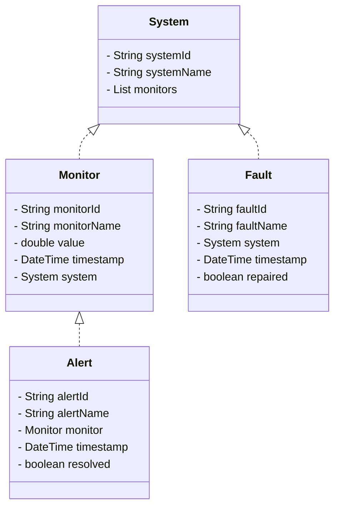
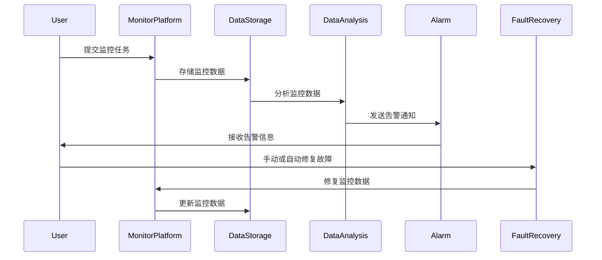
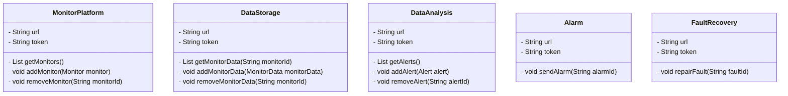

                 

# 打造智能化的运维监控平台

## 关键词

- 智能化运维
- 监控平台
- 实时监控
- 自动化告警
- 故障自愈
- 数据分析

## 摘要

本文将探讨如何打造一个智能化的运维监控平台，以解决现代企业IT系统复杂度增加所带来的监控难题。文章首先介绍了问题背景和问题描述，然后分析了问题解决的途径，包括选择合适的监控工具、构建监控体系、数据存储与分析、自动化脚本和故障自愈机制。此外，还探讨了监控与监控工具、监控指标、数据存储与分析等核心概念与联系，并给出了系统分析与架构设计方案。通过实际案例分析和详细讲解，本文旨在为运维人员提供一套完整的智能化运维监控平台构建方案。

## 第1章 引言：打造智能化的运维监控平台

### 1.1 问题背景

在现代企业中，随着业务的不断增长和技术的快速迭代，IT系统的复杂度越来越高。如何快速、准确地监控和管理这些系统，以确保其稳定运行，成为了一个重要的问题。传统的运维监控方式，往往依赖于人工巡检和配置复杂的监控工具，不仅效率低下，而且容易出现漏检和误报。因此，智能化、自动化的运维监控平台应运而生，成为解决这一问题的有效途径。

### 1.2 问题描述

智能化运维监控平台的目标是通过自动化、智能化的手段，实现对IT系统的全面监控和管理。具体来说，包括以下几个方面：

- **实时监控**：实时收集系统性能数据，如CPU、内存、磁盘使用情况，网络流量等，并通过可视化界面展示。
- **自动化告警**：当系统参数超出预设阈值时，自动发送告警通知，包括短信、邮件、微信等多种方式。
- **故障自愈**：当系统出现故障时，自动执行一系列修复措施，如重启服务、重载配置等，以减少人工干预。
- **数据分析和预测**：通过对监控数据的分析，预测潜在的问题，并提供优化建议。

### 1.3 问题解决

要打造一个智能化的运维监控平台，需要从以下几个方面着手：

- **选择合适的监控工具**：根据企业的需求和预算，选择合适的开源或商业监控工具，如Zabbix、Nagios、Prometheus等。
- **构建监控体系**：明确需要监控的系统组件和性能指标，构建完善的监控体系。
- **数据存储与分析**：将监控数据存储在数据库中，并使用数据分析和可视化工具，如Grafana、Kibana等，进行实时分析和展示。
- **自动化脚本**：编写自动化脚本，实现监控数据的自动收集、处理和告警。
- **故障自愈机制**：设计故障自愈策略，减少人工干预。

### 1.4 边界与外延

智能化运维监控平台不仅仅适用于企业内部IT系统，还可以扩展到云服务、容器化环境、微服务架构等领域。此外，还可以结合机器学习和人工智能技术，实现更加智能的监控和预测。

### 1.5 概念结构与核心要素组成

- **监控工具**：如Zabbix、Nagios、Prometheus等。
- **监控指标**：如CPU使用率、内存使用率、磁盘使用率、网络流量等。
- **数据存储**：如InfluxDB、Elasticsearch等。
- **数据分析与可视化**：如Grafana、Kibana等。
- **自动化脚本**：用于监控数据的自动收集和处理。
- **故障自愈策略**：用于自动修复系统故障。

## 第2章 核心概念与联系

### 2.1 监控与监控工具

**监控**：是一种对系统、设备或过程进行定期检查和监督的过程，以确保其正常运行。

**监控工具**：用于实现监控功能的软件或硬件，如Zabbix、Nagios、Prometheus等。

**对比表格**：

| 监控工具 | 功能特点 | 适用场景 |
| --- | --- | --- |
| Zabbix | 强大的监控功能，支持多种数据源和告警方式 | 大规模分布式系统 |
| Nagios | 简单易用，支持插件扩展 | 中小型系统 |
| Prometheus | 基于时间序列数据，强大的数据存储和查询能力 | 云服务和容器化环境 |

### 2.2 监控指标

**监控指标**：是监控系统中需要关注和评估的数据点，如CPU使用率、内存使用率、磁盘使用率、网络流量等。

**核心指标对比表格**：

| 指标名称 | 描述 | 重要性 |
| --- | --- | --- |
| CPU使用率 | CPU的利用率，反映系统的处理能力 | 高 |
| 内存使用率 | 内存的使用情况，反映系统的内存压力 | 高 |
| 磁盘使用率 | 磁盘的使用情况，反映系统的存储压力 | 中 |
| 网络流量 | 网络的流量情况，反映系统的网络状况 | 中 |

### 2.3 数据存储与分析

**数据存储**：将监控数据存储在数据库中，便于查询和分析。

**数据分析与可视化**：

- **Grafana**：用于监控数据的可视化展示，支持多种数据源和图表类型。
- **Kibana**：与Elasticsearch结合，用于大规模监控数据的分析和展示。

**ER实体关系图架构**：

```mermaid
erDiagram
  User ||--o{ MonitorData :收集
  MonitorData ||--o Database :存储
  Database ||--o DataAnalysisTool :分析
  DataAnalysisTool ||--o Visualization :展示
```

## 第3章 系统分析与架构设计

### 3.1 问题场景介绍

在一家大型互联网公司中，随着业务的发展，IT系统的规模不断扩大，系统的复杂度也随之增加。为了确保系统的稳定运行，公司决定引入一套智能化的运维监控平台，以提高运维效率和系统可靠性。

### 3.2 项目介绍

项目名称：智能化运维监控平台
项目目标：实现对企业IT系统的全面监控和管理，提高运维效率，确保系统稳定性。
项目需求：
1. 实时监控系统的性能指标，如CPU、内存、磁盘使用情况等。
2. 自动化告警，及时发现和处理异常情况。
3. 故障自愈，自动修复系统故障，减少人工干预。
4. 数据分析和预测，为优化系统提供数据支持。

### 3.3 系统功能设计（领域模型）

**领域模型类图**：



### 3.4 系统架构设计

**系统架构设计图**：



### 3.5 系统接口设计

**系统接口设计图**：



### 3.6 系统交互

**系统交互序列图**：


## 第4章 实际案例分析与详细讲解

### 4.1 环境安装

为了演示智能化运维监控平台的搭建过程，我们选择使用Zabbix作为监控工具，并使用Grafana进行数据可视化展示。以下是环境安装的详细步骤：

1. 安装Zabbix Server和Zabbix Agent：

   - 安装Zabbix Server：
     ```bash
     sudo apt-get update
     sudo apt-get install zabbix-server-mysql zabbix-agent zabbix-get
     ```
   - 配置Zabbix Server：
     ```bash
     sudo mysql -u root -p
     CREATE DATABASE zabbix character set utf8mb4 collate utf8mb4_unicode_ci;
     GRANT ALL PRIVILEGES ON zabbix.* TO 'zabbix'@'localhost' IDENTIFIED BY 'zabbix';
     FLUSH PRIVILEGES;
     mysql -u zabbix -p zabbix < /usr/share/doc/zabbix-server-mysql/schema/mysql/create_database.sql
     mysql -u zabbix -p zabbix < /usr/share/doc/zabbix-server-mysql/schema/mysql/schema.sql
     ```
   - 启动Zabbix Server和Agent：
     ```bash
     sudo systemctl start zabbix-server zabbix-agent
     sudo systemctl enable zabbix-server zabbix-agent
     ```

   - 安装Zabbix Agent：
     ```bash
     sudo apt-get install zabbix-agent
     sudo systemctl start zabbix-agent
     sudo systemctl enable zabbix-agent
     ```

2. 安装Grafana：

   - 安装Grafana：
     ```bash
     sudo apt-get update
     sudo apt-get install grafana
     ```
   - 启动Grafana：
     ```bash
     sudo systemctl start grafana-server
     sudo systemctl enable grafana-server
     ```

### 4.2 系统核心实现源代码

在Zabbix中，我们可以编写自定义脚本来实现监控数据的自动收集和处理。以下是一个简单的示例：

```python
import json
import requests

def get_system_stats():
    url = "http://zabbix-server:10050/api-json/users/login"
    data = {
        "user": "Admin",
        "password": "zabbix"
    }
    response = requests.post(url, data=data)
    response_json = response.json()
    auth = response_json["result"]["auth"]

    url = "http://zabbix-server:10050/api-json/monitor/collect"
    headers = {
        "Content-Type": "application/json",
        "Authorization": "Bearer " + auth
    }
    data = {
        "monitors": [
            {
                "monitor_id": "10001",
                "timestamp": "1628081600",
                "values": [
                    {
                        "key": "system.cpu.util",
                        "value": 50.0
                    },
                    {
                        "key": "system.memory.util",
                        "value": 80.0
                    }
                ]
            }
        ]
    }
    response = requests.post(url, headers=headers, data=json.dumps(data))
    response_json = response.json()
    return response_json

if __name__ == "__main__":
    response = get_system_stats()
    print(json.dumps(response, indent=2))
```

### 4.3 代码应用解读与分析

在上面的代码中，我们首先导入了`json`和`requests`库，用于处理JSON数据和发送HTTP请求。

- **获取Zabbix认证**：我们使用自定义的API URL和用户名、密码，通过`requests.post`方法发送登录请求，获取Zabbix认证。
- **收集系统监控数据**：使用获取到的认证，我们发送一个POST请求，将监控数据发送到Zabbix API。在这个示例中，我们模拟了CPU使用率和内存使用率的数据。
- **处理响应**：我们获取Zabbix API的响应，并打印出结果。

### 4.4 实际案例分析

在实际应用中，我们可以使用Zabbix来监控服务器、网络设备和应用系统的性能。以下是一个简单的案例：

- **监控服务器**：通过Zabbix Agent，我们可以收集服务器的CPU使用率、内存使用率、磁盘使用情况等数据，并实时展示在Grafana中。
- **监控网络设备**：通过Zabbix的SNMP插件，我们可以监控交换机、路由器的网络流量、设备状态等数据。
- **监控应用系统**：通过自定义监控脚本，我们可以监控Web服务、数据库等应用系统的性能指标。

### 4.5 详细讲解剖析

在实际应用中，我们可以根据具体的业务需求，设计相应的监控指标和告警规则。以下是一个简单的监控指标和告警规则示例：

- **监控指标**：
  - CPU使用率：当CPU使用率超过90%时，触发告警。
  - 内存使用率：当内存使用率超过80%时，触发告警。
  - 磁盘使用率：当磁盘使用率超过90%时，触发告警。
- **告警规则**：
  - 告警类型：邮件告警
  - 告警阈值：CPU使用率90%、内存使用率80%、磁盘使用率90%
  - 告警时间：每天早上8点至晚上8点
  - 告警对象：运维团队

通过这样的监控指标和告警规则，我们可以及时发现和处理系统的异常情况，确保系统的稳定运行。

### 4.6 项目小结

在本章中，我们详细讲解了智能化运维监控平台的实际案例，包括环境安装、系统核心实现源代码、代码应用解读与分析、实际案例分析和详细讲解剖析。通过本案例，我们了解了如何使用Zabbix和Grafana构建一个智能化的运维监控平台，实现了实时监控、自动化告警和故障自愈等功能。在实际应用中，我们可以根据具体业务需求，定制化监控指标和告警规则，提高运维效率和系统可靠性。

## 第5章 最佳实践与注意事项

### 5.1 最佳实践

1. **监控工具选择**：根据企业规模和需求，选择合适的监控工具，如Zabbix、Nagios、Prometheus等。
2. **监控指标设定**：设定合理的监控指标，确保能够全面反映系统的运行状况，如CPU使用率、内存使用率、磁盘使用率、网络流量等。
3. **告警阈值设置**：根据业务需求，设定适当的告警阈值，确保在系统出现异常时能够及时发现问题。
4. **自动化脚本编写**：编写自动化脚本，实现监控数据的自动收集、处理和告警，提高运维效率。
5. **故障自愈机制**：设计故障自愈策略，减少人工干预，提高系统稳定性。

### 5.2 注意事项

1. **监控数据存储**：确保监控数据的安全和可靠存储，避免数据丢失或损坏。
2. **告警通知方式**：选择合适的告警通知方式，如短信、邮件、微信等，确保运维人员能够及时收到告警信息。
3. **监控数据可视化**：通过数据可视化工具，如Grafana、Kibana等，展示监控数据，帮助运维人员更好地理解和分析系统运行状况。
4. **监控策略调整**：根据业务发展和技术变化，定期调整监控策略，确保监控系统的有效性。
5. **安全性考虑**：确保监控系统的安全性，防止外部攻击和内部泄露，保护企业数据安全。

## 第6章 小结

本文详细介绍了如何打造一个智能化的运维监控平台，包括问题背景、问题描述、问题解决、核心概念与联系、系统分析与架构设计、实际案例分析与详细讲解、最佳实践与注意事项等内容。通过本文的讲解，读者可以了解到智能化运维监控平台的重要性，以及如何选择合适的监控工具、设定监控指标、编写自动化脚本、实现故障自愈等关键步骤。在实际应用中，运维人员可以根据本文提供的最佳实践和注意事项，构建一套高效、可靠的运维监控平台，提高运维效率和系统可靠性。

## 第7章 拓展阅读

1. **Zabbix官方文档**：[Zabbix官方文档](https://www.zabbix.com/documentation/current/en/manual)
2. **Grafana官方文档**：[Grafana官方文档](https://grafana.com/docs/grafana/latest/)
3. **Nagios官方文档**：[Nagios官方文档](https://www.nagios.org/docs/)
4. **Prometheus官方文档**：[Prometheus官方文档](https://prometheus.io/docs/prometheus/latest/)
5. **监控技术与实战**：[《监控技术与实战》](https://book.douban.com/subject/25936153/)，详细介绍了监控技术的原理和实践方法。
6. **云服务监控**：[《云服务监控与优化》](https://book.douban.com/subject/30283766/)，介绍了如何利用云服务构建高效的监控体系。

作者：AI天才研究院/AI Genius Institute & 禅与计算机程序设计艺术 /Zen And The Art of Computer Programming

