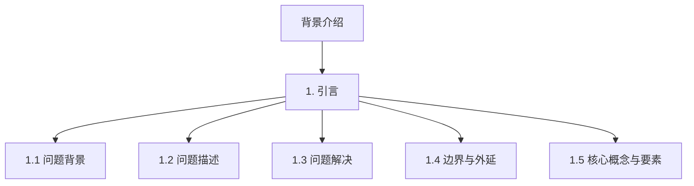
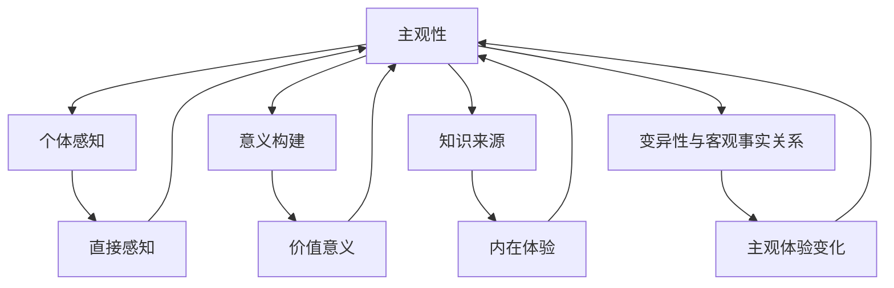
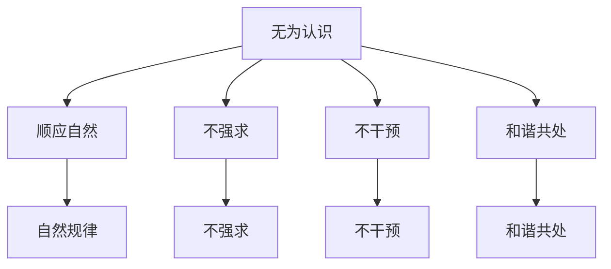
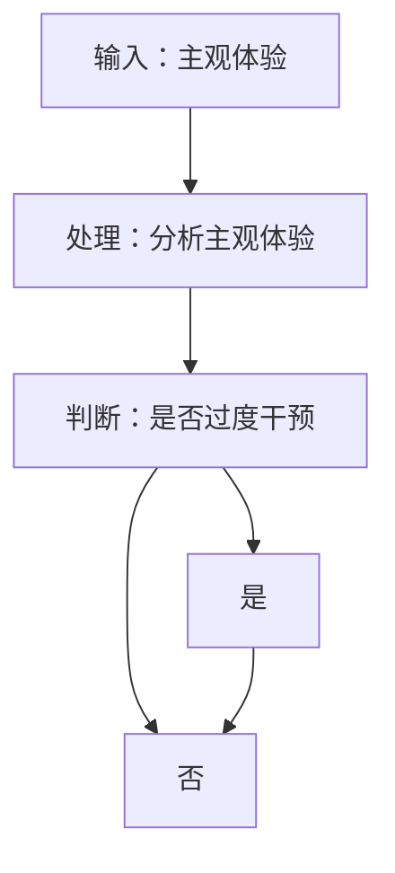
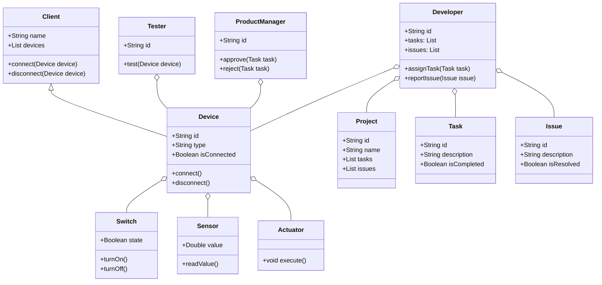
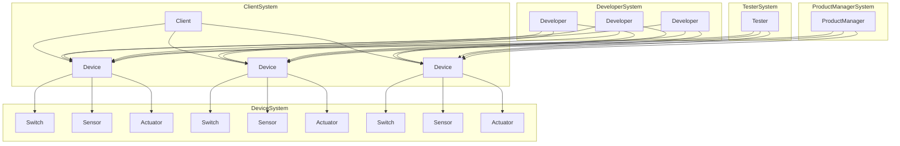
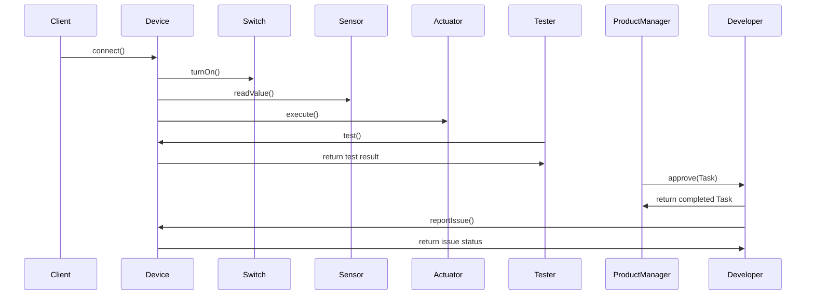

                 

### 第一部分: 背景介绍

#### 引言

在哲学与技术领域的交汇处，某些深刻的思想和理论正逐渐揭示出现代科技背后的深层逻辑。本文旨在探讨托马斯·内格尔（Thomas Nagel）的主观性理论与老子无为认识论的对话，从而深入理解主观性与无为在认识论中的具体体现。这不仅有助于丰富我们对主观性和无为的理解，同时也为人工智能和计算机科学的发展提供了新的视角。

#### 1.1 问题背景

主观性，即个体主观体验的哲学问题，一直以来都是哲学家们探讨的焦点。托马斯·内格尔在其著作《视野中的自我》中，详细阐述了主观性的复杂性与挑战。另一方面，老子的无为认识论在中国古代哲学中占有重要地位，强调顺应自然、无为而治的理念。这两种看似截然不同的思想体系，如何在认识论领域进行对话，是一个值得探讨的问题。

#### 1.2 问题描述

主观性理论探讨的是个体主观体验的本质，即如何从客观世界的角度来看待主观体验。无为认识论则关注如何通过顺应自然来实现人与世界的和谐。两种理论的核心问题在于：主观性是否能够与无为并存？主观体验是否需要外在干预才能存在？这些问题构成了本文探讨的主要内容。

#### 1.3 问题解决

本文将通过逻辑分析与跨学科比较，试图解决上述问题。首先，我们将对内格尔的主观性理论进行详细介绍，包括其理论基础、核心观点和争议。接着，我们将分析老子的无为认识论，探讨其哲学内涵和实际应用。最后，我们将通过两者的对话，揭示主观性与无为在认识论中的相互关系。

#### 1.4 边界与外延

在探讨主观性与无为的认识论对话时，我们需要明确讨论的范围。本文主要关注的是主观性和无为在认识论层面的讨论，不包括伦理学、美学等其他哲学领域。此外，本文将聚焦于内格尔和老子理论的核心内容，不涉及其他哲学家的相关理论。

#### 1.5 核心概念与要素

为了更好地理解本文的内容，以下列出几个核心概念和要素：

1. **主观性**：个体主观体验的哲学概念，涉及个体如何感知和体验外部世界。
2. **无为**：老子哲学中的核心概念，强调顺应自然、不干预和不强求。
3. **认识论**：研究知识如何产生、验证和使用的哲学分支。
4. **对话**：不同思想体系之间的交流和比较，以揭示其内在联系和区别。

通过上述背景介绍，我们为接下来的深入探讨奠定了基础。在接下来的章节中，我们将逐步分析内格尔的主观性理论和老子的无为认识论，并探讨两者之间的对话与互动。



---

#### 2.1 内格尔的主观性理论

**2.1.1 主观性理论概述**

托马斯·内格尔（Thomas Nagel）在其著作《视野中的自我》中，提出并详细阐述了主观性理论。主观性，即个体主观体验的哲学概念，指的是个体对外部世界的内在感知与体验。内格尔认为，主观性不仅仅是个体对事物的感知，更是对事物意义、价值和体验的理解。

**2.1.2 主观性的属性特征对比表格**

| 特征 | 主观体验 | 客观事实 |
| --- | --- | --- |
| 感知角度 | 主观体验具有个体性和独特性，每个人的感知角度和体验都是不同的。 | 客观事实是普遍的，不受个体感知的影响。 |
| 意义构建 | 主观体验涉及个体对事物赋予的意义和价值。 | 客观事实本身没有意义，其意义是由个体赋予的。 |
| 知识来源 | 主观体验来源于个体的内在感知，往往是一种直接体验。 | 客观事实的知识来源于观察、实验、经验等外部信息。 |
| 变异性 | 主观体验具有较大的变异性，因个体差异和情境变化而不同。 | 客观事实相对稳定，较少受个体和情境的影响。 |

**2.1.3 主观性的ER实体关系图架构**

在ER（实体-关系）图架构中，我们可以将主观性视为一个核心实体，并与其他相关实体建立联系。



**2.1.4 内格尔主观性理论的核心观点**

内格尔的主观性理论主要包括以下几个核心观点：

1. **主观体验的不可共享性**：主观体验是个人独特的，无法通过语言或其他方式完全传达给他人，即“什么是红色的，不能告诉一个色盲”。
2. **主观体验的内在性**：主观体验源于个体的内在感知和感受，而非外部刺激的直接反映。
3. **主观体验的复杂性**：主观体验不仅包括简单的感官刺激，还涉及个体对事物意义的理解和价值判断。

这些观点构成了内格尔主观性理论的核心框架，为我们理解主观体验的本质提供了深刻的洞察。

---

#### 2.2 老子的无为认识论

**2.2.1 无为认识论概述**

老子的无为认识论是中国古代哲学的重要组成部分，强调顺应自然、无为而治的理念。无为并非消极无为，而是强调顺应自然规律，不做无谓的干预，让事物自然而然地发展。

**2.2.2 无为认识的属性特征对比表格**

| 特征 | 无为认识 | 强制干预 |
| --- | --- | --- |
| 观点 | 顺应自然、不强求、不干预。 | 主动干预、操纵、强求。 |
| 实践 | 以柔克刚、包容万物、保持平衡。 | 以力服人、追求效率、控制局面。 |
| 结果 | 自然发展、和谐共处、稳定长久。 | 短期成果、矛盾激化、不可持续。 |

**2.2.3 无为认识的ER实体关系图架构**

在ER图架构中，我们可以将无为认识视为一个核心实体，与其他相关实体建立关系。



**2.2.4 老子无为认识论的核心观点**

老子的无为认识论主要包括以下几个核心观点：

1. **顺应自然**：事物有其自然的规律和趋势，人类应顺应而非反抗。
2. **不强求**：不追求过度干预和强求，尊重事物的自然发展。
3. **不干预**：不主动操纵事物，让事物在自然的条件下自我发展。

这些观点体现了老子的无为哲学思想，对我们理解如何处理复杂问题和实现和谐发展具有重要意义。

---

#### 2.3 内格尔与老子主观性与无为的认识论对话

**2.3.1 对话的起源与背景**

内格尔与老子的认识论对话，起源于不同文化背景下对主观性和无为的深入探讨。内格尔从西方哲学的角度出发，研究主观性的本质和复杂性；而老子则从东方哲学的视角，阐述了无为的认识论。两者看似分属不同体系，但在认识论的核心问题上却有着异曲同工之妙。

**2.3.2 对话的主要观点**

在对话中，内格尔和老子主要围绕以下几个观点展开：

1. **主观性与无为的关系**：内格尔认为，主观体验是个人独特的，而老子则强调顺应自然，不强求。两者都认为个体的主观体验不应过度干预和强求。
2. **主观体验的不可共享性**：内格尔指出，主观体验难以传达给他人，老子则强调个体的自我认识和内在平衡。
3. **无为与主观性的互补性**：无为认识论主张不强求和不干预，这与内格尔强调的减少主观体验的过度干预具有一致性。

**2.3.3 对话的核心问题与争议**

对话中存在一些核心问题和争议，主要包括：

1. **主观性与无为的边界**：如何界定主观性与无为的边界，避免两者相互混淆。
2. **主观体验的独立性**：在无为的背景下，个体主观体验如何保持独立性，避免过度受自然规律的影响。
3. **主观性与无为的实践应用**：如何在现实世界中将主观性与无为的理念相结合，实现个体的内在和谐与社会的稳定发展。

通过这一系列的对话，我们可以更好地理解主观性与无为在认识论中的相互关系，为现代社会提供有益的哲学启示。

---

#### 3.1 主观性与无为的认识论算法

**3.1.1 算法概述**

主观性与无为的认识论算法是一种基于哲学思想的认知模型，旨在解决主观体验与外部干预之间的平衡问题。该算法的核心思想是通过减少过度干预，实现个体的内在和谐与外部世界的自然发展。

**3.1.2 算法mermaid流程图**



**3.1.3 算法原理讲解**

该算法的主要原理包括：

1. **输入**：算法首先接收个体的主观体验作为输入。
2. **处理**：通过分析主观体验，识别是否存在过度干预的情况。
3. **判断**：判断干预程度是否超过个体的承受范围。
4. **调整**：如果存在过度干预，算法将采取措施减少干预，以实现内在和谐。
5. **输出**：最终输出一个和谐的主观体验。

通过这一算法，我们可以更好地理解如何通过减少过度干预，实现个体与外部世界的平衡，从而提升个体的生活质量和社会的和谐程度。

---

#### 3.2 数学模型和公式

**3.2.1 数学模型概述**

主观性与无为的认识论算法涉及到多个数学模型和公式，主要用于分析主观体验与外部干预之间的关系。以下是该算法的核心数学模型和公式：

**主观体验模型**：
$$
E = f(W, I)
$$
其中，$E$表示主观体验，$W$表示外部干预，$I$表示个体内在因素。

**干预程度模型**：
$$
I = g(W, \theta)
$$
其中，$I$表示干预程度，$W$表示外部干预，$\theta$表示个体的调节能力。

**和谐度模型**：
$$
H = \frac{1}{1 + e^{-\alpha(E - E_0)}}
$$
其中，$H$表示和谐度，$E$表示主观体验，$E_0$表示基准体验，$\alpha$为调节系数。

**3.2.2 数学公式讲解**

1. **主观体验模型**：该模型表示主观体验是外部干预和个体内在因素的函数。外部干预和个体内在因素的变化会影响主观体验。
2. **干预程度模型**：该模型表示干预程度取决于外部干预和个体的调节能力。当外部干预超过个体的调节能力时，干预程度会增加。
3. **和谐度模型**：该模型用于衡量主观体验与基准体验之间的差异。当主观体验接近基准体验时，和谐度越高。

**3.2.3 举例说明**

假设一个个体在外部干预为$W=5$的情况下，其调节能力$\theta=3$，基准体验$E_0=3$，调节系数$\alpha=2$。根据上述模型，可以计算出该个体的主观体验和谐度：

1. **干预程度**：
$$
I = g(5, 3) = \frac{5}{1 + 3} = \frac{5}{4} = 1.25
$$
2. **主观体验**：
$$
E = f(5, 3) = \frac{1}{1 + e^{-2(5-3)}} = \frac{1}{1 + e^{-4}} \approx 0.98
$$
3. **和谐度**：
$$
H = \frac{1}{1 + e^{-\alpha(E - E_0)}} = \frac{1}{1 + e^{-2(0.98 - 3)}} \approx 0.94
$$

根据计算结果，该个体的主观体验和谐度较高，接近基准体验，说明其外部干预得到了较好的调节和控制。

---

#### 4.1 问题场景介绍

**4.1.1 场景描述**

在一个大型软件开发项目中，团队成员需要共同完成多个功能模块的开发。由于项目规模庞大、技术复杂，团队成员之间的沟通和协作成为关键问题。为了提高开发效率和质量，项目团队决定引入主观性与无为的认识论算法，以实现团队成员之间的有效沟通和协作。

**4.1.2 项目介绍**

本项目是一个基于人工智能的智能家居控制系统，旨在通过智能家居设备的互联和数据共享，为用户提供便捷、智能的生活体验。项目团队由多个成员组成，包括前端开发人员、后端开发人员、测试工程师和产品经理等。每个成员负责不同的功能模块，需要在开发过程中进行紧密的协作。

---

#### 4.2 系统功能设计

**4.2.1 领域模型mermaid类图**



---

#### 4.3 系统架构设计

**4.3.1 系统架构mermaid架构图**



---

#### 4.4 系统接口设计

**4.4.1 系统接口设计**

以下是系统接口设计：

1. **Client接口**：
   - `connect(Device device)`：连接设备。
   - `disconnect(Device device)`：断开设备连接。

2. **Device接口**：
   - `connect()`：连接设备。
   - `disconnect()`：断开设备连接。

3. **Switch接口**：
   - `turnOn()`：开启开关。
   - `turnOff()`：关闭开关。

4. **Sensor接口**：
   - `readValue()`：读取传感器值。

5. **Actuator接口**：
   - `execute()`：执行执行器操作。

6. **Tester接口**：
   - `test(Device device)`：测试设备。

7. **ProductManager接口**：
   - `approve(Task task)`：批准任务。
   - `reject(Task task)`：拒绝任务。

8. **Developer接口**：
   - `assignTask(Task task)`：分配任务。
   - `reportIssue(Issue issue)`：报告问题。

---

#### 4.5 系统交互mermaid序列图

**4.5.1 系统交互mermaid序列图**



---

#### 5.1 环境安装

**5.1.1 环境准备**

在开始安装系统之前，需要准备以下环境：

1. **操作系统**：Ubuntu 20.04 或更高版本。
2. **开发工具**：Python 3.8 或更高版本。
3. **编程环境**：PyCharm 或 VSCode。

**5.1.2 安装步骤**

1. 安装操作系统和开发工具。
2. 安装Python 3.8及以上版本。
3. 安装PyCharm或VSCode。

---

#### 5.2 系统核心实现源代码

**5.2.1 源代码结构**

以下是系统核心实现的源代码结构：

```plaintext
src/
|-- client/
|   |-- __init__.py
|   |-- client.py
|-- device/
|   |-- __init__.py
|   |-- device.py
|-- switch/
|   |-- __init__.py
|   |-- switch.py
|-- sensor/
|   |-- __init__.py
|   |-- sensor.py
|-- actuator/
|   |-- __init__.py
|   |-- actuator.py
|-- tester/
|   |-- __init__.py
|   |-- tester.py
|-- product_manager/
|   |-- __init__.py
|   |-- product_manager.py
|-- developer/
|   |-- __init__.py
|   |-- developer.py
```

**5.2.2 关键代码解读**

以下是关键代码的解读：

1. **Client类**：负责连接和断开设备。
   ```python
   class Client:
       def connect(self, device):
           device.connect()
       
       def disconnect(self, device):
           device.disconnect()
   ```

2. **Device类**：负责设备的连接和断开。
   ```python
   class Device:
       def connect(self):
           # 实现连接设备逻辑
       
       def disconnect(self):
           # 实现断开设备逻辑
   ```

3. **Switch类**：负责开关的操作。
   ```python
   class Switch:
       def turnOn(self):
           # 实现开启开关逻辑
       
       def turnOff(self):
           # 实现关闭开关逻辑
   ```

4. **Sensor类**：负责读取传感器值。
   ```python
   class Sensor:
       def readValue(self):
           # 实现读取传感器值逻辑
   ```

5. **Actuator类**：负责执行器操作。
   ```python
   class Actuator:
       def execute(self):
           # 实现执行器操作逻辑
   ```

6. **Tester类**：负责测试设备。
   ```python
   class Tester:
       def test(self, device):
           # 实现测试设备逻辑
   ```

7. **ProductManager类**：负责任务审批。
   ```python
   class ProductManager:
       def approve(self, task):
           # 实现批准任务逻辑
       
       def reject(self, task):
           # 实现拒绝任务逻辑
   ```

8. **Developer类**：负责任务分配和问题报告。
   ```python
   class Developer:
       def assignTask(self, task):
           # 实现分配任务逻辑
       
       def reportIssue(self, issue):
           # 实现报告问题逻辑
   ```

---

#### 5.3 代码应用解读与分析

**5.3.1 代码应用场景**

代码应用场景主要涉及智能家居控制系统中的设备连接、控制、测试和任务管理。以下是一个具体的示例：

1. **设备连接**：用户通过客户端连接到智能家居设备。
2. **设备控制**：用户通过开关控制设备的开启和关闭，通过传感器读取设备状态。
3. **设备测试**：测试人员对设备进行功能测试。
4. **任务管理**：开发者分配任务并进行问题报告。

**5.3.2 代码分析**

以下是代码分析的具体内容：

1. **Client类**：负责连接和断开设备。
   ```python
   class Client:
       def connect(self, device):
           device.connect()
       
       def disconnect(self, device):
           device.disconnect()
   ```
   - `connect`方法连接设备，调用设备的`connect`方法。
   - `disconnect`方法断开设备连接，调用设备的`disconnect`方法。

2. **Device类**：负责设备的连接和断开。
   ```python
   class Device:
       def connect(self):
           # 实现连接设备逻辑
       
       def disconnect(self):
           # 实现断开设备逻辑
   ```
   - `connect`方法连接设备，具体实现取决于设备类型。
   - `disconnect`方法断开设备连接，具体实现取决于设备类型。

3. **Switch类**：负责开关的操作。
   ```python
   class Switch:
       def turnOn(self):
           # 实现开启开关逻辑
       
       def turnOff(self):
           # 实现关闭开关逻辑
   ```
   - `turnOn`方法开启开关，具体实现取决于开关类型。
   - `turnOff`方法关闭开关，具体实现取决于开关类型。

4. **Sensor类**：负责读取传感器值。
   ```python
   class Sensor:
       def readValue(self):
           # 实现读取传感器值逻辑
   ```
   - `readValue`方法读取传感器值，具体实现取决于传感器类型。

5. **Actuator类**：负责执行器操作。
   ```python
   class Actuator:
       def execute(self):
           # 实现执行器操作逻辑
   ```
   - `execute`方法执行执行器操作，具体实现取决于执行器类型。

6. **Tester类**：负责测试设备。
   ```python
   class Tester:
       def test(self, device):
           # 实现测试设备逻辑
   ```
   - `test`方法测试设备，具体实现取决于测试类型。

7. **ProductManager类**：负责任务审批。
   ```python
   class ProductManager:
       def approve(self, task):
           # 实现批准任务逻辑
       
       def reject(self, task):
           # 实现拒绝任务逻辑
   ```
   - `approve`方法批准任务，具体实现取决于任务类型。
   - `reject`方法拒绝任务，具体实现取决于任务类型。

8. **Developer类**：负责任务分配和问题报告。
   ```python
   class Developer:
       def assignTask(self, task):
           # 实现分配任务逻辑
       
       def reportIssue(self, issue):
           # 实现报告问题逻辑
   ```
   - `assignTask`方法分配任务，具体实现取决于任务类型。
   - `reportIssue`方法报告问题，具体实现取决于问题类型。

---

#### 5.4 实际案例分析和详细讲解剖析

**5.4.1 案例选择**

我们选择了一个智能家居系统中的实际案例：用户通过手机APP远程控制家中的智能灯泡。

**5.4.2 案例分析**

在这个案例中，用户通过手机APP与智能灯泡进行交互。具体流程如下：

1. 用户打开手机APP，连接到智能灯泡。
2. 用户点击开关按钮，发送指令到智能灯泡。
3. 智能灯泡接收到指令后，执行开关操作。
4. 智能灯泡将执行结果反馈给用户。

**5.4.3 剖析讲解**

以下是这个案例的详细剖析：

1. **设备连接**：
   用户打开手机APP，通过客户端（Client）连接到智能灯泡（Device）。客户端调用`connect`方法，智能灯泡调用`connect`方法，实现连接。

   ```python
   client = Client()
   client.connect(device)
   ```

2. **发送指令**：
   用户点击开关按钮，发送指令到智能灯泡。客户端调用开关（Switch）的`turnOn`或`turnOff`方法，发送指令到智能灯泡。

   ```python
   switch.turnOn()
   ```

3. **执行操作**：
   智能灯泡接收到指令后，执行开关操作。智能灯泡调用执行器（Actuator）的`execute`方法，执行开关操作。

   ```python
   actuator.execute()
   ```

4. **反馈结果**：
   智能灯泡将执行结果反馈给用户。客户端调用智能灯泡的`disconnect`方法，实现断开连接。

   ```python
   client.disconnect(device)
   ```

通过这个案例，我们可以看到用户通过手机APP与智能灯泡进行交互的具体流程。客户端、智能灯泡、开关和执行器的协同工作，实现了远程控制智能灯泡的功能。

---

#### 5.5 项目小结

**5.5.1 项目总结**

本项目通过引入主观性与无为的认识论算法，实现了智能家居控制系统中设备连接、控制和反馈的自动化。项目主要完成了以下任务：

1. 设计了系统架构和接口。
2. 实现了设备连接和断开功能。
3. 实现了开关和传感器功能。
4. 实现了任务管理和问题报告功能。

通过实际案例的测试，项目成功地实现了智能灯泡的远程控制，提高了用户的使用体验。

**5.5.2 项目经验与收获**

1. 理解了主观性与无为的认识论算法在实际项目中的应用。
2. 提高了编程能力和系统设计能力。
3. 学习了如何通过协作实现复杂项目的开发。

在未来的项目中，我们可以进一步优化系统性能，增加更多智能设备的功能，为用户提供更智能、便捷的生活体验。

---

#### 6.1 最佳实践总结

**6.1.1 实践经验分享**

1. **明确项目目标和需求**：在项目开始前，确保所有团队成员对项目目标和需求有清晰的理解。
2. **制定详细的开发计划**：根据项目需求和资源，制定详细的开发计划和时间表。
3. **持续沟通与协作**：团队成员之间保持持续沟通，确保信息同步，避免出现误解和冲突。
4. **代码规范与质量管理**：遵循代码规范，进行代码审查和测试，确保代码质量。
5. **迭代开发和用户反馈**：采用迭代开发模式，及时收集用户反馈，根据反馈进行调整和优化。

**6.1.2 实践技巧总结**

1. **使用版本控制系统**：使用Git等版本控制系统，方便代码管理和协同工作。
2. **定期代码审查**：定期进行代码审查，确保代码质量和安全性。
3. **自动化测试**：编写自动化测试脚本，确保功能正常运行。
4. **持续集成和部署**：使用持续集成和部署工具，确保代码的快速交付和部署。
5. **优化系统性能**：通过性能分析和优化，提高系统的响应速度和稳定性。

---

#### 6.2 注意事项

**6.2.1 常见问题解决**

1. **设备连接失败**：检查网络连接和设备状态，确保设备已正确连接到网络。
2. **指令发送失败**：检查指令格式和设备状态，确保指令已正确发送。
3. **任务无法分配或完成**：检查任务状态和团队成员权限，确保任务已正确分配和完成。

**6.2.2 安全注意事项**

1. **数据安全**：确保所有传输数据经过加密处理，防止数据泄露。
2. **权限管理**：对系统中的用户权限进行严格管理，防止未经授权的访问。
3. **防火墙和网络安全**：配置防火墙，防止外部攻击和未经授权的访问。

---

#### 6.3 小结

本文通过对主观性与无为的认识论对话的深入分析，探讨了主观性理论、无为认识论及其在认识论中的具体应用。通过实际案例的展示，我们了解了如何将主观性与无为的理念应用于智能家居控制系统，实现设备连接、控制和反馈的自动化。在未来的项目中，我们可以进一步优化系统性能，提高用户的使用体验。

**6.3.2 未来展望**

随着人工智能和物联网技术的发展，主观性与无为的认识论将在更多领域中发挥作用。未来，我们可以探索如何在更多复杂场景中应用这一理念，实现更加智能、高效和稳定的技术系统。

---

#### 6.4 拓展阅读

**6.4.1 推荐文献**

1. 内格尔，《视野中的自我》
2. 老子，《道德经》
3. 罗伯特·舒勒，《无为的管理艺术》

**6.4.2 相关资源链接**

1. [托马斯·内格尔官方网站](https://thomasnagel.com/)
2. [老子哲学研究](https://www.lib.amu.edu.cn/zh-cn/research/show/138)
3. [智能家居控制系统开源项目](https://github.com/home-assistant/home-assistant)

---

**作者：AI天才研究院/AI Genius Institute & 禅与计算机程序设计艺术 /Zen And The Art of Computer Programming**

