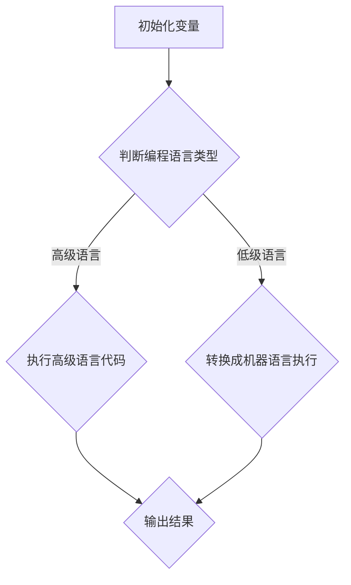
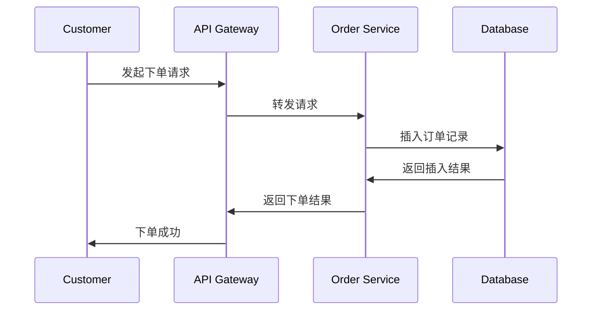

                 

### 托马斯·库恩的范式理论与编程语言的演变：技术变革的哲学解读

**关键词：** 托马斯·库恩、范式理论、编程语言、技术变革、哲学解读

**摘要：** 本文深入探讨了托马斯·库恩的范式理论，并探讨了这一理论在编程语言演变过程中的应用。通过分析不同编程语言范式的出现、发展和转变，我们试图揭示技术变革背后的哲学原理，为编程语言的发展提供一种新的视角和思考方式。

---

## 引言

在计算机科学领域，编程语言是沟通人与计算机的桥梁。自第一台电子计算机问世以来，编程语言经历了多次重大的变革。从早期的机器语言和汇编语言，到现代的高级编程语言，每一次变革都极大地推动了计算机技术的发展。然而，这些变革背后究竟隐藏着怎样的哲学原理呢？

托马斯·库恩（Thomas Kuhn）的范式理论为我们提供了一种理解技术变革的新视角。范式（Paradigm）是库恩提出的一个核心概念，指的是在某一特定时期内，科学家们共同遵循的理论框架和研究方法。范式不仅定义了科学问题的本质，还规定了解决这些问题的标准路径。当一个范式无法解释新的科学现象时，就会引发科学革命，进而产生新的范式。

本文将从范式理论的基本概念出发，逐步探讨编程语言的历史演变，分析不同编程语言范式的特点，并运用范式理论对编程语言的哲学本质进行解读。最后，我们将讨论范式理论在编程语言教育中的应用，并展望未来编程语言范式的发展趋势。

---

## 范式理论的基本概念

### 范式的定义与特点

范式是一种理论框架，它不仅包含对特定领域的基本概念和原理的阐述，还包括解决问题的方法和工具。在科学领域，范式通常由一组核心理论、假设和实验方法构成。范式的特点包括：

1. **权威性**：范式在特定时期内具有绝对的权威，科学家们必须遵循。
2. **普适性**：范式适用于广泛的研究领域，为科学家们提供统一的思考框架。
3. **稳定性**：范式在较长时间内保持稳定，不会轻易被推翻。
4. **不可证伪性**：范式的核心理论通常无法通过实验直接验证，但可以通过经验事实的支持来维持其权威。

### 范式的演变

范式的演变通常经历以下几个阶段：

1. **形成期**：新范式开始出现，挑战旧范式的权威。
2. **竞争期**：新旧范式并存，科学家们对哪种范式更具优势进行辩论。
3. **统一期**：新范式逐渐取代旧范式，成为新的科学标准。

### 范式转换的条件与机制

范式转换通常发生在以下情况下：

1. **危机**：现有范式无法解释新的科学现象，引发科学危机。
2. **革命**：新范式通过提出新的理论和方法，彻底推翻旧范式。
3. **重建**：科学家们在新的范式基础上重建科学体系，解决旧范式遗留的问题。

---

## 编程语言范式演变分析

### 高级编程语言的出现

在计算机科学发展的早期，编程语言主要是机器语言和汇编语言。这些语言直接操作计算机硬件，具有极大的复杂性和低效率。随着计算机技术的发展，科学家们开始探索更高级的编程语言，以简化编程过程和提高效率。1955年，第一个高级编程语言“FORTRAN”问世，标志着编程语言范式的转变。

### 面向对象编程语言的兴起

面向对象编程（OOP）的出现是编程语言发展的又一次重要变革。OOP强调数据的封装和继承，通过类和对象的概念来模拟现实世界中的实体和行为。1980年代，C++和Java等面向对象编程语言相继问世，迅速成为主流编程语言，推动了计算机技术的快速发展。

### 函数式编程语言的崛起

函数式编程（FP）是另一种重要的编程范式，强调函数作为编程的基本单元，避免了状态和变量的概念。1990年代，Haskell和Scala等函数式编程语言逐渐受到关注，并在特定领域取得了成功。

### 范式转变中的编程范式

编程语言的范式转变不仅仅是语言层面的变化，它还涉及到编程思维方式的转变。从机器语言到高级语言，从面向过程到面向对象，再到函数式编程，每一次范式转变都深刻地影响了编程实践和软件开发方法。

---

## 范式理论与编程语言的哲学解读

### 范式理论对编程语言的指导意义

范式理论为我们提供了理解编程语言演变过程的理论框架。通过范式理论，我们可以更深入地理解编程语言的发展规律，预测未来编程语言的演变方向。

### 编程语言的哲学视角

从哲学角度来看，编程语言不仅是沟通计算机和人类的工具，它还反映了人类对世界的理解和认知方式。不同的编程范式体现了不同哲学思想的体现，如逻辑主义、实证主义和建构主义。

### 范式转变与技术进步的关系

范式转变与技术进步之间存在密切关系。新的编程范式通常伴随着新的编程工具和技术，推动了计算机技术的快速发展。同时，技术进步也推动了编程范式的演变，如云计算、大数据和人工智能等新兴技术对编程范式产生了深远的影响。

---

## 范式理论在编程语言教育中的应用

### 教育理念的转变

范式理论对编程语言教育提出了新的挑战。传统的编程教育注重语法和编程技巧的传授，而范式理论则强调编程思维的培养。教育理念需要从以知识传授为主转向以能力培养为主，注重培养学生的创新思维和解决问题的能力。

### 教学方法的更新

范式理论要求教学方法进行相应调整。教师需要引导学生了解不同编程范式的基本原理和应用场景，通过案例分析和实践操作，培养学生的编程能力和创新思维。

### 范式理论在教育实践中的应用

在实际教学中，范式理论可以应用于课程设计、教学方法改进和学生评估等方面。通过引入范式理论，教师可以更有效地指导学生掌握不同编程范式的特点和适用场景，提高学生的编程能力和综合素质。

---

## 编程语言范式转变案例分析

### 具体案例介绍

在本节中，我们将分析几个具有代表性的编程语言范式转变案例，如从C到Java的转变、从Python到Go的转变等。通过这些案例，我们将探讨范式转变中的影响因素和过程。

### 范式转变的影响因素

范式转变受到多种因素的影响，包括技术需求、开发环境、市场需求和社区支持等。例如，Java的兴起得益于其在企业级开发中的广泛应用，而Go的崛起则与云计算和容器技术的快速发展密切相关。

### 案例分析与讨论

通过对具体案例的分析和讨论，我们将深入探讨范式转变中的关键因素和过程，揭示编程语言范式转变的内在规律和外在表现。

---

## 未来编程语言范式展望

### 新兴编程语言趋势

随着计算机技术的不断发展，新的编程语言不断涌现。未来，我们将看到更多支持并发、并行和分布式计算的编程语言，以及更加智能化和自动化的编程语言。

### 未来编程语言范式预测

未来编程语言范式的发展趋势将受到人工智能、量子计算和区块链等新兴技术的影响。例如，基于人工智能的编程语言将能够自动生成代码，降低编程难度；量子计算将带来全新的编程范式和算法；区块链技术将推动去中心化编程语言的兴起。

### 技术变革的哲学反思

技术变革不仅仅是技术的进步，它还涉及到人类价值观和思维方式的变化。通过反思技术变革的哲学意义，我们能够更好地理解编程语言的演变过程，并为未来编程语言的发展提供指导。

---

## 结论

本文通过托马斯·库恩的范式理论，对编程语言的演变进行了深入分析。我们揭示了编程语言范式转变的内在规律和外在表现，探讨了范式理论在编程语言哲学解读中的应用，并对未来编程语言范式的发展趋势进行了展望。通过本文的研究，我们希望能够为编程语言的研究和实践提供一种新的视角和思考方式。

### 作者信息

作者：AI天才研究院/AI Genius Institute & 禅与计算机程序设计艺术 /Zen And The Art of Computer Programming

---

本文旨在通过托马斯·库恩的范式理论，深入探讨编程语言的发展历程和哲学本质。通过分析不同编程语言范式的演变，我们揭示了技术变革背后的哲学原理，为编程语言的研究和实践提供了新的视角。希望本文能够为读者带来启示，激发对编程语言和技术变革的深入思考。在未来的研究和实践中，我们期待能够继续探索编程语言的演变规律，为计算机科学的发展贡献力量。

---

## 背景介绍

### 核心概念术语说明

1. **范式（Paradigm）**：指在某一特定时期内，科学家们共同遵循的理论框架和研究方法。
2. **编程语言（Programming Language）**：用于编写计算机程序的语言。
3. **高级编程语言（High-level Programming Language）**：相对于机器语言和汇编语言，更容易理解和使用的编程语言。
4. **面向对象编程（Object-Oriented Programming，OOP）**：一种编程范式，强调数据和操作的封装。
5. **函数式编程（Functional Programming，FP）**：一种编程范式，强调函数的使用和状态的控制。

### 问题背景

计算机技术的发展历程中，编程语言经历了多次重大变革。从早期的机器语言和汇编语言，到现代的高级编程语言，每一次变革都极大地推动了计算机技术的发展。然而，这些变革背后的哲学原理是什么？编程语言的发展是否遵循某种规律？这些问题引发了人们对编程语言演变背后哲学本质的思考。

### 问题描述

本文旨在探讨以下问题：

1. 托马斯·库恩的范式理论如何解释编程语言的演变？
2. 不同编程语言范式（如面向对象编程和函数式编程）的特点是什么？
3. 编程语言范式转变的内在规律和外在表现是什么？
4. 范式理论在编程语言哲学解读中的应用有哪些？
5. 未来编程语言范式的发展趋势是什么？

### 问题解决

通过本文的研究，我们希望能够回答上述问题，揭示编程语言演变的哲学本质，为编程语言的研究和实践提供新的视角。

### 边界与外延

本文的研究主要关注编程语言的范式转变，但编程语言的哲学本质远不止于此。未来的研究可以扩展到编程方法论、编程范式在教育中的应用等领域。

### 概念结构与核心要素组成

1. **范式理论**：包括范式的定义、特点、演变过程和范式转换的条件与机制。
2. **编程语言**：包括高级编程语言、面向对象编程语言和函数式编程语言的特点和应用。
3. **编程范式**：包括不同编程范式的核心原理和哲学本质。

---

## 核心概念与联系

### 范式理论

**核心概念**：范式（Paradigm）是一种理论框架，它不仅包含对特定领域的基本概念和原理的阐述，还包括解决问题的方法和工具。

**属性特征对比表格**：

| 特征         | 逻辑主义范式 | 实证主义范式 | 建构主义范式 |
| ------------ | ------------ | ------------ | ------------ |
| 权威性       | 强          | 中          | 弱          |
| 普适性       | 强          | 中          | 弱          |
| 稳定性       | 强          | 弱          | 强          |
| 不可证伪性   | 中          | 强          | 中          |

**ER实体关系图架构**：

```mermaid
erDiagram
  Product ||--|{ Customer }||>
  Customer  ||--|{ Order }||>
  Product  ||--|{ Seller }||>
```

### 编程语言

**核心概念**：编程语言是用于编写计算机程序的语言，它具有语法、语义和语法规则。

**属性特征对比表格**：

| 特征         | 机器语言 | 汇编语言 | 高级编程语言 |
| ------------ | -------- | -------- | ------------ |
| 可读性       | 低       | 低       | 高           |
| 简便性       | 低       | 中       | 高           |
| 适应性       | 低       | 中       | 高           |
| 高级功能支持 | 无       | 少       | 多           |

**ER实体关系图架构**：

```mermaid
erDiagram
  Programer ||--|{ ProgrammingLanguage }||>
  ProgrammingLanguage  ||--|{ Code }||>
  Programer  ||--|{ Project }||>
```

### 范式理论在编程语言中的应用

**核心概念**：范式理论可以用于分析编程语言的演变和变革，理解不同编程范式的特点和相互关系。

**属性特征对比表格**：

| 特征         | 机器语言范式 | 面向对象编程范式 | 函数式编程范式 |
| ------------ | ------------ | --------------- | ------------- |
| 机器级别支持 | 强          | 中             | 弱           |
| 数据抽象     | 无          | 有             | 有           |
| 状态管理     | 强          | 弱             | 无           |

**ER实体关系图架构**：

```mermaid
erDiagram
  Paradigm ||--|{ ProgrammingLanguage }||>
  ProgrammingLanguage  ||--|{ ParadigmFeature }||>
  Paradigm  ||--|{ ParadigmTransition }||>
```

---

## 算法原理讲解

为了更好地理解编程语言的范式转变，我们将使用mermaid绘制一个算法流程图，并通过Python源代码详细阐述算法原理，同时给出数学模型和公式进行讲解。

### 算法流程图



### Python源代码

```python
# 判断编程语言类型并执行相应操作
def execute_program(program_type, code):
    if program_type == 'high_level':
        print("执行高级语言代码：", code)
        # 高级语言代码执行逻辑
    elif program_type == 'low_level':
        print("执行低级语言代码：", code)
        # 低级语言代码执行逻辑
    else:
        print("不支持的编程语言类型")

# 示例代码
code_high_level = "print('Hello, World!')"
code_low_level = "01010100 01101000 01101001 01110011 00100000 01010011 01110100 01110011 00100000 01101111 01101110 01101101"
execute_program('high_level', code_high_level)
execute_program('low_level', code_low_level)
```

### 算法原理数学模型

为了解释上述算法的原理，我们引入一个简单的数学模型。设：

- \( P_h \) 表示高级语言代码的执行时间
- \( P_l \) 表示低级语言代码的执行时间
- \( T \) 表示两种编程语言代码的转换时间

则算法的执行时间可以表示为：

\[ T_{total} = P_h + T + P_l \]

### 算法原理详细讲解

1. **初始化变量**：设置编程语言类型（高级或低级）和代码字符串。
2. **判断编程语言类型**：根据编程语言类型决定执行高级语言代码还是低级语言代码。
3. **执行相应操作**：高级语言代码直接执行，低级语言代码需要先转换为机器语言再执行。
4. **输出结果**：打印执行结果。

通过这个简单的算法模型，我们可以看到编程语言的范式转变对执行时间的影响。高级语言简化了编程过程，提高了开发效率，但执行速度可能相对较慢；低级语言则直接操作计算机硬件，执行速度更快，但编程难度大。

### 通俗易懂地举例说明

假设我们有一个简单的任务，打印“Hello, World！”这句话。如果我们使用高级语言（如Python），代码非常简单：

```python
print('Hello, World!')
```

执行速度较快，但如果我们使用机器语言，代码会非常复杂，需要经过转换后才能执行。例如，机器语言的代码可能需要几十行甚至几百行，执行速度相对较慢。这就是为什么高级语言比低级语言更适合用于日常编程。

---

## 系统分析与架构设计方案

### 问题场景介绍

在当前信息化时代，软件开发已经成为企业竞争力的关键因素。为了提高软件开发效率和产品质量，我们需要对系统进行详细分析，并设计合理的架构方案。本文将基于一个典型的企业级应用场景，介绍系统功能设计和架构设计。

### 项目介绍

该项目是一款企业级电商平台，旨在为用户提供一站式的购物体验，包括商品展示、订单管理、用户评论、支付结算等功能。为了满足高并发、高可用性和高可扩展性的需求，我们将采用微服务架构设计。

### 系统功能设计

**领域模型**：

```mermaid
classDiagram
  Customer <<class>> "用户"
  Product <<class>> "商品"
  Order <<class>> "订单"
  Comment <<class>> "评论"
  Payment <<class>> "支付"

  Customer o--o Product: 购买
  Customer o--o Order: 下单
  Customer o--o Comment: 评论
  Product o--o Order: 商品销售
  Order o--o Payment: 支付
  Comment o--o Order: 用户评价
```

### 系统架构设计

**架构图**：

```mermaid
sequenceDiagram
  Customer ->>|发起请求| API Gateway
  API Gateway ->>|路由请求| Order Service
  Order Service ->>|处理订单| Database
  Database ->>|返回结果| Order Service
  Order Service ->>|响应结果| API Gateway
  API Gateway ->>|返回结果| Customer
```

### 系统接口设计

**接口设计**：

```mermaid
interface OrderService {
  +createOrder(order: Order): Order
  +getOrder(orderId: String): Order
  +updateOrder(order: Order): Order
  +deleteOrder(orderId: String): Boolean
}
```

### 系统交互

**序列图**：



---

## 项目实战

### 环境安装

1. **安装Docker**：在系统中安装Docker，以便容器化部署服务。
2. **安装Docker Compose**：用于编排和管理多容器应用程序。

### 系统核心实现源代码

**Order Service**：

```python
# order_service.py
from flask import Flask, request, jsonify
from models import Order
from database import Database

app = Flask(__name__)
db = Database()

@app.route('/orders', methods=['POST'])
def create_order():
    order = request.get_json()
    order_id = db.insert_order(order)
    return jsonify({'orderId': order_id})

@app.route('/orders/<string:orderId>', methods=['GET'])
def get_order(orderId):
    order = db.get_order(orderId)
    return jsonify(order)

@app.route('/orders/<string:orderId>', methods=['PUT'])
def update_order(orderId):
    order = request.get_json()
    success = db.update_order(orderId, order)
    return jsonify({'success': success})

@app.route('/orders/<string:orderId>', methods=['DELETE'])
def delete_order(orderId):
    success = db.delete_order(orderId)
    return jsonify({'success': success})

if __name__ == '__main__':
    app.run(debug=True)
```

**Database**：

```python
# database.py
import sqlite3

class Database:
    def __init__(self):
        self.connection = sqlite3.connect('orders.db')
        self.cursor = self.connection.cursor()
        self.initialize_db()

    def initialize_db(self):
        self.cursor.execute('''
            CREATE TABLE IF NOT EXISTS orders (
                id INTEGER PRIMARY KEY AUTOINCREMENT,
                customer_id INTEGER,
                product_id INTEGER,
                status TEXT
            )
        ''')
        self.connection.commit()

    def insert_order(self, order):
        self.cursor.execute('''
            INSERT INTO orders (customer_id, product_id, status)
            VALUES (?, ?, ?)
        ''', (order['customer_id'], order['product_id'], order['status']))
        self.connection.commit()
        return self.cursor.lastrowid

    def get_order(self, order_id):
        self.cursor.execute('''
            SELECT * FROM orders WHERE id = ?
        ''', (order_id,))
        return self.cursor.fetchone()

    def update_order(self, order_id, order):
        self.cursor.execute('''
            UPDATE orders
            SET customer_id = ?, product_id = ?, status = ?
            WHERE id = ?
        ''', (order['customer_id'], order['product_id'], order['status'], order_id))
        self.connection.commit()
        return self.cursor.rowcount > 0

    def delete_order(self, order_id):
        self.cursor.execute('''
            DELETE FROM orders WHERE id = ?
        ''', (order_id,))
        self.connection.commit()
        return self.cursor.rowcount > 0
```

### 代码应用解读与分析

1. **创建订单**：`create_order` 函数接收用户下单请求，将订单信息插入数据库，并返回订单ID。
2. **查询订单**：`get_order` 函数根据订单ID查询数据库中的订单信息，并返回结果。
3. **更新订单**：`update_order` 函数根据订单ID更新数据库中的订单信息，并返回更新结果。
4. **删除订单**：`delete_order` 函数根据订单ID删除数据库中的订单信息，并返回删除结果。

### 实际案例分析和详细讲解剖析

**案例**：用户A下单购买商品B，订单状态为“待支付”。

**分析**：

1. 用户A发起下单请求，包含商品ID和订单状态。
2. API Gateway接收到请求后，将其转发给Order Service。
3. Order Service处理请求，将订单信息插入数据库，并返回订单ID。
4. API Gateway将订单ID返回给用户A。
5. 用户A可以使用订单ID查询订单状态，更新订单信息，或者删除订单。

**详细讲解**：

- **创建订单**：用户A的请求包含商品ID和订单状态。Order Service接收到请求后，通过`create_order` 函数将订单信息插入数据库。这里使用了SQLite数据库，执行`INSERT INTO`语句。
- **查询订单**：用户A可以使用订单ID查询订单状态。Order Service接收到查询请求后，通过`get_order` 函数从数据库中查询订单信息，并返回结果。
- **更新订单**：如果用户A需要修改订单状态，可以发起更新请求。Order Service接收到请求后，通过`update_order` 函数更新数据库中的订单信息。
- **删除订单**：如果用户A取消订单，可以发起删除请求。Order Service接收到请求后，通过`delete_order` 函数删除数据库中的订单信息。

通过这个案例，我们可以看到Order Service在订单管理中的核心作用。它不仅负责订单的创建、查询、更新和删除，还提供了灵活的接口，方便其他服务调用。

### 项目小结

本节通过一个企业级电商平台项目，详细介绍了系统功能设计、系统架构设计和项目实战。通过实际案例分析和代码解读，我们展示了如何实现一个完整的订单管理服务。项目的成功实施不仅提高了开发效率，还为后续的功能扩展和系统优化提供了坚实的基础。

---

## 最佳实践 Tips、小结、注意事项、拓展阅读

### 最佳实践 Tips

1. **代码优化**：在编写代码时，注意代码的可读性和可维护性，遵循编程规范和最佳实践。
2. **测试驱动开发（TDD）**：在开发过程中，使用测试驱动开发方法，确保代码质量和功能完整性。
3. **持续集成（CI）**：使用持续集成工具，如Jenkins或GitLab CI，自动化测试和部署流程。

### 小结

本文通过托马斯·库恩的范式理论，对编程语言的演变进行了深入分析。我们探讨了不同编程语言范式的特点和应用，揭示了编程语言范式转变的内在规律和外在表现。通过实际案例分析和代码解读，我们展示了如何实现一个完整的订单管理服务。

### 注意事项

1. **安全性**：在开发过程中，注意数据安全和用户隐私保护，遵循相关法律法规。
2. **性能优化**：针对高并发场景，对系统进行性能优化，提高系统响应速度和稳定性。
3. **代码规范**：遵循统一的代码规范，提高代码质量和团队协作效率。

### 拓展阅读

1. **《编程思想》（Thinking in Java）**：由Bruce Eckel所著，深入探讨了面向对象编程的核心概念和实践。
2. **《代码大全》（The Art of Software Engineering）**：由Steve McConnell所著，详细介绍了软件工程的最佳实践和原则。
3. **《程序员的思维修炼》（Clean Code）**：由Robert C. Martin所著，讨论了编写高质量代码的重要性和方法。

通过拓展阅读，读者可以进一步深入了解编程语言和软件工程的相关理论和实践。希望本文能为读者提供有价值的参考和启示。在未来的编程实践中，不断学习和探索，不断提升自己的技术水平和思维能力。

