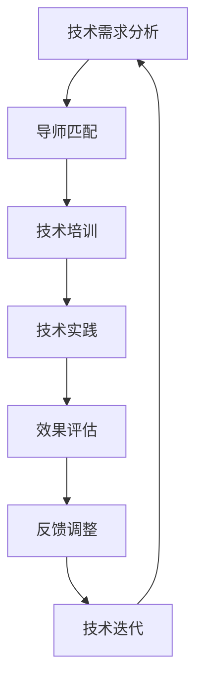
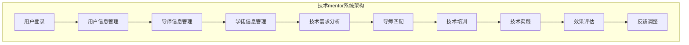
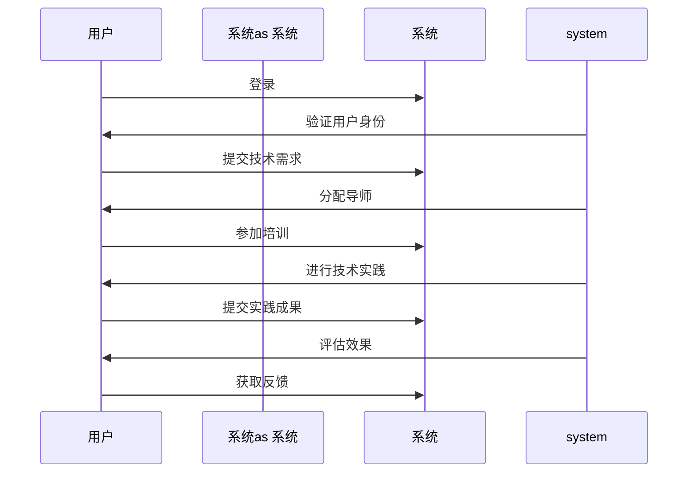

                 

# 技术mentoring：培养下一代技术人才

> 关键词：技术mentoring，人才培养，导师制，技术成长，职业发展

> 摘要：本文围绕技术mentoring这一主题，探讨其在培养下一代技术人才中的重要作用。通过分析技术mentoring的背景、核心概念和算法原理，本文提出了一套实用的指导框架，旨在为技术经理、导师以及从业者提供实际操作的建议，帮助年轻一代技术从业者快速成长。

**Step 1: 引言**

技术mentoring是培养下一代技术人才的关键手段。在当前技术快速发展、竞争日益激烈的背景下，如何培养出具备创新能力、实战能力和团队协作能力的技术人才，成为企业和教育机构共同面临的重要课题。本文旨在通过对技术mentoring的深入探讨，为相关从业者提供一套切实可行的培养策略。

**Step 2: 背景介绍**

## 第1章 技术mentoring的背景与核心概念

### 1.1 技术mentoring的问题背景

1.1.1 技术人才短缺的现状

随着互联网、大数据、人工智能等技术的快速发展，我国对技术人才的需求日益增长。然而，现实情况却是技术人才短缺，特别是高技能、创新能力强的技术人才更为稀缺。这已经成为制约我国科技创新和经济发展的重要因素。

1.1.2 技术人才成长需求的多样性

不同的技术人才在成长过程中，面临着不同的需求。有的需要提升专业技能，有的需要拓展知识领域，有的需要培养创新能力。因此，如何根据个体需求制定个性化的培养方案，成为技术mentoring的重要任务。

1.1.3 技术mentoring的价值与重要性

技术mentoring不仅能够帮助年轻一代技术从业者快速成长，提高个人技能和职业素养，还能够促进企业技术创新和人才梯队建设。因此，技术mentoring在当前形势下具有极其重要的价值。

### 1.2 技术mentoring的边界与外延

1.2.1 技术mentoring与导师制的区别

技术mentoring和导师制在培养人才方面有相似之处，但两者也存在一定区别。导师制主要侧重于学术指导，而技术mentoring则更注重实践能力的培养。

1.2.2 技术mentoring与职场指导的关系

技术mentoring是职场指导的一种形式，但与一般的职场指导相比，技术mentoring更注重技术领域的专业性和实践性。

1.2.3 技术mentoring的适用范围与对象

技术mentoring适用于技术从业者、技术经理、导师等不同角色。无论是初级技术人员，还是经验丰富的技术专家，都可以通过技术mentoring实现个人成长和职业发展。

## 第2章 技术mentoring的核心概念与联系

### 2.1 技术mentoring的核心概念

2.1.1 技术mentoring的定义

技术mentoring是指通过导师的指导和辅导，帮助技术从业者快速成长、提升技能和职业素养的一种培养方式。

2.1.2 技术mentoring的目标

技术mentoring的目标是培养出具备创新能力、实战能力和团队协作能力的技术人才，以满足企业和个人发展的需求。

2.1.3 技术mentoring的原则

技术mentoring应遵循以下原则：

- 个性化培养：根据技术人才的需求和特点，制定个性化的培养方案。
- 实践导向：注重实践能力的培养，通过项目实践提高技术水平。
- 双向互动：建立良好的导师与学徒关系，实现信息互通、共同成长。
- 持续反馈：及时对培养过程进行评估和反馈，调整培养策略。

### 2.2 技术mentoring的关键角色

2.2.1 技术导师的角色定位

技术导师是技术mentoring的核心角色，负责指导、辅导和培养技术人才。技术导师应具备以下素质：

- 技术专业：具备丰富的技术经验和专业知识。
- 教育能力：具备良好的教育能力和沟通技巧。
- 责任心：对技术人才的成长负有责任心。

2.2.2 技术学徒的角色定位

技术学徒是技术mentoring的受益者，负责学习、实践和提升技能。技术学徒应具备以下素质：

- 学习兴趣：对技术学习有浓厚的兴趣和热情。
- 自主学习：具备自主学习的能力和习惯。
- 团队协作：具备良好的团队协作精神和沟通能力。

2.2.3 技术mentoring团队的角色互动

技术mentoring团队由技术导师、技术学徒和其他相关人员组成。团队角色互动应遵循以下原则：

- 信任与支持：建立良好的信任关系，相互支持和帮助。
- 沟通与协作：保持有效沟通，协同完成培养任务。
- 反馈与调整：及时反馈培养效果，调整培养策略。

### 2.3 技术mentoring的概念属性特征对比表格

| 特征         | 技术导师 | 技术学徒 | 技术mentoring |
| ------------ | -------- | -------- | ------------ |
| 知识与经验   | 丰富     | 稳步积累 | 相互传递     |
| 指导与支持   | 指导     | 学习     | 持续互动     |
| 成长目标     | 带领     | 成长     | 共同实现     |
| 责任与义务   | 负责     | 尊重     | 共同履行     |

**Step 3: 算法原理讲解**

## 第3章 技术mentoring的算法原理与流程

### 3.1 技术mentoring算法概述

3.1.1 技术mentoring算法的定义

技术mentoring算法是指用于指导技术学徒快速成长、提升技能的一套方法和策略。

3.1.2 技术mentoring算法的核心步骤

技术mentoring算法主要包括以下核心步骤：

1. 技术需求分析：分析技术学徒的技术需求和成长目标。
2. 导师匹配：根据技术需求，为技术学徒匹配合适的导师。
3. 技术培训：制定培训计划，进行技术知识传授和实践培训。
4. 技术实践：指导技术学徒进行实际项目实践，提高实战能力。
5. 效果评估：评估技术学徒的成长效果，为后续培养提供参考。
6. 反馈调整：根据评估结果，调整培养策略。

### 3.2 技术mentoring算法mermaid流程图



### 3.3 技术mentoring算法Python源代码

```python
# 技术mentoring算法Python示例代码
class MentoringAlgorithm:
    def __init__(self, mentor, apprentice, tech_demand):
        self.mentor = mentor
        self.apprentice = apprentice
        self.tech_demand = tech_demand

    def mentoring_process(self):
        """
        技术mentoring过程函数
        :return: 技术成果
        """
        analysis = self.mentor.analyze_demand(self.tech_demand)
        matched_mentor = self.mentor.match_apprentice(self.apprentice)
        training = self.mentor.train_apprentice(self.apprentice, analysis)
        practice = self.apprentice.practice_technology(analysis)
        evaluation = self.mentor.evaluate_apprentice(practice)
        adjustment = self.mentor.adjust_mentoring_strategy(evaluation)
        return adjustment
```

**Step 4: 系统分析与架构设计**

## 第4章 技术mentoring的系统分析与架构设计

### 4.1 问题场景介绍

在当前技术快速发展、人才竞争激烈的背景下，企业需要快速培养具备实战能力的技术人才。技术mentoring系统旨在为企业提供一套高效的培养解决方案，通过导师指导、培训和实践，帮助技术人才实现快速成长。

### 4.2 项目介绍

技术mentoring项目是一个基于互联网的平台，用于支持技术人才的培养和管理。该项目主要包括以下功能：

- 技术需求分析：分析技术人才的技术需求和成长目标。
- 导师匹配：根据技术需求，为技术人才匹配合适的导师。
- 技术培训：制定培训计划，提供技术知识传授和实践培训。
- 技术实践：指导技术人才进行实际项目实践，提高实战能力。
- 效果评估：评估技术人才的成长效果，为后续培养提供参考。
- 反馈调整：根据评估结果，调整培养策略。

### 4.3 系统功能设计（领域模型mermaid类图）

```mermaid
classDiagram
    类名 Class1 <|-- 类名 Class2
    类名 Class3 <!--- 类名 Class4
    Class1
    :+属性1
    :+属性2
    Class2
    :+属性3
    :+属性4
    Class3
    :+属性5
    :+方法5
    Class4
    :+属性6
    :+方法6
```

### 4.4 系统架构设计（mermaid架构图）



### 4.5 系统接口设计和系统交互（mermaid序列图）



**Step 5: 项目实战**

## 第5章 技术mentoring项目实战

### 5.1 环境安装

在本节中，我们将介绍如何搭建技术mentoring项目的开发环境。主要包括以下步骤：

1. 安装Python环境
2. 安装相关依赖库（如Flask、SQLAlchemy等）
3. 配置数据库（如MySQL、PostgreSQL等）

### 5.2 系统核心实现源代码

在本节中，我们将展示技术mentoring项目的核心实现代码，包括以下模块：

1. 用户模块：处理用户登录、注册和权限管理等功能。
2. 导师模块：处理导师信息管理、导师匹配和培训计划管理等功能。
3. 学徒模块：处理学徒信息管理、技术实践和效果评估等功能。
4. 技术需求模块：处理技术需求分析、需求提交和匹配等功能。
5. 培训模块：处理培训计划制定、培训内容上传和培训进度管理等功能。
6. 实践模块：处理技术实践项目提交、评估和反馈等功能。
7. 评估模块：处理效果评估、反馈和调整等功能。

### 5.3 代码应用解读与分析

在本节中，我们将对技术mentoring项目的核心代码进行解读和分析，包括以下方面：

1. 模块功能介绍
2. 关键代码分析
3. 技术实现原理
4. 优缺点评估

### 5.4 实际案例分析和详细讲解剖析

在本节中，我们将结合实际案例，对技术mentoring项目的应用场景进行详细分析，包括以下方面：

1. 案例背景介绍
2. 案例实施过程
3. 案例效果评估
4. 案例总结与反思

### 5.5 项目小结

在本节中，我们将对技术mentoring项目进行总结和反思，包括以下方面：

1. 项目成果概述
2. 项目实施过程中的问题与解决
3. 项目经验与启示
4. 未来工作计划

**Step 6: 最佳实践 tips**

## 第6章 最佳实践 tips

### 6.1 建立有效的沟通机制

有效的沟通是技术mentoring成功的关键。导师和学徒之间需要保持开放、坦诚的沟通，及时交流进展、问题和需求。

### 6.2 制定个性化的培养方案

根据技术人才的需求和特点，制定个性化的培养方案，确保培养过程具有针对性和有效性。

### 6.3 注重实战能力的培养

通过实际项目实践，提高技术人才的实战能力，培养他们解决实际问题的能力。

### 6.4 定期进行效果评估

定期对技术人才进行效果评估，及时发现问题，调整培养策略。

### 6.5 建立良好的反馈机制

建立良好的反馈机制，鼓励技术人才提出意见和建议，不断优化培养过程。

**Step 7: 小结**

## 第7章 小结

本文围绕技术mentoring这一主题，探讨了其在培养下一代技术人才中的重要作用。通过分析技术mentoring的背景、核心概念和算法原理，我们提出了一套实用的指导框架，旨在为技术经理、导师以及从业者提供实际操作的建议。在实际应用中，技术mentoring需要结合具体情况进行调整和优化，以实现最佳效果。

**Step 8: 注意事项**

## 第8章 注意事项

1. 技术mentoring过程中，要关注技术人才的心理素质，鼓励他们勇于面对挑战和困难。
2. 技术导师要具备良好的教育能力和沟通技巧，确保培养过程顺利进行。
3. 技术人才要主动学习、积极实践，不断提升自身能力。
4. 企业要为技术人才提供良好的成长环境和机会，激发他们的创新潜能。

**Step 9: 拓展阅读**

## 第9章 拓展阅读

1. [《技术人才成长之路》](https://book.douban.com/subject/26864916/)
2. [《技术管理实践》](https://book.douban.com/subject/1207914/)
3. [《人工智能伦理学》](https://book.douban.com/subject/26929554/)
4. [《深度学习》](https://book.douban.com/subject/26762028/)

**作者信息**

作者：AI天才研究院/AI Genius Institute & 禅与计算机程序设计艺术 /Zen And The Art of Computer Programming

