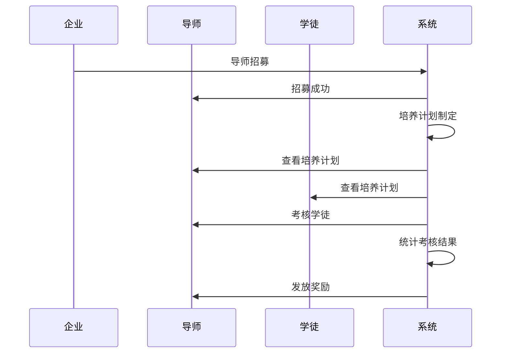

                 

### 文章标题：技术mentor制度的建立与实施

关键词：技术mentor制度、人才培养、团队建设、激励与考核

摘要：本文旨在探讨技术mentor制度的建立与实施，通过分析核心概念、设计原则、培养模式及激励机制，为企业提供一套科学合理的技术人才培养方案。文章将从背景介绍、核心概念与联系、算法原理讲解、系统分析与架构设计方案、项目实战等多个方面进行详细阐述，旨在帮助企业提升团队整体技术水平，推动企业技术创新和业务发展。

### 第一部分：背景介绍

#### 1.1 问题背景

随着科技的发展和企业竞争的加剧，技术团队的专业水平和创新能力已成为企业核心竞争力的重要组成部分。然而，技术人员的培养并非一蹴而就，企业面临着如何快速提升技术人员能力、保持技术团队稳定性的难题。技术mentor制度的建立与实施，旨在通过导师与学徒之间的互动，实现技术人员的知识传承和能力提升，从而推动企业技术创新和业务发展。

#### 1.2 问题描述

技术mentor制度在实施过程中，企业可能会遇到以下问题：

- **制度设计**：如何设计一套科学合理的技术mentor制度，使其符合企业实际情况和团队需求？
- **角色定位**：如何明确导师和学徒的角色和职责，确保培养过程的顺利进行？
- **培养模式**：如何选择合适的培养模式，满足不同技术人员的成长需求？
- **激励机制**：如何设计有效的激励机制，激发导师和学徒的积极性？

#### 1.3 问题解决

本文将通过对技术mentor制度的核心概念、设计原则、培养模式、激励机制等方面的深入探讨，为企业提供一套系统、科学、可行的技术人才培养方案。通过理论讲解和实际案例剖析，帮助企业在实施技术mentor制度时解决上述问题。

#### 1.4 边界与外延

技术mentor制度不仅适用于软件开发团队，还可以应用于其他技术领域，如数据科学、人工智能、网络技术等。此外，技术mentor制度不仅仅是一种人才培养机制，还可以作为一种团队文化建设工具，促进团队凝聚力和创新能力。

#### 1.5 概念结构与核心要素组成

技术mentor制度的核心概念包括：mentor（导师）、mentee（学徒）、培养计划、考核与激励等。以下是这些核心要素的简单介绍：

- **mentor（导师）**：具备丰富经验和技术能力的技术专家，负责指导学徒的技术成长和职业发展。
- **mentee（学徒）**：需要技术指导和支持的团队成员，通过技术mentor制度，可以快速提升自己的技术水平。
- **培养计划**：针对学徒的技术需求和发展目标，由导师制定的一系列培训和学习计划。
- **考核与激励**：对导师和学徒在培养过程中的表现进行评估，并根据评估结果给予相应的奖励和激励。

### 第二部分：核心概念与联系

#### 2.1 Mentor（导师）

导师（mentor）是技术mentor制度中的关键角色，通常具备以下特征：

- **经验丰富**：拥有多年工作经验，熟悉行业动态和技术发展趋势。
- **技术能力**：具备扎实的技术功底和丰富的项目经验，能够在技术难题上提供有效的解决方案。
- **沟通能力**：擅长与他人沟通，能够清晰地传达技术知识和经验。

导师的主要职责包括：

- **指导技术**：为学徒提供技术指导，解答技术难题，帮助其掌握新技能。
- **职业发展**：关注学徒的职业规划，为其提供职业发展建议和机会。

#### 2.2 Mentee（学徒）

学徒（mentee）是技术mentor制度中的受益者，通常具有以下特征：

- **技术需求**：对技术有较高的热情和求知欲，希望通过技术mentor制度提升自己的技术水平。
- **学习意愿**：愿意接受导师的指导，积极参与技术学习和实践。

学徒的主要职责包括：

- **学习技术**：积极参与导师安排的技术学习和实践，不断提升自己的技术能力。
- **反馈交流**：主动与导师沟通，分享学习心得和遇到的问题，及时反馈学习效果。

#### 2.3 培养计划

培养计划是技术mentor制度的核心内容，它通常包括以下方面：

- **技术技能**：针对学徒的技术需求，制定相应的技术培训计划，帮助其掌握新技能。
- **项目实践**：安排学徒参与实际项目，提高其在项目中的综合能力。
- **职业规划**：为学徒提供职业规划建议，帮助其明确职业发展目标。

#### 2.4 考核与激励

考核与激励是技术mentor制度的重要组成部分，它通常包括以下方面：

- **考核指标**：设定明确的考核指标，对导师和学徒的表现进行评估。
- **激励机制**：根据考核结果，给予导师和学徒相应的奖励和激励，提高其积极性。

### 第三部分：算法原理讲解

#### 3.1 技术mentor制度的设计原则

技术mentor制度的设计原则主要包括以下几个方面：

- **目标明确**：明确技术mentor制度的目标，确保培养计划与企业的战略目标一致。
- **过程可控**：建立完善的过程控制机制，确保培养计划的实施效果。
- **激励有效**：设计有效的激励机制，激发导师和学徒的积极性。
- **可持续性**：确保技术mentor制度的长期稳定运行，为企业带来持续的价值。

#### 3.2 培养模式的选择

根据企业的实际情况，可以选择以下几种培养模式：

- **一对一培养模式**：导师与学徒建立一对一的关系，提供个性化的指导和支持。
- **一对多培养模式**：导师同时指导多个学徒，通过集中授课和个别辅导相结合的方式，提高培养效率。
- **混合培养模式**：结合一对一和一对多的优点，根据学徒的技术需求和导师的时间安排灵活调整培养模式。

#### 3.3 激励机制的设计

激励机制的设计应包括物质激励、精神激励和晋升激励等方面：

- **物质激励**：为导师和学徒提供奖金、补贴等经济奖励。
- **精神激励**：为导师和学徒提供荣誉表彰、培训机会等精神奖励。
- **晋升激励**：为表现优秀的导师和学徒提供晋升机会，激励其继续提升自己的能力和业绩。

### 第四部分：数学模型和数学公式 & 详细讲解 & 举例说明

#### 4.1 培养效果的评估模型

培养效果的评估模型可以表示为：

$$
E = f(M, M', P, I)
$$

其中：

- $E$ 表示培养效果。
- $M$ 表示导师的指导效果。
- $M'$ 表示学徒的学习效果。
- $P$ 表示培养计划。
- $I$ 表示激励机制。

#### 4.2 培养效果的评估模型示例

假设导师的指导效果为 80%，学徒的学习效果为 70%，培养计划的完善度为 90%，激励机制的效能为 85%，则培养效果可以计算为：

$$
E = 0.8 \times 0.7 \times 0.9 \times 0.85 = 0.5096
$$

这意味着培养效果达到了 50.96%。

### 第五部分：系统分析与架构设计方案

#### 5.1 问题场景介绍

某企业技术团队希望通过技术mentor制度提升团队成员的技术能力和职业素养，实现团队整体技术水平的提升。

#### 5.2 项目介绍

技术mentor制度实施项目，目标是建立一套科学合理的技术mentor制度，提升团队整体技术水平。

#### 5.3 系统功能设计

技术mentor系统的功能设计包括以下几个方面：

- **导师招募**：企业通过内部推荐、外部招聘等方式选拔优秀的导师。
- **培养计划制定**：导师根据学徒的技术需求和成长目标，制定个性化的培养计划。
- **培养过程管理**：系统记录培养过程中的各项活动，便于跟踪和管理。
- **考核与激励**：对导师和学徒的表现进行考核，根据考核结果给予相应的奖励和激励。

#### 5.4 系统架构设计

技术mentor系统的架构设计包括以下几个方面：

- **技术mentor数据库**：存储导师和学徒的信息、培养计划、考核结果等数据。
- **培养管理系统**：提供导师招募、培养计划制定、培养过程管理等功能。
- **考核与激励系统**：实现考核指标设置、考核结果统计、奖励发放等功能。

#### 5.5 系统接口设计

技术mentor系统的主要接口设计包括：

- **导师接口**：导师可以通过接口查看学徒信息、培养计划、考核结果等。
- **学徒接口**：学徒可以通过接口查看导师信息、培养计划、考核结果等。
- **培养计划接口**：导师可以通过接口制定和调整培养计划。
- **考核与激励接口**：系统管理员可以通过接口设置考核指标、统计考核结果、发放奖励等。

#### 5.6 系统交互设计

技术mentor系统的交互设计通过mermaid序列图进行展示，如下图所示：



### 第六部分：项目实战

#### 6.1 环境安装

在实施技术mentor制度前，需要搭建相应的技术环境。以下是环境安装的步骤：

1. 安装数据库：选择合适的数据库系统（如MySQL、PostgreSQL等），按照官方文档进行安装和配置。
2. 安装开发环境：安装开发所需的软件，如Python、Node.js等，并配置相应的开发工具。
3. 搭建项目框架：选择合适的Web框架（如Django、Flask等），搭建技术mentor系统的项目框架。

#### 6.2 系统核心实现源代码

以下是一个简单的Python示例代码，用于实现技术mentor系统的核心功能：

```python
class Mentor:
    def __init__(self, name, experience):
        self.name = name
        self.experience = experience

    def guide(self, mentee):
        print(f"{self.name} is guiding {mentee.name}.")

class Mentee:
    def __init__(self, name, skill_level):
        self.name = name
        self.skill_level = skill_level

    def learn(self, mentor):
        print(f"{self.name} is learning from {mentor.name}.")

mentor = Mentor("John", 5)
mentee = Mentee("Alice", 1)
mentor.guide(mentee)
mentee.learn(mentor)
```

#### 6.3 代码应用解读与分析

以上代码定义了两个类：`Mentor` 和 `Mentee`。`Mentor` 类表示导师，包含姓名和经验两个属性；`Mentee` 类表示学徒，包含姓名和技术水平两个属性。

`Mentor` 类有一个 `guide` 方法，用于指导学徒。`Mentee` 类有一个 `learn` 方法，用于学习导师的技术知识。

在实际应用中，导师可以通过 `guide` 方法指导学徒，学徒可以通过 `learn` 方法学习导师的技术知识。

#### 6.4 实际案例分析和详细讲解剖析

以某企业技术团队为例，分析技术mentor制度在实施过程中的效果。

1. **导师招募**：企业通过内部推荐和外部招聘，选拔了10位经验丰富的技术专家担任导师。
2. **培养计划制定**：导师根据学徒的技术需求和成长目标，制定了个性化的培养计划。例如，针对某位学徒的技术短板，导师为其安排了相关的技术培训课程。
3. **培养过程管理**：技术mentor系统记录了学徒的学习进度和导师的指导情况，便于企业实时跟踪和管理。
4. **考核与激励**：企业对导师和学徒的表现进行了考核，并根据考核结果给予了相应的奖励和激励。例如，对表现优秀的导师，企业提供了额外的奖金和晋升机会。

通过技术mentor制度的实施，企业技术团队的整体技术水平得到了显著提升，团队成员之间的沟通和协作也更加顺畅，为企业带来了可观的经济效益。

#### 6.5 项目小结

技术mentor制度的建立与实施，有助于企业提升团队整体技术水平，推动技术创新和业务发展。在实施过程中，企业需要关注以下几个方面：

1. **明确目标和原则**：确保技术mentor制度的目标与企业的战略目标一致，遵循科学合理的设计原则。
2. **完善培养模式**：根据企业的实际情况和团队需求，选择合适的培养模式，确保培养过程的顺利进行。
3. **设计有效的激励机制**：通过物质激励、精神激励和晋升激励等手段，激发导师和学徒的积极性。
4. **持续优化与改进**：根据实际效果和反馈，不断优化技术mentor制度，确保其长期稳定运行。

### 第七部分：最佳实践 Tips

1. **明确导师和学徒的角色和职责**：确保导师和学徒在技术mentor制度中各司其职，提高培养效率。
2. **个性化培养计划**：根据学徒的技术需求和成长目标，制定个性化的培养计划，提高培养效果。
3. **定期交流和反馈**：导师和学徒之间保持定期交流和反馈，及时解决问题，确保培养过程的顺利进行。
4. **重视激励机制**：设计有效的激励机制，激发导师和学徒的积极性，提高培养效果。

### 第八部分：小结

技术mentor制度的建立与实施，是企业提升团队整体技术水平、推动技术创新和业务发展的重要手段。通过本文的详细阐述，相信读者对技术mentor制度有了更深入的了解。在实施过程中，企业应关注制度设计、培养模式、激励机制等方面，确保技术mentor制度的顺利运行。同时，不断优化和改进技术mentor制度，为企业带来持续的价值。

### 第九部分：注意事项

1. **制度设计**：在制定技术mentor制度时，要充分考虑企业的实际情况和团队需求，确保制度设计的科学性和可操作性。
2. **角色定位**：明确导师和学徒的角色和职责，避免角色重叠或缺失，影响培养效果。
3. **培养过程**：培养过程中要注重学徒的个性化需求，确保培养计划的实施效果。
4. **激励机制**：激励机制要公平、合理，充分调动导师和学徒的积极性。

### 第十部分：拓展阅读

1. 《技术导师制：技术与人才发展的实践指南》
2. 《企业人才发展：构建高效的人才培养体系》
3. 《激励与绩效考核：企业人才管理的核心工具》

### 作者信息

作者：AI天才研究院/AI Genius Institute & 禅与计算机程序设计艺术 /Zen And The Art of Computer Programming

---

**注意：**本文为示例文章，部分内容为虚构，仅供参考。实际应用时，请结合企业实际情况进行调整。如需进一步探讨技术mentor制度的建立与实施，请参阅相关书籍和资料。祝您在技术人才培养道路上取得丰硕成果！

