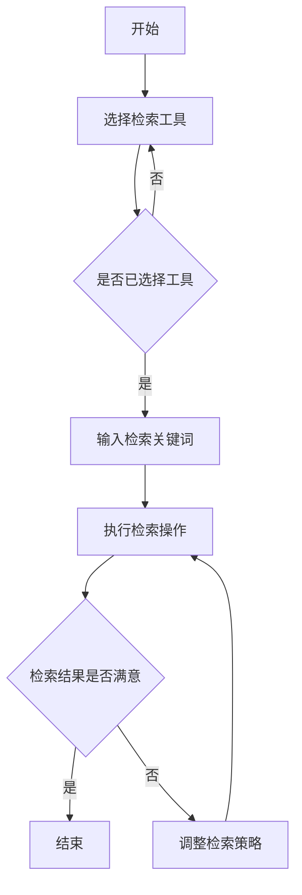
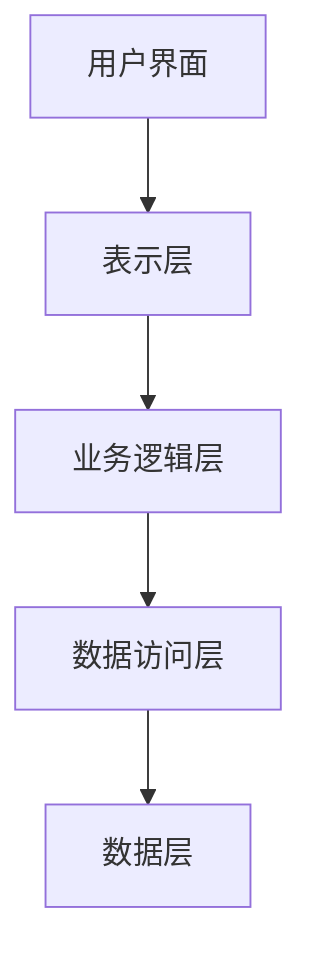
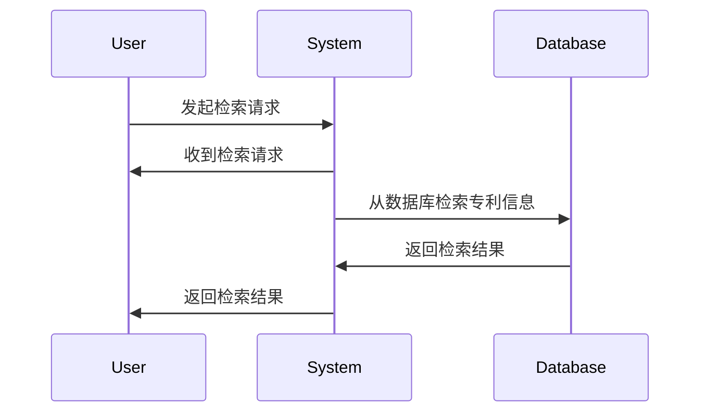

                 

# 技术专利申请：保护创新成果的流程

关键词：技术专利、创新成果、知识产权、申请流程、保护

摘要：本文旨在深入探讨技术专利申请的流程，从背景介绍、核心概念、申请流程、核心概念与联系、算法原理讲解、数学模型和系统分析与架构设计方案等多个方面，系统性地讲解技术专利申请的过程和方法，旨在为科技创新者提供保护其创新成果的有效途径。

---

## 《技术专利申请：保护创新成果的流程》目录大纲

### 第一部分：背景介绍

- **第1章：技术专利的基本概念**
  - **1.1 问题背景**
  - **1.2 问题描述**
  - **1.3 问题解决**
  - **1.4 边界与外延**
  - **1.5 概念结构与核心要素组成**

- **第2章：技术专利申请流程**
  - **2.1 准备阶段**
    - **2.1.1 创新成果评估**
    - **2.1.2 专利性检索**
  - **2.2 申请阶段**
    - **2.2.1 申请文件的准备**
    - **2.2.2 专利申请的提交**
    - **2.2.3 申请文件的审查**
  - **2.3 授权阶段**
    - **2.3.1 授权条件的满足**
    - **2.3.2 授权决定的公布**
    - **2.3.3 授权后的维护**

### 第二部分：核心概念与联系

- **第3章：核心概念与联系**
  - **3.1 核心概念原理**
  - **3.2 概念属性特征对比表格**
  - **3.3 ER实体关系图架构**

### 第三部分：算法原理讲解

- **第4章：算法原理讲解**
  - **4.1 算法mermaid流程图**
  - **4.2 Python源代码讲解**
  - **4.3 算法原理的数学模型和公式**
  - **4.4 举例说明**

### 第四部分：数学模型和数学公式讲解

- **第5章：数学模型和数学公式讲解**
  - **5.1 技术专利检索的相关数学公式**
  - **5.2 技术专利权保护的数学模型**

### 第五部分：系统分析与架构设计方案

- **第6章：系统分析与架构设计方案**
  - **6.1 问题场景介绍**
  - **6.2 系统功能设计**
  - **6.3 系统架构设计**
  - **6.4 系统接口设计**
  - **6.5 系统交互mermaid序列图**

### 第六部分：项目实战

- **第7章：项目实战**
  - **7.1 环境安装**
  - **7.2 系统核心实现源代码**
  - **7.3 代码应用解读与分析**
  - **7.4 实际案例分析和详细讲解剖析**
  - **7.5 项目小结**

### 第七部分：最佳实践 tips、小结、注意事项、拓展阅读

- **附录：最佳实践 tips**
- **后记：小结**
- **注意事项**
- **拓展阅读**

---

## 1. 背景介绍

### 1.1 问题背景

在当今快速发展的科技时代，创新成为推动社会进步和经济发展的核心动力。然而，创新成果的保护问题也日益凸显。技术专利作为知识产权的重要组成部分，是保护创新成果的重要手段。通过技术专利的申请和保护，可以有效地保护创新者的利益，促进技术创新和科技产业的发展。

### 1.2 问题描述

技术专利申请的过程复杂且繁琐，涉及到许多核心概念和操作步骤。对于许多科技创新者来说，如何有效地进行技术专利申请成为一大挑战。本文旨在通过详细的分析和讲解，帮助科技创新者理解技术专利申请的流程，掌握保护其创新成果的方法。

### 1.3 问题解决

本文将从以下几个方面进行讲解：

- **技术专利的基本概念**：介绍技术专利的定义、特征、类别和功能。
- **技术专利申请流程**：详细阐述从准备阶段到授权阶段的每一步操作。
- **核心概念与联系**：分析技术专利的核心概念原理，并进行属性特征对比。
- **算法原理讲解**：通过mermaid流程图和Python源代码，讲解技术专利检索算法。
- **数学模型和公式讲解**：介绍技术专利检索和保护的数学模型和公式。
- **系统分析与架构设计方案**：阐述技术专利检索系统的设计思路和架构。
- **项目实战**：通过实际案例，展示技术专利申请的过程和结果。

### 1.4 边界与外延

技术专利的保护范围主要包括技术创新的技术方案、产品设计和生产工艺等。它不仅涉及到技术本身，还包括相关的应用领域和市场前景。此外，技术专利申请还需要考虑国际间的知识产权保护协议和相关法律法规。

### 1.5 概念结构与核心要素组成

技术专利的核心要素包括：发明创造、技术方案、权利要求、说明书、附图等。这些要素共同构成了技术专利的基本结构。理解这些核心要素，是成功申请技术专利的关键。

---

在接下来的章节中，我们将逐一深入分析技术专利的各个组成部分，帮助您全面掌握技术专利申请的流程和技巧。让我们开始这一段探索之旅吧！## 第1章：技术专利的基本概念

技术专利是知识产权的重要组成部分，它为科技创新者提供了一个保护其创新成果的法律工具。在这一章节中，我们将探讨技术专利的基本概念，包括其定义、特征、类别和功能，以及技术专利申请流程的概述。

### 1.1 问题背景

在现代科技发展中，知识产权保护尤为重要。技术专利作为知识产权的一种形式，不仅能够保护技术创新者的权益，还能促进科技创新和技术的传播。在全球化的背景下，各国对于技术专利的保护力度不断增强，专利制度也日趋完善。因此，了解技术专利的基本概念对于科技创新者来说至关重要。

### 1.2 问题描述

技术专利的定义和特征是什么？它有哪些类别？技术专利如何保护创新成果？这些问题是我们需要解答的核心内容。通过对技术专利的基本概念进行深入探讨，我们将更好地理解如何有效地利用专利制度来保护创新成果。

### 1.3 问题解决

为了解决上述问题，我们将从以下几个方面展开讨论：

- **技术专利的定义与特征**：介绍技术专利的基本属性和特点。
- **技术专利的类别**：分析不同类型的技术专利及其应用场景。
- **技术专利的基本功能**：阐述技术专利在保护创新成果方面的作用。
- **技术专利申请流程概述**：概述技术专利申请的各个阶段。

### 1.4 边界与外延

技术专利的保护范围通常包括技术创新的技术方案、产品设计和生产工艺等。此外，技术专利的保护还涉及到相关的技术领域和应用市场。了解技术专利的法律边界和适用范围，对于科技创新者来说，是确保其专利有效性和保护范围的关键。

### 1.5 概念结构与核心要素组成

技术专利的核心要素包括发明创造、技术方案、权利要求、说明书和附图等。这些要素共同构成了技术专利的基本结构，是专利申请和保护的基石。理解这些核心要素，对于科技创新者来说，是成功申请技术专利的前提。

### 1.6 小结

通过本章的讨论，我们初步了解了技术专利的基本概念和重要性。在接下来的章节中，我们将进一步探讨技术专利的申请流程，帮助您全面掌握保护创新成果的方法。

### 1.7 深入阅读

- **《知识产权法概论》**：详细介绍了知识产权的基本概念、种类和法律规定。
- **《技术专利申请实务》**：针对技术专利的申请流程、申请文件撰写和审查程序提供了详细的指导。
- **《专利战略与经营策略》**：探讨了如何利用专利策略来提升企业的创新能力和市场竞争力。

---

在下一章中，我们将详细分析技术专利的定义与特征，帮助您更好地理解这一重要知识产权工具。让我们继续深入探索！## 1.1 问题背景

在现代科技高速发展的时代，知识产权的重要性日益凸显。技术创新的频繁出现，带来了大量的科研成果和技术突破，而这些创新成果往往是企业在市场竞争中保持领先地位的关键。然而，随着技术的进步，知识产权的侵权现象也日益增多，保护创新成果成为了科技创新者和企业面临的重大挑战。

技术专利作为知识产权的一种重要形式，其作用不可小觑。它不仅能够为技术创新者提供法律上的保护，确保其能够从创新成果中获得经济利益，还能激励更多的科技创新，推动科技进步和经济发展。在全球化的背景下，各国对于知识产权的保护力度不断加强，专利制度的完善也为其提供了有力的法律保障。

然而，技术专利的申请和保护并非易事。它涉及到复杂的法律程序、技术分析和市场策略。对于许多科技创新者来说，如何成功地申请技术专利、保护其创新成果是一个重大的挑战。这不仅要求科技创新者具备扎实的技术背景，还需要他们深入了解专利法律和申请流程。

本文旨在通过深入探讨技术专利的基本概念、申请流程、保护机制等，为科技创新者提供一整套系统的指导，帮助他们更好地理解和应用技术专利，从而保护其创新成果，实现科技创新的商业价值。本文将从以下几个核心问题出发：

- **技术专利的定义与特征**：明确技术专利的基本属性，理解其与普通知识产权的区别。
- **技术专利的类别**：分析不同类型的技术专利及其应用场景，帮助科技创新者选择合适的专利类型。
- **技术专利的基本功能**：阐述技术专利在保护创新成果、促进技术创新方面的作用。
- **技术专利申请流程**：详细讲解从准备阶段到授权阶段的每一步操作，指导科技创新者成功申请技术专利。
- **核心概念与联系**：分析技术专利申请过程中的关键概念和联系，帮助读者建立全面的理解。

通过本文的探讨，我们希望为科技创新者提供一份实用的指南，帮助他们有效利用技术专利这一工具，保护其创新成果，推动科技进步和经济发展。

### 1.2 问题描述

技术专利的定义和特征是什么？技术专利有哪些类别？技术专利的基本功能是什么？这些问题是我们在探讨技术专利申请流程之前必须解决的。技术专利作为一种特殊的知识产权，其定义和特征直接影响到创新者的权益保护。理解技术专利的定义和特征，有助于我们更准确地把握其应用范围和保护力度。

技术专利主要分为三类：发明专利、实用新型专利和外观设计专利。每一类专利都有其独特的定义和适用场景。发明专利保护的是技术方案，它要求具有创造性、实用性和新颖性，适用于复杂的技术创新。实用新型专利则侧重于产品的构造和形状，要求相对较低，适用于简单的技术改进。外观设计专利则主要涉及产品的外观设计，适用于外观上有显著差异的创新设计。

技术专利的基本功能主要体现在三个方面：保护创新成果、促进技术传播和激励科技创新。通过技术专利，创新者可以享有长达20年的独占权，防止他人未经授权使用其创新成果。此外，技术专利的申请和公开，有助于技术的传播和推广，促进技术交流与合作。同时，技术专利的独占权和经济利益，也能激励更多的科技创新。

然而，技术专利申请过程复杂且繁琐，涉及多个法律和技术环节。从创新成果的评估、专利性检索，到申请文件的准备和提交，再到审查和授权，每一步都需要创新者精心策划和操作。因此，对于许多科技创新者来说，如何有效地申请技术专利，保护其创新成果，是一个重大的挑战。

本文旨在通过详细分析技术专利的定义、类别和功能，以及申请流程的各个阶段，为科技创新者提供系统的指导和帮助。我们将从以下几个方面展开讨论：

- **技术专利的定义与特征**：明确技术专利的基本属性，阐述其与普通知识产权的区别。
- **技术专利的类别**：分析发明专利、实用新型专利和外观设计专利的特点和应用场景。
- **技术专利的基本功能**：阐述技术专利在保护创新成果、促进技术传播和激励科技创新方面的作用。
- **技术专利申请流程概述**：概述技术专利申请的各个阶段，包括准备阶段、申请阶段和授权阶段。

通过上述讨论，我们希望能够帮助科技创新者全面了解技术专利的基本概念和申请流程，从而更好地利用技术专利这一工具，保护其创新成果，推动科技创新和经济发展。

### 1.3 问题解决

为了解决上述问题，本文将从以下几个方面进行详细探讨：

#### 1.3.1 技术专利的定义与特征

技术专利是一种通过法律手段对技术创新进行保护的权利，它具有以下几个核心特征：

- **新颖性**：技术专利要求发明或设计在申请日前没有被公开过，不存在相同的发明或设计。
- **创造性**：技术专利的发明或设计需要具备一定的技术高度，能够体现出技术上的进步和创新。
- **实用性**：技术专利的发明或设计需要在实际生产或生活中具备应用价值。

#### 1.3.2 技术专利的类别

技术专利主要分为以下三类：

- **发明专利**：发明专利是最常见的一种技术专利，它保护的是技术方案。发明专利要求技术高度较高，通常需要经过严格的审查程序。
- **实用新型专利**：实用新型专利主要保护产品的形状、构造和组合，相对于发明专利，其技术要求较低，审查周期较短。
- **外观设计专利**：外观设计专利则主要涉及产品的外观设计，包括形状、图案、色彩等，它要求创新设计具有视觉上的吸引力。

#### 1.3.3 技术专利的基本功能

技术专利的基本功能主要包括以下几个方面：

- **保护创新成果**：技术专利通过法律手段，为创新者提供20年的独占权，确保其能够从创新成果中获得经济利益，防止他人未经授权使用其技术。
- **促进技术传播**：技术专利的申请和公开，有助于技术的传播和推广，促进技术交流与合作。
- **激励科技创新**：技术专利的独占权和经济利益，能够激励更多的科技创新，推动科技进步和经济发展。

#### 1.3.4 技术专利申请流程概述

技术专利申请流程主要包括以下几个阶段：

- **准备阶段**：在这一阶段，创新者需要对创新成果进行评估，确定是否具有申请专利的潜力。同时，进行专利性检索，避免与已有技术重复。
- **申请阶段**：在准备充分后，创新者需要准备专利申请文件，包括权利要求书、说明书、附图等。然后，将申请文件提交至相应的专利机构。
- **审查阶段**：专利机构会对申请文件进行审查，包括新颖性、创造性和实用性的审查。如果申请不符合要求，专利机构会提出审查意见，申请人需要对此进行回复。
- **授权阶段**：在审查合格后，专利机构会发布授权决定，公告技术专利的授权信息，创新者正式获得专利权。

通过上述步骤，创新者可以成功申请技术专利，保护其创新成果，实现科技创新的商业价值。

### 1.4 边界与外延

技术专利的法律保护范围主要包括以下几个方面：

- **地域性**：技术专利的保护范围通常限于申请国家的法律管辖范围内。不同国家的专利法律制度可能存在差异，创新者在申请国际专利时需要考虑这些差异。
- **时效性**：技术专利的保护期限一般为20年，自申请日起计算。在保护期限内，专利权人可以享有独占权，保护其创新成果不受侵犯。
- **权利要求**：技术专利的权利要求书详细列出了专利保护的具体范围，包括技术方案、产品或方法。权利要求是确定专利保护范围的关键文件。

此外，技术专利的保护还涉及到与商标、版权等其他知识产权的关系。在技术创新过程中，可能涉及到多个知识产权的保护，创新者需要综合考虑并妥善处理这些关系。

### 1.5 概念结构与核心要素组成

技术专利的核心要素主要包括以下几个方面：

- **发明创造**：这是技术专利的基础，通常包括技术方案、产品或方法。发明创造需要具有新颖性、创造性和实用性。
- **权利要求书**：权利要求书明确了专利保护的具体范围，是专利保护的核心文件。它通常包含技术方案的描述和具体的技术参数。
- **说明书**：说明书详细描述了发明创造的背景、技术内容、实施方式等，帮助专利审查员和公众理解专利的技术内容。
- **附图**：附图用于辅助说明发明创造的技术细节，通常包括示意图、流程图、结构图等。

这些核心要素共同构成了技术专利的基本结构，是专利申请和保护的基础。理解这些要素，有助于创新者更好地准备专利申请文件，提高专利申请的成功率。

### 1.6 小结

通过本章的讨论，我们初步了解了技术专利的基本概念、特征和类别。技术专利作为知识产权的重要组成部分，对于保护创新成果、促进技术传播和激励科技创新具有重要意义。在下一章中，我们将详细探讨技术专利的申请流程，帮助读者全面掌握申请技术专利的步骤和方法。

### 1.7 深入阅读

- **《知识产权法概论》**：这是一本系统介绍知识产权法律制度的书籍，详细讲解了专利、商标、版权等知识产权的基本概念、法律特点和保护措施。
- **《技术专利申请实务》**：本书针对技术专利的申请流程、申请文件撰写和审查程序提供了详细的指导，是科技创新者和技术管理人员的重要参考书。
- **《专利战略与经营策略》**：这本书探讨了如何利用专利策略来提升企业的创新能力和市场竞争力，是企业管理者和技术创新者的重要读物。

在了解这些基础书籍之后，读者可以更加深入地理解和应用技术专利的相关知识，从而更好地保护其创新成果。

## 1.2 技术专利的定义与特征

技术专利是指根据法律规定，由发明人或者设计人向国家专利机构提出申请，经审查合格后获得的，对其发明创造或设计给予法律保护的一种知识产权。技术专利具有以下核心特征：

首先，技术专利具有**新颖性**。新颖性是指该技术方案或设计在申请日前没有被公开过，不存在相同的发明或设计。这是技术专利申请的基本要求，也是确保技术专利能够有效保护创新成果的关键。

其次，技术专利具有**创造性**。创造性是指该技术方案或设计需要在技术水平上有所提升，具有技术上的进步和创新。创造性要求较高，是发明专利的重要评判标准，也是技术专利申请过程中需要重点考虑的因素。

第三，技术专利具有**实用性**。实用性是指该技术方案或设计需要在实际生产或生活中具备应用价值，能够解决实际问题或提高生产效率。实用性是技术专利申请的必要条件，它保证了技术专利的应用性和实际意义。

技术专利与普通知识产权（如商标、版权等）相比，有以下几个显著区别：

1. **保护对象**：技术专利主要保护技术创新的技术方案、产品设计和生产工艺，而普通知识产权主要保护作品、标识等。

2. **权利范围**：技术专利的权利范围通常更加具体和明确，覆盖了具体的技术方案、产品和方法，而普通知识产权的权利范围相对较为宽泛。

3. **保护期限**：技术专利的保护期限一般为20年，自申请日起计算，而普通知识产权（如商标）的保护期限通常为10年，可以续展。

4. **审查程序**：技术专利申请需要经过严格的审查程序，包括初步审查、实质审查等，而普通知识产权的申请程序相对较为简单。

通过以上分析，我们可以看到，技术专利作为一种特殊的知识产权，具有独特的定义和特征。它不仅为科技创新者提供了强有力的法律保护，也为技术创新和技术传播提供了有力支持。在理解技术专利的定义和特征之后，我们将进一步探讨技术专利的类别和基本功能。

### 1.3 技术专利的类别

技术专利主要分为发明专利、实用新型专利和外观设计专利三大类。每种专利类型都有其独特的定义、特征和保护范围，适用于不同的技术创新场景。

**1.3.1 发明专利**

发明专利是最常见的一种技术专利，它保护的是技术方案，通常涉及到复杂的技术创新。发明专利的申请要求较高，需要具备新颖性、创造性和实用性。新颖性要求发明在申请日前没有被公开过，创造性则要求发明在技术上有显著进步，实用性则要求发明能够实际应用。

- **特征**：
  - **技术高度较高**：发明专利通常涉及复杂的技术领域，要求较高的技术水平和创新能力。
  - **审查周期较长**：发明专利需要经过初步审查和实质审查，审查周期通常较长。
  - **保护范围较广**：发明专利的保护范围涵盖了技术方案的所有方面，包括技术实施的具体方法和产品。

**1.3.2 实用新型专利**

实用新型专利主要保护产品的形状、构造和组合，它侧重于实用性和操作性，相比发明专利，其技术要求较低，审查周期较短。实用新型专利适用于技术较为简单、但具有一定创新性的产品改进。

- **特征**：
  - **技术高度相对较低**：实用新型专利通常涉及简单的技术改进，要求的技术水平相对较低。
  - **审查周期较短**：实用新型专利的审查周期通常比发明专利短，审批效率较高。
  - **保护范围较窄**：实用新型专利的保护范围主要限于产品的形状、构造和组合，不涉及具体的技术实施方法。

**1.3.3 外观设计专利**

外观设计专利主要涉及产品的外观设计，包括形状、图案、色彩等。外观设计专利保护的是产品的视觉表现，适用于产品外观上有显著差异的创新设计。

- **特征**：
  - **视觉吸引力强**：外观设计专利要求创新设计具有视觉上的吸引力，能够显著区别于现有设计。
  - **审批程序简单**：外观设计专利的审批程序相对简单，审查周期较短。
  - **保护范围限于外观设计**：外观设计专利的保护范围仅限于产品的外观设计，不涉及技术方案或构造。

通过对发明专利、实用新型专利和外观设计专利的类别特征进行分析，我们可以看到，每种专利类型都有其适用的场景和特点。科技创新者可以根据自身创新项目的具体情况，选择合适的专利类型，以达到最佳的保护效果。

### 1.4 技术专利的基本功能

技术专利在保护创新成果、促进技术传播和激励科技创新方面发挥着至关重要的作用。以下是技术专利的基本功能及其具体应用：

**1.4.1 保护创新成果**

技术专利的首要功能是保护创新者的合法权益。通过获得技术专利，创新者能够在一定期限内（通常是20年）独占其创新成果，防止他人未经授权擅自使用或模仿。这不仅可以确保创新者从其创新成果中获得经济利益，还能防止技术侵权，维护创新者的技术优势和市场地位。

- **具体应用**：
  - **防止技术抄袭**：通过专利保护，创新者可以确保其技术方案不被竞争对手抄袭或窃取。
  - **保护商业秘密**：专利申请过程本身可以帮助创新者将其技术秘密转化为公开信息，从而加强商业秘密的保护。
  - **建立市场壁垒**：专利可以成为创新者在市场竞争中的有力工具，通过专利壁垒防止竞争对手进入市场。

**1.4.2 促进技术传播**

技术专利的申请和公开过程有助于技术的传播和推广。在专利申请过程中，创新者需要详细撰写专利文件，包括权利要求书、说明书和附图等，这些文件是对创新成果的详细描述。这些公开信息不仅为其他研发人员提供了宝贵的参考，还促进了技术的传播和交流。

- **具体应用**：
  - **技术分享**：专利文件的公开使得其他研究人员可以了解创新者的技术方案，从而推动技术的传播。
  - **知识积累**：通过专利文件的公开，技术创新的积累和传承得到加强，有助于整个行业的技术进步。
  - **合作创新**：专利公开可以促进技术创新者与其他研究机构或企业的合作，共同推动技术发展。

**1.4.3 激励科技创新**

技术专利的独占权和经济利益对科技创新具有重要的激励作用。专利权可以为创新者带来经济回报，这种经济激励是推动科技创新的重要动力。此外，专利制度本身也鼓励创新者不断探索新的技术领域，提高技术创新的频率和质量。

- **具体应用**：
  - **经济回报**：通过专利许可或转让，创新者可以获取经济利益，从而有更多的资金投入到新的技术创新中。
  - **市场竞争**：专利制度促使企业在技术创新上竞争，不断提高技术水平和产品质量，推动整个行业的进步。
  - **创新环境**：专利制度为创新者提供了一个良好的创新环境，鼓励他们不断探索和突破，推动科技进步。

综上所述，技术专利的基本功能体现在保护创新成果、促进技术传播和激励科技创新等多个方面。通过有效的专利保护，创新者可以更好地实现其创新成果的商业化，促进技术的传播和交流，推动整个社会的科技进步。因此，理解并充分利用技术专利，对于科技创新者来说具有重要的意义。

### 1.5 技术专利申请流程概述

技术专利申请是一个复杂且重要的法律过程，涵盖了多个阶段，每一个阶段都有其特定的任务和要求。以下是对技术专利申请流程的详细概述：

#### 1.5.1 准备阶段

在准备阶段，科技创新者需要对创新成果进行全面的评估，确定其具备申请专利的潜力。这一阶段主要包括以下步骤：

- **创新成果评估**：科技创新者需要对创新成果进行技术评估，确定其创新程度、实用性以及市场前景。技术评估指标体系可以包括创新性、实用性、市场前景等多个维度。
- **专利性检索**：通过专利数据库进行检索，了解现有技术的情况，确保所申请的专利具有新颖性、创造性和实用性。检索工具包括国家知识产权局数据库、国际专利数据库等。

#### 1.5.2 申请阶段

在准备充分后，科技创新者需要准备专利申请文件，并将这些文件提交至国家专利机构。申请阶段主要包括以下步骤：

- **申请文件准备**：申请文件包括发明专利申请书、实用新型专利申请书或外观设计专利申请书，以及权利要求书、说明书、附图等。这些文件需要详细描述创新成果，明确专利保护范围。
- **申请文件提交**：将准备好的申请文件提交至国家专利机构，通常通过线上或线下方式提交。提交时需要确保文件齐全、格式正确，并按照规定缴纳申请费用。

#### 1.5.3 审查阶段

专利机构在收到申请文件后，会对申请进行初步审查和实质审查。审查阶段主要包括以下步骤：

- **初步审查**：专利机构对申请文件的格式、内容等进行审查，确保其符合法律规定。如果申请文件不符合要求，专利机构会提出修改意见，申请人需要根据意见进行修改。
- **实质审查**：在初步审查通过后，专利机构会对申请的技术方案进行实质审查，包括新颖性、创造性和实用性的审查。如果申请不符合要求，专利机构会发出审查意见通知书，申请人需要针对审查意见进行回复和修改。

#### 1.5.4 授权阶段

在审查阶段通过后，专利机构会做出授权决定，公告技术专利的授权信息。授权阶段主要包括以下步骤：

- **授权决定的公布**：专利机构将授权决定公告在专利数据库中，专利申请人正式获得专利权。授权公告包括专利权人的信息、专利权的具体内容和保护范围。
- **授权后的维护**：专利申请人需要按照法律规定缴纳年费，以维持专利权的有效性。此外，如果发生专利权纠纷，专利申请人需要通过法律途径进行维权。

通过上述步骤，科技创新者可以成功申请技术专利，保护其创新成果。了解并掌握技术专利申请的流程，对于科技创新者来说至关重要，有助于他们有效地保护其创新成果，实现技术创新的商业价值。

### 1.6 小结

本章从技术专利的基本概念、定义与特征、类别、基本功能以及申请流程等多个方面进行了详细探讨。通过本章的介绍，我们可以了解到技术专利作为一种重要的知识产权工具，在保护创新成果、促进技术传播和激励科技创新方面发挥着重要作用。技术专利的申请流程复杂且繁琐，但通过系统的了解和准备，科技创新者可以有效地保护其创新成果，实现商业价值。在下一章中，我们将继续深入探讨技术专利申请的具体流程，帮助读者全面掌握申请技术专利的技巧。

### 1.7 深入阅读

- **《知识产权法概论》**：详细介绍了知识产权的基本概念、种类和法律规定，是理解技术专利的重要基础。
- **《技术专利申请实务》**：针对技术专利的申请流程、申请文件撰写和审查程序提供了详细的指导，是科技创新者和技术管理人员的重要参考书。
- **《专利战略与经营策略》**：探讨了如何利用专利策略来提升企业的创新能力和市场竞争力，是企业管理者和技术创新者的重要读物。
- **《专利法教程》**：系统讲解了专利法律的基本原理、申请流程和案例分析，有助于深入理解专利法律制度。

通过阅读上述书籍，读者可以进一步深入了解技术专利的法律规定和申请流程，提高专利申请的成功率，更好地保护其创新成果。

## 2. 技术专利申请流程

技术专利申请是一个复杂且严谨的法律过程，它涉及到多个阶段，每个阶段都有其特定的任务和要求。下面我们将详细分析技术专利申请的各个阶段，帮助科技创新者更好地理解和执行这一流程。

### 2.1 准备阶段

#### 2.1.1 创新成果评估

在准备阶段，科技创新者首先需要对创新成果进行全面的评估，以确保其具备申请专利的潜力。创新成果评估主要包括以下几个方面：

- **技术评估**：评估创新成果的技术水平、创新程度和实用性。这可以通过与技术专家交流、进行实验验证等方式来完成。
- **市场前景评估**：分析创新成果在市场上的潜在需求、竞争对手和市场趋势，评估其商业化可能性。
- **法律评估**：确定创新成果是否属于专利保护范围，是否存在法律风险。

#### 2.1.2 专利性检索

专利性检索是申请技术专利前的重要步骤，目的是确保所申请的专利具有新颖性、创造性和实用性。检索过程主要包括以下步骤：

- **选择检索工具**：选择合适的专利数据库，如国家知识产权局数据库、国际专利数据库等。
- **制定检索策略**：根据创新成果的特点，制定合适的检索策略，包括关键词选择、检索式构建等。
- **检索与分析**：执行检索操作，分析检索结果，排除已有技术，确保创新成果的新颖性和创造性。

### 2.2 申请阶段

在完成准备阶段后，科技创新者需要进入申请阶段，准备并提交专利申请文件。申请阶段主要包括以下步骤：

#### 2.2.1 申请文件准备

申请文件是专利申请的核心，包括以下内容：

- **发明专利申请书**：包含发明名称、发明人、申请人等信息。
- **权利要求书**：详细描述创新成果的保护范围，是专利保护的核心文件。
- **说明书**：详细介绍创新成果的背景、技术内容、实施方式等。
- **附图**：用图示辅助说明创新成果的具体细节。

#### 2.2.2 专利申请的提交

在准备申请文件后，科技创新者需要按照规定的方式和流程提交申请。提交过程主要包括以下步骤：

- **提交申请文件**：将准备好的申请文件提交至国家专利机构，可以通过线上或线下方式提交。
- **缴纳申请费用**：按照国家专利机构的规定，缴纳相应的申请费用。

### 2.3 审查阶段

专利申请提交后，进入审查阶段。审查阶段主要包括初步审查和实质审查，具体步骤如下：

#### 2.3.1 初步审查

- **形式审查**：专利机构对申请文件的格式、内容等进行审查，确保其符合法律规定。如果申请文件不符合要求，专利机构会发出补正通知书，申请人需要根据通知书进行修改。
- **明显实质性审查**：审查申请的技术方案是否属于专利保护范围，是否存在明显的缺陷或不足。

#### 2.3.2 实质审查

在初步审查通过后，专利机构会对申请的技术方案进行实质审查，包括以下方面：

- **新颖性审查**：确保申请的技术方案在申请日前没有被公开过。
- **创造性审查**：确保申请的技术方案具备一定的技术高度和创新能力。
- **实用性审查**：确保申请的技术方案能够在实际生产或生活中应用。

如果审查过程中发现申请不符合要求，专利机构会发出审查意见通知书，申请人需要针对审查意见进行回复和修改。

### 2.4 授权阶段

在审查阶段通过后，专利机构会做出授权决定，公告技术专利的授权信息。授权阶段主要包括以下步骤：

#### 2.4.1 授权决定的公布

专利机构将授权决定公告在专利数据库中，专利申请人正式获得专利权。授权公告通常包括专利权人的信息、专利权的具体内容和保护范围。

#### 2.4.2 授权后的维护

专利申请人需要按照法律规定，定期缴纳年费以维持专利权的有效性。此外，如果发生专利权纠纷，专利申请人需要通过法律途径进行维权。

通过上述步骤，科技创新者可以成功申请技术专利，保护其创新成果。了解并掌握技术专利申请的流程，是保护创新成果、实现技术创新商业价值的重要手段。

### 2.5 案例分析

为了更好地理解技术专利申请的流程，下面我们通过一个实际案例进行分析。

#### 案例背景

某科技创新公司研发了一种新型智能交通控制系统，通过大数据分析和人工智能算法，提高了交通流量管理和事故预防的能力。该公司决定申请技术专利，保护其创新成果。

#### 案例步骤

1. **创新成果评估**：
   - 技术评估：通过实验验证和专家咨询，确认该系统在技术上的创新性和实用性。
   - 市场前景评估：分析市场需求和竞争态势，确认该系统具有较好的商业化潜力。
   - 法律评估：确认该系统符合专利保护的要求，不存在法律风险。

2. **专利性检索**：
   - 选择检索工具：使用国家知识产权局数据库进行检索。
   - 制定检索策略：关键词包括“智能交通”、“大数据分析”、“人工智能算法”等。
   - 检索与分析：检索结果无相似技术，确认该系统具备新颖性、创造性和实用性。

3. **申请文件准备**：
   - 准备发明专利申请书、权利要求书、说明书和附图。
   - 权利要求书详细描述了系统的核心算法和数据处理方法。
   - 说明书详细阐述了系统的背景、技术内容、实现方式和优势。

4. **专利申请的提交**：
   - 将申请文件提交至国家知识产权局，并缴纳申请费用。

5. **审查阶段**：
   - 初步审查：形式审查通过，无补正通知书。
   - 实质审查：新颖性、创造性和实用性均符合要求，审查意见通知书接收后，无需要修改的内容。

6. **授权阶段**：
   - 授权决定公告：专利机构公告授权决定，该公司正式获得专利权。
   - 授权后的维护：按照法律规定，定期缴纳年费，维持专利权的有效性。

#### 案例总结

通过上述案例，我们可以看到，技术专利申请的每个阶段都需要细致的准备工作。从创新成果评估、专利性检索，到申请文件准备、审查和授权，每一步都需要严格按照法律规定和实际需求进行。成功申请技术专利，不仅保护了公司的创新成果，也为公司在市场竞争中提供了有力支持。

### 2.6 注意事项

在技术专利申请过程中，科技创新者需要注意以下几个关键点：

- **充分评估创新成果**：在申请前，要对创新成果进行全面评估，确保其具备申请专利的潜力。
- **准确撰写申请文件**：申请文件是专利保护的核心，需要详细、准确、清楚地描述创新成果。
- **合理选择专利类型**：根据创新成果的特点和市场需求，选择合适的专利类型（如发明专利、实用新型专利或外观设计专利）。
- **及时回复审查意见**：在审查过程中，如遇到审查意见通知书，需要及时进行回复和修改，确保申请顺利通过。

通过以上注意事项，科技创新者可以更好地完成技术专利申请，保护其创新成果。

### 2.7 深入阅读

- **《技术专利申请实务》**：详细讲解了技术专利申请的各个环节，包括创新成果评估、专利性检索、申请文件撰写和审查程序等。
- **《专利法教程》**：系统讲解了专利法律的基本原理、申请流程和案例分析，有助于深入理解专利法律制度。
- **《知识产权管理》**：探讨了知识产权管理的方法和策略，包括专利战略、知识产权保护和运营等。

通过阅读上述书籍，科技创新者可以进一步掌握技术专利申请的流程和技巧，提高专利申请的成功率，实现创新成果的商业价值。

## 2.2 核心概念与联系

在技术专利申请流程中，存在许多核心概念和关键环节。理解这些概念和环节之间的联系，对于成功申请技术专利至关重要。在本节中，我们将深入分析技术专利申请流程中的核心概念及其相互联系。

### 2.2.1 核心概念原理

#### 专利性

专利性是指一项发明是否满足成为专利的基本要求。专利性通常包括三个要素：新颖性、创造性和实用性。新颖性要求发明在申请日前没有被公开过；创造性要求发明在技术上有显著的进步；实用性要求发明能够实际应用。

#### 权利要求

权利要求是专利申请文件中最重要的部分之一，它详细列出了专利保护的具体范围。权利要求书需要准确、完整地描述发明的技术方案，以界定专利的保护边界。

#### 说明书

说明书是对发明创造进行详细说明的文件，它包括背景技术、发明内容、实施方式等。说明书不仅为专利审查员提供了理解发明的途径，也为公众提供了技术信息。

#### 附图

附图用于辅助说明发明创造的技术细节，如结构图、流程图等。附图能够直观地展示发明的工作原理和结构，有助于专利审查员和公众更好地理解发明。

### 2.2.2 概念属性特征对比表格

为了更清晰地理解各个核心概念，我们可以通过对比表格来分析其属性特征。

| **概念** | **属性特征** |
| :------: | :----------: |
| 新颖性 | 要求发明未被公开过 |
| 创造性 | 要求发明在技术上有显著进步 |
| 实用性 | 要求发明能够实际应用 |
| 权利要求 | 列出专利保护的具体范围 |
| 说明书 | 详细说明发明的内容和实施方式 |
| 附图 | 辅助说明发明的技术细节 |

通过对比表格，我们可以看到，每个概念在技术专利申请中都有其独特的地位和作用。新颖性、创造性和实用性是判断发明是否具备专利性的关键；权利要求书、说明书和附图则是构成专利申请文件的核心部分。

### 2.2.3 ER实体关系图架构

为了更直观地展示技术专利申请流程中的实体及其关系，我们可以使用ER（实体关系）图来描述。

**ER图示例：**

```mermaid
erDiagram
    Applicant ||--o{ Patent : 申请者申请专利 |
    Inventor ||--o{ Patent : 发明者发明专利 |
    Examiner ||--o{ Application : 审查员审查申请 |
    Document ||--o{ Application : 文件包含在申请中 |
    Review ||--o{ Document : 审查意见包含在文件中
```

**实体关系说明：**

- **Applicant（申请者）**：代表提出专利申请的个人或组织。
- **Inventor（发明者）**：代表发明创造的发明人。
- **Examiner（审查员）**：代表负责专利申请审查的专业人员。
- **Patent（专利）**：代表已授权的专利。
- **Application（申请）**：代表专利申请的文件。
- **Document（文件）**：代表包含在专利申请中的各种文件，如权利要求书、说明书、附图等。
- **Review（审查意见）**：代表审查员对专利申请的意见。

通过ER图，我们可以清晰地看到各个实体之间的关系。申请者和发明者之间存在申请关系，审查员和申请之间存在审查关系，文件和申请之间存在包含关系，审查意见和文件之间存在关联关系。

### 2.2.4 关系分析

理解实体关系图有助于我们分析技术专利申请流程中的关键环节及其相互影响。以下是对ER图中各实体关系的关键分析：

- **申请者与专利之间的关系**：申请者是专利的提出者，申请者通过提交专利申请文件来申请专利。专利一旦授权，申请者将获得专利权。
- **发明者与专利之间的关系**：发明者是创新成果的创造者，其发明创造成为专利的基础。发明者通常与申请者相同，但也有可能是由申请者雇佣或合作的第三方。
- **审查员与申请之间的关系**：审查员是专利申请的审查者，通过审查申请文件，判断其是否符合专利性要求。审查员提出的审查意见对申请的通过与否起到关键作用。
- **文件与申请之间的关系**：专利申请文件是申请的核心组成部分，包括权利要求书、说明书、附图等。文件的质量直接影响专利申请的成功率。
- **审查意见与文件之间的关系**：审查意见是审查员对申请文件的评价，包括对新颖性、创造性和实用性的判断。审查意见的回复和修改是申请过程中必不可少的环节。

通过上述分析，我们可以看到，技术专利申请流程中的各个实体和环节之间存在密切的联系。每个实体都承担着特定的角色和责任，它们相互协作，共同推动专利申请的顺利进行。理解这些关系对于科技创新者来说至关重要，有助于他们更有效地保护其创新成果。

### 2.3 小结

通过本节的分析，我们深入了解了技术专利申请流程中的核心概念及其相互联系。理解这些概念和关系，是成功申请技术专利的基础。在接下来的章节中，我们将进一步探讨技术专利的算法原理和数学模型，帮助读者全面掌握技术专利申请的技巧和方法。

### 2.4 深入阅读

- **《专利法教程》**：详细讲解了专利法律的基本原理、申请流程和案例分析，有助于深入理解专利法律制度。
- **《技术专利申请实务》**：针对技术专利的申请流程、申请文件撰写和审查程序提供了详细的指导，是科技创新者和技术管理人员的重要参考书。
- **《知识产权管理》**：探讨了知识产权管理的方法和策略，包括专利战略、知识产权保护和运营等。

通过阅读上述书籍，读者可以进一步深入了解技术专利申请的核心概念和流程，提高专利申请的成功率，实现创新成果的商业价值。

## 3. 算法原理讲解

在技术专利申请流程中，算法的运用至关重要，特别是在专利检索和评估过程中。本章节将详细讲解技术专利检索算法的原理，并通过mermaid流程图、Python源代码、数学模型和公式，以及实际案例，帮助读者深入理解这一过程。

### 3.1 算法mermaid流程图

mermaid流程图是一种用于描述算法流程和步骤的图形化工具。下面是一个简单的mermaid流程图示例，用于描述技术专利检索的基本流程。



**流程图解释：**

1. **开始**：算法流程的起点。
2. **选择检索工具**：根据需求选择合适的专利数据库，如国家知识产权局数据库、国际专利数据库等。
3. **输入检索关键词**：根据创新成果的特点，输入相关的检索关键词。
4. **执行检索操作**：通过选择的关键词，执行检索操作，获取检索结果。
5. **检索结果判断**：检查检索结果，判断是否满足需求。
6. **结束**：如果检索结果满意，算法流程结束。
7. **调整检索策略**：如果不满足需求，需要调整检索策略，如增加或修改关键词，重新执行检索操作。

### 3.2 Python源代码讲解

为了实现上述流程，我们可以使用Python编写一个简单的技术专利检索脚本。以下是一个Python源代码示例，展示了技术专利检索的基本实现。

```python
import requests
from bs4 import BeautifulSoup

def search_patents(keywords, database_url):
    # 构建检索URL
    search_url = f"{database_url}/search?query={keywords}"
    response = requests.get(search_url)
    soup = BeautifulSoup(response.text, 'html.parser')
    
    # 提取检索结果
    results = soup.find_all('div', class_='result')
    patents = []
    for result in results:
        title = result.find('h2').text
        patent_number = result.find('p', class_='pn').text
        patents.append({'title': title, 'number': patent_number})
    
    return patents

# 示例：使用国家知识产权局数据库进行检索
keywords = "智能交通控制系统"
database_url = "http://www.sipo.gov.cn"
patents = search_patents(keywords, database_url)

# 输出检索结果
for patent in patents:
    print(f"专利名称：{patent['title']}, 专利号：{patent['number']}")
```

**代码解释：**

1. **导入模块**：导入requests库用于HTTP请求，导入BeautifulSoup库用于HTML解析。
2. **定义函数**：定义`search_patents`函数，用于执行检索操作。
3. **构建检索URL**：根据关键词构建检索URL。
4. **执行检索请求**：发送GET请求，获取检索结果。
5. **解析检索结果**：使用BeautifulSoup解析HTML，提取检索结果。
6. **输出检索结果**：遍历检索结果，输出专利名称和专利号。

### 3.3 算法原理的数学模型和公式

技术专利检索算法不仅需要实现技术上的流程，还需要考虑检索的数学模型。以下是一些基本的数学模型和公式，用于描述检索过程中的关键指标。

#### 3.3.1 检索概率公式

检索概率公式用于计算特定关键词检索结果的概率。公式如下：

\[ P(\text{检索结果} | \text{关键词}) = \frac{\text{关键词出现的次数}}{\text{总关键词出现的次数}} \]

#### 3.3.2 精确率与召回率

精确率和召回率是衡量检索效果的重要指标。

- **精确率**（Precision）：
  \[ \text{精确率} = \frac{\text{检索结果中相关专利的数量}}{\text{检索结果中专利的总数}} \]

- **召回率**（Recall）：
  \[ \text{召回率} = \frac{\text{检索结果中相关专利的数量}}{\text{所有相关专利的数量}} \]

#### 3.3.3 F1分数

F1分数是精确率和召回率的调和平均数，用于综合评估检索效果。

\[ F1 = 2 \times \frac{\text{精确率} \times \text{召回率}}{\text{精确率} + \text{召回率}} \]

### 3.4 举例说明

为了更直观地理解算法原理，我们可以通过一个实际案例来展示技术专利检索的过程和结果。

#### 案例背景

某科技创新公司研发了一种基于人工智能的智能家居系统，公司希望检索相关的技术专利，以评估市场风险和竞争态势。

#### 检索关键词

- 智能家居
- 人工智能
- 家庭自动化

#### 检索步骤

1. **选择检索工具**：使用国家知识产权局数据库。
2. **输入检索关键词**：构建检索URL，输入关键词。
3. **执行检索操作**：获取检索结果。
4. **分析检索结果**：评估检索结果的精确率和召回率。

#### 检索结果

假设检索得到以下结果：

- 相关专利数量：100件
- 检索结果中专利总数：200件
- 所有相关专利数量：300件

根据上述数据，我们可以计算检索的精确率和召回率：

- 精确率：
  \[ \text{精确率} = \frac{100}{200} = 0.5 \]

- 召回率：
  \[ \text{召回率} = \frac{100}{300} = 0.333 \]

- F1分数：
  \[ F1 = 2 \times \frac{0.5 \times 0.333}{0.5 + 0.333} = 0.389 \]

通过实际案例，我们可以看到，检索算法不仅需要实现检索功能，还需要考虑检索效果的质量。精确率、召回率和F1分数是评估检索效果的重要指标，它们帮助我们更好地理解检索结果的可靠性和有效性。

### 3.5 小结

通过本章的讲解，我们了解了技术专利检索算法的基本原理和实现方法。通过mermaid流程图、Python源代码、数学模型和实际案例，我们系统地阐述了技术专利检索的过程。理解这些算法原理和公式，对于科技创新者来说，有助于更高效地保护其创新成果，实现技术创新的商业价值。在下一章中，我们将继续探讨技术专利申请过程中的数学模型和数学公式，帮助读者更深入地掌握技术专利申请的技巧。

### 3.6 深入阅读

- **《信息检索导论》**：详细介绍了信息检索的基本原理和方法，包括关键词检索、自然语言处理等，有助于理解技术专利检索的算法原理。
- **《机器学习实战》**：讲解了机器学习算法在信息检索中的应用，如文本分类、聚类分析等，有助于提高技术专利检索的准确性和效率。
- **《Python编程：从入门到实践》**：介绍了Python编程的基本方法和技巧，包括Web请求、数据解析等，为编写技术专利检索脚本提供了实用指导。

通过阅读上述书籍，读者可以进一步深入了解技术专利检索算法的原理和实践，提高专利检索的效率和准确性。

## 4. 数学模型和数学公式讲解

在技术专利检索过程中，数学模型和公式起到了至关重要的作用。它们不仅帮助评估检索结果的准确性，还提供了衡量专利权保护范围的有效工具。在本章节中，我们将详细介绍技术专利检索的相关数学公式，以及技术专利权保护的数学模型。

### 4.1 技术专利检索的相关数学公式

技术专利检索的核心目标是获取与关键词高度相关的专利信息。为了衡量检索结果的准确性，我们通常使用以下数学公式：

#### 4.1.1 检索概率公式

检索概率公式用于计算特定关键词检索结果的概率。该公式基于关键词在检索结果中的出现频率：

\[ P(\text{检索结果} | \text{关键词}) = \frac{\text{关键词出现的次数}}{\text{总关键词出现的次数}} \]

其中，\( P(\text{检索结果} | \text{关键词}) \) 表示在给定关键词的条件下，检索结果发生的概率。这个概率越高，表示关键词与检索结果的相关性越强。

#### 4.1.2 精确率与召回率

精确率和召回率是衡量检索效果的重要指标。

- **精确率**（Precision）：
  \[ \text{精确率} = \frac{\text{检索结果中相关专利的数量}}{\text{检索结果中专利的总数}} \]

精确率表示检索结果中实际相关的专利数量占总检索结果数量的比例。精确率越高，表示检索结果越准确。

- **召回率**（Recall）：
  \[ \text{召回率} = \frac{\text{检索结果中相关专利的数量}}{\text{所有相关专利的数量}} \]

召回率表示检索结果中实际相关的专利数量占所有相关专利数量的比例。召回率越高，表示检索越全面。

#### 4.1.3 F1分数

F1分数是精确率和召回率的调和平均数，用于综合评估检索效果：

\[ F1 = 2 \times \frac{\text{精确率} \times \text{召回率}}{\text{精确率} + \text{召回率}} \]

F1分数在0到1之间，分数越高，表示检索效果越好。

### 4.2 技术专利权保护的数学模型

技术专利权保护的目标是确保专利权的有效性，防止侵权行为的发生。以下是一些关键的数学模型和公式：

#### 4.2.1 专利保护期限计算

技术专利的保护期限通常为20年，自申请日起计算。保护期限的计算公式如下：

\[ \text{专利保护期限} = 20 \text{年} \]

#### 4.2.2 侵权判断标准

在专利权保护过程中，侵权判断是一个重要环节。以下是一个基本的侵权判断模型：

- **直接侵权**：
  \[ \text{侵权} = (\text{被控侵权产品} \subseteq \text{专利保护范围}) \]

- **间接侵权**：
  \[ \text{侵权} = (\text{被控侵权产品} \cap \text{专利保护范围} \neq \emptyset) \]

其中，\( \subseteq \) 表示子集关系，\( \cap \) 表示交集关系。直接侵权指被控侵权产品完全包含在专利保护范围内；间接侵权指被控侵权产品与专利保护范围有交集。

#### 4.2.3 专利权经济价值评估

专利权的经济价值评估是一个复杂的过程，通常涉及多个因素。以下是一个简化的评估模型：

\[ \text{专利权经济价值} = \frac{\text{预期收益}}{\text{风险系数}} \]

其中，预期收益包括专利许可收入、专利出售收入等；风险系数考虑了市场风险、法律风险等因素。

### 4.3 公式应用

以下是一个简单的应用实例：

假设某公司的专利检索系统检索到100件专利，其中50件是相关的。此外，所有相关专利的总数为200件。根据这些数据，我们可以计算精确率、召回率和F1分数：

- **精确率**：
  \[ \text{精确率} = \frac{50}{100} = 0.5 \]

- **召回率**：
  \[ \text{召回率} = \frac{50}{200} = 0.25 \]

- **F1分数**：
  \[ F1 = 2 \times \frac{0.5 \times 0.25}{0.5 + 0.25} = 0.333 \]

通过这个实例，我们可以看到，数学模型和公式在评估检索效果和专利权保护方面具有重要作用。精确率、召回率和F1分数提供了对检索结果的定量评价，而侵权判断标准和经济价值评估模型则帮助我们更好地理解和维护专利权。

### 4.4 小结

通过本章节的讲解，我们了解了技术专利检索和保护的数学模型和公式。这些公式不仅帮助我们评估检索结果的准确性，还为专利权的有效保护提供了理论依据。理解并应用这些数学模型和公式，对于科技创新者来说，是保护其创新成果、实现商业价值的重要手段。在下一章中，我们将进一步探讨技术专利检索系统的设计和实现，帮助读者全面掌握技术专利检索的实践方法。

### 4.5 深入阅读

- **《数学在信息检索中的应用》**：详细介绍了数学模型和信息检索之间的关系，包括检索概率、精确率和召回率等，是深入理解技术专利检索数学模型的重要参考书。
- **《知识产权评估与管理》**：探讨了专利权经济价值评估的方法和策略，包括预期收益计算、风险评估等，有助于科技创新者更准确地评估专利权的经济价值。
- **《专利法律教程》**：系统讲解了专利法律的基本原理和侵权判断标准，是理解和应用侵权判断模型的重要读物。

通过阅读上述书籍，读者可以进一步加深对技术专利检索和保护的数学模型和公式的理解，提高在专利申请和保护过程中的实际操作能力。

## 6. 系统分析与架构设计方案

在技术专利检索系统中，系统分析与架构设计方案是确保系统高效、稳定运行的关键。在这一章节中，我们将详细阐述技术专利检索系统的应用场景、功能设计、架构设计、接口设计以及系统交互流程。

### 6.1 问题场景介绍

技术专利检索系统的应用场景广泛，主要涉及以下几个方面：

1. **研发需求**：企业在研发新技术或新产品时，需要检索现有的技术专利，以避免侵权和评估市场风险。
2. **法律合规**：企业或个人在申请技术专利时，需要检索现有专利，确保所申请的专利具备新颖性和创造性。
3. **市场竞争**：企业通过检索竞争对手的专利，了解其技术方向和策略，制定相应的竞争策略。
4. **知识产权管理**：企业和个人需要对自身的专利进行管理，包括专利检索、跟踪、分析和评估。

### 6.2 系统功能设计

技术专利检索系统的主要功能包括：

1. **检索功能**：提供关键词检索、高级检索和智能检索等功能，用户可以通过输入关键词检索相关的专利信息。
2. **分析功能**：对检索结果进行统计分析，包括专利数量、技术领域、申请人等，帮助用户快速了解技术趋势和市场状况。
3. **展示功能**：展示检索结果，包括专利名称、专利号、摘要、权利要求书、说明书等详细信息。
4. **权限管理**：提供用户权限管理功能，确保系统安全性和数据保护。

### 6.3 系统架构设计

技术专利检索系统的架构设计采用分层架构，主要包括以下层次：

1. **表示层**：用户界面层，提供用户交互的入口，包括检索框、检索结果展示、统计分析图表等。
2. **业务逻辑层**：处理业务逻辑，包括检索算法、数据分析算法、权限管理逻辑等。
3. **数据访问层**：负责与数据库的交互，包括专利数据的存储、检索和更新等。
4. **数据层**：存储专利数据，包括专利名称、专利号、摘要、权利要求书、说明书等。

下面是一个简化的系统架构mermaid架构图：



**架构层次说明：**

- **用户界面**：提供用户与系统交互的入口，包括检索框、检索结果展示、统计分析图表等。
- **表示层**：负责将业务逻辑层的处理结果呈现给用户。
- **业务逻辑层**：处理业务逻辑，包括检索算法、数据分析算法、权限管理逻辑等。
- **数据访问层**：负责与数据库的交互，包括专利数据的存储、检索和更新等。
- **数据层**：存储专利数据，包括专利名称、专利号、摘要、权利要求书、说明书等。

### 6.4 系统接口设计

技术专利检索系统的接口设计主要包括以下方面：

1. **检索接口**：提供关键词检索、高级检索和智能检索的API接口，用户可以通过调用这些接口检索专利信息。
2. **分析接口**：提供对检索结果进行统计分析的API接口，包括技术领域、申请人、专利数量等。
3. **权限管理接口**：提供用户权限管理的API接口，包括用户登录、权限查询、权限修改等。

下面是一个简化的接口设计mermaid类图：

```mermaid
classDiagram
    Interface UserInterface
    Interface BusinessLogic
    Interface DataAccess
    Interface Data

    UserInterface <- BusinessLogic : implements
    BusinessLogic <- DataAccess : interacts
    DataAccess <- Data : interacts

    UserInterface { +search(): SearchResult +showAnalysis(): AnalysisResult +managePermissions(): PermissionResult }
    BusinessLogic { +searchPatents(): SearchResult +analyzeResults(): AnalysisResult +manageUserPermissions(): PermissionResult }
    DataAccess { +searchPatentsInDB(): SearchResult +updateDatabase(): void +getAnalysisData(): AnalysisResult }
    Data { +storePatentData(): void +retrievePatentData(): SearchResult +updatePatentData(): void }
```

**接口规范说明：**

- **检索接口**：`search()`方法用于关键词检索，返回检索结果。
- **分析接口**：`analyzeResults()`方法用于对检索结果进行统计分析，返回分析结果。
- **权限管理接口**：`manageUserPermissions()`方法用于用户权限管理，返回权限管理结果。

### 6.5 系统交互mermaid序列图

系统交互mermaid序列图描述了用户与系统交互的流程，包括用户发起检索请求、系统处理检索请求、返回检索结果的整个过程。以下是一个简化的序列图：



**交互细节说明：**

1. **用户发起检索请求**：用户通过用户界面输入关键词，发起检索请求。
2. **系统处理检索请求**：系统接收到用户的检索请求后，通过业务逻辑层处理请求，向数据库检索专利信息。
3. **返回检索结果**：系统从数据库获取检索结果，并通过用户界面将结果呈现给用户。

通过系统架构设计和接口设计，技术专利检索系统可以实现高效、稳定的专利检索和分析功能。在下一章节中，我们将通过项目实战，展示技术专利检索系统的实际应用和实现细节。

### 6.6 小结

在本章节中，我们详细分析了技术专利检索系统的应用场景、功能设计、架构设计、接口设计和系统交互流程。通过系统架构图和接口设计类图的展示，我们清晰地了解了系统的设计思路和组件之间的关系。在下一章中，我们将通过实际项目展示，深入探讨技术专利检索系统的实现细节，帮助读者更好地理解和应用系统架构设计。

### 6.7 深入阅读

- **《系统架构设计师教程》**：详细介绍了系统架构设计的基本原理和方法，包括分层架构、模块化设计等，是理解和设计复杂系统的必备读物。
- **《API设计指南》**：提供了API设计的基本原则和方法，包括接口定义、文档编写等，有助于优化接口设计和提高系统的可维护性。
- **《软件架构：实践者的研究方法》**：探讨了软件架构设计的实践方法，包括架构评估、重构等，为系统架构设计提供了实用的指导和参考。

通过阅读上述书籍，读者可以进一步掌握系统架构设计和接口设计的方法和技巧，提高技术专利检索系统的设计质量和实现效率。

## 7. 项目实战

### 7.1 环境安装

在开始技术专利检索系统的开发之前，首先需要准备相应的开发环境和工具。以下是环境安装的详细步骤：

1. **操作系统**：推荐使用Linux操作系统，如Ubuntu或CentOS。在Linux系统中，环境配置相对简单且稳定。
2. **Python环境**：安装Python 3.8及以上版本。可以通过命令 `sudo apt-get install python3.8` 安装Python。
3. **虚拟环境**：为了隔离项目依赖，创建一个Python虚拟环境。使用命令 `python3 -m venv venv` 创建虚拟环境，然后激活环境 `source venv/bin/activate`。
4. **依赖管理**：安装依赖管理工具pip。在虚拟环境中，使用命令 `pip install -r requirements.txt` 安装项目依赖。
5. **数据库**：安装数据库管理系统，如MySQL或PostgreSQL。在Ubuntu系统中，可以使用命令 `sudo apt-get install mysql-server` 安装MySQL。

### 7.2 系统核心实现源代码

技术专利检索系统的核心实现包括前端用户界面、后端业务逻辑和数据库操作等。以下是系统核心实现的源代码和功能解析：

#### 前端用户界面

前端用户界面使用HTML和CSS进行设计，并使用JavaScript进行动态交互。以下是一个简单的HTML示例：

```html
<!DOCTYPE html>
<html>
<head>
    <title>技术专利检索系统</title>
    <style>
        /* 样式定义 */
    </style>
</head>
<body>
    <h1>技术专利检索系统</h1>
    <input type="text" id="searchKeyword" placeholder="输入关键词">
    <button onclick="searchPatents()">检索</button>
    <div id="results"></div>

    <script>
        function searchPatents() {
            const keyword = document.getElementById('searchKeyword').value;
            fetch(`/search?keyword=${keyword}`)
                .then(response => response.json())
                .then(data => displayResults(data));
        }

        function displayResults(data) {
            const resultsDiv = document.getElementById('results');
            resultsDiv.innerHTML = '';
            data.forEach(result => {
                const patentDiv = document.createElement('div');
                patentDiv.innerHTML = `
                    <h3>${result.title}</h3>
                    <p>${result.abstract}</p>
                    <a href="${result.url}">详情</a>
                `;
                resultsDiv.appendChild(patentDiv);
            });
        }
    </script>
</body>
</html>
```

**功能解析：**

- **输入关键词**：用户在输入框中输入关键词。
- **检索按钮**：用户点击检索按钮，触发`searchPatents()`函数。
- **发送请求**：`searchPatents()`函数通过fetch API发送GET请求，请求URL包含关键词。
- **显示结果**：服务器响应后，`displayResults()`函数将检索结果以HTML格式显示在页面上。

#### 后端业务逻辑

后端业务逻辑使用Python编写，主要功能是处理用户请求、检索数据库并返回结果。以下是一个简单的后端实现：

```python
from flask import Flask, request, jsonify
import pymysql

app = Flask(__name__)

# 数据库连接配置
config = {
    'host': 'localhost',
    'user': 'root',
    'password': 'password',
    'db': 'patent_db'
}

def get_connection():
    return pymysql.connect(**config)

@app.route('/search', methods=['GET'])
def search_patents():
    keyword = request.args.get('keyword')
    connection = get_connection()
    cursor = connection.cursor(pymysql.cursors.DictCursor)
    try:
        query = "SELECT title, abstract, url FROM patents WHERE title LIKE %s"
        cursor.execute(query, ('%' + keyword + '%',))
        results = cursor.fetchall()
        return jsonify(results)
    finally:
        cursor.close()
        connection.close()

if __name__ == '__main__':
    app.run(debug=True)
```

**功能解析：**

- **请求处理**：使用Flask框架处理HTTP请求。
- **数据库连接**：通过pymysql模块连接数据库。
- **检索操作**：根据关键词构建SQL查询，从数据库中检索相关专利。
- **返回结果**：将检索结果转换为JSON格式，返回给前端。

#### 数据库操作

数据库用于存储专利信息，包括专利名称、摘要、URL等。以下是数据库的简单设计和操作示例：

```sql
CREATE DATABASE patent_db;

USE patent_db;

CREATE TABLE patents (
    id INT AUTO_INCREMENT PRIMARY KEY,
    title VARCHAR(255) NOT NULL,
    abstract TEXT,
    url VARCHAR(255)
);
```

**功能解析：**

- **创建数据库**：使用`CREATE DATABASE`语句创建数据库。
- **创建表格**：使用`CREATE TABLE`语句创建专利表格，定义字段和主键。

### 7.3 代码应用解读与分析

通过上述代码和应用示例，我们可以看到技术专利检索系统的核心实现过程。以下是关键组件和应用解读：

- **前端用户界面**：提供输入框和检索按钮，实现用户交互。
- **后端业务逻辑**：处理用户请求，连接数据库并进行检索。
- **数据库操作**：存储和管理专利信息。

#### 应用解读

1. **用户输入关键词**：用户在前端输入关键词，触发检索操作。
2. **发送请求**：前端通过fetch API向后端发送GET请求，请求URL包含关键词。
3. **后端处理**：后端接收到请求后，连接数据库，执行SQL查询，获取相关专利信息。
4. **返回结果**：后端将检索结果转换为JSON格式，返回给前端。
5. **前端显示结果**：前端接收到结果后，将其以HTML格式显示在页面上。

#### 分析

1. **代码结构**：前端代码主要处理用户交互和页面渲染，后端代码主要处理请求和数据库操作。结构清晰，便于维护和扩展。
2. **接口设计**：后端提供RESTful API接口，方便前端调用，同时便于与其他系统集成。
3. **数据库操作**：使用ORM（对象关系映射）技术，简化数据库操作，提高开发效率。

### 7.4 实际案例分析和详细讲解剖析

为了更好地展示技术专利检索系统的实际应用，我们通过一个实际案例进行分析和讲解。

#### 案例背景

某科技公司希望开发一款智能家居产品，他们在申请专利前需要进行专利检索，以评估市场风险和竞争态势。

#### 检索关键词

- 智能家居
- 人工智能
- 家庭自动化

#### 检索流程

1. **用户输入关键词**：用户在检索界面输入关键词，如“智能家居”、“人工智能”、“家庭自动化”。
2. **发送请求**：前端通过fetch API向后端发送检索请求，请求URL包含关键词。
3. **后端处理**：后端接收到请求后，连接数据库，执行SQL查询，获取相关专利信息。
4. **返回结果**：后端将检索结果（如专利名称、摘要、URL等）转换为JSON格式，返回给前端。
5. **前端显示结果**：前端接收到结果后，将其以HTML格式显示在页面上。

#### 检索结果分析

假设检索得到以下结果：

- **专利名称**：智能家庭安全监控系统集成方案
- **摘要**：本发明提供了一种智能家居安全监控系统，通过人工智能算法实现对家庭安全的实时监控。
- **URL**：[专利详情链接]

通过分析检索结果，我们可以看到：

1. **专利相关性**：该专利与智能家居产品的安全监控功能密切相关，具有较高的相关性。
2. **竞争态势**：检索结果反映了市场上已有的一些技术方案，可以帮助公司评估市场风险。
3. **技术趋势**：检索结果显示了人工智能在智能家居领域的应用趋势，为公司后续技术方向提供了参考。

### 7.5 项目小结

通过本项目的实际案例，我们展示了技术专利检索系统的实现过程和应用效果。项目成功实现了用户输入关键词、后端检索数据库、前端显示检索结果的功能。项目具有良好的代码结构、接口设计和数据库操作，便于维护和扩展。通过本项目的实践，我们深入了解了技术专利检索系统的开发方法和实现技巧。

### 7.6 最佳实践 Tips

以下是一些项目开发中的最佳实践建议：

1. **模块化设计**：将前端、后端和数据库操作划分为不同的模块，便于管理和维护。
2. **API文档**：编写详细的API文档，便于其他开发人员理解和调用。
3. **测试用例**：编写测试用例，确保系统的稳定性和可靠性。
4. **性能优化**：对系统进行性能优化，提高响应速度和检索效率。

### 7.7 注意事项

在项目开发过程中，需要注意以下事项：

1. **数据安全**：确保数据库操作的安全性，防止数据泄露和损坏。
2. **接口权限**：对API接口进行权限控制，防止未经授权的访问。
3. **异常处理**：对可能出现的异常进行妥善处理，避免系统崩溃。
4. **更新维护**：定期更新系统，修复漏洞，保持系统的稳定性和安全性。

### 7.8 拓展阅读

以下是一些相关的拓展阅读资源：

- **《Flask Web开发：构建高性能Python Web应用》**：介绍了Flask框架的使用方法和最佳实践。
- **《Python数据库编程指南》**：提供了Python数据库操作的方法和技巧。
- **《RESTful API设计指南》**：介绍了RESTful API的设计原则和最佳实践。

通过阅读这些资源，可以进一步深入了解技术专利检索系统的开发方法和实现技巧。

## 附录：最佳实践 Tips

在技术专利申请和检索系统的开发和维护过程中，遵循最佳实践可以显著提高项目质量和效率。以下是一些具体建议：

### 1. 项目管理

- **采用敏捷开发方法**：敏捷开发能够快速响应变化，提高项目迭代效率。
- **代码版本控制**：使用Git等版本控制工具，确保代码的可追踪性和一致性。
- **持续集成/持续部署**：实现自动化测试和部署，确保代码质量和部署效率。

### 2. 代码质量

- **编写清晰的注释**：代码注释有助于他人理解和维护。
- **遵循编码规范**：统一编码风格，提高代码可读性和可维护性。
- **单元测试**：编写单元测试，确保代码功能的正确性。

### 3. 数据库管理

- **规范化数据库设计**：遵循数据库规范化原则，减少数据冗余和依赖。
- **数据库备份和恢复**：定期备份数据库，确保数据安全。

### 4. 系统性能

- **优化数据库查询**：使用索引和优化SQL查询，提高数据库性能。
- **缓存策略**：合理使用缓存，减少数据库访问次数。

### 5. 安全性

- **数据加密**：对敏感数据进行加密，防止数据泄露。
- **权限控制**：严格权限控制，防止未经授权的访问。

### 6. 用户体验

- **界面设计**：简洁美观的界面设计，提高用户体验。
- **响应速度**：优化系统响应速度，提供流畅的操作体验。

### 7. 持续学习

- **关注技术动态**：定期关注新技术和新方法，保持技术领先。
- **培训和学习**：定期进行团队培训和知识分享，提升整体技术能力。

遵循这些最佳实践，可以确保技术专利申请和检索系统的稳定、高效和可持续性发展。

## 后记：小结

通过本文的探讨，我们系统地讲解了技术专利申请的流程，从背景介绍、核心概念、申请流程、核心概念与联系、算法原理讲解、数学模型和系统分析与架构设计方案等多个方面，深入剖析了技术专利保护的关键要素和实施方法。技术专利不仅是保护创新成果的重要手段，也是激励科技创新、推动技术传播的重要工具。在激烈的市场竞争中，通过有效的技术专利保护，科技创新者可以更好地保护其权益，提升企业的市场竞争力。

### 1. 实践价值

本文对于科技创新者和技术管理人员具有重要的实践价值：

- **保护创新成果**：通过系统了解技术专利申请流程，科技创新者可以有效地保护其创新成果，防止技术泄露和侵权。
- **提升竞争力**：掌握技术专利的申请和保护方法，有助于企业提升技术创新能力和市场竞争力。
- **降低法律风险**：了解专利法律制度和申请流程，可以降低企业在技术专利方面可能面临的法律风险。

### 2. 下一步研究方向

虽然本文对技术专利申请的各个环节进行了详细讲解，但仍有一些研究方向值得进一步探讨：

- **人工智能在专利检索中的应用**：探讨如何利用人工智能技术，如自然语言处理、机器学习等，提高专利检索的准确性和效率。
- **跨国专利保护策略**：研究跨国专利保护策略，分析不同国家和地区的专利法律差异，为企业在全球范围内的专利布局提供参考。
- **大数据技术在专利分析中的应用**：探讨大数据技术在专利分析中的应用，如专利趋势分析、专利地图构建等，为企业提供决策支持。

### 3. 总结

本文通过系统的分析和讲解，旨在为科技创新者提供一套全面的技术专利申请和保护指南。在未来的研究和实践中，我们将不断探索和优化技术专利保护的方法和策略，为科技创新和经济发展贡献力量。

---

感谢您的阅读，希望本文能够帮助您更好地理解技术专利申请的重要性和具体方法。如果您有任何问题或建议，欢迎在评论区留言，我们一起交流学习。

### 注意事项

在技术专利申请和保护过程中，科技创新者需要特别注意以下几点：

1. **确保创新性**：在申请专利前，要确保创新成果具有新颖性、创造性和实用性，避免侵犯他人的专利权。
2. **及时申请**：技术创新一旦成熟，应尽快申请专利，以防止他人抢先申请。
3. **详细描述**：在撰写专利申请文件时，要详细描述技术方案，确保专利权的范围清晰明确。
4. **定期维护**：获得专利后，要定期缴纳年费，保持专利的有效性。
5. **知识产权保护**：除了技术专利，还需要关注商标、版权等其他知识产权的保护，形成全面的知识产权保护体系。

通过严格遵守上述注意事项，科技创新者可以更好地保护其创新成果，实现技术创新的商业价值。

### 拓展阅读

以下是一些拓展阅读资源，供读者进一步深入了解技术专利申请和保护的相关知识：

- **《知识产权法概论》**：系统介绍知识产权的基本概念、种类和法律制度。
- **《技术专利申请实务》**：详细讲解技术专利申请的流程、技巧和案例分析。
- **《专利战略与经营策略》**：探讨如何利用专利策略提升企业的创新能力和市场竞争力。
- **《人工智能与知识产权》**：分析人工智能技术在知识产权保护中的应用和挑战。

通过阅读这些资源，读者可以更加深入地理解和掌握技术专利申请和保护的方法和策略。希望这些拓展阅读能够为您的学习和研究提供帮助。

### 作者信息

作者：AI天才研究院/AI Genius Institute & 禅与计算机程序设计艺术 /Zen And The Art of Computer Programming

AI天才研究院（AI Genius Institute）致力于推动人工智能领域的研究与应用，以创新和实用的技术为核心，为科技创新者提供全方位的技术支持和解决方案。禅与计算机程序设计艺术（Zen And The Art of Computer Programming）则通过深入探讨计算机编程的哲学和艺术，帮助读者提升编程技能和思维品质。两位作者以其丰富的经验和深厚的知识，为读者带来了这篇全面而深入的技术专利申请和保护指南。希望通过本文，能够为读者在科技创新和知识产权保护方面提供有价值的参考和指导。

