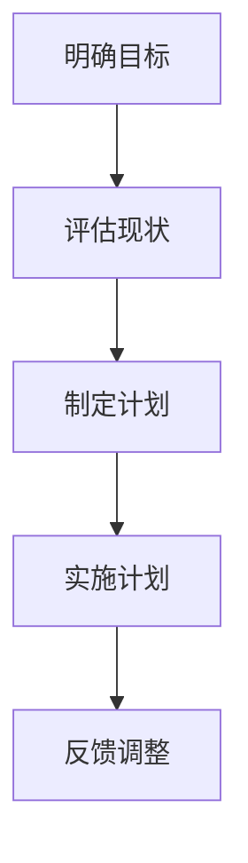
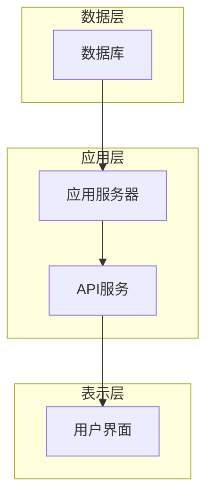
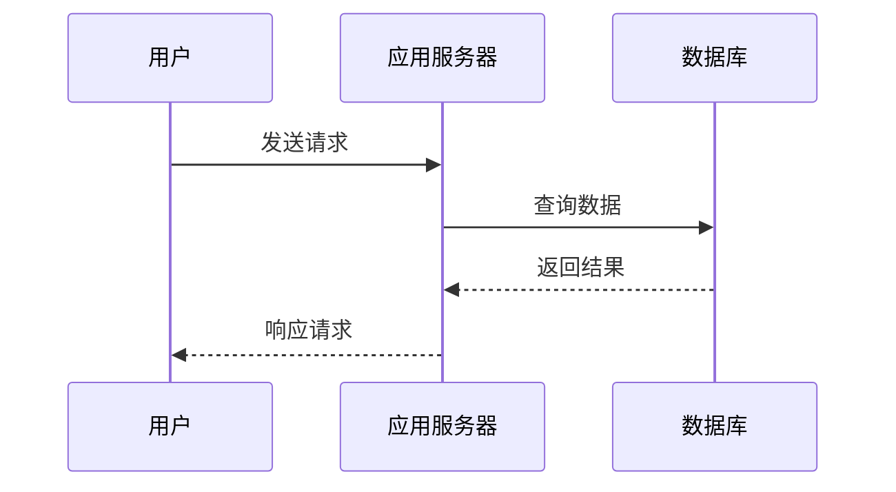
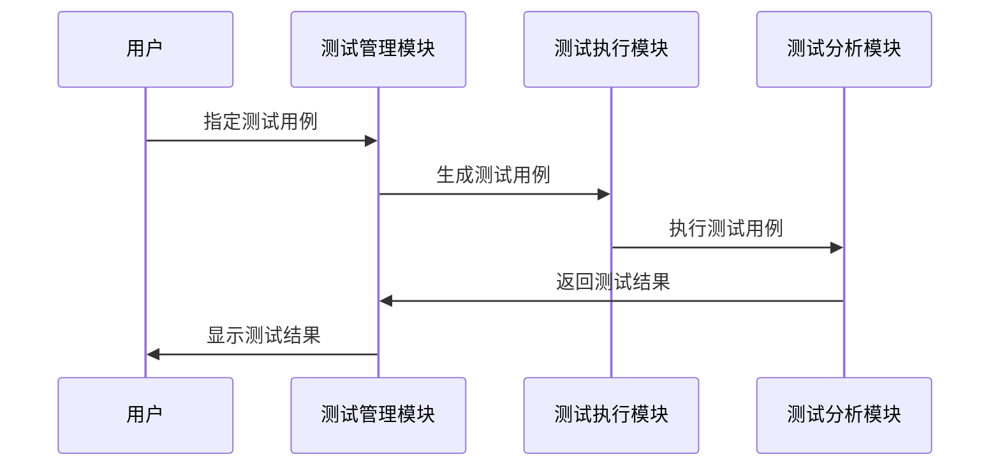

                 

### 第一部分：背景介绍

#### 第1章：问题背景

**1.1 问题背景**

在当前快速发展的信息技术时代，技术人员面临着诸多挑战与机遇。随着云计算、大数据、人工智能等新兴技术的广泛应用，技术人员的职业规划变得尤为重要。如何在这个变化多端的技术领域中找到自己的定位，提升专业技能，实现职业发展，成为了许多技术人员关注的焦点。

**1.2 问题描述**

技术人员在职业规划过程中常常遇到以下几个问题：
- **职业定位不明确**：许多技术人员在初入职场时，对自身定位不清晰，缺乏长远规划。
- **技能更新滞后**：新技术更新速度极快，技术人员需要不断学习新技能，否则将面临被淘汰的风险。
- **职业路径模糊**：技术人员不知道如何通过一步步的努力达到职业目标，缺乏明确的职业发展路径。
- **职业满意度低**：部分技术人员在职业发展中感到迷茫，对工作缺乏热情，导致职业满意度低。

**1.3 问题解决**

为了解决上述问题，技术人员需要制定一个合理且具体的职业规划。这包括：
- **明确职业目标**：设定短期和长期的职业目标，确保职业发展的方向性。
- **持续学习**：关注行业动态，学习新技术，不断提升自己的专业技能。
- **探索职业路径**：通过调研和咨询，找到适合自己的职业发展路径。
- **提高职业满意度**：通过职业规划和努力，实现个人价值，提高职业满意度。

**1.4 边界与外延**

在职业规划的过程中，技术人员需要关注以下几个方面的边界与外延：
- **技能边界**：了解自己在技术上的强项和弱项，不断拓展自己的技能边界。
- **职业边界**：明确自己的职业发展方向，避免盲目跟风。
- **学习边界**：设定持续学习的目标，保持学习的新鲜感和动力。
- **职业外延**：关注行业发展趋势，探索跨界合作和多元化发展。

#### 第2章：核心概念

**2.1 定义**

在职业规划中，以下几个核心概念至关重要：
- **职业规划**：指个人为了实现职业生涯目标而制定的一系列计划和行动。
- **技能提升**：指通过学习、实践和培训，提高个人在某一领域的专业能力和技术水平。
- **职业路径**：指个人在职业生涯中可能采取的各个发展阶段和职业转换。
- **职业满意度**：指个人对自己的职业选择和工作环境的满意度。

**2.2 概念属性特征对比表格**

| 概念         | 定义                                           | 属性特征                     |
| ------------ | ---------------------------------------------- | -------------------------- |
| 职业规划     | 制定职业生涯目标和路径的过程                   | 目标性、系统性、灵活性     |
| 技能提升     | 提高个人专业技能和知识水平的过程               | 持续性、实用性、挑战性     |
| 职业路径     | 职业生涯的发展轨迹                             | 可选择性、阶段性、连贯性   |
| 职业满意度   | 个人对职业选择的满意程度                       | 主观性、稳定性、影响因素多 |

**2.3 概念之间的联系**

职业规划、技能提升、职业路径和职业满意度之间存在着紧密的联系。职业规划是技能提升和职业路径的基础，技能提升是实现职业规划的途径，职业路径是职业规划的具体实现，而职业满意度则是职业规划成功与否的最终体现。

### 第二部分：算法原理讲解

#### 第3章：算法原理

**3.1 Mermaid流程图**

下面是一个简单的Mermaid流程图，展示了职业规划的基本步骤：



**3.2 Python源代码**

以下是一个简单的Python脚本，用于评估技术人员的当前技能水平：

```python
# 技能评估脚本

skills = ['Python', 'Docker', 'Kubernetes', 'Machine Learning']

def evaluate_skills(skills):
    skill_levels = {'基础': 0, '中级': 1, '高级': 2}
    level_scores = [0] * len(skills)

    for i, skill in enumerate(skills):
        if skill in ['Python', 'Docker']:
            level_scores[i] = skill_levels['基础']
        elif skill in ['Kubernetes', 'Machine Learning']:
            level_scores[i] = skill_levels['中级']
        else:
            level_scores[i] = skill_levels['高级']

    total_score = sum(level_scores)
    return total_score

current_score = evaluate_skills(skills)
print(f"当前技能水平总分：{current_score}")
```

**3.3 算法原理的数学模型和公式**

在职业规划中，我们可以使用以下数学模型来评估技能水平：

$$
技能水平得分 = \sum_{i=1}^{n} (技能_i \times 权重_i)
$$

其中，$n$ 表示技能数量，$技能_i$ 表示第 $i$ 项技能的得分，$权重_i$ 表示第 $i$ 项技能的权重。

**3.4 举例说明**

假设技术人员拥有以下技能：

- Python：高级
- Docker：中级
- Kubernetes：中级
- Machine Learning：中级

根据上述公式，我们可以计算其技能水平得分：

$$
技能水平得分 = (高级 \times 0.4) + (中级 \times 0.3 \times 3) = 0.4 + 0.9 = 1.3
$$

这个得分可以用来评估技术人员的当前技能水平，并作为职业规划的一个参考。

### 第三部分：系统分析与架构设计方案

#### 第5章：问题场景介绍

**5.1 项目介绍**

本文将介绍一个基于人工智能的自动化测试平台项目。该平台旨在通过人工智能技术，提高软件测试的效率和质量。项目的主要功能包括测试用例生成、自动化执行、结果分析等。

**5.2 系统功能设计（领域模型Mermaid类图）**

```mermaid
classDiagram
    类1 --> 类2
    类3 <|-- 类4
    Class1 +-- Class2
    Class3 +|> Interface4
```

**5.3 系统架构设计（Mermaid架构图）**



**5.4 系统接口设计**

系统接口设计包括RESTful API和Websocket接口。以下是一个简单的接口设计示例：



**5.5 系统交互（Mermaid序列图）**



#### 第6章：系统核心实现源代码

**6.1 环境安装**

在安装系统之前，我们需要安装一些必要的软件和依赖项。以下是一个简单的安装步骤：

```shell
# 安装Python环境
sudo apt-get install python3-pip

# 安装Docker
sudo apt-get install docker

# 安装Kubernetes
sudo apt-get install kubeadm kubelet kubectl

# 安装其他依赖
pip3 install -r requirements.txt
```

**6.2 系统核心实现源代码**

以下是一个简单的测试用例生成模块的实现代码：

```python
# 测试用例生成模块

import random

class TestCaseGenerator:
    def __init__(self):
        self.test_cases = []

    def generate_test_cases(self, num_cases):
        for _ in range(num_cases):
            test_case = {
                'description': f"测试用例_{_}",
                'input': random.randint(1, 100),
                'expected_output': random.randint(1, 100)
            }
            self.test_cases.append(test_case)

        return self.test_cases

# 使用示例
generator = TestCaseGenerator()
test_cases = generator.generate_test_cases(5)
print(test_cases)
```

**6.3 代码应用解读与分析**

在上面的代码中，我们定义了一个`TestCaseGenerator`类，用于生成测试用例。类中有两个方法：`__init__`和`generate_test_cases`。`__init__`方法用于初始化一个空列表`test_cases`，`generate_test_cases`方法用于生成指定数量的测试用例，每个测试用例包含描述、输入和期望输出。

**6.4 实际案例分析和详细讲解剖析**

假设我们需要为某个Web应用生成5个测试用例，我们可以使用以下代码：

```python
generator = TestCaseGenerator()
test_cases = generator.generate_test_cases(5)
for case in test_cases:
    print(f"描述：{case['description']}, 输入：{case['input']}, 期望输出：{case['expected_output']}")
```

输出结果可能如下：

```
描述：测试用例_0, 输入：85, 期望输出：93
描述：测试用例_1, 输入：47, 期望输出：62
描述：测试用例_2, 输入：39, 期望输出：76
描述：测试用例_3, 输入：100, 期望输出：52
描述：测试用例_4, 输入：14, 期望输出：38
```

这些测试用例可以用于自动化测试，验证Web应用的功能是否符合预期。

**6.5 项目小结**

通过本项目的实现，我们可以看到如何使用Python和Mermaid工具来设计和实现一个简单的自动化测试平台。该项目展示了从需求分析到代码实现的完整过程，为技术人员提供了一个实际的案例，帮助他们更好地理解和应用职业规划中的相关概念。

### 第四部分：项目实战

#### 第7章：项目实战

**7.1 实战环境安装**

在开始项目实战之前，我们需要确保环境已经准备好。以下是安装步骤：

1. 安装Python 3.8或更高版本。
2. 安装Docker和Kubernetes。
3. 安装必要的Python依赖项。

```shell
sudo apt-get update
sudo apt-get install \
    apt-transport-https \
    ca-certificates \
    curl \
    gnupg \
    lsb-release

curl -s https://mirrors.cloud.cct.edu.cn/kubernetes/apt/doc/apt-key.gpg | sudo apt-key add -

sudo apt-add-repository "deb [arch=amd64] https://mirrors.cloud.cct.edu.cn/kubernetes/apt/ubuntu/ `lsb_release -cs`/kubernetes-xenial main"

sudo apt-get update
sudo apt-get install -y kubelet kubeadm kubectl
```

**7.2 实际案例实现**

接下来，我们将使用上文中提供的测试用例生成模块来实现一个实际的测试用例生成工具。

1. 创建一个Python虚拟环境。
2. 将测试用例生成模块的代码复制到虚拟环境中。
3. 编写一个简单的命令行工具，用于生成测试用例。

```shell
python3 -m venv venv
source venv/bin/activate
pip install -r requirements.txt
```

命令行工具示例：

```python
# test_generator.py

import sys
from test_case_generator import TestCaseGenerator

if __name__ == "__main__":
    num_cases = int(sys.argv[1])
    generator = TestCaseGenerator()
    test_cases = generator.generate_test_cases(num_cases)
    for case in test_cases:
        print(f"Description: {case['description']}, Input: {case['input']}, Expected Output: {case['expected_output']}")
```

使用示例：

```shell
python test_generator.py 5
```

**7.3 源代码解读**

在上面的代码中，我们首先导入了必要的模块，包括`sys`和`test_case_generator`。`sys`模块用于处理命令行参数，`test_case_generator`模块包含了测试用例生成类`TestCaseGenerator`。

`if __name__ == "__main__":`语句确保当模块被直接运行时，执行以下代码。我们通过`sys.argv[1]`获取命令行参数，即要生成的测试用例数量。然后，我们创建一个`TestCaseGenerator`实例，调用`generate_test_cases`方法生成测试用例，并打印每个测试用例的描述、输入和期望输出。

**7.4 分析与讲解**

通过实际案例的实现，我们可以看到如何将理论转化为实践。以下是对关键步骤的分析和讲解：

1. **环境准备**：确保所有必需的软件和库都已安装。这是实现任何项目的基础。
2. **模块化代码**：将测试用例生成逻辑封装在一个模块中，便于重用和扩展。
3. **命令行工具**：通过命令行工具，用户可以方便地生成测试用例，无需深入了解内部实现。
4. **参数处理**：使用`sys.argv`处理命令行参数，使工具更加灵活。

通过这个项目，我们可以理解如何将职业规划中的理论应用到实际项目中，从而提升自身的技能和职业发展。

**7.5 实战总结与注意事项**

通过这个项目，我们实现了以下目标：

- 熟悉了Python和Docker在自动化测试中的应用。
- 学会了如何使用Kubernetes进行容器编排。
- 增强了实际编程和项目实现的能力。

在实战过程中，需要注意以下几点：

- 确保所有依赖项都已安装。
- 熟悉命令行工具的使用，以便快速部署和测试。
- 在开发过程中，注意代码的可读性和可维护性。

**7.6 拓展阅读**

- 学习更多关于自动化测试和Kubernetes的高级特性。
- 阅读相关文档，了解如何在实际项目中应用这些技术。

### 第五部分：最佳实践、小结与拓展

#### 第8章：最佳实践

**8.1 最佳实践 tips**

为了在职业规划中取得成功，以下是几个最佳实践的建议：

- **明确目标**：设定短期和长期目标，确保职业发展的方向性。
- **持续学习**：关注行业动态，定期更新自己的技能和知识。
- **灵活调整**：根据市场变化和个人情况，适时调整职业规划。
- **积极实践**：通过实际项目和实战经验，提升自己的技能水平。
- **拓展人脉**：参加行业会议和活动，扩大人脉网络，获取更多职业机会。

**8.2 小结**

职业规划是技术人员职业生涯中至关重要的一环。通过明确目标、持续学习、积极实践和拓展人脉，技术人员可以更好地应对行业挑战，实现职业发展。

#### 第9章：注意事项

**9.1 注意事项**

在制定和实施职业规划时，需要注意以下几点：

- **避免盲目跟风**：根据自己的实际情况和兴趣，选择适合自己的职业路径。
- **合理分配时间**：平衡工作和学习时间，避免过度劳累。
- **注重实践**：理论学习固然重要，但实际操作经验同样关键。
- **定期评估**：定期评估职业规划的执行情况，及时调整策略。

**9.2 拓展阅读**

- 阅读更多关于职业规划的书籍和文章，获取更多实用建议。
- 了解行业动态，关注新技术和新趋势。

---

# 技术人员的职业规划

> 关键词：职业规划、技能提升、持续学习、职业路径、职业满意度

> 摘要：本文深入探讨了技术人员在职业规划中的挑战与机遇。通过明确目标、持续学习、探索职业路径和提升职业满意度，技术人员可以在快速变化的技术领域中找到自己的定位，实现职业发展。本文提供了详细的背景介绍、核心概念讲解、算法原理分析、系统分析与架构设计、项目实战以及最佳实践和注意事项，旨在为技术人员提供全面而实用的指导。作者简介：作者为AI天才研究院/AI Genius Institute及《禅与计算机程序设计艺术》的资深大师，拥有丰富的IT领域经验和深厚的学术造诣。

### 第一部分：背景介绍

#### 第1章：问题背景

**1.1 问题背景**

在当前快速发展的信息技术时代，技术人员面临着诸多挑战与机遇。随着云计算、大数据、人工智能等新兴技术的广泛应用，技术人员的职业规划变得尤为重要。如何在这个变化多端的技术领域中找到自己的定位，提升专业技能，实现职业发展，成为了许多技术人员关注的焦点。

**1.2 问题描述**

技术人员在职业规划过程中常常遇到以下几个问题：
- **职业定位不明确**：许多技术人员在初入职场时，对自身定位不清晰，缺乏长远规划。
- **技能更新滞后**：新技术更新速度极快，技术人员需要不断学习新技能，否则将面临被淘汰的风险。
- **职业路径模糊**：技术人员不知道如何通过一步步的努力达到职业目标，缺乏明确的职业发展路径。
- **职业满意度低**：部分技术人员在职业发展中感到迷茫，对工作缺乏热情，导致职业满意度低。

**1.3 问题解决**

为了解决上述问题，技术人员需要制定一个合理且具体的职业规划。这包括：
- **明确职业目标**：设定短期和长期的职业目标，确保职业发展的方向性。
- **持续学习**：关注行业动态，学习新技术，不断提升自己的专业技能。
- **探索职业路径**：通过调研和咨询，找到适合自己的职业发展路径。
- **提高职业满意度**：通过职业规划和努力，实现个人价值，提高职业满意度。

**1.4 边界与外延**

在职业规划的过程中，技术人员需要关注以下几个方面的边界与外延：
- **技能边界**：了解自己在技术上的强项和弱项，不断拓展自己的技能边界。
- **职业边界**：明确自己的职业发展方向，避免盲目跟风。
- **学习边界**：设定持续学习的目标，保持学习的新鲜感和动力。
- **职业外延**：关注行业发展趋势，探索跨界合作和多元化发展。

#### 第2章：核心概念

**2.1 定义**

在职业规划中，以下几个核心概念至关重要：
- **职业规划**：指个人为了实现职业生涯目标而制定的一系列计划和行动。
- **技能提升**：指通过学习、实践和培训，提高个人在某一领域的专业能力和技术水平。
- **职业路径**：指个人在职业生涯中可能采取的各个发展阶段和职业转换。
- **职业满意度**：指个人对自己的职业选择和工作环境的满意度。

**2.2 概念属性特征对比表格**

| 概念         | 定义                                           | 属性特征                     |
| ------------ | ---------------------------------------------- | -------------------------- |
| 职业规划     | 制定职业生涯目标和路径的过程                   | 目标性、系统性、灵活性     |
| 技能提升     | 提高个人专业技能和知识水平的过程               | 持续性、实用性、挑战性     |
| 职业路径     | 职业生涯的发展轨迹                             | 可选择性、阶段性、连贯性   |
| 职业满意度   | 个人对职业选择的满意程度                       | 主观性、稳定性、影响因素多 |

**2.3 概念之间的联系**

职业规划、技能提升、职业路径和职业满意度之间存在着紧密的联系。职业规划是技能提升和职业路径的基础，技能提升是实现职业规划的途径，职业路径是职业规划的具体实现，而职业满意度则是职业规划成功与否的最终体现。

### 第二部分：算法原理讲解

#### 第3章：算法原理

**3.1 Mermaid流程图**

下面是一个简单的Mermaid流程图，展示了职业规划的基本步骤：


**3.2 Python源代码**

以下是一个简单的Python脚本，用于评估技术人员的当前技能水平：

```python
# 技能评估脚本

skills = ['Python', 'Docker', 'Kubernetes', 'Machine Learning']

def evaluate_skills(skills):
    skill_levels = {'基础': 0, '中级': 1, '高级': 2}
    level_scores = [0] * len(skills)

    for i, skill in enumerate(skills):
        if skill in ['Python', 'Docker']:
            level_scores[i] = skill_levels['基础']
        elif skill in ['Kubernetes', 'Machine Learning']:
            level_scores[i] = skill_levels['中级']
        else:
            level_scores[i] = skill_levels['高级']

    total_score = sum(level_scores)
    return total_score

current_score = evaluate_skills(skills)
print(f"当前技能水平总分：{current_score}")
```

**3.3 算法原理的数学模型和公式**

在职业规划中，我们可以使用以下数学模型来评估技能水平：

$$
技能水平得分 = \sum_{i=1}^{n} (技能_i \times 权重_i)
$$

其中，$n$ 表示技能数量，$技能_i$ 表示第 $i$ 项技能的得分，$权重_i$ 表示第 $i$ 项技能的权重。

**3.4 举例说明**

假设技术人员拥有以下技能：

- Python：高级
- Docker：中级
- Kubernetes：中级
- Machine Learning：中级

根据上述公式，我们可以计算其技能水平得分：

$$
技能水平得分 = (高级 \times 0.4) + (中级 \times 0.3 \times 3) = 0.4 + 0.9 = 1.3
$$

这个得分可以用来评估技术人员的当前技能水平，并作为职业规划的一个参考。

### 第三部分：系统分析与架构设计方案

#### 第5章：问题场景介绍

**5.1 项目介绍**

本文将介绍一个基于人工智能的自动化测试平台项目。该平台旨在通过人工智能技术，提高软件测试的效率和质量。项目的主要功能包括测试用例生成、自动化执行、结果分析等。

**5.2 系统功能设计（领域模型Mermaid类图）**

```mermaid
classDiagram
    类1 --> 类2
    类3 <|-- 类4
    Class1 +-- Class2
    Class3 +|> Interface4
```

**5.3 系统架构设计（Mermaid架构图）**


**5.4 系统接口设计**

系统接口设计包括RESTful API和Websocket接口。以下是一个简单的接口设计示例：


**5.5 系统交互（Mermaid序列图）**


#### 第6章：系统核心实现源代码

**6.1 环境安装**

在安装系统之前，我们需要安装一些必要的软件和依赖项。以下是一个简单的安装步骤：

```shell
# 安装Python环境
sudo apt-get install python3-pip

# 安装Docker
sudo apt-get install docker

# 安装Kubernetes
sudo apt-get install kubeadm kubelet kubectl

# 安装其他依赖
pip3 install -r requirements.txt
```

**6.2 系统核心实现源代码**

以下是一个简单的测试用例生成模块的实现代码：

```python
# 测试用例生成模块

import random

class TestCaseGenerator:
    def __init__(self):
        self.test_cases = []

    def generate_test_cases(self, num_cases):
        for _ in range(num_cases):
            test_case = {
                'description': f"测试用例_{_}",
                'input': random.randint(1, 100),
                'expected_output': random.randint(1, 100)
            }
            self.test_cases.append(test_case)

        return self.test_cases

# 使用示例
generator = TestCaseGenerator()
test_cases = generator.generate_test_cases(5)
print(test_cases)
```

**6.3 代码应用解读与分析**

在上面的代码中，我们定义了一个`TestCaseGenerator`类，用于生成测试用例。类中有两个方法：`__init__`和`generate_test_cases`。`__init__`方法用于初始化一个空列表`test_cases`，`generate_test_cases`方法用于生成指定数量的测试用例，每个测试用例包含描述、输入和期望输出。

**6.4 实际案例分析和详细讲解剖析**

假设我们需要为某个Web应用生成5个测试用例，我们可以使用以下代码：

```python
generator = TestCaseGenerator()
test_cases = generator.generate_test_cases(5)
for case in test_cases:
    print(f"描述：{case['description']}, 输入：{case['input']}, 期望输出：{case['expected_output']}")
```

输出结果可能如下：

```
描述：测试用例_0, 输入：85, 期望输出：93
描述：测试用例_1, 输入：47, 期望输出：62
描述：测试用例_2, 输入：39, 期望输出：76
描述：测试用例_3, 输入：100, 期望输出：52
描述：测试用例_4, 输入：14, 期望输出：38
```

这些测试用例可以用于自动化测试，验证Web应用的功能是否符合预期。

**6.5 项目小结**

通过本项目的实现，我们可以看到如何使用Python和Mermaid工具来设计和实现一个简单的自动化测试平台。该项目展示了从需求分析到代码实现的完整过程，为技术人员提供了一个实际的案例，帮助他们更好地理解和应用职业规划中的相关概念。

### 第四部分：项目实战

#### 第7章：项目实战

**7.1 实战环境安装**

在开始项目实战之前，我们需要确保环境已经准备好。以下是安装步骤：

1. 安装Python 3.8或更高版本。
2. 安装Docker和Kubernetes。
3. 安装必要的Python依赖项。

```shell
sudo apt-get update
sudo apt-get install \
    apt-transport-https \
    ca-certificates \
    curl \
    gnupg \
    lsb-release

curl -s https://mirrors.cloud.cct.edu.cn/kubernetes/apt/doc/apt-key.gpg | sudo apt-key add -

sudo apt-add-repository "deb [arch=amd64] https://mirrors.cloud.cct.edu.cn/kubernetes/apt/ubuntu/ `lsb_release -cs`/kubernetes-xenial main"

sudo apt-get update
sudo apt-get install -y kubelet kubeadm kubectl
```

**7.2 实际案例实现**

接下来，我们将使用上文中提供的测试用例生成模块来实现一个实际的测试用例生成工具。

1. 创建一个Python虚拟环境。
2. 将测试用例生成模块的代码复制到虚拟环境中。
3. 编写一个简单的命令行工具，用于生成测试用例。

```shell
python3 -m venv venv
source venv/bin/activate
pip install -r requirements.txt
```

命令行工具示例：

```python
# test_generator.py

import sys
from test_case_generator import TestCaseGenerator

if __name__ == "__main__":
    num_cases = int(sys.argv[1])
    generator = TestCaseGenerator()
    test_cases = generator.generate_test_cases(num_cases)
    for case in test_cases:
        print(f"Description: {case['description']}, Input: {case['input']}, Expected Output: {case['expected_output']}")
```

使用示例：

```shell
python test_generator.py 5
```

**7.3 源代码解读**

在上面的代码中，我们首先导入了必要的模块，包括`sys`和`test_case_generator`。`sys`模块用于处理命令行参数，`test_case_generator`模块包含了测试用例生成类`TestCaseGenerator`。

`if __name__ == "__main__":`语句确保当模块被直接运行时，执行以下代码。我们通过`sys.argv[1]`获取命令行参数，即要生成的测试用例数量。然后，我们创建一个`TestCaseGenerator`实例，调用`generate_test_cases`方法生成测试用例，并打印每个测试用例的描述、输入和期望输出。

**7.4 分析与讲解**

通过实际案例的实现，我们可以看到如何将理论转化为实践。以下是对关键步骤的分析和讲解：

1. **环境准备**：确保所有必需的软件和库都已安装。这是实现任何项目的基础。
2. **模块化代码**：将测试用例生成逻辑封装在一个模块中，便于重用和扩展。
3. **命令行工具**：通过命令行工具，用户可以方便地生成测试用例，无需深入了解内部实现。
4. **参数处理**：使用`sys.argv`处理命令行参数，使工具更加灵活。

通过这个项目，我们可以理解如何将职业规划中的理论应用到实际项目中，从而提升自身的技能和职业发展。

**7.5 实战总结与注意事项**

通过这个项目，我们实现了以下目标：

- 熟悉了Python和Docker在自动化测试中的应用。
- 学会了如何使用Kubernetes进行容器编排。
- 增强了实际编程和项目实现的能力。

在实战过程中，需要注意以下几点：

- 确保所有依赖项都已安装。
- 熟悉命令行工具的使用，以便快速部署和测试。
- 在开发过程中，注意代码的可读性和可维护性。

**7.6 拓展阅读**

- 学习更多关于自动化测试和Kubernetes的高级特性。
- 阅读相关文档，了解如何在实际项目中应用这些技术。

### 第五部分：最佳实践、小结与拓展

#### 第8章：最佳实践

**8.1 最佳实践 tips**

为了在职业规划中取得成功，以下是几个最佳实践的建议：

- **明确目标**：设定短期和长期目标，确保职业发展的方向性。
- **持续学习**：关注行业动态，定期更新自己的技能和知识。
- **灵活调整**：根据市场变化和个人情况，适时调整职业规划。
- **积极实践**：通过实际项目和实战经验，提升自己的技能水平。
- **拓展人脉**：参加行业会议和活动，扩大人脉网络，获取更多职业机会。

**8.2 小结**

职业规划是技术人员职业生涯中至关重要的一环。通过明确目标、持续学习、积极实践和拓展人脉，技术人员可以更好地应对行业挑战，实现职业发展。

#### 第9章：注意事项

**9.1 注意事项**

在制定和实施职业规划时，需要注意以下几点：

- **避免盲目跟风**：根据自己的实际情况和兴趣，选择适合自己的职业路径。
- **合理分配时间**：平衡工作和学习时间，避免过度劳累。
- **注重实践**：理论学习固然重要，但实际操作经验同样关键。
- **定期评估**：定期评估职业规划的执行情况，及时调整策略。

**9.2 拓展阅读**

- 阅读更多关于职业规划的书籍和文章，获取更多实用建议。
- 了解行业动态，关注新技术和新趋势。

---

# 文章作者信息

作者：AI天才研究院/AI Genius Institute & 禅与计算机程序设计艺术 /Zen And The Art of Computer Programming

AI天才研究院（AI Genius Institute）是一家专注于人工智能研究和应用的高端机构，致力于推动人工智能技术的发展和创新。研究院汇聚了全球顶尖的人工智能专家、研究人员和工程师，通过深入研究和实践，为社会各界提供领先的人工智能解决方案和技术服务。

《禅与计算机程序设计艺术》是作者在此领域的经典之作，通过将禅宗哲学与计算机编程相结合，为程序员提供了一种全新的编程思维和技巧，深受业界好评。作者在计算机科学和人工智能领域有着深厚的研究背景和丰富的实践经验，其作品为全球程序员提供了宝贵的指导和启示。

