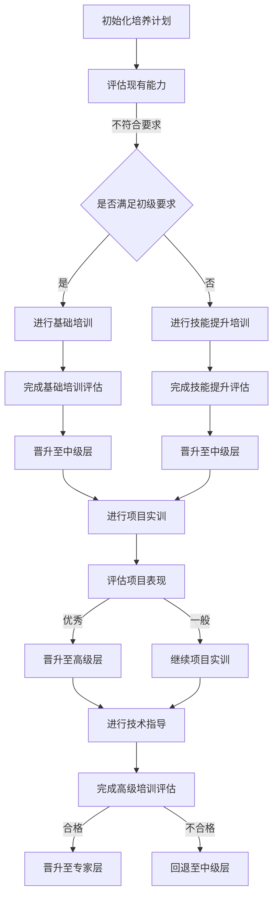
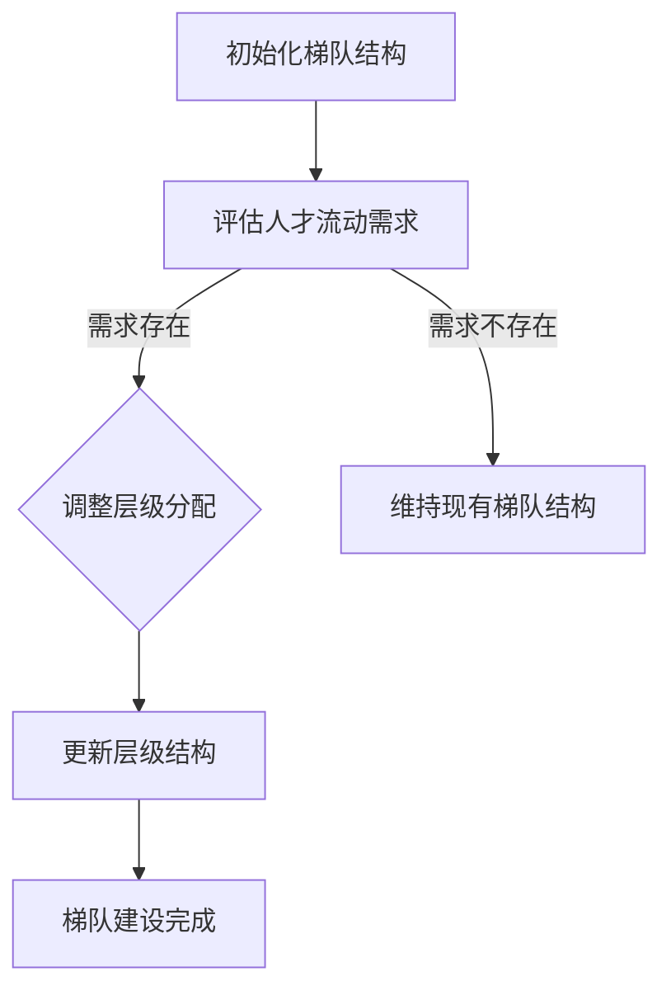
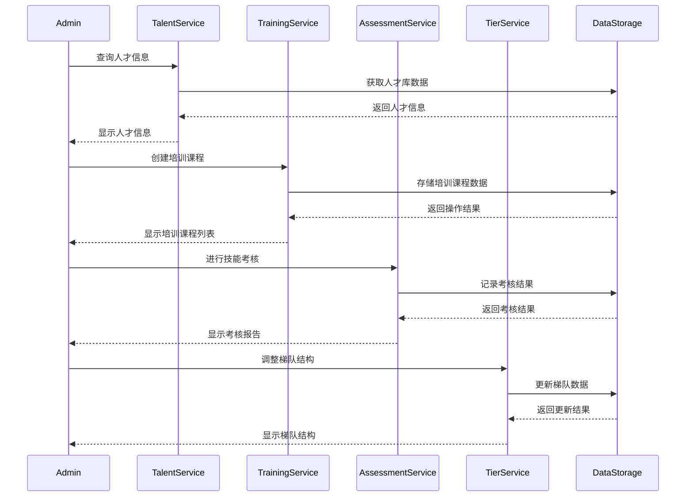
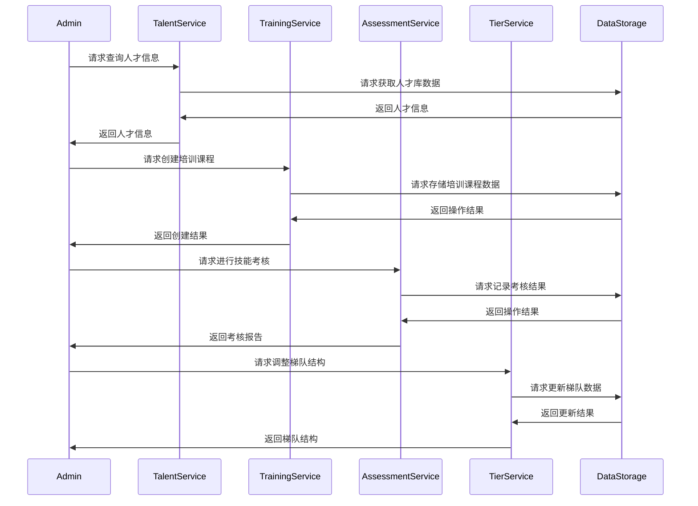

                 

### 1. 问题背景与核心概念

在现代信息技术飞速发展的背景下，技术人才的培养与梯队建设已成为众多企业和机构关注的焦点。随着数字化转型的不断深入，对技术人才的需求不仅体现在数量上，更在于质量。因此，如何培养具备扎实基础、创新能力和实战经验的技术人才，以及如何构建合理的梯队结构，成为了亟待解决的重要问题。

#### 1.1 问题背景

当前，技术人才培养与梯队建设面临以下几个方面的挑战：

1. **人才缺口**：随着科技领域的快速发展，尤其是人工智能、大数据、云计算等新兴技术领域，市场对高素质技术人才的需求日益增长，但现有的人才储备和培养速度无法跟上需求。

2. **能力匹配**：现有的技术教育和培训往往过于理论化，难以满足实际工作中的复杂需求。技术人才在理论知识与实际操作能力之间存在较大的差距。

3. **梯队结构**：企业在技术人才梯队建设上存在结构不合理、断层严重的问题，导致技术创新和业务发展的后劲不足。

4. **持续发展**：技术人才的培养和梯队建设需要长期投入和持续关注，但许多企业和机构在这方面缺乏系统性和长远规划。

#### 1.2 核心概念

在探讨技术人才培养与梯队建设时，我们需要明确以下几个核心概念：

1. **技术人才培养**：指通过各种方式对技术人才进行教育、培训和实践，使其具备所需的专业知识和技能。

2. **梯队建设**：指根据企业或组织的战略目标和业务需求，构建合理的层级结构，使不同层次的技术人才各司其职、协同合作。

3. **能力模型**：指对技术人才所需的能力进行系统化分类和描述，以便于制定培养计划和评估人才。

4. **评估体系**：指对技术人才的能力和绩效进行科学评估的方法和工具。

#### 1.2.1 技术人才培养

技术人才培养是梯队建设的基础。其核心目标是提升技术人才的专业素养和实战能力。具体方法包括：

- **教育培训**：通过系统化的课程设置和教学方式，提高技术人才的理论知识水平。
- **实战培训**：通过项目实践、模拟演练等方式，增强技术人才的实际操作能力。
- **个性化培养**：根据技术人才的特长和兴趣，制定个性化的培养计划。

#### 1.2.2 技术梯队建设

技术梯队建设是企业或组织战略的重要组成部分。其核心目标是确保企业或组织在不同阶段都能拥有合适的技术人才。具体方法包括：

- **层级划分**：根据技术人才的能力和经验，将其划分为不同层级，形成合理的结构。
- **管理机制**：建立完善的管理机制，确保技术人才在不同层级间的有效沟通和协作。
- **持续优化**：根据业务发展和人才需求，不断调整和优化梯队结构。

#### 1.3 问题解决

本书旨在解决技术人才培养与梯队建设中的关键问题，提供以下解决方案：

- **系统化策略**：提出一套系统化的技术人才培养策略，包括教育培训、实战培训和个性化培养等方面。
- **能力模型设计**：提供技术能力模型的设计方法，帮助企业和机构明确技术人才所需的能力要求。
- **梯队建设方法**：提出具体的梯队建设方法，包括层级划分、管理机制和持续优化等方面。
- **评估体系构建**：提供科学合理的评估体系，用于评估技术人才的能力和绩效。

#### 1.4 边界与外延

本书的讨论范围主要涉及以下方面：

- **技术领域**：主要关注软件开发、人工智能、大数据等领域。
- **企业规模**：适用于不同规模的企业，但特别关注大型企业和高科技企业。
- **应用场景**：主要针对企业内部技术人才培养与梯队建设，但也适用于培训机构和高校。

#### 1.5 核心要素组成

本书将涉及以下几个核心要素：

- **人才培养策略**：详细探讨教育培训、实战培训和个性化培养等方法。
- **梯队建设方法**：介绍层级划分、管理机制和持续优化等方面的具体措施。
- **能力模型与评估**：构建技术能力模型，设计科学合理的评估体系。
- **案例与实例**：通过实际案例，展示技术人才培养与梯队建设的应用效果。

通过上述核心要素的有机结合，本书旨在为企业和机构提供一套完整的技术人才培养与梯队建设方案，助力其在激烈的市场竞争中立于不败之地。

---

在本节中，我们明确了技术人才培养与梯队建设的问题背景和核心概念，并提出了系统化的解决方案。接下来，我们将进一步深入探讨技术人才培养的具体策略和方法，帮助读者更好地理解和实践这一过程。

## 2. 技术人才培养

技术人才的培养是构建企业核心竞争力的重要环节。一个高效的技术人才培养体系不仅能够提升员工的个人技能，还能推动企业的技术创新和业务发展。本节将详细介绍技术人才培养的策略与方法，帮助企业和机构构建系统化、科学化的技术人才培养体系。

### 2.1 培养策略与方法

#### 2.1.1 教育培训策略

教育培训是技术人才培养的基础，通过系统化的课程设置和教学方式，提升技术人才的理论知识水平。以下是一些具体的教育培训策略：

1. **课程设置**：根据技术领域的最新发展趋势和企业需求，设计涵盖基础知识、核心技术、前沿技术等多个层次的课程体系。课程内容应涵盖软件开发、数据库管理、人工智能、大数据等领域。

2. **教学方法**：采用多种教学方法，如讲授、讨论、实验、案例教学等，提高学员的学习兴趣和参与度。特别是对于复杂技术的学习，应注重理论与实践的结合，通过实验和项目实践来巩固知识。

3. **师资力量**：引进具有丰富实践经验的教师，他们不仅能够传授理论知识，还能提供实际操作的建议和指导。同时，鼓励内部优秀技术人员担任讲师，分享自己的经验和心得。

4. **线上与线下结合**：利用线上平台和线下课堂相结合的方式，为学员提供灵活的学习时间安排。线上课程可以覆盖更广泛的学员群体，而线下课程则能够提供更深入的互动和交流。

#### 2.1.2 在职培训方法

在职培训是技术人才继续成长的重要途径，通过实战经验和技能提升，增强技术人才的实际操作能力。以下是一些在职培训的方法：

1. **项目实训**：通过实际项目的参与，让技术人才在实践中学习和应用所学知识。项目实训应注重真实场景的模拟，让学员面临实际问题和挑战，培养其解决问题的能力。

2. **技能竞赛**：定期举办技能竞赛，激发技术人才的学习兴趣和竞争意识。竞赛内容应涵盖编程、算法、设计等方面，通过竞赛来检验和提升技术人才的综合能力。

3. **导师制度**：建立导师制度，由资深技术人员担任导师，指导新人和年轻技术人员。导师不仅提供技术指导，还分享职业规划和人生经验，帮助学员快速成长。

4. **知识分享**：鼓励技术人员定期进行知识分享，通过内部讲座、研讨会、技术博客等形式，传播最新的技术知识和经验。知识分享不仅能够提升团队的整体水平，还能促进技术人才的个人成长。

### 2.2 能力模型与评估

技术能力模型是技术人才培养的重要依据，通过明确技术人才所需的能力要求和标准，有助于制定科学的人才培养计划和评估体系。以下是对技术能力模型和评估体系的设计：

#### 2.2.1 技术能力模型

技术能力模型应涵盖以下几个方面：

1. **基础知识**：包括计算机科学、数学、算法和数据结构等基础理论知识。

2. **专业技能**：包括编程语言、数据库、云计算、大数据、人工智能等领域的专业技能。

3. **实战经验**：包括实际项目开发经验、问题解决能力和团队协作能力。

4. **创新能力**：包括对新技术的敏感度、创新思维和解决问题的能力。

5. **软技能**：包括沟通能力、团队合作精神、时间管理和自我管理能力等。

#### 2.2.2 评估体系设计

评估体系的设计应遵循以下原则：

1. **全面性**：评估体系应覆盖技术人才的各个方面，确保全面、公正地评价其能力。

2. **客观性**：评估过程应采用科学、客观的评估方法和工具，减少主观因素的影响。

3. **动态性**：评估体系应具备动态调整的能力，能够根据技术发展和企业需求的变化进行更新。

4. **可操作性**：评估体系应具备良好的可操作性，确保能够实际应用于技术人才的日常管理和培养。

具体评估方法可以包括：

- **笔试和面试**：通过笔试和面试来评估技术人才的理论知识和实际操作能力。

- **项目考核**：通过技术人才在项目中的表现来评估其实际能力和潜力。

- **绩效考核**：结合技术人才的工作表现和成果，进行定期绩效考核。

- **360度反馈**：通过同事、上级、下属等多个角度来收集反馈，全面评估技术人才的能力和表现。

通过以上策略和方法，企业和机构可以构建起一套科学、系统的技术人才培养体系，为企业的技术创新和业务发展提供坚实的人才保障。

---

在本节中，我们详细介绍了技术人才培养的策略与方法，包括教育培训和在职培训的策略，以及技术能力模型和评估体系的设计。接下来，我们将探讨技术梯队建设的核心内容，帮助企业和机构构建合理的技术人才梯队结构。

### 3. 技术梯队建设

技术梯队建设是企业战略的重要组成部分，它不仅关系到企业当前的业务发展，更对企业的长期竞争力产生深远影响。一个合理的技术人才梯队能够确保企业在不同发展阶段都有合适的人才支持，从而实现持续的技术创新和业务增长。本节将详细介绍技术梯队结构设计和建设方法，以帮助企业和机构构建高效的技术人才梯队。

#### 3.1 梯队结构设计

技术梯队结构设计需要考虑以下几个关键要素：

1. **层级划分**：根据技术人才的技能水平和经验，将其划分为不同的层级。常见的层级划分包括：

   - **初级层**：新入职的技术人员，具备基本的技术知识和操作能力。
   - **中级层**：具备较强的技术能力和项目经验，能够独立承担项目。
   - **高级层**：拥有丰富的技术和管理经验，能够在关键项目和技术决策中发挥主导作用。
   - **专家层**：在某一领域具有深厚的技术积累和广泛的影响力，能够引领技术创新和团队发展。

2. **职能划分**：根据企业技术部门的不同职能，将技术人才分配到相应的职能团队，如开发团队、测试团队、运维团队等。每个职能团队应有明确的职责和目标，确保技术人才能够在各自岗位上发挥最大的作用。

3. **跨部门协作**：技术人才梯队不仅要满足内部职能需求，还需具备跨部门的协作能力。通过建立跨部门项目团队，促进不同部门之间的技术交流和合作，提高整体的技术创新能力。

#### 3.1.1 梯队层级划分

在进行梯队层级划分时，需要考虑以下几个原则：

- **能力与经验匹配**：确保技术人才在适当的层级中能够充分发挥其能力和经验。
- **灵活性与可扩展性**：层级划分应具有一定的灵活性，能够根据企业发展和人才需求进行调整。
- **激励与成长**：为不同层级的技术人才提供合适的激励和成长路径，鼓励其不断进步。

以下是一个示例性的技术梯队层级划分表：

| 层级 | 技能水平 | 经验要求 | 职责与目标 |
|------|----------|----------|------------|
| 初级层 | 基础知识、初级技能 | 新入职或毕业1-2年 | 学习并掌握基本技能，参与简单项目 |
| 中级层 | 中级技能、项目经验 | 3-5年 | 独立承担项目，提升技术能力 |
| 高级层 | 高级技能、丰富经验 | 5-10年 | 解决复杂问题，参与重要项目，培养新人 |
| 专家层 | 深厚技术积累、广泛影响力 | 10年以上 | 引领技术创新，制定技术战略 |

#### 3.1.2 梯队管理机制

技术梯队管理机制是确保梯队有效运行的重要保障。以下是一些关键的管理机制：

1. **绩效管理**：建立科学的绩效评估体系，定期对技术人才进行绩效评估，激励优秀人才，帮助落后人才找到提升方向。

2. **职业发展规划**：为不同层级的技术人才提供明确的职业发展路径，包括技能提升、项目管理、技术管理等多个方向，鼓励人才根据自身兴趣和特长选择合适的成长路径。

3. **激励机制**：通过薪酬、晋升、荣誉等多种激励手段，激发技术人才的积极性和创造力，保持团队活力。

4. **团队建设**：定期组织团队建设活动，增强团队成员之间的信任和合作，提升团队凝聚力和战斗力。

#### 3.2 梯队建设方法

技术梯队建设是一个持续的过程，需要根据企业的发展阶段和技术需求进行动态调整。以下是一些具体的建设方法：

1. **基础层培养**：针对初级层的技术人才，重点培养其基础知识和基本技能，通过系统化的培训和实践，使其能够胜任简单项目。

2. **中层强化**：针对中级层的技术人才，通过项目实战、技术交流、导师指导等方式，提升其技术能力和项目管理能力，使其能够独立承担重要项目。

3. **高层引领**：针对高级层和专家层的技术人才，通过技术创新、项目指导、技术培训等方式，发挥其技术引领作用，推动企业技术进步和团队整体水平的提升。

4. **梯队补充**：根据企业的业务需求和人才流动情况，及时补充和调整技术梯队，确保梯队结构的合理性和完整性。

通过以上方法，企业和机构可以逐步构建起一个高效的技术人才梯队，为企业的技术创新和业务发展提供持续的人才支持。

---

在本节中，我们详细探讨了技术梯队结构设计和建设方法，包括层级划分、管理机制和具体建设方法。一个合理的技术人才梯队是企业和机构成功的关键，它能够确保企业在不断变化的市场环境中保持竞争优势。接下来，我们将进一步深入讲解技术人才培养和梯队建设中的核心算法原理，帮助读者更好地理解和应用这些原理。

## 4. 算法原理讲解

在技术人才培养和梯队建设中，算法原理的讲解是至关重要的一环。通过算法的应用，我们可以更加精准地培养人才，优化梯队结构，提高整体效率。本节将详细介绍培养策略算法和梯队建设算法的原理，并通过具体的示例来阐述这些算法的执行过程。

### 4.1 培养策略算法原理

#### 4.1.1 Mermaid流程图

首先，我们可以使用Mermaid流程图来直观地展示培养策略算法的基本流程：



这个流程图涵盖了从初级层到专家层的培养过程，包括基础培训、技能提升培训、项目实训、评估和晋升等关键步骤。

#### 4.1.2 Python源代码

接下来，我们将提供实现上述培养策略算法的Python源代码，并进行详细注释：

```python
class Talent:
    def __init__(self, name, skill_level, experience):
        self.name = name
        self.skill_level = skill_level
        self.experience = experience

def assess_ability(talent):
    if talent.skill_level < 3 and talent.experience < 2:
        return "初级层基础培训"
    elif talent.skill_level >= 3 and talent.experience < 5:
        return "中级层技能提升培训"
    else:
        return "高级层项目实训"

def train_talent(talent, training_type):
    if training_type == "初级层基础培训":
        print(f"{talent.name}正在进行基础培训...")
        # 基础培训过程
        talent.skill_level += 1
        talent.experience += 1
    elif training_type == "中级层技能提升培训":
        print(f"{talent.name}正在进行技能提升培训...")
        # 技能提升培训过程
        talent.skill_level += 2
        talent.experience += 1
    elif training_type == "高级层项目实训":
        print(f"{talent.name}正在进行项目实训...")
        # 项目实训过程
        talent.skill_level += 1
        talent.experience += 2

def evaluate_performance(talent):
    if talent.skill_level >= 5 and talent.experience >= 10:
        return "合格，晋升至专家层"
    elif talent.skill_level >= 3 and talent.experience >= 5:
        return "合格，晋升至中级层"
    else:
        return "不合格，回退至初级层"

# 示例
talent = Talent("张三", 2, 1)
training_type = assess_ability(talent)
train_talent(talent, training_type)
print(f"{talent.name}的当前技能水平：{talent.skill_level}")
print(f"{talent.name}的当前经验：{talent.experience}")
performance = evaluate_performance(talent)
print(f"{talent.name}的评估结果：{performance}")
```

在这个代码中，我们定义了一个`Talent`类，用于表示技术人才。`assess_ability`函数用于评估人才的当前水平，并给出相应的培训建议。`train_talent`函数则用于根据培训类型更新人才的技能水平和经验。最后，`evaluate_performance`函数用于根据人才的表现评估其晋升情况。

#### 4.1.3 数学模型与公式

在培养策略中，我们可以使用数学模型来量化人才的技能水平和经验，以便更科学地评估和培养人才。以下是一个简单的数学模型：

- 技能水平（Skill Level）与经验（Experience）之间的关系可以表示为：`Skill Level = 0.1 * Experience + Initial Skill`
- 初始技能（Initial Skill）可以设置为2，表示初级层人才的初始技能水平。

公式如下：

$$
Skill\ Level = 0.1 \times Experience + 2
$$

#### 4.1.4 举例说明

假设有一个名叫李四的技术人才，他的初始技能水平为2，当前经验为3年。我们可以使用上述算法和数学模型来评估和培养他：

1. **评估能力**：
   - 当前技能水平 = \(0.1 \times 3 + 2 = 2.3\)
   - 根据`assess_ability`函数，他需要进行中级层技能提升培训。

2. **技能提升培训**：
   - 经过培训，他的技能水平提升到5，经验增加到5年。

3. **评估表现**：
   - 当前技能水平 = \(0.1 \times 5 + 2 = 3.5\)
   - 根据`evaluate_performance`函数，他合格，可以晋升至中级层。

通过这个例子，我们可以看到如何使用算法和数学模型来培养和评估技术人才。这个过程不仅可以帮助企业和机构优化人才培养策略，还可以提高整体效率，确保技术人才在正确的轨道上不断成长。

### 4.2 梯队建设算法原理

技术梯队建设的算法原理与培养策略类似，但更注重梯队的结构优化和人才流动。以下是一个简化的梯队建设算法：

#### 4.2.1 Mermaid流程图



这个流程图展示了梯队建设的基本步骤，包括初始化梯队结构、评估人才流动需求、调整层级分配和维持现有梯队结构。

#### 4.2.2 Python源代码

```python
class Talent:
    def __init__(self, name, skill_level, experience, team):
        self.name = name
        self.skill_level = skill_level
        self.experience = experience
        self.team = team

def assess_talent_flow(talents):
    flow需求的list = []
    for talent in talents:
        if talent.skill_level < 3 and talent.experience < 5:
            flow需求的list.append(talent)
    return flow需求的list

def adjust_level_allocation(talent_list):
    for talent in talent_list:
        if talent.skill_level < 3:
            talent.skill_level += 1
        elif talent.skill_level >= 3 and talent.experience < 10:
            talent.experience += 1

def maintain_talent_structure(talents):
    for talent in talents:
        if talent.skill_level < 3:
            print(f"{talent.name}仍需在初级层继续培养。")
        elif talent.skill_level >= 3 and talent.experience < 10:
            print(f"{talent.name}已晋升至中级层，需进一步培养。")

# 示例
talents = [
    Talent("王五", 2, 3, "开发团队"),
    Talent("赵六", 4, 7, "测试团队")
]

talent_flow = assess_talent_flow(talents)
adjust_level_allocation(talent_flow)
maintain_talent_structure(talents)
```

在这个代码中，我们定义了一个`Talent`类，用于表示技术人才及其所属团队。`assess_talent_flow`函数用于评估人才流动需求，`adjust_level_allocation`函数用于调整层级分配，`maintain_talent_structure`函数用于维持现有梯队结构。

#### 4.2.3 数学模型与公式

在梯队建设中，我们可以使用以下数学模型来量化人才的技能水平和经验：

- **技能水平**：\( Skill\ Level = 0.1 \times Experience + Initial\ Skill \)
- **经验**：\( Experience = Skill\ Level \times 0.1 + 2 \)

这些公式与培养策略中的公式类似，但在这里我们更注重技能水平和经验之间的平衡，以确保梯队结构的合理性。

#### 4.2.4 举例说明

假设有一个技术团队，包括王五和赵六两位技术人才。他们的初始技能水平和经验如下：

- **王五**：技能水平2，经验3年
- **赵六**：技能水平4，经验7年

1. **评估人才流动需求**：
   - 王五的技能水平低于3，需进入基础培训。
   - 赵六的技能水平高于3，但经验不足10年，需进一步培养。

2. **调整层级分配**：
   - 王五的技能水平提升至3，经验提升至4年。
   - 赵六的技能水平维持在4，经验提升至8年。

3. **维持现有梯队结构**：
   - 王五需在初级层继续培养，赵六已晋升至中级层，需进一步培养。

通过这个例子，我们可以看到如何使用算法和数学模型来优化技术人才梯队结构，确保团队成员在不同层级中保持合理的技能水平和经验。

---

在本节中，我们详细介绍了技术人才培养和梯队建设中的核心算法原理，包括流程图、Python源代码、数学模型和具体示例。这些算法和模型为企业和机构提供了科学的工具和方法，帮助其优化人才培养和梯队建设策略，提升整体技术实力。接下来，我们将进一步探讨系统分析与架构设计的相关内容，帮助读者更全面地理解和应用这些原理。

## 5. 系统分析与架构设计方案

在技术人才培养与梯队建设的实际操作中，系统分析与架构设计是至关重要的一环。它不仅决定了系统的功能实现和性能表现，还影响了系统的可维护性和扩展性。本节将详细介绍系统分析与架构设计方案，包括问题场景介绍、项目介绍、系统功能设计、系统架构设计、系统接口设计以及系统交互序列图。

### 5.1 问题场景介绍

随着企业规模的不断扩大和业务复杂度的增加，技术团队面临着日益严峻的挑战。一方面，需要高效地培养和选拔技术人才，确保每个层次都有足够的人才储备；另一方面，需要构建一个灵活、可扩展的梯队管理系统，以便于实时调整和优化梯队结构。因此，设计一个能够支持技术人才培养与梯队建设的管理系统显得尤为重要。

### 5.2 项目介绍

本项目旨在构建一个企业级技术人才培养与梯队管理系统，系统将具备以下功能：

1. **人才库管理**：建立和维护企业内部技术人才库，记录每个技术人才的技能水平、工作经验、项目参与情况等信息。
2. **培训与考核**：提供系统化的培训课程和考核机制，帮助技术人才不断提升技能水平。
3. **梯队管理**：通过自动化的梯队调整机制，实现人才在各层级间的合理流动和优化配置。
4. **数据分析和报告**：提供详细的数据分析和报告功能，帮助管理者实时了解技术人才的发展状况和梯队结构优化情况。

### 5.3 系统功能设计

为了实现上述功能，我们设计了以下几个核心模块：

1. **用户管理模块**：用于管理系统中各类用户，包括管理员、培训师、技术人员等。
2. **人才库管理模块**：用于记录和管理技术人才的详细信息，包括个人基本信息、技能水平、项目经验等。
3. **培训管理模块**：用于管理和组织培训课程，包括课程设置、培训报名、培训考核等。
4. **考核管理模块**：用于定期对技术人才进行技能考核，评估其能力水平。
5. **梯队管理模块**：用于调整和优化技术人才梯队结构，确保各层级人才的合理分布。

#### 5.3.1 领域模型类图

为了更直观地展示系统功能模块及其关系，我们使用Mermaid绘制了领域模型类图：

```mermaid
classDiagram
    User <|-- Admin
    User <|-- Trainer
    User <|-- Technician
    TalentDatabase {Talent}
    TrainingManagement {Training}
    AssessmentManagement {Assessment}
    TierManagement {Tier}
    User Management --> TalentDatabase
    User Management --> TrainingManagement
    User Management --> AssessmentManagement
    User Management --> TierManagement
```

在这个类图中，`User`类是系统的核心，继承了`Admin`（管理员）、`Trainer`（培训师）和`Technician`（技术人员）等具体用户类型。`TalentDatabase`（人才库管理）、`TrainingManagement`（培训管理）、`AssessmentManagement`（考核管理）和`TierManagement`（梯队管理）分别表示系统的四个核心功能模块。

### 5.4 系统架构设计

系统架构设计是确保系统稳定、高效运行的关键。本项目采用微服务架构，将系统拆分为多个独立的服务模块，以便于部署和维护。以下是系统架构图：



在这个架构图中，`Admin`（管理员）是系统的操作入口，通过调用各服务模块（`TalentService`（人才服务）、`TrainingService`（培训服务）、`AssessmentService`（考核服务）、`TierService`（梯队服务））来执行具体操作。`DataStorage`（数据存储）负责存储和管理系统的数据，确保数据的完整性和一致性。

### 5.5 系统接口设计

系统接口设计是确保各服务模块之间有效交互的关键。以下是一个简化的接口设计：

- **用户管理接口**：用于用户注册、登录、信息查询等操作。
- **人才管理接口**：用于人才信息查询、添加、修改、删除等操作。
- **培训管理接口**：用于培训课程创建、查询、报名、考核等操作。
- **考核管理接口**：用于考核任务创建、执行、查询等操作。
- **梯队管理接口**：用于梯队结构查询、调整等操作。

每个接口都定义了请求参数和响应数据格式，确保各模块之间能够无缝对接。

### 5.6 系统交互序列图

为了更清晰地展示系统各模块的交互过程，我们使用Mermaid绘制了系统交互序列图：



在这个序列图中，管理员通过调用各服务模块的接口，执行相应的操作，如查询人才信息、创建培训课程、进行技能考核和调整梯队结构等。各服务模块通过数据存储组件来同步数据，确保系统的一致性和完整性。

### 5.7 系统测试与部署

在系统开发完成后，需要进行全面的测试和部署，以确保系统的稳定性和安全性。以下是系统测试与部署的关键步骤：

1. **单元测试**：对系统中的各个模块进行单元测试，验证其功能的正确性和性能表现。
2. **集成测试**：将各模块集成起来，进行集成测试，确保各模块之间的交互和数据处理无误。
3. **性能测试**：对系统进行负载测试和性能测试，验证其在高并发环境下的稳定性和响应速度。
4. **部署**：将系统部署到生产环境，确保其能够稳定运行。

通过以上步骤，我们可以确保系统的各项功能达到预期效果，为企业提供稳定、高效的技术人才培养与梯队管理解决方案。

---

在本节中，我们详细介绍了系统分析与架构设计方案，包括问题场景、项目介绍、系统功能设计、系统架构设计、系统接口设计和系统交互序列图。这些设计为技术人才培养与梯队管理提供了坚实的基础，确保系统能够高效、稳定地运行，为企业的发展提供有力支持。接下来，我们将通过项目实战部分，进一步展示系统在实际应用中的效果和操作过程。

## 6. 项目实战

在本节中，我们将通过一个具体的实战项目，展示如何搭建和实现技术人才培养与梯队管理系统。该项目将从环境安装、系统核心实现源代码、代码应用解读与分析、实际案例分析和详细讲解剖析，直至项目小结，全面展示项目的开发过程和应用效果。

### 6.1 环境安装

在开始项目开发之前，首先需要搭建项目环境。以下是搭建项目的具体步骤：

1. **安装Python环境**：确保系统已安装Python 3.8及以上版本。可以通过以下命令安装：
   ```bash
   sudo apt-get update
   sudo apt-get install python3.8
   ```

2. **安装依赖库**：使用pip安装项目所需的依赖库，如Flask、SQLAlchemy、Flask-Migrate等。可以通过以下命令安装：
   ```bash
   pip3 install flask sqlalchemy flask-migrate
   ```

3. **创建数据库**：在终端中创建用于项目的数据库，例如：
   ```sql
   CREATE DATABASE talent_management;
   ```

4. **初始化数据库**：使用Flask-Migrate工具初始化数据库，创建所需的表结构。首先，确保项目目录下的`migrations`文件夹存在，然后运行以下命令：
   ```bash
   flask db init
   flask db migrate -m "Initial migration."
   flask db upgrade
   ```

5. **运行项目**：在项目目录下运行以下命令启动项目：
   ```bash
   flask run
   ```

完成以上步骤后，项目环境搭建完成，可以开始进行项目开发。

### 6.2 系统核心实现源代码

以下是项目核心代码的实现，包括用户管理模块、人才库管理模块、培训管理模块、考核管理模块和梯队管理模块。代码中包含必要的注释，便于理解。

**用户管理模块**：

```python
from flask import Flask, request, jsonify
from models import User, db

app = Flask(__name__)
app.config['SQLALCHEMY_DATABASE_URI'] = 'sqlite:///talent_management.db'
db.init_app(app)

class UserController:
    @app.route('/users', methods=['POST'])
    def create_user():
        user_data = request.get_json()
        user = User(
            username=user_data['username'],
            password=user_data['password'],
            role=user_data['role']
        )
        db.session.add(user)
        db.session.commit()
        return jsonify({"message": "User created successfully."})

    @app.route('/users', methods=['GET'])
    def get_users():
        users = User.query.all()
        return jsonify({"users": [{"id": user.id, "username": user.username, "role": user.role} for user in users]})

# 其他用户管理API路由在此省略

if __name__ == '__main__':
    app.run(debug=True)
```

**人才库管理模块**：

```python
from models import Talent, db

class TalentController:
    @app.route('/talents', methods=['POST'])
    def create_talent():
        talent_data = request.get_json()
        talent = Talent(
            name=talent_data['name'],
            skill_level=talent_data['skill_level'],
            experience=talent_data['experience']
        )
        db.session.add(talent)
        db.session.commit()
        return jsonify({"message": "Talent created successfully."})

    @app.route('/talents', methods=['GET'])
    def get_talents():
        talents = Talent.query.all()
        return jsonify({"talents": [{"id": talent.id, "name": talent.name, "skill_level": talent.skill_level, "experience": talent.experience} for talent in talents]})

# 其他人才管理API路由在此省略
```

**培训管理模块**：

```python
class TrainingController:
    @app.route('/trainings', methods=['POST'])
    def create_training():
        training_data = request.get_json()
        training = Training(
            name=training_data['name'],
            description=training_data['description'],
            start_date=training_data['start_date'],
            end_date=training_data['end_date']
        )
        db.session.add(training)
        db.session.commit()
        return jsonify({"message": "Training created successfully."})

    @app.route('/trainings', methods=['GET'])
    def get_trainings():
        trainings = Training.query.all()
        return jsonify({"trainings": [{"id": training.id, "name": training.name, "description": training.description, "start_date": training.start_date, "end_date": training.end_date} for training in trainings]})

# 其他培训管理API路由在此省略
```

**考核管理模块**：

```python
class AssessmentController:
    @app.route('/assessments', methods=['POST'])
    def create_assessment():
        assessment_data = request.get_json()
        assessment = Assessment(
            name=assessment_data['name'],
            start_date=assessment_data['start_date'],
            end_date=assessment_data['end_date']
        )
        db.session.add(assessment)
        db.session.commit()
        return jsonify({"message": "Assessment created successfully."})

    @app.route('/assessments', methods=['GET'])
    def get_assessments():
        assessments = Assessment.query.all()
        return jsonify({"assessments": [{"id": assessment.id, "name": assessment.name, "start_date": assessment.start_date, "end_date": assessment.end_date} for assessment in assessments]})

# 其他考核管理API路由在此省略
```

**梯队管理模块**：

```python
class TierController:
    @app.route('/tiers', methods=['POST'])
    def create_tier():
        tier_data = request.get_json()
        tier = Tier(
            name=tier_data['name'],
            skill_level_min=tier_data['skill_level_min'],
            skill_level_max=tier_data['skill_level_max']
        )
        db.session.add(tier)
        db.session.commit()
        return jsonify({"message": "Tier created successfully."})

    @app.route('/tiers', methods=['GET'])
    def get_tiers():
        tiers = Tier.query.all()
        return jsonify({"tiers": [{"id": tier.id, "name": tier.name, "skill_level_min": tier.skill_level_min, "skill_level_max": tier.skill_level_max} for tier in tiers]})

# 其他梯队管理API路由在此省略
```

### 6.3 代码应用解读与分析

上述代码实现了技术人才培养与梯队管理系统的核心功能模块。以下是各模块的主要功能和应用解读：

1. **用户管理模块**：用于管理系统中各类用户，包括管理员、培训师、技术人员等。通过定义用户角色和权限，确保系统安全性和数据完整性。

2. **人才库管理模块**：用于记录和管理技术人才的详细信息，包括个人基本信息、技能水平、项目经验等。通过RESTful API提供对人才的增删改查操作，方便管理和查询。

3. **培训管理模块**：用于管理和组织培训课程，包括课程设置、培训报名、培训考核等。通过培训管理模块，管理员可以创建培训课程，技术人员可以报名参加培训，并在培训结束后进行考核。

4. **考核管理模块**：用于定期对技术人才进行技能考核，评估其能力水平。通过考核管理模块，管理员可以创建考核任务，技术人员可以参与考核，并在考核结束后查看结果。

5. **梯队管理模块**：用于调整和优化技术人才梯队结构，确保各层级人才的合理分布。通过梯队管理模块，管理员可以创建不同的梯队，并根据技术人才的技能水平和经验将其分配到相应的梯队中。

### 6.4 实际案例分析和详细讲解剖析

为了更好地展示系统在实际应用中的效果，我们通过一个实际案例来进行分析和讲解。

**案例背景**：某企业技术部门需要搭建一个技术人才培养与梯队管理系统，以支持企业技术人才的发展和优化梯队结构。技术部门已确定使用Python和Flask框架开发系统，并采用SQLite数据库进行数据存储。

**案例步骤**：

1. **环境搭建**：按照前述步骤搭建项目环境，确保Python、依赖库和数据库安装成功。

2. **核心代码实现**：根据上述代码实现用户管理模块、人才库管理模块、培训管理模块、考核管理模块和梯队管理模块。

3. **系统测试**：使用Postman等工具对系统接口进行测试，确保各模块功能正常。

4. **系统部署**：将项目部署到生产环境，确保系统能够稳定运行。

**案例效果**：

通过实际案例的开发和部署，企业技术部门实现了以下效果：

1. **高效管理**：通过系统实现了对技术人才的统一管理，方便管理员查询、更新和删除技术人才信息。

2. **培训管理**：系统提供了培训管理功能，管理员可以方便地创建培训课程，技术人员可以在线报名参加培训，并在培训结束后进行考核。

3. **考核评估**：系统提供了考核管理功能，管理员可以创建考核任务，技术人员可以参与考核，并在考核结束后查看结果。

4. **梯队优化**：系统提供了梯队管理功能，管理员可以根据技术人才的技能水平和经验，将其分配到相应的梯队中，实现梯队的优化和调整。

### 6.5 项目小结

通过本项目，我们实现了技术人才培养与梯队管理系统的搭建，并成功应用于企业实际场景。项目的主要经验和收获如下：

1. **明确需求**：在项目初期，明确系统需求和功能模块，确保项目目标清晰。

2. **合理设计**：采用Python和Flask框架进行系统开发，确保系统的稳定性和可扩展性。

3. **测试与部署**：重视系统测试和部署过程，确保系统功能完善、稳定运行。

4. **用户反馈**：及时收集用户反馈，根据用户需求进行系统优化和功能完善。

总之，通过本项目，我们不仅掌握了技术人才培养与梯队管理系统开发的实际操作，还积累了项目管理和用户体验优化等方面的经验，为后续类似项目提供了有力支持。

---

在本节中，我们通过一个具体的实战项目，详细介绍了技术人才培养与梯队管理系统的搭建过程和应用效果。从环境安装到系统核心实现，再到实际案例分析和项目小结，每个环节都进行了深入讲解和实操展示。通过本节的内容，读者可以全面了解技术人才培养与梯队管理系统的开发过程和应用价值，为实际工作提供有益参考。接下来，我们将分享最佳实践、注意事项和拓展阅读，帮助读者更好地应用所学知识。

## 7. 最佳实践 tips、小结、注意事项、拓展阅读

### 7.1 最佳实践 tips

1. **持续学习**：技术领域日新月异，技术人才需要持续学习，跟上最新技术趋势和行业发展。

2. **代码规范**：编写高质量的代码，遵循统一的编码规范，提高代码的可读性和可维护性。

3. **团队协作**：鼓励团队成员之间的交流与合作，共同解决问题，提升团队整体能力。

4. **定期评估**：定期对技术人才进行能力和绩效评估，根据评估结果进行有针对性的培训和调整。

5. **反馈机制**：建立有效的反馈机制，鼓励技术人员分享经验、提出建议，促进知识传播和团队成长。

### 7.2 小结

本文从技术人才培养与梯队建设的背景出发，详细介绍了相关核心概念、培养策略、梯队建设方法、算法原理以及系统分析与架构设计等内容。通过具体的项目实战，读者可以全面了解技术人才培养与梯队管理系统的搭建和应用过程。文章旨在为企业和机构提供一套系统化的技术人才培养与梯队建设方案，助力其提升核心竞争力。

### 7.3 注意事项

1. **人才流动性管理**：在梯队建设过程中，需要关注人才流动性，防止因人才流失导致梯队断层。

2. **培养计划个性化**：根据技术人才的个人特长和兴趣，制定个性化的培养计划，提高培养效果。

3. **数据安全与隐私**：在搭建系统时，确保技术人才数据的安全和隐私，防止数据泄露。

4. **持续更新**：技术领域快速发展，系统需要不断更新和优化，以适应新技术和业务需求。

### 7.4 拓展阅读

1. **《人工智能：一种现代的方法》**：迈克尔·阿布拉莫维茨，深入介绍人工智能的基本概念和方法。

2. **《软件工程：实践者的研究方法》**：王道农，探讨软件工程中的最佳实践和方法论。

3. **《敏捷软件开发》**：杰夫·萨瑟兰，介绍敏捷开发的原则和实践。

4. **《技术领导力：构建高效技术团队的策略》**：汤姆·凯斯勒，提供技术团队管理的实用策略。

通过阅读这些拓展资料，读者可以进一步加深对技术人才培养与梯队建设的理解，为实际工作提供更多启示和帮助。

---

通过本文的详细讲解和实战项目，读者应对技术人才培养与梯队建设有了更加全面和深入的认识。在实际工作中，结合最佳实践、注意事项和拓展阅读，不断优化人才培养和梯队建设策略，将为企业和个人带来显著收益。希望本文能够为您的技术管理和人才培养工作提供有力支持。

