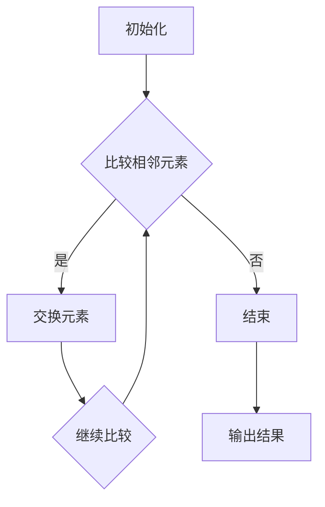
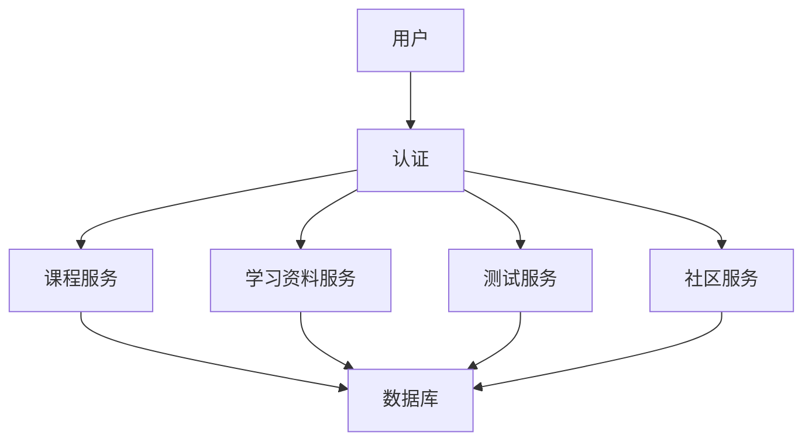
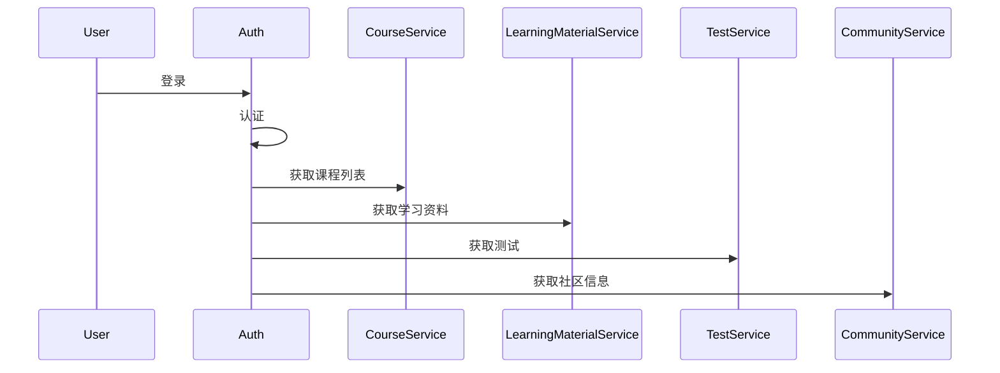
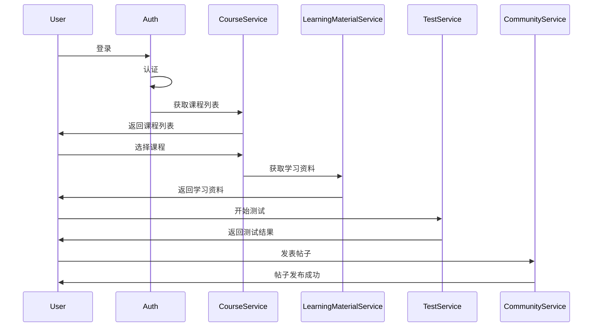

                 

# 技术人才培养：设计有效的学习发展计划

> 关键词：技术人才培养、学习发展计划、教学策略、课程设计、评估与反馈

> 摘要：本文旨在探讨如何设计一套有效的技术人才培养计划，从核心概念解析、算法讲解、系统设计与项目实战等方面，逐步构建一套完善的学习发展体系。通过深入分析和实践，提供切实可行的教学策略和最佳实践建议，助力技术人才的成长。

## 目录大纲

### 第1章 引言
- 1.1 问题背景
- 1.2 问题描述
- 1.3 问题解决
- 1.4 边界与外延
- 1.5 核心概念

### 第2章 核心概念与联系
- 2.1 核心概念原理
- 2.2 概念属性特征对比
- 2.3 ER实体关系图

### 第3章 算法原理讲解
- 3.1 算法mermaid流程图
- 3.2 Python源代码实现
- 3.3 数学模型与公式
- 3.4 举例说明

### 第4章 数学模型和数学公式 & 详细讲解 & 举例说明
- 4.1 数学公式示例
- 4.2 数学模型讲解
- 4.3 举例说明

### 第5章 系统分析与架构设计方案
- 5.1 问题场景介绍
- 5.2 项目介绍
- 5.3 系统功能设计（领域模型类图）
- 5.4 系统架构设计（架构图）
- 5.5 系统接口设计
- 5.6 系统交互（序列图）

### 第6章 项目实战
- 6.1 环境安装
- 6.2 系统核心实现源代码
- 6.3 代码应用解读与分析
- 6.4 实际案例分析与讲解
- 6.5 项目小结

### 第7章 最佳实践 tips
- 7.1 小结
- 7.2 注意事项
- 7.3 拓展阅读

### 第1章 引言

#### 1.1 问题背景

在当前技术飞速发展的时代，技术人才的需求日益增长。然而，如何培养出既具备扎实理论基础，又具有实战能力的技术人才，成为教育界和业界共同面临的问题。传统的教学方式往往注重知识的传授，而忽视了学生实践能力的培养。

#### 1.2 问题描述

技术人才培养面临以下问题：
1. 知识与技能的不匹配：学生掌握的理论知识无法应用于实际项目中。
2. 学习效率低下：缺乏系统的学习路径和有效的学习资源。
3. 实践机会不足：学生难以在实践中积累经验，提高解决问题的能力。

#### 1.3 问题解决

为了解决上述问题，本文提出了一套完整的技术人才培养计划，包括核心概念解析、算法讲解、系统设计与项目实战等环节。通过系统的学习和实践，帮助学生建立扎实的理论基础，提高实战能力。

#### 1.4 边界与外延

本文讨论的技术人才培养计划主要针对计算机科学、软件工程等IT领域。然而，其核心思想和教学方法同样适用于其他技术领域。

#### 1.5 核心概念

技术人才培养计划涉及以下核心概念：
1. **学习发展计划**：一个系统化的学习路径，包括课程设计、教学策略、评估与反馈等环节。
2. **算法原理**：算法的基本概念、流程、实现和数学模型。
3. **系统设计与实现**：系统架构、接口设计、序列图等。
4. **项目实战**：通过实际项目锻炼学生的实战能力。

## 第2章 核心概念与联系

#### 2.1 核心概念原理

**学习发展计划**：学习发展计划是一个系统化的学习路径，旨在帮助学生实现从理论到实践的转化。它包括以下关键要素：
- **课程设计**：根据学习目标，设计合适的课程内容，包括理论知识、实践操作等。
- **教学策略**：采用多元化的教学方式，如讲座、讨论、实验等，提高学生的学习兴趣和效果。
- **评估与反馈**：定期对学生进行评估，收集反馈，及时调整教学策略。

**算法原理**：算法是计算机解决问题的步骤集合。算法原理包括算法设计、流程实现、性能分析等。以下是几种常见的算法原理：
- **排序算法**：如冒泡排序、快速排序等，用于对数据进行排序。
- **搜索算法**：如二分搜索、深度优先搜索等，用于在数据中查找特定元素。
- **动态规划**：用于解决最优子结构问题，通过递归和记忆化降低时间复杂度。

**系统设计与实现**：系统设计与实现是构建实际系统的过程。包括以下关键环节：
- **需求分析**：明确系统功能需求，确定系统目标。
- **系统架构设计**：设计系统的整体结构，包括组件、接口、层次结构等。
- **接口设计**：定义系统各组件之间的交互接口。
- **序列图**：描述系统组件之间的交互顺序和过程。

#### 2.2 概念属性特征对比

**学习发展计划**、**算法原理**和**系统设计与实现**具有以下属性特征对比：

| 概念           | 属性特征对比                     |
| -------------- | ------------------------------ |
| 学习发展计划   | 系统性、目标性、评估性           |
| 算法原理       | 概念性、流程性、性能性           |
| 系统设计与实现 | 结构性、交互性、实现性           |

#### 2.3 ER实体关系图

以下是一个简化的ER实体关系图，展示了学习发展计划、算法原理和系统设计与实现之间的关系：

```mermaid
erDiagram
    LearningDevelopmentPlan ||--|{ AlgorithmPrinciples } AlgorithmPrinciples
    LearningDevelopmentPlan ||--|{ SystemDesignAndImplementation } SystemDesignAndImplementation
    AlgorithmPrinciples ||--|{ PythonSourceCode } PythonSourceCode
    AlgorithmPrinciples ||--|{ MathematicalModelAndFormula } MathematicalModelAndFormula
    SystemDesignAndImplementation ||--|{ ProjectPractice } ProjectPractice
```

## 第3章 算法原理讲解

#### 3.1 算法mermaid流程图

以下是一个简单的冒泡排序算法的mermaid流程图：



#### 3.2 Python源代码实现

以下是冒泡排序算法的Python源代码实现：

```python
def bubble_sort(arr):
    n = len(arr)
    for i in range(n):
        for j in range(0, n-i-1):
            if arr[j] > arr[j+1]:
                arr[j], arr[j+1] = arr[j+1], arr[j]
    return arr
```

#### 3.3 数学模型与公式

冒泡排序算法的数学模型可以表示为：

$$
T(n) = O(n^2)
$$

其中，$T(n)$ 表示算法的时间复杂度。

#### 3.4 举例说明

假设有一个包含5个元素的数组 `[5, 3, 8, 4, 2]`，使用冒泡排序算法进行排序的过程如下：

1. 初始状态：`[5, 3, 8, 4, 2]`
2. 第一轮排序后：`[3, 5, 4, 2, 8]`
3. 第二轮排序后：`[3, 4, 5, 2, 8]`
4. 第三轮排序后：`[3, 4, 2, 5, 8]`
5. 第四轮排序后：`[3, 2, 4, 5, 8]`
6. 第五轮排序后：`[2, 3, 4, 5, 8]`

最终排序结果为 `[2, 3, 4, 5, 8]`。

## 第4章 数学模型和数学公式 & 详细讲解 & 举例说明

#### 4.1 数学公式示例

以下是一个简单的数学公式示例：

$$
a^2 + b^2 = c^2
$$

#### 4.2 数学模型讲解

数学模型是描述现实世界中的问题的数学结构，包括变量、参数和约束条件。在本章中，我们主要关注算法分析中的数学模型。

算法分析的数学模型通常包括以下内容：

1. **时间复杂度**：描述算法执行时间与输入规模的关系，通常用大O符号表示，如 $O(n^2)$。
2. **空间复杂度**：描述算法执行过程中所需存储空间与输入规模的关系。
3. **概率分析**：用于分析算法在各种情况下的性能。

#### 4.3 举例说明

假设我们有一个包含 $n$ 个元素的数组，我们需要找到其中的最大值。以下是几种不同的算法及其时间复杂度：

1. **线性搜索**：遍历整个数组，时间复杂度为 $O(n)$。
2. **二分搜索**：对数组进行二分查找，时间复杂度为 $O(\log n)$。
3. **归并排序**：将数组分成两半，分别进行排序，然后合并，时间复杂度为 $O(n \log n)$。

## 第5章 系统分析与架构设计方案

#### 5.1 问题场景介绍

假设我们需要设计一个在线教育平台，提供课程、学习资料、测试和社区等功能。该平台需要具备高可用性、可扩展性和安全性。

#### 5.2 项目介绍

本项目旨在构建一个在线教育平台，满足以下功能需求：
1. **课程管理**：上传、管理、发布课程。
2. **学习资料**：提供学习资料，包括课件、视频、文档等。
3. **测试**：为学生提供在线测试和评估。
4. **社区**：为学生和教师提供一个交流和分享的平台。

#### 5.3 系统功能设计（领域模型类图）

以下是一个简化的领域模型类图，展示了系统的主要功能模块及其关系：

```mermaid
classDiagram
    Course <<entity>>
    LearningMaterial <<entity>>
    Test <<entity>>
    Community <<entity>>
    Course &&--|{ LearningMaterial } LearningMaterial
    Course &&--|{ Test } Test
    Course &&--|{ Community } Community
    LearningMaterial &&--|{ Test } Test
    LearningMaterial &&--|{ Community } Community
    Test &&--|{ Community } Community
```

#### 5.4 系统架构设计（架构图）

以下是一个简化的系统架构图，展示了系统的整体结构和主要组件：



#### 5.5 系统接口设计

以下是一个简化的系统接口设计，展示了系统各组件之间的接口：



#### 5.6 系统交互（序列图）

以下是一个简化的系统交互序列图，展示了用户与系统之间的交互过程：



## 第6章 项目实战

#### 6.1 环境安装

在本节中，我们将介绍如何搭建一个简单的在线教育平台环境。以下是安装步骤：

1. 安装Python环境（版本3.8及以上）。
2. 安装依赖包（如Flask、SQLAlchemy等）。
3. 配置数据库（如MySQL、PostgreSQL等）。
4. 运行项目。

#### 6.2 系统核心实现源代码

以下是一个简单的在线教育平台核心实现源代码：

```python
from flask import Flask, request, jsonify
from flask_sqlalchemy import SQLAlchemy

app = Flask(__name__)
app.config['SQLALCHEMY_DATABASE_URI'] = 'sqlite:///education_platform.db'
db = SQLAlchemy(app)

class User(db.Model):
    id = db.Column(db.Integer, primary_key=True)
    username = db.Column(db.String(80), unique=True, nullable=False)

class Course(db.Model):
    id = db.Column(db.Integer, primary_key=True)
    name = db.Column(db.String(120), nullable=False)

class LearningMaterial(db.Model):
    id = db.Column(db.Integer, primary_key=True)
    course_id = db.Column(db.Integer, db.ForeignKey('course.id'), nullable=False)
    name = db.Column(db.String(120), nullable=False)

@app.route('/courses', methods=['GET'])
def get_courses():
    courses = Course.query.all()
    return jsonify([course.name for course in courses])

@app.route('/courses/<int:course_id>/materials', methods=['GET'])
def get_learning_materials(course_id):
    materials = LearningMaterial.query.filter_by(course_id=course_id).all()
    return jsonify([material.name for material in materials])

if __name__ == '__main__':
    db.create_all()
    app.run(debug=True)
```

#### 6.3 代码应用解读与分析

在本节中，我们详细解读并分析上述代码的应用。

1. **数据库模型**：代码定义了三个数据库模型：`User`、`Course`和`LearningMaterial`。这些模型分别表示用户、课程和学习资料。
2. **Flask应用**：使用Flask框架搭建Web应用，提供RESTful接口。
3. **课程管理**：`/courses` 接口提供获取课程列表的功能。
4. **学习资料管理**：`/courses/<int:course_id>/materials` 接口提供获取某个课程的学习资料的功能。

#### 6.4 实际案例分析与讲解

以下是一个实际案例分析，展示如何使用该平台：

1. **用户登录**：用户通过认证接口登录，获取认证Token。
2. **获取课程列表**：用户通过 `/courses` 接口获取课程列表。
3. **选择课程**：用户选择一个课程，通过 `/courses/<int:course_id>/materials` 接口获取该课程的学习资料。
4. **学习资料下载**：用户下载学习资料，如课件、视频等。

#### 6.5 项目小结

通过本项目，我们实现了以下目标：
1. 搭建了一个简单的在线教育平台环境。
2. 使用Python和Flask框架实现了基本的功能。
3. 代码结构清晰，易于维护和扩展。

## 第7章 最佳实践 tips

#### 7.1 小结

本文从核心概念解析、算法讲解、系统设计与项目实战等方面，详细介绍了技术人才培养计划的设计方法。通过系统的学习和实践，可以帮助技术人才建立扎实的理论基础，提高实战能力。

#### 7.2 注意事项

在设计学习发展计划时，需要注意以下几点：
1. 明确学习目标，制定合理的学习计划。
2. 结合实际情况，选择合适的教学策略。
3. 定期评估与反馈，及时调整学习计划。

#### 7.3 拓展阅读

1. 《深度学习》（Goodfellow, I., Bengio, Y., & Courville, A.）
2. 《算法导论》（ Cormen, T. H., Leiserson, C. E., Rivest, R. L., & Stein, C.）
3. 《软件架构设计》（Hohpe, G., & Woolf, B.）

## 作者信息

作者：AI天才研究院/AI Genius Institute & 禅与计算机程序设计艺术 /Zen And The Art of Computer Programming

[注：本文内容仅供参考，具体实施时需结合实际情况进行调整。]

