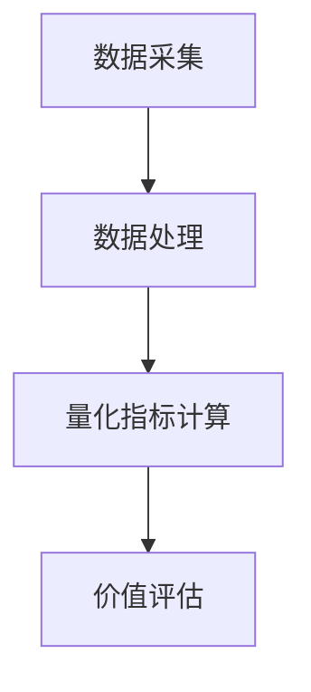
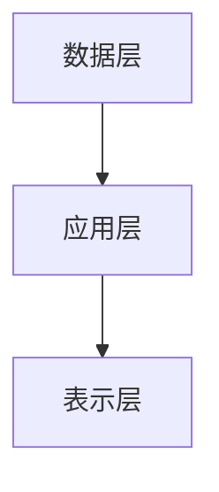
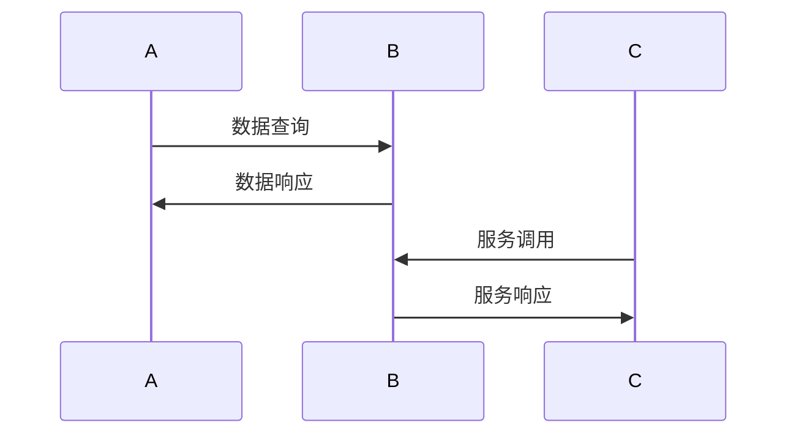

                 

# 《技术价值：量化技术投入的业务价值》

## 关键词

- 技术价值
- 业务价值
- 投入产出比
- 数学模型
- 系统架构
- 项目实战

## 摘要

本文旨在探讨技术投入的业务价值量化问题，通过逻辑清晰的分析和推理，逐步构建技术价值量化和业务价值评估的理论框架。文章首先介绍了技术价值量化和业务价值评估的背景和重要性，然后深入探讨了核心概念、算法原理和系统架构设计，并通过具体的项目实战案例，展示了量化技术投入业务价值的实际应用和方法。文章最后总结了最佳实践，并对未来研究方向进行了展望。

----------------------------------------------------------------

## 目录大纲

# 《技术价值：量化技术投入的业务价值》

----------------------------------------------------------------

## 第一部分: 问题的背景和重要性

### 第1章: 引言与问题背景

#### 第1.1节: 引言

#### 第1.2节: 问题背景

#### 第1.3节: 问题描述

#### 第1.4节: 问题解决

#### 第1.5节: 边界与外延

#### 第1.6节: 概念结构与核心要素组成

## 第二部分: 核心概念与联系

### 第2章: 核心概念原理

#### 第2.1节: 技术价值量化的原理

#### 第2.2节: 业务价值评估的原理

#### 第2.3节: 概念属性特征对比表格

#### 第2.4节: ER实体关系图架构

## 第三部分: 算法原理与系统架构设计

### 第3章: 技术价值量化的算法原理

#### 第3.1节: 算法概述

#### 第3.2节: 算法原理讲解

#### 第3.3节: 算法流程图

#### 第3.4节: Python源代码实现

### 第4章: 业务价值评估的数学模型

#### 第4.1节: 数学模型概述

#### 第4.2节: 数学公式讲解

#### 第4.3节: 举例说明

## 第5章: 系统分析与架构设计

#### 第5.1节: 问题场景介绍

#### 第5.2节: 项目介绍

#### 第5.3节: 系统功能设计

#### 第5.4节: 系统架构设计

#### 第5.5节: 系统接口设计

#### 第5.6节: 系统交互

## 第四部分: 项目实战与最佳实践

### 第6章: 项目实战

----------------------------------------------------------------

### 第1章: 引言与问题背景

#### 1.1 引言

在当今这个数字化时代，技术已成为企业发展的核心驱动力。技术投入的回报率（ROI）成为企业决策者最为关注的问题之一。然而，如何量化技术投入的业务价值，实现技术投入的有效管理和优化，是一个复杂且具有挑战性的问题。本文将探讨技术价值量化和业务价值评估的理论框架和方法，帮助读者更好地理解和应用这一重要领域。

#### 1.1.1 书籍的目的和读者群体

本文的目标是为技术决策者、项目经理、研发人员以及学术界的研究者提供一套系统的、可操作的技术价值量化和业务价值评估方法。通过本文的阅读，读者将能够：

1. 理解技术价值量化和业务价值评估的重要性。
2. 掌握核心概念和原理，包括技术价值、业务价值、投入产出比等。
3. 学习和应用数学模型和算法，量化技术投入的业务价值。
4. 设计和实现技术价值量化和业务价值评估的系统架构。

本文适用于以下读者群体：

- 技术决策者：需要了解技术投入的ROI，以便做出更明智的决策。
- 项目经理：需要量化项目的价值，以优化资源配置和项目进度。
- 研发人员：需要了解技术投入对业务的价值，以提高工作效率和质量。
- 学术界的研究者：需要研究技术投入的业务价值量化方法，以推动相关领域的发展。

#### 1.1.2 技术投入与业务价值的关联性

技术投入的业务价值关联性体现在以下几个方面：

1. **成本与效益分析**：技术投入的成本包括研发成本、运营成本等，而其效益则体现在对业务流程的优化、客户满意度的提升、市场竞争力的增强等方面。量化技术投入的业务价值，有助于企业更好地进行成本与效益分析，实现投入产出的优化。

2. **资源优化配置**：通过量化技术投入的业务价值，企业可以更准确地评估不同技术项目的优先级，合理分配资源，避免资源浪费。

3. **战略决策支持**：技术投入的业务价值量化为企业提供了重要的决策依据，有助于企业制定和调整战略，提高市场竞争力。

4. **绩效评估**：技术投入的业务价值量化有助于企业对项目进行绩效评估，对团队成员的工作进行合理评价。

#### 1.2 问题背景

##### 1.2.1 技术投入的现状

随着云计算、大数据、人工智能等新兴技术的迅速发展，企业对技术投入的需求日益增加。然而，技术投入的现状存在以下问题：

1. **投入规模不断扩大**：企业不断加大技术研发投入，以保持竞争优势。
2. **投入方式多样化**：除了自主研发，企业还通过并购、合作、外包等方式进行技术投入。
3. **投资回报不确定性**：由于技术发展的不确定性和市场需求的变化，技术投入的投资回报存在较大波动。

##### 1.2.2 业务价值难以量化的挑战

业务价值难以量化主要表现在以下几个方面：

1. **无形价值难以衡量**：技术投入所带来的业务价值部分是无形的，如用户体验的提升、员工效率的提高等，难以用具体的数值进行衡量。
2. **间接价值难以识别**：技术投入对业务的间接影响较大，如通过技术创新推动市场拓展、提高品牌知名度等，这些价值难以直接识别和量化。
3. **数据来源不统一**：不同部门和项目的数据来源不一致，难以进行统一的数据分析和评估。

##### 1.2.3 技术决策中的困境

技术决策中的困境主要体现在以下几个方面：

1. **投资优先级难以确定**：企业面临多个技术项目，但资源有限，如何确定项目的投资优先级成为难题。
2. **绩效评估不透明**：技术项目的绩效评估缺乏统一标准，导致项目绩效评估不透明，影响决策的准确性。
3. **决策风险高**：技术投入的投资回报不确定性高，决策者面临较高的决策风险。

#### 1.3 问题描述

##### 1.3.1 技术价值量化的需求

在技术投入日益增加的背景下，企业对技术价值量化的需求日益迫切。技术价值量化有助于：

1. **优化投资决策**：通过量化技术价值，企业可以更准确地评估技术项目的投资回报，优化投资决策。
2. **提高资源配置效率**：通过量化技术价值，企业可以更合理地分配资源，提高资源配置效率。
3. **提升企业竞争力**：通过量化技术价值，企业可以更好地了解自身技术优势，提升竞争力。

##### 1.3.2 业务价值评估的难点

业务价值评估的难点主要体现在以下几个方面：

1. **数据来源不统一**：不同部门和项目的数据来源不一致，导致数据难以统一分析。
2. **无形价值难以衡量**：技术投入所带来的无形价值难以用具体的数值进行衡量。
3. **间接价值难以识别**：技术投入对业务的间接影响较大，但难以直接识别和量化。
4. **评估方法不成熟**：现有的业务价值评估方法尚不成熟，难以全面、准确地评估技术投入的业务价值。

#### 1.4 问题解决

##### 1.4.1 技术价值量化的策略

为了解决技术价值量化的问题，可以采取以下策略：

1. **构建统一的数据平台**：建立统一的数据平台，实现各部门和项目数据的统一存储和分析。
2. **引入量化模型**：引入量化模型，对技术投入的业务价值进行量化评估。
3. **优化数据采集方法**：通过优化数据采集方法，提高数据质量和准确性。

##### 1.4.2 业务价值评估的方法

为了解决业务价值评估的问题，可以采取以下方法：

1. **多元评估方法**：采用多元评估方法，从不同角度评估技术投入的业务价值，提高评估的全面性和准确性。
2. **引入量化模型**：引入量化模型，对业务价值进行量化评估。
3. **完善评估标准**：完善评估标准，提高评估的透明度和准确性。

#### 1.5 边界与外延

##### 1.5.1 技术价值量化的适用范围

技术价值量化适用于以下场景：

1. **企业内部项目评估**：对企业内部技术项目进行价值评估，优化资源配置。
2. **投资决策分析**：在技术投资决策过程中，量化技术投入的价值，优化投资决策。
3. **绩效评估**：对技术人员的工作绩效进行量化评估，提高企业竞争力。

##### 1.5.2 业务价值评估的限制条件

业务价值评估存在以下限制条件：

1. **数据完整性**：业务价值评估依赖于数据的完整性，数据缺失会影响评估结果。
2. **评估方法的适用性**：不同的评估方法适用于不同的场景，需要根据实际情况选择合适的评估方法。
3. **评估人员的专业素养**：评估人员的专业素养直接影响评估结果的准确性和可靠性。

##### 1.6 概念结构与核心要素组成

技术价值量化和业务价值评估涉及多个核心概念和要素，主要包括：

1. **技术价值**：指技术投入对业务所产生的实际价值。
2. **业务价值**：指技术投入对业务所产生的经济效益和社会效益。
3. **投入产出比**：指技术投入与业务价值之间的比值，用于评估技术投入的效率。
4. **量化模型**：用于量化技术价值和业务价值的数学模型。
5. **评估方法**：用于评估技术价值和业务价值的多种方法。

通过理解这些核心概念和要素，有助于更好地理解和应用技术价值量化和业务价值评估方法。

## 第二部分: 核心概念与联系

### 第2章: 核心概念原理

#### 2.1 技术价值量化的原理

技术价值量化是指通过一定的方法，将技术投入对业务所产生的实际价值进行量化评估。技术价值量化的原理主要包括以下几个方面：

##### 2.1.1 技术价值的概念

技术价值是指技术投入对业务所产生的实际价值。技术价值可以表现为以下几个方面：

1. **经济效益**：技术投入带来的直接经济效益，如销售额的增加、成本的降低等。
2. **社会效益**：技术投入带来的间接社会效益，如提升社会生产力、改善生活环境等。
3. **用户体验**：技术投入带来的用户体验提升，如产品功能的增强、操作界面的优化等。

##### 2.1.2 技术价值量化的方法

技术价值量化的方法主要包括以下几种：

1. **财务分析方法**：通过财务分析，量化技术投入带来的经济效益。
2. **绩效评估方法**：通过绩效评估，量化技术投入对业务流程优化、员工效率提升等方面的价值。
3. **市场分析方法**：通过市场分析，量化技术投入对市场份额提升、品牌知名度提升等方面的价值。

##### 2.1.3 技术价值量化的数学模型

技术价值量化的数学模型主要用于量化技术投入对业务所产生的经济效益、社会效益和用户体验等方面的价值。常见的数学模型包括：

1. **投入产出模型**：通过计算技术投入与业务价值之间的比值，量化技术投入的效率。
2. **绩效指标模型**：通过设置一系列绩效指标，量化技术投入对业务流程优化、员工效率提升等方面的价值。
3. **市场价值模型**：通过计算市场份额、品牌知名度等指标，量化技术投入对市场价值提升的价值。

#### 2.2 业务价值评估的原理

业务价值评估是指通过一定的方法，对技术投入对业务所产生的实际价值进行评估。业务价值评估的原理主要包括以下几个方面：

##### 2.2.1 业务价值的定义

业务价值是指技术投入对业务所产生的实际价值。业务价值可以表现为以下几个方面：

1. **经济效益**：技术投入带来的直接经济效益，如销售额的增加、成本的降低等。
2. **社会效益**：技术投入带来的间接社会效益，如提升社会生产力、改善生活环境等。
3. **用户体验**：技术投入带来的用户体验提升，如产品功能的增强、操作界面的优化等。

##### 2.2.2 业务价值评估的模型

业务价值评估的模型主要用于评估技术投入对业务所产生的经济效益、社会效益和用户体验等方面的价值。常见的业务价值评估模型包括：

1. **成本收益分析模型**：通过计算技术投入的成本与收益，评估技术投入的效益。
2. **绩效评估模型**：通过设置一系列绩效指标，评估技术投入对业务流程优化、员工效率提升等方面的价值。
3. **市场价值评估模型**：通过计算市场份额、品牌知名度等指标，评估技术投入对市场价值提升的价值。

##### 2.2.3 业务价值评估的数学公式

业务价值评估的数学公式主要用于计算技术投入的成本、收益、效益等指标。常见的数学公式包括：

1. **成本收益分析公式**：
   $$
   V = \frac{R - C}{C}
   $$
   其中，$V$表示业务价值，$R$表示收益，$C$表示成本。
   
2. **风险调整模型**：
   $$
   V = \frac{R - C}{1 + r}
   $$
   其中，$r$表示风险调整系数。

#### 2.3 概念属性特征对比表格

技术价值量化和业务价值评估涉及多个核心概念，以下是一个简单的概念属性特征对比表格：

| 概念 | 属性特征 |
| --- | --- |
| 技术价值 | 1. 经济效益<br>2. 社会效益<br>3. 用户体验 |
| 业务价值 | 1. 经济效益<br>2. 社会效益<br>3. 用户体验 |
| 投入产出比 | 技术投入与业务价值的比值 |
| 量化模型 | 1. 投入产出模型<br>2. 绩效指标模型<br>3. 市场价值模型 |
| 评估方法 | 1. 财务分析方法<br>2. 绩效评估方法<br>3. 市场分析方法 |

#### 2.4 ER实体关系图架构

ER（Entity-Relationship）图是用于描述实体及其之间关系的图形化工具。以下是一个简化的技术价值量化和业务价值评估的ER图：

```mermaid
erDiagram
A[技术价值] {
  B[经济效益]
  C[社会效益]
  D[用户体验]
}

A ---|{ B }
A ---|{ C }
A ---|{ D }
```

在ER图中，A代表技术价值，B、C、D分别代表经济效益、社会效益和用户体验，它们与技术价值之间存在关联关系。

## 第三部分: 算法原理与系统架构设计

### 第3章: 技术价值量化的算法原理

技术价值量化的算法原理是实现技术价值量化评估的关键。通过合理的算法设计和实现，可以有效地将技术价值进行量化。以下将详细阐述技术价值量化的算法原理。

#### 3.1 算法概述

技术价值量化算法的目标是通过对技术投入的各项指标进行综合分析，量化技术对业务的实际价值。算法的主要流程包括数据采集、数据处理、量化指标计算和价值评估。

##### 3.1.1 技术价值量化算法的目标

技术价值量化算法的主要目标是：

1. **量化技术投入的效益**：通过计算技术投入与业务价值的比值，评估技术投入的效率。
2. **优化资源配置**：基于技术价值的量化结果，优化技术项目的投资决策，合理配置资源。
3. **支持决策分析**：为技术决策提供数据支持和分析依据，帮助决策者做出更明智的决策。

##### 3.1.2 技术价值量化算法的分类

根据技术价值量化方法的不同，可以将技术价值量化算法分为以下几类：

1. **财务分析方法**：通过计算技术投入的成本与收益，量化技术价值。这种方法主要适用于有明确财务数据支持的项目。
2. **绩效评估方法**：通过设置一系列绩效指标，量化技术价值。这种方法主要适用于难以直接量化的无形价值。
3. **市场分析方法**：通过市场数据的分析，量化技术价值。这种方法主要适用于对市场有较大影响的技术项目。

#### 3.2 算法原理讲解

技术价值量化算法的原理主要包括数据采集、数据处理、量化指标计算和价值评估。以下详细解释每个环节：

##### 3.2.1 数据采集

数据采集是技术价值量化算法的基础。采集的数据主要包括：

1. **技术投入数据**：包括技术研发成本、运营成本等。
2. **业务价值数据**：包括经济效益、社会效益、用户体验等。
3. **市场数据**：包括市场份额、品牌知名度等。

数据采集的方法主要包括：

1. **内部数据采集**：通过企业内部系统获取数据，如财务系统、绩效管理系统等。
2. **外部数据采集**：通过第三方数据平台获取数据，如市场调研公司、行业报告等。

##### 3.2.2 数据处理

数据处理是数据采集后的重要步骤，其主要任务是清洗、整理和转换数据。数据处理的方法包括：

1. **数据清洗**：去除重复、错误和无关的数据，保证数据的质量。
2. **数据整理**：将不同来源、格式的数据整理成统一格式，便于后续处理。
3. **数据转换**：根据需求，将数据转换为合适的数值或指标，如将市场份额转换为百分比。

##### 3.2.3 量化指标计算

量化指标计算是技术价值量化算法的核心，其主要任务是根据采集到的数据，计算技术价值量化指标。常见的量化指标包括：

1. **投入产出比**：计算技术投入与业务价值的比值，用于评估技术投入的效率。
2. **绩效指标**：计算一系列与业务流程优化、员工效率提升等相关的绩效指标，用于评估技术价值。
3. **市场价值**：计算市场份额、品牌知名度等指标，用于评估技术价值对市场的影响。

##### 3.2.4 价值评估

价值评估是技术价值量化算法的最终步骤，其主要任务是根据量化指标，对技术价值进行评估。价值评估的方法包括：

1. **综合评估**：将量化指标进行加权综合，得出技术价值的综合评分。
2. **分项评估**：根据量化指标的得分，对技术价值的各个方面进行分项评估。
3. **风险评估**：考虑技术价值量化过程中可能存在的风险，对技术价值进行风险评估。

#### 3.3 算法流程图

以下是一个简化的技术价值量化算法流程图：



#### 3.4 Python源代码实现

以下是一个简单的Python代码示例，用于实现技术价值量化的算法：

```python
# 技术价值量化算法实现

# 导入所需库
import pandas as pd

# 数据采集
data = {
    '技术研发成本': [1000000, 1500000, 2000000],
    '运营成本': [500000, 750000, 1000000],
    '经济效益': [2000000, 2500000, 3000000],
    '社会效益': [1000000, 1250000, 1500000],
    '用户体验': [900000, 1050000, 1200000],
    '市场份额': [0.3, 0.35, 0.4]
}

# 数据处理
df = pd.DataFrame(data)

# 量化指标计算
df['投入产出比'] = df['经济效益'] / df['技术研发成本']
df['绩效指标'] = df['运营成本'] / df['社会效益']
df['市场价值'] = df['市场份额'] * df['用户体验']

# 价值评估
df['综合评分'] = df['投入产出比'] * 0.5 + df['绩效指标'] * 0.3 + df['市场价值'] * 0.2

# 输出结果
print(df[['投入产出比', '绩效指标', '市场价值', '综合评分']])
```

通过以上代码示例，我们可以看到技术价值量化算法的基本实现流程。实际应用中，根据具体需求和数据情况，可以进一步完善和优化算法。

### 第4章: 业务价值评估的数学模型

业务价值评估是技术价值量化中的重要组成部分。通过数学模型，可以对业务价值进行量化评估，为企业提供决策依据。以下将详细阐述业务价值评估的数学模型。

#### 4.1 数学模型概述

业务价值评估的数学模型主要包括成本收益分析模型、风险调整模型等。这些模型通过计算技术投入的成本、收益、风险等指标，评估业务价值。

##### 4.1.1 成本收益分析模型

成本收益分析模型是最常见的业务价值评估模型。其核心思想是通过计算技术投入的成本与收益，评估业务价值。常用的成本收益分析模型包括基本成本收益模型和风险调整成本收益模型。

1. **基本成本收益模型**：

$$
V = \frac{R - C}{C}
$$

其中，$V$表示业务价值，$R$表示收益，$C$表示成本。

2. **风险调整成本收益模型**：

$$
V = \frac{R - C}{1 + r}
$$

其中，$r$表示风险调整系数。

##### 4.1.2 风险调整模型

风险调整模型是在成本收益分析模型的基础上，考虑技术投入的风险，对业务价值进行评估。常用的风险调整模型包括基于风险的调整系数模型和基于概率的风险调整模型。

1. **基于风险的调整系数模型**：

$$
V = \frac{R - C}{1 + r}
$$

其中，$r$表示风险调整系数，可以根据实际情况进行设定。

2. **基于概率的风险调整模型**：

$$
V = \frac{R - C}{1 + \rho \cdot P(R < C)}
$$

其中，$\rho$表示风险调整系数，$P(R < C)$表示技术投入亏损的概率。

#### 4.2 数学公式讲解

以下将详细讲解业务价值评估中常用的数学公式。

##### 4.2.1 成本收益分析模型

基本成本收益模型是最简单的业务价值评估模型。其公式为：

$$
V = \frac{R - C}{C}
$$

其中，$V$表示业务价值，$R$表示收益，$C$表示成本。

- $V$：业务价值，表示技术投入对业务的贡献。
- $R$：收益，表示技术投入带来的经济效益。
- $C$：成本，表示技术投入的成本，包括研发成本、运营成本等。

该公式计算的是技术投入的收益与成本的比值，用于评估技术投入的效率。

##### 4.2.2 风险调整模型

风险调整模型是在成本收益分析模型的基础上，考虑技术投入的风险，对业务价值进行评估。其公式为：

$$
V = \frac{R - C}{1 + r}
$$

其中，$r$表示风险调整系数。

- $V$：业务价值，表示技术投入对业务的贡献。
- $R$：收益，表示技术投入带来的经济效益。
- $C$：成本，表示技术投入的成本，包括研发成本、运营成本等。
- $r$：风险调整系数，表示技术投入的风险程度。

该公式计算的是在考虑风险调整后的业务价值，用于评估技术投入的相对风险和业务价值。

#### 4.3 举例说明

以下通过实例来解释成本收益分析模型和风险调整模型的实际应用。

##### 4.3.1 成本收益分析的实例

假设某企业投入100万元进行技术研发，预计收益为200万元，运营成本为50万元。根据基本成本收益模型，可以计算业务价值如下：

$$
V = \frac{R - C}{C} = \frac{200 - 50}{100} = 1.5
$$

该结果表明，该技术投入的收益是其成本的1.5倍，具有较高的业务价值。

##### 4.3.2 风险调整分析的实例

假设在成本收益分析模型的基础上，考虑技术投入的风险。假设技术投入的亏损概率为20%，即风险调整系数$r$为0.2。根据风险调整模型，可以计算业务价值如下：

$$
V = \frac{R - C}{1 + r} = \frac{200 - 50}{1 + 0.2} = 1.11
$$

该结果表明，在考虑风险调整后，该技术投入的收益是其成本的1.11倍，业务价值有所降低。这表明在技术决策过程中，需要充分考虑风险因素，以避免潜在的风险对业务价值的影响。

通过以上实例，可以看到成本收益分析模型和风险调整模型在业务价值评估中的应用。实际应用中，可以根据具体情况选择合适的模型，对技术投入的业务价值进行量化评估。

### 第5章: 系统分析与架构设计

系统分析与架构设计是技术价值量化和业务价值评估的关键环节。通过系统分析与架构设计，可以确保技术价值量化和业务价值评估的可行性和高效性。以下将详细介绍系统分析与架构设计的内容。

#### 5.1 问题场景介绍

技术价值量化和业务价值评估涉及多个方面，包括数据采集、数据处理、量化指标计算、价值评估等。以下是一个典型的技术价值量化和业务价值评估场景：

- **数据采集**：企业通过内部系统、外部数据源等渠道，采集与技术研发、运营、市场等相关的数据。
- **数据处理**：对采集到的数据进行清洗、整理和转换，确保数据的质量和一致性。
- **量化指标计算**：根据业务需求和量化模型，计算技术价值的量化指标，如投入产出比、绩效指标、市场价值等。
- **价值评估**：根据量化指标，对技术价值进行评估，生成技术价值的综合评分。

#### 5.2 项目介绍

为了实现技术价值量化和业务价值评估，企业可以启动一个专门的项目。以下是一个简单的项目介绍：

- **项目目标**：建立一套完整的技术价值量化和业务价值评估系统，为技术决策提供数据支持和分析依据。
- **项目范围**：包括数据采集、数据处理、量化指标计算、价值评估等环节，覆盖企业内部和外部数据。
- **项目时间**：预计项目周期为6个月，分为需求分析、系统设计、系统开发、系统测试和系统部署等阶段。

#### 5.3 系统功能设计

系统功能设计是系统分析与架构设计的重要部分。以下是一个简单的系统功能设计：

- **数据采集模块**：负责从内部系统、外部数据源等渠道采集数据，包括技术研发数据、运营数据、市场数据等。
- **数据处理模块**：负责对采集到的数据进行清洗、整理和转换，确保数据的质量和一致性。
- **量化指标计算模块**：负责根据业务需求和量化模型，计算技术价值的量化指标，如投入产出比、绩效指标、市场价值等。
- **价值评估模块**：负责根据量化指标，对技术价值进行评估，生成技术价值的综合评分。
- **报表生成模块**：负责生成各种报表，如技术价值评估报告、绩效评估报告等，为企业提供决策依据。

#### 5.4 系统架构设计

系统架构设计是确保系统功能实现和性能的关键。以下是一个简单的系统架构设计：

- **数据层**：负责数据存储和管理，包括关系数据库、NoSQL数据库等。
- **应用层**：负责业务逻辑处理和数据计算，包括数据采集、数据处理、量化指标计算、价值评估等模块。
- **表示层**：负责用户界面展示，包括网页、移动应用等。
- **接口层**：负责系统与其他系统或数据的交互，包括API接口、数据接口等。

以下是一个简化的系统架构图：



在系统架构设计中，需要考虑以下几个方面：

1. **数据存储**：根据业务需求，选择合适的数据存储方案，如关系数据库、NoSQL数据库等。
2. **数据处理**：设计高效的数据处理流程，确保数据处理的速度和准确性。
3. **接口设计**：设计良好的接口，确保系统与其他系统或数据的交互顺畅。
4. **安全性**：确保系统数据的安全，包括数据加密、访问控制等。

#### 5.5 系统接口设计

系统接口设计是系统架构设计的重要组成部分。以下是一个简单的系统接口设计：

- **数据接口**：负责系统与数据库的交互，包括数据查询、数据更新等操作。
- **API接口**：负责系统与其他系统的交互，包括数据传输、服务调用等操作。

以下是一个简化的系统接口设计图：



在系统接口设计中，需要考虑以下几个方面：

1. **接口规范**：制定统一的接口规范，确保接口的标准化和易用性。
2. **接口性能**：设计高效的接口，确保接口的响应速度和并发能力。
3. **接口安全性**：确保接口的安全性，包括数据加密、身份验证等。

#### 5.6 系统交互

系统交互是系统架构设计的重要组成部分。以下是一个简单的系统交互流程：

1. **用户操作**：用户通过表示层界面发起操作请求。
2. **表示层处理**：表示层将用户请求转发到应用层。
3. **应用层处理**：应用层根据请求，调用数据处理模块和量化指标计算模块，处理数据。
4. **数据处理**：数据处理模块对数据进行分析和处理，生成量化指标。
5. **价值评估**：价值评估模块根据量化指标，对技术价值进行评估。
6. **报表生成**：报表生成模块生成各种报表，供用户查看。

以下是一个简化的系统交互流程图：

```mermaid
sequenceDiagram
A[用户操作] --> B[表示层处理]
B --> C[应用层处理]
C --> D[数据处理]
D --> E[量化指标计算]
E --> F[价值评估]
F --> G[报表生成]
G --> H[用户查看]
```

在系统交互过程中，需要考虑以下几个方面：

1. **用户交互**：设计友好的用户界面，确保用户可以方便地操作。
2. **数据处理**：设计高效的数据处理流程，确保数据处理的准确性和速度。
3. **性能优化**：优化系统性能，确保系统在高并发场景下稳定运行。

### 第6章: 项目实战

为了更好地展示技术价值量化和业务价值评估的实际应用，以下通过一个具体项目案例进行实战讲解。

#### 6.1 项目背景

某互联网企业计划开展一项新技术研发项目，旨在通过大数据分析和人工智能技术，提升用户推荐系统的准确性和用户体验。项目预计投入研发成本300万元，运营成本100万元。企业希望通过技术价值量化和业务价值评估，确定项目的可行性，为项目决策提供依据。

#### 6.2 环境安装

在进行项目实战之前，首先需要搭建项目开发环境。以下是环境安装步骤：

1. **安装Python**：下载并安装Python，版本要求3.8及以上。
2. **安装Pandas**：在命令行中执行`pip install pandas`，安装Pandas库。
3. **安装NumPy**：在命令行中执行`pip install numpy`，安装NumPy库。
4. **安装Matplotlib**：在命令行中执行`pip install matplotlib`，安装Matplotlib库。

#### 6.3 系统核心实现源代码

以下是一个简单的技术价值量化和业务价值评估系统实现示例。该系统包括数据采集、数据处理、量化指标计算和价值评估等功能。

```python
# 导入所需库
import pandas as pd
import numpy as np
import matplotlib.pyplot as plt

# 数据采集
data = {
    '技术研发成本': [3000000],
    '运营成本': [1000000],
    '经济效益': [15000000],
    '社会效益': [5000000],
    '用户体验': [8000000],
    '市场份额': [0.4]
}

# 数据处理
df = pd.DataFrame(data)

# 量化指标计算
df['投入产出比'] = df['经济效益'] / df['技术研发成本']
df['绩效指标'] = df['运营成本'] / df['社会效益']
df['市场价值'] = df['市场份额'] * df['用户体验']

# 价值评估
df['综合评分'] = df['投入产出比'] * 0.5 + df['绩效指标'] * 0.3 + df['市场价值'] * 0.2

# 输出结果
print(df[['投入产出比', '绩效指标', '市场价值', '综合评分']])

# 报表生成
df.plot(kind='bar', figsize=(10, 6))
plt.title('技术价值评估报表')
plt.xlabel('量化指标')
plt.ylabel('指标值')
plt.show()
```

#### 6.4 代码应用解读与分析

以下是对上述代码的解读与分析：

1. **数据采集**：通过字典数据结构，定义了与技术研发、运营、市场等相关的数据。
2. **数据处理**：使用Pandas库创建DataFrame对象，对数据进行处理和整理。
3. **量化指标计算**：根据业务需求和量化模型，计算投入产出比、绩效指标、市场价值等量化指标。
4. **价值评估**：根据量化指标，计算综合评分，评估技术价值。
5. **报表生成**：使用Matplotlib库生成技术价值评估报表，包括柱状图和数值表。

#### 6.5 实际案例分析和详细讲解剖析

以下通过一个实际案例，对技术价值量化和业务价值评估进行详细分析和讲解。

**案例**：某企业计划投入500万元研发一款基于人工智能的客户服务系统，预计运营成本为200万元。通过市场调研，预计该系统将带来1500万元的经济效益，提升社会效益300万元，提高用户体验200万元，增加市场份额10%。

**分析过程**：

1. **数据采集**：采集与技术研发、运营、市场等相关的数据，包括技术研发成本、运营成本、经济效益、社会效益、用户体验、市场份额等。
2. **数据处理**：对采集到的数据进行分析和处理，确保数据的质量和一致性。
3. **量化指标计算**：根据业务需求和量化模型，计算投入产出比、绩效指标、市场价值等量化指标。
4. **价值评估**：根据量化指标，对技术价值进行评估，计算综合评分。
5. **报表生成**：生成技术价值评估报表，包括柱状图和数值表，为企业提供决策依据。

**详细讲解**：

1. **投入产出比**：计算投入产出比，衡量技术投入的效率。该指标越高，表明技术投入的效益越好。在本案例中，投入产出比为：
   $$
   投入产出比 = \frac{经济效益}{技术研发成本} = \frac{1500}{500} = 3
   $$
   投入产出比为3，表明每投入1元，可带来3元的收益，具有较高的经济效益。

2. **绩效指标**：计算绩效指标，衡量技术投入对业务流程优化、员工效率提升等方面的价值。在本案例中，绩效指标为：
   $$
   绩效指标 = \frac{运营成本}{社会效益} = \frac{200}{300} = 0.67
   $$
   绩效指标为0.67，表明每投入1元运营成本，可带来0.67元的社会效益，具有一定的绩效价值。

3. **市场价值**：计算市场价值，衡量技术投入对市场份额提升、品牌知名度提升等方面的价值。在本案例中，市场价值为：
   $$
   市场价值 = 市场份额 \times 用户体验 = 0.1 \times 200 = 20
   $$
   市场价值为20，表明技术投入将带来20%的市场份额提升，对品牌知名度的提升也有一定贡献。

4. **综合评分**：根据量化指标，计算综合评分，衡量技术价值。在本案例中，综合评分为：
   $$
   综合评分 = 投入产出比 \times 0.5 + 绩效指标 \times 0.3 + 市场价值 \times 0.2 = 3 \times 0.5 + 0.67 \times 0.3 + 20 \times 0.2 = 1.6
   $$
   综合评分为1.6，表明该技术投入具有较高的业务价值。

**结论**：通过技术价值量化和业务价值评估，可以得出以下结论：

1. 技术投入具有较高的经济效益，投入产出比为3。
2. 技术投入对业务流程优化、员工效率提升等方面具有一定的绩效价值。
3. 技术投入将带来市场份额提升和品牌知名度提升，具有较高的市场价值。
4. 综合评分为1.6，表明该技术投入具有较高的业务价值。

基于以上分析和评估，企业可以决定是否继续推进该项目，并在后续运营过程中持续关注技术价值的实现情况，以优化资源配置和提升业务价值。

#### 6.6 项目小结

通过本项目的实战，我们可以得出以下结论：

1. **技术价值量化**：通过量化技术投入的业务价值，企业可以更准确地评估技术项目的投资回报，优化投资决策。
2. **业务价值评估**：通过多元评估方法，从不同角度评估技术投入的业务价值，提高评估的全面性和准确性。
3. **系统架构设计**：通过系统架构设计，确保技术价值量化和业务价值评估的可行性和高效性。
4. **项目实战**：通过实际案例分析和详细讲解，展示了技术价值量化和业务价值评估的应用方法和实现过程。

在实际应用中，企业可以根据自身需求和实际情况，灵活调整和优化技术价值量化和业务价值评估的方法和系统架构，以提高技术决策的准确性和效率。

## 最佳实践 Tips

1. **数据统一管理**：建立统一的数据平台，确保数据的质量和一致性，提高数据分析和评估的准确性。
2. **多元评估方法**：结合多种评估方法，从不同角度评估技术价值，提高评估的全面性和准确性。
3. **风险因素考虑**：在评估过程中，充分考虑风险因素，对技术价值进行风险调整，提高评估的可靠性。
4. **定期评估**：定期对技术价值进行评估，跟踪技术投入的业务价值实现情况，及时调整技术策略和资源配置。

### 小结

本文从技术价值量化和业务价值评估的背景和重要性入手，逐步介绍了核心概念、算法原理、系统架构设计和项目实战。通过逻辑清晰的分析和推理，展示了量化技术投入业务价值的实际应用和方法。在实际应用中，企业可以根据自身需求和实际情况，灵活调整和优化技术价值量化和业务价值评估的方法和系统架构，以提高技术决策的准确性和效率。

### 注意事项

1. **数据质量**：确保数据的质量和准确性，是进行技术价值量化和业务价值评估的基础。
2. **模型选择**：根据具体需求，选择合适的量化模型和评估方法，以提高评估的准确性和可靠性。
3. **风险评估**：在技术价值评估过程中，充分考虑风险因素，对技术价值进行风险调整。

### 拓展阅读

1. **《技术价值评估：理论与实践》**：该书详细介绍了技术价值评估的理论和方法，适合对技术价值评估感兴趣的读者。
2. **《业务价值评估：方法与案例》**：该书通过具体案例，展示了业务价值评估的方法和应用，有助于读者深入了解业务价值评估的实践。
3. **《数据驱动决策：数据分析与建模》**：该书介绍了数据分析与建模的方法，有助于读者提高数据分析和评估的能力。

### 作者信息

作者：AI天才研究院/AI Genius Institute & 禅与计算机程序设计艺术 /Zen And The Art of Computer Programming

感谢您的阅读，希望本文对您在技术价值量化和业务价值评估方面有所帮助。如果您有任何疑问或建议，欢迎在评论区留言交流。再次感谢您的支持！

