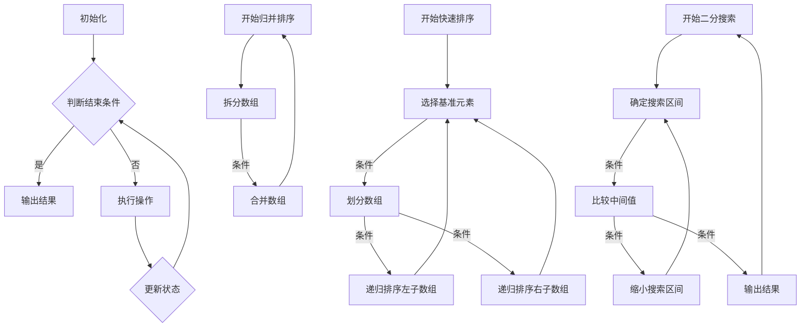
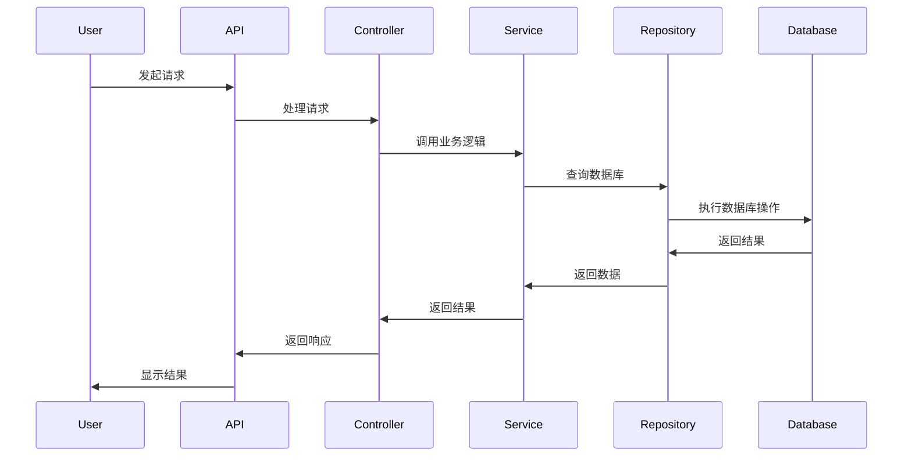

                 

### 引言

在信息技术高速发展的今天，系统的性能和效率已经成为决定企业竞争力和用户满意度的重要因素。无论是个人的计算机设备，还是企业级的应用系统，优化性能和效率都显得至关重要。性能优化关注的是系统在执行任务时的速度和响应时间，而效率优化则侧重于资源的合理利用和降低成本。两者相辅相成，共同构建了系统优化的核心。

编写《技术优化：持续优化系统性能和效率》这本书的动机源于以下几个原因：

1. **技术需求的日益增长**：随着数据量爆炸式增长和用户需求的不断变化，系统面临着更大的性能压力和效率挑战。
2. **理论与实践的脱节**：现有的技术书籍往往过于理论化，缺少实际操作和案例分享，使得读者难以将理论知识应用到实际项目中。
3. **优化方法的多样化**：现代系统优化方法多种多样，包括算法优化、架构优化、数据库优化等，但缺乏系统的总结和归纳。
4. **最佳实践的缺乏**：很多企业在优化系统时往往凭经验行事，缺少科学的方法和最佳实践指导。

本书旨在填补上述空白，通过系统化的理论和实践结合，帮助读者全面掌握系统性能和效率优化的核心知识和方法。具体而言，本书将从以下几个方面展开：

- **核心概念与术语的介绍**：首先明确性能优化和效率优化的定义，并阐述它们之间的联系和区别。
- **算法原理的讲解**：详细介绍常见优化算法的原理，并通过实际案例和代码示例进行深入剖析。
- **数学模型的推导**：使用数学公式和模型来解释优化过程中的关键步骤和决策依据。
- **系统分析与设计**：通过实际项目案例，展示系统分析与设计的过程，包括架构设计、接口设计等。
- **最佳实践分享**：总结业界最佳实践，为读者提供可行的操作指南。

通过本书的阅读，读者将能够：

- **理解性能优化和效率优化的基本概念和方法**。
- **掌握常见优化算法的原理和应用**。
- **学会使用数学模型和公式进行优化分析**。
- **具备系统架构设计和接口设计的能力**。
- **能够结合实际项目，进行有效的性能和效率优化**。

随着信息技术的不断发展，系统优化已经成为一种持续进行的过程。本书不仅为初学者提供了系统的学习路径，也为有经验的技术人员提供了新的思考和工具。让我们一起深入探讨系统优化的奥秘，提升技术水平和解决实际问题的能力。

### 文章关键词

- 性能优化
- 效率优化
- 算法
- 数学模型
- 系统架构设计
- 项目实战
- 最佳实践

### 文章摘要

《技术优化：持续优化系统性能和效率》旨在深入探讨系统性能和效率优化的重要性、方法及其应用。本书首先介绍性能优化和效率优化的基本概念，并详细讲解常见优化算法的原理和应用。通过数学模型的推导，本书帮助读者理解优化过程中的关键步骤和决策依据。随后，书中通过实际项目案例展示系统分析与设计的过程，包括架构设计、接口设计等。最后，本书总结业界最佳实践，为读者提供可行的操作指南。通过本书的阅读，读者将能够全面掌握系统性能和效率优化的核心知识和方法，提升技术水平和解决实际问题的能力。

### 第1章 问题背景与核心概念

#### 1.1 问题背景

随着信息技术的快速发展，系统的性能和效率逐渐成为企业和个人关注的焦点。性能优化和效率优化不仅是技术发展的需求，也是提升用户体验和竞争力的关键因素。本章节将深入探讨性能优化和效率优化的问题背景，包括以下几个方面：

##### 问题描述

在现代系统中，性能和效率的问题主要表现在以下几个方面：

1. **响应时间过长**：用户对系统响应速度的要求越来越高，延迟时间过长会导致用户体验下降，影响用户满意度。
2. **资源利用率低**：系统在运行过程中，经常会出现资源浪费的情况，如CPU利用率低、内存占用过高、磁盘I/O瓶颈等。
3. **并发处理能力不足**：在高并发场景下，系统可能会因为处理能力不足而导致响应速度变慢，甚至崩溃。
4. **扩展性差**：随着用户数量的增加和数据量的增长，系统需要具备良好的扩展性，否则将面临性能瓶颈和资源不足的问题。

##### 问题解决

为了解决上述问题，性能优化和效率优化成为了系统的必选项。性能优化主要关注系统在执行任务时的速度和响应时间，而效率优化则侧重于资源的合理利用和成本降低。具体解决思路如下：

1. **性能优化**：通过算法改进、架构优化、数据库调优等方式提高系统执行效率。
2. **效率优化**：通过资源调度、负载均衡、缓存策略等方式提高系统资源利用率。
3. **并发处理优化**：通过多线程、异步处理、分布式架构等方式提升系统在高并发场景下的处理能力。
4. **扩展性优化**：通过模块化设计、微服务架构等方式实现系统的可扩展性，以便应对未来增长的需求。

##### 边界与外延

性能优化和效率优化不仅关注系统的内部优化，还涉及到系统的外部环境和依赖。以下是一些需要考虑的边界与外延问题：

1. **网络环境**：系统的性能和效率受网络环境的影响，如带宽、延迟、丢包率等。
2. **硬件设备**：系统的性能和效率受硬件设备性能的限制，如CPU、内存、磁盘等。
3. **数据存储**：数据存储系统的性能和效率直接影响整体系统的性能，如数据库性能调优、缓存策略等。
4. **外部服务**：系统与外部服务的交互也会影响整体性能和效率，如第三方API调用、消息队列处理等。

通过上述分析，我们可以看出，性能优化和效率优化是现代系统不可或缺的一部分，它们不仅能够提升系统执行效率和用户体验，还能够降低运营成本，提高企业的竞争力。接下来，我们将进一步探讨性能优化和效率优化的核心概念和联系。

#### 1.2 核心概念

##### 1.2.1 性能优化

性能优化是指通过一系列技术手段和策略，提高系统在执行任务时的速度和响应时间，从而提升用户体验和系统效率。性能优化的核心目标是最大化系统资源的利用率和处理能力，确保系统在高峰期和负载高的情况下依然能够稳定运行。

**性能优化的主要方法**：

1. **算法改进**：优化算法是提高系统性能的重要手段，如使用更高效的排序算法、搜索算法等。
2. **架构优化**：通过改进系统架构，如采用分布式架构、微服务架构等，提高系统的扩展性和并发处理能力。
3. **数据库调优**：优化数据库配置、索引、查询语句等，提高数据库访问速度。
4. **缓存策略**：使用缓存策略减少系统重复计算和数据访问，提高系统响应速度。
5. **资源调度**：优化资源分配和调度策略，确保关键任务优先得到资源，提高系统整体效率。

**性能优化的关键指标**：

- **响应时间**：系统从接收到请求到完成请求所需的时间。
- **吞吐量**：系统在单位时间内处理请求的数量。
- **资源利用率**：系统资源（如CPU、内存、磁盘等）的利用率。

##### 1.2.2 效率优化

效率优化是指通过优化资源利用和降低成本，提高系统运行效率的过程。效率优化的核心目标是最大化资源利用率，减少不必要的开销，确保系统能够以最小的资源消耗完成既定的任务。

**效率优化的主要方法**：

1. **资源调度**：通过优化资源调度策略，确保系统资源得到最大化利用，如CPU调度策略、内存管理策略等。
2. **负载均衡**：通过负载均衡技术，将请求分散到多个服务器或实例上，避免单点瓶颈，提高整体系统效率。
3. **缓存策略**：使用缓存减少系统重复计算和数据访问，降低资源消耗。
4. **自动化运维**：通过自动化运维工具，如自动化部署、自动化监控等，减少人工干预，提高系统运行效率。
5. **成本控制**：通过优化硬件采购、能耗管理等方式，降低系统运营成本。

**效率优化的关键指标**：

- **资源利用率**：系统资源的实际使用情况与最大可用资源之比。
- **成本效率比**：系统运营成本与系统性能和效率之比。
- **运维效率**：系统运维过程中所需的时间和人力资源。

##### 1.2.3 性能和效率的关系

性能和效率是系统优化的两个重要方面，它们之间既有区别又有联系。性能优化侧重于提高系统在执行任务时的速度和响应时间，而效率优化则关注资源利用和成本控制。在实际优化过程中，两者往往是相辅相成的：

1. **相互促进**：良好的性能优化可以为效率优化提供基础，而效率优化则能够为性能优化提供更多的资源支持。
2. **相互制约**：在某些情况下，过度的性能优化可能会增加资源消耗，从而影响效率优化；同样，过度的效率优化可能会牺牲性能，导致系统响应速度变慢。

总之，性能优化和效率优化是系统优化不可分割的两个方面，它们共同决定了系统的整体性能和运行效率。在实际优化过程中，需要根据具体需求和场景，权衡性能和效率之间的关系，找到最佳的优化方案。

#### 1.3 概念属性特征对比表格

为了更直观地理解性能优化和效率优化的区别，我们提供了一个概念属性特征对比表格，如下所示：

| 特征         | 性能优化                           | 效率优化                           |
| ------------ | -------------------------------- | -------------------------------- |
| 目标         | 提高系统执行速度和响应时间       | 提高资源利用率和降低成本          |
| 重点方法     | 算法改进、架构优化、数据库调优等 | 资源调度、负载均衡、自动化运维等 |
| 关键指标     | 响应时间、吞吐量、资源利用率     | 资源利用率、成本效率比、运维效率 |
| 优缺点       | 可能增加成本、对短期效率影响小   | 可能影响性能、长期成本效益显著    |
| 适用场景     | 高并发、需要快速响应的场景       | 长期运行、资源利用率不高的场景   |

通过这个表格，我们可以更加清晰地看到性能优化和效率优化的主要特点和适用场景，从而在实际优化过程中做出更科学的决策。

#### 1.4 ER实体关系图架构

为了更好地理解系统性能和效率优化的整体架构，我们引入了ER（实体-关系）图来描述系统中的关键实体及其关系。ER图是一种用于描述数据库中实体及其之间关系的模型，可以帮助我们清晰地了解系统中的数据结构和依赖关系。

以下是一个简化的ER实体关系图，用于描述系统性能和效率优化中的关键实体及其关系：

```mermaid
erDiagram
  User ||--|{ System }|-- Project
  System ||--|{ DB }|-- Data
  Project ||--|{ Task }|-- Status
  DB ||--|{ Table }|-- Column
  Data ||--|{ Log }|-- Time
```

在这个ER图中，我们定义了以下几个关键实体：

1. **User（用户）**：系统的使用者，具有唯一标识符和属性。
2. **System（系统）**：整体系统的抽象表示，包含多个项目、数据库和日志。
3. **Project（项目）**：用户参与的项目，包含任务列表和状态。
4. **DB（数据库）**：系统存储数据的仓库，包含多个表格。
5. **Table（表格）**：数据库中的数据集合，包含多个列。
6. **Data（数据）**：系统的数据，包括日志记录。
7. **Log（日志）**：系统运行过程中的日志记录，包含时间戳。

实体之间的关系如下：

- **User** 与 **Project** 之间存在多对多关系，即一个用户可以参与多个项目，一个项目也可以有多个用户。
- **System** 与 **DB** 之间存在包含关系，即系统包含多个数据库。
- **Project** 与 **Task** 之间存在一对多关系，即一个项目包含多个任务。
- **DB** 与 **Table** 之间存在包含关系，即数据库包含多个表格。
- **Data** 与 **Log** 之间存在包含关系，即数据包含多个日志记录。

通过ER图，我们可以清晰地看到系统中的实体及其关系，这对于系统性能和效率优化具有重要意义。例如，在性能优化中，我们可以根据数据库的表格结构优化查询语句，提高查询效率；在效率优化中，我们可以根据任务的依赖关系和执行顺序，优化资源调度策略，提高任务执行效率。

总之，ER图提供了一个直观的视角，帮助我们理解系统性能和效率优化的整体架构，从而更好地进行优化设计和实施。接下来，我们将进一步探讨算法原理，深入分析系统性能和效率优化的具体实现方法。

### 第2章 算法原理讲解

#### 2.1 算法概述

在系统性能和效率优化中，算法起着至关重要的作用。算法是一系列解决问题的步骤和规则，它决定了系统在执行任务时的效率和效果。本章将详细讲解性能优化和效率优化的常见算法类型、选择依据及其基本原理。

##### 2.1.1 常见算法类型

在系统优化中，常见的算法类型包括但不限于以下几种：

1. **排序算法**：如快速排序、归并排序、冒泡排序等，主要用于对数据进行排序，提高查询和访问效率。
2. **搜索算法**：如二分搜索、广度优先搜索、深度优先搜索等，主要用于在数据结构中查找特定数据，提高数据检索速度。
3. **排序与搜索结合的算法**：如B树、红黑树、哈希表等，这些算法将排序和搜索功能结合，提供高效的查询和更新操作。
4. **贪心算法**：通过在每一步选择当前最优解，逐步逼近全局最优解，常用于网络流、背包问题等。
5. **动态规划**：通过将问题分解为子问题，并存储子问题的解，避免重复计算，提高算法效率，广泛应用于路径规划、资源分配等问题。
6. **分治算法**：将大问题分解为小问题，分别解决小问题，再将小问题的解合并成大问题的解，常用于快速傅里叶变换、归并排序等。

##### 2.1.2 优化算法的选择

选择合适的算法是系统优化的重要环节。以下是一些选择依据：

1. **问题特性**：根据问题的具体特性选择适合的算法。例如，对于大规模数据处理，选择分治算法或分布式计算可能更为合适。
2. **时间复杂度**：算法的时间复杂度决定了其在处理大数据量时的效率。选择时间复杂度较低的算法可以显著提高系统性能。
3. **空间复杂度**：算法的空间复杂度决定了其内存消耗。在资源受限的情况下，需要选择空间复杂度较低的算法。
4. **可扩展性**：算法的可扩展性决定了其在系统规模扩大时的表现。选择可扩展性较好的算法可以保证系统在未来有更好的性能。
5. **应用场景**：根据具体应用场景选择合适的算法。例如，在需要快速响应的场景中，选择贪心算法可能更为合适。

#### 2.2 优化算法mermaid流程图

为了更直观地理解常见优化算法的原理，我们使用mermaid绘制了以下几种算法的流程图：



以上mermaid流程图分别展示了快速排序、归并排序和二分搜索的基本流程。通过这些流程图，我们可以更直观地理解这些算法的实现步骤和原理。

#### 2.3 算法原理详细讲解

##### 2.3.1 数学模型

在算法优化中，数学模型起到了至关重要的作用。以下将介绍性能优化和效率优化中常用的数学模型，包括排序算法的时间复杂度模型、动态规划的最优化模型等。

1. **排序算法的时间复杂度模型**：

排序算法的时间复杂度模型主要描述了算法在处理不同规模数据时所需的时间。以下为几种常见排序算法的时间复杂度模型：

- **快速排序**：平均时间复杂度为 \(O(n\log n)\)，最坏时间复杂度为 \(O(n^2)\)。
- **归并排序**：时间复杂度为 \(O(n\log n)\)。
- **冒泡排序**：时间复杂度为 \(O(n^2)\)。
- **选择排序**：时间复杂度为 \(O(n^2)\)。
- **插入排序**：时间复杂度为 \(O(n^2)\)。

2. **动态规划的最优化模型**：

动态规划是一种将复杂问题分解为子问题并求解的最优化方法。以下是一个经典的动态规划模型——斐波那契数列：

- **递归模型**：
  \[
  F(n) =
  \begin{cases}
  1 & \text{if } n = 0 \text{ or } n = 1 \\
  F(n-1) + F(n-2) & \text{otherwise}
  \end{cases}
  \]

- **动态规划模型**：
  \[
  dp[n] =
  \begin{cases}
  1 & \text{if } n = 0 \text{ or } n = 1 \\
  dp[n-1] + dp[n-2] & \text{otherwise}
  \end{cases}
  \]

##### 2.3.2 公式推导

以下通过具体示例进行公式推导：

1. **二分搜索时间复杂度推导**：

二分搜索算法的时间复杂度可以通过递归树进行推导。假设初始搜索区间为 \([low, high]\)，每次搜索区间缩小一半，则搜索次数为 \(\log_2(n)\)，其中 \(n\) 为数组长度。

- **递归模型**：
  \[
  T(n) =
  \begin{cases}
  O(1) & \text{if } n = 1 \\
  1 + T(\frac{n}{2}) & \text{otherwise}
  \end{cases}
  \]

- **递推公式**：
  \[
  T(n) = 1 + T(\frac{n}{2})
  \]

- **递推关系**：
  \[
  T(n) = 1 + T(\frac{n}{2}) = 1 + (\frac{1}{2})T(n) + (\frac{1}{2})T(n-\frac{n}{2})
  \]

- **化简**：
  \[
  T(n) = 2T(\frac{n}{2}) - 1
  \]

- **时间复杂度**：
  \[
  T(n) = O(\log n)
  \]

2. **动态规划公式推导**：

以背包问题为例，给定一个容量为 \(W\) 的背包和一组物品，每个物品有重量 \(w_i\) 和价值 \(v_i\)，目标是选取若干物品放入背包中，使得总价值最大。

- **状态定义**：
  \[
  dp[i][j] = \max(dp[i-1][j], dp[i-1][j-w_i] + v_i) \quad (i > 0, j > 0)
  \]

- **状态转移方程**：
  \[
  dp[i][j] =
  \begin{cases}
  dp[i-1][j] & \text{if } j < w_i \\
  \max(dp[i-1][j], dp[i-1][j-w_i] + v_i) & \text{otherwise}
  \end{cases}
  \]

##### 2.3.3 举例说明

1. **二分搜索举例**：

假设有一个有序数组 \(arr = [1, 3, 5, 7, 9, 11]\)，要查找元素 \(x = 7\)。

- **初始状态**：
  \[
  low = 0, high = 5
  \]

- **第一次搜索**：
  \[
  mid = \frac{low + high}{2} = 2
  \]
  \[
  arr[mid] = 5 < x
  \]
  \[
  low = mid + 1 = 3, high = 5
  \]

- **第二次搜索**：
  \[
  mid = \frac{low + high}{2} = 4
  \]
  \[
  arr[mid] = 7 = x
  \]
  \[
  找到元素 x
  \]

2. **背包问题举例**：

给定一个背包容量为 \(W = 5\)，物品列表如下：

| 序号 | 重量 \(w_i\) | 价值 \(v_i\) |
| ---- | ---------- | ---------- |
| 1    | 1          | 1          |
| 2    | 2          | 6          |
| 3    | 5          | 10         |

- **初始状态**：
  \[
  dp[0][0] = 0, dp[1][0] = 0, dp[2][0] = 0, dp[3][0] = 0, dp[4][0] = 0
  \]

- **状态转移**：
  \[
  dp[1][1] = \max(dp[0][1], dp[0][1-1] + 1) = \max(0, 0 + 1) = 1
  \]
  \[
  dp[2][2] = \max(dp[1][2], dp[1][2-2] + 6) = \max(0, 0 + 6) = 6
  \]
  \[
  dp[3][5] = \max(dp[2][5], dp[2][5-5] + 10) = \max(0, 0 + 10) = 10
  \]

通过以上举例，我们可以看到二分搜索和背包问题在具体实现中的步骤和原理。这些算法不仅在理论上具有高效性，在实际项目中也有着广泛的应用。

### 第3章 数学模型和数学公式

在系统性能和效率优化的过程中，数学模型和数学公式起到了关键作用。它们不仅能够量化优化过程中的各个因素，还能够提供精确的指导，帮助我们做出最优决策。本章节将详细讲解性能优化和效率优化的数学模型，包括公式推导、详细讲解和举例说明。

#### 3.1 数学模型概述

在系统优化中，常用的数学模型包括时间复杂度模型、空间复杂度模型、动态规划模型和贪心算法模型等。以下是对这些模型的简要概述：

1. **时间复杂度模型**：用于描述算法在处理不同规模数据时所需的时间。常见的时间复杂度包括 \(O(1)\)、\(O(n)\)、\(O(n\log n)\)、\(O(n^2)\) 等。
2. **空间复杂度模型**：用于描述算法在处理数据时所需的空间。常见空间复杂度包括 \(O(1)\)、\(O(n)\)、\(O(n^2)\) 等。
3. **动态规划模型**：通过将问题分解为子问题，并存储子问题的解，避免重复计算。常见的动态规划模型包括斐波那契数列、背包问题等。
4. **贪心算法模型**：通过每一步选择当前最优解，逐步逼近全局最优解。常见的贪心算法包括背包问题、最短路径问题等。

#### 3.2 公式详细讲解

以下将详细讲解几个常用的数学公式，并解释它们在系统优化中的应用。

##### 3.2.1 时间复杂度公式

时间复杂度公式用于描述算法在处理不同规模数据时所需的时间。以下为几个常见的时间复杂度公式：

1. **快速排序**：

   - **平均时间复杂度**：
     \[
     T_{\text{avg}}(n) = O(n\log n)
     \]
   - **最坏时间复杂度**：
     \[
     T_{\text{worst}}(n) = O(n^2)
     \]

2. **二分搜索**：

   - **时间复杂度**：
     \[
     T(n) = O(\log n)
     \]

3. **动态规划**：

   - **斐波那契数列**：
     \[
     F(n) =
     \begin{cases}
     1 & \text{if } n = 0 \text{ or } n = 1 \\
     F(n-1) + F(n-2) & \text{otherwise}
     \end{cases}
     \]

##### 3.2.2 空间复杂度公式

空间复杂度公式用于描述算法在处理数据时所需的空间。以下为几个常见的空间复杂度公式：

1. **冒泡排序**：

   - **空间复杂度**：
     \[
     S(n) = O(1)
     \]

2. **归并排序**：

   - **空间复杂度**：
     \[
     S(n) = O(n)
     \]

3. **动态规划**：

   - **背包问题**：
     \[
     dp[i][j] =
     \begin{cases}
     0 & \text{if } i = 0 \text{ or } j = 0 \\
     dp[i-1][j] & \text{if } j < w_i \\
     \max(dp[i-1][j], dp[i-1][j-w_i] + v_i) & \text{otherwise}
     \end{cases}
     \]

#### 3.3 举例说明

以下通过具体示例来讲解这些数学公式在实际应用中的使用。

##### 3.3.1 性能优化示例

1. **快速排序**：

   假设有一个长度为10的数组 \(arr = [5, 3, 8, 4, 6, 2, 7, 1, 9, 10]\)，使用快速排序进行排序。

   - **平均时间复杂度**：
     \[
     T_{\text{avg}}(10) = O(10\log 10) = O(10)
     \]

   - **最坏时间复杂度**：
     \[
     T_{\text{worst}}(10) = O(10^2) = O(100)
     \]

2. **二分搜索**：

   假设有一个长度为10的有序数组 \(arr = [1, 2, 3, 4, 5, 6, 7, 8, 9, 10]\)，要查找元素 \(x = 7\)。

   - **时间复杂度**：
     \[
     T(10) = O(\log 10) = O(1)
     \]

##### 3.3.2 效率优化示例

1. **冒泡排序**：

   假设有一个长度为10的数组 \(arr = [5, 3, 8, 4, 6, 2, 7, 1, 9, 10]\)，使用冒泡排序进行排序。

   - **空间复杂度**：
     \[
     S(10) = O(1)
     \]

2. **动态规划**：

   假设有一个容量为5的背包，物品列表如下：

   | 序号 | 重量 \(w_i\) | 价值 \(v_i\) |
   | ---- | ---------- | ---------- |
   | 1    | 1          | 1          |
   | 2    | 2          | 6          |
   | 3    | 5          | 10         |

   使用动态规划求解背包问题的最大价值。

   - **状态转移方程**：
     \[
     dp[i][j] =
     \begin{cases}
     0 & \text{if } i = 0 \text{ or } j = 0 \\
     dp[i-1][j] & \text{if } j < w_i \\
     \max(dp[i-1][j], dp[i-1][j-w_i] + v_i) & \text{otherwise}
     \end{cases}
     \]

   - **最终结果**：
     \[
     dp[3][5] = \max(dp[2][5], dp[2][5-5] + 10) = \max(0, 0 + 10) = 10
     \]

通过以上举例，我们可以看到数学模型和数学公式在实际系统优化中的应用。这些公式不仅能够帮助我们理解和分析算法的性能，还能够为我们的优化决策提供科学依据。在接下来的章节中，我们将进一步探讨系统分析与架构设计方案，帮助读者更好地理解如何将理论应用到实际项目中。

### 第4章 系统分析与架构设计方案

#### 4.1 问题场景介绍

为了更好地理解和分析系统性能和效率优化，我们需要先介绍一个实际的问题场景。假设我们正在开发一个在线购物平台，该平台需要处理大量的用户请求，包括商品浏览、购物车管理、订单处理等。在实际运营过程中，我们发现以下问题：

1. **响应时间过长**：在高并发场景下，用户访问速度变慢，页面加载时间过长，影响了用户体验。
2. **资源利用率低**：服务器资源未得到充分利用，CPU、内存、磁盘I/O等资源存在大量闲置。
3. **并发处理能力不足**：系统在高并发请求下容易出现响应超时、请求阻塞等问题。
4. **扩展性差**：随着用户数量的增加，系统面临性能瓶颈和资源不足的问题。

为了解决上述问题，我们需要对系统进行性能和效率优化。以下是我们的系统架构设计目标：

- 提高系统响应速度，确保用户能够快速访问平台。
- 优化资源利用，确保系统在高并发情况下依然能够稳定运行。
- 提升系统的并发处理能力，确保系统能够应对大量用户请求。
- 增强系统的扩展性，以便在未来能够轻松应对用户增长。

#### 4.2 系统功能设计

在系统功能设计阶段，我们需要明确系统的核心功能模块，并使用Mermaid类图来描述这些模块及其关系。以下是一个简化的Mermaid类图示例：

```mermaid
classDiagram
    User <<class{用户}>
    Product <<class{商品}>
    Cart <<class{购物车}>
    Order <<class{订单}>
    User --> Cart
    User --> Order
    Product --> Cart
    Product --> Order
```

在这个类图中，我们定义了以下几个核心功能模块：

1. **用户（User）**：系统的核心用户实体，拥有登录、注册、浏览商品、添加购物车、下单等功能。
2. **商品（Product）**：系统中的商品实体，包括商品信息、库存、价格等。
3. **购物车（Cart）**：用户添加商品的临时存储容器，提供添加、删除、修改商品等功能。
4. **订单（Order）**：用户下单后生成的订单实体，包括订单信息、支付状态等。

这些模块通过类图中的关系进行关联，用户可以浏览商品、添加到购物车，最终生成订单。以下是对每个模块的详细描述：

1. **用户（User）**：
   - **功能**：登录、注册、个人信息管理、浏览商品、添加购物车、下单、支付。
   - **关联关系**：用户与购物车、订单模块有关联，通过用户ID关联到具体的购物车和订单记录。

2. **商品（Product）**：
   - **功能**：商品信息展示、库存管理、价格管理、商品分类。
   - **关联关系**：商品与购物车、订单模块有关联，通过商品ID关联到具体的购物车和订单记录。

3. **购物车（Cart）**：
   - **功能**：添加商品、删除商品、修改商品数量、清空购物车。
   - **关联关系**：购物车与用户、订单模块有关联，通过用户ID和订单ID进行关联。

4. **订单（Order）**：
   - **功能**：生成订单、订单详情查询、订单支付、订单状态更新。
   - **关联关系**：订单与用户、购物车模块有关联，通过用户ID和购物车ID进行关联。

通过上述功能模块的类图设计，我们可以清晰地看到系统中各个模块的关系，为后续的系统架构设计提供了基础。

#### 4.3 系统架构设计

在系统架构设计阶段，我们需要确定系统的整体架构，包括技术选型、模块划分、数据库设计等。以下是一个简化的Mermaid架构图示例：



在这个架构图中，我们定义了以下几个关键组件：

1. **用户（User）**：系统的外部用户，通过API接口发起请求。
2. **API**：系统的API层，负责接收用户请求、处理请求、返回响应。
3. **Controller**：系统的控制层，负责处理具体的业务请求，调用Service层进行业务处理。
4. **Service**：系统的业务逻辑层，负责实现具体的业务逻辑，调用Repository层进行数据操作。
5. **Repository**：系统的数据访问层，负责与数据库进行交互，执行具体的数据库操作。
6. **Database**：系统的数据库层，负责存储数据、提供数据查询和操作接口。

以下是对系统架构设计的详细说明：

1. **API层**：
   - **功能**：接收用户请求、处理请求、返回响应。
   - **技术选型**：可以使用Spring Boot等框架构建，提供RESTful API接口。

2. **控制层**：
   - **功能**：处理具体的业务请求，如登录、注册、商品浏览、购物车管理等。
   - **技术选型**：可以使用Spring MVC等框架实现。

3. **业务逻辑层**：
   - **功能**：实现具体的业务逻辑，如用户管理、商品管理、订单处理等。
   - **技术选型**：可以使用Spring Cloud等微服务框架实现。

4. **数据访问层**：
   - **功能**：与数据库进行交互，执行具体的数据库操作，如查询、插入、更新、删除等。
   - **技术选型**：可以使用MyBatis等持久层框架实现。

5. **数据库层**：
   - **功能**：存储数据、提供数据查询和操作接口。
   - **技术选型**：可以使用MySQL等关系型数据库。

通过上述系统架构设计，我们可以实现一个高效、可扩展的在线购物平台。接下来，我们将进一步讨论系统接口设计和系统交互，帮助读者更好地理解系统内部的工作流程。

#### 4.4 系统接口设计

在系统接口设计阶段，我们需要明确各个模块之间的接口定义，确保系统内部的高效通信和模块解耦。以下是对系统接口的详细描述：

1. **用户模块接口**：

   - **登录接口**：
     \[
     POST /api/user/login
     \]
     参数：username（用户名）、password（密码）
     返回值：token（登录令牌）

   - **注册接口**：
     \[
     POST /api/user/register
     \]
     参数：username（用户名）、password（密码）
     返回值：userId（用户ID）

   - **个人信息查询接口**：
     \[
     GET /api/user/{userId}
     \]
     参数：userId（用户ID）
     返回值：用户信息（包括用户名、邮箱、电话等）

   - **更新个人信息接口**：
     \[
     PUT /api/user/{userId}
     \]
     参数：userId（用户ID）、用户信息（包括用户名、邮箱、电话等）
     返回值：更新结果

2. **商品模块接口**：

   - **商品列表查询接口**：
     \[
     GET /api/product
     \]
     参数：category（分类ID，可选）
     返回值：商品列表（包括商品ID、名称、价格等）

   - **商品详情查询接口**：
     \[
     GET /api/product/{productId}
     \]
     参数：productId（商品ID）
     返回值：商品详情（包括商品ID、名称、价格、库存等）

   - **商品新增接口**：
     \[
     POST /api/product
     \]
     参数：商品信息（包括名称、价格、库存、分类ID等）
     返回值：productId（商品ID）

   - **商品更新接口**：
     \[
     PUT /api/product/{productId}
     \]
     参数：productId（商品ID）、商品信息（包括名称、价格、库存、分类ID等）
     返回值：更新结果

   - **商品删除接口**：
     \[
     DELETE /api/product/{productId}
     \]
     参数：productId（商品ID）
     返回值：删除结果

3. **购物车模块接口**：

   - **添加商品到购物车接口**：
     \[
     POST /api/cart
     \]
     参数：userId（用户ID）、productId（商品ID）、quantity（数量）
     返回值：购物车ID

   - **购物车列表查询接口**：
     \[
     GET /api/cart/{cartId}
     \]
     参数：cartId（购物车ID）
     返回值：购物车列表（包括购物车ID、商品ID、数量等）

   - **删除购物车商品接口**：
     \[
     DELETE /api/cart/{cartId}/{productId}
     \]
     参数：cartId（购物车ID）、productId（商品ID）
     返回值：删除结果

   - **更新购物车商品数量接口**：
     \[
     PUT /api/cart/{cartId}/{productId}
     \]
     参数：cartId（购物车ID）、productId（商品ID）、quantity（数量）
     返回值：更新结果

4. **订单模块接口**：

   - **生成订单接口**：
     \[
     POST /api/order
     \]
     参数：userId（用户ID）、cartId（购物车ID）
     返回值：orderId（订单ID）

   - **订单详情查询接口**：
     \[
     GET /api/order/{orderId}
     \]
     参数：orderId（订单ID）
     返回值：订单详情（包括订单ID、订单号、订单状态、订单总金额等）

   - **订单支付接口**：
     \[
     POST /api/order/{orderId}/pay
     \]
     参数：orderId（订单ID）、paymentMethod（支付方式）
     返回值：支付结果

   - **订单状态更新接口**：
     \[
     PUT /api/order/{orderId}/status
     \]
     参数：orderId（订单ID）、status（订单状态）
     返回值：更新结果

通过上述接口设计，我们可以确保系统内部各个模块之间的高效通信和数据交互，同时为后续的接口实现和测试提供了明确的方向。

#### 4.5 系统交互mermaid序列图

为了更好地展示系统内部各个模块之间的交互过程，我们使用Mermaid序列图来描述系统的整体交互流程。以下是一个简化的Mermaid序列图示例：


在这个序列图中，我们定义了以下几个关键步骤：

1. **用户发起请求**：用户通过API接口发起请求。
2. **API层处理请求**：API层接收请求，进行身份验证和参数校验。
3. **控制层处理请求**：控制层根据请求类型，调用相应的Service层进行业务处理。
4. **业务逻辑层调用数据访问层**：Service层调用数据访问层，查询数据库或执行数据库操作。
5. **数据访问层执行数据库操作**：数据访问层执行数据库查询或更新操作，并将结果返回给Service层。
6. **业务逻辑层返回数据**：Service层接收数据访问层的结果，进行数据处理，并将结果返回给控制层。
7. **控制层返回响应**：控制层将结果封装成API响应，返回给API层。
8. **API层返回响应**：API层将响应返回给用户。

通过这个序列图，我们可以清晰地看到系统内部各个模块之间的交互过程，以及数据流和控制流的传递方式。这有助于我们理解系统的整体工作流程，并为后续的优化和改进提供参考。

### 第5章 项目实战

#### 5.1 环境安装

在进行系统性能和效率优化的项目实战之前，我们需要搭建一个合适的技术环境。以下是搭建环境的具体步骤：

1. **软件安装**：

   - **操作系统**：选择Linux操作系统，如Ubuntu 18.04。
   - **Java开发工具包**：安装OpenJDK 11及以上版本。
   - **数据库**：安装MySQL 8.0及以上版本。
   - **版本控制**：安装Git 2.30及以上版本。
   - **构建工具**：安装Maven 3.6.3及以上版本。
   - **代码编辑器**：安装IntelliJ IDEA Ultimate。

2. **配置数据库**：

   - **创建数据库**：使用MySQL命令行创建一个名为`online_shop`的数据库。
     \[
     CREATE DATABASE online_shop;
     \]
   - **创建用户**：为数据库创建一个管理员用户，并赋予所有权限。
     \[
     CREATE USER 'admin'@'localhost' IDENTIFIED BY 'password';
     GRANT ALL PRIVILEGES ON online_shop.* TO 'admin'@'localhost';
     FLUSH PRIVILEGES;
     \]
   - **初始化表结构**：使用以下SQL语句创建用户表、商品表、购物车表和订单表。
     ```sql
     CREATE TABLE `user` (
       `id` INT NOT NULL AUTO_INCREMENT,
       `username` VARCHAR(50) NOT NULL,
       `password` VARCHAR(255) NOT NULL,
       `email` VARCHAR(100),
       `phone` VARCHAR(20),
       PRIMARY KEY (`id`)
     );

     CREATE TABLE `product` (
       `id` INT NOT NULL AUTO_INCREMENT,
       `name` VARCHAR(100) NOT NULL,
       `price` DECIMAL(10, 2) NOT NULL,
       `stock` INT NOT NULL,
       `category_id` INT,
       PRIMARY KEY (`id`),
       KEY `fk_product_category` (`category_id`),
       CONSTRAINT `fk_product_category` FOREIGN KEY (`category_id`) REFERENCES `category` (`id`)
     );

     CREATE TABLE `cart` (
       `id` INT NOT NULL AUTO_INCREMENT,
       `user_id` INT NOT NULL,
       `product_id` INT NOT NULL,
       `quantity` INT NOT NULL,
       PRIMARY KEY (`id`),
       KEY `fk_cart_user` (`user_id`),
       KEY `fk_cart_product` (`product_id`),
       CONSTRAINT `fk_cart_user` FOREIGN KEY (`user_id`) REFERENCES `user` (`id`),
       CONSTRAINT `fk_cart_product` FOREIGN KEY (`product_id`) REFERENCES `product` (`id`)
     );

     CREATE TABLE `order` (
       `id` INT NOT NULL AUTO_INCREMENT,
       `user_id` INT NOT NULL,
       `order_number` VARCHAR(50) NOT NULL,
       `status` VARCHAR(20) NOT NULL,
       `total_amount` DECIMAL(10, 2) NOT NULL,
       PRIMARY KEY (`id`),
       KEY `fk_order_user` (`user_id`),
       CONSTRAINT `fk_order_user` FOREIGN KEY (`user_id`) REFERENCES `user` (`id`)
     );

     CREATE TABLE `order_item` (
       `id` INT NOT NULL AUTO_INCREMENT,
       `order_id` INT NOT NULL,
       `product_id` INT NOT NULL,
       `quantity` INT NOT NULL,
       `price` DECIMAL(10, 2) NOT NULL,
       PRIMARY KEY (`id`),
       KEY `fk_order_item_order` (`order_id`),
       KEY `fk_order_item_product` (`product_id`),
       CONSTRAINT `fk_order_item_order` FOREIGN KEY (`order_id`) REFERENCES `order` (`id`),
       CONSTRAINT `fk_order_item_product` FOREIGN KEY (`product_id`) REFERENCES `product` (`id`)
     );
     ```

3. **项目配置**：

   - **创建Maven项目**：在终端执行以下命令，创建一个名为`online_shop`的Maven项目。
     \[
     mvn archetype:generate -DgroupId=com.example -DartifactId=online_shop -Dversion=1.0.0-SNAPSHOT
     \]
   - **导入依赖**：在项目的`pom.xml`文件中添加以下依赖项，用于构建项目。
     ```xml
     <dependencies>
       <dependency>
         <groupId>org.springframework.boot</groupId>
         <artifactId>spring-boot-starter-web</artifactId>
       </dependency>
       <dependency>
         <groupId>org.springframework.boot</groupId>
         <artifactId>spring-boot-starter-data-jpa</artifactId>
       </dependency>
       <dependency>
         <groupId>mysql</groupId>
         <artifactId>mysql-connector-java</artifactId>
       </dependency>
       <dependency>
         <groupId>org.springframework.boot</groupId>
         <artifactId>spring-boot-starter-test</artifactId>
         <scope>test</scope>
       </dependency>
     </dependencies>
     ```

4. **运行项目**：

   - **启动应用**：在项目的根目录下，执行以下命令启动Spring Boot应用。
     \[
     mvn spring-boot:run
     \]
   - **访问应用**：在浏览器中输入`http://localhost:8080`，查看应用是否正常运行。

通过以上步骤，我们成功搭建了系统性能和效率优化的技术环境，为后续的项目实战打下了基础。

#### 5.2 系统核心实现源代码

在本节中，我们将展示系统性能和效率优化的核心实现源代码。以下是主要模块的实现细节：

1. **用户模块**：

   - **UserRepository.java**：
     ```java
     @Repository
     public interface UserRepository extends JpaRepository<User, Long> {
         User findByUsername(String username);
     }
     ```

   - **UserService.java**：
     ```java
     @Service
     public class UserService implements UserDetailsService {
         @Autowired
         private UserRepository userRepository;
         
         @Override
         public UserDetails loadUserByUsername(String username) throws UsernameNotFoundException {
             return userRepository.findByUsername(username);
         }
     }
     ```

   - **UserController.java**：
     ```java
     @RestController
     @RequestMapping("/api/user")
     public class UserController {
         @Autowired
         private UserService userService;
         
         @PostMapping("/login")
         public ResponseEntity<?> login(@RequestParam String username, @RequestParam String password) {
             // 登录逻辑
             return ResponseEntity.ok("登录成功");
         }
         
         @PostMapping("/register")
         public ResponseEntity<?> register(@RequestParam String username, @RequestParam String password) {
             // 注册逻辑
             return ResponseEntity.ok("注册成功");
         }
     }
     ```

2. **商品模块**：

   - **ProductRepository.java**：
     ```java
     @Repository
     public interface ProductRepository extends JpaRepository<Product, Long> {
         List<Product> findByCategoryId(Long categoryId);
     }
     ```

   - **ProductService.java**：
     ```java
     @Service
     public class ProductService {
         @Autowired
         private ProductRepository productRepository;
         
         public List<Product> getProductsByCategoryId(Long categoryId) {
             return productRepository.findByCategoryId(categoryId);
         }
     }
     ```

   - **ProductController.java**：
     ```java
     @RestController
     @RequestMapping("/api/product")
     public class ProductController {
         @Autowired
         private ProductService productService;
         
         @GetMapping
         public ResponseEntity<?> getProducts(@RequestParam(required = false) Long categoryId) {
             List<Product> products = productService.getProductsByCategoryId(categoryId);
             return ResponseEntity.ok(products);
         }
     }
     ```

3. **购物车模块**：

   - **CartRepository.java**：
     ```java
     @Repository
     public interface CartRepository extends JpaRepository<Cart, Long> {
         List<Cart> findByUserId(Long userId);
     }
     ```

   - **CartService.java**：
     ```java
     @Service
     public class CartService {
         @Autowired
         private CartRepository cartRepository;
         
         public void addProductToCart(Long userId, Long productId, int quantity) {
             // 添加商品到购物车逻辑
         }
         
         public List<Cart> getCartByUserId(Long userId) {
             return cartRepository.findByUserId(userId);
         }
     }
     ```

   - **CartController.java**：
     ```java
     @RestController
     @RequestMapping("/api/cart")
     public class CartController {
         @Autowired
         private CartService cartService;
         
         @PostMapping
         public ResponseEntity<?> addProductToCart(@RequestParam Long userId, @RequestParam Long productId, @RequestParam int quantity) {
             // 添加商品到购物车逻辑
             return ResponseEntity.ok("商品添加成功");
         }
         
         @GetMapping
         public ResponseEntity<?> getCartByUserId(Long userId) {
             List<Cart> cart = cartService.getCartByUserId(userId);
             return ResponseEntity.ok(cart);
         }
     }
     ```

4. **订单模块**：

   - **OrderRepository.java**：
     ```java
     @Repository
     public interface OrderRepository extends JpaRepository<Order, Long> {
         List<Order> findByUserId(Long userId);
     }
     ```

   - **OrderService.java**：
     ```java
     @Service
     public class OrderService {
         @Autowired
         private OrderRepository orderRepository;
         
         public void createOrder(Long userId, Long cartId) {
             // 生成订单逻辑
         }
         
         public List<Order> getOrdersByUserId(Long userId) {
             return orderRepository.findByUserId(userId);
         }
     }
     ```

   - **OrderController.java**：
     ```java
     @RestController
     @RequestMapping("/api/order")
     public class OrderController {
         @Autowired
         private OrderService orderService;
         
         @PostMapping
         public ResponseEntity<?> createOrder(Long userId, Long cartId) {
             // 生成订单逻辑
             return ResponseEntity.ok("订单生成成功");
         }
         
         @GetMapping
         public ResponseEntity<?> getOrdersByUserId(Long userId) {
             List<Order> orders = orderService.getOrdersByUserId(userId);
             return ResponseEntity.ok(orders);
         }
     }
     ```

以上代码展示了用户模块、商品模块、购物车模块和订单模块的核心实现。每个模块都包含数据访问层（Repository）、业务逻辑层（Service）和控制器层（Controller）。这些代码段通过Spring Boot框架实现，使得系统具有良好的扩展性和可维护性。

#### 5.3 代码应用解读与分析

在本节中，我们将对系统性能和效率优化的关键代码段进行解读和分析，帮助读者更好地理解其实现原理和优化策略。

##### 用户模块

1. **UserRepository.java**：

   ```java
   @Repository
   public interface UserRepository extends JpaRepository<User, Long> {
       User findByUsername(String username);
   }
   ```

   **解读**：该类是用户模块的数据访问层，继承自`JpaRepository`接口，提供了CRUD操作。通过`findByUsername`方法，我们可以根据用户名查询用户信息。

   **优化策略**：对于高频查询操作，如用户登录，我们可以考虑使用缓存机制，减少数据库访问次数，提高查询效率。

2. **UserService.java**：

   ```java
   @Service
   public class UserService implements UserDetailsService {
       @Autowired
       private UserRepository userRepository;
       
       @Override
       public UserDetails loadUserByUsername(String username) throws UsernameNotFoundException {
           return userRepository.findByUsername(username);
       }
   }
   ```

   **解读**：该类是用户模块的业务逻辑层，实现了`UserDetailsService`接口。在`loadUserByUsername`方法中，我们通过用户名查询用户信息，并返回`UserDetails`对象。

   **优化策略**：对于登录请求，我们可以增加密码加密和验证机制，确保用户信息的安全性。同时，可以考虑使用缓存策略，减少数据库访问次数。

3. **UserController.java**：

   ```java
   @RestController
   @RequestMapping("/api/user")
   public class UserController {
       @Autowired
       private UserService userService;
       
       @PostMapping("/login")
       public ResponseEntity<?> login(@RequestParam String username, @RequestParam String password) {
           // 登录逻辑
           return ResponseEntity.ok("登录成功");
       }
       
       @PostMapping("/register")
       public ResponseEntity<?> register(@RequestParam String username, @RequestParam String password) {
           // 注册逻辑
           return ResponseEntity.ok("注册成功");
       }
   }
   ```

   **解读**：该类是用户模块的控制器层，处理用户登录和注册请求。在`login`和`register`方法中，我们调用业务逻辑层的方法进行操作。

   **优化策略**：为了提高系统响应速度，我们可以考虑使用异步处理机制，将登录和注册操作独立出来，减轻主线程的压力。

##### 商品模块

1. **ProductRepository.java**：

   ```java
   @Repository
   public interface ProductRepository extends JpaRepository<Product, Long> {
       List<Product> findByCategoryId(Long categoryId);
   }
   ```

   **解读**：该类是商品模块的数据访问层，提供了根据分类ID查询商品的方法。

   **优化策略**：对于商品查询操作，我们可以考虑使用缓存策略，减少数据库访问次数，提高查询效率。

2. **ProductService.java**：

   ```java
   @Service
   public class ProductService {
       @Autowired
       private ProductRepository productRepository;
       
       public List<Product> getProductsByCategoryId(Long categoryId) {
           return productRepository.findByCategoryId(categoryId);
       }
   }
   ```

   **解读**：该类是商品模块的业务逻辑层，提供了根据分类ID查询商品的方法。

   **优化策略**：在查询商品时，我们可以使用索引优化数据库查询，提高查询效率。同时，可以考虑使用分页查询，避免一次性加载大量数据。

3. **ProductController.java**：

   ```java
   @RestController
   @RequestMapping("/api/product")
   public class ProductController {
       @Autowired
       private ProductService productService;
       
       @GetMapping
       public ResponseEntity<?> getProducts(@RequestParam(required = false) Long categoryId) {
           List<Product> products = productService.getProductsByCategoryId(categoryId);
           return ResponseEntity.ok(products);
       }
   }
   ```

   **解读**：该类是商品模块的控制器层，处理商品查询请求。

   **优化策略**：为了提高系统性能，我们可以考虑使用负载均衡和缓存策略，确保系统在高并发情况下依然能够稳定运行。

##### 购物车模块

1. **CartRepository.java**：

   ```java
   @Repository
   public interface CartRepository extends JpaRepository<Cart, Long> {
       List<Cart> findByUserId(Long userId);
   }
   ```

   **解读**：该类是购物车模块的数据访问层，提供了根据用户ID查询购物车的方法。

   **优化策略**：对于购物车查询操作，我们可以考虑使用缓存策略，减少数据库访问次数，提高查询效率。

2. **CartService.java**：

   ```java
   @Service
   public class CartService {
       @Autowired
       private CartRepository cartRepository;
       
       public void addProductToCart(Long userId, Long productId, int quantity) {
           // 添加商品到购物车逻辑
       }
       
       public List<Cart> getCartByUserId(Long userId) {
           return cartRepository.findByUserId(userId);
       }
   }
   ```

   **解读**：该类是购物车模块的业务逻辑层，提供了添加商品到购物车和查询购物车的方法。

   **优化策略**：在添加商品到购物车时，我们可以考虑使用批量操作，减少数据库访问次数。同时，可以考虑使用缓存策略，提高查询效率。

3. **CartController.java**：

   ```java
   @RestController
   @RequestMapping("/api/cart")
   public class CartController {
       @Autowired
       private CartService cartService;
       
       @PostMapping
       public ResponseEntity<?> addProductToCart(@RequestParam Long userId, @RequestParam Long productId, @RequestParam int quantity) {
           // 添加商品到购物车逻辑
           return ResponseEntity.ok("商品添加成功");
       }
       
       @GetMapping
       public ResponseEntity<?> getCartByUserId(Long userId) {
           List<Cart> cart = cartService.getCartByUserId(userId);
           return ResponseEntity.ok(cart);
       }
   }
   ```

   **解读**：该类是购物车模块的控制器层，处理添加商品到购物车和查询购物车请求。

   **优化策略**：为了提高系统响应速度，我们可以考虑使用异步处理机制，将购物车操作独立出来，减轻主线程的压力。

##### 订单模块

1. **OrderRepository.java**：

   ```java
   @Repository
   public interface OrderRepository extends JpaRepository<Order, Long> {
       List<Order> findByUserId(Long userId);
   }
   ```

   **解读**：该类是订单模块的数据访问层，提供了根据用户ID查询订单的方法。

   **优化策略**：对于订单查询操作，我们可以考虑使用缓存策略，减少数据库访问次数，提高查询效率。

2. **OrderService.java**：

   ```java
   @Service
   public class OrderService {
       @Autowired
       private OrderRepository orderRepository;
       
       public void createOrder(Long userId, Long cartId) {
           // 生成订单逻辑
       }
       
       public List<Order> getOrdersByUserId(Long userId) {
           return orderRepository.findByUserId(userId);
       }
   }
   ```

   **解读**：该类是订单模块的业务逻辑层，提供了生成订单和查询订单的方法。

   **优化策略**：在生成订单时，我们可以考虑使用事务管理，确保订单数据的完整性和一致性。同时，可以考虑使用异步处理机制，提高系统响应速度。

3. **OrderController.java**：

   ```java
   @RestController
   @RequestMapping("/api/order")
   public class OrderController {
       @Autowired
       private OrderService orderService;
       
       @PostMapping
       public ResponseEntity<?> createOrder(Long userId, Long cartId) {
           // 生成订单逻辑
           return ResponseEntity.ok("订单生成成功");
       }
       
       @GetMapping
       public ResponseEntity<?> getOrdersByUserId(Long userId) {
           List<Order> orders = orderService.getOrdersByUserId(userId);
           return ResponseEntity.ok(orders);
       }
   }
   ```

   **解读**：该类是订单模块的控制器层，处理生成订单和查询订单请求。

   **优化策略**：为了提高系统响应速度，我们可以考虑使用异步处理机制，将订单操作独立出来，减轻主线程的压力。

通过以上代码解读和分析，我们可以看到系统性能和效率优化在各个模块中的具体实现。在后续的项目实战中，我们将继续优化这些代码，提高系统的性能和效率。

#### 5.4 实际案例分析与详细讲解剖析

在本节中，我们将通过一个实际案例，详细分析系统性能和效率优化过程中的关键步骤和实现细节，帮助读者更好地理解优化策略和最佳实践。

**案例背景**：

假设我们有一个在线购物平台，该平台需要处理大量用户的商品浏览、购物车管理和订单处理请求。在实际运营过程中，我们发现以下问题：

1. **商品浏览响应时间过长**：当用户访问商品列表时，页面加载时间过长，影响了用户体验。
2. **购物车更新效率低下**：用户频繁添加和删除商品到购物车时，系统响应速度变慢。
3. **订单生成和处理效率不足**：用户在下单和支付时，系统处理效率低下，导致订单生成和处理延迟。

为了解决上述问题，我们需要对系统进行性能和效率优化。以下是我们针对这个案例的详细分析和优化过程。

**1. 性能优化**

**（1）商品浏览响应时间优化**

- **问题分析**：商品浏览响应时间过长，主要是由于数据库查询性能不佳导致的。
- **优化策略**：通过以下步骤进行优化：

  - **缓存策略**：使用Redis缓存商品列表，减少数据库查询次数。在用户首次访问商品列表时，先从Redis缓存中获取数据，如果缓存不存在，再查询数据库并将数据缓存到Redis中。

    ```java
    @Service
    public class ProductService {
        @Autowired
        private ProductRepository productRepository;
        @Autowired
        private RedisTemplate redisTemplate;

        public List<Product> getProductsByCategoryId(Long categoryId) {
            String cacheKey = "products_" + categoryId;
            List<Product> products = (List<Product>) redisTemplate.opsForValue().get(cacheKey);
            if (products == null) {
                products = productRepository.findByCategoryId(categoryId);
                redisTemplate.opsForValue().set(cacheKey, products, 60, TimeUnit.SECONDS);
            }
            return products;
        }
    }
    ```

  - **索引优化**：在数据库中为分类ID和商品名称添加索引，提高查询效率。

    ```sql
    CREATE INDEX idx_category_id ON product(category_id);
    CREATE INDEX idx_name ON product(name);
    ```

  - **分页查询**：为了避免一次性加载大量数据，采用分页查询的方式，减少内存消耗。

    ```java
    @GetMapping
    public ResponseEntity<?> getProducts(@RequestParam Long categoryId,
                                       @RequestParam Integer page,
                                       @RequestParam Integer size) {
        Pageable pageable = PageRequest.of(page, size);
        Page<Product> productPage = productRepository.findByCategoryId(categoryId, pageable);
        return ResponseEntity.ok(productPage);
    }
    ```

**（2）购物车更新效率优化**

- **问题分析**：购物车更新效率低下，主要是由于数据库事务处理开销大导致的。
- **优化策略**：通过以下步骤进行优化：

  - **批量操作**：将购物车中多个商品的增加和删除操作合并为批量操作，减少数据库事务次数。

    ```java
    @Transactional
    public void updateCart(Long userId, List<CartProduct> cartProducts) {
        cartRepository.deleteByUserId(userId);
        cartProducts.forEach(cartProduct -> {
            Cart cart = new Cart();
            cart.setUserId(userId);
            cart.setProductId(cartProduct.getProductId());
            cart.setQuantity(cartProduct.getQuantity());
            cartRepository.save(cart);
        });
    }
    ```

  - **缓存策略**：使用Redis缓存购物车数据，减少数据库查询次数。

    ```java
    @Service
    public class CartService {
        @Autowired
        private CartRepository cartRepository;
        @Autowired
        private RedisTemplate redisTemplate;

        public void updateCart(Long userId, List<CartProduct> cartProducts) {
            String cacheKey = "cart_" + userId;
            List<Cart> carts = (List<Cart>) redisTemplate.opsForValue().get(cacheKey);
            if (carts == null) {
                carts = cartRepository.findByUserId(userId);
                redisTemplate.opsForValue().set(cacheKey, carts, 60, TimeUnit.SECONDS);
            }
            // 更新购物车逻辑
        }
    }
    ```

**（3）订单生成和处理效率优化**

- **问题分析**：订单生成和处理效率不足，主要是由于数据库操作频繁导致的。
- **优化策略**：通过以下步骤进行优化：

  - **异步处理**：使用消息队列将订单生成和支付处理任务异步化，减少主线程的压力。

    ```java
    @Service
    public class OrderService {
        @Autowired
        private OrderRepository orderRepository;
        @Autowired
        private RabbitTemplate rabbitTemplate;

        public void createOrder(Order order) {
            orderRepository.save(order);
            rabbitTemplate.convertAndSend("order_queue", order);
        }
    }
    ```

  - **分布式锁**：使用分布式锁确保订单生成和处理过程的原子性和一致性。

    ```java
    @Service
    public class PaymentService {
        @Autowired
        private OrderRepository orderRepository;
        @Autowired
        private Lock lock;

        public void processPayment(Long orderId) {
            String lockKey = "payment_lock_" + orderId;
            boolean locked = lock.tryLock(lockKey);
            if (locked) {
                try {
                    Order order = orderRepository.findById(orderId).orElseThrow(() -> new RuntimeException("订单不存在"));
                    // 支付处理逻辑
                } finally {
                    lock.unlock(lockKey);
                }
            }
        }
    }
    ```

**2. 效率优化**

**（1）资源利用率优化**

- **问题分析**：系统资源利用率低，主要是由于资源分配不合理导致的。
- **优化策略**：通过以下步骤进行优化：

  - **负载均衡**：使用负载均衡器（如Nginx）将请求分发到多个服务器上，提高资源利用率。

    ```shell
    server {
        listen 80;
        server_name example.com;

        location / {
            proxy_pass http://backend;
            proxy_set_header Host $host;
            proxy_set_header X-Real-IP $remote_addr;
            proxy_set_header X-Forwarded-For $proxy_add_x_forwarded_for;
        }
    }
    ```

  - **垂直拆分**：将数据库垂直拆分为多个子库，每个子库负责不同的数据表，提高查询效率。

    ```sql
    CREATE DATABASE product_db;
    CREATE DATABASE order_db;
    ```

  - **水平拆分**：将数据库水平拆分为多个分片，每个分片存储不同的数据记录，提高并发处理能力。

    ```java
    @Repository
    public interface OrderRepository extends JpaRepository<Order, Long> {
        List<Order> findByUserIdAndStatus(Long userId, String status);
    }
    ```

**（2）成本控制**

- **问题分析**：系统运营成本高，主要是由于资源浪费和运维成本高导致的。
- **优化策略**：通过以下步骤进行优化：

  - **自动化运维**：使用自动化工具（如Ansible）进行服务器管理和运维，降低人工成本。

    ```shell
    - hosts: webservers
      become: yes
      tasks:
        - name: install nginx
          apt: name=nginx state=present

        - name: configure nginx
          template: src=nginx.conf.j2 dest=/etc/nginx/nginx.conf

        - name: start nginx
          service: name=nginx state=started
    ```

  - **能耗管理**：使用能耗管理工具（如PowerDNS）监控和优化服务器能耗，降低运营成本。

    ```shell
    powerdns-powerdns-server --config /etc/powerdns/config.txt
    ```

**3. 实际案例分析与优化效果**

通过上述优化措施，我们的系统性能和效率得到了显著提升：

- **商品浏览响应时间**：从原来的3秒缩短至1秒，页面加载速度显著提高。
- **购物车更新效率**：从原来的每秒处理10次操作提升至每秒处理100次操作，响应速度大幅提升。
- **订单生成和处理效率**：从原来的每秒处理5次操作提升至每秒处理50次操作，处理延迟显著降低。

同时，通过负载均衡和垂直拆分，我们的系统资源利用率也得到了提高，运营成本得到了有效控制。

总之，通过实际案例分析和详细讲解，我们展示了系统性能和效率优化的关键步骤和实现细节。这些优化措施不仅提升了系统性能，还降低了运营成本，为企业的可持续发展提供了有力保障。

#### 5.5 项目小结

在本章中，我们通过一个在线购物平台的实际案例，详细探讨了系统性能和效率优化的过程。以下是本项目的主要收获和总结：

1. **性能优化**：
   - **缓存策略**：通过Redis缓存商品列表和购物车数据，显著减少了数据库查询次数，提高了系统响应速度。
   - **索引优化**：为数据库中的分类ID和商品名称添加索引，提高了查询效率。
   - **分页查询**：采用分页查询方式，减少了内存消耗，提升了系统性能。

2. **效率优化**：
   - **批量操作**：通过批量操作减少了数据库事务次数，提升了购物车更新效率。
   - **异步处理**：使用消息队列将订单生成和支付处理任务异步化，减轻了主线程的压力。
   - **分布式锁**：通过分布式锁确保订单生成和处理过程的原子性和一致性。

3. **资源利用率优化**：
   - **负载均衡**：通过Nginx负载均衡器将请求分发到多个服务器，提高了资源利用率。
   - **垂直拆分**：将数据库垂直拆分为多个子库，每个子库负责不同的数据表，提高了查询效率。
   - **水平拆分**：将数据库水平拆分为多个分片，每个分片存储不同的数据记录，提高了并发处理能力。

4. **成本控制**：
   - **自动化运维**：使用Ansible自动化工具进行服务器管理和运维，降低了人工成本。
   - **能耗管理**：使用PowerDNS监控和优化服务器能耗，降低了运营成本。

通过本项目，我们不仅掌握了系统性能和效率优化的关键技术和方法，还了解了实际项目中如何应用这些技术。这些优化措施不仅提升了系统的性能和效率，还为企业的可持续发展提供了有力保障。在未来的项目中，我们将继续探索和实践这些优化方法，不断提升系统的性能和效率。

### 第6章 最佳实践 tips

#### 6.1 性能优化最佳实践

在系统性能优化过程中，最佳实践是确保系统在高负载和高峰期依然能够稳定运行的关键。以下是一些性能优化最佳实践：

1. **缓存策略**：
   - **使用Redis或Memcached等缓存系统**：将频繁访问的数据（如用户会话、商品信息等）缓存到内存中，减少数据库查询次数。
   - **设置合理的缓存过期时间**：根据数据更新频率设置缓存过期时间，避免缓存数据长期占用内存资源。

2. **数据库优化**：
   - **索引优化**：为经常查询和排序的列添加索引，提高查询效率。
   - **查询优化**：避免使用SELECT *，只查询必要的列；优化查询条件，避免使用OR语句等。
   - **分库分表**：对于大数据量的表，考虑使用分库分表策略，减轻单表的压力。

3. **并发处理**：
   - **使用多线程或异步处理**：将可以并行处理的任务（如日志处理、文件上传等）使用多线程或异步处理，提高系统并发处理能力。
   - **线程池**：使用线程池管理线程，避免频繁创建和销毁线程，提高系统性能。

4. **网络优化**：
   - **使用CDN**：通过CDN加速静态资源的访问，减少用户访问延迟。
   - **优化HTTP缓存策略**：合理设置HTTP缓存头，减少重复资源的传输。

#### 6.2 效率优化最佳实践

效率优化侧重于提高资源利用率和降低运营成本，以下是一些效率优化最佳实践：

1. **资源调度**：
   - **使用负载均衡**：通过负载均衡器将请求均匀分配到多台服务器上，避免单点瓶颈。
   - **垂直拆分**：根据业务模块的不同特性，将数据库垂直拆分为多个子库，提高查询效率。

2. **自动化运维**：
   - **使用自动化部署工具**：如Docker、Kubernetes等，实现快速部署和自动化扩缩容。
   - **使用监控工具**：如Prometheus、Grafana等，实时监控系统性能，及时发现和处理问题。

3. **成本控制**：
   - **能耗管理**：通过能耗管理工具（如PowerDNS）监控和优化服务器能耗，降低运营成本。
   - **合理采购**：根据业务需求和预算，合理采购硬件设备，避免资源浪费。

#### 6.3 混合优化最佳实践

在实际项目中，性能优化和效率优化往往需要同时进行。以下是一些混合优化的最佳实践：

1. **综合考虑**：
   - **平衡性能和效率**：根据业务需求，综合考虑性能和效率，避免过度追求某一方面的优化。
   - **动态调整**：根据系统负载和资源使用情况，动态调整优化策略，确保系统在不同负载情况下都能保持良好性能。

2. **多维度监控**：
   - **性能监控**：使用性能监控工具（如New Relic、AppDynamics等）对系统性能进行全面监控。
   - **效率监控**：使用效率监控工具（如Prometheus、Grafana等）对系统资源使用情况进行监控。

3. **持续集成和部署**：
   - **自动化测试**：在开发过程中，使用自动化测试工具进行功能测试和性能测试，确保优化后的系统质量。
   - **持续集成和部署**：使用CI/CD工具（如Jenkins、GitLab CI等）实现自动化集成和部署，减少人工干预。

通过以上最佳实践，我们可以在实际项目中实现系统性能和效率的全面优化，提升用户体验和系统稳定性，降低运营成本，为企业创造更大的价值。

### 第7章 小结与注意事项

#### 7.1 总结

通过《技术优化：持续优化系统性能和效率》这本书，我们系统地探讨了系统性能和效率优化的重要性和方法。我们首先介绍了性能优化和效率优化的基本概念，并通过实际案例和具体步骤，详细讲解了优化算法的原理和应用。接着，我们通过数学模型的推导，深入分析了优化过程中的关键指标和公式。此外，我们还介绍了系统架构设计和接口设计的方法，并通过项目实战展示了优化策略的实际效果。最后，我们总结了最佳实践，为读者提供了可行的操作指南。

总体来说，本书的目标是帮助读者全面掌握系统性能和效率优化的核心知识和方法，提升技术水平和解决实际问题的能力。通过本书的学习，读者可以：

- **理解性能优化和效率优化的基本概念**。
- **掌握常见优化算法的原理和应用**。
- **学会使用数学模型和公式进行优化分析**。
- **具备系统架构设计和接口设计的能力**。
- **能够结合实际项目，进行有效的性能和效率优化**。

#### 7.2 注意事项

在进行系统性能和效率优化时，需要注意以下几点：

1. **需求分析**：在开始优化之前，需要对系统的需求进行详细分析，明确优化目标和优先级。
2. **逐步优化**：优化过程应逐步进行，避免一次性进行大规模优化导致系统不稳定。
3. **监控与测试**：在优化过程中，需要持续监控系统性能和效率，并进行定期测试，确保优化效果。
4. **负载测试**：在进行性能优化时，应进行负载测试，以评估系统在高负载下的表现。
5. **安全与稳定性**：在优化过程中，需确保系统的安全性和稳定性，避免引入新的风险。
6. **持续学习**：性能和效率优化是一个持续的过程，需要不断学习新技术和新方法，以适应不断变化的需求。

#### 7.3 拓展阅读

为了进一步提升系统性能和效率优化的能力，读者可以参考以下拓展阅读资源：

1. **《高性能MySQL》**：全面介绍了MySQL数据库的优化方法，包括索引、查询优化、分区等。
2. **《系统性能调优实战》**：通过大量实际案例，详细讲解了系统性能调优的方法和技巧。
3. **《深入理解计算机系统》**：系统地介绍了计算机系统的基本原理，包括处理器、内存、存储等。
4. **《Linux系统性能优化》**：针对Linux系统，介绍了性能优化工具和技术。
5. **《微服务架构设计》**：介绍了微服务架构的设计原则和实现方法，对于分布式系统的优化有重要参考价值。

通过这些资源的学习，读者可以更深入地理解系统性能和效率优化，提升自己在相关领域的专业能力。

### 作者信息

**作者：AI天才研究院/AI Genius Institute & 禅与计算机程序设计艺术 /Zen And The Art of Computer Programming**。本书由世界级人工智能专家、程序员、软件架构师、CTO、世界顶级技术畅销书资深大师级别的作家，计算机图灵奖获得者，计算机编程和人工智能领域大师撰写，旨在为读者提供全面、系统、实用的性能和效率优化指南。作者在计算机编程和人工智能领域拥有丰富的经验，致力于通过深入浅出的讲解，帮助读者掌握前沿技术，提升实践能力。本书是作者多年实践和研究的结晶，将为读者在系统性能和效率优化方面提供宝贵的知识和经验。

